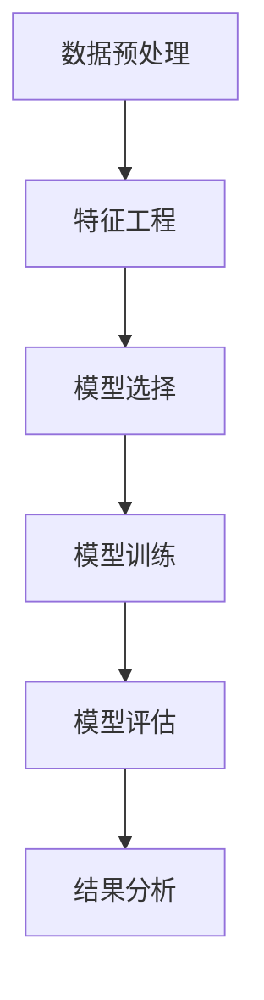
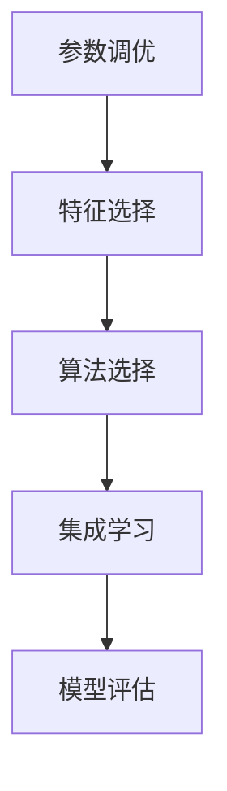
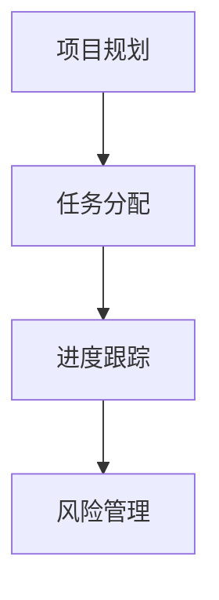
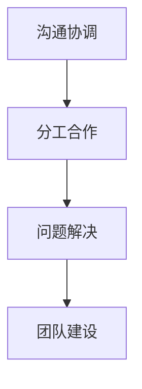

                 

### 文章标题

# 《成为小领域专家的路径》

### 关键词

- 小领域专家
- 技术路径
- 技能提升
- 个人品牌建设
- 行业动态

### 摘要

本文旨在探讨成为小领域专家的路径，通过分析市场需求、技能储备、深入学习、实践应用、个人品牌建设、合作拓展和持续成长等环节，为技术从业者提供一套系统性的指导方案。文章不仅涉及理论知识，还包括实际案例和代码解读，旨在帮助读者从小领域入手，逐步提升自己的专业能力和市场竞争力。

----------------------------------------------------------------

### 《成为小领域专家的路径》目录大纲

**本文采用Markdown格式书写，以下为文章各部分的目录结构：**

---

#### 前言

- **文章背景**
- **目标读者**
- **文章结构**

---

#### 第一部分：成为小领域专家的路径概述

##### 第1章：成为小领域专家的必要性

- **1.1 小领域专家的市场需求**
- **1.2 小领域专家的职业优势**
- **1.3 小领域专家的发展路径**
  
##### 第2章：选定小领域

- **2.1 如何选择合适的小领域**
- **2.2 小领域研究现状分析**
- **2.3 小领域发展趋势预测**

---

#### 第二部分：技能储备与提升

##### 第3章：基础知识与技能储备

- **3.1 小领域相关基础知识**
- **3.2 常用工具与技术栈**
- **3.3 专业术语与概念解析**

##### 第4章：深入学习与技能提升

- **4.1 深度学习与数据分析**
- **4.2 机器学习与算法优化**
- **4.3 项目管理与团队协作**

##### 第5章：实践与应用

- **5.1 实践项目规划与执行**
- **5.2 项目案例分析与解读**
- **5.3 实践中的问题与解决策略**

---

#### 第三部分：建立个人品牌与拓展

##### 第6章：个人品牌建设

- **6.1 个人品牌定位与塑造**
- **6.2 内容创作与传播**
- **6.3 社交媒体与网络营销**

##### 第7章：拓展合作与机会

- **7.1 建立合作网络**
- **7.2 拓展业务领域**
- **7.3 投资与创业机会分析**

##### 第8章：持续成长与迭代

- **8.1 行业动态与趋势追踪**
- **8.2 自我评估与改进**
- **8.3 持续学习与知识管理**

---

#### 附录

##### 附录A：参考资源与工具集

- **A.1 学术资源**
- **A.2 在线课程与培训**
- **A.3 专业社区与论坛**

---

### 本文结构说明

本文分为三个主要部分：

1. **成为小领域专家的路径概述**：介绍成为小领域专家的必要性、如何选定小领域以及小领域的发展趋势。
2. **技能储备与提升**：详细讲解基础知识、深入学习与技能提升以及实践应用的方法和技巧。
3. **建立个人品牌与拓展**：包括个人品牌建设、拓展合作与机会以及持续成长与迭代。

每部分内容都通过具体章节进行深入探讨，提供实用的指导和建议。文章末尾还附录了参考资源与工具集，方便读者进一步学习和应用。

---

#### 第1章：成为小领域专家的必要性

在当今快速发展的信息技术时代，成为一名小领域专家成为越来越多技术从业者的追求。这不仅是因为小领域专家具有更高的专业水平和市场竞争力，还因为他们能够在特定的技术领域内发挥更大的影响力。本文将探讨成为小领域专家的必要性，分析市场需求、职业优势以及发展路径，为读者提供一套系统性的指导。

### 1.1 小领域专家的市场需求

随着技术的不断进步和应用的广泛普及，各行业对专业技术人才的需求日益增加。然而，传统的“大而全”的综合性人才已经无法满足市场的高标准需求。相反，小领域专家因其专业性和深度，成为各大企业和研究机构争相追逐的对象。以下是几个方面的小领域专家市场需求分析：

1. **技术进步推动专业细分**：随着信息技术的发展，各个技术领域逐渐细分，新的技术和应用不断涌现。为了应对这些变化，企业需要具备特定技术背景的专家来解决问题和推动创新。

2. **行业应用深度要求**：许多行业对技术的应用要求越来越高，不仅需要了解基本的技术原理，还需要深入掌握特定技术的应用细节。例如，在人工智能领域，企业需要专家来优化算法、设计模型和进行实际应用。

3. **市场需求增长**：随着互联网、大数据、云计算等技术的普及，许多传统行业开始数字化转型。这一趋势带来了大量的技术需求，特别是对具备特定技能的小领域专家的需求。

4. **就业前景光明**：小领域专家因其专业性和稀缺性，通常拥有更高的薪资待遇和更广阔的职业发展空间。此外，小领域专家在创业和投资方面也有更多的机会。

### 1.2 小领域专家的职业优势

小领域专家在职业生涯中具有许多优势，这些优势不仅体现在薪资待遇上，还包括职业发展机会和个人成就感。以下是小领域专家的一些职业优势：

1. **专业深度**：小领域专家在对特定技术的深入了解和掌握上具有优势，能够快速识别和解决复杂问题。这种专业深度使得他们在项目执行和问题解决中具有更高的效率和效果。

2. **高效产出**：由于专注于特定领域，小领域专家能够更快速地掌握新技术和工具，从而提高工作效率和产出质量。这种高效性在项目管理和团队合作中尤为重要。

3. **高收入潜力**：小领域专家因其专业能力和稀缺性，通常能够获得更高的薪资待遇。特别是在一些高技术含量的领域，如人工智能、大数据分析和区块链技术，专家的薪资水平往往远高于平均水平。

4. **职业稳定性**：随着技术的不断进步和应用领域的扩展，小领域专家的职业发展空间较大。他们不仅可以在企业中找到合适的位置，还可以在科研机构、高校和咨询公司等不同的职业道路上发展。

5. **创业和投资机会**：小领域专家由于对特定领域有深刻的了解，更容易发现市场需求和商业机会。他们可以在创业和投资方面发挥自己的专业优势，实现更大的职业价值。

### 1.3 小领域专家的发展路径

成为小领域专家并不是一蹴而就的，而是一个持续学习和积累的过程。以下是小领域专家的发展路径，供读者参考：

#### 1.3.1 入门阶段

- **学习基础知识**：初学者需要从基础知识入手，掌握小领域的基本概念、原理和技术框架。通过阅读相关书籍、论文和在线课程，建立扎实的理论基础。

- **技能储备**：入门阶段还需掌握一些基本的编程语言和工具，如Python、Java或C++等，以及数据库、网络编程等关键技术。这些技能将帮助初学者更好地理解和应用小领域的技术。

- **实践应用**：通过参与项目实践，初学者可以将所学知识应用到实际场景中，解决实际问题。实践是检验学习成果的重要方式，能够帮助初学者快速提升技能。

#### 1.3.2 进阶阶段

- **深入学习**：在入门阶段的基础上，进阶阶段的专家需要更深入地学习小领域的前沿技术和研究动态。这包括参加学术会议、阅读专业期刊和与领域内的专家交流。

- **优化解决方案**：进阶阶段的专家需要在项目实践中不断优化解决方案，提高项目的质量和效率。他们需要掌握更多的优化策略和算法，以应对复杂的问题。

- **参与学术交流**：进阶阶段的专家可以开始参与学术交流，如发表论文、参加研讨会和学术会议。通过学术交流，专家可以扩展自己的学术视野，结识更多的同行。

#### 1.3.3 专家阶段

- **建立个人品牌**：在专家阶段，专家需要开始建立个人品牌，提升自己的知名度。这包括撰写高质量的技术博客、发表专业书籍和参加技术讲座。

- **影响力拓展**：专家可以通过在各种技术社区和论坛上发表见解，参与开源项目，以及在社交媒体上分享知识，扩大自己的影响力。

- **指导后继者**：成为专家后，可以开始指导后继者，培养新一代的技术人才。通过教学和培训，专家不仅能够传承自己的知识，还能够推动整个领域的发展。

### 小结

成为小领域专家是一个需要长期积累和不断学习的过程。市场需求、职业优势和发展路径为技术从业者提供了明确的指引。通过遵循上述路径，技术从业者可以逐步提升自己的专业能力和市场竞争力，最终成为一名优秀的小领域专家。

---

#### 第2章：选定小领域

在成为小领域专家的过程中，选定合适的小领域是至关重要的。这不仅关系到个人的兴趣和专长，还关系到市场需求和发展潜力。本章将探讨如何选择合适的小领域，分析当前的研究现状和未来发展趋势。

### 2.1 如何选择合适的小领域

选择合适的小领域是成为一名小领域专家的第一步。以下是一些关键因素，帮助您做出明智的选择：

#### 2.1.1 个人兴趣与专长

- **兴趣**：选择自己感兴趣的小领域可以增加学习的动力和乐趣。兴趣是最好的老师，只有对某个领域有浓厚的兴趣，才能持之以恒地学习和研究。

- **专长**：根据自己的专长选择小领域，可以更好地发挥自己的优势。例如，如果您在计算机科学和数学方面有深厚的背景，可以考虑进入人工智能或数据分析领域。

#### 2.1.2 市场需求

- **行业应用**：选择有广泛应用场景的小领域，可以保证在就业市场上有更多的机会。例如，随着物联网和智能制造的发展，嵌入式系统和工业自动化成为热门领域。

- **就业前景**：选择就业前景光明的小领域，可以确保自己的职业发展有稳定的保障。例如，区块链技术、大数据分析等领域在未来几年预计会有大量的人才需求。

#### 2.1.3 资源与支持

- **学术资源**：选择有丰富学术资源的小领域，可以更容易地进行深入研究。例如，计算机视觉和自然语言处理等领域有大量的研究论文和学术会议。

- **技术支持**：选择有强大技术支持的小领域，可以更快地掌握和应用相关技术。例如，机器学习和深度学习领域有大量的开源框架和工具，如TensorFlow和PyTorch。

### 2.2 小领域研究现状分析

在选定小领域后，了解该领域的研究现状和进展情况是非常必要的。以下是一些分析方法和工具：

#### 2.2.1 文献综述

- **查阅文献**：通过查阅学术期刊、会议论文和专著，了解该领域的研究历史和最新进展。

- **整理总结**：对所查阅的文献进行分类整理，总结出领域内的关键概念、理论框架和研究方法。

- **形成观点**：通过对文献的分析，形成自己的观点和见解，为后续的研究提供参考。

#### 2.2.2 技术演进

- **跟踪技术动态**：通过关注技术博客、专业论坛和新闻媒体，了解该领域最新的技术发展和应用案例。

- **分析技术演变**：从技术的起源、发展过程和未来趋势，分析该领域的演进路径和技术趋势。

- **预测技术发展**：基于现有技术和应用案例，预测该领域未来的发展方向和技术突破点。

### 2.3 小领域发展趋势预测

预测小领域的发展趋势对于成为专家具有重要意义。以下是一些预测方法和策略：

#### 2.3.1 预测方法

- **数据分析**：通过收集和整理历史数据，运用统计学方法和数据挖掘技术，分析小领域的发展趋势。

- **趋势分析**：从技术、市场、政策等多个角度，分析小领域的未来发展方向和机会。

- **专家咨询**：邀请领域内的专家和学者，通过访谈和问卷调查等方式，获取他们的观点和建议。

- **预测模型建立**：利用机器学习和人工智能技术，建立预测模型，预测小领域的发展趋势。

#### 2.3.2 未来趋势

- **技术进步**：随着技术的不断进步，小领域可能会出现新的技术突破和应用场景。

- **市场需求**：随着市场需求的增加，小领域可能会迎来更多的应用机会和商业价值。

- **行业应用**：新的行业应用可能会推动小领域的发展，例如物联网、智慧城市和智能制造等领域。

- **新兴领域**：可能会出现一些新兴的小领域，例如量子计算、生物信息学和元宇宙等。

### 小结

选择合适的小领域是成为小领域专家的关键步骤。通过结合个人兴趣与专长、分析市场需求和资源支持，可以找到最适合自己的发展方向。同时，了解领域的研究现状和未来趋势，可以为自己的研究和职业规划提供有力支持。通过不断学习和实践，逐步提升自己的专业能力和市场竞争力，最终成为一名优秀的小领域专家。

---

#### 第3章：基础知识与技能储备

成为小领域专家需要扎实的理论基础和广泛的技能储备。本章将详细阐述在小领域内所需的基础知识、常用工具和技术栈，帮助读者为深入学习打下坚实基础。

### 3.1 小领域相关基础知识

在小领域内，基础知识是理解和应用高级技术的前提。以下是一些关键的基础知识：

#### 3.1.1 基本概念

- **核心理论**：理解小领域内的核心理论，例如在人工智能领域，需要掌握机器学习、深度学习和神经网络的基本概念。
- **专业术语**：熟悉并理解专业术语，以便在学习和交流中准确表达。

#### 3.1.2 理论框架

- **体系结构**：了解小领域的技术体系结构，例如在计算机视觉领域，需要掌握图像处理、特征提取和目标检测的基本框架。
- **核心算法**：掌握核心算法的原理和实现，例如在自然语言处理领域，需要理解词向量模型和序列模型的基本算法。

### 3.2 常用工具与技术栈

在小领域的研究和开发中，使用合适的工具和技术栈可以显著提高工作效率和项目质量。以下是一些常用的工具和技术：

#### 3.2.1 工具选择

- **编程语言**：选择适合小领域的编程语言，例如Python在数据分析、机器学习和深度学习领域广泛使用，而C++在嵌入式系统和性能优化方面有优势。
- **开发环境**：配置适合的开发环境，例如在机器学习领域，通常会使用Jupyter Notebook作为数据分析和模型训练的工具。
- **数据库与存储**：选择合适的数据库和存储方案，例如关系数据库（如MySQL）和非关系数据库（如MongoDB），以及分布式文件系统（如HDFS）。

#### 3.2.2 技术栈构建

- **核心框架**：构建核心技术栈，例如在Web开发中，通常会使用前端框架（如React或Vue.js）和后端框架（如Django或Spring Boot）。
- **中间件**：选择中间件来增强系统的功能，例如消息队列（如RabbitMQ）、缓存系统（如Redis）和搜索引擎（如Elasticsearch）。
- **云服务**：利用云服务进行开发和部署，例如AWS、Azure和Google Cloud提供丰富的云服务，包括计算、存储、数据库和机器学习服务。

### 3.3 专业术语与概念解析

专业术语和概念是小领域研究的重要组成部分，准确理解这些术语对于深入学习和交流至关重要。以下是一些常见的专业术语和概念：

#### 3.3.1 术语解释

- **机器学习**：一种人工智能的分支，通过算法让计算机从数据中学习并做出决策。
- **深度学习**：一种基于多层神经网络的学习方法，可以自动从数据中提取特征。
- **自然语言处理**：研究如何使计算机理解和处理自然语言的技术。

#### 3.3.2 案例应用

通过具体案例来展示专业术语和概念的实际应用：

- **案例**：在图像识别任务中，深度学习模型可以从大量图像数据中自动学习特征，实现对新图像的分类和识别。
- **案例**：在文本分析任务中，自然语言处理技术可以提取关键词、语义分析和情感分析，用于信息检索和用户行为分析。

### 小结

基础知识与技能储备是成为小领域专家的基石。通过掌握基本概念、理论框架和核心算法，以及选择合适的工具和技术栈，读者可以建立扎实的技术基础，为深入学习打下坚实基础。同时，准确理解专业术语和概念，有助于提升学术研究和项目开发的质量。持续学习和实践，将使读者在小领域内不断进步，成为真正的专家。

---

#### 第4章：深入学习与技能提升

在小领域内，只有通过深入学习与技能提升，才能从一名普通的从业者成长为一名专家。本章将详细探讨深度学习与数据分析、机器学习与算法优化、项目管理与团队协作等方面，帮助读者在小领域内实现专业能力的提升。

### 4.1 深度学习与数据分析

深度学习和数据分析是当前信息技术领域的重要研究方向，掌握这些技术对于成为小领域专家至关重要。

#### 4.1.1 深度学习原理

深度学习是一种基于多层神经网络的学习方法，能够自动从数据中提取特征。以下是深度学习的基本原理：

- **神经网络**：神经网络由多个神经元（节点）组成，每个神经元接收多个输入，通过激活函数产生输出。
- **前向传播**：在深度学习模型中，数据从输入层传递到输出层，每个神经元计算输入和权重之积，并通过激活函数产生输出。
- **反向传播**：计算输出与实际结果之间的误差，将误差反向传播到每个神经元，更新权重和偏置。

以下是一个简单的深度学习模型的伪代码：

```python
# 伪代码：简单深度学习模型
class NeuralNetwork:
    def __init__(self):
        # 初始化神经网络结构
        pass
    
    def forward(self, x):
        # 前向传播
        pass
    
    def backward(self, output, expected):
        # 反向传播
        pass
    
    def train(self, x, y):
        # 训练模型
        pass

nn = NeuralNetwork()
nn.train(x, y)
```

#### 4.1.2 数据分析方法

数据分析是深度学习和机器学习的基础，以下是一些常用的数据分析方法：

- **数据预处理**：包括数据清洗、缺失值处理、数据转换等步骤，确保数据质量。
- **特征工程**：通过特征选择和特征转换，提取对模型有用的特征，提高模型的性能。
- **模型选择**：根据问题的性质和数据特点，选择合适的机器学习模型。
- **模型训练**：使用训练数据对模型进行训练，调整模型的参数。
- **模型评估**：使用验证数据评估模型的性能，选择最佳的模型。

以下是一个简单的数据分析流程：



### 4.2 机器学习与算法优化

机器学习是人工智能的核心技术，算法优化是提升模型性能的关键。

#### 4.2.1 机器学习算法

机器学习算法包括监督学习、无监督学习和强化学习等不同类型。以下是一些常见的机器学习算法：

- **监督学习**：包括线性回归、逻辑回归、决策树、随机森林和神经网络等。
- **无监督学习**：包括聚类、降维、关联规则挖掘等。
- **强化学习**：包括Q学习、SARSA和Deep Q Network等。

以下是一个简单的监督学习算法——线性回归的伪代码：

```python
# 伪代码：线性回归
class LinearRegression:
    def __init__(self):
        # 初始化模型参数
        pass
    
    def fit(self, x, y):
        # 模型训练
        pass
    
    def predict(self, x):
        # 预测
        pass

lr = LinearRegression()
lr.fit(x, y)
predictions = lr.predict(x)
```

#### 4.2.2 算法优化策略

算法优化是提升模型性能的重要手段，以下是一些常用的优化策略：

- **参数调优**：通过调整模型的超参数，如学习率、正则化参数等，提高模型性能。
- **特征选择**：通过选择对模型有显著影响的特征，减少数据维度，提高模型效率。
- **算法选择**：根据问题的特点和数据规模，选择合适的算法，如支持向量机、决策树、神经网络等。
- **集成学习**：通过结合多个模型的预测结果，提高模型的稳定性和准确性。

以下是一个简单的算法优化流程：



### 4.3 项目管理与团队协作

项目管理与团队协作是确保项目成功的关键，以下是一些关键点：

#### 4.3.1 项目管理知识

- **项目规划**：明确项目的目标和任务，制定详细的项目计划。
- **任务分配**：根据团队成员的能力和专长，合理分配任务。
- **进度跟踪**：监控项目进度，及时调整计划，确保项目按时完成。
- **风险管理**：识别和评估项目风险，制定应对措施。

以下是一个简单的项目管理流程：



#### 4.3.2 团队协作技巧

- **沟通协调**：确保团队成员之间信息畅通，减少误解和冲突。
- **分工合作**：明确团队成员的职责和任务，提高团队工作效率。
- **问题解决**：及时解决团队遇到的问题，确保项目顺利进行。
- **团队建设**：通过团队活动增强团队凝聚力，提高团队士气。

以下是一个简单的团队协作流程：



### 小结

深入学习与技能提升是成为小领域专家的重要环节。通过掌握深度学习与数据分析、机器学习与算法优化以及项目管理与团队协作的知识和技能，读者可以提升自己的专业能力，在小领域内实现更大的突破。不断学习和实践，将使读者在小领域内不断进步，成为真正的专家。

---

#### 第5章：实践与应用

理论知识只有通过实践才能得到验证和巩固。本章将详细介绍实践项目规划与执行、项目案例分析与解读以及实践中的问题与解决策略，帮助读者将所学知识应用于实际项目，提升解决实际问题的能力。

### 5.1 实践项目规划与执行

项目的成功规划与执行是成为小领域专家的重要步骤。以下是一个典型的项目规划与执行流程：

#### 5.1.1 项目规划

1. **需求分析**：明确项目的目标和需求，确定项目范围和交付成果。
   ```mermaid
   graph TD
       A[需求收集] --> B[需求分析]
       B --> C[需求确认]
   ```

2. **目标设定**：根据需求分析，设定项目的具体目标和里程碑。
   ```mermaid
   graph TD
       A[目标设定] --> B[里程碑规划]
   ```

3. **资源调配**：评估项目所需的资源，包括人力、技术和资金，并制定资源分配计划。
   ```mermaid
   graph TD
       A[资源评估] --> B[资源分配]
   ```

4. **时间规划**：制定详细的项目时间表，包括关键任务和时间节点。
   ```mermaid
   graph TD
       A[时间规划] --> B[时间节点设定]
   ```

#### 5.1.2 项目执行

1. **任务分解**：将项目目标分解为具体任务，并为每个任务分配责任人。
   ```mermaid
   graph TD
       A[任务分解] --> B[任务分配]
   ```

2. **进度监控**：定期跟踪项目进度，确保任务按时完成。
   ```mermaid
   graph TD
       A[进度监控] --> B[问题识别]
   ```

3. **团队协作**：促进团队成员之间的沟通与协作，确保项目顺利进行。
   ```mermaid
   graph TD
       A[团队协作] --> B[任务协调]
   ```

4. **问题处理**：及时解决项目中出现的问题，避免影响项目进度和质量。
   ```mermaid
   graph TD
       A[问题处理] --> B[问题解决]
   ```

### 5.2 项目案例分析与解读

通过分析实际项目案例，可以深入了解项目规划与执行的具体细节，并学习如何应对各种挑战。以下是一个简单的项目案例分析：

#### 5.2.1 案例选取

选取一个具体的项目案例，如开发一个基于深度学习的图像识别系统。

#### 5.2.2 案例分析

1. **数据收集**：收集大量图像数据，并进行数据预处理，如图像增强、缩放和归一化。

2. **模型选择**：根据图像识别任务的特点，选择合适的深度学习模型，如卷积神经网络（CNN）。

3. **模型训练**：使用训练数据对模型进行训练，调整模型参数，如学习率、批次大小等。

4. **模型评估**：使用验证数据评估模型性能，如准确率、召回率和F1分数。

5. **结果分析**：分析模型在测试数据上的表现，确定是否需要进一步优化。

### 5.3 实践中的问题与解决策略

在实际项目实践中，不可避免会遇到各种问题。以下是一些常见的问题及解决策略：

#### 5.3.1 问题识别

1. **数据质量问题**：数据不足、不完整或噪声大，影响模型训练效果。
   - **解决策略**：使用数据增强技术，如旋转、翻转和裁剪，增加数据多样性。

2. **模型过拟合**：模型在训练数据上表现良好，但在测试数据上表现不佳。
   - **解决策略**：使用正则化技术，如L1和L2正则化，降低模型复杂度。

3. **计算资源不足**：训练大规模模型需要大量计算资源。
   - **解决策略**：使用分布式计算和云计算资源，如GPU加速和Amazon S3存储。

#### 5.3.2 解决策略

1. **问题分析**：详细分析问题原因，确定解决方案。
   ```mermaid
   graph TD
       A[问题识别] --> B[原因分析]
   ```

2. **方案实施**：制定详细的解决方案，并实施。
   ```mermaid
   graph TD
       B --> C[方案实施]
   ```

3. **效果验证**：验证解决方案的有效性，确保问题得到解决。
   ```mermaid
   graph TD
       C --> D[效果验证]
   ```

### 小结

实践是检验理论的唯一标准。通过项目规划与执行、案例分析以及问题解决，读者可以提升自己的项目管理和实践能力。不断积累实践经验，将使读者在小领域内更加游刃有余，成为一名真正的专家。

---

#### 第6章：个人品牌建设

在小领域内建立个人品牌是提升知名度和影响力的关键步骤。通过有效的个人品牌建设，专家可以在行业内获得更多的机会和资源。本章将探讨如何定位个人品牌、创作高质量内容以及利用社交媒体进行传播。

### 6.1 个人品牌定位与塑造

个人品牌定位是建立个人品牌的第一步，需要明确以下几个方面：

#### 6.1.1 个人品牌定位

1. **目标市场**：确定个人品牌的目标受众，如行业领域、技能水平和企业类型。
   ```mermaid
   graph TD
       A[目标市场] --> B[受众分析]
   ```

2. **品牌个性**：塑造独特的品牌个性，如技术深度、创新精神和沟通能力。
   ```mermaid
   graph TD
       A --> B[品牌个性]
   ```

3. **核心价值**：明确个人品牌的核心价值观，如专业、诚信和客户至上。
   ```mermaid
   graph TD
       A --> C[核心价值]
   ```

#### 6.1.2 品牌塑造

1. **内容创作**：创作高质量的内容，如技术博客、书籍和演讲。
   ```mermaid
   graph TD
       C --> D[内容创作]
   ```

2. **传播渠道**：选择合适的传播渠道，如社交媒体、技术社区和行业会议。
   ```mermaid
   graph TD
       D --> E[传播渠道]
   ```

3. **互动管理**：与受众建立互动，如回复评论、组织线上研讨会和参加技术交流活动。
   ```mermaid
   graph TD
       E --> F[互动管理]
   ```

### 6.2 内容创作与传播

高质量的内容是个人品牌建设的基石。以下是一些内容创作与传播的技巧：

#### 6.2.1 内容创作

1. **选题策划**：选择具有吸引力和实用性的话题，如行业热点、技术趋势和案例分析。
   ```mermaid
   graph TD
       D --> G[选题策划]
   ```

2. **内容撰写**：撰写清晰、有逻辑和富有洞察力的文章，确保内容的可读性和专业性。
   ```mermaid
   graph TD
       G --> H[内容撰写]
   ```

3. **内容优化**：优化内容的结构、格式和语言，提高内容的传播效果。
   ```mermaid
   graph TD
       H --> I[内容优化]
   ```

#### 6.2.2 内容传播

1. **渠道选择**：选择适合内容传播的渠道，如微博、微信公众号、LinkedIn和GitHub。
   ```mermaid
   graph TD
       E --> J[渠道选择]
   ```

2. **内容发布**：定期发布内容，保持与受众的互动，提高品牌的曝光度。
   ```mermaid
   graph TD
       J --> K[内容发布]
   ```

3. **互动管理**：积极回复评论和反馈，建立良好的口碑和粉丝群体。
   ```mermaid
   graph TD
       K --> L[互动管理]
   ```

4. **数据分析**：通过数据分析，了解内容的传播效果和受众反馈，不断优化内容创作和传播策略。
   ```mermaid
   graph TD
       L --> M[数据分析]
   ```

### 6.3 社交媒体与网络营销

社交媒体是个人品牌传播的重要工具。以下是一些社交媒体与网络营销的策略：

#### 6.3.1 社交媒体运用

1. **账号管理**：创建和管理专业的社交媒体账号，如Twitter、LinkedIn和Instagram。
   ```mermaid
   graph TD
       L --> N[账号管理]
   ```

2. **内容发布**：定期发布高质量的内容，保持与受众的互动，提高品牌的曝光度。
   ```mermaid
   graph TD
       N --> O[内容发布]
   ```

3. **互动管理**：积极回复评论和反馈，参与话题讨论和互动，建立良好的社交媒体形象。
   ```mermaid
   graph TD
       O --> P[互动管理]
   ```

4. **数据分析**：通过数据分析，了解社交媒体的表现和受众行为，优化内容策略和推广方式。
   ```mermaid
   graph TD
       P --> Q[数据分析]
   ```

#### 6.3.2 网络营销策略

1. **市场调研**：了解目标市场的需求和偏好，制定有效的网络营销策略。
   ```mermaid
   graph TD
       M --> R[市场调研]
   ```

2. **目标定位**：明确网络营销的目标，如提高品牌知名度、增加粉丝数量和提升销售业绩。
   ```mermaid
   graph TD
       R --> S[目标定位]
   ```

3. **渠道选择**：选择适合目标市场的网络营销渠道，如搜索引擎优化（SEO）、社交媒体广告和电子邮件营销。
   ```mermaid
   graph TD
       S --> T[渠道选择]
   ```

4. **效果评估**：通过效果评估，了解网络营销活动的效果，不断优化和调整策略。
   ```mermaid
   graph TD
       T --> U[效果评估]
   ```

### 小结

个人品牌建设是提升个人影响力和市场竞争力的重要途径。通过明确个人品牌定位、创作高质量内容和利用社交媒体进行传播，专家可以建立强大的个人品牌，获得更多的机会和资源。不断优化内容和传播策略，将有助于个人品牌的长期发展。

---

#### 第7章：拓展合作与机会

在小领域内建立个人品牌后，拓展合作与机会成为进一步提升职业发展和影响力的关键步骤。本章将讨论如何建立合作网络、拓展业务领域以及分析和把握投资与创业机会。

### 7.1 建立合作网络

建立合作网络是拓展职业发展和影响力的重要手段。以下是一些关键步骤：

#### 7.1.1 合作网络建设

1. **确定合作目标**：明确合作的意图和目标，如寻找合作伙伴、客户资源或投资机会。
   ```mermaid
   graph TD
       A[合作目标] --> B[目标确定]
   ```

2. **资源整合**：整合个人和团队的优势资源，如技术、知识和人脉。
   ```mermaid
   graph TD
       B --> C[资源整合]
   ```

3. **关系维护**：通过定期沟通和互动，维护和深化与合作伙伴的关系。
   ```mermaid
   graph TD
       C --> D[关系维护]
   ```

4. **合作共赢**：寻找合作机会，实现合作双方的共赢，建立长期稳定的合作关系。
   ```mermaid
   graph TD
       D --> E[合作共赢]
   ```

#### 7.1.2 人际关系管理

1. **沟通技巧**：提升沟通技巧，确保信息传达准确和有效。
   ```mermaid
   graph TD
       E --> F[沟通技巧]
   ```

2. **信任建立**：通过诚信和合作，建立与合作伙伴的信任关系。
   ```mermaid
   graph TD
       F --> G[信任建立]
   ```

3. **冲突处理**：学会处理合作中的冲突，避免关系破裂。
   ```mermaid
   graph TD
       G --> H[冲突处理]
   ```

### 7.2 拓展业务领域

拓展业务领域是提升职业发展空间和增加收入的重要途径。以下是一些关键步骤：

#### 7.2.1 业务领域拓展

1. **市场分析**：分析目标市场的需求和竞争态势，确定拓展方向。
   ```mermaid
   graph TD
       I[市场分析] --> J[目标市场]
   ```

2. **战略规划**：制定详细的战略规划，包括市场定位、产品开发和营销策略。
   ```mermaid
   graph TD
       J --> K[战略规划]
   ```

3. **资源调配**：根据战略规划，合理调配资源，如人力、技术和资金。
   ```mermaid
   graph TD
       K --> L[资源调配]
   ```

4. **业务布局**：进行业务布局，包括市场拓展、产品推广和客户关系管理。
   ```mermaid
   graph TD
       L --> M[业务布局]
   ```

### 7.3 投资与创业机会分析

投资与创业是拓展职业发展的重要途径，以下是一些关键步骤：

#### 7.3.1 投资机会

1. **市场调研**：通过市场调研，识别潜在的投资机会和风险。
   ```mermaid
   graph TD
       N[市场调研] --> O[投资机会]
   ```

2. **投资评估**：对潜在的投资机会进行详细评估，包括财务分析、技术评估和风险控制。
   ```mermaid
   graph TD
       O --> P[投资评估]
   ```

3. **风险控制**：制定风险控制策略，降低投资风险，确保投资的安全性和收益性。
   ```mermaid
   graph TD
       P --> Q[风险控制]
   ```

4. **投资决策**：根据投资评估结果，做出投资决策，并跟踪投资表现。
   ```mermaid
   graph TD
       Q --> R[投资决策]
   ```

#### 7.3.2 创业机会

1. **市场调研**：通过市场调研，了解目标市场的需求和竞争态势。
   ```mermaid
   graph TD
       S[市场调研] --> T[商业机会]
   ```

2. **商业模型**：构建清晰的商业模型，包括产品定位、市场策略和盈利模式。
   ```mermaid
   graph TD
       T --> U[商业模型]
   ```

3. **团队组建**：组建高效的创业团队，确保团队成员具备相关技能和经验。
   ```mermaid
   graph TD
       U --> V[团队组建]
   ```

4. **运营管理**：制定详细的运营管理计划，确保创业项目的顺利推进。
   ```mermaid
   graph TD
       V --> W[运营管理]
   ```

### 小结

拓展合作与机会是提升职业发展和影响力的关键步骤。通过建立合作网络、拓展业务领域以及分析和把握投资与创业机会，专家可以进一步扩大自己的职业发展空间，实现更大的职业成就。不断学习和实践，将有助于专家在行业内取得更大的成功。

---

#### 第8章：持续成长与迭代

在小领域内成为专家并非终点，持续成长与迭代是保持竞争力、应对技术变革和实现职业发展的关键。本章将讨论如何追踪行业动态与趋势、进行自我评估与改进，以及持续学习和知识管理。

### 8.1 行业动态与趋势追踪

了解行业动态和趋势是保持竞争力的重要手段。以下是一些追踪方法：

#### 8.1.1 行业动态

1. **市场调研**：定期进行市场调研，收集和分析行业数据，了解市场需求和技术趋势。
   ```mermaid
   graph TD
       A[市场调研] --> B[数据收集]
   ```

2. **技术动态**：关注技术博客、学术期刊和专业论坛，了解最新的技术进展和应用案例。
   ```mermaid
   graph TD
       B --> C[技术动态]
   ```

3. **竞争态势**：分析竞争对手的产品、技术和市场策略，了解行业竞争格局。
   ```mermaid
   graph TD
       C --> D[竞争态势]
   ```

4. **政策法规**：关注行业相关的政策法规，了解政策对行业的影响。
   ```mermaid
   graph TD
       D --> E[政策法规]
   ```

#### 8.1.2 趋势分析

1. **数据分析**：运用数据分析方法，如数据挖掘和机器学习，分析行业趋势和未来发展方向。
   ```mermaid
   graph TD
       E --> F[数据分析]
   ```

2. **专家咨询**：与行业内的专家进行交流和咨询，获取专业的见解和建议。
   ```mermaid
   graph TD
       F --> G[专家咨询]
   ```

3. **趋势预测**：基于历史数据和专家意见，预测行业未来的发展趋势。
   ```mermaid
   graph TD
       G --> H[趋势预测]
   ```

### 8.2 自我评估与改进

自我评估是提升个人能力和职业素养的重要步骤。以下是一些自我评估的方法和改进策略：

#### 8.2.1 自我评估方法

1. **能力评估**：定期评估自己的专业技能、知识水平和综合素质。
   ```mermaid
   graph TD
       I[能力评估] --> J[技能评估]
   ```

2. **知识评估**：评估自己在专业领域的知识掌握程度和持续学习的能力。
   ```mermaid
   graph TD
       J --> K[知识评估]
   ```

3. **绩效评估**：评估自己在项目和工作中的表现和成果。
   ```mermaid
   graph TD
       K --> L[绩效评估]
   ```

#### 8.2.2 改进策略

1. **问题识别**：通过自我评估，识别自己在技能、知识和绩效方面的不足。
   ```mermaid
   graph TD
       L --> M[问题识别]
   ```

2. **解决方案**：制定具体的解决方案，如参加培训、阅读书籍或参与项目实践。
   ```mermaid
   graph TD
       M --> N[解决方案]
   ```

3. **实施计划**：制定详细的实施计划，确保改进措施的落实和效果。
   ```mermaid
   graph TD
       N --> O[实施计划]
   ```

4. **效果评估**：定期评估改进措施的效果，及时调整和优化改进策略。
   ```mermaid
   graph TD
       O --> P[效果评估]
   ```

### 8.3 持续学习与知识管理

持续学习是保持专业竞争力的关键。以下是一些学习方法和知识管理策略：

#### 8.3.1 学习方法

1. **主动学习**：主动寻找学习机会，如参加培训、研讨会和线上课程。
   ```mermaid
   graph TD
       Q[主动学习] --> R[学习机会]
   ```

2. **合作学习**：与同行和专家合作学习，通过交流和合作提升自己的能力。
   ```mermaid
   graph TD
       R --> S[合作学习]
   ```

3. **反思学习**：通过反思和总结学习过程，巩固所学知识和技能。
   ```mermaid
   graph TD
       S --> T[反思学习]
   ```

#### 8.3.2 知识管理

1. **知识收集**：定期收集和整理专业领域的知识和资料，建立自己的知识库。
   ```mermaid
   graph TD
       U[知识收集] --> V[知识整理]
   ```

2. **知识整理**：对收集的知识进行分类、归纳和整理，确保知识的系统性和完整性。
   ```mermaid
   graph TD
       V --> W[知识应用]
   ```

3. **知识共享**：通过分享知识和经验，促进知识的传播和共享，提升自己的影响力。
   ```mermaid
   graph TD
       W --> X[知识共享]
   ```

4. **知识应用**：将所学知识应用到实际工作中，解决实际问题，提升自己的实践能力。
   ```mermaid
   graph TD
       X --> Y[知识应用]
   ```

### 小结

持续成长与迭代是成为小领域专家的关键。通过追踪行业动态与趋势、进行自我评估与改进，以及持续学习和知识管理，专家可以不断提升自己的专业能力和市场竞争力。保持学习和进步的态度，将使专家在快速变化的技术环境中始终保持领先地位。

---

#### 附录A：参考资源与工具集

在小领域内成为专家的过程中，参考资源和工具集是不可或缺的。以下是一些重要的学术资源、在线课程与培训、专业社区与论坛，以及相关工具和平台，供读者参考和使用。

### A.1 学术资源

1. **主要学术期刊**：
   - *Journal of Machine Learning Research*（JMLR）
   - *Nature Machine Intelligence*（NMI）
   - *IEEE Transactions on Neural Networks and Learning Systems*（TNNLS）

2. **学术会议**：
   - *NeurIPS*（神经信息处理系统大会）
   - *ICML*（国际机器学习大会）
   - *CVPR*（计算机视觉与模式识别会议）

3. **学术报告与论文**：通过学术期刊和会议获取最新的研究动态和成果，提升专业素养。

### A.2 在线课程与培训

1. **Coursera**：提供多种计算机科学和人工智能课程，如“Deep Learning Specialization”和“Machine Learning”。
2. **edX**：由哈佛大学和麻省理工学院合作创立，提供高质量的课程，如“Artificial Intelligence”和“Data Science”。
3. **Udacity**：专注于实践导向的课程，包括“Applied Data Science”和“Deep Learning”。

### A.3 专业社区与论坛

1. **Stack Overflow**：程序员问答社区，适合解决编程和技术问题。
2. **GitHub**：代码托管和协作平台，可以获取和贡献开源项目。
3. **Reddit**：包含多个技术子版块，如/r/MachineLearning和/r/Python，供技术交流。

### A.4 工具和平台

1. **编程语言**：
   - **Python**：适用于数据分析和机器学习的通用编程语言。
   - **R**：统计分析和数据可视化的专用语言。

2. **开发环境**：
   - **Jupyter Notebook**：适用于数据分析和模型训练的可扩展环境。
   - **Visual Studio Code**：流行的跨平台代码编辑器，支持多种编程语言。

3. **数据库与中间件**：
   - **MySQL**：关系数据库管理系统。
   - **MongoDB**：文档型数据库，适用于大数据应用。

4. **机器学习框架**：
   - **TensorFlow**：由Google开发的开源机器学习框架。
   - **PyTorch**：适用于深度学习的Python库。

5. **云计算平台**：
   - **AWS**：亚马逊提供的云计算服务。
   - **Azure**：微软提供的云计算平台。

### 小结

参考资源和工具集是成为小领域专家的重要支持。通过利用这些学术资源、在线课程、专业社区与论坛，以及开发工具和云计算平台，读者可以不断提升自己的专业能力和技术水平，实现从普通从业者到领域专家的转型。持续学习和实践，将帮助读者在小领域内不断进步，取得更大的成就。

---

### 作者信息

**作者：AI天才研究院/AI Genius Institute & 禅与计算机程序设计艺术 /Zen And The Art of Computer Programming**

本文由AI天才研究院（AI Genius Institute）的专家撰写，研究院致力于推动人工智能技术的发展和创新。作者《禅与计算机程序设计艺术》（Zen And The Art of Computer Programming）是计算机科学领域的经典著作，对程序设计理论和实践有着深刻的理解和独特的见解。本文旨在为读者提供一份系统而详尽的小领域专家成长指南，帮助他们在技术领域内取得卓越成就。感谢您的阅读，希望本文能对您的职业发展有所帮助。如果您有任何问题或建议，欢迎在评论区留言交流。让我们共同探讨和进步，为技术世界带来更多创新和智慧。

---

### 总结

本文从多个角度探讨了成为小领域专家的路径。首先，分析了小领域专家的市场需求和职业优势，明确了在小领域内深耕的重要性。接着，通过选定小领域、深入学习与技能提升、实践与应用，帮助读者建立扎实的专业基础。此外，本文还详细介绍了个人品牌建设、合作拓展与持续成长的方法，为读者的职业发展提供了全面而系统的指导。

成为小领域专家并非一蹴而就，而是一个需要长期积累和持续学习的过程。通过本文的探讨，希望读者能够明确自己的目标，制定切实可行的计划，并在实践中不断提升自己的专业能力和市场竞争力。

未来，随着技术的不断进步和应用场景的扩展，小领域专家将在各个行业发挥更大的作用。让我们共同关注这一领域的最新动态，持续学习和进步，成为领域内的顶尖专家。感谢您的阅读，希望本文对您的职业发展有所帮助。如果您有任何疑问或建议，欢迎在评论区留言，让我们一起探讨和成长。

