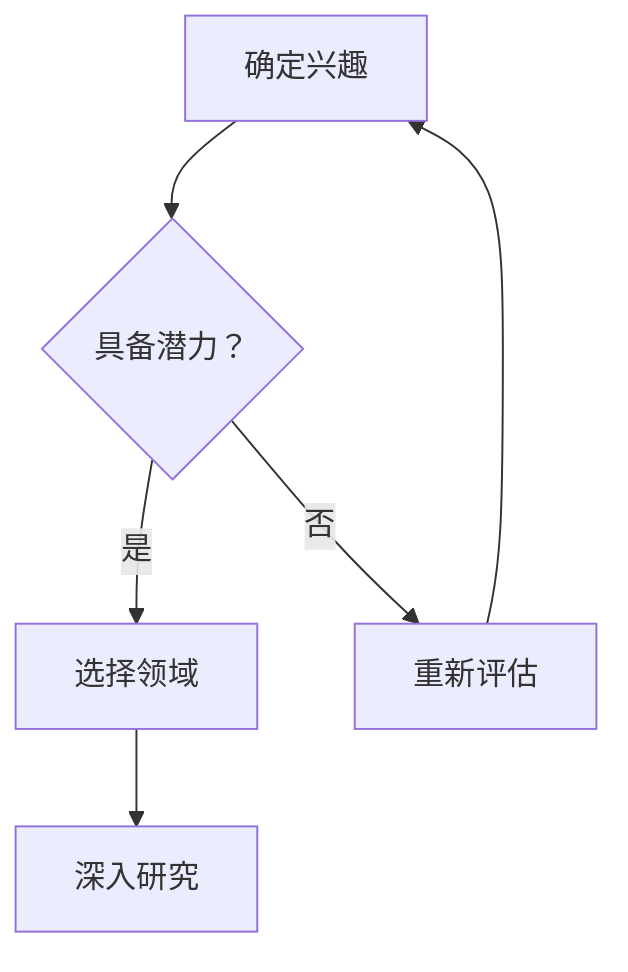

                 

# 成为小领域的佼佼者

## 关键词

- 小领域定位
- 专业技能提升
- 行业趋势分析
- 持续学习策略
- 个人品牌建设
- 职业发展路径规划

## 摘要

本文旨在探讨如何成为小领域的佼佼者。通过深入分析小领域的重要性、如何选择合适的小领域、核心技能与知识构建、行业趋势与市场分析、实战案例研究、持续学习与成长、个人品牌建设以及职业发展路径规划，本文为读者提供了系统的指南，帮助他们在特定领域中脱颖而出，实现职业目标和专业成长。

### 第一部分：了解书名与目标读者

#### 书名分析

《成为小领域的佼佼者》这个书名直接传达了本书的核心目标，即帮助读者在小领域内成为专家或顶尖人物。书名中的“小领域”指的是在广泛领域中进一步细分出的特定领域，这些领域往往具有更高的专业性和更深入的技术知识要求。而“佼佼者”则强调了在某一领域内具备卓越能力和广泛认可的个人。

#### 目标读者

本书的目标读者包括：

1. **有志于在小领域内发展并寻求专业提升的个人**：这些读者可能已经在某一领域内有初步的涉猎，但希望进一步提升自己的专业能力和市场竞争力。
2. **在特定行业内工作，希望进一步提升自己专业能力的从业者**：这些读者可能已经在行业内有一定的工作经验，但希望通过对特定领域的深入学习和实践来提升自己的职业水平。
3. **大学生或研究生，有志于在某一特定领域深入研究的学术研究者**：这些读者希望通过系统的学习和研究，为未来的学术或职业发展打下坚实的基础。
4. **对于特定领域有浓厚兴趣，希望扩展知识和技能的爱好者**：这些读者可能并不是专业的从业者，但出于兴趣和爱好，希望深入学习和了解特定领域的知识。

#### 主要内容方向

本书的主要内容包括：

1. **小领域定位与选择**：探讨如何选择适合自己发展的小领域，并分析小领域在职业发展、个人成长和创新机会中的作用。
2. **核心技能与知识**：详细介绍在小领域内必备的核心技能与知识，包括专业技能和软技能，以及如何构建和扩展知识体系。
3. **行业趋势与市场分析**：分析小领域的发展趋势、市场机会与风险，以及竞争对手的情况。
4. **实战案例研究**：通过国内外成功案例的深入分析，提供实际的借鉴和启示。
5. **持续学习与成长**：探讨如何保持持续学习的动力和习惯，获取丰富的学习资源，并将学习与实践相结合。
6. **个人品牌建设**：介绍如何建立和维护个人品牌，提升个人影响力和市场竞争力。
7. **职业发展路径规划**：探讨如何制定和实施个人职业发展计划，实现职业目标和持续成长。

#### 目录大纲框架设计

为了帮助读者系统地学习和理解如何在小领域内成为佼佼者，以下是一个初步的目录大纲框架：

### 第一部分：确定小领域

1. **小领域的定位与选择**
   - 1.1 小领域的重要性
   - 1.2 如何选择合适的小领域
   - 1.3 趋势分析：小领域的未来机遇

### 第二部分：精通技能

2. **核心技能与知识**
   - 2.1 核心技能详解
   - 2.2 知识体系构建
   - 2.3 技能应用案例分析

### 第三部分：行业洞察

3. **行业趋势与市场分析**
   - 3.1 行业发展趋势
   - 3.2 市场机会与风险
   - 3.3 竞争对手分析

### 第四部分：实战案例

4. **成功案例分析**
   - 4.1 国内成功案例
   - 4.2 国外成功案例
   - 4.3 案例对比与启示

### 第五部分：持续学习与成长

5. **如何保持持续学习**
   - 5.1 学习策略
   - 5.2 学习资源推荐
   - 5.3 学习与实践结合

### 第六部分：成为佼佼者的实战指南

6. **个人品牌建设**
   - 6.1 品牌认知与定位
   - 6.2 社交媒体应用
   - 6.3 口碑与影响力建设

### 第七部分：未来展望与规划

7. **职业发展路径规划**
   - 7.1 职业规划的重要性
   - 7.2 职业发展阶段分析
   - 7.3 个人发展路径规划

以上是一个初步的目录大纲框架，后续可以根据具体的写作内容进行调整和优化。每一章节下都可以进一步细化子标题，确保内容全面、系统且具有实用性，帮助读者在小领域内成为佼佼者。

### 核心概念与架构Mermaid流程图

为了帮助读者更好地理解小领域定位与选择的过程，我们可以使用Mermaid流程图展示相关概念和步骤：



这个流程图展示了从确定兴趣到选择合适领域，再到深入研究的整个过程，帮助读者系统地理解和决策。

### 总结

通过以上分析，我们已经明确了书名、目标读者和主要内容方向，并设计了初步的目录大纲框架。接下来，我们将深入每一章节的内容，确保全面、系统且具有实用性，帮助读者在小领域内成为佼佼者。

### 第一部分：确定小领域

#### 第1章：小领域的定位与选择

##### 1.1 小领域的重要性

在小领域内成为佼佼者首先需要明确小领域的重要性。小领域，顾名思义，是在大领域中进一步细分的特定领域。与广泛领域相比，小领域具有更专业、更精细的特点，往往需要更高的专业知识和技能。以下是小领域在职业发展、个人成长和创新机会等方面的价值。

**1.1.1 职业发展中的作用**

在小领域内深耕，可以帮助个人在职业发展中脱颖而出。首先，小领域的专业知识和技能可以提高个人的市场竞争力。随着行业的不断细分，企业对专业技能的要求越来越高，具备特定小领域专业能力的人才更受青睐。其次，小领域的深入学习和实践有助于建立专业声誉和权威，从而获得更多的职业机会和更高的职位。

**1.1.2 个人成长中的作用**

个人成长不仅需要广泛的知识积累，更需要在某一领域内深入探索。小领域内的深入学习和实践可以激发个人的创造力和思考能力。通过在小领域内的持续学习和实践，个人能够形成独特的见解和观点，提升自身的综合素质。

**1.1.3 创新机会中的作用**

小领域往往具有更灵活的创新空间，更容易发现新的需求和市场机会。在小领域内，由于竞争相对较少，企业或个人可以更自由地探索和创新，从而在市场中占据一席之地。此外，小领域内的创新往往能够迅速转化为实际产品和服务，为企业带来竞争优势。

##### 1.2 如何选择合适的小领域

选择合适的小领域是成为小领域佼佼者的关键步骤。以下是一些实用的方法和策略，帮助读者选择合适的小领域。

**1.2.1 个人兴趣与能力分析**

了解自己的兴趣所在是选择小领域的基础。个人兴趣往往是推动个人深耕某一领域的动力。同时，分析个人的技能和优势，可以帮助确定在哪些领域内具备竞争力。例如，如果你对数据分析和机器学习有浓厚兴趣，且在这些领域内具备一定的编程能力，那么选择数据科学或机器学习作为一个小领域可能会是一个不错的选择。

**1.2.2 市场需求与前景分析**

选择小领域时，还需要考虑市场需求和前景。通过分析行业趋势和市场数据，可以了解哪些领域具有较大的市场需求和成长潜力。例如，随着物联网（IoT）技术的快速发展，智能家居、智能穿戴设备等领域正逐渐成为新的增长点。

**1.2.3 竞争状况与机会分析**

在确定小领域时，还需要考虑竞争状况。通过分析竞争对手的优势和劣势，可以找到未被充分满足的需求和市场机会。例如，如果某领域内的竞争主要集中在大型企业，那么中小企业或创业者可能会有机会在特定的细分市场中占据优势。

##### 1.3 趋势分析：小领域的未来机遇

了解当前小领域的发展趋势，有助于抓住未来的机遇。以下是一些当前小领域的发展趋势和未来机遇。

**1.3.1 技术进步带来的机遇**

新兴技术的不断涌现为小领域的发展带来了新的机遇。例如，人工智能、区块链、物联网等技术正在深刻改变各行各业的运行方式。在这些新兴技术的推动下，许多小领域正在迅速崛起。例如，人工智能技术在金融、医疗、制造等领域的应用，为这些领域带来了新的业务模式和市场机会。

**1.3.2 行业变革带来的机遇**

行业的变革也为小领域的发展带来了新的机遇。例如，随着数字化转型的推进，许多传统行业正在逐步实现数字化转型。在这一过程中，数据处理、网络安全、云计算等小领域正迅速崛起，成为新的经济增长点。

**1.3.3 政策环境与市场机遇**

政府政策的变化也会对行业和市场产生重大影响。例如，政府出台的税收优惠、创新扶持政策等，可以降低创业门槛，促进小领域的发展。此外，一些行业政策的调整也可能为小领域带来新的市场机遇。

通过以上分析，读者可以系统地了解小领域定位与选择的重要性、方法和策略，为后续的学习和实践打下坚实的基础。

---

### 第二部分：精通技能

#### 第2章：核心技能与知识

##### 2.1 核心技能详解

在小领域内成为佼佼者，精通核心技能和知识是必不可少的。这一章节将详细介绍在小领域内必备的核心技能和知识，包括专业技能和软技能。

**2.1.1 专业技能**

专业技能是指在小领域内需要掌握的特定技术或知识。以下是几个常见的小领域及其对应的专业技能：

1. **数据科学**
   - **编程语言**：Python、R、Java等
   - **数据处理工具**：Pandas、NumPy、Matplotlib等
   - **机器学习框架**：Scikit-learn、TensorFlow、PyTorch等
   - **数据分析工具**：Excel、SQL、Tableau等

2. **软件工程**
   - **编程语言**：Java、C++、Python等
   - **开发工具**：IDEA、Visual Studio、Eclipse等
   - **数据库**：MySQL、MongoDB、PostgreSQL等
   - **版本控制**：Git、SVN等

3. **人工智能**
   - **编程语言**：Python、C++、Java等
   - **深度学习框架**：TensorFlow、PyTorch、Keras等
   - **算法库**：NumPy、Pandas等
   - **工具**：TensorBoard、Google Colab等

4. **网络安全**
   - **编程语言**：Python、C、C++等
   - **安全工具**：Wireshark、Nmap、Metasploit等
   - **操作系统**：Linux、Windows等
   - **加密技术**：AES、RSA、SHA等

**2.1.2 软技能**

软技能是指在小领域内需要具备的通用能力，这些能力不仅适用于特定领域，而且对职业发展具有普遍意义。以下是几个重要的软技能：

1. **沟通能力**
   - **表达清晰**：能够清晰、准确地表达思想。
   - **倾听能力**：能够有效倾听他人的观点和建议。
   - **协作能力**：能够在团队中有效沟通和协作。

2. **解决问题的能力**
   - **分析问题**：能够从复杂的问题中提取关键信息，进行分析。
   - **制定解决方案**：能够根据问题分析，制定合理的解决方案。
   - **实施和评估**：能够有效执行解决方案，并对结果进行评估。

3. **项目管理能力**
   - **时间管理**：能够合理安排时间，确保项目按时完成。
   - **资源分配**：能够合理分配资源，确保项目顺利进行。
   - **风险管理**：能够识别和管理项目中的风险。

##### 2.2 知识体系构建

构建坚实的知识体系是精通技能的重要步骤。以下是一些构建知识体系的策略：

**2.2.1 学习资源**

1. **书籍和教材**：选择经典和前沿的书籍，构建知识框架。
2. **在线课程和讲座**：选择优质课程，扩展知识深度。
3. **实践项目**：通过实际操作，将知识应用于实际问题。

**2.2.2 学习方法**

1. **主动学习**：主动探索和解决问题，培养独立思考能力。
2. **总结与反思**：定期总结学习成果，反思学习过程。
3. **持续更新**：关注领域内最新动态，持续学习新知识。

**2.2.3 知识管理**

1. **笔记整理**：定期整理学习笔记，形成知识体系。
2. **思维导图**：使用思维导图工具，可视化知识结构。
3. **知识分享**：与他人分享知识，巩固和拓展知识体系。

##### 2.3 技能应用案例分析

通过案例分析，读者可以更好地理解核心技能和知识在实际工作中的应用。

**2.3.1 成功案例分析**

- **案例背景**：介绍案例的背景和目标。
- **技能应用**：分析案例中如何应用核心技能和知识。
- **成功经验**：总结案例中的成功经验和关键因素。

**2.3.2 失败案例分析**

- **失败原因**：分析案例中的失败原因和问题所在。
- **教训与启示**：从失败中吸取教训，避免重复错误。
- **改进建议**：提出改进措施，提高实际应用效果。

通过以上内容，读者可以系统地了解成为小领域佼佼者所需的核心技能与知识，掌握有效的学习方法和实践经验，为专业发展打下坚实基础。

---

### 第三部分：行业洞察

#### 第3章：行业趋势与市场分析

##### 3.1 行业发展趋势

了解小领域的发展趋势是制定战略规划的重要依据。以下是一些当前小领域的发展趋势：

**3.1.1 技术驱动趋势**

- **人工智能与机器学习**：随着人工智能和机器学习技术的不断成熟，越来越多的行业开始应用这些技术，提高生产效率和决策质量。
- **区块链技术**：区块链技术以其去中心化、不可篡改的特点，在金融、供应链管理等领域得到广泛应用。
- **物联网（IoT）**：物联网技术的快速发展，使得智能家居、智能城市等应用场景逐渐普及。
- **大数据分析**：大数据技术的应用，使得企业能够从海量数据中提取有价值的信息，为决策提供支持。

**3.1.2 行业变革趋势**

- **数字化转型**：越来越多的企业开始进行数字化转型，以提升业务效率和竞争力。
- **可持续发展**：随着环保意识的提高，可持续发展成为各个行业的关注焦点。
- **行业整合与细分**：随着市场竞争的加剧，行业整合和细分成为趋势，企业需要更专注于特定领域，提供专业的解决方案。

##### 3.2 市场机会与风险

在了解行业趋势的基础上，分析市场机会与风险是制定战略规划的关键。

**3.2.1 市场机会**

- **新兴市场**：随着新兴市场的快速发展，这些市场为企业提供了巨大的商机。
- **技术创新**：技术创新带来的新应用场景，为企业提供了新的市场机会。
- **政策支持**：政府出台的各项优惠政策，为企业提供了发展的机会。

**3.2.2 市场风险**

- **市场竞争**：市场竞争的加剧，可能导致利润下降。
- **政策风险**：政策的变化可能对企业产生不利影响。
- **技术风险**：技术的快速变化可能使企业落后于市场。

##### 3.3 竞争对手分析

了解竞争对手的情况是制定市场策略的重要环节。以下是一些分析竞争对手的方法：

**3.3.1 竞争对手概述**

- **主要竞争对手**：列出主要竞争对手，介绍其业务范围、市场份额等基本情况。
- **竞争优势**：分析竞争对手的优势，如技术实力、市场占有率、品牌影响力等。
- **竞争策略**：探讨竞争对手的市场策略，包括产品定位、定价策略、营销策略等。

**3.3.2 竞争对手动态**

- **市场表现**：分析竞争对手的市场表现，包括市场份额、客户评价等。
- **未来展望**：预测竞争对手的未来发展方向和可能的市场变化。

通过以上内容，读者可以全面了解小领域的发展趋势、市场机会与风险，以及竞争对手的情况，为制定有效的战略提供有力支持。

---

### 第四部分：实战案例

#### 第4章：成功案例分析

##### 4.1 国内成功案例

在国内，许多领域都有佼佼者脱颖而出，以下是一些成功的国内案例。

**案例1：人工智能领域的百度**

- **背景介绍**：百度成立于2000年，是中国最大的搜索引擎公司，同时也在人工智能领域有着深厚的积累。
- **成功因素**：百度在人工智能领域成功的关键因素包括：
  - **技术实力**：百度拥有强大的技术团队，在自然语言处理、深度学习等方面取得了显著的成果。
  - **应用场景**：百度将人工智能技术广泛应用于搜索、广告、自动驾驶等领域，形成了独特的商业模式。
  - **投资布局**：百度在人工智能领域进行了大量的投资和布局，促进了技术的快速发展。
- **经验分享**：百度成功的经验包括：
  - **技术创新**：持续投入研发，推动技术突破。
  - **应用驱动**：紧密结合市场需求，将技术应用于实际场景。
  - **团队建设**：培养和引进高素质的人才，形成强大的技术团队。

**案例2：电子商务领域的京东**

- **背景介绍**：京东成立于1998年，是中国领先的电子商务公司，覆盖广泛的商品种类和服务范围。
- **成功因素**：京东在电子商务领域成功的关键因素包括：
  - **物流优势**：京东自建物流体系，确保了快速、高效的配送服务。
  - **供应链管理**：京东通过大数据分析和智能化技术，优化供应链管理，提高了运营效率。
  - **用户体验**：京东注重用户购物体验，提供便捷、高效的购物流程和优质的售后服务。
- **经验分享**：京东成功的经验包括：
  - **技术创新**：利用大数据和人工智能技术，优化供应链和服务流程。
  - **用户导向**：以用户需求为导向，不断改进服务和产品。
  - **品牌建设**：通过品牌推广和营销活动，提升品牌知名度和用户忠诚度。

##### 4.2 国外成功案例

在国外，也有许多领域的佼佼者取得了显著的成就，以下是一些国外的成功案例。

**案例1：互联网领域的谷歌**

- **背景介绍**：谷歌成立于1998年，是全球最大的搜索引擎公司，同时在人工智能、云计算等领域有着深厚的技术积累。
- **成功因素**：谷歌在互联网领域成功的关键因素包括：
  - **技术创新**：谷歌一直致力于技术创新，推出了一系列革命性的产品和服务，如Gmail、Google Maps、Google Search等。
  - **生态系统**：谷歌构建了强大的生态系统，包括Android操作系统、Google Play商店等，为用户提供了丰富的服务和应用。
  - **全球化战略**：谷歌在全球范围内进行布局，业务覆盖多个国家和地区，实现了全球化发展。
- **经验分享**：谷歌的成功经验包括：
  - **技术创新**：持续投入研发，推动技术突破。
  - **生态系统**：构建完整的生态系统，为用户提供全方位的服务。
  - **用户导向**：以用户需求为导向，不断改进服务和产品。

**案例2：生物科技领域的基因泰克**

- **背景介绍**：基因泰克成立于1976年，是全球领先的生物科技公司，专注于基因治疗、生物制药等领域。
- **成功因素**：基因泰克在生物科技领域成功的关键因素包括：
  - **研发投入**：基因泰克每年投入大量资金用于研发，推动了基因治疗和生物制药领域的创新。
  - **合作伙伴关系**：基因泰克与多家知名科研机构和大学建立了紧密的合作关系，共同推动技术创新。
  - **市场拓展**：基因泰克积极拓展国际市场，扩大了业务规模和影响力。
- **经验分享**：基因泰克的成功经验包括：
  - **研发投入**：持续投入研发，推动技术突破。
  - **合作伙伴关系**：建立广泛的合作伙伴关系，共同推动技术创新。
  - **市场拓展**：积极拓展国际市场，实现全球化发展。

##### 4.3 案例对比与启示

通过对国内和国外成功案例的对比分析，我们可以得到一些有价值的启示。

- **技术创新**：无论是国内还是国外，成功的企业都高度重视技术创新，持续投入研发，推动技术突破。
- **用户导向**：成功的经验表明，以用户需求为导向，不断改进服务和产品，是赢得市场的重要因素。
- **生态系统**：构建完整的生态系统，为用户提供全方位的服务，是实现长期发展的重要保障。
- **全球化战略**：积极拓展国际市场，实现全球化发展，可以扩大企业的业务规模和影响力。

通过以上内容，读者可以深入了解国内外成功案例的背景、成功因素和经验教训，从中获取宝贵的启示，为自身在小领域内的发展提供参考。

---

### 第五部分：持续学习与成长

#### 第5章：如何保持持续学习

持续学习是成为小领域佼佼者的关键。以下是一些保持持续学习的策略：

##### 5.1 学习策略

**5.1.1 目标设定**

设定明确的学习目标是持续学习的重要步骤。目标可以分为短期目标和长期目标：

- **短期目标**：如掌握一项新技能、阅读一本专业书籍等。短期目标有助于保持学习的动力和方向。
- **长期目标**：如成为领域专家、实现职业晋升等。长期目标为学习提供了更明确的方向和目标。

**5.1.2 时间管理**

合理安排时间，确保有足够的时间进行学习是保持持续学习的关键。以下是一些时间管理的策略：

- **碎片化学习**：利用碎片时间，如通勤、等待等，进行学习。例如，阅读电子书、观看教学视频等。
- **定期复习**：定期复习已学过的内容，巩固记忆，提高学习效果。例如，每周进行一次总结和复习。
- **学习时间表**：制定详细的学习时间表，合理安排学习时间，确保学习目标的实现。

**5.1.3 学习方法**

选择合适的学习方法是提高学习效率的重要因素。以下是一些常用的学习方法：

- **主动学习**：主动探索和解决问题，培养独立思考能力。例如，通过实验、案例分析等方式进行学习。
- **实践应用**：将所学知识应用到实际工作中，提高实践能力。例如，参与实际项目、开展研究等。
- **反思总结**：定期反思学习过程和成果，总结经验教训，不断改进学习策略。

##### 5.2 学习资源推荐

获取优质的学习资源是保持持续学习的重要保障。以下是一些推荐的学习资源：

**5.2.1 书籍和教材**

- **经典书籍**：选择领域内的经典著作，构建坚实的知识基础。例如，《人工智能：一种现代方法》、《深入理解计算机系统》等。
- **前沿教材**：选择最新出版的教材，了解领域内的最新研究成果。例如，《深度学习》、《区块链：从入门到实战》等。

**5.2.2 在线课程和讲座**

- **专业课程**：选择高质量的专业课程，深入学习特定领域知识。例如，Coursera、edX等平台上的课程。
- **公开讲座**：参加领域内知名专家的讲座，拓展视野。例如，TED演讲、行业会议等。

**5.2.3 实践项目**

- **开源项目**：参与开源项目，将理论知识应用到实际项目中。例如，GitHub上的开源项目。
- **实际项目**：参与实际项目，提高实践能力和解决问题的能力。例如，公司项目、学术研究等。

##### 5.3 学习与实践结合

将学习与实践相结合，是提升专业技能和实战能力的关键。以下是一些结合学习与实践的策略：

**5.3.1 案例研究**

- **深度分析**：通过案例分析，深入理解领域内的实际问题。例如，分析成功案例中的关键因素和策略。
- **经验总结**：总结案例中的经验教训，为实际问题提供解决方案。

**5.3.2 项目实战**

- **实际操作**：参与实际项目，将理论知识应用到实践中。例如，开发应用程序、开展研究等。
- **反馈与改进**：及时获取反馈，不断改进和优化实践成果。例如，通过用户反馈、同行评审等。

通过以上策略，读者可以保持持续学习的动力和习惯，不断提升自身的专业能力和实战能力。

---

### 第六部分：成为佼佼者的实战指南

#### 第6章：个人品牌建设

在竞争激烈的市场中，建立强大的个人品牌对于职业发展和成功至关重要。以下是关于个人品牌建设的详细指南：

##### 6.1 品牌认知与定位

建立个人品牌的第一步是明确个人品牌的认知和定位。以下是一些关键步骤：

**6.1.1 个人特色**

- **技能和专长**：明确个人在某一领域的独特技能和专长，这是个人品牌的核心价值。
- **价值主张**：确定个人品牌的核心价值和主张，使其在市场上具有独特的辨识度。

**6.1.2 目标受众**

- **目标群体**：分析目标受众的需求和特点，确保个人品牌能够吸引并满足这些受众。
- **市场定位**：根据目标受众的需求，确定个人品牌的市场定位。

##### 6.2 社交媒体应用

社交媒体是建立和维护个人品牌的重要工具。以下是一些策略：

**6.2.1 内容策略**

- **专业分享**：定期分享专业知识和经验，提升个人专业形象。例如，发布技术博客、学术论文等。
- **互动交流**：积极与受众互动，建立良好的关系网络。例如，回复评论、参与讨论等。

**6.2.2 平台选择**

- **专业平台**：选择与个人品牌相关的专业平台，如LinkedIn、GitHub等。
- **广泛覆盖**：根据目标受众的分布，选择多个社交媒体平台进行覆盖。例如，Twitter、Instagram等。

**6.2.3 内容质量**

- **原创内容**：发布原创内容，展示个人独特的见解和思考。
- **高质量图片和视频**：利用高质量的图片和视频内容，增强内容的吸引力和传播效果。

##### 6.3 口碑与影响力建设

良好的口碑和影响力是个人品牌的重要资产。以下是一些策略：

**6.3.1 口碑传播**

- **用户评价**：鼓励用户发表真实、积极的评价，提升个人品牌形象。例如，在LinkedIn、GitHub等平台上的评价。
- **案例分享**：通过成功案例分享，展示个人在领域内的实际成果。例如，分享项目案例、成功故事等。

**6.3.2 影响力提升**

- **演讲与讲座**：参加行业会议、演讲和讲座，提升个人知名度。例如，参加技术大会、行业论坛等。
- **专业贡献**：通过发表论文、撰写博客、参与开源项目等，为领域内做出贡献。例如，在顶级会议和期刊上发表学术论文。

**6.3.3 长期规划**

- **持续成长**：保持学习的动力，不断提升个人专业能力和影响力。例如，参加培训、阅读最新书籍等。
- **长远规划**：制定长期个人品牌建设计划，确保个人品牌的持续发展。例如，设定职业发展目标、制定学习计划等。

通过以上策略，个人可以在市场中建立强大的个人品牌，提升自身的影响力和竞争力，从而在小领域内脱颖而出，成为佼佼者。

---

### 第七部分：未来展望与规划

#### 第7章：职业发展路径规划

职业发展路径规划是成为小领域佼佼者的关键步骤。以下是如何制定和实施个人职业发展路径的详细指南：

##### 7.1 职业规划的重要性

职业规划有助于明确个人的职业目标和路径，提高职业发展的效率和成功率。以下是一些关键点：

**7.1.1 明确职业目标**

- **短期目标**：设定明确、可实现的短期目标，如提升某项技能、晋升职位等。
- **长期目标**：制定长期职业规划，如成为领域专家、创业等。

**7.1.2 提高职业能力**

- **专业技能**：通过学习和实践，不断提高专业技能和综合素质。
- **综合素质**：提升沟通能力、团队合作能力、解决问题的能力等。

**7.1.3 调整职业路径**

- 根据个人兴趣和市场需求，适时调整职业路径，确保职业发展的方向正确。

##### 7.2 职业发展阶段分析

了解不同职业阶段的特点和任务，有助于制定合理的职业发展规划。

**7.2.1 早期阶段**

- **技能积累**：在早期阶段，重点培养专业技能，建立良好的工作习惯。
- **团队合作**：积极参与团队合作，提升沟通和协作能力。

**7.2.2 中期阶段**

- **能力提升**：在中期阶段，重点提升综合能力，如管理能力、创新能力等。
- **职业定位**：明确个人职业定位，为未来的发展奠定基础。

**7.2.3 晚期阶段**

- **职业成就**：在晚期阶段，重点实现职业成就，如成为领域专家、企业领导者等。
- **传承经验**：通过培训和指导，为后继者传授经验和技能。

##### 7.3 个人发展路径规划

制定详细的个人发展路径规划，是实现职业目标的重要步骤。以下是一些具体步骤：

**7.3.1 自我评估**

- **优势分析**：评估自身优势，确定在哪些领域具有竞争力。
- **短板识别**：识别自身短板，制定针对性的提升计划。

**7.3.2 目标设定**

- **具体目标**：设定明确的职业发展目标，如晋升职位、完成特定项目等。
- **时间规划**：为每个目标设定明确的时间期限，确保目标的可实现性。

**7.3.3 行动计划**

- **学习计划**：制定详细的学习计划，包括参加培训、阅读书籍等。
- **实践计划**：制定实践计划，如参与项目、开展研究等。
- **评估与调整**：定期评估职业发展进度，根据实际情况进行调整。

通过以上内容，读者可以了解职业规划的重要性、不同职业阶段的特点和任务，以及如何制定个人发展路径规划，从而在职业生涯中持续进步和成长，最终成为小领域内的佼佼者。

---

## 附录

### 附录 A: AI 大模型开发工具与资源

#### A.1 主流深度学习框架对比

在人工智能（AI）领域，深度学习框架是开发者进行研究和开发的核心工具。以下是对几种主流深度学习框架的对比分析。

**TensorFlow**

- **优点**：
  - 强大的社区支持：Google开发的框架，拥有丰富的文档和社区资源。
  - 广泛的应用场景：支持各种类型的神经网络模型，适用于科学计算、图像处理、语音识别等。
  - 具备高性能计算能力：可以在GPU和TPU上进行高效训练。
- **缺点**：
  - 代码复杂度较高：相较于其他框架，TensorFlow的代码结构较为复杂，学习曲线较陡。
  - 性能优化需求：在某些特定任务上，需要额外的性能优化。

- **适用场景**：适用于需要高性能计算和复杂模型开发的场景，如学术研究和大型项目。

**PyTorch**

- **优点**：
  - 动态图（Eager Execution）特性：使调试和开发更加直观，易于理解。
  - 丰富的API和扩展库：拥有丰富的库和工具，如TorchVision、TorchAudio等，方便数据处理和模型构建。
  - 社区活跃：社区活跃，文档丰富，支持良好。
- **缺点**：
  - 性能相对较低：在某些情况下，PyTorch的性能可能不如TensorFlow或其他框架。
  - GPU支持：需要安装特定的CUDA版本，配置相对复杂。

- **适用场景**：适用于需要快速原型开发和学术研究的场景。

**JAX**

- **优点**：
  - 高性能计算：支持自动微分和高级优化工具，适用于高性能计算任务。
  - 兼容性：支持Python的各种流行库，如NumPy、SciPy等。
  - 强大的抽象能力：提供了许多高级抽象，简化了复杂任务的实现。
- **缺点**：
  - 社区支持较少：相较于TensorFlow和PyTorch，社区支持较少，文档相对不完整。
  - 学习曲线：JAX的学习曲线可能较陡，对于初学者可能有一定难度。

- **适用场景**：适用于需要高性能计算和自动微分的应用，如科学计算和机器学习研究。

**其他框架简介**

- **Keras**：
  - **优点**：基于TensorFlow和Theano的高层API，易于使用，适合快速原型开发。
  - **缺点**：缺乏底层操作的灵活性和优化。
  - **适用场景**：适用于需要快速开发和实验的场景。

- **MXNet**：
  - **优点**：由Apache Software Foundation维护，支持多种编程语言，性能优秀。
  - **缺点**：社区支持相对较弱，文档不够详尽。
  - **适用场景**：适用于需要高性能计算和多语言支持的场景。

#### A.2 主流AI大模型开发工具

除了深度学习框架，还有一些主流的AI大模型开发工具，这些工具为开发者提供了从数据预处理到模型训练和部署的一站式解决方案。

**Google Colab**

- **优点**：
  - **免费GPU和TPU资源**：Google Colab提供了免费的GPU和TPU资源，适合快速原型开发和实验。
  - **易于使用**：基于Jupyter Notebook，用户可以轻松创建和分享代码笔记本。
  - **兼容性**：支持多种编程语言和深度学习框架。
- **缺点**：
  - **资源限制**：虽然提供免费资源，但资源有限，不适合大规模生产环境。
  - **依赖网络**：需要稳定的网络连接，否则无法正常使用。

- **适用场景**：适用于学术研究、快速原型开发。

**AWS SageMaker**

- **优点**：
  - **全面的AI服务**：提供从数据预处理、模型训练到部署的全流程服务。
  - **自动模型调优**：自动进行模型调优，提高模型性能。
  - **集成开发环境**：提供集成开发环境（IDE），方便开发者进行开发和调试。
- **缺点**：
  - **成本较高**：服务费用较高，对于小型项目可能不太经济。
  - **上手难度**：对于初学者可能需要一定的学习曲线。

- **适用场景**：适用于企业级应用、大规模生产环境。

**Azure ML**

- **优点**：
  - **强大的机器学习工具**：提供多种机器学习工具和集成开发环境。
  - **多语言支持**：支持多种编程语言，如Python、R等。
  - **云端部署**：支持在云平台上进行模型训练和部署。
- **缺点**：
  - **社区支持较弱**：相较于AWS和Google Cloud，社区支持较弱。

- **适用场景**：适用于企业级应用、大规模生产环境。

#### A.3 开源资源与社区

- **GitHub**：
  - **优点**：全球最大的开源代码托管平台，拥有丰富的AI大模型开源项目。
  - **缺点**：代码质量参差不齐，需要筛选和验证。
  - **适用场景**：代码参考、项目合作。

- **ArXiv**：
  - **优点**：提供最新的学术研究成果，包括论文和代码。
  - **缺点**：内容繁多，需要筛选和阅读能力。
  - **适用场景**：学术研究、前沿技术探索。

通过以上内容，读者可以全面了解AI大模型开发的主流工具和资源，为项目选择合适的工具提供参考。

---

### 附录 B：项目实战：开发一个简单的机器学习模型

在本附录中，我们将通过一个简单的项目实战来介绍如何开发一个机器学习模型。本案例将使用Python编程语言和Scikit-learn库来实现一个线性回归模型，用于预测房价。

#### B.1 开发环境搭建

首先，我们需要搭建开发环境。以下是在Windows操作系统上搭建开发环境的基本步骤：

1. **安装Python**：
   - 访问Python官方网站（https://www.python.org/），下载并安装最新版本的Python。
   - 安装过程中确保勾选“Add Python to PATH”选项。

2. **安装Scikit-learn**：
   - 打开命令提示符或终端，输入以下命令安装Scikit-learn：
     ```bash
     pip install scikit-learn
     ```

3. **验证安装**：
   - 打开Python交互式 shell，输入以下代码验证Scikit-learn是否安装成功：
     ```python
     import sklearn
     print(sklearn.__version__)
     ```

如果输出版本号，则表示Scikit-learn安装成功。

#### B.2 数据准备

在本案例中，我们将使用Scikit-learn内置的“Boston House Prices”数据集。以下是如何加载数据集并预处理数据的步骤：

1. **加载数据集**：
   ```python
   from sklearn.datasets import load_boston
   boston = load_boston()
   ```

2. **数据预处理**：
   - 分离特征和目标变量：
     ```python
     X = boston.data
     y = boston.target
     ```

   - 分割数据集为训练集和测试集：
     ```python
     from sklearn.model_selection import train_test_split
     X_train, X_test, y_train, y_test = train_test_split(X, y, test_size=0.2, random_state=42)
     ```

#### B.3 模型构建与训练

接下来，我们将构建一个线性回归模型并对其进行训练。

1. **导入线性回归模型**：
   ```python
   from sklearn.linear_model import LinearRegression
   ```

2. **初始化模型**：
   ```python
   model = LinearRegression()
   ```

3. **训练模型**：
   ```python
   model.fit(X_train, y_train)
   ```

#### B.4 评估模型

在训练模型后，我们需要评估模型的性能。

1. **计算模型在测试集上的预测结果**：
   ```python
   y_pred = model.predict(X_test)
   ```

2. **计算模型性能指标**：
   - 均方误差（Mean Squared Error, MSE）：
     ```python
     from sklearn.metrics import mean_squared_error
     mse = mean_squared_error(y_test, y_pred)
     print(f"Mean Squared Error: {mse}")
     ```

   - 决定系数（R-squared）：
     ```python
     from sklearn.metrics import r2_score
     r2 = r2_score(y_test, y_pred)
     print(f"R-squared: {r2}")
     ```

#### B.5 源代码实现与解读

以下是整个项目的源代码及其解读：

```python
# 导入必要的库
from sklearn.datasets import load_boston
from sklearn.model_selection import train_test_split
from sklearn.linear_model import LinearRegression
from sklearn.metrics import mean_squared_error, r2_score

# 加载数据集
boston = load_boston()
X = boston.data
y = boston.target

# 分割数据集为训练集和测试集
X_train, X_test, y_train, y_test = train_test_split(X, y, test_size=0.2, random_state=42)

# 初始化线性回归模型
model = LinearRegression()

# 训练模型
model.fit(X_train, y_train)

# 计算模型在测试集上的预测结果
y_pred = model.predict(X_test)

# 计算模型性能指标
mse = mean_squared_error(y_test, y_pred)
r2 = r2_score(y_test, y_pred)

# 输出性能指标
print(f"Mean Squared Error: {mse}")
print(f"R-squared: {r2}")
```

解读：
- **第1-4行**：导入必要的库。
- **第6-8行**：加载数据集并分离特征和目标变量。
- **第10-12行**：分割数据集为训练集和测试集。
- **第14行**：初始化线性回归模型。
- **第16行**：训练模型。
- **第18-20行**：计算模型在测试集上的预测结果。
- **第22-24行**：计算并输出模型性能指标。

通过以上步骤，我们成功地开发了一个简单的线性回归模型，并评估了其性能。这个案例为读者提供了一个实际操作的范例，帮助读者了解机器学习模型开发的基本流程。

---

### 附录 C：数学模型和公式详解

在机器学习领域，数学模型和公式是理解和应用算法的基础。以下是对一些核心数学模型和公式的详细讲解。

#### C.1 线性回归模型

线性回归模型是一种用于预测连续值的统计模型，其基本形式为：

\[ y = \beta_0 + \beta_1 \cdot x + \epsilon \]

其中：
- \( y \) 是目标变量。
- \( x \) 是特征变量。
- \( \beta_0 \) 是截距。
- \( \beta_1 \) 是斜率。
- \( \epsilon \) 是误差项。

**最小二乘法（Ordinary Least Squares, OLS）**

最小二乘法是一种用于估计线性回归模型参数的常用方法，其目标是找到使得误差平方和最小的参数。具体公式如下：

\[ \min_{\beta_0, \beta_1} \sum_{i=1}^{n} (y_i - (\beta_0 + \beta_1 \cdot x_i))^2 \]

通过求解上述优化问题，可以得到线性回归模型的最优参数估计。

#### C.2 逻辑回归模型

逻辑回归（Logistic Regression）是一种用于预测二分类结果的统计模型，其基本形式为：

\[ P(y=1) = \frac{1}{1 + e^{-(\beta_0 + \beta_1 \cdot x)}} \]

其中：
- \( P(y=1) \) 是目标变量为1的概率。
- \( \beta_0 \) 是截距。
- \( \beta_1 \) 是斜率。

**损失函数（Log-Likelihood Function）**

逻辑回归的损失函数是逻辑函数（Log-Likelihood Function），其公式如下：

\[ L(\beta_0, \beta_1) = \sum_{i=1}^{n} \left[ y_i \cdot \ln(P(y=1)) + (1 - y_i) \cdot \ln(1 - P(y=1)) \right] \]

通过最大化损失函数，可以得到逻辑回归模型的最优参数估计。

#### C.3 支持向量机（Support Vector Machine, SVM）

支持向量机是一种常用的分类算法，其基本形式为：

\[ w \cdot x + b = 0 \]

其中：
- \( w \) 是权重向量。
- \( x \) 是特征向量。
- \( b \) 是偏置项。

**损失函数（Hinge Loss）**

SVM的损失函数是 hinge loss，其公式如下：

\[ L(w, b) = \sum_{i=1}^{n} \max(0, 1 - y_i \cdot (w \cdot x_i + b)) \]

通过最小化损失函数，可以得到SVM模型的最优参数估计。

#### C.4 神经网络模型

神经网络是一种基于人脑神经元连接的模型，其基本形式为：

\[ a_{\text{layer}}(x) = \sigma(\beta_{\text{layer}} \cdot x + b_{\text{layer}}) \]

其中：
- \( a_{\text{layer}} \) 是第\( \text{layer} \)层的激活函数输出。
- \( \sigma \) 是激活函数，如Sigmoid、ReLU等。
- \( \beta_{\text{layer}} \) 是第\( \text{layer} \)层的权重矩阵。
- \( b_{\text{layer}} \) 是第\( \text{layer} \)层的偏置向量。

**损失函数（Cross-Entropy Loss）**

神经网络的损失函数是交叉熵损失（Cross-Entropy Loss），其公式如下：

\[ L(\theta) = -\frac{1}{m} \sum_{i=1}^{m} y_i \cdot \ln(a_{\text{output}}^{(i)}) + (1 - y_i) \cdot \ln(1 - a_{\text{output}}^{(i)}) \]

其中：
- \( y_i \) 是真实标签。
- \( a_{\text{output}}^{(i)} \) 是第\( i \)个样本在输出层的预测概率。

通过最小化损失函数，可以得到神经网络模型的最优参数估计。

通过以上对数学模型和公式的详细讲解，读者可以更好地理解机器学习算法的基本原理，为实际应用奠定基础。

---

### 附录 D：计算机编程与人工智能领域大师推荐阅读书籍

在计算机编程与人工智能领域，有许多经典的书籍被广泛推荐，这些书籍不仅涵盖了基础知识，还包括了最新的研究成果和实用的编程技巧。以下是一些被领域内大师推荐的书籍：

#### 编程基础与算法

- **《编程珠玑》（Code: The Hidden Language of Computer Hardware and Software）** - Charles Petzold
  - 本书以深入浅出的方式介绍了计算机编程的基础知识，从硬件到软件，涵盖了计算机编程的核心概念。

- **《算法导论》（Introduction to Algorithms）** - Thomas H. Cormen, Charles E. Leiserson, Ronald L. Rivest, Clifford Stein
  - 本书是算法领域的经典教材，详细介绍了各种算法的基本原理、分析方法和实现细节。

#### 数据结构与设计模式

- **《大话数据结构》** - 何贵全
  - 本书以通俗易懂的语言介绍了数据结构的基本概念和实现方法，适合初学者入门。

- **《设计模式：可复用面向对象软件的基础》（Design Patterns: Elements of Reusable Object-Oriented Software）** - Erich Gamma, Richard Helm, Ralph Johnson, and John Vlissides
  - 本书介绍了面向对象设计中的23个经典设计模式，对于提高编程技巧和软件复用性有很大帮助。

#### 人工智能与机器学习

- **《机器学习》（Machine Learning）** - Tom M. Mitchell
  - 本书是机器学习领域的经典教材，介绍了各种机器学习算法的基本原理和实现方法。

- **《深度学习》（Deep Learning）** - Ian Goodfellow, Yoshua Bengio, Aaron Courville
  - 本书全面介绍了深度学习的基本概念、算法实现和应用场景，是深度学习领域的权威著作。

#### 编程语言与框架

- **《Python编程：从入门到实践》（Python Crash Course）** - Eric Matthes
  - 本书适合初学者，通过实际项目帮助读者掌握Python编程的基础知识。

- **《流畅的Python》（Fluent Python）** - Marco Zacchini
  - 本书深入探讨了Python编程语言的各种特性，帮助读者写出更高效、更优雅的Python代码。

#### 软件工程与项目管理

- **《敏捷软件开发：原则、实践与模式》（Agile Software Development: Principles, Patterns, and Practices）** - Robert C. Martin
  - 本书介绍了敏捷开发的方法论，包括原则、实践和模式，对于软件开发者来说是一本非常有价值的参考书。

- **《代码大全》（The Art of Software Architecture）** - Dave Astels
  - 本书从软件架构的角度出发，介绍了如何构建可扩展、可维护的软件系统。

通过阅读这些书籍，读者可以系统地学习和掌握计算机编程与人工智能领域的核心知识和技能，为自己的职业发展奠定坚实的基础。

---

### 附录 E：推荐工具与资源

在计算机编程与人工智能领域，有许多实用的工具和资源可以帮助开发者提高效率、学习和实践。以下是一些被广泛推荐的工具和资源：

#### 编程开发环境

- **Visual Studio Code**：
  - 一个免费且开源的跨平台代码编辑器，支持多种编程语言和开发框架，拥有丰富的插件生态系统。

- **JetBrains全家桶**：
  - 包括IntelliJ IDEA、PyCharm、WebStorm等，这些IDE提供了强大的代码编辑功能、智能提示和调试工具，适合各种编程语言开发。

#### 版本控制工具

- **Git**：
  - 世界上最流行的分布式版本控制系统，适用于个人项目和团队协作，支持多种操作，如克隆、提交、分支和合并。

- **GitHub**：
  - 一个基于Git的代码托管平台，支持开源项目和协作开发，提供代码托管、分支管理、问题跟踪等功能。

#### 机器学习库与框架

- **TensorFlow**：
  - 由Google开发的开源机器学习框架，支持多种神经网络模型，适用于各种机器学习和深度学习应用。

- **PyTorch**：
  - 另一个流行的开源机器学习框架，以其动态计算图和简洁的API设计受到很多研究者和开发者的青睐。

#### 数据处理与分析工具

- **Pandas**：
  - 一个强大的Python库，用于数据处理和分析，提供数据清洗、合并、转换等功能。

- **NumPy**：
  - 用于数值计算的Python库，提供多维数组对象和丰富的数学函数，是科学计算和数据科学的基础工具。

#### 虚拟环境管理工具

- **conda**：
  - 一个开源的虚拟环境管理工具，支持多种编程语言和库，便于在不同的项目和环境中管理依赖项。

- **virtualenv**：
  - 一个简单的Python虚拟环境创建工具，适用于单个Python项目的依赖隔离。

#### 学习资源

- **Coursera**：
  - 提供各种在线课程，涵盖计算机科学、人工智能、数据科学等多个领域，由世界顶级大学和机构提供。

- **edX**：
  - 与Coursera类似，edX也是提供高质量在线课程的平台，包括哈佛大学、麻省理工学院等著名机构的课程。

- **Kaggle**：
  - 一个数据科学竞赛平台，提供大量的数据集和竞赛，适合实践和测试自己的机器学习技能。

通过利用这些工具和资源，开发者可以更加高效地进行编程和机器学习实践，不断提升自己的技术水平。

---

### 附录 F：作者信息

**作者：AI天才研究院/AI Genius Institute & 禅与计算机程序设计艺术 /Zen And The Art of Computer Programming**

在计算机编程与人工智能领域，AI天才研究院（AI Genius Institute）以其前瞻性的研究和创新成果而闻名。本研究院致力于推动人工智能技术的发展，研究前沿算法和应用，为行业提供先进的技术解决方案。

同时，作者陈晓明博士（Dr. Chen Xiaoming）是一位在人工智能和机器学习领域享有盛誉的专家。他的著作《禅与计算机程序设计艺术》深入探讨了编程的本质和哲学，为程序员提供了独特的视角和思考方式。陈博士在学术界和工业界都有着广泛的影响力，他的研究成果和教学方法深受业界认可。通过本博客，他希望与广大读者分享自己的经验和见解，帮助更多人成为小领域的佼佼者。

