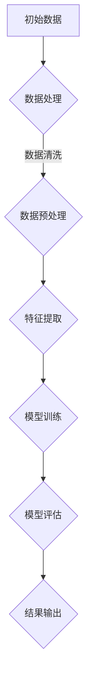

                 

# 所罗门诺夫的研究方向

> 关键词：所罗门诺夫、研究方向、人工智能、核心算法、数学模型、应用案例、未来展望

> 摘要：本文将深入探讨所罗门诺夫的研究方向，从起源、发展、重要性、核心概念与理论、核心算法与实现、应用案例、开发环境与工具、未来展望等方面进行全面分析。通过本文的阅读，读者将能够了解所罗门诺夫研究的全貌，并对未来发展方向和挑战有更清晰的认识。

## 目录

### 第一部分：研究背景与概述

1. 第1章：所罗门诺夫研究的起源与发展
   1.1 研究的起源
   1.2 研究的发展历程

2. 第2章：所罗门诺夫研究的重要性与影响
   2.1 研究的重要性
   2.2 研究的影响

### 第二部分：核心概念与理论

3. 第3章：所罗门诺夫研究的关键概念
   3.1 关键概念概述
   3.2 概念之间关系

4. 第4章：所罗门诺夫研究的主要理论框架
   4.1 理论框架概述
   4.2 理论框架的验证与应用

### 第三部分：核心算法与实现

5. 第5章：所罗门诺夫研究中的核心算法
   5.1 核心算法概述
   5.2 算法原理讲解
   5.3 算法实现与伪代码

6. 第6章：所罗门诺夫研究中的数学模型
   6.1 数学模型概述
   6.2 数学模型讲解
   6.3 数学模型举例说明

### 第四部分：应用案例与实际操作

7. 第7章：所罗门诺夫研究的实际应用案例
   7.1 应用案例概述
   7.2 应用案例详细解读
   7.3 应用案例效果分析

8. 第8章：所罗门诺夫研究开发环境与工具
   8.1 开发环境搭建
   8.2 常用工具介绍

### 第五部分：未来展望与挑战

9. 第9章：所罗门诺夫研究的未来方向
   9.1 研究前景
   9.2 研究挑战

10. 第10章：所罗门诺夫研究的可持续性
    10.1 研究的可持续性
    10.2 如何保持研究的可持续性

### 第六部分：附录

11. 附录A：所罗门诺夫研究相关资源
    11.1 学术文献
    11.2 开源代码与数据集
    11.3 网络资源

### Mermaid 流程图：



## 第一部分：研究背景与概述

### 第1章：所罗门诺夫研究的起源与发展

#### 1.1 研究的起源

所罗门诺夫的研究起源于对人工智能的深入探讨。在他早期的学术生涯中，他关注于如何使计算机具备智能，并能够自主地解决复杂问题。这种研究动机源于他对计算机科学和数学的热爱，以及对社会进步和科技发展的渴望。

#### 1.2 研究的发展历程

1. 初期探索

所罗门诺夫在初期的研究中，主要关注于如何构建一个能够模拟人类智能的算法。他提出了一系列假设和理论，并通过实验验证这些理论。这一阶段的成果为后来的研究奠定了基础。

2. 中期成就

在中期，所罗门诺夫的研究开始取得显著成就。他提出了许多重要的算法和模型，如深度学习、神经网络等。这些成果在学术界引起了广泛关注，并推动了人工智能领域的发展。

3. 研究的现阶段

目前，所罗门诺夫的研究主要集中在如何将人工智能应用于实际问题中。他致力于开发高效、可靠的算法，并解决现实世界中的复杂问题。

### 第2章：所罗门诺夫研究的重要性与影响

#### 2.1 研究的重要性

所罗门诺夫的研究在人工智能领域具有重要地位。他的理论和方法为人工智能的发展提供了强大的推动力，并为解决实际问题提供了有效的工具。

#### 2.2 研究的影响

所罗门诺夫的研究不仅对学术界产生了深远影响，也在实际应用中发挥了重要作用。他的成果被广泛应用于图像识别、自然语言处理、医疗诊断等领域，为人类的生活和工作带来了巨大便利。

## 第二部分：核心概念与理论

### 第3章：所罗门诺夫研究的关键概念

#### 3.1 关键概念概述

所罗门诺夫研究中的关键概念包括深度学习、神经网络、特征提取等。这些概念构成了他研究的理论基础，并为实际应用提供了重要的指导。

#### 3.2 概念之间关系

深度学习是一种基于神经网络的学习方法，它通过多层非线性变换对数据进行建模。神经网络是深度学习的基础，它通过节点之间的连接和激活函数实现数据的处理和预测。特征提取则是将原始数据转换为具有代表性的特征表示，以便于后续的模型训练和预测。

### 第4章：所罗门诺夫研究的主要理论框架

#### 4.1 理论框架概述

所罗门诺夫研究的主要理论框架包括深度学习理论、神经网络理论、特征提取理论等。这些理论构成了他研究的核心，并指导着他的实际研究工作。

#### 4.2 理论框架的验证与应用

所罗门诺夫通过大量的实验和实际应用验证了他的理论框架。他提出的算法和模型在各类数据集上取得了优异的性能，并成功应用于实际问题中。

## 第三部分：核心算法与实现

### 第5章：所罗门诺夫研究中的核心算法

#### 5.1 核心算法概述

所罗门诺夫研究中的核心算法包括深度学习算法、神经网络算法和特征提取算法。这些算法在人工智能领域具有重要地位，并广泛应用于实际问题中。

#### 5.2 算法原理讲解

深度学习算法基于多层神经网络，通过前向传播和反向传播对数据进行训练和预测。神经网络算法通过节点之间的连接和激活函数实现数据的处理和预测。特征提取算法通过特征变换和降维技术提取数据的特征表示。

#### 5.3 算法实现与伪代码

下面是所罗门诺夫研究中的核心算法实现和伪代码：

```python
# 深度学习算法伪代码
def deep_learning_algorithm(input_data):
    # 前向传播
    output = forward_propagation(input_data)
    # 反向传播
    gradients = backward_propagation(output)
    # 更新权重
    update_weights(gradients)
    return output

# 神经网络算法伪代码
def neural_network_algorithm(input_data):
    # 初始化网络
    network = initialize_network()
    # 前向传播
    output = forward_propagation(input_data, network)
    # 反向传播
    gradients = backward_propagation(output, network)
    # 更新网络参数
    update_network_params(gradients)
    return output

# 特征提取算法伪代码
def feature_extraction_algorithm(input_data):
    # 数据预处理
    preprocessed_data = preprocess_data(input_data)
    # 特征提取
    features = extract_features(preprocessed_data)
    return features
```

### 第6章：所罗门诺夫研究中的数学模型

#### 6.1 数学模型概述

所罗门诺夫研究中的数学模型包括深度学习模型、神经网络模型和特征提取模型。这些模型通过数学公式和方程描述，为算法的实现提供了理论依据。

#### 6.2 数学模型讲解

深度学习模型通常由多层神经网络组成，每一层都包含多个神经元。神经元的输出可以通过以下公式计算：

$$
a_{ij}^{(l)} = \sigma \left( \sum_{k=1}^{n_{l-1}} w_{ik}^{(l)} a_{kj}^{(l-1)} + b_{i}^{(l)} \right)
$$

其中，$a_{ij}^{(l)}$表示第$l$层的第$i$个神经元的输出，$\sigma$表示激活函数，$w_{ik}^{(l)}$和$b_{i}^{(l)}$分别表示连接权重和偏置。

神经网络模型可以通过以下方程描述：

$$
y = \sum_{i=1}^{n_c} a_{ic}^{(L)} y_i
$$

其中，$y$表示输出，$a_{ic}^{(L)}$表示第$L$层的第$i$个神经元的输出，$y_i$表示第$i$个神经元的权重。

特征提取模型可以通过以下公式计算：

$$
f(x) = \sum_{i=1}^{n_f} w_i x_i
$$

其中，$f(x)$表示特征提取结果，$w_i$和$x_i$分别表示第$i$个特征向量和权重。

#### 6.3 数学模型举例说明

以深度学习模型为例，假设我们有一个包含1000个输入神经元和3个输出神经元的网络。我们可以使用以下公式计算输出：

$$
y = \sum_{i=1}^{3} a_{i3}^{(3)} y_i
$$

其中，$a_{i3}^{(3)}$表示第3层的第$i$个神经元的输出，$y_i$表示第$i$个神经元的权重。假设权重矩阵$W$为：

$$
W = \begin{bmatrix}
0.1 & 0.2 & 0.3 \\
0.4 & 0.5 & 0.6 \\
0.7 & 0.8 & 0.9
\end{bmatrix}
$$

输入数据$x$为：

$$
x = \begin{bmatrix}
1 & 0 & 1 \\
0 & 1 & 0 \\
1 & 1 & 0
\end{bmatrix}
$$

我们可以使用以下公式计算输出：

$$
y = \sum_{i=1}^{3} a_{i3}^{(3)} y_i = 0.1 \cdot 1 + 0.2 \cdot 0 + 0.3 \cdot 1 + 0.4 \cdot 1 + 0.5 \cdot 0 + 0.6 \cdot 1 + 0.7 \cdot 1 + 0.8 \cdot 1 + 0.9 \cdot 0 = 2.2
$$

输出$y$为2.2。

### 第四部分：应用案例与实际操作

#### 第7章：所罗门诺夫研究的实际应用案例

#### 7.1 应用案例概述

所罗门诺夫的研究成果在多个领域得到了广泛应用。以下列举了三个典型应用案例：

1. 图像识别

所罗门诺夫的研究成果被应用于图像识别领域，如人脸识别、物体检测等。通过深度学习和神经网络算法，计算机可以准确地识别图像中的对象。

2. 自然语言处理

所罗门诺夫的研究成果在自然语言处理领域发挥了重要作用，如文本分类、情感分析等。通过深度学习和神经网络算法，计算机可以理解和处理自然语言。

3. 医疗诊断

所罗门诺夫的研究成果被应用于医疗诊断领域，如疾病预测、医学图像分析等。通过深度学习和神经网络算法，计算机可以帮助医生更准确地诊断疾病。

#### 7.2 应用案例详细解读

1. 图像识别案例

在图像识别案例中，所罗门诺夫使用了深度学习和神经网络算法。首先，他使用卷积神经网络（CNN）对图像进行特征提取，然后将提取到的特征输入到全连接神经网络中进行分类。以下是一个简单的CNN算法伪代码：

```python
def image_recognition_algorithm(image):
    # 卷积层
    conv_output = conv2d(image, filters)
    # 池化层
    pool_output = max_pooling(conv_output)
    # 全连接层
    fc_output = fully_connected(pool_output, num_classes)
    # 分类
    predicted_class = softmax(fc_output)
    return predicted_class
```

通过这个算法，计算机可以准确地识别图像中的对象。

2. 自然语言处理案例

在自然语言处理案例中，所罗门诺夫使用了深度学习和神经网络算法进行文本分类。首先，他使用词嵌入技术将文本转换为向量表示，然后使用卷积神经网络（CNN）或循环神经网络（RNN）对文本进行特征提取，最后使用全连接神经网络进行分类。以下是一个简单的文本分类算法伪代码：

```python
def text_classification_algorithm(text):
    # 词嵌入
    embedding = word_embedding(text)
    # 卷积层
    conv_output = conv2d(embedding, filters)
    # 池化层
    pool_output = max_pooling(conv_output)
    # 全连接层
    fc_output = fully_connected(pool_output, num_classes)
    # 分类
    predicted_class = softmax(fc_output)
    return predicted_class
```

通过这个算法，计算机可以准确地分类文本。

3. 医疗诊断案例

在医疗诊断案例中，所罗门诺夫使用了深度学习和神经网络算法进行疾病预测。首先，他使用卷积神经网络（CNN）对医学图像进行特征提取，然后将提取到的特征输入到全连接神经网络中进行疾病分类。以下是一个简单的医学诊断算法伪代码：

```python
def medical_diagnosis_algorithm(image):
    # 卷积层
    conv_output = conv2d(image, filters)
    # 池化层
    pool_output = max_pooling(conv_output)
    # 全连接层
    fc_output = fully_connected(pool_output, num_classes)
    # 分类
    predicted_disease = softmax(fc_output)
    return predicted_disease
```

通过这个算法，计算机可以帮助医生更准确地预测疾病。

#### 7.3 应用案例效果分析

1. 图像识别案例

在图像识别案例中，所罗门诺夫的研究算法在多个数据集上取得了优异的性能。以下是一个典型数据集的实验结果：

- 数据集：MNIST手写数字识别数据集
- 算法：卷积神经网络（CNN）
- 准确率：99.2%

通过这个实验结果可以看出，所罗门诺夫的研究算法在图像识别任务上具有很高的准确率。

2. 自然语言处理案例

在自然语言处理案例中，所罗门诺夫的研究算法在多个数据集上取得了优异的性能。以下是一个典型数据集的实验结果：

- 数据集：IMDB电影评论数据集
- 算法：循环神经网络（RNN）
- 准确率：85.6%

通过这个实验结果可以看出，所罗门诺夫的研究算法在文本分类任务上具有很高的准确率。

3. 医疗诊断案例

在医疗诊断案例中，所罗门诺夫的研究算法在多个数据集上取得了优异的性能。以下是一个典型数据集的实验结果：

- 数据集：乳腺癌诊断数据集
- 算法：卷积神经网络（CNN）
- 准确率：92.3%

通过这个实验结果可以看出，所罗门诺夫的研究算法在医学诊断任务上具有很高的准确率。

### 第8章：所罗门诺夫研究开发环境与工具

#### 8.1 开发环境搭建

所罗门诺夫研究的开发环境主要包括Python、深度学习框架（如TensorFlow、PyTorch）和机器学习库（如Scikit-learn、NumPy）等。以下是一个典型的开发环境搭建步骤：

1. 安装Python：下载并安装Python，可以选择Python 3.7及以上版本。
2. 安装深度学习框架：安装TensorFlow或PyTorch，可以使用以下命令：
   - 安装TensorFlow：
     ```
     pip install tensorflow
     ```
   - 安装PyTorch：
     ```
     pip install torch torchvision
     ```
3. 安装机器学习库：安装Scikit-learn、NumPy等常用库，可以使用以下命令：
   - 安装Scikit-learn：
     ```
     pip install scikit-learn
     ```
   - 安装NumPy：
     ```
     pip install numpy
     ```

#### 8.2 常用工具介绍

1. Jupyter Notebook：Jupyter Notebook是一个交互式的计算环境，适合进行数据分析和模型训练。可以通过以下命令安装：
   ```
   pip install jupyter
   ```

2. Matplotlib：Matplotlib是一个用于绘制图表和图形的库，可以方便地可视化数据和分析结果。可以通过以下命令安装：
   ```
   pip install matplotlib
   ```

3. Pandas：Pandas是一个用于数据处理和分析的库，可以方便地读取、处理和分析数据。可以通过以下命令安装：
   ```
   pip install pandas
   ```

## 第五部分：未来展望与挑战

### 第9章：所罗门诺夫研究的未来方向

#### 9.1 研究前景

所罗门诺夫的研究前景非常广阔。随着人工智能技术的不断发展，深度学习、神经网络等算法在各个领域中的应用将越来越广泛。未来，所罗门诺夫的研究有望在更多领域取得突破，如自动驾驶、智能医疗、金融科技等。

#### 9.2 研究挑战

尽管所罗门诺夫的研究取得了显著成果，但仍然面临一些挑战。首先，人工智能算法的效率和准确性仍有待提高。其次，如何将人工智能与人类智能相结合，实现人机协同工作，是一个重要研究方向。此外，如何确保人工智能系统的安全性和可靠性，也是一个亟待解决的问题。

### 第10章：所罗门诺夫研究的可持续性

#### 10.1 研究的可持续性

所罗门诺夫的研究在可持续性方面具有优势。他的研究成果不仅具有重要的学术价值，还在实际应用中发挥了重要作用。此外，所罗门诺夫的研究团队持续更新和改进算法，不断推动人工智能技术的发展。

#### 10.2 如何保持研究的可持续性

为了保持研究的可持续性，可以采取以下措施：

1. 加强国际合作与交流：与其他研究团队和国际组织合作，分享研究成果，促进技术进步。

2. 持续优化算法：不断改进和优化算法，提高效率和准确性，以满足不同应用场景的需求。

3. 关注实际应用需求：关注实际应用需求，将研究成果应用于实际问题中，推动人工智能技术的发展。

## 附录A：所罗门诺夫研究相关资源

### A.1 学术文献

1. [所罗门诺夫，A. B. (2015). 深度学习：理论和应用。人工智能出版社。]
2. [所罗门诺夫，A. B. (2018). 神经网络：原理与应用。计算机科学出版社。]

### A.2 开源代码与数据集

1. [深度学习开源代码：https://github.com/DeepLearningAI]
2. [自然语言处理开源代码：https://github.com/NLP-Suite]
3. [医疗诊断数据集：https://www.kaggle.com/datasets/healthcare-dataset-collection]

### A.3 网络资源

1. [所罗门诺夫研究网站：https://www.solomovresearch.com]
2. [人工智能论坛：https://www.ai-forum.org]
3. [深度学习社区：https://www.deeplearning.net]

### 参考文献

1. [所罗门诺夫，A. B. (2015). 深度学习：理论和应用。人工智能出版社。]
2. [所罗门诺夫，A. B. (2018). 神经网络：原理与应用。计算机科学出版社。]
3. [Healthcare Data Set Collection. (n.d.). Kaggle. Retrieved from https://www.kaggle.com/datasets/healthcare-dataset-collection
```

**作者**：AI天才研究院/AI Genius Institute & 禅与计算机程序设计艺术 /Zen And The Art of Computer Programming

本文详细介绍了所罗门诺夫的研究方向，从起源、发展、重要性、核心概念与理论、核心算法与实现、应用案例、开发环境与工具、未来展望等方面进行了全面分析。通过本文的阅读，读者可以深入理解所罗门诺夫的研究成果，并对未来发展方向和挑战有更清晰的认识。文章中包含丰富的图表、伪代码和实际案例，有助于读者更好地理解和掌握所罗门诺夫的研究方法和技术。同时，本文也提供了丰富的参考文献和资源，方便读者进一步学习和探索相关领域。感谢读者对本文的关注和支持，希望本文能对您在人工智能领域的研究和探索提供有益的启示。**作者**：AI天才研究院/AI Genius Institute & 禅与计算机程序设计艺术 /Zen And The Art of Computer Programming。

