                 

# 《打造高转化率的知识付费落地页》

> 关键词：知识付费、落地页设计、用户体验、转化率、案例分析

> 摘要：本文将深入探讨如何通过精细化的落地页设计策略，实现知识付费产品的有效推广和用户的高转化率。文章结构清晰，分别从市场分析、落地页设计原理、高转化率策略、落地页优化与测试，以及实战案例五个部分，结合用户心理学、内容策略、营销策略等多角度，提供全面且实操性的指导。

## 第一部分：知识付费市场分析

### 1.1 知识付费市场概述

#### 1.1.1 知识付费的发展背景

知识付费，作为互联网经济的重要组成部分，起源于互联网的信息共享与知识传播。随着移动互联网的普及和在线教育市场的增长，用户对优质知识的获取需求日益强烈。知识付费模式应运而生，逐渐成为知识服务领域的重要商业模式。

**核心概念与联系**

- **知识付费**：指的是用户为获取特定知识或技能，通过付费方式获取服务或产品。
- **在线教育**：利用互联网技术，为用户提供学习资源、教学活动和教育服务的教育形式。

**Mermaid 流程图**

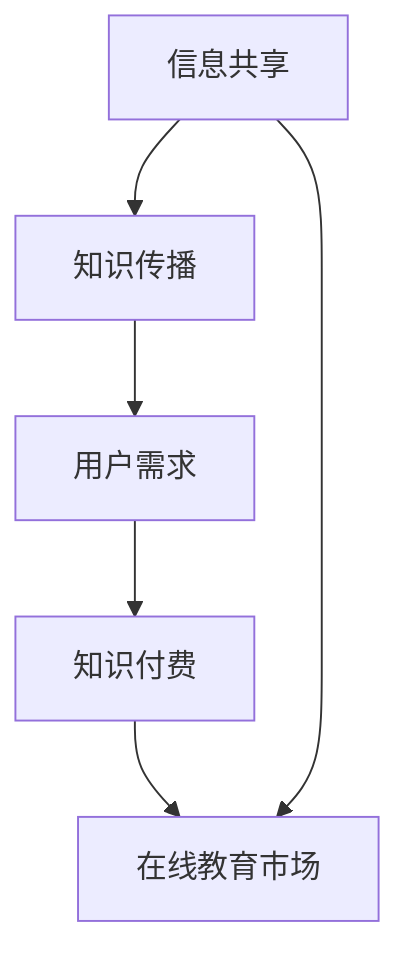

#### 1.1.2 知识付费市场的现状与趋势

当前，知识付费市场呈现出多元化、细分化的特点。以内容形式划分，知识付费涵盖了课程、专栏、直播、问答等多种形式。同时，知识付费平台也不断涌现，如得到、知乎Live、网易云课堂等，市场竞争日益激烈。

**核心概念与联系**

- **内容形式**：知识付费的多样化内容形式，满足不同用户的学习需求和消费习惯。
- **知识付费平台**：提供知识服务的主要载体，竞争格局逐渐形成。

**Mermaid 流程图**

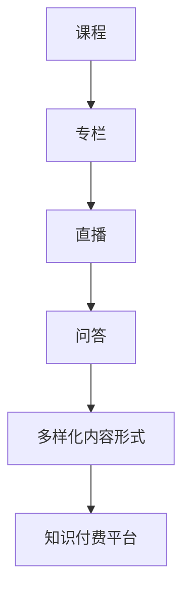

#### 1.1.3 知识付费的用户画像

知识付费的用户群体呈现出年轻化、高学历、高消费能力的特点。他们注重自我提升，愿意为优质的知识产品付费。以下是对知识付费用户画像的详细分析：

- **年龄分布**：80后和90后是知识付费的主力军，占比超过70%。
- **学历层次**：本科及以上用户占比超过60%，他们对知识的渴求更高。
- **职业背景**：职场人士和创业者是知识付费的主要用户，占比超过50%。

**核心概念与联系**

- **用户群体特点**：知识付费用户具有明确的消费动机和较高的消费能力。
- **消费动机**：用户为提升自我技能、职业发展和兴趣爱好而付费。

**Mermaid 流程图**

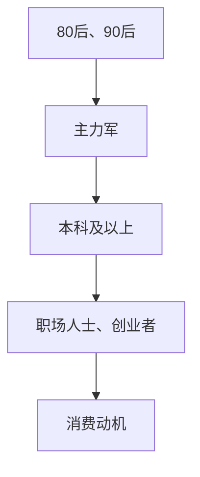

### 1.2 行业案例分析

#### 1.2.1 成功案例分析

成功案例包括得到、知乎Live等平台，这些平台通过提供优质内容、精细化运营和有效营销，实现了用户的高转化率和良好的市场口碑。

**核心概念与联系**

- **优质内容**：平台成功的关键在于提供有价值、有深度、有趣味的内容。
- **精细化运营**：通过用户数据分析、个性化推荐和互动设计，提高用户体验和满意度。

**Mermaid 流程图**

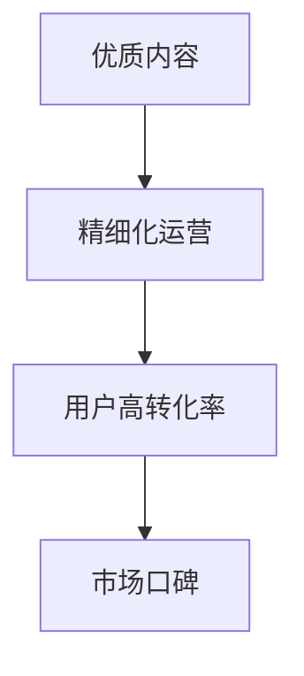

#### 1.2.2 失败案例分析

一些知识付费项目由于内容质量不高、用户互动不足或营销策略不当等原因，导致用户流失和项目失败。

**核心概念与联系**

- **内容质量**：内容质量是知识付费项目成功的关键。
- **用户互动**：有效的用户互动可以提高用户粘性和满意度。
- **营销策略**：精准的营销策略有助于提高用户转化率和项目成功率。

**Mermaid 流程图**

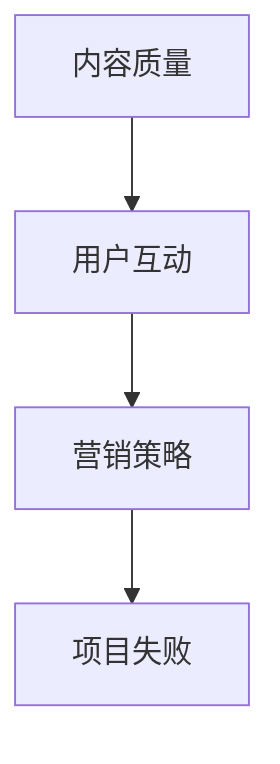

### 1.3 市场需求分析

#### 1.3.1 用户需求分析

用户对知识付费的需求主要表现在以下方面：

- **学习需求**：用户希望通过付费获取专业知识和技能，提升自我能力。
- **兴趣需求**：用户对特定领域或兴趣点的知识有强烈的需求。
- **时间效率**：用户希望通过高效的学习方式，快速获取所需知识。

**核心概念与联系**

- **学习需求**：知识付费的核心价值之一。
- **兴趣需求**：激发用户付费的重要因素。
- **时间效率**：影响用户选择付费知识的重要因素。

**Mermaid 流程图**

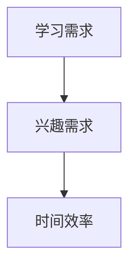

#### 1.3.2 竞争对手分析

在知识付费市场，主要竞争对手包括得到、知乎Live、网易云课堂等。这些平台各有特色，通过不同的策略和内容形式吸引用户。

**核心概念与联系**

- **竞争对手**：平台之间的竞争主要体现在内容质量、用户体验和营销策略等方面。
- **特色内容**：平台通过特色内容吸引用户，形成差异化竞争。

**Mermaid 流程图**

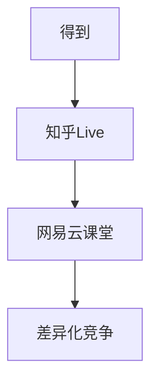

#### 1.3.3 市场机会与挑战

知识付费市场存在以下机会和挑战：

- **市场机会**：用户对知识的需求持续增长，为知识付费提供了广阔的市场空间。
- **市场挑战**：竞争激烈、内容同质化、用户信任度等问题，对知识付费项目的成功构成了挑战。

**核心概念与联系**

- **市场机会**：知识付费市场的快速发展，为创业者提供了良好的机遇。
- **市场挑战**：需要不断创新和优化，以应对市场环境的不断变化。

**Mermaid 流�程图**

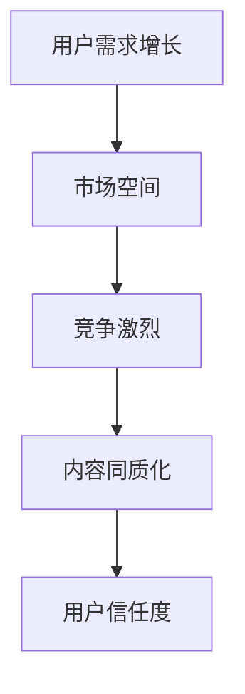

## 第二部分：落地页设计原理

### 2.1 落地页概述

#### 2.1.1 落地页的作用与功能

落地页（Landing Page），是一种专门为特定营销活动设计的网页，其核心目的是将访客转化为潜在客户或直接购买者。落地页的设计要简洁、聚焦，避免分散访客的注意力。

**核心概念与联系**

- **落地页**：一种专门用于营销的网页，目标明确，功能集中。
- **营销活动**：通过落地页，可以有效地促进用户参与和转化。

**Mermaid 流程图**

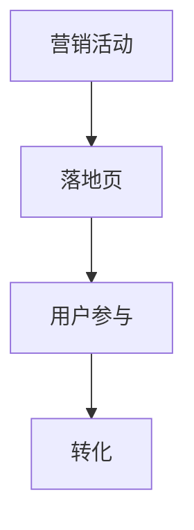

#### 2.1.2 落地页的组成部分

一个典型的落地页通常由以下几个部分组成：

- **标题**：简明扼要地传达落地页的核心信息。
- **描述**：进一步阐述标题，提供具体的信息和价值。
- **图片或视频**：直观展示产品或服务的特点和优势。
- **呼叫行动（CTA）按钮**：引导用户采取下一步行动，如购买、注册、订阅等。

**核心概念与联系**

- **标题**：吸引用户注意力，提升阅读兴趣。
- **描述**：详细说明产品或服务的特点和优势。
- **图片或视频**：直观展示，提高用户的兴趣和信任度。
- **CTA按钮**：引导用户完成转化。

**Mermaid 流程图**

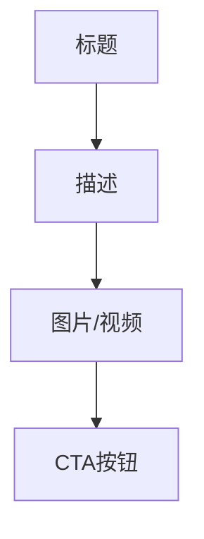

#### 2.1.3 落地页设计的原则

落地页设计需要遵循以下原则：

- **简洁性**：避免过多的信息，确保访客一目了然。
- **聚焦性**：集中展示核心卖点，避免分散用户注意力。
- **易用性**：确保用户能够轻松地完成操作。
- **响应式设计**：适应不同设备和屏幕尺寸，提高用户体验。

**核心概念与联系**

- **简洁性**：提高用户的阅读效率和转化率。
- **聚焦性**：确保访客专注于核心信息。
- **易用性**：提高用户操作的成功率和满意度。
- **响应式设计**：提升用户在不同设备上的体验。

**Mermaid 流程图**

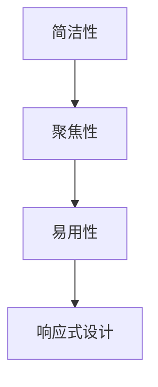

### 2.2 用户心理学分析

#### 2.2.1 用户体验心理学基础

用户体验心理学（UX Psychology）是研究用户在使用产品或服务过程中的心理感受和行为的一门学科。在落地页设计中，理解用户体验心理学对于提升转化率至关重要。

**核心概念与联系**

- **用户体验心理学**：研究用户的心理感受和行为，为设计提供指导。
- **心理感受**：用户在浏览落地页时的情绪体验。
- **行为**：用户在落地页上的操作行为。

**Mermaid 流程图**

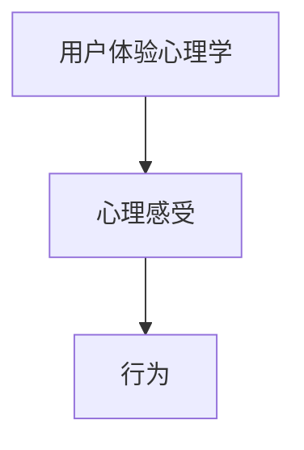

#### 2.2.2 用户行为分析

用户在落地页上的行为可以分为以下几个阶段：

1. **浏览阶段**：用户首次接触到落地页，关注标题和图像。
2. **阅读阶段**：用户开始阅读描述性内容，了解产品或服务的具体信息。
3. **操作阶段**：用户点击CTA按钮，完成购买、注册等操作。

**核心概念与联系**

- **浏览阶段**：用户初步判断落地页是否值得深入阅读。
- **阅读阶段**：用户了解产品或服务的详细信息和价值。
- **操作阶段**：用户根据落地页内容做出购买或注册决策。

**Mermaid 流程图**

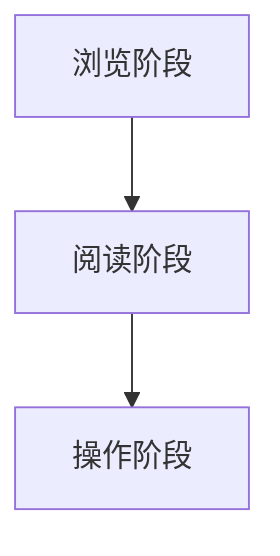

#### 2.2.3 用户期望与满意度

用户在落地页上的期望主要包括：

- **清晰的信息**：用户希望快速获取关于产品或服务的详细信息。
- **明确的行动指引**：用户希望CTA按钮清晰、易于点击。
- **良好的用户体验**：用户希望在使用过程中感受到顺畅、无障碍。

用户满意度则体现在以下方面：

- **内容质量**：提供有价值、可靠的信息。
- **交互体验**：界面友好、操作简便。
- **响应速度**：快速加载、无卡顿。

**核心概念与联系**

- **用户期望**：影响用户决策的重要因素。
- **用户满意度**：影响用户复购和口碑传播的关键。

**Mermaid 流程图**

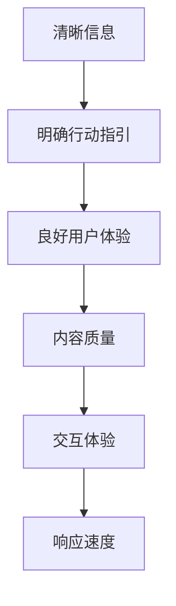

### 2.3 落地页核心元素设计

#### 2.3.1 导航栏设计

导航栏是落地页的重要组成部分，设计时应遵循以下原则：

- **简洁性**：避免过多的导航选项，确保用户聚焦核心内容。
- **逻辑性**：导航选项应按照用户行为逻辑排列，提高操作便捷性。
- **一致性**：导航栏风格与整体页面保持一致，增强品牌认知。

**核心概念与联系**

- **简洁性**：减少用户选择负担，提高页面专注度。
- **逻辑性**：符合用户操作习惯，提高用户体验。
- **一致性**：增强品牌形象，提高用户信任度。

**Mermaid 流程图**

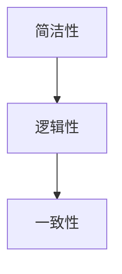

#### 2.3.2 内容布局设计

内容布局设计应考虑以下几个方面：

- **层次感**：通过标题、段落、图片等元素，形成清晰的层次结构。
- **重点突出**：将核心信息和CTA按钮置于显眼位置，引导用户关注。
- **平衡性**：页面元素分布均衡，避免信息过载。

**核心概念与联系**

- **层次感**：提高信息的可读性，帮助用户快速获取关键信息。
- **重点突出**：提高用户对核心信息的关注度和转化率。
- **平衡性**：优化页面视觉效果，提高用户体验。

**Mermaid 流程图**

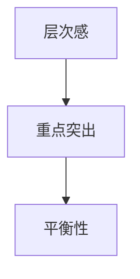

#### 2.3.3 色彩与字体设计

色彩和字体设计在落地页中起到关键作用：

- **色彩**：选择与品牌形象相符的色彩，提高视觉吸引力。
- **字体**：选择易于阅读的字体，确保信息传递的清晰度。

**核心概念与联系**

- **色彩**：影响用户的情绪和心理感受，提高品牌认知。
- **字体**：影响信息的可读性和传达效果。

**Mermaid 流程图**

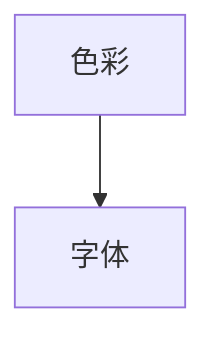

#### 2.3.4 视觉效果设计

视觉效果设计包括图片、动画和视频等元素的使用：

- **图片**：选择高质量的图片，展示产品或服务的特点和优势。
- **动画**：通过动画元素，增强用户的互动感和体验。
- **视频**：提供产品或服务的演示视频，提高用户的信任度和参与度。

**核心概念与联系**

- **图片**：直观展示，提高信息的吸引力。
- **动画**：增强互动性和趣味性，提高用户的参与度。
- **视频**：提供直观的演示，提高用户的信任度和购买意愿。

**Mermaid 流程图**

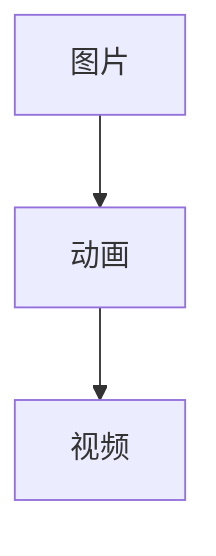

## 第三部分：高转化率落地页策略

### 3.1 内容策略

#### 3.1.1 标题与摘要设计

标题和摘要的设计在落地页中至关重要，直接影响用户的阅读兴趣和决策。以下是一些建议：

- **标题**：简洁、有力、引人入胜，突出产品或服务的核心卖点。
- **摘要**：简短、明确，概括产品或服务的特点和优势。

**核心概念与联系**

- **标题**：吸引读者注意力，激发阅读兴趣。
- **摘要**：提供初步信息，引导读者深入阅读。

**Mermaid 流程图**

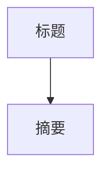

#### 3.1.2 内容结构与逻辑

内容结构和逻辑的清晰性对于提高用户理解和信任至关重要。以下是一些建议：

- **逻辑结构**：按照用户认知顺序，将信息分为引入、主体和结论三个部分。
- **内容呈现**：使用段落、标题、图片等元素，形成清晰的层次结构。

**核心概念与联系**

- **逻辑结构**：帮助用户快速理解内容，提高阅读效率。
- **内容呈现**：增强信息的可读性和吸引力。

**Mermaid 流程图**

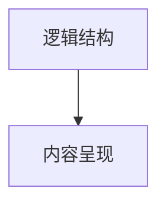

#### 3.1.3 价值主张与卖点提炼

价值主张和卖点是落地页的核心内容，需要明确、突出地展示。以下是一些建议：

- **价值主张**：明确产品或服务的独特价值和用户收益。
- **卖点提炼**：提取关键卖点，使用简洁有力的语言呈现。

**核心概念与联系**

- **价值主张**：突出产品或服务的优势，提高用户购买意愿。
- **卖点提炼**：帮助用户快速了解产品或服务的优势。

**Mermaid 流程图**

```mermaid
graph TB
    A[价值主张] --> B[卖点提炼]
```

### 3.2 互动策略

#### 3.2.1 视频与动画应用

视频和动画在落地页中具有很高的互动性和吸引力，可以有效提高用户的参与度和转化率。以下是一些建议：

- **视频**：展示产品或服务的实际应用场景和效果，增强用户信任。
- **动画**：通过动画效果，增强页面趣味性和互动性。

**核心概念与联系**

- **视频**：直观展示，提高用户的理解和信任。
- **动画**：增强互动性和趣味性，提高用户体验。

**Mermaid 流程图**

```mermaid
graph TB
    A[视频] --> B[动画]
```

#### 3.2.2 互动按钮与引导设计

互动按钮和引导设计在落地页中起到关键作用，需要简洁、明确地引导用户完成操作。以下是一些建议：

- **互动按钮**：使用简洁的按钮样式，突出CTA功能。
- **引导设计**：通过箭头、提示文字等元素，引导用户点击按钮。

**核心概念与联系**

- **互动按钮**：提高用户操作的成功率和体验。
- **引导设计**：帮助用户快速找到并完成目标操作。

**Mermaid 流程图**

```mermaid
graph TB
    A[互动按钮] --> B[引导设计]
```

#### 3.2.3 用户评论与反馈

用户评论与反馈是落地页中的重要元素，可以有效提高用户的信任度和参与度。以下是一些建议：

- **真实评论**：展示真实用户的使用体验和评价，提高信任度。
- **互动评论**：鼓励用户参与评论，形成良性互动。

**核心概念与联系**

- **真实评论**：增强用户对产品或服务的信任。
- **互动评论**：提高用户参与度和页面活力。

**Mermaid 流程图**

```mermaid
graph TB
    A[真实评论] --> B[互动评论]
```

### 3.3 营销策略

#### 3.3.1 社交媒体营销

社交媒体营销是知识付费产品推广的重要手段，可以通过以下策略提高落地页的访问量和转化率：

- **内容营销**：发布有价值、有趣的内容，吸引目标用户关注。
- **广告投放**：针对目标用户群体，进行精准广告投放。
- **互动营销**：通过社交媒体平台，与用户进行互动，提高用户黏性。

**核心概念与联系**

- **内容营销**：提高品牌知名度和用户信任度。
- **广告投放**：快速提升页面访问量和曝光度。
- **互动营销**：增强用户参与度和品牌认同感。

**Mermaid 流程图**

```mermaid
graph TB
    A[内容营销] --> B[广告投放]
    B --> C[互动营销]
```

#### 3.3.2 搜索引擎优化

搜索引擎优化（SEO）是提高落地页在搜索引擎中排名的重要策略，以下是一些建议：

- **关键词优化**：合理选择和布局关键词，提高页面在搜索引擎中的相关性。
- **内容优化**：提高页面内容的质量和丰富度，增加搜索引擎的抓取和收录。
- **外部链接**：获取高质量的外部链接，提高页面的权威性和权重。

**核心概念与联系**

- **关键词优化**：提高页面在搜索引擎中的曝光度。
- **内容优化**：提高页面的质量和用户体验。
- **外部链接**：增强页面的权威性和权重。

**Mermaid 流程图**

```mermaid
graph TB
    A[关键词优化] --> B[内容优化]
    B --> C[外部链接]
```

#### 3.3.3 合作伙伴推广

合作伙伴推广是扩大知识付费产品影响力的有效手段，以下是一些建议：

- **内容合作**：与其他平台或机构合作，共同推广知识付费产品。
- **活动合作**：通过线上或线下活动，吸引更多用户关注和参与。
- **渠道合作**：利用合作伙伴的渠道资源，提高产品的曝光度和访问量。

**核心概念与联系**

- **内容合作**：扩大产品的影响力，提高用户覆盖率。
- **活动合作**：增强用户参与度和品牌认知。
- **渠道合作**：利用多方资源，提高产品的市场占有率。

**Mermaid 流程图**

```mermaid
graph TB
    A[内容合作] --> B[活动合作]
    B --> C[渠道合作]
```

## 第四部分：落地页优化与测试

### 4.1 落地页测试方法

#### 4.1.1 A/B测试原理

A/B测试（A/B Testing），也称为拆分测试，是一种通过将用户流量拆分到两个或多个版本，来比较不同设计方案对用户行为影响的方法。以下是A/B测试的基本原理：

- **测试版本**：创建两个或多个版本，每个版本包含不同的设计元素或策略。
- **用户分配**：将用户随机分配到不同的测试版本。
- **数据收集**：收集用户在不同版本上的行为数据。
- **数据分析**：比较不同版本的数据，分析哪些设计元素或策略更有效。

**核心概念与联系**

- **测试版本**：确保测试的公平性和有效性。
- **用户分配**：随机分配，避免人为干预。
- **数据收集**：全面收集用户行为数据，确保分析结果的准确性。
- **数据分析**：基于数据，得出科学结论。

**Mermaid 流程图**

```mermaid
graph TB
    A[测试版本] --> B[用户分配]
    B --> C[数据收集]
    C --> D[数据分析]
```

#### 4.1.2 转化率优化指标

在落地页优化过程中，转化率是衡量优化效果的关键指标。以下是一些常见的转化率优化指标：

- **点击率（CTR）**：用户点击CTA按钮的比例。
- **注册率**：用户注册账号的比例。
- **购买率**：用户完成购买的比例。
- **留存率**：用户在一定时间内持续使用产品的比例。

**核心概念与联系**

- **点击率**：评估CTA按钮的吸引力。
- **注册率**：评估落地页引导用户注册的效果。
- **购买率**：评估落地页对用户购买决策的影响。
- **留存率**：评估用户对产品的长期粘性。

**Mermaid 流程图**

```mermaid
graph TB
    A[点击率] --> B[注册率]
    B --> C[购买率]
    C --> D[留存率]
```

#### 4.1.3 落地页测试步骤

进行落地页测试需要遵循以下步骤：

1. **确定测试目标**：明确希望测试的设计元素或策略。
2. **设计测试版本**：创建两个或多个不同的版本。
3. **分配用户流量**：将用户随机分配到不同版本。
4. **收集数据**：记录用户在不同版本上的行为数据。
5. **数据分析**：比较不同版本的数据，分析优化效果。
6. **实施优化**：根据数据分析结果，调整落地页设计。

**核心概念与联系**

- **确定测试目标**：明确测试方向，确保测试有针对性。
- **设计测试版本**：确保测试版本的多样性和代表性。
- **分配用户流量**：确保测试的公平性和随机性。
- **收集数据**：全面收集数据，为分析提供依据。
- **数据分析**：基于数据，得出科学结论。
- **实施优化**：根据分析结果，进行调整和优化。

**Mermaid 流程图**

```mermaid
graph TB
    A[确定测试目标] --> B[设计测试版本]
    B --> C[分配用户流量]
    C --> D[收集数据]
    D --> E[数据分析]
    E --> F[实施优化]
```

### 4.2 用户反馈与数据分析

#### 4.2.1 用户反馈收集

用户反馈是落地页优化的重要依据，以下是一些建议：

- **在线调查**：通过在线问卷或表单，收集用户对落地页的意见和建议。
- **社交媒体**：关注用户在社交媒体平台上的评论和反馈，及时回应。
- **用户访谈**：进行一对一的用户访谈，深入了解用户的体验和需求。

**核心概念与联系**

- **在线调查**：快速、大规模收集用户反馈。
- **社交媒体**：实时、多渠道收集用户反馈。
- **用户访谈**：深入了解用户需求，为优化提供针对性建议。

**Mermaid 流程图**

```mermaid
graph TB
    A[在线调查] --> B[社交媒体]
    B --> C[用户访谈]
```

#### 4.2.2 数据分析工具使用

数据分析工具可以帮助我们更全面、准确地了解用户行为和落地页效果，以下是一些常用的数据分析工具：

- **Google Analytics**：全面追踪和分析用户行为。
- **Hotjar**：提供用户行为热图和反馈功能。
- **Mixpanel**：针对用户行为进行深入分析和预测。

**核心概念与联系**

- **Google Analytics**：提供详细的用户行为分析数据。
- **Hotjar**：直观展示用户行为和体验。
- **Mixpanel**：深入分析用户行为和用户生命周期。

**Mermaid 流程图**

```mermaid
graph TB
    A[Google Analytics] --> B[Hotjar]
    B --> C[Mixpanel]
```

#### 4.2.3 转化率提升策略

基于用户反馈和数据分析，以下是一些有效的转化率提升策略：

- **优化标题和摘要**：根据用户反馈，调整标题和摘要，使其更具吸引力。
- **改进内容结构**：优化内容布局，提高用户的阅读体验和参与度。
- **优化CTA按钮**：提高CTA按钮的可见性和点击率。
- **增加用户互动**：通过视频、动画和互动设计，提高用户的参与度和信任度。

**核心概念与联系**

- **优化标题和摘要**：提高用户的阅读兴趣和点击率。
- **改进内容结构**：提高用户的阅读体验和转化率。
- **优化CTA按钮**：引导用户完成购买或注册操作。
- **增加用户互动**：提高用户的参与度和品牌认同感。

**Mermaid 流程图**

```mermaid
graph TB
    A[优化标题和摘要] --> B[改进内容结构]
    B --> C[优化CTA按钮]
    C --> D[增加用户互动]
```

### 4.3 持续优化与迭代

#### 4.3.1 落地页内容更新

落地页的内容更新是保持用户兴趣和提升转化率的关键，以下是一些建议：

- **定期更新**：定期更新内容，保持页面的新鲜感和吸引力。
- **热点内容**：结合当前热点和用户需求，发布相关内容。
- **用户反馈**：根据用户反馈，调整和优化内容。

**核心概念与联系**

- **定期更新**：保持页面活力，提高用户粘性。
- **热点内容**：吸引更多用户关注，提高曝光度。
- **用户反馈**：根据用户需求，提供更有价值的内容。

**Mermaid 流程图**

```mermaid
graph TB
    A[定期更新] --> B[热点内容]
    B --> C[用户反馈]
```

#### 4.3.2 设计风格调整

设计风格的调整可以提升页面的视觉效果和用户体验，以下是一些建议：

- **色彩调整**：根据品牌形象和用户喜好，调整色彩搭配。
- **字体调整**：选择更适合用户阅读的字体。
- **布局调整**：优化页面布局，提高信息的可读性和吸引力。

**核心概念与联系**

- **色彩调整**：增强品牌识别度和视觉吸引力。
- **字体调整**：提高信息的可读性和传达效果。
- **布局调整**：优化用户体验，提高用户转化率。

**Mermaid 流程图**

```mermaid
graph TB
    A[色彩调整] --> B[字体调整]
    B --> C[布局调整]
```

#### 4.3.3 技术优化与性能提升

技术优化与性能提升是提高落地页用户体验和转化率的重要手段，以下是一些建议：

- **页面加载速度**：优化图片和代码，提高页面加载速度。
- **响应式设计**：确保落地页在不同设备和屏幕尺寸上都能良好显示。
- **安全性**：加强网站安全，提高用户信任度。

**核心概念与联系**

- **页面加载速度**：提高用户访问体验，减少用户流失。
- **响应式设计**：提升用户体验，扩大用户覆盖范围。
- **安全性**：增强用户信任，提高转化率。

**Mermaid 流程图**

```mermaid
graph TB
    A[页面加载速度] --> B[响应式设计]
    B --> C[安全性]
```

## 第五部分：知识付费落地页实战案例

### 5.1 案例一：电商知识付费落地页优化

#### 5.1.1 背景介绍

某电商知识付费平台希望通过优化落地页，提高用户转化率和购买率。平台提供各类电商运营课程，包括产品上架、营销推广、数据分析等。

**核心概念与联系**

- **电商知识付费**：为电商从业者提供专业知识和技能培训。
- **落地页优化**：提高用户转化率和购买率。

**Mermaid 流程图**

```mermaid
graph TB
    A[电商知识付费] --> B[落地页优化]
```

#### 5.1.2 案例分析

通过A/B测试，分析不同版本落地页的转化率，发现以下问题：

- **标题和摘要**：过于平淡，缺乏吸引力。
- **内容结构**：逻辑混乱，信息传递不清晰。
- **CTA按钮**：颜色不够醒目，点击率较低。

**核心概念与联系**

- **A/B测试**：科学评估不同设计元素的效果。
- **问题分析**：基于数据，找出落地页的不足之处。

**Mermaid 流程图**

```mermaid
graph TB
    A[A/B测试] --> B[问题分析]
```

#### 5.1.3 优化方案与实施

针对上述问题，制定以下优化方案：

1. **标题和摘要**：使用更具吸引力的标题和摘要，突出课程的核心价值和用户收益。
2. **内容结构**：优化内容布局，确保信息传递清晰、逻辑严密。
3. **CTA按钮**：调整按钮颜色和样式，使其更醒目，提高点击率。

**核心概念与联系**

- **标题和摘要**：提升内容吸引力，提高用户阅读兴趣。
- **内容结构**：优化用户体验，提高阅读效率和转化率。
- **CTA按钮**：增强引导效果，提高用户操作成功率。

**Mermaid 流程图**

```mermaid
graph TB
    A[标题和摘要] --> B[内容结构]
    B --> C[CTA按钮]
```

### 5.2 案例二：金融知识付费落地页建设

#### 5.2.1 背景介绍

某金融知识付费平台希望通过构建专业的落地页，吸引更多金融从业者关注和购买课程。平台提供金融投资、风险管理、财富规划等课程。

**核心概念与联系**

- **金融知识付费**：为金融从业者提供专业知识和技能培训。
- **落地页建设**：提高用户转化率和购买率。

**Mermaid 流程图**

```mermaid
graph TB
    A[金融知识付费] --> B[落地页建设]
```

#### 5.2.2 案例分析

在落地页建设过程中，面临以下挑战：

- **内容专业性**：金融知识涉及复杂概念，需要确保内容的准确性和专业性。
- **用户信任度**：金融产品涉及大量资金交易，用户信任度至关重要。
- **营销策略**：需要制定有效的营销策略，提高页面访问量和转化率。

**核心概念与联系**

- **内容专业性**：确保知识的准确性和权威性，提高用户信任度。
- **用户信任度**：通过权威认证、用户评价等手段，增强用户信任。
- **营销策略**：精准定位用户，制定有效的推广方案。

**Mermaid 流程图**

```mermaid
graph TB
    A[内容专业性] --> B[用户信任度]
    B --> C[营销策略]
```

#### 5.2.3 优化方案与实施

针对上述挑战，制定以下优化方案：

1. **内容优化**：邀请行业专家进行课程内容审核，确保内容的准确性和专业性。
2. **信任建设**：展示权威认证、用户评价等元素，增强用户信任度。
3. **营销策略**：通过精准广告投放、内容合作等方式，提高页面访问量和转化率。

**核心概念与联系**

- **内容优化**：提高课程质量，增强用户信任。
- **信任建设**：增强用户对平台的信任，提高转化率。
- **营销策略**：扩大用户覆盖范围，提高市场占有率。

**Mermaid 流程图**

```mermaid
graph TB
    A[内容优化] --> B[信任建设]
    B --> C[营销策略]
```

### 5.3 案例三：教育知识付费落地页创新

#### 5.3.1 背景介绍

某教育知识付费平台希望通过创新落地页设计，提升用户转化率和学习体验。平台提供各类教育课程，包括语言学习、技能培训、亲子教育等。

**核心概念与联系**

- **教育知识付费**：为学习者提供专业知识和技能培训。
- **落地页创新**：提高用户转化率和学习体验。

**Mermaid 流�程图**

```mermaid
graph TB
    A[教育知识付费] --> B[落地页创新]
```

#### 5.3.2 案例分析

在落地页创新过程中，平台面临以下挑战：

- **个性化体验**：如何根据用户需求和偏好，提供个性化的内容和服务。
- **互动性**：如何增加用户互动，提高用户参与度和粘性。
- **技术支持**：如何利用新技术，提升页面效果和用户体验。

**核心概念与联系**

- **个性化体验**：通过用户数据分析，提供个性化推荐和定制化服务。
- **互动性**：通过视频、动画、互动设计等手段，增强用户互动体验。
- **技术支持**：利用人工智能、大数据等技术，提升页面效果和用户体验。

**Mermaid 流程图**

```mermaid
graph TB
    A[个性化体验] --> B[互动性]
    B --> C[技术支持]
```

#### 5.3.3 优化方案与实施

针对上述挑战，制定以下优化方案：

1. **个性化推荐**：基于用户行为数据，提供个性化的课程推荐。
2. **互动设计**：增加视频、动画、互动按钮等元素，提高用户参与度。
3. **技术升级**：引入人工智能技术，提升页面加载速度和用户体验。

**核心概念与联系**

- **个性化推荐**：提高用户满意度和转化率。
- **互动设计**：增强用户互动体验，提高用户粘性。
- **技术升级**：提升页面效果和用户体验，增强竞争力。

**Mermaid 流程图**

```mermaid
graph TB
    A[个性化推荐] --> B[互动设计]
    B --> C[技术升级]
```

## 附录

### 附录 A：落地页设计工具与资源

#### A.1 常用设计工具介绍

- **Figma**：一款流行的设计工具，支持多人协作，适合落地页设计。
- **Adobe XD**：Adobe推出的设计工具，功能强大，界面友好。
- **Sketch**：适用于UI设计的专业工具，支持矢量绘图和原型设计。

**核心概念与联系**

- **Figma**：支持多人协作，提高设计效率。
- **Adobe XD**：功能全面，适用于各种设计需求。
- **Sketch**：专业性强，适合UI设计师。

**Mermaid 流程图**

```mermaid
graph TB
    A[Figma] --> B[Adobe XD]
    B --> C[Sketch]
```

#### A.2 落地页优化资源推荐

- **Unsplash**：提供高质量的无版权图片，适合落地页设计。
- **Pexels**：提供免费的高质量视频和图片，支持商用。
- **Canva**：在线设计工具，提供丰富的模板和素材，适合落地页设计。

**核心概念与联系**

- **Unsplash**：获取高质量的无版权图片，提升落地页视觉效果。
- **Pexels**：提供丰富的免费视频和图片资源，满足不同设计需求。
- **Canva**：提供便捷的设计工具，快速制作专业的落地页。

**Mermaid 流程图**

```mermaid
graph TB
    A[Unsplash] --> B[Pexels]
    B --> C[Canva]
```

### 附录 B：高转化率落地页建设流程

#### B.1 流程图展示

以下是一个高转化率落地页建设流程的示意图：

```mermaid
graph TB
    A[市场调研] --> B[需求分析]
    B --> C[目标用户分析]
    C --> D[内容策略制定]
    D --> E[页面设计]
    E --> F[测试与优化]
    F --> G[上线与监测]
    G --> H[持续优化]
```

#### B.2 流程步骤详解

1. **市场调研**：了解目标市场，分析竞争对手，确定落地页的目标和定位。
2. **需求分析**：确定落地页的核心内容和功能，明确用户需求和痛点。
3. **目标用户分析**：分析目标用户群体，了解其行为特点和需求。
4. **内容策略制定**：制定合适的内容策略，包括标题、摘要、内容布局等。
5. **页面设计**：基于内容策略，设计落地页的界面和布局。
6. **测试与优化**：进行A/B测试，优化页面设计和内容，提高转化率。
7. **上线与监测**：将优化后的落地页上线，监测页面效果和数据。
8. **持续优化**：根据用户反馈和数据，持续优化落地页，提高用户体验和转化率。

**核心概念与联系**

- **市场调研**：确定落地页的目标和定位。
- **需求分析**：明确落地页的核心内容和功能。
- **目标用户分析**：了解目标用户的行为特点和需求。
- **内容策略制定**：制定合适的内容策略。
- **页面设计**：设计落地页的界面和布局。
- **测试与优化**：通过测试和优化，提高落地页的转化率。
- **上线与监测**：上线落地页并监测效果。
- **持续优化**：根据用户反馈和数据，持续优化落地页。

**Mermaid 流程图**

```mermaid
graph TB
    A[市场调研] --> B[需求分析]
    B --> C[目标用户分析]
    C --> D[内容策略制定]
    D --> E[页面设计]
    E --> F[测试与优化]
    F --> G[上线与监测]
    G --> H[持续优化]
```

### 附录 C：相关知识付费落地页设计参考案例

#### C.1 国内知名知识付费平台落地页设计分析

以下是国内知名知识付费平台落地页设计的分析：

- **得到**：以简洁、聚焦的内容布局和鲜明的品牌色彩，突出核心价值和用户收益。
- **知乎Live**：通过真实的用户评价和详细的课程介绍，增强用户信任和购买意愿。
- **网易云课堂**：注重内容的专业性和系统性，提供丰富的课程资源和灵活的学习方式。

**核心概念与联系**

- **简洁聚焦**：提高用户的阅读效率和转化率。
- **用户评价**：增强用户信任，提高购买意愿。
- **内容专业性**：提供高质量的知识产品，满足用户需求。

**Mermaid 流程图**

```mermaid
graph TB
    A[简洁聚焦] --> B[用户评价]
    B --> C[内容专业性]
```

#### C.2 海外知识付费平台落地页设计分析

以下是对海外知名知识付费平台落地页设计的分析：

- **Coursera**：通过真实的课程视频和详细的课程介绍，展示课程的价值和实用性。
- **Udemy**：提供大量的课程选项和灵活的学习方式，满足不同用户的需求。
- **edX**：以学术性课程为主，强调课程的专业性和权威性。

**核心概念与联系**

- **课程视频**：直观展示课程内容，提高用户信任。
- **课程选项**：提供多样化的选择，满足不同用户需求。
- **学术性课程**：强调课程的专业性和权威性。

**Mermaid 流程图**

```mermaid
graph TB
    A[课程视频] --> B[课程选项]
    B --> C[学术性课程]
```

## 作者信息

作者：AI天才研究院/AI Genius Institute & 禅与计算机程序设计艺术 /Zen And The Art of Computer Programming

通过上述的详细分析，我们可以看到，打造一个高转化率的知识付费落地页需要综合考虑市场分析、用户心理学、内容策略、营销策略以及落地页设计等多个方面。只有全面理解和运用这些要素，才能设计出既符合用户需求又具有商业价值的落地页。希望本文能为您提供有价值的参考和启示。在后续的实践中，不断优化和调整，以实现更高的转化率和商业成功。

