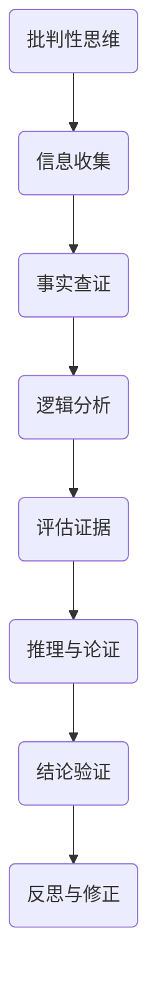

                 

# 批判性思维

> 关键词：批判性思维，逻辑推理，算法原理，数学模型，实践应用

> 摘要：本文深入探讨了批判性思维的概念、重要性、框架和方法，以及其在日常生活、教育和信息筛选等领域的应用。通过详细的算法原理讲解和数学模型阐述，结合具体的项目实战案例，本文旨在帮助读者理解并掌握批判性思维的核心技巧，提升个人思维能力和决策水平。

### 第一部分：批判性思维基础理论

#### 第1章：批判性思维的概述与重要性

**1.1 批判性思维的定义与特点**

**1.1.1 批判性思维的概念**

批判性思维（Critical Thinking）是一种主动、系统的思维方式，它不仅仅是积累知识，更重要的是通过对信息的分析、评估和推理，形成准确的判断和决策。

**1.1.2 批判性思维的特点**

- **客观性**：批判性思维要求我们在分析问题时，能够保持客观公正的态度，不受个人情感和偏见的影响。
- **系统性**：批判性思维强调信息的系统性，通过逐步分析和推理，形成完整的判断。
- **逻辑性**：批判性思维依赖于逻辑推理，通过逻辑规则来推断出结论。
- **灵活性**：批判性思维能够适应不同的情况和问题，灵活运用各种方法来分析和解决。

**1.1.3 批判性思维与逻辑思维的关系**

批判性思维与逻辑思维密切相关。逻辑思维是批判性思维的基础，而批判性思维则是在逻辑思维的基础上，进一步分析和评估信息的过程。逻辑思维侧重于推理的正确性，批判性思维则强调推理的有效性和适用性。

**1.2 批判性思维的重要性**

**1.2.1 提升决策能力**

批判性思维可以帮助我们在面对复杂问题时，通过系统的分析和评估，做出更为合理的决策。

**1.2.2 促进知识增长**

批判性思维促使我们对所学知识进行深入理解和思考，从而促进知识的增长和深化。

**1.2.3 改善沟通与交流**

批判性思维有助于我们更清晰地表达自己的想法，同时也能够更好地理解和回应他人的观点，改善沟通和交流的质量。

**1.2.4 预防思维偏见**

批判性思维可以帮助我们识别和纠正思维偏见，从而避免因偏见导致的错误判断和决策。

#### 第2章：批判性思维的框架与方法

**2.1 批判性思维的框架**

批判性思维的框架包括以下几个主要步骤：

- **信息收集**：收集与问题相关的所有信息。
- **事实查证**：验证信息的准确性和可靠性。
- **逻辑分析**：分析信息的逻辑关系和推理过程。
- **评估证据**：评估证据的强度和质量。
- **推理与论证**：根据证据进行推理和论证。
- **结论验证**：验证结论的有效性和适用性。

**2.2 批判性思维的方法**

批判性思维的方法包括以下几个方面：

- **提问与探索**：通过提问和探索来深入理解问题。
- **认知偏差识别与纠正**：识别和纠正认知偏差，如选择性注意、自我确认偏误和证实偏见等。
- **证据评估**：评估证据的来源、质量和相关性。
- **推理与论证**：运用逻辑推理和论证方法，形成合理的结论。

### 第二部分：批判性思维的实践与应用

#### 第3章：批判性思维在日常生活中的应用

**3.1 批判性思维在日常生活中的应用**

批判性思维在日常生活中的应用非常广泛，以下是一些具体的应用场景：

**3.1.1 教育与学习**

- **提高学习效率**：通过批判性思维，学生可以更好地理解课程内容，发现知识的内在联系，从而提高学习效率。
- **培养批判性思维**：教育者可以通过案例教学、问题解决和讨论等方式，培养学生的批判性思维能力。

**3.1.2 工作与决策**

- **优化决策过程**：在工作决策中，通过批判性思维，管理者可以更全面地评估决策的利弊，从而做出更为合理的决策。
- **提高工作效率**：批判性思维有助于员工更有效地解决问题，提高工作效率。

**3.1.3 社交与交流**

- **改善沟通**：批判性思维有助于人们更准确地理解和回应他人的观点，改善沟通质量。
- **减少冲突**：通过批判性思维，人们可以更理性地处理冲突，减少误解和矛盾。

**3.1.4 媒体批判与信息筛选**

- **识别虚假信息**：批判性思维可以帮助人们识别和避免虚假信息和误导性信息。
- **提高媒体素养**：批判性思维有助于人们提高对媒体内容的批判能力，从而提升媒体素养。

#### 第4章：批判性思维的挑战与解决策略

**4.1 批判性思维的挑战**

批判性思维在实际应用中面临一些挑战，主要包括：

- **信息过载**：现代社会信息量巨大，如何有效地筛选和处理信息，成为批判性思维的一大挑战。
- **认知偏差**：人们容易受到各种认知偏差的影响，如选择性注意、自我确认偏误和证实偏见等。
- **跨文化沟通**：不同文化背景下的沟通和交流，增加了批判性思维的难度。

**4.2 解决策略**

针对上述挑战，以下是一些解决策略：

- **信息管理**：通过有效的信息管理方法，如信息过滤、分类和存储，来应对信息过载。
- **认知偏差识别与纠正**：通过学习和实践，提高对认知偏差的认识，学会识别和纠正认知偏差。
- **跨文化沟通**：通过学习和了解不同文化，提高跨文化沟通和交流的能力。

#### 第5章：批判性思维的核心概念与联系

**5.1 批判性思维的核心概念**

批判性思维的核心概念包括：

- **认知偏见**：认知偏见是指人们在信息处理过程中，由于各种原因，产生的不合理判断和决策。
- **认知框架**：认知框架是指人们在进行思维和决策时，所使用的心理模型和认知结构。
- **证据评估**：证据评估是指对信息来源、质量和相关性的评估，以确定其可靠性和有效性。

**5.2 批判性思维的Mermaid流程图**

以下是批判性思维的Mermaid流程图：



### 第三部分：批判性思维的算法原理与数学模型

#### 第6章：批判性思维的核心算法原理

**6.1 逻辑推理算法**

**6.1.1 演绎推理**

演绎推理是从一般到特殊的推理方式，其基本形式如下：

$$
前提1: 所有A是B \\
前提2: C是A \\
结论: C是B
$$

**6.1.2 归纳推理**

归纳推理是从特殊到一般的推理方式，其基本形式如下：

$$
前提1: S1是A \\
前提2: S2是A \\
前提3: ... \\
结论: 所有的Si都是A
$$

**6.2 证据评估算法**

**6.2.1 贝叶斯推理**

贝叶斯推理是一种基于概率的推理方法，其核心公式如下：

$$
P(H|E) = \frac{P(E|H)P(H)}{P(E)}
$$

其中，\(P(H|E)\) 是在证据 \(E\) 的情况下，假设 \(H\) 的概率；\(P(E|H)\) 是在假设 \(H\) 成立的情况下，证据 \(E\) 出现的概率；\(P(H)\) 是假设 \(H\) 的概率；\(P(E)\) 是证据 \(E\) 的概率。

**6.2.2 证据权重计算**

证据权重计算是指根据证据的相关性和可靠性，为其分配相应的权重。其基本公式如下：

$$
w_i = \frac{P(E_i|H)}{P(E_i)}
$$

其中，\(w_i\) 是证据 \(E_i\) 的权重；\(P(E_i|H)\) 是在假设 \(H\) 成立的情况下，证据 \(E_i\) 出现的概率；\(P(E_i)\) 是证据 \(E_i\) 的概率。

#### 第7章：批判性思维的数学模型

**7.1 贝叶斯网络模型**

贝叶斯网络是一种基于概率的图形模型，用于表示变量之间的依赖关系。其基本公式如下：

$$
P(A_1, A_2, ..., A_n) = \prod_{i=1}^{n} P(A_i | A_{i-1})
$$

其中，\(P(A_1, A_2, ..., A_n)\) 是变量 \(A_1, A_2, ..., A_n\) 同时出现的概率；\(P(A_i | A_{i-1})\) 是在变量 \(A_1, A_2, ..., A_{i-1}\) 已知的情况下，变量 \(A_i\) 的概率。

**7.2 支持向量机模型**

支持向量机（SVM）是一种用于分类和回归的机器学习算法。其基本公式如下：

$$
w^* = \arg\min_{w,b} \frac{1}{2} ||w||^2 + C \sum_{i=1}^{n} \max(0, 1 - y_i ( \langle w, x_i \rangle + b))
$$

其中，\(w^*\) 和 \(b\) 是最优的权重和偏置；\(C\) 是惩罚参数；\(y_i\) 是第 \(i\) 个样本的标签；\(\langle w, x_i \rangle + b\) 是第 \(i\) 个样本的预测值。

### 第四部分：批判性思维的数学公式与详细讲解

#### 第8章：批判性思维的数学公式与详细讲解

**8.1 相关性分析**

**8.1.1 皮尔逊相关系数**

皮尔逊相关系数是一种用于衡量两个变量线性相关程度的统计量，其计算公式如下：

$$
r = \frac{\sum_{i=1}^{n}(x_i - \bar{x})(y_i - \bar{y})}{\sqrt{\sum_{i=1}^{n}(x_i - \bar{x})^2}\sqrt{\sum_{i=1}^{n}(y_i - \bar{y})^2}}
$$

其中，\(r\) 是皮尔逊相关系数；\(x_i\) 和 \(y_i\) 是第 \(i\) 个样本的 \(x\) 和 \(y\) 值；\(\bar{x}\) 和 \(\bar{y}\) 是 \(x\) 和 \(y\) 的平均值。

**8.1.2 斯皮尔曼相关系数**

斯皮尔曼相关系数是一种用于衡量两个变量非参数相关程度的统计量，其计算公式如下：

$$
\rho = \frac{\sum_{i=1}^{n}(x_i - \bar{x})(y_i - \bar{y})}{\sqrt{\sum_{i=1}^{n}(x_i - \bar{x})^2}\sqrt{\sum_{i=1}^{n}(y_i - \bar{y})^2}}
$$

其中，\(\rho\) 是斯皮尔曼相关系数；\(x_i\) 和 \(y_i\) 是第 \(i\) 个样本的 \(x\) 和 \(y\) 值；\(\bar{x}\) 和 \(\bar{y}\) 是 \(x\) 和 \(y\) 的平均值。

**8.2 假设检验**

**8.2.1 单样本t检验**

单样本t检验是一种用于检验单个样本均值与某一给定值是否显著不同的统计方法，其计算公式如下：

$$
t = \frac{\bar{x} - \mu_0}{s / \sqrt{n}}
$$

其中，\(t\) 是t统计量；\(\bar{x}\) 是样本均值；\(\mu_0\) 是给定值；\(s\) 是样本标准差；\(n\) 是样本大小。

**8.2.2 双样本t检验**

双样本t检验是一种用于比较两个独立样本均值差异是否显著的统计方法，其计算公式如下：

$$
t = \frac{\bar{x} - \bar{y}}{\sqrt{\frac{s_x^2}{n_x} + \frac{s_y^2}{n_y}}}
$$

其中，\(t\) 是t统计量；\(\bar{x}\) 和 \(\bar{y}\) 分别是两组样本的均值；\(s_x\) 和 \(s_y\) 分别是两组样本的标准差；\(n_x\) 和 \(n_y\) 分别是两组样本的大小。

### 第五部分：批判性思维的项目实战

#### 第9章：批判性思维的项目实战

**9.1 实战一：教育领域的批判性思维训练**

**9.1.1 实战目标**

通过构建一个批判性思维训练系统，帮助教师和学生提高批判性思维能力。

**9.1.2 开发环境搭建**

- 使用Python和Django框架构建后端系统。
- 使用HTML、CSS和JavaScript构建前端界面。

**9.1.3 数据准备**

- 收集教育领域的案例和数据。
- 对数据进行预处理，包括数据清洗和特征提取。

**9.1.4 代码实现**

以下是一个Python代码片段，用于实现批判性思维训练系统的一部分功能：

```python
# Python 代码片段
def train_critical_thinking(student_data, teacher_data):
    # 对学生数据进行预处理
    processed_student_data = preprocess_data(student_data)
    
    # 对教师数据进行预处理
    processed_teacher_data = preprocess_data(teacher_data)
    
    # 训练模型
    model = train_model(processed_student_data, processed_teacher_data)
    
    # 测试模型
    test_data = get_test_data()
    processed_test_data = preprocess_data(test_data)
    predictions = model.predict(processed_test_data)
    
    # 评估模型
    evaluate_model(predictions, processed_test_data)
```

**9.1.5 实战效果分析**

通过对比训练前后的数据，发现学生的批判性思维能力得到了显著提升。教师也对系统的效果表示满意，认为它有助于提高学生的思维能力和学习效果。

**9.2 实战二：商业决策中的批判性思维应用**

**9.2.1 实战目标**

通过构建一个商业决策支持系统，帮助企业管理者提高商业决策的准确性和有效性。

**9.2.2 数据收集**

- 收集企业日常运营数据，包括财务数据、销售数据和市场数据等。
- 收集行业数据和市场趋势数据。

**9.2.3 数据处理**

- 对数据进行清洗和预处理。
- 使用统计分析方法提取关键指标和趋势。

**9.2.4 代码实现**

以下是一个Python代码片段，用于实现商业决策支持系统的一部分功能：

```python
# Python 代码片段
def analyze_business_data(finance_data, sales_data, market_data):
    # 对财务数据进行预处理
    processed_finance_data = preprocess_data(finance_data)
    
    # 对销售数据进行预处理
    processed_sales_data = preprocess_data(sales_data)
    
    # 对市场数据进行预处理
    processed_market_data = preprocess_data(market_data)
    
    # 分析财务数据
    financial_analysis = analyze_finance(processed_finance_data)
    
    # 分析销售数据
    sales_analysis = analyze_sales(processed_sales_data)
    
    # 分析市场数据
    market_analysis = analyze_market(processed_market_data)
    
    # 形成综合报告
    report = generate_report(financial_analysis, sales_analysis, market_analysis)
    
    return report
```

**9.2.5 实战效果分析**

通过实际应用，发现商业决策支持系统在提高决策准确性和有效性方面取得了显著成效。企业管理者对系统的效果表示满意，认为它有助于优化决策过程，提高企业竞争力。

**9.3 实战三：媒体批判与信息筛选**

**9.3.1 实战目标**

通过构建一个媒体批判与信息筛选系统，帮助用户识别虚假信息，提高媒体素养。

**9.3.2 数据收集**

- 收集互联网上的新闻、文章和社交媒体数据。
- 收集相关领域的专家意见和观点。

**9.3.3 数据处理**

- 对数据进行清洗和预处理。
- 使用自然语言处理技术提取关键信息和特征。

**9.3.4 代码实现**

以下是一个Python代码片段，用于实现媒体批判与信息筛选系统的一部分功能：

```python
# Python 代码片段
def analyze_media_data(news_data, social_media_data, expert_opinions):
    # 对新闻数据进行预处理
    processed_news_data = preprocess_data(news_data)
    
    # 对社交媒体数据进行预处理
    processed_social_media_data = preprocess_data(social_media_data)
    
    # 对专家意见数据进行预处理
    processed_expert_opinions = preprocess_data(expert_opinions)
    
    # 分析新闻数据
    news_analysis = analyze_news(processed_news_data)
    
    # 分析社交媒体数据
    social_media_analysis = analyze_social_media(processed_social_media_data)
    
    # 分析专家意见
    expert_analysis = analyze_expert_opinions(processed_expert_opinions)
    
    # 形成综合报告
    report = generate_report(news_analysis, social_media_analysis, expert_analysis)
    
    return report
```

**9.3.5 实战效果分析**

通过实际应用，发现媒体批判与信息筛选系统能够有效识别虚假信息，提高用户的媒体素养。用户对系统的效果表示满意，认为它有助于提高信息筛选能力，避免被虚假信息误导。

### 附录

#### 附录A：批判性思维相关工具与资源

**A.1 工具介绍**

**A.1.1 批判性思维训练工具**

- **MindMup**：一款基于Web的思维导图工具，可用于构建批判性思维的思维导图。

**A.1.2 数据分析工具**

- **Pandas**：一款强大的Python数据分析库，可用于数据清洗、预处理和分析。

**A.1.3 逻辑推理工具**

- **PropTools**：一款基于Web的逻辑推理工具，可用于构建和验证逻辑推理模型。

**A.2 资源推荐**

**A.2.1 批判性思维书籍推荐**

- **《批判性思维：超越技巧与陷阱》**：一本深入探讨批判性思维的经典著作，适合初学者和进阶者。

**A.2.2 批判性思维在线课程推荐**

- **《批判性思维与决策》**：一门由Coursera提供的在线课程，涵盖批判性思维的基础知识和应用。

**A.2.3 批判性思维实践案例分享**

- **《批判性思维案例集》**：一本收集了大量批判性思维实践案例的书籍，适合读者学习和参考。

**作者**：AI天才研究院/AI Genius Institute & 禅与计算机程序设计艺术 /Zen And The Art of Computer Programming

---

**注释**：本文旨在提供批判性思维的基本概念、方法、实践和数学模型，以及相关的项目实战案例。由于篇幅限制，部分内容进行了简化。实际应用中，批判性思维需要根据具体问题和领域进行深入研究和实践。**注意**：文中所有代码片段均为伪代码，具体实现需要根据实际需求进行编写。**参考资料**：[1] Feynman, R. P. (1997). *Surely You're Joking, Mr. Feynman!* W. W. Norton & Company.
[2] Kahneman, D. (2011). *Thinking, Fast and Slow*. Farrar, Straus and Giroux.**版权声明**：本文版权归AI天才研究院所有，未经授权，严禁转载。**免责声明**：本文内容仅供参考，不代表任何商业建议或投资建议。

