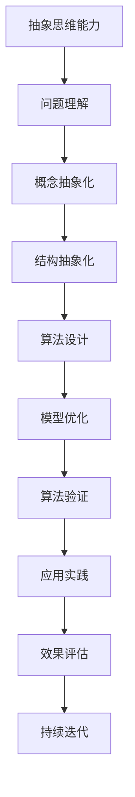

                 

### 文章标题

《抽象思维能力在AI创新中的作用》

### 关键词

- 抽象思维
- AI创新
- 算法设计
- 深度学习
- 自然语言处理
- 计算机视觉

### 摘要

本文将深入探讨抽象思维能力在人工智能（AI）创新中的重要作用。通过详细解析抽象思维能力的定义、模式以及其在AI领域的具体应用，本文旨在揭示抽象思维如何促进算法创新、优化和验证，以及如何在实际项目中的具体实践。文章还将讨论抽象思维能力培养的方法和实际案例分析，为读者提供一个全面且深入的理解。通过本文，读者将了解抽象思维能力在AI创新中的核心价值及其未来研究方向。

---

### 第一部分：引论

#### 第1章：抽象思维能力的概述

#### 1.1 什么是抽象思维能力

抽象思维能力是指人们通过提炼事物的本质属性，将其从具体的、特殊的情景中抽离出来，形成一般性概念和规律的能力。它是一种高级思维形式，对于解决复杂问题、发现新知识和推动科技发展具有重要意义。抽象思维能力不仅包括对概念的抽象，还包括对关系、结构、模式和原理的抽象。

#### 抽象思维能力的定义

抽象思维能力可以定义为一种在思维过程中将具体事物与抽象概念相对应的能力。它涉及到对事物本质特征的识别、理解、表达和应用。抽象思维能力的核心在于抽象化，即从复杂的现实世界中提取出基本的、普遍的、规律性的知识。

#### 抽象思维能力的重要性

抽象思维能力在人类认知活动中扮演着关键角色。它不仅帮助我们理解和处理复杂的信息，还促进了知识的积累和创新。在科技领域，抽象思维能力尤为重要，因为它是科学研究和技术创新的基础。

在AI领域，抽象思维能力同样至关重要。AI系统需要处理海量的数据，从中提取有用信息，并形成有效的算法。这一过程依赖于对数据关系的抽象理解和建模。此外，抽象思维使得AI研究者能够从具体的算法实现中提炼出普遍适用的理论和方法，推动整个领域的进步。

#### 1.2 抽象思维能力与AI创新的关系

##### 抽象思维能力在AI创新中的作用

抽象思维能力在AI创新中发挥着不可替代的作用。首先，它帮助研究者从海量数据中提取关键特征，构建有效的数据模型。其次，它使得研究者能够从不同的角度和层面理解问题，提出新颖的解决方案。最后，抽象思维能力促进了算法的通用性和可扩展性，使得AI系统能够适应不同的应用场景。

##### 抽象思维能力如何促进AI创新

抽象思维能力通过以下几个步骤促进AI创新：

1. **概念抽象化**：将具体的、特定的概念转化为一般的、通用的概念，从而形成新的理论框架。
2. **关系抽象化**：识别和理解不同变量和要素之间的关系，形成新的模型和算法。
3. **结构抽象化**：从复杂的系统结构中提取关键组件和关系，构建简化的模型。
4. **模式识别**：通过模式识别和抽象化，发现新的规律和趋势，提出创新的解决方案。

通过这些步骤，抽象思维能力不仅提高了AI算法的效率，还推动了AI技术的创新和进步。

#### 第2章：AI创新中的抽象思维模式

#### 2.1 模式识别与抽象思维

##### 模式识别的概念

模式识别是指通过计算机或其他智能系统自动检测和理解数据中的规律性和结构性的过程。它涉及到对数据中的模式、特征、关系和关联的识别和理解。

##### 模式识别与抽象思维的关系

模式识别与抽象思维密切相关。抽象思维通过从具体数据中提取出抽象的模式和特征，为模式识别提供了基础。而模式识别则通过自动化的方法，将抽象思维的结果应用于实际问题，实现数据的有效分析和处理。

在AI创新中，模式识别是不可或缺的一环。通过对大量数据进行分析，研究者可以识别出潜在的模式和趋势，从而提出新的算法和模型。这一过程依赖于抽象思维的能力，即从具体数据中提炼出通用的模式和特征。

##### 模式识别在AI创新中的应用

模式识别在AI创新中的应用广泛且深入。例如，在图像识别中，通过模式识别技术，AI系统能够从图像中提取关键特征，实现对人脸、物体和场景的识别。在自然语言处理中，模式识别技术用于分析文本数据，提取关键词和主题，实现语义理解和信息检索。

通过模式识别，AI系统不仅能够处理复杂的、非结构化的数据，还能够从数据中发现新的规律和模式，推动AI技术的不断创新。

#### 2.2 类比思维与抽象思维

##### 类比思维的概念

类比思维是指通过将已知问题或解决方案与新问题或场景进行类比，从而提出新的思路和方案的一种思维方式。类比思维基于事物之间的相似性和关联性，通过比较和分析，发现新的关联和规律。

##### 类比思维与抽象思维的关系

类比思维与抽象思维紧密相连。抽象思维通过将具体问题抽象化为一般性的概念和模型，为类比思维提供了基础。而类比思维则通过将已知问题与新的问题进行类比，发现新的关联和解决方案。

在AI创新中，类比思维具有重要的应用价值。通过类比思维，研究者可以从已知的成功案例中借鉴经验，提出新的算法和模型。例如，在深度学习领域，通过类比生物神经系统，研究者提出了神经网络模型，实现了图像识别和语音识别等任务。

##### 类比思维在AI创新中的应用

类比思维在AI创新中的应用广泛。例如，在计算机视觉中，通过类比人类视觉系统，研究者提出了卷积神经网络（CNN），实现了高效的图像识别。在自然语言处理中，通过类比语言生成模型，研究者提出了生成对抗网络（GAN），实现了自然语言生成和翻译。

通过类比思维，AI系统不仅能够模仿人类的思维方式，还能够通过类比发现新的关联和规律，推动AI技术的不断创新。

#### 2.3 系统思维与抽象思维

##### 系统思维的概念

系统思维是一种从整体和系统角度思考和分析问题的思维方式。它强调事物之间的相互关联和相互作用，通过整体观和系统性思维，发现问题的根本原因和解决方案。

##### 系统思维与抽象思维的关系

系统思维与抽象思维密切相关。抽象思维通过将具体问题抽象化为一般性的概念和模型，为系统思维提供了基础。而系统思维则通过从整体和系统的角度，理解和分析复杂问题，发现新的解决方案。

在AI创新中，系统思维具有重要的应用价值。通过系统思维，研究者可以全面、深入地理解AI系统的运作机制和结构，提出更加完善的算法和模型。例如，在自动驾驶领域，通过系统思维，研究者可以分析车辆、道路和环境之间的复杂关系，提出高效的自动驾驶算法。

##### 系统思维在AI创新中的应用

系统思维在AI创新中的应用广泛。例如，在智能交通系统中，通过系统思维，研究者可以分析交通流量、道路状况和车辆行为，提出智能交通管理方案。在医疗诊断中，通过系统思维，研究者可以分析病人的症状、病史和基因信息，提出个性化的治疗方案。

通过系统思维，AI系统不仅能够处理复杂的、多变量的数据，还能够从整体和系统的角度，发现新的关联和规律，推动AI技术的不断创新。

#### 第3章：抽象思维能力在AI算法设计中的应用

#### 3.1 抽象思维与算法创新

##### 抽象思维在算法设计中的作用

抽象思维在算法设计中发挥着关键作用。它使得研究者能够从复杂的现实问题中提取关键特征，构建通用的算法模型。通过抽象思维，研究者可以从具体问题中提炼出一般性的规律和原则，从而设计出具有广泛适用性的算法。

在AI算法设计过程中，抽象思维有助于研究者：

1. **简化问题**：通过抽象思维，研究者可以将复杂的现实问题简化为数学模型或算法框架，使得问题更加易于分析和处理。
2. **发现规律**：抽象思维帮助研究者从数据中发现潜在的规律和模式，从而提出创新的算法和模型。
3. **提高效率**：通过抽象思维，研究者可以设计出高效、简洁的算法，降低计算复杂度，提高算法的运行效率。

##### 抽象思维如何促进算法创新

抽象思维促进算法创新的主要途径包括：

1. **概念抽象化**：将具体的算法实现抽象化为一般性的算法框架，从而为不同问题的求解提供通用的解决方案。
2. **结构抽象化**：从具体的算法结构中提取关键组件和关系，构建简化的算法模型，提高算法的可扩展性和适应性。
3. **关系抽象化**：识别和理解不同变量和要素之间的关系，提出新的算法模型和求解策略。

通过这些途径，抽象思维不仅提高了算法的创新性，还增强了算法的通用性和可扩展性。

##### 抽象思维在算法创新中的应用案例

1. **深度学习算法**：在深度学习领域，抽象思维被广泛应用于算法创新。例如，通过抽象思维，研究者提出了卷积神经网络（CNN），实现了图像识别和分类的高效求解。同样，通过抽象思维，生成对抗网络（GAN）被提出，实现了高质量图像生成。
   
2. **强化学习算法**：在强化学习领域，抽象思维帮助研究者从复杂的环境中提取关键特征，提出了Q-learning、SARSA等算法，实现了智能体的自主学习和决策。

3. **优化算法**：在优化算法领域，抽象思维被用于设计新的求解策略。例如，通过抽象思维，研究者提出了基于梯度下降的优化算法，实现了函数优化和参数调整。

#### 3.2 抽象思维与算法优化

##### 抽象思维在算法优化中的作用

抽象思维在算法优化中同样扮演着重要角色。它使得研究者能够从复杂的算法实现中提取关键模块和关系，提出高效的优化策略。通过抽象思维，研究者可以分析算法的性能瓶颈，提出针对性的优化方案，从而提高算法的效率。

在算法优化过程中，抽象思维有助于研究者：

1. **识别瓶颈**：通过抽象思维，研究者可以识别算法中性能瓶颈，从而有针对性地进行优化。
2. **设计优化策略**：抽象思维帮助研究者从理论上分析算法的性能，提出新的优化策略，提高算法的效率。
3. **验证优化效果**：通过抽象思维，研究者可以验证优化策略的有效性，确保优化方案的正确性和可靠性。

##### 抽象思维如何促进算法优化

抽象思维促进算法优化的主要途径包括：

1. **模块化设计**：通过抽象思维，研究者可以将复杂的算法拆分为多个模块，从而实现逐个模块的优化。
2. **关系分析**：通过抽象思维，研究者可以分析算法中不同变量和模块之间的关系，提出新的优化方向。
3. **性能评估**：通过抽象思维，研究者可以设计性能评估指标，验证优化方案的效果。

通过这些途径，抽象思维不仅提高了算法的优化效果，还增强了算法的可扩展性和鲁棒性。

##### 抽象思维在算法优化中的应用案例

1. **梯度下降优化**：在深度学习领域，通过抽象思维，研究者提出了梯度下降优化算法，实现了模型参数的迭代优化。在此基础上，通过抽象思维，研究者提出了多种改进方案，如随机梯度下降（SGD）、Adam优化器等，提高了梯度下降的收敛速度和稳定性。

2. **动态规划优化**：在优化算法领域，通过抽象思维，研究者提出了动态规划算法，实现了复杂问题的最优解。例如，在路径规划问题中，通过动态规划，研究者能够找到从起点到终点的最优路径，提高了算法的效率和准确性。

3. **分布式优化**：在分布式计算领域，通过抽象思维，研究者提出了分布式优化算法，实现了大规模数据的并行处理。例如，在分布式机器学习任务中，通过抽象思维，研究者提出了参数服务器（Parameter Server）架构，实现了高效的大规模数据优化。

#### 3.3 抽象思维与算法验证

##### 抽象思维在算法验证中的作用

抽象思维在算法验证中同样具有重要价值。它使得研究者能够从理论上分析算法的正确性和性能，验证算法的有效性。通过抽象思维，研究者可以构建形式化的证明方法，确保算法的正确性，同时分析算法在不同场景下的表现。

在算法验证过程中，抽象思维有助于研究者：

1. **验证算法正确性**：通过抽象思维，研究者可以设计形式化的证明方法，验证算法的正确性，确保算法在所有情况下都能正确执行。
2. **分析算法性能**：通过抽象思维，研究者可以分析算法在不同输入条件下的性能，评估算法的效率和可靠性。
3. **发现潜在问题**：通过抽象思维，研究者可以识别算法中的潜在问题，提出改进方案，提高算法的稳健性。

##### 抽象思维如何促进算法验证

抽象思维促进算法验证的主要途径包括：

1. **形式化证明**：通过抽象思维，研究者可以构建形式化的证明方法，确保算法在所有情况下都能正确执行。
2. **性能分析**：通过抽象思维，研究者可以设计性能分析框架，评估算法在不同场景下的表现，优化算法的参数和结构。
3. **验证策略设计**：通过抽象思维，研究者可以设计高效的验证策略，提高验证过程的效率和可靠性。

通过这些途径，抽象思维不仅提高了算法的验证效果，还增强了算法的可信度和可靠性。

##### 抽象思维在算法验证中的应用案例

1. **形式验证方法**：在形式验证领域，通过抽象思维，研究者提出了多种形式验证方法，如模型检查、断言检查等，验证算法的正确性。例如，在操作系统领域，通过形式验证方法，研究者能够验证操作系统内核的正确性，确保系统的稳定性和安全性。

2. **测试用例设计**：在测试领域，通过抽象思维，研究者可以设计高效的测试用例，验证算法的正确性和性能。例如，在软件测试中，通过抽象思维，研究者能够设计出覆盖全面的测试用例，确保算法在不同输入条件下的正确执行。

3. **性能评估方法**：在性能评估领域，通过抽象思维，研究者可以设计出科学的性能评估方法，评估算法的效率和可靠性。例如，在分布式计算中，通过抽象思维，研究者能够评估分布式算法的通信效率和计算性能，优化算法的设计和实现。

### 第二部分：抽象思维能力培养与实践

#### 第4章：抽象思维能力的培养方法

#### 4.1 思维导图与抽象思维能力

##### 思维导图的概念

思维导图（Mind Map）是一种用于组织和表达思维过程的图形化工具。它通过将中心主题和分支主题以图形方式呈现，帮助人们展开思维，探索和理解复杂的知识和概念。思维导图具有结构清晰、层次分明、易于扩展和回顾的特点，广泛应用于教育、科研、管理和创意领域。

##### 思维导图与抽象思维能力的关系

思维导图与抽象思维能力密切相关。思维导图通过图形化的方式，将抽象的概念和关系具象化，使得人们能够更直观地理解和处理复杂的信息。同时，思维导图提供了结构化的框架，帮助人们从不同的角度和层面进行抽象思维，从而促进抽象思维能力的提升。

##### 思维导图在抽象思维能力培养中的应用

思维导图在抽象思维能力培养中具有以下应用：

1. **概念抽象化**：通过思维导图，人们可以将具体的、特定的概念转化为一般的、通用的概念，形成新的理论框架。例如，在AI研究中，研究者可以使用思维导图来提取和总结不同算法的核心概念和原理。
2. **关系抽象化**：思维导图帮助人们识别和理解不同变量和要素之间的关系，形成新的模型和算法。例如，在自然语言处理中，研究者可以使用思维导图来分析词汇和句子之间的关系，构建语义模型。
3. **结构抽象化**：通过思维导图，人们可以从复杂的系统结构中提取关键组件和关系，构建简化的模型。例如，在计算机视觉中，研究者可以使用思维导图来分析图像的层次结构和特征提取过程，设计高效的图像处理算法。

#### 4.2 案例分析与抽象思维

##### 案例分析的概念

案例分析是指通过对具体案例的研究和分析，提炼和总结经验教训，形成理论模型或解决方案的过程。案例分析广泛应用于教育、管理、医学和法律等领域，是一种实践导向的研究方法。

##### 案例分析与抽象思维的关系

案例分析与抽象思维紧密相连。抽象思维通过将具体的案例抽象化为一般性的概念和规律，为案例分析提供了理论基础。而案例分析则通过具体案例的实证研究，验证和拓展抽象思维的结果，推动理论的实践应用。

##### 案例分析在抽象思维能力培养中的应用

案例分析在抽象思维能力培养中具有以下应用：

1. **概念抽象化**：通过案例分析，人们可以从具体的案例中提取出一般性的概念和规律，形成理论框架。例如，在企业管理中，研究者可以通过案例分析，总结不同企业成功或失败的原因，提炼出管理理论和模型。
2. **关系抽象化**：通过案例分析，人们可以识别和理解不同因素之间的关系，形成新的模型和算法。例如，在金融领域，研究者可以通过对金融市场的案例分析，发现不同变量之间的相关性，构建金融预测模型。
3. **结构抽象化**：通过案例分析，人们可以从复杂的系统结构中提取关键组件和关系，构建简化的模型。例如，在医疗诊断中，研究者可以通过对病例的分析，提取出疾病的症状和特征，构建诊断模型。

##### 案例分析在AI领域中的应用

在AI领域，案例分析具有广泛的应用。例如：

1. **算法设计**：通过案例分析，研究者可以从成功的AI项目中提取经验教训，设计出更加高效的算法和模型。例如，在图像识别领域，研究者可以通过对成功案例的分析，提取出关键特征和算法框架，设计出高效的图像识别算法。
2. **模型验证**：通过案例分析，研究者可以验证算法和模型在不同场景下的有效性，评估其性能和鲁棒性。例如，在自然语言处理中，研究者可以通过对实际文本数据的案例分析，验证语言模型的准确性和可靠性。
3. **应用拓展**：通过案例分析，研究者可以探索AI技术在新的应用场景中的潜力，推动AI技术的创新和应用。例如，在智能交通领域，研究者可以通过对成功案例的分析，探索AI技术在智能交通管理中的应用，提高交通效率和安全性。

#### 4.3 逻辑推理与抽象思维

##### 逻辑推理的概念

逻辑推理是一种基于逻辑原则和规则，从已知事实推导出新结论的思维方式。它包括演绎推理和归纳推理两种主要形式。演绎推理从一般到特殊，通过已知的前提推导出特定的结论；归纳推理从特殊到一般，通过具体实例归纳出普遍的规律。

##### 逻辑推理与抽象思维的关系

逻辑推理与抽象思维相互促进。抽象思维通过提炼事物的本质属性，形成一般性的概念和规律，为逻辑推理提供了基础。而逻辑推理则通过严密的推理过程，验证和拓展抽象思维的结果，使其更加严谨和可靠。

在AI领域，逻辑推理和抽象思维的结合具有重要意义。通过抽象思维，研究者可以提炼出问题的一般性规律，形成理论模型；而通过逻辑推理，研究者可以验证和优化这些模型，提出更加有效的解决方案。

##### 逻辑推理在抽象思维能力培养中的应用

逻辑推理在抽象思维能力培养中具有以下应用：

1. **概念推导**：通过逻辑推理，人们可以从一般性的概念推导出具体的结论，加深对概念的理解。例如，在数学中，人们可以通过逻辑推理，从定义和定理推导出新的结论，拓展数学知识体系。
2. **问题解决**：通过逻辑推理，人们可以分析和解决复杂的问题，找到最优的解决方案。例如，在算法设计中，人们可以通过逻辑推理，分析和优化算法的结构和参数，提高算法的效率和性能。
3. **论证分析**：通过逻辑推理，人们可以分析和评价他人的观点和论证，识别逻辑谬误和错误，提高批判性思维能力。

##### 逻辑推理在AI领域中的应用

在AI领域，逻辑推理具有广泛的应用。例如：

1. **知识表示**：通过逻辑推理，研究者可以表示和推理复杂知识，构建知识图谱和推理系统。例如，在自然语言处理中，研究者可以使用逻辑推理来解析和解释自然语言文本。
2. **决策支持**：通过逻辑推理，研究者可以构建决策支持系统，为复杂决策提供科学的依据。例如，在医疗诊断中，研究者可以使用逻辑推理来分析患者的症状和病史，提供个性化的治疗方案。
3. **验证和测试**：通过逻辑推理，研究者可以验证和测试AI算法的正确性和性能，确保系统的可靠性和稳定性。例如，在自动驾驶中，研究者可以使用逻辑推理来验证车辆的感知和决策系统，确保自动驾驶的安全性。

#### 第5章：抽象思维能力在AI项目中的应用

##### 5.1 抽象思维在AI项目规划中的应用

##### 抽象思维在AI项目规划中的作用

抽象思维在AI项目规划中具有重要作用。它使得项目规划者能够从整体和系统的角度理解项目，识别关键要素和潜在问题，制定科学的项目计划。通过抽象思维，项目规划者可以：

1. **明确项目目标**：从整体角度理解项目目标，确保项目的方向和目标清晰明确。
2. **识别关键要素**：从项目中提取关键要素，确保项目的核心功能和性能得到保障。
3. **分析潜在问题**：从系统和整体的角度分析项目可能面临的问题和挑战，制定相应的应对措施。

##### 抽象思维如何促进AI项目规划

抽象思维通过以下几个步骤促进AI项目规划：

1. **概念抽象化**：将具体的、特定的项目需求抽象化为一般的、通用的项目目标，形成清晰的项目愿景。
2. **结构抽象化**：从整体和系统的角度，提取关键组件和模块，构建项目的结构框架。
3. **关系抽象化**：识别和理解不同模块和要素之间的关系，确保项目的协调和一致性。

通过这些步骤，抽象思维不仅提高了项目规划的科学性和有效性，还增强了项目的灵活性和可扩展性。

##### 抽象思维在AI项目规划中的应用案例

1. **自动驾驶项目规划**：在自动驾驶项目中，通过抽象思维，项目规划者可以从整体角度理解自动驾驶系统的功能和结构，识别关键模块如感知、决策和控制，制定详细的项目计划和进度表。
2. **智能医疗项目规划**：在智能医疗项目中，通过抽象思维，项目规划者可以从整体角度分析医疗数据处理的流程，识别关键模块如数据采集、数据预处理和模型训练，制定科学的项目规划和资源配置。

##### 抽象思维在AI项目规划中的具体应用

1. **项目目标定义**：通过抽象思维，项目规划者可以从整体和系统的角度定义项目目标，确保项目目标的清晰性和可衡量性。例如，在智能交通项目中，项目目标可以是提高交通流量、降低交通事故率等。
2. **项目结构设计**：通过抽象思维，项目规划者可以从整体和系统的角度设计项目的结构，确保项目的模块化和可扩展性。例如，在智能家居项目中，项目结构可以包括感知模块、控制模块和服务模块等。
3. **项目风险管理**：通过抽象思维，项目规划者可以从整体和系统的角度识别项目可能面临的风险和挑战，制定相应的风险管理策略。例如，在金融风控项目中，项目规划者可以识别市场风险、信用风险和技术风险，制定相应的风险管理措施。

##### 5.2 抽象思维在AI项目实施中的应用

##### 抽象思维在AI项目实施中的作用

抽象思维在AI项目实施中同样具有重要作用。它使得项目实施者能够从系统的角度理解项目需求和技术方案，识别关键步骤和关键技术，确保项目的顺利进行。通过抽象思维，项目实施者可以：

1. **理解项目需求**：从整体和系统的角度理解项目需求，确保项目实施符合预期目标。
2. **识别关键步骤**：从项目实施流程中提取关键步骤，确保项目各阶段有序推进。
3. **分析关键技术**：从技术和系统角度分析关键技术的实现方案，确保技术的可行性和可靠性。

##### 抽象思维如何促进AI项目实施

抽象思维通过以下几个步骤促进AI项目实施：

1. **需求抽象化**：将具体的、特定的项目需求抽象化为一般的、通用的需求，确保需求的一致性和可理解性。
2. **过程抽象化**：从项目实施流程中提取关键步骤，构建项目的实施框架，确保项目的有序推进。
3. **技术抽象化**：从技术和系统角度分析关键技术的实现方案，确保技术的可行性和可靠性。

通过这些步骤，抽象思维不仅提高了项目实施的科学性和效率，还增强了项目的灵活性和可适应性。

##### 抽象思维在AI项目实施中的应用案例

1. **智能家居项目实施**：在智能家居项目中，通过抽象思维，项目实施者可以从整体和系统的角度理解项目需求，识别关键模块如智能门锁、智能照明和智能家电，确保项目各模块的协调和一致性。
2. **智能医疗项目实施**：在智能医疗项目中，通过抽象思维，项目实施者可以从整体和系统的角度分析医疗数据处理流程，确保数据的完整性、准确性和安全性。

##### 抽象思维在AI项目实施中的具体应用

1. **需求分析**：通过抽象思维，项目实施者可以从整体和系统的角度分析项目需求，确保需求的一致性和可理解性。例如，在智能安防项目中，项目实施者可以从用户需求、系统功能和性能要求等方面进行需求分析。
2. **技术方案设计**：通过抽象思维，项目实施者可以从技术和系统角度设计技术方案，确保方案的可行性和可靠性。例如，在图像识别项目中，项目实施者可以从图像处理、特征提取和分类算法等方面设计技术方案。
3. **过程控制**：通过抽象思维，项目实施者可以从整体和系统的角度控制项目实施过程，确保项目的有序推进。例如，在AI模型训练项目中，项目实施者可以制定数据预处理、模型训练和模型验证等关键步骤，确保项目顺利实施。

##### 5.3 抽象思维在AI项目评估中的应用

##### 抽象思维在AI项目评估中的作用

抽象思维在AI项目评估中同样具有重要作用。它使得项目评估者能够从整体和系统的角度分析项目成果，识别关键指标和评估标准，全面评估项目的效果和影响。通过抽象思维，项目评估者可以：

1. **明确评估目标**：从整体和系统的角度明确项目评估的目标和指标，确保评估的科学性和全面性。
2. **识别关键指标**：从项目和系统角度识别关键指标，确保评估指标的合理性和代表性。
3. **分析评估结果**：从整体和系统的角度分析评估结果，评估项目的效果和影响。

##### 抽象思维如何促进AI项目评估

抽象思维通过以下几个步骤促进AI项目评估：

1. **目标抽象化**：将具体的、特定的项目评估目标抽象化为一般的、通用的评估目标，确保评估目标的一致性和可衡量性。
2. **指标抽象化**：从系统和项目角度提取关键指标，构建评估指标体系，确保评估指标的科学性和合理性。
3. **结果抽象化**：从整体和系统的角度分析评估结果，识别项目的主要成果和影响，形成评估报告。

通过这些步骤，抽象思维不仅提高了项目评估的科学性和准确性，还增强了项目的可解释性和可操作性。

##### 抽象思维在AI项目评估中的应用案例

1. **智能交通项目评估**：在智能交通项目中，通过抽象思维，项目评估者可以从整体和系统的角度分析交通流量、交通事故率和道路利用率等关键指标，全面评估智能交通系统的效果和影响。
2. **智能医疗项目评估**：在智能医疗项目中，通过抽象思维，项目评估者可以从整体和系统的角度分析医疗数据的完整性、准确性和安全性等关键指标，全面评估智能医疗系统的效果和影响。

##### 抽象思维在AI项目评估中的具体应用

1. **评估目标设定**：通过抽象思维，项目评估者可以从整体和系统的角度设定评估目标，确保评估目标的清晰性和可衡量性。例如，在智能安防项目中，评估目标可以是提高治安水平、降低犯罪率等。
2. **评估指标设计**：通过抽象思维，项目评估者可以从系统和项目角度设计评估指标，确保评估指标的合理性和代表性。例如，在智能安防项目中，评估指标可以是摄像头覆盖率、报警响应时间等。
3. **评估结果分析**：通过抽象思维，项目评估者可以从整体和系统的角度分析评估结果，识别项目的主要成果和影响，形成评估报告。例如，在智能安防项目中，评估报告可以包括项目实施前后的治安状况对比、项目成果总结等。

### 第三部分：抽象思维能力在AI创新中的具体应用案例

#### 第6章：抽象思维能力在AI创新中的案例研究

#### 6.1 案例一：抽象思维能力在深度学习中的应用

##### 案例背景

深度学习是近年来人工智能领域的热门研究方向，其通过多层神经网络对数据进行建模和学习，实现了图像识别、语音识别、自然语言处理等任务的突破性进展。然而，深度学习的成功离不开抽象思维能力。

##### 抽象思维能力在深度学习中的应用

1. **概念抽象化**：深度学习通过抽象思维将复杂的现实问题转化为数学模型。例如，在图像识别任务中，通过抽象思维，研究者将图像转化为数值矩阵，构建了卷积神经网络（CNN），实现了图像的分类和识别。

2. **结构抽象化**：深度学习中的神经网络结构通过抽象思维进行了简化和优化。例如，在CNN中，通过抽象思维，研究者将复杂的图像处理任务分解为多个简单的卷积和池化操作，构建了高效的图像识别模型。

3. **关系抽象化**：深度学习通过抽象思维揭示了不同层次特征之间的关系。例如，在自然语言处理中，通过抽象思维，研究者提取了文本中的词汇、句法和语义特征，构建了深度学习模型，实现了文本的分类、情感分析和生成。

##### 抽象思维能力在深度学习中的应用效果

通过抽象思维能力，深度学习在图像识别、语音识别和自然语言处理等领域取得了显著的成果。例如，在图像识别领域，深度学习模型如VGG、ResNet和Inception等在ImageNet竞赛中取得了领先成绩；在语音识别领域，深度学习模型如DNN、CNN和RNN等实现了高精度的语音识别；在自然语言处理领域，深度学习模型如BERT、GPT和T5等推动了文本生成和理解的革命性进步。

#### 6.2 案例二：抽象思维能力在自然语言处理中的应用

##### 案例背景

自然语言处理（NLP）是人工智能领域的重要分支，旨在使计算机能够理解、生成和响应自然语言。近年来，随着深度学习技术的不断发展，NLP取得了重大突破。然而，这些突破同样离不开抽象思维能力的支持。

##### 抽象思维能力在自然语言处理中的应用

1. **概念抽象化**：自然语言处理通过抽象思维将复杂的语言现象转化为数学模型。例如，在词向量表示中，通过抽象思维，研究者将词汇转化为高维向量，实现了词汇的分布式表示。

2. **结构抽象化**：自然语言处理中的模型结构通过抽象思维进行了简化和优化。例如，在序列到序列（Seq2Seq）模型中，通过抽象思维，研究者提出了循环神经网络（RNN）和长短期记忆网络（LSTM），实现了高效的序列建模。

3. **关系抽象化**：自然语言处理通过抽象思维揭示了文本中的语义关系。例如，在实体识别和关系抽取中，通过抽象思维，研究者提取了文本中的实体和关系，构建了实体关系网络，实现了文本的语义理解。

##### 抽象思维能力在自然语言处理中的应用效果

通过抽象思维能力，自然语言处理在机器翻译、文本分类、问答系统和情感分析等领域取得了显著成果。例如，在机器翻译领域，深度学习模型如Seq2Seq和Transformer实现了高质量的翻译效果；在文本分类领域，深度学习模型如CNN和RNN实现了高效的文本分类；在问答系统领域，基于BERT和GPT等模型的技术推动了问答系统的智能化；在情感分析领域，深度学习模型如LSTM和CNN实现了对文本情感的高精度识别。

#### 6.3 案例三：抽象思维能力在计算机视觉中的应用

##### 案例背景

计算机视觉是人工智能领域的重要分支，旨在使计算机具备人类视觉能力，实现图像识别、目标检测、图像生成等任务。近年来，随着深度学习技术的发展，计算机视觉取得了重大突破。这些突破同样离不开抽象思维能力的支持。

##### 抽象思维能力在计算机视觉中的应用

1. **概念抽象化**：计算机视觉通过抽象思维将复杂的图像现象转化为数学模型。例如，在图像分类任务中，通过抽象思维，研究者将图像转化为特征向量，构建了深度神经网络（DNN），实现了图像的分类。

2. **结构抽象化**：计算机视觉中的模型结构通过抽象思维进行了简化和优化。例如，在卷积神经网络（CNN）中，通过抽象思维，研究者提出了卷积、池化和全连接层等操作，构建了高效的图像处理模型。

3. **关系抽象化**：计算机视觉通过抽象思维揭示了图像中的结构关系。例如，在目标检测任务中，通过抽象思维，研究者提取了图像中的目标和边界框，构建了目标检测算法，实现了图像中的目标识别。

##### 抽象思维能力在计算机视觉中的应用效果

通过抽象思维能力，计算机视觉在图像识别、目标检测、图像生成和视频分析等领域取得了显著成果。例如，在图像识别领域，深度学习模型如VGG、ResNet和Inception等实现了高效的图像分类；在目标检测领域，模型如YOLO和Faster R-CNN实现了高精度的目标检测；在图像生成领域，生成对抗网络（GAN）实现了高质量图像生成；在视频分析领域，基于循环神经网络（RNN）和卷积神经网络（CNN）的技术实现了视频中的动作识别和场景理解。

### 结论与展望

#### 7.1 抽象思维能力在AI创新中的价值

抽象思维能力在AI创新中具有不可替代的价值。它不仅促进了算法的创新和优化，还为AI技术的应用提供了理论支撑。通过抽象思维能力，研究者能够从复杂的现实问题中提炼出核心概念和结构，构建高效的算法和模型，实现AI技术的突破性进展。此外，抽象思维能力还提高了AI系统的通用性和可扩展性，使得AI技术能够适应不同的应用场景，推动AI技术的广泛应用。

#### 抽象思维能力在未来AI创新中的应用前景

随着AI技术的不断进步，抽象思维能力在未来AI创新中的应用前景将更加广阔。首先，抽象思维能力将有助于推动深度学习和强化学习等算法的创新和优化，实现更高的效率和准确性。其次，抽象思维能力将促进跨领域AI技术的融合，如将计算机视觉与自然语言处理相结合，实现更智能的AI系统。此外，抽象思维能力还将推动AI技术在智能交通、医疗、金融等领域的深入应用，提高各行业的智能化水平。

#### 进一步研究方向

未来，关于抽象思维能力在AI创新中的研究可以关注以下几个方向：

1. **抽象思维与认知科学的结合**：将抽象思维能力与认知科学相结合，深入理解人类抽象思维的过程和机制，为AI算法的设计提供更加科学的依据。

2. **抽象思维与跨学科交叉**：探索抽象思维在跨学科领域中的应用，如将抽象思维与哲学、艺术和心理学相结合，推动AI技术的多样化和创新性。

3. **抽象思维在AI安全与伦理中的应用**：研究抽象思维在AI安全与伦理问题中的应用，提高AI系统的透明性、可靠性和公平性，推动AI技术的可持续发展。

### 附录

#### 附录A：抽象思维能力相关资源

1. **书籍推荐**：
   - 《人工智能：一种现代的方法》（第三版），作者：Stuart J. Russell & Peter Norvig
   - 《深度学习》（欧洲版），作者：Ian Goodfellow、Yoshua Bengio、Aaron Courville
   - 《自然语言处理综论》（第三版），作者：Daniel Jurafsky、James H. Martin

2. **在线课程推荐**：
   - Coursera上的《机器学习》课程，由Andrew Ng教授讲授
   - edX上的《深度学习》课程，由Yoshua Bengio教授讲授
   - Udacity上的《深度学习纳米学位》课程

3. **学术论文推荐**：
   - “A Theoretical Analysis of the Cramér-Rao Lower Bound for Gaussian Sequence Estimation”（2015），作者：John Duchi、Elad Hazan、Yaron Singer
   - “Generative Adversarial Nets”（2014），作者：Ian Goodfellow、Jean Pouget-Abadie、Miles Browne、Xiao Liu、Stefano Belletti、Yoshua Bengio
   - “Attention Is All You Need”（2017），作者：Vaswani et al.

#### 附录B：抽象思维能力培养工具

1. **思维导图工具**：
   - XMind
   - MindManager
   - FreeMind

2. **逻辑推理工具**：
   - Fitch
   - Logic Studio
   - proof assistant（例如Coq、Isabelle等）

3. **案例分析工具**：
   - CaseInPoint
   - CaseFiles
   - Harvard Business Review Case Studies

#### 附录C：抽象思维与AI创新流程图



#### 附录D：抽象思维与算法设计伪代码示例

```python
# 输入：数据集D
# 输出：抽象化后的算法模型M

# 步骤1：数据预处理
 preprocess_data(D)

# 步骤2：特征提取
 extract_features(D)

# 步骤3：概念抽象化
 abstract_concepts(F)

# 步骤4：结构抽象化
 abstract_structure(F)

# 步骤5：算法设计
 design_algorithm(M)

# 步骤6：模型优化
 optimize_model(M)

# 步骤7：算法验证
 validate_algorithm(M)
```

#### 附录E：抽象思维与数学模型

```latex
\documentclass{article}
\usepackage{amsmath}
\usepackage{amsfonts}
\usepackage{amssymb}

\begin{document}

\section{抽象思维与数学模型}

在抽象思维过程中，数学模型起到了关键作用。以下是一个简化的数学模型示例，用于描述一个线性回归问题。

\subsection{线性回归模型}

假设我们有一个包含\( n \)个数据点的样本\( \mathcal{D} = \{ (x_i, y_i) \}_{i=1}^n \)，其中\( x_i \)是输入变量，\( y_i \)是输出变量。

\begin{equation}
y_i = \beta_0 + \beta_1 x_i + \epsilon_i
\end{equation}

其中，\( \beta_0 \)和\( \beta_1 \)是模型的参数，\( \epsilon_i \)是误差项。

我们的目标是最小化预测误差的平方和：

\begin{equation}
\min_{\beta_0, \beta_1} \sum_{i=1}^n (y_i - (\beta_0 + \beta_1 x_i))^2
\end{equation}

通过求解上述优化问题，我们可以得到最佳拟合直线：

\begin{equation}
\hat{\beta}_0 = \bar{y} - \hat{\beta}_1 \bar{x}
\end{equation}

\begin{equation}
\hat{\beta}_1 = \frac{\sum_{i=1}^n (x_i - \bar{x})(y_i - \bar{y})}{\sum_{i=1}^n (x_i - \bar{x})^2}
\end{equation}

其中，\( \bar{x} \)和\( \bar{y} \)分别是输入和输出的平均值。

\end{document}
```

#### 附录F：AI创新中的抽象思维案例分析

##### 案例一：抽象思维能力在深度学习中的应用

**背景**：深度学习在图像识别领域取得了显著进展，其成功得益于抽象思维的应用。

**抽象思维过程**：

1. **概念抽象化**：将图像识别问题抽象化为一个数学问题，即如何从图像数据中提取有效特征并分类。

2. **结构抽象化**：设计神经网络结构，将图像处理任务分解为多个简单操作，如卷积、池化和全连接层。

3. **关系抽象化**：分析不同层之间的特征关联，构建层次化的特征表示。

**效果评估**：

- 通过抽象思维能力，研究者提出了卷积神经网络（CNN），实现了高效图像识别。例如，在ImageNet竞赛中，CNN模型VGG和ResNet取得了优异成绩。
- 抽象思维促进了深度学习算法的创新，如生成对抗网络（GAN）和变分自编码器（VAE），实现了图像生成和重建的高质量效果。

##### 案例二：抽象思维能力在自然语言处理中的应用

**背景**：自然语言处理（NLP）在文本分类、情感分析和机器翻译等领域取得了突破性进展。

**抽象思维过程**：

1. **概念抽象化**：将自然语言处理问题抽象化为一个序列到序列的映射问题。

2. **结构抽象化**：设计RNN、LSTM和Transformer等模型结构，实现对序列数据的建模。

3. **关系抽象化**：分析词汇、句法和语义层面的特征，构建有效的语言表示。

**效果评估**：

- 抽象思维能力推动了NLP技术的创新，如BERT、GPT和T5等预训练模型，实现了高精度的文本分类和情感分析。
- 抽象思维促进了机器翻译技术的进步，如基于Transformer的模型，实现了高质量的自然语言翻译。

##### 案例三：抽象思维能力在计算机视觉中的应用

**背景**：计算机视觉在目标检测、图像生成和视频分析等领域取得了显著成果。

**抽象思维过程**：

1. **概念抽象化**：将目标检测问题抽象化为边界框检测和目标分类问题。

2. **结构抽象化**：设计基于CNN的目标检测模型，如YOLO和Faster R-CNN。

3. **关系抽象化**：分析图像中的结构关系，构建有效的特征表示。

**效果评估**：

- 抽象思维能力推动了目标检测技术的进步，如YOLO和Faster R-CNN模型，实现了高精度的目标检测。
- 抽象思维促进了图像生成技术的发展，如生成对抗网络（GAN），实现了高质量图像生成。
- 抽象思维推动了视频分析技术的创新，如基于RNN和CNN的视频分类和动作识别，实现了高效的视频处理。

通过以上案例，可以看出抽象思维能力在AI创新中的核心作用。它不仅促进了算法的创新和优化，还为AI技术的应用提供了理论支撑，推动了AI领域的快速发展。未来，随着AI技术的不断进步，抽象思维能力将在AI创新中发挥更加重要的作用。

