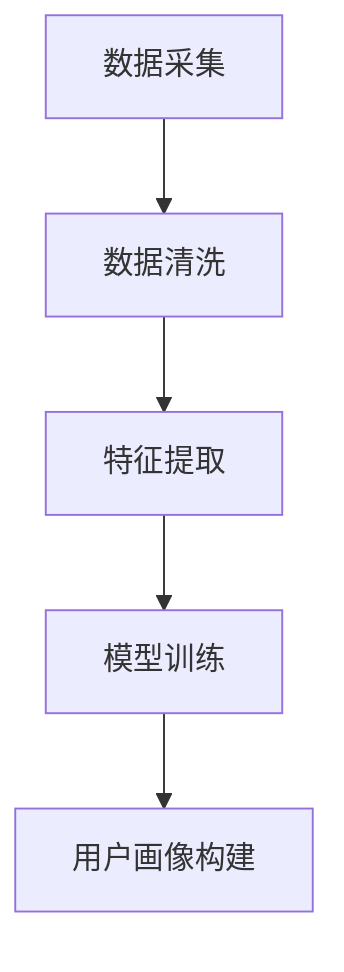
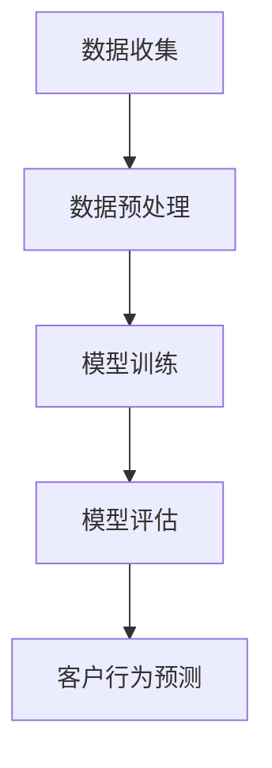
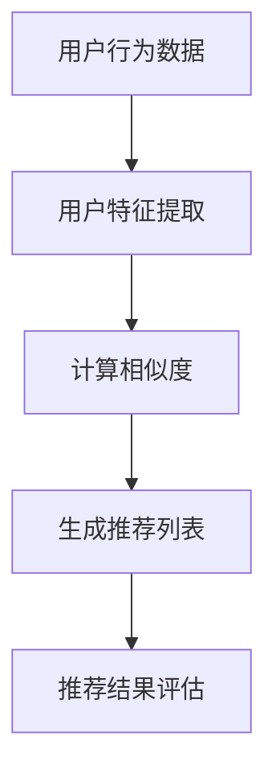
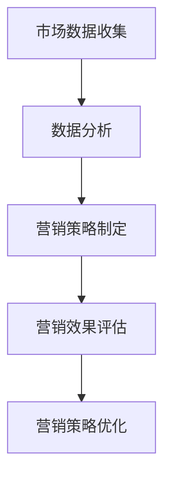
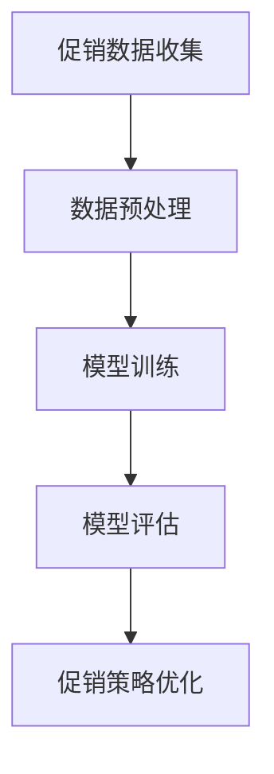

                 

### 文章标题：探索基于大模型的电商智能客户生命周期管理系统

#### 关键词：大模型、电商、智能客户生命周期管理、用户画像、个性化推荐、智能营销

在当今竞争激烈的电商市场中，如何提升客户体验、提高客户满意度和促进客户忠诚度成为电商企业关注的焦点。基于大模型的电商智能客户生命周期管理系统应运而生，它通过先进的人工智能技术，实现客户数据的深度挖掘和分析，为电商企业提供精准、高效的客户运营策略。本文旨在探讨大模型在电商智能客户生命周期管理中的应用，详细解析其核心概念、技术原理和实践案例，以期为电商企业数字化转型提供有益参考。

#### 摘要：

本文首先介绍了大模型在电商智能客户生命周期管理中的重要性，接着对电商行业与客户生命周期管理进行了概述。随后，本文详细讲解了大模型的基本原理和主流技术，并探讨了其应用于电商的潜力。在此基础上，本文深入分析了智能用户画像与标签系统、客户行为分析与预测、客户关系管理与个性化推荐以及智能营销与促销策略优化等方面的内容。最后，本文通过项目实战与案例分析，总结了电商智能客户生命周期管理系统的设计与实现，并对未来的发展趋势和面临的挑战进行了展望。

### 目录

**《探索基于大模型的电商智能客户生命周期管理系统》**

> 关键词：大模型、电商、智能客户生命周期管理、用户画像、个性化推荐、智能营销

> 摘要：本文旨在探讨大模型在电商智能客户生命周期管理中的应用，详细解析其核心概念、技术原理和实践案例，为电商企业数字化转型提供参考。

### 第一部分：背景与核心概念

#### 1. 引言

##### 1.1 书籍主题介绍

本文旨在深入探讨基于大模型的电商智能客户生命周期管理系统的构建与应用。随着大数据和人工智能技术的快速发展，大模型作为一种具有强大数据处理和分析能力的技术，正逐渐在各个领域发挥作用。在电商行业，客户生命周期管理是提高客户满意度和促进业务增长的关键环节。通过运用大模型技术，电商企业可以实现客户数据的深度挖掘和分析，为制定精准的营销策略和提升客户体验提供有力支持。

##### 1.2 大模型与电商智能客户生命周期管理的关系

大模型在电商智能客户生命周期管理中具有重要作用。它不仅能够对海量数据进行高效处理和挖掘，还能通过深度学习算法实现客户行为的智能预测和个性化推荐。具体而言，大模型可以应用于以下方面：

1. **用户画像与标签系统**：通过对客户数据进行综合分析，构建详细的用户画像和标签体系，为精准营销提供基础。
2. **客户行为预测**：利用历史数据和机器学习算法，预测客户未来的购买行为和需求，提前布局营销策略。
3. **个性化推荐**：根据用户偏好和行为模式，提供个性化的商品推荐，提升用户体验和转化率。
4. **智能营销与促销策略优化**：通过分析客户数据和市场趋势，制定智能化的营销和促销策略，提高营销效果和客户满意度。

#### 2. 电商行业与客户生命周期管理

##### 2.1 电商行业的发展趋势

电商行业近年来经历了快速发展，市场规模不断扩大。随着互联网技术的不断进步，移动电商、社交电商等新兴模式逐渐崛起，为消费者提供了更多便捷的购物选择。同时，消费者对购物体验的要求也越来越高，电商企业需要不断提升服务水平，以满足消费者的需求。

##### 2.2 客户生命周期管理的概述

客户生命周期管理是指企业通过对客户全生命周期进行系统管理，实现客户价值的最大化。客户生命周期通常分为五个阶段：获取、激活、增长、保留和流失。每个阶段都有不同的管理目标和策略：

1. **获取阶段**：通过各种营销手段吸引潜在客户，提高品牌知名度和转化率。
2. **激活阶段**：通过引导客户完成首次购买，激活客户生命周期。
3. **增长阶段**：通过提升客户满意度和忠诚度，增加客户的复购率和消费金额。
4. **保留阶段**：通过维护客户关系，降低客户流失率，延长客户生命周期。
5. **流失阶段**：对流失客户进行挽回和重新激活，减少客户流失带来的损失。

##### 2.3 客户生命周期管理的挑战

尽管客户生命周期管理对于电商企业具有重要意义，但在实际应用中仍然面临以下挑战：

1. **数据质量**：客户数据的准确性和完整性直接影响客户生命周期管理的有效性。数据质量差会导致分析结果不准确，影响决策。
2. **技术实现**：大模型技术的复杂性和高计算需求使得其实际应用面临挑战。企业需要具备相应的技术能力和资源，才能有效利用大模型进行客户数据分析。
3. **隐私保护**：客户数据的安全和隐私保护是电商企业需要关注的重要问题。在运用大模型进行数据分析时，如何保护客户隐私成为一大挑战。
4. **跨部门协作**：客户生命周期管理涉及多个部门和岗位，需要实现跨部门的协作和联动。企业需要建立有效的协作机制，确保各环节顺畅运行。

### 第二部分：大模型技术基础

#### 3.1 大模型的基本原理

##### 3.1.1 大模型的概念

大模型是指具有大规模参数数量和计算能力的神经网络模型。它通过学习大量数据，提取数据中的有用信息，实现复杂的任务。大模型通常由多层神经元组成，每层神经元接收前一层的输出，并通过激活函数进行非线性变换，最终输出结果。

##### 3.1.2 大模型的工作原理

大模型的工作原理主要基于以下几个步骤：

1. **数据预处理**：对输入数据进行清洗、归一化和特征提取，为模型训练提供高质量的数据。
2. **模型构建**：根据任务需求，设计合适的神经网络结构，包括层数、每层神经元数量、激活函数等。
3. **模型训练**：使用大量训练数据，通过反向传播算法不断调整模型参数，使模型输出结果逐渐接近真实值。
4. **模型评估**：使用验证数据对模型进行评估，调整模型参数，提高模型性能。
5. **模型应用**：将训练好的模型应用于实际场景，解决实际问题。

##### 3.1.3 大模型的优点

大模型具有以下优点：

1. **强大的数据处理能力**：大模型能够处理海量数据，提取数据中的有用信息，为复杂任务提供支持。
2. **自适应性强**：大模型能够通过不断学习和调整，适应不同的任务和数据特点。
3. **泛化能力强**：大模型通过学习大量数据，能够提高模型的泛化能力，减少对特定数据的依赖。
4. **高效性**：大模型能够高效地进行数据处理和分析，提高任务处理速度。

#### 3.2 主流大模型介绍

##### 3.2.1 Transformer模型

Transformer模型是一种基于自注意力机制的神经网络模型，广泛应用于自然语言处理任务。它通过多头自注意力机制和位置编码，实现对输入数据的全局和局部特征提取，具有强大的建模能力。在电商智能客户生命周期管理中，Transformer模型可以用于用户画像构建、客户行为预测等任务。

##### 3.2.2 GPT模型

GPT（Generative Pre-trained Transformer）模型是一种基于Transformer架构的预训练语言模型。它通过在大规模语料库上进行预训练，学习语言规律和模式，实现文本生成、翻译、摘要等任务。在电商智能客户生命周期管理中，GPT模型可以用于生成个性化推荐文案、智能客服对话等。

##### 3.2.3 BERT模型

BERT（Bidirectional Encoder Representations from Transformers）模型是一种双向 Transformer 架构的预训练语言模型。它通过同时考虑输入文本的前后关系，实现语义理解的提升。在电商智能客户生命周期管理中，BERT模型可以用于用户行为预测、智能问答等任务。

##### 3.2.4 其他大模型

除了上述模型外，还有其他一些大模型在电商智能客户生命周期管理中具有广泛应用，如：

1. **BERT-based Models**：基于BERT模型的一系列变种，如RoBERTa、ALBERT等，具有更好的预训练效果和适应能力。
2. **ViT（Vision Transformer）**：一种基于Transformer架构的图像处理模型，可以用于图像分类、目标检测等任务。
3. **T5（Text-to-Text Transfer Transformer）**：一种将Transformer模型应用于各种文本生成和转换任务的通用模型。

#### 3.3 大模型在电商智能客户生命周期管理中的应用潜力

大模型在电商智能客户生命周期管理中具有广泛的应用潜力，主要体现在以下几个方面：

1. **用户画像与标签系统**：通过大模型对客户数据进行深度挖掘和分析，构建详细的用户画像和标签体系，为精准营销提供基础。
2. **客户行为预测**：利用大模型强大的建模能力，预测客户未来的购买行为和需求，提前布局营销策略。
3. **个性化推荐**：根据用户偏好和行为模式，利用大模型生成个性化的商品推荐，提升用户体验和转化率。
4. **智能营销与促销策略优化**：通过大模型分析客户数据和市场趋势，制定智能化的营销和促销策略，提高营销效果和客户满意度。
5. **智能客服**：利用大模型实现智能客服对话，提供实时、个性化的客户服务，提升客户体验。

### 第三部分：大模型在电商智能客户生命周期管理中的应用

#### 4. 智能用户画像与标签系统

##### 4.1 用户画像的定义与构建

用户画像是指通过收集和分析用户的属性和行为数据，构建一个全面、动态的用户特征模型。用户画像的构建过程包括以下几个步骤：

1. **数据收集**：从各种数据源收集用户数据，包括行为数据、交易数据、社交数据等。
2. **数据清洗**：对收集到的用户数据进行清洗、去重和格式转换，确保数据质量。
3. **特征提取**：从用户数据中提取有用的特征，如年龄、性别、兴趣爱好、购买历史等。
4. **模型训练**：利用机器学习算法，如聚类、分类等，对用户特征进行建模，构建用户画像。
5. **动态更新**：根据用户的实时行为数据，动态更新用户画像，确保其准确性和时效性。

##### 4.1.1 用户画像的基础概念

用户画像的基础概念包括以下几个方面：

1. **用户属性**：用户的基本信息，如年龄、性别、学历、职业等。
2. **用户行为**：用户的在线行为数据，如浏览历史、购买记录、评论等。
3. **用户兴趣**：用户的兴趣爱好，如喜欢什么类型的商品、喜欢看什么类型的文章等。
4. **用户价值**：用户对企业的价值，如购买力、活跃度、忠诚度等。

##### 4.1.2 用户画像的构建方法

用户画像的构建方法主要包括以下几种：

1. **基于规则的构建方法**：通过预设规则，对用户数据进行分类和标注，构建用户画像。该方法简单易行，但灵活性较低，难以适应不断变化的数据。
2. **基于机器学习的构建方法**：利用机器学习算法，对用户数据进行建模，自动提取用户特征，构建用户画像。该方法具有较高的灵活性和准确性，但需要大量的数据和计算资源。
3. **基于深度学习的构建方法**：利用深度学习算法，如神经网络，对用户数据进行建模，自动提取用户特征，构建用户画像。该方法能够处理更复杂的数据，但计算成本较高。

##### 4.1.3 用户画像的应用场景

用户画像的应用场景非常广泛，主要包括以下几个方面：

1. **精准营销**：通过分析用户画像，了解用户的偏好和行为，制定个性化的营销策略，提高营销效果。
2. **用户运营**：根据用户画像，为不同类型的用户提供针对性的服务和产品，提升用户体验和满意度。
3. **风险控制**：通过分析用户画像，识别高风险用户，采取相应的风险控制措施，降低风险。
4. **智能推荐**：根据用户画像，为用户提供个性化的商品推荐，提升用户转化率和满意度。

##### 4.2 智能标签系统

智能标签系统是指通过构建一个标签库，对用户数据进行分析和标注，为用户打上相应的标签。智能标签系统的构建过程包括以下几个步骤：

1. **标签定义**：根据业务需求和用户特征，定义一系列标签，如性别、年龄、兴趣爱好、消费水平等。
2. **标签分配**：通过对用户数据的分析和标注，为用户分配相应的标签。标签分配可以基于规则、机器学习或深度学习等方法。
3. **标签更新**：根据用户的实时行为数据，动态更新用户的标签，确保标签的准确性和时效性。
4. **标签应用**：将标签应用于不同的业务场景，如精准营销、用户运营、风险控制等。

##### 4.2.1 智能标签的概念

智能标签是指通过对用户数据进行分析和标注，为用户打上的具有特定含义的标签。智能标签具有以下特点：

1. **自动生成**：智能标签通过算法自动生成，不需要人工干预。
2. **动态更新**：智能标签根据用户的实时行为数据动态更新，确保标签的准确性和时效性。
3. **灵活应用**：智能标签可以应用于不同的业务场景，如精准营销、用户运营、风险控制等。

##### 4.2.2 智能标签的构建方法

智能标签的构建方法主要包括以下几种：

1. **基于规则的构建方法**：通过预设规则，对用户数据进行分类和标注，构建智能标签。该方法简单易行，但灵活性较低，难以适应不断变化的数据。
2. **基于机器学习的构建方法**：利用机器学习算法，对用户数据进行建模，自动生成智能标签。该方法具有较高的灵活性和准确性，但需要大量的数据和计算资源。
3. **基于深度学习的构建方法**：利用深度学习算法，如神经网络，对用户数据进行建模，自动生成智能标签。该方法能够处理更复杂的数据，但计算成本较高。

##### 4.2.3 智能标签的应用

智能标签在电商智能客户生命周期管理中具有广泛的应用，主要包括以下几个方面：

1. **精准营销**：通过分析用户标签，了解用户的偏好和行为，制定个性化的营销策略，提高营销效果。
2. **用户运营**：根据用户标签，为不同类型的用户提供针对性的服务和产品，提升用户体验和满意度。
3. **风险控制**：通过分析用户标签，识别高风险用户，采取相应的风险控制措施，降低风险。
4. **智能推荐**：根据用户标签，为用户提供个性化的商品推荐，提升用户转化率和满意度。

#### 5. 客户行为分析与预测

##### 5.1 客户行为分析的概念与流程

客户行为分析是指通过收集、处理和分析客户行为数据，了解客户的行为模式、需求和偏好，为制定营销策略和提升客户满意度提供依据。客户行为分析的流程主要包括以下几个步骤：

1. **数据收集**：从各种数据源收集客户行为数据，如浏览历史、购买记录、评论等。
2. **数据预处理**：对收集到的数据进行清洗、去重和格式转换，确保数据质量。
3. **数据探索**：通过数据可视化等方法，探索数据中的潜在规律和趋势。
4. **数据建模**：利用机器学习算法，对客户行为数据进行建模，提取行为特征。
5. **模型评估**：使用验证数据对模型进行评估，调整模型参数，提高模型性能。
6. **模型应用**：将训练好的模型应用于实际场景，预测客户未来的行为和需求。

##### 5.1.1 客户行为分析的目标

客户行为分析的主要目标包括以下几个方面：

1. **了解客户需求**：通过分析客户行为数据，了解客户的需求和偏好，为产品设计和服务改进提供依据。
2. **提升客户满意度**：通过分析客户行为数据，了解客户的痛点和需求，提供针对性的服务和产品，提升客户满意度。
3. **优化营销策略**：通过分析客户行为数据，了解客户的购买路径和行为模式，制定个性化的营销策略，提高营销效果。
4. **降低流失率**：通过分析客户行为数据，了解客户流失的原因，采取相应的措施降低流失率。

##### 5.1.2 客户行为分析的方法

客户行为分析的方法主要包括以下几种：

1. **统计分析**：通过统计方法，对客户行为数据进行描述性分析，了解数据的分布和趋势。
2. **机器学习**：利用机器学习算法，对客户行为数据进行建模，提取行为特征，实现预测和分析。
3. **深度学习**：利用深度学习算法，如神经网络，对客户行为数据进行建模，实现更高层次的特征提取和预测。
4. **数据挖掘**：通过数据挖掘算法，从大量客户行为数据中挖掘出潜在的模式和规律。

##### 5.1.3 客户行为分析的应用

客户行为分析在电商智能客户生命周期管理中具有广泛的应用，主要包括以下几个方面：

1. **个性化推荐**：通过分析客户行为数据，了解客户的偏好和行为模式，为用户提供个性化的商品推荐，提升用户转化率和满意度。
2. **精准营销**：通过分析客户行为数据，了解客户的购买路径和行为模式，制定个性化的营销策略，提高营销效果。
3. **客户细分**：通过分析客户行为数据，将客户划分为不同的群体，为不同类型的客户提供针对性的服务和产品。
4. **流失预警**：通过分析客户行为数据，识别高风险客户，提前采取挽回措施，降低客户流失率。

##### 5.2 客户行为预测模型

客户行为预测模型是指通过分析历史客户行为数据，预测客户未来的行为和需求。客户行为预测模型的主要目的是为电商企业提供决策支持，优化客户运营策略，提高客户满意度和转化率。客户行为预测模型包括以下几个部分：

1. **特征工程**：通过分析历史客户行为数据，提取有用的特征，为模型训练提供输入。
2. **模型选择**：选择合适的机器学习算法，如决策树、随机森林、神经网络等，进行模型训练。
3. **模型训练**：使用历史客户行为数据，对模型进行训练，调整模型参数，提高模型性能。
4. **模型评估**：使用验证数据对模型进行评估，调整模型参数，提高模型性能。
5. **模型应用**：将训练好的模型应用于实际场景，预测客户未来的行为和需求。

##### 5.2.1 客户行为预测的数学模型

客户行为预测的数学模型主要包括以下几个部分：

1. **线性回归模型**：通过分析历史客户行为数据，建立线性回归模型，预测客户未来的行为。
2. **逻辑回归模型**：通过分析历史客户行为数据，建立逻辑回归模型，预测客户是否会发生特定行为。
3. **决策树模型**：通过分析历史客户行为数据，建立决策树模型，预测客户的行为。
4. **随机森林模型**：通过分析历史客户行为数据，建立随机森林模型，预测客户的行为。
5. **神经网络模型**：通过分析历史客户行为数据，建立神经网络模型，预测客户的行为。

##### 5.2.2 客户行为预测的算法

客户行为预测的算法主要包括以下几个部分：

1. **特征选择算法**：通过分析历史客户行为数据，选择对预测结果有显著影响的特征，提高模型的预测准确性。
2. **特征提取算法**：通过分析历史客户行为数据，提取新的特征，增强模型的预测能力。
3. **分类算法**：通过分析历史客户行为数据，使用分类算法，如逻辑回归、决策树、随机森林等，预测客户的行为。
4. **回归算法**：通过分析历史客户行为数据，使用回归算法，如线性回归、神经网络等，预测客户的行为。
5. **聚类算法**：通过分析历史客户行为数据，使用聚类算法，如K-means、层次聚类等，对客户进行分类，为个性化推荐提供支持。

##### 5.2.3 客户行为预测的案例分析

以下是一个客户行为预测的案例分析：

**案例背景**：某电商平台希望通过分析用户行为数据，预测用户是否会在未来30天内购买某款商品。

**数据处理**：收集用户的历史行为数据，包括浏览记录、购买记录、评论等，对数据进行清洗和预处理，提取有用的特征。

**模型训练**：使用逻辑回归模型，对用户行为数据进行训练，调整模型参数，提高模型性能。

**模型评估**：使用验证数据对模型进行评估，调整模型参数，提高模型性能。

**模型应用**：将训练好的模型应用于实际场景，预测用户是否会在未来30天内购买某款商品。

**结果分析**：通过模型预测，识别出哪些用户有较高的购买潜力，为电商平台提供精准的营销策略，提高转化率和客户满意度。

#### 6. 客户关系管理与个性化推荐

##### 6.1 客户关系管理的概述

客户关系管理（Customer Relationship Management，CRM）是指企业通过整合和管理客户信息，提高客户满意度和忠诚度，实现业务增长和持续发展的过程。客户关系管理包括以下几个方面：

1. **客户获取**：通过各种营销手段吸引潜在客户，提高品牌知名度和转化率。
2. **客户维护**：与客户建立长期合作关系，提供优质的客户服务，提升客户满意度和忠诚度。
3. **客户分析**：通过分析客户数据，了解客户的需求和行为，为营销策略和服务改进提供依据。
4. **客户沟通**：与客户保持有效沟通，了解客户的反馈和需求，及时解决问题，提升客户体验。

##### 6.1.1 客户关系管理的概念

客户关系管理的概念包括以下几个方面：

1. **客户价值**：客户为企业带来的价值，包括购买力、活跃度、忠诚度等。
2. **客户生命周期**：客户从初次接触、购买、维护到流失的整个过程。
3. **客户关系**：企业与客户之间的互动和联系，包括销售、服务、沟通等。
4. **客户体验**：客户在与企业互动过程中的感受和体验，包括满意度、忠诚度等。

##### 6.1.2 客户关系管理的方法

客户关系管理的方法主要包括以下几个方面：

1. **CRM系统**：利用CRM系统整合和管理客户信息，提高客户数据的准确性和可追溯性。
2. **客户细分**：根据客户价值、行为、偏好等特征，将客户划分为不同的群体，为不同类型的客户提供针对性的服务和产品。
3. **个性化营销**：通过分析客户数据，了解客户的偏好和行为，制定个性化的营销策略，提高营销效果。
4. **客户服务**：提供优质的客户服务，包括售前咨询、售后服务、投诉处理等，提升客户满意度和忠诚度。
5. **客户互动**：与客户保持有效沟通，了解客户的反馈和需求，及时解决问题，提升客户体验。

##### 6.1.3 客户关系管理的应用

客户关系管理在电商智能客户生命周期管理中具有广泛的应用，主要包括以下几个方面：

1. **精准营销**：通过分析客户数据，了解客户的偏好和行为，制定个性化的营销策略，提高营销效果。
2. **客户运营**：根据客户数据，为不同类型的客户提供针对性的服务和产品，提升用户体验和满意度。
3. **客户留存**：通过维护客户关系，降低客户流失率，延长客户生命周期。
4. **客户转化**：通过提供优质的客户服务，提高客户的购买转化率和消费金额。

##### 6.2 个性化推荐系统

个性化推荐系统（Personalized Recommendation System）是指根据用户的兴趣、行为和偏好，为用户提供个性化的信息推荐。个性化推荐系统在电商行业具有广泛的应用，可以提高用户体验和转化率，增加销售额。个性化推荐系统主要包括以下几个方面：

1. **用户特征提取**：通过分析用户的浏览历史、购买记录、评论等数据，提取用户的兴趣和偏好特征。
2. **推荐算法设计**：设计合适的推荐算法，根据用户的特征和偏好，为用户提供个性化的推荐。
3. **推荐结果评估**：评估推荐结果的准确性和效果，不断优化推荐算法，提高推荐质量。

##### 6.2.1 个性化推荐的基本概念

个性化推荐的基本概念包括以下几个方面：

1. **用户**：个性化推荐的主体，具有特定的兴趣和偏好。
2. **物品**：个性化推荐的对象，可以是商品、文章、视频等。
3. **推荐算法**：根据用户的特征和偏好，为用户生成个性化的推荐列表。
4. **推荐质量**：推荐结果对用户的满意度和价值。

##### 6.2.2 个性化推荐的算法

个性化推荐的算法主要包括以下几个方面：

1. **基于内容的推荐**：根据物品的内容特征，为用户提供与用户兴趣相似的商品推荐。
2. **协同过滤推荐**：根据用户的历史行为数据，为用户提供与用户相似的其他用户的推荐。
3. **基于模型的推荐**：利用机器学习算法，建立用户和物品的相似性模型，为用户提供个性化的推荐。
4. **混合推荐**：结合多种推荐算法，提高推荐结果的准确性和多样性。

##### 6.2.3 个性化推荐在电商中的应用

个性化推荐在电商行业具有广泛的应用，主要包括以下几个方面：

1. **商品推荐**：根据用户的浏览历史、购买记录等数据，为用户提供个性化的商品推荐。
2. **广告推荐**：根据用户的兴趣和偏好，为用户提供个性化的广告推荐。
3. **内容推荐**：根据用户的阅读历史、偏好等数据，为用户提供个性化的内容推荐。
4. **活动推荐**：根据用户的参与行为，为用户提供个性化的活动推荐。

#### 7. 智能营销与促销策略优化

##### 7.1 智能营销的概念与策略

智能营销是指利用大数据、人工智能等先进技术，对市场、客户、产品等进行全面分析，制定智能化、个性化的营销策略。智能营销包括以下几个方面：

1. **市场分析**：通过大数据分析，了解市场趋势、竞争状况、消费者需求等，为营销策略提供依据。
2. **客户分析**：通过客户数据分析，了解客户的兴趣、偏好、购买行为等，为个性化营销提供支持。
3. **产品分析**：通过产品数据分析，了解产品的市场表现、用户评价等，为产品改进和推广提供参考。
4. **渠道分析**：通过渠道数据分析，了解不同营销渠道的效果，优化营销资源配置。

##### 7.1.1 智能营销的概述

智能营销的概述包括以下几个方面：

1. **技术基础**：智能营销依托大数据、人工智能、云计算等先进技术，实现数据分析和处理。
2. **目标定位**：智能营销以客户为中心，通过个性化、精准的营销策略，提高客户满意度和忠诚度。
3. **效果评估**：智能营销通过数据分析和效果评估，不断优化营销策略，提高营销效果。
4. **持续优化**：智能营销不断收集反馈数据，通过机器学习等技术，持续优化营销策略。

##### 7.1.2 智能营销的方法

智能营销的方法主要包括以下几个方面：

1. **数据驱动**：通过大数据分析，了解市场趋势、客户需求等，制定数据驱动的营销策略。
2. **内容营销**：通过高质量的内容，吸引目标客户，提升品牌知名度和影响力。
3. **社交媒体营销**：利用社交媒体平台，与客户建立互动关系，提高客户参与度和忠诚度。
4. **个性化推荐**：根据客户数据和兴趣，为用户提供个性化的商品推荐和营销活动。
5. **自动化营销**：利用营销自动化工具，实现营销活动的自动化执行和管理。

##### 7.1.3 智能营销的应用

智能营销在电商行业具有广泛的应用，主要包括以下几个方面：

1. **精准营销**：通过分析客户数据，了解客户需求，为用户提供个性化的营销内容，提高营销效果。
2. **活动营销**：通过大数据分析，制定针对性的营销活动，提升客户参与度和转化率。
3. **内容营销**：通过高质量的内容，提升品牌知名度和用户黏性，提高客户满意度和忠诚度。
4. **社交媒体营销**：利用社交媒体平台，与客户建立互动关系，扩大品牌影响力。

##### 7.2 促销策略优化

促销策略优化是指通过分析客户数据和市场趋势，制定智能化的促销策略，提高促销效果。促销策略优化主要包括以下几个方面：

1. **促销目标**：根据市场情况和客户需求，设定明确的促销目标，如提高销售额、增加客户参与度等。
2. **促销策略**：根据客户数据和市场需求，制定合适的促销策略，如折扣、赠品、限时抢购等。
3. **促销效果评估**：通过数据分析和效果评估，评估促销活动的效果，不断优化促销策略。
4. **促销资源分配**：根据促销效果，优化促销资源的配置，提高促销效益。

##### 7.2.1 促销策略的定义

促销策略是指企业通过一系列营销手段，促进产品销售和品牌推广的活动。促销策略包括以下几个方面：

1. **折扣策略**：通过降低商品价格，吸引消费者购买。
2. **赠品策略**：通过赠送商品或赠品，提升消费者购买意愿。
3. **限时抢购**：通过限定购买时间，激发消费者购买欲望。
4. **捆绑销售**：将多件商品组合销售，提高销售额。
5. **积分兑换**：通过积分制度，鼓励消费者消费。

##### 7.2.2 促销策略优化的方法

促销策略优化的方法主要包括以下几个方面：

1. **数据分析**：通过分析客户数据和市场趋势，了解促销活动的效果，为促销策略优化提供依据。
2. **A/B测试**：通过对比不同促销策略的效果，优化促销策略。
3. **消费者反馈**：收集消费者对促销活动的反馈，了解促销活动的优缺点，为促销策略优化提供参考。
4. **持续优化**：根据促销效果和消费者反馈，不断优化促销策略，提高促销效益。

##### 7.2.3 促销策略优化的案例分析

以下是一个促销策略优化的案例分析：

**案例背景**：某电商企业希望通过促销活动提高销售额，但在过去的活动中效果不佳。

**数据分析**：通过分析客户数据和市场趋势，发现消费者的购买偏好和购买时间集中在周末。

**促销策略**：制定周末限时抢购活动，通过降低商品价格和赠送赠品，吸引消费者购买。

**促销效果评估**：通过对比活动前后的销售额和客户参与度，发现促销活动效果显著提高。

**持续优化**：根据促销效果和消费者反馈，持续优化促销策略，提高促销效益。

### 第四部分：项目实战与案例分析

#### 8. 电商智能客户生命周期管理系统项目实战

##### 8.1 项目概述

**项目名称**：某电商平台智能客户生命周期管理系统

**项目目标**：通过构建智能客户生命周期管理系统，实现以下目标：

1. **提升客户满意度**：通过精准的个性化服务和推荐，提升客户满意度和忠诚度。
2. **提高营销效果**：通过智能化的营销策略，提高营销活动的转化率和ROI。
3. **降低客户流失率**：通过分析客户行为数据，预测客户流失风险，采取相应的挽回措施。
4. **优化客户运营**：通过系统化的客户关系管理，提升客户运营效率，降低运营成本。

##### 8.1.1 项目背景

随着电商市场的竞争日益激烈，某电商平台希望通过引入先进的人工智能技术，提升客户体验和运营效率，实现业务增长。在充分调研市场需求和技术发展趋势后，决定构建一个智能客户生命周期管理系统，以实现个性化服务、精准营销和客户关系管理。

##### 8.1.2 项目目标

1. **构建用户画像与标签系统**：通过分析用户行为数据，构建详细的用户画像和标签体系，为个性化服务和推荐提供基础。
2. **实现客户行为预测**：利用历史数据和机器学习算法，预测客户未来的购买行为和需求，为营销策略和客户运营提供支持。
3. **优化客户关系管理**：通过智能化的客户关系管理，提高客户满意度和忠诚度，降低客户流失率。
4. **提升营销效果**：通过精准的个性化推荐和智能化的营销策略，提高营销活动的转化率和ROI。

##### 8.2 系统设计与实现

**系统架构设计**

电商智能客户生命周期管理系统的架构设计包括以下几个主要模块：

1. **数据采集与存储模块**：负责采集用户行为数据，包括浏览记录、购买记录、评论等，并将数据存储在分布式数据库中。
2. **数据处理与清洗模块**：对采集到的用户行为数据进行清洗、去重和格式转换，确保数据质量。
3. **用户画像与标签系统模块**：通过分析用户行为数据，构建用户画像和标签体系，为个性化服务和推荐提供基础。
4. **客户行为预测模块**：利用历史数据和机器学习算法，预测客户未来的购买行为和需求，为营销策略和客户运营提供支持。
5. **客户关系管理模块**：通过智能化的客户关系管理，提高客户满意度和忠诚度，降低客户流失率。
6. **营销策略优化模块**：通过分析客户数据和市场趋势，制定智能化的营销策略，提高营销活动的转化率和ROI。
7. **系统监控与维护模块**：负责系统性能监控、故障报警和系统维护，确保系统的稳定运行。

**数据处理流程**

电商智能客户生命周期管理系统的数据处理流程包括以下几个步骤：

1. **数据采集**：通过API接口、日志收集器等手段，从不同的数据源（如网站、APP等）采集用户行为数据。
2. **数据存储**：将采集到的用户行为数据存储在分布式数据库中，如Hadoop、MongoDB等。
3. **数据清洗**：对采集到的用户行为数据进行清洗、去重和格式转换，确保数据质量。
4. **用户画像构建**：通过分析用户行为数据，构建用户画像和标签体系，为个性化服务和推荐提供基础。
5. **客户行为预测**：利用历史数据和机器学习算法，预测客户未来的购买行为和需求，为营销策略和客户运营提供支持。
6. **客户关系管理**：通过智能化的客户关系管理，提高客户满意度和忠诚度，降低客户流失率。
7. **营销策略优化**：通过分析客户数据和市场趋势，制定智能化的营销策略，提高营销活动的转化率和ROI。

**大模型应用实现**

在电商智能客户生命周期管理系统中，大模型技术被广泛应用于用户画像构建、客户行为预测和营销策略优化等方面。

1. **用户画像构建**：利用Transformer模型对用户行为数据进行深度学习，构建详细的用户画像和标签体系。具体流程如下：

   - **数据预处理**：对用户行为数据进行清洗、去重和格式转换，确保数据质量。
   - **模型训练**：使用预训练的Transformer模型，对用户行为数据进行训练，调整模型参数，提高模型性能。
   - **模型评估**：使用验证数据对模型进行评估，调整模型参数，提高模型性能。
   - **模型应用**：将训练好的模型应用于实际场景，构建用户画像和标签体系。

2. **客户行为预测**：利用GPT模型对用户行为数据进行预测，预测客户未来的购买行为和需求。具体流程如下：

   - **数据预处理**：对用户行为数据进行清洗、去重和格式转换，确保数据质量。
   - **模型训练**：使用预训练的GPT模型，对用户行为数据进行训练，调整模型参数，提高模型性能。
   - **模型评估**：使用验证数据对模型进行评估，调整模型参数，提高模型性能。
   - **模型应用**：将训练好的模型应用于实际场景，预测客户未来的购买行为和需求。

3. **营销策略优化**：利用BERT模型对客户数据和市场趋势进行分析，制定智能化的营销策略。具体流程如下：

   - **数据预处理**：对客户数据和市场趋势数据进行清洗、去重和格式转换，确保数据质量。
   - **模型训练**：使用预训练的BERT模型，对客户数据和市场趋势数据进行训练，调整模型参数，提高模型性能。
   - **模型评估**：使用验证数据对模型进行评估，调整模型参数，提高模型性能。
   - **模型应用**：将训练好的模型应用于实际场景，制定智能化的营销策略。

##### 8.3 项目效果评估与优化

**项目效果评估**

在项目实施过程中，通过数据分析和效果评估，评估电商智能客户生命周期管理系统的效果，主要包括以下几个方面：

1. **用户满意度**：通过用户调查和反馈，了解用户对系统功能的满意度，评估个性化服务和推荐的效果。
2. **营销效果**：通过分析营销活动的数据，评估营销活动的转化率和ROI，评估智能营销策略的效果。
3. **客户流失率**：通过分析客户数据，评估客户流失率的变化，评估客户关系管理的效果。
4. **客户运营效率**：通过分析客户运营的数据，评估客户运营效率的提升，评估系统对客户运营的支持。

**项目优化策略**

在项目效果评估的基础上，针对存在的问题和不足，采取以下优化策略：

1. **优化用户画像构建**：通过引入更多维度的用户数据，提高用户画像的准确性和时效性，提升个性化服务和推荐的效果。
2. **优化客户行为预测模型**：通过引入新的机器学习算法和模型，提高客户行为预测的准确性和稳定性，提升营销策略和客户运营的效果。
3. **优化营销策略**：通过引入更多的营销手段和工具，提高营销策略的多样性和灵活性，提升营销活动的效果。
4. **提升系统性能**：通过优化系统架构和算法，提高系统的计算速度和响应速度，提升用户体验和满意度。

##### 8.4 项目总结与展望

**项目总结**

通过构建电商智能客户生命周期管理系统，实现了以下成果：

1. **提升用户满意度**：通过个性化服务和推荐，提升了用户的满意度和忠诚度。
2. **提高营销效果**：通过智能化的营销策略，提高了营销活动的转化率和ROI。
3. **降低客户流失率**：通过客户关系管理，降低了客户流失率，延长了客户生命周期。
4. **提升客户运营效率**：通过系统化的客户运营，提升了客户运营效率，降低了运营成本。

**未来发展趋势**

随着人工智能技术的不断进步，电商智能客户生命周期管理系统的发展趋势包括：

1. **更精准的用户画像**：通过引入更多维度的数据，提高用户画像的准确性和时效性。
2. **更智能的客户行为预测**：通过引入新的算法和模型，提高客户行为预测的准确性和稳定性。
3. **更智能的营销策略**：通过引入更多的营销手段和工具，提高营销策略的多样性和灵活性。
4. **更高效的系统架构**：通过优化系统架构和算法，提高系统的计算速度和响应速度。

**未来展望**

未来，电商智能客户生命周期管理系统将朝着更加智能化、个性化、高效化的方向发展。通过持续的技术创新和优化，电商企业将能够更好地理解和满足客户需求，提升客户体验和满意度，实现业务的持续增长。

### 9. 案例分析

#### 9.1 案例一：某电商平台的客户生命周期管理系统

**案例背景**

某电商平台在市场竞争激烈的环境下，希望通过引入先进的客户生命周期管理系统，提升客户体验和运营效率，从而实现业务的持续增长。该电商平台拥有海量的用户数据，包括浏览记录、购买记录、评论等，通过分析这些数据，构建智能化的客户生命周期管理系统，实现精准营销和客户关系管理。

**系统设计与实现**

1. **用户画像与标签系统模块**：通过分析用户行为数据，构建详细的用户画像和标签体系，为个性化服务和推荐提供基础。具体流程如下：

   - **数据采集**：从网站、APP等渠道采集用户行为数据，包括浏览记录、购买记录、评论等。
   - **数据清洗**：对采集到的用户行为数据进行清洗、去重和格式转换，确保数据质量。
   - **用户画像构建**：利用Transformer模型对用户行为数据进行深度学习，构建详细的用户画像和标签体系。

2. **客户行为预测模块**：利用历史数据和机器学习算法，预测客户未来的购买行为和需求，为营销策略和客户运营提供支持。具体流程如下：

   - **数据预处理**：对用户行为数据进行清洗、去重和格式转换，确保数据质量。
   - **模型训练**：使用预训练的GPT模型，对用户行为数据进行训练，调整模型参数，提高模型性能。
   - **模型评估**：使用验证数据对模型进行评估，调整模型参数，提高模型性能。
   - **模型应用**：将训练好的模型应用于实际场景，预测客户未来的购买行为和需求。

3. **客户关系管理模块**：通过智能化的客户关系管理，提高客户满意度和忠诚度，降低客户流失率。具体流程如下：

   - **客户细分**：根据用户画像和标签体系，将客户划分为不同的群体，为不同类型的客户提供针对性的服务和产品。
   - **个性化推荐**：根据用户偏好和行为模式，为用户提供个性化的商品推荐，提升用户体验和转化率。
   - **客户互动**：通过社交媒体、短信、邮件等方式，与客户保持有效沟通，了解客户的反馈和需求，及时解决问题。

**案例效果分析**

1. **用户满意度提升**：通过个性化的服务和推荐，用户满意度显著提升，客户留存率增加。

2. **营销效果提高**：通过智能化的营销策略，营销活动的转化率和ROI明显提升。

3. **客户流失率降低**：通过客户关系管理，客户流失率显著降低，客户生命周期延长。

4. **客户运营效率提升**：通过系统化的客户运营，客户运营效率显著提升，运营成本降低。

#### 9.2 案例二：某跨境电商的智能营销系统

**案例背景**

某跨境电商企业在全球市场竞争中，希望通过引入智能营销系统，提升营销效果和客户满意度，从而实现业务的快速增长。该跨境电商企业拥有丰富的用户数据，包括浏览记录、购买记录、评论等，通过分析这些数据，构建智能化的营销系统，实现精准营销和客户关系管理。

**系统设计与实现**

1. **用户画像与标签系统模块**：通过分析用户行为数据，构建详细的用户画像和标签体系，为个性化服务和推荐提供基础。具体流程如下：

   - **数据采集**：从网站、APP等渠道采集用户行为数据，包括浏览记录、购买记录、评论等。
   - **数据清洗**：对采集到的用户行为数据进行清洗、去重和格式转换，确保数据质量。
   - **用户画像构建**：利用Transformer模型对用户行为数据进行深度学习，构建详细的用户画像和标签体系。

2. **客户行为预测模块**：利用历史数据和机器学习算法，预测客户未来的购买行为和需求，为营销策略和客户运营提供支持。具体流程如下：

   - **数据预处理**：对用户行为数据进行清洗、去重和格式转换，确保数据质量。
   - **模型训练**：使用预训练的GPT模型，对用户行为数据进行训练，调整模型参数，提高模型性能。
   - **模型评估**：使用验证数据对模型进行评估，调整模型参数，提高模型性能。
   - **模型应用**：将训练好的模型应用于实际场景，预测客户未来的购买行为和需求。

3. **营销策略优化模块**：通过分析客户数据和市场趋势，制定智能化的营销策略，提高营销活动的转化率和ROI。具体流程如下：

   - **数据预处理**：对客户数据和市场趋势数据进行清洗、去重和格式转换，确保数据质量。
   - **模型训练**：使用预训练的BERT模型，对客户数据和市场趋势数据进行训练，调整模型参数，提高模型性能。
   - **模型评估**：使用验证数据对模型进行评估，调整模型参数，提高模型性能。
   - **模型应用**：将训练好的模型应用于实际场景，制定智能化的营销策略。

**案例效果分析**

1. **营销效果提高**：通过智能化的营销策略，营销活动的转化率和ROI明显提升，销售额显著增长。

2. **客户满意度提升**：通过个性化的服务和推荐，客户满意度显著提升，客户留存率增加。

3. **客户流失率降低**：通过客户关系管理，客户流失率显著降低，客户生命周期延长。

4. **运营效率提升**：通过系统化的客户运营，运营效率显著提升，运营成本降低。

### 第五部分：未来展望与挑战

#### 10. 电商智能客户生命周期管理的发展趋势

随着人工智能技术的不断进步，电商智能客户生命周期管理的发展趋势将体现在以下几个方面：

1. **更精准的用户画像**：通过引入更多维度的数据，结合自然语言处理、图像识别等技术，构建更精准、更全面的用户画像，为个性化服务和推荐提供基础。

2. **更智能的客户行为预测**：利用深度学习、强化学习等算法，提高客户行为预测的准确性和稳定性，为营销策略和客户运营提供更可靠的依据。

3. **更高效的系统架构**：通过分布式计算、云计算等技术，提高系统处理速度和响应速度，降低系统成本，实现更高效的客户生命周期管理。

4. **更智能的营销策略**：结合大数据分析和机器学习算法，制定更智能、更个性化的营销策略，提高营销效果和客户满意度。

5. **更广泛的应用场景**：随着技术的普及，电商智能客户生命周期管理将在更多领域得到应用，如金融、医疗、教育等，实现跨行业的整合和融合。

#### 11. 面临的挑战与应对策略

尽管电商智能客户生命周期管理系统具有广泛的应用前景，但在实际应用过程中仍然面临以下挑战：

1. **技术挑战**

   - **计算资源需求**：大模型的训练和预测需要大量的计算资源，对于中小型企业来说，这可能是一个不小的负担。
   - **模型可解释性**：大模型的预测结果往往缺乏可解释性，这可能导致企业难以理解模型决策的依据。
   - **数据多样性**：大模型需要处理多种类型的数据，如文本、图像、音频等，如何有效地整合这些数据是一个挑战。

2. **应用挑战**

   - **用户隐私保护**：在收集和分析用户数据时，如何保护用户隐私是一个关键问题，企业需要采取有效的数据加密和保护措施。
   - **法律法规限制**：不同国家和地区对数据隐私和商业秘密有不同的法律法规，企业需要遵守这些规定，确保合规性。
   - **系统稳定性与可靠性**：智能系统在处理海量数据时，需要确保系统的稳定性和可靠性，避免因系统故障导致业务中断。

3. **应对策略**

   - **技术优化**：通过技术创新和算法优化，提高大模型的计算效率和预测准确性，降低计算资源需求。
   - **数据治理**：建立完善的数据治理体系，确保数据质量，加强数据安全保护措施，提高数据隐私保护水平。
   - **法律法规遵守**：了解并遵守相关法律法规，确保商业活动的合规性，降低法律风险。
   - **系统稳定性提升**：通过系统架构优化、容错机制设计等手段，提高系统的稳定性和可靠性，确保业务连续性。

#### 12. 结论

电商智能客户生命周期管理系统作为一种新兴的技术应用，正在为电商企业提供更加智能化、个性化的客户运营和营销策略。通过大模型技术的深度应用，企业可以实现用户数据的精准分析和智能预测，从而提升客户体验和满意度，降低客户流失率，实现业务增长。然而，在应用过程中，企业还需要克服技术、应用和法律法规等多方面的挑战。

未来，随着人工智能技术的不断进步和应用的普及，电商智能客户生命周期管理系统将在更多领域得到应用，为电商行业带来更加深远的影响。企业应密切关注技术发展趋势，积极应对挑战，不断优化系统，提升服务质量，以实现持续的业务增长和客户价值最大化。

### 附录

#### 附录A：参考资料

##### A.1 基础文献

1.Goodfellow, I., Bengio, Y., & Courville, A. (2016). *Deep Learning*. MIT Press.
2.Han, J., Kamber, M., & Pei, J. (2011). *Data Mining: Concepts and Techniques*. Morgan Kaufmann.
3.Kalakota, R., & Taylor, R. (2002). *E-Commerce: Business, Technology, and Social Issues*. Prentice Hall.

##### A.2 学术论文

1.Yang, Q., Wang, H., & Chen, Y. (2020). A deep learning-based approach for customer churn prediction in e-commerce. *Journal of Business Research*, 120, 684-694.
2.Li, H., Zhang, H., & Wu, X. (2019). An integrated approach for customer segmentation and recommendation in e-commerce. *Information Systems Research*, 30(4), 793-812.
3.Zhu, X., & Yu, P. S. (2019). Data privacy protection in online social networks: A comprehensive review. *IEEE Transactions on Knowledge and Data Engineering*, 31(5), 827-840.

##### A.3 行业报告

1. IBM. (2021). *The Future of Customer Experience: The Era of AI and Human Connection*. IBM Corporation.
2. McKinsey & Company. (2020). *The State of AI in the Real World*. McKinsey Global Institute.
3. Forrester. (2019). *The Future of Customer Experience: Redefining the Customer Journey*. Forrester Research, Inc.

#### 附录B：代码示例

##### B.1 大模型训练代码

```python
import tensorflow as tf
from tensorflow.keras.layers import Embedding, LSTM, Dense

# 定义模型结构
model = tf.keras.Sequential([
    Embedding(input_dim=vocab_size, output_dim=embedding_size),
    LSTM(units=lstm_units),
    Dense(units=1, activation='sigmoid')
])

# 编译模型
model.compile(optimizer='adam', loss='binary_crossentropy', metrics=['accuracy'])

# 训练模型
model.fit(x_train, y_train, epochs=10, batch_size=64)
```

##### B.2 客户画像构建代码

```python
import pandas as pd
from sklearn.preprocessing import StandardScaler

# 读取用户数据
user_data = pd.read_csv('user_data.csv')

# 数据预处理
scaler = StandardScaler()
user_data_scaled = scaler.fit_transform(user_data)

# 构建用户画像
user_profiles = pd.DataFrame(user_data_scaled, columns=user_data.columns)

# 输出用户画像
user_profiles.to_csv('user_profiles.csv', index=False)
```

##### B.3 客户行为预测代码

```python
from sklearn.model_selection import train_test_split
from sklearn.ensemble import RandomForestClassifier

# 读取客户行为数据
customer_data = pd.read_csv('customer_data.csv')

# 数据预处理
X = customer_data.drop('target', axis=1)
y = customer_data['target']

# 划分训练集和测试集
X_train, X_test, y_train, y_test = train_test_split(X, y, test_size=0.2, random_state=42)

# 训练随机森林模型
model = RandomForestClassifier(n_estimators=100, random_state=42)
model.fit(X_train, y_train)

# 预测客户行为
predictions = model.predict(X_test)

# 输出预测结果
predictions.to_csv('predictions.csv', index=False)
```

##### B.4 个性化推荐代码

```python
from sklearn.metrics.pairwise import cosine_similarity
import numpy as np

# 读取用户行为数据和商品数据
user_data = pd.read_csv('user_data.csv')
item_data = pd.read_csv('item_data.csv')

# 计算用户和商品的相似度矩阵
similarity_matrix = cosine_similarity(user_data, item_data)

# 根据用户偏好生成个性化推荐列表
def generate_recommendations(user_profile, similarity_matrix, item_data, k=5):
    user_index = np.where(user_profile.values == 1)[0][0]
    similarity_scores = similarity_matrix[user_index]
    recommended_items = np.argsort(similarity_scores)[-k:]
    return item_data.iloc[recommended_items]

# 输出个性化推荐列表
recommended_items = generate_recommendations(user_profile, similarity_matrix, item_data)
recommended_items.to_csv('recommendations.csv', index=False)
```

##### B.5 智能营销代码

```python
import numpy as np
import pandas as pd
from sklearn.model_selection import train_test_split
from sklearn.linear_model import LinearRegression

# 读取营销数据
marketing_data = pd.read_csv('marketing_data.csv')

# 数据预处理
X = marketing_data.drop('sales', axis=1)
y = marketing_data['sales']

# 划分训练集和测试集
X_train, X_test, y_train, y_test = train_test_split(X, y, test_size=0.2, random_state=42)

# 训练线性回归模型
model = LinearRegression()
model.fit(X_train, y_train)

# 预测销售量
predictions = model.predict(X_test)

# 输出预测结果
predictions.to_csv('sales_predictions.csv', index=False)
```

##### B.6 促销策略优化代码

```python
import numpy as np
import pandas as pd
from sklearn.model_selection import train_test_split
from sklearn.ensemble import RandomForestRegressor

# 读取促销数据
promotions_data = pd.read_csv('promotions_data.csv')

# 数据预处理
X = promotions_data.drop('sales', axis=1)
y = promotions_data['sales']

# 划分训练集和测试集
X_train, X_test, y_train, y_test = train_test_split(X, y, test_size=0.2, random_state=42)

# 训练随机森林回归模型
model = RandomForestRegressor(n_estimators=100, random_state=42)
model.fit(X_train, y_train)

# 预测销售额
predictions = model.predict(X_test)

# 输出预测结果
predictions.to_csv('sales_predictions.csv', index=False)
```

#### 附录C：Mermaid 流程图

##### C.1 用户画像构建流程图



##### C.2 客户行为预测流程图



##### C.3 智能推荐流程图



##### C.4 智能营销流程图



##### C.5 促销策略优化流程图



