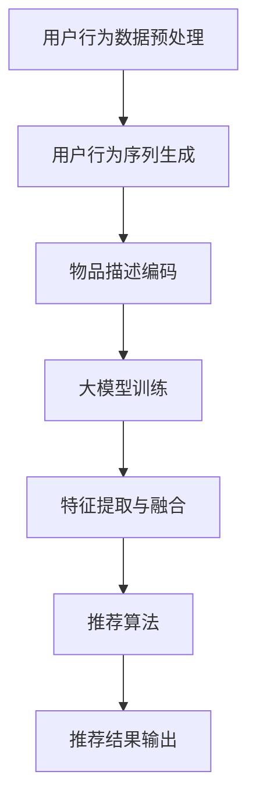

                 

# 《探索大模型在电商平台跨品类推荐中的作用》

## 关键词
大模型，电商平台，推荐系统，深度学习，协同过滤，内容推荐，跨品类推荐。

## 摘要
本文深入探讨了大模型在电商平台跨品类推荐系统中的应用。首先，介绍了大模型的基本概念及其在电商平台推荐中的潜在优势。随后，探讨了电商平台推荐系统的基础，包括推荐系统的原理、常见算法及其在大模型中的应用。接着，详细解析了深度学习与神经网络、自然语言处理技术以及大规模预训练模型的原理。最后，通过实际案例展示了大模型在跨品类推荐系统中的应用，并展望了其未来发展趋势。本文旨在为行业从业者提供有价值的参考。

# 《探索大模型在电商平台跨品类推荐中的作用》目录大纲

## 第一部分：大模型与电商平台推荐系统

### 第1章：大模型概述

#### 1.1 大模型的基本概念

#### 1.2 大模型在电商平台推荐中的应用前景

#### 1.3 主流大模型介绍

### 第2章：电商平台推荐系统基础

#### 2.1 推荐系统概述

#### 2.2 常见推荐算法

#### 2.3 大模型在推荐系统中的应用

### 第3章：大模型推荐系统技术基础

#### 3.1 深度学习与神经网络基础

#### 3.2 自然语言处理技术概览

#### 3.3 大规模预训练模型原理

## 第二部分：大模型在电商平台跨品类推荐中的应用

### 第4章：大模型在电商平台跨品类推荐中的应用

#### 4.1 跨品类推荐系统概述

#### 4.2 大模型在跨品类推荐中的应用

#### 4.3 大模型在跨品类推荐中的优化方法

### 第5章：大模型在电商平台的跨品类推荐实战

#### 5.1 实战一：基于GPT-2的协同过滤算法优化

#### 5.2 实战二：基于BERT的跨品类推荐系统设计

#### 5.3 实战三：基于Transformer的跨品类用户兴趣挖掘

## 第三部分：大模型推荐系统的未来发展趋势

### 第6章：大模型推荐系统的挑战与展望

### 第7章：大模型推荐系统的应用案例与前景

## 附录

### 附录 A：大模型推荐系统开发工具与资源

### 附录 B：Mermaid流程图与伪代码示例

# 第一部分：大模型与电商平台推荐系统

## 第1章：大模型概述

### 1.1 大模型的基本概念

大模型是指拥有数亿甚至数十亿参数的深度学习模型。这些模型通常通过大规模数据集进行预训练，然后在特定任务上微调以实现高性能。大模型的出现极大地推动了深度学习领域的发展，特别是在自然语言处理、计算机视觉和推荐系统等领域。

大模型与深度学习紧密相关。深度学习是一种基于神经网络的学习方法，通过多层次的神经元来实现特征提取和决策。大模型通过增加模型的规模和复杂性，提高了深度学习模型的性能。

### 1.2 大模型在电商平台推荐中的应用前景

电商平台推荐系统面临许多挑战，如数据多样、冷启动问题、用户偏好动态变化等。大模型的出现为解决这些问题提供了新的思路。

首先，大模型可以通过学习用户的历史行为和偏好，更好地预测用户的兴趣和需求。其次，大模型可以处理大规模的稀疏数据，解决冷启动问题。此外，大模型可以动态适应用户行为的变化，提高推荐系统的实时性和准确性。

### 1.3 主流大模型介绍

以下是几种主流的大模型及其特点：

- **GPT系列模型**：由OpenAI开发，具有强大的语言生成和理解能力。GPT-3拥有1750亿个参数，是当前最大的语言模型。

- **BERT及其变体**：由Google开发，用于预训练深度神经网络的语言表示。BERT拥有数十亿个参数，可以用于多种自然语言处理任务。

- **T5**：由Google开发，旨在解决各种自然语言处理任务。T5采用统一的目标检测框架，具有广泛的适用性。

- **ViT**：由Google开发，是第一个用于计算机视觉的大模型。ViT通过将图像划分为像素块，进行文本风格的处理。

- **XLNet**：由张磊等人开发，是第一个在自然语言处理任务上超过GPT-3的模型。XLNet采用自回归语言模型，具有更强的语言生成能力。

## 第2章：电商平台推荐系统基础

### 2.1 推荐系统概述

推荐系统是一种根据用户历史行为和偏好，为用户推荐相关物品或内容的系统。推荐系统在电商平台中具有重要作用，可以提升用户体验，增加销售额。

推荐系统的基本原理包括用户行为分析、物品特征提取、推荐算法和推荐结果展示。其中，用户行为分析是推荐系统的核心，通过分析用户的浏览、购买、收藏等行为，挖掘用户的兴趣和需求。物品特征提取则是将物品转化为可计算的特征向量，以便于推荐算法处理。推荐算法根据用户行为和物品特征，生成推荐结果。推荐结果展示则是将推荐结果以直观的方式呈现给用户。

### 2.2 常见推荐算法

常见的推荐算法包括协同过滤算法、内容推荐算法和混合推荐算法。

- **协同过滤算法**：通过分析用户之间的相似性，为用户推荐相似用户的喜爱物品。协同过滤算法分为基于用户的协同过滤和基于物品的协同过滤。基于用户的协同过滤通过计算用户之间的相似性，为用户推荐与其兴趣相似的物品。基于物品的协同过滤通过计算物品之间的相似性，为用户推荐与已有物品相似的物品。

- **内容推荐算法**：通过分析物品的特征，为用户推荐与其兴趣相关的物品。内容推荐算法分为基于关键词的推荐和基于属性的推荐。基于关键词的推荐通过分析物品的关键词，为用户推荐包含相同关键词的物品。基于属性的推荐通过分析物品的属性，为用户推荐与已有物品属性相似的物品。

- **混合推荐算法**：将协同过滤算法和内容推荐算法相结合，以提高推荐系统的准确性。混合推荐算法可以根据不同场景和用户需求，动态调整协同过滤和内容推荐的比例，从而提高推荐效果。

### 2.3 大模型在推荐系统中的应用

大模型在推荐系统中具有广泛的应用前景。首先，大模型可以用于用户行为分析，通过学习用户的历史行为和偏好，更好地预测用户的兴趣和需求。其次，大模型可以用于物品特征提取，通过分析物品的文本描述、图像等信息，将物品转化为可计算的特征向量。此外，大模型还可以用于优化推荐算法，通过学习用户和物品的交互数据，动态调整推荐策略，提高推荐系统的实时性和准确性。

## 第3章：大模型推荐系统技术基础

### 3.1 深度学习与神经网络基础

深度学习是一种基于神经网络的学习方法，通过多层次的神经元来实现特征提取和决策。神经网络的基本结构包括输入层、隐藏层和输出层。输入层接收外部输入，隐藏层通过非线性激活函数对输入进行加工，输出层生成最终的预测结果。

常见的深度学习架构包括卷积神经网络（CNN）、循环神经网络（RNN）和转换器（Transformer）。CNN适用于图像处理任务，通过卷积层提取图像的特征。RNN适用于序列数据处理任务，通过循环结构保持历史信息。Transformer模型在自然语言处理任务中表现出色，通过自注意力机制实现全局信息的有效传递。

深度学习优化算法主要包括梯度下降、随机梯度下降和批量梯度下降。梯度下降通过不断更新模型的参数，使损失函数的值逐步减小。随机梯度下降和批量梯度下降分别通过随机抽样和批量处理数据，加快模型的收敛速度。

### 3.2 自然语言处理技术概览

自然语言处理（NLP）是深度学习应用的重要领域之一。NLP技术包括词嵌入、序列模型、注意力机制和转换器架构。

词嵌入是一种将单词映射为向量的技术，用于表示单词的语义信息。常见的词嵌入方法包括Word2Vec、GloVe和BERT。序列模型是一种处理序列数据的方法，如RNN和LSTM。注意力机制是一种在模型中引入权重，使模型能够关注序列中的重要信息。转换器（Transformer）模型是NLP领域的重要突破，通过自注意力机制实现全局信息的有效传递。

### 3.3 大规模预训练模型原理

大规模预训练模型是指通过大规模数据集进行预训练的深度学习模型。预训练过程包括自监督学习和迁移学习。

自监督学习是一种无监督学习方法，通过预测输入数据的未标记部分来训练模型。BERT模型采用自监督学习进行预训练，通过预测下一个单词、下一个句子等任务来学习语言的内在规律。

迁移学习是一种利用预训练模型在新任务上进行微调的方法。预训练模型在大量数据上学习到的通用特征可以迁移到新的任务中，提高模型的性能。BERT模型通过在特定任务上进行微调，实现跨领域和跨任务的通用性。

## 第二部分：大模型在电商平台跨品类推荐中的应用

### 第4章：大模型在电商平台跨品类推荐中的应用

#### 4.1 跨品类推荐系统概述

跨品类推荐系统是一种为用户提供跨品类物品推荐的系统。与单一品类推荐系统相比，跨品类推荐系统需要处理更复杂的数据和更广泛的知识领域。跨品类推荐系统的设计挑战包括数据稀疏、冷启动问题和多品类相关性。

数据稀疏是指用户和物品的交互数据较少，导致推荐系统的准确性降低。冷启动问题是指新用户或新物品缺乏历史交互数据，难以进行准确推荐。多品类相关性是指不同品类之间存在关联，用户可能在多个品类中表现出相似的兴趣。

#### 4.2 大模型在跨品类推荐中的应用

大模型在跨品类推荐系统中具有显著的优势。首先，大模型可以通过大规模数据预训练，学习到通用特征和模式，提高推荐系统的准确性。其次，大模型可以处理稀疏数据和冷启动问题，通过迁移学习和知识蒸馏等技术，提高新用户和新物品的推荐效果。此外，大模型可以挖掘多品类相关性，为用户提供个性化的跨品类推荐。

大模型在跨品类推荐系统中的应用主要包括协同过滤算法的改进、内容推荐算法的创新和用户兴趣挖掘。

- **协同过滤算法的改进**：大模型可以用于协同过滤算法的优化，通过学习用户和物品的交互数据，提高推荐的准确性。例如，可以使用GPT-2模型对用户和物品的交互数据进行序列建模，预测用户的潜在兴趣。

- **内容推荐算法的创新**：大模型可以用于内容推荐算法的创新，通过分析物品的文本描述、图像等信息，提取丰富的特征向量。例如，可以使用BERT模型对物品的文本描述进行编码，生成高维的特征向量，用于内容推荐。

- **用户兴趣挖掘**：大模型可以用于用户兴趣挖掘，通过学习用户的历史行为和偏好，预测用户的潜在兴趣。例如，可以使用Transformer模型对用户的浏览、购买等行为进行建模，提取用户兴趣的隐式特征。

#### 4.3 大模型在跨品类推荐中的优化方法

大模型在跨品类推荐中的应用需要考虑数据稀疏、计算效率和模型可解释性等问题。以下是一些优化方法：

- **数据增强**：通过数据增强技术，增加训练数据量，提高模型的鲁棒性。例如，可以使用数据扩充、数据采样等方法，增加稀疏数据的多样性。

- **迁移学习**：通过迁移学习技术，利用预训练模型在大规模数据集上学习到的通用特征，提高新用户和新物品的推荐效果。例如，可以使用预训练的BERT模型在新用户和新物品上进行微调。

- **模型压缩**：通过模型压缩技术，减小模型的参数规模，降低计算复杂度。例如，可以使用量化、剪枝等技术，减少模型的存储和计算成本。

- **模型解释**：通过模型解释技术，提高模型的可解释性，帮助用户理解推荐结果。例如，可以使用注意力机制、可解释的神经网络架构等，解释模型决策过程。

## 第5章：大模型在电商平台的跨品类推荐实战

#### 5.1 实战一：基于GPT-2的协同过滤算法优化

GPT-2是一种强大的自然语言处理模型，可以用于协同过滤算法的优化。以下是基于GPT-2的协同过滤算法优化的具体步骤：

1. **数据预处理**：首先，对用户和物品的交互数据进行预处理，包括用户行为序列的生成和物品描述的编码。

2. **模型训练**：使用GPT-2模型对用户行为序列进行建模，预测用户的潜在兴趣。同时，使用物品描述的编码作为输入，生成物品的特征向量。

3. **协同过滤**：结合用户行为序列和物品特征向量，使用协同过滤算法生成推荐列表。例如，可以使用基于用户的协同过滤算法，计算用户和物品之间的相似性，为用户推荐相似物品。

4. **模型优化**：通过交叉验证和超参数调整，优化模型的性能。例如，可以调整GPT-2的层数、隐藏层大小和优化算法等。

5. **效果评估**：使用用户点击率、转化率等指标，评估模型的推荐效果。例如，可以使用A/B测试，比较基于GPT-2的协同过滤算法与传统协同过滤算法的推荐效果。

#### 5.2 实战二：基于BERT的跨品类推荐系统设计

BERT是一种强大的自然语言处理模型，可以用于跨品类推荐系统的设计。以下是基于BERT的跨品类推荐系统设计的具体步骤：

1. **数据预处理**：对用户和物品的交互数据进行预处理，包括用户行为序列的生成和物品描述的编码。

2. **模型训练**：使用BERT模型对用户行为序列进行建模，预测用户的潜在兴趣。同时，使用物品描述的编码作为输入，生成物品的特征向量。

3. **特征融合**：将用户兴趣特征和物品特征进行融合，生成多维度的特征向量。

4. **推荐算法**：使用基于矩阵分解的推荐算法，计算用户和物品之间的相似性，生成推荐列表。例如，可以使用基于用户的协同过滤算法，计算用户和物品之间的相似性，为用户推荐相似物品。

5. **效果评估**：使用用户点击率、转化率等指标，评估模型的推荐效果。例如，可以使用A/B测试，比较基于BERT的推荐系统与传统推荐系统的推荐效果。

#### 5.3 实战三：基于Transformer的跨品类用户兴趣挖掘

Transformer是一种强大的自然语言处理模型，可以用于跨品类用户兴趣挖掘。以下是基于Transformer的跨品类用户兴趣挖掘的具体步骤：

1. **数据预处理**：对用户和物品的交互数据进行预处理，包括用户行为序列的生成和物品描述的编码。

2. **模型训练**：使用Transformer模型对用户行为序列进行建模，预测用户的潜在兴趣。同时，使用物品描述的编码作为输入，生成物品的特征向量。

3. **兴趣提取**：从Transformer模型中提取用户兴趣的隐式特征，用于推荐算法的输入。

4. **推荐算法**：使用基于注意力机制的推荐算法，计算用户和物品之间的相似性，生成推荐列表。例如，可以使用基于用户的协同过滤算法，计算用户和物品之间的相似性，为用户推荐相似物品。

5. **效果评估**：使用用户点击率、转化率等指标，评估模型的推荐效果。例如，可以使用A/B测试，比较基于Transformer的推荐系统与传统推荐系统的推荐效果。

## 第三部分：大模型推荐系统的未来发展趋势

### 第6章：大模型推荐系统的挑战与展望

#### 6.1 大模型推荐系统的挑战

大模型推荐系统在实现高效推荐的同时，也面临一些挑战：

- **数据隐私与安全性**：大规模数据集的训练和使用可能涉及用户隐私和数据安全问题。确保数据的安全和隐私是未来发展的关键。

- **模型可解释性**：大模型的决策过程通常较为复杂，缺乏可解释性，不利于用户信任和理解。提高模型的可解释性是未来的一个重要研究方向。

- **模型部署与运维**：大模型的计算资源需求较高，部署和运维成本较大。如何高效地部署和维护大模型，以降低成本，是业界关注的焦点。

#### 6.2 大模型推荐系统的展望

未来，大模型推荐系统将在以下几个方面得到进一步发展：

- **个性化推荐的未来**：随着数据量的增长和计算能力的提升，大模型将能够提供更加个性化的推荐服务，满足用户的个性化需求。

- **大模型在推荐系统中的进一步优化**：研究人员将致力于优化大模型的训练算法、推理算法和部署策略，以提高推荐系统的效率和准确性。

- **大模型与其他技术的融合**：大模型将与其他技术，如增强学习、迁移学习等，结合使用，以应对复杂的推荐场景。

### 第7章：大模型推荐系统的应用案例与前景

#### 7.1 应用案例

以下是一些大模型推荐系统的应用案例：

- **电商平台**：通过大模型推荐系统，电商平台能够为用户提供个性化的商品推荐，提高用户满意度和转化率。

- **在线教育**：在线教育平台利用大模型推荐系统，为学习者推荐适合的学习内容和课程，提升学习效果。

- **音乐和视频平台**：音乐和视频平台通过大模型推荐系统，为用户提供个性化的音乐和视频推荐，提高用户粘性。

#### 7.2 前景展望

未来，大模型推荐系统将在以下方面展现广阔的应用前景：

- **智能家居**：智能家居设备将通过大模型推荐系统，为用户提供个性化的设备推荐和家居场景设置。

- **健康与医疗**：健康与医疗领域将利用大模型推荐系统，为用户提供个性化的健康建议和医疗服务。

- **旅游与出行**：旅游与出行领域将利用大模型推荐系统，为用户提供个性化的旅游路线和出行建议。

## 附录

### 附录A：大模型推荐系统开发工具与资源

#### A.1 主流深度学习框架对比

以下是几种主流的深度学习框架及其特点：

- **TensorFlow**：由Google开发，具有丰富的API和生态系统，支持多种深度学习模型。

- **PyTorch**：由Facebook开发，具有动态计算图和简洁的API，适合快速原型开发。

- **JAX**：由Google开发，支持自动微分和数值计算，适用于大规模模型训练。

#### A.2 大模型推荐系统开发实战资源

以下是一些大模型推荐系统开发实战资源：

- **实战项目代码**：包括基于GPT-2的协同过滤算法优化、基于BERT的跨品类推荐系统设计和基于Transformer的跨品类用户兴趣挖掘等。

- **开发工具与平台介绍**：介绍TensorFlow、PyTorch和JAX等深度学习框架的使用方法，以及如何搭建大规模推荐系统。

- **学习资源推荐**：推荐一些优质的学习资源，包括书籍、教程和在线课程等。

### 附录B：Mermaid流程图与伪代码示例

#### B.1 大模型推荐系统整体架构图



#### B.2 大模型协同过滤算法伪代码

```python
# 基于GPT-2的协同过滤算法伪代码
def gpt2协同过滤(user_history, item_features):
    # 用户行为序列编码
    user_embedding = gpt2.encode(user_history)
    
    # 物品特征向量
    item_embedding = item_features
    
    # 计算用户和物品之间的相似性
    similarity = cosine_similarity(user_embedding, item_embedding)
    
    # 根据相似性生成推荐列表
    recommendation_list = generate_recommendation_list(similarity)
    
    return recommendation_list
```

#### B.3 大模型内容推荐算法伪代码

```python
# 基于BERT的内容推荐算法伪代码
def bert内容推荐(item_description):
    # 编码物品描述
    item_embedding = bert.encode(item_description)
    
    # 提取物品的特征向量
    item_features = extract_features(item_embedding)
    
    # 生成推荐列表
    recommendation_list = generate_recommendation_list(item_features)
    
    return recommendation_list
```

#### B.4 大模型用户兴趣挖掘算法伪代码

```python
# 基于Transformer的用户兴趣挖掘算法伪代码
def transformer兴趣挖掘(user_behavior_sequence):
    # 编码用户行为序列
    user_embedding = transformer.encode(user_behavior_sequence)
    
    # 提取用户兴趣的隐式特征
    user_interest = extract_interest(user_embedding)
    
    # 生成兴趣图谱
    interest_graph = generate_interest_graph(user_interest)
    
    return interest_graph
```

