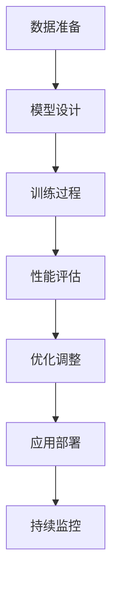

                 

# 《推荐系统中的大模型对抗训练与鲁棒性》

> 关键词：推荐系统、大模型、对抗训练、鲁棒性、算法、实践

> 摘要：本文深入探讨了推荐系统中的大模型对抗训练与鲁棒性，从基本概念、原理、算法到实际应用，详细阐述了大模型对抗训练在提升推荐系统性能和鲁棒性方面的作用，并结合实际案例，提供了完整的代码实现和解读，为读者提供了一个全面的学习和实践指南。

## 第一部分：引言与背景

### 1.1 推荐系统概述

#### 1.1.1 推荐系统的基本概念

推荐系统是一种利用算法和数据分析技术，根据用户的兴趣和偏好，向其推荐相关商品、信息或内容的信息系统。推荐系统广泛应用于电子商务、社交媒体、新闻媒体、在线视频等领域。

#### 1.1.2 推荐系统的分类

1. 基于内容的推荐（Content-Based Filtering）
2. 基于协同过滤的推荐（Collaborative Filtering）
3. 混合推荐系统（Hybrid Recommender Systems）

#### 1.1.3 推荐系统的发展历程

1. 传统推荐系统：基于规则和简单的统计方法。
2. 大模型推荐系统：利用深度学习等复杂算法，如神经网络、生成对抗网络等。
3. 对抗训练与鲁棒性：近年来，对抗训练和鲁棒性成为提升推荐系统性能的重要手段。

### 1.2 大模型对抗训练的基本概念

#### 1.2.1 大模型对抗训练的定义

大模型对抗训练是指利用生成对抗网络（GAN）等对抗训练技术，在大模型训练过程中引入对抗性噪声，以增强模型的泛化能力和鲁棒性。

#### 1.2.2 对抗训练的分类

1. 传统对抗训练：基于生成器和判别器的对抗训练。
2. 现代对抗训练：基于深度学习框架的对抗训练，如深度生成对抗网络（DAGAN）、自对抗生成网络（SAGAN）等。
3. 大模型对抗训练：在大型模型训练过程中，结合对抗训练技术，以提高模型性能和鲁棒性。

### 1.3 鲁棒性的重要性

#### 1.3.1 鲁棒性的定义

鲁棒性是指系统在面临各种异常输入或噪声时，仍能保持稳定和可靠运行的能力。

#### 1.3.2 鲁棒性的重要性

1. 提升用户体验：鲁棒性可以减少系统错误，提高用户满意度。
2. 增强模型泛化能力：鲁棒性有助于模型在面对不同数据分布时，仍能保持良好的性能。
3. 提高系统安全性：鲁棒性可以防止恶意攻击和异常输入对系统造成破坏。

## 第二部分：大模型对抗训练技术

### 2.1 大模型对抗训练的基本原理

#### 2.1.1 对抗训练的数学模型

对抗训练的核心是生成器和判别器的博弈过程。数学模型如下：

$$
\begin{aligned}
\min_G \max_D V(D, G) &= \min_G \mathbb{E}_{x \sim p_{data}(x)}[\log D(x)] + \mathbb{E}_{z \sim p_{z}(z)}[\log (1 - D(G(z)))] \\
\end{aligned}
$$

其中，$G$ 是生成器，$D$ 是判别器，$x$ 是真实数据，$z$ 是噪声。

#### 2.1.2 对抗训练的训练过程

1. 初始化生成器和判别器。
2. 输入真实数据和噪声数据。
3. 更新判别器：根据输入数据，更新判别器参数，使其能够更好地区分真实数据和生成数据。
4. 更新生成器：根据判别器输出，更新生成器参数，使其能够生成更逼真的数据。
5. 重复步骤2-4，直到达到预定的训练轮数。

#### 2.1.3 对抗训练的性能评估

1. 模型准确率：评估生成器和判别器的性能，通过计算生成数据的准确率来衡量。
2. 模型泛化能力：评估模型在面对未见过的数据时的表现，通过交叉验证等方法进行评估。
3. 模型稳定性：评估模型在面对不同数据分布和噪声时的稳定性，通过方差和置信区间等方法进行评估。

### 2.2 大模型对抗训练算法详解

#### 2.2.1 对抗神经网络

对抗神经网络（Generative Adversarial Networks，GAN）是最常用的对抗训练算法之一。其基本结构包括生成器和判别器：

1. 生成器：接收噪声向量 $z$，生成伪数据 $x_G$。
2. 判别器：接收真实数据 $x$ 和伪数据 $x_G$，输出二分类概率。

#### 2.2.2 自对抗生成网络

自对抗生成网络（Self-Adversarial Generative Network，SAGAN）是GAN的一种改进，通过引入自对抗机制，进一步提升生成质量。

1. 自对抗机制：生成器同时对抗多个判别器，每个判别器负责一部分数据。
2. 自对抗训练：生成器生成数据，同时对抗多个判别器，通过多任务学习提高生成质量。

#### 2.2.3 多对抗训练策略

多对抗训练策略结合了多种对抗训练算法，如GAN、SAGAN等，以提高模型性能和鲁棒性。

1. 多生成器策略：多个生成器共同工作，生成更高质量的伪数据。
2. 多判别器策略：多个判别器共同工作，更好地区分真实数据和伪数据。

### 2.3 大模型对抗训练案例解析

#### 2.3.1 对抗训练在图像识别中的应用

案例背景：使用GAN训练一个图像生成模型，生成逼真的图像。

实现步骤：

1. 数据准备：收集大量真实图像，作为训练数据。
2. 模型设计：设计生成器和判别器，采用卷积神经网络（CNN）架构。
3. 训练过程：采用对抗训练策略，训练生成器和判别器。
4. 性能评估：评估生成图像的质量，通过视觉和定量指标（如SSIM、PSNR等）进行评估。

#### 2.3.2 对抗训练在自然语言处理中的应用

案例背景：使用SAGAN训练一个自然语言生成模型，生成高质量的文本。

实现步骤：

1. 数据准备：收集大量文本数据，进行预处理。
2. 模型设计：设计生成器和判别器，采用循环神经网络（RNN）或变换器（Transformer）架构。
3. 训练过程：采用自对抗训练策略，训练生成器和判别器。
4. 性能评估：评估生成文本的质量，通过BLEU、ROUGE等指标进行评估。

#### 2.3.3 对抗训练在推荐系统中的应用

案例背景：使用GAN训练一个推荐系统，提升推荐质量。

实现步骤：

1. 数据准备：收集用户行为数据和商品信息。
2. 模型设计：设计生成器和判别器，结合协同过滤和基于内容的推荐方法。
3. 训练过程：采用对抗训练策略，训练生成器和判别器。
4. 性能评估：评估推荐系统的性能，通过准确率、召回率、F1值等指标进行评估。

## 第三部分：大模型鲁棒性分析

### 3.1 大模型鲁棒性的影响因素

#### 3.1.1 数据质量

1. 数据噪声：噪声数据会影响模型训练效果，降低模型鲁棒性。
2. 数据缺失：缺失数据会导致模型训练不稳定，降低模型鲁棒性。

#### 3.1.2 模型复杂度

1. 模型规模：大型模型通常具有更好的鲁棒性，但计算复杂度高。
2. 模型参数：参数越多，模型越复杂，鲁棒性可能降低。

#### 3.1.3 模型训练策略

1. 训练数据分布：训练数据分布与实际应用场景不符，可能导致模型鲁棒性降低。
2. 训练算法选择：不同的训练算法对模型鲁棒性有不同影响。

### 3.2 大模型鲁棒性提升方法

#### 3.2.1 数据增强

1. 数据增强策略：通过数据扩充、数据变换等方法，提高数据质量和多样性。
2. 数据增强实现：采用数据增强库，如Keras Data Generator、Data Augmentor等，实现数据增强。

#### 3.2.2 模型正则化

1. 正则化方法：L1正则化、L2正则化、Dropout等。
2. 正则化实现：在模型训练过程中，加入正则化项，抑制过拟合。

#### 3.2.3 鲁棒性评价指标

1. 稳健性评估：通过对抗性攻击，评估模型在面对攻击时的性能。
2. 抗攻击性评估：评估模型对恶意输入的抵抗能力。
3. 耐用性评估：评估模型在长时间运行过程中的稳定性。

### 3.3 大模型鲁棒性提升案例

#### 3.3.1 鲁棒性提升在图像识别中的应用

案例背景：使用对抗训练和鲁棒性提升方法，提升图像识别模型的性能。

实现步骤：

1. 数据准备：收集大量图像数据，包括正常图像和对抗图像。
2. 模型设计：设计具有鲁棒性的图像识别模型，采用卷积神经网络（CNN）架构。
3. 训练过程：采用对抗训练策略，结合数据增强和正则化方法，训练模型。
4. 性能评估：评估模型在正常图像和对抗图像上的性能，通过准确率、召回率、F1值等指标进行评估。

#### 3.3.2 鲁棒性提升在自然语言处理中的应用

案例背景：使用对抗训练和鲁棒性提升方法，提升自然语言处理模型的性能。

实现步骤：

1. 数据准备：收集大量文本数据，包括正常文本和对抗文本。
2. 模型设计：设计具有鲁棒性的自然语言处理模型，采用循环神经网络（RNN）或变换器（Transformer）架构。
3. 训练过程：采用对抗训练策略，结合数据增强和正则化方法，训练模型。
4. 性能评估：评估模型在正常文本和对抗文本上的性能，通过BLEU、ROUGE等指标进行评估。

#### 3.3.3 鲁棒性提升在推荐系统中的应用

案例背景：使用对抗训练和鲁棒性提升方法，提升推荐系统的性能。

实现步骤：

1. 数据准备：收集用户行为数据和商品信息，包括正常数据和对抗数据。
2. 模型设计：设计具有鲁棒性的推荐系统，结合协同过滤和基于内容的推荐方法。
3. 训练过程：采用对抗训练策略，结合数据增强和正则化方法，训练模型。
4. 性能评估：评估推荐系统在正常数据和对抗数据上的性能，通过准确率、召回率、F1值等指标进行评估。

## 第四部分：总结与展望

### 4.1 书籍总结

本文系统地介绍了推荐系统中的大模型对抗训练与鲁棒性，包括基本概念、原理、算法和应用。通过对大模型对抗训练技术的深入探讨，读者可以了解如何利用对抗训练技术提升推荐系统的性能和鲁棒性。同时，通过实际案例的解析，读者可以掌握大模型对抗训练与鲁棒性在实际应用中的具体实现方法。

### 4.2 未来发展趋势

1. **大模型对抗训练的优化方向**：随着计算能力的提升，未来将出现更多高效的对抗训练算法，如自适应对抗训练、分布式对抗训练等。
2. **大模型鲁棒性的研究热点**：数据隐私保护和模型安全与信任将成为研究热点，如何在不泄露用户隐私的前提下提升模型鲁棒性，是未来研究的重点。
3. **推荐系统的发展趋势**：智能化和个性化将成为推荐系统的发展方向，通过引入更多用户行为数据和上下文信息，实现更精准的推荐。

### 4.3 建议与展望

1. **研究建议**：未来应重点关注对抗训练算法的优化和鲁棒性提升方法的研究，探索更高效的对抗训练策略和鲁棒性评价指标。
2. **应用建议**：在实际应用中，应结合具体业务场景，灵活运用对抗训练和鲁棒性提升方法，提升推荐系统的性能和用户体验。
3. **培训与人才培养**：加强大模型对抗训练与鲁棒性的教育培训，培养具备相关技能的专业人才，为推荐系统的发展提供有力支持。

## 附录

### 附录A：相关资源

#### A.1 开源代码与工具

1. GAN开源代码：[GitHub - tensorflow/tensorflow: An Open Source Machine Learning Framework for Everyone](https://github.com/tensorflow/tensorflow)
2. 推荐系统开源项目：[GitHub - bdaash/recommender_systems: A Collection of Recommender Systems Implemented in Python](https://github.com/bdaash/recommender_systems)

#### A.2 学术论文与报告

1. GAN相关论文：[Generative Adversarial Nets - Ian Goodfellow et al. - 2014](https://arxiv.org/abs/1406.2661)
2. 推荐系统最新报告：[The 2021 State of Recommendation Systems Report - ReadyTalk](https://www.readytalk.com/recommendation-systems-report)

#### A.3 参考书籍与资料

1. 推荐系统经典书籍：《推荐系统实践》 - Simonede Lavee
2. 大模型对抗训练相关书籍：《生成对抗网络：理论、算法与应用》 - 李航

#### A.4 网络资源

1. 学术网站与论坛：[ArXiv - Cornell University](https://arxiv.org/)
2. 技术博客与文章：[Medium - Machine Learning](https://medium.com/topic/machine-learning)

#### A.5 交流与学习

1. 行业会议与研讨会：[NIPS - Neural Information Processing Systems](https://nips.cc/)
2. 社交媒体与专业社区：[LinkedIn - Machine Learning & AI](https://www.linkedin.com/groups/8196191)

### 附录B：大模型对抗训练与鲁棒性流程图



### 附录C：大模型对抗训练与鲁棒性伪代码

```python
# 大模型对抗训练伪代码
def adversarial_training(model, data_loader, optimizer, loss_function, epochs):
    for epoch in range(epochs):
        for data, target in data_loader:
            # 前向传播
            output = model(data)
            # 计算损失
            loss = loss_function(output, target)
            # 反向传播
            optimizer.zero_grad()
            loss.backward()
            optimizer.step()
```

### 附录D：大模型对抗训练与鲁棒性数学模型与公式

$$
\begin{aligned}
L &= \frac{1}{N} \sum_{i=1}^{N} \ell(y_i, \hat{y}_i) \\
\ell &= -[x \sim p_{data}(x)] \log D(x) - [z \sim p_{z}(z)] \log (1 - D(G(z))]
\end{aligned}
$$

### 附录E：大模型对抗训练与鲁棒性项目实战案例

#### E.1 代码实现与解释

```python
# 代码实现
# 注意：此处仅为示例，具体实现请参考相关开源代码和文档。

# 导入相关库
import torch
import torch.nn as nn
import torch.optim as optim

# 定义生成器和判别器
class Generator(nn.Module):
    # 生成器架构
    pass

class Discriminator(nn.Module):
    # 判别器架构
    pass

# 实例化生成器和判别器
generator = Generator()
discriminator = Discriminator()

# 定义损失函数和优化器
loss_function = nn.BCELoss()
optimizer_G = optim.Adam(generator.parameters(), lr=0.001)
optimizer_D = optim.Adam(discriminator.parameters(), lr=0.001)

# 训练过程
for epoch in range(epochs):
    for data, _ in data_loader:
        # 更新生成器和判别器
        optimizer_G.zero_grad()
        output = generator(data)
        loss_G = loss_function(output, true_data)
        loss_G.backward()
        optimizer_G.step()

        optimizer_D.zero_grad()
        output = discriminator(data)
        output_fake = discriminator(generator(data))
        loss_D = loss_function(output, true_data) + loss_function(output_fake, fake_data)
        loss_D.backward()
        optimizer_D.step()
```

#### E.2 开发环境搭建

1. 环境配置
   - Python 3.7+
   - PyTorch 1.7+
2. 工具安装
   - pip install torch torchvision numpy matplotlib

#### E.3 源代码详细解读

1. 代码结构与功能
   - 生成器和判别器：定义生成器和判别器的架构。
   - 损失函数和优化器：定义损失函数和优化器。
   - 训练过程：实现生成器和判别器的训练过程。

2. 关键代码解读
   - 生成器和判别器的架构设计：根据具体任务需求，设计生成器和判别器的神经网络架构。
   - 损失函数和优化器：选择适当的损失函数和优化器，以实现模型的训练和优化。

#### E.4 代码解读与分析

1. 代码性能分析
   - 分析生成器和判别器的性能，通过计算损失函数的值和模型的准确率来评估。
   - 分析训练过程中模型的收敛速度和稳定性。

2. 优化与改进建议
   - 调整模型参数，如学习率、批量大小等，以优化模型性能。
   - 引入正则化方法，如L1正则化、L2正则化等，以防止过拟合。
   - 采用数据增强方法，如随机裁剪、旋转、缩放等，以提高模型的泛化能力。

