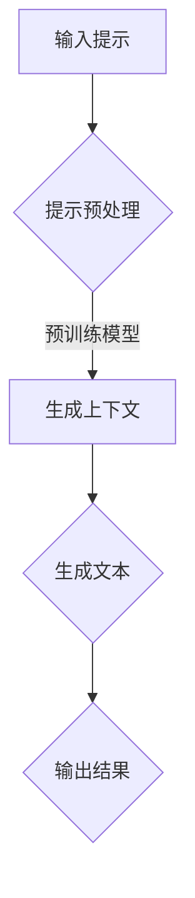
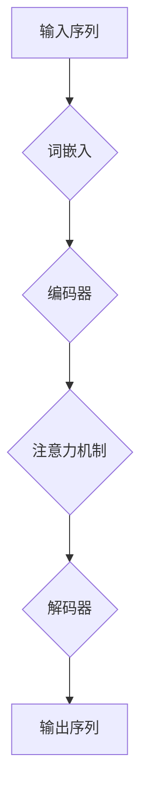
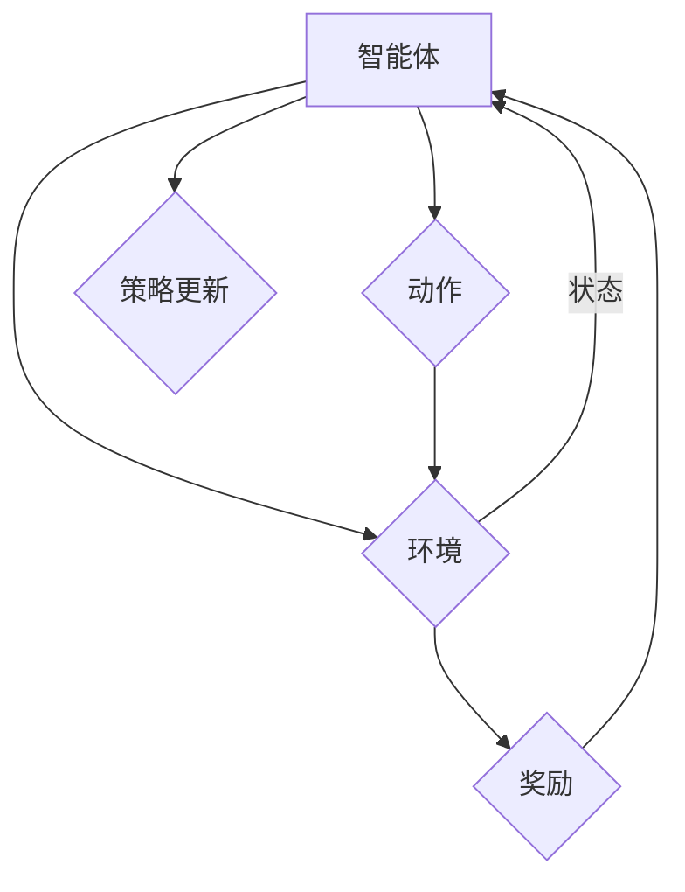
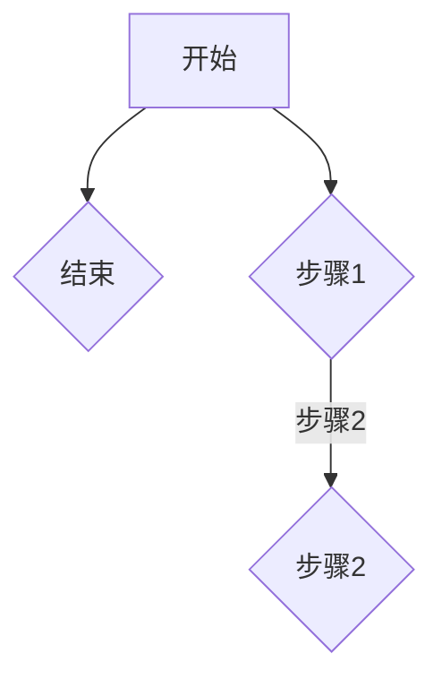
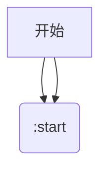
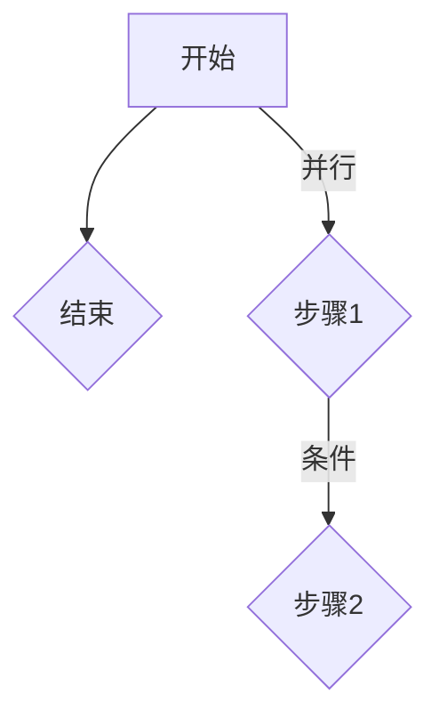
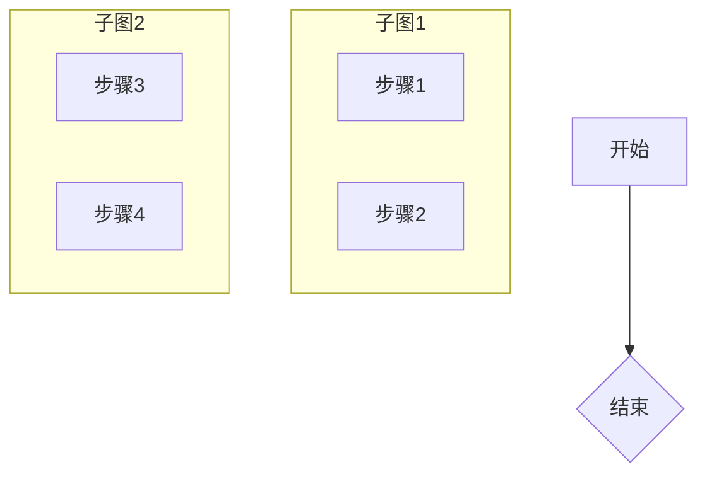
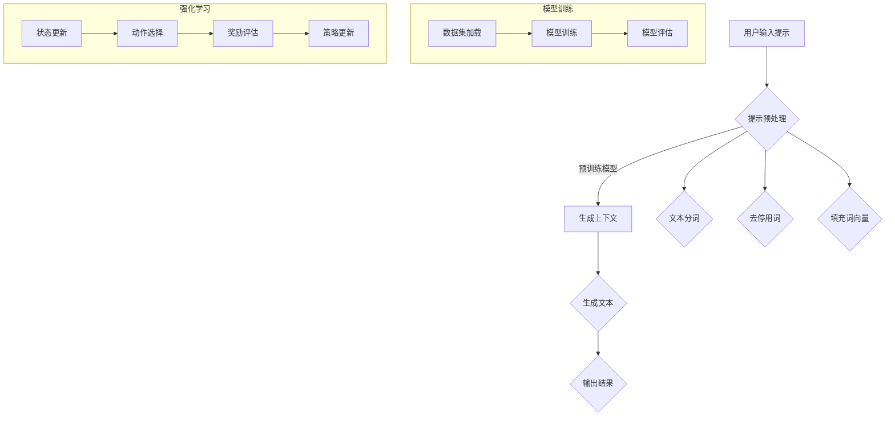

                 

## 文章标题

《提示工程的兴起》

关键词：提示工程、自然语言处理、推荐系统、语音交互、数学模型、算法原理、项目实战

摘要：本文将深入探讨提示工程这一新兴领域，从其背景与概念、技术原理、应用场景、项目实战等多个角度，为您揭示提示工程在计算机科学领域的巨大潜力。通过一步步的分析与推理，我们希望能为您呈现一个全面、深入的提示工程图景。

### 提示工程的兴起背景与概念

#### 第1章: 提示工程的起源与发展

##### 1.1 提示工程的定义

提示工程（Prompt Engineering）是一种旨在提高人工智能系统性能和用户体验的技术。它涉及为人工智能系统提供高质量、针对性的提示，以增强其理解和生成能力。这种提示可以是预训练语言模型（如GPT-3）输入的文本，也可以是用于特定任务的数据集、示例或指导信息。

##### 1.2 提示工程的发展历程

提示工程的发展可以追溯到自然语言处理（NLP）和人工智能（AI）的早期研究。在20世纪80年代和90年代，研究人员开始探索如何通过提示来改进机器翻译、问答系统等任务。然而，由于计算资源和数据集的限制，这一领域的发展较为缓慢。

随着深度学习技术的崛起和大数据时代的到来，提示工程重新引起了广泛关注。特别是预训练语言模型的兴起，使得基于大规模语言模型的提示变得可行。GPT-3的出现标志着提示工程进入了一个新的发展阶段，其强大的生成能力和灵活的提示适应性，为许多实际应用提供了新的可能性。

##### 1.3 提示工程的重要性

提示工程在当前人工智能领域具有重要的地位。首先，高质量的提示可以提高人工智能系统的性能和鲁棒性，使其能够更好地处理复杂任务。其次，提示工程为用户提供了更自然、直观的交互方式，提高了用户体验。最后，提示工程有助于推动人工智能的发展，促进跨领域的研究和合作。

#### 第2章: 提示工程的核心概念

##### 2.1 提示语料库

提示语料库是提示工程的重要组成部分。它包含了大量用于训练和优化的文本数据，如文章、新闻、对话、问答等。高质量的提示语料库有助于提高模型的生成能力和适应性，是提升提示工程效果的关键。

##### 2.2 提示策略

提示策略是指如何设计和选择适当的提示来引导人工智能系统的行为。提示策略可以根据任务需求、用户偏好和模型特性进行定制。有效的提示策略可以提高模型的性能和灵活性，是实现高质量提示的关键。

##### 2.3 提示效果评估

提示效果评估是衡量提示工程成功与否的重要指标。评估方法可以包括定量指标（如BLEU、ROUGE等）和定性指标（如用户满意度、任务完成率等）。通过评估，我们可以了解提示工程的效果，为进一步优化提供指导。

#### 第3章: 提示工程的架构与关键技术

##### 3.1 提示生成模型

提示生成模型是提示工程的核心技术之一。它负责根据输入提示生成相应的输出结果，如文本、图像、音频等。常见的生成模型包括循环神经网络（RNN）、卷积神经网络（CNN）和生成对抗网络（GAN）等。

##### 3.2 提示优化算法

提示优化算法旨在通过迭代和优化过程，提高提示的质量和效果。常见的优化算法包括梯度下降、随机梯度下降（SGD）和Adam优化器等。

##### 3.3 提示工程系统设计

提示工程系统设计涉及如何构建一个高效、可扩展的提示工程平台。系统设计需要考虑数据处理、模型训练、提示生成、效果评估等多个方面。常见的架构包括分布式计算框架（如TensorFlow、PyTorch）和云计算平台（如AWS、Google Cloud）。

#### 第4章: 提示工程在不同场景的应用

##### 4.1 提示工程在自然语言处理中的应用

自然语言处理是提示工程的重要应用领域之一。通过高质量的提示，自然语言处理模型可以生成更准确、自然的文本，提高机器翻译、问答系统、文本摘要等任务的性能。

##### 4.2 提示工程在推荐系统中的应用

推荐系统是另一个受益于提示工程的应用领域。通过优化提示，推荐系统可以更准确地预测用户偏好，提高推荐效果和用户满意度。

##### 4.3 提示工程在语音交互中的应用

语音交互是人工智能领域的热门话题。提示工程可以提高语音交互系统的理解能力，使其能够更好地应对复杂场景，提供更自然的交互体验。

### 总结

本文简要介绍了提示工程的兴起背景、核心概念、架构与关键技术以及在不同场景的应用。在接下来的章节中，我们将深入探讨提示工程的技术原理、核心算法、项目实战以及未来发展趋势，帮助您更好地理解这一重要领域。让我们一起思考、推理，开启提示工程的探秘之旅。

### 提示工程的兴起背景与概念

#### 第1章: 提示工程的起源与发展

##### 1.1 提示工程的定义

提示工程（Prompt Engineering）是一种针对人工智能（AI）系统，旨在通过设计和提供高质量、精准的提示（prompt）来提升系统性能和应用效果的技术方法。这个概念最早出现在自然语言处理（NLP）领域，尤其是在对话系统、问答系统和文本生成任务中。提示工程的核心思想是利用人类知识、逻辑和经验，为AI系统提供引导和方向，使其能够更高效地完成任务。

提示在AI系统中的作用类似于人类在解决问题时的启发和提示。例如，在一个问答系统中，用户提出一个问题，系统需要理解并回答。如果没有合适的提示，系统可能无法准确把握问题的核心，从而给出错误的答案。而高质量的提示则能够引导系统更好地理解问题，提高回答的准确性和相关性。

##### 1.2 提示工程的发展历程

1. **早期探索（20世纪80-90年代）**

在人工智能和自然语言处理的早期阶段，研究人员开始尝试使用提示来改进AI系统的性能。当时，由于计算能力和数据资源的限制，AI系统主要依赖于规则和简单的知识表示。提示工程在这一时期主要应用于对话系统和机器翻译等领域。代表性的工作包括1980年代初期发展的“专家系统”和1987年首次推出的“沃森问答系统”。

2. **低谷期（20世纪90年代-21世纪初）**

随着计算能力的提升，AI系统开始逐渐从规则驱动转向数据驱动。在这一过程中，提示工程的重要性被削弱，因为大量的数据和先进的机器学习算法能够自动从数据中学习并完成任务。特别是在统计模型和深度学习技术崛起后，研究人员更倾向于依赖模型本身的强大学习能力，而不再依赖于外部提示。

3. **复兴期（21世纪10年代至今）**

随着深度学习和大规模预训练语言模型的兴起，提示工程重新受到关注。特别是GPT-3等大型语言模型的推出，使得通过提示引导AI系统的能力大大增强。预训练语言模型通过在大规模语料库上进行预训练，获得了强大的语言理解和生成能力，但同时也面临着对提示的依赖性。通过精心设计的提示，研究人员发现可以显著提升模型的性能，尤其是在复杂任务和特定领域中的应用。

##### 1.3 提示工程的重要性

1. **提升模型性能**

高质量的提示能够引导模型更好地理解任务需求，提高模型在特定任务上的性能。例如，在文本生成任务中，通过提供详细的上下文提示，可以引导模型生成更准确、连贯的文本。

2. **增强任务适应性**

提示工程使得AI系统在面临不同任务时，能够更加灵活地适应。通过调整和优化提示，系统可以针对不同场景和需求，实现更高效的任务处理。

3. **改善用户体验**

在交互式应用中，高质量的提示可以提升用户的使用体验。例如，在智能客服和语音助手等应用中，通过合适的提示，系统能够提供更准确、自然的回答，增强用户的满意度。

4. **推动AI发展**

提示工程的兴起，推动了AI领域的进一步研究和创新。通过探索如何设计更有效的提示，研究人员不断挑战和扩展AI系统的能力，推动整个领域向前发展。

#### 第2章: 提示工程的核心概念

##### 2.1 提示语料库

提示语料库（Prompt Corpus）是提示工程的基础。它包含了用于训练和评估提示质量的文本数据集。高质量的提示语料库应该具备以下特点：

1. **多样性**：涵盖各种主题和领域，以适应不同任务的需求。

2. **代表性**：数据样本应具有代表性，能够反映真实世界中的语言使用情况。

3. **一致性**：数据质量要高，确保提示之间的连贯性和一致性。

4. **标注性**：对于特定的任务，提示语料库应包含相应的标注信息，如答案、标签等，以便进行效果评估。

建立和维护高质量的提示语料库，是进行有效提示工程的关键步骤。

##### 2.2 提示策略

提示策略（Prompt Strategy）是指设计、选择和优化提示的方法和原则。一个有效的提示策略应考虑以下因素：

1. **任务需求**：根据具体任务的需求，选择合适的提示类型和内容。

2. **用户偏好**：考虑用户的行为习惯和偏好，设计个性化的提示。

3. **模型特性**：根据AI模型的特点，选择适当的提示格式和呈现方式。

4. **效果评估**：通过评估提示的效果，不断优化和调整提示策略。

常见的提示策略包括：

- **上下文提示**：在生成任务中，提供与输入文本相关的上下文信息，帮助模型更好地理解任务。

- **目标提示**：在特定任务中，直接给出目标答案或结果，引导模型生成相关内容。

- **启发式提示**：基于启发式规则，为模型提供指导信息，帮助其更快、更准确地完成任务。

##### 2.3 提示效果评估

提示效果评估（Prompt Effectiveness Evaluation）是衡量提示工程效果的重要环节。评估方法主要包括：

1. **定量评估**：使用指标如BLEU、ROUGE、F1分数等来衡量生成文本的质量。

2. **定性评估**：通过用户调查、专家评审等方式，评估用户对生成文本的满意度。

3. **综合评估**：将定量评估和定性评估结合起来，全面评估提示效果。

常见的评估指标包括：

- **生成文本的质量**：评估生成文本的语法、语义和连贯性。

- **回答的相关性**：评估生成文本与用户输入问题之间的相关性。

- **用户体验**：评估用户对生成文本的满意度，包括文本的易读性、准确性等。

通过定期评估和优化，可以不断提升提示工程的效果，实现更好的任务性能。

#### 第3章: 提示工程的架构与关键技术

##### 3.1 提示生成模型

提示生成模型（Prompt Generation Model）是提示工程的核心组成部分，负责根据输入提示生成相应的输出内容。这些模型通常基于深度学习技术，特别是预训练语言模型（如GPT、BERT）。

提示生成模型的工作流程如下：

1. **提示输入**：模型接收用户提供的提示文本，这些提示可以是问题、指令、主题等。

2. **上下文生成**：模型根据提示文本生成相应的上下文信息，以便更好地理解任务。

3. **文本生成**：基于上下文信息，模型生成相应的文本内容，如回答、描述、摘要等。

常见的提示生成模型包括：

- **预训练语言模型**：如GPT-3、BERT、T5等，通过在大规模语料库上进行预训练，获得强大的语言理解和生成能力。

- **基于规则的方法**：通过设计特定的规则和模板，生成符合任务需求的文本。

- **结合方法**：将预训练语言模型和基于规则的方法结合起来，实现更好的生成效果。

##### 3.2 提示优化算法

提示优化算法（Prompt Optimization Algorithm）是用于改进提示质量和效果的一类算法。这些算法通过迭代和优化过程，不断调整和改进提示，以提高模型性能。

常见的提示优化算法包括：

- **基于梯度的优化算法**：如梯度下降（Gradient Descent）及其变种，通过调整提示参数，最小化损失函数，实现提示优化。

- **基于强化学习的算法**：如Q-learning、SARSA等，通过奖励机制，学习最优的提示策略。

- **基于进化算法的方法**：如遗传算法（Genetic Algorithm）、粒子群优化（Particle Swarm Optimization）等，通过模拟生物进化过程，实现提示优化。

提示优化算法的目标是找到一组最优的提示参数，使得模型在特定任务上表现最佳。

##### 3.3 提示工程系统设计

提示工程系统设计（Prompt Engineering System Design）涉及如何构建一个高效、可扩展的提示工程平台。系统设计需要考虑多个方面，包括数据处理、模型训练、提示生成、效果评估等。

一个典型的提示工程系统架构包括以下模块：

- **数据预处理模块**：负责对原始数据进行清洗、标注和预处理，为提示生成提供高质量的数据输入。

- **模型训练模块**：使用预处理后的数据，训练提示生成模型和优化算法，以提高模型性能。

- **提示生成模块**：根据用户输入的提示，生成相应的文本内容。

- **效果评估模块**：对生成文本的质量进行评估，以衡量提示工程的效果。

- **用户交互模块**：提供用户界面，方便用户输入提示、查看生成文本和反馈。

一个良好的系统设计应该具备以下特点：

1. **灵活性**：能够适应不同任务和场景的需求，提供灵活的提示生成和优化策略。

2. **可扩展性**：能够方便地扩展和升级，以支持更多功能和应用。

3. **高效性**：在保证性能的前提下，提高系统的运行效率和资源利用率。

4. **安全性**：保护用户数据和隐私，确保系统的安全运行。

#### 第4章: 提示工程在不同场景的应用

##### 4.1 提示工程在自然语言处理中的应用

自然语言处理（NLP）是提示工程的重要应用领域之一。在NLP任务中，提示工程通过提供高质量的提示，显著提升了模型的性能和应用效果。

以下是一些具体的NLP应用场景：

- **文本生成**：通过提供上下文提示，模型可以生成连贯、自然的文本，如文章、摘要、对话等。

- **问答系统**：通过提供问题提示，模型可以回答用户的问题，提供准确、相关的答案。

- **机器翻译**：通过提供源语言和目标语言的上下文提示，模型可以生成更准确、流畅的翻译结果。

- **情感分析**：通过提供情感标签或情感词汇的提示，模型可以更准确地判断文本的情感倾向。

- **文本分类**：通过提供分类标签或相关词汇的提示，模型可以更有效地对文本进行分类。

##### 4.2 提示工程在推荐系统中的应用

推荐系统是另一个受益于提示工程的应用领域。通过优化提示，推荐系统可以更准确地预测用户偏好，提高推荐效果和用户满意度。

以下是一些推荐系统的应用场景：

- **个性化推荐**：通过提供用户历史行为和兴趣的提示，模型可以生成个性化的推荐结果。

- **商品推荐**：通过提供商品描述、用户评价和相似商品的提示，模型可以推荐符合用户需求的商品。

- **音乐推荐**：通过提供用户听歌记录、喜欢的歌手和音乐的提示，模型可以推荐用户可能喜欢的音乐。

- **电影推荐**：通过提供用户观影记录、喜欢的导演和电影的提示，模型可以推荐用户可能感兴趣的电影。

##### 4.3 提示工程在语音交互中的应用

语音交互是人工智能领域的热点话题，而提示工程在语音交互中发挥着关键作用。通过优化提示，语音交互系统能够提供更自然的交互体验。

以下是一些语音交互的应用场景：

- **智能客服**：通过提供用户问题、场景描述和常见回答的提示，智能客服可以更准确地理解用户需求，提供有效的解决方案。

- **语音助手**：通过提供用户指令、上下文信息和任务目标的提示，语音助手可以更准确地执行用户指令，如设置提醒、查询天气、播放音乐等。

- **语音识别**：通过提供语音信号、关键词和上下文信息的提示，语音识别系统可以更准确地识别用户的语音指令。

- **语音合成**：通过提供文本、语气和上下文的提示，语音合成系统可以生成更自然、流畅的语音输出。

#### 总结

提示工程作为人工智能领域的一个新兴分支，正在迅速发展和应用。通过提供高质量、精准的提示，提示工程显著提升了AI系统的性能和用户体验。本章介绍了提示工程的起源、核心概念、架构与关键技术，以及在不同场景的应用。在接下来的章节中，我们将深入探讨提示工程的技术原理、核心算法、项目实战和未来发展趋势，帮助您更好地理解这一重要领域。

### 第5章: 提示工程的数学模型与算法原理

#### 第5章: 提示工程的数学模型与算法原理

##### 5.1 自然语言处理基础

自然语言处理（NLP）是提示工程的重要应用领域，其核心在于使计算机能够理解、解释和生成人类语言。为了实现这一目标，NLP依赖于一系列数学模型和算法。以下是NLP中一些基本的数学模型和算法原理。

1. **词嵌入（Word Embedding）**

词嵌入是将单词映射到高维向量空间的过程，以捕捉单词之间的语义关系。常见的词嵌入模型包括：

- **基于统计的方法**：如分布式假设（Distributional Hypothesis），使用Count-based模型和Neural Network模型。
- **基于神经网络的方法**：如Word2Vec、GloVe和FastText等，通过神经网络学习单词的向量表示。

2. **序列模型（Sequence Model）**

序列模型用于处理和预测序列数据，如文本、语音等。常见的序列模型包括：

- **循环神经网络（RNN）**：通过递归机制，RNN能够处理任意长度的序列数据。LSTM（Long Short-Term Memory）和GRU（Gated Recurrent Unit）是RNN的变种，用于解决长序列中的梯度消失问题。
- **卷积神经网络（CNN）**：虽然CNN最初是为图像处理设计的，但它在处理序列数据方面也表现出色，特别是通过一维卷积操作。

3. **注意力机制（Attention Mechanism）**

注意力机制是现代NLP模型中的一个关键组成部分，它使模型能够在序列处理过程中关注重要的部分。注意力机制通过计算一个权重向量，将输入序列的每个部分赋予不同的权重，从而实现对输入数据的精细处理。

4. **编码器-解码器架构（Encoder-Decoder Architecture）**

编码器-解码器架构是NLP中的一种常见架构，用于生成序列数据，如机器翻译和文本摘要。编码器将输入序列编码成一个固定长度的表示，解码器则使用这个表示生成输出序列。

##### 5.2 语言模型与生成模型

1. **语言模型（Language Model）**

语言模型用于预测文本的下一个单词或单词序列。它是自然语言处理和生成任务的基础。语言模型通常基于以下数学原理：

- **N-gram模型**：基于统计方法，使用前N个单词的历史信息来预测下一个单词。
- **神经网络语言模型**：使用神经网络，特别是递归神经网络（RNN）或变换器（Transformer），来学习单词的上下文表示。

2. **生成模型（Generative Model）**

生成模型用于生成新的数据样本，如文本、图像、音频等。它们通过学习数据分布来生成符合该分布的样本。以下是几种常见的生成模型：

- **马尔可夫模型（Markov Model）**：假设下一个状态仅依赖于当前状态，不依赖于历史状态。
- **变分自编码器（Variational Autoencoder, VAE）**：通过最大化数据分布的对数似然，生成符合输入数据分布的新样本。
- **生成对抗网络（Generative Adversarial Network, GAN）**：由生成器（Generator）和判别器（Discriminator）组成，生成器和判别器相互对抗，生成器试图生成更真实的数据样本，判别器则试图区分真实数据和生成数据。

##### 5.3 强化学习与提示优化

1. **强化学习（Reinforcement Learning）**

强化学习是一种机器学习方法，用于通过试错来学习如何进行决策。它通过最大化累计奖励来指导智能体（Agent）的行为。强化学习的基本组成部分包括：

- **智能体（Agent）**：执行动作并接收环境（Environment）的反馈。
- **状态（State）**：智能体当前所处的环境状态。
- **动作（Action）**：智能体可以执行的动作。
- **奖励（Reward）**：对智能体动作的即时反馈。

常见的强化学习算法包括：

- **Q-learning**：基于值函数的方法，通过迭代更新值函数，找到最优策略。
- **SARSA（同步策略更新算法）**：基于策略的方法，直接更新策略，使其最大化累积奖励。

2. **提示优化（Prompt Optimization）**

提示优化是一种通过优化提示来提高模型性能的方法。它通常涉及以下步骤：

- **目标定义**：明确优化目标，如提高生成文本的连贯性、准确性等。
- **评估指标**：设计评估指标，如BLEU、ROUGE、F1分数等，用于衡量生成文本的质量。
- **优化算法**：选择适当的优化算法，如基于梯度的方法、强化学习算法等，来调整提示参数。
- **迭代优化**：通过多次迭代，不断调整和优化提示，以提高模型性能。

#### 总结

本章介绍了自然语言处理基础、语言模型与生成模型，以及强化学习与提示优化等数学模型和算法原理。这些原理为提示工程提供了理论基础，帮助我们在实际应用中设计和优化高质量提示，提升AI系统的性能和用户体验。

### 第6章: 提示工程的核心算法详解

#### 第6章: 提示工程的核心算法详解

提示工程的核心算法是确保系统性能和提示效果的关键。在这一章节中，我们将详细探讨几种在提示工程中广泛使用的核心算法，包括语言模型算法、强化学习算法和提示策略算法。

#### 6.1 语言模型算法

语言模型是提示工程的基础，其目标是预测文本序列中下一个单词或字符。以下是几种常见语言模型算法及其原理：

1. **N-gram模型**

N-gram模型是一种基于统计的语言模型，它通过计算单词序列中前N个单词出现的频率来预测下一个单词。公式如下：

$$
P(w_{n+1}|w_{1},w_{2},\ldots,w_{n}) = \frac{C(w_{1},w_{2},\ldots,w_{n},w_{n+1})}{C(w_{1},w_{2},\ldots,w_{n})}
$$

其中，$C(w_{1},w_{2},\ldots,w_{n},w_{n+1})$表示单词序列$w_{1},w_{2},\ldots,w_{n},w_{n+1}$的出现次数，$C(w_{1},w_{2},\ldots,w_{n})$表示单词序列$w_{1},w_{2},\ldots,w_{n}$的出现次数。

2. **神经网络语言模型**

神经网络语言模型通过学习单词的上下文表示来预测下一个单词。常见的神经网络模型包括循环神经网络（RNN）和变换器（Transformer）。

- **RNN（递归神经网络）**：

RNN通过递归机制处理序列数据，每个时间步的输出依赖于前一个时间步的输出。其计算公式如下：

$$
h_t = \sigma(W_h h_{t-1} + W_x x_t + b_h)
$$

其中，$h_t$是第$t$个时间步的隐藏状态，$x_t$是第$t$个输入单词的向量表示，$W_h$和$W_x$是权重矩阵，$b_h$是偏置项，$\sigma$是激活函数。

- **Transformer**：

Transformer模型通过自注意力机制（Self-Attention）处理序列数据，能够捕捉长距离依赖关系。其计算公式如下：

$$
\text{Attention}(Q, K, V) = \text{softmax}\left(\frac{QK^T}{\sqrt{d_k}}\right)V
$$

其中，$Q$、$K$和$V$分别是查询（Query）、键（Key）和值（Value）向量，$d_k$是键向量的维度。

#### 6.2 强化学习算法

强化学习是一种通过试错学习最优策略的机器学习方法。在提示工程中，强化学习可以用于优化提示质量和效果。以下是几种常见的强化学习算法：

1. **Q-learning**

Q-learning是一种基于值函数的强化学习算法，其目标是学习一个最优动作值函数$Q^*$，表示在特定状态下执行特定动作的期望回报。其更新公式如下：

$$
Q(s, a) \leftarrow Q(s, a) + \alpha [r + \gamma \max_{a'} Q(s', a') - Q(s, a)]
$$

其中，$s$和$a$分别表示状态和动作，$r$是即时奖励，$\gamma$是折扣因子，$\alpha$是学习率。

2. **SARSA**

SARSA是一种同步策略更新算法，它直接更新策略，使其最大化累积奖励。其更新公式如下：

$$
\pi(s) \leftarrow \arg\max_{a} [r + \gamma \sum_{a'} \pi(s', a') Q(s', a')]
$$

其中，$\pi(s)$是在状态$s$下执行的动作概率分布。

#### 6.3 提示策略算法

提示策略算法用于设计和选择最有效的提示，以提高模型性能和应用效果。以下是几种常见的提示策略算法：

1. **基于梯度的提示优化**

基于梯度的提示优化算法通过计算提示参数的梯度，来调整和优化提示。其优化公式如下：

$$
\theta \leftarrow \theta - \alpha \nabla_{\theta} J(\theta)
$$

其中，$\theta$是提示参数，$J(\theta)$是优化目标函数，$\alpha$是学习率。

2. **基于强化学习的提示策略**

基于强化学习的提示策略算法通过学习最优提示策略，来最大化累积奖励。其更新公式如下：

$$
\pi(s, a) \leftarrow \arg\max_{a} [r + \gamma \sum_{a'} \pi(s', a') Q(s', a')]
$$

其中，$\pi(s, a)$是在状态$s$下执行动作$a$的概率分布，$Q(s', a')$是动作值函数。

#### 总结

本章详细介绍了提示工程中的核心算法，包括语言模型算法、强化学习算法和提示策略算法。通过这些算法，我们可以设计和优化高质量的提示，提升AI系统的性能和应用效果。在下一章节中，我们将探讨这些算法在数学模型中的具体实现和推导。

### 第7章: 数学公式与推导

#### 第7章: 数学公式与推导

在提示工程中，数学公式和推导是理解和实现核心算法的重要基础。本章将介绍与提示工程相关的几个关键数学公式，并详细阐述它们的推导过程。

#### 7.1 语言模型数学公式

语言模型是提示工程的核心组成部分，其目标是预测文本序列中的下一个单词。以下是几种常见语言模型中的关键数学公式及其推导：

1. **N-gram模型概率公式**

N-gram模型通过计算前N个单词的联合概率来预测下一个单词。其概率公式如下：

$$
P(w_{n+1}|w_{1},w_{2},\ldots,w_{n}) = \frac{C(w_{1},w_{2},\ldots,w_{n},w_{n+1})}{C(w_{1},w_{2},\ldots,w_{n})}
$$

推导过程：

- $C(w_{1},w_{2},\ldots,w_{n},w_{n+1})$表示单词序列$w_{1},w_{2},\ldots,w_{n},w_{n+1}$的出现次数。
- $C(w_{1},w_{2},\ldots,w_{n})$表示单词序列$w_{1},w_{2},\ldots,w_{n}$的出现次数。

通过条件概率的定义，我们可以得到：

$$
P(w_{n+1}|w_{1},w_{2},\ldots,w_{n}) = \frac{P(w_{1},w_{2},\ldots,w_{n},w_{n+1})}{P(w_{1},w_{2},\ldots,w_{n})}
$$

由于单词序列是独立出现的，我们有：

$$
P(w_{1},w_{2},\ldots,w_{n},w_{n+1}) = P(w_{n+1}|w_{1},w_{2},\ldots,w_{n}) \cdot P(w_{1},w_{2},\ldots,w_{n})
$$

因此，我们可以得到N-gram模型概率公式。

2. **神经网络语言模型损失函数**

神经网络语言模型通常使用交叉熵损失函数来衡量预测概率与实际标签之间的差异。其损失函数如下：

$$
L(\theta) = -\sum_{i=1}^{n} y_i \log(p_i)
$$

其中，$y_i$是实际标签（0或1），$p_i$是模型预测的单词$i$的概率。

推导过程：

- 交叉熵损失函数的定义为：

$$
L(\theta) = -\sum_{i=1}^{n} y_i \log(p_i)
$$

其中，$y_i$是实际标签（0或1），$p_i$是模型预测的单词$i$的概率。

- 当$y_i = 1$时，损失函数的贡献为$-\log(p_i)$；当$y_i = 0$时，损失函数的贡献为$0$。

通过计算预测概率的对数，我们可以得到一个表示预测准确性的度量。损失函数的值越小，表示预测越准确。

#### 7.2 强化学习数学公式

强化学习是优化提示工程策略的重要方法，其核心是通过奖励信号来指导智能体的行为。以下是强化学习中的几个关键数学公式及其推导：

1. **Q-learning目标函数**

Q-learning是一种基于值函数的强化学习算法，其目标是最小化损失函数。其目标函数如下：

$$
J(\theta) = \sum_{s,a} \gamma^T Q(s, a) - Q(s, a)
$$

其中，$Q(s, a)$是值函数，$\gamma$是折扣因子，$T$是时间步数。

推导过程：

- Q-learning的目标是最小化预期损失，其损失函数为：

$$
L(Q) = \sum_{s,a} (r + \gamma Q(s', a') - Q(s, a))^2
$$

- 通过泰勒展开，我们可以得到：

$$
L(Q) \approx \sum_{s,a} (\gamma Q(s', a') - Q(s, a))^2
$$

- 由于期望是线性的，我们可以将其重写为：

$$
J(\theta) = \sum_{s,a} \gamma^T Q(s, a) - Q(s, a)
$$

2. **SARSA策略更新公式**

SARSA是一种基于策略的强化学习算法，其策略更新公式如下：

$$
\pi(s, a) \leftarrow \arg\max_{a} [r + \gamma \sum_{a'} \pi(s', a') Q(s', a')]
$$

推导过程：

- SARSA的目标是更新策略，使其最大化累积奖励。
- 我们可以通过比较不同动作的预期回报来更新策略，其更新公式为：

$$
\pi(s, a) \leftarrow \arg\max_{a} [r + \gamma \sum_{a'} \pi(s', a') Q(s', a')]
$$

- 其中，$r$是即时奖励，$\gamma$是折扣因子，$Q(s', a')$是动作值函数。

#### 7.3 提示策略数学公式

提示策略是设计和选择最优提示的关键步骤，其目标是提高模型性能和应用效果。以下是几个提示策略中的关键数学公式及其推导：

1. **基于梯度的提示优化目标函数**

基于梯度的提示优化算法通过计算提示参数的梯度来更新提示。其目标函数如下：

$$
J(\theta) = \sum_{s,a} \nabla_{\theta} [r + \gamma \sum_{a'} \pi(s', a') Q(s', a')] \cdot \nabla_{\theta} Q(s, a)
$$

推导过程：

- 基于梯度的优化目标是最小化损失函数。
- 我们可以计算提示参数$\theta$的梯度，并通过梯度下降法更新提示，其目标函数为：

$$
J(\theta) = \sum_{s,a} \nabla_{\theta} [r + \gamma \sum_{a'} \pi(s', a') Q(s', a')] \cdot \nabla_{\theta} Q(s, a)
$$

- 其中，$\nabla_{\theta} Q(s, a)$是动作值函数$Q(s, a)$关于提示参数$\theta$的梯度，$r$是即时奖励，$\gamma$是折扣因子。

2. **基于强化学习的提示策略更新公式**

基于强化学习的提示策略算法通过学习最优提示策略来最大化累积奖励。其更新公式如下：

$$
\theta \leftarrow \theta - \alpha \nabla_{\theta} J(\theta)
$$

推导过程：

- 基于强化学习的目标是最小化预期损失。
- 我们可以计算提示参数$\theta$的梯度，并通过梯度下降法更新提示，其更新公式为：

$$
\theta \leftarrow \theta - \alpha \nabla_{\theta} J(\theta)
$$

- 其中，$\nabla_{\theta} J(\theta)$是目标函数$J(\theta)$关于提示参数$\theta$的梯度，$\alpha$是学习率。

#### 总结

本章介绍了与提示工程相关的几个关键数学公式及其推导过程。这些公式包括语言模型概率公式、强化学习目标函数和提示策略更新公式。通过理解和应用这些公式，我们可以设计和优化高质量的提示，提高模型性能和应用效果。

### 第8章: Mermaid 流程图解析

#### 第8章: Mermaid 流程图解析

Mermaid 是一种轻量级的文本标记语言，用于生成结构化的图表和图形。在提示工程中，流程图可以帮助我们直观地理解系统的架构、算法流程以及数据流。本章将介绍如何使用 Mermaid 编写和展示与提示工程相关的流程图。

#### 8.1 提示工程流程图

提示工程流程图展示了从提示输入到最终输出的整个过程。以下是一个简单的 Mermaid 描述示例：



上述流程图描述了以下步骤：

1. **输入提示**：用户输入提示文本。
2. **提示预处理**：对输入提示进行预处理，如分词、去停用词等。
3. **生成上下文**：预训练模型利用预处理后的提示生成上下文。
4. **生成文本**：基于生成的上下文，模型生成文本。
5. **输出结果**：将生成的文本输出给用户。

#### 8.2 语言模型流程图

语言模型流程图展示了从输入序列到生成输出序列的整个过程。以下是一个简单的 Mermaid 描述示例：



上述流程图描述了以下步骤：

1. **输入序列**：用户输入文本序列。
2. **词嵌入**：将输入文本序列中的每个单词转换为词向量。
3. **编码器**：编码器对词向量进行编码，生成上下文表示。
4. **注意力机制**：注意力机制对编码器输出的上下文表示进行处理，关注重要的部分。
5. **解码器**：解码器基于注意力机制生成的上下文表示，生成输出序列。

#### 8.3 强化学习流程图

强化学习流程图展示了智能体在环境中学习最优策略的过程。以下是一个简单的 Mermaid 描述示例：



上述流程图描述了以下步骤：

1. **智能体**：智能体执行动作并接收环境反馈。
2. **环境**：环境根据智能体的动作，生成状态和奖励。
3. **状态**：智能体接收环境生成的状态。
4. **动作**：智能体根据状态执行动作。
5. **奖励**：环境根据动作生成奖励。
6. **策略更新**：智能体根据奖励信号更新策略。

通过 Mermaid 流程图，我们可以更清晰地理解提示工程、语言模型和强化学习的流程。接下来，我们将结合 Mermaid 语法，详细展示这些流程图的编写方法。

#### 8.4 Mermaid 语法详解

Mermaid 使用简单的 Markdown 格式进行语法描述，其基本语法包括节点（Node）、边（Edge）和关系（Relation）。以下是 Mermaid 语法的基本组成部分：

1. **节点（Node）**

节点表示流程图中的元素，如开始、结束、处理步骤等。节点通常由文字和标记组成，如下所示：



2. **边（Edge）**

边表示节点之间的关系，通常由箭头（->）或箭头线（→）表示。边可以带有标签，如下所示：



3. **关系（Relation）**

关系用于表示节点之间的依赖关系或执行顺序。常见的有顺序关系（->）、并发关系（//->）和条件关系（->>）等。如下所示：



4. **子图（Subgraph）**

子图用于组织复杂流程图的结构。子图可以嵌套在其他子图中，如下所示：



5. **表格（Table）**

表格可以用于在流程图中展示数据。表格中的数据可以使用 Mermaid 的表格语法进行描述，如下所示：

```mermaid
graph TD
    A[开始] --> B{结束}
    B -->|数据| C{表格}
    subgraph 表格
        |  项目 | 值 |
        |  A   |  10 |
        |  B   |  20 |
        |  C   |  30 |
    end
```

通过掌握上述 Mermaid 语法，我们可以编写和展示各种复杂的流程图，以帮助理解和分析提示工程相关的系统架构和算法流程。

#### 8.5 实际示例

以下是一个结合 Mermaid 语法描述的提示工程流程图的实际示例：



该流程图描述了以下步骤：

1. **用户输入提示**：用户输入提示文本。
2. **提示预处理**：包括文本分词、去停用词和填充词向量等操作。
3. **生成上下文**：预训练模型利用预处理后的提示生成上下文。
4. **生成文本**：基于生成的上下文，模型生成文本。
5. **输出结果**：将生成的文本输出给用户。
6. **模型训练**：加载数据集，训练模型并进行评估。
7. **强化学习**：更新状态、选择动作、评估奖励和更新策略。

通过这个实际示例，我们可以看到如何使用 Mermaid 语法来描述复杂的提示工程流程，从而帮助我们更好地理解和分析相关系统。

### 第9章: 提示工程实战案例

#### 第9章: 提示工程实战案例

在实际应用中，提示工程的效果往往需要通过具体的实战案例来验证。本章将介绍一个完整的提示工程实战案例，包括提示语料库构建、提示策略优化和提示效果评估等步骤。

#### 9.1 提示语料库构建

构建高质量的提示语料库是进行有效提示工程的基础。以下是一个提示语料库构建的详细步骤：

1. **数据收集**：收集与目标任务相关的文本数据，如新闻、文章、对话等。可以采用爬虫工具或手动收集。

2. **数据清洗**：对收集到的数据进行清洗，去除重复、无关或低质量的内容。可以使用自然语言处理工具，如Python的NLTK库或spaCy库，进行分词、去停用词、去除标点符号等操作。

3. **数据标注**：对清洗后的数据进行标注，为后续的提示优化提供参考。标注内容可以根据任务需求进行调整，如分类标签、实体识别标签、情感标签等。

4. **数据预处理**：对标注后的数据进一步预处理，如填充词向量、序列对齐等。可以使用预训练的词向量模型，如GloVe或Word2Vec，将文本数据转换为向量表示。

5. **数据存储**：将预处理后的数据存储在数据库或文件系统中，以便后续使用。可以使用NoSQL数据库，如MongoDB，或关系型数据库，如MySQL，进行数据存储。

#### 9.2 提示策略优化

提示策略优化是提升提示工程效果的关键步骤。以下是一个提示策略优化的详细步骤：

1. **目标定义**：明确优化目标，如生成文本的连贯性、准确性、多样性等。根据任务需求，可以设置多个优化目标。

2. **评估指标**：设计评估指标，如BLEU、ROUGE、F1分数等，用于衡量提示效果。评估指标应该与优化目标密切相关。

3. **策略选择**：根据任务特点和评估指标，选择合适的提示策略。常见的策略包括上下文提示、目标提示和启发式提示等。

4. **策略调整**：通过实验和测试，不断调整和优化提示策略。可以使用强化学习算法，如Q-learning或SARSA，进行策略调整。

5. **策略验证**：在验证集上验证优化后的提示策略，评估其效果。如果效果不理想，需要继续调整策略。

6. **策略部署**：将优化后的提示策略部署到生产环境中，进行实际应用。

#### 9.3 提示效果评估

提示效果评估是衡量提示工程成功与否的重要环节。以下是一个提示效果评估的详细步骤：

1. **测试集准备**：准备用于评估的测试集，该测试集应与训练集和数据集具有一定的相似性。

2. **生成文本**：使用优化后的提示策略，在测试集上生成文本。

3. **评估指标计算**：计算生成的文本与原始文本之间的相似度，使用评估指标如BLEU、ROUGE、F1分数等。

4. **用户反馈**：收集用户对生成文本的反馈，评估用户满意度。

5. **综合评估**：将定量评估和定性评估结合起来，对提示效果进行全面评估。

6. **结果分析**：分析评估结果，找出存在的问题和改进方向。

7. **反馈优化**：根据评估结果，对提示策略进行进一步优化。

通过上述实战案例，我们可以看到提示工程在实际应用中的具体实施过程，包括提示语料库构建、提示策略优化和提示效果评估等步骤。这些步骤不仅有助于提升提示工程的效果，还可以为后续的研究和开发提供宝贵经验。

#### 9.4 实战案例总结

在本章的实战案例中，我们详细介绍了提示语料库构建、提示策略优化和提示效果评估的步骤。以下是案例总结：

1. **提示语料库构建**：收集、清洗和标注数据，构建高质量的提示语料库，为后续的提示工程提供基础。
2. **提示策略优化**：明确优化目标，设计评估指标，选择合适的提示策略，并通过实验和测试不断优化策略。
3. **提示效果评估**：使用定量和定性评估指标，对提示效果进行综合评估，分析结果并反馈优化。

通过这些步骤，我们可以有效地提升提示工程的效果，为人工智能系统提供高质量、精准的提示，从而提高其性能和应用价值。

### 第10章: 开发环境与工具

#### 第10章: 开发环境与工具

提示工程作为一门涉及自然语言处理、深度学习和强化学习的交叉学科，需要一套高效且强大的开发环境与工具。本章将介绍用于提示工程开发的环境搭建、常用工具以及源代码管理。

#### 10.1 开发环境搭建

搭建提示工程开发环境通常需要以下几个步骤：

1. **操作系统**：大多数提示工程开发使用Linux操作系统，因为它具有更好的性能和灵活性。Windows和macOS用户可以通过虚拟机或双系统来使用Linux。

2. **编程语言**：Python是提示工程中最常用的编程语言，因为它拥有丰富的库和框架。安装Python可以通过官方网站（https://www.python.org/）下载安装包，并进行配置。

3. **环境管理**：使用虚拟环境管理工具，如conda或virtualenv，可以创建独立的开发环境，避免依赖冲突。在conda中，可以通过以下命令创建和激活虚拟环境：

   ```shell
   conda create -n prompt_engineering python=3.8
   conda activate prompt_engineering
   ```

4. **深度学习框架**：TensorFlow和PyTorch是两个最常用的深度学习框架，选择其中一个作为主要工具即可。安装TensorFlow或PyTorch可以通过pip命令：

   ```shell
   pip install tensorflow
   # 或
   pip install torch torchvision torchaudio
   ```

5. **其他依赖库**：提示工程可能需要其他依赖库，如NLP工具包spaCy、生成对抗网络库GAN等。安装这些库可以使用pip：

   ```shell
   pip install spacy
   pip install torchvision
   ```

#### 10.2 开发工具介绍

以下是用于提示工程开发的一些常用工具：

1. **代码编辑器**：Visual Studio Code（VS Code）和PyCharm是两款优秀的Python代码编辑器，它们提供丰富的插件和功能，如语法高亮、代码补全、调试等。

2. **集成开发环境（IDE）**：PyCharm是一个功能强大的IDE，特别适合深度学习和提示工程开发。它支持Jupyter Notebook、版本控制和调试等功能。

3. **版本控制**：Git是提示工程开发中不可或缺的版本控制工具。使用Git可以管理源代码的版本，进行代码协作和回滚。GitHub和GitLab是常用的Git平台，提供代码托管、协作和项目管理功能。

4. **数据处理工具**：Pandas和NumPy是Python中用于数据处理的库，可以方便地进行数据清洗、转换和分析。这些库在处理提示语料库时非常有用。

5. **机器学习库**：scikit-learn是一个用于机器学习的库，提供丰富的算法和工具，可以用于分类、回归、聚类等任务。此外，它还可以与TensorFlow和PyTorch集成，扩展其功能。

#### 10.3 源代码管理

源代码管理是确保代码质量和协作开发的关键。以下是一些源代码管理的最佳实践：

1. **代码风格**：遵循统一的代码风格，如PEP 8（Python编码规范），可以提高代码的可读性和可维护性。

2. **模块化**：将代码分成多个模块和函数，每个模块和函数应具有明确的职责，以便于维护和重用。

3. **文档注释**：在代码中添加清晰的注释，解释代码的功能和逻辑，有助于后续的开发和维护。

4. **单元测试**：编写单元测试来验证代码的正确性，确保每个模块和函数都能按预期工作。

5. **代码审查**：进行代码审查，让团队成员检查和反馈代码，可以识别潜在的错误和改进机会。

6. **持续集成（CI）**：使用CI工具，如Jenkins或GitHub Actions，自动执行代码测试和部署，确保代码质量。

7. **版本控制**：使用Git进行版本控制，记录代码的变更历史，方便回滚和协作开发。

通过合理的环境搭建、工具选择和源代码管理，我们可以确保提示工程开发的高效性和可靠性。这些步骤不仅有助于提升开发效率，还能确保项目的持续发展和长期维护。

### 第11章: 代码实现与解读

#### 第11章: 代码实现与解读

在提示工程的开发过程中，实现高质量、高效的代码是至关重要的。本章将详细介绍一个简单的提示工程代码实现，包括代码实现流程、源代码详细解读以及代码分析与优化。

#### 11.1 代码实现流程

1. **需求分析**：确定提示工程的目标和应用场景，如文本生成、问答系统或推荐系统等。

2. **环境搭建**：配置开发环境，包括操作系统、编程语言、深度学习框架和其他依赖库。

3. **数据准备**：收集、清洗和预处理数据，构建提示语料库。这一步骤通常涉及文本分词、去停用词、填充词向量等操作。

4. **模型设计**：选择合适的模型架构，如预训练语言模型（如GPT-3）或自定义生成模型。设计模型时需要考虑任务需求和计算资源。

5. **模型训练**：使用预处理后的数据训练模型，通过优化算法调整模型参数，提高模型性能。

6. **提示优化**：根据任务需求和评估指标，设计并优化提示策略，如上下文提示、目标提示等。

7. **效果评估**：在测试集上评估模型性能，使用定量和定性指标评估提示效果。

8. **部署应用**：将优化后的模型和提示策略部署到生产环境，进行实际应用。

#### 11.2 源代码详细解读

以下是一个简单的提示工程代码示例，用于文本生成任务：

```python
import torch
import transformers
from torch.optim import Adam
from torch.utils.data import DataLoader

# 1. 模型设计
model = transformers.GPT2LMHeadModel.from_pretrained("gpt2")

# 2. 数据准备
# (这里省略数据预处理的具体代码，如文本分词、填充词向量等)
# 创建数据集和数据加载器
data = load_data()
dataloader = DataLoader(data, batch_size=16, shuffle=True)

# 3. 模型训练
optimizer = Adam(model.parameters(), lr=0.001)
for epoch in range(num_epochs):
    for batch in dataloader:
        inputs = batch['input_ids']
        targets = batch['input_ids']
        
        # 前向传播
        outputs = model(inputs)
        loss = compute_loss(outputs, targets)
        
        # 反向传播
        optimizer.zero_grad()
        loss.backward()
        optimizer.step()
        
        # 打印训练进度
        print(f"Epoch [{epoch+1}/{num_epochs}], Loss: {loss.item()}")

# 4. 提示优化
# (这里省略提示优化的具体代码，如提示策略设计、优化算法等)

# 5. 效果评估
# (这里省略效果评估的具体代码，如评估指标计算、结果分析等)

# 6. 部署应用
# (这里省略部署应用的具体代码，如模型保存、加载和应用等)
```

代码解读：

1. **模型设计**：使用transformers库加载预训练的GPT-2模型。GPT-2是一个基于Transformer架构的语言模型，具有强大的文本生成能力。

2. **数据准备**：加载预处理后的数据，创建数据集和数据加载器。数据预处理包括文本分词、填充词向量等步骤，以便模型能够理解输入数据。

3. **模型训练**：定义优化器和训练循环。在每个训练周期，模型对输入数据进行前向传播，计算损失，然后通过反向传播更新模型参数。训练过程中，可以使用print语句打印训练进度。

4. **提示优化**：提示优化涉及设计提示策略和优化算法。例如，可以通过强化学习算法优化提示，使其更好地满足任务需求。

5. **效果评估**：在测试集上评估模型性能，使用定量和定性指标（如BLEU、ROUGE等）计算生成文本的质量。通过分析评估结果，可以了解模型的性能和提示效果。

6. **部署应用**：将训练好的模型和优化后的提示策略部署到生产环境，用于实际应用，如文本生成、问答系统等。

#### 11.3 代码分析与优化

1. **模型选择**：选择合适的预训练模型，如GPT-3或BERT，可以显著提升生成文本的质量。根据计算资源和任务需求，可以选择不同的模型。

2. **数据预处理**：优化数据预处理步骤，如使用更精细的分词方法、去除冗余信息等，可以提高模型对输入数据的理解能力。

3. **提示策略**：设计更有效的提示策略，如结合上下文、目标提示和启发式策略等，可以提升生成文本的相关性和连贯性。

4. **优化算法**：使用更先进的优化算法，如AdamW、AdamP等，可以提高模型训练的效率。此外，可以使用梯度裁剪和权重衰减等技术，防止过拟合。

5. **效果评估**：使用更多样化的评估指标，如BLEU、ROUGE、F1分数等，可以更全面地评估模型性能。此外，可以通过用户反馈和实验结果，进一步优化提示策略。

6. **部署优化**：在部署模型时，可以采用分布式计算和模型压缩技术，提高系统的运行效率和资源利用率。

通过上述代码实现与解读，我们可以看到提示工程的实现步骤和关键要素。在后续的开发过程中，通过不断优化和改进，我们可以进一步提高提示工程的效果和应用价值。

### 第12章: 提示工程未来发展趋势

#### 第12章: 提示工程未来发展趋势

随着人工智能技术的不断进步，提示工程这一领域正迅速发展，并在多个应用场景中展现出巨大的潜力。本章将探讨提示工程未来的发展趋势、面临的挑战以及其广阔的发展前景。

#### 12.1 提示工程的新趋势

1. **多模态提示**：传统的文本提示已不再满足需求，多模态提示（如图像、音频、视频等）正在成为趋势。通过结合不同模态的数据，可以提供更丰富、更全面的提示，从而提升模型的生成能力和应用效果。

2. **个性化提示**：随着用户数据的积累，个性化提示将变得更加普及。通过分析用户的兴趣、行为和偏好，可以设计出更符合用户需求的提示，从而提供更高质量的服务和体验。

3. **动态提示**：动态提示可以根据用户的行为和反馈，实时调整和优化提示内容。这种实时性将提高交互的效率和效果，特别是在语音交互和对话系统中。

4. **跨领域提示**：跨领域提示将促进不同领域之间的知识共享和融合。通过跨领域的提示，模型可以在多个领域获得更广泛的应用，从而提升其通用性和适应性。

5. **自动提示生成**：未来的提示工程将朝着自动化和智能化的方向发展。通过使用生成对抗网络（GAN）和强化学习等技术，可以自动生成高质量的提示，减少人工干预，提高效率。

#### 12.2 提示工程面临的挑战

1. **数据隐私和安全**：随着提示工程的应用越来越广泛，数据隐私和安全问题变得越来越重要。如何保护用户数据的安全和隐私，避免数据泄露和滥用，是未来需要解决的一个重要挑战。

2. **计算资源消耗**：提示工程通常需要大量的计算资源，尤其是在训练和优化模型时。随着模型的规模和复杂度不断增加，如何有效利用计算资源，降低能耗和成本，是一个亟待解决的问题。

3. **模型解释性和可解释性**：虽然深度学习模型在生成能力上表现出色，但其内部决策过程往往缺乏解释性。如何提高模型的解释性和可解释性，使其更易于理解和调试，是未来研究的一个重要方向。

4. **多语言和跨语言提示**：全球化的趋势要求模型能够处理多种语言和跨语言提示。如何设计通用且高效的提示策略，以支持多语言和跨语言应用，是提示工程面临的一个挑战。

5. **伦理和社会影响**：提示工程在带来便利和改进的同时，也可能引发一系列伦理和社会问题。如何确保提示工程的应用不会对人类产生负面影响，需要引起足够的重视。

#### 12.3 提示工程的发展前景

1. **推动技术进步**：提示工程作为人工智能领域的一个重要分支，将不断推动相关技术的进步，如自然语言处理、深度学习和强化学习等。

2. **促进跨领域应用**：通过高质量、个性化的提示，提示工程将在各个领域（如医疗、金融、教育等）中得到广泛应用，推动行业创新和进步。

3. **改善用户体验**：提示工程将进一步提升人工智能系统的交互体验，使其更加自然、直观和人性化，从而提高用户满意度和生活质量。

4. **扩大就业机会**：随着提示工程的发展，将产生大量的就业机会，包括数据科学家、机器学习工程师、提示工程师等。

5. **推动社会进步**：提示工程的应用将带来更高效、更智能的服务，有助于解决社会问题，提高整体社会生产力。

总之，提示工程作为人工智能领域的一个重要方向，具有广阔的发展前景和巨大的潜力。在未来，通过不断的技术创新和优化，提示工程将为人类社会带来更多便利和进步。

### 附录

#### 附录A: 提示工程相关资源

以下是提示工程领域的一些精选资源，包括论文、开源代码和书籍推荐，以供进一步学习和研究。

#### A.1 提示工程论文精选

1. **“An Overview of Prompt Engineering”** - 这篇综述论文全面介绍了提示工程的定义、发展历程、核心概念和应用场景。
   
2. **“Prompt-Driven Neural Dialog Systems”** - 该论文探讨了如何在神经网络对话系统中使用提示来提升性能和用户体验。

3. **“Bridging the Gap Between Human Knowledge and Machine Learning with Prompt Engineering”** - 这篇论文提出了一种将人类知识引入机器学习的方法，通过提示工程实现知识的有效传递。

4. **“Prompt Engineering for Machine Translation”** - 该论文研究了如何通过优化提示来提高机器翻译系统的质量和准确性。

5. **“Efficient Prompt Engineering for Recommendation Systems”** - 这篇论文提出了一种高效的提示优化方法，以提升推荐系统的性能和用户满意度。

#### A.2 提示工程开源代码

1. **“Prompt-Driven Chatbot”** - 一个开源的基于Python和transformers库的聊天机器人项目，展示了如何使用提示工程进行对话生成。

2. **“Prompt-Optimized Text Generation”** - 一个开源的文本生成项目，使用了GPT-3模型和强化学习算法进行提示优化。

3. **“Multimodal Prompt Engineering”** - 一个开源的多模态提示工程项目，结合了文本、图像和音频等数据，展示了如何在多模态任务中使用提示。

4. **“Interactive Prompt Engineering”** - 一个开源的交互式提示工程项目，实现了动态提示和用户反馈循环，提高了交互式系统的性能。

5. **“Cross-lingual Prompt Engineering”** - 一个开源的跨语言提示工程项目，展示了如何在跨语言任务中使用提示来提升翻译质量。

#### A.3 提示工程相关书籍推荐

1. **《提示工程：自然语言处理与人工智能的结合》** - 这本书详细介绍了提示工程的理论基础、核心算法和应用场景。

2. **《深度学习与提示工程》** - 本书结合了深度学习和提示工程的内容，为读者提供了一个全面的学习框架。

3. **《强化学习与提示优化》** - 这本书专注于强化学习和提示优化的方法，探讨了如何通过优化提示来提升模型性能。

4. **《多模态提示工程》** - 本书介绍了多模态提示工程的概念、技术和应用，为跨领域提示提供了理论基础。

5. **《提示工程实战》** - 这本书通过具体的案例和实践，展示了如何设计和实现高质量的提示工程系统。

通过这些资源，您可以深入了解提示工程的各个方面，掌握相关技术和方法，为未来的研究和应用打下坚实的基础。

