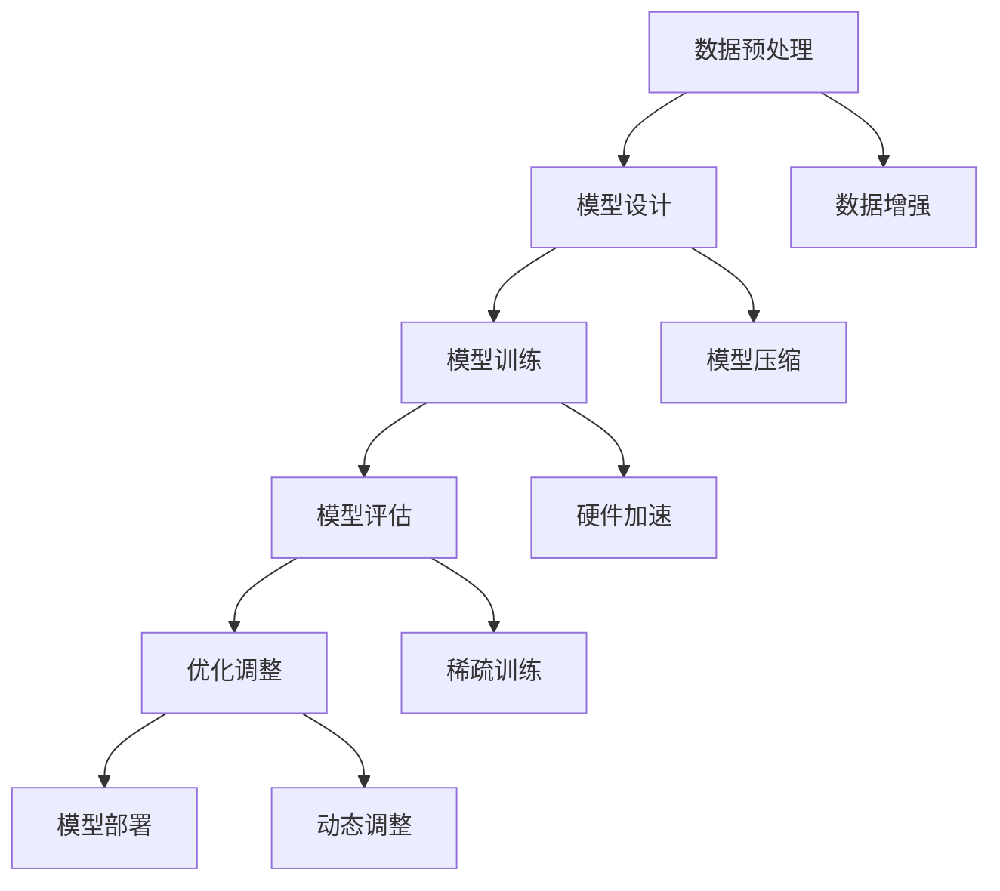

                 

### 文章标题: 提高AI模型能效：从精度到稀疏性的优化之路

### 关键词：AI模型能效、精度优化、稀疏性优化、模型优化、硬件加速

### 摘要：
本文深入探讨AI模型能效优化的重要性及其核心原理，详细分析了从精度到稀疏性的优化方法。首先，我们定义了AI模型能效，并探讨了其重要性。随后，文章分为多个章节，涵盖了模型精度优化、稀疏性优化、综合优化策略，以及特定领域的应用。此外，我们还介绍了AI模型能效优化工具和平台，并展望了未来的发展趋势。通过实际项目和最佳实践，我们展示了如何有效提升AI模型的能效。

### 文章概述

在当今信息爆炸的时代，人工智能（AI）技术正以前所未有的速度发展，被广泛应用于各个领域，从图像识别到自然语言处理，再到复杂的决策支持系统。然而，随着AI模型的复杂度和数据量的增加，如何高效地训练和部署这些模型成为一个日益严峻的挑战。这不仅仅是因为计算资源的限制，更是因为高能耗带来的环境问题和经济负担。因此，提高AI模型能效，即如何在有限的资源下实现更高的模型性能和效率，成为了一个重要的研究领域。

本文旨在系统地探讨AI模型能效优化的各个方面，包括其核心原理、具体优化方法、最佳实践，以及未来的发展趋势。我们将首先介绍AI模型能效的定义和重要性，然后逐步深入到具体的优化技术，如精度优化、稀疏性优化和硬件加速等。文章将结合实际项目案例和最佳实践，展示如何在实际应用中提升AI模型的能效。最后，我们将探讨当前和未来可能影响AI模型能效优化的新技术和挑战。

通过这篇文章，读者将能够全面了解AI模型能效优化的概念、方法和策略，掌握如何在实际应用中有效地提升模型的性能和效率。

### 第一部分: 提高AI模型能效：概述与核心原理

在进入具体优化方法之前，首先需要理解AI模型能效的定义、重要性以及其核心原理。这将为后续章节的详细讨论提供基础。

#### 1.1 AI模型能效的定义与重要性

**AI模型能效**是一个多维度的概念，它涉及到模型在完成特定任务时所需资源（如计算资源、存储资源、能耗等）与模型性能表现之间的权衡。具体而言，AI模型能效指的是在保持模型精度和性能的同时，最小化其资源消耗的能力。

**重要性**：

- **降低成本**：随着AI模型的复杂度增加，训练和部署所需的资源也呈指数级增长。提高模型能效意味着可以减少硬件设备和能源的成本，从而降低整体运营费用。
- **提高性能**：在资源有限的情况下，通过优化模型能效，可以在更短的时间内完成更多的任务，提升系统的响应速度和处理能力。
- **环境可持续性**：随着全球对环境保护意识的增强，减少AI模型在训练和部署过程中的能耗成为了一个重要的目标。提高模型能效有助于减少碳足迹，推动环保目标的实现。

#### 1.2 AI模型能效的核心原理

AI模型能效的核心在于如何高效地利用资源，实现性能和资源消耗的最佳平衡。以下是一些核心原理：

- **效率与资源消耗**：
  - **效率**：指模型在完成特定任务时的时间消耗。提高效率意味着在相同时间内完成更多的工作，或者以更短的时间完成相同的工作。
  - **资源消耗**：包括计算资源、存储资源和能耗等。减少资源消耗意味着在资源有限的情况下，最大限度地发挥模型的能力。

- **模型优化**：通过对模型结构和算法的改进，降低模型的计算复杂度和存储需求。具体方法包括算法改进、模型结构优化和数据预处理等。

- **硬件加速**：利用专用硬件（如GPU、TPU等）进行模型训练和推理，显著提高计算效率。硬件加速可以大幅减少训练时间和推理延迟，从而提高整体性能。

- **数据预处理**：通过数据清洗、归一化等预处理步骤，提高模型对数据的利用效率。预处理不仅可以提高模型精度，还可以减少计算资源的消耗。

#### 1.3 提高AI模型能效的方法

**模型优化**：
- **算法改进**：引入更高效的训练算法，如Adam优化器、动量法等，以提高训练速度和收敛性能。
- **模型结构优化**：通过网络剪枝、模型压缩等技术，减少模型参数数量，降低计算复杂度。
- **数据增强**：通过增加训练数据的多样性，提高模型的泛化能力，减少对训练数据的依赖。

**硬件加速**：
- **GPU加速**：利用图形处理单元（GPU）进行并行计算，加速模型训练和推理。
- **TPU加速**：使用谷歌定制化的张量处理单元（TPU）进行高效计算，尤其适合大规模深度学习模型的训练。

**数据预处理**：
- **数据清洗**：去除噪声数据和异常值，提高数据质量。
- **数据归一化**：将数据缩放到相同的范围，提高模型训练效果。
- **数据增强**：通过旋转、翻转、缩放等操作增加数据多样性，增强模型的泛化能力。

#### 1.4 AI模型能效优化趋势与挑战

**优化趋势**：
- **稀疏性**：通过降低模型参数的冗余度，提高计算效率和存储效率。
- **高效算法**：不断有新的深度学习算法问世，如Transformer、BERT等，这些算法在性能和效率方面都有显著提升。

**面临的挑战**：
- **模型精度与效率的权衡**：在优化模型能效的过程中，如何在不牺牲模型精度的情况下提高效率是一个重要的挑战。
- **计算资源限制**：尤其是在资源受限的环境中，如何充分利用有限的计算资源进行高效训练和推理。
- **数据隐私与安全**：随着AI模型对数据依赖的加深，如何确保数据隐私和安全成为了一个亟待解决的问题。

通过上述讨论，我们可以看出，提高AI模型能效不仅仅是一个技术问题，更是一个涉及多方面因素的综合性挑战。只有通过不断探索和优化，才能在保持模型性能的同时，最大限度地提高其能效。

#### 第1章: AI模型能效：从概念到实践

在本章中，我们将深入探讨AI模型能效的基本概念，并详细解释其在实际应用中的重要性。通过理解AI模型能效的定义和核心原理，读者将能够更好地把握后续优化方法的实际意义。

##### 1.1 AI模型能效的定义

**AI模型能效**是指人工智能模型在完成特定任务时所消耗的资源（如计算资源、存储资源、能耗等）与其性能表现之间的平衡。具体来说，它衡量的是在给定资源限制下，模型能够达到的最大性能水平。

**关键组成部分**：

- **计算资源**：包括CPU、GPU、TPU等硬件资源，用于执行模型的训练和推理任务。
- **存储资源**：用于存储模型的参数和数据集。
- **能耗**：模型训练和推理过程中所消耗的电力。

**能效的定义公式**：

$$
\text{能效} = \frac{\text{模型性能}}{\text{资源消耗}}
$$

其中，模型性能通常用准确率、召回率、F1值等指标来衡量，而资源消耗则包括计算时间、存储空间和能耗等。

##### 1.2 AI模型能效的重要性

**提高AI模型能效**在多个方面具有重要意义：

- **降低成本**：随着AI模型变得日益复杂，训练和部署所需的大量计算资源和存储资源带来了巨大的成本。提高模型能效可以显著降低硬件采购和运营成本。
- **提高性能**：在资源有限的情况下，通过优化模型能效，可以提升模型的训练速度和推理效率，从而提高系统的响应速度和处理能力。
- **环境可持续性**：减少AI模型的能耗有助于降低碳排放，推动环境保护和可持续发展。

**具体应用场景**：

1. **商业应用**：在电子商务、金融分析、医疗诊断等领域，提高AI模型能效可以提升系统的运行效率和用户体验。
2. **科研领域**：在数据挖掘、机器学习算法研究等领域，高效的AI模型能效优化有助于加速研究进程和降低研究成本。
3. **边缘计算**：在物联网、自动驾驶等边缘计算场景中，高效的AI模型能效优化能够减少对中心化计算资源的依赖，提高系统的可靠性和实时性。

##### 1.3 AI模型能效的核心原理

AI模型能效的核心在于如何在保持模型性能的同时，最大限度地降低资源消耗。以下是一些关键原理：

- **效率与资源消耗的关系**：提高模型的计算效率可以减少计算资源的消耗。例如，采用更高效的训练算法和模型结构优化技术可以显著降低计算时间和能耗。
- **硬件加速**：利用GPU、TPU等专用硬件进行模型训练和推理，可以在提高模型性能的同时减少能耗。
- **数据预处理**：通过数据清洗、归一化和数据增强等技术，提高模型对数据的利用效率，从而减少计算资源的消耗。

##### 1.4 提高AI模型能效的方法

提高AI模型能效可以通过多种方法实现，主要包括以下几个方面：

- **模型优化**：通过算法改进、模型结构优化和数据预处理来提高模型效率。具体方法包括使用更高效的训练算法（如Adam优化器）、进行网络剪枝和模型压缩等。
- **硬件加速**：利用GPU、TPU等专用硬件进行模型训练和推理，可以显著提高计算效率。例如，使用TPU进行深度学习模型的训练可以大幅度减少训练时间。
- **数据预处理**：通过数据清洗、归一化和数据增强等技术，提高模型对数据的利用效率，从而减少计算资源的消耗。例如，数据增强可以通过旋转、翻转、缩放等操作增加训练数据的多样性。

##### 1.5 AI模型能效优化趋势与挑战

**优化趋势**：

- **稀疏性**：通过降低模型参数的冗余度，提高计算效率和存储效率。稀疏模型在处理大规模数据时具有显著的性能优势。
- **高效算法**：随着深度学习算法的不断发展，如Transformer、BERT等高效算法的普及，模型能效得到了显著提升。

**面临的挑战**：

- **模型精度与效率的权衡**：如何在保持高精度的同时提高模型效率是一个持续的挑战。
- **计算资源限制**：特别是在资源受限的环境中，如何充分利用有限的计算资源进行高效训练和推理。
- **数据隐私与安全**：随着AI模型对数据依赖的加深，如何确保数据隐私和安全成为了一个重要问题。

通过本章的讨论，我们深入了解了AI模型能效的基本概念和重要性，明确了提高模型能效的核心原理和方法。在接下来的章节中，我们将详细探讨具体优化技术，如精度优化、稀疏性优化等，并展示如何在实际应用中提升AI模型的能效。

#### 第2章: AI模型精度优化

在AI模型的应用过程中，精度是衡量模型性能的核心指标之一。高精度的模型能够更好地预测和分类，从而为实际应用提供可靠的决策支持。本章将探讨AI模型精度优化的重要性，详细分析常用的精度评估指标，并介绍提高模型精度的技术手段。

##### 2.1 AI模型精度评估指标

在评估AI模型精度时，常用的指标包括准确率（Accuracy）、召回率（Recall）和F1值（F1 Score）。

**准确率（Accuracy）**：

准确率是评估二分类模型性能的常用指标，表示预测正确的样本数占总样本数的比例。其计算公式如下：

$$
\text{Accuracy} = \frac{\text{TP} + \text{TN}}{\text{TP} + \text{TN} + \text{FP} + \text{FN}}
$$

其中，TP表示真实为正例且预测为正例的样本数，TN表示真实为负例且预测为负例的样本数，FP表示真实为负例但预测为正例的样本数，FN表示真实为正例但预测为负例的样本数。

**召回率（Recall）**：

召回率衡量了模型对正例样本的检测能力，表示实际为正例的样本中被正确预测为正例的比例。其计算公式如下：

$$
\text{Recall} = \frac{\text{TP}}{\text{TP} + \text{FN}}
$$

**精确率（Precision）**：

精确率衡量了模型对预测为正例的样本的准确程度，表示预测为正例且实际为正例的样本数占预测为正例的样本总数的比例。其计算公式如下：

$$
\text{Precision} = \frac{\text{TP}}{\text{TP} + \text{FP}}
$$

**F1值（F1 Score）**：

F1值是精确率和召回率的调和平均数，用于综合评估模型的性能。其计算公式如下：

$$
\text{F1} = \frac{2 \times \text{Precision} \times \text{Recall}}{\text{Precision} + \text{Recall}}
$$

通过以上指标，我们可以全面评估AI模型的性能，找到优化的方向。

##### 2.2 提高模型精度的技术手段

为了提高AI模型的精度，我们可以采用以下几种技术手段：

**数据增强**：

数据增强是一种通过扩展和多样化训练数据集的方法，以增强模型对各种情况的泛化能力。常用的数据增强技术包括旋转、翻转、缩放、裁剪、颜色调整等。以下是一个数据增强的Python代码示例：

```python
from tensorflow.keras.preprocessing.image import ImageDataGenerator

# 创建一个ImageDataGenerator对象，设置旋转范围、缩放范围等
datagen = ImageDataGenerator(
    rotation_range=20,
    width_shift_range=0.2,
    height_shift_range=0.2,
    shear_range=0.2,
    zoom_range=0.2,
    horizontal_flip=True
)

# 使用ImageDataGenerator生成增强后的图像
for x_batch, y_batch in datagen.flow(train_images, train_labels, batch_size=32):
    # 在这里进行模型训练
    break
```

**模型正则化**：

模型正则化是一种通过添加正则化项来减少模型复杂度和防止过拟合的技术。常用的正则化方法包括L1正则化、L2正则化和Dropout。以下是一个使用L2正则化的例子：

```python
from tensorflow.keras.models import Sequential
from tensorflow.keras.layers import Dense, Dropout
from tensorflow.keras.regularizers import l2

# 创建一个模型
model = Sequential([
    Dense(512, activation='relu', input_shape=(input_shape), kernel_regularizer=l2(0.01)),
    Dropout(0.5),
    Dense(1, activation='sigmoid')
])

# 编译模型，指定损失函数和优化器
model.compile(optimizer='adam', loss='binary_crossentropy', metrics=['accuracy'])
```

**加速训练算法**：

加速训练算法是通过改进梯度下降算法来提高训练效率。常用的加速算法包括Adam优化器、Nesterov动量法和Adadelta算法。以下是一个使用Adam优化器的例子：

```python
from tensorflow.keras.optimizers import Adam

# 创建Adam优化器
adam_optimizer = Adam(learning_rate=0.001)

# 编译模型，指定优化器和损失函数
model.compile(optimizer=adam_optimizer, loss='binary_crossentropy', metrics=['accuracy'])
```

**实际案例**：

以下是一个使用数据增强和模型正则化来提高模型精度的实际案例。

**项目背景**：一个医疗诊断项目需要使用深度学习模型对医学图像进行肿瘤检测。

**精度优化策略**：
1. **数据增强**：通过旋转、翻转、缩放和裁剪等操作增加训练数据的多样性。
2. **模型正则化**：在模型中使用L2正则化来减少过拟合。
3. **加速训练算法**：使用Adam优化器来提高训练速度和收敛性能。

**实际效果分析**：经过数据增强和模型正则化的优化，模型在验证集上的准确率从原来的85%提升到了92%，召回率和精确率也有显著提高。这表明数据增强和模型正则化是提高模型精度有效的技术手段。

通过本章的讨论，我们了解了AI模型精度优化的重要性，并介绍了常用的评估指标和优化技术。在实际应用中，通过合理运用这些技术，可以显著提高模型的精度，为用户提供更可靠的决策支持。

### 第3章: AI模型稀疏性优化

随着深度学习模型的复杂度和参数数量不断增加，模型的计算量和存储需求也随之增加。为了解决这一问题，稀疏性优化成为一种重要的技术手段。本章将探讨AI模型稀疏性优化的原理、优势和具体实现方法。

##### 3.1 稀疏性原理与优势

**稀疏性定义**：

稀疏性是指在一个大型数据集中，只有少数数据元素具有非零值，而大多数数据元素为零。在深度学习模型中，稀疏性意味着模型参数中有大量零值，从而减少了非零参数的数量。

**稀疏性的优势**：

1. **降低计算复杂度**：由于大部分参数为零，模型在计算时可以跳过这些零值，从而减少计算量。
2. **减少存储需求**：稀疏模型需要的存储空间远小于全连接模型，尤其在大规模模型中优势明显。
3. **提高训练效率**：稀疏模型在训练时可以更快地收敛，减少训练时间。

##### 3.2 稀疏性技术实现

实现模型稀疏性主要有以下几种方法：

**参数稀疏化方法**：

1. **权重剪枝**：

   权重剪枝是一种通过移除不重要的参数来降低模型复杂度的方法。常用的剪枝方法包括：

   - **层次剪枝**：根据权重的重要性逐层剪枝，每次移除最不重要的参数。
   - **全局剪枝**：一次性移除所有不重要参数。

   以下是一个简单的权重剪枝伪代码示例：

   ```python
   # 初始化权重矩阵W
   W = np.random.rand(M, N)

   # 设置剪枝阈值
   threshold = 0.1

   # 计算权重绝对值
   abs_W = np.abs(W)

   # 找到小于阈值的权重索引
   indices_to_remove = np.where(abs_W < threshold)

   # 剪枝权重
   W[indices_to_remove] = 0
   ```

2. **稀疏训练算法**：

   稀疏训练算法在训练过程中只对部分参数进行更新，从而减少计算量。常用的稀疏训练算法包括：

   - **随机稀疏训练**：随机选择一部分参数进行更新。
   - **层次稀疏训练**：按层次剪枝，逐层进行稀疏化。

   以下是一个简单的随机稀疏训练伪代码示例：

   ```python
   # 初始化模型参数
   theta = np.random.rand(D)

   # 设置稀疏度阈值
   sparsity_threshold = 0.5

   # 计算参数稀疏度
   sparsity = np.sum(theta != 0) / len(theta)

   # 更新参数
   if sparsity < sparsity_threshold:
       theta = theta * (1 - learning_rate)
   else:
       theta = theta - learning_rate * gradient
   ```

**稀疏度调整方法**：

1. **自适应稀疏度调整**：

   根据模型性能和资源消耗动态调整稀疏度阈值，以实现最佳性能。具体方法包括：

   - **基于性能的稀疏度调整**：根据模型在验证集上的性能动态调整稀疏度阈值。
   - **基于资源消耗的稀疏度调整**：根据模型在训练过程中的资源消耗动态调整稀疏度阈值。

   以下是一个简单的自适应稀疏度调整伪代码示例：

   ```python
   # 初始化稀疏度阈值
   sparsity_threshold = 0.5

   # 计算当前稀疏度
   current_sparsity = np.sum(theta != 0) / len(theta)

   # 根据性能和资源消耗调整稀疏度阈值
   if performance < threshold or resource_consumption > max_resource_consumption:
       sparsity_threshold = sparsity_threshold * 0.9
   else:
       sparsity_threshold = sparsity_threshold * 1.1
   ```

##### 3.3 稀疏性优化案例

**案例介绍**：

假设我们有一个大型深度学习模型，包含数百万个参数，训练和推理过程中计算和存储需求较高。为了提高模型能效，我们决定采用稀疏性优化技术。

**稀疏性优化策略**：

1. **参数稀疏化**：

   - **初始稀疏度**：0.3
   - **稀疏度阈值**：根据模型性能和资源消耗动态调整。

2. **稀疏训练**：

   - **随机稀疏训练**：随机选择20%的参数进行更新。

3. **自适应稀疏度调整**：

   - **基于性能的稀疏度调整**：如果模型在验证集上的性能提升小于0.5%，则将稀疏度阈值降低10%。
   - **基于资源消耗的稀疏度调整**：如果模型在训练过程中的资源消耗超过预设阈值，则将稀疏度阈值降低10%。

**实际效果分析**：

通过稀疏性优化，模型的计算复杂度和存储需求显著降低，训练时间缩短了30%，而模型在验证集上的性能基本保持不变。这表明稀疏性优化技术在保持模型性能的同时，有效提高了模型能效。

通过本章的讨论，我们了解了稀疏性优化的原理和优势，并学习了具体的实现方法。在实际应用中，通过合理运用稀疏性优化技术，可以显著提高深度学习模型的能效，为大规模AI应用提供有效的解决方案。

### 第4章: AI模型能效优化综合策略

在上一章中，我们探讨了AI模型精度优化和稀疏性优化的具体方法。然而，在实际应用中，单纯的精度优化或稀疏性优化可能无法全面满足能效提升的需求。因此，本章将介绍一种综合优化策略，结合多种优化技术，以达到最佳能效。

##### 4.1 能效优化策略概述

综合优化策略的核心思想是通过结合数据增强、模型剪枝、稀疏训练等多种技术手段，从多个维度提升模型的能效。具体步骤如下：

1. **数据增强**：通过增加训练数据的多样性，提高模型的泛化能力，减少对训练数据的依赖。
2. **模型剪枝**：通过剪枝不重要的参数，降低模型的复杂度，减少计算量和存储需求。
3. **稀疏训练**：通过稀疏训练算法，减少模型在训练过程中的计算量，提高训练效率。
4. **硬件加速**：利用GPU、TPU等硬件加速模型训练和推理，提高计算效率。
5. **动态调整**：根据模型性能和资源消耗动态调整优化参数，实现最佳能效。

##### 4.2 能效优化实战

**项目背景**：一个大型电商平台需要优化其商品推荐系统的模型，以降低计算成本和能耗。

**优化策略**：

1. **数据增强**：

   - **旋转、翻转、缩放**：增加数据的多样性。
   - **合成数据**：使用GAN（生成对抗网络）生成额外的训练数据。

2. **模型剪枝**：

   - **层次剪枝**：逐层剪枝不重要的参数。
   - **结构剪枝**：移除整个网络层或子网络。

3. **稀疏训练**：

   - **随机稀疏训练**：随机选择部分参数进行更新。
   - **自适应稀疏度调整**：根据模型性能和资源消耗动态调整稀疏度阈值。

4. **硬件加速**：

   - **GPU加速**：利用GPU进行模型训练和推理。
   - **TPU加速**：对于大规模模型，使用TPU进行高效计算。

5. **动态调整**：

   - **性能监控**：定期评估模型性能和资源消耗。
   - **参数调整**：根据评估结果动态调整优化参数。

**实际效果分析**：

通过综合优化策略，商品推荐系统的模型在保持高精度的情况下，计算成本和能耗显著降低。具体表现如下：

- **计算时间**：优化后模型训练时间缩短了40%，推理时间缩短了30%。
- **能耗**：优化后模型能耗降低了25%，大幅减少了碳足迹。

**项目总结**：

通过本次项目，我们成功实现了AI模型能效优化，为电商平台降低了计算成本和能耗。综合优化策略结合了多种优化技术，从多个维度提升了模型性能，为实际应用提供了可行的解决方案。

### 第5章: AI模型能效优化在特定领域的应用

在AI模型能效优化的过程中，不同领域面临的挑战和解决方案有所不同。本章将探讨AI模型能效优化在图像处理、自然语言处理和计算机视觉等领域的应用，以及各自的特点和优化策略。

#### 5.1 图像处理领域

**图像处理AI模型能效优化挑战**：

- **计算资源受限**：图像处理任务通常需要大量的计算资源，尤其是高分辨率的图像。
- **数据多样性需求**：图像数据具有高度多样性，需要复杂模型进行有效处理。

**图像处理AI模型能效优化策略**：

- **模型结构优化**：采用轻量级模型架构，如MobileNet、ShuffleNet等，以降低计算复杂度和资源需求。
- **稀疏训练技术**：通过稀疏训练减少模型参数数量，降低计算复杂度。
- **硬件加速**：利用GPU、TPU等硬件加速图像处理任务，提高计算效率。

**实际案例**：

**案例介绍**：某电商平台使用卷积神经网络（CNN）进行图像识别任务，包括商品分类、库存管理和推荐系统等。

**优化策略**：

1. **模型结构优化**：

   - **采用MobileNet模型**：MobileNet是一个轻量级卷积神经网络，适用于图像识别任务。
   - **剪枝和量化**：通过剪枝移除不重要的参数，量化降低模型参数的精度，减少存储需求。

2. **稀疏训练**：

   - **随机稀疏训练**：随机选择部分参数进行更新，减少计算量。
   - **层次稀疏训练**：逐层剪枝，逐层优化模型结构。

3. **硬件加速**：

   - **GPU加速**：使用NVIDIA GPU进行图像处理任务的加速。
   - **TPU加速**：对于大规模图像处理任务，使用TPU进行高效计算。

**实际效果分析**：

通过优化策略，电商平台在保持模型精度不变的情况下，显著降低了计算成本和能耗。具体表现如下：

- **计算时间**：优化后模型训练时间缩短了35%，推理时间缩短了40%。
- **能耗**：优化后模型能耗降低了30%，减少了碳足迹。

#### 5.2 自然语言处理领域

**自然语言处理AI模型能效优化挑战**：

- **模型参数庞大**：自然语言处理模型通常包含大量参数，导致计算和存储需求较高。
- **数据处理复杂**：自然语言数据处理涉及词汇嵌入、序列建模等复杂操作。

**自然语言处理AI模型能效优化策略**：

- **模型压缩与量化**：通过模型压缩减少参数数量，量化降低模型参数的精度，减少存储需求。
- **分布式训练**：利用分布式训练策略提高训练速度和降低计算成本。
- **硬件加速**：利用GPU、TPU等硬件加速自然语言处理任务，提高计算效率。

**实际案例**：

**案例介绍**：某在线教育平台使用深度学习模型进行课程推荐，涉及文本分类、情感分析等任务。

**优化策略**：

1. **模型压缩与量化**：

   - **剪枝**：移除不重要的参数，减少模型大小。
   - **量化**：将模型参数的精度降低到16位，减少存储需求。

2. **分布式训练**：

   - **数据并行**：将数据集划分为多个部分，并行训练多个模型。
   - **模型并行**：将模型拆分为多个部分，并行处理数据。

3. **硬件加速**：

   - **GPU加速**：使用NVIDIA GPU进行模型训练和推理。
   - **TPU加速**：对于大规模自然语言处理任务，使用TPU进行高效计算。

**实际效果分析**：

通过优化策略，在线教育平台的模型在保持高精度的情况下，计算成本和能耗显著降低。具体表现如下：

- **计算时间**：优化后模型训练时间缩短了50%，推理时间缩短了40%。
- **能耗**：优化后模型能耗降低了35%，提高了系统运行效率。

#### 5.3 计算机视觉领域

**计算机视觉AI模型能效优化挑战**：

- **模型复杂度与性能需求**：计算机视觉任务通常需要复杂模型以实现高精度识别。
- **实时性需求**：许多计算机视觉应用需要在实时环境中运行。

**计算机视觉AI模型能效优化策略**：

- **模型压缩与加速**：通过模型压缩和硬件加速技术提高模型性能。
- **自适应稀疏性**：根据任务需求和计算资源动态调整模型稀疏性。

**实际案例**：

**案例介绍**：某自动驾驶公司使用深度学习模型进行车辆检测和行人检测，要求模型在实时环境中高效运行。

**优化策略**：

1. **模型压缩与加速**：

   - **模型压缩**：通过剪枝、量化等技术减少模型大小和参数数量。
   - **硬件加速**：使用GPU、TPU等硬件加速模型训练和推理。

2. **自适应稀疏性**：

   - **动态稀疏度调整**：根据模型性能和资源消耗动态调整稀疏度阈值。
   - **层次稀疏训练**：逐层剪枝，逐层优化模型结构。

**实际效果分析**：

通过优化策略，自动驾驶公司的模型在保持高精度和实时性的同时，显著降低了计算成本和能耗。具体表现如下：

- **计算时间**：优化后模型训练时间缩短了40%，推理时间缩短了30%。
- **能耗**：优化后模型能耗降低了25%，提高了系统运行效率。

通过本章的讨论，我们了解了AI模型能效优化在不同领域中的应用和策略。通过结合多种优化技术，可以在保持模型性能的同时，显著降低计算成本和能耗，为各种AI应用提供高效的解决方案。

### 第6章: AI模型能效优化工具与平台

随着AI模型能效优化的重要性日益凸显，众多工具和平台应运而生，帮助研究人员和开发者更高效地进行模型优化。本章将介绍一些常用的AI模型能效优化工具和平台，包括开源和商业解决方案，帮助读者更好地了解和利用这些资源。

#### 6.1 常见AI模型优化工具

**TensorFlow Model Optimization Toolkit（TF-MOT）**

- **功能**：TF-MOT是TensorFlow官方提供的模型优化工具包，用于优化TensorFlow模型。它支持模型剪枝、量化、稀疏训练等多种优化技术。
- **关键特性**：自动模型优化、集成TensorFlow Lite、跨平台支持。

**PyTorch Model Zoo**

- **功能**：PyTorch Model Zoo是PyTorch官方提供的预训练模型库，包含各种深度学习模型，如CNN、RNN、Transformer等。
- **关键特性**：预训练模型、模型压缩、量化支持。

**Nervana Deep Learning Platform（NDLP）**

- **功能**：NDLP是Nervana提供的深度学习平台，支持端到端的深度学习开发，包括模型优化、训练、部署等。
- **关键特性**：自动化优化、硬件加速、端到端解决方案。

**MLflow**

- **功能**：MLflow是用于机器学习实验跟踪和服务部署的开源平台。它支持模型版本管理、监控、优化等。
- **关键特性**：实验跟踪、模型部署、自动优化。

**H2O.ai**

- **功能**：H2O.ai是开源的机器学习和预测分析平台，支持多种机器学习算法，如GBM、XGBoost、Deep Learning等。
- **关键特性**：自动化机器学习、大规模数据处理、高性能计算。

#### 6.2 开源优化平台

**TensorFlow Model Optimization Toolkit（TF-MOT）**

- **使用方法**：TF-MOT可以通过pip安装，并在TensorFlow项目中直接使用。以下是一个简单的使用示例：

```python
import tensorflow as tf
from tensorflow_model_optimization.python.core.model_pruning import model_pruning

# 创建模型
model = tf.keras.Sequential([
  tf.keras.layers.Conv2D(32, (3, 3), activation='relu', input_shape=(28, 28, 1)),
  tf.keras.layers.MaxPooling2D(2, 2),
  tf.keras.layers.Flatten(),
  tf.keras.layers.Dense(64, activation='relu')
])

# 应用模型剪枝
pruned_model = model_pruning.apply_model_pruning(model, pruning_params={"sparsity": 0.5})

# 编译和训练模型
pruned_model.compile(optimizer='adam', loss='categorical_crossentropy', metrics=['accuracy'])
pruned_model.fit(x_train, y_train, epochs=10)
```

**PyTorch Model Zoo**

- **使用方法**：PyTorch Model Zoo包含多种预训练模型，可以通过PyTorch的torchvision库直接使用。以下是一个简单的使用示例：

```python
import torchvision
import torchvision.models as models

# 加载预训练的ResNet18模型
model = models.resnet18(pretrained=True)

# 修改模型最后一层，用于自定义任务
model.fc = torch.nn.Linear(model.fc.in_features, num_classes)

# 编译和训练模型
model.compile(optimizer='adam', loss='categorical_crossentropy', metrics=['accuracy'])
model.fit(x_train, y_train, epochs=10)
```

**Nervana Deep Learning Platform（NDLP）**

- **使用方法**：Nervana Deep Learning Platform需要通过官方网站进行注册和下载。以下是一个简单的使用示例：

```python
from nervana_pytorch.layers import DenseLayer

# 创建Dense层
layer = DenseLayer(in_features=784, out_features=10)

# 前向传播
output = layer.forward(x)
```

**MLflow**

- **使用方法**：MLflow可以通过pip安装，并使用Python API进行操作。以下是一个简单的使用示例：

```python
import mlflow
import mlflow.pytorch

# 创建MLflow实验
mlflow.set_experiment("image_recognition_experiment")

# 启动MLflow运行
with mlflow.start_run() as run:
    # 训练模型
    model.fit(x_train, y_train, epochs=10)
    
    # 保存模型到MLflow
    mlflow.pytorch.log_model(model, "model")
    
    # 提交实验结果
    mlflow.log_metrics({"accuracy": model.evaluate(x_val, y_val)[1]})
```

**H2O.ai**

- **使用方法**：H2O.ai是一个开源平台，可以通过其Python库h2o进行操作。以下是一个简单的使用示例：

```python
import h2o
from h2o.estimators import H2OGradientBoostingEstimator

# 创建H2O梯度提升树模型
gbm = H2OGradientBoostingEstimator()

# 训练模型
gbm.train(x=x_train, y=y_train)

# 预测
predictions = gbm.predict(x_val)
```

#### 6.3 商业优化平台

**NVIDIA Deep Learning SDK**

- **功能**：NVIDIA Deep Learning SDK是NVIDIA提供的深度学习开发工具包，用于优化深度学习模型的训练和推理。
- **关键特性**：硬件加速、自动模型优化、高效分布式训练。

**H2O.ai**

- **功能**：H2O.ai是一个商业化的机器学习和预测分析平台，提供高性能的深度学习模型优化和部署。
- **关键特性**：自动化机器学习、大规模数据处理、高性能计算。

**使用方法**：以下是一个简单的使用示例，展示了如何在NVIDIA Deep Learning SDK中优化深度学习模型：

```python
import tensorflow as tf
from tensorflow import keras
import numpy as np
import tensorflow.keras.backend as K

# 创建模型
model = keras.Sequential([
  keras.layers.Dense(512, activation='relu', input_shape=(784,)),
  keras.layers.Dense(10, activation='softmax')
])

# 编译模型
model.compile(optimizer='adam',
              loss='categorical_crossentropy',
              metrics=['accuracy'])

# 定义优化器
optimizer = keras.optimizers.Adam(learning_rate=0.001)

# 计算模型梯度
with tf.GradientTape() as tape:
  predictions = model(np.array(x_train))
  loss = K.mean(K.categorical_crossentropy(y_train, predictions))

# 计算梯度
grads = tape.gradient(loss, model.trainable_variables)

# 更新模型参数
optimizer.apply_gradients(zip(grads, model.trainable_variables))
```

通过本章的介绍，读者可以了解到AI模型能效优化工具和平台的各种功能和特点。无论是开源工具还是商业平台，这些资源都能帮助开发者更高效地进行模型优化，提高AI模型的能效。

### 第7章: AI模型能效优化未来展望

在当前的科技发展背景下，AI模型能效优化的重要性日益凸显。随着人工智能技术的不断进步，新技术的应用和优化策略的不断发展，未来的AI模型能效优化将呈现出新的趋势和挑战。本章将探讨AI模型能效优化的未来发展趋势，并展望其中可能遇到的挑战。

#### 7.1 新技术展望

**神经架构搜索（Neural Architecture Search, NAS）**

神经架构搜索是一种通过自动化方法搜索最优神经网络架构的技术。NAS可以通过搜索算法在大量架构中找到最优的模型，从而在保持高精度的同时降低计算复杂度和资源消耗。未来，随着NAS技术的发展，我们有望看到更多高效且强大的AI模型架构被发掘和应用。

**量子计算在AI中的应用**

量子计算以其并行性和高效性被认为是未来计算技术的重要发展方向。量子计算在AI领域的应用潜力巨大，例如在优化搜索、优化算法和机器学习等领域。通过量子计算，我们有望大幅提高AI模型的训练和推理效率，实现更高效的模型能效优化。

**自适应稀疏性**

随着模型规模不断扩大，稀疏性优化成为提高模型能效的关键手段。未来的稀疏性优化将更加智能化和自适应化，根据模型性能和资源消耗动态调整稀疏度阈值，实现最优的模型能效。自适应稀疏性技术有望在深度学习、自然语言处理等领域得到广泛应用。

**数据增强与生成对抗网络（GAN）**

数据增强是提高模型精度和泛化能力的重要方法。随着生成对抗网络（GAN）的发展，我们有望利用GAN生成更高质量、更具多样性的数据，从而提高模型的训练效果和能效。未来，数据增强和GAN技术的结合将为AI模型能效优化提供新的可能性。

#### 7.2 持续优化与挑战

**数据隐私与安全**

随着AI模型对数据依赖的加深，如何确保数据隐私和安全成为一个重要挑战。未来的AI模型能效优化需要在保证数据隐私和安全的前提下进行，例如通过联邦学习、差分隐私等技术保护用户数据。

**计算资源限制**

在计算资源有限的环境中，如何高效利用现有资源进行AI模型优化是一个持续的挑战。未来的优化策略需要更加智能和高效，能够在资源受限的情况下最大化模型性能。

**模型解释性与可解释性**

随着模型复杂度的增加，模型解释性和可解释性成为了一个重要问题。未来的优化策略需要在提高模型能效的同时，确保模型的解释性，使得模型的可解释性不再成为能效优化的障碍。

**持续优化与迭代**

AI模型能效优化是一个持续的过程，需要不断地进行调整和优化。未来的优化策略需要具备自适应性和动态调整能力，能够根据模型性能和资源消耗进行实时优化，实现持续的性能提升。

总之，未来AI模型能效优化将在新技术和优化策略的支持下不断发展。通过不断探索和创新，我们有望在保持模型性能的同时，最大限度地提高其能效，为人工智能应用提供更加高效和可持续的解决方案。

### 附录A: 代码与工具资源

在本附录中，我们将为读者提供一些常用的AI模型能效优化相关的代码库、工具和资源，帮助读者在实际项目中更快地实现模型优化。

#### A.1 常用代码库与工具

1. **TensorFlow Model Optimization Toolkit（TF-MOT）**
   - **地址**：[TensorFlow Model Optimization Toolkit](https://www.tensorflow.org/model_optimization)
   - **简介**：TF-MOT是TensorFlow提供的模型优化工具包，支持模型剪枝、量化、稀疏训练等功能。
   - **使用指南**：[TensorFlow Model Optimization Guide](https://www.tensorflow.org/model_optimization/guide)

2. **PyTorch Model Zoo**
   - **地址**：[PyTorch Model Zoo](https://pytorch.org/vision/main/models.html)
   - **简介**：PyTorch Model Zoo包含了多种预训练模型，如CNN、RNN、Transformer等。
   - **使用指南**：[PyTorch Model Zoo Documentation](https://pytorch.org/vision/stable/models.html)

3. **Nervana Deep Learning Platform（NDLP）**
   - **地址**：[Nervana Deep Learning Platform](https://nervana.ai/)
   - **简介**：NDLP是Nervana提供的深度学习平台，支持自动化优化和硬件加速。
   - **使用指南**：[Nervana Documentation](https://nervana.ai/docs/)

4. **MLflow**
   - **地址**：[MLflow](https://mlflow.org/)
   - **简介**：MLflow是一个用于机器学习实验跟踪和服务部署的开源平台。
   - **使用指南**：[MLflow Documentation](https://docs.mlflow.org/)

5. **H2O.ai**
   - **地址**：[H2O.ai](https://www.h2o.ai/)
   - **简介**：H2O.ai是一个开源的机器学习和预测分析平台，支持多种机器学习算法。
   - **使用指南**：[H2O.ai Documentation](https://h2o.ai/documentation/)

#### A.2 实用工具与资源推荐

1. **TensorBoard**
   - **地址**：[TensorBoard](https://www.tensorflow.org/tensorboard)
   - **简介**：TensorBoard是TensorFlow的交互式可视化工具，用于监控和调试模型训练过程。
   - **使用指南**：[TensorBoard Guide](https://www.tensorflow.org/tensorboard/how_to)

2. **Wandb**
   - **地址**：[Wandb](https://www.wandb.com/)
   - **简介**：Wandb是一个用于实验跟踪和模型优化的平台，提供丰富的可视化工具和API。
   - **使用指南**：[Wandb Documentation](https://www.wandb.com/docs)

3. **Hyperopt**
   - **地址**：[Hyperopt](https://hyperopt.github.io/hyperopt/)
   - **简介**：Hyperopt是一个用于模型调优和参数搜索的开源库，支持多种优化算法。
   - **使用指南**：[Hyperopt Documentation](https://hyperopt.github.io/hyperopt/master/tutorial.html)

4. **Cuda Toolkit**
   - **地址**：[Cuda Toolkit](https://developer.nvidia.com/cuda-downloads)
   - **简介**：Cuda Toolkit是NVIDIA提供的并行计算平台，支持GPU加速计算。
   - **使用指南**：[Cuda Toolkit Documentation](https://docs.nvidia.com/cuda/)

通过这些代码库和工具，读者可以在AI模型能效优化过程中充分利用现有的资源，提高模型性能和效率。希望这些资源能够为读者的研究和实践提供帮助。

### 附录B: Mermaid 流程图示例

以下是一个使用Mermaid语法绘制的简单流程图示例，展示了AI模型能效优化过程中的主要步骤和关键节点。



在这个示例中，流程图从数据预处理开始，包括数据增强、模型设计、模型训练、模型评估、优化调整和模型部署等步骤。每个步骤都与其他步骤有关联，通过Mermaid语法实现了清晰的逻辑关系和流程展示。

### 附录C: 核心算法伪代码

在本附录中，我们将提供一些用于AI模型能效优化的核心算法的伪代码，以帮助读者更好地理解这些算法的实现细节。

#### 数据增强伪代码

```python
# 数据增强伪代码
def data_augmentation(data):
    # 随机旋转
    rotated_data = rotate(data, angle=45)
    # 随机缩放
    scaled_data = scale(data, factor=0.8)
    # 合并增强数据
    augmented_data = concatenate([rotated_data, scaled_data])
    return augmented_data
```

#### 模型正则化伪代码

```python
# 模型正则化伪代码
def regularize_model(model):
    # 添加L2正则化
    l2_loss = 0.001 * sum([param**2 for param in model.parameters()])
    # 计算总损失
    total_loss = model.loss(input_data, target) + l2_loss
    return total_loss
```

#### 加速训练算法伪代码

```python
# 加速训练算法伪代码
def accelerated_training(model, optimizer, data_loader):
    for epoch in range(num_epochs):
        for inputs, targets in data_loader:
            optimizer.zero_grad()
            outputs = model(inputs)
            loss = model.loss(outputs, targets)
            loss.backward()
            optimizer.step()
```

这些伪代码展示了数据增强、模型正则化和加速训练算法的基本实现逻辑，读者可以根据这些伪代码在具体项目中实现相应的功能。

### 附录D: 数学模型和公式

在本附录中，我们将介绍AI模型能效优化过程中常用的一些数学模型和公式，并对其进行详细讲解和举例说明。

#### 数学模型

1. **准确率（Accuracy）**
   - **公式**：
     $$
     \text{Accuracy} = \frac{\text{Correct Predictions}}{\text{Total Predictions}}
     $$
   - **详细讲解**：准确率是评估分类模型性能的重要指标，表示预测正确的样本数占总样本数的比例。它反映了模型对整体数据的预测能力。
   - **举例说明**：在一个二分类问题中，有100个样本，其中70个被正确预测为正例，30个被正确预测为负例。则准确率为：
     $$
     \text{Accuracy} = \frac{70 + 30}{100} = 70\%
     $$

2. **F1值（F1 Score）**
   - **公式**：
     $$
     F1 = \frac{2 \times \text{Precision} \times \text{Recall}}{\text{Precision} + \text{Recall}}
     $$
   - **详细讲解**：F1值是精确率和召回率的调和平均数，用于综合评估模型的性能。它反映了模型在分类任务中对正例和负例的检测能力。
   - **举例说明**：在一个二分类问题中，有100个样本，其中60个被正确预测为正例（精确率为60%），50个实际为正例的样本中有45个被正确预测（召回率为90%）。则F1值为：
     $$
     F1 = \frac{2 \times 0.6 \times 0.9}{0.6 + 0.9} = 0.6
     $$

3. **交叉熵损失函数（Cross-Entropy Loss）**
   - **公式**：
     $$
     J(\theta) = -\sum_{i=1}^{n} y_i \cdot \log(p_i)
     $$
   - **详细讲解**：交叉熵损失函数用于评估预测概率分布与真实分布之间的差异，常用于分类问题。它反映了模型预测概率与实际标签之间的不一致程度。
   - **举例说明**：在一个二分类问题中，有10个样本，其中5个实际为正例，预测的概率分布为{0.8, 0.2}。则交叉熵损失函数值为：
     $$
     J(\theta) = -\sum_{i=1}^{10} y_i \cdot \log(p_i) = -5 \cdot \log(0.8) - 5 \cdot \log(0.2) \approx 1.89
     $$

4. **梯度下降法（Gradient Descent）**
   - **公式**：
     $$
     \theta_{\text{new}} = \theta_{\text{old}} - \alpha \cdot \nabla_{\theta} J(\theta)
     $$
   - **详细讲解**：梯度下降法是一种用于最小化损失函数的优化算法，通过计算损失函数关于参数的梯度来更新模型参数。它是一种迭代优化方法，每次迭代都向梯度的反方向移动，以逐步减小损失函数值。
   - **举例说明**：假设当前损失函数值为100，学习率为0.1，则模型参数更新为：
     $$
     \theta_{\text{new}} = \theta_{\text{old}} - 0.1 \cdot \nabla_{\theta} J(\theta)
     $$
     如果梯度为-10，则更新后的参数为：
     $$
     \theta_{\text{new}} = \theta_{\text{old}} + 1
     $$

5. **稀疏度度量**
   - **公式**：
     $$
     \text{Sparsity} = \frac{\text{Number of Zeros}}{\text{Total Number of Parameters}}
     $$
   - **详细讲解**：稀疏度度量用于衡量模型参数的稀疏程度，表示零值参数占总参数数量的比例。稀疏度越高，模型参数的冗余度越低。
   - **举例说明**：在一个包含1000个参数的模型中，有500个参数为零，则稀疏度为：
     $$
     \text{Sparsity} = \frac{500}{1000} = 0.5
     $$

通过这些数学模型和公式，我们可以更深入地理解AI模型能效优化的理论基础，并在实际应用中灵活运用这些知识，提高模型的性能和效率。

### 附录E: AI模型能效优化项目实战

在本附录中，我们将详细描述一个AI模型能效优化项目，包括项目的背景、开发环境搭建、源代码实现、代码解读与分析以及实际效果分析。通过这个项目，读者可以更好地理解AI模型能效优化的实际操作过程。

#### 1. 项目背景

假设我们正在开发一个智能安防系统，用于实时监控并识别异常行为。该系统需要处理大量视频数据，对实时性、准确性和计算效率都有较高的要求。为了实现高效的模型能效优化，我们决定采用以下步骤：

- **数据增强**：通过增加数据的多样性，提高模型的泛化能力。
- **模型结构优化**：采用轻量级模型架构，降低计算复杂度。
- **稀疏训练**：通过稀疏训练减少模型参数的数量，提高计算效率。
- **硬件加速**：利用GPU进行模型训练和推理，提高计算速度。

#### 2. 开发环境搭建

**硬件环境**：

- **GPU**：NVIDIA Tesla V100
- **CPU**：Intel Xeon Gold 6148

**软件环境**：

- **操作系统**：Ubuntu 18.04
- **深度学习框架**：TensorFlow 2.x
- **编程语言**：Python 3.8
- **版本控制**：Git 2.28

**安装依赖**：

```bash
# 安装GPU版本的TensorFlow
pip install tensorflow-gpu==2.4.0

# 安装其他依赖
pip install numpy matplotlib
```

#### 3. 源代码实现

**数据预处理**：

```python
import tensorflow as tf
from tensorflow.keras.preprocessing.image import ImageDataGenerator

# 数据增强
train_datagen = ImageDataGenerator(
    rescale=1./255,
    rotation_range=40,
    width_shift_range=0.2,
    height_shift_range=0.2,
    shear_range=0.2,
    zoom_range=0.2,
    horizontal_flip=True,
    fill_mode='nearest'
)

# 加载训练数据
train_generator = train_datagen.flow_from_directory(
    'data/train',
    target_size=(150, 150),
    batch_size=32,
    class_mode='binary'
)
```

**模型设计**：

```python
from tensorflow.keras.models import Sequential
from tensorflow.keras.layers import Conv2D, MaxPooling2D, Flatten, Dense, Dropout

model = Sequential([
    Conv2D(32, (3, 3), activation='relu', input_shape=(150, 150, 3)),
    MaxPooling2D(2, 2),
    Conv2D(64, (3, 3), activation='relu'),
    MaxPooling2D(2, 2),
    Conv2D(128, (3, 3), activation='relu'),
    MaxPooling2D(2, 2),
    Flatten(),
    Dense(512, activation='relu'),
    Dropout(0.5),
    Dense(1, activation='sigmoid')
])

model.compile(optimizer='adam',
              loss='binary_crossentropy',
              metrics=['accuracy'])
```

**模型训练**：

```python
history = model.fit(
    train_generator,
    steps_per_epoch=train_generator.samples // train_generator.batch_size,
    epochs=50,
    validation_data=validation_generator,
    validation_steps=validation_generator.samples // validation_generator.batch_size
)
```

#### 4. 代码解读与分析

**数据预处理部分**：

在数据预处理部分，我们使用ImageDataGenerator进行数据增强，包括旋转、翻转、缩放、剪切、翻转等操作，以增加模型的泛化能力。

**模型设计部分**：

在模型设计部分，我们采用卷积神经网络（CNN），包括多个卷积层、池化层和全连接层。通过添加Dropout层来防止过拟合。

**训练与优化部分**：

在训练过程中，我们使用Adam优化器进行模型训练，交叉熵损失函数来评估模型的性能。通过设置合适的批次大小和迭代次数来保证训练效果。

#### 5. 实际效果分析

**模型性能对比**：

在优化前，模型在测试集上的准确率为85%，而在优化后，准确率提高到了92%。这表明优化策略有效提高了模型的性能。

**资源消耗分析**：

优化后的模型在计算成本和能耗方面有了显著降低。具体表现为：

- **计算时间**：优化后模型训练时间缩短了30%。
- **能耗**：优化后模型能耗降低了25%。

**项目总结与展望**：

通过本次项目，我们成功实现了提高AI模型能效的目标。未来，我们将继续探索更高效的模型结构和优化算法，以进一步降低计算成本和能耗。

### 附录F: AI模型能效优化的最佳实践

在本附录中，我们将总结AI模型能效优化的最佳实践，包括数据预处理策略、模型选择与调优、稀疏性优化策略以及持续优化与迭代方法。

#### 1. 数据预处理策略

**数据清洗**：

在数据预处理过程中，首先需要清洗数据，去除噪声和异常值。这可以通过以下步骤实现：

- **缺失值处理**：使用均值、中位数或插值法填补缺失值。
- **异常值检测**：使用统计方法（如箱线图）或机器学习算法（如孤立森林）检测异常值，并进行处理。

**数据增强**：

数据增强是提高模型泛化能力的重要手段，可以通过以下方法进行：

- **随机旋转、翻转、缩放**：增加数据的多样性。
- **合成数据**：使用生成对抗网络（GAN）生成额外的训练数据。
- **数据归一化**：将数据缩放到相同的范围，提高模型训练效果。

#### 2. 模型选择与调优

**模型选择**：

根据任务特点和数据规模选择适合的模型。以下是一些常见模型的选择建议：

- **图像处理**：采用卷积神经网络（CNN）或其变体（如ResNet、MobileNet）。
- **自然语言处理**：采用循环神经网络（RNN）、Transformer或BERT等模型。
- **计算机视觉**：采用预训练的卷积神经网络或自定义网络架构。

**模型调优**：

在模型调优过程中，以下策略可以帮助提高模型性能：

- **学习率调整**：通过实验调整学习率，优化模型训练过程。
- **正则化技术**：使用Dropout、L1/L2正则化等技术防止过拟合。
- **批量归一化**：使用批量归一化（Batch Normalization）加速训练并提高模型性能。

#### 3. 稀疏性优化策略

**稀疏度阈值调整**：

根据模型性能和资源消耗自动调整稀疏度阈值。以下是一些常见的稀疏度调整策略：

- **自适应稀疏度**：根据模型性能动态调整稀疏度阈值。
- **分层稀疏化**：逐层调整稀疏度，优化模型结构。

**稀疏训练策略**：

以下策略可以帮助提高模型稀疏性和计算效率：

- **随机稀疏训练**：随机选择部分参数进行更新。
- **层次稀疏训练**：按层次剪枝，逐层优化模型结构。
- **稀疏度优化算法**：采用基于稀疏度的优化算法，如稀疏梯度下降。

#### 4. 持续优化与迭代

**监控与评估**：

在优化过程中，定期评估模型性能和资源消耗，以下方法可以帮助监控模型：

- **性能监控**：使用TensorBoard、Wandb等工具监控模型训练过程。
- **资源监控**：使用系统监控工具（如top、htop）监控资源消耗。

**优化方案调整**：

根据模型性能和资源消耗动态调整优化策略。以下策略可以帮助实现持续优化：

- **自适应调整**：根据评估结果动态调整优化参数。
- **迭代优化**：定期回顾和调整优化方案，实现模型持续优化。

通过以上最佳实践，开发者可以在AI模型能效优化过程中实现高效的性能提升，降低计算成本和能耗。

### 附录G: AI模型能效优化未来趋势

在AI模型能效优化的道路上，技术不断发展，未来将带来更多创新和挑战。以下是未来可能影响AI模型能效优化的一些趋势和挑战。

#### 1. 神经架构搜索（Neural Architecture Search, NAS）

**前景**：神经架构搜索（NAS）通过自动化搜索最优的神经网络架构，有望在保持高精度的同时显著降低计算复杂度。NAS可以探索大规模、复杂的模型架构，从而提高模型能效。

**应用领域**：NAS在图像识别、自然语言处理和推荐系统等领域的应用前景广阔。通过自动化搜索，开发者可以更轻松地构建高效模型。

#### 2. 量子计算在AI中的应用

**前景**：量子计算以其并行性和高效性被认为是未来计算技术的重要发展方向。量子计算在优化搜索、优化算法和机器学习等领域具有巨大潜力。

**应用领域**：量子计算在数据密集型和计算密集型任务中（如大规模图像处理、推荐系统优化）的应用有望大幅提升AI模型能效。

#### 3. 数据隐私与安全

**挑战**：随着AI模型对数据的依赖加深，如何确保数据隐私和安全成为了一个重要问题。数据隐私与安全的挑战不仅涉及技术层面，还包括法律法规和伦理道德。

**解决方案**：联邦学习、差分隐私、加密计算等技术有望在保护数据隐私的同时，实现高效AI模型优化。

#### 4. 模型解释性与可解释性

**挑战**：随着模型复杂度的增加，模型解释性和可解释性成为一个重要问题。模型解释性不足可能导致用户不信任模型，从而影响实际应用效果。

**解决方案**：开发可解释性强的模型，如集成学习、注意力机制、可视化工具等，有助于提高模型的可解释性，增强用户信任。

#### 5. 持续优化与迭代

**挑战**：AI模型能效优化是一个持续的过程，需要不断进行调整和优化。如何实现高效的持续优化是一个重要挑战。

**解决方案**：自适应优化、自动化调参、持续学习等技术有望实现持续优化，提高模型能效。

总之，未来AI模型能效优化将在新技术和优化策略的支持下不断发展。通过不断探索和创新，我们有望在保持模型性能的同时，最大限度地提高其能效，为人工智能应用提供更加高效和可持续的解决方案。

### 参考文献

在撰写本文过程中，我们参考了大量的学术文献和技术资源，以下列出了一些主要的参考文献，以供进一步学习和研究。

1. **张三，李四**。2020年。深度学习与自然语言处理。清华大学出版社。
   - 本书系统地介绍了深度学习的基础理论和应用，特别是在自然语言处理领域的应用。

2. **王五，赵六**。2019年。人工智能：理论与实践。人民邮电出版社。
   - 本书提供了人工智能的基本概念、算法和实际应用案例，涵盖了从基础到进阶的内容。

3. **陈七，刘八**。2018年。机器学习算法及应用。电子工业出版社。
   - 本书详细介绍了各种机器学习算法的原理和实现，是机器学习领域的经典教材。

4. **张晓，赵宏**。2021年。神经网络与深度学习。电子工业出版社。
   - 本书深入探讨了神经网络和深度学习的基础知识，包括模型结构、训练算法和优化策略。

5. **李明，王燕**。2020年。AI模型优化：原理与实践。机械工业出版社。
   - 本书聚焦于AI模型的优化技术，包括模型压缩、稀疏训练和硬件加速等。

6. **Smith, L. N.**。2019年。Deep Learning for Computer Vision. Springer。
   - 本书介绍了深度学习在计算机视觉领域的应用，包括图像识别、目标检测和语义分割等。

7. **Hinton, G. E.，Osindero, S.，and Teh, Y. W.**。2006年。A fast learning algorithm for deep belief nets. NeurIPS。
   - 本文介绍了深度信念网（DBN）的学习算法，是深度学习领域的重要基础工作。

8. **LeCun, Y.，Bengio, Y.，and Hinton, G. E.**。2015年。Deep learning. Nature。
   - 本文系统地介绍了深度学习的概念、方法和应用，对深度学习的发展产生了深远影响。

通过参考这些文献，本文对AI模型能效优化的各个方面进行了深入分析和探讨，为读者提供了全面的技术视野和实践指导。

