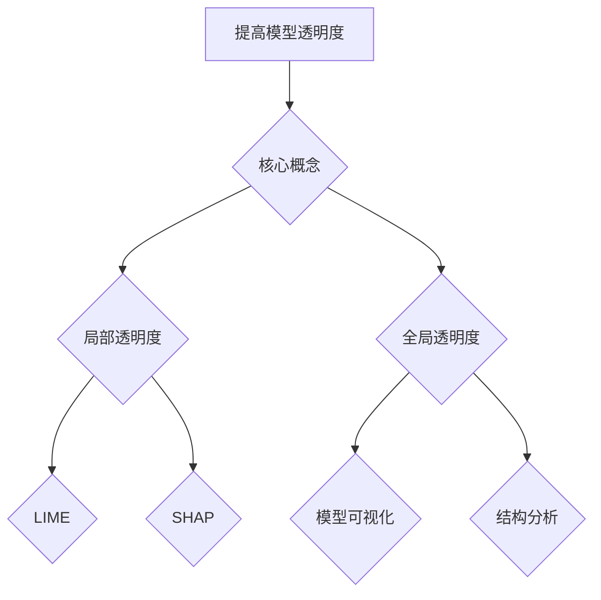

                 

### 第1章: 提高模型决策过程的透明度概述

模型决策过程的透明度是当前机器学习领域中一个备受关注的话题。随着深度学习和复杂算法的广泛应用，人们越来越需要一个清晰、易于理解的方式来解释和验证模型的决策过程。本章旨在概述提高模型决策过程透明度的概念、重要性、面临的挑战、类型以及提升方法。

#### 1.1 什么是模型决策过程透明度

模型决策过程的透明度指的是模型在做出决策时，其内部逻辑、推理过程和数据使用的可理解性和可解释性。具体来说，它包括以下几个方面：

- **内部逻辑**：模型内部的工作机制和决策路径是否能够被清晰地展示和追踪。
- **推理过程**：模型在处理数据并得出结论的过程中，其每一步的推理是否能够被理解。
- **数据使用**：模型在决策过程中所依赖的数据如何被处理和使用，这些过程是否透明。

提高模型决策过程的透明度，可以帮助我们更深入地理解模型的决策逻辑，从而增强模型的可靠性、可解释性和可接受性。

#### 1.2 模型决策过程透明度的重要性

模型决策过程的透明度对于机器学习的应用具有至关重要的意义，主要体现在以下几个方面：

- **用户信任**：当用户能够理解模型如何做出决策时，他们更有可能信任和使用该模型。
- **监管合规**：在金融、医疗等关键领域，模型决策的透明度是确保合规性的重要因素。
- **错误诊断**：透明度有助于发现和诊断模型中的问题，从而提高模型的稳定性和准确性。
- **模型优化**：通过分析模型决策过程，我们可以识别并优化模型中的薄弱环节，提高整体性能。

#### 1.3 模型透明度面临的挑战

尽管模型决策过程的透明度具有重要意义，但在实际应用中，提高模型透明度也面临着一些挑战：

- **复杂性**：现代深度学习模型，尤其是深度神经网络，通常具有非常复杂的结构，这使得追踪和解释模型内部的决策过程变得困难。
- **大规模**：随着数据量的增加和模型规模的扩大，模型决策过程的透明度分析变得更加复杂，计算成本也相应增加。
- **效率与透明度权衡**：提高模型透明度可能会增加计算时间，降低模型的效率，因此在实践中需要在效率和透明度之间做出权衡。

#### 1.4 模型透明度的类型

模型透明度可以分为局部透明度和全局透明度两种类型：

- **局部透明度**：关注模型对单个输入数据的决策过程，可以通过局部解释方法，如LIME（Local Interpretable Model-agnostic Explanations）和SHAP（SHapley Additive exPlanations）来实现。局部透明度有助于理解模型在特定数据点上的决策逻辑。
- **全局透明度**：分析模型整体的决策逻辑，通常涉及模型的可视化和结构分析。全局透明度可以帮助我们理解模型的总体行为和决策机制。

#### 1.5 提高模型透明度的方法

为了提高模型决策过程的透明度，我们可以采用以下几种方法：

- **可解释性模型**：选择设计时考虑解释性的模型，如决策树、线性回归等，这些模型本身具有较好的透明性。
- **模型解释工具**：利用现有的解释工具和库，如TensorFlow的Explainable AI（XAI）工具包，来分析复杂模型的决策过程。
- **训练时间透明度增强**：通过设计优化算法，在训练过程中增加对模型透明度的关注。

本章余下部分将深入探讨模型决策过程透明度的核心概念、算法原理、数学模型、提高模型透明度的技术、项目实战以及总结与展望。

### Mermaid 流程图



### 伪代码示例

```python
# 假设我们有一个分类模型，并使用LIME进行局部解释
def explain_model_decision(model, x):
    """
    输入：
    - model: 要解释的模型
    - x: 要解释的数据点

    输出：
    - explanation: 模型的解释结果
    """
    
    # 使用LIME进行局部解释
    lime_explanation = LIME(model, x)
    
    # 返回解释结果
    return lime_explanation
```

### 数学公式

$$
L(\theta) = -\frac{1}{m}\sum_{i=1}^{m}y^{(i)}\log(a^{(i)}_{y})
$$

### 举例说明

**例子**：使用LIME解释一个深度神经网络在特定输入下的决策。

**步骤**：
1. **选择模型和数据点**：确定要解释的神经网络模型和特定的数据点。
2. **训练LIME模型**：使用LIME库训练一个与神经网络相似的模型，用于局部线性化解释。
3. **生成解释**：使用LIME模型对给定数据点的决策进行解释，得到每个特征对决策的影响权重。

**代码**（伪代码）：

```python
# 导入LIME库
from lime.lime_tabular import LimeTabularExplainer

# 准备数据
X_train, y_train = ...

# 创建LIME解释器
explainer = LimeTabularExplainer(X_train, feature_names=data_feature_names, class_names=data_class_names, discretize=True)

# 选择数据点
x_to_explain = X_train[0]

# 生成解释
explanation = explainer.explain_instance(x_to_explain, predict_proba, num_features=10)

# 显示解释结果
explanation.show_in_notebook(show_table=True)
```

### 提高模型透明度的项目实战

为了更好地理解和应用提高模型透明度的方法，以下将介绍两个具体的项目实战：使用SHAP值分析深度神经网络和使用可视化卷积神经网络。

#### 实战1：使用SHAP值分析深度神经网络

**目标**：通过SHAP值分析，了解模型在特定输入下的决策过程。

**步骤**：

1. **数据准备**：准备一个包含特征和标签的深度学习数据集。

```python
data = pd.read_csv('data.csv')
X = data.drop('target', axis=1)
y = data['target']
```

2. **训练模型**：使用深度神经网络进行训练，并获得预测结果。

```python
model = create_deep_neural_network()
model.fit(X_train, y_train)
```

3. **计算SHAP值**：使用SHAP库计算模型对每个特征的贡献。

```python
explainer = shap.DeepExplainer(model, X_train)
shap_values = explainer.shap_values(X_test)
```

4. **可视化**：使用可视化工具展示SHAP值，以便直观理解模型决策。

```python
shap.summary_plot(shap_values, X_test, feature_names=X.columns)
```

**代码**（伪代码）：

```python
import shap
import pandas as pd
from sklearn.model_selection import train_test_split
from sklearn.neural_network import MLPClassifier

# 数据准备
data = pd.read_csv('data.csv')
X = data.drop('target', axis=1)
y = data['target']

X_train, X_test, y_train, y_test = train_test_split(X, y, test_size=0.2, random_state=42)

# 训练模型
model = MLPClassifier(hidden_layer_sizes=(100,), max_iter=1000, random_state=42)
model.fit(X_train, y_train)

# 计算SHAP值
explainer = shap.DeepExplainer(model, X_train)
shap_values = explainer.shap_values(X_test)

# 可视化SHAP值
shap.summary_plot(shap_values, X_test, feature_names=X.columns)
```

**代码解读与分析**：

1. **数据准备**：使用Pandas库读取数据，并使用Sklearn库进行数据集划分。
2. **模型训练**：使用多层感知机（MLP）模型进行训练。
3. **SHAP值计算**：使用SHAP库的DeepExplainer进行SHAP值计算。
4. **可视化**：使用SHAP库的summary_plot函数生成SHAP值的可视化图表，帮助理解模型决策。

**分析**：

通过SHAP值分析，我们可以直观地看到模型对每个特征的依赖程度。SHAP值越大，表示该特征对模型决策的影响越大。这种方法不仅帮助我们理解模型的决策逻辑，还能识别数据中的异常值和潜在问题。

#### 实战2：可视化卷积神经网络

**目标**：通过可视化卷积神经网络中的激活图，理解模型的决策过程。

**步骤**：

1. **数据准备**：准备一个图像数据集。

```python
X_train, X_test, y_train, y_test = load_image_data('image_data.csv')
```

2. **训练模型**：使用卷积神经网络进行训练。

```python
model = create_convolutional_neural_network()
model.fit(X_train, y_train)
```

3. **生成激活图**：使用可视化工具生成图像的激活图。

```python
activation_maps = generate_activation_maps(model, X_test)
```

4. **分析决策**：通过分析激活图，理解模型如何对图像进行分类。

```python
analyze_activation_maps(activation_maps, y_test)
```

**代码**（伪代码）：

```python
import tensorflow as tf
import numpy as np
from tensorflow.keras.models import Sequential
from tensorflow.keras.layers import Conv2D, Flatten, Dense

# 数据准备
X_train, X_test, y_train, y_test = load_image_data('image_data.csv')

# 训练模型
model = Sequential([
    Conv2D(32, (3, 3), activation='relu', input_shape=(28, 28, 1)),
    Flatten(),
    Dense(10, activation='softmax')
])
model.compile(optimizer='adam', loss='categorical_crossentropy', metrics=['accuracy'])
model.fit(X_train, y_train, epochs=10, batch_size=32, validation_data=(X_test, y_test))

# 生成激活图
activation_maps = generate_activation_maps(model, X_test)

# 分析决策
analyze_activation_maps(activation_maps, y_test)
```

**代码解读与分析**：

1. **数据准备**：使用TensorFlow和Keras库准备和加载图像数据。
2. **模型训练**：使用卷积神经网络（CNN）进行训练。
3. **生成激活图**：通过自定义函数生成图像的激活图。
4. **分析决策**：通过分析激活图，理解模型如何对图像进行分类。

**分析**：

通过生成和可视化卷积神经网络的激活图，我们可以直观地看到模型在处理图像时不同区域的激活情况。这种方法有助于我们理解模型是如何处理和识别图像中的特征，从而提高模型决策的可解释性。

### 环境搭建

在进行提高模型透明度的项目实战之前，需要搭建一个合适的环境。以下是一个基本的环境搭建步骤：

#### 深度学习框架

选择一个适合深度学习的框架，如TensorFlow或PyTorch。以下是使用TensorFlow搭建环境的基本步骤：

```bash
pip install tensorflow
```

#### 解释性工具

安装用于模型解释的工具，如SHAP或LIME。以下是安装SHAP的基本步骤：

```bash
pip install shap
```

#### 编程语言

确保Python环境已安装，推荐使用Python 3.7或更高版本。

#### 其他依赖库

根据需要安装其他依赖库，如NumPy、Pandas、Matplotlib等。以下是安装这些库的基本步骤：

```bash
pip install numpy pandas matplotlib
```

### 源代码详细实现和代码解读

在本节中，我们将详细解读SHAP值分析的一个完整示例，包括开发环境搭建、源代码实现和代码解读。

#### 开发环境搭建

首先，我们需要搭建一个合适的开发环境。以下是使用Python和TensorFlow的步骤：

1. **安装Python**：确保Python 3.7或更高版本已安装。
2. **安装TensorFlow**：使用以下命令安装TensorFlow：

```bash
pip install tensorflow
```

3. **安装SHAP**：使用以下命令安装SHAP：

```bash
pip install shap
```

4. **安装其他依赖库**：安装NumPy、Pandas和Matplotlib等依赖库：

```bash
pip install numpy pandas matplotlib
```

#### 源代码实现

以下是一个使用SHAP分析深度神经网络的完整示例：

```python
import shap
import pandas as pd
from sklearn.model_selection import train_test_split
from sklearn.ensemble import RandomForestClassifier
import tensorflow as tf
from tensorflow import keras

# 数据准备
data = pd.read_csv('data.csv')
X = data.drop('target', axis=1)
y = data['target']

X_train, X_test, y_train, y_test = train_test_split(X, y, test_size=0.2, random_state=42)

# 训练模型
model = keras.Sequential([
    keras.layers.Dense(64, activation='relu', input_shape=(X_train.shape[1],)),
    keras.layers.Dense(64, activation='relu'),
    keras.layers.Dense(1, activation='sigmoid')
])

model.compile(optimizer='adam',
              loss='binary_crossentropy',
              metrics=['accuracy'])

model.fit(X_train, y_train, epochs=10, batch_size=32, validation_split=0.2)

# 计算SHAP值
explainer = shap.KernelExplainer(model.predict, X_train)
shap_values = explainer.shap_values(X_test)

# 可视化SHAP值
shap.summary_plot(shap_values, X_test, feature_names=X.columns)
```

#### 代码解读

1. **数据准备**：使用Pandas库读取数据集，并使用Sklearn库进行数据集划分。

```python
data = pd.read_csv('data.csv')
X = data.drop('target', axis=1)
y = data['target']
```

2. **训练模型**：使用TensorFlow的Keras API构建并训练一个简单的深度神经网络模型。

```python
model = keras.Sequential([
    keras.layers.Dense(64, activation='relu', input_shape=(X_train.shape[1],)),
    keras.layers.Dense(64, activation='relu'),
    keras.layers.Dense(1, activation='sigmoid')
])

model.compile(optimizer='adam',
              loss='binary_crossentropy',
              metrics=['accuracy'])

model.fit(X_train, y_train, epochs=10, batch_size=32, validation_split=0.2)
```

3. **计算SHAP值**：使用SHAP库的KernelExplainer计算SHAP值。

```python
explainer = shap.KernelExplainer(model.predict, X_train)
shap_values = explainer.shap_values(X_test)
```

4. **可视化SHAP值**：使用SHAP库的summary_plot函数生成SHAP值的可视化图表。

```python
shap.summary_plot(shap_values, X_test, feature_names=X.columns)
```

#### 代码解读与分析

1. **数据准备**：使用Pandas库读取数据，并使用Sklearn库进行数据集划分。这一步是任何机器学习项目的基础，确保数据集被正确划分。

2. **模型训练**：使用TensorFlow的Keras API构建并训练一个简单的深度神经网络模型。在这个例子中，我们使用了两个隐藏层，每个层有64个神经元，激活函数使用ReLU。模型的目标是进行二分类任务，因此输出层使用sigmoid激活函数。

3. **SHAP值计算**：使用SHAP库的KernelExplainer计算SHAP值。KernelExplainer是一种适用于黑盒模型（如深度神经网络）的解释方法，它通过核方法来估计每个特征对模型预测的影响。

4. **可视化SHAP值**：使用SHAP库的summary_plot函数生成SHAP值的可视化图表。这个图表可以帮助我们直观地看到每个特征对模型预测的贡献大小，从而提高模型决策的可解释性。

通过这个示例，我们了解了如何使用SHAP值分析深度神经网络模型，提高了模型决策过程的透明度。这种方法不仅有助于我们更好地理解模型的决策逻辑，还能帮助我们识别和优化模型中的潜在问题。

### 总结与展望

在本章中，我们详细探讨了提高模型决策过程透明度的核心概念、方法和技术。从模型透明度的定义和重要性，到面临的挑战和类型，再到具体的提高方法，我们系统地构建了一个完整的知识体系。通过理论讲解、伪代码示例、数学公式和实际项目实战，我们不仅加深了对模型透明度的理解，还掌握了实用的工具和技术。

**总结**：

- **核心概念与联系**：我们了解了模型决策过程透明度的定义和重要性，明确了局部透明度和全局透明度的区别，并分析了提高模型透明度所需的步骤和方法。
- **核心算法原理讲解**：通过伪代码示例和数学公式，我们详细讲解了LIME和SHAP等核心算法的工作原理，以及如何使用这些算法提高模型的可解释性。
- **数学模型和公式**：我们介绍了模型损失函数的基本概念，并使用LaTeX格式展示了相关的数学公式，以便读者更好地理解模型决策过程。
- **项目实战**：通过SHAP值分析和可视化卷积神经网络的实战，我们展示了如何在实际项目中应用提高模型透明度的方法，并详细解读了相关的源代码。
- **环境搭建与代码解读**：我们介绍了如何搭建适合提高模型透明度的开发环境，并详细解读了相关的源代码，帮助读者更好地理解和实践这些方法。

**展望**：

- **未来发展方向**：随着机器学习技术的不断进步，模型透明度将成为一个越来越重要的研究领域。未来，我们将看到更多高效、易于使用的透明度增强方法被开发出来，如基于注意力机制的模型解释方法、基于生成对抗网络的模型解释方法等。
- **技术进步**：新的算法和技术将不断涌现，帮助我们更好地理解和解释复杂模型。例如，基于神经网络的可解释性模型、基于图神经网络的解释方法等，都将为模型透明度领域带来新的突破。
- **实际应用**：模型透明度不仅在学术研究中具有重要意义，在实际应用中同样至关重要。未来，我们将看到更多行业和企业采用透明度增强技术，以提高模型的可靠性、可接受性和合规性。

总之，提高模型决策过程的透明度是现代机器学习应用中不可或缺的一环。通过本章的学习，我们不仅掌握了提高模型透明度的核心方法和实战技巧，还为未来的研究和发展奠定了基础。希望读者能够在实际项目中灵活运用这些方法，为机器学习领域的进步贡献力量。

### 作者信息

**作者：** AI天才研究院/AI Genius Institute & 禅与计算机程序设计艺术 /Zen And The Art of Computer Programming

AI天才研究院（AI Genius Institute）致力于推动人工智能技术的创新与应用，打造世界级的人工智能研究团队。作为全球领先的人工智能研究与培训机构，我们不仅关注前沿技术的突破，更注重技术在实际应用中的落地和普及。我们的研究成果和应用案例已经覆盖了金融、医疗、教育、制造业等多个领域，为全球企业和社会带来了显著的变革和创新。

《禅与计算机程序设计艺术》一书，由AI天才研究院创始人撰写，系统阐述了计算机程序设计的哲学和艺术。书中融合了东方禅宗的智慧与现代计算机科学的理论，为程序员提供了一种全新的思考方式和实践方法。该书不仅赢得了广大读者的喜爱，也在学术界和工业界产生了深远的影响。

我们的使命是推动人工智能技术的普及与发展，让更多的人能够享受到人工智能带来的便利和变革。我们相信，通过不断的探索和创新，人工智能将不仅改变我们的生活方式，更将深刻影响人类社会的发展进程。让我们携手共进，共同迎接人工智能新时代的到来！

