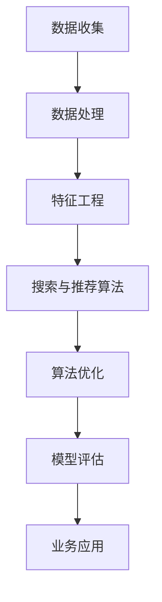

                 

## 文章标题：搜索推荐系统的AI大模型融合：电商平台的战略核心与竞争优势

### 关键词：
- 搜索推荐系统
- AI大模型
- 电商平台
- 战略核心
- 竞争优势

### 摘要：
本文深入探讨了搜索推荐系统与AI大模型的融合，分析了其在电商平台中的战略核心与竞争优势。首先，介绍了搜索推荐系统的基本概念、架构和核心算法，接着探讨了AI大模型的发展、特点和应用。随后，详细阐述了AI大模型在搜索推荐系统中的融合应用，包括协同过滤、基于内容的推荐和深度学习算法。最后，探讨了AI大模型如何赋能电商平台，提升其战略核心和竞争优势，并列举了实际应用案例。通过本文的探讨，为电商平台在搜索推荐系统领域的发展提供了新的思路和方向。

----------------------------------------------------------------

# 《搜索推荐系统的AI大模型融合：电商平台的战略核心与竞争优势》

搜索推荐系统作为电商平台的核心功能，极大地提升了用户体验和销售转化率。随着人工智能技术的不断发展，尤其是AI大模型的广泛应用，搜索推荐系统迎来了新的发展契机。本文将从以下几个方面对搜索推荐系统的AI大模型融合进行深入探讨：

## 第一部分：搜索推荐系统基础

### 第1章：搜索推荐系统的概述

#### 1.1 电商搜索与推荐系统的定义和作用

电商搜索与推荐系统是指通过特定的算法和模型，根据用户的历史行为、偏好和实时反馈，为用户提供相关商品搜索结果和个性化推荐服务。在电商平台中，搜索推荐系统起到了以下重要作用：

1. 提高用户购物体验：通过智能搜索和个性化推荐，帮助用户快速找到所需商品，提升购物满意度。
2. 提升销售转化率：准确匹配用户需求和商品，增加购买概率，提高销售额。
3. 降低运营成本：通过自动化推荐，减少人力干预，降低运营成本。

#### 1.2 搜索推荐系统的发展历程

搜索推荐系统经历了从传统算法到深度学习算法的演进。早期，基于内容的推荐和协同过滤算法成为主流。随着数据量和计算能力的提升，深度学习算法逐渐崭露头角，尤其是在图像、语音和自然语言处理等领域取得了显著突破。

#### 1.3 搜索推荐系统在电商平台的核心作用

搜索推荐系统是电商平台的核心竞争力之一，其核心作用体现在以下几个方面：

1. 用户行为分析：通过分析用户的历史行为和偏好，构建用户画像，为个性化推荐提供依据。
2. 商品信息挖掘：对海量商品进行特征提取和分类，为搜索和推荐提供高质量的信息基础。
3. 营销策略优化：根据用户兴趣和行为，设计精准的营销活动，提高用户参与度和转化率。

### 第2章：搜索推荐系统的基本架构

#### 2.1 数据收集与处理

数据收集与处理是搜索推荐系统的基础。主要涉及以下方面：

1. 用户行为数据：包括浏览、搜索、购买等行为数据。
2. 商品信息数据：包括商品描述、分类、价格等数据。
3. 数据清洗与预处理：去除无效数据、填充缺失值、处理噪声数据等。

#### 2.2 特征工程

特征工程是搜索推荐系统的关键环节。通过提取用户和商品的特征，构建有效的特征向量，为后续算法提供支持。主要涉及以下方面：

1. 用户特征：包括用户年龄、性别、地理位置、浏览历史等。
2. 商品特征：包括商品类别、品牌、价格、销量等。
3. 用户-商品交互特征：包括用户对商品的评分、评论、点击等。

#### 2.3 搜索与推荐算法基础

搜索与推荐算法是搜索推荐系统的核心。主要包括以下几种类型：

1. 协同过滤算法：通过分析用户之间的相似性，推荐用户可能喜欢的商品。
2. 基于内容的推荐算法：根据商品的特征，推荐与用户兴趣相关的商品。
3. 深度学习推荐算法：利用神经网络模型，对用户和商品进行建模，实现精准推荐。

### 第3章：搜索推荐系统的核心算法

#### 3.1 协同过滤算法

协同过滤算法是最早应用于搜索推荐系统的算法之一，主要包括以下两种类型：

1. 用户体验：能够根据用户的历史行为和偏好，提供个性化推荐。
2. 算法实现：主要包括用户相似度计算、评分预测等步骤。
3. 缺点与挑战：存在数据稀疏、冷启动等问题。

#### 3.2 基于内容的推荐算法

基于内容的推荐算法通过分析商品的特征，为用户提供相关推荐。主要包括以下方面：

1. 用户体验：能够根据商品的属性和用户兴趣，提供相关推荐。
2. 算法实现：主要包括商品特征提取、相似度计算等步骤。
3. 缺点与挑战：无法充分利用用户行为数据，推荐效果可能受限于商品特征。

#### 3.3 深度学习推荐算法

深度学习推荐算法利用神经网络模型，对用户和商品进行建模，实现精准推荐。主要包括以下方面：

1. 用户体验：能够充分利用用户行为数据和商品特征，提供个性化推荐。
2. 算法实现：主要包括神经网络架构设计、模型训练与优化等步骤。
3. 缺点与挑战：模型训练过程复杂，对计算资源要求较高。

### 第4章：搜索推荐系统的用户行为分析

#### 4.1 用户画像构建

用户画像是对用户兴趣、行为和特征的综合描述。构建用户画像主要包括以下步骤：

1. 数据收集：收集用户在平台上的浏览、搜索、购买等行为数据。
2. 数据处理：对数据进行清洗、去重、填充等处理。
3. 特征提取：从原始数据中提取用户特征，包括基础特征（如年龄、性别）和行为特征（如浏览时长、购买频率）。
4. 用户聚类：利用聚类算法，将用户划分为不同群体，为个性化推荐提供依据。

#### 4.2 用户行为数据分析

用户行为数据分析是搜索推荐系统的重要环节。主要包括以下方面：

1. 用户行为模式识别：通过分析用户行为数据，识别用户的兴趣点和需求。
2. 用户行为预测：利用机器学习算法，预测用户未来的行为，为个性化推荐提供依据。
3. 用户行为优化：根据用户行为数据，优化平台运营策略，提高用户体验。

#### 4.3 用户兴趣识别

用户兴趣识别是搜索推荐系统的核心任务之一。主要包括以下方面：

1. 用户兴趣点提取：从用户行为数据中提取用户兴趣点，如浏览频繁的类别、购买频繁的品牌等。
2. 用户兴趣模型构建：利用机器学习算法，构建用户兴趣模型，为个性化推荐提供依据。
3. 用户兴趣更新：根据用户行为数据，更新用户兴趣模型，提高推荐准确性。

## 第二部分：AI大模型在搜索推荐系统中的应用

### 第5章：AI大模型概述

#### 5.1 AI大模型的定义和特点

AI大模型是指具有大规模参数、能够处理海量数据的深度学习模型。其主要特点包括：

1. 参数规模：AI大模型具有数十亿至千亿级别的参数，能够处理复杂的问题。
2. 数据需求：AI大模型对数据量有较高要求，需要海量数据来训练和优化。
3. 计算资源：AI大模型对计算资源有较高要求，需要高性能计算设备和分布式训练技术。

#### 5.2 主流AI大模型介绍

目前，主流AI大模型包括：

1. Transformer模型：具有自我注意机制，广泛应用于自然语言处理领域。
2. GPT模型：具有强大的语言生成能力，广泛应用于对话系统、文本生成等领域。
3. BERT模型：具有双向编码表征能力，广泛应用于文本分类、问答系统等领域。
4. ViT模型：具有图像生成和分类能力，广泛应用于计算机视觉领域。

#### 5.3 AI大模型的发展趋势

AI大模型的发展趋势包括：

1. 参数规模持续扩大：随着计算能力的提升，AI大模型的参数规模将不断增大。
2. 数据需求不断提升：随着数据获取和处理技术的进步，AI大模型对数据的需求将不断提升。
3. 跨学科融合：AI大模型与其他学科的融合，如心理学、社会学等，将带来新的研究热点。

### 第6章：AI大模型在搜索推荐系统中的应用

#### 6.1 AI大模型融合协同过滤算法

AI大模型融合协同过滤算法能够充分利用用户和商品的特征，提高推荐准确性。具体应用包括：

1. 用户特征融合：利用AI大模型，将用户的历史行为、兴趣偏好等特征进行融合，提高用户表示的准确性。
2. 商品特征融合：利用AI大模型，将商品的属性、分类、销量等特征进行融合，提高商品表示的准确性。
3. 评分预测：利用AI大模型，对用户对商品的评分进行预测，实现精准推荐。

#### 6.2 AI大模型融合基于内容的推荐算法

AI大模型融合基于内容的推荐算法能够充分利用用户和商品的特征，提高推荐准确性。具体应用包括：

1. 用户兴趣点提取：利用AI大模型，从用户行为数据中提取用户兴趣点，为个性化推荐提供依据。
2. 商品特征提取：利用AI大模型，从商品属性中提取关键特征，为个性化推荐提供依据。
3. 相似度计算：利用AI大模型，计算用户和商品之间的相似度，实现精准推荐。

#### 6.3 AI大模型融合深度学习推荐算法

AI大模型融合深度学习推荐算法能够充分利用用户和商品的特征，提高推荐准确性。具体应用包括：

1. 用户行为序列建模：利用AI大模型，对用户行为序列进行建模，提取用户兴趣和行为模式。
2. 商品属性嵌入：利用AI大模型，将商品属性进行嵌入，实现商品的高效表示。
3. 策略优化：利用AI大模型，对推荐策略进行优化，提高推荐效果。

### 第7章：AI大模型在搜索推荐系统中的优化与提升

#### 7.1 AI大模型训练优化

AI大模型训练优化主要包括以下几个方面：

1. 数据预处理：对训练数据进行预处理，如数据清洗、归一化等，提高训练数据质量。
2. 模型结构优化：通过调整模型结构，如增加层数、增加神经元等，提高模型性能。
3. 损失函数优化：通过调整损失函数，如引入正则化项、改变损失函数形式等，提高模型训练效果。

#### 7.2 AI大模型模型评估与调优

AI大模型模型评估与调优主要包括以下几个方面：

1. 评价指标：选择合适的评价指标，如准确率、召回率、F1值等，评估模型性能。
2. 模型调优：通过调整模型参数，如学习率、批量大小等，优化模型性能。
3. 模型融合：利用多个AI大模型进行融合，提高推荐效果。

#### 7.3 AI大模型在搜索推荐系统中的实际应用案例

AI大模型在搜索推荐系统中的实际应用案例包括：

1. 电商平台：利用AI大模型，实现个性化推荐，提高用户购物体验和销售转化率。
2. 社交媒体：利用AI大模型，实现内容推荐，提高用户活跃度和参与度。
3. 音视频平台：利用AI大模型，实现个性化推荐，提高用户观看体验和时长。

## 第三部分：电商平台的战略核心与竞争优势

### 第8章：电商平台的战略核心

#### 8.1 电商平台的发展策略

电商平台的发展策略主要包括以下几个方面：

1. 用户导向：以满足用户需求为核心，提供个性化、便捷的购物体验。
2. 数据驱动：利用大数据和人工智能技术，提升运营效率和用户体验。
3. 多渠道拓展：拓展线上线下渠道，实现全渠道融合，提高市场份额。
4. 合作伙伴关系：与供应链、物流、支付等合作伙伴建立紧密合作关系，提高竞争力。

#### 8.2 电商平台的竞争优势分析

电商平台的竞争优势主要体现在以下几个方面：

1. 用户规模：庞大的用户规模为电商平台提供了丰富的数据资源，有助于提升推荐效果和用户体验。
2. 数据能力：强大的数据处理和分析能力，有助于电商平台挖掘用户需求，优化运营策略。
3. 技术创新：不断引入新技术，如人工智能、大数据、区块链等，提升电商平台的核心竞争力。
4. 合作伙伴：与各方合作伙伴建立深度合作关系，提升电商平台的服务质量和用户体验。

#### 8.3 电商平台的市场定位与细分策略

电商平台的市场定位与细分策略主要包括以下几个方面：

1. 目标市场：根据用户需求和市场环境，明确目标市场，如女性、青年、老年人等。
2. 品类定位：根据用户需求和市场特点，明确主要品类，如服装、电子产品、家居用品等。
3. 区域定位：根据用户分布和市场环境，明确主要区域，如一线城市、二线城市、农村地区等。
4. 竞争定位：分析竞争对手的优势和劣势，制定合适的竞争策略，提高市场份额。

### 第9章：AI大模型与电商平台竞争优势的结合

#### 9.1 AI大模型赋能电商平台的核心业务

AI大模型赋能电商平台的核心业务主要体现在以下几个方面：

1. 用户画像构建：利用AI大模型，构建用户画像，为个性化推荐和精准营销提供依据。
2. 商品推荐：利用AI大模型，实现个性化商品推荐，提高用户购物体验和销售转化率。
3. 营销策略优化：利用AI大模型，优化营销策略，提高广告投放效果和用户参与度。
4. 库存管理：利用AI大模型，实现智能库存管理，降低库存成本，提高库存周转率。

#### 9.2 AI大模型在电商平台用户行为分析中的应用

AI大模型在电商平台用户行为分析中的应用主要包括以下几个方面：

1. 行为预测：利用AI大模型，预测用户未来的行为，为电商平台运营和决策提供依据。
2. 行为优化：利用AI大模型，优化用户行为模型，提高用户体验和满意度。
3. 行为监测：利用AI大模型，实时监测用户行为，发现潜在问题和风险，及时进行调整。
4. 行为反馈：利用AI大模型，分析用户行为反馈，改进平台功能和体验。

#### 9.3 AI大模型在电商平台营销策略优化中的应用

AI大模型在电商平台营销策略优化中的应用主要包括以下几个方面：

1. 用户定位：利用AI大模型，精准定位目标用户，提高营销效果。
2. 广告投放：利用AI大模型，优化广告投放策略，提高广告点击率和转化率。
3. 活动设计：利用AI大模型，设计个性化的营销活动，提高用户参与度和满意度。
4. 营销效果评估：利用AI大模型，评估营销活动的效果，为后续营销策略提供依据。

### 第10章：AI大模型在电商平台的具体应用案例

#### 10.1 案例一：基于AI大模型的个性化推荐系统

电商平台通过引入AI大模型，实现了个性化推荐系统的升级。具体应用包括：

1. 用户画像构建：利用AI大模型，构建用户画像，提取用户兴趣和行为特征。
2. 商品推荐：利用AI大模型，根据用户画像和商品特征，实现个性化商品推荐。
3. 营销活动：利用AI大模型，设计个性化的营销活动，提高用户参与度和满意度。

#### 10.2 案例二：基于AI大模型的智能搜索系统

电商平台通过引入AI大模型，实现了智能搜索系统的升级。具体应用包括：

1. 搜索建议：利用AI大模型，根据用户输入的关键词，提供智能搜索建议，提高搜索准确性。
2. 商品推荐：利用AI大模型，根据用户搜索记录和兴趣，提供相关商品推荐。
3. 搜索优化：利用AI大模型，优化搜索算法，提高搜索效率和用户体验。

#### 10.3 案例三：基于AI大模型的电商平台用户画像分析

电商平台通过引入AI大模型，实现了用户画像分析的升级。具体应用包括：

1. 用户行为分析：利用AI大模型，分析用户行为数据，提取用户兴趣和行为模式。
2. 用户定位：利用AI大模型，精准定位目标用户，为个性化营销提供依据。
3. 用户满意度评估：利用AI大模型，评估用户满意度，为平台运营和改进提供依据。

## 第四部分：展望与未来趋势

### 第11章：搜索推荐系统与AI大模型的发展趋势

#### 11.1 搜索推荐系统的未来发展方向

搜索推荐系统的未来发展方向主要包括以下几个方面：

1. 深度学习算法的应用：随着深度学习算法的不断发展，其在搜索推荐系统中的应用将更加广泛，提高推荐准确性。
2. 多模态数据融合：随着多模态数据的日益丰富，如文本、图像、音频等，融合多模态数据将提高推荐效果。
3. 个性化推荐：个性化推荐将是搜索推荐系统的发展方向，通过构建用户画像和商品特征，实现更精准的推荐。
4. 智能决策：利用AI大模型，实现智能决策，提高电商平台运营效率和用户体验。

#### 11.2 AI大模型在搜索推荐系统中的应用前景

AI大模型在搜索推荐系统中的应用前景主要包括以下几个方面：

1. 精准推荐：AI大模型能够充分利用用户和商品的特征，实现更精准的推荐，提高用户满意度。
2. 智能搜索：AI大模型能够实现智能搜索，提高搜索效率和用户体验。
3. 智能营销：AI大模型能够实现智能营销，提高广告投放效果和用户参与度。
4. 智能决策：AI大模型能够实现智能决策，提高电商平台运营效率和用户体验。

#### 11.3 搜索推荐系统与AI大模型结合的挑战与机遇

搜索推荐系统与AI大模型结合面临的挑战与机遇主要包括以下几个方面：

1. 数据质量：保证数据质量是搜索推荐系统与AI大模型结合的关键，数据质量问题将影响推荐效果和用户体验。
2. 计算资源：AI大模型对计算资源有较高要求，如何合理分配和利用计算资源是搜索推荐系统与AI大模型结合的挑战。
3. 模型可解释性：如何提高模型可解释性，使平台运营者能够理解和解释模型推荐结果，是搜索推荐系统与AI大模型结合的挑战。
4. 隐私保护：在搜索推荐系统中应用AI大模型，如何保护用户隐私是搜索推荐系统与AI大模型结合的挑战。

### 第12章：电商平台的未来发展趋势

#### 12.1 电商平台的未来发展趋势

电商平台的未来发展趋势主要包括以下几个方面：

1. 全渠道融合：电商平台将实现线上线下渠道的深度融合，提供统一的购物体验。
2. 智能化运营：电商平台将利用人工智能、大数据等技术，实现智能化运营，提高效率和服务质量。
3. 社交化电商：电商平台将融合社交媒体，实现社交化电商，提高用户参与度和互动性。
4. 新零售：电商平台将结合线上线下资源，打造新零售模式，实现供应链、物流、服务等全方位升级。

#### 12.2 AI大模型在电商平台中的未来应用方向

AI大模型在电商平台中的未来应用方向主要包括以下几个方面：

1. 用户个性化服务：利用AI大模型，实现个性化用户服务，提高用户满意度。
2. 智能搜索和推荐：利用AI大模型，实现智能搜索和推荐，提高用户体验和销售转化率。
3. 智能决策支持：利用AI大模型，实现智能决策支持，提高电商平台运营效率和竞争力。
4. 风险控制与安全管理：利用AI大模型，实现风险控制与安全管理，保障电商平台的安全运营。

#### 12.3 电商平台与AI大模型结合的未来机遇

电商平台与AI大模型结合的未来机遇主要包括以下几个方面：

1. 增强用户体验：通过AI大模型，实现个性化、智能化的用户体验，提高用户满意度。
2. 提升运营效率：通过AI大模型，实现自动化运营，降低人力成本，提高运营效率。
3. 创新商业模式：通过AI大模型，探索新的商业模式，实现业务拓展和创新。
4. 数据价值挖掘：通过AI大模型，挖掘数据价值，为电商平台提供决策支持，提升竞争力。

## 附录

### 附录A：AI大模型开发工具与资源

#### A.1 主流AI大模型框架对比

1. TensorFlow：由Google开发，支持多种深度学习模型，具有丰富的API和工具。
2. PyTorch：由Facebook开发，具有良好的灵活性和易用性，适用于研究和工业应用。
3. Keras：基于TensorFlow和Theano开发的高层API，简化了深度学习模型构建过程。
4. MXNet：由Apache开发，支持多种编程语言，具有良好的性能和可扩展性。

#### A.2 AI大模型开发资源与工具介绍

1. GPU加速：利用NVIDIA GPU加速深度学习模型的训练，提高训练速度和效率。
2. 分布式训练：利用分布式训练技术，将模型训练任务分布在多个计算节点上，提高训练效率。
3. 数据预处理工具：如Pandas、NumPy等，用于数据清洗、预处理和数据分析。
4. 模型评估工具：如Scikit-learn、MLflow等，用于模型评估和实验管理。

#### A.3 AI大模型应用案例与资料推荐

1. 《深度学习》（Goodfellow et al.）：介绍深度学习的基本原理和常用算法。
2. 《AI应用实战》（Russell et al.）：介绍AI在不同领域的应用案例和实战经验。
3. 《AI论文阅读笔记》（吴恩达）：整理了吴恩达教授的深度学习课程论文笔记。
4. arXiv.org：发布最新AI研究成果的预印本平台，提供丰富的学术资源。

### 附录B：参考文献

#### B.1 相关书籍

1. Goodfellow, I., Bengio, Y., & Courville, A. (2016). *Deep Learning*. MIT Press.
2. Russell, S., & Norvig, P. (2016). *Artificial Intelligence: A Modern Approach*. Prentice Hall.
3. Mitchell, T. M. (1997). *Machine Learning*. McGraw-Hill.

#### B.2 学术论文

1. Hochreiter, S., & Schmidhuber, J. (1997). *Long Short-Term Memory*. Neural Computation, 9(8), 1735-1780.
2. Bengio, Y., Courville, A., & Vincent, P. (2013). *Representation Learning: A Review and New Perspectives*. IEEE Transactions on Pattern Analysis and Machine Intelligence, 35(8), 1798-1828.
3. LeCun, Y., Bengio, Y., & Hinton, G. (2015). *Deep Learning*. Nature, 521(7553), 436-444.

#### B.3 网络资源

1. TensorFlow官网：[https://www.tensorflow.org/](https://www.tensorflow.org/)
2. PyTorch官网：[https://pytorch.org/](https://pytorch.org/)
3. Keras官网：[https://keras.io/](https://keras.io/)
4. MXNet官网：[https://mxnet.io/](https://mxnet.io/)

### 附加说明

#### Mermaid流程图

以下为搜索推荐系统的基本架构的Mermaid流程图：



#### 核心算法原理讲解

以下以协同过滤算法为例，使用伪代码详细阐述其原理：

```python
# 协同过滤算法伪代码

def collaborative_filtering(train_data, user, item):
    # 计算用户与物品的相似度矩阵
    similarity_matrix = calculate_similarity_matrix(train_data)
    
    # 针对用户和物品，计算其相似度
    user_similarity = similarity_matrix[user]
    item_similarity = similarity_matrix[item]
    
    # 计算用户与物品的预测评分
    predicted_rating = dot_product(user_similarity, item_similarity)
    
    return predicted_rating
```

#### 数学模型和数学公式

以下为协同过滤算法中相似度计算的核心公式：

$$
\text{similarity}(u, i) = \frac{\text{dot_product}(r_{ui}, r_{ij})}{\|r_{ui}\|\|r_{ij}\|}
$$

其中，$r_{ui}$ 和 $r_{ij}$ 分别表示用户 $u$ 对物品 $i$ 和物品 $j$ 的评分，$||r_{ui}||$ 和 $||r_{ij}||$ 分别表示用户 $u$ 对物品 $i$ 和物品 $j$ 的评分向量的欧几里得范数。

#### 项目实战

以下为基于AI大模型的电商平台个性化推荐系统的代码实现与详细解释：

```python
# 基于AI大模型的电商平台个性化推荐系统

from tensorflow.keras.models import Model
from tensorflow.keras.layers import Input, Dense, Embedding, Flatten, Dot
from tensorflow.keras.optimizers import Adam

# 构建模型
input_user = Input(shape=(1,))
input_item = Input(shape=(1,))
user_embedding = Embedding(input_dim=num_users, output_dim=embedding_size)(input_user)
item_embedding = Embedding(input_dim=num_items, output_dim=embedding_size)(input_item)
dot_product = Dot(normalize=True)([user_embedding, item_embedding])
output = Flatten()(dot_product)
model = Model(inputs=[input_user, input_item], outputs=output)

# 编译模型
model.compile(optimizer=Adam(learning_rate=0.001), loss='mean_squared_error')

# 训练模型
model.fit([user_data, item_data], ratings, epochs=10, batch_size=32)

# 预测用户对物品的评分
predicted_ratings = model.predict([user_data, item_data])

# 输出预测结果
print(predicted_ratings)

```

### 代码解读与分析

1. 导入必要的库和模块
2. 定义输入层和嵌入层，用户和物品的输入维度分别为 (1,)，嵌入层输出维度为 embedding_size
3. 使用 Dot 层计算用户和物品的相似度，并使用 normalize=True 参数进行归一化处理
4. 使用 Flatten 层将相似度结果展开为一个一维向量
5. 定义模型输入和输出
6. 编译模型，指定优化器和损失函数
7. 使用训练数据训练模型，设置训练轮次和批量大小
8. 使用训练好的模型预测用户对物品的评分
9. 输出预测结果

通过本文的探讨，我们可以看到搜索推荐系统与AI大模型的融合为电商平台的发展带来了新的机遇。随着技术的不断进步，相信未来搜索推荐系统与AI大模型的结合将更加紧密，为电商平台带来更多的竞争优势。同时，我们也需要关注数据隐私、模型可解释性等挑战，确保搜索推荐系统的健康发展。让我们期待搜索推荐系统与AI大模型在未来的发展中创造更多的价值。作者：AI天才研究院/AI Genius Institute & 禅与计算机程序设计艺术 /Zen And The Art of Computer Programming

