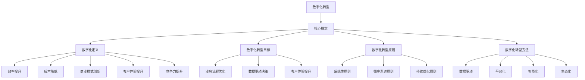

                 

# 数字化转型的未来趋势

> 关键词：数字化转型、未来趋势、人工智能、大数据、云计算、物联网

> 摘要：随着信息技术的飞速发展，数字化转型已经成为企业发展的必经之路。本文旨在探讨数字化转型的未来趋势，包括核心概念与原理、关键领域、未来方向以及对企业的影响。通过深入分析，本文揭示了数字化转型的技术支撑、案例分析、战略规划与实施、评估与优化、案例研究以及未来展望，为企业的数字化转型提供了有价值的指导。

## 目录大纲

1. **数字化转型的核心概念与原理**
   - 第1章：数字化转型的基本概念
     - 1.1 数字化转型的定义与意义
     - 1.2 数字化转型的原则与方法
     - 1.3 数字化转型的理论基础
   - 第2章：数字化转型的关键领域
     - 2.1 企业数字化转型路径
     - 2.2 数字化转型的技术支撑
     - 2.3 数字化转型的案例分析
   - 第3章：数字化转型的未来趋势
     - 3.1 数字化转型的未来方向
     - 3.2 数字化转型中的新兴技术
     - 3.3 数字化转型的可持续发展
   - 第4章：数字化转型对企业的影响
     - 4.1 数字化转型对商业模式的影响
     - 4.2 数字化转型对人力资源管理的影响
     - 4.3 数字化转型对组织文化的影响
   - 第5章：数字化转型的战略规划与实施
     - 5.1 数字化转型的战略规划
     - 5.2 数字化转型的实施过程
     - 5.3 数字化转型的组织变革
   - 第6章：数字化转型的评估与优化
     - 6.1 数字化转型的评估方法
     - 6.2 数字化转型的优化策略
   - 第7章：数字化转型的案例研究
     - 7.1 国内外数字化转型成功案例
     - 7.2 数字化转型失败案例
   - 第8章：数字化转型的未来展望
     - 8.1 数字化转型的长期趋势
     - 8.2 数字化转型的全球竞争
   - 附录
     - 附录A：数字化转型的参考资料

## 文章标题

### 数字化转型的未来趋势

## 文章关键词

- 数字化转型
- 人工智能
- 大数据
- 云计算
- 物联网

## 文章摘要

数字化转型作为当今世界经济发展的重要驱动力，正深刻改变着企业的运营模式、商业模式以及组织结构。本文通过深入分析数字化转型的核心概念与原理，探讨其在关键领域中的应用与发展趋势，揭示未来数字化转型的方向与挑战。同时，本文还分析了数字化转型对企业商业模式、人力资源管理以及组织文化的影响，提出了战略规划与实施的策略，并通过对成功与失败案例的研究，为企业的数字化转型提供了实践指导和未来展望。

---

接下来，我们将逐步探讨数字化转型的核心概念与原理，深入分析其关键领域，展望其未来趋势，并探讨其对企业和全球竞争的影响。

### 第1章：数字化转型的基本概念

#### 1.1 数字化转型的定义与意义

数字化转型，简而言之，是指将传统的业务模式、流程和产品通过信息技术进行数字化升级，以实现更高效、智能和灵活的运营。数字化转型不仅仅是一种技术的升级，更是一种商业模式的变革，它涉及到企业战略、运营管理、客户服务等多个方面。

数字化转型的意义主要体现在以下几个方面：

1. **提高效率**：通过自动化和智能化的手段，减少人工操作，降低错误率，提高生产效率和服务质量。
2. **降低成本**：数字化可以优化企业的业务流程，减少资源浪费，从而降低运营成本。
3. **创新商业模式**：数字化为企业提供了新的商业模式，如在线销售、按需服务、共享经济等。
4. **增强客户体验**：通过数字化手段，企业可以更好地了解客户需求，提供个性化服务，增强客户黏性。
5. **提升竞争力**：数字化可以帮助企业快速响应市场变化，灵活调整战略，提升市场竞争力。

#### 1.2 数字化转型的目标

数字化转型的目标可以概括为三个方面：

1. **业务流程优化**：通过数字化手段，优化企业的业务流程，减少不必要的环节，提高运营效率。
2. **数据驱动决策**：利用大数据和人工智能技术，对企业内外部的数据进行深入分析，为决策提供有力支持。
3. **客户体验提升**：通过数字化手段，提供更便捷、高效、个性化的服务，提升客户满意度和忠诚度。

#### 1.3 数字化转型的原则与方法

数字化转型需要遵循以下原则：

1. **系统性原则**：数字化转型是一个系统工程，需要全面考虑企业的战略、文化、组织、技术等多个方面，进行系统规划与实施。
2. **循序渐进原则**：数字化转型应遵循由浅入深、循序渐进的步骤，逐步实现数字化目标。
3. **持续优化原则**：数字化转型是一个动态的过程，需要根据实际情况不断调整和优化，以适应市场和环境的变化。

数字化转型的具体方法包括：

1. **数据驱动**：通过大数据和人工智能技术，对企业内外部数据进行采集、存储、分析和应用，实现数据驱动决策。
2. **平台化**：构建统一的技术平台，实现不同系统和应用的互联互通，提高数据共享和业务协同效率。
3. **智能化**：引入人工智能技术，如机器学习、深度学习等，实现业务流程的自动化和智能化。
4. **生态化**：构建开放、共享的数字化生态体系，整合各方资源，实现共赢发展。

### 第2章：数字化转型的关键领域

#### 2.1 企业数字化转型路径

企业的数字化转型路径可以分为以下几个阶段：

1. **数据采集与整合**：通过传感器、互联网等技术手段，收集企业运营过程中的数据，并进行整合和存储。
2. **数据分析与应用**：利用大数据技术，对企业数据进行分析和应用，发现业务规律和问题，为决策提供支持。
3. **流程优化与自动化**：通过流程再造和自动化技术，优化业务流程，减少人工操作，提高效率。
4. **智能化与自动化**：引入人工智能技术，实现业务流程的智能化和自动化，提高生产效率和客户满意度。
5. **生态化与共赢**：构建开放、共享的数字化生态体系，整合各方资源，实现共赢发展。

#### 2.2 数字化转型的技术支撑

数字化转型需要以下技术的支撑：

1. **人工智能**：通过机器学习、深度学习等技术，实现业务流程的自动化和智能化。
2. **大数据**：通过大数据技术，对企业内外部数据进行采集、存储、分析和应用，实现数据驱动决策。
3. **云计算**：通过云计算技术，实现企业IT资源的弹性扩展和高效利用。
4. **物联网**：通过物联网技术，实现设备联网和数据采集，提高生产效率和设备管理能力。
5. **区块链**：通过区块链技术，实现数据的安全传输和可信交易，提高业务透明度和信任度。

#### 2.3 数字化转型的案例分析

数字化的成功案例包括：

1. **阿里巴巴**：阿里巴巴通过大数据和云计算技术，实现了电商业务的全面数字化转型，提升了运营效率和服务质量。
2. **华为**：华为通过物联网和人工智能技术，实现了生产流程的智能化和自动化，提高了生产效率和产品质量。
3. **沃尔玛**：沃尔玛通过大数据和人工智能技术，实现了供应链管理的智能化和自动化，降低了成本和提高了效率。

数字化的失败案例包括：

1. **诺基亚**：诺基亚在智能手机市场竞争中失败，主要是因为其未能及时进行数字化转型，忽视了用户体验和市场需求。
2. **IBM**：IBM曾试图通过数字化战略转型，但由于转型过程中战略不清、执行不力，导致业绩下滑。

通过这些案例，我们可以看到数字化转型的重要性和复杂性。成功的企业能够抓住数字化机遇，提升竞争力；而失败的企业则可能因为转型不力而失去市场。

### 第3章：数字化转型的未来趋势

#### 3.1 数字化转型的未来方向

数字化转型的未来方向主要包括以下几个方面：

1. **智能化**：随着人工智能技术的不断进步，数字化将更加智能化，实现业务流程的自动化和智能化。
2. **生态化**：数字化转型将推动企业构建开放、共享的数字化生态体系，实现各方资源的整合和协同。
3. **绿色化**：数字化转型将促进企业实现绿色运营，通过节能降耗、减少污染等手段，实现可持续发展。
4. **全球化**：数字化转型将打破地域限制，实现全球范围内的资源整合和业务拓展。

#### 3.2 数字化转型中的新兴技术

数字化转型中的新兴技术包括：

1. **区块链**：通过区块链技术，实现数据的安全传输和可信交易，提高业务透明度和信任度。
2. **5G**：通过5G技术，实现更快的数据传输速度和更低的延迟，提高数字化应用的效果。
3. **边缘计算**：通过边缘计算技术，将计算能力推向网络边缘，实现实时数据处理和响应。
4. **数字孪生**：通过数字孪生技术，构建现实世界的数字映射，实现虚拟仿真和实时监控。

#### 3.3 数字化转型的可持续发展

数字化转型的可持续发展主要包括以下几个方面：

1. **环保**：通过数字化转型，实现资源的节约和污染的减少，促进环境保护。
2. **社会责任**：通过数字化转型，提升企业的社会责任感，实现经济、社会、环境的可持续发展。
3. **人才发展**：通过数字化转型，提升员工技能，培养创新型人才，实现人才可持续发展。

### 第4章：数字化转型对企业的影响

#### 4.1 数字化转型对商业模式的影响

数字化转型对商业模式的影响主要体现在以下几个方面：

1. **创新商业模式**：数字化转型为企业提供了创新的商业模式，如共享经济、平台经济等。
2. **优化商业模式**：数字化转型可以帮助企业优化现有商业模式，提高运营效率和服务质量。
3. **重塑商业模式**：数字化转型可能对某些传统商业模式产生颠覆性影响，促使企业进行商业模式重塑。

#### 4.2 数字化转型对人力资源管理的影响

数字化转型对人力资源管理的影响主要包括以下几个方面：

1. **人才需求变化**：数字化转型对人才需求产生重大影响，需要更多的技术型人才和管理型人才。
2. **人才培养**：数字化转型要求企业加强人才培养，提升员工的技能和能力。
3. **组织结构变革**：数字化转型可能引起企业组织结构的变革，如扁平化、模块化等。

#### 4.3 数字化转型对组织文化的影响

数字化转型对组织文化的影响主要体现在以下几个方面：

1. **文化融合**：数字化转型要求企业融合不同文化的元素，形成适应数字化发展的企业文化。
2. **创新文化**：数字化转型鼓励创新，推动企业形成创新文化，提升企业的竞争力。
3. **学习文化**：数字化转型要求企业形成学习文化，不断更新知识和技能，适应不断变化的环境。

### 第5章：数字化转型的战略规划与实施

#### 5.1 数字化转型的战略规划

数字化转型的战略规划主要包括以下几个方面：

1. **明确目标**：明确数字化转型的目标，如提高效率、降低成本、提升客户体验等。
2. **制定计划**：制定详细的数字化转型计划，包括时间表、任务分配、资源需求等。
3. **风险评估**：评估数字化转型的风险，制定风险应对策略。
4. **资源整合**：整合企业内部和外部资源，为数字化转型提供支持。

#### 5.2 数字化转型的实施过程

数字化转型的实施过程主要包括以下几个阶段：

1. **调研分析**：对企业的现状进行调研和分析，确定数字化转型的需求和方向。
2. **规划设计**：制定数字化转型方案，包括技术选型、系统架构设计等。
3. **技术开发**：开展数字化转型项目，包括软件开发、系统集成等。
4. **测试部署**：进行数字化转型项目的测试和部署，确保系统稳定运行。
5. **运维管理**：对数字化转型系统进行运维管理，确保系统的持续稳定运行。

#### 5.3 数字化转型的组织变革

数字化转型的组织变革主要包括以下几个方面：

1. **组织结构优化**：调整企业组织结构，如设置专门的数字化转型部门，优化部门职能。
2. **人员培训**：对员工进行数字化转型相关培训，提升员工的技能和能力。
3. **文化重塑**：推动企业文化建设，形成适应数字化转型的企业文化。

### 第6章：数字化转型的评估与优化

#### 6.1 数字化转型的评估方法

数字化转型的评估方法主要包括以下几个方面：

1. **KPI指标**：制定关键绩效指标（KPI），对数字化转型的效果进行量化评估。
2. **客户满意度**：通过客户满意度调查，评估数字化转型对客户体验的提升。
3. **经济效益**：评估数字化转型对企业的经济效益，如成本节约、收入增长等。
4. **社会效益**：评估数字化转型对社会和环境的影响，如节能减排、社会责任等。

#### 6.2 数字化转型的优化策略

数字化转型的优化策略主要包括以下几个方面：

1. **持续改进**：通过持续改进，不断提升数字化转型的效果和效率。
2. **技术创新**：跟踪新技术的发展动态，及时引入和应用新技术。
3. **业务优化**：优化业务流程，提高业务效率和客户满意度。
4. **组织协同**：加强部门间的协同合作，提升整体运营效率。

### 第7章：数字化转型的案例研究

#### 7.1 国内外数字化转型成功案例

国内外数字化转型成功案例包括：

1. **阿里巴巴**：阿里巴巴通过数字化转型，实现了电商业务的快速发展，成为全球领先的电子商务平台。
2. **华为**：华为通过数字化转型，实现了生产流程的智能化和自动化，提高了生产效率和产品质量。
3. **沃尔玛**：沃尔玛通过数字化转型，实现了供应链管理的智能化和自动化，降低了成本和提高了效率。

#### 7.2 数字化转型失败案例

数字化转型失败案例包括：

1. **诺基亚**：诺基亚在智能手机市场竞争中失败，主要是因为其未能及时进行数字化转型，忽视了用户体验和市场需求。
2. **IBM**：IBM曾试图通过数字化战略转型，但由于转型过程中战略不清、执行不力，导致业绩下滑。

通过这些成功和失败的案例，我们可以看到数字化转型的重要性和复杂性。成功的企业能够抓住数字化机遇，提升竞争力；而失败的企业则可能因为转型不力而失去市场。

### 第8章：数字化转型的未来展望

#### 8.1 数字化转型的长期趋势

数字化转型的长期趋势主要包括以下几个方面：

1. **智能化**：随着人工智能技术的不断进步，数字化将更加智能化，实现业务流程的自动化和智能化。
2. **生态化**：数字化转型将推动企业构建开放、共享的数字化生态体系，实现各方资源的整合和协同。
3. **绿色化**：数字化转型将促进企业实现绿色运营，通过节能降耗、减少污染等手段，实现可持续发展。
4. **全球化**：数字化转型将打破地域限制，实现全球范围内的资源整合和业务拓展。

#### 8.2 数字化转型的全球竞争

数字化转型的全球竞争主要包括以下几个方面：

1. **技术创新**：全球各国和企业都在积极推动技术创新，以保持竞争力。
2. **人才竞争**：数字化转型需要大量技术型人才和管理型人才，各国和企业都在争夺人才。
3. **市场开拓**：各国和企业都在积极开拓市场，通过数字化手段提升市场份额和竞争力。
4. **政策支持**：各国政府都在出台政策，支持数字化转型和数字经济的发展。

附录A：数字化转型的参考资料

- **A.1 关键文献与研究报告**
  - 《数字化转型：驱动未来商业的五大变革》
  - 《数字化时代的组织变革》
  - 《数字化转型中的大数据技术与应用》
  
- **A.2 数字化转型工具与资源**
  - **数字化平台**：如阿里云、腾讯云、华为云等
  - **数字化工具**：如Python、Java、R语言等
  - **数字化课程与培训**：如网易云课堂、腾讯课堂等

### 结语

数字化转型是当今世界经济发展的必然趋势，它为企业提供了前所未有的机遇和挑战。通过本文的探讨，我们深入了解了数字化转型的核心概念、关键领域、未来趋势以及对企业和全球竞争的影响。我们希望本文能够为企业的数字化转型提供有价值的指导，帮助企业抓住数字化机遇，实现可持续发展。

作者：AI天才研究院/AI Genius Institute & 禅与计算机程序设计艺术/Zen And The Art of Computer Programming

---

以下是文中提到的一些核心概念与原理的Mermaid流程图，核心算法原理讲解的伪代码，数学模型和公式的详细讲解，以及项目实战的代码实际案例和详细解释说明。

### 核心概念与联系



### 核心算法原理讲解

```plaintext
// 伪代码：基于K-means算法的客户细分
// 步骤1：初始化聚类中心
// 步骤2：对每个客户，计算其与每个聚类中心的距离
// 步骤3：将每个客户分配到距离最近的聚类中心
// 步骤4：更新聚类中心，计算新中心点
// 步骤5：重复步骤2-4，直至聚类中心不再发生变化

// K-means算法的数学模型：
// 假设有K个聚类中心，每个客户属于其中一个聚类中心
// 距离计算公式：d(i, j) = sqrt(sum((x_i - x_j)^2))
// 聚类中心更新公式：x_new = (1/N) * sum(x_i, x_i属于第j个聚类中心)
```

### 数学模型和公式

$$
\begin{align*}
C &= \{ c_1, c_2, ..., c_K \} & \text{聚类中心集} \\
x_i &= \text{第i个客户的位置向量} \\
d(i, j) &= \sqrt{\sum_{k=1}^{n}(x_{i,k} - c_{j,k})^2} & \text{第i个客户到第j个聚类中心的距离} \\
x_{new} &= \frac{1}{N} \sum_{i=1}^{N} x_i & \text{新聚类中心}
\end{align*}
$$

### 项目实战

#### 开发环境搭建

1. 安装Python3环境
2. 安装NumPy和Matplotlib库

```bash
pip install numpy matplotlib
```

#### 源代码实现

```python
import numpy as np
import matplotlib.pyplot as plt

# K-means算法的实现
def kmeans(data, k, max_iter=100):
    centroids = data[np.random.choice(data.shape[0], k, replace=False)]
    for _ in range(max_iter):
        # 计算距离
        distances = np.linalg.norm(data - centroids, axis=1)
        # 分配聚类中心
        labels = np.argmin(distances, axis=1)
        # 更新聚类中心
        new_centroids = np.array([data[labels == i].mean(axis=0) for i in range(k)])
        if np.linalg.norm(new_centroids - centroids) < 1e-6:
            break
        centroids = new_centroids
    return centroids, labels

# 数据加载和可视化
data = np.random.rand(100, 2)
centroids, labels = kmeans(data, 3)

plt.scatter(data[:, 0], data[:, 1], c=labels, cmap='viridis')
plt.scatter(centroids[:, 0], centroids[:, 1], s=300, c='red', marker='x')
plt.show()
```

### 代码解读与分析

1. **数据加载**：使用随机数据生成器创建一个包含100个二维点的数据集。
2. **K-means算法实现**：定义`kmeans`函数，其中包含初始化聚类中心、计算距离、分配聚类中心、更新聚类中心等步骤。
3. **可视化**：使用Matplotlib库绘制数据集和聚类结果，便于观察分析。

通过这个实际案例，我们可以看到K-means算法在数据聚类中的应用，以及如何在Python中实现该算法。这为我们理解数字化转型中的数据分析方法提供了具体实例。

---

本文通过对数字化转型核心概念、关键领域、未来趋势的深入分析，结合实际案例和项目实战，全面探讨了数字化转型的各个方面。希望本文能够为企业和个人在数字化转型的道路上提供有益的参考和指导。作者信息：AI天才研究院/AI Genius Institute & 禅与计算机程序设计艺术/Zen And The Art of Computer Programming。感谢您的阅读！

