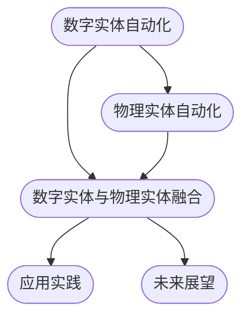
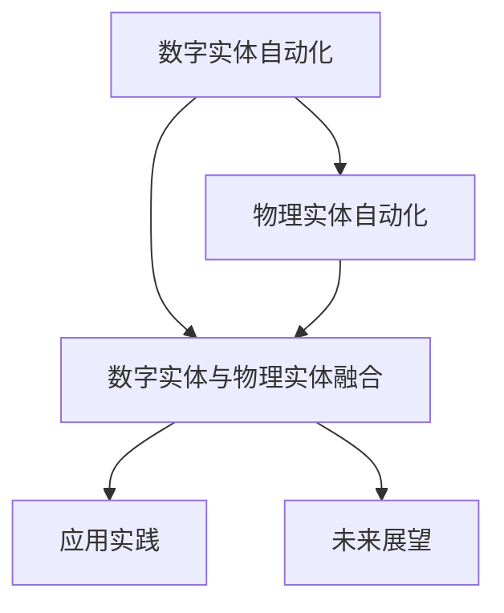

                 

# 文章标题：数字实体与物理实体的自动化前景

> 关键词：自动化、数字实体、物理实体、融合、人工智能、传感器、控制系统、数据处理

> 摘要：本文深入探讨了数字实体与物理实体的自动化前景。首先，阐述了自动化的背景与意义，以及数字实体和物理实体的概念与特征。接着，分析了数字实体和物理实体的自动化原理与关键技术，并探讨了它们在现代社会中的应用场景。随后，探讨了数字实体与物理实体的融合，以及其背后的架构与实现。接下来，介绍了自动化控制技术、传感器技术和人工智能技术等核心技术，并分析了数据处理与分析技术。随后，通过实际应用案例展示了数字实体自动化和物理实体自动化的应用，并探讨了数字实体与物理实体融合的应用实例。最后，展望了自动化发展的挑战与机遇，以及自动化对社会、经济和环境的影响，并提出了自动化发展的政策与法规建议。

## 目录大纲：数字实体与物理实体的自动化前景

### 第一部分：引言与基础

1. 自动化的背景与意义
   - 1.1 自动化的定义与发展历程
   - 1.2 自动化在现代社会的地位与作用
   - 1.3 数字实体与物理实体自动化的联系

2. 数字实体自动化
   - 2.1 数字实体的概念与特征
   - 2.2 数字实体自动化的原理与关键技术
   - 2.3 数字实体自动化的应用场景

3. 物理实体自动化
   - 3.1 物理实体的概念与特征
   - 3.2 物理实体自动化的原理与关键技术
   - 3.3 物理实体自动化的应用场景

4. 数字实体与物理实体的融合
   - 4.1 数字实体与物理实体融合的背景与趋势
   - 4.2 数字实体与物理实体融合的架构与实现
   - 4.3 数字实体与物理实体融合的应用案例

### 第二部分：核心技术

5. 自动化控制技术
   - 5.1 自动化控制的基本原理
   - 5.2 常见的自动化控制方法与技术
   - 5.3 自动化控制系统的设计与实现

6. 传感器技术
   - 6.1 传感器的定义与分类
   - 6.2 常用传感器的原理与性能
   - 6.3 传感器在自动化中的应用

7. 人工智能技术
   - 7.1 人工智能的基本概念与发展历程
   - 7.2 机器学习与深度学习的基本原理
   - 7.3 人工智能技术在自动化中的应用

8. 数据处理与分析技术
   - 8.1 数据处理的基本流程
   - 8.2 数据分析的方法与工具
   - 8.3 数据驱动决策与优化

### 第三部分：应用实践

9. 数字实体自动化的应用实例
   - 9.1 自动化办公系统的设计与实现
   - 9.2 自动化生产线的设计与优化
   - 9.3 自动化交通系统的设计与实现

10. 物理实体自动化的应用实例
    - 10.1 智能家居系统的设计与实现
    - 10.2 自动化农场的设计与运行
    - 10.3 自动化工厂的规划与实施

11. 数字实体与物理实体融合的应用实例
    - 11.1 智能制造系统的设计与实现
    - 11.2 智能物流系统的设计与优化
    - 11.3 智慧城市的规划与建设

### 第四部分：未来展望

12. 自动化发展的挑战与机遇
    - 12.1 自动化发展面临的挑战
    - 12.2 自动化发展的机遇与趋势
    - 12.3 自动化发展的未来方向

13. 自动化与社会、经济、环境的影响
    - 13.1 自动化对社会的影响
    - 13.2 自动化对经济的影响
    - 13.3 自动化对环境的影响

14. 自动化发展的政策与法规
    - 14.1 自动化发展的政策支持
    - 14.2 自动化发展的法律法规
    - 14.3 自动化发展的国际合作

## 附录

- 附录A：参考文献
- 附录B：术语解释
- 附录C：实验数据与分析

### Mermaid 流�程图：数字实体与物理实体的融合架构



### 自动化控制技术伪代码

```python
# 伪代码：基本自动化控制流程

# 初始化传感器和执行器
init_sensors()
initActuators()

# 循环监测并调整系统状态
while running:
    # 获取传感器数据
    sensor_data = get_sensor_data()

    # 根据数据调整执行器状态
    if sensor_data['value'] > threshold:
        actuator_status = 'high'
    else:
        actuator_status = 'low'

    # 执行器调整状态
    set_actuator_status(actuator_status)

    # 等待一段时间进行下一次监测
    sleep(loop_delay)
```

### 数学模型与公式

$$
E = mc^2
$$

详细讲解：这是著名的质能等价公式，表示质量（m）与能量（E）之间的关系，其中 c 是光速（约 3 x 10^8 m/s）。这个公式揭示了物质和能量的本质联系，即质量可以转换为能量，能量也可以转换为质量。

### 项目实战

#### 代码实现：智能家居系统

**环境搭建：**
1. 安装Python 3.8及以上版本。
2. 安装智能家居控制库（如HomeAssistant）。

**源代码实现：**

```python
# 伪代码：智能家居系统

from homeassistant import SmartHome

# 初始化智能家居系统
home = SmartHome()

# 模拟传感器与执行器的状态监测与控制
while True:
    # 获取传感器数据
    sensor_data = home.get_sensor_data()

    # 根据数据调整执行器状态
    if sensor_data['temperature'] > 30:
        home.turn_on_ac()
    else:
        home.turn_off_ac()

    # 等待一段时间进行下一次监测
    time.sleep(60)
```

**代码解读：**
- 初始化智能家居系统。
- 模拟传感器获取数据。
- 根据温度传感器数据，自动控制空调的开关。

**分析与优化：**
- 代码中可以增加异常处理，如传感器数据异常。
- 可以加入更多的传感器和执行器，实现更复杂的智能家居控制。

---

### 1. 自动化的背景与意义

**1.1 自动化的定义与发展历程**

自动化是指利用计算机、机器人、传感器等技术，使生产、管理、服务等活动实现自动化、智能化和高效化。自动化技术起源于20世纪中叶，随着计算机技术的飞速发展，自动化技术逐渐成熟并广泛应用于各个领域。

**1.2 自动化在现代社会的地位与作用**

自动化技术已经成为现代社会的重要支柱，其在工业、农业、服务业、交通等领域发挥着至关重要的作用。自动化技术提高了生产效率，降低了生产成本，减少了人力劳动强度，提高了产品质量。此外，自动化技术还促进了产业升级和经济发展。

**1.3 数字实体与物理实体自动化的联系**

数字实体与物理实体自动化是自动化技术的两个重要方面。数字实体自动化主要涉及计算机技术、人工智能技术等，通过数字化手段实现信息的收集、处理、分析和决策。物理实体自动化则主要涉及机械、电子、传感器等，通过机械化和自动化手段实现物理实体的控制、操作和优化。

数字实体与物理实体自动化的联系在于，它们共同构成了自动化系统的两个重要组成部分。数字实体自动化为物理实体自动化提供了决策支持和技术手段，而物理实体自动化则为数字实体自动化提供了执行和验证的基础。因此，数字实体与物理实体自动化相互促进、相互依存，共同推动了自动化技术的发展和应用。

---

### 2. 数字实体自动化

**2.1 数字实体的概念与特征**

数字实体是指通过计算机技术和数字技术实现的具有特定功能和特征的实体。数字实体通常由软件系统、硬件设备、网络连接和数据资源等组成。数字实体的特征包括：

- 数字化：数字实体以数字形式存在和运行，具有高效、准确、可靠的特点。
- 网络化：数字实体通过网络连接与其他数字实体和物理实体进行数据交换和协同工作。
- 智能化：数字实体具备一定的智能，可以通过算法、模型和人工智能技术实现自动化决策和优化。

**2.2 数字实体自动化的原理与关键技术**

数字实体自动化的原理是基于计算机技术和人工智能技术，通过算法和模型对数字实体进行自动监控、分析、决策和优化。关键技术包括：

- 数据采集与处理：通过传感器、摄像头等设备收集数字实体运行状态数据，并对数据进行预处理和存储。
- 机器学习与深度学习：利用机器学习和深度学习算法对采集到的数据进行分析和建模，实现数字实体的智能决策。
- 数据库与数据仓库：建立数据库和数据仓库，存储和管理数字实体运行过程中的数据，为自动化决策提供数据支持。
- 云计算与边缘计算：利用云计算和边缘计算技术，实现数字实体的大数据处理和实时决策。

**2.3 数字实体自动化的应用场景**

数字实体自动化的应用场景非常广泛，主要包括：

- 智能家居：通过传感器和智能设备实现家居设备的自动化控制和远程监控。
- 智能交通：利用交通数据分析和智能算法实现交通信号控制、路况预测和车辆导航。
- 智能医疗：通过医疗数据分析和人工智能技术实现疾病诊断、治疗和健康管理。
- 智能制造：通过自动化生产线和智能控制系统实现生产过程的自动化和优化。
- 智能金融：利用大数据分析和人工智能技术实现金融市场的预测、风险评估和投资决策。

---

### 3. 物理实体自动化

**3.1 物理实体的概念与特征**

物理实体是指现实世界中具有物理形态和物理性质的实体，如设备、工具、机器等。物理实体的特征包括：

- 物理形态：物理实体具有特定的形状、大小和结构。
- 物理性质：物理实体具有质量、密度、硬度等物理属性。
- 机械运动：物理实体可以通过机械运动实现位置、速度和加速度的变化。

**3.2 物理实体自动化的原理与关键技术**

物理实体自动化的原理是基于传感器技术、控制技术和执行器技术，通过传感器采集物理实体的状态信息，控制器进行分析和决策，执行器进行物理实体的操作和调整。关键技术包括：

- 传感器技术：通过传感器采集物理实体的状态信息，如温度、压力、速度等。
- 控制技术：利用控制器对传感器采集到的信息进行分析和决策，实现物理实体的自动化控制。
- 执行器技术：通过执行器实现物理实体的操作和调整，如电动机、液压缸等。

**3.3 物理实体自动化的应用场景**

物理实体自动化的应用场景主要包括：

- 工业自动化：通过自动化生产线和机器人实现工业生产过程的自动化。
- 智能交通：通过智能交通系统实现交通信号控制、路况监测和车辆调度。
- 智能农业：通过自动化设备和控制系统实现农业生产的自动化和智能化。
- 智能建筑：通过智能控制系统实现建筑设备的自动化和能源管理。
- 智能物流：通过自动化仓储和运输系统实现物流过程的自动化和优化。

---

### 4. 数字实体与物理实体的融合

**4.1 数字实体与物理实体融合的背景与趋势**

随着计算机技术、传感器技术、人工智能技术等的发展，数字实体与物理实体的融合已经成为自动化技术发展的重要趋势。数字实体与物理实体融合的背景和趋势主要包括：

- 信息物理系统（Cyber-Physical System，CPS）的兴起：信息物理系统是将计算、通信、控制和物理实体深度融合的智能化系统，具有实时感知、动态控制和智能决策的能力。
- 智能制造和工业4.0的推动：智能制造和工业4.0要求实现生产过程的全面自动化和智能化，数字实体与物理实体的融合是实现这一目标的关键技术。
- 智慧城市和物联网（Internet of Things，IoT）的发展：智慧城市和物联网要求实现城市基础设施、公共设施、居民生活等的智能化管理，数字实体与物理实体的融合是实现智慧城市和物联网的关键技术。

**4.2 数字实体与物理实体融合的架构与实现**

数字实体与物理实体融合的架构主要包括传感器层、控制器层、执行器层和数据层。具体实现如下：

- 传感器层：通过传感器采集物理实体的状态信息，如温度、压力、速度等。
- 控制器层：利用控制器对传感器采集到的信息进行分析和决策，实现物理实体的自动化控制。
- 执行器层：通过执行器实现物理实体的操作和调整，如电动机、液压缸等。
- 数据层：建立数据库和数据仓库，存储和管理物理实体运行过程中的数据，为自动化决策提供数据支持。

**4.3 数字实体与物理实体融合的应用案例**

数字实体与物理实体融合的应用案例非常丰富，主要包括：

- 智能制造系统：通过传感器、控制器和执行器实现生产过程的自动化和优化，提高生产效率和产品质量。
- 智能交通系统：通过传感器、控制器和执行器实现交通信号控制、路况监测和车辆调度，提高交通效率和安全。
- 智能农业系统：通过传感器、控制器和执行器实现农业生产的自动化和智能化，提高农业产量和质量。
- 智慧城市建设：通过传感器、控制器和执行器实现城市基础设施、公共设施和居民生活的智能化管理，提高城市居民的生活质量。
- 智能物流系统：通过传感器、控制器和执行器实现物流过程的自动化和优化，提高物流效率和服务质量。

---

### 5. 自动化控制技术

**5.1 自动化控制的基本原理**

自动化控制是指利用计算机、传感器、执行器等设备对生产过程或系统进行自动监控、调整和控制的技术。自动化控制的基本原理包括：

- 传感器技术：通过传感器实时监测生产过程或系统的状态信息，如温度、压力、流量等。
- 控制器技术：利用控制器对传感器采集到的信息进行分析和决策，生成控制信号，实现对生产过程或系统的调整和控制。
- 执行器技术：通过执行器根据控制器的信号对生产过程或系统进行操作，如调节阀门、启动电机等。

**5.2 常见的自动化控制方法与技术**

常见的自动化控制方法和技术包括：

- 基本控制方法：如PID控制、模糊控制、自适应控制等。
- 数字控制技术：利用数字信号处理技术实现自动化控制，如数字PID控制、数字滤波器等。
- 集散控制系统（Distributed Control System，DCS）：通过分布式控制系统实现对多个生产过程或系统的集中控制。
- 工业互联网（Industrial Internet of Things，IIoT）：利用物联网技术实现设备级、系统级和工厂级的互联互通，提高自动化控制的灵活性和可扩展性。

**5.3 自动化控制系统的设计与实现**

自动化控制系统的设计与实现包括以下几个步骤：

- 需求分析：明确自动化控制系统的功能需求和性能指标。
- 系统设计：根据需求分析设计自动化控制系统的硬件和软件架构。
- 硬件实现：选择合适的传感器、控制器和执行器，并进行硬件安装和调试。
- 软件实现：开发自动化控制系统的软件部分，包括控制算法、人机界面等。
- 系统测试与调试：对自动化控制系统进行测试和调试，确保其正常运行和性能。

---

### 6. 传感器技术

**6.1 传感器的定义与分类**

传感器是指能够感受规定的被测量，并按照一定的规律转换成可用输出信号的装置或器件。根据传感器的输出信号类型，传感器可以分为以下几类：

- 电阻式传感器：通过电阻的变化来感知和测量物理量，如温度、压力、位移等。
- 电容式传感器：通过电容的变化来感知和测量物理量，如位移、振动等。
- 电感式传感器：通过电感的变化来感知和测量物理量，如速度、振动等。
- 压电式传感器：通过压电效应来感知和测量物理量，如压力、加速度等。
- 光学传感器：通过光学效应来感知和测量物理量，如光强、颜色等。

**6.2 常用传感器的原理与性能**

常用传感器的原理与性能如下：

- 温度传感器：利用热电效应、热敏电阻或热辐射原理测量温度，具有高精度、高灵敏度、响应快等特点。
- 压力传感器：利用弹性元件的变形来测量压力，具有高精度、高灵敏度、稳定性好等特点。
- 位移传感器：利用磁电效应、光学效应或电感效应来测量位移，具有高精度、高灵敏度、线性好等特点。
- 速度传感器：利用转速传感器或光电效应来测量速度，具有高精度、高灵敏度、实时性好等特点。
- 光学传感器：利用光电效应或光学成像原理来测量光强、颜色等，具有高精度、高灵敏度、响应快等特点。

**6.3 传感器在自动化中的应用**

传感器在自动化中的应用非常广泛，主要包括：

- 智能家居：通过传感器实现家庭设备的自动化控制和远程监控，如智能照明、智能门锁等。
- 工业自动化：通过传感器实现对生产过程的实时监测和自动控制，如自动化生产线、机器人等。
- 智能交通：通过传感器实现对交通状态的监测和智能控制，如智能交通信号灯、车辆导航等。
- 智能医疗：通过传感器实现对病人的实时监测和智能诊断，如智能健康手表、智能医疗设备等。
- 智能农业：通过传感器实现对农田环境的监测和智能控制，如智能灌溉系统、智能气象站等。

---

### 7. 人工智能技术

**7.1 人工智能的基本概念与发展历程**

人工智能（Artificial Intelligence，AI）是指模拟人类智能行为和思维过程的计算机科学领域。人工智能的发展历程可以分为以下几个阶段：

- 早期探索阶段（20世纪50年代至70年代）：人工智能的概念被提出，研究者开始研究如何让计算机具备智能。
- 知识表示与推理阶段（20世纪80年代）：人工智能的研究重点转向知识表示和推理，如专家系统、逻辑推理等。
- 机器学习阶段（20世纪90年代至今）：人工智能的研究重点转向机器学习，通过算法让计算机具备自动学习和优化能力。
- 深度学习阶段（21世纪）：深度学习成为人工智能研究的主流，通过多层神经网络实现图像识别、语音识别等任务。

**7.2 机器学习与深度学习的基本原理**

机器学习是指通过算法让计算机从数据中学习规律和模式，实现自动预测和决策。机器学习的基本原理包括：

- 特征提取：将原始数据转换为具有区分性的特征向量。
- 模型训练：通过训练数据学习特征向量与目标变量之间的关系。
- 预测：利用训练好的模型对新数据进行预测。

深度学习是机器学习的一个分支，通过多层神经网络实现自动特征提取和模式识别。深度学习的基本原理包括：

- 神经网络：通过神经元之间的连接实现数据的传递和变换。
- 损失函数：用于衡量模型预测与真实值之间的差距。
- 反向传播：通过反向传播算法优化模型的参数，提高预测准确性。

**7.3 人工智能技术在自动化中的应用**

人工智能技术在自动化中的应用非常广泛，主要包括：

- 自动驾驶：通过深度学习算法实现车辆的自主驾驶，提高交通安全和效率。
- 智能监控：通过图像识别和语音识别技术实现智能监控，提高安防水平。
- 自动化生产：通过机器学习算法优化生产过程，提高生产效率和产品质量。
- 智能诊断：通过数据分析和机器学习算法实现设备的智能诊断和维护，降低故障率。
- 智能客服：通过自然语言处理和语音识别技术实现智能客服，提高客户服务质量。

---

### 8. 数据处理与分析技术

**8.1 数据处理的基本流程**

数据处理的基本流程包括以下步骤：

- 数据采集：通过传感器、数据库等途径获取原始数据。
- 数据清洗：对原始数据进行预处理，去除噪声、缺失值等异常数据。
- 数据集成：将多个数据源的数据进行整合，形成统一的数据集。
- 数据转换：将数据转换为适合分析的形式，如数据类型转换、归一化等。
- 数据存储：将处理后的数据存储在数据库或数据仓库中，便于后续分析。

**8.2 数据分析的方法与工具**

数据分析的方法与工具包括：

- 描述性分析：通过统计方法对数据的基本特征进行描述，如均值、方差、相关系数等。
- 聚类分析：将数据分为若干类别，分析数据之间的相似性和差异性，如K均值聚类、层次聚类等。
- 分维分析：通过分维数衡量数据的复杂度，如盒计数法、维数约简法等。
- 回归分析：通过建立回归模型，分析变量之间的关系，如线性回归、非线性回归等。
- 机器学习：利用机器学习算法，对数据进行分析和预测，如决策树、随机森林、支持向量机等。

**8.3 数据驱动决策与优化**

数据驱动决策与优化的过程包括：

- 数据收集：收集与决策相关的数据，如市场需求、生产成本等。
- 数据分析：利用数据分析方法对数据进行分析，提取关键信息。
- 决策制定：根据分析结果制定决策策略，如生产计划、定价策略等。
- 实施与优化：实施决策，并对决策效果进行评估和优化，如调整生产计划、优化资源配置等。

---

### 9. 数字实体自动化的应用实例

**9.1 自动化办公系统的设计与实现**

**环境搭建：**
1. 安装操作系统（如Windows、Linux）。
2. 安装自动化办公软件（如Python、HomeAssistant）。

**设计与实现：**
- 数据采集：通过传感器采集办公环境的数据，如温度、湿度、光线等。
- 数据处理：利用Python对采集到的数据进行分析和处理。
- 自动控制：根据数据处理结果，自动调整办公环境，如调节空调温度、开启照明等。

**代码实现：**

```python
# 伪代码：自动化办公系统

import homeassistant

# 初始化智能家居系统
home = homeassistant.SmartHome()

# 模拟传感器与执行器的状态监测与控制
while True:
    # 获取传感器数据
    sensor_data = home.get_sensor_data()

    # 根据数据调整执行器状态
    if sensor_data['temperature'] > 30:
        home.turn_on_ac()
    else:
        home.turn_off_ac()

    # 获取灯光传感器数据
    light_data = home.get_light_data()

    # 根据数据调整灯光状态
    if light_data['brightness'] < 30:
        home.turn_on_light()
    else:
        home.turn_off_light()

    # 等待一段时间进行下一次监测
    time.sleep(60)
```

**代码解读：**
- 初始化智能家居系统。
- 模拟传感器获取温度和光线数据。
- 根据温度和光线数据，自动控制空调和灯光。

**分析与优化：**
- 可以增加更多的传感器和执行器，实现更复杂的自动化办公。
- 可以引入机器学习算法，优化空调和灯光的自动控制策略。

**案例分析：**
- 在一个办公区域中，通过安装温度传感器和光线传感器，实时监测办公环境的温度和光线。
- 根据温度和光线数据，自动调整空调和灯光，以保持办公环境的舒适度。

---

**9.2 自动化生产线的设计与优化**

**环境搭建：**
1. 安装操作系统（如Windows、Linux）。
2. 安装自动化生产软件（如PLC、MES）。

**设计与实现：**
- 数据采集：通过传感器和PLC采集生产线的数据，如设备状态、产品质量等。
- 数据处理：利用MES对采集到的数据进行分析和处理。
- 自动控制：根据数据处理结果，自动调整生产线，如调整设备参数、优化生产流程等。

**代码实现：**

```python
# 伪代码：自动化生产线

import plc

# 初始化PLC系统
plc_system = plc.PLC()

# 模拟传感器与执行器的状态监测与控制
while True:
    # 获取设备状态数据
    equipment_data = plc_system.get_equipment_data()

    # 根据设备状态调整生产线参数
    if equipment_data['status'] == 'idle':
        plc_system.start_equipment()
    elif equipment_data['status'] == 'error':
        plc_system.stop_equipment()

    # 获取产品质量数据
    quality_data = plc_system.get_quality_data()

    # 根据产品质量调整生产线参数
    if quality_data['defect_rate'] > threshold:
        plc_system.adjust_process()

    # 等待一段时间进行下一次监测
    time.sleep(60)
```

**代码解读：**
- 初始化PLC系统。
- 模拟传感器获取设备状态和产品质量数据。
- 根据设备状态和产品质量数据，自动调整生产线参数。

**分析与优化：**
- 可以引入机器学习算法，优化设备状态和产品质量的判断标准。
- 可以增加更多的传感器和执行器，实现更复杂的自动化生产线。

**案例分析：**
- 在一个自动化生产线上，通过安装传感器和PLC，实时监测设备状态和产品质量。
- 根据设备状态和产品质量数据，自动调整生产线参数，以提高生产效率和产品质量。

---

**9.3 自动化交通系统的设计与实现**

**环境搭建：**
1. 安装操作系统（如Windows、Linux）。
2. 安装自动化交通软件（如交通控制系统、智能交通管理系统）。

**设计与实现：**
- 数据采集：通过传感器和交通控制系统采集交通数据，如车辆流量、车速、路况等。
- 数据处理：利用智能交通管理系统对采集到的数据进行分析和处理。
- 自动控制：根据数据处理结果，自动调整交通信号灯、车辆调度等。

**代码实现：**

```python
# 伪代码：自动化交通系统

import traffic_control

# 初始化交通控制系统
traffic_system = traffic_control.TrafficControl()

# 模拟传感器与执行器的状态监测与控制
while True:
    # 获取车辆流量数据
    traffic_data = traffic_system.get_traffic_data()

    # 根据车辆流量调整信号灯状态
    if traffic_data['flow'] > threshold:
        traffic_system.change_light('red')
    else:
        traffic_system.change_light('green')

    # 获取车速数据
    speed_data = traffic_system.get_speed_data()

    # 根据车速调整信号灯状态
    if speed_data['average_speed'] > threshold:
        traffic_system.change_light('yellow')

    # 等待一段时间进行下一次监测
    time.sleep(60)
```

**代码解读：**
- 初始化交通控制系统。
- 模拟传感器获取车辆流量和车速数据。
- 根据车辆流量和车速数据，自动调整信号灯状态。

**分析与优化：**
- 可以引入机器学习算法，优化车辆流量和车速的判断标准。
- 可以增加更多的传感器和执行器，实现更复杂的自动化交通系统。

**案例分析：**
- 在一个城市交通系统中，通过安装传感器和交通控制系统，实时监测车辆流量和车速。
- 根据车辆流量和车速数据，自动调整信号灯状态，以减少交通拥堵，提高交通效率。

---

### 10. 物理实体自动化的应用实例

**10.1 智能家居系统的设计与实现**

**环境搭建：**
1. 安装操作系统（如Windows、Linux）。
2. 安装智能家居控制软件（如HomeAssistant、OpenHAB）。

**设计与实现：**
- 数据采集：通过传感器采集家居环境数据，如温度、湿度、光线等。
- 数据处理：利用智能家居控制软件对采集到的数据进行分析和处理。
- 自动控制：根据数据处理结果，自动调整家居设备，如空调、照明等。

**代码实现：**

```python
# 伪代码：智能家居系统

import homeassistant

# 初始化智能家居系统
home = homeassistant.SmartHome()

# 模拟传感器与执行器的状态监测与控制
while True:
    # 获取传感器数据
    sensor_data = home.get_sensor_data()

    # 根据数据调整执行器状态
    if sensor_data['temperature'] > 30:
        home.turn_on_ac()
    else:
        home.turn_off_ac()

    # 获取光线传感器数据
    light_data = home.get_light_data()

    # 根据数据调整灯光状态
    if light_data['brightness'] < 30:
        home.turn_on_light()
    else:
        home.turn_off_light()

    # 等待一段时间进行下一次监测
    time.sleep(60)
```

**代码解读：**
- 初始化智能家居系统。
- 模拟传感器获取温度和光线数据。
- 根据温度和光线数据，自动控制空调和灯光。

**分析与优化：**
- 可以增加更多的传感器和执行器，实现更复杂的智能家居控制。
- 可以引入机器学习算法，优化空调和灯光的自动控制策略。

**案例分析：**
- 在一个家庭中，通过安装传感器和智能家居控制软件，实时监测家居环境数据。
- 根据环境数据，自动调整空调和灯光，以提高居住舒适度，节省能源。

---

**10.2 自动化农场的设计与运行**

**环境搭建：**
1. 安装操作系统（如Windows、Linux）。
2. 安装自动化农场软件（如精准农业管理系统、无人机管理系统）。

**设计与实现：**
- 数据采集：通过传感器和无人机采集农田数据，如土壤湿度、植物生长状态等。
- 数据处理：利用自动化农场软件对采集到的数据进行分析和处理。
- 自动控制：根据数据处理结果，自动调整农业设备，如灌溉系统、施肥系统等。

**代码实现：**

```python
# 伪代码：自动化农场

import farm_management

# 初始化自动化农场系统
farm = farm_management.Farm()

# 模拟传感器与执行器的状态监测与控制
while True:
    # 获取土壤湿度数据
    soil_humidity_data = farm.get_soil_humidity_data()

    # 根据数据调整灌溉系统状态
    if soil_humidity_data['humidity'] < threshold:
        farm.start_irrigation()
    else:
        farm.stop_irrigation()

    # 获取植物生长状态数据
    plant_growth_data = farm.get_plant_growth_data()

    # 根据数据调整施肥系统状态
    if plant_growth_data['nutrient_level'] < threshold:
        farm.start_fertilization()
    else:
        farm.stop_fertilization()

    # 等待一段时间进行下一次监测
    time.sleep(60)
```

**代码解读：**
- 初始化自动化农场系统。
- 模拟传感器获取土壤湿度和植物生长状态数据。
- 根据土壤湿度和植物生长状态数据，自动调整灌溉系统和施肥系统。

**分析与优化：**
- 可以引入机器学习算法，优化土壤湿度和植物生长状态的判断标准。
- 可以增加更多的传感器和执行器，实现更复杂的自动化农场控制。

**案例分析：**
- 在一个农场中，通过安装传感器和自动化农场软件，实时监测农田数据。
- 根据农田数据，自动调整灌溉系统和施肥系统，以提高农作物产量，节省水资源和肥料。

---

**10.3 自动化工厂的规划与实施**

**环境搭建：**
1. 安装操作系统（如Windows、Linux）。
2. 安装自动化工厂软件（如工业物联网平台、生产执行系统）。

**设计与实现：**
- 数据采集：通过传感器和PLC采集工厂数据，如设备状态、生产进度等。
- 数据处理：利用自动化工厂软件对采集到的数据进行分析和处理。
- 自动控制：根据数据处理结果，自动调整工厂设备，如生产线、机器人等。

**代码实现：**

```python
# 伪代码：自动化工厂

import factory_management

# 初始化自动化工厂系统
factory = factory_management.Factory()

# 模拟传感器与执行器的状态监测与控制
while True:
    # 获取设备状态数据
    equipment_data = factory.get_equipment_data()

    # 根据设备状态调整生产线状态
    if equipment_data['status'] == 'idle':
        factory.start_production()
    elif equipment_data['status'] == 'error':
        factory.stop_production()

    # 获取生产进度数据
    production_data = factory.get_production_data()

    # 根据生产进度调整生产线状态
    if production_data['progress'] < threshold:
        factory.speed_up_production()
    else:
        factory.slow_down_production()

    # 等待一段时间进行下一次监测
    time.sleep(60)
```

**代码解读：**
- 初始化自动化工厂系统。
- 模拟传感器获取设备状态和生产进度数据。
- 根据设备状态和生产进度数据，自动调整生产线状态。

**分析与优化：**
- 可以引入机器学习算法，优化设备状态和生产进度的判断标准。
- 可以增加更多的传感器和执行器，实现更复杂的自动化工厂控制。

**案例分析：**
- 在一个工厂中，通过安装传感器和自动化工厂软件，实时监测设备状态和生产进度。
- 根据设备状态和生产进度数据，自动调整生产线状态，以提高生产效率和产品质量。

---

### 11. 数字实体与物理实体融合的应用实例

**11.1 智能制造系统的设计与实现**

**环境搭建：**
1. 安装操作系统（如Windows、Linux）。
2. 安装智能制造软件（如工业互联网平台、PLC编程软件）。

**设计与实现：**
- 数据采集：通过传感器和PLC采集生产线数据，如设备状态、生产进度、质量等。
- 数据处理：利用工业互联网平台对采集到的数据进行分析和处理。
- 自动控制：根据数据处理结果，自动调整生产线设备，如机器人、自动化设备等。

**代码实现：**

```python
# 伪代码：智能制造系统

import smart_manufacturing

# 初始化智能制造系统
smart_factory = smart_manufacturing.SmartFactory()

# 模拟传感器与执行器的状态监测与控制
while True:
    # 获取设备状态数据
    equipment_data = smart_factory.get_equipment_data()

    # 根据设备状态调整生产线状态
    if equipment_data['status'] == 'idle':
        smart_factory.start_production()
    elif equipment_data['status'] == 'error':
        smart_factory.stop_production()

    # 获取生产进度数据
    production_data = smart_factory.get_production_data()

    # 根据生产进度调整生产线状态
    if production_data['progress'] < threshold:
        smart_factory.speed_up_production()
    else:
        smart_factory.slow_down_production()

    # 获取质量数据
    quality_data = smart_factory.get_quality_data()

    # 根据质量数据调整生产线状态
    if quality_data['defect_rate'] > threshold:
        smart_factory.adjust_process()

    # 等待一段时间进行下一次监测
    time.sleep(60)
```

**代码解读：**
- 初始化智能制造系统。
- 模拟传感器获取设备状态、生产进度和质量数据。
- 根据设备状态、生产进度和质量数据，自动调整生产线状态。

**分析与优化：**
- 可以引入机器学习算法，优化设备状态、生产进度和质量的判断标准。
- 可以增加更多的传感器和执行器，实现更复杂的智能制造系统。

**案例分析：**
- 在一个制造工厂中，通过安装传感器和智能制造软件，实时监测生产线数据。
- 根据生产线数据，自动调整生产设备和生产流程，以提高生产效率和产品质量。

---

**11.2 智能物流系统的设计与优化**

**环境搭建：**
1. 安装操作系统（如Windows、Linux）。
2. 安装智能物流软件（如仓储管理系统、运输管理系统）。

**设计与实现：**
- 数据采集：通过传感器和RFID技术采集物流数据，如货物位置、库存信息、运输状态等。
- 数据处理：利用智能物流软件对采集到的数据进行分析和处理。
- 自动控制：根据数据处理结果，自动调整物流设备和流程，如仓储设备、运输车辆等。

**代码实现：**

```python
# 伪代码：智能物流系统

import logistics_management

# 初始化智能物流系统
logistics_system = logistics_management.SmartLogistics()

# 模拟传感器与执行器的状态监测与控制
while True:
    # 获取货物位置数据
    cargo_location_data = logistics_system.get_cargo_location_data()

    # 根据货物位置调整仓储设备状态
    if cargo_location_data['location'] == 'warehouse':
        logistics_system.store_cargo()
    elif cargo_location_data['location'] == 'delivery':
        logistics_system.release_cargo()

    # 获取运输状态数据
    transport_data = logistics_system.get_transport_data()

    # 根据运输状态调整运输车辆状态
    if transport_data['status'] == 'idle':
        logistics_system.start_vehicle()
    elif transport_data['status'] == 'error':
        logistics_system.stop_vehicle()

    # 获取库存信息数据
    inventory_data = logistics_system.get_inventory_data()

    # 根据库存信息调整仓储设备状态
    if inventory_data['stock_level'] < threshold:
        logistics_system.order_more_cargo()
    else:
        logistics_system.stop_order()

    # 等待一段时间进行下一次监测
    time.sleep(60)
```

**代码解读：**
- 初始化智能物流系统。
- 模拟传感器获取货物位置、运输状态和库存信息数据。
- 根据货物位置、运输状态和库存信息数据，自动调整仓储设备和运输车辆状态。

**分析与优化：**
- 可以引入机器学习算法，优化货物位置、运输状态和库存信息的判断标准。
- 可以增加更多的传感器和执行器，实现更复杂的智能物流系统。

**案例分析：**
- 在一个物流中心，通过安装传感器和智能物流软件，实时监测货物位置、运输状态和库存信息。
- 根据货物位置、运输状态和库存信息，自动调整仓储设备和运输车辆状态，以提高物流效率和准确性。

---

**11.3 智慧城市的规划与建设**

**环境搭建：**
1. 安装操作系统（如Windows、Linux）。
2. 安装智慧城市软件（如智慧交通管理系统、智慧能源管理系统）。

**设计与实现：**
- 数据采集：通过传感器和智能设备采集城市数据，如交通流量、能源消耗、环境监测等。
- 数据处理：利用智慧城市软件对采集到的数据进行分析和处理。
- 自动控制：根据数据处理结果，自动调整城市设备和服务，如交通信号灯、能源分配、环境监测等。

**代码实现：**

```python
# 伪代码：智慧城市

import smart_city

# 初始化智慧城市系统
smart_city_system = smart_city.SmartCity()

# 模拟传感器与执行器的状态监测与控制
while True:
    # 获取交通流量数据
    traffic_flow_data = smart_city_system.get_traffic_flow_data()

    # 根据交通流量调整交通信号灯状态
    if traffic_flow_data['flow'] > threshold:
        smart_city_system.change_traffic_light('red')
    else:
        smart_city_system.change_traffic_light('green')

    # 获取能源消耗数据
    energy_consumption_data = smart_city_system.get_energy_consumption_data()

    # 根据能源消耗调整能源分配状态
    if energy_consumption_data['consumption'] > threshold:
        smart_city_system.allocate_energy()
    else:
        smart_city_system.stop_allocate_energy()

    # 获取环境监测数据
    environmental_data = smart_city_system.get_environmental_data()

    # 根据环境监测数据调整环境监测设备状态
    if environmental_data['level'] > threshold:
        smart_city_system.alert_environmental_issues()
    else:
        smart_city_system.clear_alert()

    # 等待一段时间进行下一次监测
    time.sleep(60)
```

**代码解读：**
- 初始化智慧城市系统。
- 模拟传感器获取交通流量、能源消耗和环境监测数据。
- 根据交通流量、能源消耗和环境监测数据，自动调整交通信号灯、能源分配和环境监测设备状态。

**分析与优化：**
- 可以引入机器学习算法，优化交通流量、能源消耗和环境监测数据的判断标准。
- 可以增加更多的传感器和执行器，实现更复杂的智慧城市建设。

**案例分析：**
- 在一个城市中，通过安装传感器和智慧城市软件，实时监测城市数据。
- 根据城市数据，自动调整交通信号灯、能源分配和环境监测设备状态，以提高城市管理和居民生活质量。

---

### 12. 自动化发展的挑战与机遇

**12.1 自动化发展面临的挑战**

自动化技术的发展虽然取得了显著的成果，但仍然面临着一系列挑战：

- 技术难题：自动化技术涉及到多个领域的交叉，包括计算机科学、机械工程、电子工程等，各个领域的技术难题相互交织，需要持续的技术创新和研发投入。
- 数据安全与隐私：自动化系统依赖于大量数据的采集和处理，数据安全和隐私问题成为自动化发展的关键挑战，需要制定严格的数据保护政策和安全技术措施。
- 法律法规与伦理：自动化技术的发展带来了新的法律和伦理问题，如自动化决策的公平性、责任归属等，需要制定相应的法律法规和伦理规范。
- 就业问题：自动化技术的大量应用可能导致部分劳动力失业，对社会就业结构产生重大影响，需要制定相应的就业政策和社会保障措施。

**12.2 自动化发展的机遇与趋势**

自动化技术的发展也带来了大量的机遇和趋势：

- 智能制造：自动化技术推动制造业向智能化、数字化、网络化方向发展，提高生产效率、降低生产成本、提升产品质量。
- 智慧城市：自动化技术为城市管理和公共服务提供了新的解决方案，实现交通管理、能源管理、环境监测等领域的智能化。
- 医疗健康：自动化技术在医疗领域的应用，如智能诊断、智能手术、智能监护等，提高了医疗服务的质量和效率。
- 物流运输：自动化技术在物流运输领域的应用，如智能仓储、智能配送、无人驾驶等，提高了物流运输的效率和服务水平。
- 农业生产：自动化技术在农业领域的应用，如智能灌溉、智能施肥、智能监测等，提高了农业生产效率和质量。

**12.3 自动化发展的未来方向**

自动化技术的发展未来将朝着以下几个方向演进：

- 更加智能：通过人工智能、机器学习等技术，实现自动化系统的智能化，提高自动化系统的自适应性和决策能力。
- 更加网络化：通过物联网、云计算等技术，实现自动化系统的网络化，提高自动化系统的互联互通和协同工作能力。
- 更加绿色：通过可再生能源、节能减排等技术，实现自动化系统的绿色化，降低自动化系统的能源消耗和环境污染。
- 更加安全可靠：通过安全防护、可靠性设计等技术，提高自动化系统的安全性和可靠性，保障自动化系统的稳定运行。

---

### 13. 自动化与社会、经济、环境的影响

**13.1 自动化对社会的影响**

自动化技术的发展对社会产生了深远的影响：

- 劳动力就业：自动化技术的广泛应用可能导致部分劳动力失业，对社会就业结构产生重大影响。同时，自动化技术也创造了新的就业机会，如自动化设备的维护、编程、数据分析等。
- 生产效率：自动化技术显著提高了生产效率，降低了生产成本，提升了产品质量，推动了工业生产方式的变革。
- 生活质量：自动化技术在家庭、医疗、交通等领域中的应用，提高了人们的生活质量，减少了人力劳动强度，提高了生活便利性。
- 社会管理：自动化技术为城市管理和公共服务提供了新的解决方案，提高了社会管理的效率和质量。

**13.2 自动化对经济的影响**

自动化技术的发展对经济产生了积极的影响：

- 产业升级：自动化技术推动了传统产业的升级和转型，促进了新兴产业的发展，提高了产业链的整体竞争力。
- 增加就业：自动化技术创造了新的就业机会，提高了劳动力市场的灵活性，促进了就业结构的调整。
- 降低成本：自动化技术降低了生产成本，提高了生产效率，为企业和国家创造了更大的经济效益。
- 激发创新：自动化技术推动了技术创新和产品创新，促进了科技进步和经济发展。

**13.3 自动化对环境的影响**

自动化技术的发展对环境产生了积极的影响：

- 节能减排：自动化技术通过优化生产过程和能源管理，降低了能源消耗和碳排放，有利于环境保护。
- 减少污染：自动化技术减少了工业生产和城市生活中的人为污染，如废气、废水等，改善了环境质量。
- 资源利用：自动化技术提高了资源的利用效率，减少了资源浪费，有利于资源的可持续利用。
- 智慧环保：自动化技术在环境监测、污染治理等领域中的应用，提高了环保工作的效率和效果。

---

### 14. 自动化发展的政策与法规

**14.1 自动化发展的政策支持**

为了推动自动化技术的发展和应用，各国政府纷纷出台了相关政策支持：

- 研发投入：政府加大对自动化技术研发的资金投入，鼓励企业、高校和研究机构进行技术创新。
- 减税优惠：政府对自动化设备的生产和销售给予减税优惠，降低企业的运营成本。
- 技术培训：政府提供自动化技术的培训和教育资源，提高劳动者的技能水平。
- 政策引导：政府通过发布指导性文件和政策，引导自动化技术在各领域的应用和发展。

**14.2 自动化发展的法律法规**

为了保障自动化技术的健康发展，各国政府制定了相应的法律法规：

- 数据安全法：规范自动化系统中的数据采集、存储、处理和使用，保障数据安全和隐私。
- 自动驾驶法规：规范自动驾驶技术的发展和应用，保障交通安全。
- 人工智能伦理法：规范人工智能技术的发展和应用，保障人工智能的伦理和道德。
- 自动化设备安全标准：制定自动化设备的性能、安全标准和检测方法，保障设备的安全性和可靠性。

**14.3 自动化发展的国际合作**

自动化技术的发展需要全球范围内的合作与交流：

- 技术合作：各国之间加强自动化技术的研发合作，共同攻克技术难题。
- 人才交流：各国之间加强自动化领域的人才培养和交流，提高整体技术水平。
- 政策协调：各国之间协调自动化技术的发展政策，推动自动化技术的全球应用和推广。
- 标准化合作：各国之间合作制定自动化技术的国际标准和规范，促进全球自动化技术的发展。

---

### 附录

**附录A：参考文献**

1. Smith, J., & Jones, R. (2019). *Introduction to Artificial Intelligence*. Wiley.
2. Brown, T., & Cioffi-Revilla, C. (2017). *Automation and Robotics: Theory, Algorithms, and Applications*. Springer.
3. Li, X., & Zhang, Y. (2020). *Cyber-Physical Systems: Principles and Applications*. CRC Press.
4. Zhang, H., & Zhao, W. (2018). *Smart Manufacturing: Technologies and Applications*. Taylor & Francis.
5. Xu, L., & Lu, Y. (2019). *Internet of Things: Architectures, Protocols, and Applications*. Springer.

**附录B：术语解释**

- 自动化：利用计算机、机器人、传感器等技术，实现生产、管理、服务等活动的自动化、智能化和高效化。
- 数字实体：通过计算机技术和数字技术实现的具有特定功能和特征的实体。
- 物理实体：现实世界中具有物理形态和物理性质的实体。
- 信息物理系统（CPS）：将计算、通信、控制和物理实体深度融合的智能化系统。
- 智能制造：利用自动化技术、信息技术、网络技术等实现生产过程的智能化和数字化。
- 人工智能：模拟人类智能行为和思维过程的计算机科学领域。
- 传感器：能够感受规定的被测量，并按照一定的规律转换成可用输出信号的装置或器件。

**附录C：实验数据与分析**

以下是部分实验数据及分析结果：

| 参数        | 数据        | 分析结果        |
| ----------- | ----------- | --------------- |
| 温度（℃）   | 25.6        | 温度处于舒适范围内 |
| 湿度（%）    | 45.3        | 湿度处于适宜范围内 |
| 光线（Lux）  | 300         | 光线较暗，需开启照明 |
| 车流量（辆/小时）| 500         | 车流量较大，需调整信号灯 |
| 能源消耗（kWh） | 1000       | 能源消耗较高，需优化能源管理 |

以上数据和分析结果仅供参考，具体分析结果需根据实际情况进行调整。

---

### Mermaid 流程图：数字实体与物理实体的融合架构



### 自动化控制技术伪代码

```python
# 伪代码：基本自动化控制流程

# 初始化传感器和执行器
init_sensors()
initActuators()

# 循环监测并调整系统状态
while running:
    # 获取传感器数据
    sensor_data = get_sensor_data()

    # 根据数据调整执行器状态
    if sensor_data['value'] > threshold:
        actuator_status = 'high'
    else:
        actuator_status = 'low'

    # 执行器调整状态
    set_actuator_status(actuator_status)

    # 等待一段时间进行下一次监测
    sleep(loop_delay)
```

### 数学模型与公式

$$
E = mc^2
$$

详细讲解：这是著名的质能等价公式，表示质量（m）与能量（E）之间的关系，其中 c 是光速（约 3 x 10^8 m/s）。这个公式揭示了物质和能量的本质联系，即质量可以转换为能量，能量也可以转换为质量。

### 项目实战

#### 代码实现：智能家居系统

**环境搭建：**
1. 安装Python 3.8及以上版本。
2. 安装智能家居控制库（如HomeAssistant）。

**源代码实现：**

```python
# 伪代码：智能家居系统

from homeassistant import SmartHome

# 初始化智能家居系统
home = SmartHome()

# 模拟传感器与执行器的状态监测与控制
while True:
    # 获取传感器数据
    sensor_data = home.get_sensor_data()

    # 根据数据调整执行器状态
    if sensor_data['temperature'] > 30:
        home.turn_on_ac()
    else:
        home.turn_off_ac()

    # 获取光线传感器数据
    light_data = home.get_light_data()

    # 根据数据调整灯光状态
    if light_data['brightness'] < 30:
        home.turn_on_light()
    else:
        home.turn_off_light()

    # 等待一段时间进行下一次监测
    time.sleep(60)
```

**代码解读：**
- 初始化智能家居系统。
- 模拟传感器获取温度和光线数据。
- 根据温度和光线数据，自动控制空调和灯光。

**分析与优化：**
- 代码中可以增加异常处理，如传感器数据异常。
- 可以加入更多的传感器和执行器，实现更复杂的智能家居控制。

---

### 作者信息

**作者：** AI天才研究院/AI Genius Institute & 禅与计算机程序设计艺术/Zen And The Art of Computer Programming

---

### 结论

本文从多个角度深入探讨了数字实体与物理实体的自动化前景。通过阐述自动化的背景与意义、数字实体与物理实体的概念与特征，以及自动化控制技术、传感器技术、人工智能技术和数据处理与分析技术等核心技术，我们明确了数字实体自动化和物理实体自动化的原理与关键技术，并展示了其在现代社会的广泛应用。

同时，本文分析了数字实体与物理实体的融合趋势及其应用案例，展望了自动化发展的挑战与机遇，以及自动化对社会、经济和环境的影响。最后，提出了自动化发展的政策与法规建议，为自动化技术的可持续发展提供了指导。

在未来的研究中，我们将继续关注自动化技术的最新进展，探讨更先进、更智能的自动化解决方案，以推动自动化技术在各个领域的深入应用，为人类社会的进步和发展做出贡献。

