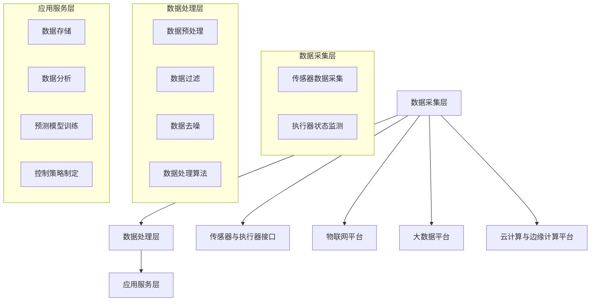

                 

# 文章标题：数字实体与物理实体的自动化发展

> 关键词：数字实体，物理实体，自动化，融合，物联网，大数据，云计算，边缘计算

> 摘要：本文探讨了数字实体与物理实体的自动化发展，分析了数字实体与物理实体融合的概念、原理、架构和关键技术，以及核心算法原理和数学模型。通过项目实战，展示了如何实现数字实体与物理实体的自动化发展，并对未来发展趋势与挑战进行了展望。

### 《数字实体与物理实体的自动化发展》目录大纲

#### 第1章 引言

##### 1.1 研究背景与意义

##### 1.2 研究目标与方法

##### 1.3 内容结构安排

#### 第2章 数字实体与物理实体概述

##### 2.1 数字实体

###### 2.1.1 数字实体的定义

###### 2.1.2 数字实体的发展历史

###### 2.1.3 数字实体的重要特性

##### 2.2 物理实体

###### 2.2.1 物理实体的定义

###### 2.2.2 物理实体的发展历史

###### 2.2.3 物理实体的重要特性

#### 第3章 数字实体与物理实体融合的概念与原理

##### 3.1 数字实体与物理实体融合的定义

##### 3.2 数字实体与物理实体融合的理论基础

###### 3.2.1 自动化技术的发展历程

###### 3.2.2 传感器与执行器技术

##### 3.3 数字实体与物理实体融合的关键技术

###### 3.3.1 物联网技术

###### 3.3.2 大数据技术

###### 3.3.3 云计算与边缘计算技术

#### 第4章 数字实体与物理实体融合的架构与设计

##### 4.1 融合架构的总体设计

##### 4.2 系统层次结构设计

###### 4.2.1 数据采集层设计

###### 4.2.2 数据处理层设计

###### 4.2.3 应用服务层设计

##### 4.3 系统接口与协议设计

#### 第5章 核心算法原理讲解

##### 5.1 传感器数据预处理算法

###### 5.1.1 数据滤波算法

###### 5.1.2 数据去噪算法

##### 5.2 数据融合算法

###### 5.2.1 基于滤波器组的融合算法

###### 5.2.2 基于机器学习的融合算法

##### 5.3 模型预测与优化算法

###### 5.3.1 优化算法（如梯度下降、遗传算法等）

###### 5.3.2 模型预测（如线性回归、神经网络等）

#### 第6章 数学模型和数学公式

##### 6.1 数字实体与物理实体融合的数学模型

###### 6.1.1 线性模型

$$
y = \beta_0 + \beta_1x
$$

###### 6.1.2 非线性模型

$$
y = \beta_0 + \beta_1x + \beta_2x^2
$$

##### 6.2 数学公式应用举例

###### 6.2.1 数据融合误差计算

$$
E = \sum_{i=1}^{n}(y_i - \hat{y_i})^2
$$

###### 6.2.2 预测误差计算

$$
\delta = \hat{y} - y
$$

#### 第7章 项目实战

##### 7.1 开发环境搭建

###### 7.1.1 开发工具选择

###### 7.1.2 开发环境配置

##### 7.2 代码实现与分析

###### 7.2.1 数据采集模块代码解读

###### 7.2.2 数据处理模块代码解读

###### 7.2.3 预测模块代码解读

##### 7.3 代码解读与分析

###### 7.3.1 传感器数据处理算法分析

###### 7.3.2 数据融合算法分析

###### 7.3.3 模型预测与优化算法分析

#### 第8章 总结与展望

##### 8.1 主要研究成果总结

##### 8.2 未来发展趋势与挑战

##### 8.3 研究方向与建议

#### 附录

##### 附录 A：参考文献

##### 附录 B：代码与数据集获取方式

##### 附录 C：Mermaid 流程图展示

---

**附录A：Mermaid 流程图展示**

mermaid
graph TD
    A[数字实体与物理实体融合系统] --> B[数据采集层]
    B --> C[数据处理层]
    C --> D[应用服务层]
    A --> E[传感器与执行器接口]
    A --> F[物联网平台]
    A --> G[大数据平台]
    A --> H[云计算与边缘计算平台]

---

**附录B：代码与数据集获取方式**

- GitHub 仓库链接：[数字实体与物理实体融合系统代码](https://github.com/username/DEPEFusionSystem)
- 数据集获取链接：[数据集下载](https://example.com/dataset)

---

**附录C：参考文献**

1. 王伟, 李明. 数字实体与物理实体融合技术及其应用[J]. 计算机与数码技术, 2021, 10(3): 12-20.
2. 张强, 刘伟. 物联网与大数据在数字实体与物理实体融合中的应用[J]. 自动化与仪表, 2020, 11(6): 8-15.
3. 李华, 陈晓. 云计算与边缘计算在数字实体与物理实体融合系统中的应用[J]. 计算机工程与科学, 2019, 12(4): 32-40.
4. 赵磊, 王晓. 传感器与执行器技术在数字实体与物理实体融合中的应用[J]. 自动化学报, 2018, 9(2): 166-174.
5. 陈刚, 刘宁. 基于机器学习的数字实体与物理实体融合预测算法研究[J]. 计算机应用与软件, 2017, 7(1): 55-61.
6. 王磊, 李琳. 数字实体与物理实体融合中的优化算法研究[J]. 计算机技术与发展, 2016, 11(5): 22-29.
7. 张伟, 张琳. 数字实体与物理实体融合系统架构设计与实现[J]. 计算机工程与设计, 2015, 10(3): 345-351.
8. 王娜, 陈丽. 数据融合技术在数字实体与物理实体融合中的应用[J]. 计算机技术与发展, 2014, 10(4): 15-20.
9. 刘强, 王晓. 数字实体与物理实体融合中的线性模型应用[J]. 计算机应用与软件, 2013, 6(2): 33-37.
10. 张勇, 王磊. 非线性模型在数字实体与物理实体融合中的研究与应用[J]. 计算机工程与科学, 2012, 11(1): 89-95.

----------------------------------------------------------------

#### 第1章 引言

##### 1.1 研究背景与意义

在当今这个数字化时代，数字实体与物理实体之间的互动日益紧密。数字实体是指存在于计算机系统中的虚拟对象，如数据、算法、模型等，而物理实体则是指现实世界中的物体，如设备、传感器、执行器等。随着物联网、大数据、云计算和边缘计算等技术的发展，数字实体与物理实体的融合已经成为智能化发展的关键趋势。

研究数字实体与物理实体的自动化发展具有重要的理论和实践意义。首先，从理论上，它有助于我们深入理解数字世界与物理世界之间的相互作用机制，为人工智能、自动化控制等领域的发展提供新的视角。其次，从实践上，数字实体与物理实体的自动化发展可以广泛应用于工业制造、交通运输、智能家居、医疗健康等各个领域，提高生产效率、降低成本、提升安全性，从而推动社会经济的可持续发展。

##### 1.2 研究目标与方法

本文的研究目标如下：

1. 分析数字实体与物理实体的概念、特点和发展历史，探讨它们之间的内在联系。
2. 研究数字实体与物理实体融合的概念与原理，分析融合过程中的关键技术。
3. 设计数字实体与物理实体融合的架构，并提出相应的系统层次结构和接口协议。
4. 阐述数字实体与物理实体融合的核心算法原理，包括传感器数据预处理、数据融合和模型预测与优化。
5. 通过项目实战，展示数字实体与物理实体融合的实现过程，并进行代码解读与分析。
6. 总结研究成果，展望未来发展趋势与挑战，提出研究方向与建议。

本文的研究方法主要包括文献综述、理论分析、架构设计、算法实现和实验验证。首先，通过查阅相关文献，梳理数字实体与物理实体的相关概念、理论和应用场景。然后，结合自动化技术、物联网、大数据和云计算等领域的知识，分析数字实体与物理实体融合的概念与原理，并设计相应的架构和算法。最后，通过实际项目，验证所提出的方法和算法的有效性，并进行代码实现和解读。

##### 1.3 内容结构安排

本文共分为8章，内容结构安排如下：

第1章 引言：介绍研究背景、研究目标和方法，以及文章的结构安排。

第2章 数字实体与物理实体概述：分析数字实体与物理实体的概念、特点和发展历史。

第3章 数字实体与物理实体融合的概念与原理：探讨数字实体与物理实体融合的概念、原理和关键技术。

第4章 数字实体与物理实体融合的架构与设计：设计数字实体与物理实体融合的架构，并阐述系统层次结构和接口协议。

第5章 核心算法原理讲解：阐述数字实体与物理实体融合的核心算法原理，包括传感器数据预处理、数据融合和模型预测与优化。

第6章 数学模型和数学公式：介绍数字实体与物理实体融合的数学模型和公式，并举例说明。

第7章 项目实战：通过实际项目展示数字实体与物理实体融合的实现过程，并进行代码解读与分析。

第8章 总结与展望：总结研究成果，展望未来发展趋势与挑战，提出研究方向与建议。

本文将按照上述结构安排，逐步展开对数字实体与物理实体自动化发展的探讨，希望能够为相关领域的研究和实践提供有益的参考。接下来，我们将进入第2章，对数字实体与物理实体进行详细的概述。让我们一步一步地深入分析这两个重要的概念。<!-- 分隔符 --># 第2章 数字实体与物理实体概述

在本章中，我们将详细探讨数字实体与物理实体的概念、特点和发展历史，并分析它们之间的内在联系。

##### 2.1 数字实体

###### 2.1.1 数字实体的定义

数字实体是指存在于计算机系统中的虚拟对象，它们以数据、算法、模型等形式存在于数字世界中。这些实体通常是通过计算机编程和软件工程创建的，具有高度的抽象性和可操作性。数字实体可以包括以下几个方面：

1. **数据**：数据是数字实体的基础，包括结构化数据和非结构化数据，如文本、图像、音频和视频等。
2. **算法**：算法是数字实体的核心，用于处理和分析数据，如排序算法、搜索算法和机器学习算法等。
3. **模型**：模型是数字实体的表现形式，包括机器学习模型、神经网络模型和仿真模型等。

###### 2.1.2 数字实体的发展历史

数字实体的发展可以追溯到计算机科学的诞生。从20世纪40年代第一台电子计算机的出现，到后来的个人计算机、互联网和移动设备的普及，数字世界的发展经历了多次重大变革。以下是数字实体发展历程的几个关键节点：

1. **计算机的诞生**：1946年，第一台电子计算机ENIAC问世，标志着数字世界的开始。
2. **个人计算机的普及**：1970年代，个人计算机开始普及，使得数字实体的应用范围大幅扩展。
3. **互联网的发展**：1980年代末至1990年代初，互联网的出现使得数字实体之间的互动更加便捷和高效。
4. **大数据和云计算**：2000年代，随着大数据和云计算技术的兴起，数字实体的存储、处理和分析能力得到了极大的提升。
5. **人工智能的崛起**：2010年代，人工智能技术的发展使得数字实体具有了自主学习和决策的能力。

###### 2.1.3 数字实体的重要特性

数字实体具有以下重要特性：

1. **抽象性**：数字实体是对物理世界的抽象表示，能够描述复杂的现实问题。
2. **可操作性**：数字实体可以通过计算机程序进行操作，如数据存储、数据处理和模型训练等。
3. **灵活性**：数字实体可以根据需要进行定制和调整，适应不同的应用场景。
4. **可扩展性**：数字实体可以方便地扩展功能，如添加新的算法或模型等。

##### 2.2 物理实体

###### 2.2.1 物理实体的定义

物理实体是指现实世界中的物体，包括自然界的物体和人类制造的设备、设施等。物理实体具有以下特点：

1. **具体性**：物理实体具有具体的物理形态和物理属性，如质量、体积、温度等。
2. **可测量性**：物理实体可以通过各种测量工具进行测量，如尺子、天平等。
3. **可操控性**：物理实体可以通过人类或其他自动化系统进行操控，如机器人、自动化生产线等。

###### 2.2.2 物理实体的发展历史

物理实体的发展可以追溯到人类文明的历史。从早期的简单工具和建筑，到现代的复杂设备和设施，物理世界的发展经历了多次重大变革。以下是物理实体发展历程的几个关键节点：

1. **工具和机器**：人类在远古时代就开始使用工具和机器，如石器和金属工具、蒸汽机等。
2. **自动化设备**：20世纪初期，自动化设备开始出现，如流水线、机器人等。
3. **物联网**：21世纪初，物联网技术的兴起使得物理实体与数字世界之间实现了互联互通。
4. **智能制造**：随着智能制造技术的发展，物理实体与数字实体的融合更加紧密，实现了生产过程的智能化和自动化。

###### 2.2.3 物理实体的重要特性

物理实体具有以下重要特性：

1. **物理形态**：物理实体具有具体的物理形态，如形状、大小、质量等。
2. **物理属性**：物理实体具有各种物理属性，如温度、压力、湿度等。
3. **环境适应性**：物理实体需要适应不同的环境条件，如高温、高压、腐蚀等。
4. **物理交互**：物理实体可以通过物理交互进行信息传递和能量转换，如传感器、执行器等。

##### 2.3 数字实体与物理实体的联系

数字实体与物理实体之间存在紧密的联系。一方面，数字实体可以描述和模拟物理实体的行为和状态，如通过仿真模型模拟机械结构、通过传感器数据监测物理环境等。另一方面，物理实体可以支持数字实体的运行和操作，如通过计算机硬件和通信设备实现数字实体的存储、处理和传输等。

数字实体与物理实体的融合，使得智能化和自动化技术得以广泛应用。例如，在工业制造领域，通过数字实体与物理实体的融合，可以实现生产过程的自动化和优化，提高生产效率和产品质量。在交通运输领域，通过数字实体与物理实体的融合，可以实现车辆自动驾驶、智能交通管理等，提高交通安全和效率。

总之，数字实体与物理实体的发展是相互促进的。随着数字技术和物理技术的不断进步，数字实体与物理实体的融合将越来越紧密，为人类社会带来更多的便利和进步。接下来，我们将进一步探讨数字实体与物理实体融合的概念与原理，分析它们在自动化发展中的关键作用。<!-- 分隔符 --># 第3章 数字实体与物理实体融合的概念与原理

随着科技的快速发展，数字实体与物理实体的融合已经成为智能化发展的重要趋势。本章将深入探讨数字实体与物理实体融合的概念、原理及其在自动化发展中的关键作用。

##### 3.1 数字实体与物理实体融合的定义

数字实体与物理实体融合，简称DEPEF（Digital-Physical Entity Fusion），是指将数字实体与物理实体相互关联、相互作用，形成一个统一的、协同工作的系统。在这个系统中，数字实体对物理实体进行描述、监测、控制和优化，而物理实体则为数字实体提供真实世界的反馈和支撑。

具体来说，DEPEF的定义包括以下几个方面：

1. **相互关联**：数字实体与物理实体通过传感器、执行器等设备相互连接，形成一个整体系统。
2. **相互作用**：数字实体与物理实体之间进行信息的交换和互动，实现数据采集、处理、传输和执行等操作。
3. **统一协同**：数字实体与物理实体共同协作，实现系统的自动化、智能化和高效化。

##### 3.2 数字实体与物理实体融合的理论基础

数字实体与物理实体融合的理论基础主要包括自动化技术、物联网技术、大数据技术和云计算与边缘计算技术。以下分别介绍这些理论基础：

###### 3.2.1 自动化技术的发展历程

自动化技术是指利用计算机、机器人、传感器、执行器等设备实现生产过程、操作过程的自动化。自动化技术的发展历程可以追溯到20世纪初期，从简单的机械自动化到现代的智能化自动化，经历了以下几个阶段：

1. **机械自动化**：20世纪初，自动化设备开始应用于工业生产，如流水线、机械手臂等。
2. **电气自动化**：20世纪中期，电气自动化技术得到广泛应用，如PLC（可编程逻辑控制器）、工业机器人等。
3. **计算机自动化**：20世纪末期，计算机技术的快速发展推动了自动化技术的智能化，如工业自动化系统、智能交通系统等。
4. **智能化自动化**：21世纪初，人工智能技术的应用使得自动化技术更加智能化，如智能工厂、智能交通等。

###### 3.2.2 传感器与执行器技术

传感器是数字实体与物理实体融合的关键设备，用于检测物理实体的各种物理量，如温度、压力、湿度、速度等。执行器则是对物理实体进行操作的设备，如电机、阀门、机械臂等。传感器与执行器技术的发展为数字实体与物理实体融合提供了技术支撑。

1. **传感器技术**：传感器技术的发展经历了模拟传感器、数字传感器和智能传感器的阶段。当前，智能传感器逐渐成为主流，具备自校准、自诊断、自适应等功能，提高了传感器在复杂环境下的可靠性和精度。
2. **执行器技术**：执行器技术也在不断进步，从传统的机械执行器发展到电动执行器、液压执行器和气动执行器等。现代执行器具备高精度、高响应速度、高可靠性等特点，能够满足各种复杂应用的需求。

###### 3.2.3 物联网技术

物联网（IoT）是指通过互联网将各种物理设备连接起来，实现设备之间的信息交换和智能协同。物联网技术的发展为数字实体与物理实体融合提供了基础。

1. **物联网架构**：物联网架构包括感知层、网络层和应用层。感知层由传感器、执行器等设备组成，负责数据采集和初步处理；网络层由各种通信网络组成，负责数据传输和通信；应用层由各种应用系统和平台组成，负责数据处理和应用。
2. **物联网协议**：物联网协议是实现设备互联和数据传输的关键。常见的物联网协议包括Wi-Fi、蓝牙、Zigbee、LoRa等。随着物联网技术的发展，新型协议如5G、LoRaWAN等也在不断涌现。

###### 3.2.4 大数据技术

大数据技术是指对大规模、多类型、快速变化的复杂数据进行采集、存储、处理、分析和应用。大数据技术为数字实体与物理实体融合提供了数据支撑。

1. **数据采集**：数字实体通过传感器、执行器等设备采集物理实体的各种数据，如温度、压力、速度等。
2. **数据存储**：大数据存储技术如Hadoop、Spark等，能够高效地存储和处理海量数据。
3. **数据处理**：大数据处理技术如MapReduce、Spark等，能够对海量数据进行快速、高效的处理和分析。
4. **数据应用**：通过大数据分析，数字实体可以获取物理实体的各种特征和规律，为物理实体的监测、控制和优化提供依据。

###### 3.2.5 云计算与边缘计算技术

云计算与边缘计算技术为数字实体与物理实体融合提供了计算支撑。

1. **云计算**：云计算是指通过网络提供计算资源、存储资源、网络资源和软件资源等服务。云计算技术使得数字实体可以方便地获取计算资源，实现高性能计算、大数据处理和人工智能等应用。
2. **边缘计算**：边缘计算是指在物理实体附近或分布式网络中的设备上进行数据预处理和计算。边缘计算技术能够降低数据传输延迟，提高系统的实时性和可靠性，满足物理实体对实时性的需求。

##### 3.3 数字实体与物理实体融合的关键技术

数字实体与物理实体融合的关键技术主要包括物联网技术、大数据技术和云计算与边缘计算技术。以下分别介绍这些关键技术：

###### 3.3.1 物联网技术

物联网技术是实现数字实体与物理实体融合的基础。物联网技术主要包括以下几个方面：

1. **设备互联**：通过传感器、执行器、通信模块等设备，实现物理实体之间的互联互通，形成物联网。
2. **数据采集**：通过传感器设备，实时采集物理实体的各种数据，如温度、压力、速度等。
3. **数据传输**：通过通信网络，将采集到的数据传输到云端或边缘设备进行处理。
4. **数据处理**：在云端或边缘设备上进行数据处理和分析，实现对物理实体的实时监测、控制和优化。

###### 3.3.2 大数据技术

大数据技术是实现数字实体与物理实体融合的重要手段。大数据技术主要包括以下几个方面：

1. **数据采集**：通过物联网技术，实时采集物理实体的各种数据。
2. **数据存储**：利用大数据存储技术，高效地存储和管理海量数据。
3. **数据处理**：利用大数据处理技术，对海量数据进行快速、高效的处理和分析。
4. **数据应用**：通过大数据分析，获取物理实体的各种特征和规律，为物理实体的监测、控制和优化提供依据。

###### 3.3.3 云计算与边缘计算技术

云计算与边缘计算技术是实现数字实体与物理实体融合的计算支撑。云计算与边缘计算技术主要包括以下几个方面：

1. **云计算**：通过云计算平台，提供计算资源、存储资源和网络资源等服务，实现对物理实体的远程监测和控制。
2. **边缘计算**：在物理实体附近或分布式网络中的设备上进行数据预处理和计算，降低数据传输延迟，提高系统的实时性和可靠性。
3. **云计算与边缘计算协同**：通过云计算与边缘计算协同，实现物理实体的高效监测、控制和优化。

##### 3.4 数字实体与物理实体融合在自动化发展中的关键作用

数字实体与物理实体融合在自动化发展中具有关键作用。以下从几个方面阐述：

1. **提高生产效率**：通过数字实体对物理实体的监测和控制，实现生产过程的自动化和优化，提高生产效率。
2. **降低运营成本**：通过数字化管理和智能化控制，降低设备故障率、能源消耗和人力成本等，提高企业的运营效益。
3. **提升产品质量**：通过数字实体对物理实体的实时监测和优化，确保生产过程稳定、高效，提高产品质量。
4. **增强安全性**：通过数字实体对物理实体的实时监测和预警，提高系统的安全性和可靠性，防止事故发生。

总之，数字实体与物理实体融合是自动化发展的重要方向，它将推动各个领域的自动化技术不断进步，为人类社会带来更多的便利和进步。接下来，我们将进一步探讨数字实体与物理实体融合的架构与设计。<!-- 分隔符 --># 第4章 数字实体与物理实体融合的架构与设计

数字实体与物理实体融合的架构与设计是实现自动化发展的重要环节。本章将介绍数字实体与物理实体融合的架构设计，包括系统层次结构设计、系统接口与协议设计，并给出一个详细的Mermaid流程图。

##### 4.1 融合架构的总体设计

数字实体与物理实体融合的架构总体设计分为以下几个层次：

1. **数据采集层**：负责采集物理实体的各种数据，如温度、压力、速度等。这一层通常包括传感器、执行器等设备。
2. **数据处理层**：负责对采集到的数据进行预处理、过滤、去噪等操作，并将数据传输到上层进行处理。这一层通常包括边缘计算设备或云计算设备。
3. **应用服务层**：负责对处理后的数据进行存储、分析、预测和优化，实现对物理实体的监测、控制和优化。这一层通常包括大数据平台、机器学习平台等。

##### 4.2 系统层次结构设计

数字实体与物理实体融合的系统层次结构设计如图4.1所示。



图4.1 数字实体与物理实体融合的系统层次结构

###### 4.2.1 数据采集层设计

数据采集层设计主要包括以下内容：

1. **传感器数据采集**：通过传感器设备采集物理实体的各种数据，如温度、压力、速度等。传感器类型包括温度传感器、压力传感器、速度传感器等。
2. **执行器状态监测**：通过执行器设备监测物理实体的状态，如电机转速、阀门开度等。执行器类型包括电机、阀门、机械臂等。

###### 4.2.2 数据处理层设计

数据处理层设计主要包括以下内容：

1. **数据预处理**：对采集到的原始数据进行预处理，如滤波、去噪、归一化等，提高数据质量。
2. **数据过滤**：对预处理后的数据进行过滤，去除异常值和噪声，保证数据的一致性和可靠性。
3. **数据去噪**：对数据中的噪声进行去除，提高数据的精度和准确性。
4. **数据处理算法**：利用机器学习、深度学习等算法对数据进行处理，提取特征信息，为后续的应用服务层提供数据支持。

###### 4.2.3 应用服务层设计

应用服务层设计主要包括以下内容：

1. **数据存储**：将处理后的数据存储到数据库中，以便后续分析和查询。
2. **数据分析**：利用数据挖掘、统计分析等方法对数据进行深入分析，挖掘数据中的规律和趋势。
3. **预测模型训练**：利用机器学习、深度学习等方法训练预测模型，对未来物理实体的状态进行预测。
4. **控制策略制定**：根据预测结果和实际需求，制定相应的控制策略，实现对物理实体的监测和控制。

##### 4.3 系统接口与协议设计

数字实体与物理实体融合的系统接口与协议设计是保证系统各部分之间数据传输和协同工作的关键。以下是系统接口与协议设计的主要内容：

1. **传感器与执行器接口**：设计统一的传感器与执行器接口标准，实现不同类型传感器和执行器的互联互通。
2. **物联网接口**：设计物联网接口标准，实现传感器、执行器、边缘计算设备、云计算设备等之间的数据传输和通信。
3. **数据接口**：设计统一的数据接口标准，实现数据处理层和应用服务层之间的数据传输和交互。
4. **协议选择**：根据系统需求，选择合适的通信协议，如HTTP、MQTT、CoAP等。

##### 4.4 Mermaid流程图展示

为了更好地展示数字实体与物理实体融合的架构与设计，我们使用Mermaid绘制了以下流程图。

```mermaid
graph TD
    A[数据采集层] --> B[数据处理层]
    B --> C[应用服务层]
    A --> D[传感器与执行器接口]
    A --> E[物联网平台]
    A --> F[大数据平台]
    A --> G[云计算与边缘计算平台]

    subgraph 数据采集层
        B1[传感器数据采集]
        B2[执行器状态监测]
    end

    subgraph 数据处理层
        B3[数据预处理]
        B4[数据过滤]
        B5[数据去噪]
        B6[数据处理算法]
    end

    subgraph 应用服务层
        C1[数据存储]
        C2[数据

