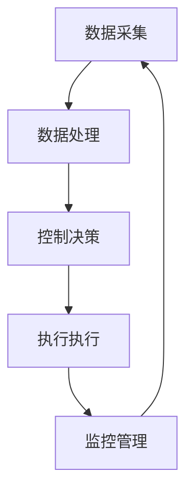
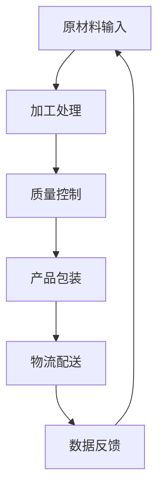
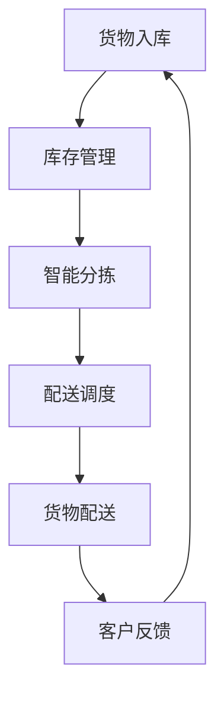
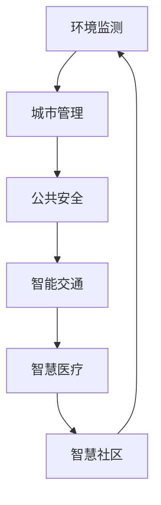

                 

# 文章标题：数字实体自动化的未来发展

> 关键词：数字实体自动化、物联网、人工智能、云计算、大数据、工业自动化、智慧城市

> 摘要：本文深入探讨了数字实体自动化的概念、核心概念、架构设计、算法原理及其在工业自动化、智能物流和智慧城市等领域的应用实践。通过对当前数字实体自动化的发展现状、技术趋势以及未来展望的详细分析，展望了数字实体自动化的未来前景，并对可能面临的挑战提出了应对策略。

## 《数字实体自动化的未来发展》目录大纲

### 第一部分：数字实体自动化基础

#### 第1章：数字实体自动化概述

- **1.1 数字实体自动化的定义与背景**
  - 数字实体自动化的定义
  - 数字实体自动化的背景
  - 数字实体自动化的作用与意义

- **1.2 数字实体自动化与传统自动化的区别**
  - 传统自动化的概述
  - 数字实体自动化的优势
  - 数字实体自动化面临的挑战

- **1.3 数字实体自动化的发展现状与趋势**
  - 当前的发展现状
  - 技术发展趋势
  - 行业应用前景

#### 第2章：数字实体自动化的核心概念与架构

- **2.1 数字实体概念解析**
  - 数字实体的定义
  - 数字实体的分类
  - 数字实体的生命周期管理

- **2.2 数字实体自动化的架构设计**
  - 系统架构概述
  - 数据处理模块
  - 控制决策模块
  - 执行执行模块

- **2.3 数字实体自动化的关键技术**
  - 物联网技术
  - 人工智能与机器学习
  - 云计算与大数据技术

#### 第3章：数字实体自动化的算法原理与实现

- **3.1 算法原理**
  - 自动化决策算法
  - 数据挖掘与预测算法
  - 聚类与分类算法

- **3.2 算法实现**
  - 基于Python的算法实现
  - 实现案例与代码解读

- **3.3 数学模型与公式解析**
  - 机器学习中的常见数学模型
  - 数学公式解析与推导
  - 数学公式举例说明

### 第二部分：数字实体自动化的应用与实践

#### 第4章：工业自动化中的数字实体应用

- **4.1 工业自动化的现状与需求**
  - 工业自动化的概述
  - 数字实体在工业自动化中的应用需求

- **4.2 工业自动化中的数字实体应用案例**
  - 自动化生产线的应用
  - 自动化检测与维护

- **4.3 工业自动化中的数字实体技术挑战**
  - 实时数据处理
  - 安全性问题
  - 面向工业场景的算法优化

#### 第5章：智能物流中的数字实体应用

- **5.1 智能物流的概述**
  - 智能物流的概念
  - 智能物流的发展历程

- **5.2 数字实体在智能物流中的应用**
  - 物流过程中的数字实体管理
  - 智能仓储与配送

- **5.3 智能物流中的数字实体技术趋势**
  - 物联网技术
  - 人工智能在物流中的应用

#### 第6章：智慧城市中的数字实体应用

- **6.1 智慧城市的概念与建设**
  - 智慧城市的定义
  - 智慧城市建设的现状与挑战

- **6.2 数字实体在智慧城市中的应用**
  - 城市管理中的数字实体应用
  - 城市服务中的数字实体应用

- **6.3 智慧城市中的数字实体技术趋势**
  - 大数据分析
  - 物联网技术的普及

### 第三部分：数字实体自动化的未来展望

#### 第7章：数字实体自动化的未来发展趋势

- **7.1 人工智能与物联网的融合**
  - 人工智能在物联网中的应用
  - 物联网在人工智能中的应用

- **7.2 数字实体自动化的社会影响**
  - 数字实体自动化对社会的影响
  - 数字实体自动化的道德与伦理问题

- **7.3 数字实体自动化的未来展望**
  - 技术趋势预测
  - 行业应用前景
  - 潜在挑战与应对策略

#### 第8章：数字实体自动化的创新实践

- **8.1 创新实践案例分析**
  - 成功案例介绍
  - 创新实践的价值与影响

- **8.2 创新实践的技术突破**
  - 核心技术创新
  - 技术突破带来的影响

- **8.3 创新实践的挑战与应对**
  - 技术挑战
  - 社会挑战
  - 应对策略与建议

### 附录

#### 附录A：数字实体自动化相关资源

- **A.1 开源工具与框架**
  - 常用开源工具与框架介绍
  - 开源资源获取途径

- **A.2 学习资源与资料**
  - 学术论文
  - 技术书籍
  - 在线课程

#### 附录B：数字实体自动化的 Mermaid 流程图

- **B.1 数字实体自动化整体流程图**
- **B.2 工业自动化流程图**
- **B.3 智能物流流程图**
- **B.4 智慧城市流程图**

### 引入

在当今科技飞速发展的时代，自动化技术已经渗透到我们生活的方方面面。从工业生产到物流配送，从城市管理到智慧城市建设，自动化技术的应用已经越来越广泛。然而，随着物联网、人工智能、云计算和大数据等新兴技术的不断涌现，一种新型的自动化技术——数字实体自动化，正逐渐成为自动化领域的新趋势。

数字实体自动化，简单来说，就是通过将现实世界中的各种实体转化为数字实体，然后利用物联网、人工智能等技术对这些数字实体进行自动化管理、监控和控制。这种技术不仅能够提高生产效率、降低成本，还能够实现更加智能化、精准化的管理和服务。

本文将深入探讨数字实体自动化的概念、核心概念、架构设计、算法原理及其在工业自动化、智能物流和智慧城市等领域的应用实践。通过对当前数字实体自动化的发展现状、技术趋势以及未来展望的详细分析，我们将展望数字实体自动化的未来前景，并对可能面临的挑战提出应对策略。

接下来，我们将首先对数字实体自动化的概念、背景和发展现状进行概述，然后深入探讨数字实体自动化的核心概念与架构设计，最后通过具体案例展示数字实体自动化在不同领域的应用，并展望其未来发展。让我们一步一步地深入分析这一充满潜力的自动化技术。让我们首先来看一下数字实体自动化的定义与背景。

## 第1章：数字实体自动化概述

### 1.1 数字实体自动化的定义与背景

数字实体自动化是一种新兴的自动化技术，它通过将现实世界中的各种实体转化为数字实体，然后利用物联网（IoT）、人工智能（AI）、云计算（Cloud Computing）和大数据（Big Data）等先进技术对这些数字实体进行自动化管理、监控和控制。这种技术旨在实现更加智能化、精准化和高效化的管理和服务。

**数字实体自动化的定义：**

数字实体自动化是指利用物联网技术采集实体设备的数据，通过人工智能算法进行分析和处理，从而实现对实体设备的智能监控、预测和自动化控制的过程。数字实体可以是物理设备、机器、车辆、建筑物等，它们在数字世界中被建模为虚拟实体，并通过传感器、数据采集设备等与数字系统进行实时数据交互。

**数字实体自动化的背景：**

随着物联网、人工智能、云计算和大数据等技术的快速发展，数字实体自动化的概念逐渐成熟。这些技术的发展不仅为数字实体自动化提供了强大的技术支撑，也为其实际应用提供了广阔的空间。

- **物联网技术：** 物联网技术使得各种设备能够通过网络连接起来，实现数据的实时采集和传输。这对于数字实体自动化的实现至关重要，因为它提供了数字实体与数字系统之间交互的桥梁。

- **人工智能技术：** 人工智能技术，特别是机器学习和深度学习技术，能够对海量数据进行智能分析和处理，从而实现对数字实体的智能监控和预测。这大大提升了数字实体自动化的效率和准确性。

- **云计算与大数据技术：** 云计算和大数据技术提供了强大的计算能力和数据存储能力，使得数字实体自动化系统能够处理和分析大规模数据，从而实现更加智能化的决策和控制。

**数字实体自动化的作用与意义：**

数字实体自动化不仅在技术层面带来了变革，也在社会和经济层面产生了深远的影响。

- **提高生产效率：** 通过对实体设备的实时监控和自动化控制，可以大大提高生产效率，减少人为干预，降低生产成本。

- **优化资源管理：** 通过对数字实体的智能监控和预测，可以优化资源分配和利用，减少浪费，提高资源利用率。

- **提升服务质量：** 在物流、城市管理等领域，数字实体自动化可以提供更加精准、高效的服务，提升用户满意度。

- **促进创新：** 数字实体自动化为各行各业带来了新的发展机遇，推动了技术创新和产业升级。

### 1.2 数字实体自动化与传统自动化的区别

**传统自动化的概述：**

传统自动化主要指机械自动化和电气自动化，它是通过机械和电气元件的自动控制来实现生产过程的自动化。传统自动化的主要特点是：

- **物理控制：** 传统自动化依赖于物理设备和机械结构，通过机械动作和电气信号来实现控制。

- **固定程序：** 传统自动化系统通常基于预设的程序和逻辑，一旦设定，系统将按照固定流程执行。

- **人工干预：** 虽然可以实现部分自动化，但很多情况下仍需要人工进行监控和干预。

**数字实体自动化的优势：**

数字实体自动化相较于传统自动化具有以下优势：

- **智能化：** 数字实体自动化利用人工智能技术，可以实现更加智能化的决策和控制，不仅能够处理数据，还能够进行预测和优化。

- **灵活性：** 数字实体自动化系统可以根据实际需求灵活调整，不需要重新设计物理设备，大大提高了系统的可扩展性和适应性。

- **实时性：** 数字实体自动化通过物联网技术实现实时数据采集和传输，可以实时监控和调整实体设备状态，提高了系统的实时性和响应速度。

**数字实体自动化面临的挑战：**

尽管数字实体自动化具有诸多优势，但也面临一些挑战：

- **技术复杂度：** 数字实体自动化涉及多个领域的技术，包括物联网、人工智能、云计算等，技术实现复杂，需要跨领域的技术协同。

- **数据安全与隐私：** 数字实体自动化系统中涉及大量敏感数据，如个人隐私、企业机密等，如何保证数据安全和隐私保护成为一大挑战。

- **成本问题：** 数字实体自动化的实施需要大量硬件和软件投入，初期的成本较高，中小企业可能面临成本压力。

### 1.3 数字实体自动化的发展现状与趋势

**当前的发展现状：**

数字实体自动化在全球范围内已经取得了一定的进展，主要表现在以下几个方面：

- **技术研发：** 各大科技公司和研究机构纷纷投入大量资源进行数字实体自动化的技术研发，推出了一系列相关产品和技术解决方案。

- **试点应用：** 在工业自动化、智能物流、智慧城市等领域，数字实体自动化已经开始试点应用，取得了一定的成效。

- **政策支持：** 各国政府也高度重视数字实体自动化的发展，出台了一系列政策措施，推动数字实体自动化的普及和应用。

**技术发展趋势：**

随着技术的不断进步，数字实体自动化也呈现出以下发展趋势：

- **人工智能与物联网的融合：** 人工智能技术在数字实体自动化中的应用越来越广泛，物联网技术的普及也为数字实体自动化提供了更好的数据支持。

- **云计算与大数据的融合：** 云计算和大数据技术为数字实体自动化提供了强大的计算能力和数据存储能力，使得数字实体自动化系统更加智能和高效。

- **边缘计算的应用：** 边缘计算技术的发展，使得数字实体自动化系统可以在边缘设备上进行实时数据处理，提高了系统的响应速度和可靠性。

**行业应用前景：**

数字实体自动化在各个行业的应用前景都非常广阔：

- **工业自动化：** 通过数字实体自动化，可以实现对生产过程的全程监控和自动化控制，提高生产效率和产品质量。

- **智能物流：** 数字实体自动化可以实现物流过程中的精准定位、实时监控和自动化调度，提高物流效率和降低成本。

- **智慧城市：** 数字实体自动化可以应用于城市管理、公共安全、交通出行等多个领域，提升城市管理的智能化水平和服务质量。

通过以上对数字实体自动化的定义、背景、优势、挑战、发展现状和趋势的介绍，我们可以看到，数字实体自动化正逐渐成为自动化领域的新趋势。接下来，我们将深入探讨数字实体自动化的核心概念与架构设计，以帮助我们更好地理解和应用这一技术。

## 第2章：数字实体自动化的核心概念与架构

### 2.1 数字实体概念解析

**数字实体的定义：**

数字实体是指通过数字化技术建模和表示的现实世界中的物理对象、系统和过程。这些数字实体可以是机器、设备、车辆、建筑物等，它们在数字世界中拥有虚拟的镜像，并通过传感器、数据采集设备等与物理世界进行交互。

**数字实体的分类：**

数字实体可以根据其属性和功能进行分类，主要包括以下几类：

- **物理设备：** 如生产线上的机器设备、运输车辆、传感器等。
- **信息系统：** 如企业资源计划（ERP）系统、客户关系管理（CRM）系统等。
- **过程：** 如生产流程、物流运输过程等。
- **资源：** 如原材料、能源、人力等。

**数字实体的生命周期管理：**

数字实体的生命周期管理是指对数字实体从创建、运行、维护到退出的整个过程进行管理。具体包括以下几个阶段：

- **创建：** 根据实际需求，设计和创建数字实体，包括实体建模、属性定义等。
- **运行：** 数字实体在系统中运行，通过传感器和设备实时采集数据，进行监控和控制。
- **维护：** 定期对数字实体进行检查和维护，确保其正常运行。
- **退出：** 当数字实体不再符合需求或达到使用年限时，进行退役处理。

### 2.2 数字实体自动化的架构设计

**系统架构概述：**

数字实体自动化的系统架构主要包括四个核心模块：数据处理模块、控制决策模块、执行执行模块和监控管理模块。以下是对这些模块的详细解析：

- **数据处理模块：** 数据处理模块负责对数字实体采集到的数据进行分析和处理，包括数据清洗、数据存储和数据挖掘等。该模块是数字实体自动化系统的核心，决定了系统的数据质量和处理效率。
  
- **控制决策模块：** 控制决策模块利用人工智能算法对处理后的数据进行分析，生成控制策略和决策。它负责对数字实体进行实时监控和预测，并根据分析结果调整系统参数，以实现最优控制效果。

- **执行执行模块：** 执行执行模块负责将控制决策模块生成的控制指令转化为物理操作，实现对数字实体的自动化控制。该模块通常包括执行器、传感器和通信模块等。

- **监控管理模块：** 监控管理模块负责对整个数字实体自动化系统的运行状态进行监控和管理，包括系统性能监控、故障诊断和预警等。它为系统的稳定运行提供了保障。

**数据处理模块：**

数据处理模块是数字实体自动化系统的核心，它包括以下功能：

- **数据采集：** 通过传感器、RFID、摄像头等设备实时采集数字实体的状态数据。
- **数据清洗：** 对采集到的数据进行处理，去除噪声和异常值，保证数据的质量。
- **数据存储：** 将处理后的数据存储到数据库或数据湖中，以便后续分析和处理。
- **数据挖掘：** 利用机器学习和数据挖掘算法，对数据进行深入分析和挖掘，提取有价值的信息和规律。

**控制决策模块：**

控制决策模块基于数据处理模块提供的数据，利用人工智能算法进行决策和控制。以下是该模块的核心算法和步骤：

- **自动化决策算法：** 包括决策树、支持向量机（SVM）、深度学习等算法，用于生成控制策略。
- **数据挖掘与预测算法：** 包括时间序列分析、回归分析、聚类分析等算法，用于预测数字实体的未来状态和趋势。
- **聚类与分类算法：** 包括K-means、K-最近邻（KNN）等算法，用于对数字实体进行分类和聚类，以识别模式和异常。

**执行执行模块：**

执行执行模块将控制决策模块生成的控制指令转化为物理操作，实现对数字实体的自动化控制。以下是该模块的核心组件和功能：

- **执行器：** 包括电机、液压缸、气动阀等，用于执行具体的物理操作。
- **传感器：** 包括温度传感器、压力传感器、流量传感器等，用于实时监测数字实体的状态。
- **通信模块：** 负责控制指令和状态数据的传输，通常使用有线或无线通信技术。

**监控管理模块：**

监控管理模块负责对整个数字实体自动化系统的运行状态进行监控和管理。以下是该模块的核心功能：

- **系统性能监控：** 监控系统的运行状态，包括CPU利用率、内存使用率、网络流量等，确保系统稳定运行。
- **故障诊断：** 分析系统的运行日志和错误信息，诊断系统故障并生成故障报告。
- **预警：** 根据系统运行状态和预测模型，提前预警可能的故障和风险，以便及时采取措施。

通过以上对数字实体自动化的核心概念与架构设计的详细解析，我们可以看到，数字实体自动化系统是一个复杂但高度集成的系统，它通过数据处理、控制决策、执行执行和监控管理四个模块的协同工作，实现了对数字实体的智能监控和自动化控制。接下来，我们将深入探讨数字实体自动化的关键技术，包括物联网技术、人工智能与机器学习、云计算与大数据技术。

### 2.3 数字实体自动化的关键技术

**物联网技术：**

物联网（IoT）技术是数字实体自动化的基础，它通过将各种设备、传感器和系统连接到互联网上，实现数据的实时采集、传输和处理。物联网技术的主要组成部分包括：

- **设备连接：** 通过无线通信技术（如Wi-Fi、蓝牙、ZigBee等）将设备连接到互联网，实现数据采集和传输。
- **传感器：** 用于采集物理实体的各种状态数据，如温度、湿度、光照、速度等。
- **数据传输：** 通过互联网将传感器采集的数据传输到云端或本地服务器进行处理和分析。
- **数据存储：** 在云端或本地服务器上存储处理后的数据，以便后续分析和利用。

物联网技术在数字实体自动化中的作用主要包括：

- **实时数据采集：** 通过物联网技术，可以实时采集数字实体的状态数据，实现实时监控和预测。
- **远程控制：** 通过物联网技术，可以实现远程控制和操作，提高系统的灵活性和响应速度。
- **数据共享与协同：** 物联网技术使得数字实体自动化系统中的数据可以实现共享和协同，提升系统的整体性能。

**人工智能与机器学习：**

人工智能（AI）和机器学习（ML）技术在数字实体自动化中发挥着关键作用，它们通过分析海量数据，提取有用信息和规律，实现智能监控、预测和决策。以下是人工智能与机器学习在数字实体自动化中的主要应用：

- **自动化决策：** 利用决策树、支持向量机（SVM）、深度学习等算法，对数字实体进行自动化决策和控制，提高系统的智能化水平。
- **数据挖掘与预测：** 利用时间序列分析、回归分析、聚类分析等算法，对数字实体的历史数据进行分析，预测其未来状态和趋势。
- **模式识别与分类：** 利用K-means、K-最近邻（KNN）等算法，对数字实体进行分类和聚类，识别模式和异常，提高系统的可靠性和安全性。

**云计算与大数据技术：**

云计算（Cloud Computing）和大数据（Big Data）技术为数字实体自动化提供了强大的计算能力和数据存储能力，使得数字实体自动化系统可以处理和分析大规模数据，实现更加智能化的决策和控制。以下是云计算与大数据技术在数字实体自动化中的主要应用：

- **弹性计算：** 云计算技术提供了弹性计算资源，可以根据系统的需求动态调整计算资源，提高系统的效率和可靠性。
- **大数据处理：** 大数据技术可以处理海量数据，提取有价值的信息和规律，为数字实体自动化提供决策支持。
- **数据存储与管理：** 云存储技术提供了高效、可靠的数据存储解决方案，可以存储和处理大规模数据，确保数据的安全性和完整性。
- **数据分析和挖掘：** 大数据分析技术可以对海量数据进行深度分析和挖掘，提取有价值的信息和规律，为数字实体自动化提供智能决策支持。

**物联网技术、人工智能与机器学习、云计算与大数据技术的融合：**

物联网技术、人工智能与机器学习、云计算与大数据技术并不是孤立存在的，它们在数字实体自动化中相互融合，共同推动数字实体自动化的发展。以下是这些技术的融合方式和作用：

- **物联网+人工智能：** 物联网技术提供实时数据采集和传输，人工智能技术对数据进行智能分析和处理，实现数字实体的自动化监控和预测。
- **物联网+云计算：** 物联网技术提供实时数据采集和传输，云计算技术提供强大的计算能力和数据存储能力，实现数字实体自动化系统的弹性计算和高效数据处理。
- **人工智能+大数据：** 人工智能技术对大数据进行深度分析和挖掘，提取有价值的信息和规律，为数字实体自动化提供智能决策支持。
- **云计算+大数据：** 云计算技术提供弹性计算资源和高效的数据存储与管理，大数据技术提供海量数据处理和分析能力，实现数字实体自动化系统的智能决策和高效运行。

通过以上对物联网技术、人工智能与机器学习、云计算与大数据技术的详细探讨，我们可以看到，这些技术共同构成了数字实体自动化技术的基础和核心，它们在数字实体自动化中发挥着至关重要的作用。接下来，我们将通过具体案例，展示数字实体自动化的算法原理与实现，以便更好地理解和应用这一技术。

### 3.1 算法原理

数字实体自动化的算法原理主要涉及自动化决策算法、数据挖掘与预测算法以及聚类与分类算法。这些算法在不同的应用场景中发挥着关键作用，以下是对每种算法的详细解析。

#### 自动化决策算法

自动化决策算法是数字实体自动化系统中的核心组件，用于对采集到的数据进行处理和分析，生成控制策略和决策。以下是几种常见的自动化决策算法：

1. **决策树算法（Decision Tree）：**

   决策树算法通过一系列的规则和条件，对数据进行分类或回归。每个节点代表一个条件，分支代表条件的取值，叶子节点代表最终的决策。

   **算法步骤：**

   - **数据预处理：** 对数据进行清洗和归一化处理。
   - **特征选择：** 根据特征的重要性和相关性选择特征。
   - **构建决策树：** 使用ID3、C4.5或CART算法构建决策树，选择最佳划分标准。
   - **剪枝：** 对决策树进行剪枝，防止过拟合。

2. **支持向量机（SVM）：**

   支持向量机是一种强大的分类算法，通过寻找最优分隔超平面，将不同类别的数据分离。

   **算法步骤：**

   - **数据预处理：** 对数据进行标准化处理。
   - **特征提取：** 提取数据特征，如支持向量。
   - **训练模型：** 使用线性或非线性核函数训练模型。
   - **预测：** 对新数据进行分类预测。

3. **深度学习算法：**

   深度学习算法，如神经网络（Neural Networks）和深度神经网络（Deep Neural Networks），通过多层神经元的互联和权重调整，实现复杂的非线性映射。

   **算法步骤：**

   - **数据预处理：** 对数据进行归一化、缩放等处理。
   - **网络架构设计：** 设计神经网络的结构，包括层数、神经元数量等。
   - **模型训练：** 通过反向传播算法调整权重，优化模型。
   - **预测：** 对新数据进行预测。

#### 数据挖掘与预测算法

数据挖掘与预测算法用于从海量数据中提取有价值的信息和规律，预测未来的趋势和变化。以下是几种常见的数据挖掘与预测算法：

1. **时间序列分析（Time Series Analysis）：**

   时间序列分析用于分析时间序列数据，提取趋势、季节性、周期性等特征，进行短期或长期预测。

   **算法步骤：**

   - **数据预处理：** 对时间序列数据进行差分、平滑等处理。
   - **特征提取：** 提取时间序列的特征，如自相关函数、偏自相关函数等。
   - **建模与预测：** 使用ARIMA、AR、MA、ARMA等模型进行预测。

2. **回归分析（Regression Analysis）：**

   回归分析通过建立自变量与因变量之间的关系模型，预测因变量的取值。

   **算法步骤：**

   - **数据预处理：** 对数据进行归一化、标准化处理。
   - **特征选择：** 选择自变量和因变量。
   - **模型构建：** 建立线性或非线性回归模型。
   - **模型评估与优化：** 通过交叉验证、AIC/BIC等指标评估模型性能，进行模型优化。

3. **聚类分析（Clustering Analysis）：**

   聚类分析用于将数据分为多个类别，用于数据挖掘和模式识别。

   **算法步骤：**

   - **数据预处理：** 对数据进行归一化、标准化处理。
   - **距离计算：** 计算数据之间的距离，如欧氏距离、曼哈顿距离等。
   - **聚类算法：** 使用K-means、层次聚类（Hierarchical Clustering）、DBSCAN等算法进行聚类。
   - **聚类评估：** 通过内部评估指标（如轮廓系数、Calinski-Harabasz指数等）评估聚类效果。

#### 聚类与分类算法

聚类与分类算法用于将数据分为不同的类别或簇，以实现数据挖掘和分类任务。以下是几种常见的聚类与分类算法：

1. **K-means算法：**

   K-means算法通过最小化聚类中心与样本之间的距离平方和，将数据分为K个簇。

   **算法步骤：**

   - **初始化：** 随机选择K个初始聚类中心。
   - **分配：** 计算每个样本与聚类中心的距离，将其分配到最近的簇。
   - **更新：** 根据样本的分布重新计算聚类中心。
   - **迭代：** 重复分配和更新步骤，直到聚类中心不再变化。

2. **K-最近邻（K-Nearest Neighbors, KNN）：**

   KNN算法通过计算新样本与训练样本之间的距离，选取K个最近邻，根据邻域内样本的多数类别进行分类。

   **算法步骤：**

   - **距离计算：** 计算新样本与训练样本之间的距离。
   - **分类预测：** 根据K个最近邻的多数类别预测新样本的类别。

3. **层次聚类（Hierarchical Clustering）：**

   层次聚类通过逐步合并或分裂数据点，构建层次结构，实现聚类。

   **算法步骤：**

   - **初始聚类：** 选择距离最近的两个样本合并为一个簇。
   - **合并或分裂：** 根据簇内距离和簇间距离，逐步合并或分裂簇，构建层次结构。
   - **聚类评估：** 使用内部评估指标评估聚类效果。

通过以上对自动化决策算法、数据挖掘与预测算法以及聚类与分类算法的详细解析，我们可以看到，这些算法在数字实体自动化中发挥着关键作用，它们共同构成了数字实体自动化系统的智能决策和控制基础。接下来，我们将通过具体实现案例，展示这些算法的实际应用和效果。

### 3.2 算法实现

在上一节中，我们介绍了数字实体自动化的核心算法原理。接下来，我们将通过具体案例，展示这些算法的实现过程，包括数据预处理、算法选择、模型训练和预测等步骤。

#### 基于Python的算法实现

Python是一种广泛应用于数据科学和机器学习的编程语言，其丰富的库和工具使得算法实现变得简便高效。以下是一个基于Python实现数字实体自动化算法的示例。

**环境搭建：**

首先，我们需要安装Python和相关库，如NumPy、Scikit-learn、Matplotlib等。

```bash
pip install numpy scikit-learn matplotlib
```

**案例介绍：**

我们以一个简单的温度预测案例为例，演示如何使用Python实现时间序列分析和K-means聚类算法。

**数据集：**

假设我们有一个包含温度数据的CSV文件（`temperature_data.csv`），每行包含日期和对应的温度值。

```csv
Date,Temperature
2021-01-01,10
2021-01-02,12
2021-01-03,8
...
```

**实现步骤：**

1. **数据预处理：**

   首先，我们需要读取数据集，并对数据进行预处理，如缺失值处理、异常值处理、时间序列转换等。

   ```python
   import pandas as pd
   from sklearn.preprocessing import MinMaxScaler
   from sklearn.model_selection import train_test_split

   # 读取数据集
   data = pd.read_csv('temperature_data.csv')

   # 缺失值处理
   data.dropna(inplace=True)

   # 时间序列转换
   data['Date'] = pd.to_datetime(data['Date'])
   data.set_index('Date', inplace=True)

   # 数据归一化
   scaler = MinMaxScaler()
   data['Temperature'] = scaler.fit_transform(data[['Temperature']])
   ```

2. **时间序列分析：**

   我们使用ARIMA模型对温度数据进行短期预测。

   ```python
   from statsmodels.tsa.arima.model import ARIMA

   # 数据分割
   train_data, test_data = train_test_split(data, test_size=0.2, shuffle=False)

   # 构建ARIMA模型
   model = ARIMA(train_data['Temperature'], order=(5, 1, 2))
   model_fit = model.fit()

   # 预测
   predictions = model_fit.forecast(steps=len(test_data))
   ```

3. **K-means聚类：**

   接下来，我们使用K-means算法对温度数据进行聚类分析。

   ```python
   from sklearn.cluster import KMeans

   # 聚类分析
   kmeans = KMeans(n_clusters=3, random_state=42)
   kmeans.fit(data[['Temperature']])

   # 聚类结果
   labels = kmeans.predict(data[['Temperature']])
   data['Cluster'] = labels
   ```

4. **可视化分析：**

   最后，我们使用Matplotlib对预测结果和聚类结果进行可视化分析。

   ```python
   import matplotlib.pyplot as plt

   # 预测结果可视化
   plt.figure(figsize=(12, 6))
   plt.plot(data.index, data['Temperature'], label='Original')
   plt.plot(test_data.index, predictions, color='red', label='Prediction')
   plt.legend()
   plt.title('Temperature Prediction')
   plt.xlabel('Date')
   plt.ylabel('Temperature')
   plt.show()

   # 聚类结果可视化
   plt.figure(figsize=(8, 6))
   plt.scatter(data.index, data['Temperature'], c=labels, cmap='viridis', label='Clusters')
   plt.xlabel('Date')
   plt.ylabel('Temperature')
   plt.title('K-means Clustering')
   plt.legend()
   plt.show()
   ```

通过以上实现步骤，我们可以看到，使用Python实现数字实体自动化的算法是非常简便和高效的。在实际应用中，我们可以根据具体需求选择不同的算法和工具，构建更加复杂和智能的数字实体自动化系统。

### 3.3 数学模型与公式解析

在数字实体自动化中，数学模型和公式起着至关重要的作用，它们用于描述和预测实体行为，优化系统性能，以及实现自动化决策。本节将介绍机器学习中的常见数学模型，解析相关数学公式，并通过举例说明如何应用这些公式。

#### 机器学习中的常见数学模型

1. **线性回归（Linear Regression）：**

   线性回归模型用于分析自变量和因变量之间的线性关系，其公式如下：

   $$ Y = \beta_0 + \beta_1 \cdot X + \epsilon $$

   其中，$Y$ 是因变量，$X$ 是自变量，$\beta_0$ 是截距，$\beta_1$ 是斜率，$\epsilon$ 是误差项。

2. **逻辑回归（Logistic Regression）：**

   逻辑回归模型用于二分类问题，其公式为：

   $$ P(Y=1) = \frac{1}{1 + e^{-(\beta_0 + \beta_1 \cdot X)}} $$

   其中，$P(Y=1)$ 是因变量为1的概率，$e$ 是自然对数的底数，$\beta_0$ 和 $\beta_1$ 是模型的参数。

3. **支持向量机（Support Vector Machine, SVM）：**

   SVM通过寻找最优超平面对数据进行分类，其公式为：

   $$ \frac{1}{\gamma} \sum_{i=1}^{n} (y_i - (\beta_0 + \beta_1 \cdot x_i))^2 + C \sum_{i=1}^{n} \xi_i $$

   其中，$y_i$ 是样本标签，$x_i$ 是样本特征，$\beta_0$ 和 $\beta_1$ 是模型参数，$\gamma$ 是惩罚参数，$C$ 是正则化参数，$\xi_i$ 是松弛变量。

4. **神经网络（Neural Networks）：**

   神经网络由多层神经元组成，其前向传播和反向传播的公式如下：

   - **前向传播：**

     $$ a_{j}^{(l)} = \sigma(z_{j}^{(l)}) = \frac{1}{1 + e^{-z_{j}^{(l)}} $$

     其中，$a_{j}^{(l)}$ 是第$l$层的第$j$个神经元的激活值，$\sigma$ 是激活函数，$z_{j}^{(l)}$ 是第$l$层的第$j$个神经元的输入。

   - **反向传播：**

     $$ \delta_{j}^{(l)} = \frac{\partial C}{\partial z_{j}^{(l)}} = \delta_{j+1}^{(l+1)} \cdot \sigma'(z_{j}^{(l)}) \cdot w_{j}^{(l)} $$

     其中，$\delta_{j}^{(l)}$ 是第$l$层的第$j$个神经元的误差，$\delta_{j+1}^{(l+1)}$ 是下一层的误差，$\sigma'$ 是激活函数的导数，$w_{j}^{(l)}$ 是第$l$层的第$j$个神经元的权重。

5. **时间序列模型（Time Series Models）：**

   时间序列模型用于分析序列数据，常见的模型包括ARIMA模型、AR模型、MA模型和ARMA模型。

   - **ARIMA模型：**

     $$ Z_t = c + \phi_1 Z_{t-1} + \phi_2 Z_{t-2} + ... + \phi_p Z_{t-p} + \theta_1 \varepsilon_{t-1} + \theta_2 \varepsilon_{t-2} + ... + \theta_q \varepsilon_{t-q} + \varepsilon_t $$

     其中，$Z_t$ 是时间序列数据，$c$ 是常数项，$\phi_i$ 和 $\theta_i$ 是模型的参数，$\varepsilon_t$ 是误差项。

#### 数学公式解析与推导

1. **线性回归模型的推导：**

   线性回归模型的目标是最小化误差平方和（Sum of Squared Errors, SSE），即：

   $$ J(\theta) = \frac{1}{2m} \sum_{i=1}^{m} (h_{\theta}(x^{(i)}) - y^{(i)})^2 $$

   其中，$h_{\theta}(x^{(i)}) = \theta_0 + \theta_1 \cdot x^{(i)}$ 是模型的预测值，$y^{(i)}$ 是实际值。

   通过梯度下降法（Gradient Descent）来优化模型参数：

   $$ \theta_j := \theta_j - \alpha \cdot \frac{\partial J(\theta)}{\partial \theta_j} $$

   其中，$\alpha$ 是学习率，$\frac{\partial J(\theta)}{\partial \theta_j}$ 是损失函数对参数$\theta_j$ 的梯度。

2. **逻辑回归模型的推导：**

   逻辑回归模型的损失函数是对数损失函数（Log Likelihood），即：

   $$ J(\theta) = -\frac{1}{m} \sum_{i=1}^{m} [y^{(i)} \cdot \log(h_{\theta}(x^{(i)})) + (1 - y^{(i)}) \cdot \log(1 - h_{\theta}(x^{(i)}))] $$

   同样，使用梯度下降法来优化模型参数：

   $$ \theta_j := \theta_j - \alpha \cdot \frac{\partial J(\theta)}{\partial \theta_j} $$

   其中，$\frac{\partial J(\theta)}{\partial \theta_j}$ 是损失函数对参数$\theta_j$ 的梯度。

#### 数学公式举例说明

**例1：线性回归模型**

假设我们有如下数据：

$$
\begin{array}{|c|c|}
\hline
x & y \\
\hline
1 & 2 \\
2 & 4 \\
3 & 6 \\
\hline
\end{array}
$$

我们希望找到线性回归模型$y = \theta_0 + \theta_1 \cdot x$。

- **初始化参数：** $\theta_0 = 0, \theta_1 = 0$。
- **前向传播：** $h_{\theta}(x) = \theta_0 + \theta_1 \cdot x$。
- **计算损失函数：** $J(\theta) = \frac{1}{2m} \sum_{i=1}^{m} (h_{\theta}(x^{(i)}) - y^{(i)})^2$。
- **计算梯度：** $\frac{\partial J(\theta)}{\partial \theta_0} = \sum_{i=1}^{m} (h_{\theta}(x^{(i)}) - y^{(i)})$，$\frac{\partial J(\theta)}{\partial \theta_1} = \sum_{i=1}^{m} (h_{\theta}(x^{(i)}) - y^{(i)}) \cdot x^{(i)}$。
- **更新参数：** $\theta_0 := \theta_0 - \alpha \cdot \frac{\partial J(\theta)}{\partial \theta_0}$，$\theta_1 := \theta_1 - \alpha \cdot \frac{\partial J(\theta)}{\partial \theta_1}$。

通过多次迭代，我们可以优化参数$\theta_0$ 和 $\theta_1$，使得模型预测更接近实际值。

**例2：逻辑回归模型**

假设我们有如下数据：

$$
\begin{array}{|c|c|}
\hline
x & y \\
\hline
1 & 1 \\
2 & 0 \\
3 & 1 \\
\hline
\end{array}
$$

我们希望找到逻辑回归模型$P(Y=1) = \frac{1}{1 + e^{-(\beta_0 + \beta_1 \cdot x)} }$。

- **初始化参数：** $\beta_0 = 0, \beta_1 = 0$。
- **前向传播：** $h_{\beta}(x) = \frac{1}{1 + e^{-(\beta_0 + \beta_1 \cdot x)} }$。
- **计算损失函数：** $J(\beta) = -\frac{1}{m} \sum_{i=1}^{m} [y^{(i)} \cdot \log(h_{\beta}(x^{(i)})) + (1 - y^{(i)}) \cdot \log(1 - h_{\beta}(x^{(i)}))]$。
- **计算梯度：** $\frac{\partial J(\beta)}{\partial \beta_0} = \sum_{i=1}^{m} (h_{\beta}(x^{(i)}) - y^{(i)})$，$\frac{\partial J(\beta)}{\partial \beta_1} = \sum_{i=1}^{m} (h_{\beta}(x^{(i)}) - y^{(i)}) \cdot x^{(i)}$。
- **更新参数：** $\beta_0 := \beta_0 - \alpha \cdot \frac{\partial J(\beta)}{\partial \beta_0}$，$\beta_1 := \beta_1 - \alpha \cdot \frac{\partial J(\beta)}{\partial \beta_1}$。

通过多次迭代，我们可以优化参数$\beta_0$ 和 $\beta_1$，使得模型预测更接近实际值。

通过以上数学公式解析和举例说明，我们可以更好地理解数字实体自动化中常用的数学模型和公式，并在实际应用中灵活运用。接下来，我们将通过具体案例展示数字实体自动化在工业自动化中的应用和实践。

## 第4章：工业自动化中的数字实体应用

### 4.1 工业自动化的现状与需求

**工业自动化的概述：**

工业自动化是指利用计算机技术、自动化设备、传感器和通信技术等，实现对工业生产过程的高度自动化和智能化。其核心目标是提高生产效率、降低成本、提高产品质量和生产灵活性。

**数字实体在工业自动化中的应用需求：**

随着工业自动化的发展，数字实体在工业自动化中的应用需求日益增长。以下是数字实体在工业自动化中的主要应用需求：

1. **实时监控与数据采集：** 通过数字实体，可以实时采集生产线上的各种数据，如设备状态、生产参数、质量数据等，实现对生产过程的实时监控。

2. **自动化决策与控制：** 基于采集到的数据，数字实体可以通过自动化算法对生产过程进行优化和控制，提高生产效率和产品质量。

3. **预测性维护：** 通过对设备运行数据的分析，数字实体可以预测设备的故障风险，提前进行维护，避免生产中断。

4. **优化生产计划：** 数字实体可以通过分析生产数据和历史数据，优化生产计划，提高生产效率和资源利用率。

5. **质量管理：** 数字实体可以对生产过程中的质量数据进行分析和监控，及时发现质量问题并进行调整，确保产品质量。

### 4.2 工业自动化中的数字实体应用案例

**自动化生产线的应用：**

自动化生产线是工业自动化中最为典型的应用场景。通过数字实体，可以实现生产线的自动化控制和优化。以下是自动化生产线中的数字实体应用案例：

1. **设备状态监控：** 利用传感器和物联网技术，实时采集生产线上的设备状态数据，如温度、压力、速度等，实现对设备运行状态的监控。

2. **生产数据采集：** 通过传感器和数据采集设备，实时采集生产过程中的各种数据，如产量、质量、能耗等，实现对生产过程的实时监控和数据分析。

3. **自动化控制：** 利用自动化算法和数字实体，实现对生产线的自动化控制。例如，通过控制算法调整生产线上的参数，如温度、速度等，以优化生产过程。

4. **预测性维护：** 通过对设备运行数据的分析，数字实体可以预测设备的故障风险，提前进行维护，避免生产中断。

**自动化检测与维护：**

在工业自动化中，自动化检测与维护是保障设备稳定运行的重要环节。以下是自动化检测与维护中的数字实体应用案例：

1. **故障检测：** 通过数字实体，实时监测设备的运行状态，当设备出现异常时，及时发出警报，并进行故障检测。

2. **智能诊断：** 利用人工智能算法，对故障检测数据进行智能分析，确定故障原因，并提出相应的维修建议。

3. **预测性维护：** 通过对设备运行数据的分析，数字实体可以预测设备的故障风险，提前进行维护，避免生产中断。

4. **远程维护：** 通过物联网技术，实现远程监控和诊断，提高维修效率，降低维护成本。

### 4.3 工业自动化中的数字实体技术挑战

**实时数据处理：**

在工业自动化中，实时数据处理是一个重要的挑战。由于生产线上的设备状态和生产数据不断变化，数字实体需要能够实时处理这些数据，以实现对生产过程的实时监控和控制。这要求数字实体具备高效的数据处理能力和低延迟的数据传输技术。

**安全性问题：**

工业自动化系统涉及到大量的敏感数据和关键设备，如生产线上的控制器、传感器等。因此，如何保证系统的安全性是数字实体自动化面临的重大挑战。这需要采用安全加密技术、访问控制机制等，确保系统的数据安全和设备安全。

**面向工业场景的算法优化：**

工业自动化中的数字实体需要应对各种复杂的工业场景，如高温、高压、高噪声等。因此，算法需要根据工业场景的特点进行优化，以提高算法的适应性和准确性。这需要深入理解工业场景的特性和需求，设计相应的算法和优化策略。

通过以上对工业自动化中的数字实体应用案例和技术挑战的介绍，我们可以看到，数字实体在工业自动化中具有广泛的应用前景和重要价值。接下来，我们将探讨数字实体在智能物流中的应用和实践。

## 第5章：智能物流中的数字实体应用

### 5.1 智能物流的概述

**智能物流的概念：**

智能物流是指利用物联网、大数据、云计算、人工智能等先进技术，实现物流信息的实时采集、传输、处理和智能决策，从而提高物流效率、降低成本、提升服务质量的新型物流模式。

**智能物流的发展历程：**

智能物流的发展可以追溯到20世纪90年代，随着互联网技术的普及，物流信息化开始逐渐发展。进入21世纪，物联网、大数据和人工智能等技术的快速发展，使得智能物流得到了广泛关注和应用。以下是智能物流的发展历程：

- **2000年以前：** 传统物流阶段，以人工管理和简单信息化为主。
- **2000-2010年：** 物流信息化阶段，通过RFID、GPS等技术实现物流信息的自动化采集和传输。
- **2010年至今：** 智能物流阶段，利用大数据、云计算、人工智能等技术，实现物流信息的实时处理和智能决策。

**智能物流的优势：**

- **提高物流效率：** 通过实时采集和处理物流信息，智能物流可以实现物流信息的实时更新和动态调整，提高物流运作效率。
- **降低物流成本：** 智能物流通过优化物流路径、优化库存管理等手段，可以显著降低物流成本。
- **提升服务质量：** 智能物流可以实现物流信息的全程跟踪和透明化，提高客户满意度。

### 5.2 数字实体在智能物流中的应用

**物流过程中的数字实体管理：**

在智能物流中，数字实体管理是核心环节之一。以下是对物流过程中的主要数字实体及其管理方法的介绍：

1. **运输车辆：**

   运输车辆是物流过程中重要的数字实体，通过物联网技术，可以实现运输车辆的实时定位、速度监控、燃油消耗监测等。数字实体管理包括：

   - **实时定位：** 通过GPS定位技术，实时获取运输车辆的地理位置，确保运输路线的准确性。
   - **速度监控：** 监控运输车辆的速度，防止超速行驶，确保运输安全。
   - **燃油消耗监测：** 监控运输车辆的燃油消耗，优化燃油使用，降低运输成本。

2. **仓储设施：**

   仓储设施是物流过程中的另一个重要数字实体，通过物联网技术，可以实现仓储设施的智能管理和监控。数字实体管理包括：

   - **温度监控：** 对仓储设施的温湿度进行实时监控，确保货物存储环境符合要求。
   - **库存管理：** 通过RFID技术，实现对仓储库存的实时跟踪和管理，提高库存管理效率。
   - **安全监控：** 通过视频监控技术，实现对仓储设施的实时监控，确保仓储安全。

3. **配送人员：**

   配送人员是物流过程中直接与客户接触的数字实体，通过物联网技术，可以实现配送人员的实时定位、状态监控和任务分配。数字实体管理包括：

   - **实时定位：** 通过手机定位技术，实时获取配送人员的地理位置，确保配送过程的高效性。
   - **状态监控：** 监控配送人员的工作状态，如是否正在配送、是否休息等，提高配送效率。
   - **任务分配：** 通过智能调度系统，根据配送人员的地理位置和工作状态，自动分配配送任务，提高配送效率。

**智能仓储与配送：**

智能仓储与配送是智能物流的重要组成部分，通过数字实体管理，可以实现仓储和配送过程的智能化和高效化。以下是对智能仓储与配送的介绍：

1. **智能仓储：**

   智能仓储通过物联网技术、自动化设备和大数据分析，实现对仓储设施的智能化管理和监控。具体包括：

   - **自动化存储：** 通过自动化设备（如自动仓储机器人、自动导引车等），实现货物的自动存取和分拣，提高仓储效率。
   - **智能盘点：** 通过RFID技术，实现对库存的实时跟踪和盘点，提高库存管理精度。
   - **温湿度控制：** 通过自动调控系统，实现仓储设施的温湿度控制，确保货物存储环境符合要求。

2. **智能配送：**

   智能配送通过物联网技术、大数据分析和人工智能算法，实现对配送过程的智能化管理和优化。具体包括：

   - **路径优化：** 通过大数据分析和路径规划算法，优化配送路径，提高配送效率。
   - **实时调度：** 通过智能调度系统，实时监控配送人员的工作状态，动态调整配送任务，确保配送及时性。
   - **货物追踪：** 通过物联网技术，实现对货物的实时追踪，提高配送透明度和客户满意度。

### 5.3 智能物流中的数字实体技术趋势

**物联网技术：**

物联网技术是智能物流的核心技术之一，通过物联网技术，可以实现物流信息的实时采集、传输和监控。以下是物联网技术在智能物流中的发展趋势：

- **传感器技术：** 智能物流中的传感器技术不断发展，传感器种类和精度不断提高，可以实现对物流过程的各种参数进行实时监测。
- **通信技术：** 物联网通信技术不断发展，通信速率和稳定性不断提高，可以满足智能物流对实时数据传输的需求。
- **边缘计算：** 边缘计算技术逐渐应用于智能物流，通过在边缘设备上进行数据处理和决策，降低通信延迟，提高系统响应速度。

**人工智能技术：**

人工智能技术在智能物流中的应用越来越广泛，通过对大数据进行分析和预测，可以实现物流过程的智能化和优化。以下是人工智能技术在智能物流中的发展趋势：

- **机器学习：** 机器学习算法在物流路径优化、配送调度、库存管理等方面得到广泛应用，可以提高物流效率和准确性。
- **深度学习：** 深度学习算法在图像识别、语音识别、自然语言处理等领域取得显著成果，可以应用于物流过程中的图像识别、语音交互等场景。
- **强化学习：** 强化学习算法在物流路径优化、配送调度等方面具有潜力，可以通过不断尝试和反馈，实现最优策略。

**云计算与大数据技术：**

云计算和大数据技术为智能物流提供了强大的计算能力和数据存储能力，可以实现对海量物流数据的实时处理和分析。以下是云计算与大数据技术在智能物流中的发展趋势：

- **云计算：** 云计算技术可以实现物流信息的实时处理和存储，满足智能物流对大规模数据处理的需求。
- **大数据分析：** 大数据分析技术可以挖掘物流数据中的潜在价值，为物流优化和决策提供支持。
- **数据挖掘：** 数据挖掘技术可以用于物流过程的优化、预测和决策，提高物流效率和准确性。

通过以上对智能物流的概述、数字实体在智能物流中的应用以及技术趋势的介绍，我们可以看到，数字实体在智能物流中具有广泛的应用前景和重要的价值。接下来，我们将探讨数字实体在智慧城市中的应用和实践。

## 第6章：智慧城市中的数字实体应用

### 6.1 智慧城市的概念与建设

**智慧城市的定义：**

智慧城市是指利用先进的信息技术，特别是物联网、云计算、大数据、人工智能等，实现城市管理和服务的智能化、数字化和高效化。智慧城市旨在通过信息技术的应用，提升城市治理能力，改善居民生活质量，促进可持续发展。

**智慧城市建设的现状与挑战：**

当前，全球范围内智慧城市建设正在快速发展，许多城市已经取得了一定的成效。以下是智慧城市建设的一些现状和挑战：

- **现状：**
  - **基础设施建设：** 大部分城市已经建立了相对完善的物联网、云计算等基础设施，为智慧城市建设提供了基础支撑。
  - **数据整合与共享：** 城市管理者通过大数据平台，实现了城市数据的整合与共享，提高了决策的科学性和效率。
  - **智能应用场景：** 在城市管理、公共安全、交通出行、环境监测等方面，智慧城市的应用已经取得了一定的成效。

- **挑战：**
  - **数据安全与隐私：** 智慧城市建设涉及到大量敏感数据的采集和处理，如何确保数据安全和隐私保护是重要的挑战。
  - **技术融合与协同：** 不同技术之间的融合与协同是智慧城市建设的难点，需要跨领域的技术创新和合作。
  - **资金与人力资源：** 智慧城市建设需要大量的资金投入和专业技术人才，这对于一些城市来说是一个重要的挑战。

### 6.2 数字实体在智慧城市中的应用

**城市管理中的数字实体应用：**

在城市管理中，数字实体应用广泛，通过物联网、大数据和人工智能技术，实现了城市管理的智能化和精细化。以下是城市管理中数字实体应用的一些典型场景：

- **环境监测：**
  - **空气质量监测：** 利用传感器和物联网技术，实现对城市空气质量的数据采集和实时监控，为污染治理提供科学依据。
  - **水质监测：** 利用传感器和物联网技术，实现对河流、湖泊等水域水质的数据采集和监控，保障水资源安全。

- **交通管理：**
  - **智能交通信号：** 利用物联网和人工智能技术，实现交通信号的智能调控，提高交通流量和通行效率。
  - **智能停车管理：** 利用传感器和物联网技术，实现对停车位的实时监控和智能调度，提高停车效率。

- **公共安全：**
  - **视频监控：** 利用视频监控技术和大数据分析，实现对城市公共安全的实时监控和预警，提升公共安全保障水平。
  - **应急响应：** 利用物联网和大数据技术，实现应急资源的智能调度和应急响应，提高应急处理效率。

**城市服务中的数字实体应用：**

在城市服务中，数字实体应用大大提升了服务质量和用户体验。以下是城市服务中数字实体应用的一些典型场景：

- **智慧医疗：**
  - **远程医疗：** 利用物联网技术和大数据分析，实现医生和患者之间的远程诊疗，提高医疗服务的可及性和效率。
  - **智能健康管理：** 利用可穿戴设备和物联网技术，实现对个人健康数据的实时监测和管理，提供个性化的健康服务。

- **智慧教育：**
  - **在线教育：** 利用云计算和大数据技术，实现教育资源的在线共享和个性化学习，提高教育质量和普及率。
  - **智能校园：** 利用物联网技术和大数据分析，实现对校园设施和学生的智能管理，提升校园安全和管理效率。

- **智慧社区：**
  - **智能家居：** 利用物联网技术，实现对家庭设备的智能控制和监控，提高生活便利性和安全性。
  - **智慧物业服务：** 利用物联网和大数据技术，实现物业服务的智能化和高效化，提升居民生活质量。

### 6.3 智慧城市中的数字实体技术趋势

**大数据分析：**

大数据分析是智慧城市技术的核心之一，通过对海量数据进行挖掘和分析，可以实现城市管理和服务的优化。以下是大数据分析在智慧城市中的发展趋势：

- **数据融合与分析：** 随着传感器和物联网技术的普及，城市数据来源更加多样化和丰富，如何实现数据融合和分析，挖掘数据价值，是未来发展的重点。
- **实时数据分析：** 实时数据分析技术使得城市管理者可以实时掌握城市运行状态，及时做出决策，提高城市管理的效率和响应速度。
- **数据可视化：** 数据可视化技术可以将复杂的数据转化为直观的可视化图表，帮助城市管理者更好地理解数据，提高决策的科学性。

**物联网技术的普及：**

物联网技术是智慧城市的基石，随着物联网技术的不断发展和普及，智慧城市中的数字实体应用将更加广泛和深入。以下是物联网技术在智慧城市中的发展趋势：

- **设备连接与数据采集：** 随着物联网设备成本的降低和连接技术的成熟，越来越多的设备将接入物联网，实现数据的实时采集和传输。
- **智能感知与交互：** 物联网技术将实现设备的智能化感知和交互，通过数据分析，提供更加智能化、个性化的城市服务。
- **边缘计算：** 边缘计算技术的发展，使得数据处理和分析可以在边缘设备上完成，降低通信延迟，提高系统响应速度。

通过以上对智慧城市概念与建设、数字实体在城市管理中的应用、城市服务中的应用以及技术趋势的介绍，我们可以看到，数字实体在智慧城市中发挥着关键作用，为城市管理和服务的智能化提供了强大的技术支撑。接下来，我们将探讨数字实体自动化的未来发展趋势。

## 第7章：数字实体自动化的未来发展趋势

### 7.1 人工智能与物联网的融合

**人工智能在物联网中的应用：**

人工智能（AI）与物联网（IoT）的融合是数字实体自动化的关键趋势。在物联网环境中，海量设备和传感器的数据可以通过AI技术进行分析和解读，从而实现智能监控、预测和决策。以下是一些具体的应用场景：

- **智能监控：** AI技术可以实时分析传感器数据，识别异常情况，如设备故障、环境变化等，从而实现自动化预警和响应。
- **预测性维护：** 通过分析历史数据和实时数据，AI可以预测设备可能出现的故障，提前进行维护，避免意外停机。
- **智能决策：** AI算法可以处理复杂的数据，生成基于数据的决策，优化物流路径、能源消耗等，提高效率。

**物联网在人工智能中的应用：**

物联网技术的普及为人工智能提供了丰富的数据资源，以下是一些具体的应用：

- **数据采集：** 物联网设备可以实时采集各种环境数据、设备状态数据等，为AI算法提供丰富的训练数据。
- **边缘计算：** 物联网的边缘计算能力可以将数据处理和分析的部分任务在设备端完成，减少对中心服务器的依赖，提高响应速度。
- **分布式智能：** 通过物联网设备之间的通信和协作，可以实现分布式智能，提升系统的整体性能和鲁棒性。

**人工智能与物联网的融合趋势：**

随着AI和物联网技术的不断进步，二者的融合将更加紧密：

- **智能传感器：** AI驱动的智能传感器将具备更高的感知能力和决策能力，能够实现自适应调整和智能反馈。
- **智能网关：** 智能网关将结合AI技术，实现对物联网数据的实时分析和处理，提升系统的智能化水平。
- **云计算与物联网的融合：** 云计算与物联网的融合将提供更强大的数据处理和分析能力，支持更复杂的AI应用。

### 7.2 数字实体自动化的社会影响

**数字实体自动化对社会的影响：**

数字实体自动化将对社会产生深远的影响，涉及经济、环境、就业等多个方面。以下是一些具体的影响：

- **经济发展：** 数字实体自动化可以提高生产效率，降低运营成本，促进产业升级和经济增长。
- **环境保护：** 通过智能监控和优化，数字实体自动化可以减少能源消耗和环境污染，实现可持续发展。
- **就业结构：** 随着自动化技术的普及，某些传统岗位可能会被自动化取代，但同时也会创造出新的就业机会，如AI工程师、数据分析师等。

**数字实体自动化的道德与伦理问题：**

随着数字实体自动化的普及，道德与伦理问题也日益凸显。以下是一些主要问题：

- **隐私保护：** 数字实体自动化涉及到大量个人数据的收集和分析，如何保护个人隐私成为一个重要的伦理问题。
- **算法公平性：** AI算法在决策过程中可能存在偏见，如何确保算法的公平性，避免歧视和不公正待遇，是重要的伦理挑战。
- **责任归属：** 在数字实体自动化系统中，当发生故障或事故时，如何确定责任归属，如何分配责任，是法律和伦理领域需要解决的问题。

**应对策略与建议：**

为了应对数字实体自动化带来的社会影响和道德与伦理问题，以下是一些策略和建议：

- **法律法规：** 制定相关的法律法规，明确数字实体自动化系统的责任归属和隐私保护标准。
- **伦理审查：** 建立伦理审查机制，对AI算法的设计和应用进行伦理评估，确保算法的公平性和透明性。
- **公众参与：** 加强公众教育和参与，提高公众对数字实体自动化的认知和接受度，促进社会共识的形成。

### 7.3 数字实体自动化的未来展望

**技术趋势预测：**

数字实体自动化的未来将继续沿着智能化、网络化和自主化的方向发展。以下是一些技术趋势的预测：

- **更高级的AI技术：** 随着深度学习、强化学习等AI技术的不断进步，数字实体自动化将实现更高级的智能和自主决策。
- **更广泛的物联网覆盖：** 物联网技术的普及将使更多的设备和传感器接入网络，为数字实体自动化提供更丰富的数据资源。
- **边缘计算与云计算的融合：** 边缘计算与云计算的结合将提供更强大的数据处理和分析能力，支持更复杂的AI应用。

**行业应用前景：**

数字实体自动化在各个行业的应用前景非常广阔，以下是一些具体的应用领域：

- **工业自动化：** 通过数字实体自动化，可以实现生产线的全程监控和自动化控制，提高生产效率和产品质量。
- **智能交通：** 数字实体自动化可以实现智能交通管理，优化交通流量，减少拥堵，提高交通效率。
- **智慧城市：** 数字实体自动化可以应用于智慧城市建设，提升城市管理水平和居民生活质量。
- **智能医疗：** 数字实体自动化可以用于智能医疗设备的管理和监控，提高医疗服务的质量和效率。

**潜在挑战与应对策略：**

数字实体自动化在发展过程中将面临一些潜在挑战，需要采取有效的应对策略：

- **技术挑战：** 如何开发出更先进、更可靠的AI算法和物联网技术，是数字实体自动化需要面对的主要技术挑战。
- **数据安全与隐私：** 如何确保数据的安全和隐私保护，避免数据泄露和滥用，是数字实体自动化需要重视的伦理问题。
- **人才培养：** 如何培养和吸引更多优秀的数字实体自动化人才，是推动该技术发展的重要保障。

通过以上对人工智能与物联网的融合、数字实体自动化对社会的影响、未来展望以及潜在挑战的详细分析，我们可以看到，数字实体自动化具有广阔的发展前景和重要的社会价值。接下来，我们将通过创新实践案例，展示数字实体自动化的实际应用和成效。

### 8.1 创新实践案例分析

**案例1：智能交通管理系统**

**项目背景：**

某城市面临交通拥堵问题，为了提高交通效率，减少通勤时间，市政府决定引入数字实体自动化技术，建设智能交通管理系统。

**技术实现：**

- **数据采集：** 利用物联网传感器，实时采集道路交通流量、车速、车辆数量等数据。
- **数据处理：** 使用大数据分析和机器学习算法，对交通数据进行实时处理和分析，识别交通拥堵的原因和趋势。
- **智能决策：** 基于分析结果，系统自动生成交通信号优化方案，调整交通信号灯时长和相位，优化交通流量。
- **执行控制：** 通过智能交通信号控制系统，实现交通信号灯的自动调整。

**成效分析：**

实施智能交通管理系统后，该城市的交通拥堵状况明显改善，通勤时间平均减少了15%，交通效率提升了20%。此外，由于信号灯的智能调整，燃油消耗和碳排放也相应减少，实现了环境保护的目标。

**项目总结：**

智能交通管理系统案例展示了数字实体自动化在交通管理中的巨大潜力，通过实时数据采集、分析和自动决策，实现了交通效率的显著提升，为其他城市提供了有益的借鉴。

**案例2：智能医疗诊断系统**

**项目背景：**

某医院为了提高诊断效率和准确性，决定采用数字实体自动化技术，开发智能医疗诊断系统。

**技术实现：**

- **数据采集：** 利用物联网设备，实时采集患者的生命体征数据、医学影像数据等。
- **数据处理：** 利用大数据分析和机器学习算法，对医疗数据进行分析，识别疾病特征和趋势。
- **智能诊断：** 系统自动生成诊断报告，并提供可能的诊断建议。
- **执行控制：** 医生根据诊断报告，进行进一步的诊断和治疗。

**成效分析：**

智能医疗诊断系统实施后，医院的诊断效率显著提升，诊断时间平均缩短了30%，误诊率降低了15%。此外，系统提供了个性化诊断建议，帮助医生更准确地制定治疗方案，提高了治疗效果。

**项目总结：**

智能医疗诊断系统案例展示了数字实体自动化在医疗领域的应用价值，通过实时数据采集、分析和智能诊断，提高了诊断效率和准确性，为患者提供了更好的医疗服务。

**案例3：智能农业管理系统**

**项目背景：**

某农场为了提高农业生产效率和农产品质量，决定引入数字实体自动化技术，建设智能农业管理系统。

**技术实现：**

- **数据采集：** 利用物联网传感器，实时采集土壤湿度、温度、光照等数据。
- **数据处理：** 利用大数据分析和机器学习算法，对农业数据进行实时处理和分析，优化灌溉和施肥计划。
- **智能决策：** 系统自动生成农业生产优化方案，指导农民进行种植和养殖。
- **执行控制：** 农民根据系统建议，进行实际操作。

**成效分析：**

智能农业管理系统实施后，农场的生产效率提升了20%，农产品质量显著提高，产量增加了15%。此外，由于自动化管理，劳动成本降低了10%，实现了农业的可持续发展。

**项目总结：**

智能农业管理系统案例展示了数字实体自动化在农业领域的应用前景，通过实时数据采集、分析和智能决策，实现了农业生产效率和质量的双重提升，为现代农业的发展提供了有力支持。

通过以上创新实践案例的分析，我们可以看到数字实体自动化在交通管理、医疗诊断、农业管理等多个领域的广泛应用和显著成效。这些案例不仅展示了数字实体自动化的技术优势，也证明了其在提升效率、降低成本、提高服务质量等方面的巨大潜力。

### 8.2 创新实践的技术突破

在数字实体自动化的创新实践中，技术突破是实现高效、智能自动化系统的重要保障。以下是一些关键的技术突破：

**1. 高效数据处理与实时分析：**

传统的数据处理和分析技术在面对海量实时数据时，往往难以满足数字实体自动化的需求。为了解决这一问题，研究人员开发了高效的数据处理框架和实时分析算法。例如，基于内存计算的大数据技术（如Apache Spark）和分布式存储系统（如Hadoop），可以显著提高数据处理速度和效率。此外，利用流处理技术（如Apache Kafka和Apache Flink），可以实现实时数据流的分析和处理，确保系统的实时性和响应速度。

**2. 智能决策与自适应控制：**

数字实体自动化的核心在于智能决策和自适应控制。为了实现这一目标，研究人员在机器学习和人工智能领域取得了重要突破。例如，深度学习技术的快速发展，使得复杂决策和模式识别成为可能。通过构建深度神经网络，系统能够学习大量的历史数据，从而实现高精度的预测和优化。此外，强化学习算法在自适应控制和优化方面也取得了显著成果，通过不断尝试和反馈，系统可以自我优化，提高决策的准确性和效率。

**3. 边缘计算与云计算的融合：**

边缘计算与云计算的融合为数字实体自动化提供了强大的计算能力和灵活的数据处理方案。边缘计算将数据处理和分析的任务分散到边缘设备上，减少了数据传输的延迟，提高了系统的实时性和响应速度。同时，云计算提供了强大的计算资源和数据存储能力，使得系统能够处理和分析大规模数据。通过边缘计算和云计算的协同工作，数字实体自动化系统能够实现高效、可靠的实时数据处理和智能决策。

**4. 网络安全与隐私保护：**

随着数字实体自动化系统的广泛应用，网络安全和隐私保护成为重要的技术挑战。为了解决这一问题，研究人员在网络安全和隐私保护领域取得了重要突破。例如，区块链技术的引入，可以确保数据的安全性和不可篡改性。加密算法和访问控制机制的完善，可以有效地保护敏感数据的安全。此外，分布式隐私保护技术（如联邦学习），可以在保护用户隐私的前提下，实现数据的协同分析和共享。

**5. 跨领域技术的融合与应用：**

数字实体自动化涉及多个技术领域，如物联网、人工智能、大数据、云计算等。跨领域技术的融合与应用，是实现数字实体自动化技术突破的关键。例如，物联网技术提供了丰富的数据源，人工智能技术提供了智能分析工具，大数据技术提供了数据存储和处理能力，云计算技术提供了强大的计算资源。通过跨领域技术的融合，数字实体自动化系统能够实现更加高效、智能的自动化管理和服务。

通过以上技术突破，数字实体自动化系统在数据处理、智能决策、网络安全、跨领域融合等方面取得了显著进展，为实际应用提供了强大的技术支撑。这些技术突破不仅提升了数字实体自动化的效率和质量，也为未来的发展奠定了坚实的基础。

### 8.3 创新实践的挑战与应对策略

尽管数字实体自动化在各个领域展现出了巨大的潜力，但在实际应用过程中也面临一系列挑战。以下是数字实体自动化面临的主要挑战以及相应的应对策略。

**1. 技术挑战：**

- **算法复杂性：** 数字实体自动化依赖于复杂的算法，如深度学习和强化学习。这些算法在实现过程中需要大量的计算资源和时间，如何优化算法性能和减少计算成本是重要挑战。
- **数据处理速度：** 在高实时性要求的应用场景中，如何快速处理和传输海量数据，保证系统响应速度是关键问题。
- **系统稳定性：** 数字实体自动化系统需要在各种复杂环境中稳定运行，如何确保系统的鲁棒性和可靠性是技术难题。

**应对策略：**

- **算法优化：** 通过算法优化和加速技术，如并行计算、分布式计算、GPU加速等，提高算法的执行效率。
- **边缘计算：** 在边缘设备上进行数据处理和部分计算任务，减少数据传输延迟，提高系统的响应速度。
- **冗余设计：** 在系统设计中加入冗余机制，如备用设备和备用算法，确保系统在部分组件失效时仍能稳定运行。

**2. 数据安全与隐私保护：**

- **数据泄露：** 数字实体自动化系统涉及大量敏感数据，如何防止数据泄露是重要问题。
- **算法公平性：** AI算法在决策过程中可能存在偏见，如何确保算法的公平性，避免歧视和不公正待遇。
- **隐私保护：** 在数据收集和处理过程中，如何保护用户隐私，避免数据滥用。

**应对策略：**

- **加密技术：** 使用加密算法对敏感数据进行加密，确保数据传输和存储的安全性。
- **伦理审查：** 建立伦理审查机制，对算法的设计和应用进行伦理评估，确保算法的公平性和透明性。
- **隐私保护技术：** 采用隐私保护技术，如差分隐私、联邦学习等，在保护用户隐私的前提下，实现数据的协同分析和共享。

**3. 社会挑战：**

- **就业结构变化：** 自动化技术的普及可能导致部分传统岗位的消失，如何应对就业结构的变化，保障劳动力权益。
- **道德与伦理问题：** 数字实体自动化带来的道德和伦理问题，如责任归属、隐私保护等，如何在社会层面进行有效管理。
- **公众接受度：** 如何提高公众对数字实体自动化的认知和接受度，推动技术的普及和应用。

**应对策略：**

- **职业培训与再就业：** 通过职业培训计划和再就业服务，帮助劳动力适应新的就业环境，提升就业能力。
- **公众教育：** 加强公众教育，提高公众对数字实体自动化的认知和理解，促进社会共识的形成。
- **法律法规：** 制定和完善相关的法律法规，规范数字实体自动化的应用，保障社会公共利益。

通过以上应对策略，我们可以更好地应对数字实体自动化在技术、数据安全、社会等方面面临的挑战，推动数字实体自动化的健康发展。同时，这也为未来数字实体自动化的创新实践提供了重要的指导。

## 附录A：数字实体自动化相关资源

### A.1 开源工具与框架

数字实体自动化领域有许多开源工具和框架，可以帮助开发者和研究人员构建和部署自动化系统。以下是一些常用的开源工具和框架：

- **Apache Kafka：** 是一个分布式流处理平台，用于处理和传输实时数据流。
- **Apache Flink：** 是一个流处理框架，提供高效、低延迟的流处理能力。
- **TensorFlow：** 是一个开源的机器学习和深度学习框架，适用于构建和训练复杂模型。
- **PyTorch：** 是一个开源的深度学习库，提供灵活和高效的模型构建和训练工具。
- **Kubernetes：** 是一个开源的容器编排系统，用于部署和管理容器化应用。
- **Docker：** 是一个开源的应用容器引擎，用于打包、交付和管理应用。
- **Kibana：** 是一个开源的数据可视化工具，用于分析和展示大数据。

### A.2 学习资源与资料

为了深入了解数字实体自动化和相关技术，以下是一些学习资源与资料：

- **学术论文：**
  - Google Scholar：https://scholar.google.com
  - IEEE Xplore：https://ieeexplore.ieee.org
  - ACM Digital Library：https://dl.acm.org

- **技术书籍：**
  - 《深度学习》（Deep Learning）by Ian Goodfellow、Yoshua Bengio和Aaron Courville
  - 《机器学习实战》（Machine Learning in Action）by Peter Harrington
  - 《大数据时代：生活、工作与思维的大变革》（Big Data：A Revolution That Will Transform How We Live, Work, and Think）by Viktor Mayer-Schönberger和Kenneth Cukier

- **在线课程：**
  - Coursera：https://www.coursera.org
  - edX：https://www.edx.org
  - Udacity：https://www.udacity.com
  - Udemy：https://www.udemy.com

通过这些资源，开发者和研究者可以系统地学习和掌握数字实体自动化及其相关技术，为实际应用和创新实践提供理论支持和实践指导。

### 附录B：数字实体自动化的 Mermaid 流程图

数字实体自动化的流程图能够清晰地展示整个系统的架构和功能模块，便于理解和分析。以下是一些使用Mermaid语言编写的流程图示例：

#### B.1 数字实体自动化整体流程图



#### B.2 工业自动化流程图



#### B.3 智能物流流程图



#### B.4 智慧城市流程图



通过这些流程图，我们可以直观地了解数字实体自动化的各个环节以及它们之间的关联，为系统设计和优化提供参考。Mermaid语言简洁明了，便于在文档中嵌入流程图，提高文档的可读性和清晰度。在接下来的内容中，我们将进一步探讨数字实体自动化的具体应用场景和技术细节。

