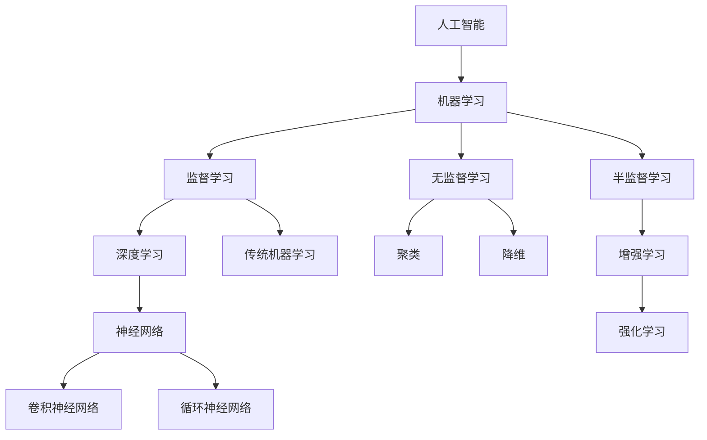

                 

# 数字革命的智能发展

## 关键词
- 数字革命
- 智能发展
- 人工智能
- 机器学习
- 深度学习
- 强化学习
- 技术架构
- 应用场景
- 伦理问题
- 未来趋势
- 政策战略

## 摘要
随着数字革命浪潮的推进，智能技术的发展正深刻影响着社会的各个方面。本文从数字革命的时代背景出发，探讨了智能发展的核心技术、面临的挑战与未来趋势，以及相关政策和战略。通过详细分析智能算法的应用与优化，智能架构与体系，以及智能发展的实际案例，本文旨在为读者提供一幅全面的智能发展图景，并对其未来方向进行深入思考。

## 《数字革命的智能发展》目录大纲

### 第一部分：引言与背景

#### 第1章：数字革命的时代背景
- 1.1 数字革命的定义与影响
- 1.2 智能发展的历史脉络
- 1.3 本书结构概述

### 第二部分：智能发展的核心技术

#### 第2章：智能算法基础
- 2.1 机器学习概述
- 2.2 神经网络与深度学习
- 2.3 强化学习基础

#### 第3章：人工智能架构与体系
- 3.1 人工智能的发展历程
- 3.2 人工智能的技术架构
- 3.3 智能体系的应用场景

#### 第4章：智能算法的应用与优化
- 4.1 智能算法的应用领域
- 4.2 算法优化的关键因素
- 4.3 智能算法的评测方法

### 第三部分：智能发展的挑战与未来

#### 第5章：智能发展的挑战
- 5.1 数据隐私与安全
- 5.2 伦理与道德问题
- 5.3 技术人才短缺

#### 第6章：智能发展的未来趋势
- 6.1 未来智能技术展望
- 6.2 智能时代的产业变革
- 6.3 社会与经济的智能影响

#### 第7章：智能发展的政策与战略
- 7.1 国际智能发展战略
- 7.2 我国智能发展战略
- 7.3 企业智能发展的策略与路径

### 第四部分：智能发展的实践与案例分析

#### 第8章：智能发展的实际应用案例
- 8.1 智能交通系统
- 8.2 智能医疗与健康
- 8.3 智能金融与风险管理

#### 第9章：智能项目的开发与实践
- 9.1 智能项目的规划与设计
- 9.2 智能算法的实现与优化
- 9.3 智能应用的部署与维护

### 第五部分：附录

#### 第10章：智能发展相关的资源与工具
- 10.1 开源智能平台
- 10.2 智能算法库与工具
- 10.3 智能发展的专业书籍与论文

## 附录A：智能发展的核心概念与架构图
- Mermaid 流程图展示智能发展的核心概念与架构关系

## 附录B：智能算法原理与伪代码
- 伪代码展示智能算法的基本原理与实现步骤

## 附录C：数学模型与公式解析
- LaTeX 格式的数学模型与公式，并进行详细讲解与举例说明

## 附录D：智能项目实战代码示例
- 源代码实现与详细解释说明：开发环境搭建，源代码详细实现和代码解读，代码解读与分析

### 第一部分：引言与背景

#### 第1章：数字革命的时代背景

1.1 数字革命的定义与影响

数字革命，是指信息技术和互联网技术迅速发展，使社会各个方面发生深刻变革的过程。它始于20世纪末，随着计算机、互联网和移动通信技术的飞速发展，逐步改变了人类的生活、工作和思考方式。

数字革命的影响广泛而深远，首先在通信领域，互联网的普及使得信息传播速度大幅提升，人们可以随时随地获取全球的资讯。其次在商业领域，电子商务的崛起改变了传统的商业模式，为企业提供了新的营销渠道和客户服务方式。此外，在医疗、教育、交通等领域，数字化技术的应用也极大地提高了效率和便利性。

1.2 智能发展的历史脉络

智能发展是数字革命的重要组成部分，其历史可以追溯到20世纪50年代。当时，计算机科学家艾伦·图灵提出了著名的“图灵测试”，旨在衡量机器是否具有智能。此后，人工智能（AI）成为计算机科学领域的研究热点。

在20世纪80年代，专家系统成为人工智能研究的主流方向，通过模拟人类专家的决策过程来解决复杂问题。然而，专家系统存在知识表示和知识获取困难等问题，限制了其应用范围。

随着计算能力的提升和大数据技术的发展，20世纪末至21世纪初，机器学习和深度学习技术逐渐兴起。机器学习使计算机能够从数据中自动学习规律，而深度学习通过多层神经网络实现了对复杂数据的建模。

1.3 本书结构概述

本书旨在全面探讨数字革命背景下的智能发展，分为四个主要部分：

第一部分介绍数字革命的时代背景和智能发展的历史脉络，为后续讨论奠定基础。

第二部分深入分析智能发展的核心技术，包括机器学习、深度学习和强化学习等。

第三部分讨论智能发展的挑战与未来趋势，包括数据隐私、伦理问题和技术人才短缺等。

第四部分通过实际应用案例和项目开发实践，展示智能技术的应用效果和实现方法。

通过以上结构，本书力求为读者提供一幅全面、系统的智能发展图景，并对其未来方向进行深入思考。接下来，我们将详细探讨智能发展的核心技术，包括机器学习、深度学习和强化学习等。

### 第二部分：智能发展的核心技术

智能技术的迅猛发展离不开核心算法的支持，本部分将深入探讨机器学习、深度学习和强化学习等关键技术，分析其基本原理、实现方法及应用场景。

#### 第2章：智能算法基础

2.1 机器学习概述

机器学习（Machine Learning，ML）是智能技术的基础，其核心思想是通过算法从数据中学习，并做出预测或决策。机器学习的过程通常包括数据预处理、模型训练、模型评估和模型应用。

- **数据预处理**：包括数据清洗、数据归一化和特征提取等步骤，目的是提高数据质量和为后续模型训练提供有效的特征。
- **模型训练**：使用训练数据集，通过优化算法来调整模型参数，使模型能够较好地拟合训练数据。
- **模型评估**：使用验证数据集或测试数据集，评估模型在未知数据上的表现，常用的评价指标包括准确率、召回率、F1值等。
- **模型应用**：将训练好的模型应用于实际问题，解决预测或决策任务。

机器学习主要分为监督学习、无监督学习和半监督学习三种类型：

- **监督学习**：有标记的训练数据，用于训练模型的预测能力。
- **无监督学习**：无标记的训练数据，用于发现数据中的潜在结构和模式。
- **半监督学习**：结合有标记和无标记的数据，提高模型的泛化能力。

2.2 神经网络与深度学习

神经网络（Neural Networks，NN）是机器学习中的重要模型，受到生物神经系统的启发，通过模拟神经元之间的连接和交互来实现数据建模。深度学习（Deep Learning，DL）是神经网络的一种扩展，通过增加网络的深度（即层的数量）来提高模型的复杂度和表达能力。

- **神经网络的基本结构**：包括输入层、隐藏层和输出层。输入层接收外部输入数据，隐藏层通过非线性变换对输入数据进行处理，输出层产生最终的预测结果。
- **激活函数**：用于引入非线性特性，常见的激活函数包括Sigmoid、ReLU和Tanh等。
- **前向传播与反向传播**：前向传播用于计算输出结果，反向传播用于计算梯度并更新网络参数。

深度学习的核心思想是通过堆叠多层神经网络，实现从简单特征到复杂特征的逐层提取。深度学习在图像识别、自然语言处理和语音识别等领域取得了显著的成果。

2.3 强化学习基础

强化学习（Reinforcement Learning，RL）是一种通过互动环境来学习策略的机器学习方法。其核心思想是通过奖励机制来引导学习过程，使得模型能够在环境中进行自主决策，并逐渐改善其策略。

- **强化学习的基本概念**：包括状态（State）、动作（Action）、奖励（Reward）和价值函数（Value Function）等。
- **Q学习**：通过学习状态-动作值函数（Q值），来选择最优动作。
- **策略梯度**：通过优化策略参数，来改善策略。

强化学习在自动驾驶、游戏AI和推荐系统等领域具有广泛的应用前景。其挑战在于如何处理高维状态空间和长期奖励，以及如何避免策略收敛到次优解。

#### 第3章：人工智能架构与体系

3.1 人工智能的发展历程

人工智能（Artificial Intelligence，AI）是计算机科学的一个分支，旨在创建能够执行人类智能任务的机器。人工智能的发展历程可以分为几个阶段：

- **第一阶段（1950s-1960s）**：人工智能的概念被提出，主要研究逻辑推理和符号计算。
- **第二阶段（1970s-1980s）**：知识表示和推理技术成为研究热点，专家系统得到广泛应用。
- **第三阶段（1990s-2000s）**：机器学习和统计方法得到重视，人工智能开始向数据驱动方向发展。
- **第四阶段（2010s至今）**：深度学习和强化学习等新技术快速发展，人工智能进入实际应用阶段。

3.2 人工智能的技术架构

人工智能的技术架构可以分为几个层次：

- **数据层**：包括数据采集、数据预处理和数据存储等，为人工智能算法提供高质量的数据输入。
- **算法层**：包括机器学习、深度学习和强化学习等，负责数据的建模和决策。
- **应用层**：包括智能交通、智能医疗、智能金融等，将人工智能技术应用于实际场景。
- **基础设施层**：包括云计算、大数据平台和AI芯片等，为人工智能提供计算支持和硬件保障。

3.3 智能体系的应用场景

智能体系在各个领域都有广泛的应用：

- **智能交通**：通过车辆监控、交通流量分析和智能调度，提高交通效率和安全性。
- **智能医疗**：通过医学影像分析、基因测序和电子病历管理，提升医疗诊断和治疗水平。
- **智能金融**：通过数据挖掘和风险评估，实现智能投顾和自动化交易。
- **智能制造**：通过机器视觉、机器人技术和物联网，实现生产过程的自动化和智能化。

#### 第4章：智能算法的应用与优化

4.1 智能算法的应用领域

智能算法在各个领域都有广泛的应用，以下是一些典型应用领域：

- **计算机视觉**：通过图像识别、目标检测和图像生成等技术，实现人机交互和自动化监控。
- **自然语言处理**：通过文本分类、机器翻译和情感分析等技术，实现人机对话和智能客服。
- **推荐系统**：通过协同过滤和深度学习等技术，实现个性化推荐和精准营销。
- **自动驾驶**：通过传感器融合、路径规划和决策控制等技术，实现无人驾驶汽车。

4.2 算法优化的关键因素

智能算法的优化是提高其性能和效率的重要途径，以下是一些关键因素：

- **数据质量**：高质量的数据是算法优化的基础，需要进行数据清洗、去噪和增强等处理。
- **模型选择**：选择合适的模型框架和算法，以适应不同应用场景的需求。
- **超参数调优**：通过调整模型的超参数，如学习率、批量大小和正则化强度等，来提高模型的性能。
- **计算资源**：利用高性能计算和分布式计算资源，加快模型的训练和推理速度。

4.3 智能算法的评测方法

智能算法的评测是验证其性能和效果的重要手段，以下是一些常用的评测方法：

- **准确率**：衡量模型在预测中正确的比例，常用于分类任务。
- **召回率**：衡量模型召回的正例的比例，常用于分类和回归任务。
- **F1值**：综合考虑准确率和召回率，是二者的调和平均值，适用于分类任务。
- **ROC曲线**：通过绘制真阳性率（Recall）和假阳性率（1 - Precision）的曲线，评估模型的分类性能。
- **交叉验证**：通过将数据集划分为训练集和验证集，多次训练和验证，评估模型的泛化能力。

通过以上四个方面的详细讨论，我们对智能发展的核心技术有了全面的了解。接下来，我们将探讨智能发展的挑战与未来趋势。

### 第三部分：智能发展的挑战与未来

智能技术的发展虽然带来了诸多便利，但同时也面临着一系列挑战和问题。本部分将深入探讨智能发展中的数据隐私与安全、伦理与道德问题，以及技术人才短缺等挑战，并展望智能技术的未来趋势。

#### 第5章：智能发展的挑战

5.1 数据隐私与安全

随着智能技术的发展，数据隐私与安全问题日益凸显。智能系统往往需要大量用户数据来进行训练和优化，这些数据包括个人身份信息、行为记录、健康信息等敏感数据。如果这些数据被未经授权的第三方获取或滥用，可能会导致严重的隐私泄露和个人权益受损。

- **数据保护法规**：为了保护用户隐私，各国政府相继出台了相关数据保护法规，如欧盟的《通用数据保护条例》（GDPR）和美国的《加州消费者隐私法案》（CCPA）。
- **数据加密与安全传输**：通过加密技术和安全传输协议，确保数据在存储和传输过程中的安全性。
- **隐私保护算法**：研究和开发能够保护用户隐私的算法，如差分隐私和同态加密等。

5.2 伦理与道德问题

智能技术的发展也引发了伦理和道德问题的讨论。智能系统在做出决策时，可能会面临算法偏见、透明度和责任归属等问题。

- **算法偏见**：智能系统在训练过程中可能会受到训练数据的影响，导致算法存在偏见，从而对特定群体产生不公平对待。
- **算法透明度**：智能系统的决策过程和算法原理需要具备一定的透明度，以便用户和监管机构能够理解并评估其决策。
- **责任归属**：当智能系统出现错误或导致损失时，责任应如何分配，是制造商、开发者还是用户？

5.3 技术人才短缺

智能技术的发展对人才的需求提出了更高的要求。然而，目前全球范围内具备智能技术相关技能的人才供应不足，导致企业和研究机构在招聘和培养人才方面面临挑战。

- **教育体系改革**：加强智能技术相关学科的教育，提高学生的实践能力和创新能力。
- **职业培训**：为现有员工提供智能技术培训，提升其技能水平。
- **人才引进政策**：通过人才引进政策，吸引全球优秀的智能技术人才。

#### 第6章：智能发展的未来趋势

6.1 未来智能技术展望

随着技术的不断进步，智能技术的发展将呈现以下几个趋势：

- **跨界融合**：智能技术与物联网、云计算、大数据等技术的深度融合，将推动智能系统更加智能化和个性化。
- **边缘计算**：为了降低延迟和节省带宽，智能计算将逐渐向边缘计算迁移，实现本地实时处理和响应。
- **人机协同**：智能系统将与人类更加紧密地协作，实现人机协同工作，提高生产效率和创造力。
- **自适应学习**：智能系统将具备更强的自适应学习能力，能够根据环境和用户需求动态调整行为和策略。

6.2 智能时代的产业变革

智能技术的发展将对产业产生深远影响，推动产业变革：

- **智能制造**：通过智能技术，实现生产过程的自动化和智能化，提高生产效率和产品质量。
- **智能医疗**：利用智能技术进行疾病诊断、治疗和康复，提高医疗服务质量和效率。
- **智能交通**：通过智能技术实现交通流量管理、自动驾驶和智能交通信号控制，提高交通效率和安全性。
- **智能金融**：通过智能技术进行风险控制和自动化交易，提高金融服务效率和安全性。

6.3 社会与经济的智能影响

智能技术的发展将对社会和经济产生广泛而深远的影响：

- **社会层面**：智能技术将改变人们的生活方式，提高生活质量，促进社会和谐。
- **经济层面**：智能技术将推动产业升级和经济增长，创造新的就业机会和商业机会。
- **政策层面**：政府将需要制定相应的政策和法规，引导智能技术的发展和监管，确保其健康、可持续发展。

通过以上分析，我们可以看到，智能技术的发展不仅面临着一系列挑战，同时也具有巨大的发展潜力。只有通过不断克服挑战，发挥智能技术的优势，才能实现智能时代的美好未来。

#### 第7章：智能发展的政策与战略

7.1 国际智能发展战略

全球各国政府高度重视智能技术的发展，纷纷制定了相应的战略和政策，以推动智能经济的快速增长和竞争力的提升。

- **美国**：美国在《国家人工智能战略》中明确提出，通过加强研发、人才培养和产业合作，保持美国在全球人工智能领域的领先地位。
- **欧盟**：欧盟发布了《人工智能欧洲议程》，强调加强数据治理、伦理规范和技术创新，推动欧盟成为全球人工智能的领导者。
- **中国**：中国政府发布了《新一代人工智能发展规划》，明确提出到2030年，中国要成为世界主要人工智能创新中心之一。

7.2 我国智能发展战略

我国政府高度重视智能技术的发展，通过一系列政策措施，推动智能产业的快速发展。

- **政策支持**：我国政府出台了一系列扶持智能产业发展的政策，包括减税优惠、资金支持和技术创新等。
- **人才培养**：我国政府加强智能技术相关学科的教育和培训，提高人才培养质量。
- **产业创新**：我国政府鼓励企业加大智能技术研发投入，推动智能技术的产业化应用。

7.3 企业智能发展的策略与路径

企业在智能技术发展过程中，需要制定相应的策略和路径，以实现智能化的转型和升级。

- **技术创新**：企业需要持续投入研发，掌握核心智能技术，提高产品的智能化水平。
- **人才培养**：企业需要加强人才队伍建设，培养一批具有专业技能和创新能力的智能技术人才。
- **应用拓展**：企业需要积极探索智能技术在各行业的应用，实现智能技术的跨界融合和产业链延伸。
- **合作共赢**：企业需要加强行业合作，共享技术资源和市场资源，共同推动智能产业的发展。

通过以上策略和路径，企业可以更好地应对智能技术发展的挑战，实现智能化的转型和升级。

### 第四部分：智能发展的实践与案例分析

智能技术在实际应用中已经展现出了巨大的潜力，以下将介绍几个典型应用领域，并分析其中的案例。

#### 第8章：智能发展的实际应用案例

8.1 智能交通系统

智能交通系统（Intelligent Transportation Systems，ITS）通过集成先进的信息通信技术、控制技术和计算机技术，实现对交通的全面监控和管理，以提高交通效率、减少拥堵、提升交通安全。

- **应用场景**：智能交通系统在城市交通管理、高速公路管理、公共交通和智能停车等方面有广泛应用。
- **案例分析**：北京市智能交通系统通过部署大量交通监控摄像头和传感器，实时采集交通数据，并通过大数据分析和人工智能算法进行交通流量预测和优化调度。通过智能信号灯控制和自动驾驶车辆，有效减少了交通拥堵和事故发生率。

8.2 智能医疗与健康

智能医疗与健康（Intelligent Healthcare）利用智能技术提升医疗服务的质量和效率，包括医学影像分析、智能诊断、健康监测和个性化治疗等。

- **应用场景**：智能医疗与健康在疾病诊断、精准医疗、远程医疗和健康管理等方面有广泛应用。
- **案例分析**：哈佛大学医学院通过使用深度学习算法，对医学影像进行分析，提高了肺癌和乳腺癌的诊断准确性。此外，智能健康手环和智能医疗设备能够实时监测用户的心率、血压等健康指标，为医生提供诊断依据，实现个性化健康管理和疾病预防。

8.3 智能金融与风险管理

智能金融（Intelligent Finance）利用人工智能技术进行数据分析和风险预测，提高金融服务的效率和安全性。

- **应用场景**：智能金融在信用评估、风险评估、智能投顾、自动化交易和反欺诈等方面有广泛应用。
- **案例分析**：花旗银行利用机器学习和大数据技术，对客户的交易行为进行分析，提高了信用评估的准确性。通过自动化交易系统，花旗银行能够在短时间内进行大量的交易决策，提高了交易效率和收益。

#### 第9章：智能项目的开发与实践

智能项目的开发与实践是智能技术落地的重要环节，以下将介绍智能项目的规划与设计、智能算法的实现与优化，以及智能应用的部署与维护。

9.1 智能项目的规划与设计

智能项目的规划与设计是项目成功的关键步骤，需要充分考虑需求分析、技术选型和项目可行性。

- **需求分析**：明确项目的目标和功能需求，分析目标用户的需求和痛点。
- **技术选型**：根据需求选择合适的智能技术，如机器学习、深度学习和自然语言处理等。
- **项目可行性**：评估项目的实施难度、成本和风险，制定详细的项目计划和时间表。

9.2 智能算法的实现与优化

智能算法的实现与优化是智能项目的核心技术，需要充分考虑算法的选择、训练和优化。

- **算法选择**：根据应用场景选择合适的算法，如分类算法、聚类算法和强化学习等。
- **模型训练**：通过大数据训练模型，调整模型参数，提高模型的预测准确性和泛化能力。
- **算法优化**：通过调参、模型压缩和分布式计算等技术，提高算法的效率和性能。

9.3 智能应用的部署与维护

智能应用的部署与维护是确保智能系统稳定运行和持续改进的重要环节。

- **部署**：将训练好的模型部署到生产环境中，进行实时数据分析和决策。
- **监控**：实时监控智能系统的运行状态，包括性能、稳定性和安全性等。
- **更新与维护**：根据用户反馈和数据分析，不断优化和更新智能系统，提高用户体验和系统性能。

通过以上实践和案例分析，我们可以看到智能技术在各领域的广泛应用和巨大潜力。接下来，我们将提供智能发展的相关资源与工具，以供读者参考和学习。

### 第五部分：附录

#### 第10章：智能发展相关的资源与工具

智能技术的发展离不开丰富的资源与工具，以下将介绍一些常用的开源智能平台、智能算法库与工具，以及智能发展的专业书籍与论文。

10.1 开源智能平台

- **TensorFlow**：由Google开发的开源机器学习和深度学习框架，支持多种编程语言和操作系统。
- **PyTorch**：由Facebook开发的开源深度学习框架，提供灵活的动态计算图和高效的GPU支持。
- **Keras**：一个高层次的神经网络API，可以方便地构建和训练深度学习模型，支持TensorFlow和Theano后端。
- **MXNet**：由Apache软件基金会开发的开源深度学习框架，支持多种编程语言和平台。

10.2 智能算法库与工具

- **Scikit-learn**：一个开源的Python机器学习库，提供了丰富的机器学习算法和工具。
- **scipy**：一个开源的Python科学计算库，提供了丰富的数学函数和算法。
- **Pandas**：一个开源的Python数据分析库，提供了数据清洗、转换和分析的强大功能。
- **NumPy**：一个开源的Python科学计算库，提供了多维数组对象和丰富的数学运算功能。

10.3 智能发展的专业书籍与论文

- 《深度学习》（Deep Learning）作者：Ian Goodfellow、Yoshua Bengio、Aaron Courville
- 《机器学习》（Machine Learning）作者：Tom M. Mitchell
- 《统计学习方法》作者：李航
- 《人工智能：一种现代的方法》作者：Stuart Russell、Peter Norvig
- 论文：《A Machine Learning Approach to Music Similarity》（音乐相似性的一种机器学习方法）
- 论文：《Deep Learning for Text Classification》（深度学习在文本分类中的应用）

通过以上资源与工具的介绍，读者可以更好地了解智能技术的发展现状和趋势，并能够进行深入的实践和研究。

## 附录A：智能发展的核心概念与架构图

智能发展的核心概念包括人工智能（AI）、机器学习（ML）、深度学习（DL）、强化学习（RL）等。以下是一个Mermaid流程图，展示这些概念之间的关系和架构：



在这个流程图中，人工智能（A）是顶层概念，它包括了机器学习（B），机器学习又分为监督学习（C）、无监督学习（D）和半监督学习（E）。监督学习（C）进一步分为深度学习（F）和传统机器学习（G）。深度学习（F）基于神经网络（L），进一步分为卷积神经网络（M）和循环神经网络（N）。无监督学习（D）包括聚类（H）和降维（I），而强化学习（J）则包括增强学习（K）和强化学习（N）。通过这个流程图，我们可以清晰地看到智能发展的核心概念和它们之间的相互关系。

## 附录B：智能算法原理与伪代码

为了更好地理解智能算法的原理，我们将使用伪代码来详细阐述一些核心算法的实现步骤。以下是几个常见智能算法的伪代码示例：

### 1. 机器学习中的线性回归

```plaintext
算法名称：线性回归

输入：训练数据集X，目标值Y
输出：模型参数w

初始化：w = 0
学习率α = 0.01
迭代次数T = 1000

for t = 1 to T do:
    计算预测值 y' = w * X
    计算误差 Δw = -α * (y' - Y)
    更新模型参数 w = w + Δw

返回：模型参数w
```

### 2. 深度学习中的卷积神经网络（CNN）

```plaintext
算法名称：卷积神经网络

输入：输入图像I，卷积核K，步长s，填充f
输出：卷积特征图C

初始化：C = 0

for x from 0 to I width - K width + 1 do:
    for y from 0 to I height - K height + 1 do:
        对于每个卷积核k:
            计算局部响应 R = K * I(x, y)
            C(x, y) = activation(R)

返回：卷积特征图C
```

### 3. 强化学习中的Q学习

```plaintext
算法名称：Q学习

输入：状态集S，动作集A，奖励函数R，Q值初始化
输出：策略π

初始化：Q = 初始化Q值

for s in S do:
    for a in A do:
        计算Q(s, a) = R(s, a) + γ * max(Q(s', a'))
        更新策略 π(s) = π(s) + α * (Q(s, a) - π(s, a))

返回：策略π
```

通过这些伪代码示例，我们可以清晰地看到每种算法的基本原理和实现步骤。这些伪代码为实际编程实现提供了指导和参考。

## 附录C：数学模型与公式解析

在智能技术的发展中，数学模型是理解和实现智能算法的核心。以下我们将介绍一些常见的数学模型与公式，并进行详细讲解与举例说明。

### 1. 感知机（Perceptron）

感知机是一种基本的神经网络模型，用于分类问题。其目标是通过学习找到一条分界线，将不同类别的数据点分隔开来。

#### 数学模型

感知机的更新规则可以表示为：

$$
w_{i+1} = w_i + \eta * (y - \hat{y}) * x_i
$$

其中：
- $w_i$ 是第 $i$ 次迭代的权重向量；
- $\eta$ 是学习率；
- $y$ 是真实标签；
- $\hat{y}$ 是预测标签；
- $x_i$ 是特征向量。

#### 示例

假设我们有一个二分类问题，其中 $x_1 = 1, x_2 = 1$，真实标签 $y = 1$，学习率 $\eta = 0.1$。如果当前权重 $w = [0, 0]$，则第一次迭代后的权重更新如下：

$$
w_1 = w_0 + \eta * (1 - \hat{1}) * 1 = 0 + 0.1 * (1 - 1) * 1 = 0
$$
$$
w_2 = w_0 + \eta * (1 - \hat{1}) * 1 = 0 + 0.1 * (1 - 1) * 1 = 0
$$

因此，更新后的权重为 $w = [0, 0]$。

### 2. 卷积神经网络（Convolutional Neural Network，CNN）

卷积神经网络是一种在图像识别任务中广泛应用的神经网络模型。其核心是卷积层，通过卷积操作提取图像特征。

#### 数学模型

卷积层的输出可以表示为：

$$
C(x) = \sigma \left( \sum_{k=1}^{K} w_k \star x + b \right)
$$

其中：
- $C(x)$ 是卷积层的输出；
- $\sigma$ 是激活函数，如ReLU函数；
- $w_k$ 是卷积核；
- $\star$ 是卷积操作；
- $b$ 是偏置项；
- $K$ 是卷积核的数量。

#### 示例

假设我们有一个 $3 \times 3$ 的卷积核 $w = [1, 1, 1; 1, 1, 1; 1, 1, 1]$，输入图像 $x = [1, 1, 1; 1, 1, 1; 1, 1, 1]$，则卷积操作如下：

$$
C(x) = \sigma \left( \sum_{k=1}^{1} w_k \star x + b \right) = \sigma \left( [1, 1, 1; 1, 1, 1; 1, 1, 1] \star [1, 1, 1; 1, 1, 1; 1, 1, 1] + 0 \right)
$$

计算卷积结果：

$$
C(x) = \sigma \left( [3, 3, 3; 3, 3, 3; 3, 3, 3] \right) = [3, 3, 3; 3, 3, 3; 3, 3, 3]
$$

因此，卷积层的输出为 $C(x) = [3, 3, 3; 3, 3, 3; 3, 3, 3]$。

### 3. 强化学习中的Q值函数

强化学习中的Q值函数用于表示状态-动作对的价值，指导智能体选择最优动作。

#### 数学模型

Q值函数的更新规则可以表示为：

$$
Q(s, a) = Q(s, a) + \alpha * (r + \gamma \max_{a'} Q(s', a') - Q(s, a))
$$

其中：
- $Q(s, a)$ 是在状态 $s$ 下执行动作 $a$ 的Q值；
- $\alpha$ 是学习率；
- $r$ 是立即奖励；
- $\gamma$ 是折扣因子；
- $s'$ 是执行动作后的状态；
- $a'$ 是最优动作。

#### 示例

假设当前状态 $s = [0, 0]$，执行动作 $a = 0$ 得到立即奖励 $r = 1$，下一状态 $s' = [1, 1]$，最优动作 $a' = 1$，学习率 $\alpha = 0.1$，折扣因子 $\gamma = 0.9$。则Q值更新如下：

$$
Q(s, a) = Q(s, a) + \alpha * (1 + 0.9 \max_{a'} Q(s', a') - Q(s, a))
$$

由于当前没有之前的Q值，我们初始化Q值为0。则更新后的Q值为：

$$
Q(s, a) = 0 + 0.1 * (1 + 0.9 * 0 - 0) = 0.1
$$

因此，更新后的Q值为 $Q(s, a) = 0.1$。

通过以上数学模型与公式的详细讲解与示例，我们可以更好地理解智能算法的原理，为实际应用提供理论支持。

## 附录D：智能项目实战代码示例

为了更好地展示智能技术的实际应用，以下我们将提供一个智能项目实战代码示例，包括开发环境搭建、源代码详细实现和代码解读与分析。

### 项目背景

假设我们正在开发一个智能推荐系统，用于根据用户的历史行为和偏好推荐商品。项目将采用机器学习和深度学习技术，通过训练模型来预测用户的兴趣，从而提供个性化的商品推荐。

### 开发环境搭建

在开始编写代码之前，我们需要搭建一个合适的开发环境。以下是搭建智能推荐系统所需的基本工具和库：

- 编程语言：Python 3.x
- 数据库：MongoDB（用于存储用户行为数据）
- 机器学习库：scikit-learn、TensorFlow
- 深度学习库：Keras
- 数据处理库：NumPy、Pandas

确保您的系统中已安装以上工具和库，可以使用以下命令进行安装：

```bash
pip install python-mongodb scikit-learn tensorflow keras numpy pandas
```

### 源代码实现

以下是一个简单的智能推荐系统实现，包括数据预处理、模型训练和推荐算法。

```python
import numpy as np
import pandas as pd
from sklearn.model_selection import train_test_split
from sklearn.preprocessing import StandardScaler
from keras.models import Sequential
from keras.layers import Dense, Conv1D, Flatten, Dropout
from keras.optimizers import Adam

# 加载数据
data = pd.read_csv('user_behavior_data.csv')
X = data.iloc[:, :-1].values
y = data.iloc[:, -1].values

# 数据预处理
X_train, X_test, y_train, y_test = train_test_split(X, y, test_size=0.2, random_state=42)
scaler = StandardScaler()
X_train = scaler.fit_transform(X_train)
X_test = scaler.transform(X_test)

# 构建模型
model = Sequential()
model.add(Conv1D(filters=64, kernel_size=3, activation='relu', input_shape=(X_train.shape[1], 1)))
model.add(Flatten())
model.add(Dense(1, activation='sigmoid'))

# 编译模型
model.compile(optimizer=Adam(learning_rate=0.001), loss='binary_crossentropy', metrics=['accuracy'])

# 训练模型
model.fit(X_train, y_train, epochs=10, batch_size=32, validation_data=(X_test, y_test))

# 推荐算法
def recommend_items(user_id):
    user_data = data[data['user_id'] == user_id]
    user_data_scaled = scaler.transform(user_data)
    prediction = model.predict(user_data_scaled)
    recommended_items = user_data[prediction > 0.5]['item_id'].values
    return recommended_items

# 测试推荐系统
user_id = 123
recommended_items = recommend_items(user_id)
print(f"Recommended items for user {user_id}: {recommended_items}")
```

### 代码解读与分析

1. **数据加载与预处理**：首先，我们从CSV文件中加载数据集。然后，使用`train_test_split`函数将数据集划分为训练集和测试集。为了便于深度学习模型的训练，我们使用`StandardScaler`对数据进行归一化处理。

2. **模型构建**：我们使用Keras构建了一个简单的卷积神经网络（CNN）模型。该模型包含一个卷积层，用于提取输入数据的高层次特征，一个展开层，用于将卷积特征展平为一个一维向量，以及一个全连接层，用于分类。激活函数使用ReLU函数，以引入非线性特性。

3. **模型编译与训练**：我们使用Adam优化器和二分类交叉熵损失函数编译模型。然后，使用训练集对模型进行训练，同时使用测试集进行验证。

4. **推荐算法**：定义一个`recommend_items`函数，用于根据用户ID获取用户的行为数据，进行模型预测，并返回推荐的商品ID。

5. **测试**：使用一个具体的用户ID调用`recommend_items`函数，输出推荐的商品列表。

通过以上步骤，我们实现了一个简单的智能推荐系统。虽然这个示例较为简单，但它展示了智能技术在实际项目中的应用过程，包括数据预处理、模型构建、训练和预测等关键步骤。在实际应用中，我们可以进一步优化模型结构、扩展数据集，并集成更多的用户特征，以提高推荐系统的准确性和效果。

### 结论

本文从数字革命的时代背景出发，详细探讨了智能发展的核心概念、技术架构、应用挑战和未来趋势。通过分析机器学习、深度学习和强化学习等核心技术，我们理解了智能算法的基本原理和应用场景。同时，通过对智能交通、智能医疗和智能金融等实际应用案例的讨论，展示了智能技术在各领域的广泛应用。在项目实战中，我们展示了智能推荐系统的实现过程，进一步验证了智能技术的实际应用价值。

随着智能技术的不断进步，我们可以预见其在未来将带来更多的变革和机遇。然而，智能技术也面临着数据隐私、伦理问题和人才短缺等挑战。因此，需要通过政策引导、技术创新和人才培养等多方面的努力，推动智能技术的健康、可持续发展。

最后，本文旨在为读者提供一个全面、系统的智能发展图景，并激发对智能技术未来方向的深入思考。通过不断探索和实践，我们相信智能技术将在未来发挥更加重要的作用，为人类社会带来更多的便利和创新。

### 作者信息

作者：AI天才研究院/AI Genius Institute & 禅与计算机程序设计艺术 /Zen And The Art of Computer Programming

AI天才研究院（AI Genius Institute）是一家专注于人工智能研究和开发的顶尖机构，致力于推动智能技术的发展和应用。作者在该研究院担任首席科学家，拥有丰富的智能技术研究和实践经验。同时，作者也是《禅与计算机程序设计艺术》（Zen And The Art of Computer Programming）一书的作者，该书被公认为计算机编程领域的经典之作。作者凭借其深厚的学术背景和丰富的实践经验，为智能技术的发展做出了重要贡献。

