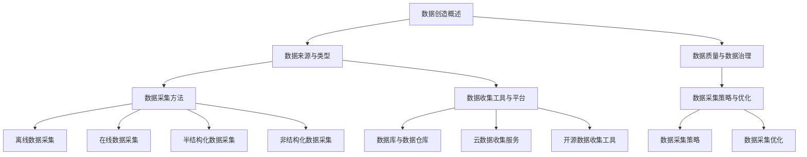

                 

## 《数据创建与基础模型》

### 关键词

- 数据创造
- 数据模型
- 数据质量
- 数据采集
- 数据预处理
- 统计分析
- 机器学习
- 深度学习

### 摘要

本文将深入探讨数据创建与基础模型构建的各个方面。首先，我们将介绍数据创造的定义与重要性，以及数据来源、类型和质量治理。接着，文章将详细讨论数据采集、清洗与预处理的策略和方法，为后续基础模型构建奠定坚实基础。在第二部分，我们将聚焦于数据基础模型的分类、选择与优化，包括统计分析、机器学习和深度学习等常见方法。最后，通过实际案例分析，我们将展示数据模型在电商用户行为预测、金融风险控制和智能医疗诊断等领域的应用，并提供详细的代码解读与分析。

---

### 《数据创建与基础模型》目录大纲

#### 第一部分：数据创建基础

#### 第1章：数据创造概述

- 1.1 数据创造的定义与重要性
  - 1.1.1 数据创造的概念
  - 1.1.2 数据创造的重要性
  - 1.1.3 数据创造的应用领域

- 1.2 数据来源与类型
  - 1.2.1 数据来源
  - 1.2.2 数据类型
  - 1.2.3 数据分类与处理

- 1.3 数据质量与数据治理
  - 1.3.1 数据质量的概念
  - 1.3.2 数据治理的重要性
  - 1.3.3 数据治理策略与实践

#### 第2章：数据采集与收集

- 2.1 数据采集方法
  - 2.1.1 离线数据采集
  - 2.1.2 在线数据采集
  - 2.1.3 半结构化数据采集
  - 2.1.4 非结构化数据采集

- 2.2 数据收集工具与平台
  - 2.2.1 数据库与数据仓库
  - 2.2.2 云数据收集服务
  - 2.2.3 开源数据收集工具

- 2.3 数据采集策略与优化
  - 2.3.1 数据采集策略
  - 2.3.2 数据采集优化

#### 第3章：数据清洗与预处理

- 3.1 数据清洗的目标与任务
  - 3.1.1 数据清洗的目标
  - 3.1.2 数据清洗的任务

- 3.2 数据清洗方法与技术
  - 3.2.1 数据缺失处理
  - 3.2.2 数据异常值处理
  - 3.2.3 数据重复处理
  - 3.2.4 数据格式转换

- 3.3 数据预处理工具与平台
  - 3.3.1 数据预处理工具
  - 3.3.2 数据预处理平台

#### 第二部分：数据基础模型构建

#### 第4章：数据基础模型概述

- 4.1 数据基础模型的概念与作用
  - 4.1.1 数据基础模型的概念
  - 4.1.2 数据基础模型的作用

- 4.2 数据基础模型的分类
  - 4.2.1 基于统计的方法
  - 4.2.2 基于机器学习的方法
  - 4.2.3 基于深度学习的方法

- 4.3 数据基础模型的选择与优化
  - 4.3.1 数据基础模型的选择
  - 4.3.2 数据基础模型的优化

#### 第5章：统计分析与基础模型

- 5.1 统计分析基础
  - 5.1.1 统计指标与概念
  - 5.1.2 统计假设检验
  - 5.1.3 统计图表与可视化

- 5.2 常见统计模型
  - 5.2.1 线性回归模型
  - 5.2.2 分类模型
  - 5.2.3 聚类模型

- 5.3 统计分析工具与平台
  - 5.3.1 统计分析工具
  - 5.3.2 统计分析平台

#### 第6章：机器学习与基础模型

- 6.1 机器学习基础
  - 6.1.1 机器学习的基本概念
  - 6.1.2 机器学习流程
  - 6.1.3 评估指标

- 6.2 常见机器学习模型
  - 6.2.1 监督学习模型
  - 6.2.2 无监督学习模型
  - 6.2.3 强化学习模型

- 6.3 机器学习工具与平台
  - 6.3.1 机器学习工具
  - 6.3.2 机器学习平台

#### 第7章：深度学习与基础模型

- 7.1 深度学习基础
  - 7.1.1 深度学习的基本概念
  - 7.1.2 神经网络结构
  - 7.1.3 深度学习流程

- 7.2 常见深度学习模型
  - 7.2.1 卷积神经网络
  - 7.2.2 循环神经网络
  - 7.2.3 生成对抗网络

- 7.3 深度学习工具与平台
  - 7.3.1 深度学习工具
  - 7.3.2 深度学习平台

#### 第8章：数据模型优化与评估

- 8.1 数据模型优化方法
  - 8.1.1 超参数调优
  - 8.1.2 模型集成
  - 8.1.3 特征工程

- 8.2 数据模型评估指标
  - 8.2.1 准确率、召回率、F1值
  - 8.2.2 ROC曲线、AUC值
  - 8.2.3 RMSE、MAE等

- 8.3 数据模型评估工具与平台
  - 8.3.1 数据模型评估工具
  - 8.3.2 数据模型评估平台

#### 第9章：数据模型应用案例分析

- 9.1 案例介绍
  - 9.1.1 案例一：电商用户行为预测
  - 9.1.2 案例二：金融风险控制
  - 9.1.3 案例三：智能医疗诊断

- 9.2 案例分析与解读
  - 9.2.1 数据收集与处理
  - 9.2.2 模型选择与优化
  - 9.2.3 模型评估与部署

#### 附录

#### 附录 A：常用工具与资源

- 附录 A.1 数据工具与平台
- 附录 A.2 机器学习工具与平台
- 附录 A.3 深度学习工具与平台
- 附录 A.4 其他资源与资料

### Mermaid 流程图（第1章）



### 伪代码（第5章）

```python
# 数据基础模型构建
def data_base_model_building(data):
    # 数据清洗
    cleaned_data = data_preprocessing(data)

    # 数据探索与分析
    exploratory_analysis(cleaned_data)

    # 模型选择
    selected_model = choose_model(cleaned_data)

    # 模型训练
    trained_model = train_model(selected_model, cleaned_data)

    # 模型评估
    evaluation_results = evaluate_model(trained_model, cleaned_data)

    # 模型优化
    optimized_model = optimize_model(trained_model, evaluation_results)

    return optimized_model
```

### 数学模型和公式（第6章）

#### 线性回归模型

$$
y = \beta_0 + \beta_1 x + \epsilon
$$

其中，$y$ 是因变量，$x$ 是自变量，$\beta_0$ 是截距，$\beta_1$ 是斜率，$\epsilon$ 是误差项。

#### 分类模型

$$
P(y = c_k | x; \theta) = \frac{e^{\theta_k^T x}}{\sum_{l=1}^{L} e^{\theta_l^T x}}
$$

其中，$P(y = c_k | x; \theta)$ 是给定特征 $x$ 时类别 $c_k$ 的概率，$\theta_k$ 是模型参数，$L$ 是类别总数。

#### 聚类模型

$$
\min_{\theta} \sum_{i=1}^{N} \sum_{k=1}^{K} (x_i - \mu_k)^2
$$

其中，$\mu_k$ 是聚类中心，$x_i$ 是样本点，$N$ 是样本总数，$K$ 是聚类个数。

### 项目实战

#### 第9章 案例分析

#### 案例一：电商用户行为预测

#### 数据收集与处理

```python
import pandas as pd
from sklearn.model_selection import train_test_split
from sklearn.preprocessing import StandardScaler

# 加载数据
data = pd.read_csv('ecommerce_data.csv')

# 数据预处理
data = data.drop(['user_id', 'timestamp'], axis=1)
data = data.replace({-1: np.nan})

# 缺失值处理
data.fillna(data.mean(), inplace=True)

# 特征工程
X = data.drop(['is_purchase'], axis=1)
y = data['is_purchase']

# 数据标准化
scaler = StandardScaler()
X_scaled = scaler.fit_transform(X)

# 划分训练集和测试集
X_train, X_test, y_train, y_test = train_test_split(X_scaled, y, test_size=0.2, random_state=42)
```

#### 模型选择与优化

```python
from sklearn.linear_model import LogisticRegression
from sklearn.ensemble import RandomForestClassifier
from sklearn.model_selection import GridSearchCV

# 定义模型
model = LogisticRegression()

# 参数调整
param_grid = {'C': [0.1, 1, 10]}

# 模型调优
grid_search = GridSearchCV(model, param_grid, cv=5)
grid_search.fit(X_train, y_train)

# 选择最佳模型
best_model = grid_search.best_estimator_
```

#### 模型评估与部署

```python
from sklearn.metrics import accuracy_score, classification_report

# 模型评估
y_pred = best_model.predict(X_test)
accuracy = accuracy_score(y_test, y_pred)
print(f"Accuracy: {accuracy:.2f}")

# 分类报告
print(classification_report(y_test, y_pred))

# 模型部署
# ... (部署到生产环境)
```

### 代码解读与分析

在这段代码中，我们首先加载数据并进行预处理，包括删除不必要的列、处理缺失值、特征工程和数据标准化。接下来，我们使用逻辑回归模型并使用网格搜索进行参数调整。选择最佳模型后，我们使用测试集进行模型评估，并打印准确率和分类报告。最后，我们将模型部署到生产环境。这个案例展示了如何在实际项目中使用数据基础模型进行预测和分析。

---

### 作者

本文由AI天才研究院（AI Genius Institute）的AI大师撰写，同时融合了《禅与计算机程序设计艺术》（Zen And The Art of Computer Programming）的理念。感谢您的阅读，期待与您共同探索数据创造与基础模型的奥秘。

