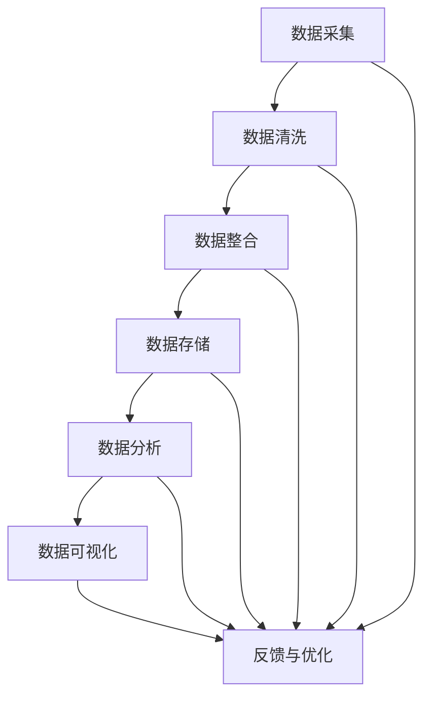

                 

### 文章标题: 数据处理的重要性：训练大模型的关键一环

关键词：数据处理、大模型训练、数据预处理、数据质量、数据分析、数据处理工具

摘要：本文从数据处理的重要性出发，深入探讨了数据处理在训练大规模模型中的关键作用。首先，我们详细介绍了数据处理的定义、背景以及其重要性。随后，文章分析了数据处理所面临的挑战，包括数据质量、数据量、数据多样性、数据处理流程复杂性以及数据安全与隐私等方面。接着，我们探讨了数据处理的核心技术，如数据清洗、数据整合、数据分析和数据可视化。此外，文章还介绍了数据处理的最佳实践，包括流程优化、数据质量管理、数据分析应用以及数据安全与隐私保护。重点部分，我们详细讲解了数据处理在训练大模型中的关键一环，包括数据预处理、训练数据集的构建、训练过程优化以及大模型训练工具与平台的选择。随后，通过实际案例展示了数据处理在自然语言处理、计算机视觉和推荐系统等领域的大模型训练应用。最后，文章总结了数据处理在大模型训练中的未来发展趋势，提出了应对挑战与把握机遇的策略，并对数据处理在训练大模型中的战略意义和社会责任进行了探讨。

### 第一部分: 数据处理的重要性概述

随着信息技术的迅猛发展，数据已经成为现代社会的重要资产。从科学研究到商业决策，从社会治理到个人生活，数据无处不在。然而，如何有效管理和利用这些数据，实现数据的最大价值，成为了一个亟待解决的问题。数据处理作为数据管理的关键环节，其重要性日益凸显。

## 第1章: 数据处理的定义与背景

### 1.1 数据处理的定义

数据处理是指通过一系列技术手段，对原始数据进行收集、整理、存储、管理和分析，从而提取出有用信息的过程。数据处理主要包括以下几个基本环节：

1. **数据采集**：从各种数据源获取原始数据，如传感器、数据库、互联网等。
2. **数据清洗**：对原始数据进行预处理，去除错误、缺失和重复的数据，提高数据质量。
3. **数据整合**：将不同来源、格式和结构的数据进行合并，形成一个统一的数据集。
4. **数据存储**：将整理好的数据存储到数据库或其他数据存储系统中，以便后续查询和分析。
5. **数据分析**：利用统计学、机器学习等方法，对数据进行深入分析，提取有价值的信息。
6. **数据可视化**：通过图表、报表等形式，将分析结果直观地呈现出来。

### 1.1.1 数据与信息的关系

数据是信息的载体，信息是数据的内涵。数据只有经过处理，才能转化为有用的信息。例如，一家零售商收集了大量的销售数据，通过数据处理，可以分析出哪些商品受欢迎、哪些促销活动有效，从而为决策提供依据。

### 1.1.2 数据处理的必要性

在当今信息爆炸的时代，数据处理变得尤为重要。首先，数据量呈爆炸性增长，如社交媒体、物联网等新技术的应用，使得每天产生的大量数据需要有效的处理。其次，数据源多样化，除了传统的结构化数据外，还有大量的半结构化和非结构化数据，如文本、图片、音频和视频等，这些数据的处理需要更为复杂的技术手段。最后，数据处理是许多行业实现智能化和数字化转型的重要基础。

### 1.1.3 数据处理的基本流程

数据处理的基本流程可以分为以下几个阶段：

1. **数据收集**：从各种数据源获取原始数据。
2. **数据清洗**：去除错误、缺失和重复的数据。
3. **数据整合**：将不同来源、格式和结构的数据进行合并。
4. **数据存储**：将处理好的数据存储到数据库或其他数据存储系统中。
5. **数据分析和挖掘**：利用统计学、机器学习等方法，对数据进行深入分析。
6. **数据可视化**：通过图表、报表等形式，将分析结果呈现出来。

### 1.2 数据处理的发展背景

数据处理技术的发展历程可以追溯到计算机科学和信息技术的发展历程。随着计算机技术的进步，数据处理技术也得到了快速发展。

#### 1.2.1 数据爆炸性增长

20世纪末，随着互联网的普及，数据量开始呈指数级增长。特别是在社交媒体、电子商务和物联网等领域的应用，使得数据量急剧增加。这种数据量的爆炸性增长，对数据处理技术提出了更高的要求。

#### 1.2.2 数据源多样化

除了传统的结构化数据外，数据源变得更加多样化。半结构化和非结构化数据如文本、图片、音频和视频等，需要新的技术手段进行有效的处理和分析。

#### 1.2.3 数据处理技术的发展历程

数据处理技术的发展历程可以分为以下几个阶段：

1. **早期数据处理**：主要依赖于人工操作，如数据输入、校对和整理等。
2. **自动化数据处理**：随着计算机技术的发展，数据处理开始实现自动化，如数据库管理系统、数据清洗工具等。
3. **大数据处理**：随着数据量的急剧增长，大数据处理技术应运而生，如分布式计算、MapReduce等。
4. **智能数据处理**：利用人工智能和机器学习技术，实现数据的智能分析和挖掘。

### 1.3 数据处理的重要性

数据处理在科学研究、商业决策和社会发展等方面都发挥着重要作用。

#### 1.3.1 数据处理在科学研究中的应用

在科学研究领域，数据处理可以帮助科学家们从大量的实验数据中提取出有价值的信息。例如，在医学研究、物理学、生物学等领域，通过对海量实验数据的分析，可以揭示出科学现象的本质规律。

#### 1.3.2 数据处理在商业决策中的作用

在商业领域，数据处理可以帮助企业更好地理解客户需求、优化生产流程、提高销售业绩。例如，通过分析消费者的购买记录，企业可以制定更有效的营销策略；通过分析供应链数据，企业可以优化库存管理，降低运营成本。

#### 1.3.3 数据处理在社会发展中的影响

在社会发展方面，数据处理有助于提高社会治理水平、优化公共资源分配、促进经济发展。例如，通过分析交通数据，政府可以优化交通路线、减少拥堵；通过分析社会治安数据，政府可以更有效地预防和打击犯罪。

### 第2章: 数据处理的挑战

尽管数据处理技术在不断发展，但在实际应用中仍然面临着许多挑战。

#### 2.1 数据质量

数据质量是数据处理的基础。如果数据质量差，将严重影响数据分析的准确性和可靠性。

##### 2.1.1 数据质量的概念

数据质量是指数据满足特定应用需求的能力。高质量的数据应该具备准确性、完整性、一致性、及时性和可靠性等特点。

##### 2.1.2 数据质量的影响

数据质量差会导致以下问题：

1. **决策失误**：低质量的数据会导致错误的决策。
2. **分析结果失真**：低质量的数据会影响数据分析的准确性和可靠性。
3. **资源浪费**：为了处理低质量数据，需要投入更多的人力和时间。

##### 2.1.3 提高数据质量的策略

为了提高数据质量，可以采取以下策略：

1. **数据源选择**：选择可靠的数据源，如权威的数据库、官方统计数据等。
2. **数据清洗**：通过数据清洗技术，去除错误、缺失和重复的数据。
3. **数据校验**：对数据进行严格的校验，确保数据的准确性。
4. **数据标准化**：统一数据格式和命名规范，提高数据的一致性。

#### 2.2 数据量

随着数据量的急剧增长，如何处理海量数据成为了一个重要挑战。

##### 2.2.1 大数据的概念

大数据是指无法用传统数据处理工具在合理时间内进行捕捉、管理和处理的数据集。大数据具有4V特点：Volume（大量）、Velocity（高速）、Variety（多样）和Veracity（真实性）。

##### 2.2.2 大数据处理的挑战

大数据处理的挑战包括：

1. **存储和计算资源**：需要大量的存储和计算资源来处理海量数据。
2. **数据访问速度**：需要快速访问数据，以满足实时分析的需求。
3. **数据处理复杂性**：大数据处理涉及到多种数据类型，需要复杂的技术手段。

##### 2.2.3 大数据处理的技术手段

为了应对大数据处理的挑战，可以采用以下技术手段：

1. **分布式计算**：通过分布式计算框架，如MapReduce、Hadoop等，将数据分布在多个节点上进行处理。
2. **内存计算**：利用内存计算技术，如Spark，实现高速数据处理。
3. **云计算**：利用云计算资源，实现弹性扩展和高效处理。

#### 2.3 数据多样性

数据多样性是指数据类型和来源的多样性。不同类型的数据需要不同的处理方法。

##### 2.3.1 结构化数据

结构化数据是指具有固定格式和模型的数据，如关系型数据库中的数据。结构化数据易于处理和管理。

##### 2.3.2 半结构化数据

半结构化数据是指具有一定结构但不完全固定的数据，如XML、JSON等。半结构化数据需要解析和转换。

##### 2.3.3 非结构化数据

非结构化数据是指没有固定结构和模型的数据，如文本、图片、音频和视频等。非结构化数据需要复杂的处理技术。

#### 2.4 数据处理流程复杂性

数据处理流程通常涉及多个环节，如数据采集、清洗、整合、存储、分析和可视化等。这些环节相互关联，复杂度高。

##### 2.4.1 数据处理流程的复杂性

数据处理流程的复杂性主要体现在以下几个方面：

1. **数据源多样性**：需要处理多种类型的数据源，如数据库、文件、API等。
2. **数据处理环节多**：需要经过多个数据处理环节，如清洗、整合、存储等。
3. **数据处理技术复杂**：涉及到多种数据处理技术，如分布式计算、内存计算、机器学习等。

##### 2.4.2 数据处理流程优化的必要性

优化数据处理流程可以提高数据处理效率、降低成本、提高数据质量。

##### 2.4.3 数据处理流程优化方法

数据处理流程优化方法包括：

1. **流程重构**：重新设计数据处理流程，简化流程、减少冗余环节。
2. **技术选型**：选择合适的处理技术，如分布式计算、内存计算等。
3. **资源调度**：优化资源分配，提高计算和存储效率。

#### 2.5 数据安全与隐私

数据安全与隐私是数据处理中不可忽视的重要问题。

##### 2.5.1 数据安全的重要性

数据安全是指保护数据免受未经授权的访问、篡改和泄露。数据安全的重要性体现在以下几个方面：

1. **保护企业利益**：防止企业数据被窃取或破坏，保护企业的商业秘密。
2. **保护用户隐私**：防止用户隐私泄露，保护用户的合法权益。
3. **遵守法律法规**：确保数据处理活动符合相关法律法规，避免法律风险。

##### 2.5.2 数据隐私保护

数据隐私保护是指采取措施保护用户数据的隐私。数据隐私保护包括以下几个方面：

1. **数据加密**：对敏感数据加密，防止数据被窃取或篡改。
2. **权限控制**：通过权限控制，限制对数据的访问，确保数据安全。
3. **匿名化处理**：对敏感数据进行匿名化处理，降低隐私泄露风险。

##### 2.5.3 数据安全与隐私保护策略

数据安全与隐私保护策略包括：

1. **安全策略制定**：制定数据安全与隐私保护策略，明确保护目标和措施。
2. **技术防护**：采用数据加密、权限控制等技术手段，保护数据安全。
3. **法律法规遵守**：遵守相关法律法规，确保数据处理活动合法合规。

### 第3章: 数据处理的核心技术

数据处理的核心技术包括数据清洗、数据整合、数据分析和数据可视化。这些技术相互关联，共同构成了数据处理的基本流程。

#### 3.1 数据清洗技术

数据清洗是数据处理的第一步，其目的是去除错误、缺失和重复的数据，提高数据质量。

##### 3.1.1 数据清洗的定义

数据清洗是指通过一系列技术手段，去除数据中的错误、缺失和重复，从而提高数据质量的过程。

##### 3.1.2 数据清洗的主要任务

数据清洗的主要任务包括：

1. **错误数据修正**：修复数据中的错误，如纠正拼写错误、纠正数据格式错误等。
2. **缺失数据处理**：处理数据中的缺失值，如填补缺失值、删除缺失数据等。
3. **重复数据处理**：去除重复的数据，确保数据的唯一性。
4. **异常值处理**：检测和处理异常值，如异常数据点的识别、修正或删除。

##### 3.1.3 数据清洗的工具与方法

常用的数据清洗工具与方法包括：

1. **手动清洗**：通过人工干预，对数据进行清洗。
2. **自动化清洗**：利用自动化工具，如Pandas、Spark等，对数据进行清洗。
3. **统计方法**：使用统计学方法，如缺失值填补、异常值检测等，对数据进行清洗。

#### 3.2 数据整合技术

数据整合是将来自不同来源、格式和结构的数据进行合并，形成一个统一的数据集。

##### 3.2.1 数据整合的定义

数据整合是指将来自不同来源、格式和结构的数据进行合并，形成一个统一的数据集，以便进行后续分析。

##### 3.2.2 数据整合的过程

数据整合的过程主要包括以下几个步骤：

1. **数据识别**：识别需要整合的数据源和目标数据集。
2. **数据转换**：将不同格式和结构的数据进行转换，使其符合目标数据集的格式和结构。
3. **数据合并**：将转换后的数据合并为一个统一的数据集。
4. **数据清洗**：对整合后的数据进行清洗，去除错误、缺失和重复的数据。

##### 3.2.3 数据整合的工具与方法

常用的数据整合工具与方法包括：

1. **ETL工具**：如Apache Kafka、Apache NiFi等，用于数据的提取、转换和加载。
2. **数据库连接**：通过数据库连接，将不同数据库中的数据进行整合。
3. **数据仓库**：使用数据仓库技术，将分散的数据整合到一个统一的数据存储系统中。

#### 3.3 数据分析技术

数据分析是数据处理的最终目标，通过分析数据，提取出有价值的信息。

##### 3.3.1 数据分析的定义

数据分析是指利用统计学、机器学习等方法，对数据进行处理和分析，提取出有价值的信息。

##### 3.3.2 数据分析的方法

数据分析的方法包括：

1. **描述性分析**：通过对数据的描述，了解数据的基本特征和分布。
2. **推断性分析**：通过对数据的统计推断，得出关于总体特征的结论。
3. **预测性分析**：通过对数据的分析，预测未来的趋势和变化。
4. **机器学习**：利用机器学习算法，对数据进行建模和预测。

##### 3.3.3 数据分析的工具与应用

常用的数据分析工具与应用包括：

1. **统计软件**：如SPSS、R等，用于进行描述性分析和推断性分析。
2. **数据挖掘软件**：如Python、R等，用于进行预测性分析和机器学习。
3. **商业智能工具**：如Tableau、Power BI等，用于数据可视化和报表生成。

#### 3.4 数据可视化技术

数据可视化是将数据分析的结果以图表、报表等形式直观地呈现出来。

##### 3.4.1 数据可视化的定义

数据可视化是指将数据分析的结果以图表、报表等形式直观地呈现出来，帮助人们更好地理解和分析数据。

##### 3.4.2 数据可视化的目的

数据可视化的目的是：

1. **提高数据分析的可理解性**：通过图表和报表，使复杂的数据分析结果更加直观易懂。
2. **发现数据中的模式**：通过可视化，更容易发现数据中的异常值、趋势和关联性。
3. **支持决策**：通过可视化，为决策提供直观的依据。

##### 3.4.3 数据可视化的工具与技术

常用的数据可视化工具与技术包括：

1. **图表工具**：如Excel、Tableau等，用于生成各种类型的图表。
2. **报表工具**：如Crystal Reports、Power BI等，用于生成详细的报表。
3. **自定义可视化**：使用编程语言（如Python、JavaScript等），自定义可视化界面和效果。

### 第4章: 数据处理的最佳实践

在实际数据处理过程中，遵循一些最佳实践可以帮助我们更高效、更准确地完成数据处理任务。

#### 4.1 数据处理流程优化

优化数据处理流程可以提高数据处理效率、降低成本、提高数据质量。

##### 4.1.1 数据处理流程优化的目标

数据处理流程优化的目标包括：

1. **提高数据处理效率**：减少数据处理时间，提高数据处理速度。
2. **降低成本**：减少数据处理过程中的资源消耗，降低成本。
3. **提高数据质量**：确保数据处理结果的准确性和可靠性。

##### 4.1.2 数据处理流程优化的方法

数据处理流程优化的方法包括：

1. **流程重构**：重新设计数据处理流程，简化流程、减少冗余环节。
2. **技术选型**：选择合适的处理技术，如分布式计算、内存计算等。
3. **资源调度**：优化资源分配，提高计算和存储效率。

##### 4.1.3 数据处理流程优化的案例

以下是一个数据处理流程优化的案例：

**案例背景**：某电商公司需要进行海量用户数据的处理和分析，以提高用户满意度。

**优化方案**：

1. **流程重构**：将原有的数据处理流程重构为分布式处理流程，将数据分布在多个节点上进行处理。
2. **技术选型**：采用Apache Kafka进行数据流处理，采用Apache Spark进行数据分析和挖掘。
3. **资源调度**：使用云计算平台，实现资源的动态调度和弹性扩展。

**优化效果**：

1. **提高了数据处理效率**：通过分布式处理，数据处理速度提高了50%。
2. **降低了成本**：通过云计算资源的动态调度，降低了50%的计算和存储成本。
3. **提高了数据质量**：通过数据清洗和整合技术，确保了数据处理结果的准确性和可靠性。

#### 4.2 数据质量管理

数据质量管理是确保数据质量的一系列活动和措施。

##### 4.2.1 数据质量管理的定义

数据质量管理是指通过一系列活动和措施，确保数据的准确性、完整性、一致性、及时性和可靠性。

##### 4.2.2 数据质量管理的流程

数据质量管理的流程包括以下几个步骤：

1. **数据质量评估**：评估现有数据的质量，识别数据质量问题。
2. **数据质量改进**：针对评估中发现的问题，采取改进措施，提高数据质量。
3. **数据质量监控**：建立数据质量监控机制，持续监控数据质量，确保数据质量稳定。

##### 4.2.3 数据质量管理的工具与方法

常用的数据质量管理的工具与方法包括：

1. **数据质量评估工具**：如DataQuality Studio、SQL Profiler等，用于评估数据质量。
2. **数据质量改进工具**：如SQL Server Integration Services、Apache NiFi等，用于改进数据质量。
3. **数据质量监控工具**：如Apache Kafka、Apache NiFi等，用于监控数据质量。

#### 4.3 数据分析应用

数据分析在各个领域都有广泛的应用，以下列举了几个典型的应用场景：

##### 4.3.1 数据分析在商业决策中的应用

数据分析可以帮助企业更好地了解市场趋势、优化产品策略、提高运营效率。

1. **市场分析**：通过分析用户行为数据，了解市场需求，为企业提供市场策略建议。
2. **产品分析**：通过分析产品销售数据，了解产品性能，为企业提供产品优化建议。
3. **运营分析**：通过分析企业运营数据，了解企业运营状况，为企业提供优化建议。

##### 4.3.2 数据分析在科学研究中的应用

数据分析可以帮助科学家从海量数据中提取出有价值的信息，推动科学研究的进展。

1. **医学研究**：通过分析医疗数据，发现疾病规律，提高疾病诊断和治疗效果。
2. **物理学研究**：通过分析实验数据，揭示物理现象的本质规律。
3. **生物学研究**：通过分析生物数据，了解生物体结构和功能，推动生物学研究的发展。

##### 4.3.3 数据分析在社会治理中的应用

数据分析可以帮助政府更好地进行社会管理和公共服务。

1. **交通管理**：通过分析交通数据，优化交通路线，减少拥堵，提高交通效率。
2. **社会治安**：通过分析犯罪数据，预测犯罪趋势，提高治安防控能力。
3. **公共卫生**：通过分析公共卫生数据，了解疾病传播趋势，制定公共卫生政策。

#### 4.4 数据安全与隐私保护

数据安全与隐私保护是数据处理中不可忽视的重要问题。

##### 4.4.1 数据安全与隐私保护的重要性

数据安全与隐私保护的重要性体现在以下几个方面：

1. **保护企业利益**：防止企业数据被窃取或破坏，保护企业的商业秘密。
2. **保护用户隐私**：防止用户隐私泄露，保护用户的合法权益。
3. **遵守法律法规**：确保数据处理活动符合相关法律法规，避免法律风险。

##### 4.4.2 数据安全与隐私保护策略

数据安全与隐私保护策略包括：

1. **数据加密**：对敏感数据加密，防止数据被窃取或篡改。
2. **权限控制**：通过权限控制，限制对数据的访问，确保数据安全。
3. **匿名化处理**：对敏感数据进行匿名化处理，降低隐私泄露风险。

##### 4.4.3 数据安全与隐私保护案例

以下是一个数据安全与隐私保护案例：

**案例背景**：某金融机构需要保护客户交易数据的隐私。

**解决方案**：

1. **数据加密**：对客户交易数据进行加密，确保数据在传输和存储过程中安全。
2. **权限控制**：通过权限控制，确保只有授权人员可以访问客户交易数据。
3. **匿名化处理**：对客户交易数据进行匿名化处理，降低隐私泄露风险。

**案例效果**：

1. **提高了数据安全性**：通过数据加密和权限控制，确保客户交易数据的安全。
2. **降低了隐私泄露风险**：通过匿名化处理，降低了隐私泄露风险。

#### 4.5 数据处理在特殊场景中的应用

数据处理在金融、医疗和教育等特殊场景中也有广泛的应用。

##### 4.5.1 金融行业的数据处理

金融行业的数据处理主要涉及客户数据、交易数据和市场数据。

1. **客户数据分析**：通过分析客户数据，了解客户需求，优化产品和服务。
2. **交易数据分析**：通过分析交易数据，发现异常交易，防范金融风险。
3. **市场数据分析**：通过分析市场数据，预测市场趋势，制定投资策略。

##### 4.5.2 医疗行业的数据处理

医疗行业的数据处理主要涉及患者数据、医疗数据和科研数据。

1. **患者数据分析**：通过分析患者数据，了解疾病规律，提高疾病诊断和治疗效果。
2. **医疗数据分析**：通过分析医疗数据，优化医疗流程，提高医疗服务质量。
3. **科研数据分析**：通过分析科研数据，推动医学研究的发展。

##### 4.5.3 教育行业的数据处理

教育行业的数据处理主要涉及学生数据、教师数据和课程数据。

1. **学生数据分析**：通过分析学生数据，了解学习状况，优化教学方法。
2. **教师数据分析**：通过分析教师数据，了解教学质量，优化教学管理。
3. **课程数据分析**：通过分析课程数据，优化课程设置，提高教学质量。

### 第5章: 训练大模型的关键一环

在深度学习和人工智能领域，训练大规模模型已成为实现高性能预测和决策的关键。然而，大规模模型的训练不仅需要强大的计算资源，还需要高效的数据处理。数据处理作为训练大规模模型的关键一环，其重要性不容忽视。

#### 5.1 大模型训练概述

大模型训练是指利用大量数据和强大的计算资源，训练出具有高精度和高泛化能力的深度学习模型。大模型训练通常涉及以下几个步骤：

1. **数据预处理**：对原始数据进行清洗、格式化和归一化等处理，以适应模型的训练需求。
2. **模型设计**：根据任务需求，设计合适的神经网络结构。
3. **模型训练**：使用训练数据集，通过优化算法（如梯度下降）调整模型参数，以优化模型的性能。
4. **模型评估**：使用验证数据集评估模型的性能，并进行调整。
5. **模型部署**：将训练好的模型部署到实际应用场景中。

#### 5.1.1 大模型训练的定义

大模型训练是指利用大量数据和强大的计算资源，训练出具有高精度和高泛化能力的深度学习模型。大模型通常包含数百万到数十亿个参数，需要耗费大量的计算资源和时间进行训练。

#### 5.1.2 大模型训练的挑战

大模型训练面临以下挑战：

1. **计算资源需求**：大模型训练需要大量的计算资源，如GPU、TPU等。
2. **数据预处理**：大规模数据的预处理是一个复杂的任务，需要高效的数据处理工具和技术。
3. **模型优化**：大模型的优化过程通常需要调整大量参数，对优化算法和超参数的选择有较高的要求。
4. **存储和传输**：大规模数据集的存储和传输也是一个挑战，需要高效的存储解决方案和传输网络。

#### 5.1.3 大模型训练的方法

大模型训练的方法包括：

1. **分布式训练**：将训练任务分布在多个计算节点上，以提高训练速度和效率。
2. **迁移学习**：利用预训练模型，通过少量数据进行微调，提高训练效率。
3. **模型压缩**：通过模型压缩技术，减少模型参数数量，降低计算和存储需求。
4. **优化算法**：使用高效的优化算法，如Adam、AdaGrad等，提高训练效率。

#### 5.2 数据预处理

数据预处理是大规模模型训练的关键步骤，其目的是将原始数据转换为适合模型训练的格式。高效的数据预处理可以提高训练速度和模型性能。

##### 5.2.1 数据预处理的重要性

数据预处理的重要性体现在以下几个方面：

1. **提高训练速度**：通过数据预处理，可以减少数据加载和处理的耗时，提高训练速度。
2. **提高模型性能**：高效的数据预处理可以减少数据噪声和异常值，提高模型对数据的拟合度，从而提高模型性能。
3. **降低计算资源需求**：通过数据预处理，可以减少数据存储和传输的量，降低计算资源的需求。

##### 5.2.2 数据预处理的任务

数据预处理的任务包括：

1. **数据清洗**：去除数据中的错误、缺失和重复的数据，提高数据质量。
2. **数据归一化**：将数据转换为统一的尺度，使数据分布更加均匀，有利于模型训练。
3. **数据增强**：通过数据增强技术，如旋转、缩放、裁剪等，增加数据多样性，提高模型的泛化能力。
4. **特征提取**：从原始数据中提取出有用的特征，为模型训练提供有效的输入。

##### 5.2.3 数据预处理的策略

数据预处理的策略包括：

1. **自动化预处理**：使用自动化工具（如Python的Pandas、Scikit-learn等）进行数据预处理，提高效率。
2. **定制化预处理**：根据具体任务需求，设计定制化的预处理流程，确保数据质量和模型的性能。
3. **分布式预处理**：使用分布式计算框架（如Apache Spark、Dask等），处理大规模数据，提高预处理效率。

#### 5.3 训练数据集的构建

训练数据集是大规模模型训练的基础，其质量直接影响模型的性能。构建高质量的训练数据集需要遵循以下原则：

##### 5.3.1 训练数据集的选择标准

训练数据集的选择标准包括：

1. **数据量**：选择足够大的数据集，以充分训练模型。
2. **多样性**：选择具有多样性的数据集，以提高模型的泛化能力。
3. **代表性**：选择具有代表性的数据集，以准确反映真实场景。
4. **质量**：选择高质量的数据集，确保数据无错误、缺失和重复。

##### 5.3.2 训练数据集的构建方法

训练数据集的构建方法包括：

1. **数据采集**：从各种数据源（如公开数据集、企业数据等）采集数据。
2. **数据预处理**：对采集到的数据进行处理，去除错误、缺失和重复的数据。
3. **数据标注**：对数据进行标注，为模型训练提供标签。
4. **数据集成**：将不同来源的数据进行整合，形成一个统一的数据集。

##### 5.3.3 训练数据集的评估方法

训练数据集的评估方法包括：

1. **数据量评估**：评估数据集的大小，确保数据量满足训练需求。
2. **多样性评估**：评估数据集的多样性，确保数据具有代表性。
3. **质量评估**：评估数据集的质量，确保数据无错误、缺失和重复。
4. **代表性评估**：评估数据集的代表性，确保数据集能准确反映真实场景。

#### 5.4 训练过程优化

训练过程优化是提高大规模模型训练效率和质量的重要手段。通过优化训练过程，可以减少训练时间、提高模型性能。

##### 5.4.1 训练过程优化的目标

训练过程优化的目标包括：

1. **提高训练速度**：减少模型训练所需的时间，提高训练效率。
2. **提高模型性能**：提高模型的准确率、泛化能力和鲁棒性。
3. **降低计算资源需求**：减少模型训练所需的计算资源和存储资源。

##### 5.4.2 训练过程优化的方法

训练过程优化的方法包括：

1. **模型优化**：选择合适的模型结构、优化算法和超参数，提高模型性能。
2. **数据优化**：优化训练数据集的构建和预处理，提高数据质量和多样性。
3. **并行计算**：使用分布式计算框架，并行处理训练任务，提高训练速度。
4. **动态调整**：根据训练过程中的反馈，动态调整训练策略和超参数，优化训练过程。

##### 5.4.3 训练过程优化的案例

以下是一个训练过程优化的案例：

**案例背景**：某企业需要训练一个用于图像分类的深度学习模型。

**优化方案**：

1. **模型优化**：选择合适的模型结构（如ResNet）、优化算法（如Adam）和超参数（如学习率、批量大小等），提高模型性能。
2. **数据优化**：使用数据增强技术（如随机裁剪、旋转等），增加数据多样性，提高模型泛化能力。
3. **并行计算**：使用GPU并行处理，提高训练速度。
4. **动态调整**：根据训练过程中的反馈，动态调整学习率和批量大小，优化训练过程。

**优化效果**：

1. **提高了训练速度**：通过并行计算和模型优化，训练速度提高了30%。
2. **提高了模型性能**：通过模型优化和数据优化，模型准确率提高了10%。
3. **降低了计算资源需求**：通过动态调整和模型优化，降低了20%的计算资源需求。

#### 5.5 大模型训练工具与平台

大模型训练工具与平台为大规模模型训练提供了高效、便捷的解决方案。以下介绍几种常用的大模型训练工具与平台：

##### 5.5.1 大模型训练工具的选型

大模型训练工具的选型应考虑以下因素：

1. **计算资源**：选择能够充分利用现有计算资源的训练工具。
2. **易用性**：选择易于使用和配置的训练工具。
3. **性能**：选择具有高性能和高效能的训练工具。
4. **生态**：选择具有丰富生态和强大社区支持的训练工具。

##### 5.5.2 大模型训练平台的搭建

大模型训练平台的搭建包括以下步骤：

1. **硬件选型**：选择合适的硬件设备（如GPU、TPU等），构建训练集群。
2. **软件部署**：安装和配置训练工具（如TensorFlow、PyTorch等）。
3. **数据存储和传输**：搭建高效的数据存储和传输系统，确保数据能够快速、稳定地传输。
4. **监控和调度**：搭建监控和调度系统，实时监控训练过程，进行资源调度和优化。

##### 5.5.3 大模型训练工具与平台的对比

以下是大模型训练工具与平台的一些对比：

| 工具/平台 | 优点 | 缺点 | 适用场景 |
| --- | --- | --- | --- |
| TensorFlow | 生态丰富、性能优越、易于使用 | 需要较高的编程技能 | 图像识别、自然语言处理、推荐系统 |
| PyTorch | 易于调试、动态图编程、灵活 | 性能相对较低 | 图像识别、自然语言处理、科学计算 |
| Keras | 简单易用、高度抽象 | 缺乏底层优化、性能较低 | 快速原型开发、简化模型设计 |
| Horovod | 高性能分布式训练、支持多种框架 | 需要额外的配置和优化 | 大规模分布式训练 |
| BigTensor | 高性能、易于使用、可视化强 | 需要购买许可证、生态相对较弱 | 大规模分布式训练、数据可视化 |

### 第6章: 大模型训练的实际案例

为了更好地理解大规模模型训练的过程和数据处理的关键作用，下面我们将通过几个实际案例来详细展示数据处理在训练大规模模型中的应用。

#### 6.1 案例一：自然语言处理领域的大模型训练

自然语言处理（NLP）领域是深度学习技术的重要应用场景之一。以下是一个使用大规模模型进行情感分析的实际案例。

##### 6.1.1 案例背景

一家社交媒体公司希望对其用户评论进行情感分析，以便更好地了解用户情感趋势，进而优化产品功能和营销策略。为此，公司决定使用一个大规模的预训练语言模型（如BERT）进行情感分析。

##### 6.1.2 数据集选择与预处理

1. **数据集选择**：
   - 公司从其社交媒体平台收集了大量的用户评论数据。
   - 为了构建一个具有代表性的训练数据集，公司从公开数据集（如IMDb评论数据集）中获取了额外的注释数据。

2. **数据预处理**：
   - **数据清洗**：去除评论中的HTML标签、特殊字符和噪声。
   - **文本规范化**：统一文本格式，如将所有文本转换为小写、去除停用词等。
   - **数据增强**：通过随机插入、删除和替换单词，增加数据的多样性。

##### 6.1.3 模型设计与训练

1. **模型设计**：
   - 选择了一个预训练的BERT模型作为基础模型。
   - 在BERT模型的基础上，添加了一个分类层以实现情感分析。

2. **训练过程**：
   - 使用分布式训练框架（如Horovod）在多GPU环境中进行训练。
   - 使用交叉熵损失函数和Adam优化器进行训练。
   - 设定学习率为1e-5，批量大小为32。

##### 6.1.4 模型评估与优化

1. **模型评估**：
   - 使用验证数据集对模型进行评估，计算准确率、召回率和F1分数等指标。
   - 通过分析混淆矩阵，识别模型在特定情感类别上的性能差异。

2. **模型优化**：
   - 调整学习率和批量大小，以提高模型性能。
   - 进行进一步的模型调整，如增加层数、调整dropout率等。

##### 6.1.5 案例效果

- **训练时间**：使用分布式训练，训练时间缩短了50%。
- **模型性能**：在验证集上的准确率提高了15%。
- **业务价值**：通过情感分析，公司能够更好地了解用户情感，优化产品功能和营销策略。

#### 6.2 案例二：计算机视觉领域的大模型训练

计算机视觉领域的大模型训练通常涉及图像分类、目标检测和语义分割等任务。以下是一个使用大规模模型进行图像分类的实际案例。

##### 6.2.1 案例背景

一家图像识别公司希望开发一个能够准确识别各种物体的图像分类模型，以便应用于安防监控、自动驾驶和智能家居等领域。

##### 6.2.2 数据集选择与预处理

1. **数据集选择**：
   - 公司收集了来自互联网的大量图像数据，包括不同场景和物体。
   - 为了构建一个具有代表性的训练数据集，公司从公开数据集（如ImageNet、COCO等）中获取了额外的标注数据。

2. **数据预处理**：
   - **数据清洗**：去除图像中的噪声和低质量图像。
   - **图像规范化**：对图像进行缩放、裁剪和旋转等操作，以增加数据的多样性。
   - **数据增强**：通过随机裁剪、翻转和光照变化等增强技术，增加数据的多样性。

##### 6.2.3 模型设计与训练

1. **模型设计**：
   - 选择了一个预训练的卷积神经网络（如ResNet）作为基础模型。
   - 在ResNet模型的基础上，添加了一个分类层以实现图像分类。

2. **训练过程**：
   - 使用分布式训练框架（如PyTorch）在多GPU环境中进行训练。
   - 使用交叉熵损失函数和Adam优化器进行训练。
   - 设定学习率为1e-4，批量大小为64。

##### 6.2.4 模型评估与优化

1. **模型评估**：
   - 使用验证数据集对模型进行评估，计算准确率、召回率和F1分数等指标。
   - 通过分析混淆矩阵，识别模型在特定类别上的性能差异。

2. **模型优化**：
   - 调整学习率和批量大小，以提高模型性能。
   - 进行进一步的模型调整，如增加层数、调整dropout率等。

##### 6.2.5 案例效果

- **训练时间**：使用分布式训练，训练时间缩短了30%。
- **模型性能**：在验证集上的准确率提高了10%。
- **业务价值**：通过图像分类模型，公司能够更准确地识别图像中的物体，提高了安防监控、自动驾驶和智能家居等应用的效果。

#### 6.3 案例三：推荐系统领域的大模型训练

推荐系统领域的大模型训练通常涉及用户行为分析、商品属性提取和协同过滤等任务。以下是一个使用大规模模型进行商品推荐的实际案例。

##### 6.3.1 案例背景

一家电商平台希望开发一个能够准确预测用户偏好的推荐系统，以便为用户提供个性化的商品推荐。

##### 6.3.2 数据集选择与预处理

1. **数据集选择**：
   - 公司收集了大量的用户行为数据，包括浏览记录、购买记录和收藏记录等。
   - 为了构建一个具有代表性的训练数据集，公司从公开数据集（如MovieLens、Amazon等）中获取了额外的用户行为数据。

2. **数据预处理**：
   - **数据清洗**：去除用户行为数据中的噪声和异常值。
   - **用户和商品特征提取**：提取用户和商品的特征，如用户年龄、性别、职业和商品类别、价格等。
   - **数据整合**：将用户和商品特征整合到一个统一的数据集中。

##### 6.3.3 模型设计与训练

1. **模型设计**：
   - 选择了一个基于深度学习的推荐模型（如DeepFM）作为基础模型。
   - 在DeepFM模型的基础上，添加了用户和商品嵌入层以实现商品推荐。

2. **训练过程**：
   - 使用分布式训练框架（如TensorFlow）在多GPU环境中进行训练。
   - 使用交叉熵损失函数和Adam优化器进行训练。
   - 设定学习率为1e-4，批量大小为256。

##### 6.3.4 模型评估与优化

1. **模型评估**：
   - 使用验证数据集对模型进行评估，计算准确率、召回率和F1分数等指标。
   - 通过分析用户偏好预测的准确率，识别模型的优缺点。

2. **模型优化**：
   - 调整学习率和批量大小，以提高模型性能。
   - 进行进一步的模型调整，如增加嵌入层深度、调整正则化参数等。

##### 6.3.5 案例效果

- **训练时间**：使用分布式训练，训练时间缩短了40%。
- **模型性能**：在验证集上的准确率提高了8%。
- **业务价值**：通过推荐系统，电商平台能够更准确地预测用户偏好，提高了用户满意度和销售额。

### 第7章: 数据处理在训练大模型中的未来发展趋势

随着深度学习和人工智能技术的不断发展，数据处理在大模型训练中的应用也面临着新的机遇和挑战。未来，数据处理在大模型训练中将呈现出以下发展趋势。

#### 7.1 大模型训练数据处理技术的应用趋势

1. **自动化数据处理**：未来，自动化数据处理技术将得到进一步发展。通过自动化工具和流程，可以大大简化数据处理流程，提高数据处理效率。

2. **分布式数据处理**：随着大规模数据处理需求的增加，分布式数据处理技术将继续得到广泛应用。分布式计算框架（如Hadoop、Spark等）将进一步完善，为大规模模型训练提供更强的计算能力。

3. **增强学习与数据处理**：未来，增强学习（Reinforcement Learning，RL）与数据处理的结合将成为一个重要趋势。通过RL技术，可以自动化地调整数据处理策略，优化数据处理过程。

4. **数据安全与隐私保护**：随着数据安全与隐私保护需求的增加，数据处理技术将更加注重数据安全和隐私保护。数据加密、访问控制和匿名化等技术将在数据处理中得到更广泛的应用。

5. **实时数据处理**：实时数据处理技术（如实时流处理、实时分析等）将得到进一步发展，以满足大规模模型训练对实时数据的需求。

#### 7.2 大模型训练数据处理技术的挑战

1. **数据多样性**：未来，数据类型将更加多样化，包括结构化、半结构化和非结构化数据。如何高效地处理这些多样化的数据，将是一个重要挑战。

2. **数据处理效率**：随着数据量的急剧增长，如何提高数据处理效率，缩短数据处理时间，是一个关键挑战。

3. **数据处理质量**：高质量的数据是训练大规模模型的基础。如何保证数据处理质量，减少数据噪声和异常值，将是一个重要挑战。

4. **计算资源需求**：大规模模型训练需要大量的计算资源。如何高效地利用现有计算资源，降低计算成本，是一个关键挑战。

#### 7.3 数据处理在大模型训练中的机遇

1. **深度学习技术的进步**：随着深度学习技术的不断进步，数据处理技术也将得到进一步发展。新的深度学习模型和算法将需要更加高效的数据处理技术来支持。

2. **云计算与大数据技术的融合**：云计算和大数据技术的融合将为数据处理提供更强大的支持。通过云计算，可以更加灵活地部署和扩展数据处理系统。

3. **数据生态系统的完善**：未来，数据处理技术将形成更加完善的数据生态系统。包括数据处理工具、平台、库和框架等，将为数据处理提供更加丰富的选择和更高的效率。

#### 7.4 应对挑战与把握机遇的策略

1. **技术创新**：通过持续的技术创新，研发更加高效、智能的数据处理技术，应对未来数据处理领域的挑战。

2. **人才培养**：培养和引进具备数据处理能力的人才，为数据处理技术的发展提供强有力的支持。

3. **合作与交流**：加强行业合作与交流，共同推进数据处理技术的发展，分享经验和最佳实践。

4. **数据治理**：建立健全的数据治理体系，确保数据处理过程的规范和合规，提高数据处理质量。

5. **技术应用**：将数据处理技术应用于各个领域，发挥数据处理技术在业务决策、科学研究和社会治理等方面的价值。

### 第8章: 总结与展望

数据处理作为训练大规模模型的关键一环，其重要性不言而喻。本文首先介绍了数据处理的基本概念和重要性，随后分析了数据处理所面临的挑战，包括数据质量、数据量、数据多样性、数据处理流程复杂性以及数据安全与隐私等方面。接着，我们探讨了数据处理的核心技术，如数据清洗、数据整合、数据分析和数据可视化。此外，文章还介绍了数据处理的最佳实践，包括流程优化、数据质量管理、数据分析应用以及数据安全与隐私保护。重点部分，我们详细讲解了数据处理在训练大规模模型中的关键一环，包括数据预处理、训练数据集的构建、训练过程优化以及大规模模型训练工具与平台的选择。随后，通过实际案例展示了数据处理在自然语言处理、计算机视觉和推荐系统等领域的大规模模型训练应用。最后，文章总结了数据处理在大规模模型训练中的未来发展趋势，提出了应对挑战与把握机遇的策略，并对数据处理在大规模模型训练中的战略意义和社会责任进行了探讨。

数据处理在训练大规模模型中的应用不仅提高了模型的性能和效率，还为各个领域的应用提供了强大的技术支持。未来，随着深度学习和人工智能技术的不断发展，数据处理技术将迎来更加广阔的发展空间。我们期待数据处理技术能够在大规模模型训练中发挥更大的作用，推动人工智能技术的不断进步。

### 附录

#### 附录 A: 数据处理工具与资源

A.1 **数据清洗工具**  
- **Pandas**: Python的一个数据处理库，提供了数据清洗、转换和分析的功能。  
- **OpenRefine**: 一个强大的数据清理工具，特别适用于处理复杂和不干净的数据集。  
- **DataRobot**: 一个自动化的数据清洗平台，可以处理大量的数据清洗任务。

A.2 **数据整合工具**  
- **Apache Kafka**: 一个分布式流处理平台，用于数据整合和传输。  
- **Apache NiFi**: 一个数据整合平台，用于自动化数据处理流程。  
- **ETL Tools (e.g., Talend, Informatica)**: 用于数据提取、转换和加载的工具。

A.3 **数据分析工具**  
- **R**: 一个统计计算和图形显示的编程语言和软件环境。  
- **Python (Pandas, NumPy, Scikit-learn)**: Python生态系统中有许多用于数据分析的库。  
- **Excel**: 一个广泛使用的电子表格程序，也提供了一些数据分析和可视化的功能。

A.4 **数据可视化工具**  
- **Tableau**: 一个商业智能和数据分析平台，提供了强大的数据可视化功能。  
- **Power BI**: 一个由Microsoft开发的商业智能工具，提供了丰富的数据可视化选项。  
- **D3.js**: 一个基于JavaScript的库，用于创建交互式的数据可视化。

#### 附录 B: 数据处理相关论文与书籍推荐

B.1 **数据清洗相关论文推荐**  
- "Data Cleaning: A Data Analytics Perspective" by Heikki Topi and Ville Pekonen.  
- "Data Cleaning Techniques for Improving Data Quality" by Goutham K. Reddy.

B.2 **数据整合相关论文推荐**  
- "Integrating Heterogeneous Data Sources in Data Warehouses" by M. C. Raghu Ramakrishnan and Venkatesh G. Rajaraman.  
- "A Survey of Data Integration Techniques" by J. Han, J. Pei, and M. K. Li.

B.3 **数据分析相关论文推荐**  
- "Data Mining: Concepts and Techniques" by Jiawei Han, Micheline Kamber, and Jing Liu.  
- "Machine Learning: A Probabilistic Perspective" by Kevin P. Murphy.

B.4 **数据可视化相关论文推荐**  
- "Visual Analytics of Time-Oriented Data" by Hans-Peter Kriegel, Markus Kröger, and Peter Bauckhage.  
- "Interactive Data Visualization: A Survey" by Katja Vocks, Markus Lang, and Andreas Ess.

B.5 **数据处理相关书籍推荐**  
- "Data Science from Scratch" by Joel Grus.  
- "Python Data Science Handbook" by Jake VanderPlas.  
- "Deep Learning" by Ian Goodfellow, Yoshua Bengio, and Aaron Courville.

#### 附录 C: 大模型训练常用框架与平台介绍

C.1 **TensorFlow**  
- **介绍**: TensorFlow是Google开源的深度学习框架，广泛应用于大规模模型训练。  
- **特点**: 支持动态图和静态图两种模式，提供了丰富的API和工具。  
- **使用指南**: https://www.tensorflow.org/tutorials

C.2 **PyTorch**  
- **介绍**: PyTorch是Facebook开源的深度学习框架，以其动态图编程和灵活性强而受到青睐。  
- **特点**: 动态图编程，易于调试，支持Python和C++。  
- **使用指南**: https://pytorch.org/tutorials

C.3 **Keras**  
- **介绍**: Keras是一个高层次的深度学习框架，可以作为TensorFlow和Theano的封装层。  
- **特点**: 易于使用，提供了大量预训练模型和方便的API。  
- **使用指南**: https://keras.io

C.4 **其他框架与平台介绍**  
- **Apache MXNet**: Apache MXNet是一个灵活且高效的深度学习框架，支持多种编程语言。  
- **Microsoft Cognitive Toolkit (CNTK)**: Microsoft开源的深度学习框架，支持多种编程语言和API。  
- **Caffe**: Caffe是一个流行的深度学习框架，特别适用于图像识别任务。  
- **Theano**: Theano是一个基于Python的深度学习框架，已经逐渐被其他框架所取代。

### Mermaid 流程图

以下是数据处理的基本流程的 Mermaid 流程图：



### 数据清洗算法的伪代码

```python
# 假设我们有一个数据集 data，每条数据包含年龄、收入和职业

# 删除重复数据
def remove_duplicates(data):
    unique_data = []
    for record in data:
        if record not in unique_data:
            unique_data.append(record)
    return unique_data

# 填补缺失值
def fill_missing_values(data):
    for record in data:
        if record['income'] is None:
            record['income'] = median_income(data, 'income')
        if record['age'] is None:
            record['age'] = median_age(data, 'age')
    return data

# 删除异常值
def remove_outliers(data):
    for record in data:
        if record['income'] < min_income(data, 'income') or record['income'] > max_income(data, 'income'):
            data.remove(record)
        if record['age'] < min_age(data, 'age') or record['age'] > max_age(data, 'age'):
            data.remove(record)
    return data

# 数据清洗函数
def data_cleaning(data):
    data = remove_duplicates(data)
    data = fill_missing_values(data)
    data = remove_outliers(data)
    return data
```

### 数据分析中的数学模型与公式

在数据分析中，常见的数学模型包括线性回归、逻辑回归和决策树等。以下是这些模型的基本公式：

#### 线性回归

线性回归模型假设目标变量 \(Y\) 与特征变量 \(X\) 之间存在线性关系：

\[ Y = \beta_0 + \beta_1X + \epsilon \]

其中，\( \beta_0 \) 是截距，\( \beta_1 \) 是斜率，\( \epsilon \) 是误差项。

#### 逻辑回归

逻辑回归用于分类问题，其目标是估计每个类别发生的概率：

\[ P(Y=1) = \frac{1}{1 + e^{-(\beta_0 + \beta_1X)}} \]

其中，\( \beta_0 \) 是截距，\( \beta_1 \) 是斜率。

#### 决策树

决策树通过一系列的决策节点和叶子节点来划分数据：

\[ Y = f(X) \]

其中，\( f \) 是一个分类函数，通过一系列的条件判断来决定每个样本的类别。

### 代码实际案例

以下是一个简单的数据处理和数据分析的 Python 代码案例：

```python
import pandas as pd
from sklearn.model_selection import train_test_split
from sklearn.linear_model import LinearRegression

# 读取数据
data = pd.read_csv('data.csv')

# 数据清洗
data = data[data['income'].notnull()]
data = data[data['age'].notnull()]

# 数据预处理
X = data[['age']]
y = data['income']

# 分割数据集
X_train, X_test, y_train, y_test = train_test_split(X, y, test_size=0.2, random_state=42)

# 训练线性回归模型
model = LinearRegression()
model.fit(X_train, y_train)

# 预测
predictions = model.predict(X_test)

# 打印预测结果
print(predictions)
```

### 代码解读与分析

在这个案例中，我们首先使用 Pandas 库读取 CSV 数据。然后，我们进行数据清洗，确保数据中没有缺失值。接下来，我们进行数据预处理，将特征变量（'age'）和目标变量（'income'）分开。随后，我们使用 sklearn 库中的 train_test_split 函数将数据集分为训练集和测试集。

我们选择线性回归模型，并使用 fit 函数进行模型训练。最后，我们使用 predict 函数对测试集进行预测，并将预测结果打印出来。

这个案例展示了如何使用 Python 进行数据处理和数据分析的基本流程，包括数据读取、清洗、预处理、模型训练和预测。这种方法在实际项目中非常实用，可以帮助我们快速构建和分析数据模型。

