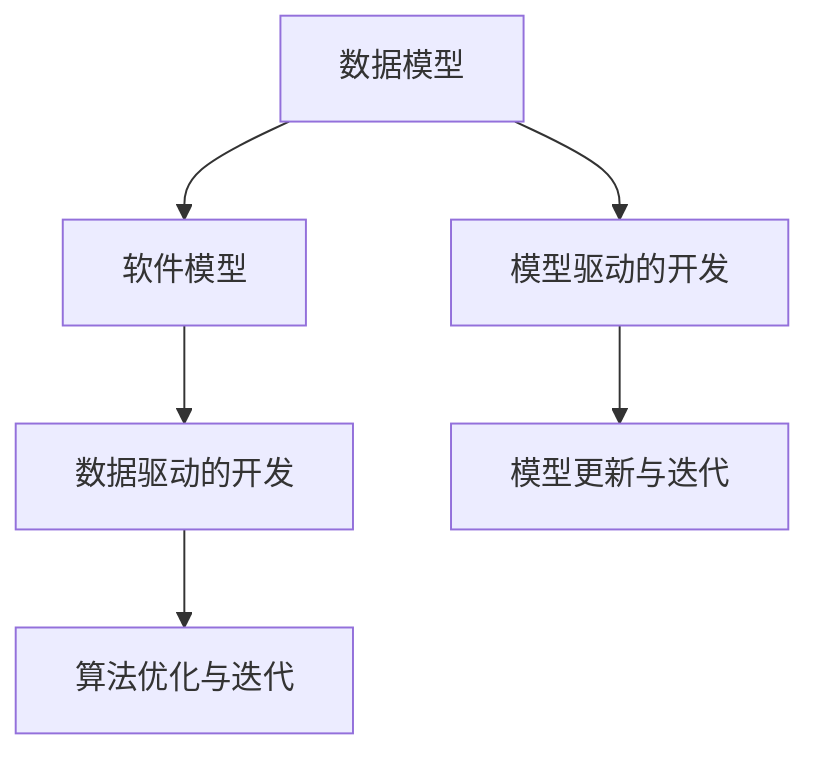

                 

# 数据模型即软件模型，两种抽象的碰撞

> 关键词：数据模型、软件模型、抽象、算法、优化、应用案例、发展趋势

> 摘要：本文深入探讨了数据模型与软件模型之间的关系，分析了两种抽象的碰撞。通过对核心概念、核心算法、应用实例以及优化策略的详细讲解，揭示了数据模型与软件模型在企业中的应用价值及其发展挑战。

### 第一部分: 数据模型与软件模型的碰撞

#### 第1章: 数据模型与软件模型的概述

数据模型与软件模型是计算机科学与工程中两个重要的抽象概念，它们分别从不同角度描述了系统的结构和行为。数据模型主要关注数据本身的结构和组织方式，而软件模型则侧重于软件系统的功能、性能和交互模式。本章节将详细阐述这两个概念，并探讨它们之间的核心联系。

##### 核心概念与联系

为了更直观地理解数据模型与软件模型之间的关系，我们可以使用 Mermaid 流程图来展示它们的联系：



- **数据模型**：它是一种抽象的数据结构和操作方式，用于描述数据的存储、处理和分析。数据模型可以独立于任何特定的应用，它的主要目的是提供一种统一的方法来组织和表示数据。
- **软件模型**：它是一种抽象的软件结构和行为描述，用于定义软件系统的功能、性能和交互模式。软件模型通常与特定的应用场景相关，它的目的是提供一种统一的方法来设计和实现软件系统。

##### 定义与特点

为了进一步理解数据模型与软件模型，我们需要明确它们各自的定义和特点。

- **数据模型**：使用 LaTeX 格式定义数据模型及其特点。

  $$\text{数据模型} = \{ \text{数据结构}, \text{数据操作}, \text{数据约束} \}$$

  - **数据结构**：定义数据的组织方式，如关系模型、面向对象模型等。
  - **数据操作**：定义数据的操作方式，如查询、插入、更新、删除等。
  - **数据约束**：定义数据的一致性和完整性约束，如实体完整性、参照完整性等。

- **软件模型**：使用 LaTeX 格式定义软件模型及其特点。

  $$\text{软件模型} = \{ \text{功能描述}, \text{性能要求}, \text{交互模式} \}$$

  - **功能描述**：定义软件系统的功能需求，如用户登录、数据查询、数据更新等。
  - **性能要求**：定义软件系统的性能指标，如响应时间、吞吐量、并发处理能力等。
  - **交互模式**：定义软件系统的用户交互模式，如命令行、图形界面、Web 应用等。

#### 第2章: 数据模型与软件模型的核心算法

数据模型与软件模型的核心算法是实现数据管理和软件功能的关键。本章节将详细讲解这些核心算法的原理，并使用伪代码和数学模型来阐述。

##### 核心算法原理讲解

数据模型与软件模型中的核心算法通常涉及数据清洗、数据标准化、用户交互优化等方面。以下是一些核心算法的原理讲解：

- **数据模型核心算法：数据清洗**

  ```python
  # 数据清洗伪代码
  def clean_data(data):
      # 删除无效数据
      valid_data = filter_valid_data(data)
      
      # 数据标准化
      standardized_data = standardize_data(valid_data)
      
      # 数据验证
      clean_data = validate_data(standardized_data)
      
      return clean_data
  ```

- **软件模型核心算法：用户交互优化**

  ```python
  # 用户交互优化伪代码
  def optimize_user_interface(ui):
      # 用户行为分析
      user_behavior = analyze_user_behavior(ui)
      
      # 交互模式优化
      optimized_ui = optimize_interaction_mode(user_behavior)
      
      # 界面布局优化
      final_ui = optimize_layout(optimized_ui)
      
      return final_ui
  ```

##### 数学模型与公式

数据模型与软件模型中常用的数学模型和公式可以帮助我们更好地理解和分析这些算法。以下是一些典型的数学模型和公式：

- **数据模型中的数学模型：线性回归模型**

  $$y = \beta_0 + \beta_1 \cdot x + \epsilon$$

  - **举例**：预测某产品销量。

    $$\text{销量} = 10 + 2 \cdot \text{广告投放费用} + \epsilon$$

- **软件模型中的数学模型：决策树分类算法**

  $$\text{分类结果} = \arg\max(\text{叶节点概率})$$

  - **举例**：判断客户是否购买。

    $$\text{购买} = \arg\max(\text{客户年龄}, \text{收入水平}, \text{购买历史})$$

#### 第3章: 数据模型与软件模型的应用实例

为了更好地理解数据模型与软件模型的应用，我们通过一个实际项目来展示它们的实现过程。本章节将介绍一个基于数据模型与软件模型开发的电商平台的推荐系统。

##### 项目实战

**项目背景**：为了提高电商平台用户的购买体验和销售额，我们需要开发一个推荐系统，根据用户的历史行为和购买偏好来推荐相关的商品。

**开发环境搭建**：

```shell
# 安装必要的软件和库
pip install numpy pandas sklearn matplotlib
```

**源代码实现**：

```python
# 导入必要的库
import numpy as np
import pandas as pd
from sklearn.model_selection import train_test_split
from sklearn.ensemble import RandomForestClassifier

# 加载数据集
data = pd.read_csv('ecommerce_data.csv')

# 数据预处理
X = data[['age', 'income', 'purchase_history']]
y = data['purchased']

# 数据划分
X_train, X_test, y_train, y_test = train_test_split(X, y, test_size=0.2, random_state=42)

# 模型训练
model = RandomForestClassifier(n_estimators=100)
model.fit(X_train, y_train)

# 模型评估
accuracy = model.score(X_test, y_test)
print(f'Model accuracy: {accuracy:.2f}')
```

**代码解读与分析**：

- **数据预处理**：加载电商数据集，并进行特征选择和划分。
- **模型训练**：使用随机森林分类器进行训练。
- **模型评估**：计算模型在测试集上的准确率。

通过这个项目，我们可以看到数据模型与软件模型在实践中的应用，以及如何通过算法和数学模型来优化推荐系统的性能。

#### 第4章: 数据模型与软件模型的优化策略

数据模型与软件模型的优化策略是提高系统性能和用户体验的关键。本章节将介绍数据模型与软件模型优化的核心方法和策略。

##### 核心内容

- **数据模型优化**：包括数据清洗、数据标准化和模型调整。
  - **数据清洗**：去除无效数据，保证数据的准确性和一致性。
  - **数据标准化**：将不同数据类型和单位进行统一处理，便于模型分析和预测。
  - **模型调整**：根据数据特征和业务需求，选择合适的模型并进行参数调整。

- **软件模型优化**：包括用户交互优化、界面布局优化和算法调整。
  - **用户交互优化**：根据用户行为数据，调整交互界面和交互模式，提高用户体验。
  - **界面布局优化**：通过用户测试和数据分析，改进界面布局，提高用户操作效率。
  - **算法调整**：根据业务需求和数据特征，调整算法参数和模型结构，提高系统性能。

#### 第5章: 数据模型与软件模型在企业中的应用案例

数据模型与软件模型在企业中具有广泛的应用，以下是一些典型的应用案例：

##### 核心内容

- **电子商务**：通过数据模型优化用户推荐系统，提高用户体验和销售额。例如，根据用户的历史购买记录和浏览行为，推荐相关的商品。
- **金融**：通过软件模型优化交易系统，提高交易效率和风险管理。例如，利用决策树算法进行客户信用评分，提高贷款审批的准确率。
- **医疗**：通过数据模型优化医学影像诊断系统，提高诊断准确率和效率。例如，使用深度学习算法进行肿瘤检测，提高诊断的准确性。

#### 第6章: 数据模型与软件模型的发展趋势与挑战

随着大数据、云计算和人工智能等新技术的快速发展，数据模型与软件模型也面临着新的趋势和挑战。

##### 核心内容

- **发展趋势**：
  - **大数据与云计算的融合**：大数据技术为数据模型提供了丰富的数据资源，云计算技术为数据模型提供了强大的计算能力和存储空间。
  - **人工智能的广泛应用**：人工智能技术为软件模型提供了智能化的功能和优化策略，如自然语言处理、计算机视觉和智能推荐等。

- **挑战**：
  - **数据隐私保护**：随着数据量的增加，数据隐私保护成为数据模型与软件模型面临的重要挑战。
  - **模型可靠性**：在复杂的应用环境中，确保数据模型与软件模型的可靠性和稳定性是一个重要的挑战。
  - **系统稳定性**：在大规模数据处理和实时应用场景中，确保系统的高可用性和稳定性是一个重要的挑战。

#### 第7章: 数据模型与软件模型的未来展望

数据模型与软件模型在未来将继续发展，并将在更多的领域得到广泛应用。以下是对未来发展的展望：

##### 核心内容

- **跨领域融合**：数据模型与软件模型将与其他领域的技术和方法相结合，如物联网、区块链和虚拟现实等，推动技术的创新和发展。
- **智能化应用**：利用人工智能技术，实现数据模型与软件模型的自我学习和优化，提高系统的智能化水平。
- **新兴应用领域**：数据模型与软件模型将在新兴领域，如智能交通、智慧城市和智能制造等，发挥重要作用。

#### 第8章: 总结与展望

本文通过对数据模型与软件模型的深入探讨，分析了它们在企业中的应用价值、发展趋势和面临的挑战。数据模型与软件模型作为两种重要的抽象，在计算机科学与工程中具有重要地位。未来，随着新技术的不断涌现，数据模型与软件模型将在更广泛的领域得到应用，为各行业的发展提供强大的技术支持。

##### 核心内容

- **总结**：回顾核心概念、算法和应用实例，强调数据模型与软件模型的重要性。
- **展望**：提出未来研究的方向和应用领域，鼓励读者深入探索和实践。

#### 附录

**附录 A: 数据模型与软件模型常用工具与资源**

- **工具**：
  - TensorFlow：一款强大的开源机器学习框架，支持多种数据模型和算法。
  - PyTorch：一款流行的开源深度学习框架，适用于复杂数据模型的实现。
  - scikit-learn：一款广泛应用于数据挖掘和机器学习的开源库，提供了丰富的数据模型和算法。

- **资源**：
  - 《数据模型》一书：详细介绍了各种数据模型的理论和实践方法。
  - 《软件工程：实践者的研究方法》一书：探讨了软件模型的设计和实现策略。
  - OpenAI：一个专注于人工智能研究的非营利组织，提供了丰富的技术资源和论文。

