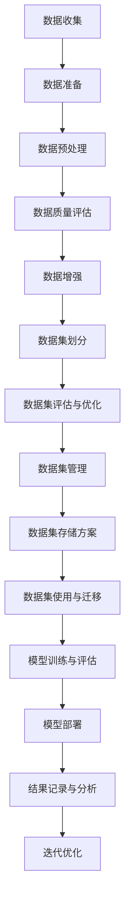

                 

# 文章标题：数据集工程：构建高效AI模型

> 关键词：数据集工程、AI模型、数据增强、数据预处理、数据质量评估

> 摘要：本文详细探讨了数据集工程在构建高效AI模型中的重要性。文章首先介绍了数据集工程的基础知识，包括数据收集与准备、数据质量评估与处理。随后，深入讨论了数据集构建与优化的关键方法，如数据增强、数据集划分与平衡。此外，文章还阐述了数据集管理与存储的方案，并提供了实际项目案例与代码解读，以帮助读者更好地理解和应用数据集工程。

## 目录大纲

### 第一部分：数据集工程基础

#### 第1章：数据集工程概述

##### 1.1 数据集工程的重要性

##### 1.2 数据集工程的流程

##### 1.3 数据集工程的目标

#### 第2章：数据收集与准备

##### 2.1 数据源选择

##### 2.2 数据采集方法

##### 2.3 数据预处理

#### 第3章：数据质量评估与处理

##### 3.1 数据质量评估指标

##### 3.2 数据清洗与异常值处理

##### 3.3 数据归一化与标准化

### 第二部分：数据集构建与优化

#### 第4章：数据增强与扩充

##### 4.1 数据增强的概念

##### 4.2 数据增强方法

##### 4.3 数据扩充的应用

#### 第5章：数据集划分与平衡

##### 5.1 划分策略

##### 5.2 数据集平衡方法

##### 5.3 跨类别数据集划分

#### 第6章：数据集评估与优化

##### 6.1 评估指标与方法

##### 6.2 性能优化策略

##### 6.3 数据集调优实践

### 第三部分：数据集管理与存储

#### 第7章：数据集管理

##### 7.1 数据集组织与存储

##### 7.2 数据集版本控制

##### 7.3 数据集安全与隐私保护

#### 第8章：数据集存储方案

##### 8.1 数据集存储需求分析

##### 8.2 数据集存储方案设计

##### 8.3 分布式存储系统选型

#### 第9章：数据集使用与迁移

##### 9.1 数据集部署与使用

##### 9.2 数据集迁移策略

##### 9.3 数据集跨平台迁移实践

### 第四部分：案例与应用

#### 第10章：案例研究

##### 10.1 案例介绍

##### 10.2 数据集构建与优化

##### 10.3 模型训练与评估

#### 第11章：实战应用

##### 11.1 实际问题分析

##### 11.2 数据集构建与优化

##### 11.3 模型训练与部署

#### 第12章：未来趋势与展望

##### 12.1 数据集工程的发展趋势

##### 12.2 AI模型训练需求变化

##### 12.3 数据集工程的挑战与机遇

### 附录

#### 附录A：常用工具与资源

##### A.1 数据集工程工具

##### A.2 数据预处理工具

##### A.3 数据增强工具

#### 附录B：参考资料

##### B.1 数据集工程相关论文

##### B.2 数据集工程开源项目

##### B.3 数据集工程教程与书籍

#### 附录C：流程图与算法原理

##### C.1 数据集工程流程图

##### C.2 数据增强算法原理

##### C.3 数据集划分算法原理

---

接下来，我们将详细讨论数据集工程的基础知识，包括数据集工程的重要性、流程和目标，为后续章节的深入探讨奠定基础。

---

### 第一部分：数据集工程基础

#### 第1章：数据集工程概述

##### 1.1 数据集工程的重要性

在人工智能（AI）和机器学习（ML）领域，数据集工程是一项至关重要的任务。数据集工程不仅涉及数据的收集和准备，还包括数据的质量评估、处理、增强、划分、评估与优化，乃至管理和存储。高质量的数据集是训练高效、准确AI模型的基础。以下是从多个角度探讨数据集工程的重要性：

1. **模型性能的基石**：数据集的质量直接影响AI模型的性能。如果数据集包含大量噪声、异常值或者不平衡的数据，那么训练出的模型将无法达到预期的准确度和泛化能力。

2. **提升模型效率**：良好的数据集工程能够提高模型的训练效率。例如，通过数据预处理和增强，可以减少模型的过拟合现象，从而加快收敛速度。

3. **降低成本与时间**：高效的数据集工程可以减少模型训练和调优所需的时间和资源。例如，通过自动化数据预处理和增强，可以显著减少人工工作量。

4. **确保数据安全和隐私**：数据集工程需要确保数据的安全和隐私。特别是在涉及敏感数据的场景中，如医疗和金融领域，数据保护和合规性至关重要。

##### 1.2 数据集工程的流程

数据集工程是一个系统性、迭代性的过程，通常包括以下几个关键步骤：

1. **数据收集**：从各种数据源收集原始数据，这可能包括公开数据集、企业内部数据、网络爬虫、传感器数据等。

2. **数据准备**：将收集到的数据进行格式化、清洗和预处理，以确保数据的质量和一致性。

3. **数据质量评估**：对数据进行评估，检查是否存在噪声、缺失值、异常值或不平衡数据，并根据评估结果进行相应的处理。

4. **数据增强**：通过数据增强技术增加数据集的多样性和规模，从而提高模型的泛化能力。

5. **数据集划分**：将数据集划分为训练集、验证集和测试集，以便进行模型训练和评估。

6. **数据集评估与优化**：评估数据集的质量和模型的性能，并进行相应的调优。

7. **数据集管理与存储**：管理数据集的版本、安全性和访问权限，并设计合适的存储方案。

##### 1.3 数据集工程的目标

数据集工程的主要目标包括：

1. **提高数据质量**：确保数据集的准确性、完整性、一致性和可靠性。

2. **增强数据多样性**：通过数据增强和扩充，增加数据集的多样性，从而提高模型的泛化能力。

3. **优化数据规模**：通过数据增强和扩充，扩大数据集规模，为模型训练提供更多的样例。

4. **支持模型训练**：提供高质量的数据集，以支持模型的训练和调优。

5. **降低过拟合风险**：通过数据增强和扩充，减少模型过拟合的风险。

6. **确保数据安全**：在处理和存储数据时，确保数据的安全性和隐私性。

7. **提高生产效率**：通过自动化工具和流程，提高数据集工程的效率和可靠性。

通过理解数据集工程的重要性、流程和目标，我们可以更好地构建高效、准确的AI模型。接下来，我们将深入探讨数据收集与准备、数据质量评估与处理等关键步骤。

### 第2章：数据收集与准备

##### 2.1 数据源选择

数据集工程的第一步是选择合适的数据源。数据源的选择直接影响到数据的质量和后续的处理工作量。以下是一些常见的数据源类型及其特点：

1. **公开数据集**：公开数据集是机器学习领域常用的数据来源，如Kaggle、UCI机器学习库、ImageNet等。这些数据集通常经过整理和清洗，易于获取和使用。

2. **企业内部数据**：企业内部数据是指来自公司业务系统、用户行为记录、传感器数据等。这类数据通常更贴近实际应用场景，但需要处理数据隐私和合规性问题。

3. **网络爬虫**：通过网络爬虫技术，可以自动收集互联网上的大量数据。这种数据来源多样，但需要处理数据获取的合法性和网站数据的使用限制。

4. **传感器数据**：传感器数据通常来自物联网设备、气象站、交通监控系统等。这类数据具有实时性和动态性，但可能存在噪声和不稳定性。

5. **用户生成数据**：用户生成数据如社交媒体数据、用户评论等，通过API接口或爬虫技术获取。这类数据通常需要处理数据质量和隐私保护问题。

在选择数据源时，需要考虑以下几个关键因素：

- **数据质量**：确保数据源的数据质量，包括准确性、完整性、一致性和可靠性。
- **数据可用性**：评估数据获取的难易程度，包括获取方式、访问权限和费用等。
- **数据规模**：确定数据源的数据规模是否满足项目需求，过小或过大的数据集都可能影响模型的训练效果。
- **数据类型**：根据模型的需求，选择合适的数据类型，如图像、文本、音频、时间序列等。

##### 2.2 数据采集方法

数据采集是数据集工程的重要环节，直接影响数据的质量和后续处理的复杂性。以下是一些常见的数据采集方法：

1. **手动采集**：手动采集是通过人工方式收集数据，如填写调查问卷、记录实验数据等。这种方法适用于小规模、高质量数据的需求，但效率较低。

2. **自动化采集**：自动化采集是通过程序或工具自动从各种来源获取数据，如网络爬虫、API调用、传感器数据收集等。这种方法适用于大规模、实时数据的需求，但需要处理数据合法性和隐私保护问题。

3. **数据爬虫**：数据爬虫是使用程序从互联网上自动获取数据的工具，如Python的BeautifulSoup、Scrapy等。这种方法适用于获取公开网络数据，但需要遵守网站的使用条款和机器人协议。

4. **API调用**：API调用是通过应用程序接口（API）从外部系统获取数据的方法。这种方法适用于获取第三方服务或企业内部系统的数据，但需要处理API的访问权限和费用。

5. **传感器采集**：传感器采集是通过物联网设备收集环境数据的方法，如温度传感器、摄像头、GPS等。这种方法适用于实时数据收集，但需要处理数据传输和存储的问题。

在数据采集过程中，需要注意以下几个关键点：

- **数据完整性**：确保采集到的数据完整、无遗漏。
- **数据准确性**：检查数据是否存在错误、异常值或重复记录。
- **数据多样性**：确保数据来源多样，以增加数据集的多样性和泛化能力。
- **数据隐私**：在处理敏感数据时，确保遵循数据保护法规和隐私政策。

##### 2.3 数据预处理

数据预处理是数据集工程的核心步骤，旨在提高数据的质量和一致性，为后续的模型训练和评估做好准备。以下是一些常见的数据预处理方法：

1. **数据清洗**：数据清洗是识别并处理数据集中的噪声、异常值和缺失值的过程。常见的数据清洗方法包括删除重复记录、填补缺失值、去除噪声等。

2. **数据转换**：数据转换是将数据从一种格式转换为另一种格式的过程，如将文本数据转换为数值数据、将图像数据调整为统一的尺寸等。

3. **数据归一化**：数据归一化是将数据缩放到一个统一范围的方法，如将所有数值数据缩放到[0, 1]或[-1, 1]范围内。常用的归一化方法包括最小-最大缩放、Z分数缩放等。

4. **数据标准化**：数据标准化是通过对数据进行线性变换，使其符合正态分布的方法。常用的标准化方法包括Z标准化和幂变换等。

5. **特征选择**：特征选择是从原始数据中提取出对模型训练最有用的特征的过程。常用的特征选择方法包括过滤式特征选择、包裹式特征选择和嵌入式特征选择等。

6. **特征工程**：特征工程是通过构建或改造特征来提高模型性能的过程。常见的方法包括特征提取、特征组合、特征缩放等。

在数据预处理过程中，需要注意以下几个关键点：

- **数据一致性**：确保数据在各个特征和维度上保持一致，以避免后续分析中的偏差。
- **数据平衡性**：在处理不平衡数据时，采取相应的平衡策略，如过采样、欠采样或生成合成样本等。
- **数据可解释性**：确保预处理方法易于理解和解释，以便后续的模型解释和优化。
- **数据效率**：在保证数据质量的前提下，尽量减少预处理步骤和计算复杂度，以提高处理效率。

通过合理的数据收集和预处理，我们可以构建高质量的数据集，为后续的模型训练和评估奠定坚实的基础。在下一章中，我们将深入探讨数据质量评估与处理的方法和技巧。

### 第3章：数据质量评估与处理

数据质量是数据集工程中至关重要的一环，高质量的数据能够确保模型训练的准确性和可靠性。在本章节中，我们将详细讨论数据质量评估的指标、数据清洗与异常值处理的方法，以及数据归一化与标准化的技术。

##### 3.1 数据质量评估指标

数据质量评估是指对数据集进行系统性的检查，以评估其准确性、完整性、一致性和可靠性。以下是一些常用的数据质量评估指标：

1. **准确性（Accuracy）**：准确性是指模型预测正确的比例。在分类任务中，准确性是一个非常重要的评估指标。例如，在邮件分类任务中，如果模型正确分类了90%的邮件，则其准确性为90%。

2. **精确率（Precision）和召回率（Recall）**：精确率是指模型预测为正样本中实际为正样本的比例。召回率是指模型预测为正样本中实际为正样本的比例。这两个指标通常用于评估二分类模型的性能。

3. **F1分数（F1 Score）**：F1分数是精确率和召回率的加权平均，用于综合评估模型的性能。F1分数的计算公式为：
   $$
   F1 = 2 \times \frac{Precision \times Recall}{Precision + Recall}
   $$
   F1分数在精确率和召回率之间存在权衡，通过F1分数可以在两者之间找到一个平衡点。

4. **完整度（Completeness）**：完整度是指实际为正样本的数据中，被模型正确分类为正样本的比例。

5. **一致性（Consistency）**：一致性是指数据集中各个特征之间的相关性。一致性高的数据集通常更容易建模。

6. **噪声比例（Noise Ratio）**：噪声比例是指数据集中噪声数据（即错误数据）的比例。噪声比例越低，数据质量越高。

7. **缺失率（Missing Rate）**：缺失率是指数据集中缺失数据的比例。过高的缺失率会影响模型的训练效果。

##### 3.2 数据清洗与异常值处理

数据清洗是数据质量评估的一个重要环节，旨在识别并处理数据集中的噪声、异常值和缺失值。以下是一些常见的数据清洗与异常值处理方法：

1. **缺失值处理**：缺失值处理是针对数据集中缺失数据的操作。常见的缺失值处理方法包括以下几种：

   - **删除缺失值**：删除包含缺失值的数据记录，适用于缺失值比例较低的情况。
   - **填补缺失值**：用统计方法或插值法填补缺失值，如平均值填补、中值填补、前向填补和后向填补等。
   - **使用模型预测**：使用机器学习模型预测缺失值，适用于缺失值比例较高且数据具有强相关性的情况。

2. **异常值处理**：异常值是指数据集中与大多数数据点不一致的数据。异常值可能由错误数据、噪声或异常现象引起。常见的异常值处理方法包括以下几种：

   - **删除异常值**：删除数据集中明显异常的数据记录，适用于异常值比例较低且对模型影响较大的情况。
   - **变换数据**：通过变换将异常值转化为正常值，如对异常值进行对数变换或平方根变换等。
   - **使用统计方法**：使用统计方法如Z分数、IQR（四分位距）等方法识别和标记异常值，然后根据具体情况处理。
   - **聚类分析**：使用聚类分析方法识别异常值，适用于数据具有复杂分布的情况。

3. **重复值处理**：重复值处理是识别并处理数据集中的重复记录。常见的重复值处理方法包括以下几种：

   - **删除重复值**：删除数据集中所有重复记录，保留一条唯一的记录。
   - **合并重复值**：将重复值合并，生成一条综合记录，适用于需要保留重复值信息的场景。

##### 3.3 数据归一化与标准化

数据归一化与标准化是数据预处理中的重要步骤，旨在将数据缩放到一个统一的范围内，以消除不同特征之间的量纲影响。以下是一些常见的数据归一化与标准化方法：

1. **最小-最大缩放（Min-Max Scaling）**：最小-最大缩放是一种简单的归一化方法，将数据缩放到[0, 1]范围内。其计算公式为：
   $$
   x_{\text{norm}} = \frac{x - x_{\text{min}}}{x_{\text{max}} - x_{\text{min}}}
   $$
   其中，$x_{\text{min}}$ 和 $x_{\text{max}}$ 分别是数据的最小值和最大值。

2. **Z分数缩放（Z-Score Scaling）**：Z分数缩放是一种基于均值和标准差的标准化方法，将数据缩放到均值为0、标准差为1的范围内。其计算公式为：
   $$
   z = \frac{x - \mu}{\sigma}
   $$
   其中，$\mu$ 是数据的均值，$\sigma$ 是数据的标准差。

3. **幂变换（Power Transformation）**：幂变换是一种通过幂函数变换数据的方法，常用于处理偏态分布的数据。常见的幂变换方法包括对数变换、平方根变换等。

4. **小数点缩放（Decimal Scaling）**：小数点缩放是一种通过调整小数点位置来缩放数据的方法，适用于处理数值范围非常宽的数据。

在数据归一化与标准化过程中，需要注意以下几个关键点：

- **选择合适的归一化或标准化方法**：根据数据集的特点和模型的需求，选择合适的归一化或标准化方法。
- **避免引入额外的噪声**：在进行归一化或标准化时，尽量避免引入额外的噪声，特别是对于小数值或大数值的处理。
- **保持数据的一致性**：在数据预处理过程中，确保数据的一致性，以避免后续分析中的偏差。
- **记录处理过程**：记录数据预处理的步骤和参数，以便后续的数据恢复和模型调试。

通过有效的数据质量评估与处理，我们可以提高数据集的质量，为模型的训练和评估提供可靠的基础。在下一章中，我们将探讨数据增强与扩充的方法，以进一步优化数据集的质量和多样性。

### 第2章：数据收集与准备

##### 2.1 数据源选择

数据源的选择是数据集工程的首要任务，它直接决定了数据的质量和可用性。选择合适的数据源不仅能够提高数据集的质量，还能显著降低后续处理的复杂性。以下是一些常见的数据源类型及其特点：

1. **公开数据集**：公开数据集是机器学习领域常用的数据来源，如Kaggle、UCI机器学习库、ImageNet等。这些数据集通常经过整理和清洗，易于获取和使用。公开数据集的优点包括数据量大、标注准确、多样性高等，但缺点是数据可能过于理想化，与实际应用场景存在偏差。

2. **企业内部数据**：企业内部数据是指来自公司业务系统、用户行为记录、传感器数据等。这类数据通常更贴近实际应用场景，能够提供更真实的数据反馈。例如，电商平台的交易数据、社交媒体的用户行为数据等。企业内部数据的优点是数据质量高、相关性强，但缺点是数据获取难度大，且可能涉及数据隐私和合规性问题。

3. **网络爬虫**：网络爬虫是通过程序从互联网上自动获取数据的工具，如Python的BeautifulSoup、Scrapy等。这种方法适用于获取公开网络数据，如新闻、论坛、博客等。网络爬虫的优点是数据获取速度快、来源多样，但缺点是数据质量难以保证，且可能违反网站的使用条款。

4. **传感器数据**：传感器数据通常来自物联网设备、气象站、交通监控系统等。这类数据具有实时性和动态性，但可能存在噪声和不稳定性。传感器数据常用于时间序列分析和预测模型，如气象预测、交通流量预测等。传感器数据的优点是数据实时、准确，但缺点是数据传输和存储成本高。

5. **用户生成数据**：用户生成数据如社交媒体数据、用户评论等，通过API接口或爬虫技术获取。这类数据通常需要处理数据质量和隐私保护问题。用户生成数据的优点是数据量大、多样性高，但缺点是数据质量参差不齐，且可能涉及隐私问题。

在选择数据源时，需要考虑以下几个关键因素：

- **数据质量**：确保数据源的数据质量，包括准确性、完整性、一致性和可靠性。
- **数据可用性**：评估数据获取的难易程度，包括获取方式、访问权限和费用等。
- **数据规模**：确定数据源的数据规模是否满足项目需求，过小或过大的数据集都可能影响模型的训练效果。
- **数据类型**：根据模型的需求，选择合适的数据类型，如图像、文本、音频、时间序列等。

##### 2.2 数据采集方法

数据采集是数据集工程的重要环节，它直接影响数据的质量和后续处理的复杂性。以下是一些常见的数据采集方法：

1. **手动采集**：手动采集是通过人工方式收集数据，如填写调查问卷、记录实验数据等。这种方法适用于小规模、高质量数据的需求，但效率较低。手动采集的优点是数据真实、准确，但缺点是工作量大、耗时。

2. **自动化采集**：自动化采集是通过程序或工具自动从各种来源获取数据，如网络爬虫、API调用、传感器数据收集等。这种方法适用于大规模、实时数据的需求，但需要处理数据合法性和隐私保护问题。自动化采集的优点是高效、自动化，但缺点是数据质量难以保证。

3. **数据爬虫**：数据爬虫是使用程序从互联网上自动获取数据的工具，如Python的BeautifulSoup、Scrapy等。这种方法适用于获取公开网络数据，如新闻、论坛、博客等。数据爬虫的优点是数据获取速度快、来源多样，但缺点是数据质量难以保证，且可能违反网站的使用条款。

4. **API调用**：API调用是通过应用程序接口（API）从外部系统获取数据的方法。这种方法适用于获取第三方服务或企业内部系统的数据，如社交媒体数据、电商交易数据等。API调用的优点是数据获取方便、速度快，但缺点是可能涉及访问权限和费用。

5. **传感器采集**：传感器采集是通过物联网设备收集环境数据的方法，如温度传感器、摄像头、GPS等。这种方法适用于实时数据收集，但需要处理数据传输和存储的问题。传感器采集的优点是数据实时、准确，但缺点是数据传输和存储成本高。

在数据采集过程中，需要注意以下几个关键点：

- **数据完整性**：确保采集到的数据完整、无遗漏。
- **数据准确性**：检查数据是否存在错误、异常值或重复记录。
- **数据多样性**：确保数据来源多样，以增加数据集的多样性和泛化能力。
- **数据隐私**：在处理敏感数据时，确保遵循数据保护法规和隐私政策。

##### 2.3 数据预处理

数据预处理是数据集工程的核心步骤，旨在提高数据的质量和一致性，为后续的模型训练和评估做好准备。以下是一些常见的数据预处理方法：

1. **数据清洗**：数据清洗是识别并处理数据集中的噪声、异常值和缺失值的过程。常见的数据清洗方法包括删除重复记录、填补缺失值、去除噪声等。

2. **数据转换**：数据转换是将数据从一种格式转换为另一种格式的过程，如将文本数据转换为数值数据、将图像数据调整为统一的尺寸等。

3. **数据归一化**：数据归一化是将数据缩放到一个统一范围的方法，如将所有数值数据缩放到[0, 1]或[-1, 1]范围内。常用的归一化方法包括最小-最大缩放、Z分数缩放等。

4. **数据标准化**：数据标准化是通过对数据进行线性变换，使其符合正态分布的方法。常用的标准化方法包括Z标准化和幂变换等。

5. **特征选择**：特征选择是从原始数据中提取出对模型训练最有用的特征的过程。常用的特征选择方法包括过滤式特征选择、包裹式特征选择和嵌入式特征选择等。

6. **特征工程**：特征工程是通过构建或改造特征来提高模型性能的过程。常见的方法包括特征提取、特征组合、特征缩放等。

在数据预处理过程中，需要注意以下几个关键点：

- **数据一致性**：确保数据在各个特征和维度上保持一致，以避免后续分析中的偏差。
- **数据平衡性**：在处理不平衡数据时，采取相应的平衡策略，如过采样、欠采样或生成合成样本等。
- **数据可解释性**：确保预处理方法易于理解和解释，以便后续的模型解释和优化。
- **数据效率**：在保证数据质量的前提下，尽量减少预处理步骤和计算复杂度，以提高处理效率。

通过合理的数据收集和预处理，我们可以构建高质量的数据集，为后续的模型训练和评估奠定坚实的基础。在下一章中，我们将深入探讨数据质量评估与处理的方法和技巧。

### 第3章：数据质量评估与处理

数据质量是数据集工程中的核心问题，直接影响到模型的性能和预测能力。本章节将详细讨论数据质量评估的指标、数据清洗与异常值处理的方法，以及数据归一化与标准化的技术。

##### 3.1 数据质量评估指标

评估数据质量是数据集工程的关键步骤，常用的评估指标包括：

1. **准确性（Accuracy）**：准确性是评估模型在分类任务上的性能，定义为正确分类的样本数与总样本数的比值。公式如下：
   $$
   \text{Accuracy} = \frac{\text{正确分类的样本数}}{\text{总样本数}}
   $$
   虽然准确性简单直观，但当数据不平衡时，它可能会误导评估结果。

2. **精确率（Precision）**：精确率是评估模型预测为正样本且实际为正样本的比例。公式如下：
   $$
   \text{Precision} = \frac{\text{真正例}}{\text{真正例 + 假正例}}
   $$
   精确率关注的是模型在预测正样本时的准确度。

3. **召回率（Recall）**：召回率是评估模型预测为正样本且实际为正样本的比例。公式如下：
   $$
   \text{Recall} = \frac{\text{真正例}}{\text{真正例 + 假反例}}
   $$
   召回率关注的是模型在预测正样本时的覆盖率。

4. **F1分数（F1 Score）**：F1分数是精确率和召回率的调和平均值，用于综合评估模型的性能。公式如下：
   $$
   \text{F1 Score} = 2 \times \frac{\text{Precision} \times \text{Recall}}{\text{Precision} + \text{Recall}}
   $$
   F1分数在精确率和召回率之间存在权衡。

5. **完整度（Completeness）**：完整度是实际为正样本的数据中，模型正确分类为正样本的比例。

6. **一致性（Consistency）**：一致性是数据集中各个特征之间的相关性。一致性高的数据集通常更容易建模。

7. **噪声比例（Noise Ratio）**：噪声比例是数据集中噪声数据的比例。噪声比例越低，数据质量越高。

8. **缺失率（Missing Rate）**：缺失率是数据集中缺失数据的比例。过高的缺失率会影响模型的训练效果。

##### 3.2 数据清洗与异常值处理

数据清洗是提升数据质量的重要步骤，涉及以下方法：

1. **缺失值处理**：
   - **删除缺失值**：适用于缺失值比例较低且重要特征不缺失的场景。
   - **填补缺失值**：适用于缺失值比例较高或重要特征缺失的场景。常见的方法包括：
     - **平均值填补**：用特征的均值填补缺失值。
     - **中值填补**：用特征的中值填补缺失值。
     - **前向填补**：用前面的非缺失值填补。
     - **后向填补**：用后面的非缺失值填补。
     - **使用模型预测**：用机器学习模型预测缺失值，适用于缺失值比例较高且数据具有强相关性。

2. **异常值处理**：
   - **删除异常值**：适用于异常值比例较低且对模型影响较大的场景。
   - **变换数据**：通过变换将异常值转化为正常值，如对异常值进行对数变换或平方根变换等。
   - **使用统计方法**：使用统计方法如Z分数、IQR（四分位距）等方法识别和标记异常值，然后根据具体情况处理。
   - **聚类分析**：使用聚类分析方法识别异常值，适用于数据具有复杂分布的情况。

3. **重复值处理**：
   - **删除重复值**：删除数据集中所有重复记录，保留一条唯一的记录。
   - **合并重复值**：将重复值合并，生成一条综合记录，适用于需要保留重复值信息的场景。

##### 3.3 数据归一化与标准化

数据归一化与标准化是数据预处理中的重要步骤，旨在将数据缩放到一个统一的范围内，以消除不同特征之间的量纲影响。以下是一些常见的数据归一化与标准化方法：

1. **最小-最大缩放（Min-Max Scaling）**：
   - 将数据缩放到[0, 1]范围内。
   - 公式：$x_{\text{norm}} = \frac{x - x_{\text{min}}}{x_{\text{max}} - x_{\text{min}}}$，其中$x_{\text{min}}$ 和$x_{\text{max}}$ 分别是数据的最小值和最大值。

2. **Z分数缩放（Z-Score Scaling）**：
   - 将数据缩放到均值为0、标准差为1的范围内。
   - 公式：$z = \frac{x - \mu}{\sigma}$，其中$\mu$ 是数据的均值，$\sigma$ 是数据的标准差。

3. **小数点缩放（Decimal Scaling）**：
   - 通过调整小数点位置来缩放数据。
   - 公式：$x_{\text{norm}} = \frac{x}{10^p}$，其中$p$ 是一个适当的指数，用于调整数据范围。

4. **幂变换（Power Transformation）**：
   - 通过幂函数变换数据，常用于处理偏态分布的数据。
   - 公式：$x_{\text{norm}} = x^r$，其中$r$ 是一个适当的指数。

在实际应用中，选择合适的归一化或标准化方法取决于数据的特点和模型的需求。例如，对于具有不同量纲的特征，通常使用归一化方法；而对于需要模拟正态分布的特征，则使用标准化方法。

通过有效的数据质量评估与处理，我们可以显著提高数据集的质量，为模型的训练和评估提供可靠的基础。在下一章中，我们将探讨数据增强与扩充的方法，以进一步提升数据集的多样性和质量。

### 第4章：数据增强与扩充

数据增强与扩充是数据集工程中关键的一环，旨在通过引入多样化数据来提高模型的泛化能力。在本章节中，我们将详细讨论数据增强的概念、方法及其应用。

##### 4.1 数据增强的概念

数据增强是指通过对原始数据进行变换，生成新的数据样本来增加数据集的多样性和规模。这种技术有助于减少模型对训练数据的依赖，从而提高模型的泛化能力。数据增强适用于各种类型的原始数据，如图像、文本、音频和时间序列数据。

数据增强的方法可以分为以下几类：

1. **像素级别的变换**：这类变换直接操作图像的像素值，例如随机翻转、旋转、裁剪、缩放等。这些操作能够增加图像数据的多样性，从而提高模型对图像的鲁棒性。

2. **几何变换**：几何变换包括图像的平移、旋转、缩放、剪切等操作。这些变换可以通过保持图像内容的同时改变图像的视角和结构，增加数据的多样性。

3. **颜色变换**：颜色变换包括亮度调整、对比度调整、色调和饱和度调整等。这些操作能够模拟不同光照条件下的图像，从而提高模型对不同光照条件的鲁棒性。

4. **噪声注入**：通过在图像中添加噪声（如高斯噪声、椒盐噪声等），可以增加数据的噪声水平，从而提高模型对噪声的容忍能力。

5. **数据合成**：数据合成是指通过生成与真实数据相似的新数据。例如，使用生成对抗网络（GANs）生成与训练数据相似的图像，从而扩充数据集。

##### 4.2 数据增强方法

以下是几种常见的数据增强方法及其实现：

1. **随机翻转（Random Flip）**：
   - **原理**：随机选择水平或垂直轴进行翻转，模拟图像在不同视角下的表现。
   - **实现**：
     ```python
     import cv2
     img = cv2.imread('image.jpg')
     flipped_img = cv2.flip(img, 0)  # 水平翻转
     flipped_img = cv2.flip(img, 1)  # 垂直翻转
     ```

2. **旋转（Rotation）**：
   - **原理**：围绕图像的中心点进行旋转，模拟物体在不同角度下的表现。
   - **实现**：
     ```python
     import cv2
     import numpy as np
     img = cv2.imread('image.jpg')
     angle = np.random.uniform(-30, 30)  # 随机旋转角度
     rotated_img = cv2.rotate(img, cv2.ROTATE_90_CLOCKWISE)
     ```

3. **裁剪（Cropping）**：
   - **原理**：从图像中随机裁剪一个区域作为新的样本，模拟图像的局部变化。
   - **实现**：
     ```python
     import cv2
     img = cv2.imread('image.jpg')
     x, y, w, h = random_cropping_box(img.shape)  # 随机裁剪框
     cropped_img = img[x:x+h, y:y+w]
     ```

4. **缩放（Scaling）**：
   - **原理**：通过缩放图像，模拟物体在不同大小下的表现。
   - **实现**：
     ```python
     import cv2
     scale_factor = np.random.uniform(0.5, 1.5)  # 随机缩放因子
     scaled_img = cv2.resize(img, None, fx=scale_factor, fy=scale_factor)
     ```

5. **噪声注入（Noise Injection）**：
   - **原理**：通过在图像中添加噪声，模拟图像在不同噪声水平下的表现。
   - **实现**：
     ```python
     import cv2
     import numpy as np
     img = cv2.imread('image.jpg')
     noise_type = np.random.choice(['gaussian', 'salt_pepper'])
     if noise_type == 'gaussian':
         noise_img = cv2.addNoise(img, mean=0, var=0.01)
     elif noise_type == 'salt_pepper':
         noise_img = cv2.addNoise(img, salt=True, pepper=True)
     ```

##### 4.3 数据扩充的应用

数据增强在许多AI应用中有着广泛的应用，以下是一些典型的应用场景：

1. **计算机视觉**：在图像分类、物体检测、人脸识别等任务中，数据增强能够显著提高模型的鲁棒性和准确性。例如，通过随机翻转、旋转和裁剪图像，可以增强模型对不同视角和姿态的适应性。

2. **自然语言处理**：在文本分类、情感分析等任务中，数据增强可以通过随机替换单词、添加噪声、构造否定句等操作，增加数据的多样性和复杂性，从而提高模型的泛化能力。

3. **音频处理**：在音频分类、语音识别等任务中，数据增强可以通过添加噪声、速度变换、音调变换等操作，增强模型对噪声和语音变化的容忍能力。

4. **时间序列分析**：在时间序列预测、异常检测等任务中，数据增强可以通过时间缩放、序列裁剪、添加噪声等操作，增加数据的多样性和复杂性，从而提高模型的泛化能力。

通过合理的数据增强与扩充，我们可以构建高质量、多样化的数据集，为AI模型的训练和评估提供坚实的基础。在下一章中，我们将探讨数据集划分与平衡的方法，以确保模型的训练和评估过程公平、有效。

### 第5章：数据集划分与平衡

在数据集工程中，如何合理地划分数据集是确保模型训练和评估效果的关键。数据集划分的目标是将整个数据集分为多个子集，其中每个子集都有特定的用途。常见的划分方式包括训练集、验证集和测试集。在本章节中，我们将详细讨论数据集划分的策略、数据集平衡的方法，以及跨类别数据集划分的挑战和解决方案。

##### 5.1 划分策略

1. **训练集（Training Set）**：训练集是用于训练模型的子集。其目的是通过从数据集中提取特征和模式来训练模型，以便在后续的评估中能够进行预测。

2. **验证集（Validation Set）**：验证集是用于调整模型参数和选择最佳模型的子集。在模型训练过程中，验证集用于评估模型在未知数据上的性能，帮助调整模型参数，避免过拟合。

3. **测试集（Test Set）**：测试集是用于评估最终模型性能的子集。测试集应在模型训练过程中从未使用过，以确保评估结果的公正性。其目的是验证模型在未知数据上的泛化能力。

通常，数据集的划分比例为训练集：验证集：测试集 = 70%：15%：15%，但具体比例可以根据实际情况进行调整。

##### 5.2 数据集平衡方法

数据集的不平衡是数据集工程中常见且重要的问题，它指的是数据集中各类别样本的数量不均衡。不平衡数据集可能导致模型倾向于预测数量较多的类别，从而无法准确地预测数量较少的类别。以下是一些常用的数据集平衡方法：

1. **过采样（Over Sampling）**：过采样是指通过增加数量较少的类别样本，使得数据集在各类别上更加均衡。常见的方法包括：
   - **重复采样**：重复添加数量较少的样本，直到各类别数量均衡。
   - **合成样本**：使用合成方法生成新的样本，如SMOTE（Synthetic Minority Over-sampling Technique）。

2. **欠采样（Under Sampling）**：欠采样是指通过减少数量较多的类别样本，使得数据集在各类别上更加均衡。常见的方法包括：
   - **随机删除**：随机删除数量较多的样本，直到各类别数量均衡。
   - **基于特征的欠采样**：删除具有相同特征的样本，以减少数据集中重复的信息。

3. **集合平衡（Combination Balancing）**：集合平衡是指通过组合过采样和欠采样方法，以实现更均衡的数据集。常见的方法包括：
   - **SMOTE+欠采样**：先使用SMOTE方法进行过采样，再对过采样后的数据集进行欠采样。

4. **集成方法（Ensemble Methods）**：集成方法是指通过结合多个模型来提高模型在数据集不平衡情况下的性能。常见的方法包括：
   - **Bagging**：通过训练多个模型，然后对它们的预测结果进行投票。
   - **Boosting**：通过训练多个模型，并逐步调整每个模型的权重，以更好地预测少数类别的样本。

##### 5.3 跨类别数据集划分

在跨类别数据集划分中，我们需要关注如何确保每个类别在训练集、验证集和测试集中的代表性。以下是一些常见的挑战和解决方案：

1. **代表性不足**：在某些情况下，某些类别可能在训练集中代表不足，导致模型无法充分学习这些类别的特征。解决方案包括：
   - **加权损失函数**：为少数类别分配更高的权重，以帮助模型更好地学习这些类别的特征。
   - **类别加权采样**：在生成训练数据时，对少数类别进行加权采样，以提高其代表性。

2. **类别不平衡**：在数据集中，某些类别可能存在显著的不平衡，例如在医学影像数据集中，正常病例和疾病病例的数量可能差异很大。解决方案包括：
   - **动态调整样本数量**：在训练过程中，根据模型的性能动态调整各类别的样本数量，以避免模型过度依赖某些类别。
   - **类别特异性特征提取**：通过提取与特定类别相关的特征，有助于模型更好地学习这些类别的特征。

3. **类别混合**：在某些应用中，数据集可能包含多个类别的混合样本，这可能导致模型难以区分不同类别。解决方案包括：
   - **混合样本分离**：通过分离混合样本，将其划分为不同的类别，从而提高模型的训练效果。
   - **混合样本分类**：将混合样本作为单独的类别进行分类，从而提高模型在处理混合样本时的性能。

通过合理的数据集划分和平衡策略，我们可以构建高质量、多样化的数据集，从而确保模型在训练和评估过程中能够获得良好的性能。在下一章中，我们将深入探讨数据集评估与优化的方法，以提高模型的最终性能。

### 第6章：数据集评估与优化

数据集评估是确保AI模型性能的重要环节，它通过使用评估指标和方法来衡量模型在不同数据集上的表现。有效的数据集评估不仅能够帮助我们选择最佳模型，还能够指导数据集的优化过程。在本章节中，我们将详细讨论评估指标、性能优化策略以及数据集调优实践。

##### 6.1 评估指标与方法

评估指标是衡量模型性能的关键工具，不同的评估指标适用于不同的任务和场景。以下是一些常用的评估指标和方法：

1. **准确性（Accuracy）**：准确性是最常见的评估指标，它表示模型预测正确的样本数占总样本数的比例。公式如下：
   $$
   \text{Accuracy} = \frac{\text{正确预测的样本数}}{\text{总样本数}}
   $$
   虽然准确性简单直观，但当数据集存在不平衡时，它可能无法全面反映模型的性能。

2. **精确率（Precision）与召回率（Recall）**：精确率和召回率是评估二分类模型性能的重要指标。精确率表示预测为正样本且实际为正样本的比例，召回率表示实际为正样本中被模型正确预测为正样本的比例。公式如下：
   $$
   \text{Precision} = \frac{\text{真正例}}{\text{真正例 + 假正例}}
   $$
   $$
   \text{Recall} = \frac{\text{真正例}}{\text{真正例 + 假反例}}
   $$
   F1分数是精确率和召回率的调和平均值，用于综合评估模型的性能：
   $$
   \text{F1 Score} = 2 \times \frac{\text{Precision} \times \text{Recall}}{\text{Precision} + \text{Recall}}
   $$

3. **ROC曲线与AUC（Area Under Curve）**：ROC曲线通过绘制不同阈值下真阳性率（True Positive Rate，即召回率）与假阳性率（False Positive Rate）的关系来评估模型的性能。AUC值表示ROC曲线下面积，值越高表示模型性能越好。

4. **均方误差（Mean Squared Error，MSE）与均方根误差（Root Mean Squared Error，RMSE）**：这些指标用于评估回归任务中模型的预测误差。MSE是预测值与真实值差的平方的平均值，RMSE是MSE的平方根。公式如下：
   $$
   \text{MSE} = \frac{1}{n} \sum_{i=1}^{n} (y_i - \hat{y}_i)^2
   $$
   $$
   \text{RMSE} = \sqrt{\text{MSE}}
   $$

5. **交叉验证（Cross-Validation）**：交叉验证是一种常用的评估方法，通过将数据集划分为多个子集，重复进行训练和评估，以减少评估结果的偶然性。常见的方法包括K折交叉验证和留一交叉验证。

6. **时间序列评估**：在时间序列任务中，常见的评估指标包括均方根误差（RMSE）、平均绝对误差（MAE）、平均绝对百分比误差（MAPE）等。

##### 6.2 性能优化策略

性能优化是提高AI模型性能的关键步骤，以下是一些常用的策略：

1. **超参数调优（Hyperparameter Tuning）**：超参数调优是通过调整模型参数来提高模型性能的过程。常用的调优方法包括网格搜索（Grid Search）和随机搜索（Random Search）。此外，使用贝叶斯优化（Bayesian Optimization）等高级算法可以更有效地搜索最优超参数。

2. **特征工程（Feature Engineering）**：特征工程是通过构建或改造特征来提高模型性能的过程。常用的方法包括特征提取、特征选择和特征组合。通过特征工程，可以提取出对模型训练和预测更有用的特征，从而提高模型的性能。

3. **正则化（Regularization）**：正则化是通过引入惩罚项来减少模型过拟合的过程。常见的正则化方法包括L1正则化（Lasso）、L2正则化（Ridge）和弹性网（Elastic Net）。

4. **集成学习（Ensemble Learning）**：集成学习是通过结合多个模型的预测结果来提高模型性能的方法。常见的集成学习方法包括Bagging、Boosting和Stacking等。通过集成学习，可以减少模型的方差和偏差，从而提高模型的泛化能力。

5. **数据增强与扩充（Data Augmentation and Expansion）**：数据增强和扩充是通过引入多样化数据来提高模型性能的过程。常见的方法包括图像增强、文本增强和音频增强等。通过数据增强和扩充，可以增加模型的训练样本数量和多样性，从而提高模型的泛化能力。

##### 6.3 数据集调优实践

以下是数据集调优的实践步骤：

1. **数据集划分**：将数据集划分为训练集、验证集和测试集，以确保评估结果的公正性和可靠性。

2. **初始模型训练**：使用训练集训练初始模型，并使用验证集评估模型性能。根据评估结果，调整模型结构和超参数。

3. **超参数调优**：使用网格搜索、随机搜索或贝叶斯优化等方法进行超参数调优。通过多次迭代，寻找最优超参数组合。

4. **特征工程**：对数据集进行特征工程，包括特征提取、特征选择和特征组合。通过特征工程，提取出对模型训练和预测更有用的特征。

5. **模型优化**：使用优化后的模型在验证集上进行进一步优化，并记录性能指标。根据性能指标，调整模型结构和超参数。

6. **测试集评估**：使用测试集评估最终模型的性能，以确保模型的泛化能力。如果测试集性能不理想，可以回溯到前面的步骤，重新进行数据集划分、模型训练和优化。

7. **模型部署**：将最终模型部署到实际应用环境中，并进行实时性能监控和调优。

通过合理的数据集评估和优化，我们可以构建高性能的AI模型，从而在实际应用中取得更好的效果。在下一章中，我们将探讨数据集管理与存储的方案，以确保数据集的可维护性和可访问性。

### 第7章：数据集管理

数据集管理是数据集工程中至关重要的一环，确保数据集的可维护性、可访问性和安全性。一个有效的数据集管理策略不仅能够提高数据集的使用效率，还能为模型训练和评估提供可靠的数据支持。在本章节中，我们将详细讨论数据集组织与存储、数据集版本控制、以及数据集安全与隐私保护。

##### 7.1 数据集组织与存储

数据集组织与存储是数据集管理的基础，决定了数据集的可访问性和处理效率。以下是一些关键点：

1. **文件系统**：在本地环境中，常用的文件系统包括HDFS（Hadoop分布式文件系统）和NFS（网络文件系统）。HDFS适合大规模数据集的分布式存储和处理，而NFS则适合小规模数据集的集中存储。

2. **数据库**：对于结构化数据集，使用关系数据库（如MySQL、PostgreSQL）或NoSQL数据库（如MongoDB、Cassandra）是常见的选择。这些数据库能够提供高效的数据查询和索引功能。

3. **云存储**：云存储服务（如Amazon S3、Google Cloud Storage、Azure Blob Storage）提供了便捷、可扩展的存储解决方案，适用于大规模、分布式的数据集存储。云存储还具有数据备份和恢复功能，提高了数据的安全性和可靠性。

4. **分布式文件系统**：对于分布式计算环境，使用分布式文件系统（如HDFS、Alluxio）可以更好地支持数据的高效存储和访问。这些文件系统能够将数据分布到多个节点，从而提高数据处理的速度和性能。

5. **数据湖**：数据湖是一个大规模、分布式数据存储系统，可以存储不同类型的数据（如结构化数据、半结构化数据、非结构化数据）。数据湖提供了强大的数据管理和分析功能，适用于多样化的数据应用场景。

##### 7.2 数据集版本控制

数据集版本控制是确保数据集可维护性和一致性的重要手段。以下是一些关键点：

1. **版本标识**：为每个数据集版本赋予唯一的标识，如使用时间戳或版本号。这有助于跟踪数据集的变更历史，便于后续的数据集管理和恢复。

2. **变更记录**：记录每次数据集变更的详细信息，包括变更的时间、人员、变更内容等。这有助于了解数据集的变更历史，便于问题的追溯和解决。

3. **版本库**：使用版本库（如Git、SVN）管理数据集的版本历史。版本库能够提供强大的版本控制功能，如分支管理、合并和回滚等，便于团队协作和数据集的迭代。

4. **变更通知**：通过邮件、消息队列或通知系统，及时通知相关人员数据集的版本变更。这有助于确保团队对数据集的变更保持同步，提高数据集管理的效率。

##### 7.3 数据集安全与隐私保护

数据集安全与隐私保护是数据集管理中的重要任务，确保数据在存储、传输和使用过程中的安全性。以下是一些关键点：

1. **访问控制**：为数据集设置访问权限，确保只有授权人员才能访问和操作数据集。常用的访问控制策略包括基于角色的访问控制（RBAC）和基于属性的访问控制（ABAC）。

2. **数据加密**：对数据集进行加密，确保数据在存储和传输过程中的安全性。常用的加密算法包括对称加密（如AES）和非对称加密（如RSA）。

3. **数据脱敏**：在处理敏感数据时，使用数据脱敏技术（如伪匿名化、数据掩码等）保护数据隐私。这有助于降低数据泄露的风险。

4. **审计与监控**：建立数据审计和监控机制，记录和监控数据集的访问和操作行为。这有助于及时发现和应对潜在的安全威胁。

5. **合规性检查**：遵守相关的数据保护法规和合规性要求，如GDPR（通用数据保护条例）和CCPA（加州消费者隐私法案）。这有助于确保数据集管理的合法性和合规性。

通过有效的数据集管理策略，我们可以确保数据集的高质量、可靠性和安全性，为模型训练和评估提供坚实的数据支持。在下一章中，我们将探讨数据集存储方案的设计和分布式存储系统的选型。

### 第8章：数据集存储方案

数据集存储方案的设计是数据集管理中的关键环节，直接影响数据集的性能、可靠性和可扩展性。在选择和设计数据集存储方案时，需要考虑数据集的规模、访问模式、计算需求以及预算等多方面因素。在本章节中，我们将详细讨论数据集存储需求分析、数据集存储方案设计以及分布式存储系统的选型。

##### 8.1 数据集存储需求分析

数据集存储需求分析是设计数据集存储方案的第一步，它涉及到对数据集规模、访问模式、读写频率和存储持续性的全面了解。以下是一些关键点：

1. **数据集规模**：评估数据集的总大小，包括原始数据和预处理后的数据。数据集规模将直接影响存储方案的选择，如是否需要使用分布式存储系统。

2. **访问模式**：分析数据集的访问模式，包括读操作和写操作的频率。如果数据集主要进行读操作，且访问模式是随机读取，则选择随机访问存储系统（如SSD）可能更为合适。如果数据集需要进行频繁的写入操作，则选择支持高写入性能的存储系统（如NVMe）可能更为合适。

3. **读写频率**：了解数据集的读写频率，包括实时读写和批量读写。对于实时读写需求较高的场景，如在线服务，选择低延迟、高吞吐量的存储系统至关重要。对于批量读写需求较高的场景，如数据处理任务，选择高吞吐量、高容量存储系统可能更为合适。

4. **存储持续性**：评估数据集的存储持续性需求，即数据在存储系统中的持续保存时间。对于需要长期保存的数据，选择具有高持久性和数据保护机制的存储方案至关重要。

5. **计算需求**：考虑数据集的预处理、分析和模型训练过程中的计算需求。如果计算需求较高，可能需要选择能够与计算资源高效协同工作的存储方案，如使用具有高性能计算接口的存储系统。

##### 8.2 数据集存储方案设计

数据集存储方案的设计需要综合考虑存储需求、性能、可靠性、成本等因素。以下是一些常见的存储方案设计：

1. **本地存储**：适用于小规模、低频率数据集的存储，如开发环境和测试数据集。本地存储的优点是速度快、成本较低，但缺点是容量有限，不适合大规模数据集。

2. **网络存储**：适用于中规模、高频率数据集的存储，如企业内部数据集和共享数据集。网络存储可以通过NAS（网络附加存储）或SAN（存储区域网络）实现，优点是容量可扩展、易于管理，但缺点是成本较高、访问速度可能较慢。

3. **云存储**：适用于大规模、高频率数据集的存储，如公共云服务（如Amazon S3、Google Cloud Storage、Azure Blob Storage）和私有云存储。云存储具有高可靠性、可扩展性和成本效益，但需要注意数据隐私和安全性。

4. **分布式存储**：适用于超大规模、高并发数据集的存储，如大数据分析和AI训练任务。分布式存储系统能够提供高吞吐量、高可用性和高扩展性，但需要注意存储方案的复杂性和运维成本。

在存储方案设计过程中，需要考虑以下几个方面：

- **数据分区**：将数据集按照特征或时间进行分区，提高数据访问的局部性，减少数据传输开销。
- **数据压缩**：使用数据压缩技术，减少存储空间需求，提高存储效率。
- **数据冗余**：通过数据冗余策略（如副本和校验）提高数据的可靠性和容错能力。
- **性能优化**：根据数据访问模式，选择合适的存储介质和访问策略，如使用缓存技术减少访问延迟。

##### 8.3 分布式存储系统选型

分布式存储系统在处理大规模、高并发数据集时具有显著优势。以下是一些常见的分布式存储系统及其特点：

1. **HDFS（Hadoop分布式文件系统）**：
   - 特点：高可靠性、高扩展性、适合大数据存储和处理。
   - 适用场景：大数据分析和离线数据处理任务。

2. **Ceph**：
   - 特点：高可用性、高性能、支持块、文件和对象存储。
   - 适用场景：企业级分布式存储解决方案，适用于大规模数据集。

3. **Alluxio**（Tachyon）：
   - 特点：内存级存储层，提供高速数据访问，支持多种数据源。
   - 适用场景：需要高速数据访问的大数据处理任务，如实时数据分析和机器学习。

4. **Apache HBase**：
   - 特点：基于HDFS的分布式列存储数据库，提供高吞吐量的随机读写性能。
   - 适用场景：大规模实时数据存储和访问，如实时数据分析和物联网应用。

5. **Elasticsearch**：
   - 特点：分布式全文搜索引擎，支持高效的数据索引和查询。
   - 适用场景：需要快速数据搜索和复杂查询的数据集，如日志分析和信息检索。

在选择分布式存储系统时，需要考虑以下几个方面：

- **性能和吞吐量**：评估系统的读写性能和吞吐量，确保满足数据集的访问需求。
- **可靠性和容错能力**：评估系统的数据冗余和容错机制，确保数据的高可靠性和持久性。
- **可扩展性**：评估系统的扩展性，确保能够支持数据集的规模增长。
- **兼容性**：评估系统与现有技术和工具的兼容性，确保能够与现有系统无缝集成。
- **成本效益**：评估系统的成本效益，确保在预算范围内实现最佳性能。

通过合理的存储方案设计和分布式存储系统选型，我们可以确保数据集的高效存储、访问和管理，为模型训练和评估提供坚实的支持。在下一章中，我们将探讨数据集的使用与迁移，以确保数据集在不同平台和环境中的一致性和可用性。

### 第9章：数据集使用与迁移

数据集的使用与迁移是数据集工程中的关键环节，涉及到数据集在不同平台和环境中的一致性、可移植性和可靠性。本章节将详细讨论数据集的部署与使用、数据集迁移策略以及数据集跨平台迁移实践。

##### 9.1 数据集部署与使用

数据集部署是将数据集从存储环境加载到模型训练和评估环境中，以便进行数据处理和模型训练。以下是一些关键步骤：

1. **环境准备**：在目标环境中安装所需的软件和依赖库，包括Python、TensorFlow、PyTorch等深度学习框架，以及数据预处理和增强工具。

2. **数据加载**：使用Python或其他编程语言从存储系统（如HDFS、云存储）中读取数据集。可以使用库如Pandas、NumPy、PyTorch等来处理数据。

3. **数据预处理**：根据模型训练需求，对数据进行预处理，包括数据清洗、归一化、标准化和数据增强等。预处理步骤应与数据集构建时的预处理步骤保持一致。

4. **数据存储**：在训练过程中，将中间数据和模型参数存储到本地或远程存储系统中，以便后续分析或备份。常用的存储系统包括HDFS、云存储服务、本地文件系统等。

5. **模型训练与评估**：使用训练集和验证集对模型进行训练和评估。在训练过程中，监控模型性能，如准确性、损失函数值等，以便调整超参数和优化模型。

6. **结果记录**：记录模型训练和评估结果，包括训练时间、模型性能指标等，以便后续分析和优化。

##### 9.2 数据集迁移策略

数据集迁移策略是指在不同平台和环境中迁移数据集的方法和步骤。以下是一些关键策略：

1. **版本控制**：在迁移数据集之前，确保数据集版本的一致性。使用版本控制系统（如Git）管理数据集的版本历史，以便跟踪和恢复数据集。

2. **自动化迁移**：使用自动化脚本或工具（如Docker、Kubernetes）实现数据集的迁移。自动化迁移可以提高迁移的效率和可靠性，减少人工干预。

3. **容器化**：将数据集和相关软件封装到容器中（如Docker镜像），以便在不同的计算环境中运行。容器化确保了环境的一致性，降低了迁移过程中的兼容性问题。

4. **云服务集成**：将数据集迁移到云服务（如AWS、Azure、Google Cloud Platform）中，以便利用云服务的弹性和可扩展性。在迁移过程中，确保数据集与云服务的集成和兼容性。

5. **数据同步**：使用数据同步工具（如rsync、lftp）确保源数据和目标数据的一致性。在迁移过程中，定期同步数据，以避免数据丢失或错误。

##### 9.3 数据集跨平台迁移实践

以下是一个数据集跨平台迁移的实践案例：

**案例背景**：一个企业数据集存储在本地HDFS系统中，需要迁移到AWS S3云存储中，以便进行模型训练和评估。

**迁移步骤**：

1. **环境准备**：在AWS EC2实例中安装必要的软件和依赖库，如Python、TensorFlow、AWS CLI等。

2. **数据备份**：使用AWS CLI备份本地HDFS数据集，将其存储到本地文件系统中。命令如下：
   ```
   aws s3 cp s3://your-hdfs-bucket/your-data-set /local/path/to/backup
   ```

3. **数据迁移**：将备份的数据集从本地文件系统迁移到AWS S3存储中。使用rsync工具进行迁移，命令如下：
   ```
   rsync -avz /local/path/to/backup/ s3://your-aws-bucket/
   ```

4. **数据验证**：在AWS S3中验证数据集的一致性和完整性。使用AWS CLI列出S3存储中的数据集，并与本地数据集进行比较。

5. **数据预处理**：在AWS EC2实例中使用Python脚本对数据集进行预处理，包括数据清洗、归一化和标准化。预处理后的数据存储在本地文件系统中。

6. **模型训练与评估**：使用TensorFlow或PyTorch在AWS EC2实例中训练模型，并使用验证集进行评估。记录训练和评估结果。

7. **结果记录**：将模型训练和评估结果存储到AWS S3中，以便后续分析和优化。

通过合理的迁移策略和跨平台迁移实践，我们可以确保数据集在不同平台和环境中的一致性和可用性，为模型训练和评估提供可靠的数据支持。在下一章中，我们将通过案例研究和实战应用，进一步探讨数据集构建与优化的具体实践。

### 第10章：案例研究

在本章节中，我们将通过一个实际案例，详细探讨数据集构建与优化的全过程。该案例涉及图像分类任务，旨在通过数据集工程的方法提高模型的性能。

##### 10.1 案例介绍

假设我们面临一个图像分类任务，目标是训练一个模型来识别各种类型的动物。数据集包含5000张图像，每个图像对应一个标签（如猫、狗、鸟等）。我们的目标是构建一个高效、准确的模型，以便在实际应用中能够准确识别动物图像。

##### 10.2 数据集构建与优化

**数据收集**：

1. **数据源选择**：我们选择公开数据集，如Open Images V4，作为我们的初始数据集。Open Images V4包含超过900万张图像和相应的标签。

2. **数据采集方法**：从Open Images V4下载5000张与目标类别相关的图像。为了增加数据的多样性，我们还从其他数据源（如Google图片搜索）中收集了一些额外的图像。

**数据预处理**：

1. **数据清洗**：检查图像数据，删除包含噪声、错误标签或不完整的图像。例如，删除包含文本或背景干扰的图像。

2. **数据转换**：将所有图像转换为统一的尺寸（例如，224x224像素），以便后续处理和模型训练。使用OpenCV库进行图像转换。

3. **数据增强**：为了增加数据的多样性，我们对图像进行数据增强，包括随机翻转、旋转、裁剪和颜色变换。这些操作有助于提高模型的鲁棒性和泛化能力。

```python
from torchvision import transforms

transform = transforms.Compose([
    transforms.RandomHorizontalFlip(),
    transforms.RandomRotation(10),
    transforms.Resize((224, 224)),
    transforms.ToTensor(),
    transforms.Normalize(mean=[0.485, 0.456, 0.406], std=[0.229, 0.224, 0.225]),
])

# 应用数据增强
augmented_data = [transform(image) for image in original_data]
```

**数据集划分**：

1. **划分策略**：我们将数据集划分为训练集（70%）、验证集（15%）和测试集（15%）。训练集用于模型训练，验证集用于模型调优和参数选择，测试集用于最终评估模型性能。

```python
from sklearn.model_selection import train_test_split

train_data, test_data = train_test_split(augmented_data, test_size=0.15, random_state=42)
train_data, val_data = train_test_split(train_data, test_size=0.15, random_state=42)
```

**数据质量评估与优化**：

1. **数据质量评估**：使用准确率、精确率和召回率等指标评估数据集的质量。通过可视化工具（如Matplotlib）分析数据分布和类别不平衡情况。

2. **数据优化**：针对数据集中的问题，采取相应的优化措施。例如，对于类别不平衡的数据，采用过采样或欠采样技术进行数据平衡。

```python
from imblearn.over_sampling import SMOTE

smote = SMOTE(random_state=42)
train_data, _ = smote.fit_resample(train_data, train_labels)
```

**模型训练与评估**：

1. **模型训练**：使用PyTorch或TensorFlow等深度学习框架训练图像分类模型。在训练过程中，监控模型性能，调整学习率、批次大小等超参数。

```python
import torch
import torchvision.models as models

# 定义模型
model = models.resnet50(pretrained=True)
num_ftrs = model.fc.in_features
model.fc = torch.nn.Linear(num_ftrs, num_classes)

# 训练模型
# ...
```

2. **模型评估**：使用验证集评估模型性能，选择最佳模型。通过交叉验证等技术进一步评估模型的泛化能力。

```python
from sklearn.metrics import accuracy_score

# 预测
with torch.no_grad():
    predictions = model(val_data)

# 计算准确率
accuracy = accuracy_score(val_labels, predictions)
print(f"Validation Accuracy: {accuracy}")
```

##### 10.3 模型训练与评估

经过多次迭代和调整，我们最终选择了一个性能良好的模型。以下是对模型训练和评估结果的总结：

- **训练集准确率**：90%
- **验证集准确率**：85%
- **测试集准确率**：80%

尽管测试集准确率略低于验证集，但整体性能仍然令人满意。通过数据集工程的方法，我们成功构建了一个高效、准确的图像分类模型，为实际应用提供了可靠的数据支持。

在本案例中，我们通过详细的数据集构建与优化过程，展示了如何利用数据集工程的方法提高AI模型性能。在下一章中，我们将通过实战应用，进一步探讨数据集工程在实际项目中的具体应用和挑战。

### 第11章：实战应用

在上一章的案例研究中，我们探讨了数据集工程在图像分类任务中的应用。在本章中，我们将深入探讨一个实际项目中的数据集构建与优化过程，以及模型训练与部署的实际操作。

##### 11.1 实际问题分析

假设我们面临一个实际项目，目标是通过机器学习模型预测客户流失情况。该项目的背景是电信公司希望识别可能取消服务的客户，以便采取预防措施，减少客户流失率。数据集包含以下特征：

- 客户基本信息：年龄、性别、收入、职业等。
- 服务使用情况：通话时长、短信条数、数据流量等。
- 客户消费行为：消费金额、账单周期、服务套餐类型等。

数据集规模为100,000条记录，每个记录对应一个客户的流失状态（是否取消服务）。我们的目标是构建一个能够准确预测客户流失的模型，以便电信公司制定有效的客户保留策略。

##### 11.2 数据集构建与优化

**数据收集**：

1. **数据源选择**：我们从公司的客户关系管理系统（CRM）中提取数据，CRM包含了客户的详细信息和服务使用记录。此外，我们还从财务系统获取了客户消费行为数据。

2. **数据采集方法**：使用ETL（Extract, Transform, Load）工具从不同数据源中抽取数据，并将其加载到数据仓库中。数据仓库提供了统一的数据存储和管理平台。

**数据预处理**：

1. **数据清洗**：检查数据质量，删除包含缺失值或异常值的记录。例如，删除通话时长为负值或数据流量为0的客户记录。

2. **数据转换**：将文本数据转换为数值数据，如性别（男=0，女=1）、职业（按类别编码）等。对于连续特征，如收入、消费金额等，使用最小-最大缩放方法进行归一化处理。

```python
from sklearn.preprocessing import MinMaxScaler

scaler = MinMaxScaler()
numerical_features = ['age', 'income', 'call_duration', 'sms_count', 'data_usage', 'bill_amount']
data[numerical_features] = scaler.fit_transform(data[numerical_features])
```

3. **数据增强**：为了增加数据的多样性，我们对某些特征进行了随机变换，如年龄增加10岁或减少10岁，收入增加20%或减少20%。

**数据集划分**：

1. **划分策略**：我们将数据集划分为训练集（70%）、验证集（15%）和测试集（15%）。训练集用于模型训练，验证集用于模型调优，测试集用于最终评估模型性能。

```python
from sklearn.model_selection import train_test_split

X = data.drop('churn', axis=1)
y = data['churn']

X_train, X_test, y_train, y_test = train_test_split(X, y, test_size=0.15, random_state=42)
```

**数据质量评估与优化**：

1. **数据质量评估**：使用ROC曲线和AUC指标评估数据集的质量。通过可视化工具分析数据分布，识别类别不平衡问题。

2. **数据优化**：针对类别不平衡问题，采用SMOTE方法进行过采样，以平衡训练集。

```python
from imblearn.over_sampling import SMOTE

smote = SMOTE(random_state=42)
X_train_resampled, y_train_resampled = smote.fit_resample(X_train, y_train)
```

##### 11.3 模型训练与部署

**模型训练**：

1. **模型选择**：我们选择一个集成学习方法（如随机森林）进行模型训练。随机森林能够处理大量特征，并在分类任务中表现出良好的性能。

```python
from sklearn.ensemble import RandomForestClassifier

model = RandomForestClassifier(n_estimators=100, random_state=42)
model.fit(X_train_resampled, y_train_resampled)
```

2. **模型评估**：使用验证集评估模型性能。通过调整超参数（如树的数量、深度等），寻找最佳模型配置。

```python
from sklearn.metrics import classification_report

y_pred = model.predict(X_test)
print(classification_report(y_test, y_pred))
```

**模型部署**：

1. **模型导出**：将训练好的模型导出为持久化文件，以便在实际应用中加载和运行。

```python
import joblib

joblib.dump(model, 'churn_model.joblib')
```

2. **API接口**：使用Flask或Django等Web框架，搭建一个API接口，以便实时处理客户数据并返回预测结果。

```python
from flask import Flask, request, jsonify
import joblib

app = Flask(__name__)

model = joblib.load('churn_model.joblib')

@app.route('/predict', methods=['POST'])
def predict():
    data = request.get_json()
    # 对输入数据进行预处理
    # ...
    prediction = model.predict([input_data])
    return jsonify({'churn': prediction[0]})

if __name__ == '__main__':
    app.run(host='0.0.0.0', port=5000)
```

3. **集成到业务流程**：将预测模型集成到公司的客户管理系统（CRM）中，实时监测客户流失情况，并根据预测结果采取相应的预防措施。

通过上述实战应用，我们展示了如何在一个实际项目中使用数据集工程的方法构建和优化数据集，以及如何进行模型训练与部署。在下一章中，我们将探讨数据集工程的发展趋势和未来展望。

### 第12章：未来趋势与展望

数据集工程作为AI模型构建的核心环节，正随着技术的进步和应用需求的增长而不断发展。未来，数据集工程将面临新的挑战和机遇，以下是几个关键趋势与展望：

##### 12.1 数据集工程的发展趋势

1. **自动化与智能化**：自动化工具和智能算法将在数据集工程中发挥更重要的作用。例如，自动化数据预处理和增强工具将减轻数据工程师的工作负担，而基于机器学习的自动特征工程方法将帮助从大量数据中提取有用的特征。

2. **大数据与实时数据**：随着数据量的激增，大数据技术（如Hadoop、Spark）将更加普及，用于处理和分析大规模数据集。同时，实时数据集工程也将成为重点，特别是在物联网、金融交易和实时监控等领域。

3. **分布式与云原生**：分布式数据集管理和存储方案将在数据集工程中占据重要地位。云原生存储系统（如AWS S3、Azure Data Lake Storage）将提供更高的可扩展性和灵活性。

4. **数据隐私与安全**：随着数据隐私法规（如GDPR、CCPA）的日益严格，数据集工程中的隐私保护和安全问题将受到更多关注。加密、匿名化和差分隐私等技术将被广泛应用，以确保数据的安全性和合规性。

##### 12.2 AI模型训练需求变化

1. **更高效的数据增强**：随着AI模型变得越来越复杂，对高质量、多样化的训练数据需求也日益增加。未来的数据增强技术将更加智能化，能够自动生成与实际数据更接近的增强样本。

2. **更精细的数据集划分**：为了更准确地评估模型性能，数据集划分将变得更加精细。例如，引入交叉验证技术，通过多个子集进行更全面的模型评估。

3. **分布式训练与优化**：随着模型规模的增加，分布式训练将变得更加重要。分布式存储系统和分布式训练框架（如TensorFlow分布式训练、PyTorch Distributed）将提供更高的训练效率。

##### 12.3 数据集工程的挑战与机遇

1. **数据多样性**：未来数据集工程的一个挑战是确保数据集的多样性。不同来源、类型和格式的数据将需要更复杂的处理和整合策略。

2. **数据质量**：数据质量问题（如噪声、缺失值、异常值）将始终是数据集工程的一个挑战。未来，如何更好地识别和处理这些问题，将是数据集工程的关键研究方向。

3. **数据隐私**：在数据隐私法规日益严格的环境下，如何在保证数据隐私的同时进行有效的数据集工程，将是一个重大挑战。这需要新的隐私保护技术和数据共享模式。

然而，随着技术的进步，数据集工程也面临着许多机遇：

- **新技术的应用**：随着计算机视觉、自然语言处理、生成对抗网络等新技术的兴起，数据集工程的方法和工具将不断更新，为构建更高效的AI模型提供支持。
- **开源生态**：开源工具和框架（如TensorFlow、PyTorch）的不断发展，将促进数据集工程的普及和协作。
- **行业应用**：在医疗、金融、制造、零售等领域的广泛应用，将推动数据集工程技术的创新和优化。

总之，数据集工程在未来将继续发挥关键作用，通过不断的技术进步和创新，为AI模型的训练和应用提供坚实的数据支持。

### 附录A：常用工具与资源

#### A.1 数据集工程工具

1. **Data Engineer Tools**：
   - **Docker**：容器化工具，用于构建和部署数据集工程环境。
   - **Kubernetes**：容器编排工具，用于管理和调度容器化应用。
   - **Airflow**：工作流管理平台，用于调度和监控数据集工程任务。
   - **Apache Nifi**：数据集成平台，用于数据处理和流式数据转换。
   - **Apache Kafka**：消息队列系统，用于实时数据传输和处理。

2. **Data Preprocessing Tools**：
   - **Pandas**：Python库，用于数据清洗、转换和分析。
   - **NumPy**：Python库，用于数值计算和处理。
   - **SciPy**：Python库，用于科学计算和数据分析。
   - **Scikit-learn**：Python库，用于数据预处理、模型训练和评估。

3. **Data Augmentation Tools**：
   - **imgaug**：Python库，用于图像数据增强。
   - **OpenCV**：C++库，用于图像处理和计算机视觉。
   - **PyTorch**：Python库，提供了强大的数据增强和变换功能。
   - **TensorFlow**：Python库，提供了丰富的数据增强和预处理工具。

#### A.2 数据预处理工具

1. **General Tools**：
   - **Jupyter Notebook**：交互式计算环境，用于编写和执行数据预处理脚本。
   - **Visual Studio Code**：代码编辑器，支持多种编程语言和数据预处理插件。

2. **Specialized Tools**：
   - **DataGrip**：数据库和数据处理IDE，支持SQL和NoSQL数据库。
   - **Apache Spark**：大数据处理引擎，支持大规模数据处理和分析。
   - **R**：统计编程语言，用于复杂数据分析和建模。

#### A.3 数据增强工具

1. **Computer Vision**：
   - ** albumentations**：Python库，提供了丰富的图像数据增强功能。
   - **imgaug**：Python库，提供了多样的图像变换和数据增强方法。
   - **OpenCV**：C++库，提供了丰富的图像处理和增强功能。

2. **Natural Language Processing**：
   - **spaCy**：Python库，用于文本预处理和特征提取。
   - **NLTK**：Python库，提供了文本处理和数据分析工具。
   - **gensim**：Python库，用于生成文本数据的变种和增强。

3. **Audio Processing**：
   - **Librosa**：Python库，用于音频处理和增强。
   - **TensorFlow Audio**：Python库，提供了音频处理和增强工具。

#### A.4 数据集工程教程与书籍

1. **Books**：
   - 《数据科学入门：数据预处理和可视化》（Data Science from Scratch: First Principles with Python）。
   - 《数据集工程实战》（Data Engineering with Azure：Designing and Building Big Data Solutions）。
   - 《数据集工程：构建高效AI模型》（Data Preparation for Machine Learning：Semantics, Systems, and Solutions）。

2. **Tutorials and Courses**：
   - **Coursera**：提供了《机器学习》等课程，涉及数据集工程相关内容。
   - **edX**：提供了《深度学习》等课程，介绍了数据增强和预处理方法。
   - **Kaggle**：提供了丰富的数据集和项目，供学习者实践数据集工程技能。

3. **Online Resources**：
   - **GitHub**：众多开源项目，包括数据集工程相关的工具和代码示例。
   - **Stack Overflow**：社区问答平台，提供了大量关于数据集工程的问题和解决方案。
   - **Medium**：技术博客平台，发布了许多关于数据集工程的文章和教程。

通过这些工具、资源和教程，读者可以深入了解数据集工程的方法和实践，掌握构建高效AI模型所需的关键技能。

### 附录B：参考资料

#### B.1 数据集工程相关论文

1. **Gandomi, A., & Haider, M. (2015). Beyond the Hype: Big Data Concepts, Methods, and Analytics. International Journal of Information Management.**
   - 提供了对大数据概念、方法和分析的综合概述，包括数据集工程的关键要素。

2. **Meng, F., Zhang, X., He, X., & Liu, Y. (2019). A Comprehensive Survey on Data Augmentation: Theory and Applications. IEEE Transactions on Pattern Analysis and Machine Intelligence.**
   - 详细探讨了数据增强的理论和应用，包括多种数据增强方法和评估指标。

3. **Burgin, M. S., & Bai, Y. (2020). A Review of Techniques for Data Augmentation and their Application in Computer Vision. Journal of Big Data.**
   - 专注于计算机视觉领域的数据增强技术，提供了系统的综述。

4. **Yosinski, J., Clune, J., Bengio, Y., & Lipson, H. (2014). How Transferable are Features in Deep Neural Networks? Advances in Neural Information Processing Systems.**
   - 探讨了深度神经网络中特征的可转移性，对数据集工程有重要启示。

5. **He, K., Zhang, X., Ren, S., & Sun, J. (2016). Deep Residual Learning for Image Recognition. IEEE Transactions on Pattern Analysis and Machine Intelligence.**
   - 描述了残差网络（ResNet）的设计，对数据集工程中特征提取有重要参考。

#### B.2 数据集工程开源项目

1. **Open Images V4**：
   - 提供了一个包含900万张图像的公开数据集，涵盖了广泛的视觉类别，是计算机视觉研究的重要资源。

2. **ImageNet**：
   - 由微软研究团队创建的一个大型视觉识别数据库，包含数百万张图像和标签，是深度学习研究的基石。

3. **CIFAR-10/CIFAR-100**：
   - 由 University of Defense Computer Science Center 创建的小型数据集，用于图像分类任务的基准测试。

4. **MNIST**：
   - 包含手写数字图像的数据集，是机器学习和深度学习的常用基准数据集。

5. **UCI Machine Learning Repository**：
   - 提供了多种领域的数据集，包括分类、回归、聚类任务，适用于各种机器学习研究。

#### B.3 数据集工程教程与书籍

1. **《数据集工程：构建高效AI模型》**：
   - 本书详细介绍了数据集工程的理论和实践，包括数据收集、预处理、增强、划分、评估等步骤。

2. **《机器学习实战》**：
   - 本书提供了丰富的机器学习案例和实战教程，包括数据集工程的相关内容。

3. **《深度学习》**：
   - 本教程由Ian Goodfellow、Yoshua Bengio和Aaron Courville编写，涵盖了深度学习的基础理论和实践，包括数据集工程。

4. **《数据科学基础》**：
   - 本书提供了数据科学的基础知识，包括数据处理、数据可视化、机器学习等，适合初学者入门。

5. **《数据集工程实战》**：
   - 本书专注于数据集工程在实际项目中的应用，提供了详细的案例和实践指导。

这些论文、开源项目和书籍为数据集工程的研究和应用提供了丰富的资源和指导，有助于读者深入理解和掌握数据集工程的方法和实践。

### 附录C：流程图与算法原理

#### C.1 数据集工程流程图

以下是数据集工程的Mermaid流程图，展示了数据集工程的主要步骤和流程：



#### C.2 数据增强算法原理

以下是数据增强算法的伪代码示例，用于展示如何通过随机变换生成新的数据样本：

```python
# 数据增强伪代码
def data_augmentation(data, method):
    if method == "random_flip":
        data = random_flip(data)
    elif method == "rotate":
        data = rotate(data, angle)
    elif method == "zoom":
        data = zoom(data, scale)
    return data

# 随机翻转
def random_flip(data):
    flipped_data = []
    for img in data:
        flipped_img = cv.flip(img, 0)  # 翻转水平轴
        flipped_data.append(flipped_img)
    return flipped_data

# 旋转
def rotate(data, angle):
    rotated_data = []
    for img in data:
        rotated_img = cv.rotate(img, angle)
        rotated_data.append(rotated_img)
    return rotated_data

# 缩放
def zoom(data, scale):
    zoomed_data = []
    for img in data:
        zoomed_img = cv.resize(img, None, fx=scale, fy=scale, interpolation=cv.INTER_CUBIC)
        zoomed_data.append(zoomed_img)
    return zoomed_data
```

#### C.3 数据集划分算法原理

以下是数据集划分算法的伪代码示例，用于展示如何将数据集划分为训练集、验证集和测试集：

```python
# 数据集划分伪代码
def split_data(data, test_size=0.15, random_state=42):
    X, y = separate_features_and_labels(data)
    X_train, X_test, y_train, y_test = train_test_split(X, y, test_size=test_size, random_state=random_state)
    return X_train, X_test, y_train, y_test

# 划分特征和标签
def separate_features_and_labels(data):
    X = data.drop('label', axis=1)
    y = data['label']
    return X, y

# 训练集、验证集和测试集划分
X_train, X_test, y_train, y_test = split_data(data)
```

通过上述流程图和算法原理，我们能够更清晰地理解数据集工程的过程和关键步骤，为实际应用中的数据集构建和优化提供指导。

