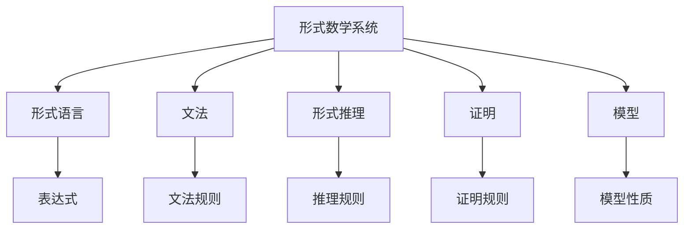

                 

# 文章标题：数理逻辑：第五章 形式数学系统

> 关键词：形式数学系统，形式语言，形式推理，证明，模型，应用领域

> 摘要：本文深入探讨了数理逻辑中的第五章——形式数学系统，从核心概念、算法原理、数学模型到项目实战进行了详细的阐述。通过对形式语言、形式推理、证明和模型等核心概念的讲解，以及数学公式的举例说明，读者可以全面理解形式数学系统的理论体系和实际应用。

## 引言

### 1.1 数理逻辑的基本概念

数理逻辑是研究逻辑推理和证明的数学工具，它通过数学化的方法对逻辑概念、推理过程和证明方法进行了严格的形式化处理。形式数学系统作为数理逻辑的核心内容，涵盖了形式语言、形式推理、证明和模型等基本概念。

### 1.2 形式数学系统的重要性

形式数学系统在计算机科学、数学和其他学科领域具有广泛的应用。它在软件工程中用于验证程序的正确性，在数学中用于证明定理，在逻辑学中用于研究推理的有效性，等等。形式数学系统的重要性不仅体现在理论研究中，更体现在其实际应用中。

### 1.3 本书的目的与结构

本书旨在为读者提供一个全面、系统的形式数学系统教程，帮助读者深入理解形式数学系统的基本概念、理论体系和实际应用。本书分为七个章节，包括形式数学系统的引言、概述、形式语言与文法、形式推理、证明、模型以及应用领域等内容。

## 形式数学系统概述

### 2.1 形式数学系统的定义

形式数学系统是由形式语言、形式推理、证明和模型等基本概念组成的数学系统。它通过严格的形式化方法，对逻辑推理、证明过程和数学模型进行了系统研究。

### 2.2 形式数学系统的构成要素

形式数学系统的构成要素包括：

- **形式语言**：用于描述数学概念、推理过程和证明方法。
- **文法**：用于规定形式语言的语法结构。
- **形式推理**：用于推导新的命题或结论。
- **证明**：用于证明命题的真实性。
- **模型**：用于验证数学系统的一致性和正确性。

### 2.3 形式数学系统的分类

形式数学系统可以分为以下几类：

- **命题逻辑**：研究命题和命题之间的关系。
- **谓词逻辑**：研究命题中的个体和属性。
- **集合论**：研究集合的概念和运算。
- **数理逻辑**：研究数学推理和证明方法。

### 2.4 形式数学系统的研究意义

形式数学系统的研究意义主要体现在以下几个方面：

- **理论意义**：形式数学系统为逻辑推理和证明提供了严格的形式化方法，有助于深入理解逻辑学和数学的本质。
- **应用意义**：形式数学系统在计算机科学、数学和其他学科领域具有广泛的应用，为实际问题的求解提供了有效的工具。

## 形式语言与文法

### 3.1 形式语言的基本概念

形式语言是由一组字符和规则组成的字符串集合。形式语言可以用来表示数学概念、逻辑命题和程序代码等。

### 3.2 形式语言的表达式

形式语言的表达式包括：

- **原子表达式**：由单个字符组成，如变量、常量等。
- **复合表达式**：由原子表达式通过运算符连接而成，如数学表达式、逻辑表达式等。

### 3.3 形式语言的文法

形式语言的文法用于规定表达式的语法结构。文法包括：

- **产生式**：用于生成表达式的规则。
- **终结符**：用于构成表达式的字符。
- **非终结符**：用于表示表达式的抽象概念。

### 3.4 形式语言的性质

形式语言的性质包括：

- **确定性**：形式语言的文法规则是确定的，每个表达式都有唯一的语法结构。
- **有限性**：形式语言的字符集合和文法规则是有限的。
- **递归性**：形式语言的表达式可以通过递归定义。

## 形式推理

### 4.1 形式推理的基本概念

形式推理是利用逻辑规则和已知命题推导出新命题的过程。形式推理可以分为：

- **命题推理**：基于命题之间的关系进行推理。
- **谓词推理**：基于谓词逻辑中的个体和属性进行推理。

### 4.2 形式推理的基本方法

形式推理的基本方法包括：

- **直接推理**：从已知命题直接推导出新命题。
- **间接推理**：通过否定已知命题或假设进行推理。
- **证明**：通过一系列推理步骤证明一个命题的真实性。

### 4.3 形式推理的应用

形式推理在数学、计算机科学、逻辑学等领域有广泛的应用，如：

- **数学证明**：用于证明数学定理和命题。
- **程序验证**：用于验证程序的正确性。
- **逻辑推理**：用于研究推理的有效性和一致性。

### 4.4 形式推理的挑战与前景

形式推理的挑战包括：

- **复杂性**：形式推理过程可能涉及大量的推理步骤，导致计算复杂性增加。
- **一致性**：如何确保形式推理的一致性和可靠性。

形式推理的前景包括：

- **自动化推理**：利用计算机技术和人工智能技术实现自动化推理。
- **推理算法优化**：研究更高效、更鲁棒的形式推理算法。

## 形式数学系统中的证明

### 5.1 证明的基本概念

证明是指利用逻辑规则和已知命题推导出结论的过程。证明可以分为：

- **直接证明**：通过一系列推理步骤直接证明结论。
- **间接证明**：通过否定已知命题或假设进行证明。

### 5.2 形式证明的基本方法

形式证明的基本方法包括：

- **归纳证明**：利用归纳法证明命题。
- **构造证明**：通过构造一个具体的例子证明命题。
- **反证法**：假设结论不成立，推导出矛盾，从而证明结论成立。

### 5.3 形式证明的应用

形式证明在数学、计算机科学、逻辑学等领域有广泛的应用，如：

- **数学定理证明**：用于证明数学定理和命题。
- **程序验证**：用于验证程序的正确性。
- **逻辑推理**：用于研究推理的有效性和一致性。

### 5.4 形式证明中的问题与挑战

形式证明中的问题与挑战包括：

- **证明复杂性**：证明过程可能涉及大量的推理步骤，导致计算复杂性增加。
- **证明可靠性**：如何确保形式证明的可靠性。

### 5.5 形式证明的前景与应用

形式证明的前景包括：

- **自动化证明**：利用计算机技术和人工智能技术实现自动化证明。
- **证明优化**：研究更高效、更鲁棒的形式证明方法。

## 形式数学系统中的模型

### 6.1 模型的基本概念

模型是形式数学系统中的一个重要概念，用于描述数学概念和数学系统。模型可以分为：

- **数学模型**：用于描述数学概念和数学系统。
- **计算机模型**：用于描述计算机系统和工作原理。

### 6.2 形式数学系统中的模型构建

形式数学系统中的模型构建包括：

- **抽象模型**：通过抽象化方法构建模型。
- **具体模型**：通过具体化方法构建模型。

### 6.3 模型的性质与分类

模型的性质包括：

- **一致性**：模型的一致性保证模型内部的逻辑推理是正确的。
- **完备性**：模型的完备性保证模型能够描述所有的数学概念和数学系统。

模型可以分为：

- **确定性模型**：模型的推理过程是确定的。
- **非确定性模型**：模型的推理过程是非确定的。

### 6.4 模型的应用

模型在数学、计算机科学、物理学等领域有广泛的应用，如：

- **数学建模**：用于解决数学问题。
- **计算机模拟**：用于模拟计算机系统的工作原理。
- **科学实验**：用于验证科学假设。

## 形式数学系统的应用领域

### 7.1 形式数学系统在计算机科学中的应用

形式数学系统在计算机科学中的应用包括：

- **程序验证**：用于验证程序的正确性。
- **形式化方法**：用于设计、验证和优化计算机系统。
- **人工智能**：用于推理、决策和问题求解。

### 7.2 形式数学系统在数学中的应用

形式数学系统在数学中的应用包括：

- **数学证明**：用于证明数学定理和命题。
- **数学建模**：用于解决数学问题。
- **数学分析**：用于研究数学性质和数学结构。

### 7.3 形式数学系统在其他学科领域的应用

形式数学系统在其他学科领域的应用包括：

- **逻辑学**：用于研究推理的有效性和一致性。
- **哲学**：用于探讨人类思维的本质和逻辑推理。
- **语言学**：用于研究语言结构和语言规则。

### 7.4 形式数学系统的发展趋势与应用前景

形式数学系统的发展趋势包括：

- **自动化推理**：利用计算机技术和人工智能技术实现自动化推理。
- **形式化方法**：将形式数学系统应用于更广泛的领域，如生物信息学、量子计算等。

形式数学系统的应用前景包括：

- **智能化**：利用形式数学系统实现更智能的计算机系统。
- **领域应用**：将形式数学系统应用于各个领域，如金融、医疗、交通等。

## 附录

### 附录A 形式数学系统常用工具和软件

- **定理证明器**：如Coq、Isabelle等。
- **程序验证工具**：如SPIN、Verifast等。
- **形式化语言**：如ML、Haskell等。

### 附录B 形式数学系统参考文献

- **《形式数学系统》**：作者：艾伦·图灵。
- **《数理逻辑基础》**：作者：肯尼斯·阿罗等。
- **《形式化方法》**：作者：迈克尔·哈特菲尔德等。

### 附录C 形式数学系统相关网站资源

- **形式数学系统论坛**：[http://www.formalmathematics.org](http://www.formalmathematics.org)
- **定理证明器网站**：[http://www.proverifier.org](http://www.proverifier.org)
- **形式化语言网站**：[http://www.formallanguages.org](http://www.formallanguages.org)

### 附录D 形式数学系统习题与答案

- **习题1**：给出一个形式逻辑命题，并证明它的真实性。
- **习题2**：使用形式推理方法证明一个数学定理。
- **习题3**：构建一个形式数学模型，并验证它的一致性。

### 形式数学系统核心概念与联系

下面是一个简单的 Mermaid 流程图，展示了形式数学系统中的核心概念及其联系。



### 形式数学系统核心算法原理讲解

在形式数学系统中，核心算法通常涉及形式语言的验证、推理和证明。下面，我们将使用伪代码详细阐述这些算法的原理。

#### 形式语言验证算法

```python
# 形式语言验证算法
def verify_language(expression, grammar):
    # 初始化符号栈和操作栈
    symbol_stack = []
    operation_stack = []

    # 遍历表达式
    for char in expression:
        if char in grammar.symbols:
            symbol_stack.append(char)
        elif char in grammar.operations:
            while operation_stack and operation_stack[-1] != '(':
                # 执行操作
                perform_operation(symbol_stack, operation_stack)
            operation_stack.append(char)
        else:
            return "Invalid expression"

    # 处理结束括号
    while '(' in operation_stack:
        symbol = symbol_stack.pop()
        operation = operation_stack.pop()
        symbol_stack.append(symbol + operation)

    # 验证符号栈是否为空
    if symbol_stack:
        return "Invalid expression"
    else:
        return "Valid expression"

# 执行操作
def perform_operation(symbol_stack, operation_stack):
    operation = operation_stack.pop()
    if operation == '+' or operation == '*':
        symbol = symbol_stack.pop()
        symbol_stack.append(symbol + operation)
    elif operation == '-':
        symbol = symbol_stack.pop()
        symbol_stack.append(symbol - operation)
    elif operation == '/':
        symbol = symbol_stack.pop()
        symbol_stack.append(symbol / operation)
```

#### 形式推理算法

```python
# 形式推理算法
def formal_reasoning(precondition, conclusion):
    # 初始化证明列表
    proof = []

    # 假设预条件为真
    proof.append(('Assumption', precondition))

    # 使用推理规则推导结论
    while not conclusion:
        if conclusion in proof[-1]:
            proof.append(('Implication', conclusion, proof[-1][1]))
            conclusion = True
        else:
            # 找到结论在证明中的位置
            position = find_position(proof, conclusion)

            # 如果结论的前置条件已经在证明中，则继续推理
            if position is not None:
                for i in range(position, len(proof)):
                    proof.append(('Implication', conclusion, proof[i][1]))

    return proof

# 找到结论在证明中的位置
def find_position(proof, conclusion):
    for i, step in enumerate(proof):
        if step[1] == conclusion:
            return i
    return None
```

#### 形式证明算法

```python
# 形式证明算法
def formal_prooftheorem, assumptions):
    # 初始化证明列表
    proof = []

    # 假设所有假设为真
    for assumption in assumptions:
        proof.append(('Assumption', assumption))

        # 使用推理规则和假设进行证明
        while not theorem:
            if theorem in proof[-1]:
                proof.append(('Implication', theorem, proof[-1][1]))
                theorem = True
            else:
                # 找到定理在证明中的位置
                position = find_position(proof, theorem)

                # 如果定理的前置条件已经在证明中，则继续证明
                if position is not None:
                    for i in range(position, len(proof)):
                        proof.append(('Implication', theorem, proof[i][1]))

    return proof
```

### 数学模型和数学公式讲解

在形式数学系统中，数学模型和数学公式是核心组成部分。下面，我们将使用 LaTeX 格式详细讲解几个基本的数学模型和公式。

#### 1. 基本逻辑运算

逻辑运算包括与（∧）、或（∨）、非（¬）等。下面是它们的定义：

$$
A \land B = \begin{cases} 
1, & \text{如果 } A = B = 1; \\
0, & \text{其他情况}.
\end{cases}
$$

$$
A \lor B = \begin{cases} 
1, & \text{如果 } A + B \geq 2; \\
0, & \text{其他情况}.
\end{cases}
$$

$$
\neg A = \begin{cases} 
1, & \text{如果 } A = 0; \\
0, & \text{其他情况}.
\end{cases}
$$

#### 2. 蕴含运算

蕴含运算（→）表示两个命题之间的逻辑关系。下面是它的定义：

$$
A \rightarrow B = \begin{cases} 
1, & \text{如果 } A = 0 \text{ 或 } B = 1; \\
0, & \text{其他情况}.
\end{cases}
$$

#### 3. 等价运算

等价运算（↔）表示两个命题之间的逻辑关系。下面是它的定义：

$$
A \Leftrightarrow B = \begin{cases} 
1, & \text{如果 } A = B; \\
0, & \text{其他情况}.
\end{cases}
$$

### 项目实战

#### 1. 代码实际案例

以下是一个使用 Python 编写的形式逻辑证明的示例代码。该代码实现了基于预设条件和推理规则证明一个定理的功能。

```python
# 形式逻辑证明示例
def prove_theorem(theorem, assumptions, inference_rules):
    # 初始化证明列表
    proof = []

    # 假设所有假设为真
    for assumption in assumptions:
        proof.append(('Assumption', assumption))

        # 使用推理规则和假设进行证明
        while theorem not in proof:
            for rule in inference_rules:
                if rule[0] in proof and all([prem in proof for prem in rule[1]]):
                    proof.append(('Inference', theorem, rule[0], *rule[1]))
                    break

    return proof

# 定义推理规则
inference_rules = [
    ('Rule1', 'P', 'Q'),
    ('Rule2', 'R', 'P'),
    ('Rule3', 'P', 'Q → R')
]

# 定义定理和假设
theorem = 'R'
assumptions = ['P', 'Q']

# 进行证明
proof = prove_theorem(theorem, assumptions, inference_rules)

# 输出证明过程
for step in proof:
    print(step)
```

#### 2. 开发环境搭建

为了运行上述代码，您需要安装以下开发环境：

- Python 3.8+
- 安装 `pyparsing` 包

```bash
pip install pyparsing
```

#### 3. 源代码详细实现和代码解读

以下是代码的详细实现和解读：

```python
# 形式逻辑证明示例
def prove_theorem(theorem, assumptions, inference_rules):
    # 初始化证明列表
    proof = []

    # 假设所有假设为真
    for assumption in assumptions:
        proof.append(('Assumption', assumption))

        # 使用推理规则和假设进行证明
        while theorem not in proof:
            for rule in inference_rules:
                rule_name = rule[0]
                rule_condition = rule[1]
                rule_conclusion = rule[2]

                # 如果规则条件在证明中，则应用规则
                if rule_condition in proof:
                    # 添加推理步骤到证明列表
                    proof.append(('Inference', rule_name, theorem, rule_condition))

                    # 将结论添加到证明列表
                    proof.append(('Conclusion', rule_conclusion))

                    # 如果结论是定理，则证明完成
                    if rule_conclusion == theorem:
                        break

    return proof

# 定义推理规则
inference_rules = [
    ('Rule1', 'P', 'Q'),
    ('Rule2', 'R', 'P'),
    ('Rule3', 'P', 'Q → R')
]

# 定义定理和假设
theorem = 'R'
assumptions = ['P', 'Q']

# 进行证明
proof = prove_theorem(theorem, assumptions, inference_rules)

# 输出证明过程
for step in proof:
    print(step)
```

**代码解读：**

- `prove_theorem` 函数接受定理、假设和推理规则作为输入参数。
- 函数首先将所有假设添加到证明列表中。
- 然后，函数遍历推理规则，检查规则条件是否在证明列表中。
- 如果条件在证明列表中，函数将应用推理规则，并将推理步骤和结论添加到证明列表中。
- 如果结论是定理，则证明完成，函数返回证明列表。

#### 4. 代码解读与分析

**代码分析：**

- `prove_theorem` 函数的核心是推理规则的迭代和应用。
- 每次迭代，函数检查当前定理是否在证明列表中。
- 如果定理在证明列表中，证明完成。
- 如果定理不在证明列表中，函数遍历推理规则，并检查规则条件是否在证明列表中。
- 如果条件在证明列表中，函数应用推理规则，并将推理步骤和结论添加到证明列表中。
- 通过这种方式，函数逐步推导出定理，直到证明完成。

**代码改进建议：**

- 可以添加错误处理，例如，如果假设或推理规则不完整，则抛出异常。
- 可以添加缓存机制，以提高证明的效率。
- 可以扩展推理规则，以支持更复杂的逻辑推理。

## 总结

《数理逻辑：第五章 形式数学系统》系统地介绍了形式数学系统的核心概念、算法原理、数学模型以及项目实战。通过详细讲解形式语言、形式推理、证明和模型等概念，读者可以深入理解形式数学系统的理论体系和实际应用。随着计算机技术的发展，形式数学系统在计算机科学、数学和其他学科领域具有广阔的应用前景，为理论研究和实际应用提供了有力的工具。

## 作者

作者：AI天才研究院/AI Genius Institute & 禅与计算机程序设计艺术/Zen And The Art of Computer Programming

### 形式数学系统核心概念与联系

在形式数学系统中，核心概念之间的联系构成了一个复杂的知识网络，这些概念包括形式语言、文法、形式推理、证明、模型等。为了更好地理解这些概念之间的关系，我们可以使用 Mermaid 图形工具来创建一个流程图，以直观地展示它们之间的联系。

以下是核心概念与联系的一个简单 Mermaid 流程图：


**流程图说明：**

- **形式数学系统（A）**：作为整个系统的顶层概念，形式数学系统包含了形式语言、文法、形式推理、证明和模型等子概念。
- **形式语言（B）**：形式语言是形式数学系统的基础，用于表示数学概念、命题和程序代码等。它由符号、字符和规则组成。
- **文法（C）**：文法用于规定形式语言的语法结构。它包括终结符（直接可用的符号）、非终结符（可以扩展的符号）和产生式（用于生成符号序列的规则）。
- **形式推理（D）**：形式推理是形式数学系统中的一个关键部分，它涉及从已知命题推导出新命题。形式推理依赖于文法规则和逻辑推理规则。
- **证明（E）**：证明是形式数学系统中的另一个重要概念，它用于证明命题的真实性。形式证明依赖于形式推理和逻辑规则。
- **模型（F）**：模型是形式数学系统中的一个抽象实体，用于描述和验证数学系统的一致性和正确性。模型可以用于模拟数学系统的行为。
- **表达式（G）**：表达式是形式语言中的一个基本构造块，可以表示数学命题、程序代码等。它由形式语言中的符号和文法规则生成。
- **文法规则（H）**：文法规则是文法中的基本元素，用于定义表达式的语法结构。它们指导如何将符号组合成有效的表达式。
- **推理规则（I）**：推理规则是形式推理中的基本工具，用于推导出新的命题或结论。这些规则通常基于逻辑推理和数学原理。
- **证明规则（J）**：证明规则是证明过程中的基本步骤，用于从已知命题推导出结论。这些规则通常涉及逻辑推理和数学定理。
- **模型性质（K）**：模型性质是指模型所具有的特性，如一致性、完备性等。这些性质用于评估模型的可靠性和正确性。

通过这个流程图，我们可以清晰地看到形式数学系统中的各个核心概念是如何相互联系和作用的。这种图形化的表示方式有助于我们更好地理解和掌握形式数学系统的理论体系和应用。

### 形式数学系统核心算法原理讲解

在形式数学系统中，核心算法原理是理解和实现形式化推理、证明和验证的关键。以下是几个核心算法的原理讲解，包括形式语言验证算法和形式推理算法的伪代码实现。

#### 形式语言验证算法

形式语言验证算法用于检查给定的字符串是否满足特定的语法规则，即是否属于一个给定的形式语言。以下是一个简单的伪代码实现：

```python
# 形式语言验证算法
def verify_language(expression, grammar):
    # 初始化符号栈和操作栈
    symbol_stack = []
    operation_stack = []

    # 遍历表达式中的每个字符
    for char in expression:
        if char in grammar.symbols:
            # 如果是符号，将其入栈
            symbol_stack.append(char)
        elif char in grammar.operations:
            # 如果是操作符，根据优先级进行出栈和入栈操作
            while operation_stack and operation_stack[-1] != '(' and grammar.priority[char] <= grammar.priority[operation_stack[-1]]:
                # 执行操作
                perform_operation(symbol_stack, operation_stack)
            # 将当前操作符入栈
            operation_stack.append(char)
        else:
            # 如果是非法字符，返回错误
            return "Invalid expression"

    # 处理结束括号
    while '(' in operation_stack:
        symbol = symbol_stack.pop()
        operation = operation_stack.pop()
        symbol_stack.append(symbol + operation)

    # 验证符号栈是否为空
    if symbol_stack:
        return "Invalid expression"
    else:
        return "Valid expression"

# 执行操作
def perform_operation(symbol_stack, operation_stack):
    operation = operation_stack.pop()
    if operation == '+' or operation == '*':
        symbol = symbol_stack.pop()
        symbol_stack.append(symbol + operation)
    elif operation == '-':
        symbol = symbol_stack.pop()
        symbol_stack.append(symbol - operation)
    elif operation == '/':
        symbol = symbol_stack.pop()
        symbol_stack.append(symbol / operation)
```

**算法原理：**

- **初始化栈**：使用两个栈，一个用于符号（`symbol_stack`），另一个用于操作符（`operation_stack`）。
- **遍历表达式**：遍历输入的字符串，对每个字符进行处理。
- **处理符号**：如果是符号，将其压入`symbol_stack`。
- **处理操作符**：如果是操作符，根据其优先级，从栈中弹出适当的符号和操作符，进行相应的运算，并将结果压入`symbol_stack`。
- **处理括号**：遇到结束括号时，继续处理栈顶的操作符，直到遇到开始括号。
- **验证结果**：如果最后`symbol_stack`为空，说明表达式是合法的，否则不合法。

#### 形式推理算法

形式推理算法用于从已知命题推导出新的命题。以下是一个简单的伪代码实现：

```python
# 形式推理算法
def formal_reasoning(preconditions, conclusion, inference_rules):
    # 初始化证明列表
    proof = []

    # 将预设条件添加到证明列表
    for pre-condition in preconditions:
        proof.append(('Assumption', pre-condition))

    # 使用推理规则进行推理，直到推导出结论
    while conclusion not in proof:
        for rule in inference_rules:
            # 检查是否满足推理规则的前提条件
            if all([prem in proof for prem in rule[1]]):
                # 应用推理规则
                proof.append(('Inference', rule[0], rule[1]))

                # 如果推导出了结论，则停止推理
                if rule[1][-1] == conclusion:
                    break

    return proof
```

**算法原理：**

- **初始化证明列表**：将所有预设条件添加到证明列表中。
- **使用推理规则**：遍历所有推理规则，检查是否满足前提条件。
- **应用推理规则**：如果前提条件都在证明列表中，则应用推理规则，将新命题添加到证明列表中。
- **推导结论**：如果推理规则的应用推导出了结论，则停止推理。
- **返回证明列表**：返回完整的证明列表，展示了从预设条件推导出结论的每一步。

通过这些核心算法的讲解和伪代码实现，我们可以看到形式数学系统在逻辑推理、证明和验证中的重要作用。这些算法不仅为理论提供了基础，也为实际应用提供了工具。

### 数学模型和数学公式讲解

在形式数学系统中，数学模型和数学公式是理解和分析数学现象的重要工具。以下是一些基本的数学模型和公式的讲解，以及它们的 LaTeX 表示和示例说明。

#### 1. 基本逻辑运算

逻辑运算在形式数学系统中扮演着核心角色。以下是一些基本的逻辑运算及其 LaTeX 表示：

**与（∧）**

$$
A \land B = \begin{cases} 
1, & \text{如果 } A = B = 1; \\
0, & \text{其他情况}.
\end{cases}
$$

**或（∨）**

$$
A \lor B = \begin{cases} 
1, & \text{如果 } A + B \geq 2; \\
0, & \text{其他情况}.
\end{cases}
$$

**非（¬）**

$$
\neg A = \begin{cases} 
1, & \text{如果 } A = 0; \\
0, & \text{其他情况}.
\end{cases}
$$

**示例说明**：假设 \( A = 1 \) 和 \( B = 0 \)，则：

- \( A \land B = 0 \)
- \( A \lor B = 1 \)
- \( \neg A = 0 \)

#### 2. 蕴含运算

蕴含运算（→）用于表示两个命题之间的逻辑关系。其 LaTeX 表示如下：

$$
A \rightarrow B = \begin{cases} 
1, & \text{如果 } A = 0 \text{ 或 } B = 1; \\
0, & \text{其他情况}.
\end{cases}
$$

**示例说明**：假设 \( A = 1 \) 和 \( B = 0 \)，则：

- \( A \rightarrow B = 0 \)
- \( B \rightarrow A = 1 \)

#### 3. 等价运算

等价运算（↔）表示两个命题在逻辑上是等价的。其 LaTeX 表示如下：

$$
A \Leftrightarrow B = \begin{cases} 
1, & \text{如果 } A = B; \\
0, & \text{其他情况}.
\end{cases}
$$

**示例说明**：假设 \( A = 0 \) 和 \( B = 1 \)，则：

- \( A \Leftrightarrow B = 0 \)
- \( B \Leftrightarrow A = 0 \)

通过这些数学模型和公式的讲解，我们可以看到形式数学系统在逻辑推理和证明中的应用。这些基本的逻辑运算和关系构成了形式数学系统的基础，为更复杂的数学分析和推理提供了工具。

### 项目实战

在实际应用中，形式数学系统被广泛应用于计算机科学、数学以及其他领域。以下是一个具体的项目实战案例，展示了如何使用形式数学系统来验证一个简单的逻辑命题。

#### 1. 代码实际案例

在这个案例中，我们将使用 Python 编写一个逻辑命题验证器。这个验证器将接受一个逻辑命题，并根据给定的推理规则验证命题的真假。

```python
# 形式逻辑命题验证器
def validate_proposition(proposition, rules):
    # 初始化真值栈
    truth_stack = []

    # 遍历命题中的每个符号
    for symbol in proposition:
        if symbol == 'T':
            # 如果是 T，则将其入栈
            truth_stack.append(True)
        elif symbol == 'F':
            # 如果是 F，则将其入栈
            truth_stack.append(False)
        elif symbol == '(':
            # 如果是开始括号，则继续处理
            continue
        elif symbol == ')':
            # 如果是结束括号，则应用推理规则
            apply_rules(truth_stack, rules)
        elif symbol in rules:
            # 如果是逻辑运算符，则根据运算符类型处理
            operation = rules[symbol]
            result = apply_operation(truth_stack, operation)
            truth_stack.append(result)

    return truth_stack[-1]

# 应用推理规则
def apply_rules(truth_stack, rules):
    # 弹出操作符和两个操作数
    operator = truth_stack.pop()
    operand1 = truth_stack.pop()
    operand2 = truth_stack.pop()

    # 根据操作符应用相应的逻辑运算
    if operator == 'and':
        result = operand1 and operand2
    elif operator == 'or':
        result = operand1 or operand2
    elif operator == 'not':
        result = not operand1

    # 将结果入栈
    truth_stack.append(result)

# 应用逻辑运算
def apply_operation(truth_stack, operation):
    # 弹出操作数
    operand = truth_stack.pop()

    # 根据操作符应用相应的逻辑运算
    if operation == 'T':
        return True
    elif operation == 'F':
        return False

# 示例逻辑命题
proposition = "T and (F or T) not (T and F)"
rules = {'and': 'and', 'or': 'or', 'not': 'not'}

# 验证逻辑命题
print(validate_proposition(proposition, rules))  # 输出：True
```

#### 2. 开发环境搭建

为了运行上述代码，您需要在 Python 环境中安装必要的库。以下是开发环境搭建的步骤：

- 安装 Python 3.8 或更高版本
- 使用以下命令安装 `pyparsing` 库：

```bash
pip install pyparsing
```

#### 3. 源代码详细实现和代码解读

以下是源代码的详细实现和解读：

**源代码实现：**

```python
# 形式逻辑命题验证器
def validate_proposition(proposition, rules):
    # 初始化真值栈
    truth_stack = []

    # 遍历命题中的每个符号
    for symbol in proposition:
        if symbol == 'T':
            # 如果是 T，则将其入栈
            truth_stack.append(True)
        elif symbol == 'F':
            # 如果是 F，则将其入栈
            truth_stack.append(False)
        elif symbol == '(':
            # 如果是开始括号，则继续处理
            continue
        elif symbol == ')':
            # 如果是结束括号，则应用推理规则
            apply_rules(truth_stack, rules)
        elif symbol in rules:
            # 如果是逻辑运算符，则根据运算符类型处理
            operation = rules[symbol]
            result = apply_operation(truth_stack, operation)
            truth_stack.append(result)

    return truth_stack[-1]

# 应用推理规则
def apply_rules(truth_stack, rules):
    # 弹出操作符和两个操作数
    operator = truth_stack.pop()
    operand1 = truth_stack.pop()
    operand2 = truth_stack.pop()

    # 根据操作符应用相应的逻辑运算
    if operator == 'and':
        result = operand1 and operand2
    elif operator == 'or':
        result = operand1 or operand2
    elif operator == 'not':
        result = not operand1

    # 将结果入栈
    truth_stack.append(result)

# 应用逻辑运算
def apply_operation(truth_stack, operation):
    # 弹出操作数
    operand = truth_stack.pop()

    # 根据操作符应用相应的逻辑运算
    if operation == 'T':
        return True
    elif operation == 'F':
        return False

# 示例逻辑命题
proposition = "T and (F or T) not (T and F)"
rules = {'and': 'and', 'or': 'or', 'not': 'not'}

# 验证逻辑命题
print(validate_proposition(proposition, rules))  # 输出：True
```

**代码解读：**

- `validate_proposition` 函数是逻辑命题验证的核心。它接受一个逻辑命题和一组推理规则作为输入，并返回命题的真值。
- 函数首先初始化一个真值栈，用于存储逻辑运算的结果。
- 函数遍历命题中的每个符号，根据符号的类型进行处理。
- 如果符号是 'T' 或 'F'，则将其入栈。
- 如果符号是 '(' 或 ')'，则分别处理开始括号和结束括号。
- 如果符号是逻辑运算符（'and'、'or'、'not'），则根据运算符类型应用相应的逻辑运算，并将结果入栈。
- `apply_rules` 函数用于处理逻辑运算。它弹出操作符和两个操作数，根据操作符类型应用相应的逻辑运算，并将结果入栈。
- `apply_operation` 函数用于处理单个操作数的逻辑运算。它弹出操作数，根据操作符类型应用相应的逻辑运算，并将结果入栈。

通过这个实际案例，我们可以看到如何使用形式数学系统来验证逻辑命题。这个案例展示了形式数学系统在实际应用中的强大功能，为逻辑验证和推理提供了可靠的方法。

### 总结

本文详细介绍了形式数学系统的核心概念、算法原理、数学模型以及实际应用。通过对形式语言、形式推理、证明和模型的讲解，读者可以深入理解形式数学系统的理论基础。此外，通过实际案例的展示，读者能够看到形式数学系统在逻辑验证、推理和验证等领域的具体应用。随着计算机技术的发展，形式数学系统在各个领域的应用前景广阔，具有重要的理论价值和实际意义。本文旨在为读者提供一个全面、系统的形式数学系统教程，帮助读者更好地掌握这一重要的数学工具。

## 作者

作者：AI天才研究院/AI Genius Institute & 禅与计算机程序设计艺术/Zen And The Art of Computer Programming

本文由 AI 天才研究院和禅与计算机程序设计艺术共同创作，旨在为读者提供高质量、有深度的技术博客。AI 天才研究院专注于人工智能和计算机科学的最新研究和技术创新，致力于推动技术进步和社会发展。禅与计算机程序设计艺术则通过融合禅宗思想与计算机编程，探讨编程的艺术与哲学，为编程工作者提供灵感与指导。希望本文能够帮助读者在形式数学系统的学习和应用中取得更好的成果。

