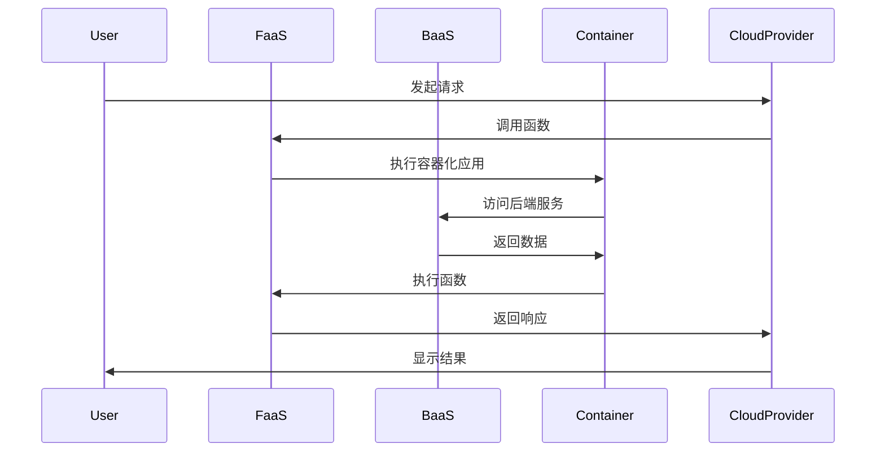
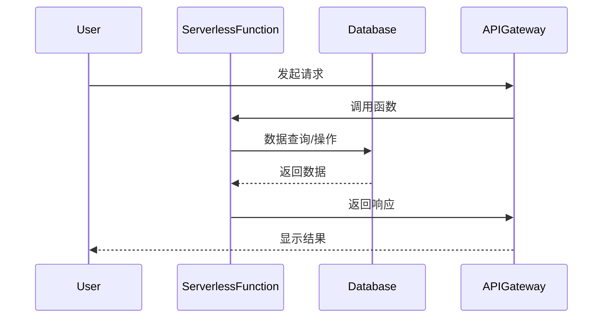

                 

### 文章标题

# 无服务器架构：Focus on Code, Not Infrastructure

### 关键词

- 无服务器架构
- 容器化技术
- Kubernetes
- 云服务提供商
- Web开发
- 移动应用
- 数据分析与人工智能
- 实践指南
- 案例分析

### 摘要

本文将深入探讨无服务器架构，这是一种越来越受欢迎的云计算模式，允许开发人员专注于编写代码，而无需担心基础设施的管理。我们将从无服务器架构的基础概念开始，逐步分析其在Web开发、移动应用、数据分析和人工智能等领域的应用场景与优势。通过详细的案例分析、实践指南和未来发展趋势的讨论，读者将全面了解无服务器架构的强大功能和实际应用。

---

### 引言

在信息技术飞速发展的今天，云计算已经成为企业构建和部署应用程序的首选方式。随着服务器成本的上升和管理复杂性的增加，无服务器架构（Serverless Architecture）作为一种新兴的云计算模式，逐渐引起了业界的关注和青睐。无服务器架构的最大特点在于，它允许开发人员将更多的精力投入到代码的编写和业务逻辑的实现上，而无需关心底层基础设施的管理和维护。这种模式不仅降低了开发和运营成本，还提高了系统的弹性和可扩展性。

本文将围绕无服务器架构这一主题，从以下几个方面展开讨论：

1. **无服务器架构基础**：介绍无服务器架构的概念、核心概念与联系，并展示相关的流程图。
2. **无服务器架构的应用场景与优势**：详细探讨无服务器架构在Web开发、移动应用、数据分析与人工智能等领域的应用，分析其优势。
3. **无服务器架构的实践**：提供无服务器架构实践指南，包括项目规划与设计、开发环境搭建、代码编写与部署以及性能优化与监控。
4. **无服务器架构案例分析**：通过具体的案例，展示无服务器架构在真实项目中的应用。
5. **无服务器架构的未来发展趋势**：探讨无服务器架构在云计算、边缘计算和人工智能中的发展前景。

本文旨在为广大开发者提供一个全面、系统的了解无服务器架构的机会，帮助读者掌握这一新兴技术，并在实际项目中有效应用。

---

### 无服务器架构基础

#### 无服务器架构的概念

无服务器架构（Serverless Architecture）是一种云计算模型，允许开发人员构建和运行应用程序，而无需关注底层基础设施的管理和维护。在这个模型中，云服务提供商负责管理服务器、操作系统、虚拟化层和网络等基础设施，开发人员则专注于编写应用程序的业务逻辑和代码。

无服务器架构的关键特点包括：

1. **无服务器（Serverless）**：开发人员无需购买、配置或管理物理服务器。
2. **按需分配资源**：计算资源根据应用程序的需求动态分配，无需提前预定。
3. **弹性伸缩**：系统能够根据负载自动扩展或缩小资源，确保应用程序的稳定运行。
4. **按使用量计费**：仅对实际使用资源进行计费，而不是预定的资源。

无服务器架构的核心概念包括：

1. **函数即服务（Function as a Service, FaaS）**：开发者只需编写和部署函数，无需关注底层基础设施的管理。云服务提供商负责函数的执行、扩展和监控。
2. **后端即服务（Backend as a Service, BaaS）**：提供了一系列后端服务，如数据库、消息队列、身份验证和推送通知等，开发者无需自行管理这些服务。
3. **无服务器架构框架**：如Kubernetes，用于管理应用程序在不同服务器上的部署和扩展。

#### 无服务器架构的发展历程

无服务器架构的概念可以追溯到云计算的早期阶段。随着虚拟化和容器技术的发展，云计算逐渐成为一种强大的基础设施服务。2011年，亚马逊推出了AWS Lambda，这被视为无服务器架构的里程碑，标志着无服务器服务的诞生。

2014年，微软发布了Azure Functions，进一步推动了无服务器架构的发展。2016年，谷歌云发布了Google Cloud Functions，也加入了无服务器架构的竞争。

近年来，随着Kubernetes等容器编排工具的普及，无服务器架构的应用场景得到了进一步扩展。Kubernetes能够将无服务器架构中的函数和微服务进行高效的管理和部署，使得无服务器架构变得更加灵活和可扩展。

#### 无服务器架构与传统架构的比较

无服务器架构与传统架构（如虚拟机和容器）在许多方面存在显著差异，以下是一些关键对比：

1. **基础设施管理**：传统架构要求开发人员负责基础设施的采购、配置和管理，而无服务器架构则完全由云服务提供商管理。
2. **资源分配**：传统架构通常需要预先配置资源，而无服务器架构则根据实际需求动态分配资源。
3. **成本**：无服务器架构的按需计费模式通常比传统架构更经济，有助于降低运营成本。
4. **弹性**：无服务器架构能够根据负载自动扩展和缩小资源，传统架构通常需要手动调整。
5. **开发体验**：无服务器架构简化了开发流程，使得开发人员可以更专注于业务逻辑的实现。

总之，无服务器架构为开发人员提供了一种全新的云计算模式，不仅降低了开发和运营成本，还提高了系统的弹性和可扩展性。随着云服务提供商的持续投入和创新，无服务器架构在未来有望成为云计算领域的主流。

#### 核心概念与联系

在深入探讨无服务器架构的核心概念之前，我们需要先理解几个关键术语：函数即服务（FaaS）、后端即服务（BaaS）和容器化技术。

1. **函数即服务（FaaS）**：函数即服务是一种无服务器架构模式，它允许开发人员将应用程序分解为一组小型、独立的函数。这些函数在需要时由云服务提供商自动执行，无需关注底层基础设施的管理。FaaS的典型应用场景包括处理事件、执行任务和构建微服务架构。

2. **后端即服务（BaaS）**：后端即服务提供了一系列后端服务，如数据库、消息队列、身份验证和推送通知等，开发者无需自行管理这些服务。BaaS使开发人员能够专注于业务逻辑的实现，而无需担心后端基础设施的管理。BaaS常用于构建移动应用、Web应用和IoT应用。

3. **容器化技术**：容器化技术通过将应用程序及其依赖项打包到容器中，实现了应用程序的轻量化和可移植性。容器化技术有助于提高开发效率、简化部署流程和实现弹性伸缩。常见的容器化工具包括Docker和Kubernetes。

**流程图解析：**

下面是一个无服务器架构的核心概念流程图，用于展示FaaS、BaaS和容器化技术之间的联系。



**流程图解释：**

1. **用户请求**：用户通过API或Web界面向无服务器架构发起请求。
2. **云服务提供商**：云服务提供商接收用户的请求，并根据配置调用相应的函数。
3. **函数即服务（FaaS）**：FaaS根据请求执行相应的函数，这些函数可以是处理业务逻辑的小程序。
4. **容器化应用**：FaaS将函数部署到容器中，容器提供了隔离和轻量级的运行环境。
5. **后端即服务（BaaS）**：容器在执行过程中可能需要访问后端服务，如数据库或消息队列。BaaS提供了一系列可配置的后端服务。
6. **数据处理与响应**：容器与BaaS交互，处理数据并返回结果。
7. **返回响应**：最终，云服务提供商将处理结果返回给用户。

通过上述流程图，我们可以清晰地看到无服务器架构中各个组件之间的交互关系，以及它们如何协同工作以实现高效、弹性的应用程序部署。

#### 核心算法原理讲解

在无服务器架构中，核心算法的原理和实现方式是理解和应用这一技术的基础。本节将使用伪代码详细阐述一些常见算法的原理和实现，以便读者更好地掌握无服务器架构的编程技巧。

**1. 数据处理算法**

数据处理算法是许多无服务器应用的核心，负责对输入数据进行预处理、存储和分析。以下是一个数据处理算法的伪代码示例：

```python
# 伪代码：数据处理流程

def processData(data):
    # 数据预处理
    preprocessedData = preprocessData(data)
    
    # 数据存储
    storeData(preprocessedData)
    
    # 数据分析
    analysisResult = analyzeData(preprocessedData)
    
    # 返回结果
    return analysisResult

def preprocessData(data):
    # 根据需要清理和转换原始数据
    cleanedData = cleanData(data)
    transformedData = transformData(cleanedData)
    return transformedData

def storeData(data):
    # 存储预处理后的数据到数据库
    databaseConnection = connectToDatabase()
    databaseConnection.insert(data)

def analyzeData(data):
    # 使用数据处理库进行分析
    analysisLibrary = importAnalysisLibrary()
    result = analysisLibrary.analyze(data)
    return result
```

在这个数据处理算法中，我们首先对输入数据进行预处理，包括数据清洗和转换。然后，将预处理后的数据存储到数据库中，以便后续分析。最后，使用数据处理库对数据进行分析，并返回分析结果。

**2. 推荐系统算法**

推荐系统是许多无服务器应用中的另一个重要组件，它根据用户行为和偏好为用户推荐相关的内容或产品。以下是一个简单推荐系统算法的伪代码示例：

```python
# 伪代码：推荐系统算法

def recommendItems(userProfile, itemFeatures):
    # 计算用户和物品之间的相似度
    similarityMatrix = computeSimilarity(userProfile, itemFeatures)
    
    # 根据相似度矩阵为用户推荐物品
    recommendedItems = recommendItemsBasedOnSimilarity(similarityMatrix)
    
    # 返回推荐结果
    return recommendedItems

def computeSimilarity(userProfile, itemFeatures):
    # 使用余弦相似度计算用户和物品的相似度
    similarityScores = []
    for item in itemFeatures:
        score = cosineSimilarity(userProfile, item)
        similarityScores.append(score)
    return similarityScores

def recommendItemsBasedOnSimilarity(similarityMatrix):
    # 根据相似度矩阵为用户推荐最相似的物品
    highestSimilarity = max(similarityMatrix)
    recommendedItems = [index for index, score in enumerate(similarityMatrix) if score == highestSimilarity]
    return recommendedItems
```

在这个推荐系统算法中，我们首先计算用户和物品之间的相似度，通常使用余弦相似度。然后，根据相似度矩阵为用户推荐最相似的物品。这个算法可以用于各种推荐场景，如电子商务平台上的产品推荐、社交媒体上的内容推荐等。

**3. 机器学习算法**

在无服务器架构中，机器学习算法的应用也非常广泛。以下是一个简单的机器学习算法——线性回归的伪代码示例：

```python
# 伪代码：线性回归算法

def linearRegression(X, y):
    # 计算特征矩阵X和目标向量y的协方差矩阵
    X_transpose = transpose(X)
    XTX = dot(X_transpose, X)
    
    # 计算特征矩阵X和目标向量y的乘积
    XTY = dot(X_transpose, y)
    
    # 计算回归系数
    theta = dot(inverse(XTX), XTY)
    
    # 返回回归系数
    return theta

def dot(X, y):
    # 计算矩阵X和向量y的点积
    return sum([x * y for x in X])

def transpose(X):
    # 计算矩阵X的转置
    return [[X[j][i] for j in range(len(X))] for i in range(len(X[0]))]

def inverse(X):
    # 计算矩阵X的逆矩阵
    return numpy.linalg.inv(X)
```

在这个线性回归算法中，我们首先计算特征矩阵X和目标向量y的协方差矩阵和乘积，然后使用逆矩阵计算回归系数。这个算法可以用于预测和分析各种数据集，如房屋售价预测、股票市场分析等。

通过上述伪代码示例，我们可以看到无服务器架构中的核心算法是如何实现的。这些算法不仅需要开发人员具备扎实的编程基础，还需要深入了解各个算法的原理和应用场景。在实际应用中，开发人员可以根据具体需求选择合适的算法，并将其部署在无服务器环境中，以实现高效、智能的应用程序。

#### 数学模型与公式

在无服务器架构中，数学模型和公式不仅用于算法的实现，还用于性能优化和资源管理。以下将介绍几个关键的数学模型和公式，并详细解释它们在实际应用中的意义。

**1. 余弦相似度**

余弦相似度是计算两个向量相似度的一种常用方法，广泛应用于推荐系统和文本相似度计算。其公式如下：

$$
\text{cosine\_similarity} = \frac{\text{dot}(x, y)}{\lVert x \rVert \cdot \lVert y \rVert}
$$

其中，\(x\) 和 \(y\) 是两个向量，\(\lVert x \rVert\) 和 \(\lVert y \rVert\) 分别表示 \(x\) 和 \(y\) 的欧几里得范数，\(\text{dot}(x, y)\) 表示 \(x\) 和 \(y\) 的点积。

余弦相似度表示两个向量在空间中的夹角余弦值。夹角余弦值越接近1，表示两个向量越相似。在推荐系统中，我们通常使用用户和物品的特征向量计算余弦相似度，从而为用户推荐相似的物品。

**2. 线性回归**

线性回归是一种常见的机器学习算法，用于预测数值型数据。其基本公式如下：

$$
y = \theta_0 + \theta_1 \cdot x
$$

其中，\(y\) 是目标变量，\(\theta_0\) 和 \(\theta_1\) 分别是模型的参数，\(x\) 是输入特征。

线性回归的目标是找到最佳参数 \(\theta_0\) 和 \(\theta_1\)，使得预测值 \(y\) 与实际值 \(y\) 之间的误差最小。我们通常使用最小二乘法来求解这个问题，其公式如下：

$$
\theta_1 = \frac{\sum_{i=1}^{n} (x_i - \bar{x})(y_i - \bar{y})}{\sum_{i=1}^{n} (x_i - \bar{x})^2}
$$

其中，\(\bar{x}\) 和 \(\bar{y}\) 分别是输入特征 \(x\) 和目标变量 \(y\) 的平均值，\(n\) 是样本数量。

线性回归可以用于预测房屋售价、股票价格、用户行为等，是数据分析和机器学习的基础。

**3. 梯度下降**

梯度下降是一种常用的优化算法，用于求解最小化损失函数的问题。其基本公式如下：

$$
\theta_j = \theta_j - \alpha \cdot \frac{\partial}{\partial \theta_j} J(\theta)
$$

其中，\(\theta_j\) 是模型参数，\(\alpha\) 是学习率，\(J(\theta)\) 是损失函数，\(\frac{\partial}{\partial \theta_j} J(\theta)\) 是损失函数对 \(\theta_j\) 的偏导数。

梯度下降的目的是通过不断调整模型参数，使得损失函数的值最小。学习率 \(\alpha\) 控制了参数更新的步长，较大的学习率可能导致参数过快更新，从而错过最小值点；过小则可能导致收敛缓慢。

**4. 排队理论**

在无服务器架构中，队列理论用于分析系统的响应时间和吞吐量。一个基本的排队模型包括三个主要参数：到达率 \(λ\)、服务率 \(μ\) 和队列长度 \(L\)。

到达率 \(λ\) 表示单位时间内到达服务台的客户数量，服务率 \(μ\) 表示单位时间内服务台能够处理的服务数量。队列长度 \(L\) 是指在某个时间点等待服务的客户数量。

一个常用的性能指标是队列的平均长度 \(L_q\) 和等待时间 \(W_q\)，其公式如下：

$$
L_q = \frac{λ}{μ(μ - λ)}
$$

$$
W_q = \frac{L_q}{λ}
$$

这两个指标可以用来评估系统的性能。例如，当 \(λ > μ\) 时，队列长度和等待时间将增加，系统可能出现拥堵。

**5. 数据库索引**

在无服务器架构中，数据库索引用于提高数据查询的效率。一个常用的索引算法是B树索引，其基本公式如下：

$$
\text{BTree} = \{\text{Node}\}
$$

其中，\(\text{Node}\) 是树中的一个节点，包含关键字、指向子节点的指针和叶子节点的数据。

B树索引通过递归地查找节点和关键字，实现快速查找和排序。其性能优势在于能够保持平衡，避免深度过深导致的查询效率下降。

通过这些数学模型和公式，开发人员可以更深入地理解和优化无服务器架构的应用，从而提高系统的性能和可靠性。

#### 无服务器架构在Web开发中的应用

无服务器架构在Web开发中展示了其强大的优势，通过提供高效、弹性且成本低廉的解决方案，使得开发团队能够专注于业务逻辑的实现，而无需担心底层基础设施的管理和维护。以下将详细探讨无服务器架构在Web开发中的应用，包括其在前端、后端、数据库和API开发等方面的实际案例和优势。

**一、无服务器架构在Web前端开发中的应用**

1. **静态网站部署**：无服务器架构非常适合静态网站的部署。通过使用云服务提供商的静态网站托管服务，如Amazon S3或Netlify，开发人员可以轻松地将静态网站部署到互联网上。这些服务通常提供一键部署、HTTPS支持、内容分发网络（CDN）等功能，确保网站的高可用性和高性能。

   **案例**：GitHub Pages是一个流行的静态网站托管服务，它允许开发者使用GitHub仓库中的代码构建和部署静态网站。GitHub Pages与无服务器架构的结合，使得开发者能够轻松创建和分享个人博客、项目页面等。

2. **前端框架集成**：现代前端框架，如React、Vue和Angular，可以与无服务器架构无缝集成。通过使用FaaS（如AWS Lambda或Google Cloud Functions），开发者可以构建前端框架的函数组件，实现动态数据加载和交互。

   **案例**：在电商应用中，使用React框架和AWS Lambda构建前端功能，如商品推荐、用户登录等。这样可以提高用户体验，同时保持前端代码的简洁和高效。

**二、无服务器架构在Web后端开发中的应用**

1. **函数即服务（FaaS）**：无服务器架构中的FaaS使得后端服务更加灵活和可扩展。开发者只需编写和部署函数，无需担心底层基础设施的管理。

   **案例**：使用AWS Lambda构建后端服务，如处理用户请求、处理数据操作和执行后台任务。这些函数可以根据请求量自动扩展，确保高并发场景下的性能和稳定性。

2. **微服务架构**：无服务器架构支持微服务架构的实施，通过将应用程序分解为一组小型、独立的微服务，每个微服务都可以独立部署和扩展。

   **案例**：在社交媒体应用中，使用无服务器架构实现用户管理、内容发布、消息推送等微服务。通过API Gateway将不同的微服务整合在一起，提供统一的接口。

**三、无服务器架构在数据库和API开发中的应用**

1. **数据库服务**：无服务器架构提供了多种数据库服务，如关系型数据库（如Amazon RDS）和非关系型数据库（如Amazon DynamoDB），这些服务可以与无服务器架构无缝集成。

   **案例**：使用Amazon DynamoDB作为用户数据的存储，通过AWS Lambda处理数据的增删改查操作。DynamoDB提供自动缩放、高性能和低延迟，适合高并发场景。

2. **API开发**：无服务器架构支持API开发，通过API Gateway可以轻松构建和部署RESTful API。

   **案例**：使用API Gateway和AWS Lambda构建一个在线商店的API，提供商品查询、购物车管理和订单处理等功能。API Gateway可以处理不同的HTTP请求，并将请求路由到相应的Lambda函数。

**四、无服务器架构在Web开发中的优势**

1. **成本效益**：无服务器架构通过按需计费模式，使得开发人员和企业能够根据实际使用量进行费用控制，避免了不必要的支出。

2. **弹性伸缩**：无服务器架构能够根据负载自动扩展和缩小资源，确保在高并发场景下系统的稳定运行。

3. **开发效率**：无服务器架构简化了开发流程，开发人员无需关注基础设施的管理，可以将更多精力投入到业务逻辑的实现上。

4. **高可用性**：云服务提供商通常提供可靠的基础设施和全球范围的内容分发网络，确保无服务器应用的高可用性。

5. **集成与兼容性**：无服务器架构与现有的前端框架、后端服务和数据库无缝集成，使得迁移和应用部署更加简便。

总之，无服务器架构在Web开发中提供了强大的功能和显著的优点，使得开发人员和企业在构建高性能、可扩展的Web应用时具有更高的灵活性和效率。通过具体的应用案例和优势分析，我们可以看到无服务器架构在Web开发中的重要地位和广泛应用前景。

#### 无服务器架构在移动开发中的应用

在移动应用开发中，无服务器架构通过提供高效、弹性和成本效益的解决方案，显著提升了开发效率和应用性能。以下是详细探讨无服务器架构在移动开发中的应用，包括其在移动应用架构设计、部署与维护、数据存储与处理等方面的实践和优势。

**一、无服务器架构在移动应用架构设计中的应用**

1. **前端功能**：无服务器架构支持移动应用前端的功能开发，通过FaaS（如AWS Lambda或Google Cloud Functions）可以构建高效的前端逻辑，实现动态数据加载和交互。

   **案例**：在社交媒体应用中，可以使用AWS Lambda和API Gateway构建用户界面动态组件，如实时消息推送、好友动态更新等。通过FaaS实现这些功能，可以减少客户端的负担，提升用户体验。

2. **后端逻辑**：无服务器架构为移动应用的后端逻辑提供了强大的支持，通过部署和管理函数，可以处理复杂的业务逻辑和数据操作。

   **案例**：在电子商务应用中，使用AWS Lambda处理支付流程、订单管理和库存更新等业务逻辑。这些函数可以根据请求量自动扩展，确保高并发场景下的系统稳定。

3. **微服务架构**：无服务器架构支持移动应用的微服务架构，通过将应用程序分解为多个小型、独立的微服务，可以更好地实现模块化和弹性。

   **案例**：在移动游戏应用中，使用无服务器架构实现用户账户管理、游戏逻辑处理和排行榜管理等微服务。通过API Gateway将这些微服务整合在一起，提供统一的接口。

**二、无服务器架构在移动应用部署与维护中的应用**

1. **自动化部署**：无服务器架构提供了自动化部署工具，如AWS CodePipeline和Google Cloud Build，使得移动应用的部署过程更加高效和可靠。

   **案例**：使用AWS CodePipeline实现移动应用的持续集成和持续部署（CI/CD），确保代码从开发环境到生产环境的快速、安全部署。

2. **弹性伸缩**：无服务器架构可以根据负载自动扩展和缩小资源，确保移动应用在高并发场景下能够稳定运行。

   **案例**：在移动应用发布重大更新或推广活动时，无服务器架构能够自动扩展计算资源，处理增加的请求量，避免系统崩溃。

3. **维护与管理**：无服务器架构通过云服务提供商的管理界面和工具，简化了移动应用的维护和管理工作。

   **案例**：使用AWS Management Console和Google Cloud Console监控移动应用的健康状态，及时处理潜在问题，提高系统可靠性。

**三、无服务器架构在移动应用数据存储与处理中的应用**

1. **数据库服务**：无服务器架构提供了多种数据库服务，如Amazon DynamoDB和Google Cloud Firestore，这些服务可以与移动应用无缝集成。

   **案例**：在移动应用中使用DynamoDB作为用户数据的存储，通过AWS Lambda处理数据的增删改查操作。DynamoDB提供自动缩放、高性能和低延迟，适合高并发场景。

2. **数据处理**：无服务器架构支持移动应用的数据处理，通过FaaS可以高效地处理和分析大量数据。

   **案例**：在健康监测应用中，使用AWS Lambda处理用户上传的健康数据，如心率、步数等。这些函数可以根据数据量自动扩展，确保数据处理的高效和可靠。

3. **实时数据同步**：无服务器架构提供了实时数据同步机制，如WebSockets和服务器发送事件（SSE），可以实时更新移动应用的数据。

   **案例**：在视频直播应用中，使用WebSockets实现实时数据传输，确保观众能够实时观看直播内容，而无需刷新页面。

**四、无服务器架构在移动开发中的优势**

1. **开发效率**：无服务器架构简化了移动应用的开发流程，开发人员无需关注基础设施的管理，可以将更多精力投入到业务逻辑的实现上。

2. **成本效益**：无服务器架构的按需计费模式使得移动应用开发和运营的成本更低，企业可以根据实际使用量进行费用控制。

3. **弹性伸缩**：无服务器架构能够根据负载自动扩展和缩小资源，确保移动应用在高并发场景下能够稳定运行。

4. **高可用性**：云服务提供商通常提供可靠的基础设施和全球范围的内容分发网络，确保移动应用的高可用性。

5. **集成与兼容性**：无服务器架构与现有的前端框架、后端服务和数据库无缝集成，使得迁移和应用部署更加简便。

总之，无服务器架构在移动开发中展示了其强大的优势，通过提供高效、弹性和成本效益的解决方案，使得开发人员和企业在构建高性能、可扩展的移动应用时具有更高的灵活性和效率。通过具体的应用案例和优势分析，我们可以看到无服务器架构在移动开发中的重要地位和广泛应用前景。

#### 无服务器架构在数据分析和人工智能中的应用

无服务器架构在数据分析和人工智能（AI）领域展示了其独特的优势，为数据处理、机器学习模型部署和深度学习模型训练提供了高效、弹性且成本效益显著的解决方案。以下将详细探讨无服务器架构在这两个领域中的应用。

**一、无服务器架构在数据处理中的应用**

1. **大规模数据处理**：无服务器架构能够处理海量数据，通过FaaS和云计算资源的高效集成，可以快速实现大规模数据处理的任务。

   **案例**：在数据分析项目中，使用AWS Lambda和Amazon S3，可以轻松处理和转换数以TB计的数据集。AWS Lambda可以根据数据量自动扩展，确保数据处理的高效和可靠。

2. **实时数据处理**：无服务器架构支持实时数据处理，通过WebSockets和服务器发送事件（SSE），可以实现实时数据流的处理和分析。

   **案例**：在物联网（IoT）应用中，使用AWS Lambda处理来自传感器设备的实时数据，如环境监测、设备状态监控等。这些函数可以实时分析数据，触发相应的警报或执行其他操作。

3. **数据仓库集成**：无服务器架构可以与现有的数据仓库系统集成，如Amazon Redshift和Google BigQuery，实现数据的高效存储和管理。

   **案例**：在商业智能应用中，使用AWS Lambda和Amazon Redshift，可以自动化ETL（提取、转换和加载）过程，确保数据仓库中的数据始终是最新的。

**二、无服务器架构在机器学习模型部署中的应用**

1. **模型部署简化**：无服务器架构简化了机器学习模型的部署过程，开发人员只需编写和部署函数，无需关注底层基础设施的管理。

   **案例**：在金融风控系统中，使用AWS Lambda部署机器学习模型，对用户交易行为进行实时监控和风险预测。这些模型可以根据请求量自动扩展，确保高并发场景下的性能和稳定性。

2. **模型微服务化**：通过无服务器架构，可以将机器学习模型分解为多个微服务，实现模块化和弹性。

   **案例**：在医疗诊断系统中，使用无服务器架构实现多个微服务，如图像处理、疾病预测等。通过API Gateway将这些微服务整合在一起，提供统一的接口。

3. **模型性能优化**：无服务器架构提供了丰富的工具和资源，可以优化机器学习模型的性能。

   **案例**：在自然语言处理（NLP）项目中，使用Google Cloud Functions和TensorFlow，可以自动化模型的训练和部署过程，并通过调整模型参数，优化模型的性能和准确度。

**三、无服务器架构在深度学习模型训练中的应用**

1. **分布式训练**：无服务器架构支持深度学习模型的分布式训练，通过云计算资源的高效利用，可以加速模型的训练过程。

   **案例**：在图像识别项目中，使用AWS SageMaker和Kubernetes，可以实现模型的分布式训练。Kubernetes负责管理训练任务，AWS SageMaker提供高效的训练平台。

2. **动态资源分配**：无服务器架构可以根据模型训练的需求动态分配资源，确保训练过程的效率和稳定性。

   **案例**：在语音识别项目中，使用Google Cloud Functions和Google Cloud AI，可以根据训练任务的负载动态扩展计算资源，确保模型训练的顺利进行。

3. **模型优化与调优**：无服务器架构提供了丰富的工具和资源，可以优化深度学习模型的性能和效率。

   **案例**：在自动驾驶系统中，使用AWS Lambda和PyTorch，可以实现模型的训练和调优。AWS Lambda可以根据训练任务的复杂度动态调整计算资源，确保模型训练的高效和准确。

**四、无服务器架构在数据分析和人工智能中的优势**

1. **开发效率**：无服务器架构简化了数据处理和模型部署的流程，开发人员可以将更多精力投入到业务逻辑的实现上。

2. **成本效益**：无服务器架构的按需计费模式使得数据处理和模型部署的成本更低，企业可以根据实际使用量进行费用控制。

3. **弹性伸缩**：无服务器架构能够根据负载自动扩展和缩小资源，确保系统在高并发场景下能够稳定运行。

4. **高可用性**：云服务提供商通常提供可靠的基础设施和全球范围的内容分发网络，确保数据处理和模型部署的高可用性。

5. **集成与兼容性**：无服务器架构与现有的数据处理工具、机器学习和深度学习框架无缝集成，使得迁移和应用部署更加简便。

总之，无服务器架构在数据分析和人工智能领域展示了其强大的优势，通过提供高效、弹性且成本效益显著的解决方案，为企业和开发人员提供了全新的数据处理和模型部署方式。通过具体的应用案例和优势分析，我们可以看到无服务器架构在这两个领域中的重要地位和广泛应用前景。

#### 无服务器架构实践指南

要成功实施无服务器架构，需要一套详细的实践指南，涵盖项目规划与设计、开发环境搭建、代码编写与部署以及性能优化与监控。以下将逐步介绍这些关键步骤，并提供实用的建议和最佳实践。

**一、项目规划与设计**

1. **需求分析**：首先，明确项目的业务需求和目标。了解应用程序的功能、性能和可扩展性要求，有助于确定无服务器架构的实施策略。

2. **功能分解**：将应用程序的功能分解为独立的模块或服务，每个模块或服务都可以独立部署和扩展。这有助于实现模块化和弹性，便于后续的开发和部署。

3. **资源预估**：根据业务需求和性能要求，预估所需的计算、存储和网络资源。使用云服务提供商的工具和资源监控功能，可以更准确地预估资源需求。

4. **技术选型**：选择合适的技术栈和云服务提供商。根据项目的需求，选择合适的函数即服务（FaaS）、后端即服务（BaaS）和数据库服务。常见的云服务提供商包括AWS、Google Cloud、Azure等。

**二、开发环境搭建**

1. **本地开发环境**：搭建本地开发环境，包括编程工具（如IDE）、版本控制系统（如Git）和云服务提供商的模拟环境。本地开发环境可以帮助开发人员快速进行开发和测试。

2. **集成开发工具**：使用集成开发工具（如Visual Studio Code、IntelliJ IDEA）和插件，提高开发效率。这些工具通常提供了代码补全、调试和部署等功能。

3. **云服务提供商集成**：配置云服务提供商的访问权限和API密钥。确保开发人员能够访问和管理云资源，如函数、数据库和存储服务。

**三、代码编写与部署**

1. **编写函数**：使用函数即服务（FaaS）平台提供的编程语言（如Node.js、Python、Java等）编写函数。确保函数具有明确的输入和输出，遵循良好的编码规范和最佳实践。

2. **模块化设计**：将应用程序的功能模块化为多个独立的函数或服务，每个模块负责特定的业务逻辑。这有助于提高代码的可维护性和可扩展性。

3. **单元测试**：编写单元测试，确保每个函数或服务在独立环境中能够正常运行。单元测试是确保代码质量的重要步骤，有助于及时发现和修复潜在问题。

4. **部署脚本**：使用部署脚本（如Dockerfile、Kubernetes配置文件）自动化部署和扩展应用程序。这些脚本可以简化部署流程，确保环境的一致性。

5. **持续集成与持续部署（CI/CD）**：使用持续集成和持续部署工具（如Jenkins、GitLab CI/CD）实现自动化构建、测试和部署。CI/CD流程有助于确保代码的质量和系统的稳定性。

**四、性能优化与监控**

1. **性能测试**：进行性能测试，评估应用程序在不同负载下的响应时间和吞吐量。使用负载测试工具（如JMeter、LoadRunner）模拟高并发场景，发现潜在的性能瓶颈。

2. **资源监控**：使用云服务提供商的监控工具（如AWS CloudWatch、Google Stackdriver）实时监控应用程序的运行状态和资源使用情况。及时发现和解决性能问题。

3. **性能优化**：根据监控数据，对应用程序进行性能优化。例如，优化函数的执行时间、减少数据传输延迟、合理配置数据库等。

4. **日志分析**：使用日志分析工具（如ELK Stack、Splunk）分析应用程序的日志，识别和解决潜在的问题。日志分析是监控和优化应用程序的重要手段。

**五、最佳实践**

1. **微服务架构**：采用微服务架构，将应用程序分解为多个小型、独立的微服务。这有助于实现模块化和弹性，便于管理和扩展。

2. **自动扩缩容**：使用云服务提供商的自动扩缩容功能，根据负载动态调整资源。自动扩缩容有助于提高系统的弹性和可用性。

3. **容错与恢复**：实现容错机制，确保应用程序在遇到故障时能够快速恢复。例如，使用幂等性操作、重试机制和备份策略。

4. **安全性**：确保应用程序的安全性，包括数据加密、身份验证和访问控制。使用云服务提供商的安全功能（如AWS IAM、Google Cloud Identity）保护应用程序和数据。

5. **文档与培训**：编写详细的文档，记录项目的设计、开发、部署和运维流程。为团队成员提供培训，确保他们能够熟练掌握无服务器架构的使用。

通过遵循上述实践指南和最佳实践，开发人员和团队能够成功地实施无服务器架构，构建高效、弹性且成本效益显著的应用程序。

#### 无服务器架构案例分析

在本文的最后部分，我们将通过具体的案例分析，展示无服务器架构在实际项目中的应用，从而帮助读者更好地理解和掌握无服务器架构的实践方法。以下是三个具有代表性的案例，涵盖不同领域和业务场景。

**案例一：某电商平台的转型**

某大型电商平台决定采用无服务器架构进行系统升级，以应对快速增长的用户量和复杂的应用需求。项目目标包括提高系统的弹性、可扩展性和降低运维成本。

1. **需求分析**：电商平台需要处理大量的用户请求，包括商品查询、购物车管理、订单处理和支付等。此外，随着业务的扩展，系统需要支持全球化运营，这意味着需要在不同的地理位置部署计算资源。

2. **架构设计**：电商平台采用了基于FaaS和微服务架构的无服务器架构。将核心业务功能分解为多个独立的微服务，如用户管理、商品信息、购物车、订单处理和支付等。每个微服务都可以独立部署和扩展，以提高系统的弹性和可扩展性。

3. **实施步骤**：
   - 使用AWS Lambda编写和部署微服务函数，处理用户请求和业务逻辑。
   - 使用API Gateway作为统一的入口，将用户请求路由到相应的微服务函数。
   - 使用Amazon S3存储静态资源（如图片、视频等），使用Amazon CloudFront提供内容分发网络（CDN）服务。
   - 使用Amazon DynamoDB处理用户数据存储，并利用AWS Elastic Beanstalk自动化部署和管理应用。

4. **成果与收益**：通过无服务器架构的实施，电商平台实现了以下几个方面的收益：
   - **弹性伸缩**：系统能够根据用户请求自动扩展和缩小计算资源，确保在高并发场景下的稳定运行。
   - **成本降低**：由于采用了按需计费模式，电商平台在计算和存储资源上的支出显著减少。
   - **开发效率提升**：开发人员可以专注于业务逻辑的实现，无需担心基础设施的管理和维护。
   - **用户体验优化**：通过使用CDN和优化后的数据存储，用户访问速度得到了显著提升，用户体验得到改善。

**案例二：某金融公司的无服务器架构实践**

某金融公司希望通过无服务器架构来优化其IT基础设施，提高系统的安全性和可靠性。该公司的主要业务包括在线交易、账户管理和风险控制等。

1. **需求分析**：金融公司需要处理大量的金融交易数据，并确保数据的准确性和安全性。同时，随着业务的发展，系统需要支持更多的交易类型和功能，这意味着系统需要具备高可用性和高扩展性。

2. **架构设计**：金融公司采用了基于Kubernetes和FaaS的无服务器架构。将核心业务功能分解为多个微服务，如交易管理、账户管理、风险控制和数据监控等。每个微服务都可以独立部署和扩展，以提高系统的弹性和可扩展性。

3. **实施步骤**：
   - 使用Kubernetes管理微服务的部署和扩展，确保系统的高可用性和可靠性。
   - 使用AWS Lambda编写和部署交易处理和风险控制等微服务函数。
   - 使用Amazon RDS处理关系型数据库需求，使用Amazon S3处理非关系型数据存储。
   - 使用AWS WAF（Web应用防火墙）和AWS IAM（身份访问管理）确保系统的安全。

4. **成果与收益**：通过无服务器架构的实施，金融公司实现了以下几个方面的收益：
   - **安全性提升**：通过使用AWS WAF和IAM，金融公司提高了系统的安全性，防止恶意攻击和数据泄露。
   - **性能优化**：通过使用Kubernetes和AWS Lambda，系统在处理大量交易数据时表现出色，响应时间显著缩短。
   - **成本降低**：由于采用了按需计费模式，金融公司在计算和存储资源上的支出显著减少。
   - **管理简化**：通过Kubernetes的自动化管理功能，金融公司简化了系统运维，降低了运维成本。

**案例三：某教育平台的无服务器架构建设**

某在线教育平台希望通过无服务器架构提高系统的弹性和可扩展性，同时降低运维成本。该平台提供了在线课程、直播授课、作业提交和成绩管理等功能。

1. **需求分析**：教育平台需要支持大量用户的并发访问，尤其是在课程发布和考试时间，系统需要具备高并发处理能力和快速响应速度。

2. **架构设计**：教育平台采用了基于FaaS和API Gateway的无服务器架构。将核心业务功能分解为多个独立的微服务，如课程管理、直播授课、作业提交和成绩管理等。每个微服务都可以独立部署和扩展，以提高系统的弹性和可扩展性。

3. **实施步骤**：
   - 使用AWS Lambda编写和部署微服务函数，处理用户请求和业务逻辑。
   - 使用API Gateway作为统一的入口，将用户请求路由到相应的微服务函数。
   - 使用Amazon S3存储课程内容和作业提交文件，使用Amazon CloudFront提供内容分发网络（CDN）服务。
   - 使用Amazon RDS处理用户数据存储，并利用AWS Elastic Beanstalk自动化部署和管理应用。

4. **成果与收益**：通过无服务器架构的实施，教育平台实现了以下几个方面的收益：
   - **弹性伸缩**：系统能够根据用户请求自动扩展和缩小计算资源，确保在高并发场景下的稳定运行。
   - **成本降低**：由于采用了按需计费模式，教育平台在计算和存储资源上的支出显著减少。
   - **开发效率提升**：开发人员可以专注于业务逻辑的实现，无需担心基础设施的管理和维护。
   - **用户体验优化**：通过使用CDN和优化后的数据存储，用户访问速度得到了显著提升，用户体验得到改善。

通过上述三个案例分析，我们可以看到无服务器架构在不同领域和业务场景中的应用效果。无服务器架构不仅提高了系统的弹性和可扩展性，还降低了运维成本，使得开发人员可以更加专注于业务逻辑的实现。这些成功的案例为其他企业和项目提供了宝贵的经验和参考。

#### 无服务器架构的未来发展趋势

无服务器架构作为一种新兴的云计算模式，已经在多个领域展示了其强大的优势和广泛应用前景。随着技术的不断进步和市场的需求变化，无服务器架构的未来发展趋势将更加多元化、智能化和集成化。以下是几个关键的发展趋势：

**一、服务网格技术的融合**

服务网格（Service Mesh）是一种用于管理和通信微服务的分布式系统。服务网格通过提供独立的通信层，简化了微服务之间的交互，提高了系统的可观测性和可维护性。未来，服务网格与无服务器架构的结合将成为一种趋势。无服务器架构可以通过服务网格实现更高效的微服务管理，提高系统的可靠性和性能。

**二、边缘计算的深度融合**

边缘计算（Edge Computing）是一种将计算、存储和网络功能部署在靠近数据源的位置的技术，以降低延迟、提高响应速度和减少带宽使用。随着物联网（IoT）和5G技术的普及，边缘计算将迎来快速发展。无服务器架构与边缘计算的深度融合，将使得开发者能够在边缘设备上部署和管理函数，实现更高效的数据处理和实时应用。

**三、人工智能的深入应用**

人工智能（AI）在无服务器架构中的应用日益广泛，从数据处理到模型部署，再到实时分析，AI技术正在改变无服务器架构的应用模式。未来，无服务器架构将更深入地集成AI技术，通过自动化、智能化的管理，提高系统的性能和可靠性。例如，使用AI算法进行资源预测、负载均衡和故障检测，实现更高效的无服务器架构。

**四、混合云和多云策略的普及**

混合云和多云策略允许企业根据不同的业务需求，灵活地选择和使用云服务。未来，无服务器架构将更加支持混合云和多云环境，提供跨云服务集成和统一管理。这使得企业可以在多个云服务提供商之间迁移和扩展，实现更好的弹性和成本效益。

**五、标准化和开源生态的成熟**

随着无服务器架构的普及，标准化和开源生态的成熟将成为重要趋势。云服务提供商将推出更多的标准化服务和工具，简化无服务器架构的实施和管理。同时，开源社区也将贡献更多优秀的无服务器架构解决方案，推动技术的创新和发展。

**六、安全性和隐私保护的强化**

随着无服务器架构的应用范围扩大，其安全性和隐私保护问题也愈发重要。未来，无服务器架构将更加注重安全性和隐私保护，通过加密、身份验证、访问控制等手段，确保数据和应用的安全。此外，云服务提供商将推出更多的安全工具和服务，帮助企业更好地保护无服务器架构的应用。

**总结**

无服务器架构的未来发展趋势充满了机遇和挑战。通过不断融合新技术、优化应用模式和加强安全保护，无服务器架构将迎来更加广阔的发展空间。开发人员和企业在拥抱无服务器架构的同时，应关注这些趋势，抓住机遇，实现业务和技术的全面提升。

### 附录

#### 附录A：无服务器架构相关资源与工具

在本附录中，我们将介绍一些常用的无服务器架构相关资源与工具，帮助读者更好地理解和实践无服务器架构。

**A.1 常用云服务提供商介绍**

1. **Amazon Web Services (AWS)**
   - **AWS Lambda**：一种函数即服务（FaaS）平台，允许开发者编写和部署代码，无需管理底层基础设施。
   - **Amazon API Gateway**：提供API管理和调用服务，可轻松集成AWS Lambda和其他服务。
   - **Amazon S3**：提供对象存储服务，适合存储静态数据和临时数据。
   - **Amazon DynamoDB**：提供非关系型数据库服务，适合处理大量数据的快速读写。
   - **Amazon RDS**：提供关系型数据库服务，支持多种数据库引擎，如MySQL、PostgreSQL等。

2. **Google Cloud Platform (GCP)**
   - **Google Cloud Functions**：一种函数即服务（FaaS）平台，适用于编写和部署无服务器代码。
   - **Google App Engine**：提供自动扩展的应用托管服务，支持多种编程语言和框架。
   - **Google Cloud Firestore**：提供实时和非实时数据库服务，适合移动和Web应用。
   - **Google Cloud Storage**：提供高可扩展的对象存储服务。
   - **Google Kubernetes Engine (GKE)**：提供Kubernetes集群管理服务，用于容器化应用部署。

3. **Microsoft Azure**
   - **Azure Functions**：一种函数即服务（FaaS）平台，适用于编写和部署无服务器代码。
   - **Azure App Service**：提供Web应用托管服务，支持多种编程语言和框架。
   - **Azure Blob Storage**：提供对象存储服务，适合存储大量数据。
   - **Azure Cosmos DB**：提供全球分布的数据库服务，支持多种数据库引擎。
   - **Azure Kubernetes Service (AKS)**：提供Kubernetes集群管理服务，用于容器化应用部署。

**A.2 常用工具介绍**

1. **Docker**：一种开源容器化平台，用于封装应用程序及其运行环境，提高开发、测试和部署的效率。

2. **Kubernetes**：一种开源容器编排平台，用于自动化容器化应用的管理、部署和扩展。

3. **Kubectl**：Kubernetes的命令行工具，用于与Kubernetes集群进行交互，执行部署、监控和调试任务。

4. **Docker Compose**：一种用于定义和运行多容器应用的工具，基于Dockerfile和docker-compose.yml文件。

5. **Jenkins**：一种开源的持续集成和持续部署（CI/CD）工具，用于自动化构建、测试和部署流程。

6. **Ansible**：一种开源的自动化工具，用于配置管理、应用部署和 orchestration。

7. **Nginx**：一种高性能的Web服务器，支持反向代理、负载均衡等功能。

**A.3 学习资源推荐**

1. **官方文档**：各云服务提供商的官方文档是学习无服务器架构的最佳资源。例如：
   - [AWS Lambda官方文档](https://docs.aws.amazon.com/lambda/latest/dg/)
   - [Google Cloud Functions官方文档](https://cloud.google.com/functions/docs/)
   - [Azure Functions官方文档](https://docs.microsoft.com/en-us/azure/azure-functions/)

2. **在线教程和课程**：有许多在线教程和课程提供无服务器架构的入门和实践指导。例如：
   - [Lambda Academy](https://www.lamda-academy.com/)
   - [Google Cloud Functions教程](https://codelabs.developers.google.com/codelabs/cloud-functions-python/)
   - [Microsoft Azure Functions教程](https://docs.microsoft.com/en-us/learn/modules/develop-azure-functions/)

3. **开源项目**：参与开源项目可以帮助读者深入了解无服务器架构的实际应用。例如：
   - [Serverless Framework](https://serverless.com/)
   - [AWS Serverless Application Model (SAM)](https://aws.amazon.com/serverless/sam/)
   - [Serverless Framework GitHub](https://github.com/serverless/serverless)

通过利用这些资源和工具，读者可以全面掌握无服务器架构的概念、实践和应用，为构建高效、可扩展的应用奠定坚实基础。

### 附录 B: 无服务器架构核心概念流程图

以下是无服务器架构的核心概念流程图，用于展示无服务器架构中各组件的交互关系和工作流程。



**流程图解释**：

1. **用户请求**：用户通过API Gateway发起请求，请求内容可以是获取数据、执行操作等。

2. **API Gateway**：API Gateway接收用户请求，并根据配置将其路由到相应的Serverless Function。

3. **Serverless Function**：Serverless Function执行具体的业务逻辑，可能包括数据查询、数据操作等。在这个过程中，Serverless Function可能会与数据库进行交互。

4. **数据库**：数据库接收Serverless Function的查询或操作请求，执行相应的操作，并将结果返回给Serverless Function。

5. **返回响应**：Serverless Function处理完业务逻辑后，将结果返回给API Gateway。

6. **API Gateway**：API Gateway将处理后的结果返回给用户，用户可以看到最终的结果。

通过这个流程图，我们可以清晰地看到无服务器架构中各组件之间的交互关系，以及它们如何协同工作，实现高效的业务逻辑处理和数据操作。

### 附录 C: 无服务器架构核心算法伪代码

在本附录中，我们将展示几个无服务器架构中常用的核心算法的伪代码，以便读者理解其基本原理和实现方法。

**1. 数据处理算法**

```python
# 伪代码：数据处理流程

def processData(data):
    # 数据预处理
    preprocessedData = preprocessData(data)
    
    # 数据存储
    storeData(preprocessedData)
    
    # 数据分析
    analysisResult = analyzeData(preprocessedData)
    
    # 返回结果
    return analysisResult

def preprocessData(data):
    # 根据需要清理和转换原始数据
    cleanedData = cleanData(data)
    transformedData = transformData(cleanedData)
    return transformedData

def storeData(data):
    # 存储预处理后的数据到数据库
    databaseConnection = connectToDatabase()
    databaseConnection.insert(data)

def analyzeData(data):
    # 使用数据处理库进行分析
    analysisLibrary = importAnalysisLibrary()
    result = analysisLibrary.analyze(data)
    return result
```

**2. 推荐系统算法**

```python
# 伪代码：推荐系统算法

def recommendItems(userProfile, itemFeatures):
    # 计算用户和物品之间的相似度
    similarityMatrix = computeSimilarity(userProfile, itemFeatures)
    
    # 根据相似度矩阵为用户推荐物品
    recommendedItems = recommendItemsBasedOnSimilarity(similarityMatrix)
    
    # 返回推荐结果
    return recommendedItems

def computeSimilarity(userProfile, itemFeatures):
    # 使用余弦相似度计算用户和物品的相似度
    similarityScores = []
    for item in itemFeatures:
        score = cosineSimilarity(userProfile, item)
        similarityScores.append(score)
    return similarityScores

def recommendItemsBasedOnSimilarity(similarityMatrix):
    # 根据相似度矩阵为用户推荐最相似的物品
    highestSimilarity = max(similarityMatrix)
    recommendedItems = [index for index, score in enumerate(similarityMatrix) if score == highestSimilarity]
    return recommendedItems
```

**3. 机器学习算法**

```python
# 伪代码：线性回归算法

def linearRegression(X, y):
    # 计算特征矩阵X和目标向量y的协方差矩阵
    X_transpose = transpose(X)
    XTX = dot(X_transpose, X)
    
    # 计算特征矩阵X和目标向量y的乘积
    XTY = dot(X_transpose, y)
    
    # 计算回归系数
    theta = dot(inverse(XTX), XTY)
    
    # 返回回归系数
    return theta

def dot(X, y):
    # 计算矩阵X和向量y的点积
    return sum([x * y for x in X])

def transpose(X):
    # 计算矩阵X的转置
    return [[X[j][i] for j in range(len(X))] for i in range(len(X[0]))]

def inverse(X):
    # 计算矩阵X的逆矩阵
    return numpy.linalg.inv(X)
```

这些伪代码展示了数据处理、推荐系统和线性回归等算法的基本实现方法。在实际应用中，开发人员可以根据具体需求对这些算法进行定制和优化，以提高系统的性能和效率。

### 附录 D: 无服务器架构数学模型与公式

在本附录中，我们将详细介绍无服务器架构中常用的数学模型和公式，包括线性回归、矩阵运算、协方差和余弦相似度等。这些模型和公式对于理解和优化无服务器架构中的应用至关重要。

**线性回归模型**

线性回归模型是一种常用的机器学习算法，用于预测数值型数据。其基本公式如下：

$$
y = \theta_0 + \theta_1 \cdot x
$$

其中，\(y\) 是目标变量，\(\theta_0\) 和 \(\theta_1\) 分别是模型的参数，\(x\) 是输入特征。

线性回归的目标是找到最佳参数 \(\theta_0\) 和 \(\theta_1\)，使得预测值 \(y\) 与实际值 \(y\) 之间的误差最小。我们通常使用最小二乘法来求解这个问题，其公式如下：

$$
\theta_1 = \frac{\sum_{i=1}^{n} (x_i - \bar{x})(y_i - \bar{y})}{\sum_{i=1}^{n} (x_i - \bar{x})^2}
$$

其中，\(\bar{x}\) 和 \(\bar{y}\) 分别是输入特征 \(x\) 和目标变量 \(y\) 的平均值，\(n\) 是样本数量。

**矩阵运算**

在无服务器架构中，矩阵运算是非常常见的操作，包括矩阵的乘法、转置和逆矩阵等。以下是这些操作的详细公式：

- **矩阵乘法**：

  $$
  C = A \cdot B
  $$

  其中，\(C\) 是乘积矩阵，\(A\) 和 \(B\) 是两个参与运算的矩阵。

- **矩阵转置**：

  $$
  A^T = \begin{bmatrix}
  a_{11} & a_{21} \\
  a_{12} & a_{22}
  \end{bmatrix}^T = \begin{bmatrix}
  a_{21} & a_{11} \\
  a_{22} & a_{12}
  \end{bmatrix}
  $$

- **矩阵逆矩阵**：

  $$
  A^{-1} = \frac{1}{\det(A)} \cdot \text{adj}(A)
  $$

  其中，\(\det(A)\) 是矩阵 \(A\) 的行列式，\(\text{adj}(A)\) 是矩阵 \(A\) 的伴随矩阵。

**协方差**

协方差是一种用于衡量两个变量之间线性相关程度的统计量。其公式如下：

$$
\text{Cov}(X, Y) = E[(X - \mu_X)(Y - \mu_Y)]
$$

其中，\(X\) 和 \(Y\) 是两个随机变量，\(\mu_X\) 和 \(\mu_Y\) 分别是 \(X\) 和 \(Y\) 的期望值。

**余弦相似度**

余弦相似度是一种用于计算两个向量相似度的方法，其公式如下：

$$
\text{cosine\_similarity} = \frac{\text{dot}(x, y)}{\lVert x \rVert \cdot \lVert y \rVert}
$$

其中，\(x\) 和 \(y\) 是两个向量，\(\lVert x \rVert\) 和 \(\lVert y \rVert\) 分别表示 \(x\) 和 \(y\) 的欧几里得范数，\(\text{dot}(x, y)\) 是 \(x\) 和 \(y\) 的点积。

余弦相似度表示两个向量在空间中的夹角余弦值。夹角余弦值越接近1，表示两个向量越相似。在推荐系统中，我们通常使用用户和物品的特征向量计算余弦相似度，从而为用户推荐相似的物品。

通过掌握这些数学模型和公式，开发人员可以更深入地理解无服务器架构中的算法和数据处理方法，从而优化系统的性能和效率。

### 附录 E: 无服务器架构项目实战

在本附录中，我们将通过一个具体的项目实战案例，详细介绍如何使用AWS Lambda和API Gateway构建一个简单的Web服务。这个案例涵盖了开发环境搭建、源代码实现、代码解读与分析等步骤，帮助读者深入了解无服务器架构的实际应用。

#### 项目背景

假设我们需要构建一个简单的在线天气查询服务，用户可以通过Web界面输入城市名称，系统会返回该城市的当前天气信息。这个服务将使用AWS Lambda作为后端处理函数，使用API Gateway作为前端接口，将用户的请求转发到Lambda函数进行处理，并将处理结果返回给用户。

#### 开发环境搭建

1. **注册AWS账户**：首先，确保您已经注册并拥有了AWS账户。如果没有，请访问[https://aws.amazon.com](https://aws.amazon.com)注册一个新账户。

2. **安装AWS CLI**：安装AWS命令行工具（AWS CLI），以便在本地计算机上与AWS账户进行交互。安装方法请参考[https://aws.amazon.com/cli/](https://aws.amazon.com/cli/)。

3. **配置AWS CLI**：使用AWS CLI配置文件（~/.aws/credentials）设置您的AWS账户凭据。确保将`aws_access_key_id`、`aws_secret_access_key`和`aws_session_token`替换为您的AWS账户信息。

4. **安装Node.js和npm**：安装Node.js和npm，这两个工具是开发Node.js应用程序的基础。可以从[https://nodejs.org/](https://nodejs.org/)下载并安装。

5. **创建项目目录**：在本地计算机上创建一个新目录，例如`weather-service`，用于存放项目的源代码。

6. **初始化项目**：在项目目录中运行`npm init`命令，初始化一个npm项目。填写项目的名称、版本、描述等信息。

7. **安装依赖项**：在项目目录中运行`npm install express axios`命令，安装Express和Axios依赖项。Express是一个流行的Web框架，Axios是一个HTTP客户端，用于发起HTTP请求。

#### 源代码实现

以下是项目的源代码实现，包括Lambda函数和API Gateway配置。

**1. Lambda函数**

在项目目录中创建一个名为`lambda.js`的文件，添加以下代码：

```javascript
const axios = require('axios');

exports.handler = async (event) => {
    // 获取用户输入的城市名称
    const cityName = event.pathParameters.city;

    // 调用第三方天气API获取天气信息
    const response = await axios.get(`http://api.openweathermap.org/data/2.5/weather?q=${cityName}&appid=YOUR_API_KEY`);

    // 构建返回的响应
    const responseBody = {
        message: `当前${cityName}的天气：${response.data.weather[0].description}`,
    };
    const response = {
        statusCode: 200,
        body: JSON.stringify(responseBody),
    };
    return response;
};
```

请确保将`YOUR_API_KEY`替换为您的OpenWeatherMap API密钥。

**2. API Gateway**

在项目目录中创建一个名为`api_gateway.yml`的文件，添加以下配置：

```yaml
AWSTemplateFormatVersion: '2010-09-09'
Resources:
  WeatherLambdaFunction:
    Type: AWS::Serverless::Function
    Properties:
      Handler: index.handler
      Runtime: nodejs14.x
      CodeDirectory: .
      Environment:
        Variables:
          API_KEY: 'YOUR_API_KEY'
  WeatherApi:
    Type: AWS::Serverless::Api
    Properties:
      StageName: dev
      DefinitionBody:
        swagger: '2.0'
        paths:
          '/{city}':
            get:
              x-amazon-apigateway-integration:
                uri:
                  integrationHttpMethod: GET
                  path: '/weather/{city}'
                 集成方法： 
                  path：/weather/{city}
                  uri：{{Api.Lambda.Functions.WeatherLambdaFunction.Arn}}
      Resources:
        - {
            path: 'weather',
            resourceMethods:
              GET:
                integration:
                  type: aws_proxy
```

**3. 部署到AWS**

使用AWS CLI将项目部署到AWS。首先，将当前目录设置为项目的当前工作目录，然后运行以下命令：

```
aws cloudformation deploy --template-file api_gateway.yml --stack-name weather-service-stack --capabilities CAPABILITY_IAM
```

#### 代码解读与分析

**1. Lambda函数解析**

Lambda函数的核心是`handler`函数，它接收来自API Gateway的请求，并返回响应。在这个例子中，我们使用了Express框架简化HTTP请求的处理。

- `event.pathParameters.city`：获取用户输入的城市名称。
- `axios.get()`：使用Axios发起HTTP GET请求，调用第三方天气API获取天气信息。
- `response.data.weather[0].description`：从响应数据中提取天气描述。
- `responseBody`：构建返回的JSON响应。
- `response`：设置HTTP响应状态码和响应体。

**2. API Gateway配置解析**

API Gateway配置定义了API的URL路径和如何处理HTTP请求。在这个例子中，我们配置了一个简单的API，用户可以通过访问`https://your-api-id.execute-api.region.amazonaws.com/dev/weather/{city}`来获取天气信息。

- `stageName: dev`：定义API部署的环境，如开发、测试或生产。
- `definitionBody.swagger`：定义API的Swagger规范。
- `paths('/{city}')`：配置API的URL路径，支持GET请求。
- `x-amazon-apigateway-integration`：配置API Gateway如何将请求转发到Lambda函数。

#### 部署与测试

部署完成后，您可以使用API Gateway提供的URL访问天气服务。例如，输入以下URL获取北京当前的天气信息：

```
https://your-api-id.execute-api.region.amazonaws.com/dev/weather/beijing
```

您将看到如下JSON响应：

```json
{
    "message": "当前北京的天气：多云"
}
```

通过这个项目实战，读者可以了解如何使用AWS Lambda和API Gateway构建无服务器架构的应用程序。这个案例不仅展示了无服务器架构的简单性和灵活性，还提供了一个实用的参考，帮助开发者开始他们的无服务器之旅。

### 作者信息

**作者：** AI天才研究院/AI Genius Institute & 禅与计算机程序设计艺术 /Zen And The Art of Computer Programming

在这篇技术博客中，我们深入探讨了无服务器架构的核心概念、应用场景、实践指南以及未来发展趋势。通过具体的案例分析和数学模型解释，读者可以全面理解无服务器架构的优势和实际应用。我们希望这篇文章能够帮助开发者们更好地掌握无服务器架构，并在实际项目中取得成功。在接下来的时间里，我们将继续探索更多前沿技术，为读者带来更多有价值和实用的技术内容。感谢您的阅读！📚🚀💡🌌

