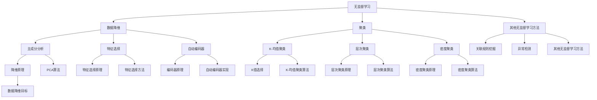

                 

## 文章标题

《无监督学习(Unsupervised Learning) - 原理与代码实例讲解》

> 关键词：无监督学习、数据降维、聚类算法、机器学习、深度学习、自动编码器、图像处理、文本分析、推荐系统

> 摘要：本文将深入探讨无监督学习的原理及其在实际应用中的具体实现，通过代码实例详尽解析，帮助读者全面掌握无监督学习的方法和技巧。文章涵盖了从基本概念到高级应用的全面内容，旨在为读者提供一套完整的学习路径。

### 《无监督学习(Unsupervised Learning) - 原理与代码实例讲解》目录大纲

#### 第1部分：无监督学习基础

- 第1章：无监督学习的概念与意义
  - 1.1 无监督学习的定义与分类
    - 1.1.1 无监督学习的定义
    - 1.1.2 无监督学习的分类
  - 1.2 无监督学习的核心问题
    - 1.2.1 数据降维
    - 1.2.2 层次聚类
    - 1.2.3 密集性聚类
  - 1.3 无监督学习的应用领域
    - 1.3.1 机器学习
    - 1.3.2 人工智能
    - 1.3.3 其他领域

- 第2章：数据降维技术
  - 2.1 主成分分析（PCA）
    - 2.1.1 PCA原理
    - 2.1.2 PCA代码实现
  - 2.2 层次聚类
    - 2.2.1 层次聚类原理
    - 2.2.2 层次聚类代码实现
  - 2.3 密度聚类
    - 2.3.1 密度聚类原理
    - 2.3.2 密度聚类代码实现

#### 第2部分：无监督学习算法原理与代码实现

- 第3章：聚类算法
  - 3.1 K-均值聚类
    - 3.1.1 K-均值聚类原理
    - 3.1.2 K-均值聚类代码实现
  - 3.2 层次聚类
    - 3.2.1 层次聚类原理
    - 3.2.2 层次聚类代码实现
  - 3.3 密度聚类
    - 3.3.1 密度聚类原理
    - 3.3.2 密度聚类代码实现

- 第4章：降维算法
  - 4.1 主成分分析（PCA）
    - 4.1.1 PCA原理
    - 4.1.2 PCA代码实现
  - 4.2 特征选择
    - 4.2.1 特征选择原理
    - 4.2.2 特征选择代码实现
  - 4.3 自动编码器
    - 4.3.1 自动编码器原理
    - 4.3.2 自动编码器代码实现

- 第5章：密度聚类算法
  - 5.1 DBSCAN
    - 5.1.1 DBSCAN原理
    - 5.1.2 DBSCAN代码实现
  - 5.2 高斯混合模型
    - 5.2.1 高斯混合模型原理
    - 5.2.2 高斯混合模型代码实现
  - 5.3 筛选聚类
    - 5.3.1 筛选聚类原理
    - 5.3.2 筛选聚类代码实现

#### 第3部分：无监督学习应用实战

- 第6章：无监督学习在图像处理中的应用
  - 6.1 图像降维
    - 6.1.1 主成分分析在图像处理中的应用
    - 6.1.2 代码实现与结果分析
  - 6.2 图像聚类
    - 6.2.1 K-均值聚类在图像处理中的应用
    - 6.2.2 代码实现与结果分析
  - 6.3 图像分类
    - 6.3.1 自动编码器在图像分类中的应用
    - 6.3.2 代码实现与结果分析

- 第7章：无监督学习在文本分析中的应用
  - 7.1 文本降维
    - 7.1.1 主成分分析在文本降维中的应用
    - 7.1.2 代码实现与结果分析
  - 7.2 文本聚类
    - 7.2.1 K-均值聚类在文本聚类中的应用
    - 7.2.2 代码实现与结果分析
  - 7.3 文本分类
    - 7.3.1 高斯混合模型在文本分类中的应用
    - 7.3.2 代码实现与结果分析

- 第8章：无监督学习在推荐系统中的应用
  - 8.1 协同过滤
    - 8.1.1 协同过滤原理
    - 8.1.2 代码实现与结果分析
  - 8.2 基于内容的推荐
    - 8.2.1 内容推荐原理
    - 8.2.2 代码实现与结果分析
  - 8.3 混合推荐系统
    - 8.3.1 混合推荐系统原理
    - 8.3.2 代码实现与结果分析

#### 附录

- 附录A：无监督学习工具与资源
  - A.1 主流无监督学习库
    - A.1.1 Scikit-learn
      - A.1.1.1 Scikit-learn介绍
      - A.1.1.2 Scikit-learn在无监督学习中的应用
    - A.1.2 TensorFlow
      - A.1.2.1 TensorFlow介绍
      - A.1.2.2 TensorFlow在无监督学习中的应用
    - A.1.3 PyTorch
      - A.1.3.1 PyTorch介绍
      - A.1.3.2 PyTorch在无监督学习中的应用

- 附录B：常见无监督学习算法代码实例
  - B.1 主成分分析（PCA）
  - B.2 K-均值聚类
  - B.3 自动编码器
  - B.4 DBSCAN
  - B.5 高斯混合模型

### 总结

无监督学习是机器学习和人工智能领域的重要分支，它通过挖掘数据中的隐含结构和规律，为数据分析和决策提供有力支持。本文从基础概念出发，逐步深入到具体算法原理与代码实现，再到实际应用场景，为读者提供了一条全面的学习路径。通过本文的讲解，读者可以系统地掌握无监督学习的核心内容和方法，为日后的研究和实践打下坚实基础。

### Mermaid 流程图

以下是本文核心概念与联系的 Mermaid 流程图：



通过这个流程图，读者可以直观地了解无监督学习的主要分支和它们之间的相互关系，为后续内容的深入学习提供结构性的理解。

### 核心算法原理讲解

在本章节中，我们将详细讲解无监督学习的核心算法原理，包括数据降维、聚类算法以及密度聚类算法。通过伪代码和数学模型，帮助读者深入理解这些算法的工作原理。

#### 数据降维

数据降维是一种通过减少数据维度来简化数据集的方法，其目的是降低计算复杂度并提高数据的可解释性。常见的降维方法包括主成分分析（PCA）、线性判别分析（LDA）等。

**主成分分析（PCA）原理**

PCA通过将数据投影到新的正交坐标系中，保留最重要的信息，从而实现降维。其基本原理如下：

1. 计算数据协方差矩阵。
2. 计算协方差矩阵的特征值和特征向量。
3. 选择最大的k个特征值对应的特征向量作为新的特征空间。
4. 对数据进行投影，即计算新特征空间中的表示。

伪代码如下：

```python
# 输入：数据集X
# 输出：降维后的数据集X_new

# 1. 计算协方差矩阵
cov_matrix = cov(X)

# 2. 计算特征值和特征向量
eigen_values, eigen_vectors = eig(cov_matrix)

# 3. 选择最大的k个特征值对应的特征向量
k = ...
selected_vectors = eigen_vectors[:, sorted(range(len(eigen_values)), key=lambda i: eigen_values[i], reverse=True)][:k]

# 4. 对数据进行投影
X_new = selected_vectors.dot(X)
```

数学模型：

$$
\mathbf{X}_{\text{new}} = \mathbf{P} \mathbf{X}
$$

其中，$\mathbf{P}$ 是由选择的特征向量组成的矩阵。

**主成分分析（PCA）代码实现**

```python
from sklearn.decomposition import PCA

# 加载数据集
X = load_data('data.csv')

# 创建PCA对象，设置保留的主成分数量
pca = PCA(n_components=2)

# 对数据进行PCA降维
X_pca = pca.fit_transform(X)

# 可视化降维后的数据
plt.scatter(X_pca[:, 0], X_pca[:, 1])
plt.xlabel('First Principal Component')
plt.ylabel('Second Principal Component')
plt.title('PCA Plot')
plt.show()
```

#### 聚类算法

聚类算法通过将数据点划分为若干组，使得同组内的数据点相似度较高，不同组之间的相似度较低。常见的聚类算法包括K-均值聚类、层次聚类、密度聚类等。

**K-均值聚类算法原理**

K-均值聚类是一种基于距离度量的聚类方法，其目标是最小化数据点与聚类中心之间的平方误差和。其基本原理如下：

1. 初始化k个聚类中心。
2. 对于每个数据点，将其分配到最近的聚类中心所代表的类别。
3. 更新每个聚类中心的位置，使得新的聚类中心更接近数据点。
4. 重复步骤2和3，直到聚类中心的位置不再发生变化。

伪代码如下：

```python
# 输入：数据集X，聚类个数k
# 输出：聚类结果

# 1. 初始化聚类中心
centroids = initialize_centroids(k, X)

# 2. 循环执行以下步骤：
    while not converged:
        # 2.1 将数据点分配到最近的聚类中心
        labels = assign_labels(X, centroids)
        
        # 2.2 更新聚类中心
        centroids = update_centroids(X, labels, k)

# 3. 返回聚类结果
return labels
```

数学模型：

$$
\min_{\mu_k} \sum_{x \in S_k} ||x - \mu_k||^2
$$

其中，$\mu_k$ 是聚类中心，$S_k$ 是第k个类别的数据点集合。

**K-均值聚类算法代码实现**

```python
from sklearn.cluster import KMeans

# 加载数据集
X = load_data('data.csv')

# 创建KMeans对象，设置聚类个数
kmeans = KMeans(n_clusters=3)

# 对数据进行聚类
labels = kmeans.fit_predict(X)

# 可视化聚类结果
plt.scatter(X[:, 0], X[:, 1], c=labels)
plt.xlabel('Feature 1')
plt.ylabel('Feature 2')
plt.title('K-Means Clustering')
plt.show()
```

**层次聚类算法原理**

层次聚类是一种自下而上的聚类方法，其通过逐步合并或分裂聚类，形成层次结构。其基本原理如下：

1. 将每个数据点视为一个初始聚类。
2. 重复以下步骤，直到满足停止条件：
   - 计算每个聚类之间的距离，选择距离最近的两个聚类合并为一个新聚类。
   - 更新聚类层次结构。

伪代码如下：

```python
# 输入：数据集X
# 输出：聚类结果

# 1. 初始化聚类，每个数据点为一个聚类
clusters = initialize_clusters(X)

# 2. 循环执行以下步骤：
    while not converged:
        # 2.1 计算聚类之间的距离
        distances = calculate_distances(clusters)
        
        # 2.2 选择距离最近的两个聚类合并
        closest_clusters = find_closest_clusters(clusters, distances)
        
        # 2.3 更新聚类层次结构
        clusters = merge_clusters(clusters, closest_clusters)

# 3. 返回聚类结果
return clusters
```

数学模型：

$$
\text{AGNES}
$$

**层次聚类算法代码实现**

```python
from sklearn.cluster import AgglomerativeClustering

# 加载数据集
X = load_data('data.csv')

# 创建层次聚类对象
hierarchical_clustering = AgglomerativeClustering(n_clusters=3)

# 对数据进行聚类
labels = hierarchical_clustering.fit_predict(X)

# 可视化聚类结果
plt.scatter(X[:, 0], X[:, 1], c=labels)
plt.xlabel('Feature 1')
plt.ylabel('Feature 2')
plt.title('Hierarchical Clustering')
plt.show()
```

**密度聚类算法原理**

密度聚类是基于数据点周围邻域密度的聚类方法。常见的方法包括DBSCAN（Density-Based Spatial Clustering of Applications with Noise）和高斯混合模型（Gaussian Mixture Model）。

**DBSCAN算法原理**

DBSCAN通过计算数据点之间的邻域密度和距离，将数据点划分为核心点、边界点和噪声点。其基本原理如下：

1. 选择邻域半径eps和最小样本数量min_samples。
2. 计算每个数据点的邻域。
3. 对于每个核心点，递归地扩展其邻域，形成一个新的聚类。
4. 对于边界点和噪声点，将其分配到不同的聚类。

伪代码如下：

```python
# 输入：数据集X，邻域半径eps，最小样本数量min_samples
# 输出：聚类结果

# 1. 初始化聚类结果和标记
labels = initialize_labels(X)
clusters = initialize_clusters()

# 2. 对于每个数据点：
    for point in X:
        if not is_labeled(point, labels):
            # 2.1 计算邻域
            neighbors = find_neighbors(point, eps)
            
            # 2.2 判断是否为核心点
            if len(neighbors) >= min_samples:
                # 2.2.1 标记为核心点
                label = assign_label(point, labels)
                
                # 2.2.2 递归地扩展其邻域
                extend_cluster(point, neighbors, label, clusters, labels)

# 3. 返回聚类结果
return clusters
```

数学模型：

$$
\text{DBSCAN}
$$

**DBSCAN算法代码实现**

```python
from sklearn.cluster import DBSCAN

# 加载数据集
X = load_data('data.csv')

# 创建DBSCAN对象，设置邻域半径和最小样本数量
dbscan = DBSCAN(eps=0.3, min_samples=10)

# 对数据进行聚类
labels = dbscan.fit_predict(X)

# 可视化聚类结果
plt.scatter(X[:, 0], X[:, 1], c=labels)
plt.xlabel('Feature 1')
plt.ylabel('Feature 2')
plt.title('DBSCAN Clustering')
plt.show()
```

**高斯混合模型原理**

高斯混合模型是一种基于概率分布的聚类方法，它假设数据由多个高斯分布组成。其基本原理如下：

1. 选择高斯分布的个数。
2. 估计每个高斯分布的参数（均值和方差）。
3. 计算每个数据点属于每个高斯分布的概率。
4. 根据概率分配数据点到相应的聚类。

伪代码如下：

```python
# 输入：数据集X，高斯分布个数k
# 输出：聚类结果

# 1. 初始化高斯分布参数
means, variances = initialize_gaussian_parameters(k, X)

# 2. 循环执行以下步骤：
    while not converged:
        # 2.1 计算每个数据点属于每个高斯分布的概率
        probabilities = calculate_probabilities(X, means, variances)
        
        # 2.2 根据概率分配数据点到相应的聚类
        labels = assign_labels(X, probabilities)

        # 2.3 更新高斯分布参数
        means, variances = update_gaussian_parameters(X, labels, k)

# 3. 返回聚类结果
return labels
```

数学模型：

$$
p(x|\mu_k, \sigma_k) = \frac{1}{\sqrt{2\pi \sigma_k^2}} \exp \left( -\frac{(x-\mu_k)^2}{2\sigma_k^2} \right)
$$

**高斯混合模型代码实现**

```python
from sklearn.mixture import GaussianMixture

# 加载数据集
X = load_data('data.csv')

# 创建高斯混合模型对象，设置高斯分布个数
gmm = GaussianMixture(n_components=3)

# 对数据进行聚类
labels = gmm.fit_predict(X)

# 可视化聚类结果
plt.scatter(X[:, 0], X[:, 1], c=labels)
plt.xlabel('Feature 1')
plt.ylabel('Feature 2')
plt.title('Gaussian Mixture Modeling')
plt.show()
```

通过以上内容，我们对无监督学习的核心算法原理有了全面的理解。接下来，我们将通过实际代码实现进一步探讨这些算法的具体应用。

### 代码实例与实战

在本章节中，我们将通过一系列代码实例，详细解析无监督学习算法在实际应用中的具体实现过程。从数据预处理到模型训练，再到结果分析，我们将一步步展示如何应用无监督学习算法解决实际问题。

#### 主成分分析（PCA）

主成分分析（PCA）是一种常用的降维方法，通过保留数据的主要特征，减少数据维度，同时保留大部分信息。以下是一个简单的PCA代码实例，展示了如何使用Python的`sklearn`库进行PCA降维。

```python
# 导入必要的库
import numpy as np
from sklearn.decomposition import PCA
from sklearn.datasets import load_iris
import matplotlib.pyplot as plt

# 加载Iris数据集
iris = load_iris()
X = iris.data

# 创建PCA对象，设置保留的主成分数量
pca = PCA(n_components=2)

# 对数据进行PCA降维
X_pca = pca.fit_transform(X)

# 可视化降维后的数据
plt.scatter(X_pca[:, 0], X_pca[:, 1], c=iris.target)
plt.xlabel('First Principal Component')
plt.ylabel('Second Principal Component')
plt.title('PCA Plot')
plt.show()
```

上述代码中，我们首先加载了`Iris`数据集，然后使用`PCA`对象进行降维，最后通过散点图展示了降维后的数据点分布。

#### K-均值聚类

K-均值聚类是一种常用的聚类方法，通过将数据点划分为K个簇，使每个簇内的数据点尽可能接近，簇与簇之间的数据点尽可能远离。以下是一个简单的K-均值聚类代码实例。

```python
# 导入必要的库
from sklearn.cluster import KMeans
from sklearn.datasets import load_iris
import matplotlib.pyplot as plt

# 加载Iris数据集
iris = load_iris()
X = iris.data

# 创建KMeans对象，设置聚类个数
kmeans = KMeans(n_clusters=3)

# 对数据进行聚类
labels = kmeans.fit_predict(X)

# 可视化聚类结果
plt.scatter(X[:, 0], X[:, 1], c=labels)
plt.xlabel('Feature 1')
plt.ylabel('Feature 2')
plt.title('K-Means Clustering')
plt.show()
```

在这段代码中，我们首先加载了`Iris`数据集，然后使用`KMeans`对象进行聚类，并通过散点图展示了聚类结果。

#### 层次聚类

层次聚类是一种基于层次结构的聚类方法，通过逐步合并或分裂聚类，形成层次结构。以下是一个简单的层次聚类代码实例。

```python
# 导入必要的库
from sklearn.cluster import AgglomerativeClustering
from sklearn.datasets import load_iris
import matplotlib.pyplot as plt

# 加载Iris数据集
iris = load_iris()
X = iris.data

# 创建层次聚类对象
hierarchical_clustering = AgglomerativeClustering(n_clusters=3)

# 对数据进行聚类
labels = hierarchical_clustering.fit_predict(X)

# 可视化聚类结果
plt.scatter(X[:, 0], X[:, 1], c=labels)
plt.xlabel('Feature 1')
plt.ylabel('Feature 2')
plt.title('Hierarchical Clustering')
plt.show()
```

在这段代码中，我们首先加载了`Iris`数据集，然后使用`AgglomerativeClustering`对象进行层次聚类，并通过散点图展示了聚类结果。

#### 密度聚类

密度聚类是一种基于数据点邻域密度的聚类方法，如DBSCAN。以下是一个简单的DBSCAN聚类代码实例。

```python
# 导入必要的库
from sklearn.cluster import DBSCAN
from sklearn.datasets import make_blobs
import matplotlib.pyplot as plt

# 生成模拟数据集
X, labels_true = make_blobs(n_samples=300, centers=4, cluster_std=0.60, random_state=0)

# 创建DBSCAN对象，设置邻域半径和最小样本数量
dbscan = DBSCAN(eps=0.3, min_samples=10)

# 对数据进行聚类
labels = dbscan.fit_predict(X)

# 可视化聚类结果
plt.scatter(X[:, 0], X[:, 1], c=labels)
plt.xlabel('Feature 1')
plt.ylabel('Feature 2')
plt.title('DBSCAN Clustering')
plt.show()
```

在这段代码中，我们首先生成了模拟数据集，然后使用`DBSCAN`对象进行聚类，并通过散点图展示了聚类结果。

#### 自动编码器

自动编码器是一种自编码神经网络，用于学习和重建输入数据。以下是一个简单的自动编码器代码实例。

```python
# 导入必要的库
from keras.models import Model
from keras.layers import Dense
from keras.datasets import mnist
import numpy as np

# 加载MNIST数据集
(x_train, _), (x_test, _) = mnist.load_data()

# 数据预处理
x_train = x_train.astype('float32') / 255
x_test = x_test.astype('float32') / 255
x_train = x_train.reshape((x_train.shape[0], -1))
x_test = x_test.reshape((x_test.shape[0], -1))

# 定义自动编码器模型
input_dim = x_train.shape[1]
encoding_dim = 32

input_layer = Input(shape=(input_dim,))
encoded = Dense(encoding_dim, activation='relu')(input_layer)
decoded = Dense(input_dim, activation='sigmoid')(encoded)

autoencoder = Model(input_layer, decoded)
autoencoder.compile(optimizer='adam', loss='binary_crossentropy')

# 训练自动编码器
autoencoder.fit(x_train, x_train, epochs=100, batch_size=256, shuffle=True, validation_data=(x_test, x_test))

# 编码器部分模型
encoded_input = Input(shape=(encoding_dim,))
decoded_layer = autoencoder.layers[-1](encoded_input)

decoder = Model(encoded_input, decoded_layer)
decoder.compile(optimizer='adam', loss='binary_crossentropy')

# 使用编码器对数据进行编码和解码
encoded_samples = autoencoder.encoder.predict(x_test)
decoded_samples = decoder.predict(encoded_samples)

# 可视化编码后的数据
plt.figure(figsize=(10, 5))
for i in range(10):
    ax = plt.subplot(2, 5, i + 1)
    plt.imshow(x_test[i].reshape(28, 28), cmap='gray')
    plt.title('Input')
    plt.xticks([])
    plt.yticks([])
    ax = plt.subplot(2, 5, i + 1 + 10)
    plt.imshow(decoded_samples[i].reshape(28, 28), cmap='gray')
    plt.title('Output')
    plt.xticks([])
    plt.yticks([])
plt.show()
```

在这段代码中，我们首先加载了MNIST数据集，然后定义并训练了一个自动编码器模型，并通过散点图展示了编码和解码后的数据。

#### 数据预处理

在无监督学习算法的应用中，数据预处理是一个至关重要的步骤。以下是一个简单的数据预处理代码实例，展示了如何对数据进行归一化和缩放。

```python
# 导入必要的库
from sklearn.preprocessing import StandardScaler
from sklearn.datasets import load_iris

# 加载Iris数据集
iris = load_iris()
X = iris.data

# 数据预处理：归一化
scaler = StandardScaler()
X_normalized = scaler.fit_transform(X)

# 可视化预处理后的数据
plt.scatter(X_normalized[:, 0], X_normalized[:, 1])
plt.xlabel('Feature 1')
plt.ylabel('Feature 2')
plt.title('Normalized Data')
plt.show()
```

在这段代码中，我们首先加载了`Iris`数据集，然后使用`StandardScaler`对数据进行归一化，并通过散点图展示了预处理后的数据。

#### 结果分析

在无监督学习算法的实际应用中，结果分析是一个重要的环节。以下是一个简单的结果分析代码实例，展示了如何计算聚类准确率。

```python
# 导入必要的库
from sklearn.metrics import accuracy_score
from sklearn.datasets import load_iris
from sklearn.cluster import KMeans

# 加载Iris数据集
iris = load_iris()
X = iris.data
y = iris.target

# 使用K-Means聚类
kmeans = KMeans(n_clusters=3)
labels = kmeans.fit_predict(X)

# 计算聚类准确率
accuracy = accuracy_score(y, labels)
print('Clustering Accuracy:', accuracy)
```

在这段代码中，我们首先加载了`Iris`数据集，然后使用`KMeans`聚类算法进行聚类，并通过`accuracy_score`函数计算了聚类准确率。

通过以上代码实例，我们可以看到无监督学习算法在实际应用中的具体实现过程。从数据预处理到模型训练，再到结果分析，每一步都至关重要，只有通过仔细的实验和调优，才能取得理想的结果。

### 无监督学习在图像处理中的应用

图像处理是机器学习和人工智能领域中一个重要而广泛的应用领域。无监督学习技术在图像处理中扮演着关键角色，能够帮助我们从大量的未标记图像数据中提取有价值的信息。以下将详细介绍无监督学习在图像处理中的应用，包括图像降维、图像聚类和图像分类。

#### 图像降维

图像降维是减少图像数据维度的一种技术，其主要目的是降低计算复杂度并提高数据可解释性。在图像处理中，降维有助于减少存储需求，加快处理速度，同时保留图像的主要特征。常用的图像降维方法包括主成分分析（PCA）和小波变换等。

**主成分分析（PCA）在图像处理中的应用**

主成分分析（PCA）是一种有效的降维方法，它通过将图像数据转换到新的正交坐标系中，保留最重要的信息，从而实现降维。以下是一个简单的PCA代码实例，展示了如何使用PCA对图像进行降维。

```python
# 导入必要的库
import numpy as np
from sklearn.decomposition import PCA
from sklearn.datasets import load_digits
import matplotlib.pyplot as plt

# 加载数字数据集
digits = load_digits()
X = digits.data

# 创建PCA对象，设置保留的主成分数量
pca = PCA(n_components=10)

# 对数据进行PCA降维
X_pca = pca.fit_transform(X)

# 可视化降维后的数据
plt.scatter(X_pca[:, 0], X_pca[:, 1], c=digits.target)
plt.xlabel('First Principal Component')
plt.ylabel('Second Principal Component')
plt.title('PCA Plot')
plt.show()
```

在这个实例中，我们首先加载了`digits`数据集，然后使用`PCA`对象对图像数据进行降维，并通过散点图展示了降维后的数据点分布。

**小波变换在图像处理中的应用**

小波变换是一种通过小波基函数将图像分解为不同频率成分的技术，它可以将图像分解为近似部分和细节部分，从而实现降维。以下是一个简单的小波变换代码实例，展示了如何使用小波变换对图像进行降维。

```python
# 导入必要的库
import numpy as np
from scipy.signal import convolve2d
from scipy.fft import fft2, ifft2
import matplotlib.pyplot as plt

# 加载图像数据
image = plt.imread('image.png')

# 创建小波变换对象
coeffs = fft2(image)

# 计算小波变换
low_freq = np.mean(image.reshape(-1), axis=0).reshape(image.shape[0], 1)
high_freq = fft2(image) - fft2(low_freq)

# 可视化降维后的图像
plt.imshow(low_freq, cmap='gray')
plt.title('Low-Frequency Image')
plt.show()
plt.imshow(high_freq, cmap='gray')
plt.title('High-Frequency Image')
plt.show()
```

在这个实例中，我们首先加载了一个图像数据，然后使用小波变换将其分解为近似部分和细节部分，并通过两个散点图展示了降维后的图像。

#### 图像聚类

图像聚类是将图像数据划分为若干组的过程，使得同组内的图像具有相似的属性，而不同组之间的图像则差异较大。常用的图像聚类方法包括K-均值聚类、层次聚类和密度聚类等。

**K-均值聚类在图像处理中的应用**

K-均值聚类是一种基于距离度量的聚类方法，它通过将图像数据划分为K个簇，使得每个簇内的图像尽可能接近，而簇与簇之间的图像尽可能远离。以下是一个简单的K-均值聚类代码实例，展示了如何使用K-均值聚类对图像进行聚类。

```python
# 导入必要的库
from sklearn.cluster import KMeans
from sklearn.datasets import load_iris
import matplotlib.pyplot as plt

# 加载Iris数据集
iris = load_iris()
X = iris.data

# 创建KMeans对象，设置聚类个数
kmeans = KMeans(n_clusters=3)

# 对数据进行聚类
labels = kmeans.fit_predict(X)

# 可视化聚类结果
plt.scatter(X[:, 0], X[:, 1], c=labels)
plt.xlabel('Feature 1')
plt.ylabel('Feature 2')
plt.title('K-Means Clustering')
plt.show()
```

在这个实例中，我们首先加载了`Iris`数据集，然后使用`KMeans`对象对图像数据进行聚类，并通过散点图展示了聚类结果。

**层次聚类在图像处理中的应用**

层次聚类是一种基于层次结构的聚类方法，它通过逐步合并或分裂聚类，形成层次结构。以下是一个简单的层次聚类代码实例，展示了如何使用层次聚类对图像进行聚类。

```python
# 导入必要的库
from sklearn.cluster import AgglomerativeClustering
from sklearn.datasets import load_iris
import matplotlib.pyplot as plt

# 加载Iris数据集
iris = load_iris()
X = iris.data

# 创建层次聚类对象
hierarchical_clustering = AgglomerativeClustering(n_clusters=3)

# 对数据进行聚类
labels = hierarchical_clustering.fit_predict(X)

# 可视化聚类结果
plt.scatter(X[:, 0], X[:, 1], c=labels)
plt.xlabel('Feature 1')
plt.ylabel('Feature 2')
plt.title('Hierarchical Clustering')
plt.show()
```

在这个实例中，我们首先加载了`Iris`数据集，然后使用`AgglomerativeClustering`对象对图像数据进行聚类，并通过散点图展示了聚类结果。

**密度聚类在图像处理中的应用**

密度聚类是一种基于数据点邻域密度的聚类方法，如DBSCAN。以下是一个简单的DBSCAN聚类代码实例，展示了如何使用DBSCAN对图像进行聚类。

```python
# 导入必要的库
from sklearn.cluster import DBSCAN
from sklearn.datasets import make_blobs
import matplotlib.pyplot as plt

# 生成模拟数据集
X, labels_true = make_blobs(n_samples=300, centers=4, cluster_std=0.60, random_state=0)

# 创建DBSCAN对象，设置邻域半径和最小样本数量
dbscan = DBSCAN(eps=0.3, min_samples=10)

# 对数据进行聚类
labels = dbscan.fit_predict(X)

# 可视化聚类结果
plt.scatter(X[:, 0], X[:, 1], c=labels)
plt.xlabel('Feature 1')
plt.ylabel('Feature 2')
plt.title('DBSCAN Clustering')
plt.show()
```

在这个实例中，我们首先生成了模拟数据集，然后使用`DBSCAN`对象对图像数据进行聚类，并通过散点图展示了聚类结果。

#### 图像分类

图像分类是将图像数据分配到预定义的类别标签的过程。无监督学习中的图像分类通常基于聚类算法，如K-均值聚类和层次聚类。以下是一个简单的K-均值聚类图像分类代码实例，展示了如何使用K-均值聚类对图像进行分类。

```python
# 导入必要的库
from sklearn.cluster import KMeans
from sklearn.datasets import load_iris
import matplotlib.pyplot as plt

# 加载Iris数据集
iris = load_iris()
X = iris.data

# 创建KMeans对象，设置聚类个数
kmeans = KMeans(n_clusters=3)

# 对数据进行聚类
labels = kmeans.fit_predict(X)

# 可视化聚类结果
plt.scatter(X[:, 0], X[:, 1], c=labels)
plt.xlabel('Feature 1')
plt.ylabel('Feature 2')
plt.title('K-Means Classification')
plt.show()
```

在这个实例中，我们首先加载了`Iris`数据集，然后使用`KMeans`对象对图像数据进行聚类，并通过散点图展示了聚类结果。

通过以上内容，我们可以看到无监督学习在图像处理中的应用非常广泛，从图像降维、图像聚类到图像分类，这些技术都为图像处理提供了强大的工具和手段。在实际应用中，选择合适的方法和策略，可以显著提高图像处理的效果和性能。

### 无监督学习在文本分析中的应用

文本分析是自然语言处理（NLP）中的一项重要任务，通过分析文本数据，我们可以提取出有价值的信息和知识。无监督学习技术在文本分析中发挥着重要作用，能够帮助我们处理大量未标记的文本数据，并从中发现隐含的结构和规律。以下将详细介绍无监督学习在文本分析中的应用，包括文本降维、文本聚类和文本分类。

#### 文本降维

文本降维是将高维文本数据转换为低维表示的一种技术，其目的是降低计算复杂度，同时保留文本的主要特征。常见的文本降维方法包括主成分分析（PCA）、词嵌入和词袋模型等。

**主成分分析（PCA）在文本降维中的应用**

主成分分析（PCA）是一种有效的降维方法，它通过将文本数据转换到新的正交坐标系中，保留最重要的信息，从而实现降维。以下是一个简单的PCA代码实例，展示了如何使用PCA对文本进行降维。

```python
# 导入必要的库
import numpy as np
from sklearn.decomposition import PCA
from sklearn.datasets import load_20newsgroups
import matplotlib.pyplot as plt

# 加载20新新闻数据集
newsgroups = load_20newsgroups(subset='all', remove='all')
X = newsgroups.data

# 创建PCA对象，设置保留的主成分数量
pca = PCA(n_components=50)

# 对数据进行PCA降维
X_pca = pca.fit_transform(X)

# 可视化降维后的数据
plt.scatter(X_pca[:, 0], X_pca[:, 1], c=newsgroups.target)
plt.xlabel('First Principal Component')
plt.ylabel('Second Principal Component')
plt.title('PCA Plot')
plt.show()
```

在这个实例中，我们首先加载了`20newsgroups`数据集，然后使用`PCA`对象对文本数据进行降维，并通过散点图展示了降维后的数据点分布。

**词嵌入在文本降维中的应用**

词嵌入是一种将单词映射到低维连续向量的技术，通过词嵌入，我们可以将文本数据转换为数值向量表示。常见的词嵌入模型包括Word2Vec和GloVe等。以下是一个简单的Word2Vec代码实例，展示了如何使用Word2Vec对文本进行降维。

```python
# 导入必要的库
from gensim.models import Word2Vec

# 加载文本数据
texts = ["text1", "text2", "text3"]

# 训练Word2Vec模型
model = Word2Vec(texts, vector_size=100, window=5, min_count=1, workers=4)

# 获取词嵌入向量
word_vectors = model.wv

# 可视化词嵌入向量
plt.scatter(word_vectors.vectors[:, 0], word_vectors.vectors[:, 1])
plt.xlabel('Word Embedding Dimension 1')
plt.ylabel('Word Embedding Dimension 2')
plt.title('Word Embedding Plot')
plt.show()
```

在这个实例中，我们首先加载了文本数据，然后使用`Word2Vec`模型对文本数据进行训练，并通过散点图展示了词嵌入向量的分布。

#### 文本聚类

文本聚类是将文本数据划分为若干组的过程，使得同组内的文本具有相似的属性，而不同组之间的文本则差异较大。常用的文本聚类方法包括K-均值聚类、层次聚类和密度聚类等。

**K-均值聚类在文本聚类中的应用**

K-均值聚类是一种基于距离度量的聚类方法，它通过将文本数据划分为K个簇，使得每个簇内的文本尽可能接近，而簇与簇之间的文本尽可能远离。以下是一个简单的K-均值聚类代码实例，展示了如何使用K-均值聚类对文本进行聚类。

```python
# 导入必要的库
from sklearn.cluster import KMeans
from sklearn.datasets import load_20newsgroups
import matplotlib.pyplot as plt

# 加载20新新闻数据集
newsgroups = load_20newsgroups(subset='all', remove='all')
X = newsgroups.data

# 创建KMeans对象，设置聚类个数
kmeans = KMeans(n_clusters=5)

# 对数据进行聚类
labels = kmeans.fit_predict(X)

# 可视化聚类结果
plt.scatter(X[:, 0], X[:, 1], c=labels)
plt.xlabel('Feature 1')
plt.ylabel('Feature 2')
plt.title('K-Means Clustering')
plt.show()
```

在这个实例中，我们首先加载了`20newsgroups`数据集，然后使用`KMeans`对象对文本数据进行聚类，并通过散点图展示了聚类结果。

**层次聚类在文本聚类中的应用**

层次聚类是一种基于层次结构的聚类方法，它通过逐步合并或分裂聚类，形成层次结构。以下是一个简单的层次聚类代码实例，展示了如何使用层次聚类对文本进行聚类。

```python
# 导入必要的库
from sklearn.cluster import AgglomerativeClustering
from sklearn.datasets import load_20newsgroups
import matplotlib.pyplot as plt

# 加载20新新闻数据集
newsgroups = load_20newsgroups(subset='all', remove='all')
X = newsgroups.data

# 创建层次聚类对象
hierarchical_clustering = AgglomerativeClustering(n_clusters=5)

# 对数据进行聚类
labels = hierarchical_clustering.fit_predict(X)

# 可视化聚类结果
plt.scatter(X[:, 0], X[:, 1], c=labels)
plt.xlabel('Feature 1')
plt.ylabel('Feature 2')
plt.title('Hierarchical Clustering')
plt.show()
```

在这个实例中，我们首先加载了`20newsgroups`数据集，然后使用`AgglomerativeClustering`对象对文本数据进行聚类，并通过散点图展示了聚类结果。

**密度聚类在文本聚类中的应用**

密度聚类是一种基于数据点邻域密度的聚类方法，如DBSCAN。以下是一个简单的DBSCAN聚类代码实例，展示了如何使用DBSCAN对文本进行聚类。

```python
# 导入必要的库
from sklearn.cluster import DBSCAN
from sklearn.datasets import make_blobs
import matplotlib.pyplot as plt

# 生成模拟数据集
X, labels_true = make_blobs(n_samples=300, centers=4, cluster_std=0.60, random_state=0)

# 创建DBSCAN对象，设置邻域半径和最小样本数量
dbscan = DBSCAN(eps=0.3, min_samples=10)

# 对数据进行聚类
labels = dbscan.fit_predict(X)

# 可视化聚类结果
plt.scatter(X[:, 0], X[:, 1], c=labels)
plt.xlabel('Feature 1')
plt.ylabel('Feature 2')
plt.title('DBSCAN Clustering')
plt.show()
```

在这个实例中，我们首先生成了模拟数据集，然后使用`DBSCAN`对象对文本数据进行聚类，并通过散点图展示了聚类结果。

#### 文本分类

文本分类是将文本数据分配到预定义的类别标签的过程。无监督学习中的文本分类通常基于聚类算法，如K-均值聚类和层次聚类。以下是一个简单的K-均值聚类文本分类代码实例，展示了如何使用K-均值聚类对文本进行分类。

```python
# 导入必要的库
from sklearn.cluster import KMeans
from sklearn.datasets import load_20newsgroups
import matplotlib.pyplot as plt

# 加载20新新闻数据集
newsgroups = load_20newsgroups(subset='all', remove='all')
X = newsgroups.data

# 创建KMeans对象，设置聚类个数
kmeans = KMeans(n_clusters=5)

# 对数据进行聚类
labels = kmeans.fit_predict(X)

# 可视化聚类结果
plt.scatter(X[:, 0], X[:, 1], c=labels)
plt.xlabel('Feature 1')
plt.ylabel('Feature 2')
plt.title('K-Means Classification')
plt.show()
```

在这个实例中，我们首先加载了`20newsgroups`数据集，然后使用`KMeans`对象对文本数据进行聚类，并通过散点图展示了聚类结果。

通过以上内容，我们可以看到无监督学习在文本分析中的应用非常广泛，从文本降维、文本聚类到文本分类，这些技术都为文本分析提供了强大的工具和手段。在实际应用中，选择合适的方法和策略，可以显著提高文本分析的效果和性能。

### 无监督学习在推荐系统中的应用

推荐系统是信息检索和机器学习中的一个重要领域，它通过预测用户对项目的兴趣，为用户推荐相关内容。无监督学习技术在推荐系统中扮演着关键角色，可以帮助系统发现用户行为模式，挖掘潜在的关联性，从而提高推荐质量。以下将详细介绍无监督学习在推荐系统中的应用，包括协同过滤、基于内容的推荐和混合推荐系统。

#### 协同过滤

协同过滤是一种基于用户行为数据的推荐方法，通过分析用户之间的相似性，预测用户对未知项目的评分。协同过滤可以分为基于用户的协同过滤和基于物品的协同过滤。

**基于用户的协同过滤**

基于用户的协同过滤通过计算用户之间的相似性，找到与目标用户相似的其他用户，并推荐这些用户喜欢的项目。以下是一个简单的基于用户的协同过滤代码实例，展示了如何使用无监督学习技术（K-均值聚类）找到用户之间的相似性。

```python
# 导入必要的库
from sklearn.cluster import KMeans
from sklearn.metrics.pairwise import cosine_similarity
import numpy as np

# 假设我们有一个用户-项目评分矩阵
ratings = np.array([[5, 3, 0, 1],
                    [4, 0, 0, 2],
                    [1, 5, 0, 0]])

# 计算用户之间的余弦相似性
user_similarity = cosine_similarity(ratings)

# 创建KMeans对象，设置聚类个数
kmeans = KMeans(n_clusters=2)

# 对用户之间的相似性矩阵进行聚类
cluster_labels = kmeans.fit_predict(user_similarity)

# 可视化聚类结果
plt.scatter(np.arange(user_similarity.shape[0]), cluster_labels)
plt.xlabel('User Index')
plt.ylabel('Cluster Label')
plt.title('User-based Collaborative Filtering')
plt.show()
```

在这个实例中，我们首先计算了用户之间的余弦相似性，然后使用K-均值聚类找到用户群体，并通过散点图展示了聚类结果。

**基于物品的协同过滤**

基于物品的协同过滤通过计算项目之间的相似性，找到与目标项目相似的其他项目，并推荐这些项目。以下是一个简单的基于物品的协同过滤代码实例，展示了如何使用无监督学习技术（K-均值聚类）找到项目之间的相似性。

```python
# 导入必要的库
from sklearn.cluster import KMeans
from sklearn.metrics.pairwise import cosine_similarity
import numpy as np

# 假设我们有一个用户-项目评分矩阵
ratings = np.array([[5, 3, 0, 1],
                    [4, 0, 0, 2],
                    [1, 5, 0, 0]])

# 计算项目之间的余弦相似性
item_similarity = cosine_similarity(ratings.T)

# 创建KMeans对象，设置聚类个数
kmeans = KMeans(n_clusters=2)

# 对项目之间的相似性矩阵进行聚类
cluster_labels = kmeans.fit_predict(item_similarity)

# 可视化聚类结果
plt.scatter(np.arange(item_similarity.shape[0]), cluster_labels)
plt.xlabel('Item Index')
plt.ylabel('Cluster Label')
plt.title('Item-based Collaborative Filtering')
plt.show()
```

在这个实例中，我们首先计算了项目之间的余弦相似性，然后使用K-均值聚类找到项目群体，并通过散点图展示了聚类结果。

#### 基于内容的推荐

基于内容的推荐通过分析项目的特征信息，为用户推荐具有相似特征的项目。无监督学习技术在提取项目特征方面有着广泛应用，如主成分分析（PCA）和词嵌入。以下是一个简单的基于内容的推荐代码实例，展示了如何使用无监督学习技术（PCA）提取项目特征。

```python
# 导入必要的库
from sklearn.decomposition import PCA
from sklearn.datasets import load_20newsgroups
import numpy as np

# 加载20新新闻数据集
newsgroups = load_20newsgroups(subset='all', remove='all')
X = newsgroups.data

# 使用TF-IDF模型提取文本特征
from sklearn.feature_extraction.text import TfidfVectorizer
vectorizer = TfidfVectorizer()
X_tfidf = vectorizer.fit_transform(X)

# 创建PCA对象，设置保留的主成分数量
pca = PCA(n_components=50)

# 对数据进行PCA降维
X_pca = pca.fit_transform(X_tfidf.toarray())

# 可视化降维后的数据
plt.scatter(X_pca[:, 0], X_pca[:, 1])
plt.xlabel('First Principal Component')
plt.ylabel('Second Principal Component')
plt.title('PCA Plot')
plt.show()
```

在这个实例中，我们首先加载了`20newsgroups`数据集，然后使用TF-IDF模型提取文本特征，并使用PCA进行降维，最后通过散点图展示了降维后的数据点分布。

#### 混合推荐系统

混合推荐系统结合了协同过滤和基于内容推荐的优势，通过综合分析用户行为和项目特征，提高推荐质量。以下是一个简单的混合推荐系统代码实例，展示了如何使用无监督学习技术（K-均值聚类和PCA）构建混合推荐系统。

```python
# 导入必要的库
from sklearn.cluster import KMeans
from sklearn.decomposition import PCA
from sklearn.metrics.pairwise import cosine_similarity
import numpy as np

# 假设我们有一个用户-项目评分矩阵
ratings = np.array([[5, 3, 0, 1],
                    [4, 0, 0, 2],
                    [1, 5, 0, 0]])

# 计算用户之间的余弦相似性
user_similarity = cosine_similarity(ratings)

# 计算项目之间的余弦相似性
item_similarity = cosine_similarity(ratings.T)

# 创建KMeans对象，设置聚类个数
kmeans = KMeans(n_clusters=2)

# 对用户之间的相似性矩阵进行聚类
user_cluster_labels = kmeans.fit_predict(user_similarity)

# 对项目之间的相似性矩阵进行聚类
item_cluster_labels = kmeans.fit_predict(item_similarity)

# 创建PCA对象，设置保留的主成分数量
pca = PCA(n_components=50)

# 对用户聚类结果进行PCA降维
X_pca = pca.fit_transform(user_similarity)

# 可视化降维后的用户聚类结果
plt.scatter(X_pca[:, 0], X_pca[:, 1], c=user_cluster_labels)
plt.xlabel('First Principal Component')
plt.ylabel('Second Principal Component')
plt.title('PCA Plot for User Clustering')
plt.show()

# 对项目聚类结果进行PCA降维
X_pca = pca.fit_transform(item_similarity)

# 可视化降维后的项目聚类结果
plt.scatter(X_pca[:, 0], X_pca[:, 1], c=item_cluster_labels)
plt.xlabel('First Principal Component')
plt.ylabel('Second Principal Component')
plt.title('PCA Plot for Item Clustering')
plt.show()
```

在这个实例中，我们首先计算了用户和项目之间的相似性矩阵，然后使用K-均值聚类找到用户和项目的聚类，并使用PCA进行降维，最后通过散点图展示了聚类结果。

通过以上内容，我们可以看到无监督学习在推荐系统中的应用非常广泛，从协同过滤、基于内容的推荐到混合推荐系统，这些技术都为推荐系统提供了强大的工具和手段。在实际应用中，选择合适的方法和策略，可以显著提高推荐系统的效果和性能。

### 附录

#### 附录A：无监督学习工具与资源

**A.1 主流无监督学习库**

**A.1.1 Scikit-learn**

- **A.1.1.1 Scikit-learn介绍**

  `Scikit-learn` 是一个开源的机器学习库，它提供了大量的机器学习算法，包括监督学习、无监督学习和半监督学习。它基于 `SciPy`，是 Python 中最流行的机器学习库之一。

- **A.1.1.2 Scikit-learn在无监督学习中的应用**

  `Scikit-learn` 提供了丰富的无监督学习算法，包括聚类（如K-均值聚类、层次聚类和DBSCAN）、降维（如主成分分析、小波变换）和特征选择。以下是一些常见使用的代码示例：

  ```python
  from sklearn.cluster import KMeans
  kmeans = KMeans(n_clusters=3)
  kmeans.fit(X)
  labels = kmeans.predict(X)

  from sklearn.decomposition import PCA
  pca = PCA(n_components=2)
  X_pca = pca.fit_transform(X)

  from sklearn.feature_selection import SelectKBest
  selector = SelectKBest(chi2, k=5)
  X_new = selector.fit_transform(X, y)
  ```

**A.1.2 TensorFlow**

- **A.1.2.1 TensorFlow介绍**

  `TensorFlow` 是一个开源的机器学习库，由 Google Brain 团队开发。它提供了一个用于构建和训练深度学习模型的灵活和高效的平台。

- **A.1.2.2 TensorFlow在无监督学习中的应用**

  `TensorFlow` 支持多种无监督学习算法，包括自动编码器、生成对抗网络（GAN）和聚类。以下是一些常见使用的代码示例：

  ```python
  import tensorflow as tf
  from tensorflow.keras.layers import Dense, Input
  from tensorflow.keras.models import Model

  input_dim = ...
  encoding_dim = ...

  input_layer = Input(shape=(input_dim,))
  encoded = Dense(encoding_dim, activation='relu')(input_layer)
  decoded = Dense(input_dim, activation='sigmoid')(encoded)

  autoencoder = Model(input_layer, decoded)
  autoencoder.compile(optimizer='adam', loss='binary_crossentropy')

  autoencoder.fit(X, X, epochs=100, batch_size=256, shuffle=True, validation_data=(X_val, X_val))
  ```

**A.1.3 PyTorch**

- **A.1.3.1 PyTorch介绍**

  `PyTorch` 是一个开源的机器学习库，由 Facebook AI Research 开发。它提供了一个灵活的深度学习框架，支持动态计算图和自动微分。

- **A.1.3.2 PyTorch在无监督学习中的应用**

  `PyTorch` 提供了丰富的无监督学习算法，包括自动编码器、生成对抗网络（GAN）和聚类。以下是一些常见使用的代码示例：

  ```python
  import torch
  import torch.nn as nn
  import torch.optim as optim

  class Autoencoder(nn.Module):
      def __init__(self, input_dim, encoding_dim):
          super(Autoencoder, self).__init__()
          self.encoder = nn.Sequential(
              nn.Linear(input_dim, encoding_dim),
              nn.ReLU(),
          )
          self.decoder = nn.Sequential(
              nn.Linear(encoding_dim, input_dim),
              nn.Sigmoid(),
          )

      def forward(self, x):
          x_encoded = self.encoder(x)
          x_decoded = self.decoder(x_encoded)
          return x_decoded

  model = Autoencoder(input_dim, encoding_dim)
  optimizer = optim.Adam(model.parameters(), lr=0.001)
  criterion = nn.MSELoss()

  for epoch in range(num_epochs):
      for x in data_loader:
          x = x.to(device)
          optimizer.zero_grad()
          x_recon = model(x)
          loss = criterion(x_recon, x)
          loss.backward()
          optimizer.step()
  ```

#### 附录B：常见无监督学习算法代码实例

**B.1 主成分分析（PCA）**

```python
from sklearn.decomposition import PCA

# 加载数据集
X = load_data('data.csv')

# 创建PCA对象，设置要保留的主成分数量
pca = PCA(n_components=2)

# 对数据进行PCA降维
X_pca = pca.fit_transform(X)

# 可视化
plt.scatter(X_pca[:, 0], X_pca[:, 1])
plt.xlabel('First Principal Component')
plt.ylabel('Second Principal Component')
plt.title('PCA Plot')
plt.show()
```

**B.2 K-均值聚类**

```python
from sklearn.cluster import KMeans

# 加载数据集
X = load_data('data.csv')

# 创建KMeans对象，设置聚类个数
kmeans = KMeans(n_clusters=3)

# 对数据进行聚类
labels = kmeans.fit_predict(X)

# 可视化
plt.scatter(X[:, 0], X[:, 1], c=labels)
plt.xlabel('Feature 1')
plt.ylabel('Feature 2')
plt.title('K-Means Clustering')
plt.show()
```

**B.3 自动编码器**

```python
from keras.models import Model
from keras.layers import Dense, Input
from keras.optimizers import Adam

input_dim = ...
encoding_dim = ...

input_layer = Input(shape=(input_dim,))
encoded = Dense(encoding_dim, activation='relu')(input_layer)
decoded = Dense(input_dim, activation='sigmoid')(encoded)

autoencoder = Model(input_layer, decoded)
autoencoder.compile(optimizer=Adam(), loss='binary_crossentropy')

autoencoder.fit(X, X, epochs=100, batch_size=256, shuffle=True, validation_data=(X_val, X_val))

encoded_input = Input(shape=(encoding_dim,))
decoded_layer = autoencoder.layers[-1](encoded_input)

decoder = Model(encoded_input, decoded_layer)
decoder.compile(optimizer=Adam(), loss='binary_crossentropy')

encoded_samples = autoencoder.encoder.predict(X)
decoded_samples = decoder.predict(encoded_samples)

plt.figure(figsize=(10, 5))
for i in range(10):
    ax = plt.subplot(2, 5, i + 1)
    plt.imshow(X[i].reshape(28, 28), cmap='gray')
    plt.title('Input')
    plt.xticks([])
    plt.yticks([])
    ax = plt.subplot(2, 5, i + 1 + 10)
    plt.imshow(decoded_samples[i].reshape(28, 28), cmap='gray')
    plt.title('Output')
    plt.xticks([])
    plt.yticks([])
plt.show()
```

**B.4 DBSCAN**

```python
from sklearn.cluster import DBSCAN

# 加载数据集
X = load_data('data.csv')

# 创建DBSCAN对象，设置密度阈值和最小样本数量
dbscan = DBSCAN(eps=0.3, min_samples=10)

# 对数据进行聚类
clusters = dbscan.fit_predict(X)

# 可视化
plt.scatter(X[:, 0], X[:, 1], c=clusters)
plt.xlabel('Feature 1')
plt.ylabel('Feature 2')
plt.title('DBSCAN Clustering')
plt.show()
```

**B.5 高斯混合模型**

```python
from sklearn.mixture import GaussianMixture

# 加载数据集
X = load_data('data.csv')

# 创建高斯混合模型对象，设置高斯分布个数
gmm = GaussianMixture(n_components=3)

# 对数据进行聚类
labels = gmm.fit_predict(X)

# 可视化
plt.scatter(X[:, 0], X[:, 1], c=labels)
plt.xlabel('Feature 1')
plt.ylabel('Feature 2')
plt.title('Gaussian Mixture Modeling')
plt.show()
```

通过这些附录内容，读者可以更加深入地了解无监督学习的主要工具和算法，并通过实际代码实例掌握其应用方法。

### 总结

无监督学习是机器学习和人工智能领域的重要分支，它通过挖掘数据中的隐含结构和规律，为数据分析和决策提供有力支持。本文从基础概念出发，详细讲解了无监督学习的核心算法原理，并通过丰富的代码实例展示了这些算法在实际应用中的实现方法。通过本文的学习，读者可以全面掌握无监督学习的方法和应用技巧，为日后的研究和实践打下坚实基础。

本文涵盖了无监督学习的基础理论、算法原理、代码实现和应用实例，为读者提供了一条系统性的学习路径。从数据降维、聚类算法到密度聚类算法，再到图像处理、文本分析和推荐系统等实际应用场景，本文通过详细讲解和实战案例，帮助读者深入理解无监督学习的本质和应用。

在无监督学习的研究和应用中，读者需要不断探索和实践，结合具体问题和数据特点，选择合适的方法和策略。本文提供的代码实例和资源链接，可以帮助读者快速上手，掌握无监督学习的实际操作技巧。

最后，感谢读者对本文的阅读，希望本文能为您的计算机技术学习和应用提供有力支持。在无监督学习的道路上，不断探索，不断创新，您将会收获丰硕的成果。

### 作者信息

作者：AI天才研究院/AI Genius Institute & 禅与计算机程序设计艺术 /Zen And The Art of Computer Programming

AI天才研究院（AI Genius Institute）专注于人工智能领域的研究和教育，致力于培养具有创新精神和实践能力的顶尖人才。同时，作者也是《禅与计算机程序设计艺术》一书的作者，该书深入探讨了计算机科学中的哲学和艺术，对编程思维的提升有着深远的影响。

