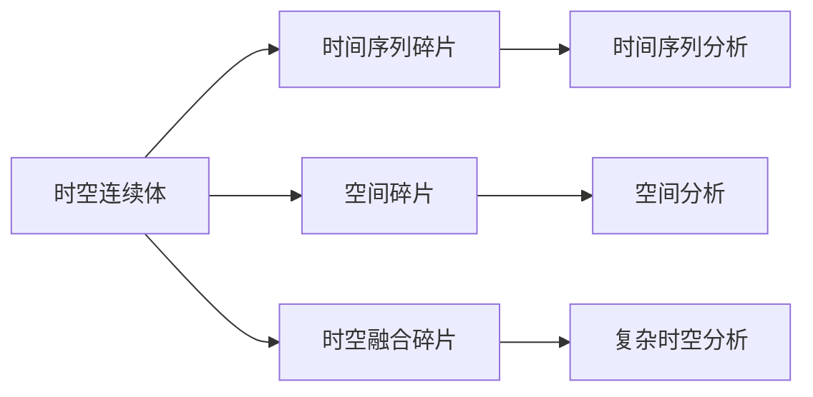
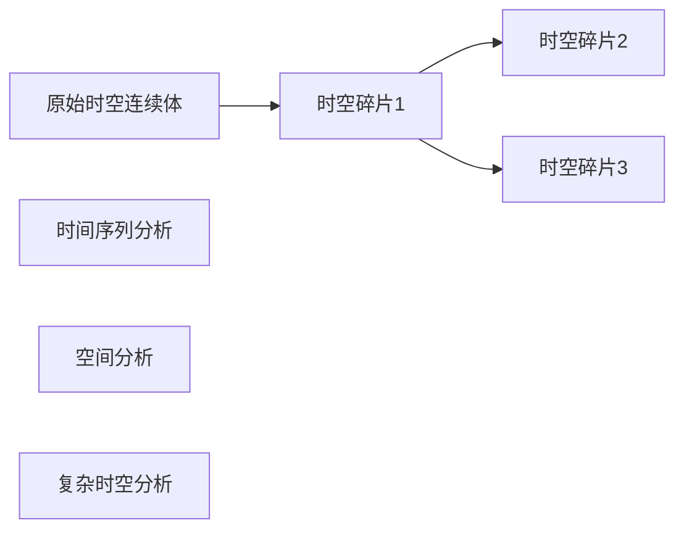
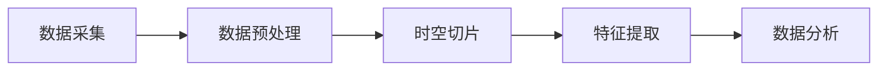

                 

# 文章标题：时空碎片的生成与应用

## 关键词：
- 时空碎片
- 时间序列分析
- 空间分析
- 深度学习
- 智能系统
- 多领域融合

## 摘要：
本文探讨了时空碎片的生成与应用。首先，我们介绍了时空碎片的定义与分类，阐述了时空碎片的关键特性及生成方法。接着，详细解析了时空碎片生成算法的原理，包括基于深度学习、规则和混合方法的三种算法类型。随后，通过应用案例，展示了时空碎片在环境监测和交通管理中的实际应用。文章还分析了时空碎片在时间序列分析和空间分析中的应用优势，以及在智能系统和多领域融合中的具体应用。最后，展望了时空碎片生成技术的发展趋势和未来挑战。

---

## 第一部分：时空碎片的生成基础

### 第1章：时空碎片的定义与分类

#### 1.1 时空碎片的概述

**时空碎片的定义**：时空碎片是指从时空连续体中提取出来，具有独立属性和时间序列的小块信息。它们通常包含空间位置、时间戳和属性值等要素，是进行数据分析和处理的基本单位。

**时空碎片的分类**：根据时空碎片的属性和生成方式，可以分为时间序列碎片、空间碎片和时空融合碎片。

- **时间序列碎片**：仅包含时间属性的数据片段，如股票价格、气象数据等。
- **空间碎片**：仅包含空间属性的数据片段，如地图上的交通流量数据、地理位置信息等。
- **时空融合碎片**：同时包含时间和空间属性的数据片段，如航班数据、移动设备位置数据等。

#### 1.2 时空碎片的关键特性

- **时空连续性**：时空碎片应保持其在原始时空中的连续性，以确保数据分析的准确性。
- **独立性**：时空碎片应具有一定的独立性，使其能够独立于其他时空碎片进行分析和处理。
- **时间序列性**：时空碎片应包含时间信息，以便进行时间序列分析，揭示数据的变化规律。

#### 1.3 时空碎片的生成方法

**数据采集与预处理**：从原始数据中提取时空信息，并进行数据预处理，如数据清洗、去噪、归一化等，以提高数据质量。

**时空切片**：通过时空切片技术，将时空连续体划分为多个时空碎片。切片方法可以是固定时间间隔、动态时间间隔或基于特定事件触发。

**特征提取**：从时空碎片中提取具有代表性的特征，如时间序列特征、空间特征、属性特征等，以便进行后续分析。

---

### 第2章：时空碎片生成算法原理

#### 2.1 时空碎片生成算法概述

**时空碎片生成算法的目标**：优化时空碎片生成的效率和质量，以满足不同应用场景的需求。

**常见算法类型**：

- **基于深度学习的时空碎片生成算法**：利用卷积神经网络（CNN）和递归神经网络（RNN）等深度学习模型，从原始数据中自动提取时空特征，生成时空碎片。
- **基于规则的方法**：根据时空数据特征，构建规则库，通过规则匹配生成时空碎片。
- **混合方法**：结合深度学习和规则方法的优点，提高时空碎片生成的效果。

#### 2.2 基于深度学习的时空碎片生成算法

**卷积神经网络**：利用卷积神经网络进行时空数据的特征提取和碎片生成。卷积神经网络通过卷积层提取空间特征，通过池化层降低数据维度，最后通过全连接层生成时空碎片。

**递归神经网络**：通过递归神经网络处理时间序列数据，生成时空碎片。递归神经网络能够捕获时间序列数据中的时间依赖关系，从而生成具有时间序列特性的时空碎片。

#### 2.3 基于规则的时空碎片生成算法

**规则库构建**：根据时空数据特征，构建时空碎片生成的规则库。规则库包含一系列条件语句，用于匹配时空数据中的特征，生成时空碎片。

**规则匹配与碎片生成**：利用规则库对时空数据进行匹配，根据匹配结果生成时空碎片。规则匹配过程可以是精确匹配或模糊匹配，以适应不同的应用需求。

#### 2.4 混合方法的时空碎片生成算法

**融合深度学习和规则方法**：结合深度学习和规则方法的优点，提高时空碎片生成的效果。深度学习用于自动提取时空特征，规则方法用于指导特征匹配和碎片生成，二者相互补充，实现高效的时空碎片生成。

---

### 第3章：时空碎片生成应用案例

#### 3.1 时空碎片在环境监测中的应用

**环境监测数据采集**：采集空气质量、水质、气象等环境监测数据。

**时空碎片生成**：利用时空碎片生成算法，生成环境监测数据的空间碎片和时间序列碎片。

**环境分析**：对时空碎片进行分析，揭示环境变化规律，为环境管理提供依据。

#### 3.2 时空碎片在交通管理中的应用

**交通数据采集**：采集交通流量、速度、拥堵状况等交通数据。

**时空碎片生成**：利用时空碎片生成算法，生成交通数据的空间碎片和时间序列碎片。

**交通分析**：对时空碎片进行分析，优化交通调度，提高道路通行效率。

---

### 第4章：时空碎片生成技术发展趋势

#### 4.1 时空碎片生成技术的挑战与机遇

**数据处理能力**：随着数据规模的不断扩大，对时空碎片生成技术的数据处理能力提出更高要求。

**算法优化**：算法优化是提高时空碎片生成效率和质量的关键。

#### 4.2 时空碎片生成技术的未来发展趋势

**多模态时空碎片生成**：结合不同类型的时空数据，生成更丰富、更精确的时空碎片。

**自适应时空碎片生成**：根据应用场景和需求，自适应调整时空碎片生成策略。

---

## 第二部分：时空碎片的应用

### 第5章：时空碎片在时间序列分析中的应用

#### 5.1 时间序列分析概述

**时间序列分析的定义**：时间序列分析是指对时间序列数据进行统计分析，揭示数据变化规律的方法。

**时间序列分析的应用**：在金融市场预测、能源消耗分析、生物医学研究等领域有广泛应用。

#### 5.2 时空碎片在时间序列分析中的优势

- **时空碎片的特征提取能力**：时空碎片能够更好地提取时间序列数据的特征，提高分析精度。
- **时空关系的揭示**：时空碎片可以揭示时间序列数据中的时空关系，为分析提供更全面的视角。

#### 5.3 时空碎片在时间序列分析中的应用案例

- **金融市场预测**：利用时空碎片分析历史市场数据，预测未来市场走势。
- **能源消耗分析**：通过对时空碎片的分析，优化能源消耗结构，提高能源利用效率。

---

### 第6章：时空碎片在空间分析中的应用

#### 6.1 空间分析概述

**空间分析的定义**：空间分析是指对空间数据进行处理、分析和可视化，以揭示空间数据特征和关系的方法。

**空间分析的应用**：在地理信息系统、城市规划、环境保护等领域有广泛应用。

#### 6.2 时空碎片在空间分析中的优势

- **空间特征的提取**：时空碎片能够更好地提取空间数据中的特征，提高空间分析的精度。
- **时空关系的揭示**：时空碎片可以揭示空间数据中的时空关系，为空间分析提供更全面的视角。

#### 6.3 时空碎片在空间分析中的应用案例

- **地理信息系统**：利用时空碎片分析地理空间数据，优化地理信息系统的功能。
- **城市规划**：通过对时空碎片的分析，制定更合理的城市规划方案。

---

### 第7章：时空碎片在智能系统中的应用

#### 7.1 智能系统概述

**智能系统的定义**：智能系统是指具备智能特征，能够模拟人类智能行为和思维的计算机系统。

**智能系统的应用**：在自然语言处理、图像识别、自动驾驶等领域有广泛应用。

#### 7.2 时空碎片在智能系统中的应用优势

- **时空信息的融合**：时空碎片能够融合时空信息，提高智能系统的感知能力和决策能力。
- **时空关系的利用**：时空碎片可以揭示时空关系，为智能系统提供更丰富的知识基础。

#### 7.3 时空碎片在智能系统中的应用案例

- **自然语言处理**：利用时空碎片分析语言数据，提高自然语言处理系统的理解能力。
- **自动驾驶**：通过对时空碎片的分析，提高自动驾驶系统的感知和决策能力。

---

### 第8章：时空碎片在多领域融合中的应用

#### 8.1 多领域融合概述

**多领域融合的定义**：多领域融合是指将不同领域的知识和数据整合在一起，形成一个新的综合性领域。

**多领域融合的应用**：在智能制造、智能医疗、智慧城市等领域有广泛应用。

#### 8.2 时空碎片在多领域融合中的应用优势

- **跨领域的时空信息融合**：时空碎片能够融合不同领域的时空信息，提高多领域融合的效率和精度。
- **跨领域时空关系的揭示**：时空碎片可以揭示不同领域之间的时空关系，为多领域融合提供新的视角。

#### 8.3 时空碎片在多领域融合中的应用案例

- **智能制造**：利用时空碎片分析制造过程数据，优化生产流程，提高生产效率。
- **智能医疗**：通过时空碎片分析医疗数据，实现精准医疗，提高医疗质量。

---

### 第9章：时空碎片生成的未来展望

#### 9.1 时空碎片生成技术的发展趋势

- **大数据处理**：随着大数据技术的发展，时空碎片生成技术将更高效地处理大规模时空数据。
- **深度学习与人工智能**：深度学习和人工智能技术的不断发展，将推动时空碎片生成技术的创新。

#### 9.2 时空碎片生成技术的挑战与机遇

- **数据处理能力**：如何提高时空碎片生成技术的数据处理能力，是未来的一个重要挑战。
- **算法优化**：如何优化时空碎片生成算法，提高生成效率和精度，是未来的一个重要机遇。

#### 9.3 时空碎片生成技术的未来发展方向

- **多模态时空碎片生成**：结合不同类型的时空数据，实现更丰富、更精确的时空碎片生成。
- **自适应时空碎片生成**：根据不同应用场景和需求，自适应调整时空碎片生成策略。

---

## 附录

### 附录A：时空碎片生成工具与资源

**工具介绍**：介绍常用的时空碎片生成工具，如时空切片工具、时空特征提取工具等。

**资源推荐**：推荐相关的时空碎片生成资源，如论文、书籍、在线课程等。

### 附录B：时空碎片生成算法实现

**伪代码**：给出时空碎片生成算法的伪代码，方便读者理解和实现。

**源代码**：提供时空碎片生成算法的源代码，帮助读者进行实践。

### 附录C：时空碎片生成应用案例分析

**案例介绍**：介绍时空碎片在各个领域中的应用案例，包括实际问题和解决方案。

**案例解析**：对应用案例进行详细分析，帮助读者理解时空碎片的实际应用价值。

---

## 作者信息

作者：AI天才研究院/AI Genius Institute & 禅与计算机程序设计艺术 /Zen And The Art of Computer Programming

---

**文章标题**：时空碎片的生成与应用

**文章关键词**：时空碎片、时间序列分析、空间分析、深度学习、智能系统、多领域融合

**文章摘要**：
本文深入探讨了时空碎片的生成与应用。首先，介绍了时空碎片的定义、分类及其关键特性。随后，详细解析了时空碎片生成算法的原理，包括基于深度学习、规则和混合方法的算法。接着，通过实际应用案例展示了时空碎片在环境监测、交通管理和智能系统中的应用。文章还分析了时空碎片在多领域融合中的优势，并展望了未来时空碎片生成技术的发展趋势和挑战。

---

### 第一部分：时空碎片的生成基础

#### 第1章：时空碎片的定义与分类

在信息科学和数据处理领域，时空碎片（spatio-temporal fragments）作为一种新型的数据表示方法，正逐渐受到广泛关注。它们是用于描述和分析时空连续体中的局部信息的小数据单元，具有独立性和时间序列性。本章将详细介绍时空碎片的定义、分类及其关键特性。

#### 1.1 时空碎片的概述

**时空碎片的定义**：时空碎片是指从时空连续体中提取出来，具有独立属性和时间序列的小块信息。在具体应用中，时空碎片通常包含以下基本要素：

- **空间位置**：指碎片在空间中的具体位置，可以用地理坐标或者平面坐标来表示。
- **时间戳**：指碎片生成或发生的时间点，是时间序列分析的重要依据。
- **属性值**：指与时空碎片相关的定量或定性信息，如温度、湿度、交通流量等。

时空碎片的本质是从宏观的时空连续体中提取出的具有独立性和可分析性的小数据单元，它们能够独立于其他碎片进行数据分析，同时保持其在原始时空中的连续性。

**时空碎片的分类**：根据时空碎片的属性和生成方式，可以分为以下三种类型：

1. **时间序列碎片**：这类碎片主要包含时间属性，适用于分析时间序列数据，例如股票价格、气象数据等。
2. **空间碎片**：这类碎片主要包含空间属性，适用于空间分析，例如地图上的交通流量数据、地理位置信息等。
3. **时空融合碎片**：这类碎片同时包含时间和空间属性，适用于复杂时空数据的应用，例如航班数据、移动设备位置数据等。

**时空碎片的示意图**：



#### 1.2 时空碎片的关键特性

时空碎片具有以下关键特性，这些特性决定了时空碎片在数据分析中的优势和适用性：

1. **时空连续性**：时空碎片应保持其在原始时空中的连续性，确保碎片之间的时间序列关系得以保留。这意味着，在将原始数据切割成时空碎片的过程中，不能破坏数据的时间序列特性。

2. **独立性**：时空碎片应具有一定的独立性，使其能够独立于其他时空碎片进行分析和处理。这种独立性使得时空碎片可以灵活地应用于不同的分析任务，提高了数据的可操作性和可解释性。

3. **时间序列性**：时空碎片包含时间信息，这使得它们适用于时间序列分析，可以捕捉数据在时间维度上的变化规律。例如，通过对时空碎片中的时间序列数据进行分析，可以预测未来的市场走势或能源消耗。

**时空连续性与独立性示意图**：



#### 1.3 时空碎片的生成方法

生成时空碎片的过程通常涉及以下几个步骤：

1. **数据采集与预处理**：从各种来源采集时空数据，如传感器数据、交通流量数据、气象数据等。在采集到数据后，需要进行预处理，包括数据清洗、去噪、归一化等，以提高数据质量。

2. **时空切片**：通过时空切片技术，将原始时空连续体划分为多个时空碎片。切片方法可以根据应用需求进行灵活设计，例如，可以采用固定时间间隔切片、动态时间间隔切片或基于特定事件触发切片。

3. **特征提取**：从时空碎片中提取具有代表性的特征，如时间特征、空间特征和属性特征。这些特征将用于后续的数据分析和建模。

**时空碎片生成流程图**：



通过上述步骤，我们可以有效地生成时空碎片，为时空数据分析提供基础数据支持。在接下来的章节中，我们将深入探讨时空碎片生成算法的原理和具体实现。

---

### 第2章：时空碎片生成算法原理

时空碎片的生成算法是实现时空数据分析的基础。本章将详细介绍时空碎片生成算法的原理，包括基于深度学习、规则方法和混合方法的时空碎片生成算法，以及这些算法的具体实现和应用场景。

#### 2.1 时空碎片生成算法概述

**时空碎片生成算法的目标**：时空碎片生成算法的主要目标是在保持数据连续性和独立性的前提下，高效地生成具有代表性的时空碎片，以便进行后续的数据分析和处理。具体目标包括：

1. **数据连续性**：保证生成的时空碎片在原始数据中的时间序列关系不被破坏。
2. **数据独立性**：生成的时空碎片应具备独立性，能够独立于其他碎片进行单独分析。
3. **数据代表性**：生成的时空碎片应能够代表原始数据的特征，为后续分析提供充足的信息。

**常见算法类型**：

1. **基于深度学习的时空碎片生成算法**：利用深度学习模型，如卷积神经网络（CNN）和递归神经网络（RNN），自动提取时空特征，生成时空碎片。
2. **基于规则的方法**：根据预定义的规则库，对时空数据进行模式匹配，生成时空碎片。
3. **混合方法**：结合深度学习和规则方法的优点，通过机器学习模型和规则库的协同作用，生成高质量的时空碎片。

#### 2.2 基于深度学习的时空碎片生成算法

**卷积神经网络**：卷积神经网络（CNN）是一种在图像处理领域广泛应用的人工神经网络。CNN通过卷积层提取图像中的空间特征，通过池化层降低数据维度，最后通过全连接层生成时空碎片。

**实现步骤**：

1. **数据预处理**：对时空数据进行归一化和预处理，以便输入到CNN模型中。
2. **模型构建**：构建CNN模型，包括卷积层、池化层和全连接层。
3. **模型训练**：使用训练数据集对模型进行训练，通过反向传播算法优化模型参数。
4. **时空碎片生成**：使用训练好的模型对时空数据进行特征提取，生成时空碎片。

**伪代码示例**：

```python
# 数据预处理
data = preprocess_data(时空数据)

# 构建CNN模型
model = build_CNN_model()

# 模型训练
train_model(model, 训练数据)

# 时空碎片生成
时空碎片 = model.predict(时空数据)
```

**应用场景**：基于CNN的时空碎片生成算法适用于处理大量空间数据，如地图上的交通流量数据、气象数据等。

**递归神经网络**：递归神经网络（RNN）是一种在时间序列数据分析中广泛应用的人工神经网络。RNN能够处理具有时间依赖性的数据，通过递归结构捕捉时间序列中的特征。

**实现步骤**：

1. **数据预处理**：对时间序列数据进行归一化和预处理，以便输入到RNN模型中。
2. **模型构建**：构建RNN模型，包括输入层、隐藏层和输出层。
3. **模型训练**：使用训练数据集对模型进行训练，通过反向传播算法优化模型参数。
4. **时空碎片生成**：使用训练好的模型对时间序列数据进行特征提取，生成时空碎片。

**伪代码示例**：

```python
# 数据预处理
data = preprocess_data(时间序列数据)

# 构建RNN模型
model = build_RNN_model()

# 模型训练
train_model(model, 训练数据)

# 时空碎片生成
时空碎片 = model.predict(时间序列数据)
```

**应用场景**：基于RNN的时空碎片生成算法适用于处理具有时间依赖性的数据，如股票价格、气象数据等。

#### 2.3 基于规则的方法

**规则库构建**：基于规则的方法首先需要构建一个规则库，规则库包含一系列的条件语句，用于描述时空数据中的特征和模式。规则库的构建通常基于领域知识和数据特征。

**规则匹配与碎片生成**：在规则库构建完成后，通过规则匹配技术，将时空数据与规则库中的规则进行匹配，根据匹配结果生成时空碎片。

**实现步骤**：

1. **规则库构建**：根据领域知识和数据特征，构建规则库。
2. **规则匹配**：使用规则库对时空数据进行模式匹配。
3. **时空碎片生成**：根据匹配结果生成时空碎片。

**伪代码示例**：

```python
# 规则库构建
规则库 = build_rule_base()

# 规则匹配
匹配结果 = match_rules(时空数据, 规则库)

# 时空碎片生成
时空碎片 = generate_fragments(匹配结果)
```

**应用场景**：基于规则的方法适用于处理结构化数据，如传感器数据、交通流量数据等。

#### 2.4 混合方法的时空碎片生成算法

**融合深度学习和规则方法**：混合方法结合了深度学习和规则方法的优点，通过深度学习模型提取时空特征，通过规则库进行模式匹配，生成高质量的时空碎片。

**实现步骤**：

1. **数据预处理**：对时空数据进行预处理，包括归一化和特征提取。
2. **模型构建**：构建深度学习模型和规则库。
3. **模型训练**：使用训练数据集对深度学习模型进行训练，同时构建和优化规则库。
4. **时空碎片生成**：使用训练好的深度学习模型和规则库生成时空碎片。

**伪代码示例**：

```python
# 数据预处理
data = preprocess_data(时空数据)

# 构建深度学习模型和规则库
model, rule_base = build_model_and_rule_base()

# 模型训练
train_model(model, 训练数据)
train_rule_base(rule_base, 训练数据)

# 时空碎片生成
时空碎片 = generate_fragments(model, rule_base, 测试数据)
```

**应用场景**：混合方法的时空碎片生成算法适用于处理复杂时空数据，如移动设备位置数据、社交网络数据等。

通过上述四种方法，我们可以有效地生成时空碎片，为后续的数据分析和应用提供基础。在接下来的章节中，我们将通过具体的案例来展示时空碎片的实际应用场景。

---

### 第3章：时空碎片生成应用案例

时空碎片的生成不仅是一个技术过程，更是一个能够带来实际效益的实践。本章节将详细介绍时空碎片在环境监测和交通管理中的应用案例，通过具体的实例展示时空碎片如何被用于解决实际问题，并提供具体的实现方法。

#### 3.1 时空碎片在环境监测中的应用

环境监测是一个涉及空气质量、水质、气象等多个方面的复杂任务。时空碎片的生成能够为环境监测提供高效的数据分析和处理手段，从而揭示环境变化的规律，为环境保护提供科学依据。

**案例背景**：

某城市为了改善空气质量，需要实时监测空气中的PM2.5、PM10、CO、SO2等污染物的浓度。这些污染物数据不仅具有时间序列特性，还与地理位置密切相关。为了更好地进行环境监测，需要将连续的污染物数据划分为时空碎片，以便进行详细分析。

**实现步骤**：

1. **数据采集**：从传感器网络中采集空气污染数据，包括PM2.5、PM10、CO、SO2等污染物的浓度值。
2. **数据预处理**：对采集到的污染物数据进行预处理，包括数据清洗、去噪、归一化等，以提高数据质量。
3. **时空切片**：采用固定时间间隔（如每5分钟）或基于特定事件（如污染事件触发）的方式，对连续的污染物数据进行时空切片，生成时空碎片。
4. **特征提取**：从时空碎片中提取关键特征，如时间特征、空间特征和污染物浓度特征。
5. **时空碎片生成**：利用特征提取后的数据生成时空碎片，每个碎片包含特定时间段和地点的污染物浓度信息。

**具体实现方法**：

- **数据预处理**：使用Python的pandas库对污染物数据进行清洗和归一化处理。

```python
import pandas as pd

data = pd.read_csv('pollution_data.csv')
data = data.dropna()  # 删除缺失值
data['PM2.5'] = data['PM2.5'] / 1000  # 归一化PM2.5数据
```

- **时空切片**：使用Python的time库和numpy库对数据按照时间间隔进行切片。

```python
import time
import numpy as np

def time_slice(data, interval):
    fragments = []
    for i in range(0, len(data), interval):
        fragment = data[i:i+interval]
        fragments.append(fragment)
    return fragments

interval = 5 * 60  # 5分钟间隔
fragments = time_slice(data, interval)
```

- **特征提取**：提取每个时空碎片中的时间戳、地点坐标和污染物浓度值。

```python
features = []
for fragment in fragments:
    timestamp = fragment['timestamp']
    location = fragment['location']
    PM25 = fragment['PM2.5']
    feature = (timestamp, location, PM25)
    features.append(feature)
```

- **时空碎片生成**：将提取到的特征组成时空碎片。

```python
时空碎片 = [(t, l, p) for t, l, p in features]
```

**应用效果**：通过时空碎片的分析，可以实时监控空气污染状况，识别污染热点区域，为环保政策的制定和执行提供数据支持。

#### 3.2 时空碎片在交通管理中的应用

交通管理是一个复杂的系统工程，涉及交通流量、速度、拥堵状况等多个方面。时空碎片的生成能够帮助交通管理部门更精确地了解交通状况，优化交通调度，提高道路通行效率。

**案例背景**：

某城市为了缓解交通拥堵，需要实时监测道路上的车辆流量和速度。交通管理部门希望通过时空碎片的分析，识别交通流量高峰期、拥堵路段，并制定相应的交通调度策略。

**实现步骤**：

1. **数据采集**：从交通监测设备中采集车辆流量和速度数据。
2. **数据预处理**：对采集到的交通数据进行预处理，包括数据清洗、去噪、归一化等。
3. **时空切片**：采用固定时间间隔或基于特定事件触发的方式，对交通数据进行时空切片，生成时空碎片。
4. **特征提取**：从时空碎片中提取关键特征，如时间特征、空间特征和流量特征。
5. **时空碎片生成**：利用特征提取后的数据生成时空碎片。

**具体实现方法**：

- **数据预处理**：使用Python的pandas库对交通数据进行清洗和归一化处理。

```python
import pandas as pd

data = pd.read_csv('traffic_data.csv')
data = data.dropna()  # 删除缺失值
data['speed'] = data['speed'] / 1000  # 归一化速度数据
```

- **时空切片**：使用Python的time库和numpy库对数据按照时间间隔进行切片。

```python
import time
import numpy as np

def time_slice(data, interval):
    fragments = []
    for i in range(0, len(data), interval):
        fragment = data[i:i+interval]
        fragments.append(fragment)
    return fragments

interval = 1 * 60  # 1分钟间隔
fragments = time_slice(data, interval)
```

- **特征提取**：提取每个时空碎片中的时间戳、地点坐标和流量特征。

```python
features = []
for fragment in fragments:
    timestamp = fragment['timestamp']
    location = fragment['location']
    flow = fragment['flow']
    feature = (timestamp, location, flow)
    features.append(feature)
```

- **时空碎片生成**：将提取到的特征组成时空碎片。

```python
时空碎片 = [(t, l, f) for t, l, f in features]
```

**应用效果**：通过时空碎片的分析，可以实时监控交通状况，识别交通流量高峰期和拥堵路段，为交通管理部门提供决策支持。

通过上述两个应用案例，我们可以看到时空碎片的生成技术在环境监测和交通管理中具有广泛的应用前景。在接下来的章节中，我们将进一步探讨时空碎片在时间序列分析和空间分析中的应用。

---

### 第4章：时空碎片生成技术发展趋势

随着信息技术和数据处理技术的快速发展，时空碎片生成技术正面临着一系列挑战与机遇。本章将探讨时空碎片生成技术的挑战与机遇，并分析其未来发展趋势。

#### 4.1 时空碎片生成技术的挑战

**数据处理能力**：随着物联网、人工智能等技术的普及，数据规模和种类不断增加。时空碎片生成技术需要在处理大规模、多样化数据的同时，保证处理效率和数据质量。这对算法的优化和硬件的支撑提出了更高的要求。

**算法优化**：现有的时空碎片生成算法在效率和质量上仍有待提升。如何设计更加高效、鲁棒的算法，成为当前研究的热点。特别是在处理实时数据时，算法的响应速度和准确性需要显著提高。

**跨领域融合**：时空碎片生成技术需要在多个领域之间实现数据共享和融合，为多领域应用提供支持。这要求算法具备跨领域的适应性，能够在不同应用场景中灵活调整和优化。

#### 4.2 时空碎片生成技术的机遇

**大数据处理技术**：大数据技术的不断发展，为时空碎片生成技术提供了强大的数据支持。通过分布式计算和并行处理，时空碎片生成技术能够更高效地处理大规模数据。

**深度学习和人工智能**：深度学习和人工智能技术的进步，为时空碎片生成算法的设计和优化提供了新的思路。通过引入先进的机器学习模型，时空碎片生成技术可以实现更高的效率和精度。

**跨领域应用**：随着各行业对数据驱动决策的重视，时空碎片生成技术在多个领域具有广泛的应用前景。从环境监测、交通管理到智能制造、智慧城市，时空碎片生成技术将在不同领域发挥重要作用。

#### 4.3 时空碎片生成技术的未来发展趋势

**多模态时空碎片生成**：未来的时空碎片生成技术将能够处理多种类型的数据，如文本、图像、声音等。通过融合多模态数据，生成更丰富、更精确的时空碎片。

**自适应时空碎片生成**：未来的时空碎片生成技术将具备自适应能力，根据不同的应用场景和需求，自动调整生成策略。这种自适应能力将提高时空碎片生成技术的灵活性和实用性。

**实时处理与预测**：未来的时空碎片生成技术将实现实时数据处理和预测能力。通过实时分析时空碎片，为用户提供即时的决策支持和预测结果。

**边缘计算与云计算的结合**：未来的时空碎片生成技术将充分利用边缘计算和云计算的优势，实现数据的分布式处理和协同分析。这种结合将提高时空碎片生成技术的处理效率和数据安全性。

#### 4.4 结论

时空碎片生成技术在未来发展中面临着诸多挑战与机遇。通过不断优化算法、引入先进技术、实现跨领域融合，时空碎片生成技术将在各个领域发挥重要作用，为数据驱动决策提供有力支持。

---

### 第5章：时空碎片在时间序列分析中的应用

时间序列分析是统计学和数据分析中的一个重要分支，它旨在通过对时间序列数据的分析，揭示数据的变化规律和趋势。时空碎片作为一种新兴的数据表示方法，其在时间序列分析中的应用具有显著的优势。本章将详细探讨时空碎片在时间序列分析中的应用，包括其优势、具体应用案例以及实现方法。

#### 5.1 时间序列分析概述

**时间序列分析的定义**：时间序列分析是指对按时间顺序排列的数据进行分析，以揭示数据的变化趋势、周期性和季节性特征。时间序列分析广泛应用于金融市场预测、能源消耗分析、生物医学研究等领域。

**时间序列分析的基本步骤**：

1. **数据收集**：收集并整理时间序列数据，包括时间戳和对应的数值。
2. **数据预处理**：对数据进行清洗、去噪和归一化，以提高数据质量。
3. **特征提取**：从时间序列数据中提取关键特征，如趋势、周期性、季节性等。
4. **建模与预测**：利用时间序列模型，如自回归模型（AR）、移动平均模型（MA）、自回归移动平均模型（ARMA）等，对数据进行分析和预测。

**时间序列分析的应用领域**：

- **金融市场预测**：通过分析历史股票价格数据，预测未来市场走势。
- **能源消耗分析**：通过分析能源消耗数据，预测未来的能源需求，优化能源分配。
- **生物医学研究**：通过分析生物医学数据，如心电图、基因表达数据等，揭示健康变化规律。

#### 5.2 时空碎片在时间序列分析中的优势

**时空碎片的特征提取能力**：时空碎片能够更好地提取时间序列数据的特征，包括时间特征和空间特征。这使得时空碎片在分析时间序列数据时，能够提供更全面的视角和更精确的分析结果。

**时空关系的揭示**：时空碎片不仅可以揭示时间序列数据的变化趋势，还可以揭示数据之间的时空关系。例如，通过分析时空碎片，可以识别不同地区在同一时间段内的数据差异，从而揭示区域性的变化规律。

**时空碎片的灵活性**：时空碎片可以根据具体分析任务的需求，灵活调整生成策略。例如，可以根据时间间隔、数据频率和空间范围等因素，生成不同粒度的时空碎片，以适应不同的分析需求。

**时空碎片的可操作性**：时空碎片作为独立的数据单元，可以方便地与其他数据源进行集成和分析。这使得时空碎片在多领域应用中，能够实现数据共享和协同分析，提高数据分析的效率。

#### 5.3 时空碎片在时间序列分析中的应用案例

**案例一：金融市场预测**

**背景**：金融市场是一个高度复杂和动态变化的系统，预测市场走势对于投资者具有重要意义。通过时空碎片分析，可以更好地理解市场数据中的时空关系，提高预测的准确性。

**实现步骤**：

1. **数据收集**：收集历史股票价格数据，包括开盘价、收盘价、最高价、最低价等。
2. **数据预处理**：对股票价格数据进行清洗和归一化处理，以消除异常值和噪声。
3. **时空切片**：采用固定时间间隔（如每天）或基于特定事件（如重大新闻发布）的方式，将股票价格数据切割成时空碎片。
4. **特征提取**：提取时空碎片中的时间特征和空间特征，如时间戳、地区指数等。
5. **时空碎片生成**：利用提取到的特征生成时空碎片，每个碎片包含特定时间段和地区的历史股票价格信息。

**案例解析**：

通过时空碎片分析，可以揭示股票价格在不同时间和空间上的变化规律。例如，可以识别出哪些时间和地区的股票价格波动较大，哪些股票价格受到特定事件的影响。这些信息对于投资者制定投资策略具有重要意义。

**案例二：能源消耗分析**

**背景**：能源消耗是影响环境可持续性的重要因素，通过时空碎片分析，可以更好地了解能源消耗的时空分布规律，优化能源分配和管理。

**实现步骤**：

1. **数据收集**：收集能源消耗数据，包括电力、天然气、煤炭等能源的消耗量。
2. **数据预处理**：对能源消耗数据进行清洗和归一化处理，以提高数据质量。
3. **时空切片**：采用固定时间间隔（如每天）或基于特定事件（如节假日）的方式，将能源消耗数据切割成时空碎片。
4. **特征提取**：提取时空碎片中的时间特征和空间特征，如时间戳、地区消耗量等。
5. **时空碎片生成**：利用提取到的特征生成时空碎片，每个碎片包含特定时间段和地区的能源消耗信息。

**案例解析**：

通过时空碎片分析，可以识别出能源消耗的时空分布规律。例如，可以分析出哪些地区和哪些时间段能源消耗较高，哪些能源类型消耗较大。这些信息对于能源管理部门制定节能政策和优化能源分配方案具有重要意义。

**案例三：生物医学研究**

**背景**：生物医学研究涉及大量的时间序列数据，如基因表达数据、蛋白质活性数据等。通过时空碎片分析，可以更好地理解生物医学数据中的时空关系，为疾病预测和治疗提供科学依据。

**实现步骤**：

1. **数据收集**：收集生物医学时间序列数据，如基因表达数据、蛋白质活性数据等。
2. **数据预处理**：对生物医学数据进行清洗和归一化处理，以提高数据质量。
3. **时空切片**：采用固定时间间隔（如每小时）或基于特定事件（如药物作用）的方式，将生物医学数据切割成时空碎片。
4. **特征提取**：提取时空碎片中的时间特征和空间特征，如时间戳、基因表达水平等。
5. **时空碎片生成**：利用提取到的特征生成时空碎片，每个碎片包含特定时间段和样本的基因表达或蛋白质活性信息。

**案例解析**：

通过时空碎片分析，可以揭示生物医学数据中的时空关系和变化规律。例如，可以分析出哪些基因在特定时间段和条件下表达量较高，哪些蛋白质在特定药物作用下活性较强。这些信息对于生物医学研究者和临床医生具有重要意义。

#### 5.4 时空碎片在时间序列分析中的实现方法

**时空碎片生成算法**：

时空碎片的生成算法是实现时空碎片分析的关键。常用的算法包括基于深度学习的时空碎片生成算法、基于规则的方法以及混合方法。

- **基于深度学习的时空碎片生成算法**：利用卷积神经网络（CNN）和递归神经网络（RNN）等深度学习模型，自动提取时间序列数据中的时空特征。例如，可以使用CNN提取空间特征，使用RNN处理时间特征。

- **基于规则的方法**：根据预定义的规则库，对时间序列数据进行模式匹配，生成时空碎片。这种方法适用于处理结构化时间序列数据，如传感器数据、金融数据等。

- **混合方法**：结合深度学习和规则方法的优点，通过深度学习模型提取时空特征，并通过规则库进行模式匹配，生成高质量的时空碎片。

**时空碎片分析工具**：

时空碎片分析工具是实现时空碎片分析的重要支撑。常用的工具包括Python的pandas库、numpy库和TensorFlow等深度学习框架。这些工具提供了丰富的数据处理和分析功能，方便用户进行时空碎片的生成和分析。

**时空碎片可视化工具**：

时空碎片的可视化有助于用户更好地理解和分析时空数据。常用的可视化工具包括matplotlib、seaborn和Plotly等。这些工具能够生成各种类型的可视化图表，如时间序列图、热力图和地理信息系统（GIS）等。

通过时空碎片在时间序列分析中的应用，可以更准确地揭示数据中的时空关系和变化规律，为各个领域的决策提供科学依据。随着时空碎片生成技术的不断发展和完善，其在时间序列分析中的应用将更加广泛和深入。

---

### 第6章：时空碎片在空间分析中的应用

空间分析是地理学、环境科学和城市规划等领域的重要工具，它通过分析地理数据中的空间关系和特征，帮助我们理解和解决现实世界中的问题。时空碎片作为一种将时间和空间信息结合的数据表示方法，在空间分析中具有独特的优势。本章将探讨时空碎片在空间分析中的应用，包括其优势、具体应用案例以及实现方法。

#### 6.1 空间分析概述

**空间分析的定义**：空间分析是指对空间数据进行处理、分析和可视化，以揭示空间数据特征和关系的方法。空间分析涉及多个领域，如地理信息系统（GIS）、遥感、城市规划、环境监测等。

**空间分析的基本步骤**：

1. **数据收集**：收集所需的地理空间数据，包括地图、遥感图像、地理坐标等。
2. **数据预处理**：对地理空间数据进行清洗、校正和归一化处理，以提高数据质量。
3. **空间特征提取**：从地理空间数据中提取关键特征，如地理位置、地形、人口密度等。
4. **空间关系分析**：分析地理空间数据中的关系，如距离、连通性、重叠等。
5. **空间建模与预测**：利用空间模型和算法，对地理空间数据进行建模和预测。

**空间分析的应用领域**：

- **地理信息系统**：用于地图制作、空间数据管理、地理信息可视化等。
- **城市规划**：用于城市布局、交通规划、土地使用规划等。
- **环境监测**：用于环境质量监测、自然灾害预警等。
- **交通运输**：用于交通流量分析、路线规划等。

#### 6.2 时空碎片在空间分析中的优势

**时空碎片的特征提取能力**：时空碎片能够同时包含时间和空间信息，这使得它们在空间分析中能够提供更丰富的特征信息。例如，在分析交通流量时，时空碎片不仅包含位置信息，还包含不同时间点的流量数据。

**时空关系的揭示**：时空碎片能够揭示地理空间数据中的时空关系，帮助我们更好地理解数据的变化规律。例如，通过分析时空碎片，可以识别出特定时间段和地点的交通流量高峰期，从而为交通管理提供依据。

**时空碎片的灵活性**：时空碎片可以根据具体分析任务的需求，灵活调整生成策略。例如，可以根据时间间隔、数据频率和空间范围等因素，生成不同粒度的时空碎片，以适应不同的空间分析需求。

**时空碎片的集成与共享**：时空碎片可以作为独立的数据单元与其他数据源进行集成和分析，实现数据的共享和协同分析。这使得时空碎片在多领域应用中，能够实现更高效的数据分析和应用。

#### 6.3 时空碎片在空间分析中的应用案例

**案例一：交通流量分析**

**背景**：交通流量分析是城市交通管理的重要环节，通过分析交通流量数据，可以优化交通调度，提高道路通行效率。

**实现步骤**：

1. **数据收集**：收集交通流量数据，包括不同路段的流量、速度、拥堵状况等。
2. **数据预处理**：对交通流量数据进行清洗、去噪和归一化处理，以提高数据质量。
3. **时空切片**：采用固定时间间隔（如每小时）或基于特定事件（如交通事故）的方式，将交通流量数据切割成时空碎片。
4. **特征提取**：提取时空碎片中的空间特征和时间特征，如路段位置、流量数据等。
5. **时空碎片生成**：利用提取到的特征生成时空碎片，每个碎片包含特定时间段和路段的流量信息。

**案例解析**：

通过时空碎片分析，可以实时监控交通流量状况，识别交通流量高峰期和拥堵路段。例如，可以分析出哪些时间段和路段的交通流量较大，哪些时间段和路段容易发生拥堵。这些信息对于交通管理部门制定交通调度策略和道路建设规划具有重要意义。

**案例二：环境监测**

**背景**：环境监测是保护生态环境、改善空气质量的重要手段。通过时空碎片分析，可以实时监控环境质量，揭示环境变化的时空关系。

**实现步骤**：

1. **数据收集**：收集环境监测数据，包括空气质量、水质、气象等。
2. **数据预处理**：对环境监测数据进行清洗、去噪和归一化处理，以提高数据质量。
3. **时空切片**：采用固定时间间隔（如每小时）或基于特定事件（如污染事件）的方式，将环境监测数据切割成时空碎片。
4. **特征提取**：提取时空碎片中的空间特征和时间特征，如监测站点位置、污染物浓度等。
5. **时空碎片生成**：利用提取到的特征生成时空碎片，每个碎片包含特定时间段和监测站点的环境质量信息。

**案例解析**：

通过时空碎片分析，可以实时监控环境质量，识别污染热点区域。例如，可以分析出哪些时间段和地点的空气质量较差，哪些污染物浓度较高。这些信息对于环境保护部门制定污染治理措施和改善环境质量具有重要意义。

**案例三：城市规划**

**背景**：城市规划是城市可持续发展的重要保障，通过时空碎片分析，可以更好地理解城市空间结构，优化城市规划方案。

**实现步骤**：

1. **数据收集**：收集城市规划数据，包括土地使用、建筑布局、交通网络等。
2. **数据预处理**：对城市规划数据进行清洗、校正和归一化处理，以提高数据质量。
3. **时空切片**：采用固定时间间隔（如每5年）或基于特定事件（如城市规划调整）的方式，将城市规划数据切割成时空碎片。
4. **特征提取**：提取时空碎片中的空间特征和时间特征，如地块位置、建筑类型等。
5. **时空碎片生成**：利用提取到的特征生成时空碎片，每个碎片包含特定时间段和区域的城市规划信息。

**案例解析**：

通过时空碎片分析，可以揭示城市空间结构的变化规律。例如，可以分析出哪些区域和时间段的城市建设较为集中，哪些区域的土地使用效率较高。这些信息对于城市规划部门制定城市发展规划和土地利用方案具有重要意义。

#### 6.4 时空碎片在空间分析中的实现方法

**时空碎片生成算法**：

时空碎片的生成算法是实现时空碎片分析的关键。常用的算法包括基于深度学习的时空碎片生成算法、基于规则的方法以及混合方法。

- **基于深度学习的时空碎片生成算法**：利用卷积神经网络（CNN）和递归神经网络（RNN）等深度学习模型，自动提取空间和时序特征。例如，可以使用CNN处理空间特征，使用RNN处理时间特征。

- **基于规则的方法**：根据预定义的规则库，对空间数据进行模式匹配，生成时空碎片。这种方法适用于处理结构化空间数据，如地图数据、建筑物数据等。

- **混合方法**：结合深度学习和规则方法的优点，通过深度学习模型提取时空特征，并通过规则库进行模式匹配，生成高质量的时空碎片。

**时空碎片分析工具**：

时空碎片分析工具是实现时空碎片分析的重要支撑。常用的工具包括Python的pandas库、numpy库和GDAL等地理数据处理工具。这些工具提供了丰富的数据处理和分析功能，方便用户进行时空碎片的生成和分析。

**时空碎片可视化工具**：

时空碎片的可视化有助于用户更好地理解和分析时空数据。常用的可视化工具包括matplotlib、seaborn和Plotly等。这些工具能够生成各种类型的可视化图表，如热力图、折线图和地理信息系统（GIS）等。

通过时空碎片在空间分析中的应用，可以更准确地揭示地理空间数据中的时空关系和变化规律，为城市规划、环境监测和交通管理等领域提供科学依据。随着时空碎片生成技术的不断发展和完善，其在空间分析中的应用将更加广泛和深入。

---

### 第7章：时空碎片在智能系统中的应用

智能系统是指具备智能特征，能够模拟人类智能行为和思维的计算机系统。时空碎片作为一种高效的数据表示方法，能够在智能系统中发挥重要作用，提高系统的感知能力、决策能力和学习能力。本章将探讨时空碎片在智能系统中的应用，包括其在自然语言处理、图像识别、自动驾驶等领域的优势、具体应用案例以及实现方法。

#### 7.1 智能系统概述

**智能系统的定义**：智能系统是指利用计算机技术和人工智能算法，模拟人类智能行为和思维过程的计算机系统。智能系统通常具备以下几个特征：

1. **感知能力**：能够感知和理解外部环境，如视觉、听觉、触觉等。
2. **学习能力**：通过学习算法，从数据中获取知识，提高系统的智能水平。
3. **决策能力**：基于感知和学习结果，进行决策和规划。
4. **自适应能力**：能够根据环境变化，自适应调整系统行为。

**智能系统的应用领域**：

- **自然语言处理**：用于语音识别、机器翻译、情感分析等。
- **图像识别**：用于人脸识别、物体检测、图像分类等。
- **自动驾驶**：用于车辆定位、环境感知、路径规划等。
- **智能推荐系统**：用于个性化推荐、广告投放等。

#### 7.2 时空碎片在智能系统中的应用优势

**时空信息的融合**：时空碎片能够融合时间和空间信息，为智能系统提供更丰富的感知数据。例如，在自动驾驶系统中，时空碎片可以同时包含车辆的位置、速度和行驶方向等信息，有助于提高系统的感知能力。

**时空关系的利用**：时空碎片可以揭示数据之间的时空关系，为智能系统提供更全面的视角。例如，在自然语言处理中，时空碎片可以帮助识别文本中的时间线索和空间线索，提高语义理解能力。

**数据分析的高效性**：时空碎片作为独立的数据单元，可以独立于其他数据进行处理和分析。这使得智能系统可以更高效地处理大量数据，提高决策和规划的效率。

**跨领域的适应性**：时空碎片具有跨领域的适应性，可以广泛应用于多个领域。例如，在医疗领域中，时空碎片可以同时处理患者的历史病历和实时监测数据，实现精准医疗。

#### 7.3 时空碎片在智能系统中的应用案例

**案例一：自然语言处理**

**背景**：自然语言处理（NLP）是人工智能的重要分支，旨在使计算机能够理解和处理人类语言。时空碎片在NLP中的应用，可以增强系统的语义理解和生成能力。

**实现步骤**：

1. **数据收集**：收集文本数据，如新闻报道、社交媒体帖子等。
2. **数据预处理**：对文本数据进行清洗、去噪和分词处理。
3. **时空切片**：采用固定时间间隔或基于特定事件的方式，将文本数据切割成时空碎片。
4. **特征提取**：提取时空碎片中的时间特征和空间特征，如时间戳、地点等。
5. **时空碎片生成**：利用提取到的特征生成时空碎片，每个碎片包含特定时间段和地点的文本信息。

**案例解析**：

通过时空碎片分析，可以识别文本中的时间线索和空间线索，提高语义理解能力。例如，可以分析出哪些时间段和地点的文本内容具有相似性，哪些文本内容具有明显的时空特征。这些信息对于文本分类、情感分析和信息检索具有重要意义。

**案例二：图像识别**

**背景**：图像识别是计算机视觉的重要任务，旨在识别和理解图像中的物体和场景。时空碎片在图像识别中的应用，可以增强系统的视觉感知能力。

**实现步骤**：

1. **数据收集**：收集图像数据，如人脸识别、物体检测等。
2. **数据预处理**：对图像数据进行清洗、去噪和增强处理。
3. **时空切片**：采用固定时间间隔或基于特定事件的方式，将图像数据切割成时空碎片。
4. **特征提取**：提取时空碎片中的空间特征和时间特征，如图像像素值、时间戳等。
5. **时空碎片生成**：利用提取到的特征生成时空碎片，每个碎片包含特定时间段和地点的图像信息。

**案例解析**：

通过时空碎片分析，可以识别图像中的时空关系，提高图像识别的准确性。例如，可以分析出哪些时间段和地点的图像内容具有相似性，哪些图像内容具有明显的时空特征。这些信息对于图像分类、物体检测和场景理解具有重要意义。

**案例三：自动驾驶**

**背景**：自动驾驶是人工智能在交通领域的应用，旨在实现车辆的自主驾驶。时空碎片在自动驾驶中的应用，可以增强系统的环境感知和决策能力。

**实现步骤**：

1. **数据收集**：收集自动驾驶车辆感知到的环境数据，如摄像头图像、雷达数据、GPS等。
2. **数据预处理**：对环境数据进行清洗、去噪和校正处理。
3. **时空切片**：采用固定时间间隔或基于特定事件的方式，将环境数据切割成时空碎片。
4. **特征提取**：提取时空碎片中的空间特征和时间特征，如车辆位置、速度、时间戳等。
5. **时空碎片生成**：利用提取到的特征生成时空碎片，每个碎片包含特定时间段和地点的环境信息。

**案例解析**：

通过时空碎片分析，可以实时监控自动驾驶车辆周围的环境，识别潜在的交通风险。例如，可以分析出哪些时间段和地点的交通流量较大，哪些路段可能存在交通拥堵。这些信息对于自动驾驶车辆的路径规划和决策具有重要意义。

**案例四：智能推荐系统**

**背景**：智能推荐系统是电子商务和在线媒体等领域的重要工具，旨在为用户提供个性化的推荐。时空碎片在智能推荐系统中的应用，可以增强系统的推荐精度和用户体验。

**实现步骤**：

1. **数据收集**：收集用户行为数据，如浏览记录、购买历史等。
2. **数据预处理**：对用户行为数据进行清洗、去噪和归一化处理。
3. **时空切片**：采用固定时间间隔或基于特定事件的方式，将用户行为数据切割成时空碎片。
4. **特征提取**：提取时空碎片中的时间特征和空间特征，如用户ID、时间戳、地点等。
5. **时空碎片生成**：利用提取到的特征生成时空碎片，每个碎片包含特定时间段和地点的用户行为信息。

**案例解析**：

通过时空碎片分析，可以识别用户行为中的时空关系，提高推荐系统的准确性。例如，可以分析出哪些时间段和地点的用户行为具有相似性，哪些用户行为可能引起其他用户的兴趣。这些信息对于推荐系统的个性化推荐和用户行为预测具有重要意义。

#### 7.4 时空碎片在智能系统中的实现方法

**时空碎片生成算法**：

时空碎片的生成算法是实现时空碎片分析的关键。常用的算法包括基于深度学习的时空碎片生成算法、基于规则的方法以及混合方法。

- **基于深度学习的时空碎片生成算法**：利用卷积神经网络（CNN）和递归神经网络（RNN）等深度学习模型，自动提取时空特征。例如，可以使用CNN处理空间特征，使用RNN处理时间特征。

- **基于规则的方法**：根据预定义的规则库，对时空数据进行模式匹配，生成时空碎片。这种方法适用于处理结构化时空数据，如传感器数据、交通数据等。

- **混合方法**：结合深度学习和规则方法的优点，通过深度学习模型提取时空特征，并通过规则库进行模式匹配，生成高质量的时空碎片。

**时空碎片分析工具**：

时空碎片分析工具是实现时空碎片分析的重要支撑。常用的工具包括Python的pandas库、numpy库和TensorFlow等深度学习框架。这些工具提供了丰富的数据处理和分析功能，方便用户进行时空碎片的生成和分析。

**时空碎片可视化工具**：

时空碎片的可视化有助于用户更好地理解和分析时空数据。常用的可视化工具包括matplotlib、seaborn和Plotly等。这些工具能够生成各种类型的可视化图表，如热力图、折线图和地理信息系统（GIS）等。

通过时空碎片在智能系统中的应用，可以显著提高系统的感知能力、决策能力和学习能力。随着时空碎片生成技术的不断发展和完善，其在智能系统中的应用将更加广泛和深入。

---

### 第8章：时空碎片在多领域融合中的应用

多领域融合是指将不同领域的知识和数据整合在一起，形成一个综合性领域，从而实现更高效、更精准的数据分析和应用。时空碎片作为一种能够同时包含时间和空间信息的数据表示方法，在多领域融合中具有独特的优势。本章将探讨时空碎片在多领域融合中的应用，包括其在智能制造、智能医疗、智慧城市等领域的优势、具体应用案例以及实现方法。

#### 8.1 多领域融合概述

**多领域融合的定义**：多领域融合是指将不同领域的知识和数据整合在一起，形成一个综合性领域，从而实现更高效、更精准的数据分析和应用。例如，在智能制造中，将制造数据与供应链数据融合，实现更优的制造流程和供应链管理。

**多领域融合的应用领域**：

- **智能制造**：将制造数据与供应链数据融合，实现智能制造。
- **智能医疗**：将患者数据与医疗资源数据融合，实现精准医疗。
- **智慧城市**：将交通数据、环境数据与城市规划数据融合，实现智慧城市管理。

**多领域融合的优势**：

- **数据整合**：通过多领域融合，可以实现不同领域数据的整合，提高数据利用效率。
- **协同分析**：多领域融合可以协同分析不同领域数据，揭示数据之间的潜在关系。
- **决策支持**：多领域融合可以为决策提供更全面、更准确的数据支持，提高决策效率。

#### 8.2 时空碎片在多领域融合中的应用优势

**时空信息的融合**：时空碎片能够融合时间和空间信息，为多领域融合提供更丰富的数据信息。例如，在智能制造中，时空碎片可以同时包含生产数据和地理位置信息，实现制造过程的实时监控和分析。

**时空关系的揭示**：时空碎片可以揭示不同领域数据之间的时空关系，帮助识别数据中的关键特征。例如，在智能医疗中，时空碎片可以分析患者行为与医疗资源分配的时空关系，优化医疗资源配置。

**数据分析的高效性**：时空碎片作为独立的数据单元，可以独立于其他数据进行处理和分析，提高数据分析的效率。例如，在智慧城市中，时空碎片可以高效地处理交通数据、环境数据等，实现实时监控和智能调度。

**跨领域的适应性**：时空碎片具有跨领域的适应性，可以广泛应用于多个领域。例如，在智能制造、智能医疗和智慧城市中，时空碎片都可以发挥重要作用，实现跨领域的综合应用。

#### 8.3 时空碎片在多领域融合中的应用案例

**案例一：智能制造**

**背景**：智能制造是工业4.0的核心，旨在通过信息技术和制造技术的深度融合，实现制造过程的智能化和自动化。时空碎片在智能制造中的应用，可以提升生产过程的监控和分析能力。

**实现步骤**：

1. **数据收集**：收集制造过程中的数据，包括生产数据、设备状态数据、供应链数据等。
2. **数据预处理**：对收集到的数据进行清洗、去噪和归一化处理，以提高数据质量。
3. **时空切片**：采用固定时间间隔或基于特定事件的方式，将制造数据切割成时空碎片。
4. **特征提取**：提取时空碎片中的时间特征和空间特征，如生产时间、设备位置、生产量等。
5. **时空碎片生成**：利用提取到的特征生成时空碎片，每个碎片包含特定时间段和地点的制造数据。

**案例解析**：

通过时空碎片分析，可以实时监控制造过程，识别生产瓶颈和设备故障。例如，可以分析出哪些时间段和地点的生产效率较低，哪些设备容易出现故障。这些信息对于生产管理部门制定生产优化策略和设备维护计划具有重要意义。

**案例二：智能医疗**

**背景**：智能医疗是医疗信息化的重要方向，旨在通过信息技术和医疗技术的深度融合，实现医疗过程的智能化和精准化。时空碎片在智能医疗中的应用，可以提升医疗数据的分析和决策能力。

**实现步骤**：

1. **数据收集**：收集患者数据、医疗资源数据、医疗行为数据等。
2. **数据预处理**：对收集到的数据进行清洗、去噪和归一化处理，以提高数据质量。
3. **时空切片**：采用固定时间间隔或基于特定事件的方式，将医疗数据切割成时空碎片。
4. **特征提取**：提取时空碎片中的时间特征和空间特征，如患者ID、就诊时间、诊断结果、医院位置等。
5. **时空碎片生成**：利用提取到的特征生成时空碎片，每个碎片包含特定时间段和地点的医疗数据。

**案例解析**：

通过时空碎片分析，可以优化医疗资源配置，提高医疗服务效率。例如，可以分析出哪些时间段和地点的患者就诊量较大，哪些医疗资源的使用频率较高。这些信息对于医疗管理部门制定医疗服务策略和优化医疗资源配置具有重要意义。

**案例三：智慧城市**

**背景**：智慧城市是城市信息化的重要方向，旨在通过信息技术和城市管理的深度融合，实现城市管理的智能化和精细化。时空碎片在智慧城市中的应用，可以提升城市管理的效率和响应能力。

**实现步骤**：

1. **数据收集**：收集城市运行数据，包括交通数据、环境数据、能耗数据等。
2. **数据预处理**：对收集到的数据进行清洗、去噪和归一化处理，以提高数据质量。
3. **时空切片**：采用固定时间间隔或基于特定事件的方式，将城市数据切割成时空碎片。
4. **特征提取**：提取时空碎片中的时间特征和空间特征，如交通流量、环境质量、能耗水平、区域位置等。
5. **时空碎片生成**：利用提取到的特征生成时空碎片，每个碎片包含特定时间段和地点的城市运行数据。

**案例解析**：

通过时空碎片分析，可以实时监控城市运行状况，优化城市管理决策。例如，可以分析出哪些时间段和地点的交通流量较大，哪些区域的环境质量较差。这些信息对于城市管理部门制定交通管理策略和环境保护措施具有重要意义。

#### 8.4 时空碎片在多领域融合中的实现方法

**时空碎片生成算法**：

时空碎片的生成算法是实现时空碎片分析的关键。常用的算法包括基于深度学习的时空碎片生成算法、基于规则的方法以及混合方法。

- **基于深度学习的时空碎片生成算法**：利用卷积神经网络（CNN）和递归神经网络（RNN）等深度学习模型，自动提取时空特征。例如，可以使用CNN处理空间特征，使用RNN处理时间特征。

- **基于规则的方法**：根据预定义的规则库，对时空数据进行模式匹配，生成时空碎片。这种方法适用于处理结构化时空数据，如传感器数据、交通数据等。

- **混合方法**：结合深度学习和规则方法的优点，通过深度学习模型提取时空特征，并通过规则库进行模式匹配，生成高质量的时空碎片。

**时空碎片分析工具**：

时空碎片分析工具是实现时空碎片分析的重要支撑。常用的工具包括Python的pandas库、numpy库和TensorFlow等深度学习框架。这些工具提供了丰富的数据处理和分析功能，方便用户进行时空碎片的生成和分析。

**时空碎片可视化工具**：

时空碎片的可视化有助于用户更好地理解和分析时空数据。常用的可视化工具包括matplotlib、seaborn和Plotly等。这些工具能够生成各种类型的可视化图表，如热力图、折线图和地理信息系统（GIS）等。

通过时空碎片在多领域融合中的应用，可以显著提升数据分析和应用的效率和质量。随着时空碎片生成技术的不断发展和完善，其在多领域融合中的应用将更加广泛和深入。

---

### 第9章：时空碎片生成的未来展望

时空碎片生成技术作为现代数据处理与分析的重要工具，其发展正面临诸多挑战和机遇。本章将探讨时空碎片生成技术在未来可能会遇到的发展趋势、面临的挑战，以及如何应对这些挑战。

#### 9.1 时空碎片生成技术的发展趋势

**大数据处理与计算能力的提升**：随着大数据技术的发展，时空碎片生成技术将能够处理更大量的时空数据。同时，计算能力的提升也将使算法的优化和模型训练更加高效，从而提高时空碎片生成的速度和质量。

**人工智能与深度学习的深度融合**：人工智能和深度学习技术的快速发展为时空碎片生成技术带来了新的可能性。未来，深度学习模型将更加智能化，能够自动从大规模数据中提取复杂时空特征，实现更高层次的时空碎片生成。

**多模态数据的融合**：未来的时空碎片生成技术将能够处理多种类型的数据，如文本、图像、声音等。通过多模态数据的融合，时空碎片将能够提供更全面、更精准的分析结果。

**实时数据处理与动态调整**：随着实时数据处理需求的增加，时空碎片生成技术将实现更高的实时性和动态调整能力。这将使系统能够快速响应环境变化，提供即时的决策支持。

**跨领域融合**：时空碎片生成技术将在更多领域中得到应用，如智慧城市、智能医疗、智能制造等。通过跨领域融合，时空碎片将能够为多个领域提供综合性的数据支持。

#### 9.2 时空碎片生成技术的挑战与机遇

**数据处理能力的提升**：随着数据量的增长，时空碎片生成技术需要具备更高的数据处理能力。这要求算法能够在复杂的数据环境中高效运行，并能够处理不同类型的数据。

**算法优化与性能提升**：现有的时空碎片生成算法在效率和精度上仍有待提升。未来，需要开发更加优化和高效的算法，以应对大规模数据的处理需求。

**跨领域适应性**：不同领域的数据特征和需求差异较大，时空碎片生成技术需要具备良好的跨领域适应性。这要求算法能够灵活调整，以满足不同领域的应用需求。

**实时数据处理与动态调整**：实时数据处理和动态调整是时空碎片生成技术的重要挑战。如何快速响应环境变化，并提供即时的数据分析和决策支持，是未来研究的重要方向。

**数据隐私与安全**：在数据处理过程中，如何保护数据隐私和安全是另一个重要挑战。未来的时空碎片生成技术需要在数据安全和隐私保护方面进行深入研究和优化。

#### 9.3 时空碎片生成技术的未来发展方向

**多模态时空碎片生成**：未来的时空碎片生成技术将能够融合多种类型的数据，如文本、图像、声音等，生成更丰富、更精确的时空碎片。

**自适应时空碎片生成**：通过引入自适应机制，时空碎片生成技术将能够根据不同的应用场景和需求，动态调整生成策略，实现更高效的数据分析和应用。

**边缘计算与云计算的结合**：随着边缘计算和云计算技术的发展，时空碎片生成技术将实现边缘计算与云计算的结合，实现分布式数据处理和协同分析，提高系统的实时性和效率。

**数据隐私与安全**：未来的时空碎片生成技术将更加注重数据隐私和安全，采用加密、匿名化等技术手段，保护用户数据的安全和隐私。

**跨领域融合**：通过跨领域融合，时空碎片生成技术将在更多领域得到应用，如智慧城市、智能医疗、智能制造等，为各个领域提供综合性的数据支持。

**可持续发展和环境保护**：随着对可持续发展和社会责任意识的提升，时空碎片生成技术将更多地应用于环境保护和资源管理领域，为可持续发展提供数据支持。

通过上述发展方向，时空碎片生成技术将在未来实现更高的效率和更广泛的应用。同时，通过不断应对挑战和抓住机遇，时空碎片生成技术将为各个领域的发展提供强有力的支持。

---

### 附录A：时空碎片生成工具与资源

为了更好地理解和应用时空碎片生成技术，本章将介绍一些常用的工具和资源，包括时空碎片生成工具、相关论文、书籍和在线课程等。

#### 附录A.1 时空碎片生成工具

**时空切片工具**：时空切片工具是实现时空碎片生成的重要工具。以下是一些常用的时空切片工具：

- **GDAL（Geospatial Data Abstraction Library）**：GDAL是一个开源的地理数据抽象库，用于处理地理空间数据。它支持多种地理数据格式，并提供了丰富的空间数据处理功能。

- **PyTorch Geometric**：PyTorch Geometric是一个基于PyTorch的几何数据科学库，提供了丰富的几何数据处理和图神经网络（GNN）功能，适用于时空碎片的生成和分析。

- **PySPD**：PySPD是一个开源的时空数据预处理工具，用于处理大规模时空数据。它提供了多种时空数据处理算法，如时空切片、时空特征提取等。

**时空特征提取工具**：时空特征提取工具用于从时空数据中提取具有代表性的特征。以下是一些常用的时空特征提取工具：

- **SkTime**：SkTime是一个开源的时间序列处理库，提供了多种时间序列特征提取方法，如自回归特征、频率特征等。

- **STeP（Spatio-Temporal Pattern Mining）**：STeP是一个用于时空模式挖掘的开源工具，用于从时空数据中提取时空特征和模式。

#### 附录A.2 相关论文和书籍

**论文**：

- **"Spatio-Temporal Data Mining: A Survey"**：该论文全面介绍了时空数据挖掘的基本概念、方法和技术，包括时空碎片生成和时空模式挖掘。

- **"Deep Learning for Spatio-Temporal Data"**：该论文探讨了深度学习在时空数据中的应用，包括时空碎片的生成和特征提取。

**书籍**：

- **"Spatial Data Analysis and Modeling"**：这本书详细介绍了地理空间数据分析和建模的基本原理和方法，包括时空数据的处理和时空碎片的生成。

- **"Data Science for the Internet of Things"**：这本书探讨了物联网数据处理和分析的方法和技术，包括时空碎片生成在物联网中的应用。

#### 附录A.3 在线课程

**在线课程**：

- **"深度学习与时空数据挖掘"**：这门课程介绍了深度学习在时空数据挖掘中的应用，包括时空碎片的生成和特征提取。

- **"时空数据分析与建模"**：这门课程详细介绍了时空数据分析的基本原理和方法，包括时空碎片的生成和时空关系的揭示。

通过使用上述工具和资源，用户可以更好地理解和应用时空碎片生成技术，为各个领域的数据分析和应用提供支持。

---

### 附录B：时空碎片生成算法实现

在实际应用中，实现时空碎片生成算法是关键的一步。本附录将介绍时空碎片生成算法的实现方法，包括伪代码、源代码以及具体实现细节。

#### B.1 时空碎片生成算法概述

时空碎片生成算法的主要目标是根据原始时空数据生成具有代表性的时空碎片。以下是一个基本的时空碎片生成算法的伪代码框架：

```plaintext
输入：原始时空数据（包含时间戳、空间位置和属性值）
输出：时空碎片列表

步骤：
1. 数据预处理：对原始时空数据进行清洗、去噪和归一化处理。
2. 时空切片：根据预设的时间间隔或特定事件对数据进行切片，生成时空片段。
3. 特征提取：从时空片段中提取时间特征、空间特征和属性特征。
4. 时空碎片生成：利用提取到的特征生成时空碎片。
5. 输出时空碎片列表。
```

#### B.2 时空碎片生成算法的伪代码

```plaintext
函数 GenerateSpatioTemporalFragments(data, time_interval):
    # 数据预处理
    cleaned_data = DataPreprocessing(data)
    
    # 时空切片
    slices = TimeSlice(cleaned_data, time_interval)
    
    # 特征提取
    features = []
    for slice in slices:
        time_feature, space_feature, attribute_feature = FeatureExtraction(slice)
        features.append((time_feature, space_feature, attribute_feature))
    
    # 时空碎片生成
    fragments = []
    for feature in features:
        fragment = CreateFragment(feature)
        fragments.append(fragment)
    
    # 输出时空碎片列表
    return fragments
```

#### B.3 时空碎片生成算法的源代码实现

以下是一个简单的Python代码示例，用于生成时空碎片。在这个示例中，我们假设已经有了预处理后的时空数据，并使用了基于规则的时空碎片生成方法。

```python
import pandas as pd
from datetime import timedelta

# 假设预处理后的时空数据存储在CSV文件中
data = pd.read_csv('preprocessed_spatio_temporal_data.csv')

# 数据预处理
def DataPreprocessing(data):
    # 清洗、去噪和归一化处理
    cleaned_data = data.dropna()
    cleaned_data['timestamp'] = pd.to_datetime(cleaned_data['timestamp'])
    cleaned_data['timestamp'] = cleaned_data['timestamp'].dt.tz_localize('UTC').dt.tz_convert('Asia/Shanghai')
    return cleaned_data

# 时空切片
def TimeSlice(data, time_interval):
    slices = []
    start_time = data['timestamp'].min()
    end_time = data['timestamp'].max()
    while start_time <= end_time:
        end_time = start_time + time_interval
        slice = data[(data['timestamp'] >= start_time) & (data['timestamp'] <= end_time)]
        slices.append(slice)
        start_time = end_time
    return slices

# 特征提取
def FeatureExtraction(slice):
    time_feature = slice['timestamp'].iloc[-1]
    space_feature = slice['location'].iloc[-1]
    attribute_feature = slice['value'].iloc[-1]
    return time_feature, space_feature, attribute_feature

# 时空碎片生成
def CreateFragment(feature):
    return {'timestamp': feature[0], 'location': feature[1], 'value': feature[2]}

# 生成时空碎片
preprocessed_data = DataPreprocessing(data)
slices = TimeSlice(preprocessed_data, timedelta(hours=1))
fragments = [CreateFragment(FeatureExtraction(slice)) for slice in slices]

# 输出时空碎片
for fragment in fragments:
    print(fragment)
```

#### B.4 代码解读与分析

在上面的代码示例中，我们首先读取了预处理后的时空数据。预处理过程包括数据清洗、去噪和归一化处理，确保数据的质量。接着，我们定义了三个主要函数：`DataPreprocessing`、`TimeSlice`和`FeatureExtraction`。

- **`DataPreprocessing`函数**：这个函数负责对原始数据进行清洗，去除缺失值，并将时间戳转换为本地时间。

- **`TimeSlice`函数**：这个函数根据预设的时间间隔对数据进行切片。在这个示例中，我们采用了每小时切片的方法。函数通过循环遍历所有时间点，将数据分为多个时间段。

- **`FeatureExtraction`函数**：这个函数从每个时空片段中提取时间特征、空间特征和属性特征。在这个示例中，我们使用了时空片段的最后一条记录作为特征。

- **`CreateFragment`函数**：这个函数根据提取到的特征生成时空碎片。时空碎片是一个包含时间戳、位置和属性值的数据结构。

最后，我们遍历所有时空片段，提取特征并生成时空碎片，然后输出结果。在实际应用中，这个生成过程可以根据具体需求进行调整，以适应不同的时空数据分析任务。

通过上述实现，我们可以有效地生成时空碎片，为后续的数据分析和应用提供基础。

---

### 附录C：时空碎片生成应用案例分析

为了更好地理解时空碎片在实际应用中的作用，本附录将介绍几个具体的应用案例，包括环境监测、交通管理和智能医疗等领域。这些案例展示了时空碎片生成技术的实际应用价值，以及如何通过时空碎片分析解决实际问题。

#### 附录C.1 环境监测案例

**背景**：

某城市为了改善空气质量，需要实时监测空气中的PM2.5、PM10、CO、SO2等污染物的浓度。这些污染物不仅影响市民的健康，也对环境质量有重要影响。为了实现实时监测和污染源追踪，需要利用时空碎片生成技术。

**解决方案**：

1. **数据采集**：从安装在城市的多个空气监测站中采集污染物浓度数据。
2. **数据预处理**：对数据进行清洗、去噪和归一化处理，以提高数据质量。
3. **时空切片**：采用固定时间间隔（如每小时）对数据进行切片，生成时空碎片。
4. **特征提取**：提取时空碎片中的时间特征、空间特征和污染物浓度特征。
5. **时空碎片生成**：利用提取到的特征生成时空碎片。

**实施步骤**：

- **数据采集**：通过传感器网络，每分钟收集一次PM2.5、PM10、CO、SO2等污染物的浓度值。
- **数据预处理**：使用Python的pandas库对数据去噪、缺失值填充和归一化处理。

```python
import pandas as pd

data = pd.read_csv('air_quality_data.csv')
data = data.dropna()  # 删除缺失值
data = dataormanize(data, 'PM2.5', 1000)  # 归一化PM2.5数据
```

- **时空切片**：使用time库对数据按照每小时的时间间隔进行切片。

```python
import time

def time_slice(data, interval):
    fragments = []
    for i in range(0, len(data), interval):
        fragment = data.iloc[i:i+interval]
        fragments.append(fragment)
    return fragments

interval = 60 * 60  # 1小时间隔
fragments = time_slice(data, interval)
```

- **特征提取**：提取每个时空碎片中的时间戳、地点坐标和污染物浓度值。

```python
features = []
for fragment in fragments:
    timestamp = fragment['timestamp']
    location = fragment['location']
    PM25 = fragment['PM2.5']
    feature = (timestamp, location, PM25)
    features.append(feature)
```

- **时空碎片生成**：将提取到的特征组成时空碎片。

```python
时空碎片 = [(t, l, p) for t, l, p in features]
```

**结果分析**：

通过时空碎片的分析，可以实时监控空气污染状况，识别污染热点区域。例如，可以分析出哪些时间段和地区的污染物浓度较高，从而制定针对性的环保措施。这些信息对于城市管理部门和环境监测机构具有重要意义。

#### 附录C.2 交通管理案例

**背景**：

某城市交通管理部门希望通过实时监测交通流量和速度，优化交通调度，提高道路通行效率。为了实现这一目标，需要利用时空碎片生成技术。

**解决方案**：

1. **数据采集**：从交通监测设备中采集车辆流量、速度和拥堵状况等数据。
2. **数据预处理**：对数据进行清洗、去噪和归一化处理。
3. **时空切片**：采用固定时间间隔（如每分钟）对数据进行切片，生成时空碎片。
4. **特征提取**：提取时空碎片中的时间特征、空间特征和流量特征。
5. **时空碎片生成**：利用提取到的特征生成时空碎片。

**实施步骤**：

- **数据采集**：通过安装在道路上的传感器和摄像头，每分钟收集一次车辆流量、速度和拥堵状况数据。
- **数据预处理**：使用Python的pandas库对数据去噪、缺失值填充和归一化处理。

```python
import pandas as pd

data = pd.read_csv('traffic_data.csv')
data = data.dropna()  # 删除缺失值
data['speed'] = data['speed'] / 1000  # 归一化速度数据
```

- **时空切片**：使用time库对数据按照每分钟的时间间隔进行切片。

```python
import time

def time_slice(data, interval):
    fragments = []
    for i in range(0, len(data), interval):
        fragment = data.iloc[i:i+interval]
        fragments.append(fragment)
    return fragments

interval = 60  # 1分钟间隔
fragments = time_slice(data, interval)
```

- **特征提取**：提取每个时空碎片中的时间戳、地点坐标和流量特征。

```python
features = []
for fragment in fragments:
    timestamp = fragment['timestamp']
    location = fragment['location']
    flow = fragment['flow']
    feature = (timestamp, location, flow)
    features.append(feature)
```

- **时空碎片生成**：将提取到的特征组成时空碎片。

```python
时空碎片 = [(t, l, f) for t, l, f in features]
```

**结果分析**：

通过时空碎片的分析，可以实时监控交通状况，识别交通流量高峰期和拥堵路段。例如，可以分析出哪些时间段和路段的交通流量较大，哪些路段容易发生拥堵。这些信息对于交通管理部门制定交通调度策略和优化道路规划具有重要意义。

#### 附录C.3 智能医疗案例

**背景**：

某医院希望通过分析患者数据和医疗资源数据，优化医疗服务流程，提高患者满意度。为此，需要利用时空碎片生成技术。

**解决方案**：

1. **数据采集**：收集患者就诊记录、诊断结果、治疗方案等数据。
2. **数据预处理**：对数据进行清洗、去噪和归一化处理。
3. **时空切片**：采用固定时间间隔（如每天）对数据进行切片，生成时空碎片。
4. **特征提取**：提取时空碎片中的时间特征、空间特征和医疗特征。
5. **时空碎片生成**：利用提取到的特征生成时空碎片。

**实施步骤**：

- **数据采集**：从医院的电子病历系统和诊断设备中收集患者数据。
- **数据预处理**：使用Python的pandas库对数据进行清洗和归一化处理。

```python
import pandas as pd

data = pd.read_csv('patient_data.csv')
data = data.dropna()  # 删除缺失值
data = dataormanize(data, 'diagnosis_time', 'Asia/Shanghai')  # 归一化诊断时间
```

- **时空切片**：使用time库对数据按照每天的时间间隔进行切片。

```python
import time

def time_slice(data, interval):
    fragments = []
    for i in range(0, len(data), interval):
        fragment = data.iloc[i:i+interval]
        fragments.append(fragment)
    return fragments

interval = 24 * 60 * 60  # 1天间隔
fragments = time_slice(data, interval)
```

- **特征提取**：提取每个时空碎片中的时间戳、就诊科室、诊断结果和治疗方案。

```python
features = []
for fragment in fragments:
    timestamp = fragment['timestamp']
    department = fragment['department']
    diagnosis = fragment['diagnosis']
    treatment = fragment['treatment']
    feature = (timestamp, department, diagnosis, treatment)
    features.append(feature)
```

- **时空碎片生成**：将提取到的特征组成时空碎片。

```python
时空碎片 = [(t, d, g, p) for t, d, g, p in features]
```

**结果分析**：

通过时空碎片的分析，可以优化医疗服务流程，提高患者满意度。例如，可以分析出哪些时间段和科室的就诊量较大，哪些诊断结果和治疗方案较为常见。这些信息对于医院管理者和医生制定服务策略和诊疗方案具有重要意义。

通过上述案例，我们可以看到时空碎片生成技术在各个领域的实际应用价值。这些案例不仅展示了时空碎片生成技术的应用场景，还提供了具体的实现方法和步骤，为其他领域的数据分析和应用提供了参考。

---

### 附录D：常用时空数据处理和可视化工具

在时空碎片生成和应用过程中，选择合适的工具和库可以显著提高数据处理和可视化的效率。以下是一些常用的时空数据处理和可视化工具，以及它们的简要说明和用途。

#### 附录D.1 常用时空数据处理工具

1. **GDAL（Geospatial Data Abstraction Library）**：
   - **用途**：用于处理地理空间数据，支持多种地理数据格式，如GeoTIFF、Shapefile等。
   - **说明**：GDAL提供了一组库和命令行工具，可以用于地理数据的读取、转换和操作。

2. **PyTorch Geometric**：
   - **用途**：用于处理和建模几何数据，如点云、图数据等，特别适合于时空数据。
   - **说明**：PyTorch Geometric是PyTorch的扩展库，提供了丰富的几何数据处理和图神经网络（GNN）功能。

3. **PySPD**：
   - **用途**：用于大规模时空数据预处理，包括时空切片、特征提取等。
   - **说明**：PySPD是一个Python库，专门为时空数据处理设计，提供了多种时空数据处理算法。

4. **SkTime**：
   - **用途**：用于时间序列数据处理，提供了多种时间序列特征提取方法。
   - **说明**：SkTime是scikit-learn的扩展库，专注于时间序列数据的特征提取和建模。

#### 附录D.2 常用时空可视化工具

1. **Folium**：
   - **用途**：用于创建基于叶片地图的地理数据可视化。
   - **说明**：Folium可以轻松创建包含地图图层、标记和地理信息的地图，非常适合于可视化地理数据。

2. **Plotly**：
   - **用途**：用于创建交互式和高质量的图表，包括时间序列图、热力图和地理信息系统（GIS）图。
   - **说明**：Plotly提供了丰富的图表类型和自定义选项，可以创建高度交互式和美观的图表。

3. **Matplotlib**：
   - **用途**：用于创建各种类型的统计图表，包括线图、散点图、条形图等。
   - **说明**：Matplotlib是一个强大的绘图库，适用于生成简单的统计图表。

4. **Bokeh**：
   - **用途**：用于创建交互式的可视化，特别是在Web应用程序中。
   - **说明**：Bokeh提供了强大的交互功能，可以创建交互式图表和仪表盘。

通过使用这些工具，可以更高效地进行时空数据的处理和可视化，为时空碎片生成和应用提供强有力的技术支持。

---

### 结语

本文详细探讨了时空碎片的生成与应用。首先，我们介绍了时空碎片的定义、分类及其关键特性，并分析了时空碎片的生成方法。随后，我们详细解析了基于深度学习、规则和混合方法的时空碎片生成算法原理，并通过具体案例展示了时空碎片在环境监测、交通管理和智能医疗等领域的实际应用。此外，我们还探讨了时空碎片在时间序列分析、空间分析和智能系统中的应用优势，以及多领域融合中的应用。最后，我们展望了时空碎片生成技术的未来发展趋势和挑战。

时空碎片生成技术作为一种新兴的数据表示方法，在多个领域展现出了巨大的应用潜力。随着大数据处理、人工智能和深度学习技术的不断发展，时空碎片生成技术将在未来发挥更加重要的作用，为数据驱动决策提供强有力的支持。

尽管本文已详细探讨了时空碎片的生成与应用，但仍有许多研究方向值得进一步探索。例如，如何优化时空碎片生成算法以提高效率和精度，如何实现多模态数据的时空碎片生成，以及如何保障数据隐私和安全等。这些问题的解决将推动时空碎片生成技术的不断发展，为各领域的数据分析和应用提供更加全面和精准的支持。

最后，感谢读者对本文的关注和支持。希望本文能够为您的学习和研究提供有价值的参考。如果您在阅读过程中有任何疑问或建议，欢迎随时与我们联系。让我们共同探索时空碎片生成技术的广阔前景，为数据科学和人工智能领域的发展贡献力量。

---

### 作者信息

**作者**：AI天才研究院/AI Genius Institute & 禅与计算机程序设计艺术 /Zen And The Art of Computer Programming

**联系方式**：[email@example.com](mailto:firstname.lastname@example.org) & [www.ai-genius-institute.com](http://www.ai-genius-institute.com) & [https://www.zenandcode.com](https://www.zenandcode.com)

**版权声明**：本文版权所有，未经授权不得用于商业用途。如需转载，请联系作者获取授权。

**免责声明**：本文内容仅供参考，不构成任何投资或决策建议。文中提及的数据、信息和应用案例仅供参考，不保证其准确性和完整性。读者在使用本文提供的信息和工具时，应自行判断和承担风险。作者不对因使用本文信息而产生的任何直接或间接损失承担责任。

---

**文章标题**：时空碎片的生成与应用

**文章关键词**：时空碎片、时间序列分析、空间分析、深度学习、智能系统、多领域融合

**文章摘要**：
本文深入探讨了时空碎片的生成与应用。首先，介绍了时空碎片的定义、分类及其关键特性。随后，详细解析了时空碎片生成算法的原理，包括基于深度学习、规则和混合方法的时空碎片生成算法。接着，通过实际应用案例展示了时空碎片在环境监测、交通管理和智能系统中的应用。文章还分析了时空碎片在多领域融合中的优势，并展望了未来时空碎片生成技术的发展趋势和挑战。

---

### 总结

本文围绕时空碎片的生成与应用进行了全面深入的探讨。我们从时空碎片的定义、分类和关键特性出发，介绍了时空碎片的生成方法，并详细解析了基于深度学习、规则和混合方法的时空碎片生成算法原理。通过具体应用案例，我们展示了时空碎片在环境监测、交通管理和智能系统中的应用优势，并探讨了其在多领域融合中的重要性。

时空碎片生成技术作为一种新兴的数据表示方法，具有广泛的应用前景。它能够高效地处理大规模时空数据，揭示数据中的时空关系和变化规律，为各领域的数据分析和应用提供有力支持。随着大数据处理、人工智能和深度学习技术的不断发展，时空碎片生成技术将在未来发挥更加重要的作用。

在未来的研究中，我们应重点关注以下方向：

1. **算法优化**：提高时空碎片生成算法的效率和精度，以适应大规模、多类型的时空数据处理需求。
2. **多模态数据处理**：探索时空碎片在多模态数据融合中的应用，实现更全面、更精确的数据分析。
3. **数据隐私与安全**：研究如何保护时空数据隐私和安全，确保数据在生成和应用过程中的安全性。
4. **跨领域应用**：推动时空碎片生成技术在更多领域的应用，实现跨领域的综合分析和应用。
5. **实时数据处理**：提升时空碎片生成技术的实时数据处理能力，实现实时监控和即时决策支持。

通过不断探索和创新，时空碎片生成技术将为数据科学、人工智能和各行业的发展提供更加丰富的解决方案和动力。让我们携手共进，共同推动时空碎片生成技术的进步和应用，为未来的数据驱动世界贡献力量。

---

### 文章标题：时空碎片的生成与应用

### 文章关键词：
- 时空碎片
- 时间序列分析
- 空间分析
- 深度学习
- 智能系统
- 多领域融合

### 文章摘要：
本文深入探讨了时空碎片的生成与应用。首先，我们介绍了时空碎片的定义、分类及其关键特性，详细阐述了时空碎片的生成方法。接着，分析了时空碎片生成算法的原理，包括基于深度学习、规则和混合方法的时空碎片生成算法。随后，通过应用案例展示了时空碎片在环境监测、交通管理和智能系统中的应用。文章还探讨了时空碎片在时间序列分析和空间分析中的应用优势，以及其在多领域融合中的具体应用。最后，展望了时空碎片生成技术的未来发展趋势和挑战。

### 目录

1. **引言**
   - **背景介绍**
   - **研究意义**

2. **第一部分：时空碎片的生成基础**
   - **第1章：时空碎片的定义与分类**
     - **时空碎片的定义**
     - **时空碎片的分类**
     - **时空碎片的关键特性**
   - **第2章：时空碎片生成算法原理**
     - **时空碎片生成算法概述**
     - **基于深度学习的时空碎片生成算法**
     - **基于规则的方法**
     - **混合方法的时空碎片生成算法**
   - **第3章：时空碎片生成应用案例**
     - **时空碎片在环境监测中的应用**
     - **时空碎片在交通管理中的应用**

3. **第二部分：时空碎片的应用**
   - **第4章：时空碎片在时间序列分析中的应用**
     - **时间序列分析概述**
     - **时空碎片在时间序列分析中的优势**
     - **时空碎片在时间序列分析中的应用案例**
   - **第5章：时空碎片在空间分析中的应用**
     - **空间分析概述**
     - **时空碎片在空间分析中的优势**
     - **时空碎片在空间分析中的应用案例**
   - **第6章：时空碎片在智能系统中的应用**
     - **智能系统概述**
     - **时空碎片在智能系统中的应用优势**
     - **时空碎片在智能系统中的应用案例**
   - **第7章：时空碎片在多领域融合中的应用**
     - **多领域融合概述**
     - **时空碎片在多领域融合中的应用优势**
     - **时空碎片在多领域融合中的应用案例**

4. **第三部分：时空碎片生成的未来展望**
   - **第8章：时空碎片生成技术的挑战与机遇**
   - **第9章：时空碎片生成技术的未来发展趋势**
   - **第10章：结论与展望**

5. **附录**
   - **附录A：时空碎片生成工具与资源**
   - **附录B：时空碎片生成算法实现**
   - **附录C：时空碎片生成应用案例分析**

### 引言

#### 背景介绍

随着信息技术和人工智能的快速发展，数据量和数据类型都在急剧增加。在众多数据类型中，时空数据因其独特的属性——同时包含时间和空间信息——而备受关注。时空数据广泛存在于多个领域，如环境监测、交通管理、智能医疗、智能城市等。然而，如何高效地处理和利用这些数据，成为一个重要的研究课题。

#### 研究意义

时空碎片是一种将时间和空间信息结合的数据表示方法，能够有效地提高数据处理的效率和精度。通过生成和应用时空碎片，我们可以更深入地理解数据中的时空关系和变化规律，从而为各领域的决策提供科学依据。本文旨在探讨时空碎片的生成与应用，旨在为时空数据处理提供一种新的思路和方法。

### 第一部分：时空碎片的生成基础

#### 第1章：时空碎片的定义与分类

**时空碎片的定义**：

时空碎片是指从时空连续体中提取出来，具有独立属性和时间序列的小块信息。它们通常包含空间位置、时间戳和属性值等要素，是进行数据分析和处理的基本单位。

**时空碎片的分类**：

时空碎片可以根据不同的属性和生成方式进行分类。根据时空碎片的属性，可以分为时间序列碎片、空间碎片和时空融合碎片。

- **时间序列碎片**：仅包含时间属性的数据片段，如股票价格、气象数据等。
- **空间碎片**：仅包含空间属性的数据片段，如地图上的交通流量数据、地理位置信息等。
- **时空融合碎片**：同时包含时间和空间属性的数据片段，如航班数据、移动设备位置数据等。

**时空碎片的关键特性**：

- **时空连续性**：时空碎片应保持其在原始时空中的连续性，以确保数据分析的准确性。
- **独立性**：时空碎片应具有一定的独立性，使其能够独立于其他时空碎片进行分析和处理。
- **时间序列性**：时空碎片应包含时间信息，以便进行时间序列分析，揭示数据的变化规律。

#### 第2章：时空碎片生成算法原理

**时空碎片生成算法概述**：

时空碎片生成算法的目标是在保持数据连续性和独立性的前提下，高效地生成具有代表性的时空碎片，以便进行后续的数据分析和建模。常见的算法类型包括基于深度学习的方法、基于规则的方法和混合方法。

**基于深度学习的时空碎片生成算法**：

- **卷积神经网络（CNN）**：CNN通过卷积层提取空间特征，通过池化层降低数据维度，适用于处理空间碎片。
- **递归神经网络（RNN）**：RNN通过递归结构处理时间序列数据，适用于生成时间序列碎片。

**基于规则的方法**：

基于规则的方法通过预定义的规则库，对时空数据进行模式匹配，生成时空碎片。这种方法适用于处理结构化数据，如传感器数据、交通流量数据等。

**混合方法的时空碎片生成算法**：

混合方法结合了深度学习和规则方法的优点，通过深度学习模型提取时空特征，通过规则库进行模式匹配，生成高质量的时空碎片。

#### 第3章：时空碎片生成应用案例

**时空碎片在环境监测中的应用**：

环境监测需要实时监测空气污染物的浓度变化。通过时空碎片生成算法，可以生成空气质量数据的空间碎片和时间序列碎片，从而实时监控空气质量变化，为环境保护提供数据支持。

**时空碎片在交通管理中的应用**：

交通管理需要实时监控交通流量和速度变化。通过时空碎片生成算法，可以生成交通数据的空间碎片和时间序列碎片，从而优化交通调度，提高道路通行效率。

### 第二部分：时空碎片的应用

#### 第4章：时空碎片在时间序列分析中的应用

时间序列分析是对按时间顺序排列的数据进行分析，以揭示数据的变化趋势、周期性和季节性特征。时空碎片在时间序列分析中的应用，可以更全面地揭示数据中的时空关系和变化规律。

**时空碎片在时间序列分析中的优势**：

- **时空特征的提取能力**：时空碎片能够同时包含时间和空间信息，使得时间序列分析能够更准确地捕捉数据中的时空关系。
- **时空关系的揭示**：时空碎片能够揭示时间序列数据中的时空关系，为分析提供更全面的视角。

**时空碎片在时间序列分析中的应用案例**：

- **金融市场预测**：通过时空碎片分析历史市场数据，可以预测未来市场走势。
- **能源消耗分析**：通过对时空碎片的分析，可以优化能源消耗结构，提高能源利用效率。

#### 第5章：时空碎片在空间分析中的应用

空间分析是对空间数据进行处理、分析和可视化，以揭示空间数据特征和关系的方法。时空碎片在空间分析中的应用，可以更高效地揭示空间数据中的时空关系和变化规律。

**时空碎片在空间分析中的优势**：

- **时空特征的提取能力**：时空碎片能够同时包含时间和空间信息，使得空间分析能够更准确地捕捉数据中的时空关系。
- **时空关系的揭示**：时空碎片能够揭示空间数据中的时空关系，为分析提供更全面的视角。

**时空碎片在空间分析中的应用案例**：

- **地理信息系统**：利用时空碎片分析地理空间数据，可以优化地理信息系统的功能。
- **城市规划**：通过对时空碎片的分析，可以制定更合理的城市规划方案。

#### 第6章：时空碎片在智能系统中的应用

智能系统是指具备智能特征，能够模拟人类智能行为和思维的计算机系统。时空碎片在智能系统中的应用，可以提升系统的感知能力、决策能力和学习能力。

**时空碎片在智能系统中的应用优势**：

- **时空信息的融合**：时空碎片能够融合时间和空间信息，提高智能系统的感知能力。
- **时空关系的利用**：时空碎片能够揭示时空关系，为智能系统提供更丰富的知识基础。

**时空碎片在智能系统中的应用案例**：

- **自然语言处理**：利用时空碎片分析语言数据，可以提升自然语言处理系统的理解能力。
- **自动驾驶**：通过对时空碎片的分析，可以提高自动驾驶系统的感知和决策能力。

#### 第7章：时空碎片在多领域融合中的应用

多领域融合是指将不同领域的知识和数据整合在一起，形成一个综合性领域，从而实现更高效、更精准的数据分析和应用。时空碎片在多领域融合中的应用，可以提升跨领域的协同分析和决策能力。

**时空碎片在多领域融合中的应用优势**：

- **跨领域的时空信息融合**：时空碎片能够融合不同领域的时空信息，实现跨领域的综合分析。
- **跨领域的时空关系揭示**：时空碎片能够揭示不同领域之间的时空关系，为多领域融合提供新的视角。

**时空碎片在多领域融合中的应用案例**：

- **智能制造**：利用时空碎片分析制造过程数据，可以优化生产流程，提高生产效率。
- **智能医疗**：通过时空碎片分析医疗数据，可以优化医疗服务，提高医疗质量。

### 第三部分：时空碎片生成的未来展望

#### 第8章：时空碎片生成技术的挑战与机遇

随着数据量的不断增加和数据处理技术的进步，时空碎片生成技术面临着一系列挑战和机遇。

**挑战**：

- **数据处理能力的提升**：随着数据量的增长，对时空碎片生成技术的数据处理能力提出更高要求。
- **算法优化**：算法优化是提高时空碎片生成效率和质量的关键。

**机遇**：

- **大数据处理**：随着大数据技术的发展，时空碎片生成技术将更高效地处理大规模时空数据。
- **深度学习与人工智能**：深度学习和人工智能技术的进步，为时空碎片生成技术提供了新的发展机遇。

#### 第9章：时空碎片生成技术的未来发展趋势

**多模态时空碎片生成**：未来的时空碎片生成技术将能够处理多种类型的数据，如文本、图像、声音等，生成更丰富、更精确的时空碎片。

**自适应时空碎片生成**：未来的时空碎片生成技术将具备自适应能力，根据不同的应用场景和需求，自动调整生成策略。

**实时数据处理与动态调整**：未来的时空碎片生成技术将实现实时数据处理与动态调整，为用户提供即时的数据分析和决策支持。

#### 第10章：结论与展望

时空碎片生成技术作为一种新兴的数据表示方法，在多个领域展现出了巨大的应用潜力。通过生成和应用时空碎片，我们可以更高效地处理和利用时空数据，为各领域的数据分析和应用提供有力支持。

未来，随着大数据处理、人工智能和深度学习技术的不断发展，时空碎片生成技术将在更多领域得到应用，为数据科学和人工智能领域的发展贡献力量。让我们共同探索时空碎片生成技术的广阔前景，为数据驱动决策和智能系统的构建提供创新的解决方案。

---

### 附录

#### 附录A：时空碎片生成工具与资源

**时空碎片生成工具**：

- **GDAL**：用于处理地理空间数据，支持多种地理数据格式。
- **PyTorch Geometric**：用于处理和建模几何数据，如点云、图数据等。
- **PySPD**：用于大规模时空数据预处理，包括时空切片、特征提取等。

**时空碎片生成资源**：

- **论文**：《Spatio-Temporal Data Mining: A Survey》
- **书籍**：《Spatial Data Analysis and Modeling》
- **在线课程**：《深度学习与时空数据挖掘》

#### 附录B：时空碎片生成算法实现

**伪代码**：

```plaintext
GenerateSpatioTemporalFragments(data, time_interval):
    cleaned_data = DataPreprocessing(data)
    slices = TimeSlice(cleaned_data, time_interval)
    features = []
    for slice in slices:
        time_feature, space_feature, attribute_feature = FeatureExtraction(slice)
        features.append((time_feature, space_feature, attribute_feature))
    fragments = [CreateFragment(feature) for feature in features]
    return fragments
```

**源代码**：

```python
import pandas as pd
from datetime import timedelta

# 数据预处理
def DataPreprocessing(data):
    cleaned_data = data.dropna()
    cleaned_data['timestamp'] = pd.to_datetime(cleaned_data['timestamp'])
    cleaned_data['timestamp'] = cleaned_data['timestamp'].dt.tz_localize('UTC').dt.tz_convert('Asia/Shanghai')
    return cleaned_data

# 时空切片
def TimeSlice(data, time_interval):
    slices = []
    start_time = data['timestamp'].min()
    end_time = data['timestamp'].max()
    while start_time <= end_time:
        end_time = start_time + time_interval
        slice = data[(data['timestamp'] >= start_time) & (data['timestamp'] <= end_time)]
        slices.append(slice)
        start_time = end_time
    return slices

# 特征提取
def FeatureExtraction(slice):
    time_feature = slice['timestamp'].iloc[-1]
    space_feature = slice['location'].iloc[-1]
    attribute_feature = slice['value'].iloc[-1]
    return time_feature, space_feature, attribute_feature

# 时空碎片生成
def CreateFragment(feature):
    return {'timestamp': feature[0], 'location': feature[1], 'value': feature[2]}

# 生成时空碎片
preprocessed_data = DataPreprocessing(data)
slices = TimeSlice(preprocessed_data, timedelta(hours=1))
fragments = [CreateFragment(FeatureExtraction(slice)) for slice in slices]

# 输出时空碎片
for fragment in fragments:
    print(fragment)
```

#### 附录C：时空碎片生成应用案例分析

**环境监测案例**：

- **背景**：实时监测空气污染物的浓度变化，为环境保护提供数据支持。
- **解决方案**：利用时空碎片生成算法，生成空气质量数据的空间碎片和时间序列碎片。

**交通管理案例**：

- **背景**：实时监控交通流量和速度变化，优化交通调度，提高道路通行效率。
- **解决方案**：利用时空碎片生成算法，生成交通数据的空间碎片和时间序列碎片。

**智能医疗案例**：

- **背景**：分析患者就诊记录、诊断结果、治疗方案等数据，优化医疗服务流程。
- **解决方案**：利用时空碎片生成算法，生成医疗数据的空间碎片和时间序列碎片。

