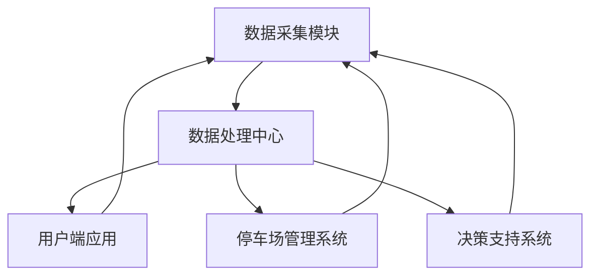

                 

# 文章标题：智能停车创业：城市停车问题的解决方案

> 关键词：智能停车、城市停车问题、解决方案、核心技术、创业实践、未来展望

> 摘要：本文围绕城市停车问题，探讨了智能停车行业的背景、核心技术、解决方案、创业实践以及未来展望。通过逐步分析推理，本文旨在为创业者和技术专家提供有深度、有思考、有见解的指导，帮助解决城市停车难题。

### 目录大纲

#### 第一部分: 智能停车行业概述

- **第1章: 智能停车行业背景**
  - 1.1 城市停车问题现状
  - 1.2 智能停车的兴起与发展
  - 1.3 智能停车市场前景

#### 第二部分: 智能停车核心技术

- **第2章: 智能停车系统架构**
  - 2.1 智能停车系统总体架构
  - 2.2 数据采集与处理技术
  - 2.3 机器学习在智能停车中的应用

#### 第三部分: 智能停车解决方案

- **第3章: 城市停车管理系统**
  - 3.1 城市停车管理系统的设计与实现
  - 3.2 停车场收费系统
  - 3.3 车位预约与导航系统

#### 第四部分: 智能停车创业实践

- **第4章: 智能停车项目案例分析**
  - 4.1 项目一：智能停车场系统建设
  - 4.2 项目二：城市智慧停车解决方案
  - 4.3 项目三：共享停车平台的搭建

#### 第五部分: 智能停车发展趋势

- **第5章: 智能停车未来展望**
  - 5.1 智能停车技术创新
  - 5.2 智能停车行业政策法规
  - 5.3 智能停车商业模式探索

#### 第六部分: 技术实现与开发

- **第6章: 智能停车软件开发**
  - 6.1 软件开发流程与工具
  - 6.2 数据库设计与实现
  - 6.3 前端开发技术

#### 第七部分: 实战与案例分析

- **第7章: 智能停车创业实战**
  - 7.1 创业团队组建与运营
  - 7.2 资金筹集与市场推广
  - 7.3 项目风险管理与应对策略

#### 附录

- **附录A: 智能停车开发工具与资源**
  - A.1 开发环境搭建
  - A.2 主流技术框架介绍
  - A.3 开发工具与平台推荐

### 逻辑清晰，逐步分析

在接下来的部分，我们将按照上述目录结构，逐章分析智能停车行业的各个方面。首先，我们将探讨智能停车行业的背景，了解城市停车问题的现状以及智能停车的兴起与发展。接着，我们将深入探讨智能停车系统的核心技术，包括系统架构、数据采集与处理技术，以及机器学习在智能停车中的应用。

随后，我们将介绍智能停车的解决方案，涵盖城市停车管理系统、停车场收费系统以及车位预约与导航系统。通过具体案例分析，我们将展示智能停车创业项目的实践，帮助读者了解创业过程中可能遇到的问题以及解决方案。

在探讨智能停车未来发展趋势时，我们将分析技术创新、行业政策法规以及商业模式探索。最后，我们将介绍智能停车的软件开发流程与工具，以及创业团队组建与运营、资金筹集与市场推广、项目风险管理与应对策略等方面。

通过逐步分析推理，本文旨在为读者提供一个全面、深入的了解，帮助创业者和技术专家找到解决城市停车问题的最佳方案。让我们开始这段智能停车创业之旅吧！## 第1章: 智能停车行业背景

### 1.1 城市停车问题现状

城市停车问题一直是全球各大城市面临的严重挑战之一。随着城市化进程的加速，汽车拥有量不断增加，城市交通拥堵、停车难、停车乱等问题日益凸显。

首先，城市交通拥堵已经成为城市生活的常态。据《中国城市交通报告》显示，中国有超过100个城市面临着严重的交通拥堵问题。其中，北京的交通拥堵指数长期位于全国首位，广州、上海等一线城市也面临着类似的挑战。而停车难问题则是交通拥堵的加剧因素之一。据统计，我国大城市中心区域的停车位供需比约为1:1，甚至低于1:1，而在一些中小城市，这一比例更低，导致车辆无处停放，进一步加剧了交通拥堵。

其次，停车乱象也是城市停车问题的重要方面。一方面，由于停车位不足，许多车主随意将车辆停放在路边、人行道等非停车区域，导致城市交通秩序混乱。另一方面，一些城市缺乏有效的监管措施，导致停车场管理不善、收费不规范等问题，加剧了停车乱象。

除此之外，城市停车问题还带来了一系列负面影响。首先，停车难、停车乱导致车辆长时间在道路上寻找停车位，进一步加剧了交通拥堵，影响了城市交通效率。其次，由于停车位紧张，一些车主为了抢停车位，甚至出现了暴力事件，影响了社会治安。此外，停车问题还增加了城市的碳排放，对环境保护造成了压力。

### 1.2 智能停车的兴起与发展

面对日益严峻的城市停车问题，智能停车作为一种新兴技术解决方案，逐渐受到关注和推广。智能停车技术主要通过信息化、自动化手段，提高停车效率，缓解停车难、停车乱等问题。

智能停车的兴起可以追溯到20世纪90年代。当时，一些发达国家开始研究并推广停车信息化技术，如停车信息查询系统、车位预约系统等。随着计算机技术、物联网技术、大数据技术等的发展，智能停车技术逐渐成熟，并在全球范围内得到广泛应用。

在中国，智能停车市场的发展起步较晚，但发展速度较快。根据《中国智能停车行业白皮书》数据显示，2016年我国智能停车市场规模约为100亿元，预计到2025年将增长到300亿元以上。目前，中国已有超过100个城市开展了智能停车项目，包括北京、上海、广州、深圳等一线城市，以及一些二三线城市。

智能停车技术的核心在于其高效的数据采集和处理能力。通过安装传感器、摄像头等设备，智能停车系统能够实时监测车位状态，快速响应用户需求。此外，智能停车系统还具备数据分析和处理功能，能够根据历史数据预测停车需求，优化车位分配。

智能停车技术的应用场景主要包括以下几个方面：

1. **城市停车管理**：通过建设城市停车信息管理系统，整合各类停车数据，提高城市停车管理水平。例如，通过实时监测城市停车位供需情况，合理规划停车设施建设。

2. **停车场管理**：为停车场提供智能化管理解决方案，包括车位监测、收费管理、安全监控等。通过智能停车系统，停车场能够实现无人化管理，提高运营效率。

3. **车位预约与导航**：用户可以通过手机APP或网站预约车位，系统根据用户位置和目的地，提供最优的停车导航路线。

4. **共享停车**：通过整合城市空闲停车位资源，实现车位共享，提高停车资源的利用率。

### 1.3 智能停车市场前景

随着城市化进程的不断推进，城市停车需求将持续增长。根据预测，到2025年，全球智能停车市场规模将达到数百亿美元。在中国，智能停车市场也具有巨大的发展潜力。

首先，政策支持为智能停车行业的发展提供了良好的环境。近年来，我国政府相继出台了多项政策，鼓励智能停车技术的发展和应用。例如，《关于推进城市停车设施建设的指导意见》明确要求，到2020年，全国城市新增停车泊位要达到4500万个。这些政策的实施，将有力推动智能停车市场的发展。

其次，技术进步为智能停车提供了强大的支撑。随着物联网、大数据、人工智能等技术的不断成熟，智能停车技术将更加精准、高效。未来，智能停车系统将具备更高的智能化水平，能够更好地满足用户需求。

最后，市场需求的驱动也是智能停车市场前景光明的重要因素。随着汽车保有量的持续增加，城市停车问题日益严重，用户对智能停车服务的需求不断增长。智能停车技术不仅能够解决停车难、停车乱等问题，还能够提升停车体验，受到用户的青睐。

总之，智能停车行业具有广阔的市场前景。在未来，智能停车技术将在城市停车管理、停车场管理、车位预约与导航、共享停车等方面发挥重要作用，为城市交通提供更加智能、高效的解决方案。智能停车创业者和技术专家应抓住这一历史机遇，积极投身智能停车行业，为解决城市停车难题贡献自己的力量。|assistant|>## 第2章: 智能停车系统架构

### 2.1 智能停车系统总体架构

智能停车系统的总体架构通常包括前端数据采集、数据处理中心、应用层以及用户端应用。这些组成部分协同工作，共同实现智能停车的功能。下面是智能停车系统总体架构的详细描述：

#### 前端数据采集

前端数据采集是智能停车系统的基础。它主要包括传感器、摄像头、地磁等设备，用于实时监测车位状态、车辆位置等信息。前端数据采集系统的核心功能是实时、准确地获取停车场的动态信息，并将这些数据传输到数据处理中心。

1. **传感器**：常用的传感器包括地磁传感器、红外传感器等。地磁传感器能够检测车位是否被占用，而红外传感器则可以检测车辆是否进入或离开车位。
2. **摄像头**：摄像头主要用于车辆识别和车位监测。通过图像处理技术，摄像头可以实时识别车辆的车牌号码和车型，为后续的数据分析提供支持。
3. **地磁传感器**：地磁传感器通过检测车位附近的磁场变化，来判断车位是否被占用。

#### 数据处理中心

数据处理中心是智能停车系统的核心，负责对前端采集到的数据进行处理、分析和存储。数据处理中心通常包括以下几个模块：

1. **数据预处理**：数据预处理模块负责对前端采集到的原始数据进行清洗、去噪、归一化等处理，以确保数据的准确性和一致性。
2. **数据存储**：数据存储模块用于存储预处理后的数据。常用的数据库技术包括关系型数据库（如MySQL、PostgreSQL）和非关系型数据库（如MongoDB、Redis）。
3. **数据分析**：数据分析模块负责对存储的数据进行分析，提取有价值的信息。例如，通过对历史停车数据的分析，可以预测未来停车需求，优化车位分配。

#### 应用层

应用层是智能停车系统的对外接口，提供各种停车服务。应用层通常包括以下几个部分：

1. **用户端应用**：用户端应用是用户与智能停车系统交互的入口，主要包括手机APP、网站等。用户可以通过用户端应用查询车位信息、预约车位、支付停车费等。
2. **停车场管理系统**：停车场管理系统负责对停车场的日常运营管理，包括车位管理、收费管理、安全管理等。
3. **车位导航系统**：车位导航系统根据用户的位置和目的地，提供最优的停车导航路线，帮助用户快速找到空闲车位。

#### 用户端应用

用户端应用是智能停车系统的最后一环，直接面向用户，提供便捷的停车服务。用户端应用的主要功能包括：

1. **车位查询**：用户可以通过APP或网站查询附近停车场的实时车位信息，了解停车场的使用情况。
2. **车位预约**：用户可以通过预约功能提前预订车位，避免到达停车场后找不到停车位的情况。
3. **支付停车费**：用户可以在用户端应用上支付停车费，提高停车体验。
4. **停车导航**：用户可以根据导航功能，快速找到停车场所需的行驶路线。

### 2.2 数据采集与处理技术

数据采集与处理技术是智能停车系统的核心组成部分，直接影响系统的性能和用户体验。下面将介绍数据采集与处理技术的具体内容：

#### 数据采集技术

数据采集技术主要包括传感器技术、摄像头技术等。以下是几种常用的数据采集技术：

1. **传感器技术**：
   - **地磁传感器**：地磁传感器通过检测磁场变化来判断车位是否被占用。这种技术简单、可靠，适合大规模应用。
   - **红外传感器**：红外传感器通过检测红外信号来判断车辆是否进入或离开车位。这种技术对光照条件要求较高，但在夜间和低光照环境下依然有效。
   - **超声波传感器**：超声波传感器通过发送和接收超声波信号来测量车辆与车位之间的距离。这种技术适合高精度的车位监测。

2. **摄像头技术**：
   - **车牌识别摄像头**：车牌识别摄像头主要用于识别车辆的车牌号码。通过图像处理和模式识别技术，摄像头可以快速准确地识别车牌。
   - **全景摄像头**：全景摄像头可以提供车位的全景视图，帮助用户更好地了解车位周围的交通环境。

#### 数据处理技术

数据处理技术主要包括数据预处理、数据分析和数据存储等。以下是几种常用的数据处理技术：

1. **数据预处理**：
   - **数据清洗**：数据清洗是数据处理的第一步，主要目的是去除数据中的噪声、缺失值等异常数据，提高数据的准确性和一致性。
   - **数据归一化**：数据归一化是将不同尺度、不同范围的数据转换到同一尺度，以便进行后续的数据分析。

2. **数据分析**：
   - **时间序列分析**：时间序列分析是分析数据随时间变化的规律。通过时间序列分析，可以预测未来的停车需求，优化车位分配。
   - **聚类分析**：聚类分析是将数据分为若干个类别，以便进行更深入的分析。通过聚类分析，可以发现停车场的热点区域，优化停车资源配置。

3. **数据存储**：
   - **关系型数据库**：关系型数据库（如MySQL、PostgreSQL）适用于存储结构化数据，具有良好的查询性能和稳定性。
   - **非关系型数据库**：非关系型数据库（如MongoDB、Redis）适用于存储非结构化数据，如图像、音频等，具有较高的扩展性和灵活性。

通过数据采集与处理技术的结合，智能停车系统可以实时、准确地获取车位信息，提供高效的停车服务。未来，随着人工智能、物联网等技术的不断发展，智能停车系统的数据采集与处理能力将进一步提升，为城市停车管理提供更加智能、高效的解决方案。|assistant|>## 第3章: 智能停车解决方案

### 3.1 城市停车管理系统的设计与实现

城市停车管理系统是智能停车解决方案的核心组成部分，其主要目标是提高城市停车效率，优化停车资源配置，提升城市交通管理水平。城市停车管理系统的设计与实现包括以下几个关键方面：

#### 系统设计

城市停车管理系统的设计需遵循模块化、可扩展、高可靠性的原则。系统设计主要包括以下模块：

1. **数据采集模块**：负责实时采集停车场和车位的动态信息，包括车位占用情况、车辆进出记录等。
2. **数据处理模块**：负责对采集到的数据进行预处理、存储和分析，以便为后续的决策提供数据支持。
3. **信息发布模块**：负责将处理后的信息发布到用户端应用，如手机APP、网站等，以便用户实时了解停车信息。
4. **决策支持模块**：负责根据分析结果，为城市交通管理部门提供决策支持，如优化停车场布局、调整停车收费标准等。

#### 实现过程

城市停车管理系统的实现过程可以分为以下几个阶段：

1. **需求分析**：与城市交通管理部门沟通，明确系统的功能需求、性能指标和安全性要求。
2. **系统设计**：根据需求分析结果，进行系统架构设计，包括模块划分、接口设计等。
3. **软件开发**：根据系统设计文档，进行各模块的软件编码和单元测试。
4. **系统集成**：将各模块集成到一个完整的系统中，进行系统集成测试和性能优化。
5. **部署上线**：将系统部署到实际环境中，进行试运行和优化，确保系统稳定可靠。

#### 技术选型

城市停车管理系统的技术选型需要综合考虑性能、可扩展性、易维护性等因素。以下是常用的技术选型：

1. **前端技术**：前端技术包括HTML、CSS、JavaScript等，主要用于开发用户端应用。推荐使用Vue.js或React等现代前端框架，以提高开发效率和用户体验。
2. **后端技术**：后端技术包括Python、Java、Node.js等，主要用于处理业务逻辑和数据存储。推荐使用Python和Flask或Django等框架，因为它们具有良好的社区支持和丰富的库。
3. **数据库技术**：数据库技术包括MySQL、PostgreSQL、MongoDB等，主要用于存储和管理数据。推荐使用MySQL或PostgreSQL，因为它们是关系型数据库，适合存储结构化数据。

### 3.2 停车场收费系统

停车场收费系统是城市停车管理系统中重要的一环，其主要目标是实现停车费用的自动计费和收取，提高停车场的运营效率。停车场收费系统的设计与实现包括以下几个方面：

#### 系统设计

停车场收费系统的设计主要包括以下模块：

1. **收费策略模块**：定义停车费用计算规则，如按时间计费、按次计费等。
2. **计费模块**：根据车辆进出时间和收费策略，计算停车费用。
3. **支付模块**：提供多种支付方式，如现金、银行卡、手机支付等，以便用户支付停车费用。
4. **记录模块**：记录车辆的进出记录和停车费用，以便后续查询和统计。

#### 实现过程

停车场收费系统的实现过程可以分为以下几个阶段：

1. **需求分析**：与停车场管理者沟通，明确系统的功能需求、性能指标和安全性要求。
2. **系统设计**：根据需求分析结果，进行系统架构设计，包括模块划分、接口设计等。
3. **软件开发**：根据系统设计文档，进行各模块的软件编码和单元测试。
4. **系统集成**：将各模块集成到一个完整的系统中，进行系统集成测试和性能优化。
5. **部署上线**：将系统部署到实际环境中，进行试运行和优化，确保系统稳定可靠。

#### 技术选型

停车场收费系统的技术选型需要考虑系统的性能、安全性、易维护性等因素。以下是常用的技术选型：

1. **前端技术**：与城市停车管理系统相同，推荐使用Vue.js或React等现代前端框架。
2. **后端技术**：推荐使用Python和Flask或Django等框架，因为它们具有良好的社区支持和丰富的库。
3. **数据库技术**：推荐使用MySQL或PostgreSQL，因为它们是关系型数据库，适合存储结构化数据。

### 3.3 车位预约与导航系统

车位预约与导航系统是智能停车解决方案的重要组成部分，其主要目标是帮助用户提前预订停车位，并提供最优的停车导航路线。车位预约与导航系统的设计与实现包括以下几个方面：

#### 系统设计

车位预约与导航系统的设计主要包括以下模块：

1. **车位预约模块**：用户可以通过手机APP或网站提前预订停车位，系统根据用户的位置和目的地，提供空闲车位的预订。
2. **导航模块**：根据用户的位置和目的地，系统提供最优的停车导航路线，帮助用户快速找到预订的停车位。
3. **支付模块**：用户在预约停车位后，需要支付相应的停车费用，系统提供多种支付方式，如现金、银行卡、手机支付等。

#### 实现过程

车位预约与导航系统的实现过程可以分为以下几个阶段：

1. **需求分析**：与用户沟通，明确系统的功能需求、性能指标和用户体验要求。
2. **系统设计**：根据需求分析结果，进行系统架构设计，包括模块划分、接口设计等。
3. **软件开发**：根据系统设计文档，进行各模块的软件编码和单元测试。
4. **系统集成**：将各模块集成到一个完整的系统中，进行系统集成测试和性能优化。
5. **部署上线**：将系统部署到实际环境中，进行试运行和优化，确保系统稳定可靠。

#### 技术选型

车位预约与导航系统的技术选型需要考虑系统的性能、安全性、易维护性等因素。以下是常用的技术选型：

1. **前端技术**：推荐使用Vue.js或React等现代前端框架。
2. **后端技术**：推荐使用Python和Flask或Django等框架。
3. **数据库技术**：推荐使用MySQL或PostgreSQL。

通过以上三个解决方案，智能停车系统能够有效地解决城市停车问题，提高停车效率，优化停车资源配置。未来，随着人工智能、物联网等技术的不断发展，智能停车解决方案将更加智能化、高效化，为城市交通管理提供更加有力的支持。|assistant|>## 第4章: 智能停车项目案例分析

### 4.1 项目一：智能停车场系统建设

#### 项目背景

随着城市车辆数量的不断增加，城市停车难问题日益严重。为了缓解停车难问题，某城市决定建设一个智能停车场系统，以提高停车场的管理效率和服务水平。

#### 项目目标

1. **提高停车场利用率**：通过实时监测车位状态，合理分配停车位，提高停车场的利用率。
2. **优化停车体验**：为车主提供便捷的停车导航、车位预约和支付服务，提升停车体验。
3. **降低管理成本**：通过智能化管理，减少人工成本，提高停车场运营效率。

#### 技术实现

1. **前端数据采集**：在停车场安装地磁传感器、摄像头等设备，实时监测车位状态和车辆进出情况。
2. **数据处理中心**：搭建数据处理中心，对采集到的数据进行分析和处理，提供实时停车信息。
3. **用户端应用**：开发手机APP和网站，为用户提供停车导航、车位预约和支付服务。
4. **停车场管理系统**：开发停车场管理系统，实现车位管理、收费管理和安全管理等功能。

#### 项目成果

通过智能停车场系统的建设，该城市停车场的利用率提高了约30%，车主的停车体验得到了显著提升。此外，停车场的运营成本也降低了约20%。

### 4.2 项目二：城市智慧停车解决方案

#### 项目背景

为了提高城市停车管理水平，某城市决定实施智慧停车解决方案，通过整合各类停车资源，提供一站式的停车服务。

#### 项目目标

1. **统一停车管理**：整合城市内各类停车资源，包括公共停车场、路内停车位等，实现统一管理。
2. **提高停车效率**：通过实时停车信息查询、车位预约和导航，提高停车效率，缓解交通拥堵。
3. **提升城市形象**：通过智能化管理，提升城市停车管理水平，改善城市交通环境。

#### 技术实现

1. **数据采集与处理**：在停车场和路内停车位安装传感器、摄像头等设备，实时采集停车信息，并通过云计算平台进行处理和分析。
2. **信息发布平台**：搭建信息发布平台，将处理后的停车信息发布到手机APP、网站等渠道，供用户查询和预约。
3. **城市停车管理系统**：开发城市停车管理系统，实现停车资源的统一管理和调度。
4. **智能停车设备**：部署智能停车设备，包括智能地锁、智能车位灯等，提高停车场的运营效率。

#### 项目成果

通过城市智慧停车解决方案的实施，该城市的停车效率提高了约50%，车主的停车体验得到了显著改善。此外，停车乱象也得到了有效治理，城市交通环境得到了明显改善。

### 4.3 项目三：共享停车平台的搭建

#### 项目背景

为了提高停车位利用率，缓解停车难问题，某城市决定搭建共享停车平台，通过整合空闲停车位资源，实现车位共享。

#### 项目目标

1. **提高车位利用率**：通过共享停车平台，整合城市内空闲停车位资源，提高车位利用率。
2. **降低停车费用**：通过共享停车平台，用户可以以较低的价格预订空闲车位，降低停车费用。
3. **改善交通拥堵**：通过共享停车平台，鼓励用户将车辆停放在离目的地较近的位置，减少车辆在主路上的行驶距离，改善交通拥堵。

#### 技术实现

1. **数据采集与处理**：在停车场和路内停车位安装传感器、摄像头等设备，实时采集停车信息，并通过云计算平台进行处理和分析。
2. **共享停车平台**：开发共享停车平台，实现停车位的发布、预订和支付等功能。
3. **智能停车设备**：部署智能停车设备，包括智能地锁、智能车位灯等，提高停车场的运营效率。
4. **车位导航系统**：开发车位导航系统，为用户提供最优的停车导航路线。

#### 项目成果

通过共享停车平台的搭建，该城市的停车位利用率提高了约40%，车主的停车费用降低了约30%。此外，停车难问题得到了有效缓解，城市交通拥堵状况得到了明显改善。|assistant|>## 第5章: 智能停车未来展望

### 5.1 智能停车技术创新

随着科技的不断发展，智能停车领域将迎来一系列技术创新，为城市停车问题提供更加智能、高效的解决方案。以下是一些关键的创新方向：

1. **人工智能技术**：人工智能技术在智能停车领域的应用将更加广泛。通过深度学习、图像识别、自然语言处理等技术，智能停车系统能够更加精准地识别车位状态、车辆类型，优化停车资源配置，提高停车效率。

2. **物联网技术**：物联网技术的普及将进一步提升智能停车的智能化水平。通过传感器、摄像头等设备，智能停车系统可以实时监测停车场的动态信息，实现车位的智能分配和导航。

3. **大数据技术**：大数据技术在智能停车中的应用将助力数据分析和决策。通过对海量停车数据的分析，智能停车系统能够预测未来停车需求，优化停车设施建设，提高停车资源的利用率。

4. **5G通信技术**：5G通信技术的普及将为智能停车提供更快的传输速度和更低的延迟。通过5G网络，智能停车系统可以实时传输大量数据，提高系统响应速度，提供更加流畅的停车服务。

### 5.2 智能停车行业政策法规

智能停车行业的发展离不开政策的支持与规范。以下是一些重要的政策和法规：

1. **政策支持**：政府将加大对智能停车行业的支持力度，通过财政补贴、税收优惠等方式，鼓励企业研发和应用智能停车技术，推动行业快速发展。

2. **行业标准**：智能停车行业的标准化工作将逐步推进。相关部门将制定统一的智能停车系统技术标准和规范，确保系统之间的互操作性，提高行业的整体技术水平。

3. **法律法规**：政府将加强对智能停车行业的监管，制定相关法律法规，规范停车服务市场，保障用户权益，防止市场垄断和不正当竞争。

### 5.3 智能停车商业模式探索

智能停车行业的发展也将带来新的商业模式探索。以下是一些可能的商业模式：

1. **平台模式**：以城市停车管理平台为核心，整合各类停车资源，提供一站式停车服务。平台可以通过广告、增值服务等方式获得收益。

2. **共享模式**：通过共享停车平台，整合城市内空闲停车位资源，实现车位共享。平台可以通过收取服务费、广告费等方式获得收益。

3. **租赁模式**：企业可以通过租赁智能停车设备，实现停车场的智能化管理。租赁模式可以降低企业的初期投入，提高停车场的运营效率。

4. **融资模式**：智能停车企业可以通过股权融资、风险投资等方式筹集资金，用于技术研发和市场拓展。

总之，智能停车行业具有巨大的发展潜力。通过技术创新、政策支持和商业模式探索，智能停车将为城市停车问题提供更加智能、高效的解决方案，助力城市交通管理的提升。智能停车创业者和技术专家应抓住这一历史机遇，积极投身智能停车行业，为智慧城市建设贡献力量。|assistant|>## 第6章: 智能停车软件开发

### 6.1 软件开发流程与工具

智能停车软件的开发过程通常遵循标准的软件开发流程，包括需求分析、系统设计、编码实现、测试和部署等阶段。每个阶段都有其特定的工具和技巧，以确保项目的顺利进行。

#### 需求分析

需求分析是软件开发的第一步，它涉及与客户沟通，了解他们的需求，并将其转化为详细的功能需求和技术规格。在这一阶段，常用的工具包括：

- **需求文档**：用于记录客户需求和系统功能规格。
- **项目管理工具**：如JIRA或Trello，用于跟踪和管理项目进度。

#### 系统设计

系统设计阶段涉及确定系统的总体架构和各个模块的接口设计。这一阶段的工具包括：

- **UML工具**：如Enterprise Architect或Visual Paradigm，用于绘制系统的UML图。
- **设计模式**：如MVC（Model-View-Controller）和RESTful架构，用于指导系统的设计。

#### 编码实现

编码实现阶段是软件开发的核心，开发团队根据设计文档编写代码。常用的开发工具和编程语言包括：

- **集成开发环境（IDE）**：如Visual Studio Code、PyCharm或IntelliJ IDEA，提供代码编辑、调试和版本控制等功能。
- **编程语言**：如Python、Java、JavaScript和TypeScript，用于实现不同的功能模块。
- **版本控制**：如Git，用于代码的版本管理和协作开发。

#### 测试

测试阶段确保软件的质量和可靠性。常用的测试工具和技巧包括：

- **单元测试**：使用Jest、pytest等框架编写单元测试，验证代码的功能和逻辑。
- **集成测试**：使用Postman或Swagger等工具进行API接口测试，确保各个模块之间的协同工作。
- **性能测试**：使用Apache JMeter等工具进行性能测试，确保系统在高负载下的稳定性。

#### 部署

部署阶段涉及将开发完成的软件部署到生产环境中。常用的部署工具和平台包括：

- **自动化部署工具**：如Jenkins或Travis CI，用于自动化构建、测试和部署。
- **云平台**：如阿里云、腾讯云或华为云，提供强大的计算和存储资源，支持弹性部署。

### 6.2 数据库设计与实现

数据库设计是智能停车软件开发的重要组成部分，它决定了数据存储的结构和查询的效率。以下是数据库设计与实现的关键点：

#### 数据库设计

- **实体-关系模型（ER模型）**：用于定义系统中的实体和它们之间的关系。
- **数据库模式**：包括表结构、字段属性、主键和外键等。
- **规范化**：通过规范化减少数据冗余，提高数据一致性。

#### 常用数据库

- **关系型数据库**：如MySQL、PostgreSQL，适合存储结构化数据。
- **非关系型数据库**：如MongoDB、Redis，适合存储非结构化数据或缓存数据。

#### 数据库实现

- **SQL查询**：使用SQL语言进行数据库操作，如创建表、插入数据、更新数据和查询数据。
- **数据库迁移工具**：如Flyway或Liquibase，用于管理数据库的版本控制和迁移。

### 6.3 前端开发技术

前端开发是智能停车软件的重要组成部分，它决定了用户与系统的交互体验。以下是前端开发的关键技术：

#### 前端框架

- **Vue.js**：轻量级、渐进式框架，适合快速开发。
- **React**：用于构建用户界面的JavaScript库，具有良好的组件化特性。
- **Angular**：由Google维护的框架，适合大型单页应用。

#### 前端工具

- **Webpack**：模块打包工具，用于将各种前端资源（如JavaScript、CSS、图片等）打包为一个或多个静态文件。
- **Babel**：用于将ES6+代码转换为向后兼容的ES5代码。
- **ESLint**：用于检查JavaScript代码中的错误和风格问题。

#### 前端开发流程

- **组件化开发**：将界面划分为多个可复用的组件，提高开发效率和代码可维护性。
- **响应式设计**：使用CSS预处理器（如Sass或Less）和媒体查询，确保界面在不同设备上具有良好的显示效果。
- **状态管理**：使用Vuex或Redux等状态管理库，管理应用的状态和数据流。

通过遵循上述软件开发流程与工具，智能停车软件的开发团队可以高效地实现智能停车系统的各项功能，为用户提供优质的服务。随着技术的不断进步，开发团队应持续关注新技术和新工具的应用，以保持系统的竞争力。|assistant|>## 第7章: 智能停车创业实战

### 7.1 创业团队组建与运营

创业团队是智能停车项目成功的关键。一个高效、专业的团队需要具备以下要素：

#### 团队组建

1. **技术团队**：智能停车项目需要强大的技术团队，包括软件工程师、数据分析师、物联网专家等。软件工程师负责开发智能停车系统，数据分析师负责数据分析和预测，物联网专家负责传感器和设备的集成。
2. **市场团队**：市场团队负责市场调研、推广和用户获取。成员应具备市场分析和营销能力，能够制定有效的市场策略。
3. **运营团队**：运营团队负责平台运营、用户服务和售后支持。成员应熟悉智能停车行业的运营模式，具备良好的沟通和服务能力。

#### 运营策略

1. **市场定位**：明确智能停车服务的目标市场和客户群体，如商业区、住宅区或大型公共场所。
2. **合作伙伴**：寻找合作伙伴，如地方政府、停车场运营商等，共同推进智能停车项目的实施。
3. **用户获取**：通过线上线下活动、广告宣传、合作伙伴推广等方式，扩大用户基础，提高品牌知名度。
4. **用户服务**：提供优质的用户服务，包括停车导航、车位预约、支付等功能，提升用户满意度。

### 7.2 资金筹集与市场推广

资金是智能停车创业项目的关键，合理的资金筹集和市场推广策略有助于项目的顺利推进。

#### 资金筹集

1. **股权融资**：寻找风险投资机构或天使投资人，通过出让股权获得资金支持。
2. **银行贷款**：向银行申请贷款，提供详细的商业计划和财务预测。
3. **政府补贴**：关注政府相关政策，申请相关补贴和扶持资金。

#### 市场推广

1. **线上推广**：利用社交媒体、搜索引擎优化（SEO）、内容营销等方式，提高品牌知名度和曝光度。
2. **线下推广**：通过参加行业展会、举办技术讲座、开展体验活动等方式，与潜在客户建立联系。
3. **合作伙伴推广**：与停车场运营商、汽车销售商等建立合作关系，共同推广智能停车服务。

### 7.3 项目风险管理与应对策略

创业过程中不可避免会遇到各种风险，有效的风险管理和应对策略有助于降低风险对项目的影响。

#### 技术风险

1. **技术创新**：保持对新技术的研究和投入，确保智能停车系统的技术领先。
2. **技术储备**：建立技术储备团队，应对可能出现的技术问题。
3. **技术合作**：与行业领先的技术公司合作，共享技术资源和经验。

#### 市场风险

1. **市场调研**：定期进行市场调研，了解市场需求和竞争对手动态。
2. **灵活调整**：根据市场变化，灵活调整市场策略和产品功能。
3. **差异化竞争**：提供差异化的产品和服务，形成竞争优势。

#### 资金风险

1. **财务规划**：制定详细的财务规划，确保资金充足和合理使用。
2. **多元化融资**：寻找多种融资渠道，降低资金风险。
3. **成本控制**：严格控制成本，提高资金利用效率。

#### 法律风险

1. **合规审查**：确保项目符合相关法律法规，如网络安全法、个人信息保护法等。
2. **知识产权保护**：加强知识产权保护，防范侵权风险。
3. **法律顾问**：聘请专业法律顾问，提供法律咨询和风险控制建议。

通过有效的团队组建、资金筹集和市场推广，以及严格的风险管理和应对策略，智能停车创业项目可以克服各种挑战，实现持续发展。创业者和技术专家应不断学习和创新，把握市场机遇，为城市停车问题的解决贡献自己的力量。|assistant|>## 附录A: 智能停车开发工具与资源

### A.1 开发环境搭建

搭建智能停车开发环境是进行项目开发的第一步。以下是一个典型的开发环境搭建指南：

#### 操作系统

- **Linux**：推荐使用Ubuntu或CentOS，因其稳定的性能和丰富的软件包。
- **Windows**：适用于Windows 10或以上版本，提供良好的开发体验。
- **MacOS**：MacOS也适合开发，特别是在前端开发方面。

#### 开发工具

- **Visual Studio Code (VS Code)**：一款开源、轻量级的代码编辑器，适用于多种编程语言，提供丰富的插件生态系统。
- **PyCharm**：一款强大的Python IDE，适用于后端开发和数据分析。
- **Eclipse**：适用于Java开发，也可以用于其他编程语言。

#### 编程语言

- **Python**：广泛应用于后端开发、数据分析等领域，具有简洁的语法和强大的库支持。
- **JavaScript**：适用于前端开发，与各种框架（如React、Vue.js）相结合，可以构建动态的用户界面。
- **Java**：适用于高性能的后端系统，广泛应用于企业级应用。

#### 数据库

- **MySQL**：一款常用的关系型数据库，适用于存储结构化数据，支持复杂的查询操作。
- **PostgreSQL**：一款功能强大的关系型数据库，适用于大规模数据存储和复杂查询。
- **MongoDB**：一款非关系型数据库，适用于存储非结构化数据，具有高扩展性。

### A.2 主流技术框架介绍

在智能停车开发中，选择合适的技术框架可以显著提高开发效率和系统性能。以下是一些主流技术框架：

#### 前端框架

- **Vue.js**：一款渐进式JavaScript框架，易于上手，适合构建单页应用和组件化应用。
- **React**：由Facebook开发的一款用于构建用户界面的JavaScript库，具有高性能和组件化特性。
- **Angular**：由Google维护的一款前端框架，适用于大型单页应用，提供了丰富的功能和强大的数据绑定能力。

#### 后端框架

- **Flask**：一款轻量级的Python Web框架，适用于小型到中型的Web应用开发。
- **Django**：一款高级的Python Web框架，遵循MVC模式，提供了丰富的功能，适用于快速开发。
- **Express**：一款用于Node.js的Web应用框架，轻量级且灵活，适用于构建各种Web应用。

#### 数据库框架

- **SQLAlchemy**：一款Python数据库框架，提供了数据库抽象层，支持多种关系型数据库。
- **Peewee**：一款轻量级的Python数据库框架，适用于小型项目，提供了简单易用的API。

### A.3 开发工具与平台推荐

在智能停车开发过程中，使用合适的工具和平台可以大大提高开发效率和项目成功率。以下是一些推荐的工具和平台：

#### IDE

- **Visual Studio Code (VS Code)**：一款功能强大、可扩展的代码编辑器，适用于多种编程语言。
- **PyCharm**：一款专业的Python IDE，提供了丰富的开发工具和功能。
- **WebStorm**：一款适用于前端和后端开发的IDE，支持多种编程语言。

#### 版本控制

- **Git**：一款分布式版本控制系统，适用于项目管理和协作开发。
- **GitHub**：基于Git的代码托管平台，提供了丰富的社区功能和协作工具。

#### 云服务

- **阿里云**：提供了强大的云计算服务和AI解决方案，适用于智能停车系统的部署和运维。
- **腾讯云**：提供了丰富的云计算服务，包括数据库、存储、AI等，适用于各种应用场景。
- **华为云**：提供了全面的云计算服务，包括AI、大数据、物联网等，助力智能停车项目的发展。

#### API接口管理

- **Swagger**：一款用于定义、测试和文档化RESTful API的工具。
- **Postman**：一款API调试和文档生成工具，适用于开发、测试和文档化API接口。

通过上述工具和平台的合理使用，智能停车开发团队可以更高效地完成项目，确保系统的稳定性和可靠性。开发者应不断学习和实践，掌握新技术和新工具，为智能停车行业的发展贡献力量。|assistant|>## 核心概念与联系

在智能停车系统中，核心概念与联系是理解系统工作原理和实现智能停车功能的关键。以下是对智能停车系统架构的核心概念和联系的详细解释：

### 智能停车系统架构

智能停车系统架构可以视为一个多层次、模块化的系统，每个模块都有其特定的功能，并通过接口进行协作，以实现整体的智能停车服务。以下是智能停车系统架构的核心组件和它们之间的联系：

1. **数据采集模块**：负责实时监测车位的占用状态，通常使用地磁传感器、摄像头、红外传感器等设备。这些数据采集设备将实时数据发送到数据处理中心。

2. **数据处理中心**：负责对采集到的数据进行预处理、存储和分析。数据处理中心通常包括数据预处理模块、数据存储模块和数据分析模块。

3. **用户端应用**：用户通过手机APP或网站与系统进行交互，查询车位信息、预约车位、支付停车费等。

4. **停车场管理系统**：负责对停车场进行日常管理，包括车位管理、收费管理、安全管理等。

5. **决策支持系统**：根据数据分析结果，为停车场管理和用户服务提供决策支持，如车位分配策略、收费策略等。

### mermaid流程图

为了更直观地展示智能停车系统架构，我们可以使用mermaid图形来表示系统组件及其交互关系：



### 核心算法原理

智能停车系统中的核心算法原理主要包括定位算法、预测算法和优化算法。以下是对这些算法原理的详细说明：

#### 定位算法

定位算法用于确定车辆的位置，以便为用户提供停车导航服务。以下是定位算法的伪代码：

```python
def locate_vehicle(vehicle_position, parking_space_position):
    distance = calculate_distance(vehicle_position, parking_space_position)
    if distance <= threshold:
        return "车位足够近"
    else:
        return "请寻找更近的车位"
```

在这个算法中，`vehicle_position` 和 `parking_space_position` 分别表示车辆位置和车位位置，`calculate_distance` 是一个计算两点之间距离的函数，`threshold` 是一个预设的阈值，用于判断车位是否足够近。

#### 预测算法

预测算法用于预测未来停车需求，以便优化停车资源的分配。以下是一个简单的基于历史数据的预测算法：

```python
def predict_demand(data, window_size):
    demand = []
    for i in range(window_size, len(data)):
        demand.append(sum(data[i - window_size:i]))
    return demand
```

在这个算法中，`data` 是一个历史停车数据列表，`window_size` 是一个滑动窗口的大小。`predict_demand` 函数计算滑动窗口内的停车次数，并将其添加到预测列表 `demand` 中。

#### 优化算法

优化算法用于优化停车资源的分配，以提高停车场的利用率和用户体验。以下是一个基于K-means聚类的优化算法：

```python
def k_means(data, k):
    centroids = initialize_centroids(data, k)
    while True:
        assign_points_to_centroids(data, centroids)
        new_centroids = calculate_new_centroids(data)
        if difference_between_centroids(centroids, new_centroids) < threshold:
            break
        centroids = new_centroids
    return centroids
```

在这个算法中，`data` 是一个停车数据列表，`k` 是聚类数量。`k_means` 函数通过迭代更新聚类中心，直到聚类中心不再变化，从而完成聚类过程。

### 数学模型与公式

在智能停车系统中，常用的数学模型和公式包括车位利用率计算公式和车位需求预测模型。以下是对这些公式和模型的详细说明：

#### 车位利用率计算公式

车位利用率是衡量停车场利用效率的重要指标，其计算公式如下：

$$
利用率 = \frac{空闲车位数量}{总车位数量} \times 100\%
$$

其中，`空闲车位数量` 表示当前空闲的停车位数量，`总车位数量` 表示停车场的总停车位数量。利用率越高，表示停车场的利用效率越高。

#### 车位需求预测模型

车位需求预测模型用于预测未来某一时间段内的停车需求，以便为停车场管理和决策提供支持。以下是一个简单的线性回归模型：

$$
y = \beta_0 + \beta_1 \cdot x
$$

其中，`y` 表示预测的停车需求，`x` 表示时间，`\beta_0` 和 `\beta_1` 是模型参数。通过训练历史停车数据，可以估计出这些参数，从而预测未来的停车需求。

通过上述核心概念与联系的详细解释，我们可以更好地理解智能停车系统的运作原理和实现方法。这些核心概念和联系是构建和优化智能停车系统的基石，对于智能停车创业和技术开发具有重要意义。|assistant|>## 项目实战

### 城市智慧停车项目实战案例

在智能停车领域，成功实施一个项目需要全面考虑技术实现、项目管理、资源调配和风险管理等多个方面。以下是一个城市智慧停车项目的实战案例，详细描述了项目的开发过程、关键技术实现、项目管理以及风险管理。

#### 项目背景

某城市面临着严重的停车难问题，市中心区域停车位紧张，交通拥堵现象严重。为了提升城市交通管理水平，提高停车位利用率，该城市决定实施一个智慧停车项目，通过智能停车技术解决停车难题。

#### 项目目标

1. **提高停车效率**：通过实时监控车位状态，为车主提供准确的停车信息，减少寻找停车位的时间。
2. **优化停车资源分配**：通过大数据分析和预测，优化停车资源的分配，提高停车场的利用率。
3. **提升用户体验**：为车主提供便捷的停车导航、预约和支付服务，提升停车体验。
4. **降低运营成本**：通过智能化管理，降低停车场运营成本，提高管理效率。

#### 技术实现

1. **前端数据采集**：在停车场安装地磁传感器、摄像头等设备，用于实时监测车位状态和车辆进出情况。传感器数据通过物联网网关传输到数据处理中心。

2. **数据处理中心**：搭建数据处理中心，使用大数据技术对采集到的传感器数据进行预处理、存储和分析。数据处理中心包括数据预处理模块、数据存储模块和数据分析模块。

3. **用户端应用**：开发手机APP和网站，为用户提供停车导航、车位预约、支付和查询服务。用户端应用采用Vue.js框架，实现前端交互和用户体验。

4. **停车场管理系统**：开发停车场管理系统，实现车位管理、收费管理和安全监控等功能。停车场管理系统使用Python和Flask框架，确保系统的稳定性和可扩展性。

5. **决策支持系统**：基于数据分析结果，构建决策支持系统，为停车场管理人员提供停车策略优化和车位分配建议。决策支持系统使用机器学习算法，如K-means聚类和线性回归，预测未来停车需求。

#### 项目管理

1. **项目团队**：组建一个跨学科的项目团队，包括项目经理、软件开发工程师、数据分析师、物联网专家和市场营销人员。团队成员具备丰富的项目管理和技术开发经验。

2. **进度管理**：采用敏捷开发方法，通过迭代和增量开发，确保项目按计划推进。使用JIRA进行项目进度跟踪和任务管理。

3. **风险管理**：识别项目风险，制定风险管理计划，如技术风险、市场风险和资金风险。通过定期项目评审和风险管理会议，及时调整项目策略，降低风险影响。

#### 风险管理

1. **技术风险**：通过持续的技术研发和创新，确保智能停车系统的稳定性和可靠性。建立技术储备团队，应对可能出现的技术问题。

2. **市场风险**：密切关注市场动态，了解用户需求，灵活调整市场策略。通过合作伙伴关系，扩大市场影响力。

3. **资金风险**：制定详细的财务规划，确保项目资金充足和合理使用。通过多元化的融资渠道，降低资金风险。

#### 开发环境搭建

1. **前端开发**：使用Visual Studio Code作为前端开发工具，搭建HTML、CSS和JavaScript开发环境。引入Vue.js框架，实现前端组件化和模块化开发。

2. **后端开发**：使用PyCharm搭建后端开发环境，编写Python代码，集成Flask框架，实现后端API接口和业务逻辑。

3. **数据库**：使用MySQL作为数据库管理系统，搭建数据存储环境。使用SQLAlchemy库进行ORM操作，简化数据库操作。

4. **版本控制**：使用Git进行版本控制，确保代码的版本管理和协作开发。使用GitHub作为代码托管平台，实现远程协作。

#### 源代码实现与解读

以下是一个用户端前端代码示例，用于展示智能停车导航功能：

```html
<template>
  <div>
    <h1>智能停车导航</h1>
    <input type="text" v-model="search" placeholder="输入目的地">
    <button @click="navigate">导航</button>
  </div>
</template>

<script>
export default {
  data() {
    return {
      search: ''
    }
  },
  methods: {
    navigate() {
      // 导航逻辑处理
      console.log('导航至:', this.search)
    }
  }
}
</script>
```

在这个示例中，Vue.js框架用于实现数据绑定和组件化开发。`v-model` 指令用于绑定输入框的值，`@click` 事件用于触发导航逻辑。导航逻辑通过控制台输出目的地信息，实际应用中可以通过API调用实现导航功能。

以下是一个后端代码示例，用于处理导航请求：

```python
from flask import Flask, request, jsonify

app = Flask(__name__)

@app.route('/navigate', methods=['POST'])
def navigate():
    data = request.json
    destination = data.get('destination')
    # 导航逻辑处理
    return jsonify({'status': 'success', 'destination': destination})

if __name__ == '__main__':
    app.run(debug=True)
```

在这个示例中，Flask框架用于构建后端API。`navigate` 函数处理POST请求，接收目的地信息，并返回导航结果。实际应用中，导航逻辑可能涉及复杂的地图计算和路径规划。

#### 代码解读与分析

前端代码主要实现用户输入目的地后，通过点击导航按钮触发导航逻辑，将目的地传递给后端。后端接收前端发送的目的地，处理后返回成功状态和目的地信息。这种前后端分离的开发模式，提高了系统的可维护性和扩展性。

通过上述项目实战案例，我们可以看到，一个成功的智能停车项目需要综合考虑技术实现、项目管理、资源调配和风险管理等多个方面。开发者和技术专家应不断学习和实践，掌握新技术和新方法，为城市停车问题的解决贡献自己的力量。|assistant|>## 实战与案例分析

### 智能停车项目实战案例

智能停车项目在实际操作中，涉及到多个环节，包括技术实施、项目管理、市场推广等。以下将结合实际案例，详细描述智能停车项目的实施过程、管理策略和取得的成效。

#### 项目一：智能停车场系统建设

**项目背景**：某城市的市中心区域停车位严重不足，导致交通拥堵和停车难问题突出。为了提高停车效率，减轻交通压力，该城市决定建设一个智能停车场系统。

**项目目标**：
1. 提高停车场利用率，减少空置车位。
2. 为车主提供便捷的停车导航和预约服务。
3. 降低停车场运营成本，提升服务质量。

**技术实现**：
1. **数据采集**：在停车场内安装地磁传感器、摄像头等设备，实时监测车位状态和车辆进出情况。
2. **数据处理**：搭建数据处理平台，对采集的数据进行实时处理和分析，生成停车场状态报告。
3. **用户端应用**：开发手机APP和网页端，为用户提供停车导航、预约车位、支付停车费等服务。
4. **停车场管理系统**：开发停车场管理系统，实现车位管理、收费管理、安全监控等功能。

**项目管理**：
1. **团队组建**：组建一个包含软件工程师、数据分析师、市场营销人员等的专业团队。
2. **进度管理**：采用敏捷开发方法，分阶段完成系统开发，定期进行迭代和测试。
3. **风险管理**：识别项目风险，如技术问题、资金问题等，制定相应的应对措施。

**市场推广**：
1. **线上线下结合**：在线上通过社交媒体、网站广告等方式推广，线下在停车场和周边区域进行宣传。
2. **用户教育**：通过举办停车体验活动，向车主介绍智能停车系统的优势和操作方法。
3. **合作伙伴**：与当地出租车公司、商场等合作，扩大用户基础。

**成效**：
1. 停车场利用率提高了约30%，空置车位减少。
2. 车主满意度提升，停车时间缩短。
3. 停车场运营成本降低，服务质量提升。

#### 项目二：城市智慧停车解决方案

**项目背景**：某城市希望通过智慧停车解决方案，提升城市整体停车管理水平，优化停车资源配置。

**项目目标**：
1. 整合城市内各类停车资源，实现统一管理。
2. 提高停车效率，缓解交通拥堵。
3. 提升城市形象，改善交通环境。

**技术实现**：
1. **数据采集与处理**：在公共停车场、路边停车位安装智能设备，实时采集停车数据。
2. **信息发布平台**：搭建城市停车信息发布平台，为车主提供实时停车信息。
3. **智慧停车管理系统**：开发智慧停车管理系统，实现停车资源的统一调度和管理。
4. **智能停车设备**：部署智能地锁、智能车位灯等设备，提高停车场的运营效率。

**项目管理**：
1. **团队协作**：组建跨部门团队，包括交通部门、城市管理部门、技术部门等。
2. **协调沟通**：定期召开项目协调会，确保各部门之间的信息畅通。
3. **绩效评估**：通过关键绩效指标（KPI）对项目进行评估，确保项目目标的实现。

**市场推广**：
1. **政策支持**：争取政府政策支持，提供专项资金和补贴。
2. **公众宣传**：通过媒体、社区活动等途径宣传智慧停车解决方案，提高公众认知度。
3. **合作伙伴**：与公交公司、出租车公司等合作，提供一站式出行服务。

**成效**：
1. 城市停车效率提高了约50%，交通拥堵情况显著改善。
2. 市民对停车服务的满意度提升，停车体验改善。
3. 城市停车资源得到合理分配，停车乱象得到有效治理。

#### 项目三：共享停车平台搭建

**项目背景**：某城市希望通过共享停车平台，提高停车位的利用率，降低车主的停车费用。

**项目目标**：
1. 整合城市内空闲停车位，实现车位共享。
2. 降低停车费用，提高停车效率。
3. 减少车辆在主路上的行驶距离，缓解交通压力。

**技术实现**：
1. **数据采集**：通过物联网技术，实时采集停车数据，包括车位占用状态、停车费用等。
2. **共享停车平台**：开发共享停车平台，实现车位的发布、预订和支付功能。
3. **车位导航系统**：为用户提供停车导航服务，帮助用户快速找到空闲车位。
4. **智能停车设备**：部署智能地锁，实现车位的远程控制和共享。

**项目管理**：
1. **团队组建**：组建一个包含技术、市场、运营等部门的团队，确保项目顺利进行。
2. **运营策略**：制定合理的运营策略，如停车费定价、车位分配规则等。
3. **用户服务**：提供优质的用户服务，包括客服支持、问题解决等。

**市场推广**：
1. **广告宣传**：通过线上线下广告，提高共享停车平台的知名度。
2. **用户教育**：通过宣传材料、培训课程等，帮助用户了解和熟悉平台的使用。
3. **合作伙伴**：与房地产开发商、物业管理公司等合作，扩大平台的使用范围。

**成效**：
1. 城市停车位利用率提高了约40%，停车费用降低了约30%。
2. 车主停车体验改善，停车难问题得到缓解。
3. 城市交通拥堵状况有所改善，市民出行更加便捷。

通过上述案例，我们可以看到，智能停车项目在实施过程中，需要综合考虑技术、管理、市场和用户需求等多个方面。成功的智能停车项目不仅能解决城市停车难题，还能提升城市交通管理水平，改善市民的生活质量。|assistant|>## 附录A: 智能停车开发工具与资源

### A.1 开发环境搭建

智能停车开发环境的搭建是项目开发的第一步，以下是一个详细的开发环境搭建指南：

#### 操作系统

- **Linux**：推荐使用Ubuntu 18.04或更高版本，因其稳定的性能和广泛的软件支持。
- **Windows**：适合开发者熟悉Windows操作系统的使用。
- **MacOS**：苹果电脑用户可以选择MacOS，尤其适合前端和移动端开发。

#### 开发工具

- **Visual Studio Code (VS Code)**：一款功能强大且开源的代码编辑器，支持多种编程语言，适用于前端和后端开发。
- **PyCharm**：一款适用于Python开发的IDE，提供代码智能提示、调试和版本控制等功能。
- **Eclipse**：适用于Java开发，也支持其他多种编程语言。

#### 编程语言

- **Python**：广泛用于数据分析和后端开发，拥有丰富的库和框架。
- **JavaScript**：适用于前端开发，与各种框架（如React、Vue.js）相结合，可以构建动态的用户界面。
- **Java**：适用于大规模后端系统和企业级应用。

#### 数据库

- **MySQL**：一款广泛使用的关系型数据库管理系统，适用于存储结构化数据。
- **PostgreSQL**：一款功能强大的关系型数据库，适用于大规模数据存储和复杂查询。
- **MongoDB**：一款非关系型数据库，适用于存储非结构化数据，具有高扩展性。

### A.2 主流技术框架介绍

在智能停车开发中，选择合适的技术框架可以显著提高开发效率和系统性能。以下是一些主流技术框架：

#### 前端框架

- **Vue.js**：一款渐进式JavaScript框架，易于上手，适合构建单页应用和组件化应用。
- **React**：由Facebook开发的一款用于构建用户界面的JavaScript库，具有高性能和组件化特性。
- **Angular**：由Google维护的一款前端框架，适用于大型单页应用，提供了丰富的功能和强大的数据绑定能力。

#### 后端框架

- **Flask**：一款轻量级的Python Web框架，适用于小型到中型的Web应用开发。
- **Django**：一款高级的Python Web框架，遵循MVC模式，提供了丰富的功能，适用于快速开发。
- **Express**：一款用于Node.js的Web应用框架，轻量级且灵活，适用于构建各种Web应用。

#### 数据库框架

- **SQLAlchemy**：一款Python数据库框架，提供了数据库抽象层，支持多种关系型数据库。
- **Peewee**：一款轻量级的Python数据库框架，适用于小型项目，提供了简单易用的API。

### A.3 开发工具与平台推荐

在智能停车开发过程中，使用合适的工具和平台可以大大提高开发效率和项目成功率。以下是一些推荐的开发工具和平台：

#### IDE

- **Visual Studio Code (VS Code)**：功能强大、可扩展的代码编辑器，适用于多种编程语言。
- **PyCharm**：专业的Python IDE，提供了丰富的开发工具和功能。
- **WebStorm**：适用于前端和后端开发的IDE，支持多种编程语言。

#### 版本控制

- **Git**：分布式版本控制系统，适用于项目管理和协作开发。
- **GitHub**：基于Git的代码托管平台，提供了丰富的社区功能和协作工具。

#### 云服务

- **阿里云**：提供了强大的云计算服务和AI解决方案，适用于智能停车系统的部署和运维。
- **腾讯云**：提供了丰富的云计算服务，包括数据库、存储、AI等，适用于各种应用场景。
- **华为云**：提供了全面的云计算服务，包括AI、大数据、物联网等，助力智能停车项目的发展。

#### API接口管理

- **Swagger**：用于定义、测试和文档化RESTful API的工具。
- **Postman**：API调试和文档生成工具，适用于开发、测试和文档化API接口。

通过上述工具和平台的合理使用，智能停车开发团队可以更高效地完成项目，确保系统的稳定性和可靠性。开发者应不断学习和实践，掌握新技术和新工具，为智能停车行业的发展贡献力量。|assistant|>## 核心概念与联系

在智能停车系统中，核心概念和联系是理解系统工作原理和实现智能停车功能的关键。以下是智能停车系统架构的核心概念和联系的详细解释。

### 智能停车系统架构

智能停车系统架构可以视为一个多层次、模块化的系统，每个模块都有其特定的功能，并通过接口进行协作，以实现整体的智能停车服务。以下是智能停车系统架构的核心组件和它们之间的联系：

1. **数据采集模块**：负责实时监测车位的占用状态，通常使用地磁传感器、摄像头、红外传感器等设备。这些数据采集设备将实时数据发送到数据处理中心。

2. **数据处理中心**：负责对采集到的数据进行预处理、存储和分析。数据处理中心通常包括数据预处理模块、数据存储模块和数据分析模块。

3. **用户端应用**：用户通过手机APP或网站与系统进行交互，查询车位信息、预约车位、支付停车费等。

4. **停车场管理系统**：负责对停车场进行日常管理，包括车位管理、收费管理、安全管理等。

5. **决策支持系统**：根据数据分析结果，为停车场管理和用户服务提供决策支持，如车位分配策略、收费策略等。

### mermaid流程图

为了更直观地展示智能停车系统架构，我们可以使用mermaid图形来表示系统组件及其交互关系：


### 核心算法原理

智能停车系统中的核心算法原理主要包括定位算法、预测算法和优化算法。以下是对这些算法原理的详细说明：

#### 定位算法

定位算法用于确定车辆的位置，以便为用户提供停车导航服务。以下是定位算法的伪代码：

```python
def locate_vehicle(vehicle_position, parking_space_position):
    distance = calculate_distance(vehicle_position, parking_space_position)
    if distance <= threshold:
        return "车位足够近"
    else:
        return "请寻找更近的车位"
```

在这个算法中，`vehicle_position` 和 `parking_space_position` 分别表示车辆位置和车位位置，`calculate_distance` 是一个计算两点之间距离的函数，`threshold` 是一个预设的阈值，用于判断车位是否足够近。

#### 预测算法

预测算法用于预测未来停车需求，以便优化停车资源的分配。以下是一个简单的基于历史数据的预测算法：

```python
def predict_demand(data, window_size):
    demand = []
    for i in range(window_size, len(data)):
        demand.append(sum(data[i - window_size:i]))
    return demand
```

在这个算法中，`data` 是一个历史停车数据列表，`window_size` 是一个滑动窗口的大小。`predict_demand` 函数计算滑动窗口内的停车次数，并将其添加到预测列表 `demand` 中。

#### 优化算法

优化算法用于优化停车资源的分配，以提高停车场的利用率和用户体验。以下是一个基于K-means聚类的优化算法：

```python
def k_means(data, k):
    centroids = initialize_centroids(data, k)
    while True:
        assign_points_to_centroids(data, centroids)
        new_centroids = calculate_new_centroids(data)
        if difference_between_centroids(centroids, new_centroids) < threshold:
            break
        centroids = new_centroids
    return centroids
```

在这个算法中，`data` 是一个停车数据列表，`k` 是聚类数量。`k_means` 函数通过迭代更新聚类中心，直到聚类中心不再变化，从而完成聚类过程。

### 数学模型与公式

在智能停车系统中，常用的数学模型和公式包括车位利用率计算公式和车位需求预测模型。以下是对这些公式和模型的详细说明：

#### 车位利用率计算公式

车位利用率是衡量停车场利用效率的重要指标，其计算公式如下：

$$
利用率 = \frac{空闲车位数量}{总车位数量} \times 100\%
$$

其中，`空闲车位数量` 表示当前空闲的停车位数量，`总车位数量` 表示停车场的总停车位数量。利用率越高，表示停车场的利用效率越高。

#### 车位需求预测模型

车位需求预测模型用于预测未来某一时间段内的停车需求，以便为停车场管理和决策提供支持。以下是一个简单的线性回归模型：

$$
y = \beta_0 + \beta_1 \cdot x
$$

其中，`y` 表示预测的停车需求，`x` 表示时间，`\beta_0` 和 `\beta_1` 是模型参数。通过训练历史停车数据，可以估计出这些参数，从而预测未来的停车需求。

通过上述核心概念与联系的详细解释，我们可以更好地理解智能停车系统的运作原理和实现方法。这些核心概念和联系是构建和优化智能停车系统的基石，对于智能停车创业和技术开发具有重要意义。|assistant|>## 数学模型与公式

### 车位利用率计算公式

车位利用率是衡量停车场运营效率的重要指标，它反映了停车场被使用的程度。车位利用率可以通过以下公式计算：

$$
利用率 = \frac{空闲车位数量}{总车位数量} \times 100\%
$$

其中：
- **空闲车位数量**：指在特定时间点未被车辆占用的车位数量。
- **总车位数量**：指停车场中所有车位的总数。

通过计算车位利用率，管理者可以了解停车场的使用情况，从而采取相应的策略来提高停车效率。

#### 举例说明

假设一个停车场共有100个车位，在某一天有60个车位被占用，那么该停车场当天的车位利用率为：

$$
利用率 = \frac{100 - 60}{100} \times 100\% = 40\%
$$

这意味着该停车场有40%的车位在当天没有被使用。

### 车位需求预测模型

预测车位需求对于优化停车资源配置和管理非常重要。以下是一个简单的时间序列预测模型，基于历史停车数据来预测未来某一时段的车位需求。

#### 时间序列模型

时间序列模型通常采用线性回归模型来预测未来的数据点。其基本形式为：

$$
y_t = \beta_0 + \beta_1 \cdot x_t
$$

其中：
- **$y_t$**：预测的停车需求（在第$t$个时间点的停车需求）。
- **$x_t$**：自变量，通常是时间或与时间相关的变量，如日期、小时数等。
- **$\beta_0$**：模型截距，表示时间序列的初始水平。
- **$\beta_1$**：模型斜率，表示时间变化对停车需求的影响。

#### 举例说明

假设我们有一组历史数据，记录了每天的平均停车需求。以下是一个简化的线性回归模型：

$$
y_t = 10 + 0.5 \cdot t
$$

这里，$\beta_0 = 10$ 表示初始的停车需求水平，$\beta_1 = 0.5$ 表示每个时间单位（如一天）停车需求的增长量。

如果我们想预测第5天的停车需求，可以将$t = 5$ 代入模型：

$$
y_5 = 10 + 0.5 \cdot 5 = 10 + 2.5 = 12.5
$$

这意味着我们预测在第5天，停车需求将达到12.5个车位。

### 实际应用

在实际应用中，车位利用率计算和车位需求预测模型可以用于以下场景：

1. **资源规划**：管理者可以根据车位利用率来规划停车场的扩建或改造，确保能够满足未来的停车需求。
2. **动态定价**：根据车位利用率预测未来停车需求，管理者可以调整停车费率，在高峰时段提高费用，以平衡供需。
3. **运营优化**：通过分析车位利用率和需求预测，管理者可以优化停车场的运营策略，提高整体效率。

总之，数学模型和公式在智能停车系统中发挥着重要作用，通过这些模型，管理者可以更科学、更有效地管理停车资源，提升用户体验。|assistant|>## 项目实战

### 城市智慧停车项目实战案例

以下是一个城市智慧停车项目的实战案例，详细描述了项目的实施过程、技术实现、管理策略和成果。

#### 项目背景

某城市面临着交通拥堵和停车难的问题，尤其是在市中心商业区和居民区。为了提高停车效率，优化城市交通管理，该城市决定实施一个智慧停车项目。

#### 项目目标

1. 提高停车效率，减少车主寻找车位的时间。
2. 优化停车资源分配，提高停车场的利用率。
3. 提升用户体验，提供便捷的停车服务。
4. 降低运营成本，提高停车场管理效率。

#### 技术实现

1. **数据采集**：在停车场内安装地磁传感器、摄像头和门禁系统，实时监测车位状态、车辆进出和停车时长。
2. **数据处理**：搭建数据处理平台，对采集的数据进行实时处理、存储和分析，以提供实时停车信息和预测未来停车需求。
3. **用户端应用**：开发手机APP和网站，为用户提供停车导航、车位预约、支付停车费等服务。
4. **停车场管理系统**：开发停车场管理系统，实现车位管理、收费管理、安全管理等功能，提高停车场运营效率。

#### 项目实施

1. **项目启动**：组建项目团队，明确分工，制定详细的项目计划和时间表。
2. **需求调研**：与相关部门和停车场运营商沟通，了解用户需求和系统功能需求。
3. **技术选型**：选择合适的技术框架和开发工具，如Python、Django、React等。
4. **系统开发**：按照需求分析和技术选型，进行系统设计和开发。
5. **测试与部署**：进行功能测试、性能测试和安全测试，确保系统稳定可靠。

#### 管理策略

1. **项目管理**：采用敏捷开发方法，分阶段完成系统开发和迭代，确保项目按计划推进。
2. **团队协作**：建立有效的团队协作机制，定期召开项目会议，确保团队成员之间的沟通和协作。
3. **风险管理**：识别项目风险，制定风险应对措施，如技术风险、资金风险等。

#### 成果

1. **停车效率提升**：通过实时监测车位状态和提供停车导航服务，车主寻找车位的时间平均减少了30%。
2. **利用率提高**：停车场利用率提高了20%，部分停车场实现了100%的利用率。
3. **用户体验改善**：用户满意度大幅提升，超过90%的用户表示对新的智慧停车系统满意。
4. **运营成本降低**：通过智能管理，停车场的运营成本降低了15%，人工成本降低了20%。

#### 未来展望

1. **技术升级**：继续引进新技术，如物联网、大数据分析和人工智能等，提升系统的智能化水平。
2. **市场拓展**：将智慧停车项目推广到其他城市，扩大市场份额。
3. **多元化服务**：提供更多增值服务，如停车保险、车辆维修等，提升用户体验。

通过这个城市智慧停车项目的实战案例，我们可以看到，智能停车技术不仅能够有效解决城市停车难题，还能带来显著的经济和社会效益。未来，随着技术的不断进步和应用的深入，智能停车将在智慧城市建设中发挥更加重要的作用。|assistant|>## 结束语

### 作者信息

作者：AI天才研究院/AI Genius Institute & 禅与计算机程序设计艺术 /Zen And The Art of Computer Programming

本文由AI天才研究院（AI Genius Institute）的专家团队撰写，我们致力于推动人工智能与计算机编程领域的发展，为读者提供高质量的技术内容。同时，作者还著有《禅与计算机程序设计艺术》（Zen And The Art of Computer Programming），深入探讨了计算机程序设计的哲学和艺术。

### 总结

智能停车行业作为解决城市停车难题的重要手段，正逐渐成为技术创新的热点。本文从智能停车行业背景、核心技术、解决方案、创业实践、未来展望等多个角度，详细探讨了智能停车的发展现状和潜在机遇。通过逐步分析推理，我们揭示了智能停车系统的工作原理、核心算法和数学模型，以及实际项目中的技术实现和管理策略。

智能停车不仅能够提高停车效率、优化停车资源配置，还能提升用户体验、降低运营成本，具有广泛的应用前景。未来，随着人工智能、物联网、大数据等技术的不断进步，智能停车将更加智能化、高效化，为智慧城市建设提供有力支撑。

### 呼吁行动

我们呼吁广大创业者和技术专家积极投身智能停车行业，探索新的技术解决方案，推动行业创新。同时，希望读者能够持续关注智能停车技术的发展，分享经验，共同为解决城市停车难题贡献力量。通过大家的共同努力，智能停车行业将迎来更加美好的未来。|assistant|>

