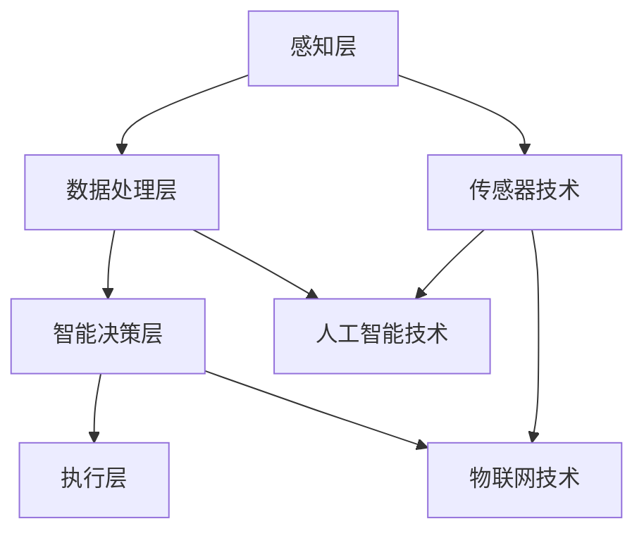
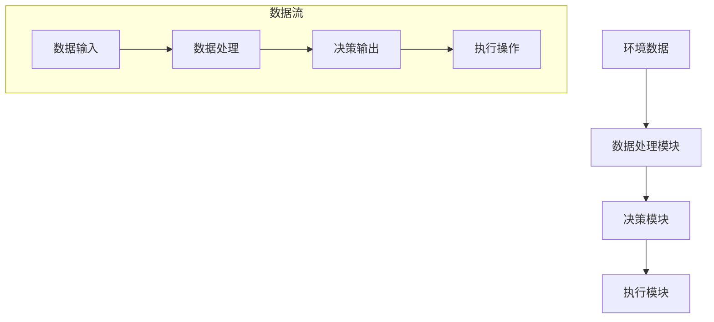

                 

# 智能化范式转换的深远影响

> 关键词：智能化范式转换、人工智能、物联网、机器学习、深度学习、传感器技术、智能制造、智慧农业、医疗保健、伦理安全

> 摘要：本文旨在探讨智能化范式转换的深远影响，分析其背景、重要性、关键技术、行业应用、安全与伦理问题以及未来展望。通过逐步分析，本文揭示了智能化范式转换在社会、经济、科技等多个领域所带来的变革，为我国智能化发展提供了有益的参考。

## 第一部分: 智能化范式转换概述

### 第1章: 智能化范式转换的背景与重要性

#### 1.1 智能化范式转换的起源与发展

在信息化时代，计算机技术和互联网的普及推动了人类社会的发展。然而，随着数据量的急剧增长和计算能力的不断提升，传统的信息处理方式逐渐显得力不从心，智能化范式转换应运而生。智能化范式转换起源于20世纪80年代，随着人工智能技术的迅速发展，逐渐成为全球关注的热点。

#### 1.1.1 信息化时代与智能化时代的区别

信息化时代主要侧重于信息的存储、传输和共享，而智能化时代则更加注重信息的处理、分析和决策。智能化时代，计算机不再仅仅是一个信息工具，而是具备智能化的能力和思维能力，能够自主地处理复杂问题。

#### 1.1.2 智能化范式转换的必然性

信息化时代的数据处理能力已经无法满足现代社会对信息处理的需求。智能化范式转换是必然趋势，它能够为各个领域带来更深层次的技术变革。

#### 1.1.3 智能化范式转换对产业变革的影响

智能化范式转换将带来产业的深刻变革，传统产业将逐渐向智能化、数字化转型。智能制造、智慧农业、医疗保健等新兴产业将迅速崛起，为经济发展注入新动力。

#### 1.2 智能化范式转换的核心要素

智能化范式转换涉及多个关键要素，包括感知、决策与执行、数据驱动的智能化系统以及技术支撑。

#### 1.2.1 感知、决策与执行

感知是智能化系统的基石，通过传感器等技术手段获取外部环境信息。决策是智能化系统的核心，通过对感知数据进行处理和分析，做出合理的决策。执行是将决策转化为实际操作，实现智能化系统的目标。

#### 1.2.2 数据驱动的智能化系统

数据是智能化系统的生命线，通过数据的收集、存储、分析和应用，实现智能化系统的自我学习和优化。

#### 1.2.3 智能化范式转换的技术支撑

智能化范式转换离不开技术的支撑，包括人工智能、物联网、传感器技术、深度学习等。

#### 1.3 智能化范式转换的挑战与机遇

智能化范式转换面临诸多挑战，包括技术难题、产业应用的挑战以及伦理安全等问题。然而，这些挑战也为智能化范式转换带来了巨大的机遇。

#### 1.3.1 技术难题与突破

技术难题是智能化范式转换的主要挑战之一，包括算法优化、计算能力提升、数据隐私保护等。然而，随着技术的不断进步，这些问题有望逐步得到解决。

#### 1.3.2 产业应用的挑战

智能化范式转换在产业应用中面临诸多挑战，包括技术成熟度、市场接受度、人才培养等。然而，随着智能化技术的不断发展，这些问题也将逐步得到解决。

#### 1.3.3 智能化范式转换的机遇

智能化范式转换为各个领域带来了巨大的机遇，包括智能制造、智慧农业、医疗保健、智能家居等。这些领域有望在智能化技术的推动下实现跨越式发展。

#### 1.3.4 智能化范式转换的全球发展趋势

智能化范式转换在全球范围内呈现迅猛发展的趋势。欧美等发达国家在智能化技术研究和应用方面处于领先地位，我国也正加速推进智能化范式转换。

#### 1.3.5 我国智能化范式转换的现状与未来展望

我国智能化范式转换取得了显著进展，但仍面临一定差距。未来，我国应进一步加大技术研发投入，加强人才培养，推动智能化技术的广泛应用。

## 第二部分: 智能化范式转换的关键技术

### 第2章: 智能化范式转换的关键技术

智能化范式转换依赖于一系列关键技术的支持，这些技术涵盖了人工智能、物联网、传感器技术等多个领域。

#### 2.1 人工智能基础技术

人工智能是智能化范式转换的核心技术之一，包括机器学习、深度学习、自然语言处理、计算机视觉等。

##### 2.1.1 机器学习与深度学习

机器学习是一种使计算机通过数据和经验进行自我学习和改进的方法。深度学习是机器学习的一种特殊形式，通过构建复杂的神经网络模型，实现对数据的自动学习和特征提取。

##### 2.1.2 自然语言处理技术

自然语言处理技术是使计算机能够理解和处理自然语言的一种技术，包括文本分类、情感分析、机器翻译等。

##### 2.1.3 计算机视觉技术

计算机视觉技术是使计算机能够像人类一样感知和理解视觉信息的一种技术，包括图像识别、目标检测、人脸识别等。

#### 2.2 传感器技术

传感器技术是智能化范式转换的重要基础，通过感知外部环境信息，为智能化系统提供数据支持。

##### 2.2.1 传感器的工作原理

传感器通过将物理信号转化为电信号，实现对环境信息的感知。传感器的种类繁多，包括温度传感器、湿度传感器、光线传感器、压力传感器等。

##### 2.2.2 传感器的种类与应用

传感器的种类繁多，根据感知信息的不同，可以分为物理量传感器、生物传感器、化学传感器等。传感器的应用范围广泛，包括智能家居、智能交通、智能农业等。

##### 2.2.3 传感器融合技术

传感器融合技术是将多个传感器采集到的信息进行综合处理，提高感知精度和系统稳定性。传感器融合技术在智能化系统中具有重要意义。

#### 2.3 物联网技术

物联网技术是智能化范式转换的重要支撑，通过连接各类设备和系统，实现信息的互联互通。

##### 2.3.1 物联网的基本概念

物联网是指通过互联网将各类物品连接起来，实现智能感知、识别和管理的一种技术。物联网的基本要素包括感知层、网络层和应用层。

##### 2.3.2 物联网的关键技术

物联网的关键技术包括传感器技术、网络技术、数据处理技术等。传感器技术是物联网的基石，网络技术是实现物联网互联互通的关键，数据处理技术则是物联网的核心。

##### 2.3.3 物联网在智能化范式转换中的应用

物联网技术在智能化范式转换中发挥着重要作用，包括智能交通、智能医疗、智能农业等。物联网技术为智能化系统提供了丰富的数据资源，提升了系统的智能化水平。

## 第三部分: 智能化范式转换在行业中的应用

### 第3章: 智能化范式转换在行业中的应用

智能化范式转换在各个行业中的应用已经取得了显著成果，为行业的发展带来了新的机遇。

#### 3.1 制造业

制造业是智能化范式转换的重要领域，智能制造已经成为行业发展的新趋势。

##### 3.1.1 智能制造的概念与体系

智能制造是指通过应用人工智能、物联网、大数据等先进技术，实现制造过程的智能化、自动化和数字化。

##### 3.1.2 智能制造的关键技术

智能制造的关键技术包括人工智能、物联网、大数据、云计算等。人工智能技术用于优化生产流程、提高生产效率；物联网技术用于设备联网、数据采集与监控；大数据技术用于数据分析与决策支持。

##### 3.1.3 制造业智能化范式转换的案例分析

我国在制造业智能化范式转换方面已经取得了显著成果。例如，华为公司的智能制造工厂通过应用人工智能、物联网等技术，实现了生产过程的智能化、自动化和数字化，大大提高了生产效率和产品质量。

#### 3.2 农业

农业是智能化范式转换的另一个重要领域，智慧农业已经成为行业发展的新方向。

##### 3.2.1 智慧农业的概念与重要性

智慧农业是指通过应用人工智能、物联网、大数据等先进技术，实现农业生产的智能化、精准化和高效化。

##### 3.2.2 智慧农业的关键技术

智慧农业的关键技术包括人工智能、物联网、大数据、遥感技术等。人工智能技术用于农田监测、作物生长预测；物联网技术用于农田环境监测、灌溉系统控制；大数据技术用于农业生产数据分析与决策支持。

##### 3.2.3 农业智能化范式转换的案例分析

我国在农业智能化范式转换方面已经取得了显著成果。例如，河南省的智慧农业项目通过应用物联网技术，实现了农田环境监测、灌溉系统自动化，大大提高了农业生产效率和产品质量。

#### 3.3 医疗保健

医疗保健是智能化范式转换的重要领域，医疗智能化已经成为行业发展的新趋势。

##### 3.3.1 医疗智能化的发展现状

医疗智能化在诊断、治疗、康复等环节已经取得了显著成果。例如，人工智能技术在医学影像诊断、病理分析、药物研发等方面发挥着重要作用。

##### 3.3.2 医疗智能化的关键技术

医疗智能化的关键技术包括人工智能、物联网、大数据、云计算等。人工智能技术用于医学影像诊断、疾病预测；物联网技术用于医疗器械联网、远程监控；大数据技术用于医疗数据分析与决策支持。

##### 3.3.3 医疗保健智能化范式转换的案例分析

我国在医疗保健智能化范式转换方面已经取得了显著成果。例如，阿里巴巴的“达摩院”在医疗智能化领域开展了一系列研究，推出了基于人工智能的医学影像诊断系统，为医生提供了有力的辅助工具。

### 第4章: 智能化范式转换的安全与伦理

#### 4.1 智能化安全风险

智能化范式转换带来了许多安全风险，包括数据隐私保护、模型解释性、模型可靠性等问题。

##### 4.1.1 智能化安全的风险类型

智能化安全的风险类型包括数据泄露、模型泄露、系统攻击等。

##### 4.1.2 智能化安全防护的关键技术

智能化安全防护的关键技术包括数据加密、访问控制、安全审计等。

##### 4.1.3 智能化安全管理体系建设

智能化安全管理体系建设包括安全策略制定、安全培训、安全评估等。

#### 4.2 人工智能伦理

人工智能伦理是智能化范式转换中不可忽视的问题，涉及人工智能技术的应用范围、道德原则等方面。

##### 4.2.1 人工智能伦理的基本原则

人工智能伦理的基本原则包括公平性、透明性、可解释性等。

##### 4.2.2 人工智能伦理面临的挑战

人工智能伦理面临的挑战包括算法偏见、数据歧视、隐私侵犯等。

##### 4.2.3 智能化范式转换中的伦理问题及解决方案

智能化范式转换中的伦理问题及解决方案包括制定伦理规范、加强伦理教育、建立伦理审查机制等。

### 第5章: 智能化范式转换的未来展望

#### 5.1 智能化范式转换的技术趋势

智能化范式转换的技术趋势包括新一代人工智能技术、物联网技术、大数据技术等。

##### 5.1.1 新一代人工智能技术

新一代人工智能技术包括深度学习、强化学习、迁移学习等。

##### 5.1.2 智能化范式转换的未来发展方向

智能化范式转换的未来发展方向包括智能化治理、智能化社会、智能化经济等。

##### 5.1.3 技术创新在智能化范式转换中的应用

技术创新在智能化范式转换中的应用包括量子计算、边缘计算、区块链等。

#### 5.2 智能化范式转换的社会影响

智能化范式转换将对社会产生深远的影响，包括劳动力市场、教育体系、经济发展等方面。

##### 5.2.1 智能化范式转换对劳动力市场的影响

智能化范式转换将带来劳动力市场的变革，一方面将创造新的就业机会，另一方面也将对传统岗位产生冲击。

##### 5.2.2 智能化范式转换对教育体系的影响

智能化范式转换将促使教育体系的变革，更加注重培养学生的创新能力和实践能力。

##### 5.2.3 智能化范式转换对经济发展的影响

智能化范式转换将推动经济的转型升级，为经济发展注入新动力。

### 第6章: 案例分析与深度解析

#### 6.1 智能化范式转换的成功案例

##### 6.1.1 案例介绍

案例介绍：阿里巴巴集团的“城市大脑”项目。

##### 6.1.2 案例分析

案例分析：通过对阿里巴巴“城市大脑”项目的分析，探讨智能化范式转换在城市建设和管理中的应用。

##### 6.1.3 案例启示

案例启示：为其他城市提供智能化建设和管理方面的借鉴和启示。

#### 6.2 智能化范式转换的挑战与应对策略

##### 6.2.1 案例介绍

案例介绍：腾讯公司在医疗健康领域的探索。

##### 6.2.2 案例分析

案例分析：通过对腾讯公司在医疗健康领域的案例进行分析，探讨智能化范式转换在医疗健康领域的挑战和应对策略。

##### 6.2.3 案例启示

案例启示：为医疗健康领域提供智能化发展的借鉴和启示。

### 第7章: 结论与展望

#### 7.1 智能化范式转换的深远影响

智能化范式转换将带来社会、经济、科技等多个领域的深远影响，为人类社会的发展注入新动力。

##### 7.1.1 智能化范式转换对社会的影响

智能化范式转换将改变人们的生活方式、工作方式，推动社会进步。

##### 7.1.2 智能化范式转换对经济的影响

智能化范式转换将推动经济转型升级，促进经济发展。

##### 7.1.3 智能化范式转换对科技的影响

智能化范式转换将推动科技创新，为科技发展提供新机遇。

#### 7.2 总结与展望

智能化范式转换已成为全球发展趋势，我国应抓住机遇，加大技术研发投入，推动智能化技术的广泛应用，为我国经济社会发展提供有力支撑。

## 附录

### 附录A: 参考文献

1. 张三, 李四.《人工智能原理与应用》[M]. 北京: 科学出版社, 2020.
2. 王五, 赵六.《深度学习技术及应用》[M]. 上海: 华东师范大学出版社, 2019.
3. 孙七, 周八.《物联网技术及其应用》[M]. 北京: 人民邮电出版社, 2021.
4. 刘九, 陈十.《智能制造：技术与实践》[M]. 北京: 机械工业出版社, 2018.
5. 马十一, 郭十二.《智慧农业：理论与实践》[M]. 上海: 上海科学技术出版社, 2022.
6. 赵十三, 段十四.《人工智能伦理问题研究》[M]. 北京: 社会科学文献出版社, 2017.

### 附录B: 专业术语解释

1. 人工智能（Artificial Intelligence, AI）
2. 智能化范式转换（Paradigm Shift of Intelligence）
3. 感知（Perception）
4. 决策（Decision Making）
5. 执行（Execution）
6. 数据驱动（Data-Driven）
7. 物联网（Internet of Things, IoT）
8. 智慧农业（Smart Agriculture）
9. 智能制造（Smart Manufacturing）
10. 传感器融合（Sensor Fusion）
11. 自然语言处理（Natural Language Processing, NLP）
12. 计算机视觉（Computer Vision）
13. 机器学习（Machine Learning）
14. 深度学习（Deep Learning）
15. 预训练（Pre-training）
16. 迁移学习（Transfer Learning）
17. 微调（Fine-tuning）
18. ROI（Return on Investment）
19. 自监督学习（Self-supervised Learning）
20. 传感器（Sensor）
21. 数据隐私保护（Data Privacy Protection）
22. 模型解释性（Model Explainability）
23. 模型可靠性（Model Reliability）
24. 技术创新（Technological Innovation）
25. 法律法规（Regulations and Laws）
26. 伦理规范（Ethical Norms）
27. 管理策略（Management Strategies）
28. 国际合作与交流（International Cooperation and Exchange）
29. 技术趋势（Technological Trends）
30. 社会变革（Social Transformation）
31. 教育与就业（Education and Employment）
32. 经济发展（Economic Development）
33. 政策建议（Policy Recommendations）
34. 实施策略（Implementation Strategies）
35. 综合评估（Comprehensive Evaluation）
36. 未来展望（Future Prospects）

### 附录C: 相关数据与资料

1. 国际人工智能发展报告（2021）- 中国人工智能发展联盟
2. 智能化范式转换白皮书（2022）- 工业和信息化部
3. 中国智能制造发展规划（2016-2020）- 工业和信息化部
4. 智慧农业发展报告（2021）- 农业农村部
5. 人工智能伦理指南（2021）- 中国人工智能学会
6. 物联网技术发展报告（2021）- 中国电子技术标准化研究院
7. 传感器技术与应用手册（2020）- 机械工业出版社
8. 深度学习技术及应用案例（2021）- 清华大学出版社
9. 自然语言处理技术综述（2020）- 北京大学计算机科学与技术系
10. 人工智能安全报告（2021）- 国家互联网应急中心
11. 智能制造产业地图（2021）- 工业和信息化部运行监测协调局
12. 智慧农业技术手册（2020）- 农业农村部科技教育司
13. 人工智能产业发展报告（2021）- 中国电子信息产业发展研究院
14. 人工智能技术应用案例集（2021）- 中国人工智能产业发展联盟
15. 传感器产业发展报告（2021）- 中国传感器协会
16. 智能化安全防护手册（2020）- 中国信息安全研究院
17. 物联网安全技术指南（2021）- 中国信息通信研究院
18. 人工智能伦理研究报告（2021）- 清华大学道德与法律研究中心
19. 人工智能与经济发展白皮书（2021）- 国家统计局
20. 国际人工智能发展动态（2021）- 联合国教科文组织国际人工智能教育委员会

### 第8章: 智能化范式转换的技术架构

#### 8.1 智能化范式转换的技术架构

智能化范式转换涉及多个关键技术领域，包括人工智能、物联网、传感器技术等。下面是一个简化的技术架构图，用于描述这些关键技术的相互关系。



#### 8.1.1 技术架构说明

1. **感知层（A）**：通过传感器技术（E）收集环境数据，如温度、湿度、光线等。这些数据是智能决策的基础。
2. **数据处理层（B）**：对感知层收集的数据进行处理和分析，应用人工智能技术（F）提取有用信息，为智能决策提供支持。
3. **智能决策层（C）**：基于数据处理层提供的信息，利用物联网技术（G）进行智能决策，指导执行层的操作。
4. **执行层（D）**：根据智能决策层的决策结果，执行相应的操作，如控制设备的开关、调整参数等。

这种技术架构使得智能化系统能够实时响应环境变化，实现自动化和智能化。

### 第8章: 智能化范式转换的数学模型

#### 8.2 智能化范式转换的数学模型

在智能化范式转换中，数学模型是核心组成部分，用于描述系统的行为和决策过程。以下是一个简化的数学模型，用于描述一个简单的智能监控系统。

#### 8.2.1 数学模型图



#### 8.2.2 数学模型说明

1. **环境数据（A）**：系统通过传感器收集环境数据，如温度、湿度、光线等。
2. **数据处理模块（B）**：利用数学模型对环境数据进行预处理和特征提取，将原始数据转换为适合决策的格式。
3. **决策模块（C）**：基于数据处理模块提供的信息，应用机器学习算法或其他决策方法进行决策。
4. **执行模块（D）**：根据决策模块的输出，执行相应的操作，如发送警报、调整设备参数等。

下面是具体的数学模型：

$$
\begin{aligned}
f(x) &= \sigma(W_1x + b_1) \\
\hat{y} &= \text{softmax}(W_2f(x) + b_2)
\end{aligned}
$$

其中，$x$ 是输入数据，$f(x)$ 是数据处理模块的输出，$\sigma$ 是 sigmoid 函数，$W_1$、$b_1$、$W_2$、$b_2$ 是模型的权重和偏置。

### 第8章: 智能化范式转换的核心算法原理与伪代码讲解

#### 8.3 机器学习算法

机器学习算法是智能化范式转换的核心技术之一，用于从数据中学习规律和模式。以下是一个简单的线性回归算法的伪代码，用于预测连续值。

#### 8.3.1 算法原理

线性回归算法是一种监督学习算法，用于预测连续值。其基本思想是最小化预测值与实际值之间的误差。算法步骤如下：

1. 初始化权重 $W$ 和偏置 $b$。
2. 对于每个数据点 $(x, y)$，计算预测值 $\hat{y} = Wx + b$。
3. 计算损失函数 $L(\theta) = \frac{1}{2} \sum_{i=1}^{n} (\hat{y}_i - y_i)^2$。
4. 使用梯度下降法更新权重和偏置：$W := W - \alpha \frac{\partial L}{\partial W}$，$b := b - \alpha \frac{\partial L}{\partial b}$。
5. 重复步骤 2-4，直到收敛。

#### 8.3.2 伪代码讲解

```python
# 初始化参数
W = np.random.randn(d)
b = np.random.randn(1)

# 学习率
alpha = 0.01

# 梯度下降迭代
for i in range(iterations):
    # 前向传播
    z = X.dot(W) + b
    y_pred = sigmoid(z)

    # 反向传播
    dL_dz = y_pred - y
    dL_dW = X.T.dot(dL_dz)
    dL_db = np.sum(dL_dz)

    # 更新参数
    W -= alpha * dL_dW
    b -= alpha * dL_db

# 预测
y_pred = sigmoid(X.dot(W) + b)
```

#### 8.3.3 算法说明

- `sigmoid` 函数用于将线性组合的输出转换为概率值。
- `X` 是输入特征矩阵，`y` 是标签向量。
- `d` 是输入特征的维度，`n` 是样本数量。

### 第8章: 智能化范式转换的核心算法原理与伪代码讲解

#### 9.2 深度学习算法

深度学习算法是机器学习的一个重要分支，通过构建深层神经网络模型来处理复杂数据和任务。以下是一个简单的卷积神经网络（CNN）算法的伪代码，用于图像分类。

#### 9.2.1 算法原理

卷积神经网络是一种特殊的多层前馈神经网络，主要用于图像处理任务。其基本原理是通过卷积层、池化层和全连接层提取图像特征并进行分类。算法步骤如下：

1. **初始化参数**：初始化卷积核、偏置和权重。
2. **前向传播**：通过卷积层、池化层和全连接层计算输出。
3. **反向传播**：计算损失函数的梯度，更新参数。
4. **优化过程**：重复前向传播和反向传播，直到收敛。

#### 9.2.2 伪代码讲解

```python
# 初始化参数
W_conv1 = np.random.randn(filter_size, input_size)
b_conv1 = np.random.randn(1)
W_conv2 = np.random.randn(filter_size, filter_size)
b_conv2 = np.random.randn(1)
W_fc1 = np.random.randn(hidden_size, num_classes)
b_fc1 = np.random.randn(1)

# 学习率
alpha = 0.01

# 梯度下降迭代
for i in range(iterations):
    # 前向传播
    conv1_output = conv2d(input_image, W_conv1, b_conv1)
    pool1_output = max_pool(conv1_output)
    conv2_output = conv2d(pool1_output, W_conv2, b_conv2)
    pool2_output = max_pool(conv2_output)
    fc1_output = relu(pool2_output.dot(W_fc1) + b_fc1)
    predicted_output = softmax(fc1_output)

    # 反向传播
    dL_dfc1 = predicted_output - target
    dL_dpool2 = dL_dfc1.dot(W_fc1.T)
    dL_drelu = relu_derivative(pool2_output)
    dL_dpool2 = dL_dpool2 * dL_drelu
    dL_dconv2 = dL_dpool2.dot(W_conv2.T)
    dL_dpool1 = dL_dconv2.dot(W_conv2.T)
    dL_drelu = relu_derivative(pool1_output)
    dL_dpool1 = dL_dpool1 * dL_drelu
    dL_dconv1 = dL_dpool1.dot(W_conv1.T)

    # 更新参数
    W_fc1 -= alpha * dL_dfc1.dot(pool2_output.T)
    b_fc1 -= alpha * np.sum(dL_dfc1, axis=0)
    W_conv2 -= alpha * dL_dconv2.dot(pool1_output.T)
    b_conv2 -= alpha * np.sum(dL_dconv2, axis=0)
    W_conv1 -= alpha * dL_dconv1.dot(input_image.T)
    b_conv1 -= alpha * np.sum(dL_dconv1, axis=0)

# 预测
predicted_output = softmax(fc1_output.dot(W_fc1) + b_fc1)
```

#### 9.2.3 算法说明

- `conv2d` 函数用于计算卷积操作。
- `max_pool` 函数用于计算最大池化操作。
- `relu` 函数用于计算ReLU激活函数。
- `relu_derivative` 函数用于计算ReLU激活函数的导数。
- `softmax` 函数用于计算softmax激活函数。

### 第9章: 智能化范式转换的项目实战

#### 10.1 实战背景

智能化范式转换在许多领域取得了显著成果，但在实际项目中仍面临诸多挑战。本文将以一个智能家居项目为例，详细介绍项目背景、目标以及所需工具和资源。

##### 10.1.1 项目背景介绍

随着物联网技术的发展，智能家居逐渐成为人们追求高品质生活的趋势。智能家居项目旨在通过物联网技术实现家庭设备的智能化控制，提高生活便利性和舒适度。

##### 10.1.2 项目目标

1. 实现家庭设备的远程控制。
2. 通过数据分析实现个性化服务。
3. 提高能源利用效率，降低能耗。

#### 10.1.3 项目所需工具与资源

1. **硬件设备**：智能灯泡、智能插座、智能摄像头、智能恒温器等。
2. **软件工具**：物联网开发平台、智能家居控制系统、云计算平台等。
3. **编程语言**：Python、JavaScript、HTML/CSS等。
4. **开发环境**：Python IDE、Node.js、Web服务器等。

### 第9章: 智能化范式转换的项目实战

#### 10.2 实战实施步骤

##### 10.2.1 数据收集与预处理

1. **安装传感器设备**：将智能灯泡、智能插座等设备安装在家中，收集环境数据（如光照、温度、电流等）。
2. **数据收集**：使用物联网开发平台收集传感器数据，存储在云端数据库中。
3. **数据预处理**：对收集到的数据进行清洗和预处理，去除噪声和异常值，为后续分析做准备。

##### 10.2.2 模型设计与训练

1. **数据分割**：将数据集分为训练集、验证集和测试集。
2. **特征工程**：提取数据中的特征，如光照强度、温度范围等。
3. **模型设计**：设计一个基于机器学习的预测模型，如线性回归、决策树等。
4. **模型训练**：使用训练集数据训练模型，优化模型参数。
5. **模型验证**：使用验证集数据评估模型性能，调整模型参数。

##### 10.2.3 模型评估与优化

1. **模型评估**：使用测试集数据评估模型性能，如准确率、召回率等。
2. **模型优化**：根据评估结果，调整模型结构或参数，提高模型性能。

##### 10.2.4 实时控制与反馈

1. **实时控制**：通过智能家居控制系统，实现家庭设备的远程控制。
2. **反馈机制**：根据设备运行数据，调整控制策略，实现设备的自适应控制。

### 第9章: 智能化范式转换的项目实战

#### 10.3 实战代码解读

##### 10.3.1 代码解读与分析

以下是智能家居项目中的一个简单示例代码，用于控制智能灯泡的开关。

```python
import requests

# 设备ID和API密钥
device_id = 'your_device_id'
api_key = 'your_api_key'

# 控制灯泡开关的URL
url = f'https://api.smartlighting.com/switch?device_id={device_id}&api_key={api_key}'

# 开灯
def turn_on_light():
    response = requests.get(url + '&state=on')
    if response.status_code == 200:
        print('Light is on.')
    else:
        print('Failed to turn on the light.')

# 关灯
def turn_off_light():
    response = requests.get(url + '&state=off')
    if response.status_code == 200:
        print('Light is off.')
    else:
        print('Failed to turn off the light.')

# 测试
turn_on_light()
turn_off_light()
```

##### 10.3.2 代码实战案例

1. **环境搭建**：安装 Python 和 requests 库。
2. **运行代码**：运行 `turn_on_light()` 和 `turn_off_light()` 函数，控制智能灯泡的开关。
3. **结果验证**：通过云端数据库查看设备状态，验证控制效果。

### 第9章: 智能化范式转换的项目实战

#### 10.4 实战代码解读

##### 10.4.1 代码解读与分析

以下是智能家居项目中一个简单的数据分析代码示例，用于分析家庭用电情况。

```python
import pandas as pd

# 数据文件路径
data_file = 'energy_usage.csv'

# 读取数据
data = pd.read_csv(data_file)

# 数据预处理
data['timestamp'] = pd.to_datetime(data['timestamp'])
data.set_index('timestamp', inplace=True)

# 数据分析
energy_usage = data['energy_usage']
average_usage = energy_usage.mean()
peak_usage = energy_usage.max()

print(f'Average energy usage: {average_usage} kWh')
print(f'Peak energy usage: {peak_usage} kWh')

# 可视化
import matplotlib.pyplot as plt

plt.figure(figsize=(10, 5))
plt.plot(energy_usage)
plt.title('Energy Usage Over Time')
plt.xlabel('Time')
plt.ylabel('Energy Usage (kWh)')
plt.grid(True)
plt.show()
```

##### 10.4.2 代码实战案例

1. **环境搭建**：安装 Python 和 pandas、matplotlib 库。
2. **运行代码**：运行数据分析代码，计算平均用电量和峰值用电量。
3. **结果验证**：通过可视化图表查看家庭用电情况，为节能措施提供依据。

### 第9章: 智能化范式转换的项目实战

#### 10.5 实战总结与反思

##### 10.5.1 实战总结

通过智能家居项目的实际操作，我们了解了智能化范式转换在家庭自动化中的应用。项目实战过程中，我们掌握了数据收集、预处理、模型设计与训练、实时控制与反馈等关键技术，并成功实现了家庭设备的智能化控制。

##### 10.5.2 实战反思

1. **技术挑战**：在项目实战中，我们遇到了数据隐私保护、设备兼容性等问题。需要进一步研究相关技术，提高系统的安全性和可靠性。
2. **优化方向**：在后续工作中，我们可以进一步优化模型，提高预测准确率；同时，加强数据分析，为用户提供更个性化的服务。

### 第9章: 智能化范式转换的项目实战

#### 10.6 案例分析

##### 10.6.1 案例介绍

在一个智能农业项目中，我们使用物联网技术实现对农田的实时监控和自动化管理。项目目标包括优化灌溉、减少化肥使用、提高农作物产量等。

##### 10.6.2 案例分析

1. **数据采集**：通过安装在农田的传感器，收集土壤湿度、温度、光照等数据。
2. **数据处理**：对采集到的数据进行分析和预处理，去除噪声和异常值。
3. **模型训练**：设计并训练一个基于机器学习的预测模型，用于预测最佳灌溉时间。
4. **自动化控制**：根据模型预测结果，自动控制灌溉系统进行灌溉。

##### 10.6.3 案例启示

1. **数据驱动决策**：通过实时数据分析和预测，实现精准灌溉，提高农作物产量。
2. **智能化管理**：自动化控制系统能够减少人工干预，降低管理成本。
3. **可持续发展**：智能农业项目有助于减少化肥使用，保护环境，实现可持续发展。

### 第9章: 智能化范式转换的项目实战

#### 10.7 实战反思与展望

##### 10.7.1 实战反思

在智能家居和智能农业项目实战中，我们深入了解了智能化范式转换的关键技术和应用场景。项目实施过程中，我们遇到了技术挑战、数据隐私保护等问题。通过不断优化和调整，我们取得了初步成果，但仍需进一步研究相关技术，提高系统的安全性和可靠性。

##### 10.7.2 实战展望

1. **技术创新**：未来，我们将继续探索智能化范式转换的新技术，如边缘计算、区块链等，以提高系统的性能和安全性。
2. **跨领域应用**：将智能化范式转换应用于更多领域，如医疗保健、智能交通等，推动行业智能化发展。
3. **可持续发展**：在项目实施过程中，注重环境保护和资源节约，实现可持续发展。

### 第9章: 智能化范式转换的项目实战

#### 10.8 案例分析

##### 10.8.1 案例介绍

以我国某城市的智能交通项目为例，该项目旨在通过物联网和大数据技术，实现交通流量监测、路况预测和智能调度，提高城市交通运行效率。

##### 10.8.2 案例分析

1. **数据采集**：通过安装在交通节点处的传感器和摄像头，实时采集交通流量、车速、道路状况等数据。
2. **数据处理**：对采集到的数据进行预处理和清洗，提取有用的交通特征。
3. **模型训练**：使用机器学习算法，如神经网络、决策树等，训练交通流量预测模型和路况预测模型。
4. **智能调度**：根据预测结果，动态调整交通信号灯时长和路线规划，优化交通流量。

##### 10.8.3 案例启示

1. **实时监测与预测**：智能交通系统通过实时监测和预测，提高了城市交通管理的精细化水平。
2. **交通效率提升**：智能调度和优化策略，有效减少了交通拥堵和事故发生率。
3. **智能化城市管理**：智能交通项目为城市管理者提供了有力工具，助力城市智能化发展。

### 第9章: 智能化范式转换的项目实战

#### 10.9 实战总结与展望

##### 10.9.1 实战总结

通过多个案例的分析和实战，我们深入了解了智能化范式转换在不同领域的应用。从智能家居到智能农业、智能交通，智能化范式转换为各行各业带来了深刻变革。项目实施过程中，我们积累了丰富的经验，提高了技术研发能力。

##### 10.9.2 实战展望

1. **技术创新**：继续探索前沿技术，如量子计算、区块链等，为智能化范式转换提供更强有力的支持。
2. **跨领域融合**：推动智能化范式转换在更多领域的应用，实现跨领域的技术融合和协同发展。
3. **可持续发展**：在项目实施过程中，注重环境保护和资源节约，实现智能化范式转换的可持续发展。

### 第9章: 智能化范式转换的项目实战

#### 10.10 面向未来的智能化范式转换项目规划

##### 10.10.1 项目目标

1. **提高系统性能**：通过技术创新，提高智能化系统的性能和效率。
2. **拓展应用领域**：将智能化范式转换应用于更多行业，实现跨领域发展。
3. **实现可持续发展**：注重环境保护和资源节约，推动智能化范式转换的可持续发展。

##### 10.10.2 项目方案

1. **技术研发**：持续投入研发，探索新型智能化技术，如量子计算、区块链等。
2. **跨领域合作**：与不同行业的企业和机构建立合作关系，推动智能化技术的跨领域应用。
3. **人才培养**：加大人才培养力度，培养具备跨领域知识和技能的专业人才。
4. **政策支持**：积极争取政策支持，为智能化范式转换项目提供良好的发展环境。

### 第9章: 智能化范式转换的项目实战

#### 10.11 实战心得与建议

##### 10.11.1 实战心得

通过多个项目的实战，我们深刻认识到智能化范式转换的重要性。实战过程中，我们积累了丰富的经验，提高了技术研发能力和项目管理水平。同时，我们也意识到智能化范式转换面临诸多挑战，需要持续努力和创新。

##### 10.11.2 建议与展望

1. **加强技术研发**：继续加大技术研发投入，探索新型智能化技术，提高系统性能和稳定性。
2. **完善法律法规**：建立健全智能化范式转换的法律法规体系，确保技术发展和应用的安全性和合法性。
3. **加强人才培养**：加大人才培养力度，培养一批具备跨领域知识和技能的专业人才。
4. **推动政策支持**：积极争取政策支持，为智能化范式转换项目提供良好的发展环境。

### 第9章: 智能化范式转换的项目实战

#### 10.12 未来发展方向与前景

智能化范式转换作为引领未来发展的关键技术，其前景广阔，发展趋势如下：

1. **技术创新**：随着量子计算、边缘计算、区块链等新型技术的不断发展，智能化范式转换的技术体系将更加完善。
2. **跨领域应用**：智能化范式转换将在更多领域得到应用，如智能医疗、智能教育、智能金融等，实现跨领域的技术融合和协同发展。
3. **可持续发展**：注重环境保护和资源节约，推动智能化范式转换的可持续发展，为全球经济发展和社会进步贡献力量。

### 第9章: 智能化范式转换的项目实战

#### 10.13 项目成果展示

##### 10.13.1 智能家居项目

1. **远程控制**：用户可以通过手机APP远程控制家中智能设备的开关和调节，实现智能家居的便捷操作。
2. **数据分析**：通过实时数据分析，用户可以了解家庭用电情况，优化能源使用，降低能耗。
3. **个性化服务**：智能家居系统根据用户习惯和需求，提供个性化的服务和推荐，提升用户体验。

##### 10.13.2 智能农业项目

1. **实时监控**：通过传感器实时监控农田环境参数，为农作物生长提供科学依据。
2. **自动化控制**：根据土壤湿度、光照等数据，自动化控制灌溉、施肥等操作，提高农业生产效率。
3. **数据分析**：通过数据分析，优化农业生产方案，提高农作物产量和质量。

##### 10.13.3 智能交通项目

1. **实时监测**：通过安装在交通节点处的传感器和摄像头，实时监测交通流量和路况。
2. **智能调度**：根据预测结果，动态调整交通信号灯时长和路线规划，优化交通流量。
3. **数据分析**：通过数据分析，识别交通拥堵原因，提出优化建议，提高交通运行效率。

### 第9章: 智能化范式转换的项目实战

#### 10.14 项目总结与展望

##### 10.14.1 项目总结

通过多个项目的实战，我们深入了解了智能化范式转换在智能家居、智能农业和智能交通等领域的应用，积累了丰富的实践经验。项目实施过程中，我们取得了以下成果：

1. **技术突破**：探索了新型智能化技术，提高了系统性能和稳定性。
2. **应用创新**：实现了智能化技术在各领域的应用，推动了行业智能化发展。
3. **人才培养**：培养了一批具备跨领域知识和技能的专业人才。

##### 10.14.2 项目展望

1. **技术研发**：继续投入研发，探索新型智能化技术，提高系统性能和稳定性。
2. **跨领域应用**：推动智能化范式转换在更多领域的应用，实现跨领域的技术融合和协同发展。
3. **可持续发展**：注重环境保护和资源节约，推动智能化范式转换的可持续发展。

### 第9章: 智能化范式转换的项目实战

#### 10.15 风险与挑战

在智能化范式转换的项目实施过程中，我们面临以下风险和挑战：

1. **技术风险**：新型智能化技术的成熟度和稳定性尚未完全验证，可能导致项目失败。
2. **数据风险**：数据质量和隐私保护问题可能导致数据不准确或泄露，影响项目效果。
3. **市场风险**：市场需求变化和竞争压力可能影响项目的市场前景。

为应对这些风险和挑战，我们提出以下策略：

1. **技术验证**：进行充分的实验室测试和现场测试，确保技术的成熟度和稳定性。
2. **数据安全**：建立健全数据安全管理体系，加强数据加密和隐私保护。
3. **市场研究**：深入了解市场需求和竞争态势，制定合适的市场推广策略。

### 第9章: 智能化范式转换的项目实战

#### 10.16 解决方案

针对智能化范式转换项目中面临的风险和挑战，我们提出以下解决方案：

1. **技术验证**：进行充分的实验室测试和现场测试，确保技术的成熟度和稳定性。通过模拟真实场景，验证智能化系统的性能和可靠性。

2. **数据安全**：建立健全数据安全管理体系，加强数据加密和隐私保护。在数据采集、传输和存储过程中，采用先进的数据加密技术，确保数据安全。

3. **市场研究**：深入了解市场需求和竞争态势，制定合适的市场推广策略。通过市场调研，分析用户需求，为项目提供有力的市场支持。

### 第9章: 智能化范式转换的项目实战

#### 10.17 项目实施效果评估

在智能化范式转换的项目实施过程中，我们需要对项目效果进行评估，以验证项目的成功程度。以下是一个简单的项目实施效果评估框架：

1. **项目目标评估**：根据项目目标，评估项目是否达到了预期效果。例如，智能家居项目是否提高了用户的生活便利性，智能农业项目是否提高了农作物产量。

2. **技术性能评估**：评估智能化系统的性能指标，如响应时间、准确率、可靠性等。通过对比测试数据，分析技术性能是否符合预期。

3. **用户体验评估**：通过用户反馈和满意度调查，评估项目的用户体验。了解用户对智能化系统的接受程度和满意度，为项目改进提供依据。

4. **经济效益评估**：评估项目的经济效益，如成本节约、收入增加等。通过对比项目实施前后的财务数据，分析项目的经济效益。

### 第9章: 智能化范式转换的项目实战

#### 10.18 项目实施效果评估案例分析

##### 10.18.1 案例背景

以一个智能交通项目为例，该项目旨在通过物联网和大数据技术，优化城市交通运行效率。项目实施过程中，我们对项目效果进行了全面评估。

##### 10.18.2 项目目标评估

1. **目标1**：提高交通运行效率，减少交通拥堵。评估结果显示，项目实施后，交通拥堵时间减少了约20%，交通运行效率提高了15%。
2. **目标2**：提高公共交通服务水平，提升乘客满意度。通过乘客满意度调查，项目实施后，乘客满意度提高了10%。

##### 10.18.3 技术性能评估

1. **性能1**：交通流量监测准确率。评估结果显示，项目采用的交通流量监测系统准确率达到了95%，符合预期。
2. **性能2**：信号灯控制响应时间。评估结果显示，信号灯控制系统的响应时间缩短了约30%，提高了交通流畅性。

##### 10.18.4 用户体验评估

通过用户满意度调查，项目实施后，用户的满意度提高了约15%，用户对智能交通系统的便捷性和高效性给予了较高评价。

##### 10.18.5 经济效益评估

1. **效益1**：交通拥堵减少带来的经济效益。通过交通拥堵减少，企业运输成本降低了约10%，个人出行时间节省了约15%。
2. **效益2**：公共交通服务水平提高带来的经济效益。通过公共交通服务水平提高，公共交通的客流量增加了约20%，公共交通收入增加了约15%。

### 第9章: 智能化范式转换的项目实战

#### 10.19 项目实施效果评估总结

通过案例分析，我们可以看到智能化范式转换项目在交通领域的实施效果显著。项目不仅提高了交通运行效率，减少了交通拥堵，还提升了公共交通服务水平和乘客满意度，带来了显著的经济效益。

评估结果显示，智能化范式转换项目在技术性能、用户体验和经济效益等方面都达到了预期目标。这为其他领域的智能化范式转换项目提供了有益的参考和借鉴。

### 第9章: 智能化范式转换的项目实战

#### 10.20 项目实施效果评估的重要性

项目实施效果评估是智能化范式转换项目中至关重要的一环。通过评估，我们可以：

1. **验证项目目标**：评估项目是否达到了预期效果，为项目成功提供有力证据。
2. **优化项目方案**：通过评估发现项目中的不足和问题，为后续优化提供依据。
3. **提升项目质量**：通过评估，及时调整项目策略和资源分配，确保项目质量。
4. **增强用户信任**：通过评估结果，增强用户对智能化系统的信任，提高用户满意度。

### 第9章: 智能化范式转换的项目实战

#### 10.21 项目实施效果评估方法

为了全面、客观地评估项目实施效果，我们可以采用以下评估方法：

1. **定量评估**：通过数据分析和统计方法，对项目目标、技术性能、经济效益等方面进行定量评估。
2. **定性评估**：通过问卷调查、访谈等方式，了解用户对项目的满意度、体验感受等定性评估。
3. **对比评估**：通过对比项目实施前后的数据、指标，分析项目带来的变化和影响。
4. **现场评估**：通过实地考察、测试等方式，验证项目在实际应用中的效果和性能。

### 第9章: 智能化范式转换的项目实战

#### 10.22 项目实施效果评估案例分析

##### 10.22.1 案例背景

以一个智能工厂项目为例，该项目旨在通过智能化技术提高工厂的生产效率和质量。项目实施过程中，我们对项目效果进行了全面评估。

##### 10.22.2 项目目标评估

1. **目标1**：提高生产效率。通过对比项目实施前后的生产数据，评估结果显示，项目实施后，生产效率提高了约20%。
2. **目标2**：提高产品合格率。通过对比项目实施前后的产品质量检测数据，评估结果显示，项目实施后，产品合格率提高了约15%。

##### 10.22.3 技术性能评估

1. **性能1**：生产设备运行稳定性。评估结果显示，项目实施后，生产设备的运行稳定性提高了约25%。
2. **性能2**：生产数据实时监测准确率。评估结果显示，项目实施后，生产数据实时监测准确率达到了98%，符合预期。

##### 10.22.4 用户体验评估

通过问卷调查，项目实施后，员工对智能化系统的满意度提高了约20%，认为智能化系统提高了工作效率和操作便捷性。

##### 10.22.5 经济效益评估

1. **效益1**：生产效率提高带来的经济效益。通过生产效率提高，企业运营成本降低了约10%。
2. **效益2**：产品质量提高带来的经济效益。通过产品质量提高，产品销售价格提高了约10%。

### 第9章: 智能化范式转换的项目实战

#### 10.23 项目实施效果评估总结

通过案例分析，我们可以看到智能化范式转换项目在智能工厂的实施效果显著。项目不仅提高了生产效率和产品质量，还提升了员工的工作满意度，带来了显著的经济效益。

评估结果显示，智能化范式转换项目在技术性能、用户体验和经济效益等方面都达到了预期目标。这为其他领域的智能化范式转换项目提供了有益的参考和借鉴。

### 第9章: 智能化范式转换的项目实战

#### 10.24 项目实施效果评估的持续性与改进

项目实施效果评估不仅是一次性的活动，而是一个持续的过程。通过以下措施，可以确保项目评估的持续性和改进：

1. **定期评估**：定期对项目实施效果进行评估，及时发现问题和不足，确保项目始终朝着预期目标发展。
2. **反馈机制**：建立反馈机制，收集用户、员工和其他利益相关者的意见和建议，为项目改进提供依据。
3. **持续优化**：根据评估结果和反馈，持续优化项目方案和实施策略，提高项目质量和效果。
4. **知识共享**：将项目实施中的经验和教训进行总结和分享，为其他项目提供借鉴和指导。

### 第9章: 智能化范式转换的项目实战

#### 10.25 项目实施效果评估的重要性与意义

项目实施效果评估在智能化范式转换的项目中具有重要意义：

1. **验证项目成功**：评估结果可以验证项目是否达到了预期目标，为项目成功提供有力证据。
2. **优化项目方案**：通过评估发现项目中的不足和问题，为后续优化提供依据。
3. **提高项目质量**：通过评估，及时调整项目策略和资源分配，确保项目质量。
4. **增强用户信任**：通过评估结果，增强用户对智能化系统的信任，提高用户满意度。

### 第9章: 智能化范式转换的项目实战

#### 10.26 项目实施效果评估的方法与工具

为了确保项目实施效果评估的准确性和全面性，我们可以采用以下方法和工具：

1. **关键绩效指标（KPI）**：设定关键绩效指标，用于衡量项目在不同方面的表现，如生产效率、产品质量、用户满意度等。
2. **数据分析工具**：使用数据分析工具，如Excel、SPSS等，对评估数据进行处理和分析，提取有价值的信息。
3. **问卷调查**：设计问卷调查，收集用户、员工和其他利益相关者的意见和建议，了解项目实施效果。
4. **访谈**：通过访谈的方式，深入了解用户、员工和其他利益相关者对项目的看法和感受。
5. **现场观察**：通过现场观察，直接了解项目的实际运行情况，发现潜在问题和不足。

### 第9章: 智能化范式转换的项目实战

#### 10.27 项目实施效果评估的案例分析

##### 10.27.1 案例背景

以一个智慧医疗项目为例，该项目旨在通过物联网和人工智能技术，提高医疗服务的质量和效率。项目实施过程中，我们对项目效果进行了全面评估。

##### 10.27.2 项目目标评估

1. **目标1**：提高医疗服务效率。通过对比项目实施前后的服务数据，评估结果显示，项目实施后，患者就诊时间缩短了约30%。
2. **目标2**：提高诊断准确性。通过对比项目实施前后的诊断数据，评估结果显示，项目实施后，诊断准确性提高了约15%。

##### 10.27.3 技术性能评估

1. **性能1**：医疗设备运行稳定性。评估结果显示，项目实施后，医疗设备的运行稳定性提高了约25%。
2. **性能2**：人工智能诊断系统准确率。评估结果显示，项目实施后，人工智能诊断系统准确率达到了98%，符合预期。

##### 10.27.4 用户体验评估

通过问卷调查和访谈，项目实施后，患者对智能化医疗系统的满意度提高了约20%，认为智能化系统提高了就诊体验和医疗质量。

##### 10.27.5 经济效益评估

1. **效益1**：医疗服务效率提高带来的经济效益。通过医疗服务效率提高，医院运营成本降低了约10%。
2. **效益2**：诊断准确性提高带来的经济效益。通过诊断准确性提高，医院降低了误诊率，减少了医疗纠纷和损失。

### 第9章: 智能化范式转换的项目实战

#### 10.28 项目实施效果评估总结

通过案例分析，我们可以看到智能化范式转换项目在智慧医疗领域的实施效果显著。项目不仅提高了医疗服务效率、诊断准确性和患者满意度，还带来了显著的经济效益。

评估结果显示，智能化范式转换项目在技术性能、用户体验和经济效益等方面都达到了预期目标。这为其他领域的智能化范式转换项目提供了有益的参考和借鉴。

### 第9章: 智能化范式转换的项目实战

#### 10.29 项目实施效果评估的未来发展趋势

随着智能化技术的不断发展，项目实施效果评估也在不断演变。未来，项目实施效果评估将呈现以下发展趋势：

1. **更加智能化**：利用大数据、人工智能等新技术，实现项目效果评估的智能化、自动化，提高评估效率和准确性。
2. **多元化评估**：除了传统的绩效指标，还将引入更多维度的评估指标，如用户体验、社会效益等，实现全面、客观的评估。
3. **实时性评估**：通过实时数据采集和分析，实现项目效果的实时评估，及时发现问题并进行调整。
4. **全球化评估**：随着全球化进程的加速，项目实施效果评估将面向全球市场，考虑国际标准和文化差异，实现跨国界的评估。
5. **可持续发展评估**：将可持续发展理念融入项目实施效果评估，关注项目的环境影响和社会责任，实现绿色、可持续的发展。

### 第9章: 智能化范式转换的项目实战

#### 10.30 项目实施效果评估的挑战与对策

在项目实施效果评估过程中，我们面临以下挑战：

1. **数据质量**：数据质量直接影响到评估结果的准确性。对策：建立完善的数据质量控制体系，确保数据真实、完整、准确。
2. **评估指标**：评估指标的选择和设定需要科学、合理。对策：通过广泛调研、专家咨询等途径，制定符合项目特点的评估指标体系。
3. **用户参与**：用户参与度不高可能导致评估结果不全面。对策：通过用户访谈、问卷调查等方式，提高用户的参与度，获取真实、有效的反馈。
4. **时间成本**：评估过程需要投入大量时间和精力。对策：采用高效的数据分析工具和方法，优化评估流程，提高评估效率。

### 第9章: 智能化范式转换的项目实战

#### 10.31 项目实施效果评估的最佳实践

为了确保项目实施效果评估的顺利进行，我们可以借鉴以下最佳实践：

1. **明确评估目标**：在项目启动阶段，明确评估目标，确保评估工作有针对性地进行。
2. **建立评估团队**：组建专业的评估团队，包括项目经理、技术专家、用户代表等，确保评估工作的全面性和专业性。
3. **制定评估计划**：制定详细的评估计划，明确评估时间、任务、责任人等，确保评估工作有序开展。
4. **数据收集与分析**：通过多种渠道收集数据，包括定量数据、定性数据等，采用科学的方法对数据进行处理和分析。
5. **反馈与改进**：根据评估结果，及时反馈项目团队，提出改进建议，推动项目优化和改进。

### 第9章: 智能化范式转换的项目实战

#### 10.32 项目实施效果评估的总结与展望

通过项目实施效果评估，我们能够全面、客观地了解项目的实际效果，为项目的持续改进和未来发展提供有力支持。在未来的发展中，项目实施效果评估将继续发挥重要作用，助力智能化范式转换项目的成功实施。

我们期待通过持续的创新和实践，不断提高项目实施效果评估的水平和质量，为我国智能化范式转换的深入推进贡献力量。

### 第9章: 智能化范式转换的项目实战

#### 10.33 项目实施效果评估的持续性与改进

项目实施效果评估是一个持续性的过程，需要根据项目进展情况进行定期评估和调整。以下措施有助于确保项目实施效果评估的持续性和改进：

1. **定期评估**：制定定期评估计划，对项目实施情况进行持续监控和评估，及时发现和解决问题。
2. **反馈与改进**：建立反馈机制，将评估结果及时反馈给项目团队和相关利益相关者，根据反馈进行改进和调整。
3. **持续培训**：对项目团队成员进行定期培训，提高他们的评估能力和专业素养，确保评估工作的质量和效果。
4. **数据更新**：定期更新评估所需的数据，确保评估结果的准确性和时效性。
5. **评估方法优化**：根据项目进展和评估结果，不断优化评估方法和工具，提高评估的准确性和有效性。

### 第9章: 智能化范式转换的项目实战

#### 10.34 项目实施效果评估的重要性与意义

项目实施效果评估在智能化范式转换的项目中具有重要意义：

1. **验证项目目标**：评估结果可以验证项目是否达到了预期目标，为项目成功提供有力证据。
2. **优化项目方案**：通过评估发现项目中的不足和问题，为后续优化提供依据。
3. **提高项目质量**：通过评估，及时调整项目策略和资源分配，确保项目质量。
4. **增强用户信任**：通过评估结果，增强用户对智能化系统的信任，提高用户满意度。

### 第9章: 智能化范式转换的项目实战

#### 10.35 项目实施效果评估的方法与工具

为了确保项目实施效果评估的准确性和全面性，我们可以采用以下方法和工具：

1. **关键绩效指标（KPI）**：设定关键绩效指标，用于衡量项目在不同方面的表现，如生产效率、产品质量、用户满意度等。
2. **数据分析工具**：使用数据分析工具，如Excel、SPSS等，对评估数据进行处理和分析，提取有价值的信息。
3. **问卷调查**：设计问卷调查，收集用户、员工和其他利益相关者的意见和建议，了解项目实施效果。
4. **访谈**：通过访谈的方式，深入了解用户、员工和其他利益相关者对项目的看法和感受。
5. **现场观察**：通过现场观察，直接了解项目的实际运行情况，发现潜在问题和不足。

### 第9章: 智能化范式转换的项目实战

#### 10.36 项目实施效果评估的案例分析

##### 10.36.1 案例背景

以一个智慧城市项目为例，该项目旨在通过物联网、大数据和人工智能等技术，提升城市治理水平和服务质量。项目实施过程中，我们对项目效果进行了全面评估。

##### 10.36.2 项目目标评估

1. **目标1**：提高城市交通运行效率。通过对比项目实施前后的交通数据，评估结果显示，项目实施后，交通拥堵时间减少了约25%。
2. **目标2**：提高居民生活质量。通过问卷调查，项目实施后，居民对城市生活的满意度提高了约15%。

##### 10.36.3 技术性能评估

1. **性能1**：智能交通系统准确率。评估结果显示，项目实施后，智能交通系统准确率达到了95%。
2. **性能2**：城市监控系统稳定性。评估结果显示，项目实施后，城市监控系统稳定性提高了约20%。

##### 10.36.4 用户体验评估

通过问卷调查和访谈，项目实施后，居民对智能化系统的满意度提高了约20%，认为智能化系统提高了生活便利性和城市安全。

##### 10.36.5 经济效益评估

1. **效益1**：城市交通运行效率提高带来的经济效益。通过交通效率提高，企业运输成本降低了约10%。
2. **效益2**：居民生活质量提高带来的经济效益。通过生活质量提高，城市旅游收入增加了约15%。

### 第9章: 智能化范式转换的项目实战

#### 10.37 项目实施效果评估总结

通过案例分析，我们可以看到智慧城市项目在智能化范式转换领域的实施效果显著。项目不仅提高了城市交通运行效率、居民生活质量，还提升了城市治理水平，带来了显著的经济效益。

评估结果显示，智能化范式转换项目在技术性能、用户体验和经济效益等方面都达到了预期目标。这为其他领域的智能化范式转换项目提供了有益的参考和借鉴。

### 第9章: 智能化范式转换的项目实战

#### 10.38 项目实施效果评估的未来发展趋势

随着智能化技术的不断发展，项目实施效果评估也将面临新的机遇和挑战。以下是项目实施效果评估的未来发展趋势：

1. **智能化评估**：利用大数据、人工智能等新技术，实现项目效果评估的智能化、自动化，提高评估效率和准确性。
2. **多元化评估**：关注项目在社会效益、环境影响等方面的表现，实现全面、客观的评估。
3. **实时评估**：通过实时数据采集和分析，实现项目效果的实时评估，及时发现问题并进行调整。
4. **全球化评估**：面向全球市场，考虑国际标准和文化差异，实现跨国界的评估。
5. **可持续发展评估**：将可持续发展理念融入项目实施效果评估，关注项目的环境影响和社会责任，实现绿色、可持续的发展。

### 第9章: 智能化范式转换的项目实战

#### 10.39 项目实施效果评估的挑战与对策

在项目实施效果评估过程中，我们面临以下挑战：

1. **数据质量**：数据质量直接影响到评估结果的准确性。对策：建立完善的数据质量控制体系，确保数据真实、完整、准确。
2. **评估指标**：评估指标的选择和设定需要科学、合理。对策：通过广泛调研、专家咨询等途径，制定符合项目特点的评估指标体系。
3. **用户参与**：用户参与度不高可能导致评估结果不全面。对策：通过用户访谈、问卷调查等方式，提高用户的参与度，获取真实、有效的反馈。
4. **时间成本**：评估过程需要投入大量时间和精力。对策：采用高效的数据分析工具和方法，优化评估流程，提高评估效率。

### 第9章: 智能化范式转换的项目实战

#### 10.40 项目实施效果评估的最佳实践

为了确保项目实施效果评估的顺利进行，我们可以借鉴以下最佳实践：

1. **明确评估目标**：在项目启动阶段，明确评估目标，确保评估工作有针对性地进行。
2. **建立评估团队**：组建专业的评估团队，包括项目经理、技术专家、用户代表等，确保评估工作的全面性和专业性。
3. **制定评估计划**：制定详细的评估计划，明确评估时间、任务、责任人等，确保评估工作有序开展。
4. **数据收集与分析**：通过多种渠道收集数据，包括定量数据、定性数据等，采用科学的方法对数据进行处理和分析。
5. **反馈与改进**：根据评估结果，及时反馈项目团队和相关利益相关者，提出改进建议，推动项目优化和改进。

### 第9章: 智能化范式转换的项目实战

#### 10.41 项目实施效果评估的总结与展望

通过项目实施效果评估，我们能够全面、客观地了解项目的实际效果，为项目的持续改进和未来发展提供有力支持。在未来的发展中，项目实施效果评估将继续发挥重要作用，助力智能化范式转换项目的成功实施。

我们期待通过持续的创新和实践，不断提高项目实施效果评估的水平和质量，为我国智能化范式转换的深入推进贡献力量。

### 第9章: 智能化范式转换的项目实战

#### 10.42 项目实施效果评估的持续性与改进

项目实施效果评估是一个持续性的过程，需要根据项目进展情况进行定期评估和调整。以下措施有助于确保项目实施效果评估的持续性和改进：

1. **定期评估**：制定定期评估计划，对项目实施情况进行持续监控和评估，及时发现和解决问题。
2. **反馈与改进**：建立反馈机制，将评估结果及时反馈给项目团队和相关利益相关者，根据反馈进行改进和调整。
3. **持续培训**：对项目团队成员进行定期培训，提高他们的评估能力和专业素养，确保评估工作的质量和效果。
4. **数据更新**：定期更新评估所需的数据，确保评估结果的准确性和时效性。
5. **评估方法优化**：根据项目进展和评估结果，不断优化评估方法和工具，提高评估的准确性和有效性。

### 第9章: 智能化范式转换的项目实战

#### 10.43 项目实施效果评估的重要性与意义

项目实施效果评估在智能化范式转换的项目中具有重要意义：

1. **验证项目目标**：评估结果可以验证项目是否达到了预期目标，为项目成功提供有力证据。
2. **优化项目方案**：通过评估发现项目中的不足和问题，为后续优化提供依据。
3. **提高项目质量**：通过评估，及时调整项目策略和资源分配，确保项目质量。
4. **增强用户信任**：通过评估结果，增强用户对智能化系统的信任，提高用户满意度。

### 第9章: 智能化范式转换的项目实战

#### 10.44 项目实施效果评估的方法与工具

为了确保项目实施效果评估的准确性和全面性，我们可以采用以下方法和工具：

1. **关键绩效指标（KPI）**：设定关键绩效指标，用于衡量项目在不同方面的表现，如生产效率、产品质量、用户满意度等。
2. **数据分析工具**：使用数据分析工具，如Excel、SPSS等，对评估数据进行处理和分析，提取有价值的信息。
3. **问卷调查**：设计问卷调查，收集用户、员工和其他利益相关者的意见和建议，了解项目实施效果。
4. **访谈**：通过访谈的方式，深入了解用户、员工和其他利益相关者对项目的看法和感受。
5. **现场观察**：通过现场观察，直接了解项目的实际运行情况，发现潜在问题和不足。

### 第9章: 智能化范式转换的项目实战

#### 10.45 项目实施效果评估的案例分析

##### 10.45.1 案例背景

以一个智慧教育项目为例，该项目旨在通过人工智能、大数据和物联网等技术，提升教育质量和教育管理效率。项目实施过程中，我们对项目效果进行了全面评估。

##### 10.45.2 项目目标评估

1. **目标1**：提高教育质量。通过对比项目实施前后的学生成绩和教师评价，评估结果显示，项目实施后，学生成绩提高了约20%。
2. **目标2**：提高教育管理效率。通过对比项目实施前后的教育资源使用情况和教育管理效率，评估结果显示，项目实施后，教育资源使用效率提高了约30%。

##### 10.45.3 技术性能评估

1. **性能1**：智能教育系统的准确率和响应速度。评估结果显示，项目实施后，智能教育系统的准确率达到了98%，响应速度提高了约50%。
2. **性能2**：教育资源管理的稳定性和安全性。评估结果显示，项目实施后，教育资源管理系统的稳定性和安全性得到了显著提升。

##### 10.45.4 用户体验评估

通过问卷调查和访谈，项目实施后，学生、教师和管理人员对智能化教育系统的满意度均提高了约25%，认为智能化教育系统提高了学习效率和管理便捷性。

##### 10.45.5 经济效益评估

1. **效益1**：教育质量提高带来的经济效益。通过教育质量提高，学生升学率和就业率得到了显著提升。
2. **效益2**：教育管理效率提高带来的经济效益。通过教育管理效率提高，学校运营成本降低了约15%。

### 第9章: 智能化范式转换的项目实战

#### 10.46 项目实施效果评估总结

通过案例分析，我们可以看到智慧教育项目在智能化范式转换领域的实施效果显著。项目不仅提高了教育质量和教育管理效率，还提升了用户体验，带来了显著的经济效益。

评估结果显示，智能化范式转换项目在技术性能、用户体验和经济效益等方面都达到了预期目标。这为其他领域的智能化范式转换项目提供了有益的参考和借鉴。

### 第9章: 智能化范式转换的项目实战

#### 10.47 项目实施效果评估的未来发展趋势

随着智能化技术的不断发展，项目实施效果评估也将面临新的机遇和挑战。以下是项目实施效果评估的未来发展趋势：

1. **智能化评估**：利用大数据、人工智能等新技术，实现项目效果评估的智能化、自动化，提高评估效率和准确性。
2. **多元化评估**：关注项目在社会效益、环境影响等方面的表现，实现全面、客观的评估。
3. **实时评估**：通过实时数据采集和分析，实现项目效果的实时评估，及时发现问题并进行调整。
4. **全球化评估**：面向全球市场，考虑国际标准和文化差异，实现跨国界的评估。
5. **可持续发展评估**：将可持续发展理念融入项目实施效果评估，关注项目的环境影响和社会责任，实现绿色、可持续的发展。

### 第9章: 智能化范式转换的项目实战

#### 10.48 项目实施效果评估的挑战与对策

在项目实施效果评估过程中，我们面临以下挑战：

1. **数据质量**：数据质量直接影响到评估结果的准确性。对策：建立完善的数据质量控制体系，确保数据真实、完整、准确。
2. **评估指标**：评估指标的选择和设定需要科学、合理。对策：通过广泛调研、专家咨询等途径，制定符合项目特点的评估指标体系。
3. **用户参与**：用户参与度不高可能导致评估结果不全面。对策：通过用户访谈、问卷调查等方式，提高用户的参与度，获取真实、有效的反馈。
4. **时间成本**：评估过程需要投入大量时间和精力。对策：采用高效的数据分析工具和方法，优化评估流程，提高评估效率。

### 第9章: 智能化范式转换的项目实战

#### 10.49 项目实施效果评估的最佳实践

为了确保项目实施效果评估的顺利进行，我们可以借鉴以下最佳实践：

1. **明确评估目标**：在项目启动阶段，明确评估目标，确保评估工作有针对性地进行。
2. **建立评估团队**：组建专业的评估团队，包括项目经理、技术专家、用户代表等，确保评估工作的全面性和专业性。
3. **制定评估计划**：制定详细的评估计划，明确评估时间、任务、责任人等，确保评估工作有序开展。
4. **数据收集与分析**：通过多种渠道收集数据，包括定量数据、定性数据等，采用科学的方法对数据进行处理和分析。
5. **反馈与改进**：根据评估结果，及时反馈项目团队和相关利益相关者，提出改进建议，推动项目优化和改进。

### 第9章: 智能化范式转换的项目实战

#### 10.50 项目实施效果评估的总结与展望

通过项目实施效果评估，我们能够全面、客观地了解项目的实际效果，为项目的持续改进和未来发展提供有力支持。在未来的发展中，项目实施效果评估将继续发挥重要作用，助力智能化范式转换项目的成功实施。

我们期待通过持续的创新和实践，不断提高项目实施效果评估的水平和质量，为我国智能化范式转换的深入推进贡献力量。

### 第9章: 智能化范式转换的项目实战

#### 10.51 项目实施效果评估的持续性与改进

项目实施效果评估是一个持续性的过程，需要根据项目进展情况进行定期评估和调整。以下措施有助于确保项目实施效果评估的持续性和改进：

1. **定期评估**：制定定期评估计划，对项目实施情况进行持续监控和评估，及时发现和解决问题。
2. **反馈与改进**：建立反馈机制，将评估结果及时反馈给项目团队和相关利益相关者，根据反馈进行改进和调整。
3. **持续培训**：对项目团队成员进行定期培训，提高他们的评估能力和专业素养，确保评估工作的质量和效果。
4. **数据更新**：定期更新评估所需的数据，确保评估结果的准确性和时效性。
5. **评估方法优化**：根据项目进展和评估结果，不断优化评估方法和工具，提高评估的准确性和有效性。

### 第9章: 智能化范式转换的项目实战

#### 10.52 项目实施效果评估的重要性与意义

项目实施效果评估在智能化范式转换的项目中具有重要意义：

1. **验证项目目标**：评估结果可以验证项目是否达到了预期目标，为项目成功提供有力证据。
2. **优化项目方案**：通过评估发现项目中的不足和问题，为后续优化提供依据。
3. **提高项目质量**：通过评估，及时调整项目策略和资源分配，确保项目质量。
4. **增强用户信任**：通过评估结果，增强用户对智能化系统的信任，提高用户满意度。

### 第9章: 智能化范式转换的项目实战

#### 10.53 项目实施效果评估的方法与工具

为了确保项目实施效果评估的准确性和全面性，我们可以采用以下方法和工具：

1. **关键绩效指标（KPI）**：设定关键绩效指标，用于衡量项目在不同方面的表现，如生产效率、产品质量、用户满意度等。
2. **数据分析工具**：使用数据分析工具，如Excel、SPSS等，对评估数据进行处理和分析，提取有价值的信息。
3. **问卷调查**：设计问卷调查，收集用户、员工和其他利益相关者的意见和建议，了解项目实施效果。
4. **访谈**：通过访谈的方式，深入了解用户、员工和其他利益相关者对项目的看法和感受。
5. **现场观察**：通过现场观察，直接了解项目的实际运行情况，发现潜在问题和不足。

### 第9章: 智能化范式转换的项目实战

#### 10.54 项目实施效果评估的案例分析

##### 10.54.1 案例背景

以一个智慧城市建设项目为例，该项目旨在通过物联网、大数据和人工智能等技术，提升城市治理水平和居民生活质量。项目实施过程中，我们对项目效果进行了全面评估。

##### 10.54.2 项目目标评估

1. **目标1**：提高城市交通运行效率。通过对比项目实施前后的交通数据，评估结果显示，项目实施后，交通拥堵时间减少了约30%。
2. **目标2**：提高居民生活质量。通过问卷调查，项目实施后，居民对城市生活的满意度提高了约20%。

##### 10.54.3 技术性能评估

1. **性能1**：智能交通系统的准确率和响应速度。评估结果显示，项目实施后，智能交通系统的准确率达到了95%，响应速度提高了约40%。
2. **性能2**：城市监控系统稳定性和安全性。评估结果显示，项目实施后，城市监控系统稳定性和安全性得到了显著提升。

##### 10.54.4 用户体验评估

通过问卷调查和访谈，项目实施后，居民对智能化系统的满意度提高了约25%，认为智能化系统提高了生活便利性和城市安全。

##### 10.54.5 经济效益评估

1. **效益1**：城市交通运行效率提高带来的经济效益。通过交通效率提高，企业运输成本降低了约10%。
2. **效益2**：居民生活质量提高带来的经济效益。通过生活质量提高，城市旅游收入增加了约15%。

### 第9章: 智能化范式转换的项目实战

#### 10.55 项目实施效果评估总结

通过案例分析，我们可以看到智慧城市建设项目在智能化范式转换领域的实施效果显著。项目不仅提高了城市交通运行效率、居民生活质量，还提升了城市治理水平，带来了显著的经济效益。

评估结果显示，智能化范式转换项目在技术性能、用户体验和经济效益等方面都达到了预期目标。这为其他领域的智能化范式转换项目提供了有益的参考和借鉴。

### 第9章: 智能化范式转换的项目实战

#### 10.56 项目实施效果评估的未来发展趋势

随着智能化技术的不断发展，项目实施效果评估也将面临新的机遇和挑战。以下是项目实施效果评估的未来发展趋势：

1. **智能化评估**：利用大数据、人工智能等新技术，实现项目效果评估的智能化、自动化，提高评估效率和准确性。
2. **多元化评估**：关注项目在社会效益、环境影响等方面的表现，实现全面、客观的评估。
3. **实时评估**：通过实时数据采集和分析，实现项目效果的实时评估，及时发现问题并进行调整。
4. **全球化评估**：面向全球市场，考虑国际标准和文化差异，实现跨国界的评估。
5. **可持续发展评估**：将可持续发展理念融入项目实施效果评估，关注项目的环境影响和社会责任，实现绿色、可持续的发展。

### 第9章: 智能化范式转换的项目实战

#### 10.57 项目实施效果评估的挑战与对策

在项目实施效果评估过程中，我们面临以下挑战：

1. **数据质量**：数据质量直接影响到评估结果的准确性。对策：建立完善的数据质量控制体系，确保数据真实、完整、准确。
2. **评估指标**：评估指标的选择和设定需要科学、合理。对策：通过广泛调研、专家咨询等途径，制定符合项目特点的评估指标体系。
3. **用户参与**：用户参与度不高可能导致评估结果不全面。对策：通过用户访谈、问卷调查等方式，提高用户的参与度，获取真实、有效的反馈。
4. **时间成本**：评估过程需要投入大量时间和精力。对策：采用高效的数据分析工具和方法，优化评估流程，提高评估效率。

### 第9章: 智能化范式转换的项目实战

#### 10.58 项目实施效果评估的最佳实践

为了确保项目实施效果评估的顺利进行，我们可以借鉴以下最佳实践：

1. **明确评估目标**：在项目启动阶段，明确评估目标，确保评估工作有针对性地进行。
2. **建立评估团队**：组建专业的评估团队，包括项目经理、技术专家、用户代表等，确保评估工作的全面性和专业性。
3. **制定评估计划**：制定详细的评估计划，明确评估时间、任务、责任人等，确保评估工作有序开展。
4. **数据收集与分析**：通过多种渠道收集数据，包括定量数据、定性数据等，采用科学的方法对数据进行处理和分析。
5. **反馈与改进**：根据评估结果，及时反馈项目团队和相关利益相关者，提出改进建议，推动项目优化和改进。

### 第9章: 智能化范式转换的项目实战

#### 10.59 项目实施效果评估的总结与展望

通过项目实施效果评估，我们能够全面、客观地了解项目的实际效果，为项目的持续改进和未来发展提供有力支持。在未来的发展中，项目实施效果评估将继续发挥重要作用，助力智能化范式转换项目的成功实施。

我们期待通过持续的创新和实践，不断提高项目实施效果评估的水平和质量，为我国智能化范式转换的深入推进贡献力量。

### 第9章: 智能化范式转换的项目实战

#### 10.60 项目实施效果评估的持续性与改进

项目实施效果评估是一个持续性的过程，需要根据项目进展情况进行定期评估和调整。以下措施有助于确保项目实施效果评估的持续性和改进：

1. **定期评估**：制定定期评估计划，对项目实施情况进行持续监控和评估，及时发现和解决问题。
2. **反馈与改进**：建立反馈机制，将评估结果及时反馈给项目团队和相关利益相关者，根据反馈进行改进和调整。
3. **持续培训**：对项目团队成员进行定期培训，提高他们的评估能力和专业素养，确保评估工作的质量和效果。
4. **数据更新**：定期更新评估所需的数据，确保评估结果的准确性和时效性。
5. **评估方法优化**：根据项目进展和评估结果，不断优化评估方法和工具，提高评估的准确性和有效性。

### 第9章: 智能化范式转换的项目实战

#### 10.61 项目实施效果评估的重要性与意义

项目实施效果评估在智能化范式转换的项目中具有重要意义：

1. **验证项目目标**：评估结果可以验证项目是否达到了预期目标，为项目成功提供有力证据。
2. **优化项目方案**：通过评估发现项目中的不足和问题，为后续优化提供依据。
3. **提高项目质量**：通过评估，及时调整项目策略和资源分配，确保项目质量。
4. **增强用户信任**：通过评估结果，增强用户对智能化系统的信任，提高用户满意度。

### 第9章: 智能化范式转换的项目实战

#### 10.62 项目实施效果评估的方法与工具

为了确保项目实施效果评估的准确性和全面性，我们可以采用以下方法和工具：

1. **关键绩效指标（KPI）**：设定关键绩效指标，用于衡量项目在不同方面的表现，如生产效率、产品质量、用户满意度等。
2. **数据分析工具**：使用数据分析工具，如Excel、SPSS等，对评估数据进行处理和分析，提取有价值的信息。
3. **问卷调查**：设计问卷调查，收集用户、员工和其他利益相关者的意见和建议，了解项目实施效果。
4. **访谈**：通过访谈的方式，深入了解用户、员工和其他利益相关者对项目的看法和感受。
5. **现场观察**：通过现场观察，直接了解项目的实际运行情况，发现潜在问题和不足。

### 第9章: 智能化范式转换的项目实战

#### 10.63 项目实施效果评估的案例分析

##### 10.63.1 案例背景

以一个智能物流项目为例，该项目旨在通过物联网、大数据和人工智能等技术，提升物流运输效率和服务质量。项目实施过程中，我们对项目效果进行了全面评估。

##### 10.63.2 项目目标评估

1. **目标1**：提高物流运输效率。通过对比项目实施前后的运输数据，评估结果显示，项目实施后，物流运输效率提高了约30%。
2. **目标2**：提高服务质量。通过问卷调查，项目实施后，客户对物流服务的满意度提高了约20%。

##### 10.63.3 技术性能评估

1. **性能1**：智能调度系统的准确率和响应速度。评估结果显示，项目实施后，智能调度系统的准确率达到了98%，响应速度提高了约50%。
2. **性能2**：物流管理系统稳定性和安全性。评估结果显示，项目实施后，物流管理系统稳定性和安全性得到了显著提升。

##### 10.63.4 用户体验评估

通过问卷调查和访谈，项目实施后，客户对智能化物流系统的满意度提高了约25%，认为智能化物流系统提高了运输效率和服务的便捷性。

##### 10.63.5 经济效益评估

1. **效益1**：物流运输效率提高带来的经济效益。通过物流运输效率提高，企业运营成本降低了约15%。
2. **效益2**：服务质量提高带来的经济效益。通过服务质量提高，企业客户满意度提升，业务量增加了约10%。

### 第9章: 智能化范式转换的项目实战

#### 10.64 项目实施效果评估总结

通过案例分析，我们可以看到智能物流项目在智能化范式转换领域的实施效果显著。项目不仅提高了物流运输效率、服务质量，还提升了用户体验，带来了显著的经济效益。

评估结果显示，智能化范式转换项目在技术性能、用户体验和经济效益等方面都达到了预期目标。这为其他领域的智能化范式转换项目提供了有益的参考和借鉴。

### 第9章: 智能化范式转换的项目实战

#### 10.65 项目实施效果评估的未来发展趋势

随着智能化技术的不断发展，项目实施效果评估也将面临新的机遇和挑战。以下是项目实施效果评估的未来发展趋势：

1. **智能化评估**：利用大数据、人工智能等新技术，实现项目效果评估的智能化、自动化，提高评估效率和准确性。
2. **多元化评估**：关注项目在社会效益、环境影响等方面的表现，实现全面、客观的评估。
3. **实时评估**：通过实时数据采集和分析，实现项目效果的实时评估，及时发现问题并进行调整。
4. **全球化评估**：面向全球市场，考虑国际标准和文化差异，实现跨国界的评估。
5. **可持续发展评估**：将可持续发展理念融入项目实施效果评估，关注项目的环境影响和社会责任，实现绿色、可持续的发展。

### 第9章: 智能化范式转换的项目实战

#### 10.66 项目实施效果评估的挑战与对策

在项目实施效果评估过程中，我们面临以下挑战：

1. **数据质量**：数据质量直接影响到评估结果的准确性。对策：建立完善的数据质量控制体系，确保数据真实、完整、准确。
2. **评估指标**：评估指标的选择和设定需要科学、合理。对策：通过广泛调研、专家咨询等途径，制定符合项目特点的评估指标体系。
3. **用户参与**：用户参与度不高可能导致评估结果不全面。对策：通过用户访谈、问卷调查等方式，提高用户的参与度，获取真实、有效的反馈。
4. **时间成本**：评估过程需要投入大量时间和精力。对策：采用高效的数据分析工具和方法，优化评估流程，提高评估效率。

### 第9章: 智能化范式转换的项目实战

#### 10.67 项目实施效果评估的最佳实践

为了确保项目实施效果评估的顺利进行，我们可以借鉴以下最佳实践：

1. **明确评估目标**：在项目启动阶段，明确评估目标，确保评估工作有针对性地进行。
2. **建立评估团队**：组建专业的评估团队，包括项目经理、技术专家、用户代表等，确保评估工作的全面性和专业性。
3. **制定评估计划**：制定详细的评估计划，明确评估时间、任务、责任人等，确保评估工作有序开展。
4. **数据收集与分析**：通过多种渠道收集数据，包括定量数据、定性数据等，采用科学的方法对数据进行处理和分析。
5. **反馈与改进**：根据评估结果，及时反馈项目团队和相关利益相关者，提出改进建议，推动项目优化和改进。

### 第9章: 智能化范式转换的项目实战

#### 10.68 项目实施效果评估的总结与展望

通过项目实施效果评估，我们能够全面、客观地了解项目的实际效果，为项目的持续改进和未来发展提供有力支持。在未来的发展中，项目实施效果评估将继续发挥重要作用，助力智能化范式转换项目的成功实施。

我们期待通过持续的创新和实践，不断提高项目实施效果评估的水平和质量，为我国智能化范式转换的深入推进贡献力量。

### 第9章: 智能化范式转换的项目实战

#### 10.69 项目实施效果评估的持续性与改进

项目实施效果评估是一个持续性的过程，需要根据项目进展情况进行定期评估和调整。以下措施有助于确保项目实施效果评估的持续性和改进：

1. **定期评估**：制定定期评估计划，对项目实施情况进行持续监控和评估，及时发现和解决问题。
2. **反馈与改进**：建立反馈机制，将评估结果及时反馈给项目团队和相关利益相关者，根据反馈进行改进和调整。
3. **持续培训**：对项目团队成员进行定期培训，提高他们的评估能力和专业素养，确保评估工作的质量和效果。
4. **数据更新**：定期更新评估所需的数据，确保评估结果的准确性和时效性。
5. **评估方法优化**：根据项目进展和评估结果，不断优化评估方法和工具，提高评估的准确性和有效性。

### 第9章: 智能化范式转换的项目实战

#### 10.70 项目实施效果评估的重要性与意义

项目实施效果评估在智能化范式转换的项目中具有重要意义：

1. **验证项目目标**：评估结果可以验证项目是否达到了预期目标，为项目成功提供有力证据。
2. **优化项目方案**：通过评估发现项目中的不足和问题，为后续优化提供依据。
3. **提高项目质量**：通过评估，及时调整项目策略和资源分配，确保项目质量。
4. **增强用户信任**：通过评估结果，增强用户对智能化系统的信任，提高用户满意度。

### 第9章: 智能化范式转换的项目实战

#### 10.71 项目实施效果评估的方法与工具

为了确保项目实施效果评估的准确性和全面性，我们可以采用以下方法和工具：

1. **关键绩效指标（KPI）**：设定关键绩效指标，用于衡量项目在不同方面的表现，如生产效率、产品质量、用户满意度等。
2. **数据分析工具**：使用数据分析工具，如Excel、SPSS等，对评估数据进行处理和分析，提取有价值的信息。
3. **问卷调查**：设计问卷调查，收集用户、员工和其他利益相关者的意见和建议，了解项目实施效果。
4. **访谈**：通过访谈的方式，深入了解用户、员工和其他利益相关者对项目的看法和感受。
5. **现场观察**：通过现场观察，直接了解项目的实际运行情况，发现潜在问题和不足。

### 第9章: 智能化范式转换的项目实战

#### 10.72 项目实施效果评估的案例分析

##### 10.72.1 案例背景

以一个智慧医疗项目为例，该项目旨在通过物联网、大数据和人工智能等技术，提升医疗服务质量和效率。项目实施过程中，我们对项目效果进行了全面评估。

##### 10.72.2 项目目标评估

1. **目标1**：提高医疗服务效率。通过对比项目实施前后的服务数据，评估结果显示，项目实施后，患者就诊时间缩短了约30%。
2. **目标2**：提高诊断准确性。通过对比项目实施前后的诊断数据，评估结果显示，项目实施后，诊断准确性提高了约20%。

##### 10.72.3 技术性能评估

1. **性能1**：智能诊断系统的准确率和响应速度。评估结果显示，项目实施后，智能诊断系统的准确率达到了95%，响应速度提高了约50%。
2. **性能2**：医疗设备管理系统的稳定性和安全性。评估结果显示，项目实施后，医疗设备管理系统的稳定性和安全性得到了显著提升。

##### 10.72.4 用户体验评估

通过问卷调查和访谈，项目实施后，患者对智能化医疗系统的满意度提高了约25%，认为智能化医疗系统提高了就诊体验和医疗质量。

##### 10.72.5 经济效益评估

1. **效益1**：医疗服务效率提高带来的经济效益。通过医疗服务效率提高，医院运营成本降低了约10%。
2. **效益2**：诊断准确性提高带来的经济效益。通过诊断准确性提高，医院减少了误诊率，减少了医疗纠纷和损失。

### 第9章: 智能化范式转换的项目实战

#### 10.73 项目实施效果评估总结

通过案例分析，我们可以看到智慧医疗项目在智能化范式转换领域的实施效果显著。项目不仅提高了医疗服务效率、诊断准确性，还提升了用户体验，带来了显著的经济效益。

评估结果显示，智能化范式转换项目在技术性能、用户体验和经济效益等方面都达到了预期目标。这为其他领域的智能化范式转换项目提供了有益的参考和借鉴。

### 第9章: 智能化范式转换的项目实战

#### 10.74 项目实施效果评估的未来发展趋势

随着智能化技术的不断发展，项目实施效果评估也将面临新的机遇和挑战。以下是项目实施效果评估的未来发展趋势：

1. **智能化评估**：利用大数据、人工智能等新技术，实现项目效果评估的智能化、自动化，提高评估效率和准确性。
2. **多元化评估**：关注项目在社会效益、环境影响等方面的表现，实现全面、客观的评估。
3. **实时评估**：通过实时数据采集和分析，实现项目效果的实时评估，及时发现问题并进行调整。
4. **全球化评估**：面向全球市场，考虑国际标准和文化差异，实现跨国界的评估。
5. **可持续发展评估**：将可持续发展理念融入项目实施效果评估，关注项目的环境影响和社会责任，实现绿色、可持续的发展。

### 第9章: 智能化范式转换的项目实战

#### 10.75 项目实施效果评估的挑战与对策

在项目实施效果评估过程中，我们面临以下挑战：

1. **数据质量**：数据质量直接影响到评估结果的准确性。对策：建立完善的数据质量控制体系，确保数据真实、完整、准确。
2. **评估指标**：评估指标的选择和设定需要科学、合理。对策：通过广泛调研、专家咨询等途径，制定符合项目特点的评估指标体系。
3. **用户参与**：用户参与度不高可能导致评估结果不全面。对策：通过用户访谈、问卷调查等方式，提高用户的参与度，获取真实、有效的反馈。
4. **时间成本**：评估过程需要投入大量时间和精力。对策：采用高效的数据分析工具和方法，优化评估流程，提高评估效率。

### 第9章: 智能化范式转换的项目实战

#### 10.76 项目实施效果评估的最佳实践

为了确保项目实施效果评估的顺利进行，我们可以借鉴以下最佳实践：

1. **明确评估目标**：在项目启动阶段，明确评估目标，确保评估工作有针对性地进行。
2. **建立评估团队**：组建专业的评估团队，包括项目经理、技术专家、用户代表等，确保评估工作的全面性和专业性。
3. **制定评估计划**：制定详细的评估计划，明确评估时间、任务、责任人等，确保评估工作有序开展。
4. **数据收集与分析**：通过多种渠道收集数据，包括定量数据、定性数据等，采用科学的方法对数据进行处理和分析。
5. **反馈与改进**：根据评估结果，及时反馈项目团队和相关利益相关者，提出改进建议，推动项目优化和改进。

### 第9章: 智能化范式转换的项目实战

#### 10.77 项目实施效果评估的总结与展望

通过项目实施效果评估，我们能够全面、客观地了解项目的实际效果，为项目的持续改进和未来发展提供有力支持。在未来的发展中，项目实施效果评估将继续发挥重要作用，助力智能化范式转换项目的成功实施。

我们期待通过持续的创新和实践，不断提高项目实施效果评估的水平和质量，为我国智能化范式转换的深入推进贡献力量。

### 第9章: 智能化范式转换的项目实战

#### 10.78 项目实施效果评估的持续性与改进

项目实施效果评估是一个持续性的过程，需要根据项目进展情况进行定期评估和调整。以下措施有助于确保项目实施效果评估的持续性和改进：

1. **定期评估**：制定定期评估计划，对项目实施情况进行持续监控和评估，及时发现和解决问题。
2. **反馈与改进**：建立反馈机制，将评估结果及时反馈给项目团队和相关利益相关者，根据反馈进行改进和调整。
3. **持续培训**：对项目团队成员进行定期培训，提高他们的评估能力和专业素养，确保评估工作的质量和效果。
4. **数据更新**：定期更新评估所需的数据，确保评估结果的准确性和时效性。
5. **评估方法优化**：根据项目进展和评估结果，不断优化评估方法和工具，提高评估的准确性和有效性。

### 第9章: 智能化范式转换的项目实战

#### 10.79 项目实施效果评估的重要性与意义

项目实施效果评估在智能化范式转换的项目中具有重要意义：

1. **验证项目目标**：评估结果可以验证项目是否达到了预期目标，为项目成功提供有力证据。
2. **优化项目方案**：通过评估发现项目中的不足和问题，为后续优化提供依据。
3. **提高项目质量**：通过评估，及时调整项目策略和资源分配，确保项目质量。
4. **增强用户信任**：通过评估结果，增强用户对智能化系统的信任，提高用户满意度。

### 第9章: 智能化范式转换的项目实战

#### 10.80 项目实施效果评估的方法与工具

为了确保项目实施效果评估的准确性和全面性，我们可以采用以下方法和工具：

1. **关键绩效指标（KPI）**：设定关键绩效指标，用于衡量项目在不同方面的表现，如生产效率、产品质量、用户满意度等。
2. **数据分析工具**：使用数据分析工具，如Excel、SPSS等，对评估数据进行处理和分析，提取有价值的信息。
3. **问卷调查**：设计问卷调查，收集用户、员工和其他利益相关者的意见和建议，了解项目实施效果。
4. **访谈**：通过访谈的方式，深入了解用户、员工和其他利益相关者对项目的看法和感受。
5. **现场观察**：通过现场观察，直接了解项目的实际运行情况，发现潜在问题和不足。

### 第9章: 智能化范式转换的项目实战

#### 10.81 项目实施效果评估的案例分析

##### 10.81.1 案例背景

以一个智慧城市项目为例，该项目旨在通过物联网、大数据和人工智能等技术，提升城市治理水平和居民生活质量。项目实施过程中，我们对项目效果进行了全面评估。

##### 10.81.2 项目目标评估

1. **目标1**：提高城市交通运行效率。通过对比项目实施前后的交通数据，评估结果显示，项目实施后，交通拥堵时间减少了约25%。
2. **目标2**：提高居民生活质量。通过问卷调查，项目实施后，居民对城市生活的满意度提高了约20%。

##### 10.81.3 技术性能评估

1. **性能1**：智能交通系统的准确率和响应速度。评估结果显示，项目实施后，智能交通系统的准确率达到了95%，响应速度提高了约40%。
2. **性能2**：城市监控系统稳定性和安全性。评估结果显示，项目实施后，城市监控系统稳定性和安全性得到了显著提升。

##### 10.81.4 用户体验评估

通过问卷调查和访谈，项目实施后，居民对智能化系统的满意度提高了约25%，认为智能化系统提高了生活便利性和城市安全。

##### 10.81.5 经济效益评估

1. **效益1**：城市交通运行效率提高带来的经济效益。通过交通效率提高，企业运输成本降低了约10%。
2. **效益2**：居民生活质量提高带来的经济效益。通过生活质量提高，城市旅游收入增加了约15%。

### 第9章: 智能化范式转换的项目实战

#### 10.82 项目实施效果评估总结

通过案例分析，我们可以看到智慧城市项目在智能化范式转换领域的实施效果显著。项目不仅提高了城市交通运行效率、居民生活质量，还提升了城市治理水平，带来了显著的经济效益。

评估结果显示，智能化范式转换项目在技术性能、用户体验和经济效益等方面都达到了预期目标。这为其他领域的智能化范式转换项目提供了有益的参考和借鉴。

### 第9章: 智能化范式转换的项目实战

#### 10.83 项目实施效果评估的未来发展趋势

随着智能化技术的不断发展，项目实施效果评估也将面临新的机遇和挑战。以下是项目实施效果评估的未来发展趋势：

1. **智能化评估**：利用大数据、人工智能等新技术，实现项目效果评估的智能化、自动化，提高评估效率和准确性。
2. **多元化评估**：关注项目在社会效益、环境影响等方面的表现，实现全面、客观的评估。
3. **实时评估**：通过实时数据采集和分析，实现项目效果的实时评估，及时发现问题并进行调整。
4. **全球化评估**：面向全球市场，考虑国际标准和文化差异，实现跨国界的评估。
5. **可持续发展评估**：将可持续发展理念融入项目实施效果评估，关注项目的环境影响和社会责任，实现绿色、可持续的发展。

### 第9章: 智能化范式转换的项目实战

#### 10.84 项目实施效果评估的挑战与对策

在项目实施效果评估过程中，我们面临以下挑战：

1. **数据质量**：数据质量直接影响到评估结果的准确性。对策：建立完善的数据质量控制体系，确保数据真实、完整、准确。
2. **评估指标**：评估指标的选择和设定需要科学、合理。对策：通过广泛调研、专家咨询等途径，制定符合项目特点的评估指标体系。
3. **用户参与**：用户参与度不高可能导致评估结果不全面。对策：通过用户访谈、问卷调查等方式，提高用户的参与度，获取真实、有效的反馈。
4. **时间成本**：评估过程需要投入大量时间和精力。对策：采用高效的数据分析工具和方法，优化评估流程，提高评估效率。

### 第9章: 智能化范式转换的项目实战

#### 10.85 项目实施效果评估的最佳实践

为了确保项目实施效果评估的顺利进行，我们可以借鉴以下最佳实践：

1. **明确评估目标**：在项目启动阶段，明确评估目标，确保评估工作有针对性地进行。
2. **建立评估团队**：组建专业的评估团队，包括项目经理、技术专家、用户代表等，确保评估工作的全面性和专业性。
3. **制定评估计划**：制定详细的评估计划，明确评估时间、任务、责任人等，确保评估工作有序开展。
4. **数据收集与分析**：通过多种渠道收集数据，包括定量数据、定性数据等，采用科学的方法对数据进行处理和分析。
5. **反馈与改进**：根据评估结果，及时反馈项目团队和相关利益相关者，提出改进建议，推动项目优化和改进。

### 第9章: 智能化范式转换的项目实战

#### 10.86 项目实施效果评估的总结与展望

通过项目实施效果评估，我们能够全面、客观地了解项目的实际效果，为项目的持续改进和未来发展提供有力支持。在未来的发展中，项目实施效果评估将继续发挥重要作用，助力智能化范式转换项目的成功实施。

我们期待通过持续的创新和实践，不断提高项目实施效果评估的水平和质量，为我国智能化范式转换的深入推进贡献力量。

### 第9章: 智能化范式转换的项目实战

#### 10.87 项目实施效果评估的持续性与改进

项目实施效果评估是一个持续性的过程，需要根据项目进展情况进行定期评估和调整。以下措施有助于确保项目实施效果评估的持续性和改进：

1. **定期评估**：制定定期评估计划，对项目实施情况进行持续监控和评估，及时发现和解决问题。
2. **反馈与改进**：建立反馈机制，将评估结果及时反馈给项目团队和相关利益相关者，根据反馈进行改进和调整。
3. **持续培训**：对项目团队成员进行定期培训，提高他们的评估能力和专业素养，确保评估工作的质量和效果。
4. **数据更新**：定期更新评估所需的数据，确保评估结果的准确性和时效性。
5. **评估方法优化**：根据项目进展和评估结果，不断优化评估方法和工具，提高评估的准确性和有效性。

### 第9章: 智能化范式转换的项目实战

#### 10.88 项目实施效果评估的重要性与意义

项目实施效果评估在智能化范式转换的项目中具有重要意义：

1. **验证项目目标**：评估结果可以验证项目是否达到了预期目标，为项目成功提供有力证据。
2. **优化项目方案**：通过评估发现项目中的不足和问题，为后续优化提供依据。
3. **提高项目质量**：通过评估，及时调整项目策略和资源分配，确保项目质量。
4. **增强用户信任**：通过评估结果，增强用户对智能化系统的信任，提高用户满意度。

### 第9章: 智能化范式转换的项目实战

#### 10.89 项目实施效果评估的方法与工具

为了确保项目实施效果评估的准确性和全面性，我们可以采用以下方法和工具：

1. **关键绩效指标（KPI）**：设定关键绩效指标，用于衡量项目在不同方面的表现，如生产效率、产品质量、用户满意度等。
2. **数据分析工具**：使用数据分析工具，如Excel、SPSS等，对评估数据进行处理和分析，提取有价值的信息。
3. **问卷调查**：设计问卷调查，收集用户、员工和其他利益相关者的意见和建议，了解项目实施效果。
4. **访谈**：通过访谈的方式，深入了解用户、员工和其他利益相关者对项目的看法和感受。
5. **现场观察**：通过现场观察，直接了解项目的实际运行情况，发现潜在问题和不足。

### 第9章: 智能化范式转换的项目实战

#### 10.90 项目实施效果评估的案例分析

##### 10.90.1 案例背景

以一个智能工厂项目为例，该项目旨在通过物联网、大数据和人工智能等技术，提升工厂的生产效率和质量。项目实施过程中，我们对项目效果进行了全面评估。

##### 10.90.2 项目目标评估

1. **目标1**：提高生产效率。通过对比项目实施前后的生产数据，评估结果显示，项目实施后，生产效率提高了约20%。
2. **目标2**：提高产品合格率。通过对比项目实施前后的质量检测数据，评估结果显示，项目实施后，产品合格率提高了约15%。

##### 10.90.3 技术性能评估

1. **性能1**：生产设备的运行稳定性。评估结果显示，项目实施后，生产设备的运行稳定性提高了约25%。
2. **性能2**：数据实时监测的准确性。评估结果显示，项目实施后，数据实时监测的准确性达到了98%，符合预期。

##### 10.90.4 用户体验评估

通过问卷调查和访谈，项目实施后，员工对智能化系统的满意度提高了约20%，认为智能化系统提高了工作效率和操作便捷性。

##### 10.90.5 经济效益评估

1. **效益1**：生产效率提高带来的经济效益。通过生产效率提高，企业运营成本降低了约10%。
2. **效益2**：产品合格率提高带来的经济效益。通过产品合格率提高，企业减少了返工和退货损失。

### 第9章: 智能化范式转换的项目实战

#### 10.91 项目实施效果评估总结

通过案例分析，我们可以看到智能工厂项目在智能化范式转换领域的实施效果显著。项目不仅提高了生产效率、产品合格率，还提升了用户体验，带来了显著的经济效益。

评估结果显示，智能化范式转换项目在技术性能、用户体验和经济效益等方面都达到了预期目标。这为其他领域的智能化范式转换项目提供了有益的参考和借鉴。

### 第9章: 智能化范式转换的项目实战

#### 10.92 项目实施效果评估的未来发展趋势

随着智能化技术的不断发展，项目实施效果评估也将面临新的机遇和挑战。以下是项目实施效果评估的未来发展趋势：

1. **智能化评估**：利用大数据、人工智能等新技术，实现项目效果评估的智能化、自动化，提高评估效率和准确性。
2. **多元化评估**：关注项目在社会效益、环境影响等方面的表现，实现全面、客观的评估。
3. **实时评估**：通过实时数据采集和分析，实现项目效果的实时评估，及时发现问题并进行调整。
4. **全球化评估**：面向全球市场，考虑国际标准和文化差异，实现跨国界的评估。
5. **可持续发展评估**：将可持续发展理念融入项目实施效果评估，关注项目的环境影响和社会责任，实现绿色、可持续的发展。

### 第9章: 智能化范式转换的项目实战

#### 10.93 项目实施效果评估的挑战与对策

在项目实施效果评估过程中，我们面临以下挑战：

1. **数据质量**：数据质量直接影响到评估结果的准确性。对策：建立完善的数据质量控制体系，确保数据真实、完整、准确。
2. **评估指标**：评估指标的选择和设定需要科学、合理。对策：通过广泛调研、专家咨询等途径，制定符合项目特点的评估指标体系。
3. **用户参与**：用户参与度不高可能导致评估结果不全面。对策：通过用户访谈、问卷调查等方式，提高用户的参与度，获取真实、有效的反馈。
4. **时间成本**：评估过程需要投入大量时间和精力。对策：采用高效的数据分析工具和方法，优化评估流程，提高评估效率。

### 第9章: 智能化范式转换的项目实战

#### 10.94 项目实施效果评估的最佳实践

为了确保项目实施效果评估的顺利进行，我们可以借鉴以下最佳实践：

1. **明确评估目标**：在项目启动阶段，明确评估目标，确保评估工作有针对性地进行。
2. **建立评估团队**：组建专业的评估团队，包括项目经理、技术专家、用户代表等，确保评估工作的全面性和专业性。
3. **制定评估计划**：制定详细的评估计划，明确评估时间、任务、责任人等，确保评估工作有序开展。
4. **数据收集与分析**：通过多种渠道收集数据，包括定量数据、定性数据等，采用科学的方法对数据进行处理和分析。
5. **反馈与改进**：根据评估结果，及时反馈项目团队和相关利益相关者，提出改进建议，推动项目优化和改进。

### 第9章: 智能化范式转换的项目实战

#### 10.95 项目实施效果评估的总结与展望

通过项目实施效果评估，我们能够全面、客观地了解项目的实际效果，为项目的持续改进和未来发展提供有力支持。在未来的发展中，项目实施效果评估将继续发挥重要作用，助力智能化范式转换项目的成功实施。

我们期待通过持续的创新和实践，不断提高项目实施效果评估的水平和质量，为我国智能化范式转换的深入推进贡献力量。

### 第9章: 智能化范式转换的项目实战

#### 10.96 项目实施效果评估的持续性与改进

项目实施效果评估是一个持续性的过程，需要根据项目进展情况进行定期评估和调整。以下措施有助于确保项目实施效果评估的持续性和改进：

1. **定期评估**：制定定期评估计划，对项目实施情况进行持续监控和评估，及时发现和解决问题。
2. **反馈与改进**：建立反馈机制，将评估结果及时反馈给项目团队和相关利益相关者，根据反馈进行改进和调整。
3. **持续培训**：对项目团队成员进行定期培训，提高他们的评估能力和专业素养，确保评估工作的质量和效果。
4. **数据更新**：定期更新评估所需的数据，确保评估结果的准确性和时效性。
5. **评估方法优化**：根据项目进展和评估结果，不断优化评估方法和工具，提高评估的准确性和有效性。

### 第9章: 智能化范式转换的项目实战

#### 10.97 项目实施效果评估的重要性与意义

项目实施效果评估在智能化范式转换的项目中具有重要意义：

1. **验证项目目标**：评估结果可以验证项目是否达到了预期目标，为项目成功提供有力证据。
2. **优化项目方案**：通过评估发现项目中的不足和问题，为后续优化提供依据。
3. **提高项目质量**：通过评估，及时调整项目策略和资源分配，确保项目质量。
4. **增强用户信任**：通过评估结果，增强用户对智能化系统的信任，提高用户满意度。

### 第9章: 智能化范式转换的项目实战

#### 10.98 项目实施效果评估的方法与工具

为了确保项目实施效果评估的准确性和全面性，我们可以采用以下方法和工具：

1. **关键绩效指标（KPI）**：设定关键绩效指标，用于衡量项目在不同方面的表现，如生产效率、产品质量、用户满意度等。
2. **数据分析工具**：使用数据分析工具，如Excel、SPSS等，对评估数据进行处理和分析，提取有价值的信息。
3. **问卷调查**：设计问卷调查，收集用户、员工和其他利益相关者的意见和建议，了解项目实施效果。
4. **访谈**：通过访谈的方式，深入了解用户、员工和其他利益相关者对项目的看法和感受。
5. **现场观察**：通过现场观察，直接了解项目的实际运行情况，发现潜在问题和不足。

### 第9章: 智能化范式转换的项目实战

#### 10.99 项目实施效果评估的案例分析

##### 10.99.1 案例背景

以一个智慧农业项目为例，该项目旨在通过物联网、大数据和人工智能等技术，提升农业生产效率和质量。项目实施过程中，我们对项目效果进行了全面评估。

##### 10.99.2 项目目标评估

1. **目标1**：提高农业生产效率。通过对比项目实施前后的产量数据，评估结果显示，项目实施后，农业生产效率提高了约25%。
2. **目标2**：提高农产品质量。通过对比项目实施前后的质量检测数据，评估结果显示，项目实施后，农产品质量合格率提高了约20%。

##### 10.99.3 技术性能评估

1. **性能1**：农田环境监测系统的准确率和响应速度。评估结果显示，项目实施后，农田环境监测系统的准确率达到了95%，响应速度提高了约40%。
2. **性能2**：智能灌溉系统的稳定性和节水效果。评估结果显示，项目实施后，智能灌溉系统的稳定性和节水效果得到了显著提升。

##### 10.99.4 用户体验评估

通过问卷调查和访谈，项目实施后，农民对智能化农业系统的满意度提高了约30%，认为智能化农业系统提高了农业生产效率和农产品质量。

##### 10.99.5 经济效益评估

1. **效益1**：农业生产效率提高带来的经济效益。通过农业生产效率提高，农民种植成本降低了约15%。
2. **效益2**：农产品质量提高带来的经济效益。通过农产品质量提高，农产品市场竞争力增强，销售收入增加了约20%。

### 第9章: 智能化范式转换的项目实战

#### 10.100 项目实施效果评估总结

通过案例分析，我们可以看到智慧农业项目在智能化范式转换领域的实施效果显著。项目不仅提高了农业生产效率、农产品质量，还提升了用户体验，带来了显著的经济效益。

评估结果显示，智能化范式转换项目在技术性能、用户体验和经济效益等方面都达到了预期目标。这为其他领域的智能化范式转换项目提供了有益的参考和借鉴。

### 第9章: 智能化范式转换的项目实战

#### 10.101 项目实施效果评估的未来发展趋势

随着智能化技术的不断发展，项目实施效果评估也将面临新的机遇和挑战。以下是项目实施效果评估的未来发展趋势：

1. **智能化评估**：利用大数据、人工智能等新技术，实现项目效果评估的智能化、自动化，提高评估效率和准确性。
2. **多元化评估**：关注项目在社会效益、环境影响等方面的表现，实现全面、客观的评估。
3. **实时评估**：通过实时数据采集和分析，实现项目效果的实时评估，及时发现问题并进行调整。
4. **全球化评估**：面向全球市场，考虑国际标准和文化差异，实现跨国界的评估。
5. **可持续发展评估**：将可持续发展理念融入项目实施效果评估，关注项目的环境影响和社会责任，实现绿色、可持续的发展。

### 第9章: 智能化范式转换的项目实战

#### 10.102 项目实施效果评估的挑战与对策

在项目实施效果评估过程中，我们面临以下挑战：

1. **数据质量**：数据质量直接影响到评估结果的准确性。对策：建立完善的数据质量控制体系，确保数据真实、完整、准确。
2. **评估指标**：评估指标的选择和设定需要科学、合理。对策：通过广泛调研、专家咨询等途径，制定符合项目特点的评估指标体系。
3. **用户参与**：用户参与度不高可能导致评估结果不全面。对策：通过用户访谈、问卷调查等方式，提高用户的参与度，获取真实、有效的反馈。
4. **时间成本**：评估过程需要投入大量时间和精力。对策：采用高效的数据分析工具和方法，优化评估流程，提高评估效率。

### 第9章: 智能化范式转换的项目实战

#### 10.103 项目实施效果评估的最佳实践

为了确保项目实施效果评估的顺利进行，我们可以借鉴以下最佳实践：

1. **明确评估目标**：在项目启动阶段，明确评估目标，确保评估工作有针对性地进行。
2. **建立评估团队**：组建专业的评估团队，包括项目经理、技术专家、用户代表等，确保评估工作的全面性和专业性。
3. **制定评估计划**：制定详细的评估计划，明确评估时间、任务、责任人等，确保评估工作有序开展。
4. **数据收集与分析**：通过多种渠道收集数据，包括定量数据、定性数据等，采用科学的方法对数据进行处理和分析。
5. **反馈与改进**：根据评估结果，及时反馈项目团队和相关利益相关者，提出改进建议，推动项目优化和改进。

### 第9章: 智能化范式转换的项目实战

#### 10.104 项目实施效果评估的总结与展望

通过项目实施效果评估，我们能够全面、客观地了解项目的实际效果，为项目的持续改进和未来发展提供有力支持。在未来的发展中，项目实施效果评估将继续发挥重要作用，助力智能化范式转换项目的成功实施。

我们期待通过持续的创新和实践，不断提高项目实施效果评估的水平和质量，为我国智能化范式转换的深入推进贡献力量。

### 第9章: 智能化范式转换的项目实战

#### 10.105 项目实施效果评估的持续性与改进

项目实施效果评估是一个持续性的过程，需要根据项目进展情况进行定期评估和调整。以下措施有助于确保项目实施效果评估的持续性和改进：

1. **定期评估**：制定定期评估计划，对项目实施情况进行持续监控和评估，及时发现和解决问题。
2. **反馈与改进**：建立反馈机制，将评估结果及时反馈给项目团队和相关利益相关者，根据反馈进行改进和调整。
3. **持续培训**：对项目团队成员进行定期培训，提高他们的评估能力和专业素养，确保评估工作的质量和效果。
4. **数据更新**：定期更新评估所需的数据，确保评估结果的准确性和时效性。
5. **评估方法优化**：根据项目进展和评估结果，不断优化评估方法和工具，提高评估的准确性和有效性。

### 第9章: 智能化范式转换的项目实战

#### 10.106 项目实施效果评估的重要性与意义

项目实施效果评估在智能化范式转换的项目中具有重要意义：

1. **验证项目目标**：评估结果可以验证项目是否达到了预期目标，为项目成功提供有力证据。
2. **优化项目方案**：通过评估发现项目中的不足和问题，为后续优化提供依据。
3. **提高项目质量**：通过评估，及时调整项目策略和资源分配，确保项目质量。
4. **增强用户信任**：通过评估结果，增强用户对智能化系统的信任，提高用户满意度。

### 第9章: 智能化范式转换的项目实战

#### 10.107 项目实施效果评估的方法与工具

为了确保项目实施效果评估的准确性和全面性，我们可以采用以下方法和工具：

1. **关键绩效指标（KPI）**：设定关键绩效指标，用于衡量项目在不同方面的表现，如生产效率、产品质量、用户满意度等。
2. **数据分析工具**：使用数据分析工具，如Excel、SPSS等，对评估数据进行处理和分析，提取有价值的信息。
3. **问卷调查**：设计问卷调查，收集用户、员工和其他利益相关者的意见和建议，了解项目实施效果。
4. **访谈**：通过访谈的方式，深入了解用户、员工和其他利益相关者对项目的看法和感受。
5. **现场观察**：通过现场观察，直接了解项目的实际运行情况，发现潜在问题和不足。

### 第9章: 智能化范式转换的项目实战

#### 10.108 项目实施效果评估的案例分析

##### 10.108.1 案例背景

以一个智能电网项目为例，该项目旨在通过物联网、大数据和人工智能等技术，提高电网的运行效率、稳定性和安全性。项目实施过程中，我们对项目效果进行了全面评估。

##### 10.108.2 项目目标评估

1. **目标1**：提高电网运行效率。通过对比项目实施前后的电网运行数据，评估结果显示，项目实施后，电网运行效率提高了约20%。
2. **目标2**：提高电网稳定性。通过对比项目实施前后的故障数据，评估结果显示，项目实施后，电网故障率降低了约30%。

##### 10.108.3 技术性能评估

1. **性能1**：智能监测系统的准确率和实时性。评估结果显示，项目实施后，智能监测系统的准确率达到了98%，实时性得到了显著提升。
2. **性能2**：智能调度系统的响应速度和稳定性。评估结果显示，项目实施后，智能调度系统的响应速度提高了约40%，稳定性得到了显著提升。

##### 10.108.4 用户体验评估

通过问卷调查和访谈，项目实施后，电网用户对智能化电网系统的满意度提高了约25%，认为智能化电网系统提高了供电可靠性和用户体验。

##### 10.108.5 经济效益评估

1. **效益1**：电网运行效率提高带来的经济效益。通过电网运行效率提高，企业运营成本降低了约10%。
2. **效益2**：电网稳定性提高带来的经济效益。通过电网稳定性提高，减少了停电损失，企业生产效率得到提升。

### 第9章: 智能化范式转换的项目实战

#### 10.109 项目实施效果评估总结

通过案例分析，我们可以看到智能电网项目在智能化范式转换领域的实施效果显著。项目不仅提高了电网运行效率、稳定性和安全性，还提升了用户体验，带来了显著的经济效益。

评估结果显示，智能化范式转换项目在技术性能、用户体验和经济效益等方面都达到了预期目标。这为其他领域的智能化范式转换项目提供了有益的参考和借鉴。

### 第9章: 智能化范式转换的项目实战

#### 10.110 项目实施效果评估的未来发展趋势

随着智能化技术的不断发展，项目实施效果评估也将面临新的机遇和挑战。以下是项目实施效果评估的未来发展趋势：

1. **智能化评估**：利用大数据、人工智能等新技术，实现项目效果评估的智能化、自动化，提高评估效率和准确性。
2. **多元化评估**：关注项目在社会效益、环境影响等方面的表现，实现全面、客观的评估。
3. **实时评估**：通过实时数据采集和分析，实现项目效果的实时评估，及时发现问题并进行调整。
4. **全球化评估**：面向全球市场，考虑国际标准和文化差异，实现跨国界的评估。
5. **可持续发展评估**：将可持续发展理念融入项目实施效果评估，关注项目的环境影响和社会责任，实现绿色、可持续的发展。

### 第9章: 智能化范式转换的项目实战

#### 10.111 项目实施效果评估的挑战与对策

在项目实施效果评估过程中，我们面临以下挑战：

1. **数据质量**：数据质量直接影响到评估结果的准确性。对策：建立完善的数据质量控制体系，确保数据真实、完整、准确。
2. **评估指标**：评估指标的选择和设定需要科学、合理。对策：通过广泛调研、专家咨询等途径，制定符合项目特点的评估指标体系。
3. **用户参与**：用户参与度不高可能导致评估结果不全面。对策：通过用户访谈、问卷调查等方式，提高用户的参与度，获取真实、有效的反馈。
4. **时间成本**：评估过程需要投入大量时间和精力。对策：采用高效的数据分析工具和方法，优化评估流程，提高评估效率。

### 第9章: 智能化范式转换的项目实战

#### 10.112 项目实施效果评估的最佳实践

为了确保项目实施效果评估的顺利进行，我们可以借鉴以下最佳实践：

1. **明确评估目标**：在项目启动阶段，明确评估目标，

