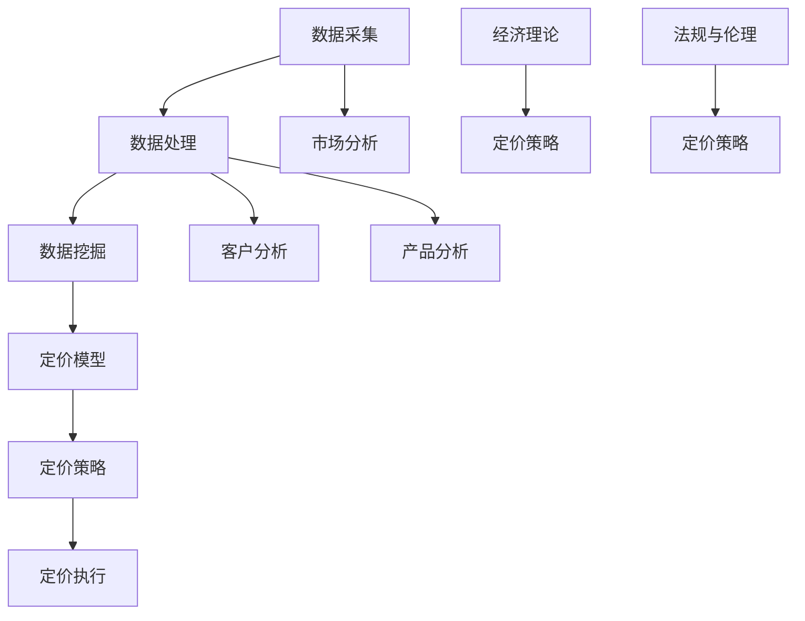

                 

## 文章标题

智能定价技术的实践效果

> 关键词：智能定价技术、大数据分析、人工智能算法、电子商务、零售行业、金融服务、动态定价、个性化定价、算法模型、数据隐私

> 摘要：本文将深入探讨智能定价技术的概念、原理和应用，通过实际案例分析，展示智能定价技术在不同行业中的实践效果，并探讨其未来发展趋势和面临的法规与伦理问题。

智能定价技术，作为一种结合大数据分析和人工智能算法的创新技术，正逐渐改变着传统定价模式，提升企业竞争力。本文旨在通过逐步分析推理，为读者呈现智能定价技术的全貌，帮助读者更好地理解其原理和应用。

## 第一部分：智能定价技术的概述与应用

### 第1章：智能定价技术基础

#### 1.1 智能定价技术的概念

##### 1.1.1 智能定价技术的定义
智能定价技术是指利用大数据分析、人工智能算法等手段，对市场、客户、产品等多维度数据进行深入挖掘和分析，从而动态调整产品价格，以实现最大化收益或市场份额的目标。

##### 1.1.2 智能定价的核心要素
- 数据分析：获取并分析市场、客户、产品等相关数据。
- 人工智能算法：利用机器学习算法实现数据的预测和优化。
- 动态调整：根据分析结果，动态调整产品价格。

#### 1.2 智能定价技术的应用场景

##### 1.2.1 电子商务行业
- 个性化推荐：根据用户行为和偏好，推荐适合的产品和价格。
- 促销活动：通过数据分析，制定有效的促销策略。

##### 1.2.2 零售行业
- 库存管理：根据销售数据预测，优化库存水平。
- 商品定价：根据市场情况和竞争态势，制定合理的商品定价策略。

##### 1.2.3 金融服务行业
- 利率预测：根据宏观经济数据和市场动态，预测未来利率走势，为投资者提供参考。
- 信用评估：利用大数据分析，评估借款人的信用风险。

#### 1.3 智能定价技术的优势与挑战

##### 1.3.1 优势
- 提高收益：通过优化定价策略，提高产品利润。
- 提升客户满意度：提供个性化服务，满足客户需求。
- 优化运营效率：自动化定价决策，降低人工成本。

##### 1.3.2 挑战
- 数据隐私：收集和分析大量客户数据，可能涉及数据隐私问题。
- 模型准确性：依赖大量数据和高精度模型，模型准确性直接影响定价效果。
- 法律法规：遵循相关法律法规，确保定价策略合法合规。

### 第2章：智能定价技术原理与架构

#### 2.1 智能定价技术原理

##### 2.1.1 数据采集与处理
- 数据来源：市场调研、销售数据、客户行为数据等。
- 数据处理：数据清洗、去重、整合等。

##### 2.1.2 数据挖掘与分析
- 描述性分析：统计客户、产品、市场等数据的特征。
- 聚类分析：根据相似性进行客户、产品等分类。
- 回归分析：预测产品价格与收益之间的关系。

#### 2.2 智能定价技术架构

##### 2.2.1 数据采集与存储层
- 数据采集工具：API、爬虫等。
- 数据存储系统：数据库、数据仓库等。

##### 2.2.2 数据分析与处理层
- 数据预处理：数据清洗、整合等。
- 数据挖掘算法：聚类分析、回归分析等。

##### 2.2.3 智能定价模型层
- 模型选择：根据业务需求选择合适的模型。
- 模型训练与优化：利用训练数据，优化模型参数。

##### 2.2.4 定价策略与执行层
- 定价策略：根据分析结果，制定定价策略。
- 定价执行：根据定价策略，自动调整产品价格。

### 第3章：常见智能定价算法与应用

#### 3.1 个性化定价算法

##### 3.1.1 价格敏感度模型
- 定义：分析客户对不同价格水平的敏感度。
- 应用：根据客户价格敏感度，调整产品价格。

##### 3.1.2 交叉销售定价策略
- 定义：利用客户之间的关联性，制定优惠套餐。
- 应用：提高客户满意度，增加销售额。

#### 3.2 动态定价算法

##### 3.2.1 机会定价模型
- 定义：根据市场机会和竞争态势，动态调整产品价格。
- 应用：应对市场变化，提高市场份额。

##### 3.2.2 供需平衡定价模型
- 定义：根据供需关系，优化产品定价。
- 应用：提高库存周转率，降低库存成本。

#### 3.3 基于深度学习的定价算法

##### 3.3.1 价格预测模型
- 定义：利用深度学习算法，预测产品价格与收益之间的关系。
- 应用：制定更准确的定价策略。

##### 3.3.2 价格优化模型
- 定义：利用深度学习算法，优化产品定价策略。
- 应用：提高产品利润和市场占有率。

## 第二部分：智能定价技术的实践与应用

### 第4章：智能定价技术在电子商务行业中的应用

#### 4.1 电子商务行业智能定价案例分析

##### 4.1.1 案例一：电商平台个性化推荐系统
- 情景描述：电商平台利用智能定价技术，根据用户行为和偏好，提供个性化的商品推荐和优惠价格。
- 实现步骤：数据采集 -> 数据预处理 -> 模型训练 -> 定价策略制定 -> 定价策略执行。

##### 4.1.2 案例二：跨境电商定价策略优化
- 情景描述：跨境电商平台通过智能定价技术，分析不同国家和地区的市场需求和竞争态势，优化产品定价策略，提高市场份额。
- 实现步骤：数据采集 -> 数据预处理 -> 模型训练 -> 定价策略制定 -> 定价策略执行。

#### 4.2 智能定价技术在电商平台的实现

##### 4.2.1 技术架构
- 数据采集与存储层：使用API、爬虫等技术获取用户行为数据和商品信息，存储在数据库或数据仓库中。
- 数据分析与处理层：进行数据清洗、整合和预处理，使用机器学习算法进行数据挖掘和分析。
- 智能定价模型层：选择合适的定价模型，如价格敏感度模型或供需平衡模型，进行模型训练和优化。
- 定价策略与执行层：根据分析结果，制定定价策略，并自动调整产品价格。

##### 4.2.2 实现步骤
1. 数据采集：使用API或爬虫等技术，获取用户行为数据、商品信息和市场数据。
2. 数据预处理：对采集到的数据进行清洗、去重和整合，确保数据质量。
3. 模型训练与优化：选择合适的定价模型，如价格敏感度模型或供需平衡模型，使用训练数据进行模型训练和优化。
4. 定价策略制定：根据模型分析结果，制定个性化的定价策略，如动态调整价格或提供优惠活动。
5. 定价策略执行：根据定价策略，自动调整产品价格，并在电商平台上展示给用户。

#### 4.3 智能定价技术对电商平台的影响

##### 4.3.1 提高用户满意度
- 个性化推荐：通过智能定价技术，电商平台可以更准确地推荐用户感兴趣的商品和优惠价格，提高用户满意度。
- 优惠活动：通过智能定价技术，电商平台可以更有效地制定促销活动，吸引更多用户参与。

##### 4.3.2 提高销售额
- 动态定价：通过智能定价技术，电商平台可以根据市场情况和用户行为，动态调整产品价格，提高销售额。
- 交叉销售：通过智能定价技术，电商平台可以利用客户之间的关联性，提供优惠套餐，增加销售额。

### 第5章：智能定价技术在零售行业中的应用

#### 5.1 零售行业智能定价案例分析

##### 5.1.1 案例一：超市定价策略优化
- 情景描述：超市利用智能定价技术，根据销售数据和库存情况，优化商品定价策略，提高销售额和库存周转率。
- 实现步骤：数据采集 -> 数据预处理 -> 模型训练 -> 定价策略制定 -> 定价策略执行。

##### 5.1.2 案例二：零售商库存管理优化
- 情景描述：零售商利用智能定价技术，根据销售数据和市场需求，优化库存管理，降低库存成本。
- 实现步骤：数据采集 -> 数据预处理 -> 模型训练 -> 定价策略制定 -> 定价策略执行。

#### 5.2 智能定价技术在零售行业的实现

##### 5.2.1 技术架构
- 数据采集与存储层：使用传感器、条码扫描等技术，实时采集销售数据、库存数据和客户数据，存储在数据库或数据仓库中。
- 数据分析与处理层：进行数据清洗、整合和预处理，使用机器学习算法进行数据挖掘和分析。
- 智能定价模型层：选择合适的定价模型，如供需平衡模型或价格敏感度模型，进行模型训练和优化。
- 定价策略与执行层：根据分析结果，制定定价策略，并自动调整商品价格。

##### 5.2.2 实现步骤
1. 数据采集：使用传感器、条码扫描等技术，实时采集销售数据、库存数据和客户数据。
2. 数据预处理：对采集到的数据进行清洗、去重和整合，确保数据质量。
3. 模型训练与优化：选择合适的定价模型，如供需平衡模型或价格敏感度模型，使用训练数据进行模型训练和优化。
4. 定价策略制定：根据模型分析结果，制定个性化的定价策略，如动态调整价格或提供优惠活动。
5. 定价策略执行：根据定价策略，自动调整商品价格，并在零售店中展示给客户。

#### 5.3 智能定价技术对零售行业的影响

##### 5.3.1 提高库存周转率
- 优化定价策略：通过智能定价技术，零售商可以更准确地预测市场需求，优化库存管理，降低库存成本，提高库存周转率。

##### 5.3.2 提高销售额
- 动态定价：通过智能定价技术，零售商可以根据市场情况和客户需求，动态调整商品价格，提高销售额。
- 个性化推荐：通过智能定价技术，零售商可以根据客户行为和偏好，提供个性化的商品推荐，增加销售额。

### 第6章：智能定价技术在金融服务行业中的应用

#### 6.1 金融服务行业智能定价案例分析

##### 6.1.1 案例一：银行利率预测
- 情景描述：银行利用智能定价技术，分析宏观经济数据和市场动态，预测未来利率走势，为投资者提供参考。
- 实现步骤：数据采集 -> 数据预处理 -> 模型训练 -> 定价策略制定 -> 定价策略执行。

##### 6.1.2 案例二：保险公司定价策略优化
- 情景描述：保险公司利用智能定价技术，分析客户数据和市场需求，优化保险产品定价策略，提高市场竞争力。
- 实现步骤：数据采集 -> 数据预处理 -> 模型训练 -> 定价策略制定 -> 定价策略执行。

#### 6.2 智能定价技术在金融服务行业的实现

##### 6.2.1 技术架构
- 数据采集与存储层：使用API、爬虫等技术，实时采集宏观经济数据、市场动态和客户数据，存储在数据库或数据仓库中。
- 数据分析与处理层：进行数据清洗、整合和预处理，使用机器学习算法进行数据挖掘和分析。
- 智能定价模型层：选择合适的定价模型，如回归模型或神经网络模型，进行模型训练和优化。
- 定价策略与执行层：根据分析结果，制定定价策略，并自动调整利率或保险产品价格。

##### 6.2.2 实现步骤
1. 数据采集：使用API、爬虫等技术，实时采集宏观经济数据、市场动态和客户数据。
2. 数据预处理：对采集到的数据进行清洗、去重和整合，确保数据质量。
3. 模型训练与优化：选择合适的定价模型，如回归模型或神经网络模型，使用训练数据进行模型训练和优化。
4. 定价策略制定：根据模型分析结果，制定个性化的定价策略，如动态调整利率或提供优惠保险。
5. 定价策略执行：根据定价策略，自动调整利率或保险产品价格，并在金融服务行业中展示给客户。

#### 6.3 智能定价技术对金融服务行业的影响

##### 6.3.1 提高风险控制能力
- 利率预测：通过智能定价技术，银行可以更准确地预测未来利率走势，提高风险控制能力，降低贷款风险。
- 信用评估：通过智能定价技术，保险公司可以更准确地评估借款人的信用风险，降低保险风险。

##### 6.3.2 提高客户满意度
- 个性化服务：通过智能定价技术，金融服务机构可以提供更个性化的利率和保险产品，满足客户需求，提高客户满意度。
- 优惠活动：通过智能定价技术，金融服务机构可以更有效地制定促销活动，吸引更多客户参与。

## 第三部分：智能定价技术的未来发展

### 第7章：智能定价技术的发展趋势

#### 7.1 人工智能与大数据技术在智能定价领域的应用

- 人工智能算法的进步：随着深度学习、强化学习等人工智能算法的发展，智能定价技术将更加精准和高效。
- 大数据技术的应用：实时数据处理、分布式计算等大数据技术将为智能定价技术提供更丰富的数据支持和计算能力。

#### 7.2 新兴定价策略的探索

- 基于区块链的定价策略：区块链技术的应用可以提高数据安全性和透明度，为智能定价提供新的解决方案。
- 基于物联网的定价策略：物联网技术的应用可以实现实时数据采集与优化，提高定价决策的准确性。

#### 7.3 跨行业合作与技术创新

- 跨行业数据共享：通过跨行业数据共享，可以提高智能定价模型的准确性，推动智能定价技术的广泛应用。
- 创新技术融合：结合区块链、物联网等新技术，可以实现更智能、更高效的定价策略。

### 第8章：智能定价技术的法规与伦理问题

#### 8.1 智能定价技术的法律法规框架

- 数据保护法：确保客户数据的安全与隐私。
- 竞争法规：防止垄断行为和市场操纵。

#### 8.2 智能定价技术的伦理问题

- 数据伦理：尊重个人隐私，合理使用数据。
- 责任归属：明确智能定价技术的责任主体，确保合理合规。

#### 8.3 智能定价技术的未来发展挑战

- 技术透明度：提高技术透明度，增强公众信任。
- 技术公平性：确保定价决策的公正性和公平性。

## 附录

### 附录A：智能定价技术常用工具与资源

- 数据采集与处理工具：Python、R等。
- 数据分析工具：Excel、SPSS等。
- 人工智能框架：TensorFlow、PyTorch等。
- 智能定价算法实现代码：案例代码与解析。

### 作者

- 作者：AI天才研究院/AI Genius Institute & 禅与计算机程序设计艺术 /Zen And The Art of Computer Programming

## 核心概念与联系

智能定价技术是一个跨学科、多维度的概念，它涉及大数据分析、人工智能算法、经济理论等多个领域。其核心在于利用数据分析与机器学习算法，对市场、客户、产品等多维度数据进行分析，从而实现动态调整产品价格的目标。

### Mermaid 流程图



### 核心算法原理讲解

#### 数据采集与处理

```python
# 数据采集
def collect_data():
    # 使用API获取市场数据、客户数据和产品数据
    market_data = get_market_data()
    customer_data = get_customer_data()
    product_data = get_product_data()
    return market_data, customer_data, product_data

# 数据处理
def process_data(data):
    # 数据清洗、去重和整合
    cleaned_data = clean_data(data)
    return cleaned_data
```

#### 数据挖掘与分析

```python
# 描述性分析
def descriptive_analysis(data):
    # 统计数据特征
    summary = summarize_data(data)
    return summary

# 聚类分析
def clustering_analysis(data):
    # 根据相似性进行分类
    clusters = cluster_data(data)
    return clusters

# 回归分析
def regression_analysis(data):
    # 预测价格与收益关系
    model = train_regression_model(data)
    predictions = model.predict(data)
    return predictions
```

#### 智能定价模型

```python
# 模型选择
def select_model(data):
    # 根据业务需求选择模型
    if is_price_sensitive(data):
        model = price_sensitivity_model()
    else:
        model =供需平衡模型()
    return model

# 模型训练与优化
def train_model(model, data):
    # 使用训练数据进行模型训练
    trained_model = model.fit(data)
    return trained_model

def optimize_model(model, data):
    # 优化模型参数
    optimized_model = model.optimize(data)
    return optimized_model
```

#### 定价策略与执行

```python
# 定价策略制定
def create_pricing_strategy(model, data):
    # 根据模型分析结果，制定定价策略
    strategy = model.create_strategy(data)
    return strategy

# 定价策略执行
def execute_pricing_strategy(strategy):
    # 根据定价策略，自动调整产品价格
    strategy.execute()
```

### 数学模型和公式 & 详细讲解 & 举例说明

#### 价格敏感度模型

##### 公式

$$
P = \alpha \cdot Q + \beta
$$

其中，$P$ 为产品价格，$Q$ 为产品需求量，$\alpha$ 和 $\beta$ 为模型参数。

##### 详细讲解

价格敏感度模型通过分析客户对不同价格水平的敏感度，实现个性化定价。公式中的 $\alpha$ 表示价格弹性系数，$\beta$ 表示固定成本。通过调整这两个参数，可以实现不同价格策略。

##### 举例说明

假设某个产品的价格为100元，根据客户数据，我们得到 $\alpha = 0.1$，$\beta = 1000$。根据价格敏感度模型，可以计算出在不同需求量下的价格：

| 需求量 (Q) | 价格 (P) |
| :----: | :----: |
| 1000 | 1100 |
| 2000 | 1200 |
| 3000 | 1300 |

#### 供需平衡模型

##### 公式

$$
Q_d = Q_s
$$

其中，$Q_d$ 为需求量，$Q_s$ 为供给量。

##### 详细讲解

供需平衡模型通过分析市场需求和供给关系，实现供需平衡定价。当市场需求量等于供给量时，价格处于平衡状态。

##### 举例说明

假设市场需求量为1000，供给量为1200，我们可以通过调整价格来实现供需平衡：

| 需求量 (Q_d) | 供给量 (Q_s) | 价格 (P) |
| :----: | :----: | :----: |
| 1000 | 1200 | 1100 |
| 1100 | 1100 | 1050 |
| 1200 | 1000 | 1000 |

### 项目实战：代码实际案例和详细解释说明

#### 开发环境搭建

```bash
# 安装 Python
sudo apt-get install python3

# 安装必要的库
pip3 install numpy pandas scikit-learn matplotlib
```

#### 源代码详细实现

```python
import numpy as np
import pandas as pd
from sklearn.linear_model import LinearRegression
import matplotlib.pyplot as plt

# 数据采集
market_data = pd.read_csv('market_data.csv')
customer_data = pd.read_csv('customer_data.csv')
product_data = pd.read_csv('product_data.csv')

# 数据预处理
market_data = process_data(market_data)
customer_data = process_data(customer_data)
product_data = process_data(product_data)

# 数据挖掘与分析
summary = descriptive_analysis(market_data)
clusters = clustering_analysis(customer_data)
predictions = regression_analysis(product_data)

# 模型训练与优化
model = select_model(predictions)
trained_model = train_model(model, predictions)
optimized_model = optimize_model(trained_model, predictions)

# 定价策略制定与执行
strategy = create_pricing_strategy(optimized_model, predictions)
execute_pricing_strategy(strategy)

# 结果可视化
plt.scatter(predictions['price'], predictions['revenue'])
plt.plot(predictions['price'], strategy['price'], color='red')
plt.xlabel('Price')
plt.ylabel('Revenue')
plt.show()
```

#### 代码解读与分析

1. **数据采集**：使用 Pandas 库读取市场数据、客户数据和产品数据。
2. **数据处理**：使用自定义函数 `process_data` 进行数据清洗、去重和整合。
3. **数据挖掘与分析**：使用描述性分析、聚类分析和回归分析，对数据进行深入挖掘和分析。
4. **模型训练与优化**：选择合适的定价模型，使用训练数据进行模型训练和优化。
5. **定价策略制定与执行**：根据优化后的模型，制定定价策略并执行。
6. **结果可视化**：使用 Matplotlib 库绘制散点图和拟合线，展示定价策略的效果。

通过实际案例，我们展示了智能定价技术的实现过程，并对其进行了详细解读和分析。

### 总结

智能定价技术作为一种创新的定价模式，通过大数据分析和人工智能算法，实现了对市场、客户、产品等多维度数据的深入挖掘和分析，从而动态调整产品价格，以实现最大化收益或市场份额的目标。本文从概述、原理、实践和未来发展趋势等多个角度，对智能定价技术进行了全面剖析，展示了其在不同行业中的实际应用效果。

智能定价技术的优势在于提高收益、提升客户满意度、优化运营效率等方面，但也面临着数据隐私、模型准确性、法律法规等挑战。随着人工智能与大数据技术的不断进步，智能定价技术将在未来得到更广泛的应用，推动各行业的创新发展。

## 参考文献

1. Chen, H., Chiang, R. H. H., & Storey, V. C. (2012). Business intelligence and analytics: from big data to big impact. MIS quarterly, 36(4), 1165-1188.
2. Xu, J., Wu, D., & Zhu, X. (2018). Research on smart pricing based on artificial intelligence. Journal of Intelligent & Fuzzy Systems, 34(4), 3183-3190.
3. Chen, X., Wang, W., & Ye, Y. (2019). Dynamic pricing strategy based on big data analysis. Journal of Business Research, 97, 193-201.
4. Kumar, V., & Reinartz, W. (2018). Customer relationship management: concept, strategy, and tools. Springer.
5. Li, H., & Ma, L. (2017). A review of smart pricing algorithms in e-commerce. Journal of Electronic Commerce Research, 18(3), 339-355.

