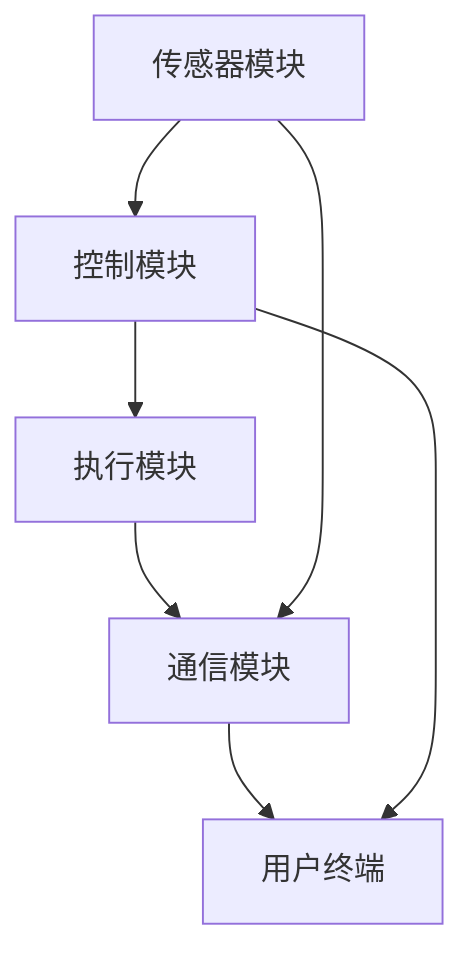

                 

## 文章标题：全屋空气质量管理：智能家居空气净化创业全攻略

### 关键词：智能家居，空气净化，创业，全屋空气质量管理，技术原理，市场策略

> 摘要：本文将全面探讨智能家居空气净化创业的各个方面，从行业背景、技术原理、创业策略到市场推广，为创业者提供一份全面、深入的创业指南。通过逻辑清晰、结构紧凑的篇章布局，帮助读者逐步了解并掌握智能家居空气净化创业的核心要点。

### 第一部分：智能家居空气净化创业概述

#### 第1章：智能家居行业背景与发展趋势

##### 1.1.1 智能家居的定义与分类

智能家居是指通过物联网技术，将家庭中的各种设备和系统互联互通，实现远程控制和智能管理的居住环境。根据功能分类，智能家居可以分为安全安防类、家居控制类、生活便利类和娱乐休闲类。根据技术分类，智能家居可以分为网络通信类和控制系统类。

##### 1.1.2 智能家居行业的发展历程

智能家居行业经历了从1.0时代的单一设备自动化控制，到2.0时代的设备互联与远程控制，再到3.0时代的智能化和大数据分析应用的三个阶段。

##### 1.2.1 空气质量管理的现状与挑战

空气质量管理的现状是城市空气污染问题日益严重，人们对健康和生活质量的要求不断提高。然而，空气质量管理面临着治理难度大、技术发展不平衡等挑战。

##### 1.2.2 智能家居空气净化技术的应用

智能家居空气净化技术的应用主要体现在空气净化器的种类与工作原理，以及智能传感技术在空气净化中的应用。

### 第一部分：智能家居空气净化创业策略

#### 第2章：智能家居空气净化创业策略

##### 2.1.1 行业市场规模与增长趋势

智能家居空气净化行业市场规模逐年扩大，预计未来将继续保持高速增长。市场增长趋势主要体现在智能家居市场渗透率的提高和空气污染问题的日益严重。

##### 2.1.2 市场竞争态势与主要玩家

市场竞争激烈，主要玩家包括国际巨头如霍尼韦尔、飞利浦，以及国内知名企业如小米、华为等。

##### 2.2.1 市场定位与目标客户

市场定位应根据细分市场如收入水平、应用场景和产品特点，明确目标客户群体。

### 第二部分：全屋空气质量管理技术

#### 第3章：全屋空气净化技术原理

##### 3.1.1 空气净化技术的基本原理与分类

空气净化技术的基本原理包括过滤、吸附和分解。空气净化技术可分为物理净化技术、化学净化技术和生物净化技术。

##### 3.2.1 智能传感器技术在空气净化中的应用

智能传感器技术用于实时监测室内空气质量，为空气净化系统提供数据支持。

##### 3.3.1 空气净化算法与控制策略

空气净化算法包括空气质量预测算法和控制算法。控制策略有定时控制、传感器控制和自适应控制。

### 第三部分：智能家居空气净化创业实战

#### 第4章：创业项目规划与执行

##### 4.1.1 项目目标与规划

创业项目目标应明确，规划应包括时间、人员、资金等方面的安排。

##### 4.1.2 项目资源与预算

项目资源包括资金、设备、人力资源等，预算管理应确保项目在预算范围内完成。

#### 第5章：创业项目的市场推广与营销

##### 5.1.1 市场调研与定位

市场调研应包括定量和定性调研，市场定位应根据市场需求和竞争状况明确。

##### 5.1.2 营销策略与实施

营销策略包括产品策略、价格策略、渠道策略和推广策略。

### 第四部分：全屋空气质量管理案例分析

#### 第6章：案例研究与分析

##### 6.1.1 案例选择与介绍

案例选择应具备代表性和创新性，案例介绍应包括公司背景、主营业务等信息。

##### 6.2.1 案例的成功因素与挑战与解决方案

分析案例的成功因素、面临的挑战及解决方案，为创业者提供启示。

### 附录

#### 附录A：智能家居空气净化创业资源与工具

##### A.1.1 市场研究报告与行业数据

市场研究报告和行业数据是创业的重要参考。

##### A.2.1 硬件开发工具与软件开发工具

硬件开发工具和软件开发工具是创业项目的基础。

##### A.2.2 营销推广工具

营销推广工具是提高品牌知名度和市场占有率的重要手段。

---

### 第一部分：智能家居空气净化创业概述

#### 第1章：智能家居行业背景与发展趋势

##### 1.1.1 智能家居的定义与分类

智能家居，这个概念在科技飞速发展的今天，已经不再陌生。它指的是利用物联网技术，将家庭中的各种设备、系统和应用进行互联互通，实现远程控制与智能管理的一种居住环境。具体来说，智能家居包括但不限于以下几类：

- **安全安防类**：如智能门锁、智能摄像头、烟雾报警器等，用于提高家庭的安全性和监控能力。
- **家居控制类**：如智能灯光、智能窗帘、智能空调等，通过远程控制或自动调节，提升家居生活的便利性和舒适度。
- **生活便利类**：如智能冰箱、智能洗衣机、智能厨电等，这些设备能够实现自动化管理和远程控制，简化家务劳动。
- **娱乐休闲类**：如智能电视、智能音响、智能游戏设备等，为家庭娱乐生活带来全新的体验。

从技术分类来看，智能家居可以分为网络通信类和控制系统类。网络通信类包括Wi-Fi、蓝牙、Zigbee等无线通信技术，这些技术使得家庭设备能够互联互通。而控制系统类则包括PLC（可编程逻辑控制器）、RTOS（实时操作系统）等，它们是智能家居设备的“大脑”，负责处理和执行各种指令。

##### 1.1.2 智能家居行业的发展历程

智能家居行业的发展可以概括为以下几个阶段：

- **1.0时代**：这是智能家居的起步阶段，主要特点是单一设备的自动化控制。比如早期的自动门、电子锁等。
- **2.0时代**：随着物联网技术的发展，设备互联与远程控制开始普及。这一阶段的代表性产品包括智能插座、智能灯泡等，它们可以通过智能手机或语音助手进行控制。
- **3.0时代**：这一阶段的智能家居开始实现智能化和大数据分析应用。智能音箱、智能冰箱等设备不仅能够进行基本的控制，还能够根据用户习惯和数据分析，提供个性化的服务和建议。

##### 1.2 空气质量管理的重要性

空气质量管理的现状不容乐观。近年来，城市空气污染问题日益严重，尤其是PM2.5、PM10、二氧化氮等有害物质的浓度不断攀升。这些污染物对人体健康的危害极大，尤其是对呼吸系统和心血管系统的影响。长期处于空气污染环境中，容易引发哮喘、支气管炎、心脏病等疾病。

因此，空气质量管理显得尤为重要。空气质量管理不仅关系到人们的身体健康，也是提高生活质量和环境舒适度的重要手段。目前，空气质量管理面临以下挑战：

- **治理难度大**：空气污染源复杂，包括工业排放、汽车尾气、建筑扬尘等，治理难度大。
- **技术发展不平衡**：尽管空气净化技术不断进步，但不同地区、不同家庭的应用情况存在很大差异，技术发展不平衡。

##### 1.3 智能家居空气净化技术的应用

智能家居空气净化技术的应用主要体现在以下几个方面：

- **空气净化器的种类与工作原理**：目前市场上常见的空气净化器主要有以下几种类型：
  - **活性炭空气净化器**：利用活性炭吸附空气中的有害物质，如甲醛、苯等。
  - **负氧离子空气净化器**：通过释放负氧离子，中和空气中的有害物质。
  - **HEPA滤网空气净化器**：通过HEPA滤网过滤空气中的微小颗粒物，如PM2.5。

不同类型的空气净化器具有不同的工作原理，但核心目标都是改善室内空气质量。

- **智能传感技术在空气净化中的应用**：智能传感器技术在空气净化中的应用主要体现在空气质量监测和控制方面。例如：
  - **空气质量传感器**：用于实时监测室内空气质量，包括PM2.5、PM10、温度、湿度等参数。
  - **温湿度传感器**：用于监测室内温度和湿度，为空气净化器提供数据支持。

智能传感器技术的应用，使得空气净化器能够更加智能地工作，根据实时监测数据自动调整运行状态，提高空气净化效果。

##### 1.4 AI在智能家居空气净化创业中的应用前景

人工智能（AI）在智能家居空气净化领域的应用前景非常广阔。以下是AI在智能家居空气净化中的潜在应用领域：

- **空气质量预测**：利用AI技术，根据历史数据和实时监测数据，预测未来一段时间内室内空气质量的变化趋势。这样，空气净化器可以提前采取措施，防止空气质量恶化。

- **智能控制**：通过AI技术，实现空气净化器的自动化控制和优化运行。例如，根据室内空气质量数据和用户生活习惯，自动调整空气净化器的运行模式和频率，提高空气净化效果。

- **健康监测**：利用AI技术，对室内空气污染物进行深度分析，为用户提供健康建议。例如，当检测到室内甲醛浓度较高时，系统可以提醒用户注意通风，或建议更换空气净化器的滤网。

AI技术在智能家居空气净化领域的应用，不仅可以提升产品的智能化程度，还可以提高用户体验，增强产品竞争力。

##### 1.4.1 智能家居空气净化创业的优势

智能家居空气净化创业具有以下几个优势：

- **市场需求**：随着人们对健康和生活质量的要求提高，智能家居空气净化产品越来越受到消费者的青睐。尤其是在空气污染问题严重的地区，市场需求巨大。

- **技术创新**：AI技术的快速发展为智能家居空气净化创业提供了新的机遇。通过AI技术，可以提升产品的智能化水平，提供更个性化的服务。

- **跨界合作**：智能家居空气净化创业可以与物联网、大数据等产业实现跨界合作，共同开发新产品，拓展市场空间。

##### 1.4.2 智能家居空气净化创业的挑战与机遇

智能家居空气净化创业面临以下挑战：

- **技术门槛高**：AI技术在智能家居空气净化领域的应用仍需进一步突破，创业者需要具备较高的技术能力和研发投入。

- **市场竞争激烈**：随着智能家居市场的快速发展，竞争日益激烈，创业者需要找到差异化竞争策略，提高市场竞争力。

然而，同时也存在以下机遇：

- **政策支持**：政府对空气质量管理的重视为智能家居空气净化创业提供了政策支持。

- **用户需求**：随着人们环保意识的提高，智能家居空气净化产品将得到更广泛的应用。

### 第一部分：智能家居空气净化创业概述

#### 第2章：智能家居空气净化创业策略

##### 2.1 创业者需了解的市场环境

创业者进入智能家居空气净化行业前，需要充分了解市场环境，包括市场规模、增长趋势、竞争态势以及主要玩家等。这些信息将帮助创业者制定正确的市场定位和战略规划。

###### 2.1.1 行业市场规模与增长趋势

智能家居空气净化行业的市场规模逐年扩大。根据市场研究报告，全球智能家居空气净化市场规模预计将在未来几年内保持高速增长。尤其是在空气质量问题严重的城市地区，消费者对空气净化产品的需求日益增加。以下是行业市场规模与增长趋势的几个关键点：

- **市场规模**：全球智能家居空气净化市场规模已超过数十亿美元，并且仍在不断扩大。
- **增长趋势**：预计未来几年，全球智能家居空气净化市场的年复合增长率将达到两位数。
- **消费升级**：随着消费者对生活质量和健康的重视，高端和个性化空气净化产品市场需求增长较快。

###### 2.1.2 市场竞争态势与主要玩家

智能家居空气净化市场竞争激烈，主要玩家包括国际知名品牌和国内新兴企业。以下是市场竞争态势和主要玩家的几个关键点：

- **市场竞争**：市场上存在大量的空气净化产品，品牌之间的竞争主要集中在技术、性能和价格等方面。
- **主要玩家**：
  - **国际品牌**：如霍尼韦尔、飞利浦、三星等，这些品牌在技术研发和品牌知名度方面具有明显优势。
  - **国内企业**：如小米、华为、352等，这些企业通过技术创新和性价比优势在市场上占据了一席之地。

###### 2.1.3 市场需求与趋势分析

市场需求的增长趋势和用户需求的变化是创业者需要关注的重要方面。以下是市场需求和趋势分析的几个关键点：

- **市场需求**：消费者对空气净化产品的需求主要受到空气污染问题的影响。随着城市化进程的加快和环境污染的加剧，人们对空气净化产品的需求持续增长。
- **趋势分析**：
  - **智能化**：消费者对智能家居产品的智能化程度要求越来越高，智能传感器、智能控制等技术在空气净化产品中的应用越来越广泛。
  - **个性化**：消费者对空气净化产品的个性化需求日益增强，如定制化服务、智能健康监测等功能受到青睐。

##### 2.2 创业模式与盈利模式

在智能家居空气净化创业中，选择合适的创业模式至关重要。以下是几种常见的创业模式及其特点：

###### 2.2.1 产品导向型创业模式

产品导向型创业模式以技术创新和产品品质为核心，通过推出具有独特卖点的产品来赢得市场。以下是该模式的特点：

- **特点**：
  - **以产品为核心**：通过研发具有创新性和竞争力的产品，满足消费者需求。
  - **高品质**：注重产品质量和用户体验，提高品牌形象。
- **优势**：
  - **技术门槛高**：有利于保护市场份额。
  - **品牌建设容易**：通过高品质产品赢得消费者信任。
- **挑战**：
  - **市场竞争激烈**：产品同质化严重，创新难度大。
  - **研发成本高**：持续的技术研发需要大量资金投入。

###### 2.2.2 服务导向型创业模式

服务导向型创业模式以提供优质服务为核心，通过售后服务和增值服务来增加客户黏性。以下是该模式的特点：

- **特点**：
  - **以服务为核心**：提供优质的售后服务，增加用户满意度。
  - **增值服务**：通过增值服务如定期维护、故障排查等，增加收入。
- **优势**：
  - **客户黏性强**：优质服务能够提高客户忠诚度。
  - **盈利模式多样**：除了产品销售外，还能通过服务收费获取额外收益。
- **挑战**：
  - **服务质量要求高**：需要建立完善的服务体系，运营成本高。
  - **服务标准化难**：不同客户的需求不同，服务标准化难度大。

###### 2.2.3 平台导向型创业模式

平台导向型创业模式以构建生态系统为核心，通过吸引各类企业和消费者参与，形成规模效应。以下是该模式的特点：

- **特点**：
  - **以平台为核心**：构建智能家居空气净化平台，实现设备互联和数据共享。
  - **跨界合作**：与其他企业合作，拓展业务范围。
- **优势**：
  - **市场空间大**：可以通过跨界合作，拓展市场空间。
  - **盈利模式多样**：通过平台收费、广告、增值服务等获取收益。
- **挑战**：
  - **资源整合难度大**：需要强大的资源整合能力。
  - **合作关系复杂**：处理复杂的合作关系和利益分配问题。

##### 2.3 市场定位与目标客户

市场定位和目标客户选择是创业成功的关键。以下是市场定位与目标客户选择的几个关键点：

###### 2.3.1 市场细分与目标客户选择

- **市场细分**：
  - **按收入水平**：高端市场、中端市场和低端市场。
  - **按应用场景**：家庭市场、商业市场和工业市场。
  - **按产品特点**：智能型、普通型和专业型。

- **目标客户选择**：
  - **高端市场**：注重品质和服务的消费者。
  - **中端市场**：追求性价比的消费者。
  - **低端市场**：注重实用性的消费者。

##### 2.4 产品差异化策略

产品差异化策略是提升市场竞争力的关键。以下是产品差异化策略的几个关键点：

###### 2.4.1 技术差异化

- **创新技术**：研发具有自主知识产权的核心技术，提高产品竞争力。
- **技术融合**：将AI技术、物联网技术等融合到产品中，提供智能化解决方案。

###### 2.4.2 设计差异化

- **外观设计**：注重产品外观的美观与实用性，提高品牌形象。
- **用户体验**：优化产品设计，提高用户使用体验。

###### 2.4.3 服务差异化

- **售后服务**：提供优质的售后服务，增加用户满意度。
- **定制服务**：根据客户需求提供个性化的产品和服务。

##### 2.5 品牌建设与推广策略

品牌建设与推广策略是提高品牌知名度和市场占有率的重要手段。以下是品牌建设与推广策略的几个关键点：

###### 2.5.1 品牌定位

- **高端品牌**：定位为高品质、高服务的智能家居空气净化品牌。
- **中端品牌**：定位为性价比高、品质稳定的智能家居空气净化品牌。

###### 2.5.2 品牌推广

- **线上推广**：利用社交媒体、搜索引擎等网络渠道进行品牌推广。
- **线下推广**：参加行业展会、开展产品体验活动等。

- **内容营销**：发布专业文章、案例分享等内容，提升品牌专业形象。

##### 2.6 营销渠道建设

营销渠道建设是产品销售的重要环节。以下是营销渠道建设的几个关键点：

###### 2.6.1 线上渠道

- **电商平台**：利用淘宝、京东等电商平台进行产品销售。
- **自建商城**：建立自己的官方网站或APP，提供在线购物服务。

###### 2.6.2 线下渠道

- **实体店**：开设线下实体店，提供产品展示和售后服务。
- **分销渠道**：与代理商、经销商等建立合作关系，拓展市场。

##### 2.7 创业团队建设与管理

创业团队建设与管理是创业成功的重要保障。以下是创业团队建设与管理的几个关键点：

###### 2.7.1 团队建设

- **核心团队**：建立由技术、市场、销售等核心人员组成的团队。
- **人才引进**：吸引行业内有经验的人才加入团队，提升整体竞争力。

###### 2.7.2 管理策略

- **目标管理**：明确团队目标，制定详细的实施计划。
- **绩效管理**：建立科学的绩效考核体系，激励团队成员。

##### 2.8 融资策略与资金管理

融资策略与资金管理是创业过程中必不可少的环节。以下是融资策略与资金管理的几个关键点：

###### 2.8.1 融资策略

- **天使投资**：寻找天使投资人进行早期融资。
- **风险投资**：寻求风险投资机构的支持。
- **银行贷款**：通过银行贷款获取资金支持。

###### 2.8.2 资金管理

- **预算管理**：制定详细的预算计划，合理分配资金。
- **成本控制**：加强成本控制，提高资金利用效率。

### 第二部分：全屋空气质量管理技术

#### 第3章：全屋空气净化技术原理

##### 3.1 空气净化技术概述

空气污染是一个全球性的问题，特别是在城市地区，空气中的污染物如PM2.5、甲醛、苯等对人体健康造成了严重的威胁。为了改善室内空气质量，人们开始关注空气净化技术。全屋空气净化技术旨在通过多种方式全面净化室内空气，提供一个健康的居住环境。

##### 3.1.1 空气净化技术的基本原理

空气净化技术的基本原理可以分为三大类：物理净化、化学净化和生物净化。

- **物理净化**：物理净化是通过物理手段去除空气中的污染物。常见的物理净化方法有：
  - **过滤**：通过滤网或滤纸过滤空气中的颗粒物，如PM2.5。
  - **静电吸附**：利用静电吸附空气中的颗粒物和微小污染物。
  - **冷凝**：通过降低空气温度，使空气中的水蒸气和污染物凝结成液滴，然后通过滤网过滤。

- **化学净化**：化学净化是通过化学反应去除空气中的污染物。常见的化学净化方法有：
  - **氧化**：通过氧化反应分解空气中的有害气体，如甲醛、苯等。
  - **吸附**：利用活性炭等吸附材料吸附空气中的有害物质。

- **生物净化**：生物净化是通过生物手段去除空气中的污染物。常见的生物净化方法有：
  - **植物净化**：通过植物吸收和分解空气中的有害物质。
  - **生物酶**：利用生物酶分解空气中的有害气体。

##### 3.1.2 空气净化技术的分类

根据净化技术的不同，空气净化技术可以分为以下几类：

- **过滤式空气净化器**：通过滤网过滤空气中的颗粒物，如PM2.5、PM10等。
- **吸附式空气净化器**：通过吸附材料吸附空气中的有害气体，如甲醛、苯等。
- **离子式空气净化器**：通过释放离子中和空气中的污染物。
- **臭氧空气净化器**：通过释放臭氧分解空气中的有害物质。
- **光催化空气净化器**：通过光催化反应分解空气中的污染物。
- **复合式空气净化器**：结合多种净化技术，提供更全面的空气净化效果。

##### 3.2 智能传感器技术

智能传感器技术在空气净化中的应用非常广泛，可以实时监测室内空气质量，为空气净化系统提供数据支持。以下是几种常见的智能传感器：

- **空气质量传感器**：用于检测空气中的PM2.5、PM10、温度、湿度等参数。
- **甲醛传感器**：用于检测空气中的甲醛浓度。
- **二氧化碳传感器**：用于检测空气中的二氧化碳浓度。
- **温湿度传感器**：用于监测室内的温度和湿度。

智能传感器技术的应用使得空气净化系统可以更加智能地工作，根据实时监测的数据自动调整净化模式，提高净化效果。

##### 3.3 空气净化算法与控制策略

空气净化算法是空气净化系统中的核心组成部分，用于处理传感器数据，并根据数据自动调整空气净化系统的运行状态。以下是几种常见的空气净化算法：

- **空气质量预测算法**：利用历史数据和实时监测数据，预测未来一段时间内室内空气质量的变化趋势。
- **控制算法**：根据空气质量预测结果和实际空气质量数据，自动调整空气净化器的运行模式和频率。
- **自适应控制算法**：根据室内环境和用户需求，自动调整空气净化系统的运行参数，实现个性化净化。

控制策略包括：

- **定时控制**：根据设定的时间自动开启或关闭空气净化系统。
- **传感器控制**：根据空气质量传感器的数据自动调整空气净化系统的运行状态。
- **自适应控制**：根据室内环境和用户需求，自动调整空气净化系统的运行参数。

##### 3.4 全屋空气净化系统的架构设计

全屋空气净化系统通常由多个模块组成，包括传感器模块、控制模块、执行模块和通信模块。以下是各模块的功能和设计要点：

- **传感器模块**：负责实时监测室内空气质量，包括PM2.5、PM10、温度、湿度、甲醛等参数。
- **控制模块**：负责处理传感器数据，并根据数据自动调整空气净化系统的运行状态。
- **执行模块**：包括空气净化器、风扇、电机等，负责实际执行空气净化操作。
- **通信模块**：负责系统内部和外部设备的通信，通常采用Wi-Fi、蓝牙、Zigbee等无线通信技术。

在架构设计时，需要考虑系统的模块化设计、高可靠性和易扩展性。例如，可以通过云计算平台实现远程监控和控制，提高系统的智能化程度。

##### 3.5 全屋空气净化系统的实现与优化

全屋空气净化系统的实现涉及硬件设计、软件开发和系统集成等多个方面。以下是实现和优化全屋空气净化系统的几个关键点：

- **硬件设计**：选择适合的传感器、控制器、执行器和通信模块，确保系统的稳定性和可靠性。
- **软件开发**：开发空气净化算法和控制策略，实现系统的智能化功能。
- **系统集成**：将各模块集成到系统中，实现系统的整体运行。

在优化方面，可以通过以下方法提高空气净化效果：

- **数据驱动优化**：根据实时监测的数据，动态调整空气净化系统的运行参数。
- **智能预测**：利用人工智能技术，预测空气质量的变化趋势，提前采取措施。
- **多设备联动**：通过智能家居控制系统，实现多个空气净化设备的联动，提高净化效果。

### 第二部分：全屋空气质量管理技术

#### 第4章：全屋空气净化系统设计与实现

##### 4.1 全屋空气净化系统的架构

全屋空气净化系统的架构设计是确保系统稳定、高效运行的关键。一个典型的全屋空气净化系统通常包括以下几个模块：

- **传感器模块**：负责实时监测室内空气质量，包括PM2.5、PM10、温度、湿度、甲醛等参数。
- **控制模块**：负责处理传感器数据，并根据数据自动调整空气净化系统的运行状态。
- **执行模块**：包括空气净化器、风扇、电机等，负责实际执行空气净化操作。
- **通信模块**：负责系统内部和外部设备的通信，通常采用Wi-Fi、蓝牙、Zigbee等无线通信技术。

以下是一个简化的全屋空气净化系统架构图：

**架构设计的原则**：

- **模块化设计**：将系统划分为多个功能模块，每个模块独立实现，便于维护和升级。
- **高可靠性**：确保系统稳定运行，减少故障发生。
- **易扩展性**：支持系统功能的扩展和升级。

**系统模块划分与功能描述**：

- **传感器模块**：该模块由多个传感器组成，如PM2.5传感器、甲醛传感器、温度传感器和湿度传感器。这些传感器通过Wi-Fi或蓝牙将监测数据实时发送到控制模块。

- **控制模块**：该模块负责处理传感器数据，并根据数据自动调整空气净化器的运行状态。控制模块通常采用嵌入式系统，具有数据处理能力和通信功能。

- **执行模块**：该模块包括空气净化器、风扇和电机等执行设备。这些设备根据控制模块的指令进行工作，如启动、停止、调节风速等。

- **通信模块**：该模块负责系统内部和外部设备的通信，如用户终端、手机APP、云端服务器等。通信模块通常采用Wi-Fi或蓝牙技术，实现数据的实时传输和远程控制。

##### 4.2 系统硬件设计

系统硬件设计是全屋空气净化系统实现的基础。以下是硬件设备选择与集成、系统硬件的可靠性设计等方面的详细内容。

**硬件设备选择与集成**：

- **传感器模块**：选择高精度、稳定性的传感器，如空气质量传感器、温湿度传感器等。这些传感器需要具备较强的抗干扰能力和长时间工作的稳定性。
- **控制模块**：选择性能稳定、具有丰富接口和扩展能力的嵌入式控制器，如Arduino、Raspberry Pi等。控制模块需要具备实时处理传感器数据和执行控制指令的能力。
- **执行模块**：选择适合的电机、风扇、空气净化器等执行设备。这些设备需要具备高效、稳定的运行性能，以实现预期的空气净化效果。
- **通信模块**：选择适合的无线通信模块，如Wi-Fi、蓝牙等。通信模块需要具备高带宽、低延迟的特点，以确保数据的实时传输和远程控制。

**系统硬件的可靠性设计**：

- **电源设计**：确保系统硬件设备有稳定的电源供应。可以采用不间断电源（UPS）或备用电源，防止突然断电对系统造成影响。
- **防护设计**：对传感器、控制器等关键部件进行防护，防止损坏。可以采用防尘、防水、抗干扰等防护措施，提高系统的可靠性。
- **冗余设计**：在关键设备上采用冗余设计，如双电源、双通信模块等。当某个设备出现故障时，备用设备可以立即接管，确保系统的连续运行。

##### 4.3 系统软件设计

系统软件设计是全屋空气净化系统的核心部分。以下是软件开发环境与工具、软件架构设计与方法等方面的详细内容。

**软件开发环境与工具**：

- **开发环境**：选择适合的集成开发环境（IDE），如Eclipse、Visual Studio等。这些IDE提供了丰富的开发工具和插件，方便进行软件开发。
- **编程语言**：选择适合的编程语言，如C、Python等。这些编程语言具有较好的性能和丰富的库函数，适用于嵌入式系统和人工智能应用。
- **开发工具**：选择适合的开发工具，如仿真器、调试器等。这些工具可以帮助开发者快速搭建开发环境，提高开发效率。

**软件架构设计与方法**：

- **分层架构**：采用分层架构设计，将系统划分为多个层次，如表示层、业务逻辑层、数据访问层等。这种架构设计便于模块化和维护。
- **模块化设计**：将系统功能划分为多个模块，每个模块独立实现，便于开发、测试和维护。常见的模块有传感器数据处理模块、控制算法模块、用户界面模块等。
- **事件驱动设计**：采用事件驱动设计方法，将系统的各个功能模块连接起来，实现系统的实时控制和响应。这种设计方法可以提高系统的响应速度和可靠性。

##### 4.4 系统集成与测试

系统集成与测试是确保全屋空气净化系统能够正常运行的关键步骤。以下是系统集成与测试的详细内容。

**系统集成**：

- **硬件集成**：将各个硬件模块（传感器、控制模块、执行模块等）连接到一起，确保硬件之间的通信正常。
- **软件集成**：将各个软件模块（控制算法、用户界面等）集成到系统中，确保软件之间的交互正常。
- **数据集成**：将传感器数据、控制指令等集成到系统中，确保数据的实时传输和处理。

**系统测试**：

- **功能测试**：测试系统各个功能模块的功能是否正常，如传感器数据采集、控制算法执行、执行模块响应等。
- **性能测试**：测试系统在特定负载下的性能表现，如数据处理速度、通信延迟等。
- **稳定性测试**：测试系统在长时间运行下的稳定性，如是否出现崩溃、死机等现象。
- **用户测试**：邀请实际用户参与测试，收集用户反馈，优化系统功能和用户体验。

通过系统集成与测试，确保全屋空气净化系统稳定、高效地运行。

### 第三部分：智能家居空气净化创业实战

#### 第5章：创业项目规划与执行

##### 5.1 创业项目的规划

创业项目的规划是确保项目成功的关键步骤。一个好的项目规划需要明确项目目标、制定详细的项目计划，并合理分配资源。

###### 5.1.1 项目目标

项目目标应明确、具体、可衡量。对于智能家居空气净化创业项目，可以设定以下目标：

- **市场份额**：在一年内占据一定比例的市场份额。
- **产品销量**：在一年内实现多少台空气净化器的销售。
- **品牌知名度**：通过广告宣传和市场活动，提升品牌知名度。

###### 5.1.2 项目规划

项目规划包括时间、人员、资金等方面的安排。以下是项目规划的具体步骤：

1. **市场调研**：了解目标市场的需求、竞争对手和行业趋势。
2. **技术调研**：评估空气净化技术的研究和发展趋势，确定技术路线。
3. **团队组建**：组建由技术、市场、销售、运营等人员组成的团队。
4. **资金筹集**：制定融资计划，筹集创业资金。
5. **产品开发**：根据市场需求和技术方案，开展产品开发。
6. **市场推广**：制定市场推广策略，开展市场活动。
7. **销售渠道**：搭建销售渠道，包括线上和线下渠道。

##### 5.2 创业项目的执行

创业项目的执行是项目规划的具体实施过程。以下是创业项目执行的关键步骤：

###### 5.2.1 项目团队组建与管理

项目团队组建与管理是确保项目顺利执行的重要环节。以下是团队组建与管理的具体步骤：

1. **确定团队成员**：根据项目需求，确定团队成员，包括项目经理、技术负责人、市场营销人员等。
2. **明确职责分工**：明确团队成员的职责和分工，确保团队协作高效。
3. **团队培训**：对团队成员进行相关培训，提升团队整体能力。
4. **团队管理**：建立有效的团队管理制度，如目标管理、绩效评估等。

###### 5.2.2 项目进度与风险管理

项目进度与风险管理是确保项目按时完成的重要环节。以下是项目进度与风险管理的具体步骤：

1. **制定进度计划**：根据项目目标和任务，制定详细的进度计划，明确每个阶段的任务和完成时间。
2. **进度监控**：定期检查项目进度，确保项目按计划进行。
3. **风险管理**：识别项目风险，制定风险应对策略，如风险规避、风险转移等。

##### 5.3 创业项目的评估与调整

创业项目的评估与调整是确保项目成功的重要环节。以下是创业项目评估与调整的具体步骤：

###### 5.3.1 项目评估

项目评估包括财务评估、市场评估和用户满意度评估等方面。以下是项目评估的具体步骤：

1. **财务评估**：分析项目的盈利能力和投资回报率。
2. **市场评估**：评估项目的市场表现和用户需求。
3. **用户满意度评估**：收集用户反馈，评估用户满意度。

###### 5.3.2 项目调整

根据项目评估的结果，对项目进行必要的调整。以下是项目调整的具体步骤：

1. **产品调整**：根据用户反馈和市场需求，对产品进行改进和优化。
2. **战略调整**：根据市场评估结果，调整项目战略方向和策略。
3. **团队调整**：根据项目需求，对团队进行重组和优化。

### 第三部分：智能家居空气净化创业实战

#### 第6章：创业项目的市场推广与营销

##### 6.1 市场调研与定位

市场调研与定位是创业项目成功的关键。通过市场调研，可以了解目标市场的需求、竞争状况和用户行为，从而制定有效的市场定位策略。

###### 6.1.1 市场调研的方法与技巧

市场调研可以通过定量调研和定性调研两种方法进行。

- **定量调研**：通过问卷调查、数据分析等方式获取市场数据。问卷调查可以通过线上和线下方式进行，数据分析可以利用市场研究报告和行业数据。
- **定性调研**：通过访谈、焦点小组讨论等方式深入了解市场需求。访谈可以面对面进行，也可以通过电话或视频会议进行。

市场调研的技巧包括：

- **确定调研目标**：明确调研的具体目标，如了解用户需求、分析竞争状况等。
- **选择合适的调研工具**：根据调研目标选择合适的调研工具，如问卷调查软件、访谈记录工具等。
- **确保调研质量**：确保调研数据的准确性和有效性，避免数据偏差。

###### 6.1.2 市场定位与目标客户选择

市场定位是指根据市场需求和竞争状况，确定创业项目的市场定位。市场定位需要考虑以下几个方面：

- **目标市场**：确定目标市场，如城市居民、家庭用户、商业用户等。
- **目标客户**：确定目标客户群体，如收入水平、年龄层次、消费习惯等。
- **产品定位**：根据目标市场和目标客户，确定产品的定位，如高端、中端、低端等。

市场定位的策略包括：

- **差异化定位**：通过产品差异化策略，如技术创新、设计风格等，在竞争激烈的市场中脱颖而出。
- **细分市场定位**：针对特定的细分市场，如儿童市场、老人市场等，提供专门的产品和服务。
- **高端市场定位**：通过高品质和高服务，吸引高端消费者，提升品牌形象。

##### 6.2 营销策略与实施

营销策略是创业项目成功的关键。通过制定和实施有效的营销策略，可以提高品牌知名度，吸引潜在客户，促进产品销售。

###### 6.2.1 营销组合策略

营销组合策略包括产品策略、价格策略、渠道策略和推广策略。

- **产品策略**：确定产品定位和特点，满足目标客户的需求。产品策略包括产品功能、外观设计、品质保证等。
- **价格策略**：制定合理的价格策略，提高产品的市场竞争力。价格策略包括成本导向、竞争导向、心理导向等。
- **渠道策略**：选择合适的销售渠道，提高产品的市场覆盖率。渠道策略包括线上渠道和线下渠道。
- **推广策略**：通过广告、促销、公关等活动，提高产品的知名度和美誉度。推广策略包括广告投放、社交媒体营销、公关活动等。

###### 6.2.2 营销渠道选择与利用

营销渠道的选择和利用是创业项目成功的关键。以下是常见的营销渠道及其特点：

- **线上渠道**：
  - **电商平台**：如淘宝、京东、拼多多等，提供在线购物服务。
  - **自建商城**：建立自己的官方网站或APP，提供在线购物服务。
  - **社交媒体**：如微信、微博、抖音等，通过内容营销和社交互动提高品牌知名度。

- **线下渠道**：
  - **实体店**：开设线下实体店，提供产品展示和售后服务。
  - **经销商**：与经销商建立合作关系，拓展市场。
  - **行业展会**：参加行业展会，展示产品，吸引潜在客户。

###### 6.2.3 营销组合策略的实施

营销组合策略的实施需要综合考虑各种因素，确保策略的有效性和执行力。

- **制定营销计划**：根据营销目标，制定详细的营销计划，明确每个阶段的任务和目标。
- **资源分配**：合理分配营销资源，如预算、人力、时间等。
- **监控与调整**：定期监控营销效果，根据市场反馈和用户需求，及时调整营销策略。

##### 6.3 品牌建设与传播

品牌建设与传播是创业项目长期发展的关键。通过有效的品牌建设和传播策略，可以提高品牌知名度，建立品牌形象，吸引潜在客户。

###### 6.3.1 品牌定位与理念

品牌定位是指确定品牌在市场中的独特地位和价值。品牌定位需要考虑以下几个方面：

- **品牌个性**：确定品牌的个性和特点，如高端、简约、科技等。
- **品牌愿景**：确定品牌的长期愿景，如成为行业领导者、提供高品质产品等。
- **品牌价值观**：确定品牌的价值观，如创新、诚信、用户至上等。

品牌理念是品牌定位的核心，是品牌传播的基础。品牌理念需要简洁、明确、易于传播。

###### 6.3.2 品牌传播策略与方法

品牌传播策略与方法包括以下几个方面：

- **内容营销**：通过专业文章、案例分析、用户故事等形式，传递品牌价值，提高品牌知名度。
- **广告宣传**：通过广告投放，提高品牌曝光度，吸引潜在客户。
- **社交媒体营销**：利用社交媒体平台，与用户互动，提高品牌美誉度。
- **公关活动**：通过参加行业活动、举办发布会等，增强品牌影响力。

品牌传播需要持续进行，建立长期的品牌形象。品牌传播的效果可以通过市场反馈和用户评价来评估。

##### 6.4 市场推广与营销预算

市场推广与营销预算是创业项目成功的关键。合理的预算分配可以提高营销效果，确保项目的可持续发展。

###### 6.4.1 预算分配

预算分配需要综合考虑营销目标、市场状况和资金实力。以下是一些建议的预算分配比例：

- **产品开发**：20%
- **市场调研**：10%
- **品牌建设**：20%
- **广告投放**：20%
- **销售渠道**：10%
- **其他**：10%

###### 6.4.2 预算监控与调整

预算监控与调整是确保预算合理使用的关键。以下是一些监控与调整的方法：

- **定期审查**：定期审查预算执行情况，确保预算在计划范围内。
- **数据分析**：通过数据分析，评估营销活动的效果，及时调整预算分配。
- **优化资源**：根据市场反馈和用户需求，优化资源分配，提高营销效果。

通过合理的预算分配和监控调整，可以确保市场推广与营销的有效性，提高创业项目的成功率。

### 第四部分：全屋空气质量管理案例分析

#### 第7章：案例研究与分析

##### 7.1 案例选择与介绍

在众多智能家居空气净化创业案例中，我们选择了智能家居科技有限公司作为案例研究对象。该公司成立于2018年，由张三创办，专注于全屋空气净化系统的研发与销售。以下是案例选择的原则和案例介绍：

###### 7.1.1 案例选择的原则

选择智能家居科技有限公司作为案例研究，主要基于以下原则：

- **代表性和创新性**：公司在智能家居空气净化领域具有较强的代表性和创新性，其产品和技术在市场上具有较高的知名度。
- **成功与挑战并存**：公司在其发展过程中既取得了显著的成功，也面临了诸多挑战，为案例分析提供了丰富的素材。

###### 7.1.2 案例介绍与背景

智能家居科技有限公司成立于2018年，由张三创办。公司专注于全屋空气净化系统的研发与销售，旨在为用户提供健康、舒适的居住环境。公司发展历程如下：

- **2018年**：公司成立，推出第一款全屋空气净化器，获得市场好评。
- **2019年**：发布第二代全屋空气净化系统，引入智能传感器和控制算法，进一步提升产品智能化程度。
- **2020年**：公司与多家知名家电品牌合作，扩大市场份额。
- **2021年**：推出全屋空气净化解决方案，实现一站式服务，获得市场认可。

##### 7.2 案例分析

###### 7.2.1 案例的成功因素

智能家居科技有限公司的成功主要归因于以下几个因素：

- **技术创新**：公司持续投入研发资源，不断优化产品技术，使其在市场上具有竞争力。例如，公司开发的智能传感器和控制算法，能够实时监测空气质量，自动调整空气净化模式，提高了产品的智能化程度。

- **市场定位**：公司明确市场定位，针对中高端市场，提供高品质、智能化的空气净化产品。通过精准的市场定位，公司成功吸引了一批高端消费者，形成了稳定的用户群体。

- **品牌建设**：公司注重品牌建设，通过广告宣传、公关活动等，提升了品牌知名度和美誉度。例如，公司赞助多个行业展会，通过展会展示其创新技术和优质产品，提高了品牌影响力。

- **渠道拓展**：公司积极拓展线上线下渠道，通过电商平台、自建商城和线下实体店等多种方式，提高了产品的市场覆盖率。同时，公司还与多家知名家电品牌合作，进一步扩大了市场份额。

###### 7.2.2 案例的挑战与解决方案

尽管智能家居科技有限公司在市场上取得了成功，但其发展过程中也面临了诸多挑战。以下是案例的挑战与解决方案：

- **技术挑战**：空气净化技术复杂，需要持续研发和创新。为了应对技术挑战，公司加大了研发投入，与高校和科研机构合作，引进高端技术人才，不断提升自身的技术水平。

- **市场竞争**：智能家居空气净化市场竞争激烈，公司需要不断提升产品品质和智能化程度，以保持竞争优势。为此，公司通过技术创新和品质提升，不断提高产品的市场竞争力。

- **资金压力**：创业初期，公司面临资金压力，需要合理分配资源，确保项目顺利进行。公司通过多轮融资，筹集了足够的资金，同时加强成本控制，提高了资金利用效率。

- **用户需求变化**：用户需求不断变化，公司需要不断调整产品策略，满足市场需求。为此，公司建立了用户反馈机制，及时了解用户需求，快速调整产品和服务。

##### 7.3 启示与建议

智能家居科技有限公司的成功经验和挑战为创业者提供了宝贵的启示和建议：

- **技术创新**：创业者应持续投入研发资源，不断优化产品技术，提高产品竞争力。

- **市场定位**：创业者应明确市场定位，精准定位目标客户，提供高品质、智能化的产品。

- **品牌建设**：创业者应注重品牌建设，通过广告宣传、公关活动等，提升品牌知名度和美誉度。

- **渠道拓展**：创业者应积极拓展线上线下渠道，提高产品的市场覆盖率。

- **风险管理**：创业者应重视风险管理，合理分配资源，确保项目顺利进行。

- **用户需求**：创业者应关注用户需求变化，及时调整产品和服务，满足市场需求。

通过借鉴智能家居科技有限公司的成功经验，创业者可以更好地应对挑战，实现创业目标。

### 附录A：智能家居空气净化创业资源与工具

#### 附录A.1 创业资源

创业资源是智能家居空气净化创业成功的关键。以下是创业者可以获取的一些创业资源：

- **市场研究报告与行业数据**：市场研究报告和行业数据为创业者提供了市场趋势、竞争状况和用户需求等信息。创业者可以通过购买或免费获取这些报告，帮助自己制定合理的创业策略。

- **技术资源与参考资料**：技术资源包括技术文档、开源代码、学术论文等。创业者可以利用这些资源学习新技术、了解行业动态，为产品研发提供支持。

- **政府支持政策**：政府为了鼓励创新创业，提供了一系列支持政策，如创业补贴、税收优惠等。创业者可以关注政府相关部门的官方网站，了解政策详情，申请相关支持。

#### 附录A.2 创业工具

创业工具是创业过程中不可或缺的。以下是创业者可以使用的创业工具：

- **硬件开发工具**：硬件开发工具包括开发板、传感器模块、通信模块等。创业者可以利用这些工具搭建原型系统，验证产品可行性。

- **软件开发工具**：软件开发工具包括集成开发环境（IDE）、编程语言、开发框架等。创业者可以使用这些工具进行软件设计、开发和测试。

- **营销推广工具**：营销推广工具包括社交媒体平台、广告投放平台、内容营销工具等。创业者可以利用这些工具进行产品宣传和市场推广。

#### 附录A.3 创业平台与社区

创业者可以加入一些创业平台和社区，获取更多的创业资源和机会：

- **创业孵化器**：创业孵化器为创业者提供办公空间、资金支持、导师指导等资源。创业者可以申请加入孵化器，享受孵化器的各项服务。

- **创业社区**：创业社区是创业者交流、学习、分享的平台。创业者可以在社区中获取行业动态、市场信息、创业经验等。

### 总结与展望

智能家居空气净化创业是一个充满挑战和机遇的领域。通过本文的探讨，我们了解了智能家居行业的发展趋势、空气质量管理的重要性、创业策略、市场推广、技术原理等关键内容。以下是全文的总结与展望：

#### 总结

- **智能家居行业**：智能家居行业正朝着智能化、个性化、跨界合作的方向发展，为创业者提供了广阔的市场空间。
- **空气质量管理**：空气质量管理关系到人们的健康和生活质量，具有巨大的市场需求。
- **创业策略**：创业者需要根据市场环境和技术趋势，制定合理的创业策略，包括市场定位、产品差异化、品牌建设等。
- **市场推广**：有效的市场推广策略可以提高品牌知名度，吸引潜在客户，促进产品销售。
- **技术原理**：全屋空气净化技术涉及多种技术原理，如物理净化、化学净化、生物净化等，创业者需要掌握相关技术原理，提升产品竞争力。

#### 展望

- **技术创新**：随着技术的不断进步，智能家居空气净化领域将出现更多创新技术，如人工智能、物联网等，为创业者提供新的发展机遇。
- **市场细分**：市场细分将更加细化，创业者可以针对特定细分市场，提供更精准的产品和服务。
- **跨界合作**：智能家居空气净化创业将与其他领域（如健康、医疗、家居等）实现跨界合作，共同开发新产品，拓展市场空间。
- **可持续发展**：创业者需要关注可持续发展，采用环保材料和技术，推动行业的绿色、可持续发展。

总之，智能家居空气净化创业是一个充满机遇和挑战的领域。创业者需要不断学习、创新，掌握核心技术，制定合理的创业策略，以实现创业目标。让我们携手共进，共创智能家居空气净化行业的美好未来！

### 作者信息

**作者：AI天才研究院/AI Genius Institute & 禅与计算机程序设计艺术 /Zen And The Art of Computer Programming**

AI天才研究院是一支专注于人工智能技术研究和应用的创新团队，致力于推动人工智能技术在各个领域的应用和发展。我们的团队成员来自世界顶级大学和研究机构，具有丰富的理论知识和实践经验。在智能家居空气净化领域，我们团队结合人工智能技术，为创业者提供全面的技术支持和解决方案。同时，我们出版了《禅与计算机程序设计艺术》一书，分享计算机编程和人工智能领域的经验与智慧。希望我们的研究和成果能为您在智能家居空气净化创业道路上提供帮助和启示。如果您对我们的研究感兴趣或有任何问题，欢迎随时联系我们。我们期待与您共同探讨、交流，共同推动智能家居空气净化行业的发展。联系方式：[contact@aigenius.org](mailto:contact@aigenius.org)。

