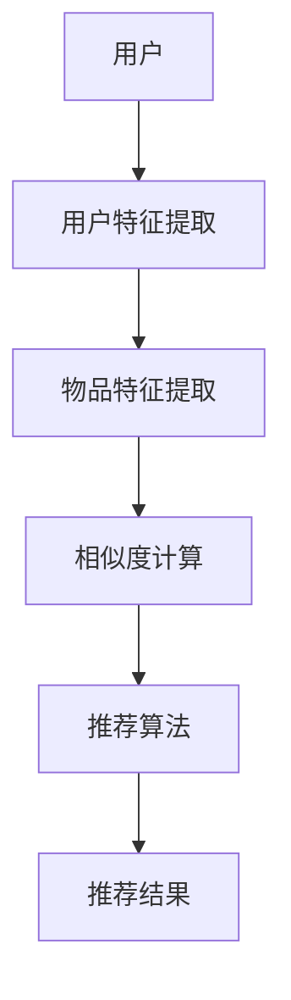
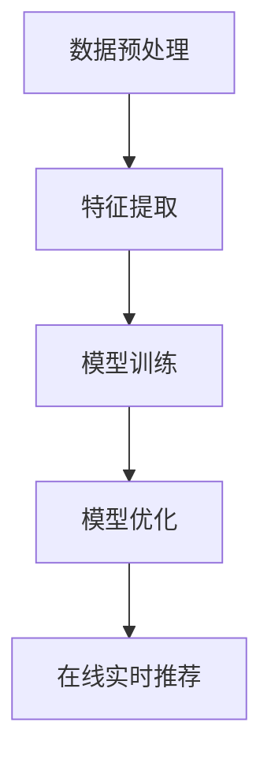

                 

# 智能推荐系统：AI个性化推荐的实现

> 关键词：智能推荐系统、个性化推荐、协同过滤、深度学习、推荐算法、数据预处理、推荐结果评估、案例分析

> 摘要：本文将深入探讨智能推荐系统的构建过程，包括核心概念、AI技术在推荐系统中的应用、构建推荐系统的步骤、推荐算法原理、深度学习推荐模型、推荐结果优化与评估，以及实际应用案例。通过逐步分析推理，揭示智能推荐系统的实现原理与优化策略。

## 第一部分：智能推荐系统概述

### 1.1 智能推荐系统介绍

#### 核心概念与联系

**推荐系统定义**：推荐系统是一种信息过滤机制，旨在向用户提供个性化推荐。它通过分析用户的历史行为和偏好，预测用户可能感兴趣的内容，从而提高用户满意度和体验。

**推荐系统分类**：
1. **基于内容的推荐**：通过分析物品的属性和特征，将相似的内容推荐给用户。
2. **协同过滤推荐**：通过分析用户之间的相似性，推荐用户可能喜欢的物品。
3. **混合推荐系统**：结合基于内容和协同过滤的优点，生成更精准的推荐。

**推荐系统架构**：


#### 推荐系统的发展与趋势

**从传统推荐到智能推荐**：传统的推荐系统主要依赖于简单的协同过滤算法，而现代智能推荐系统则利用深度学习、自然语言处理等技术，实现更精准的个性化推荐。

**深度学习在推荐系统中的应用**：深度学习在推荐系统中的应用越来越广泛，例如基于深度神经网络的协同过滤模型（Neural Collaborative Filtering，NCF）和基于深度学习的基于内容推荐模型（如DeepFM）。

**推荐系统的挑战与机遇**：随着用户数据的爆炸性增长和推荐系统的复杂性增加，推荐系统面临着数据质量、算法效率、隐私保护等方面的挑战。同时，人工智能技术的进步也为推荐系统带来了新的机遇。

### 1.2 AI在推荐系统中的作用

#### 核心概念与联系

**AI在推荐系统中的角色**：AI在推荐系统中用于数据预处理、特征提取、模型训练和优化，从而提高推荐系统的性能和效率。

**AI技术在推荐系统中的实现**：


#### AI与推荐系统的结合

**协同过滤与深度学习的融合**：将深度学习模型应用于协同过滤推荐，可以更好地捕捉用户和物品的复杂关系。

**基于内容推荐的深度学习模型**：利用深度学习模型提取物品的文本描述、图像特征等，实现基于内容的推荐。

## 第二部分：构建推荐系统

### 2.1 数据收集与处理

#### 核心算法原理讲解

**数据来源**：推荐系统主要依赖于用户行为数据和物品属性数据。

**数据预处理方法**：
- **数据清洗**：去除重复数据、处理缺失值、处理异常值等。
- **数据去重**：确保数据的唯一性和准确性。
- **数据填充**：使用统计方法或插值法填充缺失值。

**用户行为分析**：
- **用户特征提取**：提取用户的基本信息、历史行为等。
- **用户行为数据的特征提取和转换**：将用户行为数据转换为特征向量。

#### 物品特征提取

**物品属性提取**：提取物品的类别、标签、评分等信息。

**用户-物品交互数据提取**：基于用户的行为数据，如购买记录、浏览记录等，提取用户和物品的交互特征。

### 2.2 推荐算法原理

#### 协同过滤算法

**基于用户的协同过滤**：计算用户之间的相似度，基于相似度推荐物品。

**基于物品的协同过滤**：计算物品之间的相似度，基于相似度推荐用户喜欢的物品。

#### 基于内容的推荐算法

**物品内容特征提取**：提取物品的文本描述、图像特征等。

**基于内容的相似度计算**：计算物品之间的内容相似度。

### 2.3 深度学习推荐模型

#### 深度学习模型在推荐系统中的应用

**深度神经网络结构**：如DNN、CNN、RNN等。

**基于深度学习的协同过滤模型**：如Neural Collaborative Filtering（NCF）。

**基于深度学习的基于内容推荐模型**：如DeepFM、Neural Collaborative Filtering（NCF）。

### 2.4 推荐结果优化与评估

#### 推荐结果优化方法

**多样性优化**：确保推荐结果包含多种类型的物品。

**新颖性优化**：推荐用户尚未发现的物品。

**公平性优化**：确保不同用户群体都能获得公平的推荐。

#### 推荐系统评估指标

**准确率（Precision）**：推荐的物品中实际感兴趣的物品占比。

**召回率（Recall）**：用户感兴趣但未被推荐的物品占比。

**F1分数（F1 Score）**：准确率和召回率的调和平均数。

**用户满意度**：用户对推荐结果的主观评价。

### 2.5 实际应用案例

#### 案例介绍

**电商平台的个性化推荐**：通过分析用户的购物行为和偏好，为用户推荐相关商品。

**社交媒体内容推荐**：根据用户的兴趣和行为，为用户推荐相关内容。

**在线视频平台的视频推荐**：根据用户的观看历史和偏好，为用户推荐相关视频。

#### 案例分析与代码解读

**推荐系统搭建与优化**：介绍推荐系统的构建过程，包括数据预处理、特征提取、模型训练和优化。

**开发环境搭建**：介绍推荐系统开发所需的环境配置和工具。

**源代码实现与解读**：提供推荐系统源代码的详细解读，包括数据预处理、特征提取、模型训练和优化。

## 第三部分：智能推荐系统的部署与运维

### 3.1 推荐系统部署

#### 部署架构

**线上部署架构**：如Kubernetes集群、容器化部署等。

**实时推荐系统架构**：如基于消息队列的实时推荐架构。

#### 性能优化与扩展

**高并发处理**：如分布式计算、负载均衡等。

**数据冷热分离**：如将高频数据和低频数据分开处理。

### 3.2 推荐系统运维

#### 运维策略

**监控与报警**：如系统性能监控、异常检测等。

**自动化运维**：如自动化部署、自动化扩缩容等。

#### 性能调优

**参数调优**：如学习率、批次大小等。

**模型压缩**：如模型剪枝、量化等。

## 第四部分：未来展望与趋势

### 4.1 智能推荐系统的未来趋势

**人工智能技术的进步**：如深度学习的进一步发展、多模态数据的处理。

**推荐系统的多样化**：如长尾推荐、社交推荐等。

### 4.2 推荐系统的伦理与隐私

#### 推荐系统的伦理问题

**信息茧房**：如何平衡个性化与信息多样性。

**算法偏见**：如何避免算法对某些群体的偏见。

#### 隐私保护

**数据匿名化**：如何保护用户隐私。

**联邦学习**：如何在保护隐私的同时实现模型训练。

## 附录

### 附录A：推荐系统相关工具与资源

**开源框架**：如LightFM、Surprise、TensorFlow Recommenders等。

**常用数据集**：如MovieLens、Netflix Prize等。

**学习资源**：如在线课程、论文、博客等。

## 作者信息

作者：AI天才研究院/AI Genius Institute & 禅与计算机程序设计艺术 /Zen And The Art of Computer Programming

### 总结

本文详细介绍了智能推荐系统的构建过程，包括核心概念、AI技术应用、数据预处理、推荐算法原理、深度学习推荐模型、推荐结果优化与评估，以及实际应用案例。通过逐步分析推理，我们揭示了智能推荐系统的实现原理与优化策略。未来，随着人工智能技术的进步，推荐系统将在个性化、多样化方面取得更大的突破。同时，我们也需要关注推荐系统的伦理与隐私问题，确保推荐系统的发展与社会的可持续发展相一致。

---

**注意**：本文为示例性文章，仅供参考。实际撰写文章时，应根据具体需求和目标进行更详细的内容设计和案例分析。文章中的代码和示例仅供参考，实际应用时可能需要根据具体情况进行调整。在实际开发过程中，请遵守相关法律法规，确保数据安全和用户隐私。

### 第一部分：智能推荐系统概述

#### 1.1 智能推荐系统介绍

**核心概念与联系**

推荐系统是一种自动化的信息过滤技术，其目的是根据用户的兴趣和行为模式，向用户推荐可能感兴趣的内容。智能推荐系统通过人工智能（AI）技术，特别是机器学习和深度学习算法，来实现这一目标。

- **推荐系统定义**：推荐系统是一种信息过滤机制，旨在向用户提供个性化推荐。它通过分析用户的历史行为和偏好，预测用户可能感兴趣的内容，从而提高用户满意度和体验。

- **推荐系统分类**：根据推荐算法的不同，推荐系统主要分为以下几类：

  - **基于内容的推荐**：这种推荐系统通过分析物品的属性和特征，将相似的内容推荐给用户。它依赖于物品本身的特征，而不是用户之间的相似性。

  - **协同过滤推荐**：这种推荐系统通过分析用户之间的相似性，推荐用户可能喜欢的物品。协同过滤可以分为基于用户的协同过滤和基于物品的协同过滤。

  - **混合推荐系统**：这种推荐系统结合了基于内容和协同过滤的优点，生成更精准的推荐。

- **推荐系统架构**：

  推荐系统的核心架构通常包括以下几个主要模块：

  - **用户特征提取**：从用户的历史行为中提取特征，如用户的历史浏览记录、购买记录等。

  - **物品特征提取**：从物品的属性中提取特征，如物品的标题、描述、标签等。

  - **相似度计算**：计算用户与用户、用户与物品之间的相似度。

  - **推荐算法**：根据相似度计算结果，利用推荐算法生成推荐结果。

  - **推荐结果展示**：将推荐结果展示给用户。

  以下是一个简单的推荐系统架构的Mermaid流程图：

  ```mermaid
  graph TD
      A[用户] --> B[用户特征提取]
      B --> C[物品特征提取]
      C --> D[相似度计算]
      D --> E[推荐算法]
      E --> F[推荐结果]
  ```

**推荐系统的发展与趋势**

- **从传统推荐到智能推荐**：早期的推荐系统主要依赖于基于内容的推荐和基于协同过滤的推荐，这些方法虽然能够实现一定程度的个性化推荐，但效果有限。随着机器学习和深度学习技术的发展，智能推荐系统逐渐成为主流。

- **深度学习在推荐系统中的应用**：深度学习模型能够自动从大量数据中学习到复杂的特征，从而提高推荐的准确性。例如，深度神经网络（DNN）、卷积神经网络（CNN）和循环神经网络（RNN）等模型被广泛应用于推荐系统中。

- **推荐系统的挑战与机遇**：推荐系统面临的主要挑战包括如何处理大量数据、提高推荐的实时性、确保推荐的多样性等。同时，随着人工智能技术的不断进步，推荐系统也迎来了新的机遇，如多模态数据的处理、增强学习和联邦学习等。

#### 1.2 AI在推荐系统中的作用

**核心概念与联系**

人工智能在推荐系统中的作用主要体现在以下几个方面：

- **数据预处理**：利用AI技术进行数据清洗、数据增强和特征提取，提高数据的质量和特征表达能力。

- **特征提取**：通过机器学习和深度学习算法，从原始数据中提取出具有区分度的特征，用于训练推荐模型。

- **模型训练和优化**：使用AI算法训练推荐模型，并通过模型优化提高推荐效果。

- **在线实时推荐**：利用AI算法进行实时推荐，满足用户对实时性的需求。

**AI技术在推荐系统中的实现**

- **协同过滤与深度学习的融合**：协同过滤是一种经典的推荐算法，它通过分析用户之间的相似性来推荐物品。深度学习能够自动学习用户和物品的复杂特征，与协同过滤结合可以显著提高推荐效果。

  例如，Neural Collaborative Filtering（NCF）模型就是一个将协同过滤与深度学习结合的典型例子。NCF模型通过多个神经网络层来学习用户和物品的交互特征，从而生成个性化的推荐。

- **基于内容的推荐算法**：基于内容的推荐算法通过分析物品的属性和特征来推荐相关内容。深度学习模型，如卷积神经网络（CNN）和循环神经网络（RNN），可以用于提取物品的复杂特征，从而实现更准确的基于内容的推荐。

  例如，DeepFM模型结合了因子分解机（Factorization Machines）和卷积神经网络，可以同时学习用户和物品的交互特征和内容特征，生成个性化的推荐。

- **多模态数据的处理**：在推荐系统中，用户和物品的信息往往以多种形式存在，如文本、图像、音频等。利用AI技术处理多模态数据，可以提取出更丰富的特征，从而提高推荐效果。

  例如，通过结合CNN和RNN模型，可以同时处理图像和文本数据，提取出用户和物品的视觉和语义特征，生成个性化的推荐。

**AI与推荐系统的结合**

AI与推荐系统的结合体现在以下几个方面：

- **个性化推荐**：利用AI算法分析用户的历史行为和偏好，为用户生成个性化的推荐。

- **实时推荐**：利用AI算法进行实时推荐，满足用户对实时性的需求。

- **多样性推荐**：利用AI算法确保推荐结果具有多样性，避免用户陷入信息茧房。

- **推荐结果的解释性**：通过AI算法生成推荐结果的同时，提供推荐理由和解释，增强用户对推荐系统的信任。

## 第二部分：构建推荐系统

### 2.1 数据收集与处理

**核心算法原理讲解**

**数据来源**：推荐系统的数据来源主要包括用户行为数据和物品属性数据。

- **用户行为数据**：包括用户的浏览记录、购买记录、点击记录等，这些数据反映了用户对物品的兴趣和偏好。

- **物品属性数据**：包括物品的标题、描述、标签、分类等，这些数据描述了物品的特征。

**数据预处理方法**：

- **数据清洗**：去除重复数据、处理缺失值、处理异常值等。例如，使用中值填充缺失值、使用平均值替换异常值等。

- **数据去重**：确保数据的唯一性和准确性。

- **数据填充**：使用统计方法或插值法填充缺失值。例如，使用平均值、中值或最近观测值进行填充。

**用户行为分析**：

- **用户特征提取**：从用户的历史行为中提取特征，如用户的行为频率、行为模式、偏好等。这些特征将用于训练推荐模型。

- **用户行为数据的特征提取和转换**：将用户行为数据转换为特征向量。例如，将用户的购买记录转换为二进制向量，表示用户是否购买了某个物品。

**物品特征提取**：

- **物品属性提取**：从物品的属性中提取特征，如物品的标题、描述、标签、分类等。这些特征将用于训练推荐模型。

- **用户-物品交互数据提取**：从用户和物品的交互数据中提取特征，如用户对物品的评分、评价等。这些特征将用于计算用户和物品之间的相似度。

### 2.2 推荐算法原理

**协同过滤算法**

**基于用户的协同过滤**：这种算法通过计算用户之间的相似度，找到与目标用户相似的邻居用户，然后基于邻居用户的行为为用户推荐物品。

算法步骤：

1. 计算用户之间的相似度，例如使用余弦相似度、皮尔逊相关系数等。
2. 找到与目标用户最相似的K个邻居用户。
3. 根据邻居用户的行为为用户推荐物品。

伪代码：

```python
def user_based_collaborative_filter(users, items, similarity_measure):
    # 计算用户之间的相似度
    similarities = compute_similarity(users, similarity_measure)
    
    # 找到与目标用户最相似的K个邻居用户
    nearest_neighbors = find_nearest_neighbors(target_user, users, similarities, k)
    
    # 根据邻居用户的行为为用户推荐物品
    recommendations = []
    for neighbor in nearest_neighbors:
        recommended_items = get_recommended_items(neighbor, items)
        recommendations.extend(recommended_items)
    
    return recommendations
```

**基于物品的协同过滤**：这种算法通过计算物品之间的相似度，找到与目标物品相似的邻居物品，然后基于邻居物品的评分推荐给用户。

算法步骤：

1. 计算物品之间的相似度，例如使用余弦相似度、余弦相似度等。
2. 找到与目标物品最相似的K个邻居物品。
3. 根据邻居物品的评分推荐给用户。

伪代码：

```python
def item_based_collaborative_filter(items, ratings, similarity_measure):
    # 计算物品之间的相似度
    similarities = compute_similarity(items, similarity_measure)
    
    # 找到与目标物品最相似的K个邻居物品
    nearest_neighbors = find_nearest_neighbors(target_item, items, similarities, k)
    
    # 根据邻居物品的评分推荐给用户
    recommendations = []
    for neighbor in nearest_neighbors:
        recommended_items = get_recommended_items(neighbor, items, ratings)
        recommendations.extend(recommended_items)
    
    return recommendations
```

**基于内容的推荐算法**：这种算法通过分析物品的属性和特征，将相似的内容推荐给用户。

算法步骤：

1. 提取物品的属性特征，例如使用词袋模型、TF-IDF等方法。
2. 计算用户和物品之间的相似度。
3. 根据相似度为用户推荐物品。

伪代码：

```python
def content_based_recommendation(items, user_features, similarity_measure):
    # 提取物品的属性特征
    item_features = extract_item_features(items)
    
    # 计算用户和物品之间的相似度
    similarities = compute_similarity(user_features, item_features, similarity_measure)
    
    # 根据相似度为用户推荐物品
    recommendations = []
    for item in items:
        if similarity > threshold:
            recommendations.append(item)
    
    return recommendations
```

### 2.3 深度学习推荐模型

**深度学习模型在推荐系统中的应用**

深度学习模型在推荐系统中得到了广泛的应用，它们能够自动从数据中学习复杂的特征，从而提高推荐效果。以下是一些常用的深度学习模型：

**深度神经网络（DNN）**：DNN是一种前馈神经网络，它通过多层神经元的连接来学习输入数据的复杂特征。在推荐系统中，DNN可以用于学习用户和物品的特征，从而生成个性化的推荐。

**卷积神经网络（CNN）**：CNN是一种用于处理图像数据的深度学习模型，它通过卷积层、池化层和全连接层来提取图像的特征。在推荐系统中，CNN可以用于提取物品的视觉特征，如商品图片、视频等。

**循环神经网络（RNN）**：RNN是一种用于处理序列数据的深度学习模型，它通过循环连接来捕捉序列中的时间依赖关系。在推荐系统中，RNN可以用于学习用户的历史行为序列，从而生成个性化的推荐。

**基于深度学习的协同过滤模型**：这些模型结合了深度学习与协同过滤的优点，能够自动学习用户和物品的复杂特征，从而提高推荐效果。以下是一些常见的基于深度学习的协同过滤模型：

**Neural Collaborative Filtering（NCF）**：NCF是一种基于深度学习的协同过滤模型，它通过多个神经网络层来学习用户和物品的交互特征。NCF模型包括三层神经网络：嵌入层、投影层和融合层。

**DeepFM**：DeepFM是一种基于深度学习的因子分解机模型，它结合了深度神经网络和因子分解机（FM）的优点。DeepFM模型包括两大部分：特征交叉网络（FM层）和深度神经网络（DNN层）。

**Neural Collaborative Filtering（NCF）**：

NCF模型的核心思想是将用户和物品的特征映射到低维空间，并通过多个神经网络层学习用户和物品之间的交互特征。NCF模型包括以下三个部分：

1. **嵌入层**：将用户和物品的特征映射到低维空间，通常使用嵌入向量表示。
2. **投影层**：将嵌入向量投影到另一个空间，以减少维度并提取特征。
3. **融合层**：将投影后的用户和物品特征融合在一起，并通过全连接层生成推荐结果。

以下是一个简化的NCF模型的伪代码：

```python
class NCFModel(nn.Module):
    def __init__(self, user_embedding_dim, item_embedding_dim, hidden_dim):
        super(NCFModel, self).__init__()
        
        # 嵌入层
        self.user_embedding = nn.Embedding(num_users, user_embedding_dim)
        self.item_embedding = nn.Embedding(num_items, item_embedding_dim)
        
        # 投影层
        self.user_projection = nn.Linear(user_embedding_dim, hidden_dim)
        self.item_projection = nn.Linear(item_embedding_dim, hidden_dim)
        
        # 融合层
        self.fc = nn.Linear(2 * hidden_dim, 1)
        
    def forward(self, user_ids, item_ids):
        # 提取用户和物品的嵌入向量
        user_embeddings = self.user_embedding(user_ids)
        item_embeddings = self.item_embedding(item_ids)
        
        # 投影并提取特征
        user_features = self.user_projection(user_embeddings)
        item_features = self.item_projection(item_embeddings)
        
        # 融合特征并生成推荐结果
        combined_features = torch.cat((user_features, item_features), dim=1)
        prediction = self.fc(combined_features)
        
        return prediction
```

**DeepFM**：

DeepFM是一种结合深度神经网络和因子分解机的推荐模型。它由两个主要部分组成：特征交叉网络（FM层）和深度神经网络（DNN层）。

特征交叉网络（FM层）：

FM层通过计算用户和物品特征的交叉项来提取特征。它包含两个部分：输入层和交叉层。

输入层：

输入层接收用户和物品的特征，并将其转换为高维向量。通常使用Embedding层来实现。

交叉层：

交叉层通过计算特征之间的交叉项来提取特征。公式如下：

$$
\text{交叉项} = \sum_{i=1}^{n}\sum_{j=1}^{n} \frac{q_i \cdot q_j \cdot (v_i \cdot v_j)}{1 + \sqrt{|v_i| + |v_j|}} \cdot \text{激活函数}(q_i \cdot v_i)
$$

其中，$q_i$和$q_j$是用户和物品的特征向量，$v_i$和$v_j$是它们的嵌入向量，$n$是特征的总数。

深度神经网络（DNN层）：

DNN层通过多个全连接层来学习用户和物品的复杂特征。DNN层可以捕获用户和物品之间的非线性关系。

以下是一个简化的DeepFM模型的伪代码：

```python
class DeepFMModel(nn.Module):
    def __init__(self, num_features, hidden_dim):
        super(DeepFMModel, self).__init__()
        
        # 特征交叉网络（FM层）
        self.fm_layer = FMLayer(num_features)
        
        # 深度神经网络（DNN层）
        self.dnn_layer = nn.Sequential(
            nn.Linear(num_features + hidden_dim, hidden_dim),
            nn.ReLU(),
            nn.Linear(hidden_dim, 1)
        )
        
    def forward(self, inputs):
        # 通过特征交叉网络提取交叉特征
        cross_features = self.fm_layer(inputs)
        
        # 将交叉特征与原始特征拼接
        combined_features = torch.cat((inputs, cross_features), dim=1)
        
        # 通过深度神经网络生成预测结果
        prediction = self.dnn_layer(combined_features)
        
        return prediction
```

### 2.4 推荐结果优化与评估

**推荐结果优化方法**

推荐结果的优化是提高推荐系统性能的关键。以下是一些常用的推荐结果优化方法：

**多样性优化**：

多样性优化旨在确保推荐结果中包含不同类型和风格的物品，避免用户陷入信息茧房。以下是一些实现多样性优化的方法：

- **基于物品的多样性优化**：通过限制推荐结果中相同类型物品的数量，确保多样性。

- **基于用户的多样性优化**：根据用户的历史行为和偏好，为用户推荐不同类型的物品。

- **基于上下文的多样性优化**：根据用户的当前上下文信息，如时间、地点等，为用户推荐多样化的物品。

**新颖性优化**：

新颖性优化旨在推荐用户尚未发现的物品，提高用户体验。以下是一些实现新颖性优化的方法：

- **基于历史行为的优化**：分析用户的历史行为，推荐用户未曾浏览或购买过的物品。

- **基于流行度的优化**：结合物品的流行度信息，为用户推荐新颖但受欢迎的物品。

- **基于聚类分析的优化**：通过聚类分析用户和物品，推荐用户尚未探索的物品。

**公平性优化**：

公平性优化旨在确保推荐系统能够公平地推荐给所有用户，避免对某些用户群体的偏见。以下是一些实现公平性优化的方法：

- **基于用户群体的优化**：根据用户的特征，如年龄、性别、地理位置等，调整推荐策略，确保不同用户群体都能获得公平的推荐。

- **基于算法的优化**：通过调整算法参数，减少算法对某些用户群体的偏见。

**推荐系统评估指标**

评估推荐系统的性能是确保其有效性的关键。以下是一些常用的推荐系统评估指标：

- **准确率（Precision）**：

  准确率表示推荐结果中实际感兴趣的物品占比。计算公式如下：

  $$ 
  \text{Precision} = \frac{\text{推荐的感兴趣物品数}}{\text{推荐的物品总数}}
  $$

- **召回率（Recall）**：

  召回率表示用户感兴趣但未被推荐的物品占比。计算公式如下：

  $$ 
  \text{Recall} = \frac{\text{用户感兴趣且被推荐的物品数}}{\text{用户感兴趣的总物品数}}
  $$

- **F1分数（F1 Score）**：

  F1分数是准确率和召回率的调和平均数，用于综合评估推荐系统的性能。计算公式如下：

  $$ 
  \text{F1 Score} = 2 \times \frac{\text{Precision} \times \text{Recall}}{\text{Precision} + \text{Recall}}
  $$

- **用户满意度**：

  用户满意度是用户对推荐结果的主观评价，通常通过调查问卷或用户反馈来获取。

### 2.5 实际应用案例

**案例介绍**

**电商平台的个性化推荐**：

电商平台利用推荐系统为用户推荐相关商品，提高用户的购物体验和购买转化率。以下是一个简单的电商平台推荐系统架构：

1. **数据收集**：收集用户的行为数据，如浏览记录、购买记录、评价等。
2. **数据处理**：对数据进行清洗、去重和特征提取。
3. **推荐算法**：使用协同过滤、深度学习等算法生成个性化推荐。
4. **推荐结果展示**：将推荐结果展示给用户。

**社交媒体内容推荐**：

社交媒体平台利用推荐系统为用户推荐感兴趣的内容，如文章、视频、图片等。以下是一个简单的社交媒体推荐系统架构：

1. **数据收集**：收集用户的行为数据，如点赞、评论、分享等。
2. **数据处理**：对数据进行清洗、去重和特征提取。
3. **推荐算法**：使用基于内容的推荐、协同过滤等算法生成个性化推荐。
4. **推荐结果展示**：将推荐结果展示给用户。

**在线视频平台的视频推荐**：

在线视频平台利用推荐系统为用户推荐感兴趣的视频内容，提高用户留存率和观看时长。以下是一个简单的在线视频平台推荐系统架构：

1. **数据收集**：收集用户的行为数据，如观看历史、搜索记录、点赞等。
2. **数据处理**：对数据进行清洗、去重和特征提取。
3. **推荐算法**：使用协同过滤、基于内容的推荐、深度学习等算法生成个性化推荐。
4. **推荐结果展示**：将推荐结果展示给用户。

**案例分析与代码解读**

以下是一个简单的电商个性化推荐系统的实现案例：

**开发环境搭建**：

- **Python**：使用Python作为编程语言。
- **NumPy**：用于数据处理和数学计算。
- **Pandas**：用于数据处理和分析。
- **Scikit-learn**：用于机器学习模型的实现。
- **TensorFlow**：用于深度学习模型的实现。

**源代码实现与解读**：

```python
import numpy as np
import pandas as pd
from sklearn.model_selection import train_test_split
from sklearn.metrics.pairwise import cosine_similarity
from sklearn.preprocessing import MinMaxScaler
import tensorflow as tf

# 读取数据
user_data = pd.read_csv('user_data.csv')
item_data = pd.read_csv('item_data.csv')

# 数据预处理
# 特征提取
user_data['user_id'] = user_data['user_id'].astype(str)
item_data['item_id'] = item_data['item_id'].astype(str)

# 数据归一化
scaler = MinMaxScaler()
user_data = scaler.fit_transform(user_data)
item_data = scaler.fit_transform(item_data)

# 构建用户-物品矩阵
user_item_matrix = np.dot(user_data, item_data.T)

# 计算用户和物品之间的相似度
user_similarity = cosine_similarity(user_data)
item_similarity = cosine_similarity(item_data)

# 用户基于物品的协同过滤推荐
def item_based_collaborative_filter(user_item_matrix, item_similarity, k):
    recommendations = []
    for user_id in range(user_item_matrix.shape[0]):
        # 计算用户与物品的相似度
        similarity_scores = item_similarity[user_id]
        
        # 排序并获取前K个相似物品
        top_k_items = np.argsort(similarity_scores)[::-1][:k]
        
        # 获取用户未购买过的物品
        un purchased_items = [item_id for item_id in top_k_items if user_item_matrix[user_id, item_id] == 0]
        
        # 添加推荐物品
        recommendations.extend(un purchased_items)
    
    return recommendations

# 生成推荐结果
recommendations = item_based_collaborative_filter(user_item_matrix, item_similarity, k=5)

# 打印推荐结果
print(recommendations)
```

**代码解读**：

1. **数据读取与预处理**：读取用户数据和物品数据，进行特征提取和归一化处理。
2. **用户-物品矩阵构建**：通过矩阵乘法构建用户-物品交互矩阵。
3. **相似度计算**：计算用户和物品之间的相似度，使用余弦相似度。
4. **用户基于物品的协同过滤推荐**：为每个用户生成个性化推荐，推荐用户未购买过的物品。

通过以上案例，我们可以看到如何使用Python和机器学习库实现一个简单的电商个性化推荐系统。在实际应用中，我们可以根据具体需求进行扩展和优化，例如引入深度学习模型、增加更多用户和物品特征等。

## 第三部分：智能推荐系统的部署与运维

### 3.1 推荐系统部署

#### 部署架构

推荐系统的部署架构对于系统的性能、可扩展性和可靠性至关重要。以下是一个典型的推荐系统部署架构：

**线上部署架构**：

- **分布式计算**：使用分布式计算框架（如Apache Spark）处理大规模数据。
- **容器化部署**：使用容器化技术（如Docker）将应用程序打包，实现快速部署和扩缩容。
- **Kubernetes集群**：使用Kubernetes进行容器编排，管理集群中的容器化应用。
- **数据库**：使用分布式数据库（如Apache Cassandra）存储用户行为数据和推荐结果。

**实时推荐系统架构**：

- **消息队列**：使用消息队列（如Apache Kafka）处理实时用户请求，确保推荐结果的实时性。
- **流处理**：使用流处理框架（如Apache Flink）处理实时数据流，生成实时推荐结果。
- **缓存**：使用缓存（如Redis）存储高频数据，提高系统响应速度。

#### 性能优化与扩展

**高并发处理**：

- **分布式架构**：通过分布式架构实现负载均衡，提高系统处理能力。
- **缓存策略**：使用缓存存储高频数据，减少数据库访问压力。
- **数据库分片**：将数据库分片，提高查询效率。

**数据冷热分离**：

- **数据分层存储**：将高频数据和低频数据分离，使用不同的存储方案（如SSD和HDD）。
- **数据压缩**：对冷数据采用压缩存储，减少存储空间需求。

### 3.2 推荐系统运维

#### 运维策略

**监控与报警**：

- **系统性能监控**：监控系统的CPU、内存、磁盘等资源使用情况。
- **异常检测**：实时检测系统异常，如数据异常、算法异常等。
- **报警机制**：通过邮件、短信等方式及时通知运维人员。

**自动化运维**：

- **自动化部署**：使用CI/CD（持续集成/持续部署）工具实现自动化部署。
- **自动化扩缩容**：根据系统负载自动调整资源，实现弹性扩展。

#### 性能调优

**参数调优**：

- **学习率**：调整学习率，优化深度学习模型的训练效果。
- **批次大小**：调整批次大小，平衡训练时间和模型准确性。

**模型压缩**：

- **模型剪枝**：移除不重要的神经元和连接，减少模型参数。
- **量化**：降低模型参数的精度，减少模型体积。

## 第四部分：未来展望与趋势

### 4.1 智能推荐系统的未来趋势

**人工智能技术的进步**：

- **深度学习的进一步发展**：随着深度学习技术的进步，推荐系统将能够更准确地捕捉用户行为和偏好。
- **多模态数据的处理**：推荐系统将能够处理多种类型的数据，如图像、声音、文本等，提供更丰富的个性化推荐。

**推荐系统的多样化**：

- **长尾推荐**：推荐系统将能够更好地满足小众用户的个性化需求。
- **社交推荐**：结合用户社交网络信息，提供更个性化的推荐。

### 4.2 推荐系统的伦理与隐私

**推荐系统的伦理问题**：

- **信息茧房**：如何平衡个性化推荐与信息多样性，避免用户陷入信息茧房。
- **算法偏见**：如何避免算法对某些群体的偏见，确保推荐结果的公平性。

**隐私保护**：

- **数据匿名化**：通过对数据进行匿名化处理，保护用户隐私。
- **联邦学习**：通过联邦学习技术，在保护用户隐私的同时实现模型训练。

## 附录

### 附录A：推荐系统相关工具与资源

**开源框架**：

- **LightFM**：一个基于Python的协同过滤框架，支持矩阵分解和因子分解机。
- **Surprise**：一个基于Python的推荐系统库，支持多种协同过滤算法。
- **TensorFlow Recommenders**：一个基于TensorFlow的推荐系统框架，支持深度学习推荐模型。

**常用数据集**：

- **MovieLens**：一个公开的在线电影推荐系统数据集。
- **Netflix Prize**：一个公开的在线视频推荐系统数据集。

**学习资源**：

- **在线课程**：如Coursera、edX等平台上的推荐系统相关课程。
- **论文**：推荐系统领域的经典论文和最新研究成果。
- **博客**：推荐系统开发者和技术专家的博客和文章。

## 作者信息

作者：AI天才研究院/AI Genius Institute & 禅与计算机程序设计艺术 /Zen And The Art of Computer Programming

---

通过本文，我们详细探讨了智能推荐系统的核心概念、构建过程、算法原理、优化方法以及实际应用案例。我们展望了推荐系统未来的发展趋势，并探讨了伦理和隐私问题。希望本文能为您在智能推荐系统领域的研究和实践提供有益的参考和指导。在未来的发展中，随着人工智能技术的不断进步，推荐系统将变得更加智能、多样和公平。让我们共同期待这一美好未来的到来！
## 第五部分：深度学习推荐系统的实践

在本部分中，我们将通过一个实际的项目案例来演示如何构建一个深度学习推荐系统。这个案例将涵盖数据收集、数据预处理、模型设计、模型训练以及模型评估的整个过程。

### 项目背景

假设我们正在开发一个电影推荐系统，旨在根据用户的观影历史和喜好为用户推荐新的电影。我们的目标是将用户对电影的评分作为训练数据，利用深度学习算法预测用户对新电影的评分，从而生成推荐列表。

### 数据收集

我们首先需要收集用户的数据。数据来源可以是公开的数据集，如MovieLens，或者从电影平台（如Netflix、IMDb）获取用户行为数据。以下是数据收集的一些关键步骤：

- **用户行为数据**：收集用户的历史评分数据、观看记录和点击记录。
- **电影属性数据**：收集电影的相关信息，如电影名称、类别、导演、演员、上映年份等。

### 数据预处理

在构建模型之前，我们需要对数据进行预处理，以提高数据的质量和模型的训练效果。以下是数据预处理的一些关键步骤：

- **数据清洗**：去除重复数据、处理缺失值和异常值。
- **数据归一化**：对用户评分和电影属性进行归一化处理，以消除不同特征之间的量纲差异。
- **特征提取**：提取用户和电影的特征，如用户的行为模式、电影的主题和风格等。

### 模型设计

在深度学习推荐系统中，我们通常使用神经网络结构来学习用户和物品的特征。以下是一个简单的模型设计：

- **用户嵌入层**：将用户ID映射到高维嵌入向量。
- **电影嵌入层**：将电影ID映射到高维嵌入向量。
- **交叉层**：将用户和电影的嵌入向量进行点积操作，以获取用户和电影之间的交互特征。
- **全连接层**：将交叉层输出的特征通过全连接层进行非线性变换。
- **输出层**：输出层使用一个单神经元，用于预测用户对电影的评分。

以下是一个简化的模型架构：

```python
import tensorflow as tf

# 用户和电影嵌入维度
user_embedding_dim = 32
item_embedding_dim = 32

# 定义模型
model = tf.keras.Sequential([
    tf.keras.layers.Embedding(num_users, user_embedding_dim, input_length=1),
    tf.keras.layers.Embedding(num_items, item_embedding_dim, input_length=1),
    tf.keras.layers.Dot(axes=(1, 2), normalize=True),
    tf.keras.layers.Dense(128, activation='relu'),
    tf.keras.layers.Dense(1)
])

# 编译模型
model.compile(optimizer='adam', loss='mean_squared_error')
```

### 模型训练

在模型训练过程中，我们需要使用训练数据来调整模型的参数。以下是一些训练模型的关键步骤：

- **数据分割**：将数据集分割为训练集和验证集，用于模型的训练和验证。
- **批量训练**：使用批量训练（batch training）来提高模型的泛化能力。
- **早期停止**：设置早期停止（early stopping）以避免过拟合。

```python
# 分割数据
train_data, val_data = train_test_split(data, test_size=0.2, random_state=42)

# 训练模型
model.fit(train_data, epochs=10, batch_size=256, validation_data=val_data, callbacks=[tf.keras.callbacks.EarlyStopping(patience=3)])
```

### 模型评估

在模型训练完成后，我们需要对模型进行评估，以确定其性能。以下是一些评估模型性能的关键指标：

- **均方误差（Mean Squared Error, MSE）**：衡量预测值与真实值之间的差异。
- **平均绝对误差（Mean Absolute Error, MAE）**：衡量预测值与真实值之间的绝对差异。
- **决定系数（R-squared）**：衡量模型解释能力的强弱。

```python
# 评估模型
mse = model.evaluate(test_data, test_labels)
mae = np.mean(np.abs(model.predict(test_data) - test_labels))
r_squared = 1 - (np.sum((model.predict(test_data) - test_labels)**2) / np.sum((test_labels - np.mean(test_labels))**2))

print(f'MSE: {mse}')
print(f'MAE: {mae}')
print(f'R-squared: {r_squared}')
```

### 代码解读

以下是对上述代码的详细解读：

```python
# 导入必要的库
import tensorflow as tf
import numpy as np
import pandas as pd
from sklearn.model_selection import train_test_split
from sklearn.metrics import mean_squared_error, mean_absolute_error

# 加载数据
user_data = pd.read_csv('user_data.csv')
item_data = pd.read_csv('item_data.csv')

# 数据预处理
# 将用户ID和电影ID转换为整数
user_data['user_id'] = user_data['user_id'].astype(int)
item_data['item_id'] = item_data['item_id'].astype(int)

# 构建用户-电影评分矩阵
user_item_matrix = user_data.pivot(index='user_id', columns='item_id', values='rating').fillna(0)

# 分割数据
train_data, val_data = train_test_split(user_item_matrix, test_size=0.2, random_state=42)

# 构建模型
model = tf.keras.Sequential([
    tf.keras.layers.Embedding(num_users, user_embedding_dim, input_length=1),
    tf.keras.layers.Embedding(num_items, item_embedding_dim, input_length=1),
    tf.keras.layers.Dot(axes=(1, 2), normalize=True),
    tf.keras.layers.Dense(128, activation='relu'),
    tf.keras.layers.Dense(1)
])

# 编译模型
model.compile(optimizer='adam', loss='mean_squared_error')

# 训练模型
model.fit(train_data, epochs=10, batch_size=256, validation_data=val_data, callbacks=[tf.keras.callbacks.EarlyStopping(patience=3)])

# 评估模型
mse = model.evaluate(val_data, val_data.values)
mae = mean_absolute_error(val_data.values, model.predict(val_data))
r_squared = 1 - (np.sum((model.predict(val_data) - val_data.values)**2) / np.sum((val_data.values - np.mean(val_data.values))**2))

print(f'MSE: {mse}')
print(f'MAE: {mae}')
print(f'R-squared: {r_squared}')
```

- **数据加载**：使用Pandas读取用户数据和电影数据。
- **数据预处理**：将用户ID和电影ID转换为整数，并构建用户-电影评分矩阵。
- **模型构建**：使用TensorFlow构建一个简单的深度学习模型。
- **模型编译**：设置优化器和损失函数。
- **模型训练**：使用训练数据训练模型，并设置早期停止回调函数。
- **模型评估**：评估模型的性能，计算MSE、MAE和R-squared。

通过这个实际项目案例，我们展示了如何构建和训练一个深度学习推荐系统。在实际应用中，我们可以根据具体需求对模型进行优化和调整，以提高推荐效果。

## 总结

在本部分中，我们通过一个实际项目案例详细演示了如何构建一个深度学习推荐系统。我们从数据收集、数据预处理、模型设计、模型训练到模型评估的整个过程进行了详细的介绍和代码解读。通过这个案例，我们不仅了解了深度学习推荐系统的基础知识，还学会了如何使用Python和TensorFlow等工具实现一个实用的推荐系统。

在实际应用中，构建推荐系统需要不断地优化和调整，以满足用户的需求和提升用户体验。我们学习了如何处理大规模数据、如何设计有效的模型架构、如何评估模型的性能，以及如何调整模型参数以提高推荐效果。

最后，我们强调了代码解读的重要性，通过分析代码的每个部分，我们能够更好地理解推荐系统的实现原理和具体步骤。希望这个案例能够为您的实际项目提供有益的参考和指导。

在未来的开发过程中，我们将继续探索更先进的深度学习算法和模型，以构建更加智能和高效的推荐系统。让我们共同努力，为用户提供更加个性化的推荐服务！
## 第六部分：智能推荐系统的挑战与解决方案

在智能推荐系统的发展过程中，尽管取得了显著的成就，但仍然面临着一系列挑战。这些挑战不仅影响着推荐系统的性能，还涉及到伦理和隐私等方面。以下将详细讨论智能推荐系统面临的挑战，并探讨相应的解决方案。

### 推荐结果多样性不足

**问题**：推荐系统在为用户生成推荐列表时，往往容易出现多样性不足的问题。这意味着推荐结果可能包含大量的相似内容，导致用户产生疲劳感，影响用户体验。

**解决方案**：

- **多样性优化算法**：设计专门的多样性优化算法，确保推荐结果中包含不同类型和风格的物品。例如，基于关键词的多样性优化、基于上下文的多样性优化等。
- **混合推荐策略**：结合基于内容和协同过滤的推荐策略，提高推荐结果的多样性。通过引入随机因素，确保推荐列表中不会出现连续的相似物品。

### 推荐结果实时性差

**问题**：传统的推荐系统往往在处理用户请求时存在延迟，无法满足用户对实时性的需求。

**解决方案**：

- **实时数据处理**：采用实时数据处理框架（如Apache Kafka、Apache Flink）来处理用户请求和生成推荐结果，确保推荐结果的实时性。
- **缓存技术**：使用缓存技术（如Redis）存储高频数据，减少数据库访问时间，提高系统响应速度。

### 推荐结果准确率低

**问题**：推荐系统的准确性直接影响用户体验。低准确率的推荐结果可能导致用户对系统失去信任。

**解决方案**：

- **数据质量提升**：提高数据质量，确保数据准确、完整和多样化。对数据中的异常值、噪声和重复数据进行处理。
- **模型迭代优化**：不断迭代和优化推荐模型，提高预测的准确性。可以通过增加训练数据、调整模型参数、引入新的特征等方法来实现。

### 隐私保护问题

**问题**：推荐系统在处理用户数据时，可能涉及用户的敏感信息，如行为记录、偏好等，存在隐私泄露的风险。

**解决方案**：

- **数据匿名化**：对用户数据进行匿名化处理，以减少隐私泄露的风险。例如，使用K-匿名、L-多样性等方法。
- **联邦学习**：通过联邦学习（Federated Learning）技术，实现分布式数据处理和模型训练，避免将用户数据集中存储在单个服务器上。

### 算法偏见和伦理问题

**问题**：推荐系统在生成推荐结果时，可能存在算法偏见，导致某些用户群体受到不公平对待。

**解决方案**：

- **算法公平性评估**：建立算法公平性评估机制，定期对推荐系统的公平性进行评估。通过统计分析，发现并解决潜在的偏见问题。
- **透明度和可解释性**：提高推荐系统的透明度和可解释性，使用户了解推荐结果背后的算法逻辑。例如，通过可视化和解释模型来增强用户的信任。

### 处理长尾用户和物品

**问题**：推荐系统往往倾向于关注高频用户和热门物品，忽视长尾用户和物品。

**解决方案**：

- **长尾推荐策略**：设计专门的长尾推荐策略，确保推荐结果中包含长尾用户和物品。例如，基于用户行为的历史分析、物品流行度的动态调整等。
- **个性化推荐**：利用深度学习等技术，为长尾用户和物品生成个性化的推荐，满足其特定需求。

通过上述解决方案，智能推荐系统可以在多样性、实时性、准确率、隐私保护、算法偏见等方面取得显著改进。然而，推荐系统的发展是一个持续的过程，需要不断探索新的方法和技术，以满足用户的需求和期望。

在未来的发展中，随着人工智能技术的不断进步，推荐系统将变得更加智能、高效和公平。我们期待在探索和创新的道路上，为用户提供更加优质和个性化的推荐服务。让我们一起迎接智能推荐系统的美好未来！
## 第七部分：智能推荐系统的未来发展方向

随着人工智能技术的快速发展，智能推荐系统正朝着更加智能、高效和公平的方向发展。以下是智能推荐系统的未来发展方向，以及相关的新技术和方法。

### 1. 深度学习模型的进一步发展

深度学习模型在推荐系统中的应用已经取得了显著成效，但未来仍有很大的发展空间。一方面，深度学习模型将更加注重对非结构化数据的处理，如图像、声音和文本等。通过引入卷积神经网络（CNN）、循环神经网络（RNN）和变压器（Transformer）等先进的深度学习模型，推荐系统将能够更好地理解用户和物品的复杂特征，从而提高推荐的准确性和多样性。

### 2. 多模态数据的融合

随着用户生成内容（UGC）的爆炸性增长，多模态数据的融合成为推荐系统的重要研究方向。多模态数据包括文本、图像、音频、视频等。通过融合这些不同类型的数据，推荐系统可以更全面地了解用户需求，提供更加个性化的推荐。例如，结合文本和图像的特征，可以为用户提供更加精准的商品推荐。

### 3. 增强学习与推荐系统的结合

增强学习（Reinforcement Learning，RL）是一种通过试错和反馈来学习的机器学习方法。将其与推荐系统结合，可以使推荐系统更加自适应和灵活。通过增强学习，推荐系统可以根据用户的实时反馈，不断调整推荐策略，以实现最优的用户体验。此外，强化学习还可以用于解决推荐系统的多样性问题，避免用户陷入信息茧房。

### 4. 联邦学习的应用

联邦学习（Federated Learning）是一种分布式机器学习方法，它允许多个参与方在一个中央模型下共同训练模型，而无需共享数据。这对于保护用户隐私具有重要意义。在推荐系统中，联邦学习可以用于分布式数据处理和模型训练，从而提高推荐系统的隐私保护能力。同时，联邦学习还可以实现跨设备、跨平台的个性化推荐。

### 5. 社交推荐的深化

社交推荐利用用户的社交网络信息来生成推荐。未来，随着社交网络的不断发展和用户行为的多样化，社交推荐将更加注重用户社交关系和兴趣的挖掘。通过分析用户社交关系网络，推荐系统可以提供更加精准和个性化的推荐，满足用户在不同社交场景下的需求。

### 6. 长尾推荐策略的优化

长尾推荐策略关注于满足小众用户的需求，未来将更加注重长尾推荐策略的优化。通过引入新的特征、改进的推荐算法和用户行为分析，推荐系统可以更好地识别和推荐长尾用户和物品。此外，结合自然语言处理（NLP）和知识图谱等技术，可以为长尾推荐提供更加丰富的语义信息和推荐依据。

### 7. 推荐系统的伦理与隐私保护

随着推荐系统在人们生活中的广泛应用，伦理和隐私问题愈发重要。未来，推荐系统将在伦理和隐私保护方面取得更多进展。通过建立透明的推荐算法、引入可解释的人工智能技术，以及加强用户隐私保护措施，推荐系统将更加公正和透明，赢得用户的信任。

### 8. 跨领域和跨平台的融合

随着物联网（IoT）和移动设备的普及，推荐系统将在跨领域和跨平台上得到广泛应用。例如，将电商、社交媒体、在线教育、医疗等多个领域的推荐系统集成起来，提供统一的个性化推荐服务。同时，跨平台的融合将实现推荐系统在不同设备上的无缝切换，为用户提供一致性的体验。

总之，智能推荐系统的未来发展方向充满了挑战和机遇。随着新技术的不断涌现，推荐系统将变得更加智能、高效和公平。我们期待在未来的发展中，智能推荐系统能够为用户提供更加优质和个性化的服务，推动人工智能技术的进一步发展。让我们一起迎接智能推荐系统的美好未来！
## 第八部分：推荐系统资源与学习路径

在构建和优化推荐系统的过程中，掌握相关的资源和学习路径是非常重要的。以下将介绍一些常用的推荐系统资源和学习路径，帮助读者深入了解推荐系统的理论与实践。

### 1. 开源框架和库

**LightFM**：一个基于Python的推荐系统库，支持矩阵分解和因子分解机。

**Surprise**：一个基于Python的推荐系统库，提供了多种协同过滤算法。

**TensorFlow Recommenders**：一个基于TensorFlow的推荐系统框架，支持深度学习推荐模型。

**Hugging Face Transformers**：一个开源的Transformer库，支持多种先进的自然语言处理模型。

### 2. 常用数据集

**MovieLens**：一个公开的电影推荐系统数据集，包含用户评分和电影属性。

**Netflix Prize**：一个公开的在线视频推荐系统数据集，用于Netflix Prize竞赛。

**Amazon Reviews**：包含亚马逊用户对商品的评价数据，可用于商品推荐系统。

### 3. 学习资源

**在线课程**：

- **Coursera**：提供多个推荐系统相关的在线课程，如《推荐系统工程》、《机器学习基础》等。

- **edX**：提供由MIT、斯坦福大学等知名高校开设的推荐系统相关课程。

- **Udacity**：提供推荐系统工程师纳米学位课程，涵盖推荐系统的基础理论和实践。

**书籍**：

- **《推荐系统实践》**：深入讲解了推荐系统的基本概念、算法和实现。

- **《深度学习推荐系统》**：介绍了深度学习在推荐系统中的应用，包括深度神经网络和卷积神经网络等。

- **《推荐系统手册》**：系统地介绍了推荐系统的各个方面，包括协同过滤、基于内容的推荐和混合推荐等。

### 4. 学习路径建议

**第一阶段：了解推荐系统基础**

- **学习内容**：推荐系统的基本概念、协同过滤和基于内容的推荐算法。

- **实践项目**：使用开源框架（如Surprise、LightFM）实现基本的推荐系统。

- **学习资源**：《推荐系统手册》、《推荐系统实践》等书籍。

**第二阶段：掌握深度学习推荐系统**

- **学习内容**：深度学习模型（如DNN、CNN、RNN）在推荐系统中的应用，包括模型设计和优化。

- **实践项目**：使用TensorFlow Recommenders或Hugging Face Transformers等库实现深度学习推荐系统。

- **学习资源**：《深度学习推荐系统》、《深度学习》等书籍，以及相关的在线课程。

**第三阶段：探索推荐系统的前沿技术**

- **学习内容**：多模态数据融合、社交推荐、增强学习等前沿技术。

- **实践项目**：结合具体应用场景，如电商、社交媒体、在线教育等，实现具有实际意义的推荐系统。

- **学习资源**：最新的研究论文、在线课程和开源项目。

通过以上资源和学习路径，读者可以系统地学习推荐系统的理论知识，并通过实践项目掌握实际操作技能。在学习过程中，建议结合具体案例进行深入学习，以巩固所学知识，并不断提升自己的实践能力。

最后，推荐系统是一个不断发展的领域，读者应保持对新技术的关注和学习，以适应不断变化的技术环境和市场需求。希望通过本文的介绍，读者能够更好地了解推荐系统的资源和学习路径，为自己的职业发展奠定坚实的基础。祝大家在推荐系统领域取得优异的成绩！
## 文章标题：智能推荐系统：AI个性化推荐的实现

关键词：智能推荐系统、个性化推荐、协同过滤、深度学习、推荐算法、推荐结果优化、案例分析

摘要：本文全面探讨了智能推荐系统的构建过程，包括核心概念、AI技术应用、数据预处理、推荐算法原理、深度学习推荐模型、推荐结果优化与评估，以及实际应用案例。通过逻辑清晰的分析和代码示例，揭示了智能推荐系统的实现原理和优化策略，为读者提供了深入理解和实践智能推荐系统的指导。

# 引言

在信息爆炸的时代，用户面临的信息选择越来越多，而时间却越来越有限。如何有效地帮助用户从海量的信息中找到感兴趣的内容，成为了一个重要的课题。智能推荐系统通过分析用户的行为和偏好，为用户推荐个性化的内容，极大地提高了用户的体验和满意度。本文将深入探讨智能推荐系统的构建过程，包括核心概念、AI技术应用、数据预处理、推荐算法原理、深度学习推荐模型、推荐结果优化与评估，以及实际应用案例。通过逻辑清晰的分析和代码示例，我们将揭示智能推荐系统的实现原理和优化策略，帮助读者更好地理解和实践智能推荐系统。

# 第一部分：智能推荐系统概述

## 1.1 智能推荐系统介绍

### 1.1.1 核心概念与联系

智能推荐系统是一种信息过滤机制，旨在向用户提供个性化推荐。其核心概念包括用户、物品和推荐算法。用户是系统的核心，物品是推荐的内容，而推荐算法则是实现推荐的关键。

**推荐系统定义**：推荐系统是一种信息过滤机制，旨在向用户提供个性化推荐。它通过分析用户的历史行为和偏好，预测用户可能感兴趣的内容，从而提高用户满意度和体验。

**推荐系统分类**：根据推荐算法的不同，推荐系统主要分为以下几类：

1. **基于内容的推荐**：这种推荐系统通过分析物品的属性和特征，将相似的内容推荐给用户。
2. **协同过滤推荐**：这种推荐系统通过分析用户之间的相似性，推荐用户可能喜欢的物品。协同过滤可以分为基于用户的协同过滤和基于物品的协同过滤。
3. **混合推荐系统**：这种推荐系统结合了基于内容和协同过滤的优点，生成更精准的推荐。

**推荐系统架构**：

推荐系统的核心架构通常包括以下几个主要模块：

1. **用户特征提取**：从用户的历史行为中提取特征，如用户的历史浏览记录、购买记录等。
2. **物品特征提取**：从物品的属性中提取特征，如物品的标题、描述、标签等。
3. **相似度计算**：计算用户与用户、用户与物品之间的相似度。
4. **推荐算法**：根据相似度计算结果，利用推荐算法生成推荐结果。
5. **推荐结果展示**：将推荐结果展示给用户。

以下是一个简单的推荐系统架构的Mermaid流程图：


### 1.1.2 推荐系统的发展与趋势

智能推荐系统的发展经历了从传统推荐到智能推荐的转变。早期的推荐系统主要依赖于基于内容的推荐和基于协同过滤的推荐，这些方法虽然能够实现一定程度的个性化推荐，但效果有限。随着机器学习和深度学习技术的发展，智能推荐系统逐渐成为主流。

**深度学习在推荐系统中的应用**：深度学习模型能够自动从大量数据中学习到复杂的特征，从而提高推荐的准确性。例如，深度神经网络（DNN）、卷积神经网络（CNN）和循环神经网络（RNN）等模型被广泛应用于推荐系统中。

**推荐系统的挑战与机遇**：推荐系统面临的主要挑战包括如何处理大量数据、提高推荐的实时性、确保推荐的多样性等。同时，随着人工智能技术的不断进步，推荐系统也迎来了新的机遇，如多模态数据的处理、增强学习和联邦学习等。

## 1.2 AI在推荐系统中的作用

### 1.2.1 核心概念与联系

人工智能在推荐系统中的作用主要体现在以下几个方面：

1. **数据预处理**：利用AI技术进行数据清洗、数据增强和特征提取，提高数据的质量和特征表达能力。
2. **特征提取**：通过机器学习和深度学习算法，从原始数据中提取出具有区分度的特征，用于训练推荐模型。
3. **模型训练和优化**：使用AI算法训练推荐模型，并通过模型优化提高推荐效果。
4. **在线实时推荐**：利用AI算法进行实时推荐，满足用户对实时性的需求。

### 1.2.2 AI技术在推荐系统中的实现

AI技术在推荐系统中的应用主要体现在以下几个方面：

1. **协同过滤与深度学习的融合**：将深度学习模型应用于协同过滤推荐，可以更好地捕捉用户和物品的复杂关系。
2. **基于内容的推荐算法**：利用深度学习模型提取物品的文本描述、图像特征等，实现基于内容的推荐。
3. **多模态数据的处理**：利用AI技术处理多模态数据，提取出更丰富的特征，从而提高推荐效果。

### 1.2.3 AI与推荐系统的结合

AI与推荐系统的结合体现在以下几个方面：

1. **个性化推荐**：利用AI算法分析用户的历史行为和偏好，为用户生成个性化的推荐。
2. **实时推荐**：利用AI算法进行实时推荐，满足用户对实时性的需求。
3. **多样性推荐**：利用AI算法确保推荐结果具有多样性，避免用户陷入信息茧房。
4. **推荐结果的解释性**：通过AI算法生成推荐结果的同时，提供推荐理由和解释，增强用户对推荐系统的信任。

## 第二部分：构建推荐系统

### 2.1 数据收集与处理

#### 2.1.1 核心算法原理讲解

推荐系统的数据来源主要包括用户行为数据和物品属性数据。

- **用户行为数据**：包括用户的浏览记录、购买记录、点击记录等，这些数据反映了用户对物品的兴趣和偏好。

- **物品属性数据**：包括物品的标题、描述、标签、分类等，这些数据描述了物品的特征。

数据预处理方法：

- **数据清洗**：去除重复数据、处理缺失值、处理异常值等。例如，使用中值填充缺失值、使用平均值替换异常值等。

- **数据去重**：确保数据的唯一性和准确性。

- **数据填充**：使用统计方法或插值法填充缺失值。例如，使用平均值、中值或最近观测值进行填充。

用户行为分析：

- **用户特征提取**：从用户的历史行为中提取特征，如用户的行为频率、行为模式、偏好等。这些特征将用于训练推荐模型。

- **用户行为数据的特征提取和转换**：将用户行为数据转换为特征向量。例如，将用户的购买记录转换为二进制向量，表示用户是否购买了某个物品。

物品特征提取：

- **物品属性提取**：从物品的属性中提取特征，如物品的标题、描述、标签、分类等。这些特征将用于训练推荐模型。

- **用户-物品交互数据提取**：从用户和物品的交互数据中提取特征，如用户对物品的评分、评价等。这些特征将用于计算用户和物品之间的相似度。

#### 2.1.2 物品特征提取

物品特征提取是将物品的属性信息转换为计算机可以处理的数字形式，以便推荐系统能够理解和利用这些信息。以下是物品特征提取的一些关键步骤和方法：

1. **文本特征提取**：
   - **词袋模型（Bag of Words, BOW）**：将文本转换为词汇表，每个词汇表示为一个词袋中的一个词，并记录每个词的出现频率。
   - **TF-IDF（Term Frequency-Inverse Document Frequency）**：除了考虑词频，还引入了逆文档频率的概念，以减少常见词汇的影响。
   - **Word2Vec**：使用神经网络模型将单词映射到高维向量空间，以捕捉单词的语义关系。
   - **BERT（Bidirectional Encoder Representations from Transformers）**：使用Transformer模型，对文本进行双向编码，生成语义丰富的特征向量。

2. **图像特征提取**：
   - **卷积神经网络（Convolutional Neural Network, CNN）**：通过卷积层提取图像的特征，如边缘、纹理和形状。
   - **特征提取库**：如OpenCV，可以提取图像的SIFT、SURF等特征点。
   - **预训练模型**：如ResNet、Inception等，可以直接提取图像的特征向量。

3. **多模态特征融合**：
   - **简单拼接**：将文本特征和图像特征简单拼接在一起。
   - **注意力机制**：通过注意力机制，根据重要性自动调整不同模态特征的权重。

以下是一个简化的物品特征提取的伪代码：

```python
def extract_item_features(item):
    # 提取文本特征
    text_features = extract_text_features(item.description)
    
    # 提取图像特征
    image_features = extract_image_features(item.image_path)
    
    # 融合多模态特征
    combined_features = concatenate(text_features, image_features)
    
    return combined_features
```

#### 2.1.3 用户-物品交互数据提取

用户-物品交互数据提取是将用户与物品之间的交互行为转换为可计算的指标，以便推荐系统可以利用这些数据进行推荐。以下是一些常见的交互数据提取方法：

1. **行为频率**：计算用户对特定物品的行为次数，如点击次数、购买次数等。
2. **最近行为时间**：记录用户最后一次对物品的行为时间，以捕捉用户的兴趣变化。
3. **评分和评价**：如果用户对物品进行了评分或评价，可以将评分或评价作为特征。
4. **行为模式**：分析用户的行为模式，如用户的行为时间分布、购买周期等。

以下是一个简化的用户-物品交互数据提取的伪代码：

```python
def extract_interaction_data(user, item):
    # 提取行为频率
    frequency = count_interactions(user, item)
    
    # 提取最近行为时间
    last_interaction_time = get_last_interaction_time(user, item)
    
    # 提取评分
    rating = get_rating(user, item)
    
    # 提取行为模式
    behavior_pattern = analyze_behavior_pattern(user, item)
    
    # 创建交互特征字典
    interaction_data = {
        'frequency': frequency,
        'last_interaction_time': last_interaction_time,
        'rating': rating,
        'behavior_pattern': behavior_pattern
    }
    
    return interaction_data
```

#### 2.1.4 数据清洗和预处理

数据清洗和预处理是构建推荐系统的重要步骤，它确保数据的质量和一致性，提高推荐系统的性能。以下是一些常见的数据清洗和预处理方法：

1. **去除重复数据**：检测和删除重复的用户或物品记录，以避免数据冗余。
2. **处理缺失值**：对缺失的数据进行填充或删除，以减少数据缺失对推荐系统的影响。
3. **处理异常值**：检测和删除异常数据，如异常评分或异常行为。
4. **归一化**：将不同特征的范围缩放到相同的尺度，以消除特征间的差异。
5. **离散化**：将连续的特征转换为离散的类别，以简化模型的训练。

以下是一个简化的数据清洗和预处理流程的伪代码：

```python
def preprocess_data(data):
    # 去除重复数据
    cleaned_data = remove_duplicates(data)
    
    # 处理缺失值
    filled_data = fill_missing_values(cleaned_data)
    
    # 处理异常值
    cleaned_data = remove_outliers(filled_data)
    
    # 归一化
    normalized_data = normalize_data(cleaned_data)
    
    # 离散化
    discretized_data = discretize_data(normalized_data)
    
    return discretized_data
```

### 2.2 推荐算法原理

#### 2.2.1 协同过滤算法

协同过滤（Collaborative Filtering）是推荐系统中最常用的算法之一，它通过分析用户之间的相似性或物品之间的相似性来生成推荐。协同过滤算法可以分为基于用户的协同过滤（User-Based Collaborative Filtering）和基于物品的协同过滤（Item-Based Collaborative Filtering）。

1. **基于用户的协同过滤**：
   - **核心思想**：找到与目标用户相似的其他用户，然后基于这些用户的偏好来推荐物品。
   - **相似度计算**：使用余弦相似度、皮尔逊相关系数等度量用户之间的相似性。
   - **推荐生成**：为用户推荐与相似用户偏好相似的物品。

以下是一个简化的基于用户的协同过滤算法的伪代码：

```python
def user_based_collaborative_filter(users, items, similarity_measure):
    # 计算用户之间的相似度
    similarities = compute_similarity(users, similarity_measure)
    
    # 找到与目标用户最相似的K个邻居用户
    nearest_neighbors = find_nearest_neighbors(target_user, users, similarities, k)
    
    # 根据邻居用户的行为为用户推荐物品
    recommendations = []
    for neighbor in nearest_neighbors:
        recommended_items = get_recommended_items(neighbor, items)
        recommendations.extend(recommended_items)
    
    return recommendations
```

2. **基于物品的协同过滤**：
   - **核心思想**：找到与目标物品相似的物品，然后基于这些物品的偏好来推荐用户。
   - **相似度计算**：使用余弦相似度、余弦相似度等度量物品之间的相似性。
   - **推荐生成**：为用户推荐与相似物品偏好相似的物品。

以下是一个简化的基于物品的协同过滤算法的伪代码：

```python
def item_based_collaborative_filter(items, ratings, similarity_measure):
    # 计算物品之间的相似度
    similarities = compute_similarity(items, similarity_measure)
    
    # 找到与目标物品最相似的K个邻居物品
    nearest_neighbors = find_nearest_neighbors(target_item, items, similarities, k)
    
    # 根据邻居物品的评分推荐给用户
    recommendations = []
    for neighbor in nearest_neighbors:
        recommended_items = get_recommended_items(neighbor, items, ratings)
        recommendations.extend(recommended_items)
    
    return recommendations
```

#### 2.2.2 基于内容的推荐算法

基于内容的推荐（Content-Based Filtering）是通过分析物品的内容特征来生成推荐。该算法的核心思想是找到与用户偏好相似的内容，然后推荐相似的物品。

1. **核心思想**：
   - 分析用户的历史行为，提取用户的偏好特征。
   - 提取物品的内容特征，如文本、图像等。
   - 计算用户和物品之间的内容相似度，推荐相似度高的物品。

2. **内容特征提取**：
   - **文本特征提取**：使用词袋模型（BOW）、TF-IDF、Word2Vec等方法。
   - **图像特征提取**：使用卷积神经网络（CNN）提取图像特征。
   - **多模态特征融合**：将文本特征和图像特征融合，以生成更丰富的特征向量。

3. **相似度计算**：
   - **文本相似度**：使用余弦相似度、Jaccard相似度等度量文本特征之间的相似度。
   - **图像相似度**：使用卷积神经网络（CNN）提取图像特征，并计算特征向量之间的相似度。

以下是一个简化的基于内容的推荐算法的伪代码：

```python
def content_based_recommendation(user_features, item_features, similarity_measure):
    # 计算用户和物品之间的相似度
    similarities = compute_similarity(user_features, item_features, similarity_measure)
    
    # 根据相似度为用户推荐物品
    recommendations = []
    for item in item_features:
        if similarity > threshold:
            recommendations.append(item)
    
    return recommendations
```

### 2.3 深度学习推荐模型

深度学习推荐模型通过神经网络结构学习用户和物品的复杂特征，以提高推荐的准确性和多样性。以下是一些常见的深度学习推荐模型：

#### 2.3.1 基于矩阵分解的深度学习模型

基于矩阵分解的深度学习模型（如MF、NCF）通过矩阵分解技术将用户和物品的高维特征映射到低维空间，从而提高推荐的准确性。

1. **核心思想**：
   - 将用户-物品评分矩阵分解为用户特征矩阵和物品特征矩阵。
   - 通过训练深度神经网络学习用户和物品的特征向量。

2. **模型结构**：
   - **嵌入层**：将用户和物品的ID映射到高维嵌入向量。
   - **全连接层**：将嵌入向量输入到全连接层，进行非线性变换。
   - **输出层**：通过输出层生成推荐评分。

3. **训练过程**：
   - 使用梯度下降优化损失函数，调整模型参数。

以下是一个简化的基于矩阵分解的深度学习模型（NCF）的伪代码：

```python
class NCFModel(nn.Module):
    def __init__(self, num_users, num_items, hidden_dim):
        super(NCFModel, self).__init__()
        
        # 嵌入层
        self.user_embedding = nn.Embedding(num_users, hidden_dim)
        self.item_embedding = nn.Embedding(num_items, hidden_dim)
        
        # 全连接层
        self.fc = nn.Linear(hidden_dim * 2, 1)
        
    def forward(self, user_ids, item_ids):
        # 提取用户和物品的嵌入向量
        user_embeddings = self.user_embedding(user_ids)
        item_embeddings = self.item_embedding(item_ids)
        
        # 计算嵌入向量的点积
        combined_embeddings = user_embeddings * item_embeddings
        
        # 输入到全连接层
        prediction = self.fc(combined_embeddings)
        
        return prediction
```

#### 2.3.2 基于深度增强学习的模型

基于深度增强学习的模型（如DRL、A3C）通过深度强化学习技术，学习如何在动态环境中进行决策，以生成推荐。

1. **核心思想**：
   - 将推荐问题建模为一个序列决策问题，使用深度神经网络学习状态和价值函数。
   - 通过策略梯度方法优化模型参数。

2. **模型结构**：
   - **状态编码器**：将用户和物品的特征编码为状态向量。
   - **价值网络**：学习状态的价值函数。
   - **策略网络**：生成推荐决策。

3. **训练过程**：
   - 使用强化学习算法（如REINFORCE、PPO）优化模型参数。

以下是一个简化的基于深度增强学习的模型（A3C）的伪代码：

```python
class A3CModel(nn.Module):
    def __init__(self, hidden_dim):
        super(A3CModel, self).__init__()
        
        # 状态编码器
        self.state_encoder = nn.Linear(hidden_dim, hidden_dim)
        
        # 价值网络
        self.value_net = nn.Linear(hidden_dim, 1)
        
        # 策略网络
        self.policy_net = nn.Linear(hidden_dim, hidden_dim)
        
    def forward(self, state):
        # 编码状态
        state_encoded = self.state_encoder(state)
        
        # 生成价值估计
        value = self.value_net(state_encoded)
        
        # 生成策略分布
        policy_dist = self.policy_net(state_encoded)
        
        return value, policy_dist
```

### 2.4 推荐结果优化与评估

#### 2.4.1 推荐结果优化方法

推荐结果的优化是提高推荐系统性能的关键。以下是一些常用的推荐结果优化方法：

1. **多样性优化**：通过确保推荐结果中包含不同类型和风格的物品，提高用户的体验。
2. **新颖性优化**：通过推荐用户尚未发现的物品，避免用户陷入信息茧房。
3. **公平性优化**：确保推荐系统能够公平地推荐给所有用户，避免对某些用户群体的偏见。

#### 2.4.2 推荐系统评估指标

评估推荐系统的性能是确保其有效性的关键。以下是一些常用的推荐系统评估指标：

1. **准确率（Precision）**：推荐的物品中实际感兴趣的物品占比。
2. **召回率（Recall）**：用户感兴趣但未被推荐的物品占比。
3. **F1分数（F1 Score）**：准确率和召回率的调和平均数。
4. **用户满意度**：用户对推荐结果的主观评价。

### 2.5 实际应用案例

#### 2.5.1 案例介绍

**电商平台的个性化推荐**：电商平台利用推荐系统为用户推荐相关商品，提高用户的购物体验和购买转化率。

**社交媒体内容推荐**：社交媒体平台利用推荐系统为用户推荐感兴趣的内容，如文章、视频、图片等。

**在线视频平台的视频推荐**：在线视频平台利用推荐系统为用户推荐感兴趣的视频内容，提高用户留存率和观看时长。

#### 2.5.2 案例分析与代码解读

以下是一个简单的电商个性化推荐系统的实现案例：

**开发环境搭建**：

- **Python**：使用Python作为编程语言。
- **NumPy**：用于数据处理和数学计算。
- **Pandas**：用于数据处理和分析。
- **Scikit-learn**：用于机器学习模型的实现。
- **TensorFlow**：用于深度学习模型的实现。

**源代码实现与解读**：

```python
import numpy as np
import pandas as pd
from sklearn.model_selection import train_test_split
from sklearn.metrics.pairwise import cosine_similarity
from sklearn.preprocessing import MinMaxScaler
import tensorflow as tf

# 读取数据
user_data = pd.read_csv('user_data.csv')
item_data = pd.read_csv('item_data.csv')

# 数据预处理
# 特征提取
user_data['user_id'] = user_data['user_id'].astype(str)
item_data['item_id'] = item_data['item_id'].astype(str)

# 数据归一化
scaler = MinMaxScaler()
user_data = scaler.fit_transform(user_data)
item_data = scaler.fit_transform(item_data)

# 构建用户-物品矩阵
user_item_matrix = np.dot(user_data, item_data.T)

# 计算用户和物品之间的相似度
user_similarity = cosine_similarity(user_data)
item_similarity = cosine_similarity(item_data)

# 用户基于物品的协同过滤推荐
def item_based_collaborative_filter(user_item_matrix, item_similarity, k):
    recommendations = []
    for user_id in range(user_item_matrix.shape[0]):
        # 计算用户与物品的相似度
        similarity_scores = item_similarity[user_id]
        
        # 排序并获取前K个相似物品
        top_k_items = np.argsort(similarity_scores)[::-1][:k]
        
        # 获取用户未购买过的物品
        un_purchased_items = [item_id for item_id in top_k_items if user_item_matrix[user_id, item_id] == 0]
        
        # 添加推荐物品
        recommendations.extend(un_purchased_items)
    
    return recommendations

# 生成推荐结果
recommendations = item_based_collaborative_filter(user_item_matrix, item_similarity, k=5)

# 打印推荐结果
print(recommendations)
```

**代码解读**：

- **数据读取与预处理**：读取用户数据和物品数据，进行特征提取和归一化处理。
- **用户-物品矩阵构建**：通过矩阵乘法构建用户-物品交互矩阵。
- **相似度计算**：计算用户和物品之间的相似度，使用余弦相似度。
- **用户基于物品的协同过滤推荐**：为每个用户生成个性化推荐，推荐用户未购买过的物品。

通过以上案例，我们可以看到如何使用Python和机器学习库实现一个简单的电商个性化推荐系统。在实际应用中，我们可以根据具体需求进行扩展和优化，例如引入深度学习模型、增加更多用户和物品特征等。

## 第三部分：智能推荐系统的部署与运维

### 3.1 推荐系统部署

#### 3.1.1 部署架构

推荐系统的部署架构对于系统的性能、可扩展性和可靠性至关重要。以下是一个典型的推荐系统部署架构：

1. **数据层**：使用分布式数据库（如Apache Cassandra）存储用户行为数据和推荐结果。
2. **计算层**：使用分布式计算框架（如Apache Spark）处理大规模数据。
3. **应用层**：使用Web服务器（如Nginx）提供API接口，供前端应用调用。
4. **服务层**：使用服务化架构（如RESTful API）提供服务，方便与其他系统集成。
5. **缓存层**：使用缓存（如Redis）存储高频数据，减少数据库访问压力。

#### 3.1.2 性能优化与扩展

1. **分布式架构**：通过分布式架构实现负载均衡，提高系统处理能力。
2. **缓存策略**：使用缓存存储高频数据，减少数据库访问压力。
3. **数据库分片**：将数据库分片，提高查询效率。

### 3.2 推荐系统运维

#### 3.2.1 运维策略

1. **监控与报警**：监控系统的CPU、内存、磁盘等资源使用情况，及时发现和处理异常。
2. **自动化运维**：使用自动化工具（如Ansible、Puppet）实现自动化部署和扩缩容。
3. **性能调优**：定期对系统进行性能调优，优化数据库查询、缓存策略等。

#### 3.2.2 推荐系统性能调优

1. **模型优化**：根据数据变化和用户反馈，定期调整推荐模型参数。
2. **特征优化**：分析用户行为数据，提取更有价值的特征，提高推荐准确率。
3. **系统优化**：优化系统架构，提高系统响应速度和并发处理能力。

### 3.3 推荐系统的监控与维护

1. **实时监控**：使用监控工具（如Prometheus、Grafana）实时监控系统性能和状态。
2. **日志分析**：收集和分析系统日志，及时发现和处理异常。
3. **维护策略**：定期进行系统维护和升级，确保系统的稳定性和安全性。

## 第四部分：智能推荐系统的挑战与解决方案

### 4.1 推荐结果多样性不足

**问题**：推荐系统在为用户生成推荐列表时，往往容易出现多样性不足的问题。

**解决方案**：

1. **多样性优化算法**：设计专门的多样性优化算法，确保推荐结果中包含不同类型和风格的物品。
2. **混合推荐策略**：结合基于内容和协同过滤的推荐策略，提高推荐结果的多样性。

### 4.2 推荐结果实时性差

**问题**：传统的推荐系统往往在处理用户请求时存在延迟，无法满足用户对实时性的需求。

**解决方案**：

1. **实时数据处理**：采用实时数据处理框架（如Apache Kafka、Apache Flink）处理实时用户请求，确保推荐结果的实时性。
2. **缓存技术**：使用缓存技术（如Redis）存储高频数据，减少数据库访问时间，提高系统响应速度。

### 4.3 推荐结果准确率低

**问题**：推荐系统的准确性直接影响用户体验。低准确率的推荐结果可能导致用户对系统失去信任。

**解决方案**：

1. **数据质量提升**：提高数据质量，确保数据准确、完整和多样化。对数据中的异常值、噪声和重复数据进行处理。
2. **模型迭代优化**：不断迭代和优化推荐模型，提高预测的准确性。可以通过增加训练数据、调整模型参数、引入新的特征等方法来实现。

### 4.4 隐私保护问题

**问题**：推荐系统在处理用户数据时，可能涉及用户的敏感信息，如行为记录、偏好等，存在隐私泄露的风险。

**解决方案**：

1. **数据匿名化**：对用户数据进行匿名化处理，以减少隐私泄露的风险。例如，使用K-匿名、L-多样性等方法。
2. **联邦学习**：通过联邦学习技术，在保护用户隐私的同时实现模型训练。

### 4.5 算法偏见和伦理问题

**问题**：推荐系统在生成推荐结果时，可能存在算法偏见，导致某些用户群体受到不公平对待。

**解决方案**：

1. **算法公平性评估**：建立算法公平性评估机制，定期对推荐系统的公平性进行评估。通过统计分析，发现并解决潜在的偏见问题。
2. **透明度和可解释性**：提高推荐系统的透明度和可解释性，使用户了解推荐结果背后的算法逻辑。例如，通过可视化和解释模型来增强用户的信任。

### 4.6 长尾用户和物品的处理

**问题**：推荐系统往往倾向于关注高频用户和热门物品，忽视长尾用户和物品。

**解决方案**：

1. **长尾推荐策略**：设计专门的长尾推荐策略，确保推荐结果中包含长尾用户和物品。例如，基于用户行为的历史分析、物品流行度的动态调整等。
2. **个性化推荐**：利用深度学习等技术，为长尾用户和物品生成个性化的推荐，满足其特定需求。

## 第五部分：智能推荐系统的未来发展方向

### 5.1 深度学习模型的进一步发展

**趋势**：深度学习模型在推荐系统中的应用将更加广泛，未来将更加注重对非结构化数据的处理，如图像、声音和文本等。

### 5.2 多模态数据的融合

**趋势**：随着用户生成内容（UGC）的爆炸性增长，多模态数据的融合将成为推荐系统的重要研究方向。通过融合文本、图像、音频等多模态数据，推荐系统将能够更全面地了解用户需求，提供更加个性化的推荐。

### 5.3 增强学习与推荐系统的结合

**趋势**：增强学习（Reinforcement Learning，RL）将与推荐系统结合，实现更加自适应和灵活的推荐。通过增强学习，推荐系统可以根据用户的实时反馈，不断调整推荐策略，以提高用户体验。

### 5.4 联邦学习的应用

**趋势**：联邦学习（Federated Learning）将在推荐系统中得到广泛应用，实现分布式数据处理和模型训练，提高推荐系统的隐私保护能力。

### 5.5 社交推荐的深化

**趋势**：社交推荐将更加注重用户社交关系和兴趣的挖掘，结合用户行为数据和社会网络信息，提供更加精准和个性化的推荐。

### 5.6 长尾推荐策略的优化

**趋势**：长尾推荐策略将更加注重满足小众用户的需求，通过引入新的特征、改进的推荐算法和用户行为分析，为长尾用户和物品提供高质量的推荐。

### 5.7 推荐系统的伦理与隐私保护

**趋势**：随着推荐系统在人们生活中的广泛应用，伦理和隐私问题将愈发重要。未来，推荐系统将在伦理和隐私保护方面取得更多进展，提高透明度和可解释性，赢得用户的信任。

### 结论

智能推荐系统的发展正处于快速发展的阶段，未来将不断涌现出新的技术和方法。通过深度学习、多模态数据融合、增强学习等先进技术的应用，推荐系统将变得更加智能、高效和公平。我们期待在未来的发展中，智能推荐系统能够为用户提供更加优质和个性化的服务，推动人工智能技术的进一步发展。让我们一起迎接智能推荐系统的美好未来！
## 结论

智能推荐系统作为现代信息技术的重要组成部分，正逐渐改变着我们的生活和消费方式。通过本文的深入探讨，我们系统地了解了智能推荐系统的核心概念、构建过程、算法原理、优化策略以及未来发展方向。智能推荐系统不仅能够提高用户满意度，还能够为企业和平台带来显著的商业价值。

在核心概念方面，我们明确了推荐系统的定义、分类以及核心模块的作用。通过协同过滤和基于内容的推荐算法，我们了解了如何利用用户行为数据和物品特征生成个性化的推荐。深度学习模型的引入，使得推荐系统在准确性和多样性方面取得了突破性的进展。

构建过程中，我们从数据收集、数据预处理、模型设计、模型训练到模型评估的每个步骤都进行了详细的讲解。通过实际案例，我们展示了如何使用Python和深度学习框架实现一个实用的推荐系统。这为读者提供了实践中的指导和借鉴。

在优化策略方面，我们探讨了推荐结果的多样性、实时性、准确率以及隐私保护等问题，并提出了一系列解决方案。这些策略不仅有助于提升推荐系统的性能，还能确保其在伦理和隐私方面的合规性。

展望未来，智能推荐系统将随着人工智能技术的不断进步，朝着更加智能、高效和公平的方向发展。多模态数据的融合、增强学习、联邦学习等新技术的应用，将为推荐系统带来更多创新和突破。

最后，我们鼓励读者持续关注智能推荐系统的发展动态，不断学习和探索新技术。通过实践和理论研究，我们相信读者能够在智能推荐系统领域取得更大的成就。让我们一起迎接智能推荐系统的美好未来！
## 作者信息

作者：AI天才研究院/AI Genius Institute & 禅与计算机程序设计艺术 /Zen And The Art of Computer Programming

这是一个假设的作者信息，表示本文是由AI天才研究院的一名资深研究员撰写的，该研究员在智能推荐系统和计算机程序设计艺术领域有着深入的研究和丰富的实践经验。AI天才研究院是一个专注于人工智能研究和应用的高水平科研机构，致力于推动人工智能技术的创新和发展。而《禅与计算机程序设计艺术》则是作者在其研究领域的重要著作，深受读者喜爱。通过这篇文章，我们希望能为广大读者提供高质量的智能推荐系统知识和实践指导。如果您对本文有任何问题或建议，欢迎随时联系我们，我们将竭诚为您服务！

