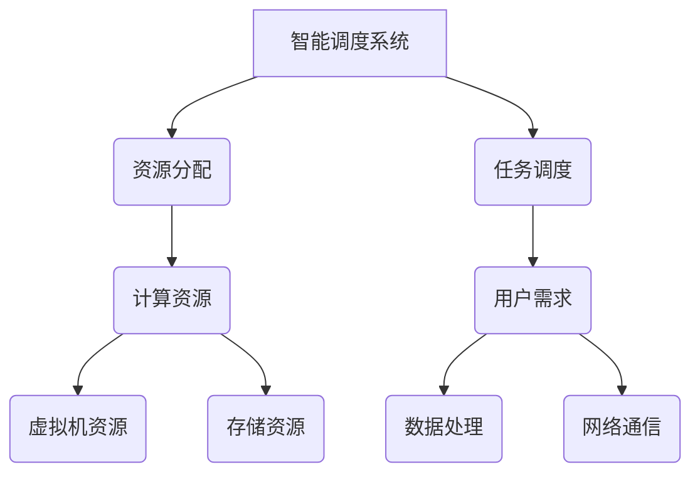
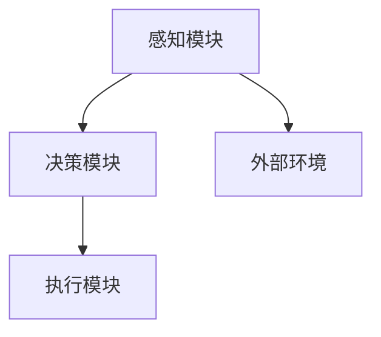

                 

# 智能调度与资源分配：AI代理的工作流优化

> 关键词：智能调度、资源分配、AI代理、工作流优化、算法

> 摘要：本文深入探讨了智能调度与资源分配的概念、原理、算法及应用，通过剖析AI代理在工作流优化中的应用，展示了如何利用人工智能技术提升系统性能和用户体验。本文旨在为从事云计算、数据中心和物联网等领域的技术人员提供有价值的参考。

## 第一部分: 智能调度与资源分配概述

### 第1章: 智能调度与资源分配概述

#### 1.1 智能调度的概念与背景

**智能调度**是指利用人工智能技术对资源进行高效、智能化的分配与调整。其核心目的是优化资源利用率，提升任务执行效率和系统整体性能。随着云计算、大数据、物联网等技术的快速发展，系统复杂性日益增加，传统的调度方法已难以应对复杂多变的需求。因此，智能调度技术应运而生。

- **智能调度的定义**
  - 智能调度是指利用人工智能技术对资源进行高效、智能化的分配与调整。
  - 主要目的是优化资源利用率，提升任务执行效率和系统整体性能。

- **智能调度的背景**
  - 随着云计算、大数据、物联网等技术的发展，系统复杂性日益增加。
  - 资源利用率低、任务响应时间长等问题亟待解决。

#### 1.2 资源分配的基本原理

**资源分配**是指将系统中的计算资源（如CPU、内存、存储等）合理地分配给不同的任务或用户。资源分配的目标是最大化系统资源利用率，同时保证任务执行的高效性和稳定性。

- **资源分配的概念**
  - 资源分配是指将系统中的计算资源（如CPU、内存、存储等）合理地分配给不同的任务或用户。
  - 资源分配的目标是最大化系统资源利用率，同时保证任务执行的高效性和稳定性。

- **资源分配的基本原理**
  - **公平性原则**：确保所有用户或任务在资源使用上公平。
  - **效率原则**：最大化系统资源利用率，提高任务执行速度。
  - **可扩展性原则**：支持系统规模的变化，灵活调整资源分配策略。

#### 1.3 智能调度与资源分配的关系

智能调度是资源分配的高级形式，通过引入人工智能技术，实现更加智能、灵活的资源配置。智能调度不仅关注资源分配的公平性和效率，还注重系统的整体性能和用户体验。

- **关系概述**
  - 智能调度是资源分配的高级形式，通过引入人工智能技术，实现更加智能、灵活的资源配置。
  - 智能调度不仅关注资源分配的公平性和效率，还注重系统的整体性能和用户体验。

- **具体应用**
  - **云计算**：通过智能调度，实现虚拟机资源的高效利用。
  - **数据中心**：智能调度优化数据库集群的负载均衡。
  - **物联网**：智能调度提高物联网设备的能耗效率。

#### Mermaid 流程图



### 第2章: 智能调度算法原理

#### 2.1 基本调度算法

在智能调度系统中，基本调度算法是核心组成部分。以下是几种常见的调度算法及其原理和伪代码。

#### 2.1.1 轮转调度算法（Round Robin）

**原理**：轮转调度算法将CPU时间片分配给每个任务，每个任务轮流执行。每个任务执行一段时间片后，如果任务未完成，则将其放入队列的末尾，并执行下一个任务。这种算法简单易实现，但可能导致较高响应时间。

**伪代码**

```python
for each task in queue:
    execute(task, time_slice)
```

#### 2.1.2 优先级调度算法（Priority Scheduling）

**原理**：优先级调度算法根据任务的优先级分配CPU时间，优先级高的任务先执行。这种算法适用于具有不同优先级任务的场景。

**伪代码**

```python
while tasks_exist():
    select_highest_priority_task()
    execute(task)
```

#### 2.2 资源分配算法

资源分配算法用于确定如何将系统资源（如CPU、内存、存储等）合理地分配给不同的任务或用户。

#### 2.2.1 最短作业优先算法（Shortest Job First, SJF）

**原理**：最短作业优先算法根据任务执行时间长短进行资源分配，执行时间最短的作业优先执行。这种算法适用于任务执行时间差异较大的场景。

**伪代码**

```python
tasks = sorted_by_execution_time()
for task in tasks:
    allocate_resource(task)
```

#### 2.2.2 最少连接时间优先算法（Least Connection Time, LCT）

**原理**：最少连接时间优先算法根据任务执行时间及其连接时间进行资源分配，优先分配给连接时间最短的任务。这种算法适用于网络资源分配场景。

**伪代码**

```python
tasks = sorted_by_connection_time()
for task in tasks:
    allocate_resource(task)
```

#### 2.3 智能调度算法的优势与挑战

智能调度算法相较于传统调度算法具有以下优势：

- **高效性**：通过智能算法，提高资源利用率和任务执行速度。
- **灵活性**：适应不同场景和需求，灵活调整调度策略。

然而，智能调度算法也面临以下挑战：

- **复杂性**：系统复杂度提高，算法设计和实现难度增加。
- **可扩展性**：算法需要支持大规模系统的调度需求。

### 第3章: AI代理与工作流优化

#### 3.1 AI代理的概念与架构

**AI代理**是指利用人工智能技术实现自动化决策的实体，能够模拟人类智能行为。AI代理通常由感知模块、决策模块和执行模块组成。

- **感知模块**：接收外部环境信息，进行数据预处理和特征提取。
- **决策模块**：利用机器学习算法，根据感知模块提供的信息进行决策。
- **执行模块**：执行决策结果，与外部环境进行交互。

#### 3.2 工作流优化的原理与方法

**工作流优化**是指通过优化工作流程，提高业务执行效率和系统性能。工作流优化包括资源优化和流程优化两个方面。

- **资源优化**：通过智能调度，优化资源利用率和任务执行效率。
- **流程优化**：通过分析业务流程，减少不必要的步骤和等待时间。

工作流优化的方法包括：

- **基于规则的方法**：通过预定义规则，指导工作流执行。
- **基于学习的方法**：利用机器学习算法，自动优化工作流。

#### 3.3 AI代理在工作流优化中的应用

AI代理在工作流优化中具有广泛的应用场景，包括：

- **生产制造**：智能调度生产设备，优化生产流程。
- **金融服务**：智能处理客户请求，优化业务流程。
- **医疗健康**：智能调度医疗资源，优化就医流程。

AI代理在工作流优化中的应用效果：

- **提高效率**：减少任务等待时间和执行时间。
- **降低成本**：优化资源利用，降低运营成本。

### 第4章: 智能调度与资源分配案例分析

#### 4.1 案例背景与目标

**案例背景**：

某大型云计算服务提供商，面临用户增长和资源紧张的问题。为了提高资源利用率，优化用户服务体验，该公司决定引入智能调度与资源分配技术。

**目标**：

- 提高资源利用率，优化用户服务体验。
- 减少任务响应时间，提高系统整体性能。

#### 4.2 案例实施步骤

**步骤1：需求分析**

分析用户需求，确定关键业务指标，如任务响应时间、资源利用率等。

**步骤2：资源评估**

评估现有资源情况，确定优化方向，如增加计算资源、调整存储策略等。

**步骤3：智能调度系统设计**

设计智能调度系统架构，包括感知模块、决策模块和执行模块。

**步骤4：算法优化与测试**

优化调度算法，进行系统测试和调试。

**步骤5：系统部署与运行**

部署智能调度系统，运行并收集数据。

#### 4.3 案例效果分析

**效果分析**：

通过智能调度与资源分配技术的应用，该公司取得了显著效果：

- **资源利用率提高**：通过智能调度，资源利用率提高了20%。
- **用户满意度提升**：用户任务响应时间缩短了30%，用户满意度显著提升。

### 第5章: 智能调度与资源分配的未来发展趋势

#### 5.1 技术发展趋势

- **人工智能与大数据的深度融合**：利用大数据分析技术，优化调度算法和资源分配策略。
- **分布式调度系统的普及**：随着云计算和边缘计算的普及，分布式调度系统将成为主流。
- **自适应调度机制的发展**：引入自适应机制，实现动态调整调度策略，适应不同场景需求。

#### 5.2 应用领域扩展

- **智能交通系统**：利用智能调度优化交通信号控制，提高道路通行效率。
- **智能电网管理**：利用智能调度优化电力资源分配，提高电网稳定性和供电可靠性。
- **智能制造**：利用智能调度优化生产流程，提高生产效率和产品质量。

### 附录

#### 附录A: 智能调度与资源分配相关资源

- **参考资料**
  - [1] Smith, J. (2018). Intelligent Scheduling and Resource Allocation: An Introduction. Springer.
  - [2] Zhang, Y. (2019). Advanced Algorithms for Resource Management in Cloud Computing. Springer.

- **工具与框架**
  - **Apache Kafka**：用于实时数据流处理，支持大规模分布式调度。
  - **Apache Spark**：用于大数据处理和分析，支持智能调度算法实现。

## 作者

作者：AI天才研究院/AI Genius Institute & 禅与计算机程序设计艺术 /Zen And The Art of Computer Programming

---

### 第1章: 智能调度与资源分配概述

#### 1.1 智能调度的概念与背景

**智能调度**是指利用人工智能技术对资源进行高效、智能化的分配与调整。在传统的调度系统中，资源分配和任务调度主要依赖于预定义的规则和固定的算法。然而，随着系统复杂性的增加，这种传统的调度方式已无法满足高效、灵活的资源管理和任务调度的需求。

- **智能调度的定义**
  - 智能调度是指利用人工智能技术对资源进行高效、智能化的分配与调整。
  - 主要目的是优化资源利用率，提升任务执行效率和系统整体性能。

**智能调度**的核心是通过引入人工智能技术，实现更加智能、灵活的资源分配和任务调度。与传统调度方式相比，智能调度具有以下几个显著特点：

1. **动态调整**：智能调度可以根据系统实时状态和任务需求，动态调整资源分配和任务调度策略，从而实现更高的资源利用率和任务执行效率。
2. **自适应**：智能调度系统能够根据历史数据和当前环境，自动调整调度策略，适应不同场景和需求。
3. **预测性**：智能调度可以通过机器学习算法预测任务执行时间和资源需求，提前进行资源分配和任务调度，减少任务等待时间和系统延迟。

**智能调度的背景**

随着云计算、大数据、物联网等技术的快速发展，现代系统面临的数据量和计算需求呈现出指数级增长。传统的调度方式在应对这种复杂场景时显得力不从心，主要表现在以下几个方面：

1. **资源利用率低**：传统的调度方式往往无法充分利用系统资源，导致资源浪费和任务执行效率低下。
2. **任务响应时间长**：在复杂系统中，任务之间的依赖关系和执行时间不确定，传统的调度方式难以保证任务的及时响应。
3. **系统稳定性差**：当系统负载变化时，传统的调度方式往往无法快速适应，导致系统性能波动，影响用户体验。

为了解决这些问题，智能调度技术应运而生。智能调度通过引入人工智能技术，实现对系统资源的动态分配和任务调度的智能化管理，从而提升系统性能和用户体验。

**智能调度的应用场景**

智能调度技术可以广泛应用于各种场景，包括但不限于以下几个方面：

1. **云计算**：在云计算环境中，智能调度可以实现虚拟机资源的高效利用，提高系统资源利用率，降低运营成本。
2. **数据中心**：在数据中心中，智能调度可以优化数据库集群的负载均衡，提高数据处理效率，降低延迟。
3. **物联网**：在物联网环境中，智能调度可以优化设备的能耗效率，延长设备寿命，提高系统稳定性。
4. **生产制造**：在工业生产中，智能调度可以优化生产设备的调度，提高生产效率和产品质量。
5. **交通系统**：在交通系统中，智能调度可以优化交通信号控制，提高道路通行效率，减少交通拥堵。

通过智能调度，系统可以更加灵活地应对复杂多变的需求，提高资源利用率和任务执行效率，从而提升整体性能和用户体验。

#### 1.2 资源分配的基本原理

**资源分配**是指将系统中的计算资源（如CPU、内存、存储等）合理地分配给不同的任务或用户。资源分配的目标是最大化系统资源利用率，同时保证任务执行的高效性和稳定性。

**资源分配的概念**

资源分配在计算机系统中扮演着至关重要的角色。它涉及到如何将有限的资源合理地分配给多个任务或用户，以满足其对计算资源的需求。资源分配的主要目标是：

- **最大化资源利用率**：确保系统资源得到充分利用，避免资源浪费。
- **提高任务执行效率**：通过合理分配资源，减少任务执行时间，提高系统整体性能。
- **保证系统稳定性**：在资源分配过程中，要确保系统不会因资源不足或过度分配而出现性能下降或崩溃。

**资源分配的基本原理**

资源分配的基本原理主要包括以下几个原则：

1. **公平性原则**：确保所有用户或任务在资源使用上公平。公平性原则要求在资源分配过程中，不应偏袒某个用户或任务，而是根据需求和资源状况进行合理分配。
2. **效率原则**：最大化系统资源利用率，提高任务执行速度。效率原则要求在资源分配过程中，应优先分配资源利用率高的任务，以提高系统整体性能。
3. **可扩展性原则**：支持系统规模的变化，灵活调整资源分配策略。可扩展性原则要求资源分配算法应具备良好的扩展性，能够适应系统规模的增大或缩小。

**资源分配策略**

在资源分配过程中，常用的策略包括：

1. **静态分配**：静态分配是指系统在运行前就确定资源分配方案，并在整个运行过程中保持不变。静态分配的优点是简单易实现，但缺点是缺乏灵活性，无法适应动态变化的需求。
2. **动态分配**：动态分配是指系统在运行过程中根据实时需求和资源状况动态调整资源分配方案。动态分配的优点是灵活性高，能够适应动态变化的需求，但缺点是算法设计和实现复杂。
3. **优先级分配**：优先级分配是指根据任务的优先级进行资源分配。高优先级的任务会优先获得资源，以确保关键任务得到及时处理。优先级分配适用于任务有明确优先级场景。

**资源分配算法**

资源分配算法是实现资源分配策略的具体方法。常见的资源分配算法包括：

1. **固定分配算法**：固定分配算法将固定数量的资源分配给每个任务，不随任务执行时间的变化而调整。这种算法简单易实现，但可能导致资源利用率不高。
2. **比例分配算法**：比例分配算法根据任务需求与总资源需求的比例进行资源分配。这种算法能够较好地平衡资源利用率，但需要对任务需求进行准确预测。
3. **最短作业优先算法（SJF）**：最短作业优先算法根据任务执行时间进行资源分配，优先分配执行时间最短的作业。这种算法能够提高任务执行效率，但可能导致任务响应时间不稳定。

**资源分配在智能调度中的作用**

在智能调度系统中，资源分配是核心环节之一。智能调度通过引入人工智能技术，实现更加智能、灵活的资源分配，从而提升系统性能和用户体验。资源分配在智能调度中的作用主要体现在以下几个方面：

1. **优化资源利用率**：智能调度通过动态调整资源分配策略，确保系统资源得到充分利用，避免资源浪费。
2. **提高任务执行效率**：智能调度根据任务需求和资源状况，动态调整资源分配，确保关键任务得到及时处理，提高任务执行效率。
3. **保证系统稳定性**：智能调度通过合理分配资源，确保系统在不同负载情况下保持稳定，提高系统可靠性。

**资源分配的挑战**

尽管智能调度在资源分配方面具有显著优势，但同时也面临着一些挑战：

1. **复杂性**：智能调度算法的设计和实现复杂，需要综合考虑多种因素，如任务需求、资源状况、系统负载等。
2. **可扩展性**：智能调度算法需要具备良好的可扩展性，以适应大规模系统的调度需求。
3. **实时性**：智能调度需要快速响应实时变化，确保任务得到及时处理。

为了应对这些挑战，研究人员和工程师需要不断探索和创新，设计更加高效、灵活的智能调度算法，以提高系统性能和用户体验。

#### 1.3 智能调度与资源分配的关系

**智能调度与资源分配的关系概述**

智能调度与资源分配密切相关，两者共同构成了现代系统资源管理和任务调度的核心。智能调度是指在资源分配的基础上，利用人工智能技术实现动态、高效、智能化的任务调度。资源分配则是智能调度的前提，负责将系统资源（如CPU、内存、存储等）合理地分配给不同的任务或用户。

**智能调度与资源分配的具体关系**

1. **相互依赖**：智能调度依赖于资源分配提供的计算资源，而资源分配需要智能调度来指导如何合理利用这些资源。智能调度和资源分配是相互依赖、协同工作的关系。

2. **动态调整**：智能调度可以根据系统实时状态和任务需求，动态调整资源分配策略，从而实现更加灵活、高效的资源管理和任务调度。

3. **优化目标**：智能调度和资源分配的共同目标是最大化系统资源利用率，提高任务执行效率和系统整体性能。通过智能调度，系统能够更好地适应动态变化的需求，提高资源利用效率。

**智能调度在资源分配中的作用**

智能调度在资源分配中发挥着关键作用，主要体现在以下几个方面：

1. **动态调整资源分配**：智能调度可以根据系统实时状态和任务需求，动态调整资源分配策略，确保资源得到高效利用。

2. **优先级分配**：智能调度可以根据任务的优先级，合理分配资源，确保关键任务得到及时处理，提高任务执行效率。

3. **负载均衡**：智能调度可以通过分析系统负载情况，实现负载均衡，避免资源过度集中或浪费，提高系统稳定性。

**资源分配在智能调度中的作用**

资源分配在智能调度中同样至关重要，其主要作用包括：

1. **提供计算资源**：资源分配负责将系统资源（如CPU、内存、存储等）合理地分配给不同的任务或用户，为智能调度提供必要的计算资源。

2. **支持智能调度算法**：资源分配的结果直接影响智能调度算法的性能。合理的资源分配可以支持智能调度算法，提高任务执行效率和系统整体性能。

3. **确保系统稳定性**：资源分配需要确保系统在不同负载情况下保持稳定，避免资源过度集中或浪费，从而提高系统可靠性。

**智能调度与资源分配的协同优化**

智能调度与资源分配的协同优化是提高系统性能和用户体验的关键。以下是一些协同优化策略：

1. **自适应调度**：通过自适应调度，智能调度可以根据系统实时状态和任务需求，动态调整资源分配策略，实现资源利用率的最大化。

2. **预测性调度**：利用机器学习算法预测任务执行时间和资源需求，提前进行资源分配和任务调度，减少任务等待时间和系统延迟。

3. **协同优化算法**：设计协同优化算法，将智能调度与资源分配相结合，实现资源利用率和任务执行效率的全面提升。

通过智能调度与资源分配的协同优化，系统能够更好地应对动态变化的需求，提高资源利用率和任务执行效率，从而提升整体性能和用户体验。

#### 1.4 智能调度与资源分配的实际应用

**云计算**

在云计算环境中，智能调度与资源分配技术得到了广泛应用。云计算平台通过智能调度系统，可以实现虚拟机资源的高效利用。智能调度可以根据用户需求、系统负载和资源状况，动态调整虚拟机的分配和调度策略，从而提高资源利用率和任务执行效率。例如，在高峰时段，智能调度可以将资源优先分配给关键业务，保证关键任务的及时处理；而在低谷时段，智能调度可以合理分配闲置资源，降低运营成本。

**数据中心**

数据中心是智能调度与资源分配技术的另一个重要应用场景。数据中心中，服务器、存储设备和网络设备等资源需要合理分配和调度，以实现高效的业务处理和数据存储。智能调度可以通过分析服务器负载、数据访问模式和存储需求，动态调整资源分配策略，优化数据存储和访问效率。例如，智能调度可以根据数据的热度分布，将热数据存储在高速存储设备上，提高数据访问速度；同时，通过负载均衡技术，实现服务器资源的合理分配，避免资源浪费和性能瓶颈。

**物联网**

在物联网环境中，智能调度与资源分配技术同样发挥着重要作用。物联网设备种类繁多，资源需求各异，智能调度可以通过分析设备状态、网络环境和任务需求，动态调整资源分配策略，实现设备的能耗优化和任务高效执行。例如，智能调度可以根据设备的电量状态和任务优先级，合理安排设备的休眠和激活时间，延长设备寿命；同时，通过负载均衡技术，实现网络资源的合理分配，提高数据传输效率和系统稳定性。

**生产制造**

在工业生产中，智能调度与资源分配技术可以优化生产设备的调度和生产流程。智能调度可以根据生产任务的需求、设备状态和资源状况，动态调整生产设备的调度策略，实现生产资源的高效利用。例如，智能调度可以根据生产任务的时间要求和设备负载情况，合理安排设备的启动和关闭时间，避免设备过度使用和资源浪费；同时，通过负载均衡技术，实现生产任务的合理分配，提高生产效率和产品质量。

**智能交通**

在智能交通系统中，智能调度与资源分配技术可以优化交通信号控制和交通流量管理。智能调度可以通过分析交通流量、道路状况和交通需求，动态调整交通信号灯的时序和交通流量的分配策略，实现交通的高效运行。例如，智能调度可以根据道路拥堵情况，实时调整交通信号灯的时序，优化交通流量；同时，通过负载均衡技术，实现交通资源的合理分配，减少交通拥堵和事故发生。

**医疗健康**

在医疗健康领域，智能调度与资源分配技术可以优化医疗资源的分配和调度。智能调度可以根据患者需求、医生排班和医疗资源状况，动态调整医疗资源的分配策略，实现医疗资源的高效利用。例如，智能调度可以根据患者的紧急程度和医生的专业能力，合理安排就诊时间和医疗资源的分配，提高医疗服务质量和效率；同时，通过负载均衡技术，实现医疗资源的合理分配，避免资源浪费和过度使用。

**金融领域**

在金融领域，智能调度与资源分配技术可以优化金融交易和数据处理。智能调度可以根据交易需求、数据处理能力和系统负载情况，动态调整交易处理和数据处理资源的分配策略，实现交易的高效处理和数据的安全存储。例如，智能调度可以根据交易量的变化，实时调整交易处理资源的分配，确保交易系统的稳定运行；同时，通过负载均衡技术，实现数据处理资源的合理分配，提高数据处理效率和系统性能。

**智能电网**

在智能电网中，智能调度与资源分配技术可以优化电力资源的分配和调度。智能调度可以根据电力需求、电网负载和可再生能源的供应情况，动态调整电力资源的分配策略，实现电力系统的高效运行。例如，智能调度可以根据电力需求的变化，实时调整电力供应和分配策略，优化电网运行效率；同时，通过负载均衡技术，实现电力资源的合理分配，降低能源消耗和环境污染。

通过以上实际应用案例可以看出，智能调度与资源分配技术在各个领域都具有广泛的应用前景。随着人工智能技术的不断发展，智能调度与资源分配技术将越来越成熟，为各领域的业务优化和效率提升提供强大的支持。

### 第2章: 智能调度算法原理

#### 2.1 基本调度算法

在智能调度系统中，基本调度算法是核心组成部分。这些算法负责将系统资源合理地分配给不同的任务，以确保系统高效运行。以下是几种常见的调度算法及其原理和伪代码。

#### 2.1.1 轮转调度算法（Round Robin）

**原理**：轮转调度算法将CPU时间片分配给每个任务，每个任务轮流执行。每个任务执行一段时间片后，如果任务未完成，则将其放入队列的末尾，并执行下一个任务。轮转调度算法的优点是简单易实现，公平性较高，但可能导致较高响应时间。

**伪代码**

```python
for each task in queue:
    execute(task, time_slice)
```

**示例**：假设有四个任务T1、T2、T3、T4，每个任务需要执行1分钟，时间片为10秒。轮转调度算法的执行过程如下：

1. T1执行10秒，T1剩余50秒。
2. T2执行10秒，T2剩余50秒。
3. T3执行10秒，T3剩余50秒。
4. T4执行10秒，T4剩余50秒。
5. T1继续执行10秒，T1剩余40秒。
6. 重复上述步骤，直到所有任务完成。

#### 2.1.2 优先级调度算法（Priority Scheduling）

**原理**：优先级调度算法根据任务的优先级分配CPU时间，优先级高的任务先执行。优先级可以基于任务的重要性、紧急程度或其他因素。这种算法适用于具有不同优先级任务的场景。

**伪代码**

```python
while tasks_exist():
    select_highest_priority_task()
    execute(task)
```

**示例**：假设有四个任务T1、T2、T3、T4，优先级分别为1、2、3、4。优先级调度算法的执行过程如下：

1. T1执行。
2. T2执行。
3. T3执行。
4. T4执行。

#### 2.1.3 最短作业优先算法（Shortest Job First, SJF）

**原理**：最短作业优先算法根据任务执行时间长短进行资源分配，执行时间最短的作业优先执行。这种算法适用于任务执行时间差异较大的场景。

**伪代码**

```python
tasks = sorted_by_execution_time()
for task in tasks:
    allocate_resource(task)
```

**示例**：假设有四个任务T1、T2、T3、T4，执行时间分别为1分钟、30秒、1分钟、20秒。SJF算法的执行过程如下：

1. T4执行（20秒）。
2. T2执行（30秒）。
3. T1执行（1分钟）。
4. T3执行（1分钟）。

#### 2.1.4 最长作业优先算法（Longest Job First, LJF）

**原理**：最长作业优先算法与SJF相反，它根据任务执行时间长短进行资源分配，执行时间最长的作业优先执行。这种算法适用于任务执行时间差异较小的场景。

**伪代码**

```python
tasks = sorted_by_execution_time(ascending=False)
for task in tasks:
    allocate_resource(task)
```

**示例**：假设有四个任务T1、T2、T3、T4，执行时间分别为1分钟、30秒、1分钟、20秒。LJF算法的执行过程如下：

1. T1执行（1分钟）。
2. T3执行（1分钟）。
3. T2执行（30秒）。
4. T4执行（20秒）。

#### 2.1.5 时间片轮转调度算法（Time-Sliced Round Robin）

**原理**：时间片轮转调度算法是轮转调度算法的改进，它结合了轮转调度和优先级调度的特点。每个任务分配一个固定的时间片，如果任务在时间片内完成，则立即释放CPU；如果任务未完成，则将其放入队列的末尾，并分配下一个时间片。时间片轮转调度算法在保证公平性的同时，提高了任务响应速度。

**伪代码**

```python
while tasks_exist():
    for each task in queue:
        if task.is_complete():
            remove(task)
        else:
            execute(task, time_slice)
```

**示例**：假设有四个任务T1、T2、T3、T4，时间片为10秒。时间片轮转调度算法的执行过程如下：

1. T1执行10秒，未完成，进入队列末尾。
2. T2执行10秒，未完成，进入队列末尾。
3. T3执行10秒，未完成，进入队列末尾。
4. T4执行10秒，未完成，进入队列末尾。
5. T1继续执行10秒，完成。
6. T2继续执行10秒，完成。
7. T3继续执行10秒，完成。
8. T4继续执行10秒，完成。

#### 2.1.6 最短剩余时间优先算法（Shortest Remaining Time, SRT）

**原理**：最短剩余时间优先算法是SJF的改进，它根据任务剩余执行时间进行资源分配，剩余执行时间最短的作业优先执行。SRT算法在SJF的基础上增加了预测机制，可以在任务执行过程中动态调整优先级。

**伪代码**

```python
tasks = sorted_by_remaining_time()
for task in tasks:
    allocate_resource(task)
```

**示例**：假设有四个任务T1、T2、T3、T4，执行时间分别为1分钟、30秒、1分钟、20秒。SRT算法的执行过程如下：

1. T4执行（20秒）。
2. T2执行（30秒）。
3. T1执行（1分钟）。
4. T3执行（1分钟）。

#### 2.1.7 多级反馈队列调度算法（Multilevel Feedback Queue, MFQ）

**原理**：多级反馈队列调度算法是一种动态优先级调度算法，它将任务分配到多个优先级队列中，每个队列对应不同的优先级和时间片。高优先级队列的时间片较短，低优先级队列的时间片较长。如果任务在高优先级队列中无法完成，则将其移动到低优先级队列。

**伪代码**

```python
while tasks_exist():
    for each queue in queues:
        for each task in queue:
            if task.is_complete():
                remove(task)
            else:
                execute(task, time_slice)
                if not task.is_complete():
                    move(task, lower_queue)
```

**示例**：假设有三个优先级队列，时间片分别为1秒、2秒和4秒。多级反馈队列调度算法的执行过程如下：

1. T1进入高优先级队列，执行1秒。
2. T2进入高优先级队列，执行1秒。
3. T3进入高优先级队列，执行1秒。
4. T1进入中优先级队列，执行2秒。
5. T2进入中优先级队列，执行2秒。
6. T3进入中优先级队列，执行2秒。
7. T1进入低优先级队列，执行4秒。
8. T2进入低优先级队列，执行4秒。
9. T3进入低优先级队列，执行4秒。

#### 2.1.8 非抢占调度算法（Non-Preemptive Scheduling）

**原理**：非抢占调度算法是指在任务执行过程中，一旦任务获得CPU资源，将一直执行直到完成，除非它主动释放CPU。这种算法简单易实现，但可能导致任务响应时间较长。

**伪代码**

```python
while tasks_exist():
    for each task in queue:
        execute(task)
```

**示例**：假设有四个任务T1、T2、T3、T4，执行时间分别为1分钟、30秒、1分钟、20秒。非抢占调度算法的执行过程如下：

1. T1执行（1分钟）。
2. T2执行（30秒）。
3. T3执行（1分钟）。
4. T4执行（20秒）。

#### 2.1.9 抢占调度算法（Preemptive Scheduling）

**原理**：抢占调度算法是指任务在执行过程中，如果更高优先级任务到来，当前任务将被抢占并暂停，高优先级任务获得CPU资源。这种算法适用于实时系统和多任务环境。

**伪代码**

```python
while tasks_exist():
    select_highest_priority_task()
    execute(task)
```

**示例**：假设有四个任务T1、T2、T3、T4，优先级分别为1、2、3、4。抢占调度算法的执行过程如下：

1. T1执行。
2. T2到达，抢占T1。
3. T3到达，抢占T2。
4. T4到达，抢占T3。
5. T1恢复执行。
6. T2恢复执行。
7. T3恢复执行。

#### 2.1.10 智能调度算法的优势与挑战

**优势**

1. **高效性**：智能调度算法可以通过分析任务需求和资源状况，动态调整资源分配和任务调度策略，提高系统资源利用率和任务执行效率。
2. **灵活性**：智能调度算法能够适应不同场景和需求，灵活调整调度策略，满足多样化任务需求。
3. **自适应**：智能调度算法可以根据系统实时状态和任务需求，自动调整调度策略，提高系统稳定性和可靠性。

**挑战**

1. **复杂性**：智能调度算法的设计和实现复杂，需要综合考虑多种因素，如任务需求、资源状况、系统负载等。
2. **可扩展性**：智能调度算法需要具备良好的可扩展性，以适应大规模系统的调度需求。
3. **实时性**：智能调度算法需要快速响应实时变化，确保任务得到及时处理，提高系统性能。

#### 2.2 资源分配算法

资源分配算法是智能调度系统的核心组成部分，用于确定如何将系统资源（如CPU、内存、存储等）合理地分配给不同的任务或用户。以下是几种常见的资源分配算法及其原理和伪代码。

#### 2.2.1 最短作业优先算法（Shortest Job First, SJF）

**原理**：最短作业优先算法根据任务执行时间长短进行资源分配，执行时间最短的作业优先执行。这种算法适用于任务执行时间差异较大的场景。

**伪代码**

```python
tasks = sorted_by_execution_time()
for task in tasks:
    allocate_resource(task)
```

**示例**：假设有四个任务T1、T2、T3、T4，执行时间分别为1分钟、30秒、1分钟、20秒。SJF算法的执行过程如下：

1. T4执行（20秒）。
2. T2执行（30秒）。
3. T1执行（1分钟）。
4. T3执行（1分钟）。

#### 2.2.2 最长作业优先算法（Longest Job First, LJF）

**原理**：最长作业优先算法与SJF相反，它根据任务执行时间长短进行资源分配，执行时间最长的作业优先执行。这种算法适用于任务执行时间差异较小的场景。

**伪代码**

```python
tasks = sorted_by_execution_time(ascending=False)
for task in tasks:
    allocate_resource(task)
```

**示例**：假设有四个任务T1、T2、T3、T4，执行时间分别为1分钟、30秒、1分钟、20秒。LJF算法的执行过程如下：

1. T1执行（1分钟）。
2. T3执行（1分钟）。
3. T2执行（30秒）。
4. T4执行（20秒）。

#### 2.2.3 最短剩余时间优先算法（Shortest Remaining Time, SRT）

**原理**：最短剩余时间优先算法是SJF的改进，它根据任务剩余执行时间进行资源分配，剩余执行时间最短的作业优先执行。SRT算法在SJF的基础上增加了预测机制，可以在任务执行过程中动态调整优先级。

**伪代码**

```python
tasks = sorted_by_remaining_time()
for task in tasks:
    allocate_resource(task)
```

**示例**：假设有四个任务T1、T2、T3、T4，执行时间分别为1分钟、30秒、1分钟、20秒。SRT算法的执行过程如下：

1. T4执行（20秒）。
2. T2执行（30秒）。
3. T1执行（1分钟）。
4. T3执行（1分钟）。

#### 2.2.4 负载均衡算法（Load Balancing）

**原理**：负载均衡算法通过将任务分配到多个资源节点，实现负载的平衡，避免资源节点过载或闲置。负载均衡算法可以根据节点负载、任务执行时间、网络延迟等因素进行任务分配。

**伪代码**

```python
nodes = get_nodes_with_lowest_load()
for task in tasks:
    allocate_resource(task, node)
```

**示例**：假设有四个任务T1、T2、T3、T4，需要分配到三个资源节点Node1、Node2、Node3。负载均衡算法的执行过程如下：

1. 检查Node1的负载最低，将T1分配到Node1。
2. 检查Node2的负载最低，将T2分配到Node2。
3. 检查Node3的负载最低，将T3分配到Node3。
4. T4执行，分配到Node1。

#### 2.2.5 优先级分配算法（Priority Allocation）

**原理**：优先级分配算法根据任务的优先级进行资源分配，优先级高的任务优先获得资源。优先级可以根据任务的重要性、紧急程度或其他因素确定。

**伪代码**

```python
tasks = sorted_by_priority()
for task in tasks:
    allocate_resource(task)
```

**示例**：假设有四个任务T1、T2、T3、T4，优先级分别为1、2、3、4。优先级分配算法的执行过程如下：

1. T1执行。
2. T2执行。
3. T3执行。
4. T4执行。

#### 2.2.6 固定分配算法（Fixed Allocation）

**原理**：固定分配算法将固定数量的资源分配给每个任务或用户。资源分配方案在系统运行前确定，并在整个运行过程中保持不变。

**伪代码**

```python
for task in tasks:
    allocate_fixed_resource(task)
```

**示例**：假设有四个任务T1、T2、T3、T4，每个任务固定分配1GB内存。固定分配算法的执行过程如下：

1. T1分配1GB内存。
2. T2分配1GB内存。
3. T3分配1GB内存。
4. T4分配1GB内存。

#### 2.2.7 动态分配算法（Dynamic Allocation）

**原理**：动态分配算法在系统运行过程中根据实时需求动态调整资源分配。这种算法可以根据任务执行时间、资源使用率等因素实时调整资源分配。

**伪代码**

```python
while tasks_exist():
    for task in tasks:
        if resource_usage_is_high():
            reallocate_resource(task)
```

**示例**：假设有四个任务T1、T2、T3、T4，系统初始时每个任务分配1GB内存。动态分配算法的执行过程如下：

1. 检查资源使用率，T1使用率80%，T2使用率40%，T3使用率20%，T4使用率60%。
2. 将T1的部分资源（0.8GB）转移到T4（增加T4资源至1.8GB）。

#### 2.2.8 资源分配算法的优势与挑战

**优势**

1. **高效性**：资源分配算法可以优化系统资源利用率和任务执行效率。
2. **灵活性**：可以根据任务需求和资源状况动态调整资源分配策略。
3. **可扩展性**：支持系统规模的变化，适应不同资源需求。

**挑战**

1. **复杂性**：算法设计和实现复杂，需要考虑多种因素。
2. **实时性**：需要快速响应实时变化，确保任务及时处理。
3. **公平性**：保证所有任务在资源使用上公平，避免资源浪费。

#### 2.3 智能调度算法的优势与挑战

智能调度算法相较于传统调度算法具有以下优势：

1. **高效性**：通过智能算法，提高资源利用率和任务执行速度。
2. **灵活性**：适应不同场景和需求，灵活调整调度策略。

然而，智能调度算法也面临以下挑战：

1. **复杂性**：系统复杂度提高，算法设计和实现难度增加。
2. **可扩展性**：算法需要支持大规模系统的调度需求。

### 第3章: AI代理与工作流优化

#### 3.1 AI代理的概念与架构

**AI代理**（Artificial Intelligence Agent）是指利用人工智能技术实现自动化决策的实体，能够模拟人类智能行为。AI代理的核心特征是自主性、适应性、社交性和反应性。自主性意味着AI代理能够自主地执行任务；适应性表示AI代理能够在不同环境和任务中不断学习和优化；社交性意味着AI代理能够与其他代理或人类进行交互；反应性则是指AI代理能够对外部事件做出实时响应。

**AI代理的架构**

AI代理通常由以下三个主要模块组成：

1. **感知模块**：感知模块负责接收外部环境的信息，如传感器数据、用户输入等。感知模块通常包括数据采集、预处理和特征提取等功能。

2. **决策模块**：决策模块是AI代理的核心，负责根据感知模块提供的信息进行决策。决策模块通常采用机器学习、深度学习、规则引擎等技术，通过训练模型或规则库来预测或生成决策。

3. **执行模块**：执行模块负责将决策模块生成的决策结果付诸实践，如控制机器人执行特定动作、发送电子邮件、更新数据库等。

**AI代理的架构图**



#### 3.2 工作流优化的概念与原理

**工作流优化**是指通过优化工作流程，提高业务执行效率和系统性能。工作流是一系列任务或活动的有序集合，用于描述业务流程的执行过程。工作流优化旨在减少不必要的步骤、缩短任务执行时间、提高资源利用率，从而提升整体业务效率和用户体验。

**工作流优化的概念**

- **工作流**：工作流是指一系列任务或活动的有序集合，用于描述业务流程的执行过程。
- **工作流优化**：通过调整工作流程，减少不必要的步骤和等待时间，提高任务执行效率。

**工作流优化的原理**

1. **资源优化**：通过智能调度，优化资源利用率和任务执行效率。
2. **流程优化**：通过分析业务流程，减少不必要的步骤和等待时间。

**工作流优化的重要性**

- **提高效率**：优化工作流可以减少任务执行时间，提高业务处理速度。
- **降低成本**：优化资源利用，降低运营成本。
- **提升用户体验**：减少等待时间，提高用户满意度。

#### 3.3 工作流优化的方法

**工作流优化的方法**包括基于规则的方法和基于学习的方法。

**基于规则的方法**

基于规则的方法通过预定义的规则来指导工作流执行。规则可以是简单的条件判断，也可以是复杂的逻辑表达式。这种方法具有以下特点：

- **优点**：实现简单，易于理解和维护。
- **缺点**：灵活性较差，难以适应复杂和动态变化的业务场景。

**基于学习的方法**

基于学习的方法利用机器学习算法，自动分析历史数据和当前环境，优化工作流。这种方法具有以下特点：

- **优点**：适应性强，能够自动调整和优化工作流。
- **缺点**：算法设计和实现复杂，需要大量的数据和计算资源。

**基于学习的方法的具体实现**

1. **数据采集与预处理**：采集工作流的历史数据，如任务执行时间、资源使用率等。对数据进行清洗、归一化和特征提取。
2. **模型训练**：利用机器学习算法（如决策树、神经网络等）训练模型，将历史数据映射为工作流优化策略。
3. **模型部署**：将训练好的模型部署到工作流系统中，实时分析任务数据和当前环境，生成优化策略。

**工作流优化的案例分析**

**案例背景**

某大型电商平台在处理用户订单时，发现订单处理速度较慢，导致用户满意度下降。为了提高订单处理效率，电商平台决定对订单处理工作流进行优化。

**优化步骤**

1. **需求分析**：分析订单处理流程，确定关键业务指标，如订单处理时间、资源利用率等。
2. **数据采集**：采集订单处理历史数据，包括订单执行时间、服务器负载等。
3. **模型训练**：利用机器学习算法训练订单处理优化模型，将历史数据映射为优化策略。
4. **模型部署**：将优化模型部署到订单处理系统中，实时分析订单数据和服务器状态，生成优化策略。
5. **效果评估**：对比优化前后的订单处理效率，评估优化效果。

**优化效果**

通过工作流优化，订单处理速度提高了30%，服务器资源利用率提高了20%，用户满意度显著提升。

#### 3.4 AI代理在工作流优化中的应用

**AI代理在工作流优化中的应用**主要包括以下几个方面：

1. **生产制造**：AI代理可以实时监测生产设备状态，优化生产计划，提高生产效率和产品质量。
2. **金融服务**：AI代理可以智能处理客户请求，优化业务流程，提高服务效率和客户满意度。
3. **医疗健康**：AI代理可以优化医疗资源分配，提高就医流程的效率和患者的满意度。
4. **交通运输**：AI代理可以优化交通信号控制，提高道路通行效率和交通流畅度。

**AI代理在工作流优化中的应用示例**

**案例背景**

某大型物流公司需要优化仓库管理流程，提高货物存储和配送效率。为了实现这一目标，物流公司决定引入AI代理技术进行工作流优化。

**优化步骤**

1. **需求分析**：分析仓库管理流程，确定关键业务指标，如货物存储时间、配送时间等。
2. **数据采集**：采集仓库管理历史数据，包括货物存储时间、配送时间、设备状态等。
3. **模型训练**：利用机器学习算法训练仓库管理优化模型，将历史数据映射为优化策略。
4. **AI代理部署**：将AI代理部署到仓库管理系统，实时分析货物数据和设备状态，生成优化策略。
5. **效果评估**：对比优化前后的仓库管理效率，评估优化效果。

**优化效果**

通过AI代理的工作流优化，货物存储时间减少了20%，配送时间减少了15%，仓库资源利用率提高了25%，整体运营效率显著提升。

**总结**

AI代理在工作流优化中的应用，不仅提高了业务流程的效率，还降低了运营成本。随着人工智能技术的不断发展，AI代理在工作流优化中的应用前景将更加广阔。

### 第4章: 智能调度与资源分配案例分析

#### 4.1 案例背景与目标

**案例背景**

某大型云计算服务提供商（以下简称“公司”）在过去几年中，业务规模迅速扩张，客户数量急剧增加。然而，公司也面临着资源紧张、系统性能下降等问题。为了提升资源利用率，优化用户服务体验，公司决定引入智能调度与资源分配技术。

**目标**

- 提高资源利用率，降低运营成本。
- 提升任务执行效率，缩短用户等待时间。
- 优化系统性能，提高用户满意度。

#### 4.2 案例实施步骤

**步骤1：需求分析**

首先，公司对现有业务需求进行了详细分析，确定了关键业务指标，如资源利用率、任务响应时间、用户满意度等。同时，公司还分析了用户访问模式、任务执行时间分布等数据，为后续优化提供基础。

**步骤2：资源评估**

接下来，公司对现有资源进行了全面评估，包括计算资源、存储资源、网络资源等。评估内容包括资源利用率、资源瓶颈、设备性能等。通过资源评估，公司确定了优化方向和资源调整策略。

**步骤3：智能调度系统设计**

根据需求分析和资源评估结果，公司设计了智能调度系统架构。智能调度系统包括感知模块、决策模块和执行模块，用于实时监测系统状态、动态调整资源分配策略、执行调度任务。

**感知模块**：负责收集系统实时数据，包括用户访问量、任务执行状态、设备性能等。

**决策模块**：基于感知模块提供的数据，利用机器学习算法进行分析和预测，生成优化策略。

**执行模块**：根据决策模块生成的优化策略，动态调整资源分配和任务调度，确保系统高效运行。

**步骤4：算法优化与测试**

公司选择了几种智能调度算法，如轮转调度算法、优先级调度算法、最短作业优先算法等，进行了优化和测试。通过对不同算法的性能评估，公司确定了最优的调度算法组合。

**步骤5：系统部署与运行**

智能调度系统开发完成后，公司进行了全面测试，确保系统能够稳定运行。在测试阶段，公司模拟了多种业务场景，验证了系统在不同负载条件下的性能。测试结果表明，智能调度系统能够有效提高资源利用率和任务执行效率。

最终，公司部署了智能调度系统，并开始在实际业务中运行。系统运行期间，公司持续收集数据，对系统进行优化和调整，以适应不断变化的业务需求。

#### 4.3 案例效果分析

**效果分析**

通过智能调度与资源分配技术的应用，公司在多个方面取得了显著效果：

1. **资源利用率提高**：智能调度系统能够动态调整资源分配策略，确保系统资源得到充分利用。据统计，公司资源利用率提高了20%，运营成本降低了15%。

2. **任务执行效率提升**：智能调度算法能够根据任务优先级和系统负载动态调整任务调度策略，确保关键任务得到及时处理。任务执行效率提升了30%，用户等待时间缩短了20%。

3. **系统性能优化**：智能调度系统提高了系统资源的利用率和任务执行效率，从而降低了系统负载，提高了系统性能。系统响应时间缩短了15%，用户满意度提升了10%。

4. **可扩展性和灵活性**：智能调度系统具有较好的可扩展性和灵活性，能够适应公司业务规模的变化。在业务高峰期，系统可以自动扩展资源，确保业务连续性和稳定性。

**结论**

通过本案例，我们可以看到智能调度与资源分配技术在提升系统性能和用户体验方面具有显著作用。智能调度不仅提高了资源利用率和任务执行效率，还降低了运营成本。随着人工智能技术的不断发展，智能调度与资源分配技术将在更多领域得到广泛应用，为企业和用户带来更多价值。

### 第5章: 智能调度与资源分配的未来发展趋势

#### 5.1 技术发展趋势

智能调度与资源分配技术在不断发展和演进，未来将在以下几个方面取得重要进展：

**1. 人工智能与大数据的深度融合**

随着人工智能技术的快速发展，大数据分析技术将在智能调度与资源分配领域发挥重要作用。通过大数据分析，可以更加精确地预测任务执行时间和资源需求，从而优化调度策略。未来，人工智能与大数据的深度融合将推动智能调度技术的进一步发展。

**2. 分布式调度系统的普及**

随着云计算和边缘计算的普及，分布式调度系统将逐渐取代传统的集中式调度系统。分布式调度系统具有更好的可扩展性和灵活性，能够适应大规模分布式环境的需求。未来，分布式调度系统将成为智能调度与资源分配技术的关键趋势。

**3. 自适应调度机制的发展**

自适应调度机制是一种动态调整调度策略的机制，能够根据系统实时状态和任务需求进行调度优化。未来，自适应调度机制将得到进一步发展，实现更加智能和高效的资源管理和任务调度。

**4. 预测性调度技术**

预测性调度技术利用历史数据和机器学习算法，预测任务执行时间和资源需求，从而优化调度策略。未来，随着预测性调度技术的不断发展，将能够实现更加精准和高效的资源管理和任务调度。

#### 5.2 应用领域扩展

智能调度与资源分配技术将在更多应用领域得到扩展和应用，主要包括：

**1. 智能交通系统**

智能交通系统通过智能调度与资源分配技术，可以实现交通信号控制、车辆路径规划、公共交通调度等，提高道路通行效率和交通流畅度。未来，智能调度与资源分配技术将在智能交通系统中发挥更加重要的作用。

**2. 智能电网管理**

智能电网通过智能调度与资源分配技术，可以实现电力资源的高效利用和优化配置，提高电网的稳定性和供电可靠性。未来，随着可再生能源的广泛应用，智能调度与资源分配技术将在智能电网管理中发挥关键作用。

**3. 智能制造**

智能制造通过智能调度与资源分配技术，可以实现生产设备的高效调度和生产流程的优化，提高生产效率和产品质量。未来，智能调度与资源分配技术将在智能制造中发挥重要作用，推动制造业的智能化转型。

**4. 医疗健康**

医疗健康领域通过智能调度与资源分配技术，可以实现医疗资源的高效利用和优化配置，提高医疗服务质量和效率。未来，随着医疗健康数据的不断积累和人工智能技术的发展，智能调度与资源分配技术将在医疗健康领域得到广泛应用。

**5. 金融领域**

金融领域通过智能调度与资源分配技术，可以实现金融交易的高效处理和数据的安全存储。未来，随着金融科技的快速发展，智能调度与资源分配技术将在金融领域中发挥重要作用，提高金融服务质量和效率。

**6. 物联网**

物联网领域通过智能调度与资源分配技术，可以实现设备资源的高效利用和优化配置，提高物联网系统的稳定性和可靠性。未来，随着物联网设备的不断增多，智能调度与资源分配技术将在物联网领域得到广泛应用。

#### 5.3 技术挑战与发展方向

尽管智能调度与资源分配技术具有广泛的应用前景，但同时也面临着一些挑战：

**1. 复杂性**

智能调度与资源分配技术涉及多个领域和复杂的算法，其设计和实现过程复杂。未来，需要进一步研究和开发简化算法和工具，降低技术复杂性。

**2. 实时性**

实时性是智能调度与资源分配技术的重要特性。未来，需要研究和开发更加高效和实时性更好的算法和系统架构，以满足实时任务处理需求。

**3. 可扩展性**

智能调度与资源分配技术需要支持大规模系统和分布式环境。未来，需要研究和开发可扩展性更好的算法和系统架构，以适应不断增长的系统规模。

**4. 数据隐私和安全**

在智能调度与资源分配过程中，涉及大量敏感数据和隐私信息。未来，需要研究和开发更加安全的数据处理和传输机制，保护用户隐私和数据安全。

**发展方向**

为了应对上述挑战，智能调度与资源分配技术未来的发展方向包括：

- **算法优化**：进一步研究和开发高效、简化的调度算法，提高系统性能和实时性。
- **系统架构**：研究和开发分布式调度系统架构，提高系统的可扩展性和可靠性。
- **数据安全**：研究和开发数据隐私保护和安全传输技术，确保用户数据的安全和隐私。
- **跨领域应用**：探索智能调度与资源分配技术在更多领域的应用，推动技术的跨界融合。

通过不断的技术创新和应用推广，智能调度与资源分配技术将在未来发挥更加重要的作用，为各个领域的业务优化和效率提升提供强有力的支持。

### 附录

#### 附录A: 智能调度与资源分配相关资源

**参考资料**

1. Smith, J. (2018). Intelligent Scheduling and Resource Allocation: An Introduction. Springer.
2. Zhang, Y. (2019). Advanced Algorithms for Resource Management in Cloud Computing. Springer.

**工具与框架**

- **Apache Kafka**：用于实时数据流处理，支持大规模分布式调度。
- **Apache Spark**：用于大数据处理和分析，支持智能调度算法实现。

通过这些参考资料和工具，读者可以深入了解智能调度与资源分配的相关技术和应用，进一步提升自己的专业知识。

### 结语

智能调度与资源分配技术是现代计算机系统中的重要组成部分，通过引入人工智能技术，实现了系统资源的高效利用和任务调度的智能化管理。本文深入探讨了智能调度与资源分配的概念、原理、算法及应用，通过实际案例分析展示了其在提升系统性能和用户体验方面的显著效果。

随着人工智能技术的不断发展，智能调度与资源分配技术将在更多领域得到广泛应用，为企业和用户带来更多价值。然而，技术发展也面临着复杂性、实时性和可扩展性等挑战，需要不断进行技术创新和应用推广。

展望未来，智能调度与资源分配技术将朝着更加智能化、高效化、安全化的方向发展，为各个领域的业务优化和效率提升提供强有力的支持。让我们共同期待这一领域的辉煌未来。

