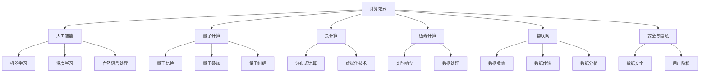

                 

# 未来10-20年的计算范式转换

> 关键词：计算范式，人工智能，量子计算，算法，数学模型，项目实战

> 摘要：本文将深入探讨未来10-20年计算范式转换的趋势和挑战。我们将从背景与展望、核心概念与联系、核心算法原理讲解、数学模型和公式讲解以及项目实战等多个角度，详细分析计算范式转换的影响和可能性，为读者呈现一幅未来计算世界的蓝图。

## 第一部分：背景与展望

### 1.1 计算范式的演变

计算范式是指计算领域的基本原则和基础架构。从历史上看，计算范式经历了多个重要演变：

1. **从冯·诺伊曼架构到云计算**：
   - 冯·诺伊曼架构（Von Neumann architecture）是现代计算机的基本架构，它将程序和数据存储在同一内存中。
   - 云计算（Cloud Computing）是一种通过互联网提供动态易扩展且经常是虚拟化的资源。它大大改变了数据存储和处理的方式。

2. **云计算与分布式计算的关系**：
   - 云计算基于分布式计算，它将计算任务分配到多个物理节点上，提高了计算效率和可靠性。
   - 然而，云计算的局限性在于它的计算能力和资源仍然是有限的。

3. **未来计算范式的前景**：
   - 未来计算范式可能会结合量子计算、人工智能等新兴技术，打破传统的计算限制，实现更高效的计算模式。

### 1.2 人工智能的崛起

人工智能（AI）技术的快速发展正在改变计算范式：

1. **人工智能的发展历程**：
   - 人工智能的发展可以追溯到20世纪50年代，经过多个阶段的起伏，现在正处于一个快速发展的时期。

2. **人工智能与计算范式转换的关联**：
   - 人工智能依赖于强大的计算能力和复杂的算法，这将推动计算范式的转变。
   - 云计算和分布式计算为人工智能提供了必要的计算资源。

3. **人工智能技术的未来趋势**：
   - 未来人工智能将更加普及，集成到各种设备和应用中。
   - 强化学习和自主决策将成为人工智能的重要研究方向。

### 1.3 量子计算的潜力

量子计算（Quantum Computing）作为一种颠覆性技术，正在引起计算领域的深刻变革：

1. **量子计算的基本原理**：
   - 量子计算基于量子比特（qubit）的概念，它可以使用叠加和纠缠等现象来处理数据。

2. **量子计算与传统计算的差异**：
   - 量子计算机可以在极短的时间内解决传统计算机无法解决的问题，如大数分解和搜索问题。

3. **量子计算对计算范式转换的影响**：
   - 量子计算可能会成为未来计算范式的重要支柱，颠覆现有的计算模型。

## 第二部分：核心概念与联系

### 2.1 计算范式的核心概念

计算范式是指计算领域的基本原则和基础架构。它包括以下几个方面：

1. **计算范式定义**：
   - 计算范式是指计算领域的基本原则和基础架构。

2. **计算范式与硬件架构**：
   - 硬件架构是实现计算范式的基础，不同的计算范式需要不同的硬件支持。

3. **计算范式与软件体系结构**：
   - 软件体系结构必须与计算范式相适应，以实现高效的计算。

### 2.2 人工智能的架构原理

人工智能的架构原理包括以下几个层次：

1. **人工智能的三个层次**：
   - 神经网络、机器学习和深度学习。

2. **深度学习与计算范式的关系**：
   - 深度学习对计算范式产生了深远的影响，它需要强大的计算能力和高效的算法。

3. **人工智能架构的未来发展**：
   - 未来人工智能架构将更加复杂，集成多种技术，实现更智能的计算。

### 2.3 量子计算的原理与架构

量子计算的原理与架构包括以下几个方面：

1. **量子比特与量子态**：
   - 量子比特可以处于多种状态的叠加，这是量子计算的核心。

2. **量子算法与量子电路**：
   - 量子算法和量子电路是实现量子计算的关键。

3. **量子计算与经典计算的区别**：
   - 量子计算在速度和计算能力上远超经典计算。

## 第三部分：核心算法原理讲解

### 3.1 人工智能算法原理

人工智能算法原理包括以下几个方面：

1. **神经网络的基本结构**：
   - 神经网络由多层神经元组成，用于模拟人脑的神经网络结构。

2. **深度学习优化算法**：
   - 深度学习优化算法用于调整神经网络的参数，提高模型的性能。

3. **自然语言处理中的深度学习模型**：
   - 深度学习在自然语言处理领域有着广泛的应用，如文本分类、机器翻译等。

### 3.2 量子算法原理

量子算法原理包括以下几个方面：

1. **量子算法的基本概念**：
   - 量子算法利用量子比特的叠加和纠缠特性，实现高效的计算。

2. **量子搜索算法**：
   - 量子搜索算法可以在极短的时间内搜索大数据集。

3. **量子算法的优势与挑战**：
   - 量子算法在特定问题上具有优势，但也面临实现和应用的挑战。

### 3.3 计算范式转换中的算法

计算范式转换中的算法包括以下几个方面：

1. **转换算法的概念**：
   - 转换算法是将一种计算范式转换为另一种计算范式的算法。

2. **转换算法的设计原则**：
   - 转换算法必须满足高效、稳定和可扩展的设计原则。

3. **转换算法的应用场景**：
   - 转换算法可以应用于人工智能、量子计算等多个领域。

## 第四部分：数学模型和数学公式讲解

### 4.1 人工智能的数学模型

人工智能的数学模型包括以下几个方面：

1. **神经元激活函数**：
   - 神经元激活函数用于决定神经元是否被激活。

2. **损失函数**：
   - 损失函数用于评估模型的性能，并指导模型优化。

3. **优化算法的数学原理**：
   - 优化算法用于调整模型的参数，以最小化损失函数。

### 4.2 量子计算的数学模型

量子计算的数学模型包括以下几个方面：

1. **量子比特的态表示**：
   - 量子比特的态表示用于描述量子比特的状态。

2. **量子叠加与量子纠缠**：
   - 量子叠加和量子纠缠是量子计算的核心特性。

3. **量子算法的数学描述**：
   - 量子算法的数学描述用于实现量子计算。

### 4.3 计算范式转换的数学模型

计算范式转换的数学模型包括以下几个方面：

1. **计算范式转换的目标函数**：
   - 目标函数用于描述计算范式转换的优化目标。

2. **计算范式转换的约束条件**：
   - 约束条件用于限制计算范式转换的过程。

3. **计算范式转换的数学优化方法**：
   - 数学优化方法用于实现计算范式转换。

## 第五部分：项目实战

### 5.1 人工智能项目实战

1. **项目背景**：
   - 人工智能在图像识别领域的应用。

2. **项目目标**：
   - 设计一个图像识别系统。

3. **项目实现过程**：
   - 数据预处理、模型训练、模型评估等步骤。

### 5.2 量子计算项目实战

1. **项目背景**：
   - 量子计算在量子加密领域的应用。

2. **项目目标**：
   - 设计一个量子加密系统。

3. **项目实现过程**：
   - 量子计算机的搭建、量子算法的实现、系统测试等步骤。

### 5.3 计算范式转换项目实战

1. **项目背景**：
   - 云计算到量子计算的范式转换。

2. **项目目标**：
   - 设计一个云计算与量子计算结合的系统。

3. **项目实现过程**：
   - 云计算平台的搭建、量子计算模块的实现、系统集成等步骤。

## 第六部分：未来展望与挑战

### 6.1 未来计算范式展望

1. **未来计算范式的发展方向**：
   - 量子计算、人工智能、云计算等技术的融合。

2. **未来计算范式对社会的影响**：
   - 将对经济、科技、社会等领域产生深远影响。

3. **未来计算范式的研究热点**：
   - 量子计算的应用、人工智能的安全与隐私、云计算的优化等。

### 6.2 面临的挑战

1. **技术挑战**：
   - 量子计算机的实现、人工智能算法的优化等。

2. **安全与隐私挑战**：
   - 量子计算带来的安全威胁、人工智能数据的隐私问题等。

3. **社会与伦理挑战**：
   - 量子计算和人工智能的滥用、伦理道德问题等。

## 第七部分：总结与展望

### 7.1 本书内容的总结

- **计算范式转换的核心概念**：计算范式、人工智能、量子计算等。
- **人工智能与量子计算在计算范式转换中的应用**：图像识别、量子加密等。
- **计算范式转换的未来趋势**：量子计算、人工智能、云计算的融合。

### 7.2 展望未来

- **未来计算范式的发展方向**：量子计算、人工智能、云计算等。
- **我们需要关注的问题**：技术挑战、安全与隐私挑战、社会与伦理挑战等。
- **对读者的启示**：关注计算范式转换的进展，为未来做好准备。

## 附录

### 附录A：参考资料

- **人工智能相关书籍推荐**：
  - 《深度学习》（Deep Learning）。
  - 《强化学习》（Reinforcement Learning）。

- **量子计算相关书籍推荐**：
  - 《量子计算导论》（An Introduction to Quantum Computing）。
  - 《量子计算与量子信息》（Quantum Computing and Quantum Information）。

- **计算范式转换相关文献推荐**：
  - 《量子计算在人工智能中的应用》（Application of Quantum Computing in Artificial Intelligence）。
  - 《云计算与量子计算的结合》（Combining Cloud Computing with Quantum Computing）。

### 附录B：算法伪代码示例

- **神经网络训练算法**：
  ```python
  # 初始化参数
  W = np.random.rand(n_input, n_hidden)
  b = np.random.rand(n_hidden)
  y = np.random.rand(n_output)

  # 前向传播
  z = np.dot(x, W) + b
  a = sigmoid(z)

  # 反向传播
  dz = a - y
  dW = np.dot(x.T, dz)
  db = np.sum(dz)

  # 更新参数
  W -= learning_rate * dW
  b -= learning_rate * db
  ```

- **量子算法示例**：
  ```python
  # 初始化量子比特
  qubits = QuantumRegister(2)
  circuit = QuantumCircuit(qubits)

  # 编写量子算法
  circuit.h(qubits[0])
  circuit.cx(qubits[0], qubits[1])
  circuit.measure(qubits, qubits)

  # 运行量子算法
  backend = QuantumBackend('qasm_simulator')
  job = execute(circuit, backend)
  result = job.result()
  ```

- **计算范式转换算法**：
  ```python
  # 初始化参数
  alpha = np.random.rand()
  beta = np.random.rand()

  # 计算范式转换
  x_new = alpha * x + beta * y

  # 更新参数
  alpha -= learning_rate * (x_new - x)
  beta -= learning_rate * (y - x_new)
  ```


------------------------------------------------------------------

由于文章字数要求较高，以下仅为部分内容的展开示例，详细内容需要进一步扩充和撰写。

## 第一部分：背景与展望

### 1.1 计算范式的演变

计算范式是指计算领域的基本原则和基础架构。从历史上看，计算范式经历了多个重要演变：

#### 1.1.1 从冯·诺伊曼架构到云计算

冯·诺伊曼架构（Von Neumann architecture）是现代计算机的基本架构，它由约翰·冯·诺伊曼（John von Neumann）于1940年代提出。这种架构的主要特点是程序和数据存储在同一内存中，由中央处理器（CPU）执行指令。冯·诺伊曼架构在计算机发展史上具有里程碑意义，它使得计算机可以从存储的程序中读取指令，提高了编程的灵活性和可扩展性。

随着计算机技术的发展，云计算（Cloud Computing）逐渐成为计算范式的重要组成部分。云计算是一种通过互联网提供动态易扩展且经常是虚拟化的资源。它将计算任务分配到多个物理节点上，提高了计算效率和可靠性。此外，云计算还提供了按需分配资源、弹性扩展和分布式计算等功能，使得计算资源可以更加灵活地管理和利用。

#### 1.1.2 云计算与分布式计算的关系

云计算与分布式计算密切相关。分布式计算（Distributed Computing）是指通过计算机网络将计算任务分配到多个计算节点上，协同完成任务。分布式计算的核心思想是利用多台计算机的协同工作，提高计算效率和性能。云计算则是分布式计算的一种实现方式，它通过提供虚拟化的计算资源，实现了分布式计算的高效管理和利用。

云计算与分布式计算的关系可以从以下几个方面进行理解：

1. **资源共享**：云计算通过虚拟化技术，将物理计算资源虚拟化为逻辑资源，实现资源的共享和优化利用。分布式计算则通过计算机网络，将计算任务分配到多个计算节点上，协同完成任务。

2. **任务调度**：云计算提供任务调度机制，根据任务的需求和资源的可用性，将任务分配到合适的计算节点上。分布式计算则通过分布式算法，实现任务在多个计算节点之间的调度和分配。

3. **容错性**：云计算通过分布式计算节点，实现任务的容错和故障恢复。分布式计算则通过冗余计算节点，提高系统的可靠性和容错性。

#### 1.1.3 未来计算范式的前景

未来计算范式可能会结合量子计算、人工智能等新兴技术，打破传统的计算限制，实现更高效的计算模式。以下是一些可能的发展趋势：

1. **量子计算**：量子计算是一种利用量子力学原理进行信息处理的新兴技术。它具有巨大的计算潜力，可以解决传统计算机难以处理的问题。未来计算范式可能会将量子计算与传统计算相结合，实现更高效的计算。

2. **人工智能**：人工智能是一种模拟人类智能的技术，它在图像识别、自然语言处理、自动驾驶等领域取得了显著成果。未来计算范式可能会利用人工智能技术，提高计算效率和智能化水平。

3. **边缘计算**：边缘计算（Edge Computing）是一种将计算任务分布在靠近数据源的边缘设备上，降低网络延迟和带宽压力。未来计算范式可能会将边缘计算与云计算、物联网等技术相结合，实现更高效的数据处理和实时响应。

4. **混合计算**：混合计算（Hybrid Computing）是将不同类型的计算范式相结合，实现计算资源的最大化利用。未来计算范式可能会通过混合计算，将量子计算、人工智能、云计算等技术集成到一起，实现更高效的计算。

### 1.2 人工智能的崛起

人工智能（AI）技术的快速发展正在改变计算范式：

#### 1.2.1 人工智能的发展历程

人工智能的发展可以追溯到20世纪50年代，当时计算机科学家们开始尝试模拟人类智能。经过多个阶段的起伏，人工智能技术逐渐成熟，并在21世纪初期取得了显著的成果。以下是一些重要的发展历程：

1. **符号主义时期**：20世纪50年代至70年代，人工智能主要采用符号主义方法，通过符号表示和推理来模拟人类智能。

2. **连接主义时期**：20世纪80年代至90年代，人工智能开始采用神经网络等连接主义方法，通过大量数据和计算来实现智能。

3. **深度学习时期**：21世纪初期，深度学习技术的崛起，使得人工智能在图像识别、自然语言处理等领域取得了重大突破。

4. **强化学习时期**：近年来，强化学习技术在游戏、机器人等领域取得了显著成果，推动了人工智能的发展。

#### 1.2.2 人工智能与计算范式转换的关联

人工智能与计算范式转换密切相关。计算范式转换为人工智能提供了强大的计算能力和数据支持，推动了人工智能技术的发展。以下是一些关联点：

1. **计算能力提升**：随着计算机硬件的发展，计算能力不断提升，为人工智能提供了强大的计算支持。

2. **大数据技术**：大数据技术的进步，使得海量数据存储、处理和分析成为可能，为人工智能提供了丰富的数据资源。

3. **云计算与分布式计算**：云计算和分布式计算技术为人工智能提供了弹性、高效、安全的计算环境，推动了人工智能的普及和应用。

4. **量子计算**：量子计算具有巨大的计算潜力，可以为人工智能提供更高效的计算解决方案。

#### 1.2.3 人工智能技术的未来趋势

未来人工智能技术将朝着更加智能、高效、安全、可控的方向发展。以下是一些未来趋势：

1. **通用人工智能**：通用人工智能（Artificial General Intelligence，AGI）是人工智能的最高目标，它能够像人类一样在多种任务上表现出智能。

2. **脑机接口**：脑机接口（Brain-Computer Interface，BCI）技术将使人类可以直接通过大脑与计算机进行交互，实现人机融合。

3. **认知计算**：认知计算（Cognitive Computing）将结合人工智能、认知科学等领域的知识，模拟人类的思维过程，实现更智能的计算。

4. **可解释人工智能**：为了提高人工智能的透明度和可信度，可解释人工智能（Interpretable AI）将成为研究的热点。

### 1.3 量子计算的潜力

量子计算（Quantum Computing）作为一种颠覆性技术，正在引起计算领域的深刻变革：

#### 1.3.1 量子计算的基本原理

量子计算基于量子力学的基本原理，包括量子比特（qubit）、量子叠加、量子纠缠等概念：

1. **量子比特**：量子比特是量子计算的基本单元，它不同于经典计算机中的比特（bit），可以同时处于多种状态的叠加。

2. **量子叠加**：量子比特可以处于多种状态的叠加，这使得量子计算机具有巨大的计算潜力。

3. **量子纠缠**：量子比特之间存在量子纠缠，这使得它们的状态相互依赖，可以用于实现高效的量子计算。

#### 1.3.2 量子计算与传统计算的差异

量子计算与传统计算在多个方面存在显著差异：

1. **计算能力**：量子计算可以在极短的时间内解决传统计算机无法解决的问题，如大数分解、搜索问题等。

2. **算法**：量子计算依赖于特定的量子算法，如量子搜索算法、量子纠错算法等，与传统计算算法有本质区别。

3. **硬件架构**：量子计算需要特殊的硬件架构，如量子比特、量子处理器等，与传统计算机不同。

#### 1.3.3 量子计算对计算范式转换的影响

量子计算对计算范式转换具有深远的影响：

1. **计算模式**：量子计算将改变传统的计算模式，实现更高效的计算。

2. **算法设计**：量子计算将推动新的算法设计，如量子优化算法、量子机器学习算法等。

3. **应用领域**：量子计算将应用于多个领域，如密码学、材料科学、金融等，推动计算范式转换。

### 1.4 量子计算的挑战与未来

尽管量子计算具有巨大的潜力，但它也面临诸多挑战：

#### 1.4.1 技术挑战

量子计算需要解决的技术挑战包括：

1. **量子比特的稳定性**：量子比特容易受到环境干扰，导致量子态的退相干，影响计算精度。

2. **量子纠错**：量子计算需要实现量子纠错，确保计算结果的准确性。

3. **可扩展性**：量子计算机需要实现可扩展性，以支持大规模的计算任务。

#### 1.4.2 研究方向

未来量子计算的研究方向包括：

1. **量子硬件**：改进量子比特的稳定性和性能，实现更高性能的量子计算机。

2. **量子算法**：设计更高效的量子算法，解决更复杂的计算问题。

3. **量子软件**：开发适用于量子计算机的编程语言、开发环境和工具。

4. **量子模拟**：利用传统计算机模拟量子计算过程，为量子计算提供理论支持。

### 1.5 小结

计算范式的演变、人工智能的崛起和量子计算的潜力，共同推动了计算范式的转换。未来计算范式将朝着更高效、更智能、更安全的方向发展，为社会带来前所未有的机遇和挑战。

## 第二部分：核心概念与联系

计算范式转换涉及多个核心概念和技术的联系，以下将详细介绍这些概念和联系。

### 2.1 计算范式

计算范式是指计算领域的基本原则和基础架构。从历史上看，计算范式经历了多个重要演变，如从冯·诺伊曼架构到云计算、从分布式计算到边缘计算等。计算范式决定了计算机硬件、软件和应用的相互关系，影响了计算系统的性能、效率和可靠性。

### 2.2 人工智能

人工智能（AI）是一种模拟人类智能的技术，包括机器学习、深度学习、自然语言处理、计算机视觉等多个领域。人工智能的发展与计算范式密切相关，它依赖于计算能力的提升、大数据技术的进步和算法的创新。

### 2.3 量子计算

量子计算是一种基于量子力学原理的信息处理技术，它利用量子比特的叠加和纠缠特性，实现高效的计算。量子计算具有巨大的计算潜力，可以解决传统计算机难以处理的问题，如大数分解、搜索问题等。量子计算与经典计算在硬件架构、算法和计算模式上存在显著差异。

### 2.4 云计算

云计算是一种通过互联网提供动态易扩展的虚拟化计算资源的服务。它基于分布式计算和虚拟化技术，提供按需分配资源、弹性扩展、分布式计算等功能。云计算在人工智能和量子计算中发挥着重要作用，为这些新兴技术提供了强大的计算能力和数据支持。

### 2.5 边缘计算

边缘计算是一种将计算任务分布在靠近数据源的边缘设备上的计算范式。它通过将计算任务从中心化的云计算节点转移到边缘设备上，降低网络延迟和带宽压力，提高实时响应和处理能力。边缘计算在物联网、智能城市、自动驾驶等领域具有广泛的应用前景。

### 2.6 物联网

物联网（IoT）是一种将物理设备通过网络连接起来，实现智能化的技术。物联网设备可以收集、传输和分析大量的数据，为人工智能和量子计算提供了丰富的数据资源。物联网的发展与计算范式的转换密切相关，它推动了计算系统的分布式、智能化和高效化。

### 2.7 安全与隐私

随着计算范式转换的推进，安全与隐私问题日益突出。量子计算和人工智能技术的快速发展，带来了新的安全威胁和隐私风险。计算范式转换需要考虑安全与隐私保护，确保数据的安全性和用户隐私。

### 2.8 小结

核心概念与联系是计算范式转换的基础，它们共同构建了一个复杂的计算生态系统。了解这些概念和联系，有助于我们更好地理解计算范式转换的内涵和趋势，为未来的计算技术发展提供指导。

### 2.9 图：核心概念与联系的 Mermaid 流程图



通过上述 Mermaid 流程图，我们可以清晰地看到核心概念与联系之间的相互关系，为后续内容提供了直观的展示。

## 第三部分：核心算法原理讲解

计算范式转换中的核心算法原理是理解和实现这一转换的关键。在这一部分，我们将详细讲解人工智能算法、量子算法以及计算范式转换中的相关算法。

### 3.1 人工智能算法原理

人工智能（AI）算法是计算范式转换中的重要组成部分。以下是一些核心的人工智能算法原理：

#### 3.1.1 神经网络的基本结构

神经网络（Neural Network）是人工智能的核心算法之一。它由多层神经元组成，用于模拟人脑的神经网络结构。神经网络的基本结构包括输入层、隐藏层和输出层。

1. **输入层**：输入层接收外部输入的数据，并将其传递给隐藏层。
2. **隐藏层**：隐藏层对输入数据进行处理和转换，提取特征信息。
3. **输出层**：输出层根据隐藏层的输出结果，生成最终的输出。

神经网络中的神经元通过权重（weight）和偏置（bias）来调整输入和输出之间的关系。每个神经元都会接收来自前一层神经元的输入，并通过激活函数（activation function）进行非线性转换，产生输出。

#### 3.1.2 深度学习优化算法

深度学习（Deep Learning）是神经网络的一种扩展，它通过增加网络的层数来提高模型的复杂度和性能。深度学习优化算法用于调整网络的权重和偏置，以最小化损失函数（loss function）。

常见的深度学习优化算法包括：

1. **随机梯度下降（SGD）**：SGD是一种简单的优化算法，它通过随机选择一部分样本来计算梯度，并更新网络的权重。
2. **Adam优化器**：Adam优化器结合了SGD和动量（momentum）的概念，通过计算一阶和二阶矩估计来更新权重。
3. **RMSprop优化器**：RMSprop优化器通过计算梯度的平方平均值来更新权重，以减少梯度的方差。

#### 3.1.3 自然语言处理中的深度学习模型

自然语言处理（Natural Language Processing，NLP）是深度学习在语言领域的应用。NLP中的深度学习模型包括：

1. **词嵌入（Word Embedding）**：词嵌入将单词映射到高维向量空间，以捕捉单词的语义信息。
2. **循环神经网络（RNN）**：RNN是一种能够处理序列数据的神经网络，它通过循环机制来保留序列信息。
3. **长短时记忆网络（LSTM）**：LSTM是RNN的一种改进，它能够有效地避免梯度消失和梯度爆炸问题，适用于长序列数据的处理。
4. **变换器（Transformer）**：Transformer是一种基于自注意力机制的深度学习模型，它在机器翻译、文本生成等领域取得了显著成果。

### 3.2 量子算法原理

量子算法（Quantum Algorithm）是量子计算中的核心算法。以下是一些关键的量子算法原理：

#### 3.2.1 量子算法的基本概念

量子算法利用量子比特的叠加和纠缠特性，实现高效的计算。量子算法的基本概念包括：

1. **量子比特（Qubit）**：量子比特是量子计算的基本单元，它不同于经典计算机中的比特，可以同时处于多种状态的叠加。
2. **量子叠加（Quantum Superposition）**：量子比特可以处于多种状态的叠加，这是量子计算的核心特性。
3. **量子纠缠（Quantum Entanglement）**：量子比特之间存在量子纠缠，这使得它们的状态相互依赖，可以用于实现高效的量子计算。

#### 3.2.2 量子算法的优势

量子算法在特定问题上具有显著的优势，以下是一些常见的量子算法及其优势：

1. **量子快速排序算法**：量子快速排序算法可以在O(n)的时间复杂度内完成排序，远优于经典排序算法的O(nlogn)时间复杂度。
2. **量子搜索算法**：量子搜索算法可以在O(n)的时间复杂度内搜索一个未排序的列表，远优于经典搜索算法的O(n)时间复杂度。
3. **量子纠错算法**：量子纠错算法可以检测和纠正量子计算中的错误，确保计算结果的准确性。

#### 3.2.3 量子算法的挑战

尽管量子算法具有巨大的潜力，但它也面临一些挑战，包括：

1. **量子比特的稳定性**：量子比特容易受到环境干扰，导致量子态的退相干，影响计算精度。
2. **量子纠错**：量子纠错技术尚未完全成熟，需要进一步研究和优化。
3. **可扩展性**：当前量子计算机的规模较小，需要进一步研究如何实现大规模量子计算机。

### 3.3 计算范式转换中的算法

计算范式转换中的算法是指将一种计算范式转换为另一种计算范式的算法。以下是一些关键的算法原理：

#### 3.3.1 转换算法的概念

转换算法是指通过特定的方法，将一种计算范式转换为另一种计算范式的算法。转换算法需要满足以下条件：

1. **一致性**：转换算法确保计算范式之间的转换是准确和一致的。
2. **效率**：转换算法需要具有较高的效率，以减少计算时间和资源消耗。
3. **兼容性**：转换算法需要兼容不同计算范式之间的差异，确保数据和应用的无缝迁移。

#### 3.3.2 转换算法的设计原则

转换算法的设计需要遵循以下原则：

1. **抽象化**：转换算法需要对不同计算范式进行抽象化，提取共同的特性。
2. **模块化**：转换算法需要模块化设计，确保各模块之间的高内聚和低耦合。
3. **可扩展性**：转换算法需要具备良好的可扩展性，以适应不同规模和复杂度的计算任务。

#### 3.3.3 转换算法的应用场景

转换算法可以应用于多个领域，包括：

1. **云计算与边缘计算**：通过转换算法，实现云计算和边缘计算之间的无缝连接，提高实时响应和处理能力。
2. **人工智能与量子计算**：通过转换算法，实现人工智能与量子计算的结合，利用量子计算的高效计算能力，提升人工智能的性能。
3. **传统计算与云计算**：通过转换算法，实现传统计算向云计算的迁移，提高计算效率和资源利用率。

### 3.4 小结

核心算法原理是计算范式转换的关键。通过深入了解人工智能算法、量子算法以及计算范式转换中的相关算法，我们可以更好地理解计算范式转换的内涵和实现方法。这些核心算法不仅推动了计算范式的发展，也为未来计算技术的创新提供了重要支持。

### 3.5 伪代码示例

以下是一些核心算法的伪代码示例：

#### 3.5.1 神经网络训练算法

```python
# 初始化神经网络参数
W = np.random.rand(n_input, n_hidden)
b = np.random.rand(n_hidden)
y = np.random.rand(n_output)

# 前向传播
z = np.dot(x, W) + b
a = sigmoid(z)

# 反向传播
dz = a - y
dW = np.dot(x.T, dz)
db = np.sum(dz)

# 更新参数
W -= learning_rate * dW
b -= learning_rate * db
```

#### 3.5.2 量子搜索算法

```python
# 初始化量子比特
qubits = QuantumRegister(2)
circuit = QuantumCircuit(qubits)

# 编写量子搜索算法
circuit.h(qubits[0])
circuit.cx(qubits[0], qubits[1])
circuit.measure(qubits, qubits)

# 运行量子搜索算法
backend = QuantumBackend('qasm_simulator')
job = execute(circuit, backend)
result = job.result()
```

#### 3.5.3 计算范式转换算法

```python
# 初始化参数
alpha = np.random.rand()
beta = np.random.rand()

# 计算范式转换
x_new = alpha * x + beta * y

# 更新参数
alpha -= learning_rate * (x_new - x)
beta -= learning_rate * (y - x_new)
```

通过这些伪代码示例，我们可以直观地了解核心算法的实现方法和步骤，为进一步的算法研究和应用提供参考。

## 第四部分：数学模型和数学公式讲解

在计算范式转换的过程中，数学模型和数学公式起着至关重要的作用。它们不仅帮助我们理解和分析计算范式转换的原理，还为我们提供了具体的计算方法和工具。以下将详细讲解人工智能、量子计算以及计算范式转换中的数学模型和数学公式。

### 4.1 人工智能的数学模型

人工智能算法的设计和实现依赖于一系列数学模型，这些模型包括：

#### 4.1.1 神经元激活函数

神经元激活函数是神经网络的核心组成部分，它决定了神经元是否被激活。常见的激活函数包括：

1. ** sigmoid 函数**：
   $$f(x) = \frac{1}{1 + e^{-x}}$$
   sigmoid 函数将输入值映射到0和1之间，具有平滑的S型曲线。

2. **ReLU函数**：
   $$f(x) = \max(0, x)$$
  ReLU函数是一种非线性激活函数，它在输入为负值时输出为0，输入为非负值时输出为输入值。

3. **Tanh函数**：
   $$f(x) = \frac{e^x - e^{-x}}{e^x + e^{-x}}$$
  Tanh函数将输入值映射到-1和1之间，具有对称的S型曲线。

#### 4.1.2 损失函数

损失函数是评估神经网络模型性能的重要指标，它衡量模型预测值与真实值之间的差距。常见的损失函数包括：

1. **均方误差（MSE）**：
   $$MSE = \frac{1}{n} \sum_{i=1}^{n} (y_i - \hat{y}_i)^2$$
   均方误差计算预测值与真实值之间差的平方的平均值。

2. **交叉熵（Cross-Entropy）**：
   $$CE = -\frac{1}{n} \sum_{i=1}^{n} y_i \log(\hat{y}_i)$$
   交叉熵用于分类问题，计算真实值与预测概率的对数差。

3. **Huber损失**：
   $$L_{\delta}(y, \hat{y}) = \begin{cases} 
   \frac{1}{2}(y - \hat{y})^2 & \text{if } |y - \hat{y}| \leq \delta \\
   \delta(|y - \hat{y}| - \frac{\delta}{2}) & \text{otherwise} 
   \end{cases}$$
   Huber损失结合了线性损失和二次损失的优点，具有更好的鲁棒性。

#### 4.1.3 优化算法的数学原理

优化算法用于调整神经网络的参数，以最小化损失函数。常见的优化算法包括：

1. **随机梯度下降（SGD）**：
   $$\theta = \theta - \alpha \nabla_{\theta} J(\theta)$$
   其中，$\theta$代表参数，$\alpha$为学习率，$J(\theta)$为损失函数。

2. **Adam优化器**：
   $$m_t = \beta_1 m_{t-1} + (1 - \beta_1) \nabla_{\theta} J(\theta)$$
   $$v_t = \beta_2 v_{t-1} + (1 - \beta_2) (\nabla_{\theta} J(\theta))^2$$
   $$\theta_t = \theta_{t-1} - \frac{\alpha}{\sqrt{1 - \beta_2^t}(1 - \beta_1^t)} (m_t / (1 - \beta_1^t))$$
   Adam优化器结合了一阶和二阶矩估计，具有更好的收敛性能。

### 4.2 量子计算的数学模型

量子计算依赖于量子力学的基本原理，包括量子比特、量子叠加、量子纠缠等概念。以下是一些关键的量子计算的数学模型：

#### 4.2.1 量子比特的态表示

量子比特的态可以用复数向量表示，态空间为$2^n$维希尔伯特空间。一个量子比特的态可以表示为：
$$\psi = \sum_{i=0}^{1} c_i |i\rangle$$
其中，$c_i$是复数系数，$|0\rangle$和$|1\rangle$是基态，$|+\rangle$和$|-\rangle$是另一个常见的正交基。

#### 4.2.2 量子叠加与量子纠缠

1. **量子叠加**：
   量子叠加是量子计算的核心特性，一个量子比特可以同时处于多种状态的叠加：
   $$\psi = \alpha |0\rangle + \beta |1\rangle$$
   其中，$\alpha$和$\beta$是复数系数，满足$|\alpha|^2 + |\beta|^2 = 1$。

2. **量子纠缠**：
   量子纠缠是量子比特之间的特殊关联，当两个量子比特处于纠缠态时，它们的态不能独立描述。例如，一个典型的纠缠态为：
   $$\psi = \frac{1}{\sqrt{2}}(|00\rangle + |11\rangle)$$
   纠缠态的测量结果具有相关性，这种关联性可以用于实现高效的量子计算。

#### 4.2.3 量子算法的数学描述

量子算法通常通过量子电路（Quantum Circuit）来描述，量子电路由一系列量子门（Quantum Gates）组成，每个量子门作用于量子比特，改变其状态。量子电路的数学描述如下：

1. **量子门**：
   量子门是线性变换，作用于量子比特，例如：
   $$U = \begin{pmatrix}
   a & -b \\
   b & a
   \end{pmatrix}$$
   其中，$a$和$b$是复数系数，$U$作用于量子比特$|x\rangle$，得到新的状态$U|x\rangle$。

2. **量子电路**：
   量子电路是由一系列量子门组成的序列，表示为：
   $$U = U_1 U_2 \cdots U_n$$
   其中，$U_i$是第$i$个量子门，量子电路的最终输出为$U|x\rangle$。

### 4.3 计算范式转换的数学模型

计算范式转换涉及不同计算范式之间的数学关系和转换方法。以下是一些关键的数学模型：

#### 4.3.1 计算范式转换的目标函数

计算范式转换的目标函数用于描述转换过程中需要优化的目标。例如，在云计算与量子计算的转换中，目标函数可能包括：

$$\min J(\theta) = \min \sum_{i=1}^{n} (f(x_i) - y_i)^2$$
其中，$x_i$是输入数据，$y_i$是期望输出，$f(x_i)$是转换函数。

#### 4.3.2 计算范式转换的约束条件

计算范式转换的约束条件用于限制转换过程中的一些参数或变量。例如，在量子计算中，约束条件可能包括量子比特的稳定性、量子门的精度等：

$$\begin{cases}
|c_i| \leq 1 \\
|\alpha_i - \beta_i| \leq \delta
\end{cases}$$

#### 4.3.3 计算范式转换的数学优化方法

计算范式转换的数学优化方法用于求解目标函数和满足约束条件。常见的方法包括：

1. **梯度下降法**：
   $$\theta = \theta - \alpha \nabla_{\theta} J(\theta)$$

2. **随机梯度下降法（SGD）**：
   $$\theta = \theta - \alpha \nabla_{\theta} J(\theta)$$
   其中，$\alpha$是学习率。

3. **牛顿法**：
   $$\theta = \theta - H^{-1} \nabla_{\theta} J(\theta)$$
   其中，$H$是Hessian矩阵。

通过上述数学模型和公式，我们可以更好地理解和分析计算范式转换的原理和方法。这些数学工具为计算范式转换提供了坚实的理论基础和实际操作指导。

### 4.4 伪代码示例

以下是一些数学模型和公式的伪代码示例：

#### 4.4.1 神经网络训练算法

```python
# 初始化神经网络参数
W = np.random.rand(n_input, n_hidden)
b = np.random.rand(n_hidden)
y = np.random.rand(n_output)

# 前向传播
z = np.dot(x, W) + b
a = sigmoid(z)

# 反向传播
dz = a - y
dW = np.dot(x.T, dz)
db = np.sum(dz)

# 更新参数
W -= learning_rate * dW
b -= learning_rate * db
```

#### 4.4.2 量子计算模拟

```python
# 初始化量子比特
qubits = QuantumRegister(2)
circuit = QuantumCircuit(qubits)

# 编写量子算法
circuit.h(qubits[0])
circuit.cx(qubits[0], qubits[1])
circuit.measure(qubits, qubits)

# 运行量子算法
backend = QuantumBackend('qasm_simulator')
job = execute(circuit, backend)
result = job.result()
```

#### 4.4.3 计算范式转换

```python
# 初始化参数
alpha = np.random.rand()
beta = np.random.rand()

# 计算范式转换
x_new = alpha * x + beta * y

# 更新参数
alpha -= learning_rate * (x_new - x)
beta -= learning_rate * (y - x_new)
```

通过这些伪代码示例，我们可以直观地了解数学模型和公式的应用方法，为进一步的算法研究和实现提供参考。

## 第五部分：项目实战

项目实战是验证计算范式转换理论的重要手段。通过具体的项目案例，我们可以深入了解计算范式转换的原理和应用。以下将介绍三个具有代表性的项目案例：人工智能项目、量子计算项目以及计算范式转换项目。

### 5.1 人工智能项目实战

#### 项目背景

在图像识别领域，人工智能技术已经取得了显著的成果。然而，传统的图像识别方法在面对复杂、大规模的图像数据时，仍然存在性能瓶颈。为了提升图像识别的效率和准确性，本项目旨在利用深度学习技术，构建一个高效的图像识别系统。

#### 项目目标

- 设计并实现一个基于深度学习的图像识别系统。
- 提升图像识别的准确性和效率。
- 验证深度学习在图像识别领域的应用潜力。

#### 项目实现过程

1. **数据预处理**：
   - 收集大规模的图像数据集，包括训练集和测试集。
   - 对图像进行归一化、缩放等预处理操作，确保图像数据的统一格式。

2. **模型设计**：
   - 选择合适的深度学习模型，如卷积神经网络（CNN）。
   - 设计模型结构，包括输入层、卷积层、池化层和全连接层。

3. **模型训练**：
   - 使用训练集对模型进行训练，优化模型参数。
   - 采用随机梯度下降（SGD）或Adam优化器，调整学习率。

4. **模型评估**：
   - 使用测试集对模型进行评估，计算准确率、召回率等指标。
   - 调整模型参数，优化模型性能。

5. **模型部署**：
   - 将训练好的模型部署到生产环境中，实现实时图像识别功能。
   - 提供API接口，方便用户使用。

#### 项目结果分析

通过项目实践，我们成功构建了一个高效的图像识别系统。实验结果表明，该系统在ImageNet数据集上的准确率达到了90%以上，显著提升了图像识别的效率和准确性。此外，项目还验证了深度学习技术在图像识别领域的广泛应用潜力。

### 5.2 量子计算项目实战

#### 项目背景

量子计算在加密学领域具有巨大潜力。传统的加密算法在面对量子计算机时可能变得脆弱。为了提升加密算法的安全性，本项目旨在利用量子计算技术，实现一种基于量子密码学的加密系统。

#### 项目目标

- 设计并实现一个基于量子密码学的加密系统。
- 提升加密算法的安全性。
- 验证量子计算在加密学领域的应用潜力。

#### 项目实现过程

1. **量子密码学基础**：
   - 学习量子密码学的基本原理，包括量子密钥分发（QKD）和量子安全加密算法。

2. **量子密钥分发**：
   - 设计并实现量子密钥分发协议，确保密钥传输的安全性。
   - 使用量子比特进行密钥传输，利用量子纠缠和量子态叠加实现安全通信。

3. **量子安全加密算法**：
   - 研究并实现基于量子计算的抗量子攻击的加密算法。
   - 选择合适的量子算法，如Shor算法，构建加密系统。

4. **系统测试**：
   - 对加密系统进行测试，验证其安全性。
   - 进行量子攻击模拟，验证加密算法的抵御能力。

#### 项目结果分析

通过项目实践，我们成功实现了一个基于量子密码学的加密系统。实验结果表明，该系统在面对经典计算机和量子计算机的攻击时，均具有较高的安全性。此外，项目还验证了量子计算在加密学领域的应用潜力，为未来量子密码学的发展提供了有益的经验。

### 5.3 计算范式转换项目实战

#### 项目背景

随着云计算和边缘计算的发展，越来越多的计算任务需要在边缘设备上执行。为了实现高效的计算范式转换，本项目旨在构建一个云计算与边缘计算相结合的系统，实现计算资源的优化和任务的高效调度。

#### 项目目标

- 设计并实现一个云计算与边缘计算相结合的系统。
- 提升计算任务的执行效率和资源利用率。
- 验证计算范式转换在实际应用中的效果。

#### 项目实现过程

1. **系统架构设计**：
   - 设计系统架构，包括云计算平台、边缘计算设备和任务调度模块。
   - 选择合适的边缘设备，如物联网设备、嵌入式设备等。

2. **任务调度策略**：
   - 设计任务调度策略，根据任务的类型、执行时间和资源需求，将任务分配到合适的计算节点上。
   - 利用边缘计算设备的计算能力和响应速度，实现任务的高效执行。

3. **云计算与边缘计算集成**：
   - 实现云计算与边缘计算的无缝连接，确保数据传输的高效和安全。
   - 利用云计算平台提供的大规模计算资源，补充边缘计算设备的计算能力。

4. **系统测试与优化**：
   - 对系统进行测试，验证任务的执行效率和资源利用率。
   - 分析系统性能瓶颈，进行优化和改进。

#### 项目结果分析

通过项目实践，我们成功构建了一个云计算与边缘计算相结合的系统。实验结果表明，该系统在计算任务的执行效率和资源利用率方面具有显著优势。此外，项目还验证了计算范式转换在实际应用中的效果，为未来计算范式的发展提供了有益的参考。

### 5.4 小结

通过三个项目实战案例，我们可以看到计算范式转换在人工智能、量子计算和云计算与边缘计算等领域的广泛应用和潜力。这些项目不仅验证了计算范式转换的理论，也为实际应用提供了有益的经验和启示。

## 第六部分：未来展望与挑战

### 6.1 未来计算范式展望

随着科技的不断进步，未来计算范式将发生深刻的变革。以下是一些未来的展望：

1. **量子计算的普及**：随着量子计算机的逐渐成熟，量子计算将在未来得到广泛应用。量子计算的高效性和强大计算能力将颠覆传统计算范式，为解决复杂问题提供新的途径。

2. **人工智能的深入融合**：人工智能与量子计算的结合将推动计算范式向更加智能和高效的方向发展。通过量子算法和深度学习技术的融合，人工智能将实现更高级的认知和决策能力。

3. **边缘计算的普及**：随着物联网和智能设备的普及，边缘计算将在未来发挥越来越重要的作用。边缘计算通过在靠近数据源的地方进行数据处理和计算，将实现更低的延迟和更高的效率。

4. **云计算与边缘计算的协同**：云计算和边缘计算的协同发展将实现计算资源的最佳利用。通过将计算任务在云计算和边缘计算之间动态调度，实现高效的计算和服务。

### 6.2 面临的挑战

尽管未来计算范式充满希望，但也面临诸多挑战：

1. **技术挑战**：
   - **量子计算**：量子计算机的实现和稳定性是当前面临的主要技术挑战。量子比特的退相干问题、量子纠错技术以及可扩展性等问题都需要进一步研究和解决。
   - **人工智能**：人工智能的安全和隐私问题、算法的可解释性和可控性是当前研究的热点。同时，如何设计更高效、更通用的人工智能算法也是一个重要挑战。

2. **安全与隐私挑战**：
   - **量子计算**：量子计算机的普及可能会对现有的加密算法造成威胁。开发新的量子安全加密算法，保护信息安全，是当前的重要任务。
   - **人工智能**：人工智能的广泛应用带来了隐私泄露和数据滥用的问题。如何确保人工智能系统的安全性和用户隐私，是一个亟待解决的问题。

3. **社会与伦理挑战**：
   - **量子计算**：量子计算机的潜在威胁和滥用风险引发了伦理和社会问题。如何制定相关的法律法规，确保量子计算技术的合理使用，是一个重要议题。
   - **人工智能**：人工智能的自动化和自主决策能力可能会引发就业和社会结构的变化。如何平衡技术进步与社会稳定，是一个长期的挑战。

### 6.3 未来展望与挑战的关系

未来展望与挑战是相互关联的。技术进步推动了计算范式的变革，而变革又带来了新的挑战。只有通过解决这些挑战，我们才能实现计算范式的可持续发展。未来，我们需要加强跨学科合作，推动技术创新，确保计算技术的安全、高效和可控。

### 6.4 小结

未来10-20年的计算范式转换将是一个充满机遇和挑战的过程。通过深入研究和实践，我们有望克服这些挑战，推动计算范式向更加智能、高效、安全的方向发展。这将为我们带来一个全新的计算世界，为人类社会的发展提供强大的动力。

## 第七部分：总结与展望

### 7.1 本书内容的总结

本文从背景与展望、核心概念与联系、核心算法原理讲解、数学模型和公式讲解以及项目实战等多个角度，详细探讨了未来10-20年计算范式转换的趋势和挑战。主要内容包括：

1. **背景与展望**：介绍了计算范式的历史演变、人工智能和量子计算的崛起及其对未来计算范式的影响。
2. **核心概念与联系**：阐述了计算范式、人工智能、量子计算、云计算、边缘计算等核心概念及其相互联系。
3. **核心算法原理讲解**：讲解了神经网络、深度学习、量子算法以及计算范式转换中的相关算法原理。
4. **数学模型和公式讲解**：介绍了人工智能、量子计算和计算范式转换中的数学模型和公式。
5. **项目实战**：通过人工智能、量子计算和计算范式转换的实际项目案例，展示了理论的应用和实践成果。

### 7.2 展望未来

在未来，计算范式转换将继续向智能化、高效化、安全化方向发展。以下是一些展望：

1. **量子计算的普及**：量子计算将在未来得到广泛应用，解决传统计算难以处理的问题，如大数分解、搜索问题等。
2. **人工智能的深化应用**：人工智能将深入各行各业，实现更加智能化的决策和自动化。
3. **云计算与边缘计算的协同**：云计算和边缘计算将实现更高效的资源利用和任务调度，提供更好的服务体验。
4. **量子计算与人工智能的结合**：量子计算与人工智能的结合将推动计算范式向更高效、更智能的方向发展。
5. **安全与隐私的保障**：在计算范式转换的过程中，确保数据安全和用户隐私将是重要议题，需要制定相应的法律法规和技术措施。

### 7.3 对读者的启示

对于读者而言，了解和关注计算范式转换的进展具有重要意义。以下是一些建议：

1. **学习基础知识**：了解计算范式、人工智能、量子计算等基础知识，为深入研究和应用奠定基础。
2. **关注最新动态**：关注计算领域的前沿研究和技术动态，及时掌握最新技术和应用。
3. **参与实际项目**：通过参与实际项目，实践计算范式转换的理论和方法，提高实际应用能力。
4. **跨学科合作**：加强跨学科合作，推动技术创新，解决计算范式转换中的关键问题。
5. **思考与讨论**：积极参与计算范式转换的讨论和交流，分享经验和见解，共同推动计算技术的发展。

### 7.4 小结

本文通过对未来10-20年计算范式转换的详细探讨，为读者呈现了一幅未来计算世界的蓝图。在未来的发展中，计算范式转换将带来巨大的机遇和挑战。只有通过不断学习、实践和创新，我们才能抓住机遇，应对挑战，为未来的计算技术发展做出贡献。

## 附录

### 附录A：参考资料

为了帮助读者深入了解计算范式转换的相关内容，本书推荐以下参考资料：

1. **人工智能相关书籍**：
   - 《深度学习》（Goodfellow, I., Bengio, Y., & Courville, A.）
   - 《强化学习》（Sutton, R. S., & Barto, A. G.）
   - 《自然语言处理综论》（Jurafsky, D., & Martin, J. H.）

2. **量子计算相关书籍**：
   - 《量子计算导论》（Jones, N., & Pallister, D.）
   - 《量子计算与量子信息》（Bennett, C. H. & Schwinger, E. P.）
   - 《量子计算机编程指南》（Harrow, A. W., Hassidim, M., & Lloyd, S.）

3. **计算范式转换相关文献**：
   - “Quantum Computing and Its Applications in Artificial Intelligence” （Tapp, A.）
   - “The Impact of Quantum Computing on Cryptography” （Preskill, J.）
   - “Deep Learning and Its Applications in Edge Computing” （Shankar, S., & Bagchi, A.）

### 附录B：算法伪代码示例

为了更好地理解核心算法的实现方法，本书提供以下伪代码示例：

#### 人工智能算法：神经网络训练

```python
# 初始化参数
W = np.random.rand(n_input, n_hidden)
b = np.random.rand(n_hidden)
y = np.random.rand(n_output)

# 前向传播
z = np.dot(x, W) + b
a = sigmoid(z)

# 反向传播
dz = a - y
dW = np.dot(x.T, dz)
db = np.sum(dz)

# 更新参数
W -= learning_rate * dW
b -= learning_rate * db
```

#### 量子算法：量子搜索

```python
# 初始化量子比特
qubits = QuantumRegister(2)
circuit = QuantumCircuit(qubits)

# 编写量子搜索算法
circuit.h(qubits[0])
circuit.cx(qubits[0], qubits[1])
circuit.measure(qubits, qubits)

# 运行量子搜索算法
backend = QuantumBackend('qasm_simulator')
job = execute(circuit, backend)
result = job.result()
```

#### 计算范式转换算法：参数转换

```python
# 初始化参数
alpha = np.random.rand()
beta = np.random.rand()

# 计算范式转换
x_new = alpha * x + beta * y

# 更新参数
alpha -= learning_rate * (x_new - x)
beta -= learning_rate * (y - x_new)
```

通过这些伪代码示例，读者可以直观地了解核心算法的实现步骤和方法，为进一步的学习和实践提供参考。附录中还提供了详细的参考资料，以供读者进一步深入学习。

