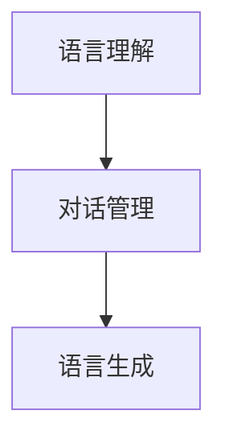
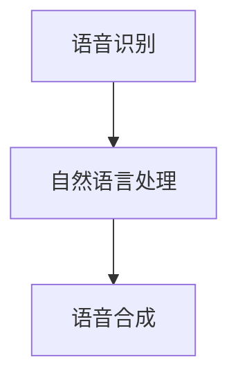

                 

# 未来AI发展的新方向

> 关键词：人工智能，AI技术，新方向，强化学习，自然语言处理，虚拟助手，区块链融合

> 摘要：本文将探讨未来人工智能（AI）的发展方向，包括技术基础、创新应用、新方向探索、挑战与应对策略以及未来发展展望。通过对AI核心概念、架构、算法、伦理、社会影响、医疗、金融、交通等领域应用的深入分析，以及强化学习、自然语言处理、虚拟助手、区块链融合等新技术的探讨，本文旨在为读者提供一个全面而深刻的AI发展全景。

## 目录大纲

## 第一部分：未来AI技术基础

### 第1章：AI核心概念与架构

#### 1.1 AI的定义与历史演变

#### 1.2 AI架构简介

#### 1.3 AI算法基础

### 第2章：人工智能伦理与社会影响

#### 2.1 人工智能伦理

#### 2.2 人工智能与社会

### 第3章：AI创新与应用趋势

#### 3.1 AI在医疗领域的应用

#### 3.2 AI在金融领域的应用

#### 3.3 AI在智能交通的应用

## 第二部分：AI新方向探索

### 第4章：强化学习与智能决策

#### 4.1 强化学习原理

#### 4.2 智能决策系统

### 第5章：自然语言处理与生成对抗网络

#### 5.1 自然语言处理基础

#### 5.2 生成对抗网络（GAN）

### 第6章：聊天机器人与虚拟助手

#### 6.1 聊天机器人架构

#### 6.2 虚拟助手技术

### 第7章：AI与区块链融合技术

#### 7.1 区块链基础

#### 7.2 AI与区块链融合应用

## 第三部分：AI发展新挑战与应对策略

### 第8章：AI新挑战与风险

#### 8.1 数据隐私与安全

#### 8.2 AI公平性与偏见

### 第9章：AI治理与可持续发展

#### 9.1 AI治理框架

#### 9.2 AI可持续发展

### 第10章：未来AI发展展望

#### 10.1 AI未来的发展趋势

#### 10.2 AI教育与人才培养

## 附录

### 附录A：AI工具与资源指南

### 附录B：未来AI发展新方向参考文献

## 第一部分：未来AI技术基础

### 第1章：AI核心概念与架构

#### 1.1 AI的定义与历史演变

人工智能（Artificial Intelligence，简称AI）是指计算机系统模拟人类智能行为的技术。AI的目标是使计算机具备感知、理解、学习、推理和决策等能力，从而实现人类智能的自动化。

AI的历史可以追溯到20世纪50年代。1956年，达特茅斯会议正式提出了人工智能的概念，标志着AI领域的诞生。此后，AI经历了多个发展阶段，从符号主义、连接主义到现代的深度学习，每一步都推动了AI技术的进步。

- **符号主义**：以逻辑推理为基础，通过符号表示知识和推理过程，如专家系统。
- **连接主义**：以神经网络为基础，通过模拟人脑神经元连接实现学习，如深度学习。
- **深度学习**：基于多层神经网络，通过大规模数据训练实现复杂的特征提取和模型优化。

当前，深度学习已成为AI的核心技术，推动了计算机视觉、自然语言处理、语音识别等领域的突破。

#### 1.2 AI架构简介

AI系统通常包括以下几个核心组件：

1. **数据采集与预处理**：数据是AI系统的基石。数据采集涉及传感器、网络爬虫等手段。预处理包括数据清洗、归一化、特征提取等步骤。

2. **计算资源管理**：AI系统需要大量的计算资源，包括CPU、GPU和TPU等。计算资源管理涉及任务调度、资源分配和优化等。

3. **算法与模型**：算法和模型是AI系统的核心。常见的算法有神经网络、支持向量机、决策树等。模型则通过参数调整实现特定任务的目标。

4. **评估与优化**：评估是检验AI系统性能的重要手段。优化包括超参数调整、模型压缩和加速等。

#### 1.3 AI算法基础

AI算法可以分为以下几类：

1. **神经网络基础算法**：包括前向传播、反向传播和激活函数等。神经网络通过模拟人脑神经元连接实现学习。

2. **机器学习算法**：包括线性回归、逻辑回归、决策树、随机森林等。机器学习算法通过训练模型实现数据分类、回归等任务。

3. **强化学习算法**：包括Q-learning、SARSA、Deep Q-Networks（DQN）等。强化学习通过奖励机制实现智能体的决策和优化。

### 第2章：人工智能伦理与社会影响

#### 2.1 人工智能伦理

AI伦理涉及AI系统的设计、开发和使用过程中可能产生的道德和伦理问题。以下是一些常见的AI伦理问题：

1. **公平性**：AI系统是否对所有人公平？是否存在偏见和歧视？
2. **透明性**：AI系统的决策过程是否透明？用户能否理解系统的决策依据？
3. **隐私**：AI系统是否侵犯用户隐私？数据如何保护？
4. **安全性**：AI系统是否安全可靠？是否存在漏洞和风险？

AI伦理设计方法包括以下几个方面：

1. **伦理原则**：如公正性、透明性、可解释性和可靠性等。
2. **伦理审查**：在项目开发过程中进行伦理评估和审查。
3. **伦理规范**：制定行业标准和规范，确保AI系统的伦理合规性。

#### 2.2 人工智能与社会

AI对社会产生了深远的影响，包括就业市场、隐私权、法律和道德等方面。

1. **就业市场**：AI自动化部分工作岗位，同时创造新的就业机会。如何平衡就业市场的变化，是AI发展的关键问题。
2. **隐私权**：AI系统处理大量个人数据，隐私保护成为重要议题。如何保护用户隐私，是AI技术发展的重要方向。
3. **法律和道德**：AI系统的决策可能涉及法律责任和道德判断。如何制定相关法律和道德规范，是AI发展的必要保障。

### 第3章：AI创新与应用趋势

#### 3.1 AI在医疗领域的应用

AI在医疗领域的应用包括疾病诊断、药物研发、手术机器人等方面。

1. **疾病诊断**：AI通过图像识别、自然语言处理等技术，辅助医生进行疾病诊断，提高诊断准确性和效率。
2. **药物研发**：AI通过分子模拟、基因分析等技术，加速药物研发过程，降低研发成本和时间。
3. **手术机器人**：AI手术机器人通过精准控制和决策，提高手术精度和安全性。

#### 3.2 AI在金融领域的应用

AI在金融领域的应用包括风险管理、自动化交易、个性化推荐等方面。

1. **风险管理**：AI通过大数据分析和机器学习算法，识别潜在风险，优化投资组合。
2. **自动化交易**：AI自动化交易系统通过分析市场数据和交易策略，实现高频率、高效率的交易。
3. **个性化推荐**：AI根据用户历史数据和行为偏好，提供个性化金融产品和服务。

#### 3.3 AI在智能交通的应用

AI在智能交通领域的应用包括智能交通系统、自动驾驶技术、交通流量预测等方面。

1. **智能交通系统**：AI通过数据分析、机器学习等技术，优化交通信号控制和路线规划，提高交通效率。
2. **自动驾驶技术**：AI自动驾驶系统通过传感器感知、决策规划和控制执行，实现无人驾驶。
3. **交通流量预测**：AI通过历史数据和实时监测，预测交通流量，优化交通管理。

## 第二部分：AI新方向探索

### 第4章：强化学习与智能决策

#### 4.1 强化学习原理

强化学习（Reinforcement Learning，简称RL）是一种通过试错和奖励机制实现智能决策的机器学习方法。其核心思想是智能体（Agent）通过与环境（Environment）交互，学习最优策略（Policy），以实现预期目标。

1. **状态（State）**：智能体在特定时间点感知到环境信息。
2. **动作（Action）**：智能体在特定状态下执行的动作。
3. **奖励（Reward）**：动作后环境给予智能体的即时反馈。
4. **策略（Policy）**：智能体基于状态选择动作的规则。

强化学习的基本算法包括Q-learning、SARSA和Deep Q-Networks（DQN）。

1. **Q-learning**：Q-learning是基于值函数的强化学习算法，通过更新Q值（状态-动作值函数）实现策略优化。
   ```python
   def Q_learning(Q, state, action, reward, next_state, next_action, learning_rate, discount_factor):
       Q[state][action] = (1 - learning_rate) * Q[state][action] + learning_rate * (reward + discount_factor * max(Q[next_state]))
   ```

2. **SARSA**：SARSA是基于策略的强化学习算法，同时考虑当前状态和动作的Q值。
   ```python
   def SARSA(Q, state, action, reward, next_state, next_action, learning_rate):
       Q[state][action] = Q[state][action] + learning_rate * (reward + Q[next_state][next_action] - Q[state][action])
   ```

3. **Deep Q-Networks（DQN）**：DQN是一种基于深度学习的强化学习算法，通过神经网络近似Q值函数。
   ```python
   def DQN(Q_network, state, action, reward, next_state, done, epsilon, learning_rate, gamma):
       if random.random() < epsilon:
           action = random_action()
       Q_target = reward + (1 - done) * gamma * np.max(Q_network(next_state))
       Q_error = Q_target - Q_network(state, action)
       loss = Q_loss(Q_network, state, action, Q_error)
       optimizer.minimize(loss, learning_rate)
   ```

#### 4.2 智能决策系统

智能决策系统（Intelligent Decision Support System，简称IDSS）是一种利用AI技术实现智能决策的软件系统。IDSS通常包括以下几个模块：

1. **数据采集与处理**：采集相关数据，进行预处理和特征提取。
2. **模型训练与优化**：使用机器学习和深度学习算法训练模型，并进行优化。
3. **决策生成与评估**：根据模型输出和业务规则，生成决策方案，并进行评估。
4. **人机交互与反馈**：提供用户界面，实现人机交互，并根据用户反馈调整决策方案。

### 第5章：自然语言处理与生成对抗网络

#### 5.1 自然语言处理基础

自然语言处理（Natural Language Processing，简称NLP）是AI领域的一个重要分支，旨在使计算机理解和处理人类语言。

1. **词汇表示**：将词汇转化为计算机可以处理的形式，如词向量。
   ```python
   def Word2Vec(vocabulary, embedding_size):
       embeddings = np.random.rand(len(vocabulary), embedding_size)
       for word in vocabulary:
           embeddings[vocabulary.index(word)] = np.mean([embedding for sentence in sentences for word in sentence], axis=0)
       return embeddings
   ```

2. **句子表示**：将句子转化为计算机可以处理的形式，如词向量叠加。
   ```python
   def Sentence2Vec(sentence, embedding_size):
       sentence_embedding = np.mean([word_embedding[word] for word in sentence], axis=0)
       return sentence_embedding
   ```

3. **语言模型**：基于大量文本数据训练的语言模型，用于预测下一个单词或句子。
   ```python
   def LanguageModel(corpus, vocabulary_size, embedding_size):
       model = Sequential()
       model.add(LSTM(embedding_size, input_shape=(None, embedding_size), return_sequences=True))
       model.add(Dense(vocabulary_size, activation='softmax'))
       model.compile(optimizer='adam', loss='categorical_crossentropy', metrics=['accuracy'])
       model.fit(corpus, labels, epochs=10, batch_size=32)
       return model
   ```

#### 5.2 生成对抗网络（GAN）

生成对抗网络（Generative Adversarial Networks，简称GAN）是一种无监督学习模型，由生成器和判别器两个神经网络组成。生成器试图生成逼真的数据，判别器则试图区分真实数据和生成数据。

1. **GAN原理**：生成器和判别器相互竞争，生成器不断优化数据生成，判别器不断优化数据判别。
   ```python
   def GAN(generator, discriminator, input_shape, latent_dim, learning_rate):
       optimizer = Adam(learning_rate)
       discriminator.compile(optimizer=optimizer, loss='binary_crossentropy')
       generator.compile(optimizer=optimizer, loss='binary_crossentropy')
       for epoch in range(num_epochs):
           real_data = ...
           fake_data = generator.predict(np.random.normal(size=(batch_size, latent_dim)))
           real_labels = np.ones((batch_size, 1))
           fake_labels = np.zeros((batch_size, 1))
           d_loss_real = discriminator.train_on_batch(real_data, real_labels)
           d_loss_fake = discriminator.train_on_batch(fake_data, fake_labels)
           g_loss = combined_model.train_on_batch(np.random.normal(size=(batch_size, latent_dim)), real_labels)
           print(f'Epoch {epoch+1}/{num_epochs}, D_loss: {0.5 * (d_loss_real + d_loss_fake)}, G_loss: {g_loss}')
   ```

2. **GAN类型**：GAN有多种类型，包括基本GAN、条件GAN（cGAN）和深度卷积GAN（DCGAN）等。

3. **GAN应用案例**：GAN在图像生成、图像修复、风格迁移等方面有广泛应用。例如，使用cGAN生成人脸图像，使用DCGAN修复图像中的损坏区域。

### 第6章：聊天机器人与虚拟助手

#### 6.1 聊天机器人架构

聊天机器人（Chatbot）是一种通过自然语言交互提供服务的AI系统。其架构通常包括以下几个模块：

1. **语言理解**：将用户输入的自然语言转换为计算机可以处理的形式，如词向量或词元。
2. **对话管理**：根据上下文信息，生成合适的回复，包括事实性回答和任务性对话。
3. **语言生成**：将计算机处理的语义信息转换为自然语言回复。

聊天机器人架构图如下：



#### 6.2 虚拟助手技术

虚拟助手（Virtual Assistant）是一种基于语音识别、自然语言处理和语音合成技术的AI系统，可以理解用户语音指令，并提供相应的服务。

1. **语音识别**：将用户语音转换为文本，用于后续的自然语言处理。
2. **自然语言处理**：对文本进行分析和处理，提取关键信息，生成语义表示。
3. **语音合成**：将语义表示转换为自然语音，回应用户。

虚拟助手技术流程图如下：



### 第7章：AI与区块链融合技术

#### 7.1 区块链基础

区块链（Blockchain）是一种分布式数据库技术，通过加密算法和共识机制实现数据的不可篡改和去中心化。

1. **区块链原理**：区块链由多个区块组成，每个区块包含一定数量的交易记录。区块通过哈希函数和时间戳链接在一起，形成区块链。
2. **智能合约**：智能合约是区块链上的可编程合同，通过代码实现自动化执行。
3. **区块链网络结构**：区块链网络由多个节点组成，节点通过共识机制维护区块链的一致性和安全性。

#### 7.2 AI与区块链融合应用

AI与区块链融合技术可以应用于多个领域，如透明智能合约、去中心化AI平台和数据隐私保护。

1. **透明智能合约**：使用AI技术对智能合约代码进行审查和优化，确保合约的透明性和安全性。
2. **去中心化AI平台**：基于区块链的去中心化AI平台，通过分布式计算和共享数据，实现AI模型的协作和优化。
3. **数据隐私保护**：使用区块链技术保护用户数据隐私，确保数据在传输和存储过程中的安全性和隐私性。

### 第三部分：AI发展新挑战与应对策略

#### 8.1 数据隐私与安全

随着AI技术的发展，数据隐私与安全成为重要的挑战。以下是一些应对策略：

1. **数据加密**：使用加密算法保护敏感数据，确保数据在传输和存储过程中的安全性。
2. **安全机器学习**：采用安全机制，如差分隐私、同态加密等，保护训练数据和模型参数。
3. **AI伦理与法律框架**：制定相关法律和伦理规范，规范AI系统的数据收集和使用行为。

#### 8.2 AI公平性与偏见

AI系统可能引入偏见，影响公平性。以下是一些应对策略：

1. **偏见检测与缓解方法**：使用统计方法、可视化技术等检测AI系统中的偏见，并采用数据平衡、算法优化等方法缓解偏见。
2. **公平AI设计原则**：在设计AI系统时，遵循公平、透明和可解释等原则，确保系统的公正性。

### 第9章：AI治理与可持续发展

#### 9.1 AI治理框架

AI治理框架涉及政策制定、监管机制和行业自律等方面。以下是一些关键要素：

1. **AI监管政策**：制定相关政策，规范AI系统的研发、应用和监管。
2. **AI伦理委员会**：成立独立的伦理委员会，负责评估AI系统的伦理合规性。
3. **透明性与可解释性**：提高AI系统的透明性和可解释性，确保用户对系统的理解和信任。

#### 9.2 AI可持续发展

AI可持续发展包括技术进步、社会效益和环境保护等方面。以下是一些关键策略：

1. **可持续AI发展策略**：通过技术创新和优化，提高AI系统的能效和可持续性。
2. **绿色AI**：使用绿色能源和环保材料，降低AI系统的碳排放和环境影响。
3. **AI与可持续发展目标**：将AI技术与联合国可持续发展目标（SDGs）相结合，实现全球可持续发展。

### 第10章：未来AI发展展望

#### 10.1 AI未来的发展趋势

未来AI发展趋势包括以下几个方向：

1. **技术融合**：AI与其他领域（如生物学、物理学等）的融合，推动AI技术的突破。
2. **人机协同**：AI与人类智能的协同工作，提高AI系统的智能水平和实用性。
3. **跨领域应用**：AI技术在更多领域的应用，如农业、能源、教育等。

#### 10.2 AI教育与人才培养

未来AI教育与人才培养的关键包括：

1. **AI教育体系**：建立完善的AI教育体系，培养具备AI知识和技能的专业人才。
2. **AI技能培养**：通过实践项目和在线课程，提高学生的AI实践能力和创新能力。
3. **未来人才需求预测**：预测未来AI领域的人才需求，调整人才培养策略。

### 附录

#### 附录A：AI工具与资源指南

- **开源AI框架**：TensorFlow、PyTorch、Keras
- **AI研究资源**：AI顶级会议与期刊、AI开源数据集、AI在线课程与教程

#### 附录B：未来AI发展新方向参考文献

- [1] Goodfellow, I., Bengio, Y., & Courville, A. (2016). *Deep Learning*. MIT Press.
- [2] Russell, S., & Norvig, P. (2020). *Artificial Intelligence: A Modern Approach*. Prentice Hall.
- [3] Hochreiter, S., & Schmidhuber, J. (1997). *Long short-term memory*. Neural Computation, 9(8), 1735-1780.
- [4] LeCun, Y., Bengio, Y., & Hinton, G. (2015). *Deep learning*. Nature, 521(7553), 436-444.
- [5] Goodfellow, I., Pouget-Abadie, J., Mirza, M., Xu, B., Warde-Farley, D., Ozair, S., ... & Bengio, Y. (2014). *Generative adversarial nets*. Advances in neural information processing systems, 27.

