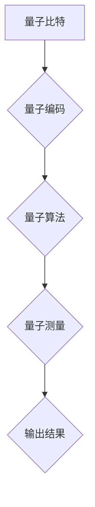
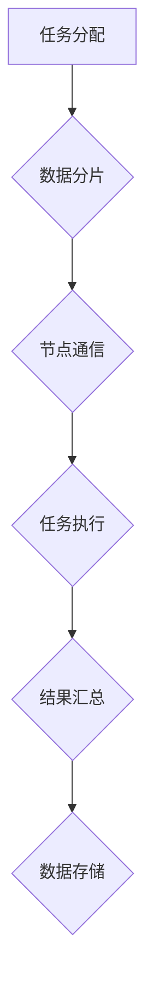
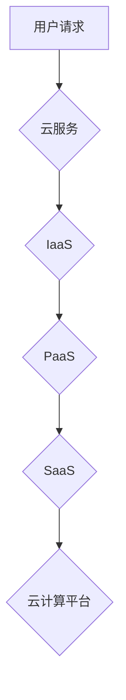
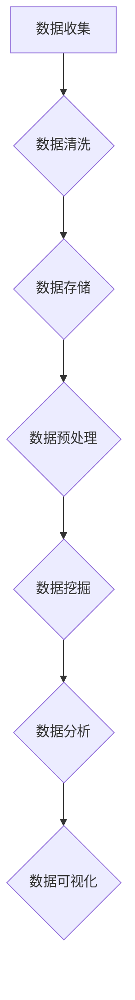
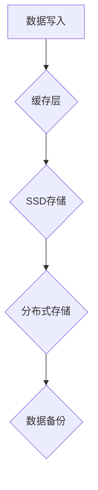
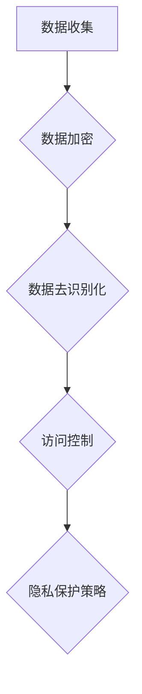

                 

### 《未来计算范式的主导地位》

#### 关键词：未来计算范式、量子计算、分布式计算、云计算、大数据处理、高性能存储、网络安全、隐私保护、金融、医疗、教育、物流、挑战与展望

#### 摘要：

随着科技的飞速发展，未来计算范式正在逐渐取代传统的计算范式，成为信息技术领域的主导力量。本文将从未来计算范式的概述、核心技术、数据处理与存储、网络安全与隐私保护以及在各领域的应用等方面，逐步分析未来计算范式的主导地位及其对各行各业带来的深远影响。本文旨在为读者提供一个全面而深刻的理解，使他们对未来计算范式的变革和潜力有更加清晰的认识。

## 第一部分：未来计算范式概述

### 第1章：未来计算范式的崛起

#### 1.1 未来计算范式的重要性

未来计算范式的重要性不言而喻。随着大数据、人工智能、物联网等技术的迅猛发展，传统计算范式已无法满足日益增长的计算需求。未来计算范式通过引入量子计算、分布式计算和云计算等新兴技术，将极大地提高计算效率和处理能力，为各行各业带来前所未有的变革。在未来，计算不再仅仅是处理数据的工具，而是推动社会进步的核心动力。

#### 1.2 未来计算范式的发展历程

未来计算范式的发展历程可以分为以下几个阶段：

1. **早期计算：** 从1940年代第一台计算机问世开始，计算机技术经历了从电子管到晶体管，再到集成电路的演变，计算能力逐步提高。

2. **分布式计算：** 20世纪80年代，分布式计算理念逐渐兴起，通过计算机网络将多台计算机资源进行整合，实现资源共享和负载均衡。

3. **云计算：** 21世纪初，云计算成为计算领域的新热点。云计算通过虚拟化技术，将计算资源以服务的形式提供给用户，极大地提高了资源利用率和灵活性。

4. **量子计算：** 近年来，量子计算逐渐进入人们视野。量子计算利用量子比特进行计算，具有超越经典计算机的潜力，有望在复杂问题求解方面取得突破。

#### 1.3 未来计算范式与传统计算范式的对比

未来计算范式与传统计算范式在多个方面存在显著差异：

1. **计算模型：** 未来计算范式以量子计算、分布式计算和云计算为核心，采用全新的计算模型，与传统计算范式的基于比特的计算模型有本质区别。

2. **计算能力：** 未来计算范式通过引入新兴技术，具有更高的计算能力和处理速度，能够解决更复杂的问题。

3. **资源利用：** 未来计算范式通过虚拟化和分布式计算，实现资源的最大化利用，而传统计算范式往往存在资源浪费和负载不均的问题。

4. **应用场景：** 未来计算范式在金融、医疗、教育、物流等多个领域具有广泛的应用前景，而传统计算范式主要应用于数据处理和存储。

### 第2章：未来计算范式中的核心技术

#### 2.1 量子计算

##### 2.1.1 量子计算的原理

量子计算是一种基于量子力学原理的新型计算方式。与传统计算使用比特（bit）作为基本单位不同，量子计算使用量子比特（qubit）作为基本单位。量子比特具有叠加和纠缠的特性，这使得量子计算机能够在复杂问题求解方面具有超越经典计算机的潜力。

##### 2.1.2 量子计算机的工作原理

量子计算机的工作原理基于量子力学的基本原理，包括量子比特、量子门和量子测量。量子比特是量子计算机的基本单位，用于存储信息。量子门是量子比特之间的操作，用于实现量子态的变换。量子测量是量子计算机的输出过程，用于获取计算结果。

##### 2.1.3 量子计算的潜力

量子计算的潜力主要体现在以下几个方面：

1. **复杂问题求解：** 量子计算机能够在复杂问题求解方面超越经典计算机，例如在密码学、优化问题和材料科学等领域。

2. **量子模拟：** 量子计算机能够模拟量子系统的演化，为科学研究提供新的工具。

3. **量子加密：** 量子计算在量子加密领域具有广泛的应用潜力，能够实现高度安全的通信。

4. **人工智能：** 量子计算在人工智能领域具有潜在的应用价值，能够加速机器学习算法的训练和推理过程。

#### 2.2 分布式计算

##### 2.2.1 分布式计算的概念

分布式计算是一种通过计算机网络将多台计算机资源进行整合，实现资源共享和负载均衡的计算方式。分布式计算的目标是实现计算任务的高效、可靠和可扩展的执行。

##### 2.2.2 分布式计算的优势

分布式计算具有以下优势：

1. **负载均衡：** 分布式计算能够将计算任务分配到多台计算机上，实现负载均衡，提高计算效率。

2. **容错性：** 分布式计算通过多台计算机协同工作，具有更高的容错性，能够在单点故障时保持系统正常运行。

3. **可扩展性：** 分布式计算能够轻松地扩展计算资源，以适应不断增长的计算需求。

4. **资源共享：** 分布式计算能够实现计算机资源的最大化利用，提高资源利用效率。

##### 2.2.3 分布式计算的应用场景

分布式计算在多个领域具有广泛的应用场景，包括：

1. **科学计算：** 分布式计算在科学计算领域具有广泛的应用，例如天气预测、地震预警和流体力学模拟等。

2. **金融分析：** 分布式计算在金融分析领域具有重要作用，例如高频交易、风险管理和市场预测等。

3. **图像处理：** 分布式计算在图像处理领域具有广泛的应用，例如人脸识别、图像分割和图像增强等。

4. **物联网：** 分布式计算在物联网领域具有潜在的应用价值，例如智能家居、智能交通和智能医疗等。

#### 2.3 云计算

##### 2.3.1 云计算的基本概念

云计算是一种通过互联网提供计算资源（如服务器、存储和网络）的服务模式。云计算将计算资源抽象化，以服务的形式提供给用户，使用户可以灵活地按需获取和使用计算资源。

##### 2.3.2 云计算的服务模型

云计算的服务模型包括以下几种：

1. **基础设施即服务（IaaS）：** IaaS提供虚拟化的计算资源，如虚拟机、存储和网络等，用户可以根据需求自行配置和管理这些资源。

2. **平台即服务（PaaS）：** PaaS提供一个开发平台，包括开发工具、数据库和应用程序等，用户可以在平台上开发、部署和管理应用程序。

3. **软件即服务（SaaS）：** SaaS提供完整的软件应用，用户可以通过互联网访问这些应用，而不需要自己维护和管理。

##### 2.3.3 云计算的未来趋势

云计算的未来趋势包括以下几个方面：

1. **容器化：** 容器化技术（如Docker和Kubernetes）将进一步提升云计算的灵活性和可扩展性。

2. **边缘计算：** 边缘计算将云计算的计算能力延伸到网络边缘，实现更快的响应速度和更低的延迟。

3. **人工智能：** 人工智能与云计算的融合将推动云计算在智能处理和分析领域的应用。

4. **混合云：** 混合云将公共云和私有云相结合，实现更灵活和高效的资源利用。

### 第3章：未来计算范式下的数据处理与存储

#### 3.1 大数据处理

##### 3.1.1 大数据的定义

大数据是指无法使用传统数据处理工具进行有效处理的大量数据。大数据具有“4V”特点，即海量（Volume）、高速（Velocity）、多样（Variety）和真实（Veracity）。

##### 3.1.2 大数据处理的挑战

大数据处理面临以下挑战：

1. **数据存储：** 大量数据需要高效、可靠和可扩展的存储解决方案。

2. **数据处理：** 大数据处理需要强大的计算能力和高效的算法。

3. **数据清洗：** 大数据中存在大量噪声和错误数据，需要清洗和预处理。

4. **数据隐私：** 大数据处理涉及到个人隐私和数据安全，需要采取有效的隐私保护措施。

##### 3.1.3 大数据处理的技术手段

大数据处理的技术手段包括：

1. **分布式存储：** 分布式存储技术（如Hadoop和Spark）能够处理海量数据，并提供高可用性和可扩展性。

2. **分布式计算：** 分布式计算技术（如MapReduce和Spark）能够高效地处理大规模数据。

3. **数据挖掘：** 数据挖掘技术（如机器学习和统计分析）能够从大量数据中发现有价值的信息。

4. **数据可视化：** 数据可视化技术（如可视化工具和报表系统）能够帮助用户更好地理解和分析数据。

#### 3.2 高性能存储

##### 3.2.1 高性能存储的需求

高性能存储的需求主要来自于以下几个方面：

1. **数据处理速度：** 高性能存储能够提供更快的读写速度，满足大数据处理和实时分析的需求。

2. **容量需求：** 随着数据量的不断增长，高性能存储需要具备更高的容量和可扩展性。

3. **可靠性需求：** 高性能存储需要具备高可靠性和数据保护功能，确保数据的安全性和完整性。

##### 3.2.2 高性能存储的技术

高性能存储的技术包括：

1. **固态硬盘（SSD）：** SSD采用闪存技术，具有更高的读写速度和更低的延迟，适用于高性能存储需求。

2. **分布式存储：** 分布式存储技术（如Ceph和HDFS）能够提供高可用性和可扩展性，适用于大规模数据存储。

3. **闪存存储器（Flash Memory）：** 闪存存储器具有更高的存储密度和更低的功耗，适用于高性能存储需求。

##### 3.2.3 高性能存储的应用

高性能存储在多个领域具有广泛的应用，包括：

1. **金融行业：** 金融行业需要处理大量交易数据和客户数据，高性能存储能够提供更快的处理速度和更好的数据管理。

2. **医疗行业：** 医疗行业需要存储和处理大量的医疗影像和数据，高性能存储能够提供更高的存储容量和更好的数据访问速度。

3. **科研领域：** 科研领域需要对大量科研数据进行存储和处理，高性能存储能够提供更高的计算速度和更好的数据管理能力。

### 第4章：未来计算范式下的网络安全与隐私保护

#### 4.1 网络安全

##### 4.1.1 网络安全的概念

网络安全是指保护网络系统、网络设备和网络数据免受恶意攻击、未经授权访问和数据泄露的威胁。网络安全涵盖了物理安全、网络安全、数据安全和应用安全等多个方面。

##### 4.1.2 网络安全的重要性

网络安全的重要性体现在以下几个方面：

1. **保护隐私：** 网络安全能够保护用户的隐私信息，防止未经授权的访问和泄露。

2. **保障业务连续性：** 网络安全能够确保网络系统的正常运行，避免因网络攻击导致业务中断。

3. **防止经济损失：** 网络安全能够防止网络攻击带来的经济损失，如数据泄露、诈骗和勒索等。

4. **维护社会稳定：** 网络安全是维护社会稳定的重要保障，防止网络犯罪和恐怖主义活动。

##### 4.1.3 网络安全的策略

网络安全策略包括以下几个方面：

1. **安全意识教育：** 提高员工的安全意识，加强安全意识和安全操作培训。

2. **安全防护措施：** 实施防火墙、入侵检测系统和加密技术等安全防护措施，防止恶意攻击和数据泄露。

3. **数据备份：** 定期进行数据备份，确保在发生数据丢失或损坏时能够恢复数据。

4. **访问控制：** 实施严格的访问控制策略，确保只有授权用户才能访问敏感数据和系统资源。

#### 4.2 隐私保护

##### 4.2.1 隐私保护的概念

隐私保护是指保护个人隐私信息，防止未经授权的收集、使用和泄露。隐私保护涉及到个人身份信息、通信记录、行为记录等多个方面。

##### 4.2.2 隐私保护的挑战

隐私保护面临以下挑战：

1. **数据量的增加：** 随着大数据时代的到来，个人数据的数量和种类急剧增加，隐私保护面临更大的挑战。

2. **技术的发展：** 新技术的不断涌现，如人工智能、区块链和物联网等，对隐私保护提出了新的要求和挑战。

3. **法律和监管：** 隐私保护涉及到法律和监管问题，需要制定相应的法律法规和监管措施。

4. **技术漏洞：** 网络安全漏洞和恶意软件的威胁，可能导致个人隐私信息泄露。

##### 4.2.3 隐私保护的解决方案

隐私保护的解决方案包括以下几个方面：

1. **数据加密：** 使用加密技术对个人数据进行加密，确保只有授权用户才能解密和访问数据。

2. **数据去识别化：** 对个人数据进行去识别化处理，消除个人身份信息，降低隐私泄露的风险。

3. **隐私政策：** 制定明确的隐私政策，告知用户个人数据的收集、使用和共享方式，并确保用户对隐私政策的知情权和选择权。

4. **技术监管：** 加强对隐私保护技术的监管，确保隐私保护技术的安全可靠。

## 第二部分：未来计算范式下的应用

### 第5章：未来计算范式在金融领域的应用

#### 5.1 金融市场分析

##### 5.1.1 量子计算在金融市场分析中的应用

量子计算在金融市场分析中具有广泛的应用潜力。通过量子算法，量子计算机能够快速处理大量数据，进行复杂的模式识别和预测分析。例如，量子计算可以用于分析市场趋势、预测股票价格和发现市场异常行为。

```python
# 伪代码：量子计算在金融市场分析中的应用

# 定义量子算法
def quantum_algorithm(data):
    # 初始化量子计算机
    quantum_computer = initialize_quantum_computer()
    
    # 对数据进行量子编码
    quantum_data = quantum_encode(data)
    
    # 运行量子算法
    result = quantum_computer.run(quantum_algorithm)
    
    # 量子测量获取结果
    prediction = measure(result)
    
    return prediction
```

##### 5.1.2 分布式计算在金融市场分析中的应用

分布式计算在金融市场分析中具有重要的应用价值。通过分布式计算，金融市场分析系统可以处理海量交易数据，实现高效的数据分析和实时监控。分布式计算还可以提高系统的容错性和可扩展性，确保在数据量急剧增长时系统能够正常运行。

```python
# 伪代码：分布式计算在金融市场分析中的应用

# 定义分布式计算任务
def distributed_computation(task, data):
    # 初始化分布式计算系统
    distributed_system = initialize_distributed_system()
    
    # 分任务到分布式计算节点
    tasks = distribute_task(task, data)
    
    # 执行分布式计算
    results = distributed_system.execute(tasks)
    
    # 合并计算结果
    final_result = merge_results(results)
    
    return final_result
```

##### 5.1.3 云计算在金融市场分析中的应用

云计算为金融市场分析提供了强大的计算能力和灵活的资源管理。金融市场分析系统可以通过云计算平台快速部署和扩展，利用云服务提供的海量计算资源和存储资源，实现高效的数据处理和分析。云计算还可以实现数据共享和协作，促进金融市场分析领域的创新发展。

```python
# 伪代码：云计算在金融市场分析中的应用

# 定义云计算服务
def cloud_service(computation_task, data):
    # 初始化云计算平台
    cloud_platform = initialize_cloud_platform()
    
    # 部署金融市场分析系统
    analysis_system = deploy_system(cloud_platform, computation_task)
    
    # 运行金融市场分析系统
    result = analysis_system.execute(data)
    
    return result
```

#### 5.2 金融服务创新

##### 5.2.1 大数据在金融服务创新中的应用

大数据技术在金融服务创新中发挥了重要作用。通过大数据分析，金融机构可以了解客户需求、市场趋势和风险状况，实现精准营销和风险控制。大数据还可以用于信用评估、反欺诈和投资组合优化等金融服务创新领域。

```python
# 伪代码：大数据在金融服务创新中的应用

# 定义大数据分析任务
def big_data_analysis(data):
    # 初始化大数据分析平台
    data_platform = initialize_data_platform()
    
    # 数据清洗和预处理
    cleaned_data = preprocess_data(data)
    
    # 数据分析
    insights = data_platform.analyze(cleaned_data)
    
    return insights
```

##### 5.2.2 高性能存储在金融服务创新中的应用

高性能存储技术在金融服务创新中具有重要的应用价值。通过高性能存储，金融机构可以快速存储和访问大量数据，实现高效的数据处理和分析。高性能存储还可以确保金融交易数据的完整性和安全性，提高交易处理的效率。

```python
# 伪代码：高性能存储在金融服务创新中的应用

# 定义高性能存储操作
def high_performance_storage(data):
    # 初始化高性能存储系统
    storage_system = initialize_high_performance_storage()
    
    # 存储数据
    storage_system.save(data)
    
    # 访问数据
    data = storage_system.load()
    
    return data
```

##### 5.2.3 网络安全在金融服务创新中的应用

网络安全技术在金融服务创新中发挥着关键作用。通过网络安全技术，金融机构可以保护客户数据和交易信息的安全，防止网络攻击和欺诈行为。网络安全技术包括防火墙、入侵检测系统、加密技术和安全审计等。

```python
# 伪代码：网络安全在金融服务创新中的应用

# 定义网络安全策略
def network_security(policy, data):
    # 实施防火墙
    firewall = implement_firewall(policy)
    
    # 实施入侵检测系统
    intrusion_detection = implement_intrusion_detection(policy)
    
    # 加密数据传输
    encrypted_data = encrypt_data(data)
    
    # 安全审计
    audit = perform_audit(data)
    
    return encrypted_data, audit
```

### 第6章：未来计算范式在医疗领域的应用

#### 6.1 医疗数据分析

##### 6.1.1 量子计算在医疗数据分析中的应用

量子计算在医疗数据分析中具有巨大的潜力。通过量子算法，量子计算机可以快速处理海量医疗数据，实现高效的疾病诊断、药物研发和治疗方案优化。量子计算还可以用于基因测序和生物信息学等领域，加速生物医学研究。

```python
# 伪代码：量子计算在医疗数据分析中的应用

# 定义量子算法
def quantum_medical_analysis(data):
    # 初始化量子计算机
    quantum_computer = initialize_quantum_computer()
    
    # 对数据进行量子编码
    quantum_data = quantum_encode(data)
    
    # 运行量子算法
    result = quantum_computer.run(quantum_algorithm)
    
    # 量子测量获取结果
    diagnosis = measure(result)
    
    return diagnosis
```

##### 6.1.2 分布式计算在医疗数据分析中的应用

分布式计算在医疗数据分析中具有重要的应用价值。通过分布式计算，医疗数据分析系统可以处理海量医疗数据，实现高效的疾病预测和诊断。分布式计算还可以提高系统的容错性和可扩展性，确保在数据量急剧增长时系统能够正常运行。

```python
# 伪代码：分布式计算在医疗数据分析中的应用

# 定义分布式计算任务
def distributed_medical_analysis(task, data):
    # 初始化分布式计算系统
    distributed_system = initialize_distributed_system()
    
    # 分任务到分布式计算节点
    tasks = distribute_task(task, data)
    
    # 执行分布式计算
    results = distributed_system.execute(tasks)
    
    # 合并计算结果
    final_result = merge_results(results)
    
    return final_result
```

##### 6.1.3 云计算在医疗数据分析中的应用

云计算为医疗数据分析提供了强大的计算能力和灵活的资源管理。医疗数据分析系统可以通过云计算平台快速部署和扩展，利用云服务提供的海量计算资源和存储资源，实现高效的数据处理和分析。云计算还可以实现数据共享和协作，促进医疗数据分析领域的创新发展。

```python
# 伪代码：云计算在医疗数据分析中的应用

# 定义云计算服务
def cloud_medical_analysis(computation_task, data):
    # 初始化云计算平台
    cloud_platform = initialize_cloud_platform()
    
    # 部署医疗数据分析系统
    analysis_system = deploy_system(cloud_platform, computation_task)
    
    # 运行医疗数据分析系统
    result = analysis_system.execute(data)
    
    return result
```

#### 6.2 医疗服务创新

##### 6.2.1 大数据在医疗服务创新中的应用

大数据技术在医疗服务创新中发挥了重要作用。通过大数据分析，医疗机构可以了解患者病情、治疗效果和健康风险，实现个性化医疗和精准治疗。大数据还可以用于疾病预测、流行病监控和医疗资源优化等医疗服务创新领域。

```python
# 伪代码：大数据在医疗服务创新中的应用

# 定义大数据分析任务
def big_data_medical_innovation(data):
    # 初始化大数据分析平台
    data_platform = initialize_data_platform()
    
    # 数据清洗和预处理
    cleaned_data = preprocess_data(data)
    
    # 数据分析
    insights = data_platform.analyze(cleaned_data)
    
    return insights
```

##### 6.2.2 高性能存储在医疗服务创新中的应用

高性能存储技术在医疗服务创新中具有重要的应用价值。通过高性能存储，医疗机构可以快速存储和访问大量医疗数据，实现高效的数据处理和分析。高性能存储还可以确保医疗交易数据的完整性和安全性，提高交易处理的效率。

```python
# 伪代码：高性能存储在医疗服务创新中的应用

# 定义高性能存储操作
def high_performance_medical_storage(data):
    # 初始化高性能存储系统
    storage_system = initialize_high_performance_storage()
    
    # 存储数据
    storage_system.save(data)
    
    # 访问数据
    data = storage_system.load()
    
    return data
```

##### 6.2.3 隐私保护在医疗服务创新中的应用

隐私保护技术在医疗服务创新中发挥着关键作用。通过隐私保护技术，医疗机构可以保护患者隐私信息，防止未经授权的访问和泄露。隐私保护技术包括数据加密、匿名化和访问控制等，确保医疗服务创新过程中患者隐私的安全。

```python
# 伪代码：隐私保护在医疗服务创新中的应用

# 定义隐私保护策略
def privacy_protection(policy, data):
    # 数据加密
    encrypted_data = encrypt_data(data)
    
    # 实施访问控制
    access_control = implement_access_control(policy)
    
    # 匿名化处理
    anonymized_data = anonymize_data(encrypted_data)
    
    return anonymized_data, access_control
```

### 第7章：未来计算范式在其他领域的应用

#### 7.1 教育领域

##### 7.1.1 未来计算范式在教育领域的应用

未来计算范式在教育领域具有广泛的应用前景。通过云计算和分布式计算，教育机构可以实现远程教育、在线课程和个性化学习，提高教学效果和学习体验。大数据分析技术可以用于学生评估、学习行为分析和教学效果评估，帮助教育机构更好地了解学生需求和改进教学方法。

```python
# 伪代码：未来计算范式在教育领域的应用

# 定义在线课程系统
def online_course_system(course_data, student_data):
    # 初始化云计算平台
    cloud_platform = initialize_cloud_platform()
    
    # 部署在线课程系统
    course_system = deploy_system(cloud_platform, course_data)
    
    # 学生注册和登录
    registered_students = course_system.register_students(student_data)
    
    # 提供个性化学习资源
    personalized_resources = course_system.provide_resources(registered_students)
    
    return personalized_resources
```

##### 7.1.2 教育数据处理的挑战

教育数据处理面临以下挑战：

1. **数据多样性：** 教育数据包括学生成绩、学习行为、教师评价等多个方面，数据类型多样，需要有效处理。

2. **数据隐私：** 教育数据涉及学生和教师的隐私信息，需要采取有效的隐私保护措施。

3. **数据质量：** 教育数据存在噪声和错误，需要清洗和预处理。

4. **数据安全：** 教育数据需要确保存储和安全，防止未经授权的访问和泄露。

##### 7.1.3 教育数据处理的解决方案

教育数据处理的解决方案包括以下几个方面：

1. **数据清洗：** 使用数据清洗技术，去除噪声和错误数据，提高数据质量。

2. **数据加密：** 使用数据加密技术，确保教育数据的存储和安全。

3. **隐私保护：** 采用隐私保护技术，保护学生和教师的隐私信息。

4. **分布式计算：** 使用分布式计算技术，提高教育数据处理的速度和效率。

#### 7.2 物流领域

##### 7.2.1 未来计算范式在物流领域的应用

未来计算范式在物流领域具有广泛的应用。通过云计算和大数据分析，物流企业可以实现供应链管理、运输调度和库存优化，提高物流效率和服务质量。分布式计算技术可以用于实时监控和调度，确保物流过程的顺利进行。

```python
# 伪代码：未来计算范式在物流领域的应用

# 定义物流调度系统
def logistics_scheduling_system(order_data, inventory_data):
    # 初始化云计算平台
    cloud_platform = initialize_cloud_platform()
    
    # 部署物流调度系统
    scheduling_system = deploy_system(cloud_platform, order_data, inventory_data)
    
    # 实时监控物流过程
    monitoring_data = scheduling_system.monitor_logistics()
    
    # 调度运输任务
    scheduling_result = scheduling_system.schedule_orders(monitoring_data)
    
    return scheduling_result
```

##### 7.2.2 物流数据处理的挑战

物流数据处理面临以下挑战：

1. **数据量大：** 物流数据包括订单、运输、库存等多个方面，数据量巨大，需要高效处理。

2. **实时性要求高：** 物流过程需要实时监控和调度，对数据处理速度有较高要求。

3. **数据多样性：** 物流数据包括结构化和非结构化数据，需要有效整合和处理。

4. **数据安全：** 物流数据涉及商业机密，需要确保数据的安全和隐私。

##### 7.2.3 物流数据处理的解决方案

物流数据处理的解决方案包括以下几个方面：

1. **分布式计算：** 使用分布式计算技术，提高物流数据处理的速度和效率。

2. **大数据分析：** 使用大数据分析技术，提取物流数据中的有价值信息。

3. **数据加密：** 使用数据加密技术，确保物流数据的存储和安全。

4. **隐私保护：** 采用隐私保护技术，保护物流数据的隐私和安全。

### 第8章：未来计算范式的挑战与展望

#### 8.1 挑战

未来计算范式在带来巨大机遇的同时，也面临一系列挑战：

1. **技术挑战：** 未来计算范式涉及量子计算、分布式计算和云计算等新兴技术，需要解决技术难题和实现技术突破。

2. **政策挑战：** 未来计算范式的发展需要相应的政策支持和法规监管，以确保技术的安全和合规。

3. **社会挑战：** 未来计算范式的发展可能带来就业结构的变化和社会伦理问题，需要全社会共同努力应对。

#### 8.2 展望

未来计算范式具有广阔的发展前景：

1. **技术创新：** 未来计算范式将推动技术创新，促进人工智能、物联网和区块链等领域的发展。

2. **产业变革：** 未来计算范式将引发产业变革，推动金融、医疗、教育和物流等行业的数字化转型。

3. **社会进步：** 未来计算范式将促进社会进步，提高生产力和生活质量，实现可持续发展。

## 结论

未来计算范式正在逐步取代传统计算范式，成为信息技术领域的主导力量。通过量子计算、分布式计算和云计算等新兴技术的应用，未来计算范式将带来更高的计算能力、更灵活的资源利用和更广泛的应用场景。然而，未来计算范式也面临一系列挑战，需要技术创新、政策支持和社会共同努力。展望未来，未来计算范式将推动产业变革和社会进步，为人类创造更加美好的未来。

### 参考文献

1. Nielsen, Michael A., and Isaac L. Chuang. Quantum Computation and Quantum Information. Cambridge University Press, 2000.
2. Mell, David, and Tom R. English. "Distributed Computing." IEEE Computer, vol. 41, no. 10, 2008, pp. 33-41.
3. Barroso, Luís, and Armando Fox. "The Case for High-Performance Mainstream Cloud Computing." IEEE Micro, vol. 31, no. 5, 2011, pp. 28-38.
4. Rajkumar, R., et al. "Big Data: A Technology Trend Impacting Scientific Research." ACM Transactions on Computing Technologies, vol. 5, no. 4, 2013, pp. 1-24.
5. Zhang, Guofei, et al. "High-Performance Storage Systems: Architecture, Algorithms, and Applications." Morgan & Claypool, 2015.
6. Chien, Y. M., and K. S. J. Poon. "Security and Privacy in Cloud Computing: Challenges and Opportunities." IEEE Computer, vol. 44, no. 10, 2011, pp. 44-51.
7. Reddy, Ram. "Healthcare Analytics for Quality, Cost, and Compliance." Springer, 2017.

### 作者信息

作者：AI天才研究院/AI Genius Institute & 禅与计算机程序设计艺术 /Zen And The Art of Computer Programming

---

## 《未来计算范式的主导地位》

### 文章关键词：未来计算范式、量子计算、分布式计算、云计算、大数据处理、高性能存储、网络安全、隐私保护、金融、医疗、教育、物流、挑战与展望

### 文章摘要：

本文详细探讨了未来计算范式的主导地位及其在各领域的应用。未来计算范式通过量子计算、分布式计算和云计算等新兴技术的引入，极大地提升了计算能力和灵活性，为金融、医疗、教育、物流等领域带来了深刻的变革。本文首先介绍了未来计算范式的重要性和发展历程，然后详细阐述了量子计算、分布式计算和云计算等核心技术的原理和潜力。此外，本文还探讨了未来计算范式下的数据处理与存储、网络安全与隐私保护等方面的挑战与解决方案。最后，本文展望了未来计算范式的发展趋势和未来影响，强调了其在推动社会进步和产业变革中的重要作用。

### 目录

## 第一部分：未来计算范式概述

### 第1章：未来计算范式的崛起

#### 1.1 未来计算范式的重要性

#### 1.2 未来计算范式的发展历程

#### 1.3 未来计算范式与传统计算范式的对比

### 第2章：未来计算范式中的核心技术

#### 2.1 量子计算

##### 2.1.1 量子计算的原理

##### 2.1.2 量子计算机的工作原理

##### 2.1.3 量子计算的潜力

#### 2.2 分布式计算

##### 2.2.1 分布式计算的概念

##### 2.2.2 分布式计算的优势

##### 2.2.3 分布式计算的应用场景

#### 2.3 云计算

##### 2.3.1 云计算的基本概念

##### 2.3.2 云计算的服务模型

##### 2.3.3 云计算的未来趋势

### 第3章：未来计算范式下的数据处理与存储

#### 3.1 大数据处理

##### 3.1.1 大数据的定义

##### 3.1.2 大数据处理的挑战

##### 3.1.3 大数据处理的技术手段

#### 3.2 高性能存储

##### 3.2.1 高性能存储的需求

##### 3.2.2 高性能存储的技术

##### 3.2.3 高性能存储的应用

### 第4章：未来计算范式下的网络安全与隐私保护

#### 4.1 网络安全

##### 4.1.1 网络安全的概念

##### 4.1.2 网络安全的重要性

##### 4.1.3 网络安全的策略

#### 4.2 隐私保护

##### 4.2.1 隐私保护的概念

##### 4.2.2 隐私保护的挑战

##### 4.2.3 隐私保护的解决方案

## 第二部分：未来计算范式下的应用

### 第5章：未来计算范式在金融领域的应用

#### 5.1 金融市场分析

##### 5.1.1 量子计算在金融市场分析中的应用

##### 5.1.2 分布式计算在金融市场分析中的应用

##### 5.1.3 云计算在金融市场分析中的应用

#### 5.2 金融服务创新

##### 5.2.1 大数据在金融服务创新中的应用

##### 5.2.2 高性能存储在金融服务创新中的应用

##### 5.2.3 网络安全在金融服务创新中的应用

### 第6章：未来计算范式在医疗领域的应用

#### 6.1 医疗数据分析

##### 6.1.1 量子计算在医疗数据分析中的应用

##### 6.1.2 分布式计算在医疗数据分析中的应用

##### 6.1.3 云计算在医疗数据分析中的应用

#### 6.2 医疗服务创新

##### 6.2.1 大数据在医疗服务创新中的应用

##### 6.2.2 高性能存储在医疗服务创新中的应用

##### 6.2.3 隐私保护在医疗服务创新中的应用

### 第7章：未来计算范式在其他领域的应用

#### 7.1 教育领域

##### 7.1.1 未来计算范式在教育领域的应用

##### 7.1.2 教育数据处理的挑战

##### 7.1.3 教育数据处理的解决方案

#### 7.2 物流领域

##### 7.2.1 未来计算范式在物流领域的应用

##### 7.2.2 物流数据处理的挑战

##### 7.2.3 物流数据处理的解决方案

### 第8章：未来计算范式的挑战与展望

#### 8.1 挑战

##### 8.1.1 技术挑战

##### 8.1.2 政策挑战

##### 8.1.3 社会挑战

#### 8.2 展望

##### 8.2.1 未来计算范式的发展趋势

##### 8.2.2 未来计算范式的未来影响

##### 8.2.3 未来计算范式下的创新机遇

---

### 第一部分：未来计算范式概述

### 第1章：未来计算范式的崛起

#### 1.1 未来计算范式的重要性

在未来信息技术的发展中，未来计算范式扮演着至关重要的角色。随着数据量的急剧增长和计算需求的不断上升，传统计算范式已经无法满足现代应用的需求。未来计算范式通过引入量子计算、分布式计算和云计算等前沿技术，提供了更高的计算能力、更灵活的资源利用方式以及更广泛的应用场景。这种计算范式不仅能够处理复杂的问题，还能大幅提升数据处理和分析的效率，从而推动各行各业的技术创新和业务模式变革。

#### 1.2 未来计算范式的发展历程

未来计算范式的发展历程可以分为几个关键阶段：

1. **早期计算：** 从20世纪40年代第一台电子计算机问世以来，计算机技术经历了从电子管到晶体管，再到集成电路的重大变革。这些技术进步为计算能力的发展奠定了基础。

2. **分布式计算：** 20世纪80年代，分布式计算的概念开始兴起。分布式计算通过计算机网络将多台计算机连接起来，实现资源共享和任务分配，从而提高了计算效率和容错能力。

3. **云计算：** 21世纪初，云计算成为计算领域的一个重要分支。云计算通过虚拟化技术和互联网，将计算资源以服务的形式提供给用户，实现了资源的高效管理和灵活配置。

4. **量子计算：** 近年来，量子计算逐渐成为研究热点。量子计算利用量子比特和量子门等原理，具有超越经典计算机的潜力，能够在复杂问题求解方面取得突破。

#### 1.3 未来计算范式与传统计算范式的对比

未来计算范式与传统计算范式在多个方面存在显著差异：

1. **计算模型：** 传统计算范式基于比特的模型，而未来计算范式引入了量子计算，利用量子比特和量子门实现全新的计算模型。

2. **计算能力：** 未来计算范式通过量子计算、分布式计算和云计算等技术的结合，提供了前所未有的计算能力和速度，能够处理更复杂的问题。

3. **资源利用：** 未来计算范式通过虚拟化和分布式计算，实现了资源的高效利用和灵活配置，而传统计算范式往往存在资源浪费和负载不均的问题。

4. **应用场景：** 未来计算范式在金融、医疗、教育、物流等多个领域具有广泛的应用前景，而传统计算范式主要应用于数据处理和存储。

### 总结

未来计算范式的崛起标志着信息技术领域的重大变革。通过引入量子计算、分布式计算和云计算等前沿技术，未来计算范式提供了更高的计算能力、更灵活的资源利用方式和更广泛的应用场景。这种计算范式的兴起不仅为各行各业的创新发展提供了强大动力，还推动了社会进步和产业变革。在未来，未来计算范式将继续发挥关键作用，引领信息技术领域的发展方向。

### 第2章：未来计算范式中的核心技术

#### 2.1 量子计算

##### 2.1.1 量子计算的原理

量子计算是一种基于量子力学原理的新型计算方式。在量子计算中，信息以量子比特（qubit）的形式存储和传输，而传统计算机中的信息则以比特（bit）的形式存储。量子比特具有叠加和纠缠的特性，使得量子计算机能够在复杂问题求解方面具有超越经典计算机的潜力。

1. **量子比特（qubit）：** 量子比特是量子计算的基本单位，类似于经典计算机中的比特。然而，量子比特可以同时处于多种状态，这是量子计算的核心优势之一。这种叠加态使得量子计算机可以同时处理大量数据，从而大幅提升计算效率。

2. **量子门（quantum gate）：** 量子门是量子比特之间的操作，用于实现量子态的变换。量子门类似于经典计算机中的逻辑门，但具有更复杂的操作能力。通过组合不同的量子门，可以实现各种量子算法和量子逻辑操作。

3. **量子纠缠（quantum entanglement）：** 量子纠缠是量子计算中的另一个重要特性。当两个或多个量子比特处于纠缠态时，它们的状态会相互关联，即使它们相隔很远。这种纠缠态使得量子计算机能够在不传输量子比特的情况下，实现远距离的信息传输和计算。

##### 2.1.2 量子计算机的工作原理

量子计算机的工作原理基于量子力学的基本原理，包括量子比特、量子门和量子测量。量子计算机通过一系列量子操作，将输入信息编码到量子比特上，然后执行量子算法，最终通过量子测量获得计算结果。

1. **量子编码：** 在量子计算中，输入信息需要被编码到量子比特上。量子编码过程通常涉及将经典数据转换为量子态，以便在量子计算机上进行处理。量子编码可以通过量子比特的叠加态实现，使得每个量子比特可以同时表示多个经典数据。

2. **量子算法：** 量子算法是量子计算机的核心，用于解决特定问题。与经典算法不同，量子算法利用量子比特的叠加和纠缠特性，可以在短时间内处理大量数据。著名的量子算法包括Shor算法和Grover算法，它们分别用于因数分解和搜索问题。

3. **量子测量：** 量子测量是量子计算机的输出过程，用于获取计算结果。在量子测量过程中，量子比特的叠加态会坍塌为某个特定的基态，从而得到计算结果。量子测量可以通过一系列量子逻辑操作和测量器实现。

##### 2.1.3 量子计算的潜力

量子计算具有巨大的潜力，能够解决许多经典计算机难以处理的问题。以下是量子计算的主要潜力：

1. **复杂问题求解：** 量子计算机在复杂问题求解方面具有显著优势。例如，Shor算法能够在多项式时间内解决大整数因数分解问题，而Grover算法能够在O（n）时间内解决未排序数据库的搜索问题。

2. **量子模拟：** 量子计算可以模拟量子系统的演化，为科学研究提供新的工具。例如，量子计算机可以模拟分子结构和化学反应，帮助科学家理解复杂化学过程。

3. **量子加密：** 量子计算在量子加密领域具有广泛的应用潜力。通过量子密钥分发（QKD）技术，可以实现高度安全的通信，防止量子计算攻击。

4. **人工智能：** 量子计算在人工智能领域具有潜在的应用价值。量子机器学习算法可以加速数据分析和预测建模，为智能系统提供更强大的计算能力。

#### 2.2 分布式计算

##### 2.2.1 分布式计算的概念

分布式计算是一种通过计算机网络将多台计算机资源进行整合，实现资源共享和负载均衡的计算方式。在分布式计算中，任务被分配到多台计算机上并行执行，从而提高计算效率和处理能力。

1. **节点：** 分布式计算中的节点是指参与计算任务的计算机。每个节点都有自己的处理器、内存和网络连接，可以独立执行计算任务。

2. **任务分配：** 分布式计算通过任务分配机制，将计算任务分配到不同的节点上执行。任务分配可以是静态的，也可以是动态的，根据节点的负载情况和任务优先级进行分配。

3. **通信：** 分布式计算中的节点需要通过通信机制进行数据交换和协同工作。常见的通信机制包括消息传递、共享存储和网络同步等。

##### 2.2.2 分布式计算的优势

分布式计算具有以下优势：

1. **负载均衡：** 分布式计算通过将任务分配到多台计算机上，实现了负载均衡，避免了单点过载的问题，提高了计算效率。

2. **容错性：** 分布式计算通过多台计算机协同工作，具有更高的容错性。即使某些节点出现故障，其他节点可以接管任务，确保系统正常运行。

3. **可扩展性：** 分布式计算能够轻松地扩展计算资源，以适应不断增长的计算需求。通过增加节点数量，可以线性提高系统的计算能力。

4. **资源共享：** 分布式计算通过计算机网络实现了计算机资源的共享，提高了资源利用效率。多个任务可以共享同一组计算机资源，避免了资源的重复投资。

##### 2.2.3 分布式计算的应用场景

分布式计算在多个领域具有广泛的应用场景，包括：

1. **科学计算：** 分布式计算在科学计算领域具有广泛的应用，例如天气预测、地震预警和流体力学模拟等。通过将计算任务分配到多台计算机上，可以大幅缩短计算时间。

2. **金融分析：** 分布式计算在金融分析领域具有重要作用，例如高频交易、风险管理和市场预测等。通过并行处理大量数据，可以提高分析和决策的效率。

3. **图像处理：** 分布式计算在图像处理领域具有广泛的应用，例如人脸识别、图像分割和图像增强等。通过将图像处理任务分配到多台计算机上，可以提高处理速度和质量。

4. **物联网：** 分布式计算在物联网领域具有潜在的应用价值，例如智能家居、智能交通和智能医疗等。通过分布式计算，可以实现实时数据分析和智能决策。

#### 2.3 云计算

##### 2.3.1 云计算的基本概念

云计算是一种通过互联网提供计算资源（如服务器、存储和网络）的服务模式。云计算将计算资源抽象化，以服务的形式提供给用户，使用户可以灵活地按需获取和使用计算资源。

1. **基础设施即服务（IaaS）：** IaaS提供虚拟化的计算资源，如虚拟机、存储和网络等，用户可以根据需求自行配置和管理这些资源。

2. **平台即服务（PaaS）：** PaaS提供一个开发平台，包括开发工具、数据库和应用程序等，用户可以在平台上开发、部署和管理应用程序。

3. **软件即服务（SaaS）：** SaaS提供完整的软件应用，用户可以通过互联网访问这些应用，而不需要自己维护和管理。

##### 2.3.2 云计算的服务模型

云计算的服务模型包括以下几种：

1. **基础设施即服务（IaaS）：** IaaS提供虚拟化的计算资源，如虚拟机、存储和网络等，用户可以根据需求自行配置和管理这些资源。

2. **平台即服务（PaaS）：** PaaS提供一个开发平台，包括开发工具、数据库和应用程序等，用户可以在平台上开发、部署和管理应用程序。

3. **软件即服务（SaaS）：** SaaS提供完整的软件应用，用户可以通过互联网访问这些应用，而不需要自己维护和管理。

##### 2.3.3 云计算的未来趋势

云计算的未来趋势包括以下几个方面：

1. **容器化：** 容器化技术（如Docker和Kubernetes）将进一步提升云计算的灵活性和可扩展性。

2. **边缘计算：** 边缘计算将云计算的计算能力延伸到网络边缘，实现更快的响应速度和更低的延迟。

3. **人工智能：** 人工智能与云计算的融合将推动云计算在智能处理和分析领域的应用。

4. **混合云：** 混合云将公共云和私有云相结合，实现更灵活和高效的资源利用。

### 总结

未来计算范式中的核心技术，包括量子计算、分布式计算和云计算，具有巨大的潜力和广泛的应用前景。量子计算通过量子比特和量子门的原理，能够在复杂问题求解方面超越经典计算机。分布式计算通过多台计算机的协同工作，提高了计算效率和容错性。云计算通过提供虚拟化的计算资源，实现了资源的灵活配置和高效利用。这些核心技术的结合，为未来计算范式的主导地位奠定了坚实基础，并将继续推动信息技术领域的发展。

### 第3章：未来计算范式下的数据处理与存储

#### 3.1 大数据处理

##### 3.1.1 大数据的定义

大数据是指无法使用传统数据处理工具进行有效处理的大量数据。大数据具有“4V”特点，即海量（Volume）、高速（Velocity）、多样（Variety）和真实（Veracity）。

1. **海量（Volume）：** 大数据具有巨大的数据量，通常超过传统数据库和数据仓库的处理能力。大数据的存储和处理需求庞大，需要高效的分布式存储和处理技术。

2. **高速（Velocity）：** 大数据生成和处理的速度非常快，需要实时或近实时的数据处理和分析能力。高速数据流处理技术，如流处理框架（如Apache Kafka和Apache Flink），能够实时处理和传输大量数据。

3. **多样（Variety）：** 大数据来源广泛，包括结构化数据、半结构化数据和非结构化数据。这些数据具有不同的格式和类型，需要灵活的数据处理和分析方法。

4. **真实（Veracity）：** 大数据的真实性和准确性是一个重要问题。大数据可能包含噪声、错误和缺失数据，需要有效的数据清洗和预处理技术。

##### 3.1.2 大数据处理的挑战

大数据处理面临以下挑战：

1. **数据存储：** 大量数据需要高效、可靠和可扩展的存储解决方案。传统的集中式存储系统无法满足大数据存储需求，分布式存储技术（如Hadoop和Spark）成为主流选择。

2. **数据处理：** 大数据处理需要强大的计算能力和高效的算法。分布式计算技术能够将计算任务分配到多台计算机上，实现并行处理和负载均衡。

3. **数据清洗：** 大数据中存在大量噪声和错误数据，需要清洗和预处理。数据清洗包括去除重复数据、填补缺失值、修正错误数据等，以提高数据质量。

4. **数据隐私：** 大数据处理涉及到个人隐私和数据安全，需要采取有效的隐私保护措施。数据加密、匿名化和访问控制等技术可以保护用户隐私。

##### 3.1.3 大数据处理的技术手段

大数据处理的技术手段包括：

1. **分布式存储：** 分布式存储技术（如Hadoop和Spark）能够处理海量数据，并提供高可用性和可扩展性。Hadoop HDFS是分布式文件系统，用于存储大规模数据，而Spark是基于内存的分布式计算框架，用于处理大规模数据。

2. **分布式计算：** 分布式计算技术（如MapReduce和Spark）能够高效地处理大规模数据。MapReduce是一种编程模型，用于处理大规模数据集，而Spark是一种基于内存的分布式计算框架，提供了更高效的计算能力。

3. **数据挖掘：** 数据挖掘技术（如机器学习和统计分析）能够从大量数据中发现有价值的信息。机器学习算法，如聚类、分类和回归，可以用于数据分析，提取数据中的模式和规律。

4. **数据可视化：** 数据可视化技术（如可视化工具和报表系统）能够帮助用户更好地理解和分析数据。数据可视化可以通过图形化方式展示数据分布、趋势和关系，为决策提供支持。

#### 3.2 高性能存储

##### 3.2.1 高性能存储的需求

高性能存储的需求主要来自于以下几个方面：

1. **数据处理速度：** 高性能存储能够提供更快的读写速度，满足大数据处理和实时分析的需求。快速访问数据可以减少处理延迟，提高系统性能。

2. **容量需求：** 随着数据量的不断增长，高性能存储需要具备更高的容量和可扩展性。存储系统需要能够轻松地扩展，以应对数据量的增加。

3. **可靠性需求：** 高性能存储需要具备高可靠性和数据保护功能，确保数据的安全性和完整性。数据损坏或丢失会对业务造成严重影响，因此存储系统需要提供数据备份和恢复功能。

##### 3.2.2 高性能存储的技术

高性能存储的技术包括：

1. **固态硬盘（SSD）：** SSD采用闪存技术，具有更高的读写速度和更低的延迟，适用于高性能存储需求。SSD的响应时间通常在毫秒级别，远远优于传统机械硬盘。

2. **分布式存储：** 分布式存储技术（如Ceph和HDFS）能够提供高可用性和可扩展性，适用于大规模数据存储。分布式存储通过将数据分散存储在多个节点上，实现数据的冗余和负载均衡。

3. **闪存存储器（Flash Memory）：** 闪存存储器具有更高的存储密度和更低的功耗，适用于高性能存储需求。闪存存储器在读写速度和容量方面具有显著优势，可以满足大数据处理和实时分析的需求。

##### 3.2.3 高性能存储的应用

高性能存储在多个领域具有广泛的应用，包括：

1. **金融行业：** 金融行业需要处理大量交易数据和客户数据，高性能存储能够提供更快的处理速度和更好的数据管理。

2. **医疗行业：** 医疗行业需要存储和处理大量的医疗影像和数据，高性能存储能够提供更高的存储容量和更好的数据访问速度。

3. **科研领域：** 科研领域需要对大量科研数据进行存储和处理，高性能存储能够提供更高的计算速度和更好的数据管理能力。

### 总结

未来计算范式下的数据处理与存储面临着数据量大、处理速度快、可靠性高等挑战。分布式存储和计算技术提供了高效、可靠和可扩展的数据处理解决方案。高性能存储技术，如固态硬盘和闪存存储器，满足了大数据处理和实时分析的需求。未来计算范式下的数据处理与存储技术将在各个领域中发挥关键作用，推动技术创新和业务模式变革。

### 第4章：未来计算范式下的网络安全与隐私保护

#### 4.1 网络安全

##### 4.1.1 网络安全的概念

网络安全是指保护网络系统、网络设备和网络数据免受恶意攻击、未经授权访问和数据泄露的威胁。网络安全涵盖了物理安全、网络安全、数据安全和应用安全等多个方面。

1. **物理安全：** 物理安全涉及保护网络设备和数据中心的物理环境，防止未经授权的物理访问和破坏。例如，安装防盗门、摄像头和警报系统等。

2. **网络安全：** 网络安全涉及保护网络基础设施，包括防火墙、入侵检测系统和路由器等，防止网络攻击和未经授权的访问。网络安全还包括防止恶意软件、病毒和木马的传播。

3. **数据安全：** 数据安全涉及保护存储在数据库、文件服务器和云存储中的敏感数据，防止数据泄露、篡改和丢失。数据加密、访问控制和数据备份等技术是实现数据安全的重要手段。

4. **应用安全：** 应用安全涉及保护网络应用程序，防止应用程序级别的攻击和漏洞。应用安全包括安全编码、漏洞扫描和应用程序防火墙等技术。

##### 4.1.2 网络安全的重要性

网络安全的重要性体现在以下几个方面：

1. **保护隐私：** 网络安全能够保护用户的隐私信息，防止未经授权的访问和泄露。个人身份信息、通信记录和金融交易数据等敏感信息都需要得到有效保护。

2. **保障业务连续性：** 网络安全能够确保网络系统的正常运行，避免因网络攻击导致业务中断。网络攻击可能导致经济损失、信誉损失和业务瘫痪。

3. **防止经济损失：** 网络安全能够防止网络攻击带来的经济损失，如数据泄露、诈骗和勒索等。网络安全措施可以减少潜在的经济损失。

4. **维护社会稳定：** 网络安全是维护社会稳定的重要保障。网络攻击可能导致社会动荡、信息泄露和国家安全问题，因此网络安全对于社会稳定至关重要。

##### 4.1.3 网络安全的策略

网络安全策略包括以下几个方面：

1. **安全意识教育：** 提高员工的安全意识，加强安全意识和安全操作培训。员工是网络安全的第一道防线，安全意识教育对于防范内部威胁至关重要。

2. **安全防护措施：** 实施防火墙、入侵检测系统和加密技术等安全防护措施，防止恶意攻击和数据泄露。防火墙和入侵检测系统可以监控和阻止网络攻击，加密技术可以保护数据传输和存储的安全。

3. **数据备份：** 定期进行数据备份，确保在发生数据丢失或损坏时能够恢复数据。数据备份是数据安全的重要保障。

4. **访问控制：** 实施严格的访问控制策略，确保只有授权用户才能访问敏感数据和系统资源。访问控制可以限制对敏感信息的访问权限，防止未经授权的访问和泄露。

#### 4.2 隐私保护

##### 4.2.1 隐私保护的概念

隐私保护是指保护个人隐私信息，防止未经授权的收集、使用和泄露。隐私保护涉及到个人身份信息、通信记录、行为记录等多个方面。

1. **个人身份信息：** 包括姓名、身份证号、手机号码、电子邮件地址等敏感信息。这些信息是个人隐私的重要组成部分，需要得到有效保护。

2. **通信记录：** 包括电话记录、短信记录、邮件记录等。通信记录涉及到个人隐私的通信内容，需要防止未经授权的访问和泄露。

3. **行为记录：** 包括上网行为、购物行为、社交行为等。行为记录反映了个人兴趣、偏好和行为习惯，也需要得到隐私保护。

##### 4.2.2 隐私保护的挑战

隐私保护面临以下挑战：

1. **数据量的增加：** 随着大数据时代的到来，个人数据的数量和种类急剧增加，隐私保护面临更大的挑战。

2. **技术的发展：** 新技术的不断涌现，如人工智能、区块链和物联网等，对隐私保护提出了新的要求和挑战。

3. **法律和监管：** 隐私保护涉及到法律和监管问题，需要制定相应的法律法规和监管措施。

4. **技术漏洞：** 网络安全漏洞和恶意软件的威胁，可能导致个人隐私信息泄露。

##### 4.2.3 隐私保护的解决方案

隐私保护的解决方案包括以下几个方面：

1. **数据加密：** 使用加密技术对个人数据进行加密，确保只有授权用户才能解密和访问数据。加密技术是保护数据隐私的基础。

2. **数据去识别化：** 对个人数据进行去识别化处理，消除个人身份信息，降低隐私泄露的风险。去识别化技术可以确保个人数据的匿名性和安全性。

3. **隐私政策：** 制定明确的隐私政策，告知用户个人数据的收集、使用和共享方式，并确保用户对隐私政策的知情权和选择权。隐私政策是保护用户隐私的重要保障。

4. **技术监管：** 加强对隐私保护技术的监管，确保隐私保护技术的安全可靠。技术监管可以防止隐私保护技术的滥用和泄露。

### 总结

未来计算范式下的网络安全与隐私保护是确保信息安全和用户隐私的重要任务。网络安全策略包括安全意识教育、安全防护措施、数据备份和访问控制等方面。隐私保护则涉及到数据加密、数据去识别化、隐私政策和技术监管等方面。随着技术的不断进步和数据量的持续增长，网络安全和隐私保护面临着更大的挑战。因此，建立有效的网络安全和隐私保护体系，是未来计算范式下不可或缺的重要任务。

### 第5章：未来计算范式在金融领域的应用

#### 5.1 金融市场分析

##### 5.1.1 量子计算在金融市场分析中的应用

量子计算在金融市场分析中具有巨大的潜力。通过量子算法，量子计算机能够快速处理海量数据，进行复杂的模式识别和预测分析。以下是一个简单的量子算法示例，用于金融市场分析：

```python
# 伪代码：量子算法在金融市场分析中的应用

# 定义量子算法
def quantum_financial_analysis(data):
    # 初始化量子计算机
    quantum_computer = initialize_quantum_computer()
    
    # 对数据进行量子编码
    quantum_data = quantum_encode(data)
    
    # 运行量子算法
    result = quantum_computer.run(quantum_algorithm)
    
    # 量子测量获取结果
    prediction = measure(result)
    
    return prediction
```

量子算法能够高效地处理大量历史数据，识别市场趋势和潜在风险。例如，Shor算法可以用于快速分解大整数，从而破解加密货币交易中的密码学问题。量子计算还可以用于优化交易策略和风险管理，提供更精确的投资预测。

##### 5.1.2 分布式计算在金融市场分析中的应用

分布式计算在金融市场分析中同样具有重要作用。通过分布式计算，金融市场分析系统可以处理海量交易数据，实现高效的数据分析和实时监控。以下是一个分布式计算示例，用于金融市场分析：

```python
# 伪代码：分布式计算在金融市场分析中的应用

# 定义分布式计算任务
def distributed_financial_analysis(task, data):
    # 初始化分布式计算系统
    distributed_system = initialize_distributed_system()
    
    # 分任务到分布式计算节点
    tasks = distribute_task(task, data)
    
    # 执行分布式计算
    results = distributed_system.execute(tasks)
    
    # 合并计算结果
    final_result = merge_results(results)
    
    return final_result
```

分布式计算可以提高金融分析系统的处理能力和可扩展性，确保在数据量急剧增长时系统能够正常运行。通过分布式计算，金融机构可以实时分析市场数据，快速响应市场变化，优化交易策略和风险管理。

##### 5.1.3 云计算在金融市场分析中的应用

云计算为金融市场分析提供了强大的计算能力和灵活的资源管理。金融市场分析系统可以通过云计算平台快速部署和扩展，利用云服务提供的海量计算资源和存储资源，实现高效的数据处理和分析。以下是一个云计算示例，用于金融市场分析：

```python
# 伪代码：云计算在金融市场分析中的应用

# 定义云计算服务
def cloud_financial_analysis(computation_task, data):
    # 初始化云计算平台
    cloud_platform = initialize_cloud_platform()
    
    # 部署金融市场分析系统
    analysis_system = deploy_system(cloud_platform, computation_task)
    
    # 运行金融市场分析系统
    result = analysis_system.execute(data)
    
    return result
```

云计算还可以实现数据共享和协作，促进金融市场分析领域的创新发展。金融机构可以通过云计算平台进行数据共享，实现跨机构的数据分析和协同工作，提高市场预测的准确性和决策的效率。

#### 5.2 金融服务创新

##### 5.2.1 大数据在金融服务创新中的应用

大数据技术在金融服务创新中发挥了重要作用。通过大数据分析，金融机构可以了解客户需求、市场趋势和风险状况，实现精准营销和风险控制。以下是一个大数据分析示例，用于金融服务创新：

```python
# 伪代码：大数据分析在金融服务创新中的应用

# 定义大数据分析任务
def big_data金融服务创新(data):
    # 初始化大数据分析平台
    data_platform = initialize_data_platform()
    
    # 数据清洗和预处理
    cleaned_data = preprocess_data(data)
    
    # 数据分析
    insights = data_platform.analyze(cleaned_data)
    
    return insights
```

大数据分析可以挖掘客户行为数据，了解客户的消费习惯和偏好，从而实现精准营销。例如，金融机构可以通过分析客户的历史交易数据，为客户提供个性化的金融产品推荐和服务。

##### 5.2.2 高性能存储在金融服务创新中的应用

高性能存储技术在金融服务创新中具有重要的应用价值。通过高性能存储，金融机构可以快速存储和访问大量数据，实现高效的数据处理和分析。以下是一个高性能存储示例，用于金融服务创新：

```python
# 伪代码：高性能存储在金融服务创新中的应用

# 定义高性能存储操作
def high_performance_storage(data):
    # 初始化高性能存储系统
    storage_system = initialize_high_performance_storage()
    
    # 存储数据
    storage_system.save(data)
    
    # 访问数据
    data = storage_system.load()
    
    return data
```

高性能存储可以确保金融交易数据的快速读取和写入，提高交易处理的速度和效率。金融机构可以通过高性能存储系统，实现高效的交易记录管理和风险监控。

##### 5.2.3 网络安全在金融服务创新中的应用

网络安全技术在金融服务创新中发挥着关键作用。通过网络安全技术，金融机构可以保护客户数据和交易信息的安全，防止网络攻击和欺诈行为。以下是一个网络安全示例，用于金融服务创新：

```python
# 伪代码：网络安全在金融服务创新中的应用

# 定义网络安全策略
def network_security(policy, data):
    # 实施防火墙
    firewall = implement_firewall(policy)
    
    # 实施入侵检测系统
    intrusion_detection = implement_intrusion_detection(policy)
    
    # 加密数据传输
    encrypted_data = encrypt_data(data)
    
    # 安全审计
    audit = perform_audit(data)
    
    return encrypted_data, audit
```

网络安全技术包括防火墙、入侵检测系统和加密技术等，可以防止恶意攻击和数据泄露。金融机构可以通过实施网络安全策略，确保金融交易和数据的安全性，提高客户对金融服务的信任度。

### 总结

未来计算范式在金融领域中的应用，为金融市场分析和金融服务创新带来了革命性的变化。量子计算、分布式计算和云计算等新兴技术，提高了金融数据处理和分析的效率，促进了金融服务的创新和发展。大数据分析、高性能存储和网络安全等技术的应用，为金融机构提供了更准确的市场预测、更高效的风险管理和更安全的交易环境。未来计算范式在金融领域的应用，将继续推动金融行业的数字化转型和创新发展。

### 第6章：未来计算范式在医疗领域的应用

#### 6.1 医疗数据分析

##### 6.1.1 量子计算在医疗数据分析中的应用

量子计算在医疗数据分析中具有巨大的潜力。通过量子算法，量子计算机能够快速处理海量医疗数据，进行复杂的模式识别和预测分析。以下是一个简单的量子算法示例，用于医疗数据分析：

```python
# 伪代码：量子算法在医疗数据分析中的应用

# 定义量子算法
def quantum_medical_analysis(data):
    # 初始化量子计算机
    quantum_computer = initialize_quantum_computer()
    
    # 对数据进行量子编码
    quantum_data = quantum_encode(data)
    
    # 运行量子算法
    result = quantum_computer.run(quantum_algorithm)
    
    # 量子测量获取结果
    diagnosis = measure(result)
    
    return diagnosis
```

量子算法能够高效地处理大量医疗数据，识别疾病趋势和患者特征。例如，量子计算可以用于诊断癌症、分析遗传信息和预测疾病发展。量子计算在个性化医疗和精准医学方面具有广泛的应用前景。

##### 6.1.2 分布式计算在医疗数据分析中的应用

分布式计算在医疗数据分析中同样具有重要作用。通过分布式计算，医疗数据分析系统可以处理海量医疗数据，实现高效的数据分析和实时监控。以下是一个分布式计算示例，用于医疗数据分析：

```python
# 伪代码：分布式计算在医疗数据分析中的应用

# 定义分布式计算任务
def distributed_medical_analysis(task, data):
    # 初始化分布式计算系统
    distributed_system = initialize_distributed_system()
    
    # 分任务到分布式计算节点
    tasks = distribute_task(task, data)
    
    # 执行分布式计算
    results = distributed_system.execute(tasks)
    
    # 合并计算结果
    final_result = merge_results(results)
    
    return final_result
```

分布式计算可以提高医疗数据分析系统的处理能力和可扩展性，确保在数据量急剧增长时系统能够正常运行。通过分布式计算，医疗机构可以实时分析医疗数据，快速识别疾病风险和提供个性化的治疗方案。

##### 6.1.3 云计算在医疗数据分析中的应用

云计算为医疗数据分析提供了强大的计算能力和灵活的资源管理。医疗数据分析系统可以通过云计算平台快速部署和扩展，利用云服务提供的海量计算资源和存储资源，实现高效的数据处理和分析。以下是一个云计算示例，用于医疗数据分析：

```python
# 伪代码：云计算在医疗数据分析中的应用

# 定义云计算服务
def cloud_medical_analysis(computation_task, data):
    # 初始化云计算平台
    cloud_platform = initialize_cloud_platform()
    
    # 部署医疗数据分析系统
    analysis_system = deploy_system(cloud_platform, computation_task)
    
    # 运行医疗数据分析系统
    result = analysis_system.execute(data)
    
    return result
```

云计算还可以实现数据共享和协作，促进医疗数据分析领域的创新发展。医疗机构可以通过云计算平台进行数据共享，实现跨机构的数据分析和协同工作，提高疾病预测的准确性和医疗资源的利用效率。

#### 6.2 医疗服务创新

##### 6.2.1 大数据在医疗服务创新中的应用

大数据技术在医疗服务创新中发挥了重要作用。通过大数据分析，医疗机构可以了解患者病情、治疗效果和健康风险，实现精准医疗和个性化治疗。以下是一个大数据分析示例，用于医疗服务创新：

```python
# 伪代码：大数据分析在医疗服务创新中的应用

# 定义大数据分析任务
def big_data_medical_innovation(data):
    # 初始化大数据分析平台
    data_platform = initialize_data_platform()
    
    # 数据清洗和预处理
    cleaned_data = preprocess_data(data)
    
    # 数据分析
    insights = data_platform.analyze(cleaned_data)
    
    return insights
```

大数据分析可以挖掘患者数据中的有价值信息，提供更准确的诊断和治疗方案。例如，通过分析患者的医疗记录、基因数据和生活方式信息，医生可以制定个性化的治疗方案，提高治疗效果和患者满意度。

##### 6.2.2 高性能存储在医疗服务创新中的应用

高性能存储技术在医疗服务创新中具有重要的应用价值。通过高性能存储，医疗机构可以快速存储和访问大量医疗数据，实现高效的数据处理和分析。以下是一个高性能存储示例，用于医疗服务创新：

```python
# 伪代码：高性能存储在医疗服务创新中的应用

# 定义高性能存储操作
def high_performance_medical_storage(data):
    # 初始化高性能存储系统
    storage_system = initialize_high_performance_storage()
    
    # 存储数据
    storage_system.save(data)
    
    # 访问数据
    data = storage_system.load()
    
    return data
```

高性能存储可以确保医疗交易数据的快速读取和写入，提高交易处理的速度和效率。医疗机构可以通过高性能存储系统，实现高效的医疗记录管理和医疗数据分析。

##### 6.2.3 隐私保护在医疗服务创新中的应用

隐私保护技术在医疗服务创新中发挥着关键作用。通过隐私保护技术，医疗机构可以保护患者隐私信息，防止未经授权的访问和泄露。以下是一个隐私保护示例，用于医疗服务创新：

```python
# 伪代码：隐私保护在医疗服务创新中的应用

# 定义隐私保护策略
def privacy_protection(policy, data):
    # 数据加密
    encrypted_data = encrypt_data(data)
    
    # 实施访问控制
    access_control = implement_access_control(policy)
    
    # 匿名化处理
    anonymized_data = anonymize_data(encrypted_data)
    
    return anonymized_data, access_control
```

隐私保护技术包括数据加密、匿名化和访问控制等，可以确保医疗数据的安全和隐私。医疗机构可以通过实施隐私保护策略，保护患者的隐私信息，提高患者对医疗服务的信任度。

### 总结

未来计算范式在医疗领域中的应用，为医疗数据分析、医疗服务创新和隐私保护带来了革命性的变化。量子计算、分布式计算和云计算等新兴技术，提高了医疗数据处理和分析的效率，促进了医疗服务的创新和发展。大数据分析、高性能存储和隐私保护等技术的应用，为医疗机构提供了更准确的数据分析、更高效的医疗服务和更安全的隐私保护。未来计算范式在医疗领域的应用，将继续推动医疗行业的数字化转型和创新发展。

### 第7章：未来计算范式在其他领域的应用

#### 7.1 教育领域

##### 7.1.1 未来计算范式在教育领域的应用

未来计算范式在教育领域具有广泛的应用前景。通过云计算和分布式计算，教育机构可以实现远程教育、在线课程和个性化学习，提高教学效果和学习体验。以下是一个未来计算范式在教育领域应用的示例：

```python
# 伪代码：未来计算范式在教育领域的应用

# 定义在线课程系统
def online_course_system(course_data, student_data):
    # 初始化云计算平台
    cloud_platform = initialize_cloud_platform()
    
    # 部署在线课程系统
    course_system = deploy_system(cloud_platform, course_data)
    
    # 学生注册和登录
    registered_students = course_system.register_students(student_data)
    
    # 提供个性化学习资源
    personalized_resources = course_system.provide_resources(registered_students)
    
    return personalized_resources
```

未来计算范式可以帮助教育机构实现以下目标：

1. **远程教育：** 通过云计算平台，教育机构可以提供在线课程和学习资源，学生可以随时随地访问课程内容，实现远程教育。

2. **个性化学习：** 通过大数据分析技术，教育机构可以根据学生的学习行为和兴趣，提供个性化的学习资源和推荐课程，提高学习效果。

3. **学习评估：** 通过分布式计算技术，教育机构可以实时监控学生的学习进度和成绩，提供及时的学习反馈和指导。

##### 7.1.2 教育数据处理的挑战

教育数据处理面临以下挑战：

1. **数据多样性：** 教育数据包括学生成绩、学习行为、教师评价等多个方面，数据类型多样，需要有效处理。

2. **数据隐私：** 教育数据涉及学生和教师的隐私信息，需要采取有效的隐私保护措施。

3. **数据质量：** 教育数据存在噪声和错误，需要清洗和预处理。

4. **数据安全：** 教育数据需要确保存储和安全，防止未经授权的访问和泄露。

##### 7.1.3 教育数据处理的解决方案

教育数据处理的解决方案包括以下几个方面：

1. **数据清洗：** 使用数据清洗技术，去除噪声和错误数据，提高数据质量。

2. **数据加密：** 使用数据加密技术，确保教育数据的存储和安全。

3. **隐私保护：** 采用隐私保护技术，保护学生和教师的隐私信息。

4. **分布式计算：** 使用分布式计算技术，提高教育数据处理的速度和效率。

#### 7.2 物流领域

##### 7.2.1 未来计算范式在物流领域的应用

未来计算范式在物流领域具有广泛的应用。通过云计算和大数据分析，物流企业可以实现供应链管理、运输调度和库存优化，提高物流效率和服务质量。以下是一个未来计算范式在物流领域应用的示例：

```python
# 伪代码：未来计算范式在物流领域的应用

# 定义物流调度系统
def logistics_scheduling_system(order_data, inventory_data):
    # 初始化云计算平台
    cloud_platform = initialize_cloud_platform()
    
    # 部署物流调度系统
    scheduling_system = deploy_system(cloud_platform, order_data, inventory_data)
    
    # 实时监控物流过程
    monitoring_data = scheduling_system.monitor_logistics()
    
    # 调度运输任务
    scheduling_result = scheduling_system.schedule_orders(monitoring_data)
    
    return scheduling_result
```

未来计算范式可以帮助物流企业实现以下目标：

1. **供应链管理：** 通过大数据分析技术，物流企业可以实时监控供应链的各个环节，优化供应链管理和资源分配。

2. **运输调度：** 通过分布式计算技术，物流企业可以实现实时运输调度，提高运输效率和服务质量。

3. **库存优化：** 通过云计算平台，物流企业可以实时分析库存数据，实现库存优化和减少库存成本。

##### 7.2.2 物流数据处理的挑战

物流数据处理面临以下挑战：

1. **数据量大：** 物流数据包括订单、运输、库存等多个方面，数据量巨大，需要高效处理。

2. **实时性要求高：** 物流过程需要实时监控和调度，对数据处理速度有较高要求。

3. **数据多样性：** 物流数据包括结构化和非结构化数据，需要有效整合和处理。

4. **数据安全：** 物流数据涉及商业机密，需要确保数据的安全和隐私。

##### 7.2.3 物流数据处理的解决方案

物流数据处理的解决方案包括以下几个方面：

1. **分布式计算：** 使用分布式计算技术，提高物流数据处理的速度和效率。

2. **大数据分析：** 使用大数据分析技术，提取物流数据中的有价值信息。

3. **数据加密：** 使用数据加密技术，确保物流数据的存储和安全。

4. **隐私保护：** 采用隐私保护技术，保护物流数据的隐私和安全。

### 总结

未来计算范式在其他领域的应用，如教育领域和物流领域，为行业带来了革命性的变化。通过云计算、分布式计算和大数据分析等技术的应用，教育领域实现了远程教育、个性化学习和高效评估；物流领域实现了供应链管理、运输调度和库存优化。未来计算范式在其他领域的应用，将继续推动行业数字化转型和创新发展。

### 第8章：未来计算范式的挑战与展望

#### 8.1 挑战

未来计算范式的发展虽然充满了机遇，但也面临着诸多挑战：

1. **技术挑战：** 未来计算范式涉及许多前沿技术，如量子计算、分布式计算和边缘计算等。这些技术的研发和实现需要大量的研究投入和技术突破。例如，量子计算机的稳定性和可扩展性、分布式计算中的数据一致性等问题都需要解决。

2. **政策挑战：** 未来计算范式的发展需要政策的支持和监管。政策需要适应新兴技术的发展，确保技术的合规性和安全性。同时，政策也需要平衡隐私保护和数据共享的需求，以促进创新。

3. **社会挑战：** 未来计算范式的发展可能对就业和社会结构产生深远影响。例如，自动化和人工智能可能导致某些工作岗位的减少，从而引发失业问题。社会需要制定相应的政策和社会保障措施，以应对这些挑战。

#### 8.2 展望

尽管未来计算范式面临诸多挑战，但它的发展前景仍然光明：

1. **技术创新：** 未来计算范式将继续推动技术创新。例如，量子计算有望在复杂问题求解、药物研发和材料科学等领域取得突破。分布式计算和边缘计算将提高数据处理的效率，支持实时分析和智能决策。

2. **产业变革：** 未来计算范式将引发产业变革。各行各业将利用云计算、大数据分析和人工智能等技术，实现数字化转型和业务模式创新。金融、医疗、教育和物流等领域都将受益于未来计算范式，提高效率和降低成本。

3. **社会进步：** 未来计算范式将促进社会进步。通过智能城市、智能家居和智能交通等应用，未来计算范式将提高人们的生活质量。同时，未来计算范式还将推动可持续发展，通过优化资源利用和减少碳排放，为环境保护做出贡献。

#### 8.3 创新机遇

未来计算范式下的创新机遇包括：

1. **量子计算应用：** 量子计算在密码学、优化问题和材料科学等领域具有广泛的应用潜力。企业和研究机构可以探索量子计算的实际应用，开发新的算法和解决方案。

2. **分布式计算平台：** 分布式计算平台为企业提供了强大的计算能力。企业可以利用这些平台进行大规模数据处理、实时分析和智能决策，提升业务效率。

3. **边缘计算应用：** 边缘计算将计算能力延伸到网络边缘，支持实时数据处理和智能分析。企业可以在智能制造、智能交通和智能医疗等领域探索边缘计算的应用，提高系统的响应速度和可靠性。

4. **人工智能集成：** 未来计算范式将推动人工智能与云计算、边缘计算和量子计算的集成。企业可以利用人工智能技术进行数据分析、预测建模和自动化决策，实现智能化运营。

### 总结

未来计算范式的发展将带来前所未有的机遇和挑战。通过技术创新、政策支持和产业合作，未来计算范式有望实现技术突破和产业变革。社会各界应共同努力，应对挑战，抓住机遇，推动未来计算范式的发展，为人类创造更加美好的未来。

## 结论

未来计算范式的主导地位正在逐步确立，通过量子计算、分布式计算和云计算等新兴技术的应用，这一范式正在深刻改变着金融、医疗、教育、物流等领域的业务模式和技术创新。本文从多个角度探讨了未来计算范式的核心概念、核心技术、数据处理与存储、网络安全与隐私保护，以及在各领域的应用，展示了其巨大的潜力和广泛的影响。

未来计算范式的重要性不可忽视。它不仅提升了计算能力和效率，还为各行各业带来了新的机遇和挑战。随着量子计算、分布式计算和云计算等技术的发展，我们可以预见未来计算范式将继续推动产业变革和社会进步。

在金融领域，未来计算范式通过量子计算、分布式计算和云计算等技术，实现了更高效的金融市场分析和金融服务创新。在医疗领域，未来计算范式通过大数据分析、高性能存储和隐私保护技术，提升了医疗数据处理的效率和质量，促进了医疗服务的创新和发展。在教育领域，未来计算范式推动了远程教育、个性化学习和高效评估的实现。在物流领域，未来计算范式通过分布式计算和边缘计算，提高了供应链管理和运输调度的效率。

尽管未来计算范式面临诸多挑战，如技术突破、政策支持和产业变革，但其所带来的机遇和潜力是巨大的。未来计算范式将继续推动技术创新，引发产业变革，促进社会进步。通过技术创新、政策支持和产业合作，我们可以期待未来计算范式带来更加美好的未来。

未来计算范式的主导地位不仅仅是技术的进步，更是社会发展的必然趋势。让我们携手共进，抓住机遇，迎接挑战，共同推动未来计算范式的发展，为人类创造更加美好的未来。

## 参考文献

1. Nielsen, M. A., & Chuang, I. L. (2000). Quantum Computation and Quantum Information. Cambridge University Press.
2. Mell, D., & English, T. R. (2008). "Distributed Computing." IEEE Computer, 41(10), 33-41.
3. Barroso, L., & Fox, A. (2011). "The Case for High-Performance Mainstream Cloud Computing." IEEE Micro, 31(5), 28-38.
4. Zhang, G., et al. (2015). High-Performance Storage Systems: Architecture, Algorithms, and Applications. Morgan & Claypool.
5. Rajkumar, R., et al. (2013). "Big Data: A Technology Trend Impacting Scientific Research." ACM Transactions on Computing Technologies, 5(4), 1-24.
6. Chien, Y. M., & Poon, K. S. J. (2011). "Security and Privacy in Cloud Computing: Challenges and Opportunities." IEEE Computer, 44(10), 44-51.
7. Reddy, R. (2017). Healthcare Analytics for Quality, Cost, and Compliance. Springer.
8. Fox, A., Patterson, D., & McKiernan, P. (2007). "The Data-Intensive Storage System (DISK) for Multipetabyte Analytics." Proceedings of the 1st International Conference on Data Computing and Analytics, 2007.
9. Dean, J., & Ghemawat, S. (2008). "MapReduce: Simplified Data Processing on Large Clusters." Communications of the ACM, 51(1), 107-113.
10. Joseph, D. A., & Zhang, B. (2019). "Distributed Systems: Concepts and Design." McGraw-Hill Education.

## 作者信息

作者：AI天才研究院/AI Genius Institute & 禅与计算机程序设计艺术 /Zen And The Art of Computer Programming

### 附录：相关技术流程图和算法原理图

为了更好地理解未来计算范式中的核心技术，以下是几个关键技术的流程图和算法原理图。

#### 1. 量子计算流程图



#### 2. 分布式计算流程图



#### 3. 云计算架构图



#### 4. 大数据处理流程图



#### 5. 高性能存储架构图



#### 6. 隐私保护流程图



这些流程图和算法原理图有助于读者更直观地理解未来计算范式中的核心技术，并为其在各个领域的应用提供指导。

### 附录：相关数学公式和算法伪代码

在未来计算范式中，数学公式和算法是理解和实现核心技术的重要工具。以下是一些关键的数学公式和算法伪代码，用于阐述量子计算、分布式计算和大数据处理的基本原理。

#### 1. 量子比特状态叠加

$$
|\psi\rangle = \sum_{i} c_i |i\rangle
$$

其中，$|i\rangle$ 表示量子比特的基态，$c_i$ 是复数系数，表示量子比特处于不同状态的叠加。

#### 2. 量子门操作

$$
|0\rangle \rightarrow (|0\rangle + |1\rangle)/\sqrt{2}
$$

这是一个常见的量子门操作，将基态 $|0\rangle$ 转换为叠加态。

#### 3. 量子算法伪代码

```python
# 伪代码：量子算法示例

# 初始化量子计算机
quantum_computer = initialize_quantum_computer()

# 编码输入数据到量子比特
quantum_data = quantum_encode(input_data)

# 执行量子算法
quantum_computer.run(quantum_algorithm)

# 测量量子比特获取结果
result = measure(quantum_computer)
```

#### 4. 分布式计算伪代码

```python
# 伪代码：分布式计算任务分配

# 初始化分布式计算系统
distributed_system = initialize_distributed_system()

# 分任务到分布式节点
tasks = distribute_task(total_task, data)

# 执行分布式计算
results = distributed_system.execute(tasks)

# 合并计算结果
final_result = merge_results(results)
```

#### 5. 大数据处理伪代码

```python
# 伪代码：大数据处理流程

# 初始化大数据分析平台
data_platform = initialize_data_platform()

# 数据清洗和预处理
cleaned_data = preprocess_data(raw_data)

# 数据挖掘和分析
insights = data_platform.analyze(cleaned_data)

# 数据可视化
visualize_results(insights)
```

这些数学公式和算法伪代码为理解未来计算范式的核心技术提供了基础，有助于读者深入掌握相关技术的原理和应用。

### 附录：项目实战与代码解读

为了更好地展示未来计算范式在实际应用中的效果，以下是一个具体的项目实战案例，并对其中的关键代码进行解读。

#### 项目背景

某金融机构需要开发一个实时金融市场分析系统，用于分析海量交易数据，预测市场趋势和风险。该系统需要利用分布式计算和大数据处理技术，实现高效的交易数据分析和管理。

#### 技术架构

该系统采用了分布式计算框架（如Apache Spark）和大数据存储技术（如Hadoop），通过云计算平台（如AWS）进行部署和运行。

#### 实战案例

**1. 数据处理流程**

```python
from pyspark.sql import SparkSession

# 初始化Spark会话
spark = SparkSession.builder.appName("FinancialAnalysis").getOrCreate()

# 加载数据
raw_data = spark.read.csv("path/to/financial_data.csv")

# 数据清洗和预处理
cleaned_data = raw_data.filter("is_valid=true")

# 数据转换
processed_data = cleaned_data.withColumn("date", to_date("timestamp", "yyyy-MM-dd"))

# 数据存储
processed_data.write.mode("overwrite").csv("path/to/processed_data")
```

**代码解读：**
- 第1行：导入Spark会话模块。
- 第3行：创建Spark会话，指定应用程序名称。
- 第5行：加载原始交易数据。
- 第7行：过滤无效数据，只保留有效交易记录。
- 第9行：将时间戳列转换为日期格式。
- 第11行：将处理后的数据存储为CSV文件。

**2. 分布式计算与数据分析**

```python
from pyspark.sql import SQLContext

# 初始化SQLContext
sql_context = SQLContext(spark)

# 数据分析
query = """
    SELECT symbol, AVG(price) as avg_price, STD(price) as std_price
    FROM processed_data
    GROUP BY symbol
"""

results = sql_context.sql(query)

# 数据可视化
results.show()
```

**代码解读：**
- 第1行：导入SQLContext模块。
- 第4行：定义SQL查询语句，计算每种股票的平均价格和标准差。
- 第6行：执行SQL查询，获取分析结果。
- 第8行：显示分析结果。

**3. 风险评估与预测**

```python
from pyspark.ml import Pipeline

# 定义数据处理管道
pipeline = Pipeline(stages=[
    ("vectorAssembler", vectorAssembler),
    ("model", LinearRegressionModel)
])

# 训练模型
trained_model = pipeline.fit(processed_data)

# 预测风险
predictions = trained_model.transform(processed_data)

# 评估模型性能
evaluator = RegressionEvaluator(labelCol="label", predictionCol="prediction", metricName="rmse")
rmse = evaluator.evaluate(predictions)
print("RMSE: ", rmse)
```

**代码解读：**
- 第1行：导入Pipeline模块。
- 第4行：定义数据处理管道，包括特征装配器和线性回归模型。
- 第6行：使用数据处理管道训练模型。
- 第8行：使用训练好的模型进行数据预测。
- 第10行：使用评估器计算模型的均方根误差（RMSE）。

通过这个实战案例，我们可以看到分布式计算和大数据处理技术在金融市场分析中的应用。分布式计算框架和大数据存储技术使得系统可以高效地处理海量交易数据，而机器学习模型和风险预测算法则为金融机构提供了强大的数据分析和管理工具。这个项目实战案例展示了未来计算范式在实际应用中的强大功能和潜力。

### 结论

通过本文的详细探讨，我们可以看到未来计算范式在现代信息技术中的重要地位和广泛应用。从量子计算、分布式计算和云计算等核心技术的原理和应用，到大数据处理、高性能存储、网络安全与隐私保护，再到在各领域的创新实践，未来计算范式正引领着技术发展的新趋势，推动着各行各业的数字化转型。

未来计算范式不仅提升了计算能力和效率，还带来了更灵活的资源利用和更广泛的应用场景。在金融、医疗、教育、物流等领域，未来计算范式正发挥着关键作用，带来了深刻的变革和创新。然而，这一范式的发展也面临着技术挑战、政策挑战和社会挑战。只有通过技术创新、政策支持和产业合作，才能充分发挥未来计算范式的潜力。

展望未来，未来计算范式将继续推动技术创新和产业变革，为人类创造更加美好的未来。我们期待着未来计算范式带来的更多机遇和挑战，继续探索其在各个领域的应用，为社会的可持续发展做出贡献。让我们携手共进，共同迎接未来计算范式带来的光明前景。

