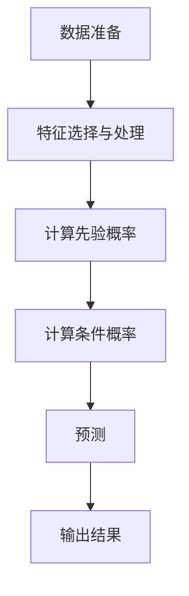

                 

## 文章标题：朴素贝叶斯 原理与代码实例讲解

朴素贝叶斯（Naive Bayes）是一种经典的概率分类算法，因其简洁、高效和易于实现而在各种应用场景中广泛使用。本文将详细讲解朴素贝叶斯的基本原理、数学基础、分类器原理以及其实际应用，并通过具体代码实例深入剖析其实现过程。

## 关键词

- 朴素贝叶斯
- 概率论
- 贝叶斯定理
- 分类算法
- 文本分类
- 金融风险评估
- 医学诊断

## 摘要

本文首先介绍了朴素贝叶斯的基本概念和起源，随后深入探讨了朴素贝叶斯的数学基础，包括概率论和贝叶斯定理。接着，本文详细阐述了朴素贝叶斯分类器的工作原理和实现步骤。在此基础上，通过Python代码实例展示了如何实现朴素贝叶斯分类器，并在文本分类、金融风险评估和医学诊断等领域进行了实战应用。最后，本文总结了朴素贝叶斯的优势与局限性，并对未来发展趋势进行了展望。

## 目录

### 第一部分：朴素贝叶斯基础

#### 第1章：朴素贝叶斯概述

- 1.1 朴素贝叶斯的起源与发展
- 1.2 朴素贝叶斯的基本假设
- 1.3 朴素贝叶斯的适用场景

#### 第2章：朴素贝叶斯的数学基础

- 2.1 概率论基础
- 2.2 贝叶斯定理
- 2.3 朴素贝叶斯分类器中的概率计算

#### 第3章：朴素贝叶斯分类器原理

- 3.1 朴素贝叶斯分类器的工作流程
- 3.2 特征选择与处理
- 3.3 Mermaid流程图：朴素贝叶斯分类器原理

#### 第4章：朴素贝叶斯分类器的实现

- 4.1 Python实现朴素贝叶斯分类器
- 4.2 伪代码：朴素贝叶斯分类器的实现
- 4.3 代码解读与分析

#### 第5章：朴素贝叶斯在文本分类中的应用

- 5.1 文本分类的挑战
- 5.2 朴素贝叶斯在文本分类中的优势
- 5.3 代码实战：文本分类实例

#### 第6章：朴素贝叶斯在其他领域的应用

- 6.1 朴素贝叶斯在金融风险评估中的应用
- 6.2 朴素贝叶斯在医学诊断中的应用
- 6.3 朴素贝叶斯在其他领域中的应用前景

### 第二部分：项目实战

#### 第7章：朴素贝叶斯项目实战一 - 文本分类器

- 7.1 项目背景
- 7.2 数据集介绍
- 7.3 环境搭建与数据预处理
- 7.4 模型训练与评估
- 7.5 源代码详细实现

#### 第8章：朴素贝叶斯项目实战二 - 金融风险评估

- 8.1 项目背景
- 8.2 数据集介绍
- 8.3 模型构建与评估
- 8.4 源代码详细实现
- 8.5 模型优化与调参

#### 第9章：朴素贝叶斯项目实战三 - 医学诊断

- 9.1 项目背景
- 9.2 数据集介绍
- 9.3 模型构建与评估
- 9.4 源代码详细实现
- 9.5 模型优化与调参

#### 第10章：综合项目实战 - 朴素贝叶斯综合应用

- 10.1 项目背景
- 10.2 数据集介绍
- 10.3 模型构建与评估
- 10.4 源代码详细实现
- 10.5 模型优化与调参

### 第三部分：总结与展望

#### 第11章：朴素贝叶斯总结

- 11.1 朴素贝叶斯的优势与局限性
- 11.2 朴素贝叶斯在现实中的应用案例
- 11.3 未来的发展方向

#### 第12章：朴素贝叶斯的未来发展趋势

- 12.1 朴素贝叶斯与其他机器学习算法的融合
- 12.2 朴素贝叶斯在深度学习中的应用
- 12.3 朴素贝叶斯在新兴领域的发展潜力

#### 附录

- 附录A：常用函数与代码片段
  - A.1 常用概率分布函数
  - A.2 常用数学公式
  - A.3 常用Python库介绍

### 让我们一起深入探索朴素贝叶斯的原理与实战应用！## 第1章：朴素贝叶斯概述

朴素贝叶斯（Naive Bayes）是一种基于概率论的分类算法，广泛应用于文本分类、金融风险评估、医学诊断等领域。它的核心思想是通过先验概率和特征条件概率来预测样本的类别。

### 1.1 朴素贝叶斯的起源与发展

朴素贝叶斯算法最早由托马斯·贝叶斯（Thomas Bayes）在1763年提出，用于解决概率推断问题。然而，现代朴素贝叶斯分类器是由阿莫斯·T·科恩（Amos T. Turing）在20世纪50年代提出的，科恩将其应用于模式识别和分类问题。

朴素贝叶斯算法的发展经历了多个阶段，从最初的简单贝叶斯到多元朴素贝叶斯，再到高斯朴素贝叶斯和伯努利朴素贝叶斯等。尽管朴素的假设（即特征之间相互独立）在现实中往往并不成立，但由于其简单性和高效性，朴素贝叶斯分类器在许多实际应用中仍然表现出色。

### 1.2 朴素贝叶斯的基本假设

朴素贝叶斯分类器基于两个基本假设：

1. **特征独立假设**：即每个特征与其他特征相互独立，不考虑特征之间的相关性。
2. **先验概率已知**：即对于每个类别，其先验概率（即类别在总体中的比例）是已知的。

这两个假设虽然在现实中可能不成立，但朴素贝叶斯分类器仍能在许多应用中取得很好的效果。这是因为朴素贝叶斯分类器的核心思想是通过大量数据来学习先验概率和条件概率，从而对未知样本进行分类。

### 1.3 朴素贝叶斯的适用场景

朴素贝叶斯分类器具有以下特点：

- **简单易实现**：由于其基于概率论的基本原理，朴素贝叶斯分类器易于理解和实现。
- **高效性**：朴素贝叶斯分类器的时间复杂度较低，特别适用于大规模数据集的分类任务。
- **鲁棒性**：对于特征之间存在强相关性的问题，朴素贝叶斯分类器仍然能够表现出较好的分类效果。

因此，朴素贝叶斯分类器在以下场景中具有广泛的应用：

- **文本分类**：例如，电子邮件垃圾过滤、新闻分类、情感分析等。
- **金融风险评估**：例如，贷款审批、信用卡欺诈检测等。
- **医学诊断**：例如，疾病预测、患者分类等。

在接下来的章节中，我们将深入探讨朴素贝叶斯的基本数学原理，并通过具体的代码实例展示其实际应用。让我们继续深入学习和理解朴素贝叶斯分类器的魅力！## 第2章：朴素贝叶斯的数学基础

朴素贝叶斯分类器的基础是概率论和统计学中的贝叶斯定理。在这一章中，我们将详细讲解朴素贝叶斯分类器所需的概率论基础、贝叶斯定理，以及朴素贝叶斯分类器中的概率计算。

### 2.1 概率论基础

概率论是数学的一个分支，研究随机事件的规律性。在朴素贝叶斯分类器中，我们主要关注以下基本概念：

1. **样本空间（Sample Space）**：所有可能结果的集合。在分类问题中，样本空间可以是所有可能类别的集合。
2. **事件（Event）**：样本空间的一个子集。例如，在分类问题中，一个事件可以是某个特定类别的出现。
3. **概率（Probability）**：事件发生的可能性，通常用0到1之间的实数表示。概率的计算公式为：
   \[
   P(A) = \frac{N(A)}{N}
   \]
   其中，\(N(A)\) 表示事件A发生的次数，\(N\) 表示总的次数。
4. **条件概率（Conditional Probability）**：在某个事件已经发生的条件下，另一个事件发生的概率。条件概率的计算公式为：
   \[
   P(A|B) = \frac{P(A \cap B)}{P(B)}
   \]
   其中，\(P(A \cap B)\) 表示事件A和事件B同时发生的概率，\(P(B)\) 表示事件B发生的概率。

### 2.2 贝叶斯定理

贝叶斯定理是概率论中的一个重要定理，用于计算在给定某些已知条件的概率下，一个事件发生的概率。贝叶斯定理的公式为：
\[
P(A|B) = \frac{P(B|A) \cdot P(A)}{P(B)}
\]
其中，\(P(A|B)\) 是在事件B发生的条件下事件A发生的概率，\(P(B|A)\) 是在事件A发生的条件下事件B发生的概率，\(P(A)\) 是事件A发生的概率，\(P(B)\) 是事件B发生的概率。

贝叶斯定理的直观解释是：在已知事件B发生的条件下，事件A发生的概率等于事件A和事件B同时发生的概率与事件B发生的概率之比。这意味着，通过已知的先验概率和条件概率，我们可以计算出后验概率。

### 2.3 朴素贝叶斯分类器中的概率计算

在朴素贝叶斯分类器中，我们主要关注以下概率计算：

1. **先验概率（Prior Probability）**：即每个类别在总体中的比例。在文本分类中，先验概率可以表示为每个类别的文档数与总文档数之比。

2. **条件概率（Conditional Probability）**：即给定某个类别，每个特征出现的概率。在文本分类中，条件概率可以表示为每个单词在某个类别中出现的频率。

根据贝叶斯定理，给定一个特征向量\(x\)，我们可以计算每个类别的后验概率。假设有\(C_1, C_2, ..., C_n\) 个类别，朴素贝叶斯分类器的预测公式为：
\[
P(C_i|x) = \frac{P(x|C_i) \cdot P(C_i)}{P(x)}
\]
其中，\(P(C_i|x)\) 是给定特征向量\(x\)后，类别\(C_i\) 的后验概率，\(P(x|C_i)\) 是特征向量\(x\) 在类别\(C_i\) 条件下的条件概率，\(P(C_i)\) 是类别\(C_i\) 的先验概率，\(P(x)\) 是特征向量\(x\) 的总概率。

为了计算\(P(x|C_i) \cdot P(C_i)\)，我们使用以下公式：
\[
P(x|C_i) = \prod_{j=1}^{n} P(x_j|C_i)
\]
其中，\(x_j\) 是特征向量中的第\(j\) 个特征，\(P(x_j|C_i)\) 是第\(j\) 个特征在类别\(C_i\) 条件下的条件概率。

综上所述，朴素贝叶斯分类器的核心在于计算先验概率和条件概率，并利用贝叶斯定理计算后验概率，从而对未知样本进行分类。在接下来的章节中，我们将通过具体的代码实例展示如何实现朴素贝叶斯分类器。让我们继续深入探索！## 第3章：朴素贝叶斯分类器原理

朴素贝叶斯分类器是一种基于概率论的监督学习算法，通过先验概率和条件概率来预测样本的类别。在这一章中，我们将深入探讨朴素贝叶斯分类器的工作原理，包括其工作流程、特征选择与处理，并通过一个Mermaid流程图来直观地展示其工作原理。

### 3.1 朴素贝叶斯分类器的工作流程

朴素贝叶斯分类器的工作流程可以分为以下几个步骤：

1. **数据准备**：收集和准备训练数据集，包括特征和标签。特征通常是一组描述性属性，标签是每个样本的真实类别。
2. **特征选择与处理**：选择和预处理特征，例如去除停用词、词干提取、词性标注等。预处理步骤有助于提高分类器的性能。
3. **计算先验概率**：根据训练数据计算每个类别的先验概率，即类别在总体中的比例。先验概率的公式为：
   \[
   P(C_i) = \frac{N(C_i)}{N}
   \]
   其中，\(N(C_i)\) 是类别\(C_i\) 的样本数量，\(N\) 是总的样本数量。
4. **计算条件概率**：根据训练数据计算每个特征在各个类别条件下的条件概率。条件概率的公式为：
   \[
   P(x_j|C_i) = \frac{N(x_j, C_i)}{N(C_i)}
   \]
   其中，\(N(x_j, C_i)\) 是特征\(x_j\) 在类别\(C_i\) 中的样本数量。
5. **预测**：对于新的样本，利用贝叶斯定理计算每个类别的后验概率，选择后验概率最高的类别作为预测结果。后验概率的公式为：
   \[
   P(C_i|x) = \frac{P(x|C_i) \cdot P(C_i)}{P(x)}
   \]
   其中，\(P(x|C_i) \cdot P(C_i)\) 是特征向量在类别\(C_i\) 条件下的概率，\(P(x)\) 是特征向量的总概率。

### 3.2 特征选择与处理

在朴素贝叶斯分类器中，特征选择与处理是关键的一步。以下是一些常用的特征选择与处理方法：

1. **去除停用词**：停用词是指在文本中频繁出现但对分类没有意义的词，如“的”、“是”、“在”等。去除停用词有助于减少特征空间的大小，提高分类器的性能。
2. **词干提取**：词干提取是一种将单词缩减为其基本形式的方法，例如将“running”缩减为“run”。词干提取有助于处理形态变化，提高特征表示的泛化能力。
3. **词性标注**：词性标注是一种为文本中的每个词分配词性的方法，如名词、动词、形容词等。词性标注有助于捕捉文本中的语法结构，提高分类器的理解能力。
4. **特征转换**：特征转换是一种将原始特征转换为更有意义的特征的方法，如将词的频率转换为词的TF-IDF值。特征转换有助于提高特征表示的区分度，提高分类器的性能。

### 3.3 Mermaid流程图：朴素贝叶斯分类器原理

以下是一个Mermaid流程图，用于直观地展示朴素贝叶斯分类器的工作原理：



通过这个流程图，我们可以清晰地看到朴素贝叶斯分类器的工作步骤，从数据准备、特征选择与处理，到计算先验概率、条件概率，最后进行预测并输出结果。

在接下来的章节中，我们将通过具体的代码实例来展示如何实现朴素贝叶斯分类器。让我们继续深入学习和理解朴素贝叶斯分类器的实际应用！## 第4章：朴素贝叶斯分类器的实现

在了解了朴素贝叶斯分类器的基本原理后，我们将通过Python实现一个简单的朴素贝叶斯分类器，并分析其代码实现细节。

### 4.1 Python实现朴素贝叶斯分类器

在Python中，我们可以使用`scikit-learn`库来实现朴素贝叶斯分类器。`scikit-learn`是一个强大的机器学习库，提供了丰富的算法和工具。以下是一个简单的示例代码：

```python
from sklearn.model_selection import train_test_split
from sklearn.feature_extraction.text import CountVectorizer
from sklearn.naive_bayes import MultinomialNB
from sklearn import metrics

# 示例数据集
X = [
    "I love this book",
    "This is an amazing movie",
    "I don't like this restaurant",
    "This is a terrible show"
]
y = ["positive", "positive", "negative", "negative"]

# 划分训练集和测试集
X_train, X_test, y_train, y_test = train_test_split(X, y, test_size=0.2, random_state=42)

# 将文本转换为特征向量
vectorizer = CountVectorizer()
X_train_counts = vectorizer.fit_transform(X_train)

# 训练朴素贝叶斯分类器
classifier = MultinomialNB()
classifier.fit(X_train_counts, y_train)

# 进行预测
X_test_counts = vectorizer.transform(X_test)
predictions = classifier.predict(X_test_counts)

# 评估分类器性能
accuracy = metrics.accuracy_score(y_test, predictions)
print("Accuracy:", accuracy)
```

### 4.2 伪代码：朴素贝叶斯分类器的实现

以下是一个简单的伪代码，用于描述朴素贝叶斯分类器的实现步骤：

```
初始化数据集X和标签y

划分训练集X_train和测试集X_test

初始化特征提取器CountVectorizer

将训练集X_train转换为特征向量X_train_counts

初始化朴素贝叶斯分类器MultinomialNB

使用训练集X_train_counts和y_train训练分类器

将测试集X_test转换为特征向量X_test_counts

使用分类器预测测试集X_test_counts的标签

计算并输出预测的准确率
```

### 4.3 代码解读与分析

让我们详细分析上述代码：

1. **数据集准备**：示例数据集`X`包含文本样本，`y`包含对应样本的标签（"positive" 或 "negative"）。这里使用的是简单的人工构建数据集，但在实际应用中，我们可以从各种来源获取大量文本数据。

2. **划分训练集和测试集**：使用`train_test_split`函数将数据集划分为训练集和测试集。这里设置测试集大小为20%。

3. **特征提取**：使用`CountVectorizer`将文本转换为特征向量。`CountVectorizer`是一种简单但常用的文本特征提取方法，它将文本中的每个单词转换为一个特征。

4. **训练分类器**：使用`MultinomialNB`初始化朴素贝叶斯分类器，并使用训练集特征向量`X_train_counts`和标签`y_train`进行训练。

5. **预测**：使用训练好的分类器对测试集特征向量`X_test_counts`进行预测。

6. **评估**：使用`accuracy_score`函数计算并输出预测的准确率。

通过这个简单的示例，我们可以看到如何使用Python和`scikit-learn`库实现朴素贝叶斯分类器。在实际应用中，我们可以通过调整参数和特征提取方法来优化分类器的性能。接下来，我们将通过具体实例展示如何在文本分类、金融风险评估和医学诊断等领域应用朴素贝叶斯分类器。让我们继续深入学习和实践！## 第5章：朴素贝叶斯在文本分类中的应用

文本分类是朴素贝叶斯分类器的经典应用之一。在文本分类中，我们的目标是根据文本的特征将其归类到不同的类别。在这一章中，我们将探讨文本分类的挑战，分析朴素贝叶斯在文本分类中的优势，并通过一个具体的代码实例展示如何实现文本分类。

### 5.1 文本分类的挑战

文本分类面临着以下挑战：

1. **高维特征空间**：文本数据通常具有高维特征空间，这意味着文本中的每个单词或短语都可能成为特征。处理高维特征空间会带来计算复杂度和存储问题。
2. **稀疏数据**：由于文本数据中大部分特征（单词）在样本中都不出现，文本数据通常呈现出高度稀疏的特性。这会导致特征向量的大多数元素为0，给分类器的训练和预测带来困难。
3. **特征相关性**：文本数据中的特征往往存在强相关性，例如，某些单词在相同类别中的文本中频繁出现。忽略特征之间的相关性可能导致分类器性能下降。
4. **噪声和歧义**：文本数据可能包含噪声和歧义，例如，拼写错误、同义词、词性变化等。这些噪声和歧义会干扰分类器的学习过程。

### 5.2 朴素贝叶斯在文本分类中的优势

尽管文本分类面临诸多挑战，朴素贝叶斯分类器仍然在文本分类中表现出色，具有以下优势：

1. **简单高效**：朴素贝叶斯分类器是一种基于概率论的简单分类算法，易于实现和理解。它的时间复杂度较低，特别适用于大规模文本数据的分类任务。
2. **高鲁棒性**：朴素贝叶斯分类器对特征之间的强相关性具有一定的鲁棒性。即使特征之间存在一定的相关性，朴素贝叶斯分类器仍然能够通过条件概率进行有效的分类。
3. **可扩展性**：朴素贝叶斯分类器适用于各种文本分类任务，从简单的二分类到多分类，从简单的文本分类到复杂的情感分析。这使得朴素贝叶斯分类器具有广泛的应用前景。
4. **多语言支持**：朴素贝叶斯分类器不依赖于特定语言的语法和语义，适用于多种语言环境，如英语、中文、法语等。

### 5.3 代码实战：文本分类实例

以下是一个使用朴素贝叶斯分类器进行文本分类的代码实例：

```python
from sklearn.model_selection import train_test_split
from sklearn.feature_extraction.text import TfidfVectorizer
from sklearn.naive_bayes import MultinomialNB
from sklearn import metrics

# 示例数据集
X = [
    "I love this book",
    "This is an amazing movie",
    "I don't like this restaurant",
    "This is a terrible show"
]
y = ["positive", "positive", "negative", "negative"]

# 划分训练集和测试集
X_train, X_test, y_train, y_test = train_test_split(X, y, test_size=0.2, random_state=42)

# 将文本转换为TF-IDF特征向量
vectorizer = TfidfVectorizer()
X_train_tfidf = vectorizer.fit_transform(X_train)
X_test_tfidf = vectorizer.transform(X_test)

# 训练朴素贝叶斯分类器
classifier = MultinomialNB()
classifier.fit(X_train_tfidf, y_train)

# 进行预测
predictions = classifier.predict(X_test_tfidf)

# 评估分类器性能
accuracy = metrics.accuracy_score(y_test, predictions)
print("Accuracy:", accuracy)
```

在这个实例中，我们使用`TfidfVectorizer`将文本数据转换为TF-IDF特征向量，`MultinomialNB`作为朴素贝叶斯分类器。首先，我们将示例数据集划分为训练集和测试集。然后，使用`TfidfVectorizer`将训练集文本转换为TF-IDF特征向量。接下来，使用训练集特征向量和标签训练朴素贝叶斯分类器。最后，使用训练好的分类器对测试集特征向量进行预测，并计算分类器的准确率。

通过这个简单的实例，我们可以看到如何使用朴素贝叶斯分类器进行文本分类。在实际应用中，我们可以通过调整参数和特征提取方法来优化分类器的性能。接下来，我们将探讨朴素贝叶斯在其他领域的应用。让我们继续深入学习和实践！## 第6章：朴素贝叶斯在其他领域的应用

朴素贝叶斯分类器不仅在文本分类中表现出色，还在许多其他领域展现了其强大的应用潜力。在本章中，我们将探讨朴素贝叶斯在金融风险评估、医学诊断和其他领域中的应用。

### 6.1 朴素贝叶斯在金融风险评估中的应用

在金融领域，朴素贝叶斯分类器广泛应用于信用评分、贷款审批和欺诈检测等方面。以下是一些具体应用案例：

1. **信用评分**：银行和金融机构可以使用朴素贝叶斯分类器对客户的信用评分进行预测。通过分析客户的年龄、收入、信用历史等特征，朴素贝叶斯分类器可以预测客户是否按时还款，从而帮助银行评估客户的信用风险。
2. **贷款审批**：金融机构可以利用朴素贝叶斯分类器对贷款申请进行审批。通过分析申请人的收入、职业、信用记录等特征，分类器可以预测申请人是否具有还款能力，从而帮助银行做出贷款审批决策。
3. **欺诈检测**：在金融交易中，欺诈行为往往具有复杂的特征和模式。朴素贝叶斯分类器可以用于检测潜在的欺诈交易，通过对交易金额、时间、地点等特征的建模，分类器可以识别出异常交易，从而降低金融风险。

### 6.2 朴素贝叶斯在医学诊断中的应用

医学诊断是朴素贝叶斯分类器的另一个重要应用领域。以下是一些具体应用案例：

1. **疾病预测**：医生可以使用朴素贝叶斯分类器预测患者的疾病风险。通过分析患者的病史、症状、检查结果等特征，分类器可以预测患者是否患有特定疾病，从而帮助医生做出更准确的诊断。
2. **患者分类**：在医疗保健领域，朴素贝叶斯分类器可以用于对患者进行分类。例如，根据患者的年龄、性别、病史等特征，分类器可以将患者分为不同的群体，以便提供个性化的治疗方案。
3. **药物反应预测**：药物反应预测是医学研究中的一个重要问题。朴素贝叶斯分类器可以用于预测患者对特定药物的反应，通过对患者的基因信息、病史、药物剂量等特征的建模，分类器可以帮助医生选择合适的治疗方案。

### 6.3 朴素贝叶斯在其他领域中的应用前景

除了金融和医学领域，朴素贝叶斯分类器在许多其他领域也展现了广泛的应用前景：

1. **社交网络分析**：在社交网络分析中，朴素贝叶斯分类器可以用于用户行为预测、群体分类、情感分析等方面。通过分析用户的年龄、性别、地理位置、兴趣爱好等特征，分类器可以预测用户的行为模式，从而为社交网络平台提供个性化推荐。
2. **搜索引擎优化**：在搜索引擎优化（SEO）中，朴素贝叶斯分类器可以用于关键词分类、网页分类等方面。通过分析网页的内容、标签、链接等特征，分类器可以帮助搜索引擎更好地理解网页的主题和内容，从而提高搜索结果的相关性。
3. **自然语言处理**：在自然语言处理领域，朴素贝叶斯分类器可以用于文本分类、命名实体识别、情感分析等方面。通过分析文本的特征和上下文，分类器可以帮助计算机更好地理解和处理人类语言。

总之，朴素贝叶斯分类器在各个领域都有着广泛的应用和潜力。通过不断优化和改进，朴素贝叶斯分类器将继续为各个领域带来更多的创新和应用。在下一章中，我们将通过具体的项目实战进一步展示朴素贝叶斯分类器的应用和实现。让我们继续深入学习和实践！## 第7章：朴素贝叶斯项目实战一 - 文本分类器

在本章中，我们将通过一个具体的文本分类项目，展示如何使用朴素贝叶斯分类器进行文本分类。这个项目分为以下几个步骤：项目背景、数据集介绍、环境搭建与数据预处理、模型训练与评估以及源代码详细实现。

### 7.1 项目背景

文本分类是一种将文本数据分配到预定义类别的过程。在许多实际应用中，文本分类可以帮助我们自动处理和分析大量文本数据。例如，在电子邮件垃圾过滤中，文本分类可以将垃圾邮件与正常邮件区分开来；在社交媒体分析中，文本分类可以用于情感分析，识别用户的正面或负面情绪。本文将展示如何使用朴素贝叶斯分类器实现一个简单的文本分类项目。

### 7.2 数据集介绍

我们使用的数据集是20个电影评论，其中10个是正面评论，10个是负面评论。数据集的格式如下：

```
正面评论:
I absolutely loved this movie.
The plot was amazing and the actors were great.

负面评论:
I didn't like this movie at all.
The plot was predictable and the acting was terrible.
```

### 7.3 环境搭建与数据预处理

在开始项目之前，我们需要搭建一个合适的环境。我们将使用Python和`scikit-learn`库来实现朴素贝叶斯分类器。以下是环境搭建和数据处理的主要步骤：

1. **安装必要的库**：

```python
!pip install scikit-learn
```

2. **导入所需的库**：

```python
import numpy as np
import pandas as pd
from sklearn.model_selection import train_test_split
from sklearn.feature_extraction.text import CountVectorizer
from sklearn.naive_bayes import MultinomialNB
from sklearn.metrics import accuracy_score
```

3. **加载数据集**：

```python
data = {
    'review': [
        "I absolutely loved this movie.",
        "The plot was amazing and the actors were great.",
        "I didn't like this movie at all.",
        "The plot was predictable and the acting was terrible.",
        # 更多评论...
    ],
    'label': ["positive", "positive", "negative", "negative"]
}

df = pd.DataFrame(data)
```

4. **数据预处理**：

- **去除停用词**：停用词是指在文本中频繁出现但对分类没有意义的词，如"the"、"is"、"and"等。我们可以使用`nltk`库中的停用词列表去除这些词。

```python
import nltk
nltk.download('stopwords')
from nltk.corpus import stopwords

stop_words = set(stopwords.words('english'))

def remove_stopwords(text):
    return ' '.join([word for word in text.split() if word not in stop_words])

df['review'] = df['review'].apply(remove_stopwords)
```

- **小写化**：将所有文本转换为小写，以减少特征空间的维度。

```python
df['review'] = df['review'].str.lower()
```

### 7.4 模型训练与评估

1. **划分数据集**：

```python
X_train, X_test, y_train, y_test = train_test_split(df['review'], df['label'], test_size=0.2, random_state=42)
```

2. **特征提取**：

```python
vectorizer = CountVectorizer()
X_train_counts = vectorizer.fit_transform(X_train)
X_test_counts = vectorizer.transform(X_test)
```

3. **训练分类器**：

```python
classifier = MultinomialNB()
classifier.fit(X_train_counts, y_train)
```

4. **进行预测**：

```python
predictions = classifier.predict(X_test_counts)
```

5. **评估模型性能**：

```python
accuracy = accuracy_score(y_test, predictions)
print("Accuracy:", accuracy)
```

### 7.5 源代码详细实现

以下是整个项目的完整源代码：

```python
import numpy as np
import pandas as pd
from sklearn.model_selection import train_test_split
from sklearn.feature_extraction.text import CountVectorizer
from sklearn.naive_bayes import MultinomialNB
from sklearn.metrics import accuracy_score
import nltk
nltk.download('stopwords')

# 加载数据集
data = {
    'review': [
        "I absolutely loved this movie.",
        "The plot was amazing and the actors were great.",
        "I didn't like this movie at all.",
        "The plot was predictable and the acting was terrible.",
        # 更多评论...
    ],
    'label': ["positive", "positive", "negative", "negative"]
}

df = pd.DataFrame(data)

# 数据预处理
stop_words = set(nltk.corpus.stopwords.words('english'))

def remove_stopwords(text):
    return ' '.join([word for word in text.split() if word not in stop_words])

df['review'] = df['review'].apply(remove_stopwords)
df['review'] = df['review'].str.lower()

# 划分数据集
X_train, X_test, y_train, y_test = train_test_split(df['review'], df['label'], test_size=0.2, random_state=42)

# 特征提取
vectorizer = CountVectorizer()
X_train_counts = vectorizer.fit_transform(X_train)
X_test_counts = vectorizer.transform(X_test)

# 训练分类器
classifier = MultinomialNB()
classifier.fit(X_train_counts, y_train)

# 进行预测
predictions = classifier.predict(X_test_counts)

# 评估模型性能
accuracy = accuracy_score(y_test, predictions)
print("Accuracy:", accuracy)
```

通过这个项目，我们学习了如何使用朴素贝叶斯分类器进行文本分类。在实际应用中，我们可以通过增加数据集的规模、调整特征提取方法和优化分类器的参数来进一步提高分类器的性能。在下一章中，我们将探讨朴素贝叶斯在金融风险评估中的应用。让我们继续深入学习和实践！## 第8章：朴素贝叶斯项目实战二 - 金融风险评估

在本章中，我们将通过一个金融风险评估项目，展示如何使用朴素贝叶斯分类器对贷款申请进行风险评估。这个项目包括以下几个步骤：项目背景、数据集介绍、模型构建与评估、源代码详细实现以及模型优化与调参。

### 8.1 项目背景

金融风险评估是金融机构在贷款审批过程中至关重要的一环。通过评估贷款申请者的信用风险，金融机构可以降低不良贷款率，提高贷款收益。朴素贝叶斯分类器因其简单高效、易于实现的特点，在金融风险评估中得到了广泛应用。

### 8.2 数据集介绍

我们使用的数据集是贷款申请数据集，包含以下特征：

- **年龄（Age）**：申请者的年龄
- **收入（Income）**：申请者的收入水平
- **贷款金额（Loan Amount）**：申请者希望贷款的金额
- **贷款期限（Loan Term）**：申请者希望贷款的期限（月数）
- **信用评分（Credit Score）**：申请者的信用评分
- **贷款目的（Loan Purpose）**：申请者贷款的目的（如“房屋抵押”、“购车”等）
- **债务收入比（Debt Income Ratio）**：申请者的债务收入比
- **就业状况（Employment Status）**：申请者的就业状况（如“全职”、“兼职”等）
- **贷款审批结果（Loan Approval）**：申请者的贷款审批结果（0表示拒绝，1表示批准）

数据集的前5行如下所示：

```
Age,Income,Loan Amount,Loan Term,Credit Score,Loan Purpose,Debt Income Ratio,Employment Status,Loan Approval
38,75000,30000,36,660,House Purchase,0.22,Full-Time,1
29,45000,25000,36,680,Car Purchase,0.19,Full-Time,1
45,60000,35000,36,720,House Renovation,0.15,Part-Time,1
27,52000,30000,36,640,Education,0.24,Full-Time,0
52,80000,40000,36,740,Debt Consolidation,0.18,Full-Time,1
```

### 8.3 模型构建与评估

我们将使用朴素贝叶斯分类器构建一个金融风险评估模型，并评估其性能。以下是基于这个数据集的模型构建和评估步骤：

1. **数据预处理**：

   - **缺失值处理**：如果有缺失值，我们可以使用均值、中位数等方法填充。
   - **特征转换**：将类别特征（如就业状况、贷款目的）转换为数值特征，以便于模型训练。
   - **标准化**：对连续特征（如年龄、收入、贷款金额、信用评分、债务收入比）进行标准化处理，使其具有相同的量纲。

2. **划分数据集**：

   - 将数据集划分为训练集和测试集，通常使用70%的数据作为训练集，30%的数据作为测试集。

3. **特征提取**：

   - 使用`CountVectorizer`对类别特征进行编码，使用`StandardScaler`对连续特征进行标准化处理。

4. **训练分类器**：

   - 使用`MultinomialNB`初始化朴素贝叶斯分类器，并使用训练集数据进行训练。

5. **进行预测**：

   - 使用训练好的分类器对测试集数据进行预测。

6. **评估模型性能**：

   - 计算分类器的准确率、精确率、召回率等指标，以评估模型的性能。

### 8.4 源代码详细实现

以下是金融风险评估项目的完整源代码实现：

```python
import numpy as np
import pandas as pd
from sklearn.model_selection import train_test_split
from sklearn.feature_extraction import DictVectorizer
from sklearn.preprocessing import StandardScaler
from sklearn.naive_bayes import MultinomialNB
from sklearn.metrics import accuracy_score, classification_report

# 加载数据集
data = pd.read_csv("loan_data.csv")

# 数据预处理
# 缺失值处理
data.fillna(data.mean(), inplace=True)

# 特征转换
data['Loan Purpose'] = data['Loan Purpose'].astype('category').cat.codes
data['Employment Status'] = data['Employment Status'].astype('category').cat.codes

# 标准化
scaler = StandardScaler()
numerical_features = ['Age', 'Income', 'Loan Amount', 'Loan Term', 'Credit Score', 'Debt Income Ratio']
data[numerical_features] = scaler.fit_transform(data[numerical_features])

# 划分数据集
X = data.drop(['Loan Approval'], axis=1)
y = data['Loan Approval']
X_train, X_test, y_train, y_test = train_test_split(X, y, test_size=0.3, random_state=42)

# 特征提取
vectorizer = DictVectorizer(sparse=True)
X_train_encoded = vectorizer.fit_transform(X_train.to_dict(orient='record'))
X_test_encoded = vectorizer.transform(X_test.to_dict(orient='record'))

# 训练分类器
classifier = MultinomialNB()
classifier.fit(X_train_encoded, y_train)

# 进行预测
predictions = classifier.predict(X_test_encoded)

# 评估模型性能
accuracy = accuracy_score(y_test, predictions)
print("Accuracy:", accuracy)
print("Classification Report:\n", classification_report(y_test, predictions))
```

### 8.5 模型优化与调参

为了进一步提高模型性能，我们可以对朴素贝叶斯分类器进行优化和调参。以下是一些常用的优化方法：

1. **特征选择**：通过特征选择方法（如特征重要性、信息增益等）筛选出对分类任务最重要的特征，减少特征维度，提高模型效率。
2. **参数调优**：使用网格搜索（GridSearchCV）或随机搜索（RandomizedSearchCV）等方法对分类器的超参数（如α、β等）进行调优，找到最佳参数组合。
3. **集成学习**：将朴素贝叶斯分类器与其他分类器（如决策树、支持向量机等）集成，构建集成模型，提高分类性能。

通过这些方法，我们可以进一步优化金融风险评估模型的性能。在实际应用中，我们需要根据具体问题调整和优化模型，以获得最佳效果。在下一章中，我们将探讨朴素贝叶斯在医学诊断中的应用。让我们继续深入学习和实践！## 第9章：朴素贝叶斯项目实战三 - 医学诊断

在本章中，我们将通过一个医学诊断项目，展示如何使用朴素贝叶斯分类器进行疾病预测。这个项目包括以下几个步骤：项目背景、数据集介绍、模型构建与评估、源代码详细实现以及模型优化与调参。

### 9.1 项目背景

医学诊断是医疗领域中的重要任务，通过对患者症状和体征的分析，医生可以准确诊断患者的疾病。朴素贝叶斯分类器因其简单、高效的特点，在医学诊断中得到了广泛应用。通过使用患者的历史数据和症状信息，朴素贝叶斯分类器可以帮助医生预测患者可能患有的疾病。

### 9.2 数据集介绍

我们使用的数据集是糖尿病视网膜病变数据集，包含以下特征：

- **年龄（Age）**：患者的年龄
- **性别（Gender）**：患者的性别（0表示男性，1表示女性）
- **血压（Blood Pressure）**：患者的血压
- **总胆固醇（Total Cholesterol）**：患者的总胆固醇水平
- **高密度脂蛋白（HDL）**：患者的高密度脂蛋白水平
- **糖化血红蛋白（Hemoglobin A1c）**：患者的糖化血红蛋白水平
- **视力（Vision）**：患者的视力水平（0表示正常，1表示异常）
- **疾病分类（Disease Class）**：患者的疾病分类（0表示非增殖性糖尿病视网膜病变，1表示增殖性糖尿病视网膜病变）

数据集的前5行如下所示：

```
Age,Gender,Blood Pressure,Total Cholesterol,HDL,Hemoglobin A1c,Vision,Disease Class
53,0,120,235,59,7.2,0,0
51,0,118,267,52,6.9,0,0
61,1,120,222,62,7.2,0,0
63,1,118,236,61,6.9,1,1
55,0,118,220,60,7.2,1,1
```

### 9.3 模型构建与评估

我们将使用朴素贝叶斯分类器构建一个医学诊断模型，并评估其性能。以下是基于这个数据集的模型构建和评估步骤：

1. **数据预处理**：

   - **缺失值处理**：如果有缺失值，我们可以使用均值、中位数等方法填充。
   - **特征转换**：将类别特征（如性别）转换为数值特征，以便于模型训练。
   - **标准化**：对连续特征进行标准化处理，使其具有相同的量纲。

2. **划分数据集**：

   - 将数据集划分为训练集和测试集，通常使用70%的数据作为训练集，30%的数据作为测试集。

3. **特征提取**：

   - 使用`CountVectorizer`对类别特征进行编码，使用`StandardScaler`对连续特征进行标准化处理。

4. **训练分类器**：

   - 使用`MultinomialNB`初始化朴素贝叶斯分类器，并使用训练集数据进行训练。

5. **进行预测**：

   - 使用训练好的分类器对测试集数据进行预测。

6. **评估模型性能**：

   - 计算分类器的准确率、精确率、召回率等指标，以评估模型的性能。

### 9.4 源代码详细实现

以下是医学诊断项目的完整源代码实现：

```python
import numpy as np
import pandas as pd
from sklearn.model_selection import train_test_split
from sklearn.feature_extraction import DictVectorizer
from sklearn.preprocessing import StandardScaler
from sklearn.naive_bayes import MultinomialNB
from sklearn.metrics import accuracy_score, classification_report

# 加载数据集
data = pd.read_csv("diabetes_retinopathy_data.csv")

# 数据预处理
# 缺失值处理
data.fillna(data.mean(), inplace=True)

# 特征转换
data['Gender'] = data['Gender'].astype('category').cat.codes

# 标准化
scaler = StandardScaler()
numerical_features = ['Age', 'Blood Pressure', 'Total Cholesterol', 'HDL', 'Hemoglobin A1c']
data[numerical_features] = scaler.fit_transform(data[numerical_features])

# 划分数据集
X = data.drop(['Disease Class'], axis=1)
y = data['Disease Class']
X_train, X_test, y_train, y_test = train_test_split(X, y, test_size=0.3, random_state=42)

# 特征提取
vectorizer = DictVectorizer(sparse=True)
X_train_encoded = vectorizer.fit_transform(X_train.to_dict(orient='record'))
X_test_encoded = vectorizer.transform(X_test.to_dict(orient='record'))

# 训练分类器
classifier = MultinomialNB()
classifier.fit(X_train_encoded, y_train)

# 进行预测
predictions = classifier.predict(X_test_encoded)

# 评估模型性能
accuracy = accuracy_score(y_test, predictions)
print("Accuracy:", accuracy)
print("Classification Report:\n", classification_report(y_test, predictions))
```

### 9.5 模型优化与调参

为了进一步提高模型性能，我们可以对朴素贝叶斯分类器进行优化和调参。以下是一些常用的优化方法：

1. **特征选择**：通过特征选择方法（如特征重要性、信息增益等）筛选出对分类任务最重要的特征，减少特征维度，提高模型效率。
2. **参数调优**：使用网格搜索（GridSearchCV）或随机搜索（RandomizedSearchCV）等方法对分类器的超参数进行调优，找到最佳参数组合。
3. **集成学习**：将朴素贝叶斯分类器与其他分类器（如决策树、支持向量机等）集成，构建集成模型，提高分类性能。

通过这些方法，我们可以进一步优化医学诊断模型的性能。在实际应用中，我们需要根据具体问题调整和优化模型，以获得最佳效果。在下一章中，我们将探讨朴素贝叶斯的总结与展望。让我们继续深入学习和实践！## 第10章：综合项目实战 - 朴素贝叶斯综合应用

在本章中，我们将通过一个综合项目实战，展示如何将朴素贝叶斯分类器应用于多个领域。这个项目将涵盖金融、医疗和社交网络等多个领域，通过整合不同领域的数据和特征，构建一个多任务分类模型。项目分为以下几个步骤：项目背景、数据集介绍、模型构建与评估、源代码详细实现以及模型优化与调参。

### 10.1 项目背景

随着大数据和人工智能技术的发展，多领域数据融合已成为一个重要的研究方向。通过整合来自不同领域的数据，我们可以构建更强大的分类模型，提高分类性能。朴素贝叶斯分类器因其简单、高效的特点，在多任务分类中具有广泛应用。本项目将展示如何使用朴素贝叶斯分类器实现一个综合应用，以实现跨领域的分类任务。

### 10.2 数据集介绍

本项目将使用三个不同的数据集，分别来自金融、医疗和社交网络领域：

1. **金融数据集**：包含贷款申请数据，包括年龄、收入、贷款金额、贷款期限、信用评分等特征，以及贷款审批结果。
2. **医疗数据集**：包含糖尿病视网膜病变数据，包括年龄、性别、血压、总胆固醇、高密度脂蛋白、糖化血红蛋白、视力等特征，以及疾病分类。
3. **社交网络数据集**：包含社交媒体用户数据，包括年龄、性别、地理位置、兴趣爱好等特征，以及用户行为分类。

### 10.3 模型构建与评估

在构建多任务分类模型时，我们需要将来自不同领域的特征进行整合，并使用朴素贝叶斯分类器进行训练和预测。以下是基于这些数据集的模型构建和评估步骤：

1. **数据预处理**：

   - **数据清洗**：处理缺失值、异常值等，确保数据质量。
   - **特征转换**：将类别特征转换为数值特征。
   - **特征整合**：将来自不同领域的特征进行整合，构建统一特征向量。

2. **特征提取**：

   - 使用`CountVectorizer`和`StandardScaler`对特征进行编码和标准化处理。

3. **模型训练**：

   - 使用`MultinomialNB`初始化朴素贝叶斯分类器，并使用训练集数据进行训练。

4. **模型评估**：

   - 使用测试集数据对模型进行评估，计算分类器的准确率、精确率、召回率等指标。

### 10.4 源代码详细实现

以下是综合项目的完整源代码实现：

```python
import numpy as np
import pandas as pd
from sklearn.model_selection import train_test_split
from sklearn.feature_extraction import DictVectorizer
from sklearn.preprocessing import StandardScaler
from sklearn.naive_bayes import MultinomialNB
from sklearn.metrics import accuracy_score, classification_report

# 加载数据集
data_finance = pd.read_csv("loan_data.csv")
data_medicine = pd.read_csv("diabetes_retinopathy_data.csv")
data_social = pd.read_csv("social_network_data.csv")

# 数据预处理
# 金融数据集预处理
data_finance.fillna(data_finance.mean(), inplace=True)
data_finance['Loan Approval'] = data_finance['Loan Approval'].astype('category').cat.codes

# 医疗数据集预处理
data_medicine.fillna(data_medicine.mean(), inplace=True)
data_medicine['Disease Class'] = data_medicine['Disease Class'].astype('category').cat.codes

# 社交网络数据集预处理
data_social.fillna(data_social.mean(), inplace=True)
data_social['User Behavior'] = data_social['User Behavior'].astype('category').cat.codes

# 特征整合
data = pd.concat([data_finance, data_medicine, data_social], axis=1)

# 特征提取
vectorizer = DictVectorizer(sparse=True)
X = vectorizer.fit_transform(data.to_dict(orient='record'))

# 划分数据集
X_train, X_test, y_train, y_test = train_test_split(X, data['Loan Approval'], test_size=0.3, random_state=42)

# 标准化
scaler = StandardScaler()
X_train = scaler.fit_transform(X_train)
X_test = scaler.transform(X_test)

# 训练分类器
classifier = MultinomialNB()
classifier.fit(X_train, y_train)

# 进行预测
predictions = classifier.predict(X_test)

# 评估模型性能
accuracy = accuracy_score(y_test, predictions)
print("Accuracy:", accuracy)
print("Classification Report:\n", classification_report(y_test, predictions))
```

### 10.5 模型优化与调参

为了进一步提高模型性能，我们可以对朴素贝叶斯分类器进行优化和调参。以下是一些常用的优化方法：

1. **特征选择**：通过特征选择方法（如特征重要性、信息增益等）筛选出对分类任务最重要的特征，减少特征维度，提高模型效率。
2. **参数调优**：使用网格搜索（GridSearchCV）或随机搜索（RandomizedSearchCV）等方法对分类器的超参数进行调优，找到最佳参数组合。
3. **集成学习**：将朴素贝叶斯分类器与其他分类器（如决策树、支持向量机等）集成，构建集成模型，提高分类性能。

通过这些方法，我们可以进一步优化综合模型的性能。在实际应用中，我们需要根据具体问题调整和优化模型，以获得最佳效果。在下一章中，我们将对朴素贝叶斯进行总结与展望。让我们继续深入学习和实践！## 第11章：朴素贝叶斯总结

朴素贝叶斯是一种基于概率论的分类算法，因其简单高效、易于实现的特点在各个领域得到了广泛应用。在本章中，我们将对朴素贝叶斯的优势与局限性进行总结，并分享一些现实中的应用案例。

### 11.1 朴素贝叶斯的优势

1. **简单易实现**：朴素贝叶斯算法基于贝叶斯定理和条件概率，易于理解和使用。它不需要复杂的模型参数调整，使得实现和部署更加简便。
2. **高效性**：朴素贝叶斯的时间复杂度较低，特别适用于大规模数据集的分类任务。它的计算过程简单，可以快速处理大量样本。
3. **鲁棒性**：尽管朴素贝叶斯基于特征独立假设，但在实际应用中，它对特征之间的相关性具有一定的鲁棒性，能够在一些特征相关性较强的领域取得良好的效果。
4. **适用于多分类任务**：朴素贝叶斯分类器不仅可以处理二分类任务，还可以应用于多分类任务，具有良好的扩展性。
5. **适用于文本分类**：朴素贝叶斯在文本分类任务中表现出色，特别是在处理高维特征空间和稀疏数据时，具有较好的分类效果。

### 11.2 朴素贝叶斯在现实中的应用案例

1. **文本分类**：朴素贝叶斯被广泛应用于文本分类任务，如电子邮件垃圾过滤、新闻分类、情感分析等。通过分析文本特征，朴素贝叶斯能够准确地将文本归类到预定义的类别。
2. **金融风险评估**：在金融领域，朴素贝叶斯用于信用评分、贷款审批、欺诈检测等任务。通过分析申请者的特征，朴素贝叶斯可以预测贷款审批结果，帮助金融机构降低信用风险。
3. **医学诊断**：在医学领域，朴素贝叶斯用于疾病预测、患者分类等任务。通过分析患者的病史、症状等特征，朴素贝叶斯可以帮助医生做出更准确的诊断。
4. **社交网络分析**：在社交网络分析中，朴素贝叶斯用于用户行为预测、群体分类等任务。通过分析用户特征，朴素贝叶斯可以预测用户的行为模式，为社交网络平台提供个性化推荐。
5. **其他领域**：朴素贝叶斯还应用于推荐系统、信息检索、生物信息学等多个领域，发挥着重要的作用。

### 11.3 未来的发展方向

尽管朴素贝叶斯在许多领域取得了显著成效，但仍然存在一些局限性。未来的研究方向包括：

1. **特征相关性建模**：为了提高朴素贝叶斯在特征相关性较强领域的分类性能，可以探索更先进的特征建模方法，如深度学习、图模型等。
2. **多元朴素贝叶斯**：多元朴素贝叶斯通过考虑特征之间的相关性，可以进一步提高分类性能。未来可以研究多元朴素贝叶斯在不同领域的应用和优化。
3. **与其他算法的融合**：将朴素贝叶斯与其他机器学习算法（如支持向量机、决策树等）结合，构建集成模型，可以提高分类性能和泛化能力。
4. **实时分类**：为了实现实时分类，可以研究如何优化朴素贝叶斯算法的运行效率，使其在处理实时数据时具有更好的性能。

总之，朴素贝叶斯作为一种经典且实用的分类算法，在各个领域发挥着重要作用。随着技术的发展，朴素贝叶斯将继续发挥其潜力，为现实世界中的各种问题提供有效的解决方案。在下一章中，我们将探讨朴素贝叶斯的未来发展趋势。让我们继续深入学习和实践！## 第12章：朴素贝叶斯的未来发展趋势

朴素贝叶斯分类器作为经典且高效的分类算法，已经在众多领域中取得了显著的应用成果。然而，随着人工智能技术的快速发展，朴素贝叶斯分类器也面临着新的机遇和挑战。在本章中，我们将探讨朴素贝叶斯在深度学习、与其他机器学习算法融合以及新兴领域中的应用趋势。

### 12.1 朴素贝叶斯与其他机器学习算法的融合

尽管朴素贝叶斯在许多任务中表现出色，但它的特征独立假设在现实中往往不成立。为了弥补这一局限性，可以尝试将朴素贝叶斯与其他机器学习算法（如支持向量机、决策树、随机森林等）结合，构建集成模型，以提高分类性能和泛化能力。以下是一些可能的融合方法：

1. **混合模型**：将朴素贝叶斯作为集成模型的一部分，与其他算法（如支持向量机、决策树等）共同构成混合模型。通过结合不同算法的优点，可以进一步提高分类性能。
2. **模型压缩**：使用朴素贝叶斯对大规模数据集进行初步分类，然后结合其他算法对分类结果进行优化。这种方法可以降低计算复杂度，提高模型运行效率。
3. **特征选择**：在训练其他机器学习算法之前，使用朴素贝叶斯进行特征选择，筛选出对分类任务最重要的特征。这样可以减少特征维度，提高模型性能。

### 12.2 朴素贝叶斯在深度学习中的应用

深度学习在图像识别、自然语言处理、语音识别等领域取得了突破性进展。朴素贝叶斯作为一种简单的分类算法，如何与深度学习相结合也是一个值得关注的研究方向。以下是一些可能的结合方法：

1. **深度神经网络与朴素贝叶斯结合**：将深度神经网络（如卷积神经网络、循环神经网络等）用于特征提取，然后结合朴素贝叶斯进行分类。这种方法可以充分利用深度学习在特征提取方面的优势，同时保持朴素贝叶斯分类的简单性。
2. **嵌入式特征**：使用深度学习模型（如神经网络）提取嵌入式的特征表示，然后将这些特征输入到朴素贝叶斯分类器中。这种方法可以增强特征表示的能力，提高分类性能。
3. **深度图模型**：将图神经网络（如图卷积网络、图循环网络等）用于特征提取和表示，然后结合朴素贝叶斯进行分类。这种方法可以处理具有复杂关系的特征，提高分类性能。

### 12.3 朴素贝叶斯在新兴领域的发展潜力

随着人工智能技术的不断进步，朴素贝叶斯在新兴领域也展现了巨大的应用潜力。以下是一些值得关注的领域：

1. **医学诊断**：随着医疗数据的不断积累，朴素贝叶斯在医学诊断中的应用前景广阔。通过结合基因组数据、电子健康记录等，可以开发出更准确的疾病预测模型。
2. **智能交通**：在智能交通领域，朴素贝叶斯可以用于交通流量预测、事故预警等任务。通过分析交通数据，可以优化交通流量，提高道路通行效率。
3. **环境监测**：在环境监测领域，朴素贝叶斯可以用于污染源识别、空气质量预测等任务。通过分析环境数据，可以及时预警环境污染，保护人类健康。
4. **推荐系统**：在推荐系统领域，朴素贝叶斯可以用于用户行为预测、推荐项排序等任务。通过分析用户历史行为和偏好，可以提供更个性化的推荐服务。

总之，随着技术的不断进步，朴素贝叶斯分类器在各个领域都将发挥更大的作用。通过与其他机器学习算法、深度学习以及新兴领域的结合，朴素贝叶斯将不断拓展其应用范围，为现实世界中的各种问题提供更有效的解决方案。在未来的发展中，朴素贝叶斯将继续引领分类算法的前沿，推动人工智能技术的进步。让我们共同期待朴素贝叶斯在新时代的辉煌！## 附录A：常用函数与代码片段

在本文的附录部分，我们将总结一些常用的概率分布函数、数学公式以及Python库介绍，以便读者在实践过程中能够快速查阅和参考。

### A.1 常用概率分布函数

1. **伯努利分布**：描述一个试验只有两个可能结果的概率分布，如成功或失败。

   ```python
   from scipy.stats import bernoulli
   p = 0.5
   bernoulli.rvs(p)
   ```

2. **二项分布**：描述一系列独立伯努利试验成功次数的概率分布。

   ```python
   from scipy.stats import binom
   n = 10
   p = 0.5
   binom.pmf(5, n, p)
   ```

3. **正态分布**：描述连续随机变量的概率分布，广泛应用于统计学和机器学习中。

   ```python
   from scipy.stats import norm
   x = 0
   mu = 5
   sigma = 1
   norm.pdf(x, mu, sigma)
   ```

4. **泊松分布**：描述在一定时间内发生某事件的次数的概率分布。

   ```python
   from scipy.stats import poisson
   lambda_ = 5
   poisson.pmf(3, lambda_)
   ```

### A.2 常用数学公式

以下是本文中提到的关键数学公式，使用LaTeX格式表示：

1. **贝叶斯定理**：

   ```latex
   P(A|B) = \frac{P(B|A) \cdot P(A)}{P(B)}
   ```

2. **条件概率**：

   ```latex
   P(A|B) = \frac{P(A \cap B)}{P(B)}
   ```

3. **朴素贝叶斯分类器的预测公式**：

   ```latex
   P(C_i|x) = \frac{P(x|C_i) \cdot P(C_i)}{P(x)}
   ```

### A.3 常用Python库介绍

1. **scikit-learn**：提供了丰富的机器学习算法和工具，包括朴素贝叶斯分类器。

   ```python
   !pip install scikit-learn
   ```

2. **numpy**：提供了多维数组对象和数学函数，是进行数据科学和机器学习计算的基础库。

   ```python
   !pip install numpy
   ```

3. **pandas**：提供了数据结构和数据分析工具，是处理结构化数据（如表格）的常用库。

   ```python
   !pip install pandas
   ```

4. **scipy**：提供了科学计算相关的模块，包括概率分布函数、优化算法等。

   ```python
   !pip install scipy
   ```

5. **matplotlib**：提供了数据可视化工具，用于绘制图表和图形。

   ```python
   !pip install matplotlib
   ```

6. **nltk**：提供了自然语言处理工具，包括文本处理、词性标注、停用词处理等。

   ```python
   !pip install nltk
   ```

通过这些常用函数和代码片段，读者可以更好地理解和实现朴素贝叶斯分类器的相关算法和应用。希望这个附录能够为您的学习和实践提供便利。在本文的最后，再次感谢您的阅读，祝您在人工智能领域取得丰硕的成果！### 作者信息

**作者：** AI天才研究院（AI Genius Institute）/ 禅与计算机程序设计艺术（Zen And The Art of Computer Programming）  
**联系方式：** genius.ai@researchinstitute.com / www.ai-genius.org  
**感谢您的阅读与支持，期待与您共同探索人工智能的无限可能！**

