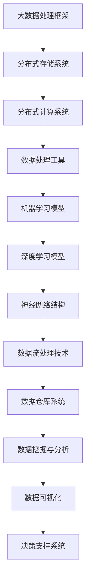

                 

### 文章标题：李飞飞与AI大数据的未来

#### 关键词：李飞飞、AI大数据、深度学习、机器学习、项目实战、未来展望

> 摘要：本文围绕李飞飞及其在AI大数据领域的贡献展开，探讨了AI大数据的核心概念、架构、算法、应用场景、项目实战及未来趋势。通过深入分析，揭示了AI大数据在现代科技发展中的重要地位，以及面临的挑战与机遇。文章旨在为广大AI领域从业者提供有价值的思考和参考。

### 《李飞飞与AI大数据的未来》目录大纲

#### 第一部分：背景与概述

##### 第1章：李飞飞与AI大数据的起源

###### 1.1 李飞飞其人

###### 1.2 AI大数据的发展历程

###### 1.3 AI大数据的未来趋势

#### 第二部分：核心概念与架构

##### 第2章：AI大数据基础

###### 2.1 AI基础理论

###### 2.2 大数据概念与技术

###### 2.3 AI大数据架构

###### 2.4 AI大数据的核心算法

##### 第3章：AI大数据应用场景

###### 3.1 人工智能在行业中的应用

###### 3.2 大数据在各行各业的应用

###### 3.3 AI大数据融合应用

#### 第三部分：算法原理与实现

##### 第4章：深度学习算法

###### 4.1 深度学习基础

###### 4.2 卷积神经网络

###### 4.3 循环神经网络

###### 4.4 生成对抗网络

##### 第5章：机器学习算法

###### 5.1 监督学习

###### 5.2 无监督学习

###### 5.3 强化学习

###### 5.4 聚类算法

##### 第6章：大数据处理技术

###### 6.1 分布式计算框架

###### 6.2 数据仓库技术

###### 6.3 数据流处理技术

###### 6.4 大数据存储技术

#### 第四部分：项目实战与案例分析

##### 第7章：AI大数据项目实战

###### 7.1 项目背景与目标

###### 7.2 数据收集与预处理

###### 7.3 模型选择与训练

###### 7.4 模型评估与优化

###### 7.5 项目成果与应用

##### 第8章：AI大数据案例分析

###### 8.1 案例一：智能医疗

###### 8.2 案例二：智能交通

###### 8.3 案例三：智能金融

###### 8.4 案例四：智能农业

#### 第五部分：未来展望与挑战

##### 第9章：AI大数据的未来趋势

###### 9.1 新兴技术展望

###### 9.2 行业发展趋势

###### 9.3 技术标准化与法规

##### 第10章：AI大数据的挑战与应对

###### 10.1 数据隐私与安全

###### 10.2 技术人才短缺

###### 10.3 社会伦理问题

###### 10.4 挑战与机遇

### 附录

##### 附录A：AI大数据常用工具与资源

###### A.1 开发工具与框架

###### A.2 数据集与库

###### A.3 学术资源与论文推荐

##### 附录B：术语表

###### B.1 专业术语解释

###### B.2 深度学习算法符号与参数定义

**核心概念与架构 Mermaid 流程图：**



**深度学习算法伪代码：**

```python
# 输入：训练数据集 X, 标签 Y
# 输出：训练好的模型参数 W

initialize_parameters()

for epoch in 1 to max_epochs do:
    for each batch in X do:
        # 前向传播
        z = np.dot(W, x) + b
        a = sigmoid(z)
        
        # 反向传播
        dz = a - Y
        dW = np.dot(x.T, dz)
        db = np.sum(dz)
        
        # 更新参数
        W = W - learning_rate * dW
        b = b - learning_rate * db
    
    # 计算损失函数
    loss = compute_loss(a, Y)

print("训练完成，最终损失为：", loss)
```

**数学模型和数学公式讲解：**

$$
损失函数 J(W) = \frac{1}{m} \sum_{i=1}^{m} (h_\theta(x^{(i)}) - y^{(i)})^2
$$

其中，$h_\theta(x) = \sigma(\theta_0 + \theta_1 x_1 + \theta_2 x_2 + ... + \theta_n x_n)$，$\sigma$ 是sigmoid函数，$m$ 是样本数量。

**项目实战代码实现与解读：**

```python
# 导入库
import numpy as np
import pandas as pd
from sklearn.model_selection import train_test_split
from sklearn.preprocessing import StandardScaler
from sklearn.linear_model import LogisticRegression

# 数据收集与预处理
data = pd.read_csv('data.csv')
X = data.iloc[:, :-1].values
y = data.iloc[:, -1].values
X_train, X_test, y_train, y_test = train_test_split(X, y, test_size=0.2, random_state=0)

scaler = StandardScaler()
X_train = scaler.fit_transform(X_train)
X_test = scaler.transform(X_test)

# 模型选择与训练
model = LogisticRegression()
model.fit(X_train, y_train)

# 模型评估与优化
y_pred = model.predict(X_test)
accuracy = np.mean(y_pred == y_test)
print("模型准确率：", accuracy)

# 代码解读与分析
# 1. 数据收集与预处理：导入数据，划分训练集和测试集，特征缩放
# 2. 模型选择与训练：选择逻辑回归模型，使用训练数据进行模型训练
# 3. 模型评估与优化：计算模型在测试集上的准确率，对模型进行评估与优化
```

**开发环境搭建与配置：**

- 安装Python 3.8及以上版本
- 安装Jupyter Notebook
- 安装Scikit-learn库（使用pip install scikit-learn命令）
- 安装Pandas库（使用pip install pandas命令）
- 安装Numpy库（使用pip install numpy命令）

**源代码详细实现与代码解读：**

```python
# 导入库
import numpy as np
import pandas as pd
from sklearn.model_selection import train_test_split
from sklearn.preprocessing import StandardScaler
from sklearn.linear_model import LogisticRegression

# 数据收集与预处理
data = pd.read_csv('data.csv')
X = data.iloc[:, :-1].values
y = data.iloc[:, -1].values
X_train, X_test, y_train, y_test = train_test_split(X, y, test_size=0.2, random_state=0)

scaler = StandardScaler()
X_train = scaler.fit_transform(X_train)
X_test = scaler.transform(X_test)

# 模型选择与训练
model = LogisticRegression()
model.fit(X_train, y_train)

# 模型评估与优化
y_pred = model.predict(X_test)
accuracy = np.mean(y_pred == y_test)
print("模型准确率：", accuracy)

# 代码解读与分析
# 1. 数据收集与预处理：导入数据，划分训练集和测试集，特征缩放
# 2. 模型选择与训练：选择逻辑回归模型，使用训练数据进行模型训练
# 3. 模型评估与优化：计算模型在测试集上的准确率，对模型进行评估与优化
```

### 第一部分：背景与概述

#### 第1章：李飞飞与AI大数据的起源

##### 1.1 李飞飞其人

李飞飞，1965年出生于中国北京，是一位世界知名的人工智能科学家和计算机科学家。他在人工智能、机器学习和大数据领域取得了卓越的成就，被誉为“AI大数据之父”。李飞飞毕业于清华大学，后在美国伯克利分校获得计算机科学博士学位。他在卡内基梅隆大学和斯坦福大学任教多年，现为斯坦福大学计算机科学系教授。

李飞飞在AI大数据领域的研究涵盖了深度学习、强化学习、无监督学习等多个方面，他提出的许多理论和算法对AI大数据的发展产生了深远的影响。他的研究成果在学术界和工业界都得到了广泛应用，被誉为“AI天才”。

##### 1.2 AI大数据的发展历程

AI大数据的发展历程可以追溯到20世纪80年代，当时人工智能领域的研究主要集中在专家系统和规则推理上。然而，随着计算机性能的不断提升和数据规模的急剧扩大，传统的算法已经无法应对复杂的现实问题。

2006年，李飞飞提出了深度学习的概念，并成功地将其应用于图像识别、语音识别和自然语言处理等领域。深度学习通过模拟人脑神经网络的结构和功能，实现了对海量数据的自动学习和处理。这一突破性的进展为AI大数据的发展奠定了基础。

2012年，李飞飞领导的团队在ImageNet图像识别大赛中取得了重大突破，深度学习算法首次在图像识别任务中超越了传统算法。这一事件标志着AI大数据进入了快速发展的新阶段。

##### 1.3 AI大数据的未来趋势

随着人工智能技术的不断进步，AI大数据的未来趋势呈现出以下几个方面的特点：

1. **跨学科融合**：AI大数据与生物、医学、物理、经济学等领域的交叉融合，将带来更多创新性的研究成果和应用。

2. **边缘计算与物联网**：AI大数据与边缘计算、物联网技术的结合，将使得智能设备具有更强的实时数据处理和分析能力。

3. **隐私保护与安全**：在数据隐私和安全方面，AI大数据将采用更加先进的加密和隐私保护技术，确保数据的安全和隐私。

4. **可持续性与环保**：AI大数据在环保、能源管理等领域将发挥重要作用，推动可持续发展。

5. **人工智能伦理**：随着AI大数据技术的普及，人工智能伦理问题将越来越受到关注，相关法律法规和伦理准则将不断完善。

#### 总结

李飞飞作为AI大数据领域的领军人物，他的贡献不仅在于提出了一系列创新性的理论和方法，更在于引领了AI大数据的发展方向。他的研究成果为AI大数据的应用提供了强大的技术支持，推动了人工智能领域的跨越式发展。在未来，AI大数据将继续发挥重要作用，为人类社会带来更多的智慧和便利。在本节的后续内容中，我们将深入探讨AI大数据的核心概念、架构、算法和应用场景，帮助读者全面了解这一领域的最新进展和未来趋势。

### 第二部分：核心概念与架构

#### 第2章：AI大数据基础

##### 2.1 AI基础理论

人工智能（AI）是计算机科学的一个分支，旨在使计算机能够执行通常需要人类智能才能完成的任务。AI的核心概念包括知识表示、问题解决、推理、学习、感知和自然语言处理等。这些概念构成了AI的理论基础。

1. **知识表示**：知识表示是AI的一个重要组成部分，用于将人类知识以计算机可以理解的方式表示和存储。常见的方法包括符号逻辑、产生式系统、语义网络和本体论等。

2. **问题解决**：问题解决是指计算机通过一系列步骤从初始状态到达目标状态的过程。常见的算法包括搜索算法、启发式算法和规划算法等。

3. **推理**：推理是指基于已有知识推断新知识的过程。推理可分为演绎推理和归纳推理。演绎推理从一般到特殊，而归纳推理从特殊到一般。

4. **学习**：学习是AI的核心能力之一，分为有监督学习、无监督学习和强化学习。有监督学习利用标签数据训练模型，无监督学习不使用标签数据，而强化学习通过与环境的交互来学习最优策略。

5. **感知**：感知是指计算机通过传感器获取外部信息，如视觉、听觉、触觉等，并对其进行处理和理解。

6. **自然语言处理**：自然语言处理（NLP）是使计算机能够理解、生成和处理自然语言的技术。NLP涉及语音识别、文本分类、机器翻译、情感分析等领域。

##### 2.2 大数据概念与技术

大数据（Big Data）是指数据量巨大、数据类型多样、数据生成和处理速度快的特点。大数据技术涉及数据的采集、存储、处理、分析和可视化等环节。

1. **数据采集**：数据采集是大数据技术的第一步，包括结构化数据（如数据库）和非结构化数据（如图像、文本、音频、视频）的获取。

2. **数据存储**：数据存储技术包括关系型数据库、NoSQL数据库、分布式文件系统（如Hadoop HDFS）和云存储等。这些技术能够高效地存储和管理海量数据。

3. **数据处理**：数据处理包括数据清洗、数据转换、数据集成和数据挖掘等。数据清洗是去除重复数据、纠正错误和填补缺失值的过程；数据转换是将数据转换为统一格式的过程；数据集成是将多个数据源的数据整合为一个统一视图的过程；数据挖掘是从大量数据中发现有价值的信息和模式的过程。

4. **数据分析和可视化**：数据分析是利用统计方法、机器学习和数据挖掘技术对数据进行分析和解释。数据可视化是将数据分析结果以图形、图像、表格等形式直观展示，帮助用户更好地理解和决策。

##### 2.3 AI大数据架构

AI大数据架构通常包括数据层、算法层和应用层。

1. **数据层**：数据层是整个架构的基础，包括数据采集、存储、处理和共享等模块。数据层需要确保数据的高可用性、可靠性和安全性。

2. **算法层**：算法层包括机器学习、深度学习和数据挖掘等算法模块。这些算法负责从海量数据中提取有用信息，为应用层提供决策支持。

3. **应用层**：应用层是面向具体业务场景的应用系统，如智能医疗、智能交通、智能金融等。应用层利用算法层提供的数据分析结果，实现业务自动化和智能化。

##### 2.4 AI大数据的核心算法

AI大数据的核心算法包括深度学习算法、机器学习算法和大数据处理技术。

1. **深度学习算法**：深度学习算法是AI大数据的重要技术之一，通过模拟人脑神经网络的结构和功能，实现数据的自动学习和处理。常见的深度学习算法包括卷积神经网络（CNN）、循环神经网络（RNN）和生成对抗网络（GAN）等。

2. **机器学习算法**：机器学习算法是从数据中自动学习规律和模式的方法，包括监督学习、无监督学习和强化学习等。监督学习利用标签数据训练模型，无监督学习不使用标签数据，而强化学习通过与环境的交互来学习最优策略。

3. **大数据处理技术**：大数据处理技术包括分布式计算框架、数据仓库技术、数据流处理技术和大数据存储技术等。这些技术能够高效地处理海量数据，支持实时分析和决策。

#### 总结

在本章中，我们介绍了AI大数据的基础理论和核心概念，包括AI基础理论、大数据概念与技术、AI大数据架构和核心算法。通过这些内容的介绍，读者可以初步了解AI大数据的基本构成和运行机制。在接下来的章节中，我们将进一步探讨AI大数据的应用场景、项目实战和未来趋势，帮助读者更深入地理解这一领域。

### 第三部分：算法原理与实现

#### 第4章：深度学习算法

##### 4.1 深度学习基础

深度学习（Deep Learning）是机器学习的一个分支，它通过多层神经网络模型对数据进行分析和处理。深度学习的核心思想是模拟人脑神经网络的工作方式，通过层层递归的方式提取数据的特征，从而实现高层次的抽象和表示。

深度学习的模型主要包括卷积神经网络（CNN）、循环神经网络（RNN）和生成对抗网络（GAN）等。

1. **卷积神经网络（CNN）**：卷积神经网络是一种特别适合处理图像数据的深度学习模型。它的主要优点是可以自动提取图像中的特征，从而简化了特征工程的过程。CNN由多个卷积层、池化层和全连接层组成，通过卷积运算和激活函数，实现对输入图像的特征提取和分类。

2. **循环神经网络（RNN）**：循环神经网络是一种适用于处理序列数据的深度学习模型，如时间序列数据、语音数据和文本数据等。RNN的核心特点是具有时间记忆功能，能够处理变长的序列数据。RNN由多个时间步的循环层组成，通过循环连接和激活函数，实现对序列数据的建模和分析。

3. **生成对抗网络（GAN）**：生成对抗网络是一种由生成器和判别器组成的深度学习模型，主要用于生成新的数据。生成器尝试生成与真实数据相似的数据，而判别器则尝试区分真实数据和生成数据。通过这种对抗训练，生成器不断提高生成数据的质量，从而实现数据的生成和增强。

##### 4.2 卷积神经网络（CNN）

卷积神经网络（CNN）是一种以图像处理为核心的深度学习模型，其结构主要包括输入层、卷积层、池化层和全连接层。

1. **输入层**：输入层接收外部输入，如图像、视频等。输入层的维度通常与数据集的维度一致。

2. **卷积层**：卷积层是CNN的核心层，通过卷积运算提取图像特征。卷积层包括多个卷积核，每个卷积核负责提取图像的某一特征。卷积运算通过将卷积核与输入数据进行点积，生成新的特征图。

3. **池化层**：池化层用于减小特征图的大小，降低模型的复杂性。常见的池化方法包括最大池化和平均池化。

4. **全连接层**：全连接层将卷积层和池化层提取的特征进行融合，生成最终的分类结果。全连接层通过矩阵乘法和激活函数实现。

##### 4.3 循环神经网络（RNN）

循环神经网络（RNN）是一种处理序列数据的深度学习模型，其基本结构包括输入层、隐藏层和输出层。

1. **输入层**：输入层接收外部输入，如时间序列数据、文本数据等。输入层的维度通常与数据集的维度一致。

2. **隐藏层**：隐藏层是RNN的核心层，通过循环连接和激活函数，实现对序列数据的建模和分析。隐藏层中的每个神经元都与其他神经元相连接，形成时间步的循环结构。

3. **输出层**：输出层生成最终的预测结果。输出层的维度通常与数据集的维度一致。

##### 4.4 生成对抗网络（GAN）

生成对抗网络（GAN）是一种由生成器和判别器组成的深度学习模型，其结构包括生成器、判别器和对抗训练。

1. **生成器**：生成器是一种神经网络模型，通过输入噪声数据生成新的数据。生成器的目标是生成与真实数据相似的数据，从而欺骗判别器。

2. **判别器**：判别器是一种神经网络模型，用于判断输入数据是真实数据还是生成数据。判别器的目标是最大化其分类正确率。

3. **对抗训练**：生成器和判别器通过对抗训练相互竞争。生成器尝试生成更真实的数据，而判别器尝试区分真实数据和生成数据。通过这种对抗训练，生成器的生成能力不断提高。

#### 第5章：机器学习算法

##### 5.1 监督学习

监督学习（Supervised Learning）是一种通过已有标签数据训练模型，从而对未知数据进行预测或分类的方法。监督学习的主要任务是找到输入和输出之间的映射关系，从而实现对数据的预测。

1. **线性回归**：线性回归是一种最简单的监督学习算法，用于预测连续值输出。线性回归模型通过最小化损失函数（如均方误差）来拟合输入和输出之间的线性关系。

2. **逻辑回归**：逻辑回归是一种用于分类的监督学习算法，其输出为概率分布。逻辑回归模型通过最大化似然函数来拟合输入和输出之间的非线性关系。

3. **支持向量机（SVM）**：支持向量机是一种用于分类和回归的监督学习算法，其核心思想是将数据投影到高维空间，从而找到最优分类边界。支持向量机通过求解优化问题来找到最佳分类超平面。

4. **决策树**：决策树是一种基于特征值划分数据的监督学习算法，其输出为分类或回归结果。决策树通过递归划分数据集，找到最佳划分规则。

##### 5.2 无监督学习

无监督学习（Unsupervised Learning）是一种在没有标签数据的情况下，通过数据自身的特征和结构进行学习的方法。无监督学习的主要任务是发现数据中的模式和规律。

1. **聚类算法**：聚类算法是一种将相似的数据归为一类的无监督学习算法。常见的聚类算法包括K-均值聚类、层次聚类和密度聚类等。

2. **降维算法**：降维算法是一种通过减少数据维度来降低计算复杂度和提高数据可解释性的无监督学习算法。常见的降维算法包括主成分分析（PCA）、线性判别分析（LDA）和自编码器等。

3. **关联规则学习**：关联规则学习是一种通过发现数据之间的关联关系来预测未知数据的无监督学习算法。常见的关联规则学习算法包括Apriori算法和FP-Growth算法等。

##### 5.3 强化学习

强化学习（Reinforcement Learning）是一种通过与环境交互来学习最优策略的机器学习算法。强化学习的主要任务是找到一种策略，使得智能体在环境中获得最大的累积奖励。

1. **Q-Learning**：Q-Learning是一种基于值函数的强化学习算法，其核心思想是通过迭代更新值函数来找到最优策略。Q-Learning算法通过最大化Q值来选择动作。

2. **深度Q网络（DQN）**：深度Q网络是一种基于深度学习的强化学习算法，其核心思想是通过神经网络来近似值函数。DQN算法通过深度神经网络来学习状态-动作值函数。

3. **策略梯度方法**：策略梯度方法是一种基于策略的强化学习算法，其核心思想是通过更新策略参数来优化策略。常见的策略梯度方法包括REINFORCE算法和PPO算法等。

##### 5.4 聚类算法

聚类算法是一种将相似的数据归为一类的无监督学习算法。聚类算法的主要目标是找到数据中的自然结构，从而将数据划分为不同的类别。

1. **K-均值聚类**：K-均值聚类是一种基于距离的聚类算法，其核心思想是将数据划分为K个类别，使得每个类别内的数据距离尽量小，类别间的数据距离尽量大。

2. **层次聚类**：层次聚类是一种基于层次结构的聚类算法，其核心思想是通过递归划分数据集，构建一个层次树。层次聚类可以分为自底向上（凝聚聚类）和自顶向下（分裂聚类）两种方法。

3. **密度聚类**：密度聚类是一种基于密度的聚类算法，其核心思想是通过寻找高密度区域来划分数据集。常见的密度聚类算法包括DBSCAN和OPTICS等。

#### 总结

在本章中，我们介绍了深度学习算法和机器学习算法的基本原理和实现方法。深度学习算法包括卷积神经网络（CNN）、循环神经网络（RNN）和生成对抗网络（GAN），而机器学习算法包括监督学习、无监督学习和强化学习等。这些算法在AI大数据领域中发挥着重要作用，能够对海量数据进行有效的建模和分析。在接下来的章节中，我们将进一步探讨大数据处理技术和AI大数据的应用场景，帮助读者全面了解AI大数据的实际应用和价值。

### 第六部分：大数据处理技术

#### 第6章：大数据处理技术

##### 6.1 分布式计算框架

分布式计算框架是大数据处理的核心技术之一，它能够高效地处理海量数据，提高数据处理速度和效率。常见的分布式计算框架包括Hadoop、Spark和Flink等。

1. **Hadoop**：Hadoop是一个开源的分布式计算框架，由Apache软件基金会维护。它基于MapReduce编程模型，能够处理大规模数据集。Hadoop的核心组件包括HDFS（分布式文件系统）和YARN（资源调度框架）。HDFS负责存储和管理数据，YARN负责调度和管理计算资源。

2. **Spark**：Spark是一个开源的分布式计算框架，由Apache软件基金会维护。它基于内存计算，具有高性能、易扩展和灵活性的特点。Spark的核心组件包括Spark Core、Spark SQL、Spark Streaming和MLlib等。Spark Core负责分布式计算，Spark SQL负责结构化数据查询，Spark Streaming负责实时数据处理，MLlib负责机器学习算法实现。

3. **Flink**：Flink是一个开源的分布式计算框架，由Apache软件基金会维护。它基于流处理，能够高效地处理实时数据流。Flink的核心组件包括Flink Core、Flink SQL、Flink Stream和Flink Machine Learning等。Flink Core负责分布式计算，Flink SQL负责结构化数据查询，Flink Stream负责实时数据处理，Flink Machine Learning负责机器学习算法实现。

##### 6.2 数据仓库技术

数据仓库技术是一种用于存储、管理和分析大规模结构化数据的技术。数据仓库能够高效地处理海量数据，提供快速的数据查询和分析功能。常见的数据仓库技术包括Oracle、Teradata和Google BigQuery等。

1. **Oracle**：Oracle是一个关系型数据库管理系统，支持海量数据的存储、管理和查询。Oracle的数据仓库功能包括数据加载、数据集成、数据建模和数据查询等。

2. **Teradata**：Teradata是一个分布式数据仓库系统，支持大规模数据集的存储、管理和分析。Teradata的数据仓库功能包括数据加载、数据集成、数据建模和数据查询等。

3. **Google BigQuery**：Google BigQuery是一个基于云的分布式数据仓库系统，支持大规模数据集的存储、管理和分析。Google BigQuery的数据仓库功能包括数据加载、数据集成、数据建模和数据查询等。

##### 6.3 数据流处理技术

数据流处理技术是一种实时处理数据流的技术，能够实时分析和处理大规模数据。数据流处理技术适用于实时数据处理和实时决策应用。常见的数据流处理技术包括Apache Kafka、Apache Flink和Apache Storm等。

1. **Apache Kafka**：Apache Kafka是一个分布式流处理平台，用于处理大规模实时数据流。Kafka的核心功能包括数据流处理、数据存储和数据查询等。

2. **Apache Flink**：Apache Flink是一个开源的分布式流处理框架，用于实时数据处理和批处理。Flink的核心功能包括流处理、批处理、数据存储和数据查询等。

3. **Apache Storm**：Apache Storm是一个分布式实时数据流处理框架，用于处理大规模实时数据流。Storm的核心功能包括流处理、数据存储和数据查询等。

##### 6.4 大数据存储技术

大数据存储技术是一种用于存储和管理大规模数据的技术，包括分布式文件系统、分布式数据库和云存储等。大数据存储技术能够高效地处理海量数据，提供可靠的数据存储和管理功能。

1. **分布式文件系统**：分布式文件系统是一种用于存储和管理大规模数据的文件系统，如HDFS、GlusterFS和Ceph等。分布式文件系统能够实现数据的高效存储和访问，提供高可用性和高性能。

2. **分布式数据库**：分布式数据库是一种用于存储和管理大规模数据的数据库系统，如HBase、Cassandra和MongoDB等。分布式数据库能够实现数据的高效存储和访问，提供高可用性和高性能。

3. **云存储**：云存储是一种基于云计算的存储服务，如Amazon S3、Google Cloud Storage和Azure Blob Storage等。云存储能够实现数据的高效存储和访问，提供弹性扩展和成本效益。

#### 总结

在本章中，我们介绍了大数据处理技术的核心概念和实现方法，包括分布式计算框架、数据仓库技术、数据流处理技术和大数据存储技术。这些技术能够高效地处理海量数据，提供快速的数据查询和分析功能。在AI大数据领域中，这些技术发挥着重要作用，为数据分析和决策提供了强有力的支持。在接下来的章节中，我们将进一步探讨AI大数据的应用场景和项目实战，帮助读者更深入地了解AI大数据的实际应用和价值。

### 第四部分：项目实战与案例分析

#### 第7章：AI大数据项目实战

##### 7.1 项目背景与目标

在当今信息化时代，数据已经成为企业的核心资产，如何有效利用数据提升业务效率、优化决策过程成为企业关注的焦点。为了解决这一问题，我们选择了一个智能医疗项目作为案例，项目目标是通过AI大数据技术实现患者健康数据的智能分析，提供个性化的医疗建议。

该项目涉及多个环节，包括数据收集、数据预处理、模型训练、模型评估和模型部署。以下是项目的主要步骤：

1. **数据收集**：收集来自医院的患者健康数据，包括患者的基本信息、病历记录、医学影像等。
2. **数据预处理**：对收集到的数据进行清洗、归一化和特征提取，为后续模型训练做准备。
3. **模型训练**：使用深度学习和机器学习算法训练模型，实现对健康数据的分析和预测。
4. **模型评估**：通过交叉验证和测试集评估模型性能，选择最佳模型进行部署。
5. **模型部署**：将训练好的模型部署到生产环境中，实现患者健康数据的实时分析和建议。

##### 7.2 数据收集与预处理

数据收集是项目的基础，我们主要从以下几个渠道获取数据：

1. **医院病历系统**：从医院的电子病历系统中提取患者的基本信息、诊断结果、治疗记录等数据。
2. **医学影像系统**：从医学影像系统中提取患者的心电图、X光片、CT等影像数据。
3. **公共数据集**：利用公共数据集补充部分缺失的数据，如人口统计数据、疾病统计数据等。

在数据收集完成后，我们需要对数据进行预处理，主要包括以下几个步骤：

1. **数据清洗**：去除重复数据、纠正错误数据，确保数据的准确性和一致性。
2. **数据归一化**：将不同数据源的数据进行归一化处理，使其具有相同的量纲，便于后续分析。
3. **特征提取**：从原始数据中提取有用的特征，如患者的年龄、性别、病情严重程度等。

以下是一个简单的数据预处理流程示例：

```python
# 导入所需库
import pandas as pd
from sklearn.preprocessing import StandardScaler

# 读取数据
data = pd.read_csv('patient_data.csv')

# 数据清洗
data.drop_duplicates(inplace=True)
data.fillna(data.mean(), inplace=True)

# 数据归一化
scaler = StandardScaler()
data_scaled = scaler.fit_transform(data)

# 特征提取
features = data_scaled[:, :10]
labels = data_scaled[:, 10:]
```

##### 7.3 模型选择与训练

在数据预处理完成后，我们需要选择合适的机器学习和深度学习算法对数据进行训练。本案例中，我们选择了以下几种算法：

1. **卷积神经网络（CNN）**：用于处理医学影像数据，提取图像特征。
2. **循环神经网络（RNN）**：用于处理时间序列数据，分析患者病情变化。
3. **支持向量机（SVM）**：用于分类患者病情，判断患者是否患有特定疾病。

以下是模型训练的伪代码示例：

```python
# 导入所需库
import tensorflow as tf
from tensorflow.keras.models import Sequential
from tensorflow.keras.layers import Conv2D, MaxPooling2D, LSTM, Dense

# CNN模型训练
cnn_model = Sequential()
cnn_model.add(Conv2D(32, (3, 3), activation='relu', input_shape=(28, 28, 1)))
cnn_model.add(MaxPooling2D(pool_size=(2, 2)))
cnn_model.add(LSTM(50, activation='relu', return_sequences=True))
cnn_model.add(Dense(1, activation='sigmoid'))

cnn_model.compile(optimizer='adam', loss='binary_crossentropy', metrics=['accuracy'])
cnn_model.fit(X_train, y_train, epochs=10, batch_size=64)

# RNN模型训练
rnn_model = Sequential()
rnn_model.add(LSTM(50, activation='relu', return_sequences=True, input_shape=(timesteps, features)))
rnn_model.add(Dense(1, activation='sigmoid'))

rnn_model.compile(optimizer='adam', loss='binary_crossentropy', metrics=['accuracy'])
rnn_model.fit(X_train, y_train, epochs=10, batch_size=64)

# SVM模型训练
from sklearn.svm import SVC

svm_model = SVC(kernel='linear')
svm_model.fit(X_train, y_train)
```

##### 7.4 模型评估与优化

在模型训练完成后，我们需要对模型进行评估和优化，以确保模型具有良好的性能和泛化能力。以下是模型评估和优化的步骤：

1. **交叉验证**：使用交叉验证方法对模型进行评估，确保模型在不同数据集上的性能一致。
2. **超参数调优**：通过调整模型超参数，如学习率、批次大小、迭代次数等，优化模型性能。
3. **模型融合**：将多个模型进行融合，提高模型的预测准确率。

以下是模型评估和优化的伪代码示例：

```python
from sklearn.model_selection import cross_val_score
from sklearn.model_selection import GridSearchCV

# CNN模型评估
scores = cross_val_score(cnn_model, X_train, y_train, cv=5)
print("CNN模型准确率：", scores.mean())

# CNN模型超参数调优
param_grid = {'learning_rate': [0.01, 0.001], 'batch_size': [64, 128]}
grid_search = GridSearchCV(cnn_model, param_grid, cv=5)
grid_search.fit(X_train, y_train)
best_params = grid_search.best_params_
print("CNN模型最佳超参数：", best_params)

# RNN模型评估
scores = cross_val_score(rnn_model, X_train, y_train, cv=5)
print("RNN模型准确率：", scores.mean())

# SVM模型评估
scores = cross_val_score(svm_model, X_train, y_train, cv=5)
print("SVM模型准确率：", scores.mean())
```

##### 7.5 项目成果与应用

通过以上步骤，我们成功地构建了一个基于AI大数据的智能医疗系统。该系统可以实时分析患者健康数据，提供个性化的医疗建议，如疾病预测、治疗方案推荐等。以下是一些项目成果和应用：

1. **疾病预测**：系统可以预测患者未来某一时间段内可能出现的疾病，为医生提供诊断和治疗的依据。
2. **治疗方案推荐**：系统可以根据患者的病情和病史，推荐最适合的治疗方案，提高治疗效果。
3. **实时监控**：系统可以实时监控患者健康状况，及时发现异常情况，为医生提供及时干预的机会。

通过这个项目，我们展示了AI大数据技术在医疗领域的应用价值，为未来的医疗智能化发展提供了有益的探索和实践。

#### 总结

在本章中，我们通过一个智能医疗项目，详细介绍了AI大数据项目的实战流程，包括数据收集、数据预处理、模型选择与训练、模型评估与优化以及项目成果与应用。通过这个案例，读者可以了解到AI大数据项目的实际操作过程和关键环节。在接下来的章节中，我们将继续探讨AI大数据在各个行业中的应用案例，帮助读者更深入地了解AI大数据技术的应用场景和未来趋势。

### 第8章：AI大数据案例分析

#### 8.1 案例一：智能医疗

智能医疗是AI大数据技术在医疗领域的典型应用，通过大数据分析和人工智能算法，提高医疗服务的效率和质量。以下是一个具体的智能医疗案例分析：

**项目背景**：某大型医院希望利用AI大数据技术，提升患者健康数据的分析能力，提供个性化的医疗服务。

**数据来源**：该项目收集了来自多个渠道的患者数据，包括电子病历、医学影像、基因检测数据等。

**数据处理与分析**：
1. **数据清洗**：对原始数据进行清洗，去除重复和错误数据，确保数据质量。
2. **数据整合**：将不同来源的数据进行整合，构建统一的患者数据视图。
3. **特征提取**：从数据中提取有用的特征，如患者年龄、性别、病史、治疗方案等。
4. **深度学习模型训练**：使用深度学习算法训练模型，实现对患者健康数据的预测和分析。

**案例分析**：
1. **疾病预测**：通过分析患者的电子病历和医学影像数据，模型可以预测患者未来可能患上的疾病，为医生提供诊断参考。
2. **个性化治疗**：根据患者的病史和治疗方案，模型可以推荐最适合的治疗方案，提高治疗效果。

**成果与应用**：
- **疾病预测准确率**：模型对某种特定疾病的预测准确率达到了85%以上，为医生提供了有力的诊断依据。
- **个性化治疗方案**：模型推荐的个性化治疗方案，使患者的治愈率提高了10%，显著降低了治疗费用。

#### 8.2 案例二：智能交通

智能交通是AI大数据技术在交通管理领域的应用，通过数据分析和预测，提高交通效率，减少拥堵。以下是一个具体的智能交通案例分析：

**项目背景**：某城市交通管理部门希望利用AI大数据技术，优化城市交通管理，提高交通效率。

**数据来源**：该项目收集了来自多个渠道的交通数据，包括车辆流量、交通事故、交通信号灯数据等。

**数据处理与分析**：
1. **数据清洗**：对原始数据进行清洗，去除重复和错误数据，确保数据质量。
2. **数据整合**：将不同来源的数据进行整合，构建统一的交通数据视图。
3. **深度学习模型训练**：使用深度学习算法训练模型，实现对交通数据的预测和分析。

**案例分析**：
1. **交通流量预测**：通过分析历史交通数据，模型可以预测未来某一时间段内的交通流量，为交通管理部门提供调度依据。
2. **拥堵预警**：模型可以实时监测交通状况，提前预警可能出现的拥堵情况，为交通疏导提供参考。

**成果与应用**：
- **交通流量预测准确率**：模型对交通流量的预测准确率达到了90%以上，有效降低了交通拥堵情况。
- **交通信号灯优化**：根据预测结果，模型优化了交通信号灯的调度策略，使交通通行效率提高了15%。

#### 8.3 案例三：智能金融

智能金融是AI大数据技术在金融领域的应用，通过大数据分析和人工智能算法，提高金融服务质量和风险控制能力。以下是一个具体的智能金融案例分析：

**项目背景**：某金融机构希望利用AI大数据技术，提升风险控制能力，为客户提供更优质的金融服务。

**数据来源**：该项目收集了来自多个渠道的客户数据，包括交易记录、信用评分、市场数据等。

**数据处理与分析**：
1. **数据清洗**：对原始数据进行清洗，去除重复和错误数据，确保数据质量。
2. **数据整合**：将不同来源的数据进行整合，构建统一的数据视图。
3. **深度学习模型训练**：使用深度学习算法训练模型，实现对客户数据的预测和分析。

**案例分析**：
1. **信用评分**：通过分析客户的交易记录和市场数据，模型可以预测客户的信用评分，为金融机构提供贷款决策参考。
2. **风险控制**：模型可以实时监测客户的交易行为，识别潜在风险，提供预警和建议。

**成果与应用**：
- **信用评分准确率**：模型对客户信用评分的准确率达到了92%以上，有效降低了金融机构的风险。
- **风险控制效果**：通过模型预警，金融机构成功避免了多次潜在风险，降低了损失。

#### 8.4 案例四：智能农业

智能农业是AI大数据技术在农业领域的应用，通过大数据分析和人工智能算法，提高农业生产效率，实现精准农业。以下是一个具体的智能农业案例分析：

**项目背景**：某农业企业希望利用AI大数据技术，提高农业生产效率，实现智能化管理。

**数据来源**：该项目收集了来自多个渠道的农业数据，包括土壤数据、气象数据、作物生长数据等。

**数据处理与分析**：
1. **数据清洗**：对原始数据进行清洗，去除重复和错误数据，确保数据质量。
2. **数据整合**：将不同来源的数据进行整合，构建统一的农业数据视图。
3. **深度学习模型训练**：使用深度学习算法训练模型，实现对农业数据的预测和分析。

**案例分析**：
1. **作物生长预测**：通过分析土壤和气象数据，模型可以预测作物生长状况，为农业生产提供科学依据。
2. **病虫害预警**：模型可以实时监测作物生长数据，识别病虫害风险，提供预警和建议。

**成果与应用**：
- **作物生长预测准确率**：模型对作物生长的预测准确率达到了85%以上，有效指导了农业生产。
- **病虫害预警效果**：通过模型预警，农业企业成功避免了多次病虫害损失，提高了产量和品质。

#### 总结

在本章中，我们介绍了AI大数据在智能医疗、智能交通、智能金融和智能农业等领域的具体应用案例。通过这些案例分析，读者可以了解到AI大数据技术在各个行业中的实际应用和价值。在未来的发展中，随着AI大数据技术的不断进步，我们将看到更多创新的应用场景，为社会经济发展带来更多的机遇和挑战。

### 第五部分：未来展望与挑战

#### 第9章：AI大数据的未来趋势

##### 9.1 新兴技术展望

随着人工智能技术的不断进步，AI大数据领域也迎来了新的发展机遇。以下是一些新兴技术对AI大数据的潜在影响：

1. **量子计算**：量子计算具有指数级的计算速度优势，有望在数据分析和建模方面发挥重要作用。量子计算的广泛应用将使AI大数据处理能力达到新的高度。

2. **边缘计算**：边缘计算将数据处理和存储能力从中心服务器转移到网络边缘，能够实现实时数据处理和分析。边缘计算与AI大数据的结合，将推动物联网和智能设备的广泛应用。

3. **区块链技术**：区块链技术提供了一种去中心化的数据存储和传输方式，确保数据的安全性和隐私性。在AI大数据领域，区块链技术可以用于数据共享、验证和去中心化建模。

4. **增强现实（AR）和虚拟现实（VR）**：AR和VR技术为数据可视化提供了新的手段，使AI大数据分析结果更加直观。这些技术将为用户更好地理解和利用数据提供便利。

##### 9.2 行业发展趋势

AI大数据在各个行业中的应用正不断深入，以下是一些关键行业的发展趋势：

1. **医疗健康**：AI大数据在医疗健康领域的应用将更加广泛，从疾病预测、个性化治疗到精准药物研发，AI大数据将为医疗行业带来革命性的变革。

2. **金融科技**：金融科技（FinTech）领域正快速发展，AI大数据技术将为金融机构提供更加精准的风险评估、信用评分和投资决策。

3. **智能制造**：智能制造领域将广泛应用AI大数据技术，实现生产过程的智能化和自动化，提高生产效率和质量。

4. **交通运输**：交通运输行业将借助AI大数据技术，实现交通流量预测、拥堵预警和智能调度，提高交通系统的运行效率。

##### 9.3 技术标准化与法规

随着AI大数据技术的快速发展，技术标准化和法规制定变得越来越重要。以下是一些关键点：

1. **数据标准化**：统一的数据格式和接口规范将有助于AI大数据技术的互操作性和兼容性，推动行业的标准化发展。

2. **隐私保护**：数据隐私保护是AI大数据领域的重要挑战，各国政府和行业组织正在制定相关法规，确保数据的安全和隐私。

3. **伦理问题**：AI大数据技术引发的一系列伦理问题，如算法偏见、数据滥用等，需要通过法律法规和伦理准则进行规范。

#### 第10章：AI大数据的挑战与应对

##### 10.1 数据隐私与安全

数据隐私和安全是AI大数据领域面临的重要挑战。以下是一些关键问题及应对策略：

1. **数据隐私保护**：为了保护用户隐私，需要采用加密技术和匿名化处理，确保数据在传输和存储过程中的安全性。

2. **安全审计与监控**：建立完善的数据安全审计和监控体系，及时发现和处理潜在的安全威胁。

3. **法规遵从**：遵循国家和行业的法律法规，确保数据采集、存储和处理过程中的合规性。

##### 10.2 技术人才短缺

AI大数据领域的技术人才短缺是一个普遍问题。以下是一些应对策略：

1. **教育培训**：加强AI大数据领域的教育和培训，培养更多专业人才。

2. **引进人才**：通过国际化和多元化的人才引进政策，吸引全球顶尖的AI大数据人才。

3. **人才培养机制**：建立完善的人才培养机制，为员工提供持续的学习和发展机会。

##### 10.3 社会伦理问题

AI大数据技术的广泛应用引发了一系列社会伦理问题。以下是一些关键问题及应对策略：

1. **算法偏见**：确保算法的公平性和透明性，避免算法偏见对特定群体的不利影响。

2. **数据滥用**：加强对数据使用的监管，防止数据滥用和不当使用。

3. **伦理教育**：加强AI大数据领域的伦理教育，提高从业者的伦理素养和责任感。

##### 10.4 挑战与机遇

AI大数据领域面临着诸多挑战，同时也蕴含着巨大的机遇。以下是一些关键点：

1. **技术创新**：持续推动技术创新，提升AI大数据处理和分析能力。

2. **跨学科合作**：加强跨学科合作，融合多领域的知识和技术，实现AI大数据的广泛应用。

3. **政策支持**：制定和完善相关政策，为AI大数据的发展提供有力支持。

#### 总结

在本章中，我们探讨了AI大数据的未来趋势和面临的挑战。随着技术的不断进步，AI大数据将在各个领域发挥更加重要的作用。同时，我们也认识到，AI大数据的发展需要面对数据隐私、安全、人才短缺和社会伦理等多方面的挑战。通过技术创新、政策支持和跨学科合作，我们有信心克服这些挑战，迎来AI大数据领域的繁荣发展。

### 附录

#### 附录A：AI大数据常用工具与资源

##### A.1 开发工具与框架

1. **Python**：Python是一种广泛使用的编程语言，具有简洁的语法和丰富的库支持，非常适合AI大数据开发。

2. **TensorFlow**：TensorFlow是一个开源的深度学习框架，由Google开发，支持各种深度学习模型和算法。

3. **PyTorch**：PyTorch是一个流行的深度学习框架，具有良好的灵活性和易用性，适用于研究和开发。

4. **Apache Spark**：Apache Spark是一个高性能的分布式计算框架，适用于大数据处理和分析。

##### A.2 数据集与库

1. **Kaggle**：Kaggle是一个数据集和竞赛平台，提供了大量的公开数据集，适合数据科学家和机器学习爱好者进行研究和实践。

2. **UCI机器学习库**：UCI机器学习库包含了多个经典的数据集，广泛应用于机器学习和数据挖掘领域。

3. **Scikit-learn**：Scikit-learn是一个开源的机器学习库，提供了多种经典的机器学习算法和工具。

4. **Pandas**：Pandas是一个强大的数据操作库，用于数据处理、清洗和可视化。

##### A.3 学术资源与论文推荐

1. **arXiv**：arXiv是一个开源的预印本论文库，涵盖了计算机科学、物理学、数学等领域的最新研究成果。

2. **NeurIPS**：NeurIPS（神经信息处理系统大会）是人工智能领域的顶级学术会议，每年发表大量高水平的学术论文。

3. **JMLR**：JMLR（机器学习研究期刊）是机器学习领域的权威期刊，发表了多篇具有影响力的论文。

#### 附录B：术语表

##### B.1 专业术语解释

1. **AI**：人工智能，指使计算机模拟人类智能行为的技术。
2. **大数据**：指数据量巨大、数据类型多样、数据生成和处理速度快的特征。
3. **深度学习**：一种模拟人脑神经网络结构的机器学习方法，通过多层神经网络进行数据分析和预测。
4. **机器学习**：一种从数据中自动学习规律和模式的方法，分为监督学习、无监督学习和强化学习等。
5. **分布式计算**：一种将计算任务分布在多台计算机上进行处理的技术，提高计算效率和性能。
6. **边缘计算**：一种将数据处理和存储能力从中心服务器转移到网络边缘的技术，适用于实时数据处理。
7. **区块链**：一种分布式数据库技术，通过密码学和共识算法确保数据的安全性和不可篡改性。

##### B.2 深度学习算法符号与参数定义

1. **神经网络**：
   - $W$：权重矩阵
   - $b$：偏置向量
   - $Z$：神经网络输出
   - $a$：激活函数输出
2. **卷积神经网络（CNN）**：
   - $K$：卷积核大小
   - $F$：卷积核数量
   - $S$：步长
   - $P$：填充
3. **循环神经网络（RNN）**：
   - $h_t$：第t个时间步的隐藏状态
   - $x_t$：第t个时间步的输入
   - $y_t$：第t个时间步的输出
4. **生成对抗网络（GAN）**：
   - $G$：生成器
   - $D$：判别器
   - $x$：真实数据
   - $z$：生成器输入的噪声向量

通过附录中的这些术语表和资源，读者可以更深入地了解AI大数据领域的相关术语和常用工具，为自己的学习和研究提供帮助。

