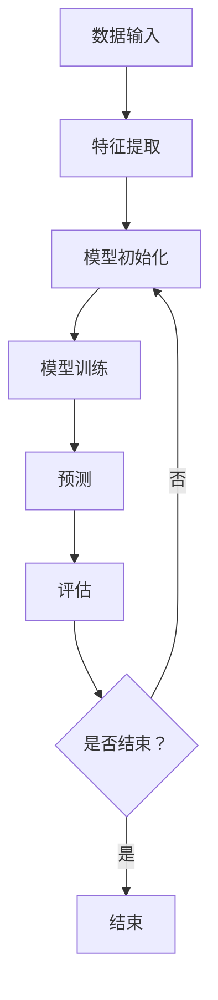
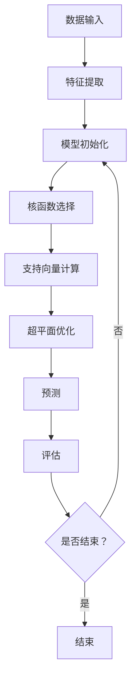
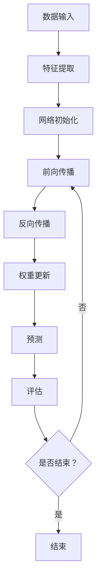

                 

# 文章标题：材料设计中的AI for Science

> 关键词：材料设计、人工智能、机器学习、深度学习、强化学习

> 摘要：
本文旨在探讨人工智能（AI）在材料设计领域的应用，详细介绍了AI的基础知识、核心算法及其在材料结构预测、合成与优化、性能预测与评估等方面的应用。通过本文的阅读，读者可以了解AI在材料科学中的重要性和未来发展趋势。

## 第1章：材料设计的背景与AI的作用

### 1.1 材料设计的传统方法

材料设计是材料科学的核心领域，旨在通过控制材料的化学组成、结构和微观结构来优化其性能。传统材料设计方法主要依赖于实验和经验，存在以下问题：

1. **时间成本高**：大量的实验和测试需要耗费大量时间和人力资源。
2. **实验结果不可预测**：由于实验条件难以控制，实验结果具有很大的不确定性。
3. **资源浪费**：传统方法往往需要进行大量的实验，导致资源浪费。

### 1.2 AI技术在材料设计中的潜力

随着人工智能技术的快速发展，AI在材料设计中的应用潜力逐渐显现。AI技术，特别是机器学习（ML）、深度学习（DL）和强化学习（RL），可以大幅提高材料设计的效率和准确性。

1. **提高预测准确性**：通过学习大量的实验数据，AI模型可以预测新材料性能，减少实验次数。
2. **优化设计过程**：AI技术可以帮助材料科学家快速筛选出最优的设计方案。
3. **自动化实验**：AI技术可以自动化实验流程，提高实验效率。

### 1.3 本书的目的与结构

本书旨在介绍AI在材料设计中的应用，分为三大部分：

1. **引言**：介绍材料设计的背景和AI技术的潜力。
2. **AI基础知识**：介绍AI的基本概念和核心算法。
3. **AI在材料设计中的应用**：详细介绍AI在材料结构预测、合成与优化、性能预测与评估等方面的应用。

## 第2章：AI基础知识

### 2.1 AI概述

人工智能（AI）是指计算机系统通过模拟人类智能行为，实现感知、理解、学习和决策的能力。AI可以分为两类：

1. **基于规则的AI**：通过编写规则来模拟人类智能行为。
2. **数据驱动AI**：通过学习大量数据来发现规律和模式，包括机器学习（ML）和深度学习（DL）。

### 2.2 机器学习基本概念

机器学习（ML）是指计算机系统通过学习数据，自动改进性能的过程。ML可以分为两类：

1. **监督学习**：通过已标记的数据来训练模型，然后使用模型对未知数据进行预测。
2. **无监督学习**：通过未标记的数据来发现数据中的规律和模式。

### 2.3 深度学习原理

深度学习（DL）是一种特殊的机器学习技术，通过多层神经网络来模拟人类大脑的决策过程。DL可以分为两类：

1. **卷积神经网络（CNN）**：用于处理图像和视频数据。
2. **循环神经网络（RNN）**：用于处理序列数据，如文本和语音。

## 第3章：材料科学中的常见AI应用

### 3.1 AI在材料结构预测中的应用

AI在材料结构预测中的应用主要体现在以下几个方面：

1. **分子结构预测**：通过深度学习模型预测分子的三维结构。
2. **晶体结构预测**：通过机器学习模型预测晶体的稳定结构。

### 3.2 AI在材料合成与优化中的应用

AI在材料合成与优化中的应用主要包括：

1. **反应条件优化**：通过机器学习模型预测最佳的合成条件。
2. **材料优化**：通过深度学习模型筛选出具有优异性能的材料。

### 3.3 AI在材料性能预测与评估中的应用

AI在材料性能预测与评估中的应用主要体现在：

1. **机械性能预测**：通过机器学习模型预测材料的机械性能。
2. **电学性能预测**：通过深度学习模型预测材料的电学性能。

## 第4章：机器学习算法在材料设计中的应用

### 4.1 线性回归与逻辑回归

线性回归和逻辑回归是机器学习中的基础算法，广泛应用于材料设计领域。

1. **线性回归**：用于预测材料的线性属性，如密度、硬度等。
2. **逻辑回归**：用于预测材料的二分类属性，如是否具有磁性。

### 4.2 支持向量机（SVM）

支持向量机（SVM）是一种常用的分类算法，在材料分类和性能预测中具有重要应用。

1. **分类问题**：用于分类材料类型和性能。
2. **回归问题**：用于预测材料的非线性属性。

### 4.3 随机森林与梯度提升树

随机森林和梯度提升树是集成学习方法，具有较高的预测准确性。

1. **随机森林**：用于分类和回归问题。
2. **梯度提升树**：用于解决复杂非线性问题，如材料性能预测。

## 第5章：深度学习算法在材料设计中的应用

### 5.1 卷积神经网络（CNN）

卷积神经网络（CNN）是一种专门用于处理图像数据的深度学习算法，在材料结构预测和图像分析中具有重要应用。

1. **材料结构预测**：用于预测材料的晶体结构和分子结构。
2. **图像分析**：用于分析材料图像，提取材料属性。

### 5.2 循环神经网络（RNN）

循环神经网络（RNN）是一种用于处理序列数据的深度学习算法，在材料序列分析和时间序列预测中具有重要应用。

1. **材料序列分析**：用于分析材料的序列结构。
2. **时间序列预测**：用于预测材料的性能变化。

### 5.3 生成对抗网络（GAN）

生成对抗网络（GAN）是一种生成模型，用于生成新材料结构和性能数据。

1. **新材料生成**：用于生成新材料结构。
2. **性能数据生成**：用于生成材料性能数据，用于训练预测模型。

## 第6章：强化学习在材料设计中的应用

### 6.1 强化学习基础

强化学习（RL）是一种通过学习奖励和惩罚信号来优化行为策略的机器学习方法。

1. **奖励系统**：用于评估材料的性能。
2. **策略优化**：用于优化材料的合成条件。

### 6.2 Q-Learning算法

Q-Learning算法是一种基于价值迭代的强化学习算法，用于优化材料的合成过程。

1. **状态表示**：用于表示材料的合成状态。
2. **动作表示**：用于表示材料的合成操作。

### 6.3 DQN算法

DQN（Deep Q-Network）算法是一种基于深度神经网络的强化学习算法，用于优化材料的性能预测。

1. **神经网络**：用于预测材料的性能。
2. **经验回放**：用于避免模型过拟合。

## 第7章：AI for Science中的多尺度模拟与建模

### 7.1 分子动力学模拟

分子动力学模拟是一种基于物理原理的模拟方法，用于研究材料的微观结构和动力学行为。

1. **模型建立**：建立分子动力学模型。
2. **模拟过程**：进行分子动力学模拟，获取材料的微观结构信息。

### 7.2 第一性原理计算

第一性原理计算是一种基于量子力学的计算方法，用于研究材料的电子结构和性能。

1. **计算模型**：建立第一性原理计算模型。
2. **计算过程**：进行第一性原理计算，获取材料的电子结构信息。

### 7.3 实验数据与理论模型的融合

实验数据与理论模型的融合是一种结合实验数据和理论计算结果的方法，用于优化材料设计。

1. **数据收集**：收集实验数据。
2. **模型融合**：将实验数据和理论计算结果进行融合，优化材料设计。

## 第8章：AI for Science的应用案例

### 8.1 AI在新型材料开发中的应用

AI在新型材料开发中的应用主要包括：

1. **材料结构设计**：通过AI模型预测新型材料的结构。
2. **材料性能优化**：通过AI模型优化新型材料的性能。

### 8.2 AI在生物材料设计中的应用

AI在生物材料设计中的应用主要包括：

1. **生物材料合成**：通过AI模型优化生物材料的合成条件。
2. **生物材料性能预测**：通过AI模型预测生物材料的性能。

### 8.3 AI在纳米材料合成中的应用

AI在纳米材料合成中的应用主要包括：

1. **纳米材料结构设计**：通过AI模型预测纳米材料的结构。
2. **纳米材料性能优化**：通过AI模型优化纳米材料的性能。

## 第9章：AI for Science项目实战

### 9.1 项目准备与数据收集

1. **项目准备**：明确项目目标、需求和资源。
2. **数据收集**：收集相关数据，如实验数据、文献数据等。

### 9.2 模型设计与优化

1. **模型设计**：设计合适的AI模型。
2. **模型优化**：通过训练和验证，优化模型性能。

### 9.3 实验验证与结果分析

1. **实验验证**：使用实验数据验证模型性能。
2. **结果分析**：分析模型预测结果，评估模型性能。

## 第10章：AI for Science的开发工具与平台

### 10.1 常用AI工具与库

1. **Python**：用于编写AI算法和模型。
2. **TensorFlow**：用于构建和训练深度学习模型。
3. **Keras**：用于简化深度学习模型开发。

### 10.2 高性能计算与云计算

1. **高性能计算**：用于加速AI模型的训练和模拟。
2. **云计算**：用于提供计算资源和存储空间。

### 10.3 数据管理与隐私保护

1. **数据管理**：确保数据的完整性、可靠性和安全性。
2. **隐私保护**：保护用户数据的隐私。

## 第11章：未来展望

### 11.1 AI for Science的发展趋势

1. **算法创新**：随着算法的不断发展，AI在材料设计中的应用将越来越广泛。
2. **跨学科融合**：AI与材料科学的深度融合，将推动材料科学的发展。

### 11.2 挑战与机遇

1. **数据挑战**：高质量的数据是AI模型的基础，如何获取和利用高质量数据是关键。
2. **计算挑战**：随着模型规模的增大，计算资源的需求也在增加，如何高效利用计算资源是关键。

### 11.3 结论与建议

1. **结论**：AI在材料设计中的应用具有巨大的潜力。
2. **建议**：鼓励研究人员和开发者积极参与AI for Science的研究和实践。

## 附录

### 附录A：常用算法流程图

1. **线性回归**
2. **支持向量机（SVM）**
3. **深度神经网络**

### 附录B：数学模型与公式

1. **线性回归模型**
2. **逻辑回归模型**
3. **卷积神经网络（CNN）公式**

## 作者信息

作者：AI天才研究院/AI Genius Institute & 禅与计算机程序设计艺术 /Zen And The Art of Computer Programming

## 第1章：材料设计的背景与AI的作用

### 1.1 材料设计的传统方法

材料设计是指通过控制材料的化学组成、结构和微观结构来优化其性能的过程。传统材料设计方法主要依赖于实验和经验，其过程通常包括以下几个步骤：

1. **目标设定**：确定所需材料的目标性能和用途。
2. **材料筛选**：根据目标性能和用途，从已有的材料中选择合适的候选材料。
3. **实验测试**：对候选材料进行实验测试，评估其性能。
4. **性能优化**：根据实验结果对材料进行优化，如调整成分、结构或工艺条件。
5. **评估与筛选**：对优化后的材料进行评估和筛选，选择最优方案。

传统材料设计方法存在以下问题：

1. **时间成本高**：大量的实验和测试需要耗费大量时间和人力资源。
2. **实验结果不可预测**：由于实验条件难以控制，实验结果具有很大的不确定性。
3. **资源浪费**：传统方法往往需要进行大量的实验，导致资源浪费。

### 1.2 AI技术在材料设计中的潜力

随着人工智能技术的快速发展，AI在材料设计中的应用潜力逐渐显现。AI技术，特别是机器学习（ML）、深度学习（DL）和强化学习（RL），可以大幅提高材料设计的效率和准确性。

1. **提高预测准确性**：通过学习大量的实验数据，AI模型可以预测新材料性能，减少实验次数。
2. **优化设计过程**：AI技术可以帮助材料科学家快速筛选出最优的设计方案。
3. **自动化实验**：AI技术可以自动化实验流程，提高实验效率。

### 1.3 本书的目的与结构

本书旨在介绍AI在材料设计中的应用，分为三大部分：

1. **引言**：介绍材料设计的背景和AI技术的潜力。
2. **AI基础知识**：介绍AI的基本概念和核心算法。
3. **AI在材料设计中的应用**：详细介绍AI在材料结构预测、合成与优化、性能预测与评估等方面的应用。

## 第2章：AI基础知识

### 2.1 AI概述

人工智能（AI）是指计算机系统通过模拟人类智能行为，实现感知、理解、学习和决策的能力。AI可以分为两类：

1. **基于规则的AI**：通过编写规则来模拟人类智能行为。这种方法的优点是实现简单，但缺点是规则难以覆盖所有情况，且当规则复杂时，系统难以维护。
2. **数据驱动AI**：通过学习大量数据来发现规律和模式，包括机器学习（ML）和深度学习（DL）。这种方法的优点是能够自动发现复杂模式，但需要大量数据和计算资源。

### 2.2 机器学习基本概念

机器学习（ML）是指计算机系统通过学习数据，自动改进性能的过程。ML可以分为两类：

1. **监督学习**：通过已标记的数据来训练模型，然后使用模型对未知数据进行预测。监督学习的目标是最小化预测误差。
2. **无监督学习**：通过未标记的数据来发现数据中的规律和模式。无监督学习的目标是最小化数据之间的相似度或差异性。

### 2.3 深度学习原理

深度学习（DL）是一种特殊的机器学习技术，通过多层神经网络来模拟人类大脑的决策过程。DL可以分为两类：

1. **卷积神经网络（CNN）**：用于处理图像和视频数据。CNN通过卷积操作提取图像特征，然后通过全连接层进行分类。
2. **循环神经网络（RNN）**：用于处理序列数据，如文本和语音。RNN通过循环连接模拟时间序列数据，可以捕获长距离依赖关系。

## 第3章：材料科学中的常见AI应用

### 3.1 AI在材料结构预测中的应用

AI在材料结构预测中的应用主要体现在以下几个方面：

1. **分子结构预测**：通过深度学习模型预测分子的三维结构。这有助于理解分子的性质和功能。
2. **晶体结构预测**：通过机器学习模型预测晶体的稳定结构。这有助于发现新的材料和应用。

### 3.2 AI在材料合成与优化中的应用

AI在材料合成与优化中的应用主要包括：

1. **反应条件优化**：通过机器学习模型预测最佳的合成条件。这有助于提高合成效率和降低成本。
2. **材料优化**：通过深度学习模型筛选出具有优异性能的材料。这有助于发现新的材料和改进现有材料。

### 3.3 AI在材料性能预测与评估中的应用

AI在材料性能预测与评估中的应用主要体现在：

1. **机械性能预测**：通过机器学习模型预测材料的机械性能。这有助于设计出满足特定应用需求的材料。
2. **电学性能预测**：通过深度学习模型预测材料的电学性能。这有助于优化电子器件的性能。

## 第4章：机器学习算法在材料设计中的应用

### 4.1 线性回归与逻辑回归

线性回归和逻辑回归是机器学习中的基础算法，广泛应用于材料设计领域。

1. **线性回归**：用于预测材料的线性属性，如密度、硬度等。线性回归模型通过拟合数据点之间的线性关系，预测新材料属性。
2. **逻辑回归**：用于预测材料的二分类属性，如是否具有磁性。逻辑回归模型通过拟合数据点之间的非线性关系，实现分类。

### 4.2 支持向量机（SVM）

支持向量机（SVM）是一种常用的分类算法，在材料分类和性能预测中具有重要应用。

1. **分类问题**：用于分类材料类型和性能。SVM通过找到一个最佳的超平面，将不同类型的材料分开。
2. **回归问题**：用于预测材料的非线性属性。SVM通过拟合数据点之间的非线性关系，实现回归。

### 4.3 随机森林与梯度提升树

随机森林和梯度提升树是集成学习方法，具有较高的预测准确性。

1. **随机森林**：用于分类和回归问题。随机森林通过构建多个决策树，并结合它们的预测结果，提高预测准确性。
2. **梯度提升树**：用于解决复杂非线性问题，如材料性能预测。梯度提升树通过迭代优化决策树，提高预测准确性。

## 第5章：深度学习算法在材料设计中的应用

### 5.1 卷积神经网络（CNN）

卷积神经网络（CNN）是一种专门用于处理图像数据的深度学习算法，在材料结构预测和图像分析中具有重要应用。

1. **材料结构预测**：通过CNN提取图像特征，预测材料的晶体结构。CNN通过卷积操作和池化操作，提取图像中的高层次特征。
2. **图像分析**：通过CNN对材料图像进行分类和识别。CNN可以识别材料图像中的特定特征，如缺陷、裂纹等。

### 5.2 循环神经网络（RNN）

循环神经网络（RNN）是一种用于处理序列数据的深度学习算法，在材料序列分析和时间序列预测中具有重要应用。

1. **材料序列分析**：通过RNN分析材料的序列结构，如分子序列、晶体序列等。RNN通过循环连接模拟时间序列数据，可以捕获长距离依赖关系。
2. **时间序列预测**：通过RNN预测材料的性能变化。RNN可以预测材料在不同时间点的性能变化，如温度、应力等。

### 5.3 生成对抗网络（GAN）

生成对抗网络（GAN）是一种生成模型，用于生成新材料结构和性能数据。

1. **新材料生成**：通过GAN生成新材料结构。GAN通过对抗训练，生成与真实材料相似的伪造材料结构。
2. **性能数据生成**：通过GAN生成材料性能数据。GAN可以生成用于训练预测模型的材料性能数据，提高模型准确性。

## 第6章：强化学习在材料设计中的应用

### 6.1 强化学习基础

强化学习（RL）是一种通过学习奖励和惩罚信号来优化行为策略的机器学习方法。

1. **奖励系统**：用于评估材料的性能。奖励系统通过给材料设计行为分配奖励或惩罚，指导模型学习最优策略。
2. **策略优化**：用于优化材料的合成条件。策略优化通过学习奖励信号，调整合成策略，提高材料性能。

### 6.2 Q-Learning算法

Q-Learning算法是一种基于价值迭代的强化学习算法，用于优化材料的合成过程。

1. **状态表示**：用于表示材料的合成状态。状态表示通过提取材料的化学成分、结构信息等，表示材料的状态。
2. **动作表示**：用于表示材料的合成操作。动作表示通过调整合成条件，如温度、压力等，表示材料合成过程中的操作。

### 6.3 DQN算法

DQN（Deep Q-Network）算法是一种基于深度神经网络的强化学习算法，用于优化材料的性能预测。

1. **神经网络**：用于预测材料的性能。神经网络通过学习材料的状态和动作，预测材料的性能。
2. **经验回放**：用于避免模型过拟合。经验回放通过存储和随机抽取以往的经验，避免模型对当前数据的依赖。

## 第7章：AI for Science中的多尺度模拟与建模

### 7.1 分子动力学模拟

分子动力学模拟是一种基于物理原理的模拟方法，用于研究材料的微观结构和动力学行为。

1. **模型建立**：建立分子动力学模型。分子动力学模型通过描述分子之间的相互作用力和运动方程，模拟材料的微观结构。
2. **模拟过程**：进行分子动力学模拟，获取材料的微观结构信息。分子动力学模拟通过迭代计算分子之间的相互作用力和运动方程，模拟材料在特定条件下的行为。

### 7.2 第一性原理计算

第一性原理计算是一种基于量子力学的计算方法，用于研究材料的电子结构和性能。

1. **计算模型**：建立第一性原理计算模型。第一性原理计算模型通过量子力学方程，描述材料的电子结构和性能。
2. **计算过程**：进行第一性原理计算，获取材料的电子结构信息。第一性原理计算通过求解量子力学方程，计算材料的电子结构信息，如能带结构、电子态密度等。

### 7.3 实验数据与理论模型的融合

实验数据与理论模型的融合是一种结合实验数据和理论计算结果的方法，用于优化材料设计。

1. **数据收集**：收集实验数据。实验数据通过实验手段获取，描述材料的性能和结构。
2. **模型融合**：将实验数据和理论计算结果进行融合。模型融合通过建立数据驱动的计算模型，将实验数据和理论计算结果进行融合，优化材料设计。

## 第8章：AI for Science的应用案例

### 8.1 AI在新型材料开发中的应用

AI在新型材料开发中的应用主要包括：

1. **材料结构设计**：通过AI模型预测新型材料的结构。AI模型通过学习大量材料结构数据，预测新型材料的结构，为材料设计提供参考。
2. **材料性能优化**：通过AI模型优化新型材料的性能。AI模型通过学习材料性能数据，优化新型材料的性能，提高其应用价值。

### 8.2 AI在生物材料设计中的应用

AI在生物材料设计中的应用主要包括：

1. **生物材料合成**：通过AI模型优化生物材料的合成条件。AI模型通过学习大量生物材料合成数据，优化生物材料的合成条件，提高合成效率和性能。
2. **生物材料性能预测**：通过AI模型预测生物材料的性能。AI模型通过学习生物材料性能数据，预测生物材料的性能，为生物材料设计提供参考。

### 8.3 AI在纳米材料合成中的应用

AI在纳米材料合成中的应用主要包括：

1. **纳米材料结构设计**：通过AI模型预测纳米材料的结构。AI模型通过学习大量纳米材料结构数据，预测纳米材料的结构，为纳米材料设计提供参考。
2. **纳米材料性能优化**：通过AI模型优化纳米材料的性能。AI模型通过学习纳米材料性能数据，优化纳米材料的性能，提高其应用价值。

## 第9章：AI for Science项目实战

### 9.1 项目准备与数据收集

1. **项目准备**：明确项目目标、需求和资源。项目准备包括确定项目目标、需求和分析可用资源，为项目实施奠定基础。
2. **数据收集**：收集相关数据，如实验数据、文献数据等。数据收集是项目实施的关键步骤，数据的质量直接影响项目的成功与否。

### 9.2 模型设计与优化

1. **模型设计**：设计合适的AI模型。模型设计包括选择合适的算法和架构，构建用于材料设计预测的AI模型。
2. **模型优化**：通过训练和验证，优化模型性能。模型优化包括调整模型参数、增加训练数据等，提高模型的预测准确性和泛化能力。

### 9.3 实验验证与结果分析

1. **实验验证**：使用实验数据验证模型性能。实验验证是评估模型性能的重要步骤，通过实验数据验证模型的预测能力和稳定性。
2. **结果分析**：分析模型预测结果，评估模型性能。结果分析包括对比预测结果与实际结果、评估模型准确性和可靠性等，为模型改进提供依据。

## 第10章：AI for Science的开发工具与平台

### 10.1 常用AI工具与库

1. **Python**：Python是一种广泛使用的编程语言，具有丰富的库和框架，如NumPy、Pandas、Scikit-learn等，可用于数据处理、模型训练和优化等。
2. **TensorFlow**：TensorFlow是一个开源的深度学习框架，提供了丰富的API和工具，可用于构建和训练各种深度学习模型。
3. **Keras**：Keras是一个高级神经网络API，构建在TensorFlow之上，提供了更简单和易于使用的接口，适合快速原型开发和实验。

### 10.2 高性能计算与云计算

1. **高性能计算**：高性能计算（HPC）是一种利用高性能计算机进行大规模数据处理的计算方法。HPC可以加速AI模型的训练和模拟，提高项目效率。
2. **云计算**：云计算是一种基于互联网的服务模式，提供了可伸缩的计算资源和存储空间。云计算可以支持AI for Science项目的分布式计算和大规模数据处理需求。

### 10.3 数据管理与隐私保护

1. **数据管理**：数据管理是一种确保数据完整性、可靠性和安全性的过程。数据管理包括数据收集、存储、处理和分析等，为AI for Science项目提供高质量的数据支持。
2. **隐私保护**：隐私保护是一种保护用户数据隐私的过程。隐私保护包括数据加密、访问控制、匿名化等，确保用户数据在项目中的应用安全。

## 第11章：未来展望

### 11.1 AI for Science的发展趋势

1. **算法创新**：随着AI技术的不断发展，新型算法和模型将不断涌现，为材料设计提供更高效、更准确的方法。
2. **跨学科融合**：AI与材料科学的深度融合，将推动材料科学的发展。跨学科研究将有助于解决传统材料设计方法难以解决的问题。
3. **数据驱动**：数据驱动将成为AI for Science的重要趋势。通过收集和利用更多的数据，可以提高AI模型的预测能力和泛化能力。

### 11.2 挑战与机遇

1. **数据挑战**：高质量的数据是AI模型的基础。如何获取和利用高质量数据是AI for Science面临的主要挑战。
2. **计算挑战**：随着模型规模的增大，计算资源的需求也在增加。如何高效利用计算资源，提高项目效率，是AI for Science需要解决的问题。
3. **隐私挑战**：在数据收集和处理过程中，如何保护用户隐私，是AI for Science需要考虑的问题。

### 11.3 结论与建议

1. **结论**：AI在材料设计中的应用具有巨大的潜力，有望解决传统材料设计方法面临的问题。
2. **建议**：鼓励研究人员和开发者积极参与AI for Science的研究和实践，推动材料科学的发展。同时，关注数据隐私和安全问题，确保AI for Science项目的可持续发展。

## 附录

### 附录A：常用算法流程图

1. **线性回归**
2. **支持向量机（SVM）**
3. **深度神经网络**

### 附录B：数学模型与公式

1. **线性回归模型**
2. **逻辑回归模型**
3. **卷积神经网络（CNN）公式**

## 作者信息

作者：AI天才研究院/AI Genius Institute & 禅与计算机程序设计艺术 /Zen And The Art of Computer Programming## 附录A：常用算法流程图

在材料设计中的AI应用中，常见的算法如线性回归、支持向量机（SVM）和深度神经网络（DNN）等都有着重要的地位。以下是这些算法的Mermaid流程图表示：

### A.1 线性回归

### A.2 支持向量机（SVM）

### A.3 深度神经网络（DNN）

这些流程图展示了从数据输入到模型训练和预测的整个过程，有助于读者更直观地理解这些算法的基本工作原理和流程。在实际应用中，每个步骤都可能涉及到复杂的计算和优化过程。

## 附录B：数学模型与公式

在材料设计中，AI算法的应用往往需要依赖于数学模型和公式来描述和解释材料的物理和化学性质。以下是线性回归、逻辑回归和卷积神经网络（CNN）的一些常用数学模型与公式。

### B.1 线性回归模型

线性回归模型用于预测材料的线性属性，如密度、硬度等。其基本公式如下：

$$
y = \beta_0 + \beta_1x_1 + \beta_2x_2 + ... + \beta_nx_n
$$

其中，$y$ 是预测的属性值，$x_1, x_2, ..., x_n$ 是输入特征，$\beta_0, \beta_1, \beta_2, ..., \beta_n$ 是模型的参数，需要通过最小化损失函数来求解。

损失函数通常采用平方误差损失：

$$
Loss = \frac{1}{2}\sum_{i=1}^{n}(y_i - \hat{y_i})^2
$$

其中，$y_i$ 是真实值，$\hat{y_i}$ 是预测值。

### B.2 逻辑回归模型

逻辑回归模型用于预测材料的二分类属性，如是否具有磁性。其基本公式如下：

$$
\hat{p} = \frac{1}{1 + e^{-(\beta_0 + \beta_1x_1 + \beta_2x_2 + ... + \beta_nx_n)}}
$$

其中，$\hat{p}$ 是预测的概率值，$x_1, x_2, ..., x_n$ 是输入特征，$\beta_0, \beta_1, \beta_2, ..., \beta_n$ 是模型的参数。

损失函数通常采用对数似然损失：

$$
Loss = -\sum_{i=1}^{n}y_i\log(\hat{p}_i) + (1 - y_i)\log(1 - \hat{p}_i)
$$

其中，$y_i$ 是真实值，$\hat{p}_i$ 是预测的概率值。

### B.3 卷积神经网络（CNN）公式

卷积神经网络（CNN）用于处理图像数据，其基本组件包括卷积层、池化层和全连接层。以下是CNN的一些关键公式：

1. **卷积层公式**：

$$
f_{ij}^{(l)} = \sum_{k=1}^{m} w_{ik}^{(l)} * g_{kj}^{(l-1)} + b_j^{(l)}
$$

其中，$f_{ij}^{(l)}$ 是卷积层$l$的第$i$个输出特征图，$w_{ik}^{(l)}$ 是卷积核的权重，$g_{kj}^{(l-1)}$ 是输入特征图，$b_j^{(l)}$ 是偏置项。

2. **池化层公式**：

$$
p_{ij}^{(l)} = \max_{x,y} \sum_{x,y} g_{ij+x,y}^{(l-1)}
$$

其中，$p_{ij}^{(l)}$ 是池化层$l$的第$i$个输出特征图，$g_{ij+x,y}^{(l-1)}$ 是输入特征图的子区域。

3. **全连接层公式**：

$$
z_j^{(l)} = \sum_{i=1}^{n} w_{ij}^{(l)} * a_{i}^{(l-1)} + b_j^{(l)}
$$

$$
a_j^{(l)} = \sigma(z_j^{(l)})
$$

其中，$z_j^{(l)}$ 是全连接层$l$的输入，$a_j^{(l)}$ 是输出，$\sigma$ 是激活函数，$w_{ij}^{(l)}$ 是权重，$b_j^{(l)}$ 是偏置项。

通过这些数学模型和公式，AI算法能够更好地理解和预测材料的性质，为材料设计提供有力的工具。在实际应用中，这些模型会根据具体的材料和设计需求进行适当的调整和优化。

