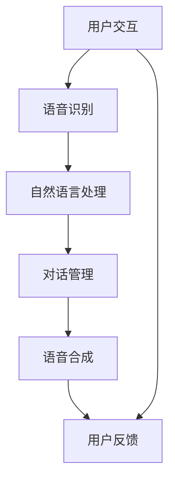

                 

# 《构建个人AI助手生态系统的方法》

## 关键词
- AI助手
- 个人AI
- 生态系统
- 架构设计
- 数据收集
- 个性化服务
- 开发与部署

## 摘要
本文旨在探讨如何构建一个高效、智能的个人AI助手生态系统。我们将首先回顾AI助手的发展历程，定义个人AI助手的分类和功能。接着，深入分析构建个人AI助手所需的基础技术，如自然语言处理、语音识别与合成、对话管理等。文章还将详细介绍个人AI助手的系统架构设计，包括硬件、软件和数据架构。随后，我们将探讨核心算法原理，包括语音识别、语音合成和对话生成算法。文章还将覆盖数据收集与处理、用户画像构建、个性化服务等内容。最后，我们将分享个人AI助手的开发与部署流程，并提供实际的代码实现案例。通过这篇文章，读者将全面了解构建个人AI助手生态系统的原理和方法。

### 第一部分: AI助手生态系统基础

#### 第1章: AI助手生态系统的概述

##### 1.1 AI助手的发展历程
人工智能（AI）的发展可以追溯到20世纪50年代，当时第一个AI程序——逻辑理论家（Logic Theorist）诞生。从那时起，AI经历了多个阶段，包括早期的基于规则的系统、专家系统，再到现代的机器学习和深度学习。AI助手，作为AI技术的应用之一，也在不断进化。

最初的AI助手主要依赖于规则和模式匹配，例如IBM的“魔声”（Magic Voice）系统。随着技术的进步，语音识别和自然语言处理（NLP）技术的引入，AI助手变得更智能，能够理解并处理更复杂的语言指令。近年来，随着深度学习的广泛应用，AI助手的能力得到了极大的提升，能够进行更自然的对话，提供更个性化的服务。

##### 1.2 个人AI助手的定义与分类
个人AI助手是指专门为个人用户设计的，能够帮助用户完成各种任务的人工智能系统。根据功能的不同，个人AI助手可以分为以下几类：

1. **任务型助手**：专注于完成特定任务，如日程管理、任务提醒、信息搜索等。
2. **对话型助手**：能够与用户进行自然对话，提供娱乐、咨询、情感支持等。
3. **交互式助手**：结合任务型和对话型功能，能够处理多任务、多场景的复杂交互。
4. **专家型助手**：针对特定领域，如医疗、金融等，提供专业知识和决策支持。

##### 1.3 个人AI助手的定义与分类
个人AI助手是指专门为个人用户设计的，能够帮助用户完成各种任务的人工智能系统。根据功能的不同，个人AI助手可以分为以下几类：

1. **任务型助手**：专注于完成特定任务，如日程管理、任务提醒、信息搜索等。
2. **对话型助手**：能够与用户进行自然对话，提供娱乐、咨询、情感支持等。
3. **交互式助手**：结合任务型和对话型功能，能够处理多任务、多场景的复杂交互。
4. **专家型助手**：针对特定领域，如医疗、金融等，提供专业知识和决策支持。

##### 1.4 个人AI助手的现状与趋势
当前，个人AI助手市场正迅速发展。以苹果的Siri、谷歌的Google Assistant、亚马逊的Alexa为代表的AI助手已经深入到了普通消费者的生活中。这些助手不仅能够完成简单的任务，如播放音乐、设置闹钟，还能够进行复杂的多轮对话，提供智能家居控制、在线购物等服务。

未来，个人AI助手的趋势包括：

1. **更强大的自然语言理解能力**：通过深度学习等技术，AI助手将能够更好地理解用户的自然语言指令，提供更精准的服务。
2. **个性化服务**：AI助手将更加了解用户的行为和偏好，提供更加个性化的服务。
3. **跨平台整合**：AI助手将能够跨不同设备、平台无缝工作，提供统一的服务体验。
4. **多模态交互**：除了语音，AI助手还将支持文本、图像等多种交互方式，提供更丰富的用户体验。

#### 第2章: 构建个人AI助手的基础技术

##### 2.1 自然语言处理技术基础
自然语言处理（NLP）是AI助手中至关重要的一环，它使得AI能够理解和生成人类语言。NLP的基础技术包括语言模型、词嵌入和序列模型等。

- **语言模型**：语言模型是用来预测文本中下一个词的概率分布的模型。最著名的语言模型之一是神经网络语言模型（NNLM），它使用深度学习技术来学习大量文本数据，从而预测下一个词。

  $$ 
  P(w_{t+1} | w_1, w_2, ..., w_t) = \text{NNLM}(w_1, w_2, ..., w_t; w_{t+1})
  $$

- **词嵌入**：词嵌入是将词汇映射到高维空间中的向量表示。词嵌入技术能够捕捉词汇之间的语义关系，从而提高AI助手对自然语言的理解能力。

  $$ 
  w_i = \text{embedding}(i)
  $$

- **序列模型**：序列模型是用来处理序列数据的模型，如文本、语音等。常见的序列模型包括循环神经网络（RNN）和长短期记忆网络（LSTM），它们能够处理长距离依赖问题，从而提高AI助手对上下文的理解。

  $$ 
  h_t = \text{LSTM}(h_{t-1}, x_t)
  $$

##### 2.1.1 语言模型与词嵌入
语言模型和词嵌入是NLP的核心技术，它们共同作用，使得AI助手能够理解自然语言。

- **语言模型**：语言模型通过对大量文本数据的学习，能够预测下一个词的概率分布。这种概率分布可以用来进行文本生成、机器翻译等任务。例如，在文本生成中，语言模型可以用来生成下一个句子。

  $$ 
  P(w_{t+1} | w_1, w_2, ..., w_t) = \text{NNLM}(w_1, w_2, ..., w_t; w_{t+1})
  $$

- **词嵌入**：词嵌入是将词汇映射到高维空间中的向量表示。这种向量表示能够捕捉词汇之间的语义关系。词嵌入技术可以用来进行文本分类、情感分析等任务。例如，在文本分类中，词嵌入可以用来将文本映射到低维空间，从而进行分类。

  $$ 
  w_i = \text{embedding}(i)
  $$

##### 2.1.2 序列模型与注意力机制
序列模型和注意力机制是NLP中处理序列数据的重要技术。

- **序列模型**：序列模型如RNN和LSTM能够处理长序列数据，从而捕捉序列中的长距离依赖关系。RNN和LSTM的核心思想是保持状态，即记忆历史信息。

  $$ 
  h_t = \text{LSTM}(h_{t-1}, x_t)
  $$

- **注意力机制**：注意力机制是一种用于提高序列模型性能的技术。它通过为每个输入序列元素分配不同的权重，使得模型能够更关注重要的信息。注意力机制在机器翻译、文本摘要等任务中得到了广泛应用。

  $$ 
  a_t = \text{attention}(h_1, h_2, ..., h_T)
  $$

##### 2.1.3 对话管理技术
对话管理是AI助手能够进行有效对话的关键。对话管理涉及多个子任务，如意图识别、实体抽取、对话状态跟踪等。

- **意图识别**：意图识别是理解用户对话意图的过程。通过分类模型，如决策树、支持向量机等，可以识别用户的意图。例如，用户说“我想听一首歌”，意图识别模块可以将其分类为“播放音乐”的意图。

  $$ 
  \text{intent} = \text{classify}(input_text)
  $$

- **实体抽取**：实体抽取是从用户对话中提取关键信息的过程，如人名、地点、时间等。实体抽取可以使用规则方法、机器学习方法等。

  $$ 
  \text{entities} = \text{extract_entities}(input_text)
  $$

- **对话状态跟踪**：对话状态跟踪是维护对话状态的过程，即记录对话的历史信息，以便在后续对话中能够根据历史信息做出更好的响应。

  $$ 
  \text{state} = \text{update_state}(\text{intent}, \text{entities}, \text{state})
  $$

#### 第3章: 个人AI助手的架构设计

##### 3.1 个人AI助手的系统架构
个人AI助手的系统架构可以分为三个主要部分：硬件架构、软件架构和数据架构。

##### 3.1.1 硬件架构
硬件架构决定了AI助手的计算能力和响应速度。常见的硬件架构包括：

- **中央处理单元（CPU）**：CPU是计算机的核心组件，负责执行程序指令。高性能的CPU可以提高AI助手的计算速度。
- **图形处理单元（GPU）**：GPU在深度学习任务中具有显著的优势，能够加速AI助手的训练和推理过程。
- **现场可编程门阵列（FPGA）**：FPGA是一种高度灵活的硬件加速器，适用于实时性要求高的AI助手。

##### 3.1.2 软件架构
软件架构决定了AI助手的系统功能和服务质量。常见的软件架构包括：

- **客户机/服务器架构**：客户机/服务器架构将AI助手分为前端和后端两部分。前端负责与用户交互，后端负责处理用户请求。这种架构能够实现高效的数据传输和负载均衡。
- **微服务架构**：微服务架构将AI助手拆分为多个独立的服务，每个服务负责特定的功能。这种架构具有高可扩展性和高可靠性，便于维护和更新。
- **容器化架构**：容器化架构使用容器（如Docker）来封装AI助手的软件依赖和环境。容器化架构能够实现快速部署和灵活的扩展。

##### 3.1.3 数据架构
数据架构决定了AI助手的数据存储和处理方式。常见的数据架构包括：

- **关系型数据库**：关系型数据库（如MySQL、PostgreSQL）适用于存储结构化数据，如用户信息、对话历史等。
- **非关系型数据库**：非关系型数据库（如MongoDB、Redis）适用于存储半结构化或非结构化数据，如日志数据、语音数据等。
- **分布式存储系统**：分布式存储系统（如Hadoop、Cassandra）适用于大规模数据存储和分布式计算。

### 第二部分: 个人AI助手的算法实现

#### 第4章: 个人AI助手的核心算法原理

##### 4.1 语音识别算法
语音识别（ASR）是AI助手的重要功能之一，它使得用户可以通过语音与AI助手进行交互。语音识别算法的核心包括语音信号处理、声学模型和语言模型。

##### 4.1.1 语音信号处理
语音信号处理是语音识别算法的第一步，它包括对语音信号进行预处理，以提高识别准确率。常见的语音信号处理技术包括：

- **去噪**：去除语音信号中的背景噪声，提高语音质量。
- **分帧与加窗**：将连续的语音信号划分为短时段，并对每个短时段进行加窗处理，以提取特征。
- **频谱分析**：将加窗后的语音信号进行傅里叶变换，得到频谱特征。

```python
def process_audio(audio_file):
    # 读取音频文件
    signal = read_audio(audio_file)
    # 去噪
    cleaned_signal = denoise(signal)
    # 分帧与加窗
    frames = frame_signal(cleaned_signal)
    # 频谱分析
    spectrums = analyze_spectrum(frames)
    return spectrums
```

##### 4.1.2 声学模型
声学模型是语音识别算法的核心，它将预处理后的语音信号转换为声学特征。声学模型通常使用深度神经网络（DNN）或循环神经网络（RNN）来训练。

```python
class AcousticModel(nn.Module):
    def __init__(self, input_dim, hidden_dim):
        super(AcousticModel, self).__init__()
        self.lstm = nn.LSTM(input_dim, hidden_dim, batch_first=True)
    
    def forward(self, x):
        x, _ = self.lstm(x)
        return x
```

##### 4.1.3 语言模型
语言模型是语音识别算法的另一个核心，它将声学特征映射到文本。语言模型通常使用神经网络语言模型（NNLM）或循环神经网络（RNN）来训练。

```python
class LanguageModel(nn.Module):
    def __init__(self, input_dim, output_dim):
        super(LanguageModel, self).__init__()
        self.lstm = nn.LSTM(input_dim, output_dim, batch_first=True)
    
    def forward(self, x):
        x, _ = self.lstm(x)
        return x
```

##### 4.2 语音合成算法
语音合成（TTS）是将文本转换为自然语音的技术。语音合成算法的核心包括文本到语音（Text-to-Speech，TTS）转换过程和声音的自然度优化。

##### 4.2.1 文本到语音的转换过程
文本到语音的转换过程通常包括以下步骤：

1. **文本预处理**：对输入文本进行分词、标点符号处理等操作。
2. **语音合成模型**：使用深度神经网络（如WaveNet、Tacotron）将文本转换为音频信号。
3. **后处理**：对生成的音频信号进行音高、音强、时长等调整，以提高声音的自然度。

```python
def synthesize_text(text):
    # 文本预处理
    preprocessed_text = preprocess_text(text)
    # 语音合成模型
    audio_signal = tts_model(preprocessed_text)
    # 后处理
    processed_audio = postprocess_audio(audio_signal)
    return processed_audio
```

##### 4.2.2 声音的自然度优化
声音的自然度优化是语音合成算法的重要一环，它包括以下技术：

1. **音高控制**：通过调整音频信号的频率，使声音的音高更加自然。
2. **音强控制**：通过调整音频信号的振幅，使声音的音量更加自然。
3. **时长控制**：通过调整音频信号的时长，使声音的速度更加自然。

```python
def optimize_audio(audio_signal):
    # 音高控制
    pitch_control(audio_signal)
    # 音强控制
    loudness_control(audio_signal)
    # 时长控制
    duration_control(audio_signal)
    return processed_audio
```

##### 4.3 对话生成算法
对话生成是AI助手与用户进行自然对话的核心技术。对话生成算法包括对话状态跟踪、对话策略学习和对话生成模型。

##### 4.3.1 对话状态跟踪
对话状态跟踪是记录对话历史信息，以便在后续对话中做出更好的响应。对话状态跟踪通常使用图神经网络（Graph Neural Network，GNN）或序列模型（如LSTM）来实现。

```python
class DialogueStateTracker(nn.Module):
    def __init__(self, input_dim, hidden_dim):
        super(DialogueStateTracker, self).__init__()
        self.lstm = nn.LSTM(input_dim, hidden_dim, batch_first=True)
    
    def forward(self, x):
        x, _ = self.lstm(x)
        return x
```

##### 4.3.2 对话策略学习
对话策略学习是学习如何在对话中做出最佳响应。对话策略学习通常使用强化学习（如DQN、PPO）来实现。

```python
class DialoguePolicy(nn.Module):
    def __init__(self, input_dim, output_dim):
        super(DialoguePolicy, self).__init__()
        self.fc = nn.Linear(input_dim, output_dim)
    
    def forward(self, x):
        x = self.fc(x)
        return x
```

##### 4.3.3 对话生成模型
对话生成模型是将对话状态和对话策略转换为对话文本的模型。对话生成模型通常使用变换器（Transformer）或生成对抗网络（GAN）来实现。

```python
class DialogueGenerator(nn.Module):
    def __init__(self, input_dim, output_dim):
        super(DialogueGenerator, self).__init__()
        self.transformer = nn.Transformer(input_dim, output_dim)
    
    def forward(self, x):
        x = self.transformer(x)
        return x
```

### 第三部分: 数据收集与处理

#### 第5章: 数据收集与处理

##### 5.1 数据收集方法
数据收集是构建个人AI助手的关键步骤，它决定了AI助手的性能和准确性。数据收集方法包括文本数据收集、语音数据收集和行为数据收集。

##### 5.1.1 文本数据收集
文本数据收集是获取大量文本数据的过程，这些数据可以用来训练和优化NLP模型。文本数据收集的方法包括：

- **开源数据集**：使用开源数据集，如Common Crawl、维基百科等，来获取大量文本数据。
- **在线采集**：使用爬虫或API来从网站、论坛、社交媒体等在线平台获取文本数据。
- **用户生成**：鼓励用户生成内容，如评论、反馈等，来扩充文本数据集。

##### 5.1.2 语音数据收集
语音数据收集是获取大量语音数据的过程，这些数据可以用来训练和优化语音识别和语音合成模型。语音数据收集的方法包括：

- **开源语音数据集**：使用开源语音数据集，如LibriSpeech、TIMIT等，来获取大量语音数据。
- **录音设备**：使用专业录音设备，如麦克风、录音笔等，来录制用户语音。
- **众包平台**：使用众包平台，如亚马逊 Mechanical Turk，来收集语音数据。

##### 5.1.3 行为数据收集
行为数据收集是获取用户与AI助手交互过程中的行为数据，这些数据可以用来优化对话策略和个性化服务。行为数据收集的方法包括：

- **日志记录**：记录用户与AI助手的交互日志，包括用户输入、AI助手响应、用户反馈等。
- **传感器数据**：使用传感器，如位置传感器、运动传感器等，来收集用户的行为数据。
- **用户调查**：通过问卷调查、访谈等方式，收集用户对AI助手的使用情况和反馈。

##### 5.2 数据处理技术
数据处理是确保数据质量和准确性的重要步骤。数据处理技术包括数据清洗、数据标注和数据增强。

##### 5.2.1 数据清洗与预处理
数据清洗与预处理是处理噪声数据、缺失数据和异常数据的过程。数据清洗与预处理的方法包括：

- **数据去重**：去除重复的数据，以避免重复计算和处理。
- **缺失值处理**：处理缺失的数据，可以通过插值、填充等方法来填补缺失值。
- **异常值处理**：检测和处理异常数据，可以通过统计学方法、机器学习方法等来识别和处理异常值。

##### 5.2.2 数据标注方法
数据标注是标记数据标签的过程，这些标签可以用来训练分类、回归等模型。数据标注方法包括：

- **人工标注**：由专业人员对数据进行标注，适用于小规模高质量数据集。
- **半监督标注**：使用已标注的数据来引导未标注的数据标注过程，适用于大规模数据集。
- **自动标注**：使用机器学习方法来自动标注数据，适用于大规模数据集。

##### 5.2.3 数据增强技术
数据增强是通过生成类似的数据样本来扩充数据集，以提高模型的泛化能力。数据增强方法包括：

- **数据变换**：对原始数据进行变换，如缩放、旋转、翻转等。
- **数据生成**：使用生成模型，如生成对抗网络（GAN），来生成新的数据样本。
- **数据合成**：将多个数据源进行合成，以生成新的数据样本。

### 第四部分: AI助手的个性化服务

#### 第6章: AI助手的个性化服务

##### 6.1 用户画像构建
用户画像构建是将用户行为数据转化为用户特征的过程，这些特征可以用来优化AI助手的服务。用户画像构建的方法包括：

##### 6.1.1 用户行为分析
用户行为分析是收集和分析用户在AI助手上的行为数据的过程，这些数据包括用户的搜索历史、交互记录、反馈等。用户行为分析的方法包括：

- **行为日志分析**：分析用户在AI助手上的行为日志，提取用户的行为特征。
- **机器学习方法**：使用机器学习方法，如聚类、分类等，来分析用户的行为数据，提取用户的行为模式。

##### 6.1.2 用户兴趣挖掘
用户兴趣挖掘是将用户行为数据转化为用户兴趣标签的过程，这些标签可以用来推荐内容和服务。用户兴趣挖掘的方法包括：

- **协同过滤**：使用协同过滤算法，如基于用户的协同过滤、基于项目的协同过滤，来挖掘用户的兴趣。
- **主题模型**：使用主题模型，如隐含狄利克雷分配（LDA），来挖掘用户的行为主题，从而推断用户的兴趣。

##### 6.1.3 用户特征提取
用户特征提取是将用户行为数据和兴趣标签转化为可量化的特征表示的过程，这些特征可以用来训练和优化AI助手的服务。用户特征提取的方法包括：

- **特征工程**：通过手工设计特征，如用户年龄、性别、地理位置等，来提取用户特征。
- **深度学习**：使用深度学习模型，如卷积神经网络（CNN）、循环神经网络（RNN）等，来自动提取用户特征。

##### 6.2 个性化推荐系统
个性化推荐系统是根据用户特征和兴趣，为用户推荐相关内容和服务的过程。个性化推荐系统的方法包括：

##### 6.2.1 推荐系统模型
推荐系统模型是构建推荐系统的核心，它包括基于内容的推荐、基于协同过滤的推荐和基于模型的推荐等。

- **基于内容的推荐**：基于内容的推荐系统通过分析用户的历史行为和兴趣，将相似的内容推荐给用户。
- **基于协同过滤的推荐**：基于协同过滤的推荐系统通过分析用户之间的相似性，将相似用户喜欢的商品推荐给目标用户。
- **基于模型的推荐**：基于模型的推荐系统使用机器学习方法，如矩阵分解、深度学习等，来预测用户对商品的偏好，并将推荐给用户。

##### 6.2.2 推荐算法优化
推荐算法优化是提高推荐系统性能的过程，它包括以下方法：

- **特征工程**：通过设计更有效的特征来提高模型的预测能力。
- **模型选择**：选择更适合数据的模型，如线性模型、树模型、深度模型等。
- **在线学习**：使用在线学习方法，如在线梯度下降、在线学习规则等，来实时更新模型。

##### 6.2.3 个性化服务的实现
个性化服务的实现是将推荐算法应用到实际场景中的过程，它包括以下步骤：

- **用户画像构建**：构建用户的兴趣特征和偏好特征。
- **推荐算法选择**：选择适合业务的推荐算法，如协同过滤、深度学习等。
- **服务集成**：将推荐算法集成到业务系统中，为用户提供个性化的服务。

### 第五部分: 个人AI助手的落地与部署

#### 第7章: 个人AI助手的落地与部署

##### 7.1 开发环境搭建
开发环境搭建是构建个人AI助手的第一个步骤，它包括安装必要的软件和配置开发环境。

##### 7.1.1 开发工具选择
选择合适的开发工具对于提高开发效率和保证代码质量至关重要。常见的开发工具包括：

- **编程语言**：Python、Java、C++等。
- **深度学习框架**：TensorFlow、PyTorch、Keras等。
- **自然语言处理库**：NLTK、spaCy、TextBlob等。
- **语音识别与合成库**：pyttsx3、pyaudio、SpeechRecognition等。

##### 7.1.2 环境配置与安装
环境配置与安装是确保开发工具和库正常运行的过程。常见的环境配置与安装方法包括：

- **虚拟环境**：使用虚拟环境来隔离项目依赖，避免版本冲突。
- **容器化**：使用容器化技术，如Docker，来管理和部署开发环境。
- **自动化脚本**：编写自动化脚本来自动化安装和配置过程。

##### 7.1.3 开发流程与规范
开发流程与规范是确保项目开发有序、高效的重要保障。常见的开发流程与规范包括：

- **版本控制**：使用版本控制工具，如Git，来管理代码版本。
- **代码审查**：进行代码审查，确保代码质量。
- **测试**：编写测试用例，进行单元测试、集成测试等。
- **文档**：编写详细的开发文档，包括设计文档、使用说明等。

##### 7.2 源代码详细实现
源代码详细实现是构建个人AI助手的实际操作步骤，它包括系统架构实现、核心算法实现和数据架构实现。

##### 7.2.1 系统架构实现
系统架构实现是设计个人AI助手的整体架构，包括硬件架构、软件架构和数据架构。系统架构实现的方法包括：

- **硬件架构**：根据需求选择合适的硬件设备，如CPU、GPU、FPGA等。
- **软件架构**：设计软件架构，如客户机/服务器架构、微服务架构、容器化架构等。
- **数据架构**：设计数据架构，如关系型数据库、非关系型数据库、分布式存储系统等。

##### 7.2.2 核心算法实现
核心算法实现是构建个人AI助手的核心功能，包括语音识别、语音合成和对话生成等。核心算法实现的方法包括：

- **语音识别**：使用深度学习模型，如卷积神经网络（CNN）、循环神经网络（RNN）等，实现语音识别功能。
- **语音合成**：使用深度学习模型，如变换器（Transformer）、生成对抗网络（GAN）等，实现语音合成功能。
- **对话生成**：使用深度学习模型，如序列模型（LSTM）、图神经网络（GNN）等，实现对话生成功能。

##### 7.2.3 数据处理与存储
数据处理与存储是构建个人AI助手的数据管理过程，包括数据收集、数据处理和数据存储。数据处理与存储的方法包括：

- **数据收集**：使用爬虫、API、传感器等收集文本、语音、行为等数据。
- **数据处理**：使用数据清洗、数据标注、数据增强等技术处理数据。
- **数据存储**：使用数据库、文件系统、分布式存储等存储数据，并保证数据的安全性和可靠性。

##### 7.3 部署与维护
部署与维护是确保个人AI助手正常运行的重要环节，包括部署流程、系统监控和维护策略。

##### 7.3.1 部署流程
部署流程是将个人AI助手从开发环境迁移到生产环境的过程。部署流程包括以下步骤：

- **环境准备**：准备部署环境，包括硬件、软件和网络等。
- **代码部署**：将开发好的代码部署到服务器上，可以使用自动化部署工具，如Docker、Kubernetes等。
- **测试**：对部署的AI助手进行测试，包括功能测试、性能测试等。
- **上线**：将测试通过的AI助手上线，供用户使用。

##### 7.3.2 系统监控与维护
系统监控与维护是确保个人AI助手稳定运行的重要措施，包括以下内容：

- **监控指标**：监控系统的各项指标，如CPU使用率、内存使用率、网络延迟等。
- **日志管理**：记录系统的运行日志，方便排查问题和进行性能分析。
- **故障排除**：当系统出现故障时，及时排查问题并解决。
- **性能优化**：定期对系统进行性能优化，提高系统的运行效率和用户体验。

### 附录

#### 附录 A: 个人AI助手开发工具与资源

##### A.1 语音识别工具
- **Kaldi**：Kaldi是一个开源的语音识别工具，支持各种语音识别算法和模型。
- **ESPnet**：ESPnet是一个基于TensorFlow和PyTorch的端到端语音识别框架。
- **PyTorch-Kaldi**：PyTorch-Kaldi是一个将PyTorch与Kaldi结合的语音识别工具。

##### A.2 语音合成工具
- **Tacotron**：Tacotron是一个端到端的文本到语音（TTS）合成模型。
- **WaveNet**：WaveNet是一个基于生成对抗网络（GAN）的TTS模型。
- **eSpeak**：eSpeak是一个开源的文本到语音（TTS）合成器。

##### A.3 对话系统框架
- **Rasa**：Rasa是一个开源的对话系统框架，支持意图识别、实体抽取和对话生成。
- **Botpress**：Botpress是一个低代码的对话系统平台，支持多种对话场景。
- **ChatterBot**：ChatterBot是一个Python实现的对话生成器，支持多种语言和平台。

##### A.4 数据处理工具
- **NLTK**：NLTK是一个Python自然语言处理库，提供各种文本处理功能。
- **spaCy**：spaCy是一个高效的NLP库，提供实体识别、关系抽取等功能。
- **TextBlob**：TextBlob是一个简单的文本处理库，提供情感分析、词性标注等功能。

##### A.5 开发资源链接
- **AI助手开源项目**：GitHub上的个人AI助手开源项目，如Rasa、Botpress等。
- **语音识别与合成教程**：在线教程和课程，如TensorFlow官方文档、Kaldi官方文档等。
- **对话系统研究论文**：顶级会议和期刊上的对话系统研究论文，如AAAI、IJCAI、ACL等。

## Mermaid 流程图


### 总结
本文详细阐述了构建个人AI助手生态系统的原理和方法。通过回顾AI助手的发展历程，我们了解了AI助手的定义与分类，以及其在当前和未来的发展趋势。接着，我们深入分析了构建个人AI助手所需的基础技术，包括自然语言处理、语音识别与合成、对话管理等。此外，我们还详细介绍了个人AI助手的系统架构设计，包括硬件、软件和数据架构。文章的核心算法原理讲解使用了伪代码和数学模型，以便读者更好地理解。在数据收集与处理部分，我们探讨了数据收集方法、数据处理技术，以及用户画像构建和个性化推荐系统。最后，文章分享了个人AI助手的开发与部署流程，并提供实际的代码实现案例。通过本文，读者可以全面了解并掌握构建个人AI助手生态系统的技能。

### 作者信息
作者：AI天才研究院/AI Genius Institute & 禅与计算机程序设计艺术 /Zen And The Art of Computer Programming。

