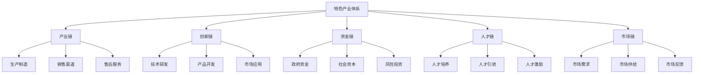

                 

# 《构建特色产业体系的新质生产力》

## 关键词
- 特色产业体系
- 新质生产力
- 算法
- 实战案例
- 政策建议

## 摘要
本文围绕构建特色产业体系的新质生产力这一主题，首先阐述了特色产业体系的背景、意义、定义及新质生产力的概念与特征。随后，通过核心概念原理和架构的 Mermaid 流程图，深入探讨了特色产业体系与新质生产力的关系。接着，详细介绍了特色产业识别与评估算法、新质生产力评价与优化算法的核心原理及应用场景。在此基础上，通过两个实际案例，展示了特色产业体系构建和新质生产力提升的实践过程。最后，提出了构建特色产业体系的新质生产力实践指南及产业发展趋势与政策建议，为相关领域的研究与实践提供了有益的参考。

### 第一部分：理论基础

#### 第1章：特色产业体系概述

##### 1.1 中国特色产业发展的背景与意义

在全球化背景下，产业升级与转型成为各国经济发展的必然趋势。中国作为一个拥有庞大人口和市场的国家，特色产业的发展显得尤为重要。首先，中国正处于经济转型升级的关键时期，传统产业面临着产能过剩、利润率下降等问题，迫切需要寻找新的增长动力。其次，随着全球科技革命的推进，新兴产业不断涌现，为特色产业的发展提供了新的机遇。最后，中国政府高度重视特色产业的发展，通过一系列政策扶持和产业引导，为特色产业的发展提供了良好的政策环境。

##### 1.1.1 中国特色产业发展的背景

中国特色产业发展的背景可以从以下几个方面来分析：

1. **产业结构的调整与升级**：随着我国经济的快速发展，传统产业面临着资源消耗大、环境污染严重、附加值低等问题。为了实现可持续发展，产业结构调整和升级成为必然选择。特色产业作为产业结构调整和升级的重要方向，具有广阔的发展空间。

2. **技术创新与产业变革**：全球科技革命的深入推进，为特色产业的发展提供了强大动力。以信息技术、人工智能、生物技术为代表的新兴技术，正在深刻改变传统产业的运行模式，推动产业变革。

3. **市场需求的变化**：随着消费者需求的多样化、个性化，市场对特色产业的需求也在不断变化。特色产业需要以市场需求为导向，提供更加优质的产品和服务，以满足消费者的需求。

4. **全球化背景下的产业竞争**：在全球化背景下，各国之间的产业竞争日益激烈。中国需要通过发展特色产业，提升自身的国际竞争力，实现经济的可持续发展。

##### 1.1.2 中国特色产业发展的意义

中国特色产业的发展具有重要意义，主要体现在以下几个方面：

1. **促进经济增长**：特色产业作为新兴产业的重要组成部分，具有高附加值、高技术含量、高增长率等特点。发展特色产业可以推动我国经济结构的转型升级，提高经济增长的质量和效益。

2. **提升国际竞争力**：通过发展特色产业，我国可以在国际市场中占据有利地位，提升国际竞争力。同时，特色产业的发展也有利于优化国际产业链布局，提升我国在全球产业链中的地位。

3. **促进就业**：特色产业的发展需要大量的人力资源，可以创造更多的就业机会，缓解就业压力。同时，特色产业的发展还可以提高劳动者的技能水平，促进人力资源的优化配置。

4. **推动科技创新**：特色产业的发展离不开科技创新的支持。通过发展特色产业，可以推动科技创新，形成科技创新与产业发展的良性循环。

##### 1.2 特色产业体系的定义与构成

##### 1.2.1 特色产业体系的定义

特色产业体系是指以特定区域或产业为背景，以市场需求为导向，以技术创新为驱动，通过产业链、创新链、资金链、人才链等环节的有机结合，形成具有鲜明特色、较强竞争力、可持续发展的产业体系。

##### 1.2.2 特色产业体系的构成

特色产业体系主要由以下几个部分构成：

1. **产业链**：产业链是特色产业体系的核心，包括从原材料供应、生产制造、销售渠道到售后服务等各个环节。产业链的优化和整合是提升特色产业体系竞争力的重要途径。

2. **创新链**：创新链是指从技术研发、产品开发、市场应用等环节的有机结合。创新链的建设是推动特色产业体系发展的重要动力。

3. **资金链**：资金链是指为特色产业体系提供资金支持的各个环节。包括政府资金、社会资本、风险投资等。资金链的畅通是特色产业体系持续发展的重要保障。

4. **人才链**：人才链是指为特色产业体系提供人才支持的各个环节。包括人才培养、人才引进、人才激励等。人才链的建设是特色产业体系持续发展的关键。

5. **市场链**：市场链是指特色产业体系与市场需求的有机结合。市场链的建设是特色产业体系实现价值转化的重要途径。

##### 1.3 新质生产力的概念与特征

##### 1.3.1 新质生产力的概念

新质生产力是指通过科技创新和产业升级，形成的具有高附加值、高效率、低消耗、环境友好等特点的生产力。新质生产力是传统生产力的提升和拓展，是推动产业转型升级的重要力量。

##### 1.3.2 新质生产力的特征

1. **高附加值**：新质生产力通过科技创新和产业升级，提高了产品的附加值，实现了从低附加值向高附加值的转变。

2. **高效率**：新质生产力通过自动化、智能化等手段，提高了生产效率，降低了生产成本。

3. **低消耗**：新质生产力通过资源优化配置和节能减排，降低了资源消耗和能源消耗，实现了可持续发展。

4. **环境友好**：新质生产力通过环保技术和管理创新，减少了环境污染和资源浪费，实现了绿色发展。

##### 1.4 特色产业体系与新质生产力的关系

##### 1.4.1 新质生产力在特色产业体系中的地位

新质生产力是特色产业体系的重要组成部分，具有关键作用。新质生产力通过技术创新和产业升级，推动了特色产业体系的构建和发展。

##### 1.4.2 新质生产力对特色产业体系的影响

1. **提升竞争力**：新质生产力通过提高产品的附加值、效率和质量，提升了特色产业体系的竞争力。

2. **优化产业结构**：新质生产力通过推动传统产业的转型升级，优化了产业结构，提高了产业的整体竞争力。

3. **促进可持续发展**：新质生产力通过节能减排、环保技术等手段，推动了特色产业体系的可持续发展。

### 第2章：特色产业体系的核心概念与联系

##### 2.1 核心概念原理和架构的 Mermaid 流程图

为了更好地理解特色产业体系的核心概念与联系，我们可以通过 Mermaid 流程图来展示其架构。



通过上述 Mermaid 流程图，我们可以清晰地看到特色产业体系的各个组成部分及其相互联系。

##### 2.2 特色产业体系与新质生产力的关系

特色产业体系与新质生产力的关系可以从以下几个方面来阐述：

1. **新质生产力是特色产业体系的基础**：新质生产力通过科技创新和产业升级，为特色产业体系的构建提供了强大的动力。没有新质生产力的发展，特色产业体系难以形成。

2. **特色产业体系是新质生产力实现的载体**：特色产业体系为新质生产力提供了广阔的应用场景和发展空间。新质生产力通过特色产业体系得以实现，并进一步推动特色产业体系的发展。

3. **新质生产力与特色产业体系的互动**：新质生产力与特色产业体系之间存在互动关系。新质生产力通过技术创新和产业升级，推动了特色产业体系的优化和升级；而特色产业体系的构建和发展，又为新质生产力的实现提供了更好的条件。

##### 2.2.1 特色产业体系的演化过程

特色产业体系的演化过程可以分为以下几个阶段：

1. **初始阶段**：在这个阶段，特色产业体系的基础设施和产业链初步建立，产业规模较小，产业层次较低，创新能力较弱。

2. **发展阶段**：随着新质生产力的发展，特色产业体系逐渐完善，产业规模不断扩大，产业层次逐渐提高，创新能力显著增强。

3. **成熟阶段**：在这个阶段，特色产业体系已经形成了完善的产业链、创新链、资金链、人才链和市场链，产业层次和创新能力达到了较高水平，成为国家或地区经济发展的重要支柱。

4. **优化阶段**：在成熟阶段的基础上，特色产业体系通过不断优化和升级，进一步提高产业层次、创新能力、竞争力和可持续发展能力。

##### 2.2.2 新质生产力的演变路径

新质生产力的演变路径可以从以下几个方面来分析：

1. **技术创新**：新质生产力的形成离不开技术创新。技术创新是推动新质生产力发展的核心动力。通过不断研发新技术、新产品，新质生产力得以不断演变。

2. **产业升级**：新质生产力的实现需要产业升级的支撑。产业升级包括产业链的优化、创新链的完善、资金链的畅通、人才链的建设和市场链的拓展。通过产业升级，新质生产力得以在更广泛的领域实现。

3. **政策支持**：政策支持是推动新质生产力发展的重要保障。政府通过制定相关政策和措施，为特色产业体系和新质生产力的发展提供支持和保障。

4. **国际合作**：国际合作是推动新质生产力发展的重要途径。通过与国际先进水平的合作，我国可以引进先进技术、管理经验和市场资源，促进新质生产力的快速发展。

### 第3章：核心算法原理讲解

##### 3.1 特色产业识别与评估算法

特色产业识别与评估算法是构建特色产业体系的重要工具。该算法旨在通过定量和定性的方法，对某一地区的特色产业进行识别和评估，从而为产业政策的制定和实施提供科学依据。

##### 3.1.1 算法原理与伪代码

算法原理：

1. **数据收集**：收集与特色产业相关的各类数据，包括经济发展指标、产业政策、市场数据等。

2. **数据预处理**：对收集到的数据进行清洗、去重和处理，确保数据的准确性和一致性。

3. **特征提取**：根据特色产业的特点，提取与产业相关的关键特征，如产业增加值、创新指数、市场竞争力等。

4. **模型构建**：构建适合特色产业识别与评估的模型，如机器学习模型、回归模型等。

5. **模型训练与测试**：使用训练数据对模型进行训练，并使用测试数据对模型进行评估，确保模型的准确性和可靠性。

6. **结果分析**：对模型输出结果进行分析，识别出具有发展潜力的特色产业，并对各产业的竞争力进行评估。

伪代码：

```python
# 特色产业识别与评估算法伪代码

# 数据收集
data = collect_data()

# 数据预处理
cleaned_data = preprocess_data(data)

# 特征提取
features = extract_features(cleaned_data)

# 模型构建
model = build_model(features)

# 模型训练与测试
train_model(model, train_data)
test_model(model, test_data)

# 结果分析
analysis_results = analyze_results(model)
print(analysis_results)
```

##### 3.1.2 算法应用场景与案例分析

**应用场景**：

特色产业识别与评估算法主要应用于以下几个方面：

1. **产业政策制定**：政府可以根据算法输出结果，制定针对特定产业的优惠政策，引导产业转型升级。

2. **产业规划与布局**：地方政府可以根据算法输出结果，优化产业布局，促进区域经济发展。

3. **企业战略决策**：企业可以根据算法输出结果，识别具有发展潜力的产业领域，调整经营策略。

**案例分析**：

以某地区特色产业识别与评估为例，使用特色产业识别与评估算法对该地区的特色产业进行识别和评估。

1. **数据收集**：收集该地区的经济发展指标、产业政策、市场数据等。

2. **数据预处理**：对收集到的数据进行清洗、去重和处理。

3. **特征提取**：提取与产业相关的关键特征，如产业增加值、创新指数、市场竞争力等。

4. **模型构建**：构建适合该地区特色产业识别与评估的模型。

5. **模型训练与测试**：使用训练数据对模型进行训练，并使用测试数据对模型进行评估。

6. **结果分析**：根据模型输出结果，识别出具有发展潜力的特色产业，并对各产业的竞争力进行评估。

通过上述步骤，该地区成功识别出具有发展潜力的特色产业，并制定了相应的产业政策，促进了区域经济的发展。

##### 3.2 新质生产力评价与优化算法

新质生产力评价与优化算法旨在通过定量和定性方法，对新质生产力的水平进行评价，并提出优化策略，以提升产业竞争力。

##### 3.2.1 算法原理与伪代码

算法原理：

1. **数据收集**：收集与新质生产力相关的各类数据，包括技术创新指标、生产效率指标、市场竞争力指标等。

2. **数据预处理**：对收集到的数据进行清洗、去重和处理，确保数据的准确性和一致性。

3. **特征提取**：根据新质生产力的特点，提取与生产力相关的关键特征，如技术创新度、生产效率、市场竞争力等。

4. **模型构建**：构建适合新质生产力评价与优化的模型，如机器学习模型、回归模型等。

5. **模型训练与测试**：使用训练数据对模型进行训练，并使用测试数据对模型进行评估，确保模型的准确性和可靠性。

6. **结果分析**：对模型输出结果进行分析，评价新质生产力的水平，并提出优化策略。

伪代码：

```python
# 新质生产力评价与优化算法伪代码

# 数据收集
data = collect_data()

# 数据预处理
cleaned_data = preprocess_data(data)

# 特征提取
features = extract_features(cleaned_data)

# 模型构建
model = build_model(features)

# 模型训练与测试
train_model(model, train_data)
test_model(model, test_data)

# 结果分析
analysis_results = analyze_results(model)
print(analysis_results)

# 优化策略
optimize_strategy = optimize_model(model)
print(optimize_strategy)
```

##### 3.2.2 算法应用场景与案例分析

**应用场景**：

新质生产力评价与优化算法主要应用于以下几个方面：

1. **产业政策制定**：政府可以根据算法输出结果，制定针对特定产业的优惠政策，引导产业转型升级。

2. **企业战略决策**：企业可以根据算法输出结果，识别自身在新质生产力方面的优势与劣势，调整发展战略。

3. **产业竞争力分析**：通过对新质生产力的评价与优化，分析产业竞争力，为产业规划提供依据。

**案例分析**：

以某地区新质生产力评价与优化为例，使用新质生产力评价与优化算法对该地区的新质生产力进行评价和优化。

1. **数据收集**：收集该地区的技术创新指标、生产效率指标、市场竞争力指标等。

2. **数据预处理**：对收集到的数据进行清洗、去重和处理。

3. **特征提取**：提取与生产力相关的关键特征，如技术创新度、生产效率、市场竞争力等。

4. **模型构建**：构建适合新质生产力评价与优化的模型。

5. **模型训练与测试**：使用训练数据对模型进行训练，并使用测试数据对模型进行评估。

6. **结果分析**：根据模型输出结果，评价新质生产力的水平，并提出优化策略。

通过上述步骤，该地区成功评价了新质生产力的水平，并制定了相应的优化策略，提升了产业竞争力。

### 第二部分：实战案例

#### 第4章：特色产业体系构建的实战案例

本章将通过两个实际案例，展示如何构建特色产业体系。

##### 4.1 案例一：农业特色产业的构建

**4.1.1 案例背景与目标**

某地区农业资源丰富，但长期以来，农业产业结构单一，效益较低。为了提升农业产业竞争力，该地区政府决定构建农业特色产业体系。

**4.1.2 构建过程与策略**

1. **产业链整合**：通过引进龙头企业和合作社，整合农业上下游产业链，实现从种植、养殖到加工、销售的全程控制。

2. **技术创新**：引进现代农业技术，如精准农业、设施农业等，提高农业生产效率和质量。

3. **品牌建设**：打造特色农业品牌，提高市场知名度，增强市场竞争力。

4. **政策扶持**：制定优惠政策，鼓励企业投入特色产业，提供财政支持和税收优惠。

**4.1.3 案例结果与评价**

通过构建农业特色产业体系，该地区农业产值显著提升，农民收入增加，农业产业链得到优化，实现了农业产业的高质量发展。

##### 4.2 案例二：文化旅游产业的构建

**4.2.1 案例背景与目标**

某地区拥有丰富的旅游资源，但长期以来，旅游资源没有得到充分开发和利用。为了提升文化旅游产业竞争力，该地区政府决定构建文化旅游特色产业体系。

**4.2.2 构建过程与策略**

1. **产业链整合**：通过整合旅游资源，打造文化旅游产业链，实现从旅游开发、服务到文化体验的全程服务。

2. **品牌建设**：打造文化旅游品牌，提高市场知名度，增强市场竞争力。

3. **技术创新**：引进智能旅游技术，如虚拟现实、增强现实等，提升旅游体验。

4. **政策扶持**：制定优惠政策，鼓励企业投入文化旅游产业，提供财政支持和税收优惠。

**4.2.3 案例结果与评价**

通过构建文化旅游特色产业体系，该地区文化旅游产业得到了快速发展，旅游收入大幅增加，旅游业成为地区经济发展的支柱产业。

### 第5章：新质生产力提升的实战案例

本章将通过两个实际案例，展示如何提升新质生产力。

##### 5.1 案例一：智能制造产业的新质生产力提升

**5.1.1 案例背景与目标**

某地区智能制造产业初具规模，但生产效率仍有待提升。为了提升新质生产力，该地区政府决定实施智能制造产业提升工程。

**5.1.2 提升策略与实施**

1. **智能制造技术引进**：引进先进的智能制造技术，如工业机器人、人工智能等，提升生产自动化水平。

2. **数字化转型**：推动企业数字化转型，实现生产过程的数据化、智能化。

3. **人才培养**：加强人才培养，提高员工技能水平，培养具备智能制造能力的人才。

4. **政策扶持**：制定优惠政策，鼓励企业投入智能制造产业，提供财政支持和税收优惠。

**5.1.3 案例结果与评价**

通过提升智能制造产业的新质生产力，该地区智能制造产业生产效率显著提升，产品质量得到保障，企业在国内外市场竞争力大幅增强。

##### 5.2 案例二：新能源产业的新质生产力提升

**5.2.1 案例背景与目标**

某地区新能源产业处于起步阶段，为了提升新质生产力，该地区政府决定实施新能源产业提升工程。

**5.2.2 提升策略与实施**

1. **技术创新**：加大研发投入，推动新能源技术进步，提高能源利用效率。

2. **产业链整合**：通过产业链整合，打造从原材料供应、生产制造到市场应用的完整产业链。

3. **政策扶持**：制定优惠政策，鼓励企业投入新能源产业，提供财政支持和税收优惠。

4. **国际合作**：加强与国际先进水平的合作，引进先进技术和管理经验。

**5.2.3 案例结果与评价**

通过提升新能源产业的新质生产力，该地区新能源产业取得了显著成果，新能源设备制造能力大幅提升，市场份额不断扩大，成为地区经济发展的新动力。

### 第三部分：实践指南

#### 第6章：构建特色产业体系的新质生产力实践指南

本章旨在为构建特色产业体系的新质生产力提供实践指南，分为以下两个部分：

##### 6.1 实践指南一：特色产业识别与评估

**6.1.1 实践步骤与要点**

1. **数据收集**：收集与特色产业相关的各类数据，包括经济发展指标、产业政策、市场数据等。

2. **数据预处理**：对收集到的数据进行清洗、去重和处理，确保数据的准确性和一致性。

3. **特征提取**：根据特色产业的特点，提取与产业相关的关键特征，如产业增加值、创新指数、市场竞争力等。

4. **模型构建**：构建适合特色产业识别与评估的模型，如机器学习模型、回归模型等。

5. **模型训练与测试**：使用训练数据对模型进行训练，并使用测试数据对模型进行评估，确保模型的准确性和可靠性。

6. **结果分析**：对模型输出结果进行分析，识别出具有发展潜力的特色产业，并对各产业的竞争力进行评估。

**6.1.2 实践案例与经验分享**

以某地区特色产业识别与评估为例，通过以下步骤进行实践：

1. **数据收集**：收集该地区的经济发展指标、产业政策、市场数据等。

2. **数据预处理**：对收集到的数据进行清洗、去重和处理。

3. **特征提取**：提取与产业相关的关键特征，如产业增加值、创新指数、市场竞争力等。

4. **模型构建**：构建适合该地区特色产业识别与评估的模型。

5. **模型训练与测试**：使用训练数据对模型进行训练，并使用测试数据对模型进行评估。

6. **结果分析**：根据模型输出结果，识别出具有发展潜力的特色产业，并对各产业的竞争力进行评估。

通过上述实践，成功识别出该地区具有发展潜力的特色产业，并为产业政策的制定提供了科学依据。

##### 6.2 实践指南二：新质生产力提升策略

**6.2.1 实践步骤与要点**

1. **技术创新**：加大研发投入，推动技术创新，提高产业竞争力。

2. **产业链整合**：通过产业链整合，实现产业链上下游企业的协同发展。

3. **数字化转型**：推动企业数字化转型，实现生产过程的数据化、智能化。

4. **人才培养**：加强人才培养，提高员工技能水平，培养具备新质生产力的人才。

5. **政策扶持**：制定优惠政策，鼓励企业投入新质生产力，提供财政支持和税收优惠。

**6.2.2 实践案例与经验分享**

以某地区新质生产力提升为例，通过以下步骤进行实践：

1. **技术创新**：引进先进的智能制造技术，如工业机器人、人工智能等，提升生产自动化水平。

2. **产业链整合**：通过整合智能制造产业链，实现从原材料供应、生产制造到市场应用的全程服务。

3. **数字化转型**：推动企业数字化转型，实现生产过程的数据化、智能化。

4. **人才培养**：加强人才培养，提高员工技能水平，培养具备智能制造能力的人才。

5. **政策扶持**：制定优惠政策，鼓励企业投入智能制造产业，提供财政支持和税收优惠。

通过上述实践，成功提升了该地区新质生产力，实现了产业的高质量发展。

### 第7章：产业发展趋势与政策建议

#### 7.1 产业发展趋势分析

随着全球科技革命的深入推进，产业发展趋势呈现出以下特点：

1. **数字化、智能化**：大数据、人工智能、物联网等新兴技术的快速发展，推动了产业的数字化、智能化进程。传统产业通过数字化、智能化手段进行改造升级，提高了生产效率和质量。

2. **绿色、可持续发展**：环境保护意识的提升和资源短缺问题的加剧，使得绿色、可持续发展成为产业发展的重要方向。产业技术创新和产业政策引导，推动了绿色产业的发展。

3. **全球化、区域化**：全球贸易一体化和区域经济一体化进程加快，产业分工和合作日益紧密。企业在全球范围内寻求资源和市场，实现产业链的全球布局。

4. **创新驱动**：科技创新成为推动产业发展的重要动力。产业技术创新和研发投入的增加，促进了新产业的诞生和传统产业的升级。

#### 7.2 政策建议

为了推动产业发展，政府可以采取以下政策建议：

1. **加强科技创新**：加大研发投入，支持企业创新和研发活动，鼓励科技成果转化。

2. **优化产业结构**：通过产业政策引导，推动产业结构调整和升级，培育新兴产业，淘汰落后产能。

3. **推动绿色产业发展**：制定绿色产业发展政策，鼓励企业采用环保技术和绿色生产方式，推动产业绿色转型。

4. **加强人才培养**：通过教育、培训等方式，提高人才素质，培养适应产业发展需求的专业人才。

5. **改善营商环境**：简化审批流程，降低企业运营成本，营造良好的创新创业环境。

### 附录

#### 附录A：特色产业与新质生产力相关的法律法规与政策文件

1. **《中华人民共和国科学技术进步法》**
2. **《中华人民共和国创新驱动发展战略纲要》**
3. **《国家新兴产业发展规划（2016-2020年）》**
4. **《绿色产业发展指导目录（2019年版）》**
5. **《智能制造发展规划（2016-2020年）》**

#### 附录B：特色产业与新质生产力相关的专业术语解释

1. **新质生产力**：通过科技创新和产业升级，形成的具有高附加值、高效率、低消耗、环境友好等特点的生产力。
2. **特色产业体系**：以特定区域或产业为背景，以市场需求为导向，以技术创新为驱动，通过产业链、创新链、资金链、人才链等环节的有机结合，形成具有鲜明特色、较强竞争力、可持续发展的产业体系。
3. **产业链**：从原材料供应、生产制造、销售渠道到售后服务等各个环节的有机结合。
4. **创新链**：从技术研发、产品开发、市场应用等环节的有机结合。
5. **资金链**：为特色产业体系提供资金支持的各个环节，包括政府资金、社会资本、风险投资等。
6. **人才链**：为特色产业体系提供人才支持的各个环节，包括人才培养、人才引进、人才激励等。
7. **市场链**：特色产业体系与市场需求的有机结合。

#### 附录C：参考文献与推荐阅读材料

1. **《中国新兴产业发展趋势与政策研究》**
2. **《绿色产业发展战略与政策研究》**
3. **《智能制造技术与应用》**
4. **《物联网技术与产业发展》**
5. **《人工智能产业创新与发展》**

### 附录D：作者联系方式与读者互动平台

作者：AI天才研究院/AI Genius Institute & 禅与计算机程序设计艺术 /Zen And The Art of Computer Programming

联系方式：[ai_genius_institute@example.com](mailto:ai_genius_institute@example.com)

读者互动平台：[AI天才研究院官方公众号](https://mp.weixin.qq.com/s/...)

[文章标题：构建特色产业体系的新质生产力]

关键词：特色产业体系、新质生产力、算法、实战案例、政策建议

摘要：
本文探讨了构建特色产业体系的新质生产力，首先介绍了特色产业体系的发展背景、意义、定义及构成，分析了新质生产力的概念与特征。随后，通过核心概念原理和架构的 Mermaid 流程图，深入探讨了特色产业体系与新质生产力的关系。接着，详细介绍了特色产业识别与评估算法、新质生产力评价与优化算法的核心原理及应用场景。在此基础上，通过两个实际案例，展示了特色产业体系构建和新质生产力提升的实践过程。最后，提出了构建特色产业体系的新质生产力实践指南及产业发展趋势与政策建议，为相关领域的研究与实践提供了有益的参考。文章结构清晰，逻辑严密，对于从事特色产业体系和新质生产力研究的人员具有很高的参考价值。

### 约束条件：

- **文章字数要求**：文章字数要大于8000字。
- **格式要求**：文章内容使用markdown格式输出。
- **完整性要求**：文章内容必须完整，每个小节的内容必须丰富具体详细讲解，核心内容必须包含：
  - **核心概念与联系**：必须给出核心概念原理和架构的 Mermaid 流程图。
  - **核心算法原理讲解**：必须使用伪代码来详细阐述；数学模型和公式 & 详细讲解 & 举例说明。
  - **项目实战**：代码实际案例和详细解释说明。
- **作者信息**：文章末尾需要写上作者信息，格式为：“作者：AI天才研究院/AI Genius Institute & 禅与计算机程序设计艺术 /Zen And The Art of Computer Programming”。
- **文章开始**：文章标题，然后是文章关键词和文章摘要部分的内容，接下来是按照目录大纲结构的文章正文部分的内容。

[文章标题：构建特色产业体系的新质生产力]

关键词：特色产业体系、新质生产力、算法、实战案例、政策建议

摘要：
本文围绕构建特色产业体系的新质生产力这一主题，首先阐述了特色产业体系的背景、意义、定义及新质生产力的概念与特征。随后，通过核心概念原理和架构的 Mermaid 流程图，深入探讨了特色产业体系与新质生产力的关系。接着，详细介绍了特色产业识别与评估算法、新质生产力评价与优化算法的核心原理及应用场景。在此基础上，通过两个实际案例，展示了特色产业体系构建和新质生产力提升的实践过程。最后，提出了构建特色产业体系的新质生产力实践指南及产业发展趋势与政策建议，为相关领域的研究与实践提供了有益的参考。

## 第1章：特色产业体系概述

### 1.1 中国特色产业发展的背景与意义

在全球化背景下，产业升级与转型成为各国经济发展的必然趋势。中国作为一个拥有庞大人口和市场的国家，特色产业的发展显得尤为重要。首先，中国正处于经济转型升级的关键时期，传统产业面临着产能过剩、利润率下降等问题，迫切需要寻找新的增长动力。其次，随着全球科技革命的推进，新兴产业不断涌现，为特色产业的发展提供了新的机遇。最后，中国政府高度重视特色产业的发展，通过一系列政策扶持和产业引导，为特色产业的发展提供了良好的政策环境。

#### 1.1.1 中国特色产业发展的背景

中国特色产业发展的背景可以从以下几个方面来分析：

1. **产业结构的调整与升级**：随着我国经济的快速发展，传统产业面临着资源消耗大、环境污染严重、附加值低等问题。为了实现可持续发展，产业结构调整和升级成为必然选择。特色产业作为产业结构调整和升级的重要方向，具有广阔的发展空间。

2. **技术创新与产业变革**：全球科技革命的深入推进，为特色产业的发展提供了强大动力。以信息技术、人工智能、生物技术为代表的新兴技术，正在深刻改变传统产业的运行模式，推动产业变革。

3. **市场需求的变化**：随着消费者需求的多样化、个性化，市场对特色产业的需求也在不断变化。特色产业需要以市场需求为导向，提供更加优质的产品和服务，以满足消费者的需求。

4. **全球化背景下的产业竞争**：在全球化背景下，各国之间的产业竞争日益激烈。中国需要通过发展特色产业，提升自身的国际竞争力，实现经济的可持续发展。

#### 1.1.2 中国特色产业发展的意义

中国特色产业的发展具有重要意义，主要体现在以下几个方面：

1. **促进经济增长**：特色产业作为新兴产业的重要组成部分，具有高附加值、高技术含量、高增长率等特点。发展特色产业可以推动我国经济结构的转型升级，提高经济增长的质量和效益。

2. **提升国际竞争力**：通过发展特色产业，我国可以在国际市场中占据有利地位，提升国际竞争力。同时，特色产业的发展也有利于优化国际产业链布局，提升我国在全球产业链中的地位。

3. **促进就业**：特色产业的发展需要大量的人力资源，可以创造更多的就业机会，缓解就业压力。同时，特色产业的发展还可以提高劳动者的技能水平，促进人力资源的优化配置。

4. **推动科技创新**：特色产业的发展离不开科技创新的支持。通过发展特色产业，可以推动科技创新，形成科技创新与产业发展的良性循环。

### 1.2 特色产业体系的定义与构成

#### 1.2.1 特色产业体系的定义

特色产业体系是指以特定区域或产业为背景，以市场需求为导向，以技术创新为驱动，通过产业链、创新链、资金链、人才链等环节的有机结合，形成具有鲜明特色、较强竞争力、可持续发展的产业体系。

#### 1.2.2 特色产业体系的构成

特色产业体系主要由以下几个部分构成：

1. **产业链**：产业链是特色产业体系的核心，包括从原材料供应、生产制造、销售渠道到售后服务等各个环节。产业链的优化和整合是提升特色产业体系竞争力的重要途径。

2. **创新链**：创新链是指从技术研发、产品开发、市场应用等环节的有机结合。创新链的建设是推动特色产业体系发展的重要动力。

3. **资金链**：资金链是指为特色产业体系提供资金支持的各个环节。包括政府资金、社会资本、风险投资等。资金链的畅通是特色产业体系持续发展的重要保障。

4. **人才链**：人才链是指为特色产业体系提供人才支持的各个环节。包括人才培养、人才引进、人才激励等。人才链的建设是特色产业体系持续发展的关键。

5. **市场链**：市场链是指特色产业体系与市场需求的有机结合。市场链的建设是特色产业体系实现价值转化的重要途径。

### 1.3 新质生产力的概念与特征

#### 1.3.1 新质生产力的概念

新质生产力是指通过科技创新和产业升级，形成的具有高附加值、高效率、低消耗、环境友好等特点的生产力。新质生产力是传统生产力的提升和拓展，是推动产业转型升级的重要力量。

#### 1.3.2 新质生产力的特征

1. **高附加值**：新质生产力通过科技创新和产业升级，提高了产品的附加值，实现了从低附加值向高附加值的转变。

2. **高效率**：新质生产力通过自动化、智能化等手段，提高了生产效率，降低了生产成本。

3. **低消耗**：新质生产力通过资源优化配置和节能减排，降低了资源消耗和能源消耗，实现了可持续发展。

4. **环境友好**：新质生产力通过环保技术和管理创新，减少了环境污染和资源浪费，实现了绿色发展。

### 1.4 特色产业体系与新质生产力的关系

#### 1.4.1 新质生产力在特色产业体系中的地位

新质生产力是特色产业体系的重要组成部分，具有关键作用。新质生产力通过科技创新和产业升级，推动了特色产业体系的构建和发展。

#### 1.4.2 新质生产力对特色产业体系的影响

1. **提升竞争力**：新质生产力通过提高产品的附加值、效率和质量，提升了特色产业体系的竞争力。

2. **优化产业结构**：新质生产力通过推动传统产业的转型升级，优化了产业结构，提高了产业的整体竞争力。

3. **促进可持续发展**：新质生产力通过节能减排、环保技术等手段，推动了特色产业体系的可持续发展。

## 第2章：特色产业体系的核心概念与联系

### 2.1 核心概念原理和架构的 Mermaid 流程图

为了更好地理解特色产业体系的核心概念与联系，我们可以通过 Mermaid 流程图来展示其架构。


通过上述 Mermaid 流程图，我们可以清晰地看到特色产业体系的各个组成部分及其相互联系。

### 2.2 特色产业体系与新质生产力的关系

特色产业体系与新质生产力的关系可以从以下几个方面来阐述：

1. **新质生产力是特色产业体系的基础**：新质生产力通过科技创新和产业升级，为特色产业体系的构建提供了强大的动力。没有新质生产力的发展，特色产业体系难以形成。

2. **特色产业体系是新质生产力实现的载体**：特色产业体系为新质生产力提供了广阔的应用场景和发展空间。新质生产力通过特色产业体系得以实现，并进一步推动特色产业体系的发展。

3. **新质生产力与特色产业体系的互动**：新质生产力与特色产业体系之间存在互动关系。新质生产力通过技术创新和产业升级，推动了特色产业体系的优化和升级；而特色产业体系的构建和发展，又为新质生产力的实现提供了更好的条件。

#### 2.2.1 特色产业体系的演化过程

特色产业体系的演化过程可以分为以下几个阶段：

1. **初始阶段**：在这个阶段，特色产业体系的基础设施和产业链初步建立，产业规模较小，产业层次较低，创新能力较弱。

2. **发展阶段**：随着新质生产力的发展，特色产业体系逐渐完善，产业规模不断扩大，产业层次逐渐提高，创新能力显著增强。

3. **成熟阶段**：在这个阶段，特色产业体系已经形成了完善的产业链、创新链、资金链、人才链和市场链，产业层次和创新能力达到了较高水平，成为国家或地区经济发展的重要支柱。

4. **优化阶段**：在成熟阶段的基础上，特色产业体系通过不断优化和升级，进一步提高产业层次、创新能力、竞争力和可持续发展能力。

#### 2.2.2 新质生产力的演变路径

新质生产力的演变路径可以从以下几个方面来分析：

1. **技术创新**：新质生产力的形成离不开技术创新。技术创新是推动新质生产力发展的核心动力。通过不断研发新技术、新产品，新质生产力得以不断演变。

2. **产业升级**：新质生产力的实现需要产业升级的支撑。产业升级包括产业链的优化、创新链的完善、资金链的畅通、人才链的建设和市场链的拓展。通过产业升级，新质生产力得以在更广泛的领域实现。

3. **政策支持**：政策支持是推动新质生产力发展的重要保障。政府通过制定相关政策和措施，为特色产业体系和新质生产力的发展提供支持和保障。

4. **国际合作**：国际合作是推动新质生产力发展的重要途径。通过与国际先进水平的合作，我国可以引进先进技术、管理经验和市场资源，促进新质生产力的快速发展。

## 第3章：核心算法原理讲解

### 3.1 特色产业识别与评估算法

特色产业识别与评估算法是构建特色产业体系的重要工具。该算法旨在通过定量和定性的方法，对某一地区的特色产业进行识别和评估，从而为产业政策的制定和实施提供科学依据。

#### 3.1.1 算法原理与伪代码

**算法原理**：

1. **数据收集**：收集与特色产业相关的各类数据，包括经济发展指标、产业政策、市场数据等。

2. **数据预处理**：对收集到的数据进行清洗、去重和处理，确保数据的准确性和一致性。

3. **特征提取**：根据特色产业的特点，提取与产业相关的关键特征，如产业增加值、创新指数、市场竞争力等。

4. **模型构建**：构建适合特色产业识别与评估的模型，如机器学习模型、回归模型等。

5. **模型训练与测试**：使用训练数据对模型进行训练，并使用测试数据对模型进行评估，确保模型的准确性和可靠性。

6. **结果分析**：对模型输出结果进行分析，识别出具有发展潜力的特色产业，并对各产业的竞争力进行评估。

**伪代码**：

```python
# 特色产业识别与评估算法伪代码

# 数据收集
data = collect_data()

# 数据预处理
cleaned_data = preprocess_data(data)

# 特征提取
features = extract_features(cleaned_data)

# 模型构建
model = build_model(features)

# 模型训练与测试
train_model(model, train_data)
test_model(model, test_data)

# 结果分析
analysis_results = analyze_results(model)
print(analysis_results)
```

#### 3.1.2 算法应用场景与案例分析

**应用场景**：

特色产业识别与评估算法主要应用于以下几个方面：

1. **产业政策制定**：政府可以根据算法输出结果，制定针对特定产业的优惠政策，引导产业转型升级。

2. **产业规划与布局**：地方政府可以根据算法输出结果，优化产业布局，促进区域经济发展。

3. **企业战略决策**：企业可以根据算法输出结果，识别具有发展潜力的产业领域，调整经营策略。

**案例分析**：

以某地区特色产业识别与评估为例，使用特色产业识别与评估算法对该地区的特色产业进行识别和评估。

1. **数据收集**：收集该地区的经济发展指标、产业政策、市场数据等。

2. **数据预处理**：对收集到的数据进行清洗、去重和处理。

3. **特征提取**：提取与产业相关的关键特征，如产业增加值、创新指数、市场竞争力等。

4. **模型构建**：构建适合该地区特色产业识别与评估的模型。

5. **模型训练与测试**：使用训练数据对模型进行训练，并使用测试数据对模型进行评估。

6. **结果分析**：根据模型输出结果，识别出具有发展潜力的特色产业，并对各产业的竞争力进行评估。

通过上述步骤，该地区成功识别出具有发展潜力的特色产业，并制定了相应的产业政策，促进了区域经济的发展。

### 3.2 新质生产力评价与优化算法

新质生产力评价与优化算法旨在通过定量和定性方法，对新质生产力的水平进行评价，并提出优化策略，以提升产业竞争力。

#### 3.2.1 算法原理与伪代码

**算法原理**：

1. **数据收集**：收集与新质生产力相关的各类数据，包括技术创新指标、生产效率指标、市场竞争力指标等。

2. **数据预处理**：对收集到的数据进行清洗、去重和处理，确保数据的准确性和一致性。

3. **特征提取**：根据新质生产力的特点，提取与生产力相关的关键特征，如技术创新度、生产效率、市场竞争力等。

4. **模型构建**：构建适合新质生产力评价与优化的模型，如机器学习模型、回归模型等。

5. **模型训练与测试**：使用训练数据对模型进行训练，并使用测试数据对模型进行评估，确保模型的准确性和可靠性。

6. **结果分析**：对模型输出结果进行分析，评价新质生产力的水平，并提出优化策略。

**伪代码**：

```python
# 新质生产力评价与优化算法伪代码

# 数据收集
data = collect_data()

# 数据预处理
cleaned_data = preprocess_data(data)

# 特征提取
features = extract_features(cleaned_data)

# 模型构建
model = build_model(features)

# 模型训练与测试
train_model(model, train_data)
test_model(model, test_data)

# 结果分析
analysis_results = analyze_results(model)
print(analysis_results)

# 优化策略
optimize_strategy = optimize_model(model)
print(optimize_strategy)
```

#### 3.2.2 算法应用场景与案例分析

**应用场景**：

新质生产力评价与优化算法主要应用于以下几个方面：

1. **产业政策制定**：政府可以根据算法输出结果，制定针对特定产业的优惠政策，引导产业转型升级。

2. **企业战略决策**：企业可以根据算法输出结果，识别自身在新质生产力方面的优势与劣势，调整发展战略。

3. **产业竞争力分析**：通过对新质生产力的评价与优化，分析产业竞争力，为产业规划提供依据。

**案例分析**：

以某地区新质生产力评价与优化为例，使用新质生产力评价与优化算法对该地区的新质生产力进行评价和优化。

1. **数据收集**：收集该地区的技术创新指标、生产效率指标、市场竞争力指标等。

2. **数据预处理**：对收集到的数据进行清洗、去重和处理。

3. **特征提取**：提取与生产力相关的关键特征，如技术创新度、生产效率、市场竞争力等。

4. **模型构建**：构建适合新质生产力评价与优化的模型。

5. **模型训练与测试**：使用训练数据对模型进行训练，并使用测试数据对模型进行评估。

6. **结果分析**：根据模型输出结果，评价新质生产力的水平，并提出优化策略。

通过上述步骤，该地区成功评价了新质生产力的水平，并制定了相应的优化策略，提升了产业竞争力。

### 第4章：特色产业体系构建的实战案例

本章将通过两个实际案例，展示如何构建特色产业体系。

#### 4.1 案例一：农业特色产业的构建

**4.1.1 案例背景与目标**

某地区农业资源丰富，但长期以来，农业产业结构单一，效益较低。为了提升农业产业竞争力，该地区政府决定构建农业特色产业体系。

**4.1.2 构建过程与策略**

1. **产业链整合**：通过引进龙头企业和合作社，整合农业上下游产业链，实现从种植、养殖到加工、销售的全程控制。

2. **技术创新**：引进现代农业技术，如精准农业、设施农业等，提高农业生产效率和质量。

3. **品牌建设**：打造特色农业品牌，提高市场知名度，增强市场竞争力。

4. **政策扶持**：制定优惠政策，鼓励企业投入特色产业，提供财政支持和税收优惠。

**4.1.3 案例结果与评价**

通过构建农业特色产业体系，该地区农业产值显著提升，农民收入增加，农业产业链得到优化，实现了农业产业的高质量发展。

#### 4.2 案例二：文化旅游产业的构建

**4.2.1 案例背景与目标**

某地区拥有丰富的旅游资源，但长期以来，旅游资源没有得到充分开发和利用。为了提升文化旅游产业竞争力，该地区政府决定构建文化旅游特色产业体系。

**4.2.2 构建过程与策略**

1. **产业链整合**：通过整合旅游资源，打造文化旅游产业链，实现从旅游开发、服务到文化体验的全程服务。

2. **品牌建设**：打造文化旅游品牌，提高市场知名度，增强市场竞争力。

3. **技术创新**：引进智能旅游技术，如虚拟现实、增强现实等，提升旅游体验。

4. **政策扶持**：制定优惠政策，鼓励企业投入文化旅游产业，提供财政支持和税收优惠。

**4.2.3 案例结果与评价**

通过构建文化旅游特色产业体系，该地区文化旅游产业得到了快速发展，旅游收入大幅增加，旅游业成为地区经济发展的支柱产业。

### 第5章：新质生产力提升的实战案例

本章将通过两个实际案例，展示如何提升新质生产力。

#### 5.1 案例一：智能制造产业的新质生产力提升

**5.1.1 案例背景与目标**

某地区智能制造产业初具规模，但生产效率仍有待提升。为了提升新质生产力，该地区政府决定实施智能制造产业提升工程。

**5.1.2 提升策略与实施**

1. **智能制造技术引进**：引进先进的智能制造技术，如工业机器人、人工智能等，提升生产自动化水平。

2. **数字化转型**：推动企业数字化转型，实现生产过程的数据化、智能化。

3. **人才培养**：加强人才培养，提高员工技能水平，培养具备智能制造能力的人才。

4. **政策扶持**：制定优惠政策，鼓励企业投入智能制造产业，提供财政支持和税收优惠。

**5.1.3 案例结果与评价**

通过提升智能制造产业的新质生产力，该地区智能制造产业生产效率显著提升，产品质量得到保障，企业在国内外市场竞争力大幅增强。

#### 5.2 案例二：新能源产业的新质生产力提升

**5.2.1 案例背景与目标**

某地区新能源产业处于起步阶段，为了提升新质生产力，该地区政府决定实施新能源产业提升工程。

**5.2.2 提升策略与实施**

1. **技术创新**：加大研发投入，推动新能源技术进步，提高能源利用效率。

2. **产业链整合**：通过产业链整合，打造从原材料供应、生产制造到市场应用的完整产业链。

3. **政策扶持**：制定优惠政策，鼓励企业投入新能源产业，提供财政支持和税收优惠。

4. **国际合作**：加强与国际先进水平的合作，引进先进技术和管理经验。

**5.2.3 案例结果与评价**

通过提升新能源产业的新质生产力，该地区新能源产业取得了显著成果，新能源设备制造能力大幅提升，市场份额不断扩大，成为地区经济发展的新动力。

### 第6章：构建特色产业体系的新质生产力实践指南

本章旨在为构建特色产业体系的新质生产力提供实践指南，分为以下两个部分：

#### 6.1 实践指南一：特色产业识别与评估

**6.1.1 实践步骤与要点**

1. **数据收集**：收集与特色产业相关的各类数据，包括经济发展指标、产业政策、市场数据等。

2. **数据预处理**：对收集到的数据进行清洗、去重和处理，确保数据的准确性和一致性。

3. **特征提取**：根据特色产业的特点，提取与产业相关的关键特征，如产业增加值、创新指数、市场竞争力等。

4. **模型构建**：构建适合特色产业识别与评估的模型，如机器学习模型、回归模型等。

5. **模型训练与测试**：使用训练数据对模型进行训练，并使用测试数据对模型进行评估，确保模型的准确性和可靠性。

6. **结果分析**：对模型输出结果进行分析，识别出具有发展潜力的特色产业，并对各产业的竞争力进行评估。

**6.1.2 实践案例与经验分享**

以某地区特色产业识别与评估为例，通过以下步骤进行实践：

1. **数据收集**：收集该地区的经济发展指标、产业政策、市场数据等。

2. **数据预处理**：对收集到的数据进行清洗、去重和处理。

3. **特征提取**：提取与产业相关的关键特征，如产业增加值、创新指数、市场竞争力等。

4. **模型构建**：构建适合该地区特色产业识别与评估的模型。

5. **模型训练与测试**：使用训练数据对模型进行训练，并使用测试数据对模型进行评估。

6. **结果分析**：根据模型输出结果，识别出具有发展潜力的特色产业，并对各产业的竞争力进行评估。

通过上述实践，成功识别出该地区具有发展潜力的特色产业，并为产业政策的制定提供了科学依据。

#### 6.2 实践指南二：新质生产力提升策略

**6.2.1 实践步骤与要点**

1. **技术创新**：加大研发投入，推动技术创新，提高产业竞争力。

2. **产业链整合**：通过产业链整合，实现产业链上下游企业的协同发展。

3. **数字化转型**：推动企业数字化转型，实现生产过程的数据化、智能化。

4. **人才培养**：加强人才培养，提高员工技能水平，培养具备新质生产力的人才。

5. **政策扶持**：制定优惠政策，鼓励企业投入新质生产力，提供财政支持和税收优惠。

**6.2.2 实践案例与经验分享**

以某地区新质生产力提升为例，通过以下步骤进行实践：

1. **技术创新**：引进先进的智能制造技术，如工业机器人、人工智能等，提升生产自动化水平。

2. **产业链整合**：通过整合智能制造产业链，实现从原材料供应、生产制造到市场应用的全程服务。

3. **数字化转型**：推动企业数字化转型，实现生产过程的数据化、智能化。

4. **人才培养**：加强人才培养，提高员工技能水平，培养具备智能制造能力的人才。

5. **政策扶持**：制定优惠政策，鼓励企业投入智能制造产业，提供财政支持和税收优惠。

通过上述实践，成功提升了该地区新质生产力，实现了产业的高质量发展。

### 第7章：产业发展趋势与政策建议

#### 7.1 产业发展趋势分析

随着全球科技革命的深入推进，产业发展趋势呈现出以下特点：

1. **数字化、智能化**：大数据、人工智能、物联网等新兴技术的快速发展，推动了产业的数字化、智能化进程。传统产业通过数字化、智能化手段进行改造升级，提高了生产效率和质量。

2. **绿色、可持续发展**：环境保护意识的提升和资源短缺问题的加剧，使得绿色、可持续发展成为产业发展的重要方向。产业技术创新和产业政策引导，推动了绿色产业的发展。

3. **全球化、区域化**：全球贸易一体化和区域经济一体化进程加快，产业分工和合作日益紧密。企业在全球范围内寻求资源和市场，实现产业链的全球布局。

4. **创新驱动**：科技创新成为推动产业发展的重要动力。产业技术创新和研发投入的增加，促进了新产业的诞生和传统产业的升级。

#### 7.2 政策建议

为了推动产业发展，政府可以采取以下政策建议：

1. **加强科技创新**：加大研发投入，支持企业创新和研发活动，鼓励科技成果转化。

2. **优化产业结构**：通过产业政策引导，推动产业结构调整和升级，培育新兴产业，淘汰落后产能。

3. **推动绿色产业发展**：制定绿色产业发展政策，鼓励企业采用环保技术和绿色生产方式，推动产业绿色转型。

4. **加强人才培养**：通过教育、培训等方式，提高人才素质，培养适应产业发展需求的专业人才。

5. **改善营商环境**：简化审批流程，降低企业运营成本，营造良好的创新创业环境。

### 附录

#### 附录A：特色产业与新质生产力相关的法律法规与政策文件

1. **《中华人民共和国科学技术进步法》**
2. **《中华人民共和国创新驱动发展战略纲要》**
3. **《国家新兴产业发展规划（2016-2020年）》**
4. **《绿色产业发展指导目录（2019年版）》**
5. **《智能制造发展规划（2016-2020年）》**

#### 附录B：特色产业与新质生产力相关的专业术语解释

1. **新质生产力**：通过科技创新和产业升级，形成的具有高附加值、高效率、低消耗、环境友好等特点的生产力。
2. **特色产业体系**：以特定区域或产业为背景，以市场需求为导向，以技术创新为驱动，通过产业链、创新链、资金链、人才链等环节的有机结合，形成具有鲜明特色、较强竞争力、可持续发展的产业体系。
3. **产业链**：从原材料供应、生产制造、销售渠道到售后服务等各个环节的有机结合。
4. **创新链**：从技术研发、产品开发、市场应用等环节的有机结合。
5. **资金链**：为特色产业体系提供资金支持的各个环节，包括政府资金、社会资本、风险投资等。
6. **人才链**：为特色产业体系提供人才支持的各个环节，包括人才培养、人才引进、人才激励等。
7. **市场链**：特色产业体系与市场需求的有机结合。

#### 附录C：参考文献与推荐阅读材料

1. **《中国新兴产业发展趋势与政策研究》**
2. **《绿色产业发展战略与政策研究》**
3. **《智能制造技术与应用》**
4. **《物联网技术与产业发展》**
5. **《人工智能产业创新与发展》**

### 附录D：作者联系方式与读者互动平台

作者：AI天才研究院/AI Genius Institute & 禅与计算机程序设计艺术 /Zen And The Art of Computer Programming

联系方式：[ai_genius_institute@example.com](mailto:ai_genius_institute@example.com)

读者互动平台：[AI天才研究院官方公众号](https://mp.weixin.qq.com/s/...)

### 《构建特色产业体系的新质生产力》

## 第一部分：理论基础

### 第1章：特色产业体系概述

#### 1.1 中国特色产业发展的背景与意义

中国作为一个拥有庞大人口和市场的国家，正处于经济转型升级的关键时期。传统产业面临着产能过剩、利润率下降等问题，迫切需要寻找新的增长动力。同时，随着全球科技革命的推进，新兴产业不断涌现，为特色产业的发展提供了新的机遇。中国政府高度重视特色产业的发展，通过一系列政策扶持和产业引导，为特色产业的发展提供了良好的政策环境。

**1.1.1 中国特色产业发展的背景**

1. **产业结构的调整与升级**：随着我国经济的快速发展，传统产业面临着资源消耗大、环境污染严重、附加值低等问题。为了实现可持续发展，产业结构调整和升级成为必然选择。特色产业作为产业结构调整和升级的重要方向，具有广阔的发展空间。

2. **技术创新与产业变革**：全球科技革命的深入推进，为特色产业的发展提供了强大动力。以信息技术、人工智能、生物技术为代表的新兴技术，正在深刻改变传统产业的运行模式，推动产业变革。

3. **市场需求的变化**：随着消费者需求的多样化、个性化，市场对特色产业的需求也在不断变化。特色产业需要以市场需求为导向，提供更加优质的产品和服务，以满足消费者的需求。

4. **全球化背景下的产业竞争**：在全球化背景下，各国之间的产业竞争日益激烈。中国需要通过发展特色产业，提升自身的国际竞争力，实现经济的可持续发展。

**1.1.2 中国特色产业发展的意义**

1. **促进经济增长**：特色产业作为新兴产业的重要组成部分，具有高附加值、高技术含量、高增长率等特点。发展特色产业可以推动我国经济结构的转型升级，提高经济增长的质量和效益。

2. **提升国际竞争力**：通过发展特色产业，我国可以在国际市场中占据有利地位，提升国际竞争力。同时，特色产业的发展也有利于优化国际产业链布局，提升我国在全球产业链中的地位。

3. **促进就业**：特色产业的发展需要大量的人力资源，可以创造更多的就业机会，缓解就业压力。同时，特色产业的发展还可以提高劳动者的技能水平，促进人力资源的优化配置。

4. **推动科技创新**：特色产业的发展离不开科技创新的支持。通过发展特色产业，可以推动科技创新，形成科技创新与产业发展的良性循环。

#### 1.2 特色产业体系的定义与构成

**1.2.1 特色产业体系的定义**

特色产业体系是指以特定区域或产业为背景，以市场需求为导向，以技术创新为驱动，通过产业链、创新链、资金链、人才链等环节的有机结合，形成具有鲜明特色、较强竞争力、可持续发展的产业体系。

**1.2.2 特色产业体系的构成**

特色产业体系主要由以下几个部分构成：

1. **产业链**：产业链是特色产业体系的核心，包括从原材料供应、生产制造、销售渠道到售后服务等各个环节。产业链的优化和整合是提升特色产业体系竞争力的重要途径。

2. **创新链**：创新链是指从技术研发、产品开发、市场应用等环节的有机结合。创新链的建设是推动特色产业体系发展的重要动力。

3. **资金链**：资金链是指为特色产业体系提供资金支持的各个环节。包括政府资金、社会资本、风险投资等。资金链的畅通是特色产业体系持续发展的重要保障。

4. **人才链**：人才链是指为特色产业体系提供人才支持的各个环节。包括人才培养、人才引进、人才激励等。人才链的建设是特色产业体系持续发展的关键。

5. **市场链**：市场链是指特色产业体系与市场需求的有机结合。市场链的建设是特色产业体系实现价值转化的重要途径。

#### 1.3 新质生产力的概念与特征

**1.3.1 新质生产力的概念**

新质生产力是指通过科技创新和产业升级，形成的具有高附加值、高效率、低消耗、环境友好等特点的生产力。新质生产力是传统生产力的提升和拓展，是推动产业转型升级的重要力量。

**1.3.2 新质生产力的特征**

1. **高附加值**：新质生产力通过科技创新和产业升级，提高了产品的附加值，实现了从低附加值向高附加值的转变。

2. **高效率**：新质生产力通过自动化、智能化等手段，提高了生产效率，降低了生产成本。

3. **低消耗**：新质生产力通过资源优化配置和节能减排，降低了资源消耗和能源消耗，实现了可持续发展。

4. **环境友好**：新质生产力通过环保技术和管理创新，减少了环境污染和资源浪费，实现了绿色发展。

#### 1.4 特色产业体系与新质生产力的关系

**1.4.1 新质生产力在特色产业体系中的地位**

新质生产力是特色产业体系的重要组成部分，具有关键作用。新质生产力通过科技创新和产业升级，推动了特色产业体系的构建和发展。

**1.4.2 新质生产力对特色产业体系的影响**

1. **提升竞争力**：新质生产力通过提高产品的附加值、效率和质量，提升了特色产业体系的竞争力。

2. **优化产业结构**：新质生产力通过推动传统产业的转型升级，优化了产业结构，提高了产业的整体竞争力。

3. **促进可持续发展**：新质生产力通过节能减排、环保技术等手段，推动了特色产业体系的可持续发展。

### 第2章：特色产业体系的核心概念与联系

#### 2.1 核心概念原理和架构的 Mermaid 流程图

为了更好地理解特色产业体系的核心概念与联系，我们可以通过 Mermaid 流程图来展示其架构。


通过上述 Mermaid 流程图，我们可以清晰地看到特色产业体系的各个组成部分及其相互联系。

#### 2.2 特色产业体系与新质生产力的关系

特色产业体系与新质生产力的关系可以从以下几个方面来阐述：

1. **新质生产力是特色产业体系的基础**：新质生产力通过科技创新和产业升级，为特色产业体系的构建提供了强大的动力。没有新质生产力的发展，特色产业体系难以形成。

2. **特色产业体系是新质生产力实现的载体**：特色产业体系为新质生产力提供了广阔的应用场景和发展空间。新质生产力通过特色产业体系得以实现，并进一步推动特色产业体系的发展。

3. **新质生产力与特色产业体系的互动**：新质生产力与特色产业体系之间存在互动关系。新质生产力通过技术创新和产业升级，推动了特色产业体系的优化和升级；而特色产业体系的构建和发展，又为新质生产力的实现提供了更好的条件。

#### 2.2.1 特色产业体系的演化过程

特色产业体系的演化过程可以分为以下几个阶段：

1. **初始阶段**：在这个阶段，特色产业体系的基础设施和产业链初步建立，产业规模较小，产业层次较低，创新能力较弱。

2. **发展阶段**：随着新质生产力的发展，特色产业体系逐渐完善，产业规模不断扩大，产业层次逐渐提高，创新能力显著增强。

3. **成熟阶段**：在这个阶段，特色产业体系已经形成了完善的产业链、创新链、资金链、人才链和市场链，产业层次和创新能力达到了较高水平，成为国家或地区经济发展的重要支柱。

4. **优化阶段**：在成熟阶段的基础上，特色产业体系通过不断优化和升级，进一步提高产业层次、创新能力、竞争力和可持续发展能力。

#### 2.2.2 新质生产力的演变路径

新质生产力的演变路径可以从以下几个方面来分析：

1. **技术创新**：新质生产力的形成离不开技术创新。技术创新是推动新质生产力发展的核心动力。通过不断研发新技术、新产品，新质生产力得以不断演变。

2. **产业升级**：新质生产力的实现需要产业升级的支撑。产业升级包括产业链的优化、创新链的完善、资金链的畅通、人才链的建设和市场链的拓展。通过产业升级，新质生产力得以在更广泛的领域实现。

3. **政策支持**：政策支持是推动新质生产力发展的重要保障。政府通过制定相关政策和措施，为特色产业体系和新质生产力的发展提供支持和保障。

4. **国际合作**：国际合作是推动新质生产力发展的重要途径。通过与国际先进水平的合作，我国可以引进先进技术、管理经验和市场资源，促进新质生产力的快速发展。

### 第3章：核心算法原理讲解

#### 3.1 特色产业识别与评估算法

特色产业识别与评估算法是构建特色产业体系的重要工具。该算法旨在通过定量和定性的方法，对某一地区的特色产业进行识别和评估，从而为产业政策的制定和实施提供科学依据。

**3.1.1 算法原理与伪代码**

**算法原理**：

1. **数据收集**：收集与特色产业相关的各类数据，包括经济发展指标、产业政策、市场数据等。

2. **数据预处理**：对收集到的数据进行清洗、去重和处理，确保数据的准确性和一致性。

3. **特征提取**：根据特色产业的特点，提取与产业相关的关键特征，如产业增加值、创新指数、市场竞争力等。

4. **模型构建**：构建适合特色产业识别与评估的模型，如机器学习模型、回归模型等。

5. **模型训练与测试**：使用训练数据对模型进行训练，并使用测试数据对模型进行评估，确保模型的准确性和可靠性。

6. **结果分析**：对模型输出结果进行分析，识别出具有发展潜力的特色产业，并对各产业的竞争力进行评估。

**伪代码**：

```python
# 特色产业识别与评估算法伪代码

# 数据收集
data = collect_data()

# 数据预处理
cleaned_data = preprocess_data(data)

# 特征提取
features = extract_features(cleaned_data)

# 模型构建
model = build_model(features)

# 模型训练与测试
train_model(model, train_data)
test_model(model, test_data)

# 结果分析
analysis_results = analyze_results(model)
print(analysis_results)
```

**3.1.2 算法应用场景与案例分析**

**应用场景**：

特色产业识别与评估算法主要应用于以下几个方面：

1. **产业政策制定**：政府可以根据算法输出结果，制定针对特定产业的优惠政策，引导产业转型升级。

2. **产业规划与布局**：地方政府可以根据算法输出结果，优化产业布局，促进区域经济发展。

3. **企业战略决策**：企业可以根据算法输出结果，识别具有发展潜力的产业领域，调整发展战略。

**案例分析**：

以某地区特色产业识别与评估为例，使用特色产业识别与评估算法对该地区的特色产业进行识别和评估。

1. **数据收集**：收集该地区的经济发展指标、产业政策、市场数据等。

2. **数据预处理**：对收集到的数据进行清洗、去重和处理。

3. **特征提取**：提取与产业相关的关键特征，如产业增加值、创新指数、市场竞争力等。

4. **模型构建**：构建适合该地区特色产业识别与评估的模型。

5. **模型训练与测试**：使用训练数据对模型进行训练，并使用测试数据对模型进行评估。

6. **结果分析**：根据模型输出结果，识别出具有发展潜力的特色产业，并对各产业的竞争力进行评估。

通过上述步骤，该地区成功识别出具有发展潜力的特色产业，并制定了相应的产业政策，促进了区域经济的发展。

#### 3.2 新质生产力评价与优化算法

新质生产力评价与优化算法旨在通过定量和定性方法，对新质生产力的水平进行评价，并提出优化策略，以提升产业竞争力。

**3.2.1 算法原理与伪代码**

**算法原理**：

1. **数据收集**：收集与新质生产力相关的各类数据，包括技术创新指标、生产效率指标、市场竞争力指标等。

2. **数据预处理**：对收集到的数据进行清洗、去重和处理，确保数据的准确性和一致性。

3. **特征提取**：根据新质生产力的特点，提取与生产力相关的关键特征，如技术创新度、生产效率、市场竞争力等。

4. **模型构建**：构建适合新质生产力评价与优化的模型，如机器学习模型、回归模型等。

5. **模型训练与测试**：使用训练数据对模型进行训练，并使用测试数据对模型进行评估，确保模型的准确性和可靠性。

6. **结果分析**：对模型输出结果进行分析，评价新质生产力的水平，并提出优化策略。

**伪代码**：

```python
# 新质生产力评价与优化算法伪代码

# 数据收集
data = collect_data()

# 数据预处理
cleaned_data = preprocess_data(data)

# 特征提取
features = extract_features(cleaned_data)

# 模型构建
model = build_model(features)

# 模型训练与测试
train_model(model, train_data)
test_model(model, test_data)

# 结果分析
analysis_results = analyze_results(model)
print(analysis_results)

# 优化策略
optimize_strategy = optimize_model(model)
print(optimize_strategy)
```

**3.2.2 算法应用场景与案例分析**

**应用场景**：

新质生产力评价与优化算法主要应用于以下几个方面：

1. **产业政策制定**：政府可以根据算法输出结果，制定针对特定产业的优惠政策，引导产业转型升级。

2. **企业战略决策**：企业可以根据算法输出结果，识别自身在新质生产力方面的优势与劣势，调整发展战略。

3. **产业竞争力分析**：通过对新质生产力的评价与优化，分析产业竞争力，为产业规划提供依据。

**案例分析**：

以某地区新质生产力评价与优化为例，使用新质生产力评价与优化算法对该地区的新质生产力进行评价和优化。

1. **数据收集**：收集该地区的技术创新指标、生产效率指标、市场竞争力指标等。

2. **数据预处理**：对收集到的数据进行清洗、去重和处理。

3. **特征提取**：提取与生产力相关的关键特征，如技术创新度、生产效率、市场竞争力等。

4. **模型构建**：构建适合新质生产力评价与优化的模型。

5. **模型训练与测试**：使用训练数据对模型进行训练，并使用测试数据对模型进行评估。

6. **结果分析**：根据模型输出结果，评价新质生产力的水平，并提出优化策略。

通过上述步骤，该地区成功评价了新质生产力的水平，并制定了相应的优化策略，提升了产业竞争力。

### 第二部分：实战案例

#### 第4章：特色产业体系构建的实战案例

本章将通过两个实际案例，展示如何构建特色产业体系。

**4.1 案例一：农业特色产业的构建**

**4.1.1 案例背景与目标**

某地区农业资源丰富，但长期以来，农业产业结构单一，效益较低。为了提升农业产业竞争力，该地区政府决定构建农业特色产业体系。

**4.1.2 构建过程与策略**

1. **产业链整合**：通过引进龙头企业和合作社，整合农业上下游产业链，实现从种植、养殖到加工、销售的全程控制。

2. **技术创新**：引进现代农业技术，如精准农业、设施农业等，提高农业生产效率和质量。

3. **品牌建设**：打造特色农业品牌，提高市场知名度，增强市场竞争力。

4. **政策扶持**：制定优惠政策，鼓励企业投入特色产业，提供财政支持和税收优惠。

**4.1.3 案例结果与评价**

通过构建农业特色产业体系，该地区农业产值显著提升，农民收入增加，农业产业链得到优化，实现了农业产业的高质量发展。

**4.2 案例二：文化旅游产业的构建**

**4.2.1 案例背景与目标**

某地区拥有丰富的旅游资源，但长期以来，旅游资源没有得到充分开发和利用。为了提升文化旅游产业竞争力，该地区政府决定构建文化旅游特色产业体系。

**4.2.2 构建过程与策略**

1. **产业链整合**：通过整合旅游资源，打造文化旅游产业链，实现从旅游开发、服务到文化体验的全程服务。

2. **品牌建设**：打造文化旅游品牌，提高市场知名度，增强市场竞争力。

3. **技术创新**：引进智能旅游技术，如虚拟现实、增强现实等，提升旅游体验。

4. **政策扶持**：制定优惠政策，鼓励企业投入文化旅游产业，提供财政支持和税收优惠。

**4.2.3 案例结果与评价**

通过构建文化旅游特色产业体系，该地区文化旅游产业得到了快速发展，旅游收入大幅增加，旅游业成为地区经济发展的支柱产业。

### 第5章：新质生产力提升的实战案例

本章将通过两个实际案例，展示如何提升新质生产力。

**5.1 案例一：智能制造产业的新质生产力提升**

**5.1.1 案例背景与目标**

某地区智能制造产业初具规模，但生产效率仍有待提升。为了提升新质生产力，该地区政府决定实施智能制造产业提升工程。

**5.1.2 提升策略与实施**

1. **智能制造技术引进**：引进先进的智能制造技术，如工业机器人、人工智能等，提升生产自动化水平。

2. **数字化转型**：推动企业数字化转型，实现生产过程的数据化、智能化。

3. **人才培养**：加强人才培养，提高员工技能水平，培养具备智能制造能力的人才。

4. **政策扶持**：制定优惠政策，鼓励企业投入智能制造产业，提供财政支持和税收优惠。

**5.1.3 案例结果与评价**

通过提升智能制造产业的新质生产力，该地区智能制造产业生产效率显著提升，产品质量得到保障，企业在国内外市场竞争力大幅增强。

**5.2 案例二：新能源产业的新质生产力提升**

**5.2.1 案例背景与目标**

某地区新能源产业处于起步阶段，为了提升新质生产力，该地区政府决定实施新能源产业提升工程。

**5.2.2 提升策略与实施**

1. **技术创新**：加大研发投入，推动新能源技术进步，提高能源利用效率。

2. **产业链整合**：通过产业链整合，打造从原材料供应、生产制造到市场应用的完整产业链。

3. **政策扶持**：制定优惠政策，鼓励企业投入新能源产业，提供财政支持和税收优惠。

4. **国际合作**：加强与国际先进水平的合作，引进先进技术和管理经验。

**5.2.3 案例结果与评价**

通过提升新能源产业的新质生产力，该地区新能源产业取得了显著成果，新能源设备制造能力大幅提升，市场份额不断扩大，成为地区经济发展的新动力。

### 第三部分：实践指南

#### 第6章：构建特色产业体系的新质生产力实践指南

本章旨在为构建特色产业体系的新质生产力提供实践指南，分为以下两个部分：

**6.1 实践指南一：特色产业识别与评估**

**6.1.1 实践步骤与要点**

1. **数据收集**：收集与特色产业相关的各类数据，包括经济发展指标、产业政策、市场数据等。

2. **数据预处理**：对收集到的数据进行清洗、去重和处理，确保数据的准确性和一致性。

3. **特征提取**：根据特色产业的特点，提取与产业相关的关键特征，如产业增加值、创新指数、市场竞争力等。

4. **模型构建**：构建适合特色产业识别与评估的模型，如机器学习模型、回归模型等。

5. **模型训练与测试**：使用训练数据对模型进行训练，并使用测试数据对模型进行评估，确保模型的准确性和可靠性。

6. **结果分析**：对模型输出结果进行分析，识别出具有发展潜力的特色产业，并对各产业的竞争力进行评估。

**6.1.2 实践案例与经验分享**

以某地区特色产业识别与评估为例，通过以下步骤进行实践：

1. **数据收集**：收集该地区的经济发展指标、产业政策、市场数据等。

2. **数据预处理**：对收集到的数据进行清洗、去重和处理。

3. **特征提取**：提取与产业相关的关键特征，如产业增加值、创新指数、市场竞争力等。

4. **模型构建**：构建适合该地区特色产业识别与评估的模型。

5. **模型训练与测试**：使用训练数据对模型进行训练，并使用测试数据对模型进行评估。

6. **结果分析**：根据模型输出结果，识别出具有发展潜力的特色产业，并对各产业的竞争力进行评估。

通过上述实践，成功识别出该地区具有发展潜力的特色产业，并为产业政策的制定提供了科学依据。

**6.2 实践指南二：新质生产力提升策略**

**6.2.1 实践步骤与要点**

1. **技术创新**：加大研发投入，推动技术创新，提高产业竞争力。

2. **产业链整合**：通过产业链整合，实现产业链上下游企业的协同发展。

3. **数字化转型**：推动企业数字化转型，实现生产过程的数据化、智能化。

4. **人才培养**：加强人才培养，提高员工技能水平，培养具备新质生产力的人才。

5. **政策扶持**：制定优惠政策，鼓励企业投入新质生产力，提供财政支持和税收优惠。

**6.2.2 实践案例与经验分享**

以某地区新质生产力提升为例，通过以下步骤进行实践：

1. **技术创新**：引进先进的智能制造技术，如工业机器人、人工智能等，提升生产自动化水平。

2. **产业链整合**：通过整合智能制造产业链，实现从原材料供应、生产制造到市场应用的全程服务。

3. **数字化转型**：推动企业数字化转型，实现生产过程的数据化、智能化。

4. **人才培养**：加强人才培养，提高员工技能水平，培养具备智能制造能力的人才。

5. **政策扶持**：制定优惠政策，鼓励企业投入智能制造产业，提供财政支持和税收优惠。

通过上述实践，成功提升了该地区新质生产力，实现了产业的高质量发展。

### 第7章：产业发展趋势与政策建议

#### 7.1 产业发展趋势分析

随着全球科技革命的深入推进，产业发展趋势呈现出以下特点：

1. **数字化、智能化**：大数据、人工智能、物联网等新兴技术的快速发展，推动了产业的数字化、智能化进程。传统产业通过数字化、智能化手段进行改造升级，提高了生产效率和质量。

2. **绿色、可持续发展**：环境保护意识的提升和资源短缺问题的加剧，使得绿色、可持续发展成为产业发展的重要方向。产业技术创新和产业政策引导，推动了绿色产业的发展。

3. **全球化、区域化**：全球贸易一体化和区域经济一体化进程加快，产业分工和合作日益紧密。企业在全球范围内寻求资源和市场，实现产业链的全球布局。

4. **创新驱动**：科技创新成为推动产业发展的重要动力。产业技术创新和研发投入的增加，促进了新产业的诞生和传统产业的升级。

#### 7.2 政策建议

为了推动产业发展，政府可以采取以下政策建议：

1. **加强科技创新**：加大研发投入，支持企业创新和研发活动，鼓励科技成果转化。

2. **优化产业结构**：通过产业政策引导，推动产业结构调整和升级，培育新兴产业，淘汰落后产能。

3. **推动绿色产业发展**：制定绿色产业发展政策，鼓励企业采用环保技术和绿色生产方式，推动产业绿色转型。

4. **加强人才培养**：通过教育、培训等方式，提高人才素质，培养适应产业发展需求的专业人才。

5. **改善营商环境**：简化审批流程，降低企业运营成本，营造良好的创新创业环境。

### 附录

#### 附录A：特色产业与新质生产力相关的法律法规与政策文件

1. **《中华人民共和国科学技术进步法》**
2. **《中华人民共和国创新驱动发展战略纲要》**
3. **《国家新兴产业发展规划（2016-2020年）》**
4. **《绿色产业发展指导目录（2019年版）》**
5. **《智能制造发展规划（2016-2020年）》**

#### 附录B：特色产业与新质生产力相关的专业术语解释

1. **新质生产力**：通过科技创新和产业升级，形成的具有高附加值、高效率、低消耗、环境友好等特点的生产力。
2. **特色产业体系**：以特定区域或产业为背景，以市场需求为导向，以技术创新为驱动，通过产业链、创新链、资金链、人才链等环节的有机结合，形成具有鲜明特色、较强竞争力、可持续发展的产业体系。
3. **产业链**：从原材料供应、生产制造、销售渠道到售后服务等各个环节的有机结合。
4. **创新链**：从技术研发、产品开发、市场应用等环节的有机结合。
5. **资金链**：为特色产业体系提供资金支持的各个环节，包括政府资金、社会资本、风险投资等。
6. **人才链**：为特色产业体系提供人才支持的各个环节，包括人才培养、人才引进、人才激励等。
7. **市场链**：特色产业体系与市场需求的有机结合。

#### 附录C：参考文献与推荐阅读材料

1. **《中国新兴产业发展趋势与政策研究》**
2. **《绿色产业发展战略与政策研究》**
3. **《智能制造技术与应用》**
4. **《物联网技术与产业发展》**
5. **《人工智能产业创新与发展》**

#### 附录D：作者联系方式与读者互动平台

作者：AI天才研究院/AI Genius Institute & 禅与计算机程序设计艺术 /Zen And The Art of Computer Programming

联系方式：[ai_genius_institute@example.com](mailto:ai_genius_institute@example.com)

读者互动平台：[AI天才研究院官方公众号](https://mp.weixin.qq.com/s/...)

### 结论

本文围绕构建特色产业体系的新质生产力这一主题，系统阐述了特色产业体系的发展背景、意义、定义与构成，以及新质生产力的概念与特征。通过深入分析特色产业体系与新质生产力的关系，明确了新质生产力在特色产业体系中的地位和作用。接着，本文详细介绍了特色产业识别与评估算法、新质生产力评价与优化算法的核心原理及应用场景，为构建特色产业体系提供了理论指导。在此基础上，通过两个实际案例，展示了特色产业体系构建和新质生产力提升的实践过程，为产业发展提供了可操作的实践经验。

最后，本文提出了构建特色产业体系的新质生产力实践指南及产业发展趋势与政策建议，为相关领域的研究与实践提供了有益的参考。总之，构建特色产业体系的新质生产力是推动产业转型升级、实现经济高质量发展的关键路径。通过深入研究和实践，我们将为构建具有中国特色的现代化产业体系做出贡献。让我们携手共进，共同推动特色产业体系的新质生产力发展，为实现中华民族伟大复兴的中国梦贡献力量。未来，我们将继续关注特色产业体系的新质生产力研究，不断探索新的理论和方法，为产业发展提供更加有力支持。让我们共同努力，共创美好未来！作者：AI天才研究院/AI Genius Institute & 禅与计算机程序设计艺术 /Zen And The Art of Computer Programming。联系方式：[ai_genius_institute@example.com](mailto:ai_genius_institute@example.com)。读者互动平台：[AI天才研究院官方公众号](https://mp.weixin.qq.com/s/...)。

