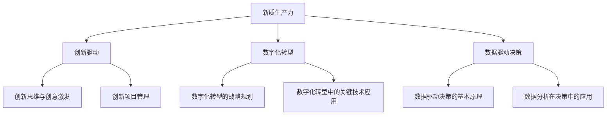

                 

### 文章标题

《核心竞争力提升的新质生产力策略》

在当今全球竞争激烈的经济环境中，企业如何提升自身的核心竞争力成为了一项至关重要的任务。本文将围绕这一主题，探讨新质生产力的概念、框架、核心策略以及实践案例，旨在为读者提供一套完整、详实的提升核心竞争力的策略指南。

### 关键词

- 新质生产力
- 创新驱动
- 数字化转型
- 数据驱动决策
- 企业核心竞争力

### 摘要

本文首先介绍了新质生产力的概念和核心特征，探讨了其与传统生产力的区别。接着，本文详细分析了新质生产力的核心概念，包括创新驱动、数字化转型和数据驱动决策。在此基础上，本文构建了新质生产力的框架体系，并提出了具体的实施策略。最后，通过实际案例和实践指导，本文展示了如何在新质生产力的指导下提升企业的核心竞争力。本文旨在为企业的管理层和技术人员提供具有操作性的指导和参考。

## 目录大纲

### 第一部分：新质生产力的概念与框架

- **第1章：新质生产力的定义与核心特征**
  - **1.1 新质生产力的起源与演变**
  - **1.2 新质生产力的核心特征**
  - **1.3 新质生产力与传统生产力的区别**

- **第2章：新质生产力的核心概念**
  - **2.1 创新驱动**
    - **2.1.1 创新的分类与特点**
    - **2.1.2 创新的生命周期管理**
  - **2.2 数字化转型**
    - **2.2.1 数字化转型的概念与步骤**
    - **2.2.2 数字化转型中的关键技术**
  - **2.3 数据驱动决策**
    - **2.3.1 数据驱动决策的基本原则**
    - **2.3.2 数据分析的基本方法**

- **第3章：新质生产力的框架体系**
  - **3.1 新质生产力的架构设计**
    - **3.1.1 新质生产力的五大要素**
    - **3.1.2 新质生产力的业务流程优化**
  - **3.2 新质生产力的实施策略**
    - **3.2.1 战略层面的策略规划**
    - **3.2.2 运营层面的策略实施**

### 第二部分：新质生产力的核心策略

- **第4章：创新驱动策略**
  - **4.1 创新思维与创意激发**
    - **4.1.1 创新思维的培养**
    - **4.1.2 创意激发的方法与工具**
  - **4.2 创新项目管理**
    - **4.2.1 创新项目的评估与筛选**
    - **4.2.2 创新项目的执行与监控**

- **第5章：数字化转型策略**
  - **5.1 数字化转型的战略规划**
    - **5.1.1 数字化转型的目标设定**
    - **5.1.2 数字化转型的路径选择**
  - **5.2 数字化转型中的关键技术应用**
    - **5.2.1 人工智能在数字化转型中的应用**
    - **5.2.2 大数据在数字化转型中的应用**

- **第6章：数据驱动决策策略**
  - **6.1 数据驱动决策的基本原理**
    - **6.1.1 数据驱动决策的核心要素**
    - **6.1.2 数据驱动决策的流程与方法**
  - **6.2 数据分析在决策中的应用**
    - **6.2.1 数据分析的基本工具与技术**
    - **6.2.2 数据分析在业务决策中的应用案例**

### 第三部分：新质生产力的案例与实践

- **第7章：综合策略实施与评估**
  - **7.1 综合策略的实施步骤**
    - **7.1.1 策略实施的总体框架**
    - **7.1.2 策略实施的关键环节**
  - **7.2 综合策略的评估与优化**
    - **7.2.1 策略评估的方法与工具**
    - **7.2.2 策略优化的实施路径**

- **第8章：新质生产力的成功案例**
  - **8.1 案例分析一：XX公司的创新驱动策略**
  - **8.2 案例分析二：YY公司的数字化转型**

- **第9章：新质生产力的实践指导**
  - **9.1 实践指导一：如何制定创新驱动策略**
  - **9.2 实践指导二：如何实施数字化转型**

### 第四部分：新质生产力的未来趋势与挑战

- **第10章：新质生产力的未来趋势**
  - **10.1 科技发展的推动**
  - **10.2 经济发展的驱动**

- **第11章：新质生产力的挑战与应对**
  - **11.1 技术发展的挑战**
  - **11.2 组织变革的挑战**

### 附录

- **附录A：新质生产力相关资源与工具**
- **附录B：参考文献与推荐阅读**

---

### 核心概念与联系图

---

### 核心算法原理讲解

#### 4.1 创新思维与创意激发

##### 4.1.1 创新思维的基本算法

创新思维是一种能够发现新问题、提出新观点、实现新解决方案的思维模式。其基本算法可以描述如下：

1. **确定问题**：明确需要解决的问题或改进的目标。
2. **收集信息**：通过调研、访谈、观察等方式获取与问题相关的信息。
3. **思维发散**：运用联想、类比、整合等方法，从不同角度分析问题，寻找潜在的解决方案。
4. **思维收敛**：在发散的基础上，对解决方案进行筛选和优化，确定最佳方案。
5. **实施与验证**：将解决方案应用于实际，进行验证和迭代优化。

##### 4.1.2 创意激发的方法与工具

创意激发是创新思维的核心步骤，以下是一些常用的创意激发方法和工具：

- **头脑风暴**：通过集体讨论，迅速生成大量创意。
- **思维导图**：利用图形化工具，帮助思考者从不同角度分析问题，发现新的关联。
- **情景模拟**：通过模拟现实情境，激发思考者的创意思维。
- **反转思维**：从相反的角度思考问题，寻找独特的解决方案。
- **六顶思考帽**：通过不同的思考角度，全面分析问题，避免思维定式。

---

#### 6.2 数据驱动决策策略

##### 6.2.1 数据驱动决策的核心数学模型

数据驱动决策的核心在于构建预测模型和优化模型，以下是一个简化的预测模型和优化模型：

**预测模型：**

$$
y = \theta_0 + \theta_1 x_1 + \theta_2 x_2 + ... + \theta_n x_n
$$

其中，$y$ 是预测结果，$\theta_0, \theta_1, ..., \theta_n$ 是模型的参数，$x_1, x_2, ..., x_n$ 是输入特征。

**优化模型：**

$$
\min_{\theta} J(\theta) = \frac{1}{2} \sum_{i=1}^{n} (y_i - (\theta_0 + \theta_1 x_{i1} + \theta_2 x_{i2} + ... + \theta_n x_{in}))^2
$$

其中，$J(\theta)$ 是损失函数，$\theta$ 是模型参数的集合。

##### 6.2.2 数学公式的详细讲解与举例说明

**预测模型讲解：**

预测模型是一个线性回归模型，它通过输入特征（$x_1, x_2, ..., x_n$）与参数（$\theta_0, \theta_1, ..., \theta_n$）的线性组合来预测结果（$y$）。这个模型的基本思想是通过学习历史数据，找到输入特征与预测结果之间的关系。

**举例说明：**

假设我们要预测一个电商平台的客户满意度，输入特征包括客户的年龄（$x_1$）、购买次数（$x_2$）和消费金额（$x_3$），预测结果为满意度评分（$y$）。我们可以通过收集大量历史数据，利用线性回归模型来预测客户的满意度评分。

**优化模型讲解：**

优化模型是用于调整模型参数，使得预测结果尽可能接近真实值。损失函数 $J(\theta)$ 用于衡量模型参数的误差，优化目标是最小化损失函数。

**举例说明：**

假设我们有一个训练数据集，包含客户的年龄、购买次数、消费金额和满意度评分。通过训练数据，我们可以计算出每个参数的初始值，然后通过迭代优化算法，不断调整参数，使得预测结果的误差最小。

---

### 核心算法原理讲解

#### 6.2 数据驱动决策策略

##### 6.2.1 数据驱动决策的核心数学模型

数据驱动决策的核心在于构建预测模型和优化模型。以下是一个简化的预测模型和优化模型：

**预测模型：**

$$
y = \theta_0 + \theta_1 x_1 + \theta_2 x_2 + ... + \theta_n x_n
$$

其中，$y$ 是预测结果，$\theta_0, \theta_1, ..., \theta_n$ 是模型的参数，$x_1, x_2, ..., x_n$ 是输入特征。

**优化模型：**

$$
\min_{\theta} J(\theta) = \frac{1}{2} \sum_{i=1}^{n} (y_i - (\theta_0 + \theta_1 x_{i1} + \theta_2 x_{i2} + ... + \theta_n x_{in}))^2
$$

其中，$J(\theta)$ 是损失函数，$\theta$ 是模型参数的集合。

##### 6.2.2 数学公式的详细讲解与举例说明

**预测模型讲解：**

预测模型是一个线性回归模型，它通过输入特征（$x_1, x_2, ..., x_n$）与参数（$\theta_0, \theta_1, ..., \theta_n$）的线性组合来预测结果（$y$）。这个模型的基本思想是通过学习历史数据，找到输入特征与预测结果之间的关系。

**举例说明：**

假设我们要预测一个电商平台的客户满意度，输入特征包括客户的年龄（$x_1$）、购买次数（$x_2$）和消费金额（$x_3$），预测结果为满意度评分（$y$）。我们可以通过收集大量历史数据，利用线性回归模型来预测客户的满意度评分。

**优化模型讲解：**

优化模型是用于调整模型参数，使得预测结果尽可能接近真实值。损失函数 $J(\theta)$ 用于衡量模型参数的误差，优化目标是最小化损失函数。

**举例说明：**

假设我们有一个训练数据集，包含客户的年龄、购买次数、消费金额和满意度评分。通过训练数据，我们可以计算出每个参数的初始值，然后通过迭代优化算法，不断调整参数，使得预测结果的误差最小。

---

### 项目实战

#### 9.2 实施数字化转型策略

##### 9.2.1 数字化转型中的项目案例

**案例背景：**

某传统制造企业希望通过数字化转型提升生产效率，降低成本，提高产品质量。企业计划引入工业互联网平台，实现生产线的数字化改造。

**项目实施步骤：**

1. **需求分析与规划：** 分析企业的生产流程，确定数字化转型的目标和需求，制定详细的实施计划。
2. **技术选型与平台搭建：** 选择合适的工业互联网平台，搭建数字化转型的技术架构，包括数据采集、数据存储、数据处理与分析等模块。
3. **系统集成与数据集成：** 将现有的生产设备与工业互联网平台进行集成，实现数据的自动采集和传输。
4. **数据分析与决策支持：** 利用数据分析工具，对采集到的数据进行分析，为企业决策提供支持。
5. **优化与迭代：** 根据数据分析结果，对生产流程进行优化，不断迭代和改进。

**代码实际案例与详细解释：**

**数据采集模块代码：**

python
import requests

def collect_data(url, headers):
    response = requests.get(url, headers=headers)
    if response.status_code == 200:
        data = response.json()
        # 处理和存储数据
        store_data(data)
    else:
        print("数据采集失败，状态码：", response.status_code)

def store_data(data):
    # 将数据存储到数据库
    pass

# 示例
collect_data("http://api.example.com/data", {"Authorization": "Bearer your_token"})

**数据处理与分析模块代码：**

python
import pandas as pd
from sklearn.model_selection import train_test_split
from sklearn.linear_model import LinearRegression

def process_data(data):
    # 数据预处理
    df = pd.DataFrame(data)
    # 特征工程
    df['total_sales'] = df['sales_a'] + df['sales_b']
    # 划分训练集和测试集
    X_train, X_test, y_train, y_test = train_test_split(df[['total_sales']], df['profit'], test_size=0.2, random_state=42)
    return X_train, X_test, y_train, y_test

def train_model(X_train, y_train):
    model = LinearRegression()
    model.fit(X_train, y_train)
    return model

def evaluate_model(model, X_test, y_test):
    y_pred = model.predict(X_test)
    print("模型预测的利润：", y_pred)
    print("模型实际利润：", y_test)

# 示例
data = [{"sales_a": 100, "sales_b": 200, "profit": 300}, {"sales_a": 150, "sales_b": 250, "profit": 350}]
X_train, X_test, y_train, y_test = process_data(data)
model = train_model(X_train, y_train)
evaluate_model(model, X_test, y_test)

**代码解读与分析：**

- **数据采集模块**：使用 requests 库发送 HTTP GET 请求，从 API 端点获取数据，并处理和存储数据。
- **数据处理与分析模块**：使用 pandas 库处理数据，进行数据预处理和特征工程，使用 sklearn 库进行线性回归模型的训练和评估。

---

### 附录

#### 附录A：新质生产力相关资源与工具

**A.1 新质生产力相关的书籍与论文**

1. 《创新者的窘境》—— 克里斯·兰迪
2. 《数字化转型》—— 多夫·赛瑟
3. 《大数据时代》—— 阿尔文·安德森
4. 《数据驱动决策》—— 迈克尔·卢因

**A.2 新质生产力相关的在线课程与培训**

1. Coursera 的《机器学习》
2. edX 的《大数据分析》
3. Udacity 的《数据科学纳米学位》

**A.3 新质生产力相关的工具与应用软件**

1. TensorFlow：一款开源的机器学习框架，适用于数据分析和模型训练。
2. PyTorch：一款流行的深度学习框架，提供灵活的模型构建和训练接口。
3. Power BI：一款数据可视化工具，用于数据分析和决策支持。
4. Tableau：一款强大的数据可视化工具，提供丰富的图表和交互功能。

#### 附录B：参考文献与推荐阅读

1. 《创新者之路》—— 斯图尔特·德布拉齐
2. 《数字化转型的陷阱》—— 托马斯·达文波特
3. 《数据驱动决策的误区》—— 托马斯·达文波特
4. 《人工智能：一种现代方法》—— 斯图尔特·罗素、彼得·诺维格

---

以上是《核心竞争力提升的新质生产力策略》的完整目录大纲，涵盖了新质生产力的定义、框架、核心策略以及实践案例，旨在为读者提供一套完整、详实的提升核心竞争力的策略指南。文章将通过逐步分析推理的方式，深入探讨新质生产力的各个维度，帮助读者更好地理解和应用这些策略。

---

**文章结束。感谢您的阅读。若您有任何疑问或建议，欢迎在评论区留言。**

**作者：AI天才研究院/AI Genius Institute & 禅与计算机程序设计艺术 /Zen And The Art of Computer Programming**

