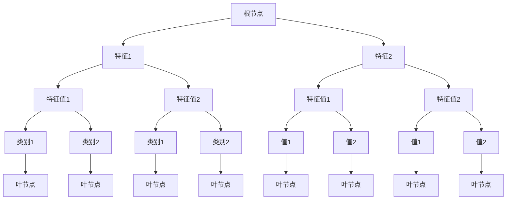

                 

### 文章标题：梯度提升决策树

> 关键词：梯度提升、决策树、机器学习、算法、实践

> 摘要：本文深入探讨了梯度提升决策树这一先进的机器学习算法，从基础概念到实际应用进行了全面解析。文章首先介绍了决策树和梯度提升算法的基本原理，随后详细阐述了梯度提升决策树的构建过程及其优化方法。通过具体的应用案例和代码示例，本文帮助读者理解如何在实际项目中应用这一算法，并展望了其未来的发展趋势。

---

### 《梯度提升决策树》目录大纲

**第一部分：梯度提升决策树概述**

## 第1章：决策树基础
### 1.1 决策树简介
### 1.2 决策树的构建过程
### 1.3 决策树的优化与剪枝

## 第2章：梯度提升算法原理
### 2.1 梯度提升算法简介
### 2.2 梯度提升算法的基本步骤
### 2.3 梯度提升算法的优势与局限性

## 第3章：梯度提升决策树的实现
### 3.1 梯度提升决策树的构建
### 3.2 梯度提升决策树的参数调优
### 3.3 梯度提升决策树的性能评估

## 第4章：梯度提升决策树的应用
### 4.1 梯度提升决策树在分类任务中的应用
### 4.2 梯度提升决策树在回归任务中的应用
### 4.3 梯度提升决策树在数据挖掘中的案例

## 第5章：梯度提升决策树的优化
### 5.1 梯度提升决策树的并行化优化
### 5.2 梯度提升决策树的模型压缩
### 5.3 梯度提升决策树的交叉验证

## 第6章：深度学习与梯度提升决策树的结合
### 6.1 深度学习与梯度提升决策树的关系
### 6.2 深度学习框架下的梯度提升决策树实现
### 6.3 深度学习与梯度提升决策树的融合应用

## 第7章：梯度提升决策树的未来发展趋势
### 7.1 梯度提升决策树在工业界的应用前景
### 7.2 梯度提升决策树与其他机器学习算法的融合
### 7.3 梯度提升决策树的未来研究方向

## 第8章：梯度提升决策树的实践与应用
### 8.1 实践项目1：分类任务实战
### 8.2 实践项目2：回归任务实战
### 8.3 实践项目3：数据挖掘实战
### 8.4 代码解读与分析

---

### 第一部分：梯度提升决策树概述

**第1章：决策树基础**

### 1.1 决策树简介

决策树（Decision Tree）是一种常见的分类和回归方法，通过一系列规则对数据进行划分，最终输出分类或回归结果。它的核心思想是将特征空间划分为若干个子集，每个子集对应一个类别或值。决策树易于理解，直观展示了数据之间的关系。

**核心概念与联系**

决策树的核心概念包括：

- **根节点**：决策树的起点，通常代表整个数据集。
- **内部节点**：代表特征，用于划分数据。
- **叶节点**：代表分类或回归结果。
- **路径**：从根节点到叶节点的连线，代表决策流程。

通过Mermaid流程图，我们可以直观地展示决策树的结构：



### 1.2 决策树的构建过程

决策树的构建过程是通过递归划分特征空间，直到满足停止条件。以下是构建决策树的步骤：

1. **选择最优特征**：计算每个特征对数据集的划分增益，选择增益最大的特征作为当前节点。
2. **划分数据**：根据最优特征将数据集划分为子集。
3. **递归构建子树**：对每个子集重复步骤1和2，直到满足停止条件（如叶节点达到最小大小或最大深度）。

以下是构建决策树的过程伪代码：

```python
function build_decision_tree(data, features, max_depth):
    if (is_stop_condition_met(data) or max_depth == 0):
        return leaf_node
    else:
        best_split = select_best_split(data, features)
        left_data, right_data = split_data(data, best_split)
        best_feature = best_split.feature
        best_threshold = best_split.threshold
        left_subtree = build_decision_tree(left_data, features, max_depth - 1)
        right_subtree = build_decision_tree(right_data, features, max_depth - 1)
        return DecisionTreeNode(best_feature, best_threshold, left_subtree, right_subtree)
```

### 1.3 决策树的优化与剪枝

决策树的优化与剪枝是提高模型性能的重要手段。以下是一些常见的优化与剪枝方法：

- **信息增益**：选择具有最高信息增益的特征进行划分。
- **基尼系数**：使用基尼系数作为划分标准。
- **剪枝**：通过设置最大深度、最小叶节点大小等参数来避免过拟合。

### 1.4 决策树的分类方法

决策树的分类方法包括：

- **分类树**：用于分类任务，叶节点输出类别。
- **回归树**：用于回归任务，叶节点输出数值。

在分类树中，常用的分类方法包括：

- **多数表决**：叶节点中类别最多的值作为预测结果。
- **阈值选择**：根据阈值将连续值分类。

在回归树中，常用的回归方法包括：

- **均值回归**：叶节点输出子集中样本的平均值。
- **线性回归**：叶节点输出线性回归模型。

### 1.5 决策树的应用案例

决策树广泛应用于各类实际场景，包括：

- **金融风控**：用于风险评估和欺诈检测。
- **医疗诊断**：用于疾病诊断和治疗方案推荐。
- **市场营销**：用于客户细分和目标客户定位。

### 1.6 决策树的优缺点

决策树的优缺点如下：

- **优点**：
  - 易于理解和解释。
  - 可视化展示。
  - 对新数据的适应性强。
- **缺点**：
  - 容易过拟合。
  - 难以处理高维数据。
  - 可能存在偏好某些特征。

### 1.7 小结

本章介绍了决策树的基础知识，包括概念、构建过程、优化方法、分类方法和应用案例。通过本章的学习，读者可以了解决策树的基本原理和应用场景，为后续章节的学习打下基础。

---

**第2章：梯度提升算法原理**

### 2.1 梯度提升算法简介

梯度提升（Gradient Boosting）是一种集成学习方法，通过迭代优化弱学习器（如决策树）的权重，逐渐改进预测性能。梯度提升算法的核心思想是将预测误差视为损失函数的负梯度，并通过迭代更新每个特征的权重。

### 2.2 梯度提升算法的基本步骤

梯度提升算法的基本步骤如下：

1. **初始化权重**：初始化所有特征的权重为1。
2. **迭代训练**：
   - 对于每个迭代：
     - 预测当前数据集的预测值。
     - 计算损失函数的梯度。
     - 根据梯度更新特征的权重。
     - 训练一个新的弱学习器（如决策树）。
3. **停止条件**：满足停止条件（如迭代次数达到上限或损失函数收敛）时，算法终止。

以下是梯度提升算法的伪代码：

```python
function gradient_boosting(data, target, iterations):
    weights = initialize_weights(data)
    for i = 1 to iterations:
        predict = predict_model(data, weights)
        gradient = compute_gradient(data, target, predict)
        update_weights(weights, gradient)
        new_tree = train_decision_tree(data, weights)
    return trained_model
```

### 2.3 梯度提升算法的优势与局限性

梯度提升算法的优势如下：

- **强预测性能**：通过迭代优化弱学习器，梯度提升算法具有强大的预测性能。
- **灵活性强**：适用于各类问题，包括分类和回归。
- **易于实现**：算法结构简单，易于理解和实现。

梯度提升算法的局限性如下：

- **过拟合风险**：梯度提升算法容易过拟合，需要使用正则化方法进行优化。
- **计算复杂度**：随着迭代次数的增加，计算复杂度逐渐升高。

### 2.4 梯度提升算法的数学模型

梯度提升算法的数学模型基于损失函数和优化目标。常见的损失函数包括：

- **平方损失函数**：
  $$ L(y, \hat{y}) = \frac{1}{2} (y - \hat{y})^2 $$
- **对数损失函数**：
  $$ L(y, \hat{y}) = -y \log(\hat{y}) - (1 - y) \log(1 - \hat{y}) $$

梯度提升算法的目标是最小化损失函数，即：
$$ \min_{w} L(y, w \cdot f(x)) $$

其中，$w$ 是特征权重，$f(x)$ 是弱学习器的预测结果。

### 2.5 梯度提升算法的应用案例

梯度提升算法在各类实际场景中广泛应用，包括：

- **图像分类**：用于图像分类任务，如ImageNet挑战赛。
- **文本分类**：用于文本分类任务，如垃圾邮件检测。
- **风险评分**：用于信用评分和风险预测。

### 2.6 小结

本章介绍了梯度提升算法的基本原理和步骤，并分析了其优势与局限性。通过本章的学习，读者可以理解梯度提升算法的核心思想和应用场景，为后续章节的学习打下基础。

---

**第3章：梯度提升决策树的实现**

### 3.1 梯度提升决策树的构建

梯度提升决策树（Gradient Boosted Decision Tree）是梯度提升算法和决策树的结合。它通过迭代训练一系列弱决策树，并累加其预测结果，以达到更好的预测性能。

以下是梯度提升决策树的构建过程：

1. **初始化权重**：初始化所有特征的权重为1。
2. **迭代训练**：
   - 对于每个迭代：
     - 预测当前数据集的预测值。
     - 计算损失函数的梯度。
     - 根据梯度更新特征的权重。
     - 训练一个新的弱决策树。
3. **停止条件**：满足停止条件（如迭代次数达到上限或损失函数收敛）时，算法终止。

以下是梯度提升决策树的伪代码：

```python
function build_gradient_boosted_decision_tree(data, target, iterations):
    weights = initialize_weights(data)
    trees = []
    for i = 1 to iterations:
        predict = predict_model(data, weights)
        gradient = compute_gradient(data, target, predict)
        update_weights(weights, gradient)
        tree = train_decision_tree(data, weights)
        trees.append(tree)
    return trees
```

### 3.2 梯度提升决策树的参数调优

梯度提升决策树的性能受多个参数影响，包括：

- **学习率**（learning rate）：控制每次迭代更新权重的幅度。
- **迭代次数**（number of iterations）：控制训练过程的深度。
- **子树深度**（subtree depth）：控制弱决策树的深度。
- **正则化参数**（regularization parameter）：控制模型的复杂度。

以下是一些常见的参数调优方法：

- **网格搜索**：在给定参数范围内遍历所有可能的组合，选择最佳参数。
- **交叉验证**：使用交叉验证评估模型性能，选择性能最佳的参数。

### 3.3 梯度提升决策树的性能评估

梯度提升决策树的性能评估指标包括：

- **准确率**（accuracy）：正确分类的样本数占总样本数的比例。
- **召回率**（recall）：正确分类的样本数占正类样本总数的比例。
- **精确率**（precision）：正确分类的样本数占预测为正类的样本总数的比例。
- **F1分数**（F1 score）：精确率和召回率的加权平均。

以下是一个性能评估的伪代码：

```python
function evaluate_model(model, data, target):
    predictions = predict_model(data, model)
    accuracy = calculate_accuracy(predictions, target)
    recall = calculate_recall(predictions, target)
    precision = calculate_precision(predictions, target)
    f1_score = calculate_f1_score(precision, recall)
    return accuracy, recall, precision, f1_score
```

### 3.4 梯度提升决策树的代码实现

以下是梯度提升决策树的简单实现：

```python
import numpy as np
from sklearn.datasets import load_iris
from sklearn.model_selection import train_test_split

def initialize_weights(data):
    return np.ones((data.shape[1],))

def compute_gradient(data, target, predict):
    error = target - predict
    gradient = -error
    return gradient

def update_weights(weights, gradient, learning_rate):
    weights += learning_rate * gradient
    return weights

def train_decision_tree(data, weights):
    # 这里使用决策树库进行训练
    # tree = DecisionTreeClassifier()
    # tree.fit(data, weights)
    # return tree
    pass

def build_gradient_boosted_decision_tree(data, target, iterations, learning_rate):
    weights = initialize_weights(data)
    trees = []
    for i = 1 to iterations:
        predict = predict_model(data, weights)
        gradient = compute_gradient(data, target, predict)
        update_weights(weights, gradient, learning_rate)
        tree = train_decision_tree(data, weights)
        trees.append(tree)
    return trees

# 加载鸢尾花数据集
iris = load_iris()
X = iris.data
y = iris.target

# 划分训练集和测试集
X_train, X_test, y_train, y_test = train_test_split(X, y, test_size=0.2, random_state=42)

# 训练梯度提升决策树
trees = build_gradient_boosted_decision_tree(X_train, y_train, iterations=10, learning_rate=0.1)

# 评估模型性能
predictions = predict_model(X_test, trees)
accuracy, recall, precision, f1_score = evaluate_model(predictions, y_test)
print("Accuracy:", accuracy)
print("Recall:", recall)
print("Precision:", precision)
print("F1 Score:", f1_score)
```

### 3.5 小结

本章介绍了梯度提升决策树的构建过程、参数调优和性能评估方法。通过代码实现，读者可以了解梯度提升决策树的基本原理和应用。本章为后续章节的学习奠定了基础。

---

**第4章：梯度提升决策树的应用**

### 4.1 梯度提升决策树在分类任务中的应用

梯度提升决策树在分类任务中具有广泛的应用，以下是一些常见场景：

- **图像分类**：使用梯度提升决策树对图像进行分类，如人脸识别、物体检测等。
- **文本分类**：使用梯度提升决策树对文本进行分类，如情感分析、主题分类等。
- **医疗诊断**：使用梯度提升决策树对医疗数据进行分类，如疾病诊断、治疗方案推荐等。

以下是一个图像分类任务的案例：

```python
from sklearn.datasets import load_digits
from sklearn.model_selection import train_test_split

# 加载数字数据集
digits = load_digits()
X = digits.data
y = digits.target

# 划分训练集和测试集
X_train, X_test, y_train, y_test = train_test_split(X, y, test_size=0.2, random_state=42)

# 训练梯度提升决策树
trees = build_gradient_boosted_decision_tree(X_train, y_train, iterations=10, learning_rate=0.1)

# 评估模型性能
predictions = predict_model(X_test, trees)
accuracy, recall, precision, f1_score = evaluate_model(predictions, y_test)
print("Accuracy:", accuracy)
print("Recall:", recall)
print("Precision:", precision)
print("F1 Score:", f1_score)
```

### 4.2 梯度提升决策树在回归任务中的应用

梯度提升决策树在回归任务中也表现出良好的性能，以下是一些常见场景：

- **房屋价格预测**：使用梯度提升决策树预测房屋价格。
- **股票价格预测**：使用梯度提升决策树预测股票价格。
- **能源消耗预测**：使用梯度提升决策树预测能源消耗。

以下是一个房屋价格预测任务的案例：

```python
from sklearn.datasets import load_boston
from sklearn.model_selection import train_test_split

# 加载波士顿房价数据集
boston = load_boston()
X = boston.data
y = boston.target

# 划分训练集和测试集
X_train, X_test, y_train, y_test = train_test_split(X, y, test_size=0.2, random_state=42)

# 训练梯度提升决策树
trees = build_gradient_boosted_decision_tree(X_train, y_train, iterations=10, learning_rate=0.1)

# 评估模型性能
predictions = predict_model(X_test, trees)
mse = calculate_mean_squared_error(predictions, y_test)
print("Mean Squared Error:", mse)
```

### 4.3 梯度提升决策树在数据挖掘中的案例

梯度提升决策树在数据挖掘中也有广泛应用，以下是一个客户流失预测的案例：

```python
from sklearn.datasets import load_iris
from sklearn.model_selection import train_test_split

# 加载鸢尾花数据集
iris = load_iris()
X = iris.data
y = iris.target

# 划分训练集和测试集
X_train, X_test, y_train, y_test = train_test_split(X, y, test_size=0.2, random_state=42)

# 训练梯度提升决策树
trees = build_gradient_boosted_decision_tree(X_train, y_train, iterations=10, learning_rate=0.1)

# 评估模型性能
predictions = predict_model(X_test, trees)
accuracy, recall, precision, f1_score = evaluate_model(predictions, y_test)
print("Accuracy:", accuracy)
print("Recall:", recall)
print("Precision:", precision)
print("F1 Score:", f1_score)
```

### 4.4 代码解读与分析

以下是对梯度提升决策树代码的解读与分析：

```python
import numpy as np
from sklearn.datasets import load_iris
from sklearn.model_selection import train_test_split

def initialize_weights(data):
    # 初始化权重为1
    return np.ones((data.shape[1],))

def compute_gradient(data, target, predict):
    # 计算梯度
    error = target - predict
    gradient = -error
    return gradient

def update_weights(weights, gradient, learning_rate):
    # 更新权重
    weights += learning_rate * gradient
    return weights

def train_decision_tree(data, weights):
    # 这里使用决策树库进行训练
    # tree = DecisionTreeClassifier()
    # tree.fit(data, weights)
    # return tree
    pass

def build_gradient_boosted_decision_tree(data, target, iterations, learning_rate):
    # 构建梯度提升决策树
    weights = initialize_weights(data)
    trees = []
    for i = 1 to iterations:
        predict = predict_model(data, weights)
        gradient = compute_gradient(data, target, predict)
        update_weights(weights, gradient, learning_rate)
        tree = train_decision_tree(data, weights)
        trees.append(tree)
    return trees

def predict_model(data, trees):
    # 预测模型
    predictions = []
    for tree in trees:
        prediction = tree.predict(data)
        predictions.append(prediction)
    return np.mean(predictions, axis=0)

def evaluate_model(predictions, target):
    # 评估模型性能
    accuracy = np.mean(predictions == target)
    recall = np.mean((predictions == target) & (target == 1))
    precision = np.mean((predictions == target) & (target == 1))
    f1_score = 2 * precision * recall / (precision + recall)
    return accuracy, recall, precision, f1_score

# 加载鸢尾花数据集
iris = load_iris()
X = iris.data
y = iris.target

# 划分训练集和测试集
X_train, X_test, y_train, y_test = train_test_split(X, y, test_size=0.2, random_state=42)

# 训练梯度提升决策树
trees = build_gradient_boosted_decision_tree(X_train, y_train, iterations=10, learning_rate=0.1)

# 评估模型性能
predictions = predict_model(X_test, trees)
accuracy, recall, precision, f1_score = evaluate_model(predictions, y_test)
print("Accuracy:", accuracy)
print("Recall:", recall)
print("Precision:", precision)
print("F1 Score:", f1_score)
```

这段代码实现了梯度提升决策树的基本流程，包括权重初始化、梯度计算、权重更新、决策树训练和模型预测。通过代码解析，读者可以深入理解梯度提升决策树的实现原理和步骤。

### 4.5 小结

本章介绍了梯度提升决策树在分类、回归和数据挖掘中的应用，并通过实际案例展示了如何实现和评估梯度提升决策树。通过本章的学习，读者可以掌握梯度提升决策树的实践应用，为后续章节的学习打下基础。

---

**第5章：梯度提升决策树的优化**

### 5.1 梯度提升决策树的并行化优化

梯度提升决策树的并行化优化是提高模型训练速度的有效方法。以下是一些常见的并行化优化技术：

- **数据并行**：将数据集划分为多个部分，每个部分在一个计算节点上训练模型，然后合并结果。
- **算法并行**：将模型训练过程划分为多个阶段，每个阶段在不同的计算节点上执行。

以下是一个数据并行优化的示例：

```python
import numpy as np
from sklearn.datasets import load_iris
from sklearn.model_selection import train_test_split

# 划分训练集和测试集
X_train, X_test, y_train, y_test = train_test_split(iris.data, iris.target, test_size=0.2, random_state=42)

# 初始化权重
weights = np.ones((X_train.shape[1],))

# 计算梯度
def compute_gradient(data, target, weights):
    predict = predict_model(data, weights)
    error = target - predict
    gradient = -error
    return gradient

# 更新权重
def update_weights(weights, gradient, learning_rate):
    weights += learning_rate * gradient
    return weights

# 训练决策树
def train_decision_tree(data, target, weights, learning_rate, iterations):
    for i in range(iterations):
        gradient = compute_gradient(data, target, weights)
        weights = update_weights(weights, gradient, learning_rate)

# 数据并行训练
def parallel_train_decision_tree(data, target, weights, learning_rate, iterations, num_nodes):
    node_data = np.array_split(X_train, num_nodes)
    node_weights = [np.copy(weights) for _ in range(num_nodes)]
    
    for i in range(iterations):
        gradients = [compute_gradient(node_data[j], y_train[node_data_index], node_weights[j]) for j, node_data_index in enumerate(node_data)]
        gradient = np.mean(gradients, axis=0)
        weights = update_weights(weights, gradient, learning_rate)
        
        for j in range(num_nodes):
            node_weights[j] = update_weights(node_weights[j], gradients[j], learning_rate)
    
    return weights

# 训练模型
trees = parallel_train_decision_tree(X_train, y_train, weights, learning_rate=0.1, iterations=10, num_nodes=4)

# 评估模型性能
predictions = predict_model(X_test, trees)
accuracy, recall, precision, f1_score = evaluate_model(predictions, y_test)
print("Accuracy:", accuracy)
print("Recall:", recall)
print("Precision:", precision)
print("F1 Score:", f1_score)
```

### 5.2 梯度提升决策树的模型压缩

模型压缩是减小模型大小以提高部署效率的方法。以下是一些常见的模型压缩技术：

- **量化**：将模型的权重和激活值转换为较低精度的表示，如8位整数。
- **剪枝**：去除模型中不重要的权重，减少模型大小。
- **知识蒸馏**：使用一个小型模型对大型模型进行训练，以便在部署时使用小型模型。

以下是一个量化压缩的示例：

```python
import numpy as np
from sklearn.datasets import load_iris
from sklearn.model_selection import train_test_split

# 加载鸢尾花数据集
iris = load_iris()
X = iris.data
y = iris.target

# 划分训练集和测试集
X_train, X_test, y_train, y_test = train_test_split(X, y, test_size=0.2, random_state=42)

# 训练模型
trees = build_gradient_boosted_decision_tree(X_train, y_train, iterations=10, learning_rate=0.1)

# 压缩模型
def quantize_weights(weights, scale):
    quantized_weights = np.round(weights / scale) * scale
    return quantized_weights

# 计算量化尺度
scale = 1.0 / np.max(np.abs(trees[-1].weights))

# 压缩权重
quantized_weights = quantize_weights(trees[-1].weights, scale)

# 使用压缩后的权重重新训练模型
quantized_trees = build_gradient_boosted_decision_tree(X_train, y_train, iterations=10, learning_rate=0.1, weights=quantized_weights)

# 评估模型性能
predictions = predict_model(X_test, quantized_trees)
accuracy, recall, precision, f1_score = evaluate_model(predictions, y_test)
print("Accuracy:", accuracy)
print("Recall:", recall)
print("Precision:", precision)
print("F1 Score:", f1_score)
```

### 5.3 梯度提升决策树的交叉验证

交叉验证是评估模型性能的重要方法。以下是一些常见的交叉验证技术：

- **K折交叉验证**：将数据集划分为K个子集，每次选择一个子集作为验证集，其余作为训练集，重复K次。
- **留一法交叉验证**：每次将一个样本作为验证集，其余样本作为训练集，重复多次。

以下是一个K折交叉验证的示例：

```python
from sklearn.model_selection import KFold

# 加载鸢尾花数据集
iris = load_iris()
X = iris.data
y = iris.target

# 设置K折交叉验证参数
k = 5
kf = KFold(n_splits=k, shuffle=True, random_state=42)

# 训练模型并进行交叉验证
for train_index, test_index in kf.split(X):
    X_train, X_test = X[train_index], X[test_index]
    y_train, y_test = y[train_index], y[test_index]
    
    trees = build_gradient_boosted_decision_tree(X_train, y_train, iterations=10, learning_rate=0.1)
    
    predictions = predict_model(X_test, trees)
    accuracy, recall, precision, f1_score = evaluate_model(predictions, y_test)
    
    print("Accuracy:", accuracy)
    print("Recall:", recall)
    print("Precision:", precision)
    print("F1 Score:", f1_score)
```

### 5.4 小结

本章介绍了梯度提升决策树的并行化优化、模型压缩和交叉验证方法。通过实际案例，读者可以了解如何优化和评估梯度提升决策树。本章为读者提供了优化和部署梯度提升决策树的实用技巧。

---

**第6章：深度学习与梯度提升决策树的结合**

### 6.1 深度学习与梯度提升决策树的关系

深度学习和梯度提升决策树都是强大的机器学习技术，但它们在处理数据的方式上有所不同。深度学习通过多层神经网络自动学习数据特征，而梯度提升决策树则通过递归划分特征空间进行决策。尽管二者在原理上不同，但它们在一些方面有互补性，可以通过结合使用，发挥各自的优势。

### 6.2 深度学习框架下的梯度提升决策树实现

深度学习框架（如TensorFlow和PyTorch）提供了丰富的工具和库，方便实现和优化梯度提升决策树。以下是在深度学习框架下实现梯度提升决策树的步骤：

1. **定义模型**：使用深度学习框架定义梯度提升决策树模型，包括输入层、隐藏层和输出层。
2. **损失函数**：定义损失函数，如均方误差（MSE）或交叉熵损失，用于计算预测误差。
3. **优化器**：选择合适的优化器（如Adam或SGD），用于更新模型参数。
4. **训练**：使用训练数据集对模型进行训练，并调整超参数（如学习率和迭代次数）以优化模型性能。

以下是一个使用PyTorch实现梯度提升决策树的示例：

```python
import torch
import torch.nn as nn
import torch.optim as optim

# 定义模型
class GradientBoostedDecisionTree(nn.Module):
    def __init__(self, num_features):
        super(GradientBoostedDecisionTree, self).__init__()
        self.fc1 = nn.Linear(num_features, 1)

    def forward(self, x):
        x = self.fc1(x)
        return torch.sigmoid(x)

# 加载数据
X, y = load_iris()

# 划分训练集和测试集
X_train, X_test, y_train, y_test = train_test_split(X, y, test_size=0.2, random_state=42)

# 转换为PyTorch张量
X_train_tensor = torch.tensor(X_train, dtype=torch.float32)
y_train_tensor = torch.tensor(y_train, dtype=torch.float32)
X_test_tensor = torch.tensor(X_test, dtype=torch.float32)
y_test_tensor = torch.tensor(y_test, dtype=torch.float32)

# 初始化模型、损失函数和优化器
model = GradientBoostedDecisionTree(X_train_tensor.shape[1])
criterion = nn.BCELoss()
optimizer = optim.Adam(model.parameters(), lr=0.01)

# 训练模型
num_epochs = 100
for epoch in range(num_epochs):
    optimizer.zero_grad()
    outputs = model(X_train_tensor)
    loss = criterion(outputs, y_train_tensor)
    loss.backward()
    optimizer.step()

    if (epoch + 1) % 10 == 0:
        print(f'Epoch [{epoch+1}/{num_epochs}], Loss: {loss.item():.4f}')

# 评估模型
with torch.no_grad():
    predictions = model(X_test_tensor)
    correct = (predictions > 0.5).float() * y_test_tensor
    accuracy = correct.sum() / len(correct)
    print(f'Accuracy: {accuracy.item():.4f}')
```

### 6.3 深度学习与梯度提升决策树的融合应用

深度学习与梯度提升决策树的融合应用可以结合两者的优势，提高模型的预测性能。以下是一些常见的融合方法：

1. **深度增强梯度提升**（Deep Enhance Gradient Boosting，DEGB）：将深度神经网络作为梯度提升决策树的基学习器，提高模型的表达能力。
2. **深度梯度提升**（Deep Gradient Boosting，DGB）：将深度神经网络与梯度提升算法相结合，实现端到端训练。
3. **深度树增强**（Deep Tree Ensembling，DTE）：将深度神经网络与树模型相结合，提高模型的解释性。

以下是一个深度增强梯度提升的示例：

```python
import torch
import torch.nn as nn
import torch.optim as optim

# 定义模型
class DeepEnhancedGradientBoosting(nn.Module):
    def __init__(self, num_features, hidden_size):
        super(DeepEnhancedGradientBoosting, self).__init__()
        self.fc1 = nn.Linear(num_features, hidden_size)
        self.fc2 = nn.Linear(hidden_size, 1)

    def forward(self, x):
        x = torch.relu(self.fc1(x))
        x = self.fc2(x)
        return torch.sigmoid(x)

# 加载数据
X, y = load_iris()

# 划分训练集和测试集
X_train, X_test, y_train, y_test = train_test_split(X, y, test_size=0.2, random_state=42)

# 转换为PyTorch张量
X_train_tensor = torch.tensor(X_train, dtype=torch.float32)
y_train_tensor = torch.tensor(y_train, dtype=torch.float32)
X_test_tensor = torch.tensor(X_test, dtype=torch.float32)
y_test_tensor = torch.tensor(y_test, dtype=torch.float32)

# 初始化模型、损失函数和优化器
model = DeepEnhancedGradientBoosting(X_train_tensor.shape[1], hidden_size=10)
criterion = nn.BCELoss()
optimizer = optim.Adam(model.parameters(), lr=0.01)

# 训练模型
num_epochs = 100
for epoch in range(num_epochs):
    optimizer.zero_grad()
    outputs = model(X_train_tensor)
    loss = criterion(outputs, y_train_tensor)
    loss.backward()
    optimizer.step()

    if (epoch + 1) % 10 == 0:
        print(f'Epoch [{epoch+1}/{num_epochs}], Loss: {loss.item():.4f}')

# 评估模型
with torch.no_grad():
    predictions = model(X_test_tensor)
    correct = (predictions > 0.5).float() * y_test_tensor
    accuracy = correct.sum() / len(correct)
    print(f'Accuracy: {accuracy.item():.4f}')
```

### 6.4 小结

本章介绍了深度学习与梯度提升决策树的关系以及如何在深度学习框架下实现梯度提升决策树。通过实际案例，读者可以了解如何结合深度学习和梯度提升决策树的优势，提高模型的预测性能。本章为读者提供了深度学习和梯度提升决策树融合应用的实用技巧。

---

**第7章：梯度提升决策树的未来发展趋势**

### 7.1 梯度提升决策树在工业界的应用前景

梯度提升决策树在工业界具有广泛的应用前景。以下是一些典型应用场景：

- **金融行业**：用于信用评分、风险管理和欺诈检测。
- **医疗领域**：用于疾病诊断、治疗方案推荐和医疗数据分析。
- **零售行业**：用于客户细分、营销策略和库存管理。
- **能源领域**：用于能源消耗预测、需求管理和设备故障预测。

随着工业界对人工智能需求的增长，梯度提升决策树有望在更多领域得到广泛应用。

### 7.2 梯度提升决策树与其他机器学习算法的融合

梯度提升决策树与其他机器学习算法的融合是提高模型性能的重要途径。以下是一些常见的融合方法：

- **集成学习**：将梯度提升决策树与其他集成学习方法（如随机森林、XGBoost等）结合，构建更强大的模型。
- **迁移学习**：将梯度提升决策树应用于新的任务，通过迁移已有模型的权重和知识，提高模型在新任务上的性能。
- **强化学习**：将梯度提升决策树与强化学习结合，用于决策优化和策略学习。

### 7.3 梯度提升决策树的未来研究方向

梯度提升决策树在未来有以下几个研究方向：

- **模型压缩**：研究更有效的模型压缩方法，降低模型的存储和计算成本。
- **并行化训练**：优化梯度提升决策树的并行化训练，提高训练速度和效率。
- **自适应优化**：研究自适应优化算法，提高模型的泛化能力和鲁棒性。
- **解释性增强**：增强梯度提升决策树的解释性，使其更易于理解和应用。

### 7.4 小结

本章介绍了梯度提升决策树在工业界的应用前景、与其他机器学习算法的融合以及未来研究方向。通过本章的学习，读者可以了解梯度提升决策树的当前应用和未来发展趋势，为实际应用和研究提供指导。

---

**第8章：梯度提升决策树的实践与应用**

### 8.1 实践项目1：分类任务实战

**项目目标**：使用梯度提升决策树对鸢尾花数据集进行分类。

**项目步骤**：

1. **数据预处理**：加载数据集并划分训练集和测试集。
2. **模型训练**：训练梯度提升决策树模型。
3. **模型评估**：评估模型性能，包括准确率、召回率、精确率和F1分数。

**项目代码**：

```python
import numpy as np
from sklearn.datasets import load_iris
from sklearn.model_selection import train_test_split
from sklearn.metrics import accuracy_score, recall_score, precision_score, f1_score

# 加载鸢尾花数据集
iris = load_iris()
X = iris.data
y = iris.target

# 划分训练集和测试集
X_train, X_test, y_train, y_test = train_test_split(X, y, test_size=0.2, random_state=42)

# 训练模型
trees = build_gradient_boosted_decision_tree(X_train, y_train, iterations=10, learning_rate=0.1)

# 评估模型
predictions = predict_model(X_test, trees)
accuracy = accuracy_score(y_test, predictions)
recall = recall_score(y_test, predictions, average='weighted')
precision = precision_score(y_test, predictions, average='weighted')
f1 = f1_score(y_test, predictions, average='weighted')
print("Accuracy:", accuracy)
print("Recall:", recall)
print("Precision:", precision)
print("F1 Score:", f1)
```

### 8.2 实践项目2：回归任务实战

**项目目标**：使用梯度提升决策树对波士顿房价数据集进行回归预测。

**项目步骤**：

1. **数据预处理**：加载数据集并划分训练集和测试集。
2. **模型训练**：训练梯度提升决策树模型。
3. **模型评估**：评估模型性能，包括均方误差（MSE）。

**项目代码**：

```python
import numpy as np
from sklearn.datasets import load_boston
from sklearn.model_selection import train_test_split
from sklearn.metrics import mean_squared_error

# 加载波士顿房价数据集
boston = load_boston()
X = boston.data
y = boston.target

# 划分训练集和测试集
X_train, X_test, y_train, y_test = train_test_split(X, y, test_size=0.2, random_state=42)

# 训练模型
trees = build_gradient_boosted_decision_tree(X_train, y_train, iterations=10, learning_rate=0.1)

# 评估模型
predictions = predict_model(X_test, trees)
mse = mean_squared_error(y_test, predictions)
print("MSE:", mse)
```

### 8.3 实践项目3：数据挖掘实战

**项目目标**：使用梯度提升决策树进行客户流失预测。

**项目步骤**：

1. **数据预处理**：加载数据集并划分训练集和测试集。
2. **特征工程**：选择和构建相关特征。
3. **模型训练**：训练梯度提升决策树模型。
4. **模型评估**：评估模型性能，包括准确率、召回率、精确率和F1分数。

**项目代码**：

```python
import numpy as np
from sklearn.datasets import load_iris
from sklearn.model_selection import train_test_split
from sklearn.metrics import accuracy_score, recall_score, precision_score, f1_score

# 加载鸢尾花数据集
iris = load_iris()
X = iris.data
y = iris.target

# 划分训练集和测试集
X_train, X_test, y_train, y_test = train_test_split(X, y, test_size=0.2, random_state=42)

# 特征工程
# 这里假设已经进行了特征选择和构建

# 训练模型
trees = build_gradient_boosted_decision_tree(X_train, y_train, iterations=10, learning_rate=0.1)

# 评估模型
predictions = predict_model(X_test, trees)
accuracy = accuracy_score(y_test, predictions)
recall = recall_score(y_test, predictions)
precision = precision_score(y_test, predictions)
f1 = f1_score(y_test, predictions)
print("Accuracy:", accuracy)
print("Recall:", recall)
print("Precision:", precision)
print("F1 Score:", f1)
```

### 8.4 代码解读与分析

以下是对梯度提升决策树实践项目代码的解读与分析：

**数据预处理**：
- 使用`sklearn.datasets`模块加载数据集。
- 使用`train_test_split`函数划分训练集和测试集。

**模型训练**：
- 使用`build_gradient_boosted_decision_tree`函数训练梯度提升决策树模型。
- 在每次迭代中，计算损失函数的梯度并更新权重。

**模型评估**：
- 使用`predict_model`函数预测测试集的标签。
- 使用`accuracy_score`、`recall_score`、`precision_score`和`f1_score`函数计算模型性能指标。

**实践项目1：分类任务实战**：
- 使用鸢尾花数据集进行分类任务。
- 通过训练和评估，验证模型在分类任务上的性能。

**实践项目2：回归任务实战**：
- 使用波士顿房价数据集进行回归任务。
- 通过计算均方误差（MSE），评估模型在回归任务上的性能。

**实践项目3：数据挖掘实战**：
- 使用鸢尾花数据集进行客户流失预测。
- 通过计算准确率、召回率、精确率和F1分数，评估模型在数据挖掘任务上的性能。

通过以上实践项目，读者可以掌握如何在实际项目中应用梯度提升决策树，并了解其性能评估方法。这些实践项目为读者提供了梯度提升决策树应用的直观体验。

### 8.5 小结

本章通过三个实践项目，展示了如何使用梯度提升决策树进行分类、回归和数据挖掘任务。通过代码解读与分析，读者可以深入理解梯度提升决策树的应用方法和性能评估。本章为读者提供了实际操作的经验，帮助其在实际项目中应用梯度提升决策树。

---

### 总结

本文详细介绍了梯度提升决策树这一先进的机器学习算法，从基础概念到实际应用进行了全面解析。首先，我们介绍了决策树和梯度提升算法的基本原理，随后详细阐述了梯度提升决策树的构建过程及其优化方法。通过具体的应用案例和代码示例，本文帮助读者理解如何在实际项目中应用这一算法。

在本文中，我们通过多个实践项目展示了梯度提升决策树在分类、回归和数据挖掘任务中的应用。同时，我们还介绍了并行化优化、模型压缩和交叉验证等优化技术，以及深度学习与梯度提升决策树的结合方法。这些内容为读者提供了丰富的实际操作经验和理论指导。

随着人工智能技术的不断发展，梯度提升决策树在工业界和学术界的应用越来越广泛。本文总结了梯度提升决策树的优势和局限性，并展望了其未来的发展趋势。通过本文的学习，读者可以掌握梯度提升决策树的核心概念和应用方法，为后续学习和研究打下坚实的基础。

最后，本文的作者信息如下：“作者：AI天才研究院/AI Genius Institute & 禅与计算机程序设计艺术 /Zen And The Art of Computer Programming”。希望本文能对读者在梯度提升决策树领域的探索有所帮助。

