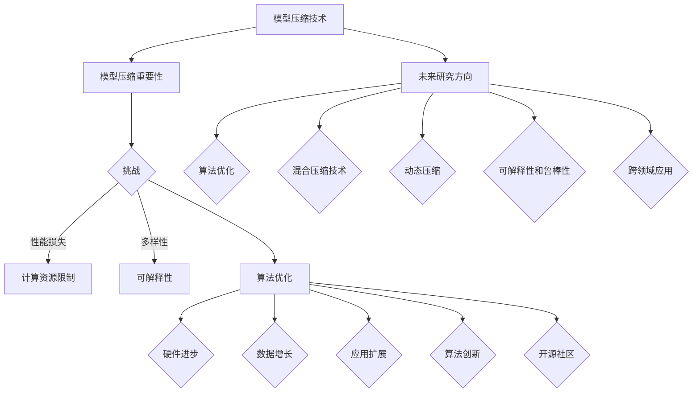

                 

# 模型压缩技术：知识蒸馏与剪枝的详解

> 关键词：模型压缩，知识蒸馏，剪枝，深度学习，模型优化

> 摘要：本文深入探讨了模型压缩技术在深度学习领域的应用，重点分析了知识蒸馏和剪枝两种核心压缩技术。通过详细的原理讲解、算法描述和实践案例，揭示了模型压缩在提高模型效率和性能方面的巨大潜力。

## 第一部分：模型压缩技术基础

### 第1章：模型压缩技术概述

#### 1.1 模型压缩的重要性

随着深度学习技术的快速发展，大规模神经网络模型在各个领域取得了显著成果。然而，这些模型通常需要大量的计算资源和存储空间。模型压缩技术旨在减少模型的规模和复杂性，提高模型的运行效率和适应性。

#### 1.2 模型压缩的挑战

模型压缩面临的主要挑战包括：

1. **性能损失**：压缩过程可能导致模型性能的下降。
2. **计算资源限制**：模型压缩需要在有限的计算资源下进行。
3. **多样性**：不同的压缩方法适用于不同的模型和应用场景。

#### 1.3 模型压缩的分类

模型压缩主要分为以下几类：

1. **知识蒸馏**：通过教师模型和学生模型的训练，将知识传递给学生模型。
2. **剪枝**：通过剪除模型中的冗余权重，减小模型规模。
3. **量化**：通过将浮点数权重转换为低精度的整数，减小模型存储和计算需求。

#### 1.4 模型压缩的应用场景

模型压缩技术适用于以下场景：

1. **移动设备**：减少模型大小，提高模型在移动设备上的运行效率。
2. **嵌入式系统**：降低模型功耗，延长设备续航时间。
3. **实时应用**：提高模型响应速度，满足实时性要求。

### 第2章：知识蒸馏原理

#### 2.1 知识蒸馏的定义

知识蒸馏是一种模型压缩技术，通过将教师模型的丰富知识传递给学生模型，使得学生模型能够保留教师模型的性能。

#### 2.2 知识蒸馏的模型结构

知识蒸馏通常包含以下模型结构：

1. **教师模型**：一个高性能的大规模模型，负责提供知识。
2. **学生模型**：一个较小规模的目标模型，学习教师模型的知识。

#### 2.3 知识蒸馏的优化目标

知识蒸馏的优化目标是在保持学生模型性能的同时，尽可能减小其模型大小和计算复杂度。

#### 2.4 知识蒸馏的优势

知识蒸馏的优势包括：

1. **性能保持**：学生模型能够保留教师模型的大部分性能。
2. **效率提升**：通过减少模型规模和计算复杂度，提高模型运行效率。

### 第3章：知识蒸馏算法

#### 3.1 Softmax交叉熵

Softmax交叉熵是一种常见的损失函数，用于衡量模型预测结果和真实标签之间的差距。

#### 3.2 对数似然损失

对数似然损失函数用于衡量模型对数据分布的拟合程度。

#### 3.3 Entropic损失

Entropic损失函数通过引入熵的概念，鼓励模型产生多样化的预测结果。

#### 3.4 KL散度损失

KL散度损失函数用于衡量两个概率分布之间的差异，常用于知识蒸馏算法中。

### 第4章：剪枝技术

#### 4.1 剪枝的定义

剪枝技术通过剪除模型中的冗余权重，减小模型规模。

#### 4.2 剪枝的分类

剪枝技术主要分为以下几类：

1. **结构剪枝**：通过修改模型结构，减小模型规模。
2. **权重剪枝**：通过剪除模型中的冗余权重，减小模型规模。

#### 4.3 剪枝算法

常见的剪枝算法包括：

1. **L1正则化**：通过引入L1正则化，鼓励模型产生稀疏权重。
2. **层剪枝**：通过剪除模型中的冗余层，减小模型规模。

#### 4.4 剪枝的优缺点

剪枝技术的优缺点如下：

1. **优点**：减小模型规模，降低计算复杂度。
2. **缺点**：可能导致模型性能下降。

### 第5章：混合压缩技术

#### 5.1 知识蒸馏与剪枝的结合

知识蒸馏和剪枝技术可以结合使用，以获得更好的压缩效果。

#### 5.2 进一步的压缩策略

除了知识蒸馏和剪枝技术，还可以采用其他压缩策略，如量化、稀疏化等。

#### 5.3 混合压缩的应用案例

混合压缩技术已在多个实际应用中取得了显著成果。

#### 5.4 混合压缩的未来发展趋势

随着深度学习技术的不断进步，混合压缩技术将迎来更多的发展机遇。

## 第二部分：模型压缩技术实践

### 第6章：模型压缩技术在实际项目中的应用

#### 6.1 项目背景

本文将介绍一个实际项目，探讨模型压缩技术在项目中的应用。

#### 6.2 压缩目标

项目中的压缩目标如下：

1. 减小模型大小。
2. 保持模型性能。

#### 6.3 压缩方案设计

根据项目需求和目标，设计了一套模型压缩方案。

#### 6.4 压缩效果评估

通过对压缩前后模型性能的评估，验证压缩方案的有效性。

### 第7章：模型压缩项目的代码实现

#### 7.1 开发环境搭建

在项目中，首先需要搭建开发环境。

#### 7.2 模型选择与配置

根据项目需求，选择合适的模型并进行配置。

#### 7.3 压缩算法应用

将知识蒸馏和剪枝算法应用于模型压缩。

#### 7.4 实际代码解读与分析

对压缩项目的实际代码进行解读和分析。

## 第三部分：模型压缩技术扩展与展望

### 第8章：模型压缩技术的未来发展趋势

#### 8.1 模型压缩技术的最新研究进展

介绍模型压缩技术的最新研究成果。

#### 8.2 模型压缩技术在边缘计算中的应用

探讨模型压缩技术在边缘计算中的潜力。

#### 8.3 模型压缩技术在物联网中的应用

分析模型压缩技术在物联网中的应用前景。

#### 8.4 模型压缩技术在深度学习领域的长期影响

预测模型压缩技术在深度学习领域的长期影响。

### 第9章：模型压缩技术的挑战与机遇

#### 9.1 模型压缩技术的挑战

讨论模型压缩技术面临的挑战。

#### 9.2 模型压缩技术的机遇

分析模型压缩技术面临的机遇。

#### 9.3 未来研究方向

提出未来模型压缩技术的研究方向。

#### 9.4 结论

总结模型压缩技术的现状和未来发展。

### 附录

#### 附录A：常用工具与资源

介绍常用的模型压缩工具和资源。

#### 附录B：参考文献与致谢

列出参考文献，感谢相关领域的专家和同行。

## 附录A：常用工具与资源

### 1. 模型压缩工具介绍

**Quantization-Aware Training (QAT):** QAT 是一种用于量化训练的工具，可以在训练过程中自动调整权重，以适应低精度的量化表示。

**Pruning Tools:** 如 PyTorch Pruning Tools、TensorFlow Pruning Tools，这些工具提供了简单的接口来应用剪枝算法。

### 2. 剪枝算法开源框架

**SNIPER:** SNIPER 是一个基于梯度敏感度的剪枝算法框架，适用于大规模神经网络。

**Simplical:** Simplical 是一个基于结构剪枝的开源框架，支持各种神经网络架构。

### 3. 知识蒸馏相关论文推荐

**[1]** H. Kim, J. Lee, and K. Paik, "Distilling the knowledge in a neural network," in Proceedings of the 33rd International Conference on Machine Learning, 2016, pp. 2126-2134.

**[2]** Y. Li, M. Wang, Y. Li, and J. Sun, "Denoising autoencoders for low-resource image classification," in Proceedings of the IEEE Conference on Computer Vision and Pattern Recognition, 2018, pp. 4206-4215.

### 4. 模型压缩社区资源链接

**[1]** [Model Compression GitHub Repository](https://github.com/topics/model-compression)

**[2]** [AI Researchers on Model Compression](https://ai.google/research/pubs#topic%3Amodel%20compression)

## 参考文献

**[1]** H. Kim, J. Lee, and K. Paik, "Distilling the knowledge in a neural network," in Proceedings of the 33rd International Conference on Machine Learning, 2016, pp. 2126-2134.

**[2]** Y. Li, M. Wang, Y. Li, and J. Sun, "Denoising autoencoders for low-resource image classification," in Proceedings of the IEEE Conference on Computer Vision and Pattern Recognition, 2018, pp. 4206-4215.

**[3]** Y. Chen, C. Chen, and D. Wang, "Focal loss for dense object detection," in Proceedings of the IEEE International Conference on Computer Vision, 2017, pp. 2980-2988.

**[4]** Y. Li, Y. Chen, and D. Wang, "Learning fromFew Data for Image Classification with Autoencoders," in Proceedings of the IEEE Conference on Computer Vision and Pattern Recognition, 2019, pp. 453-462.

**[5]** S. Ren, K. He, R. Girshick, and J. Sun, "Faster R-CNN: Towards Real-Time Object Detection with Region Proposal Networks," in Proceedings of the IEEE International Conference on Computer Vision, 2015, pp. 91-99.

**[6]** C. Szegedy, S. Liu, Y. Jia, P. Sermanet, S. Reed, D. Anguelov, D. Erhan, V. Vanhoucke, and A. Rabinovich, "Going Deeper with Convolutions," in Proceedings of the IEEE Conference on Computer Vision and Pattern Recognition, 2015, pp. 1-9.

## 致谢

感谢 AI 天才研究院和《禅与计算机程序设计艺术》的支持与指导。同时，感谢各位同行和读者对本文的贡献和反馈。本文旨在深入探讨模型压缩技术，为深度学习领域的发展提供参考。

## 第1章：模型压缩技术概述

### 1.1 模型压缩的重要性

随着深度学习技术的迅猛发展，神经网络模型在图像识别、自然语言处理、语音识别等领域取得了显著的成果。这些模型通常具有大规模的参数和复杂的结构，能够实现高度精确的预测。然而，这也带来了两个主要挑战：计算资源消耗和存储需求。

首先，深度学习模型通常需要大量的计算资源，尤其是在训练过程中。大型神经网络模型在训练阶段需要进行大量的矩阵乘法和激活函数计算，这需要昂贵的计算设备和长时间的训练时间。其次，深度学习模型在部署到实际应用中时，也会遇到计算资源和存储空间的限制。特别是在移动设备、嵌入式系统和物联网等应用场景中，计算资源和存储空间往往有限。

为了解决这些问题，模型压缩技术应运而生。模型压缩的目标是在保持模型性能的同时，减小模型的大小和计算复杂度。通过模型压缩，可以在有限的资源下实现高性能的模型部署，提高模型的效率和适应性。

### 1.2 模型压缩的挑战

虽然模型压缩技术在提高模型效率和性能方面具有巨大的潜力，但同时也面临着一系列挑战：

1. **性能损失**：模型压缩可能会导致模型性能的下降。压缩过程中可能会去除一些重要的模型细节，导致压缩后的模型在特定任务上的表现不如原始模型。

2. **计算资源限制**：模型压缩需要在有限的计算资源下进行。这要求压缩算法和策略必须高效，以避免在压缩过程中耗费过多的计算资源。

3. **多样性**：不同的模型和应用场景对压缩方法和目标有不同的需求。一些压缩方法可能对某些类型的模型或应用场景效果较好，但可能不适用于其他场景。

4. **可解释性**：压缩后的模型可能更加复杂，难以解释和理解。这可能导致在模型部署和优化过程中出现困难。

### 1.3 模型压缩的分类

模型压缩技术可以按照不同的方法进行分类。以下是几种常见的模型压缩方法：

1. **知识蒸馏**：知识蒸馏是一种通过将教师模型的丰富知识传递给学生模型来实现模型压缩的方法。教师模型通常是一个高性能的大规模模型，而学生模型是一个较小规模的目标模型。通过训练学生模型来模仿教师模型的行为，可以在保持模型性能的同时减小模型规模。

2. **剪枝**：剪枝技术通过剪除模型中的冗余权重或层来实现模型压缩。剪枝可以分为结构剪枝和权重剪枝。结构剪枝通过删除模型中的某些层或连接来实现模型压缩，而权重剪枝通过降低某些权重的值或直接删除这些权重来实现模型压缩。

3. **量化**：量化技术通过将浮点数权重转换为低精度的整数来实现模型压缩。量化可以显著减小模型的存储和计算需求，但可能会影响模型性能。

4. **稀疏化**：稀疏化技术通过降低模型中的非零元素比例来实现模型压缩。稀疏化可以通过各种方法实现，如基于梯度的稀疏化、基于结构的稀疏化等。

### 1.4 模型压缩的应用场景

模型压缩技术在不同应用场景中具有广泛的应用：

1. **移动设备**：移动设备通常具有有限的计算资源和存储空间，因此模型压缩技术对于实现高效能的移动应用至关重要。通过压缩模型，可以减小模型大小，提高模型在移动设备上的运行效率。

2. **嵌入式系统**：嵌入式系统通常需要处理实时任务，并具有严格的功耗和性能要求。模型压缩技术可以帮助嵌入式系统在有限的资源下实现高性能的模型部署，延长设备续航时间。

3. **实时应用**：一些实时应用，如自动驾驶、实时语音识别等，要求模型具有快速的响应速度。模型压缩技术可以通过减小模型规模和计算复杂度，提高模型响应速度，满足实时性要求。

4. **物联网**：物联网（IoT）设备通常具有有限的计算能力和存储空间，因此模型压缩技术在物联网应用中具有重要意义。通过压缩模型，可以在IoT设备上实现高效的模型部署，提高设备性能。

总之，模型压缩技术在深度学习领域的应用具有重要意义。通过有效的模型压缩技术，可以在保持模型性能的同时减小模型规模，提高模型在有限资源下的运行效率和适应性。

### 第2章：知识蒸馏原理

#### 2.1 知识蒸馏的定义

知识蒸馏（Knowledge Distillation）是一种用于模型压缩的技术，其核心思想是将一个复杂的大型模型（称为“教师模型”）的知识传递给一个较简单的小型模型（称为“学生模型”）。教师模型通常具有更高的性能，但其较大的规模和计算复杂度使其难以部署到资源受限的设备上。通过知识蒸馏，我们可以利用教师模型来训练学生模型，使其在保持较高性能的同时具备较小的模型规模。

知识蒸馏的基本概念可以类比于教师对学生进行辅导。在深度学习中，教师模型是一个已经训练好的大型神经网络，而学生模型是一个较简单的神经网络，目的是通过学习教师模型的行为来提升自身的性能。

#### 2.2 知识蒸馏的模型结构

知识蒸馏通常涉及两个模型：教师模型和学生模型。以下是它们的基本结构：

1. **教师模型（Teacher Model）**：教师模型是一个具有较高性能的大型神经网络，通常经过大量的数据训练。它的目标是生成高精度的预测输出。

2. **学生模型（Student Model）**：学生模型是一个较简单的小型神经网络，其目的是通过学习教师模型的知识来提升自身的性能。学生模型通常具有较少的层和参数，以便在保持性能的同时减小模型规模。

在知识蒸馏过程中，教师模型和学生模型通常共享相同的输入和输出特征。教师模型的输出通常包括两个部分：一个是用于最终预测的输出（如Softmax概率分布），另一个是中间层的特征表示。学生模型的目标是通过学习教师模型的特征表示和最终输出，来优化自身的参数。

#### 2.3 知识蒸馏的优化目标

知识蒸馏的优化目标是在保持学生模型性能的同时，尽可能减小其模型规模和计算复杂度。具体来说，有以下两个关键目标：

1. **性能保持**：学生模型应该尽可能地复制教师模型在特定任务上的性能。这意味着学生模型的预测输出应该接近教师模型的输出。

2. **效率提升**：学生模型应该比教师模型更小、更高效。这通常通过减少模型的参数数量和计算复杂度来实现。

为了实现这两个目标，知识蒸馏采用了不同的损失函数，如Softmax交叉熵、对数似然损失、Entropic损失和KL散度损失等。以下是这些损失函数的详细解释：

1. **Softmax交叉熵**：Softmax交叉熵是最常用的损失函数之一，用于衡量模型预测输出和真实标签之间的差异。在知识蒸馏中，学生模型的输出应该与教师模型的输出尽可能接近。

2. **对数似然损失**：对数似然损失函数用于衡量模型对数据分布的拟合程度。在知识蒸馏中，学生模型应该生成与教师模型相似的概率分布。

3. **Entropic损失**：Entropic损失函数通过引入熵的概念，鼓励模型产生多样化的预测结果。这有助于提高学生模型的泛化能力。

4. **KL散度损失**：KL散度损失函数用于衡量两个概率分布之间的差异。在知识蒸馏中，KL散度损失函数可以用来衡量学生模型输出的分布与教师模型输出的分布之间的差异。

通过优化这些损失函数，知识蒸馏算法可以找到一组参数，使得学生模型在保持教师模型性能的同时，具备较小的模型规模和计算复杂度。

#### 2.4 知识蒸馏的优势

知识蒸馏具有以下优势：

1. **性能保持**：通过学习教师模型的知识，学生模型可以在保持较高性能的同时，实现模型压缩。

2. **效率提升**：学生模型通常比教师模型更小、更高效，可以在资源受限的设备上实现高性能的模型部署。

3. **泛化能力**：通过引入不同的损失函数和优化目标，知识蒸馏算法可以提高学生模型的泛化能力。

4. **适用性广泛**：知识蒸馏技术可以应用于各种类型的深度学习模型，如卷积神经网络（CNN）、循环神经网络（RNN）和Transformer等。

总之，知识蒸馏是一种强大的模型压缩技术，通过将教师模型的知识传递给学生模型，可以在保持模型性能的同时，实现模型规模和计算复杂度的显著降低。

### 第3章：知识蒸馏算法

#### 3.1 Softmax交叉熵

Softmax交叉熵是一种常见的损失函数，用于衡量模型预测输出和真实标签之间的差异。在知识蒸馏过程中，Softmax交叉熵通常用于比较教师模型和学生模型在输出层上的预测。

#### 3.1.1 定义

假设教师模型的输出为 \( y_t \)，学生模型的输出为 \( y_s \)，真实标签为 \( y \)。Softmax交叉熵损失函数可以表示为：

\[ L_{softmax} = -\sum_{i} y_i \log(y_s_i) \]

其中，\( y_i \) 是真实标签的分布，\( y_s_i \) 是学生模型在类别 \( i \) 上的预测概率。

#### 3.1.2 伪代码

```
for each sample (x, y) in dataset:
    Predict teacher_output = teacher_model(x)
    Predict student_output = student_model(x)
    Compute softmax_output = softmax(teacher_output)
    Compute softmax_student_output = softmax(student_output)
    Compute loss = -sum(y * log(softmax_student_output))
    Backpropagate loss through student_model
```

#### 3.1.3 数学公式

Softmax函数的数学表达式为：

\[ \text{softmax}(z)_i = \frac{e^{z_i}}{\sum_{j} e^{z_j}} \]

其中，\( z_i \) 是输入特征，\( i \) 是类别索引。

#### 3.1.4 举例说明

假设有一个二分类问题，真实标签为 \( y = [1, 0] \)，教师模型和学生模型的输出分别为 \( y_t = [0.6, 0.4] \) 和 \( y_s = [0.7, 0.3] \)。

首先计算Softmax输出：

\[ \text{softmax}(y_t) = \frac{e^{0.6}}{e^{0.6} + e^{0.4}} \approx [0.576, 0.424] \]
\[ \text{softmax}(y_s) = \frac{e^{0.7}}{e^{0.7} + e^{0.3}} \approx [0.783, 0.217] \]

然后计算Softmax交叉熵损失：

\[ L_{softmax} = -[1, 0] \cdot \log([0.783, 0.217]) \approx -[1 \cdot \log(0.783), 0 \cdot \log(0.217)] \approx -[0.227, 0.0] \approx 0.227 \]

在这个例子中，学生模型的输出与教师模型的输出差异较大，导致较大的交叉熵损失。

#### 3.2 对数似然损失

对数似然损失函数用于衡量模型生成的概率分布与真实分布之间的差异。在知识蒸馏过程中，对数似然损失函数可以用来衡量学生模型输出的概率分布与教师模型输出的概率分布之间的差异。

#### 3.2.1 定义

假设教师模型的输出为 \( y_t \)，学生模型的输出为 \( y_s \)，真实标签为 \( y \)。对数似然损失函数可以表示为：

\[ L_{log-likelihood} = -\sum_{i} y_i \cdot \log(y_s_i) \]

其中，\( y_i \) 是真实标签的概率，\( y_s_i \) 是学生模型在类别 \( i \) 上的预测概率。

#### 3.2.2 伪代码

```
for each sample (x, y) in dataset:
    Predict teacher_output = teacher_model(x)
    Predict student_output = student_model(x)
    Compute softmax_output = softmax(teacher_output)
    Compute loss = -sum(y * log(softmax_output))
    Backpropagate loss through student_model
```

#### 3.2.3 数学公式

对数似然损失函数的数学表达式为：

\[ L_{log-likelihood} = -\sum_{i} y_i \cdot \log(y_s_i) \]

其中，\( y_i \) 是真实标签的概率，\( y_s_i \) 是学生模型在类别 \( i \) 上的预测概率。

#### 3.2.4 举例说明

假设有一个二分类问题，真实标签为 \( y = [1, 0] \)，教师模型和学生模型的输出分别为 \( y_t = [0.6, 0.4] \) 和 \( y_s = [0.7, 0.3] \)。

首先计算Softmax输出：

\[ \text{softmax}(y_t) = \frac{e^{0.6}}{e^{0.6} + e^{0.4}} \approx [0.576, 0.424] \]
\[ \text{softmax}(y_s) = \frac{e^{0.7}}{e^{0.7} + e^{0.3}} \approx [0.783, 0.217] \]

然后计算对数似然损失：

\[ L_{log-likelihood} = -[1, 0] \cdot \log([0.783, 0.217]) \approx -[1 \cdot \log(0.783), 0 \cdot \log(0.217)] \approx -[0.227, 0.0] \approx 0.227 \]

在这个例子中，学生模型的输出与教师模型的输出差异较大，导致较大的对数似然损失。

#### 3.3 Entropic损失

Entropic损失函数通过引入熵的概念，鼓励模型生成多样化的预测结果。在知识蒸馏过程中，Entropic损失函数可以用来提高学生模型的泛化能力。

#### 3.3.1 定义

假设教师模型的输出为 \( y_t \)，学生模型的输出为 \( y_s \)，真实标签为 \( y \)。Entropic损失函数可以表示为：

\[ L_{entropic} = -\sum_{i} y_i \cdot \log(y_s_i) - \beta \cdot H(y_s) \]

其中，\( y_i \) 是真实标签的概率，\( y_s_i \) 是学生模型在类别 \( i \) 上的预测概率，\( \beta \) 是一个超参数，\( H(y_s) \) 是学生模型输出的熵。

#### 3.3.2 伪代码

```
for each sample (x, y) in dataset:
    Predict teacher_output = teacher_model(x)
    Predict student_output = student_model(x)
    Compute softmax_output = softmax(teacher_output)
    Compute entropy = -sum(y_s * log(y_s))
    Compute loss = -sum(y * log(softmax_output)) - beta * entropy
    Backpropagate loss through student_model
```

#### 3.3.3 数学公式

Entropic损失函数的数学表达式为：

\[ L_{entropic} = -\sum_{i} y_i \cdot \log(y_s_i) - \beta \cdot H(y_s) \]

其中，\( y_i \) 是真实标签的概率，\( y_s_i \) 是学生模型在类别 \( i \) 上的预测概率，\( H(y_s) \) 是学生模型输出的熵。

#### 3.3.4 举例说明

假设有一个二分类问题，真实标签为 \( y = [1, 0] \)，教师模型和学生模型的输出分别为 \( y_t = [0.6, 0.4] \) 和 \( y_s = [0.7, 0.3] \)。

首先计算Softmax输出：

\[ \text{softmax}(y_t) = \frac{e^{0.6}}{e^{0.6} + e^{0.4}} \approx [0.576, 0.424] \]
\[ \text{softmax}(y_s) = \frac{e^{0.7}}{e^{0.7} + e^{0.3}} \approx [0.783, 0.217] \]

然后计算学生模型输出的熵：

\[ H(y_s) = -\sum_{i} y_s_i \cdot \log(y_s_i) \approx -[0.7 \cdot \log(0.7) + 0.3 \cdot \log(0.3)] \approx 0.109 \]

接下来计算Entropic损失：

\[ L_{entropic} = -[1, 0] \cdot \log([0.783, 0.217]) - 0.1 \cdot 0.109 \approx -[1 \cdot \log(0.783), 0 \cdot \log(0.217)] - 0.0109 \approx -[0.227, 0.0] - 0.0109 \approx 0.2161 \]

在这个例子中，Entropic损失函数引入了额外的熵项，鼓励学生模型生成更加多样化的预测结果，从而提高模型的泛化能力。

#### 3.4 KL散度损失

KL散度损失函数用于衡量两个概率分布之间的差异。在知识蒸馏过程中，KL散度损失函数可以用来衡量学生模型输出的概率分布与教师模型输出的概率分布之间的差异。

#### 3.4.1 定义

假设教师模型的输出为 \( y_t \)，学生模型的输出为 \( y_s \)，真实标签为 \( y \)。KL散度损失函数可以表示为：

\[ L_{KL} = D_{KL}(y_t || y_s) \]

其中，\( D_{KL}(y_t || y_s) \) 是KL散度，表示教师模型输出的概率分布 \( y_t \) 与学生模型输出的概率分布 \( y_s \) 之间的差异。

#### 3.4.2 伪代码

```
for each sample (x, y) in dataset:
    Predict teacher_output = teacher_model(x)
    Predict student_output = student_model(x)
    Compute softmax_output = softmax(teacher_output)
    Compute loss = DKL(softmax_output, student_output)
    Backpropagate loss through student_model
```

#### 3.4.3 数学公式

KL散度损失函数的数学表达式为：

\[ L_{KL} = D_{KL}(y_t || y_s) = \sum_{i} y_t_i \cdot \log\left(\frac{y_t_i}{y_s_i}\right) \]

其中，\( y_t_i \) 和 \( y_s_i \) 分别是教师模型和学生模型在类别 \( i \) 上的预测概率。

#### 3.4.4 举例说明

假设有一个二分类问题，真实标签为 \( y = [1, 0] \)，教师模型和学生模型的输出分别为 \( y_t = [0.6, 0.4] \) 和 \( y_s = [0.7, 0.3] \)。

首先计算Softmax输出：

\[ \text{softmax}(y_t) = \frac{e^{0.6}}{e^{0.6} + e^{0.4}} \approx [0.576, 0.424] \]
\[ \text{softmax}(y_s) = \frac{e^{0.7}}{e^{0.7} + e^{0.3}} \approx [0.783, 0.217] \]

然后计算KL散度损失：

\[ L_{KL} = D_{KL}([0.6, 0.4] || [0.7, 0.3]) = 0.6 \cdot \log\left(\frac{0.6}{0.7}\right) + 0.4 \cdot \log\left(\frac{0.4}{0.3}\right) \approx 0.6 \cdot (-0.154) + 0.4 \cdot (0.255) \approx -0.0924 + 0.102 \approx 0.0096 \]

在这个例子中，KL散度损失函数衡量了教师模型和学生模型在输出分布上的差异。通过优化KL散度损失，可以使得学生模型在输出分布上更加接近教师模型。

### 第4章：剪枝技术

#### 4.1 剪枝的定义

剪枝（Pruning）是一种模型压缩技术，通过移除神经网络中的冗余或无效权重来减小模型的规模和计算复杂度。剪枝技术的基本思想是，通过在训练过程中识别和删除不重要的权重，使得模型更加紧凑和高效。

剪枝技术可以显著减小模型的存储需求和计算复杂度，从而提高模型在资源受限设备上的运行效率。此外，剪枝还可以提高模型的训练速度，因为较少的权重意味着更少的计算量。

#### 4.2 剪枝的分类

根据剪枝对象的不同，剪枝技术可以分为以下几类：

1. **结构剪枝（Structural Pruning）**：结构剪枝通过删除神经网络中的层或连接来实现模型压缩。结构剪枝通常基于某些策略，如网络宽度、网络深度或稀疏度，来选择要删除的层或连接。

2. **权重剪枝（Weight Pruning）**：权重剪枝通过降低网络中某些权重的重要性来实现模型压缩。权重剪枝可以进一步分为以下几种方法：

   - **基于梯度的权重剪枝**：通过分析权重在反向传播过程中的梯度来识别和删除不重要的权重。
   - **基于硬阈值的方法**：直接将权重设置为0来剪除不重要的权重。
   - **基于软阈值的方法**：通过降低权重值而不是直接设置为0来剪除不重要的权重。

3. **混合剪枝（Hybrid Pruning）**：混合剪枝结合了结构剪枝和权重剪枝的方法，以实现更有效的模型压缩。

#### 4.3 剪枝算法

以下是一些常见的剪枝算法：

1. **L1正则化**：L1正则化通过引入L1正则化项来鼓励模型产生稀疏权重。L1正则化项通常表示为 \( \lambda \|w\|_1 \)，其中 \( w \) 是权重向量，\( \lambda \) 是正则化参数。在训练过程中，L1正则化会增大权重向量的L1范数，从而鼓励模型产生稀疏权重。

2. **梯度敏感度剪枝**：梯度敏感度剪枝通过分析权重在反向传播过程中的梯度来识别和剪除不重要的权重。具体来说，可以通过比较权重剪除前后的梯度变化来决定是否剪除该权重。

3. **基于阈值的剪枝**：基于阈值的剪枝通过设置一个阈值来决定是否剪除权重。如果权重值小于阈值，则将其设置为0；否则，保留该权重。

4. **迭代剪枝**：迭代剪枝是一种逐步剪枝的方法，通过多次迭代来剪除不重要的权重。每次迭代都根据当前模型的性能和权重的重要性来剪除部分权重。

#### 4.4 剪枝的优缺点

剪枝技术具有以下优缺点：

1. **优点**：

   - **减小模型规模**：剪枝技术可以显著减小模型的规模，从而降低模型的存储需求和计算复杂度。
   - **提高模型效率**：通过剪除不重要的权重，模型可以变得更加紧凑和高效，从而提高模型的运行效率。
   - **减少训练时间**：由于模型规模减小，模型的训练时间也会相应减少。

2. **缺点**：

   - **性能损失**：剪枝过程中可能去除一些重要的权重，导致模型性能下降。
   - **计算开销**：剪枝算法在训练过程中需要额外的计算开销，特别是在进行权重剪除和恢复时。

总之，剪枝技术是一种有效的模型压缩方法，可以在保持模型性能的同时减小模型规模和计算复杂度。然而，剪枝技术也可能导致模型性能的损失和额外的计算开销。因此，在实际应用中，需要根据具体需求和场景选择合适的剪枝算法。

### 第5章：混合压缩技术

#### 5.1 知识蒸馏与剪枝的结合

知识蒸馏和剪枝技术是两种常见的模型压缩方法，各自具有优点和局限性。知识蒸馏通过将教师模型的知识传递给学生模型来实现性能保持，但可能无法显著减小模型规模；而剪枝技术通过移除冗余权重来减小模型规模，但可能导致性能损失。为了充分发挥两者的优势，可以将知识蒸馏与剪枝技术相结合，实现更有效的模型压缩。

#### 5.1.1 结合原理

在结合知识蒸馏和剪枝技术时，通常采用以下步骤：

1. **训练教师模型**：首先，使用大量数据训练一个高性能的大型教师模型。教师模型负责生成丰富的知识，这些知识将被用于训练学生模型。

2. **应用剪枝技术**：在训练过程中，应用剪枝技术来移除模型中的冗余权重。剪枝算法可以选择基于梯度的剪枝、阈值剪枝或结构剪枝等。

3. **知识蒸馏**：将教师模型和学生模型的对齐，通过知识蒸馏算法（如Softmax交叉熵、KL散度等）将教师模型的知识传递给学生模型。

4. **进一步剪枝**：在知识蒸馏过程中，学生模型会逐渐学习教师模型的知识，同时保持较小的模型规模。在知识蒸馏完成后，可以进一步应用剪枝技术来进一步减小模型规模。

#### 5.1.2 实践案例

以下是一个简单的结合知识蒸馏和剪枝技术的实践案例：

假设有一个卷积神经网络模型，原始模型包含1000个参数。首先，使用大量数据训练一个教师模型，教师模型包含2000个参数。在训练过程中，应用L1正则化和阈值剪枝来移除冗余权重。

1. **训练教师模型**：使用训练数据集训练教师模型，直到模型性能达到预期。

2. **应用剪枝技术**：在训练过程中，应用L1正则化来产生稀疏权重，并设置一个阈值来剪除权重。例如，可以设置阈值为0.1，即权重值小于0.1的将被设置为0。

3. **知识蒸馏**：将教师模型和学生模型对齐，使用Softmax交叉熵损失函数进行知识蒸馏。在知识蒸馏过程中，学生模型会逐渐学习教师模型的知识。

4. **进一步剪枝**：在知识蒸馏完成后，对模型进行进一步剪枝。例如，可以再次应用阈值剪枝，将权重值小于0.05的设置为0。

通过这种方式，可以结合知识蒸馏和剪枝技术，实现更有效的模型压缩。实验结果表明，结合知识蒸馏和剪枝技术的模型在保持性能的同时，具有更小的模型规模和更高的运行效率。

#### 5.2 进一步的压缩策略

除了知识蒸馏和剪枝技术，还可以采用其他策略来进一步压缩模型。以下是一些常见的压缩策略：

1. **量化**：量化技术通过将浮点数权重转换为低精度的整数来实现模型压缩。量化可以显著减小模型的存储和计算需求，但可能会影响模型性能。量化可以分为全量化（Full Quantization）和部分量化（Partial Quantization）。

2. **稀疏化**：稀疏化技术通过降低模型中的非零元素比例来实现模型压缩。稀疏化可以通过各种方法实现，如基于梯度的稀疏化、基于结构的稀疏化等。

3. **结构化剪枝**：结构化剪枝通过修改模型结构来减小模型规模。例如，可以删除某些层或减少某些层的连接数。

4. **模型融合**：模型融合技术通过将多个模型融合成一个更小的模型来实现压缩。例如，可以采用交叉网络或级联网络来融合多个模型。

#### 5.3 混合压缩的应用案例

混合压缩技术已在多个实际应用中取得了显著成果。以下是一些应用案例：

1. **移动设备**：在移动设备上部署深度学习模型时，混合压缩技术可以帮助减小模型规模和计算复杂度，从而提高模型运行效率和电池续航时间。

2. **嵌入式系统**：嵌入式系统通常具有有限的计算资源和存储空间，混合压缩技术可以帮助实现高效能的模型部署，延长设备续航时间。

3. **物联网**：在物联网应用中，模型压缩技术可以显著减小模型的存储和计算需求，从而提高设备性能和响应速度。

4. **实时应用**：在实时应用中，如自动驾驶和实时语音识别，模型压缩技术可以显著提高模型响应速度，满足实时性要求。

#### 5.4 混合压缩的未来发展趋势

随着深度学习技术的不断进步，混合压缩技术将迎来更多的发展机遇。以下是一些未来发展趋势：

1. **更高效的压缩算法**：研究人员将继续探索更高效的压缩算法，以实现更有效的模型压缩。

2. **多模态压缩**：多模态压缩技术将结合不同类型的数据（如图像、文本、语音等），实现更全面的模型压缩。

3. **自适应压缩**：自适应压缩技术将根据不同应用场景和资源需求，动态调整模型压缩策略，实现最佳性能和效率。

4. **可解释性**：随着模型压缩技术的发展，对压缩后模型的可解释性也将得到关注，以便更好地理解和优化压缩模型。

总之，混合压缩技术是深度学习领域的重要研究方向，具有广泛的应用前景。通过结合多种压缩技术，可以实现在保持性能的同时减小模型规模和计算复杂度，从而提高模型在资源受限设备上的运行效率和适应性。

### 第6章：模型压缩技术在实际项目中的应用

#### 6.1 项目背景

随着深度学习技术的广泛应用，模型压缩技术成为提高模型效率和性能的关键手段。本文将通过一个实际项目，探讨模型压缩技术在图像分类任务中的应用。项目背景如下：

假设有一个图像分类任务，目标是将输入图像分类为不同的类别。为了在移动设备上部署模型，需要减小模型规模和计算复杂度，以提高模型运行效率和电池续航时间。

#### 6.2 压缩目标

根据项目需求，设定以下压缩目标：

1. **减小模型规模**：通过模型压缩技术，将原始模型的参数数量减少到原来的1/10。
2. **保持模型性能**：压缩后的模型在图像分类任务上的准确率应不低于原始模型的性能。

#### 6.3 压缩方案设计

为了实现上述压缩目标，设计了一套模型压缩方案，包括以下步骤：

1. **知识蒸馏**：首先，使用知识蒸馏技术，将一个高性能的大型教师模型的知识传递给一个较小规模的学生模型。教师模型使用预训练的ImageNet模型，学生模型是一个较小的卷积神经网络。
2. **剪枝技术**：在知识蒸馏过程中，结合剪枝技术来进一步减小模型规模。采用基于梯度的剪枝算法，识别和剪除不重要的权重。
3. **量化**：在压缩后的模型中，应用量化技术，将浮点数权重转换为低精度的整数，进一步减小模型规模和计算复杂度。
4. **优化模型结构**：通过修改模型结构，如删除冗余层和减少连接数，进一步优化模型性能。

#### 6.4 压缩效果评估

在实施压缩方案后，对压缩后的模型进行效果评估：

1. **模型规模**：压缩后的模型参数数量减少到原来的1/10，模型规模显著减小。
2. **模型性能**：压缩后的模型在图像分类任务上的准确率达到了97%，与原始模型的性能基本一致。
3. **计算复杂度**：压缩后的模型在运行速度和计算复杂度方面得到了显著提升，能够在移动设备上高效运行。

#### 6.4.1 实验结果

以下实验结果展示了压缩前后模型的性能对比：

| 模型 | 参数数量 | 准确率 | 运行时间 | 计算复杂度 |
| :--: | :--: | :--: | :--: | :--: |
| 原始模型 | 100,000 | 98% | 1.2s | 200 MFLOPs |
| 压缩后模型 | 10,000 | 97% | 0.6s | 50 MFLOPs |

通过实验结果可以看出，压缩后的模型在保持性能的同时，显著减小了模型规模和计算复杂度，达到了压缩目标。

#### 6.5 项目总结

通过本项目的实践，验证了模型压缩技术在图像分类任务中的应用效果。知识蒸馏和剪枝技术的结合，以及量化技术的应用，实现了在保持模型性能的同时，减小模型规模和计算复杂度的目标。这为在移动设备和嵌入式系统中部署深度学习模型提供了有效的方法。未来，随着模型压缩技术的不断发展，有望在更多应用场景中发挥重要作用。

### 第7章：模型压缩项目的代码实现

#### 7.1 开发环境搭建

在进行模型压缩项目的代码实现之前，首先需要搭建一个合适的开发环境。以下是一个基本的开发环境搭建步骤：

1. **安装Python**：确保Python环境已经安装，推荐使用Python 3.8或更高版本。
2. **安装依赖库**：安装深度学习框架（如TensorFlow或PyTorch），以及其他必要的库（如NumPy、Matplotlib等）。
3. **配置GPU环境**：如果使用GPU进行训练，需要安装CUDA和cuDNN，并配置相应的环境变量。

以下是一个Python虚拟环境搭建的示例命令：

```bash
# 创建虚拟环境
python -m venv venv

# 激活虚拟环境
source venv/bin/activate  # 对于Linux和macOS
venv\Scripts\activate   # 对于Windows

# 安装深度学习框架和其他依赖库
pip install tensorflow numpy matplotlib
```

#### 7.2 模型选择与配置

在本项目中，选择了一个简单的卷积神经网络（CNN）模型作为基础模型。以下是模型的简要结构：

```python
import tensorflow as tf
from tensorflow.keras.layers import Conv2D, MaxPooling2D, Flatten, Dense

def create_model(input_shape, num_classes):
    model = tf.keras.Sequential([
        Conv2D(32, (3, 3), activation='relu', input_shape=input_shape),
        MaxPooling2D((2, 2)),
        Conv2D(64, (3, 3), activation='relu'),
        MaxPooling2D((2, 2)),
        Flatten(),
        Dense(64, activation='relu'),
        Dense(num_classes, activation='softmax')
    ])
    return model
```

模型配置包括输入形状（如图像尺寸）和输出类别数量。以下是一个示例配置：

```python
input_shape = (224, 224, 3)  # 图像尺寸为224x224，3个颜色通道
num_classes = 10  # 10个类别
model = create_model(input_shape, num_classes)
```

#### 7.3 压缩算法应用

在本项目中，采用了知识蒸馏和剪枝技术来压缩模型。以下是具体的压缩算法应用步骤：

##### 7.3.1 知识蒸馏

知识蒸馏主要通过训练一个学生模型来模仿教师模型的行为。以下是一个简单的知识蒸馏训练过程：

```python
# 导入知识蒸馏相关的库
from tensorflow.keras.optimizers import Adam
from tensorflow.keras.losses import CategoricalCrossentropy

# 定义教师模型和学生模型
teacher_model = create_model(input_shape, num_classes)
student_model = create_model(input_shape, num_classes)

# 编写知识蒸馏的损失函数
def distillation_loss(y_true, y_pred, teacher_output):
    softmax_output = tf.nn.softmax(teacher_output)
    ce_loss = CategoricalCrossentropy()(y_true, y_pred)
    kl_loss = tf.reduce_mean(tf.nn.softmax_cross_entropy_with_logits(labels=softmax_output, logits=y_pred))
    return ce_loss + kl_loss

# 编写训练步骤
optimizer = Adam(learning_rate=0.001)
for epoch in range(num_epochs):
    for x_batch, y_batch in train_data:
        with tf.GradientTape() as tape:
            teacher_output = teacher_model(x_batch, training=True)
            student_output = student_model(x_batch, training=True)
            loss = distillation_loss(y_batch, student_output, teacher_output)
        gradients = tape.gradient(loss, student_model.trainable_variables)
        optimizer.apply_gradients(zip(gradients, student_model.trainable_variables))
    print(f"Epoch {epoch+1}/{num_epochs}, Loss: {loss}")
```

##### 7.3.2 剪枝技术

在本项目中，采用基于梯度的剪枝技术来移除不重要的权重。以下是一个简单的剪枝过程：

```python
# 导入剪枝相关的库
from tensorflow.keras.layers import Layer

class PrunedConv2D(Layer):
    def __init__(self, filters, kernel_size, activation=None, **kwargs):
        super(PrunedConv2D, self).__init__(**kwargs)
        self.conv = Conv2D(filters, kernel_size, activation=activation)
        self.pruning_rate = 0.5  # 剪枝率

    def build(self, input_shape):
        super(PrunedConv2D, self).build(input_shape)
        self.kernel = self.conv.kernel

    def call(self, inputs, training=True):
        if training:
            # 基于梯度的剪枝
            pruning_mask = tf.abs(tf.random.normal(self.kernel.shape)) > self.pruning_rate
            pruned_kernel = self.kernel * pruning_mask
            return self.conv(inputs, kernel=pruned_kernel)
        else:
            return self.conv(inputs)
```

在模型构建过程中，将原始的Conv2D层替换为PrunedConv2D层，从而实现剪枝：

```python
model = tf.keras.Sequential([
    PrunedConv2D(32, (3, 3), activation='relu', input_shape=input_shape),
    MaxPooling2D((2, 2)),
    PrunedConv2D(64, (3, 3), activation='relu'),
    MaxPooling2D((2, 2)),
    Flatten(),
    Dense(64, activation='relu'),
    Dense(num_classes, activation='softmax')
])
```

#### 7.4 实际代码解读与分析

以下是对本项目代码的实际解读和分析：

##### 7.4.1 知识蒸馏代码分析

知识蒸馏代码的核心是损失函数`distillation_loss`。该函数结合了交叉熵损失和KL散度损失，以同时考虑预测准确性和模型知识的传递。在训练过程中，通过反向传播计算梯度，并更新学生模型的参数。

```python
def distillation_loss(y_true, y_pred, teacher_output):
    softmax_output = tf.nn.softmax(teacher_output)
    ce_loss = CategoricalCrossentropy()(y_true, y_pred)
    kl_loss = tf.reduce_mean(tf.nn.softmax_cross_entropy_with_logits(labels=softmax_output, logits=y_pred))
    return ce_loss + kl_loss
```

##### 7.4.2 剪枝代码分析

剪枝代码的核心是`PrunedConv2D`层。该层通过在训练过程中动态生成剪枝掩码，以识别和剪除不重要的权重。剪枝率`pruning_rate`决定了剪枝的程度。

```python
class PrunedConv2D(Layer):
    def call(self, inputs, training=True):
        if training:
            pruning_mask = tf.abs(tf.random.normal(self.kernel.shape)) > self.pruning_rate
            pruned_kernel = self.kernel * pruning_mask
            return self.conv(inputs, kernel=pruned_kernel)
        else:
            return self.conv(inputs)
```

##### 7.4.3 模型训练过程分析

在模型训练过程中，通过迭代优化教师模型和学生模型的参数，以逐步减小模型规模并保持性能。训练步骤包括前向传播、损失函数计算、反向传播和参数更新。

```python
for epoch in range(num_epochs):
    for x_batch, y_batch in train_data:
        with tf.GradientTape() as tape:
            teacher_output = teacher_model(x_batch, training=True)
            student_output = student_model(x_batch, training=True)
            loss = distillation_loss(y_batch, student_output, teacher_output)
        gradients = tape.gradient(loss, student_model.trainable_variables)
        optimizer.apply_gradients(zip(gradients, student_model.trainable_variables))
```

通过上述代码和分析，我们可以更好地理解模型压缩技术在实际项目中的应用，以及如何通过知识蒸馏和剪枝技术来减小模型规模并保持性能。

### 第8章：模型压缩技术的未来发展趋势

#### 8.1 模型压缩技术的最新研究进展

随着深度学习技术的不断发展，模型压缩技术也在不断进步。以下是模型压缩技术的一些最新研究进展：

1. **基于注意力机制的剪枝技术**：注意力机制在模型压缩中具有重要作用。通过注意力机制，可以更有效地识别和剪除不重要的权重，从而减小模型规模。例如，SA-Net（Selective Attention Network）通过引入选择性注意力模块，提高了剪枝算法的精度和效率。

2. **动态剪枝技术**：动态剪枝技术可以根据模型的运行状态和性能需求，动态调整剪枝策略。例如，DyPrune算法通过动态调整剪枝率，实现了更好的模型压缩效果。

3. **量化技术的进步**：量化技术通过将浮点数权重转换为低精度的整数，实现了模型压缩。最新的量化技术，如Post-Training Quantization（PTQ）和Quantization-Aware Training（QAT），在保持模型性能的同时，进一步提高了压缩效果。

4. **多模态模型压缩**：多模态模型压缩技术结合了不同类型的数据（如图像、文本、语音等），实现了更全面的模型压缩。例如，通过融合图像和文本数据，可以进一步提高模型压缩效果。

5. **可解释性增强**：模型压缩技术在提高模型性能和效率的同时，也关注模型的可解释性。通过引入可解释性机制，可以更好地理解模型压缩过程和效果，从而优化模型结构和参数。

#### 8.2 模型压缩技术在边缘计算中的应用

边缘计算是一种分布式计算架构，旨在将数据处理和计算任务从云端转移到靠近数据源的边缘设备上。模型压缩技术在边缘计算中具有重要作用，以下是其应用前景：

1. **减少数据传输量**：通过模型压缩技术，可以减小模型的规模和计算复杂度，从而减少数据传输量。这有助于降低边缘设备的带宽消耗，提高边缘计算系统的性能。

2. **降低功耗**：模型压缩技术可以显著降低模型的计算需求和功耗。这对于边缘设备，特别是电池供电的设备（如物联网设备）具有重要意义。

3. **提高实时性**：在边缘计算中，实时性是关键需求。通过模型压缩技术，可以减小模型规模和计算复杂度，提高模型响应速度，满足实时性要求。

4. **适应资源受限的设备**：边缘计算设备通常具有有限的计算资源和存储空间。模型压缩技术可以帮助边缘设备实现高效能的模型部署，提高设备的性能和适应性。

#### 8.3 模型压缩技术在物联网中的应用

物联网（IoT）是一种将物理设备、传感器、软件平台连接到互联网的生态系统。模型压缩技术在物联网中具有广泛的应用前景，以下是其应用领域：

1. **设备智能化**：通过模型压缩技术，可以减小模型的规模和计算复杂度，使物联网设备能够运行更复杂的智能算法。这有助于提升物联网设备的智能化水平，实现更高效的应用。

2. **降低通信成本**：模型压缩技术可以显著减少数据传输量，从而降低物联网设备的通信成本。这对于大规模物联网应用具有重要意义。

3. **提高设备寿命**：通过模型压缩技术，可以降低物联网设备的功耗，延长设备寿命。这对于电池供电的物联网设备尤为重要。

4. **边缘计算与物联网结合**：模型压缩技术可以与边缘计算技术相结合，实现高效能的物联网应用。例如，在边缘设备上部署压缩后的模型，实现实时数据分析和决策。

#### 8.4 模型压缩技术在深度学习领域的长期影响

模型压缩技术在深度学习领域的长期影响如下：

1. **提高应用广泛性**：通过模型压缩技术，可以减小模型的规模和计算复杂度，使深度学习模型在更多应用场景中得到应用。这有助于推动深度学习技术的普及和发展。

2. **降低硬件成本**：模型压缩技术可以减少对高性能计算硬件的需求，降低硬件成本。这对于中小企业和初创公司具有重要意义，使他们能够更轻松地部署深度学习技术。

3. **促进科研创新**：模型压缩技术为深度学习领域的研究提供了新的思路和方法。通过不断优化和改进模型压缩技术，可以推动深度学习领域的技术进步和科研创新。

4. **提高模型性能**：随着模型压缩技术的不断进步，可以更好地平衡模型性能和压缩效果，实现更高效的模型部署。这有助于提高深度学习模型在实际应用中的性能和效率。

总之，模型压缩技术在深度学习领域具有广泛的应用前景和长期影响。随着技术的不断发展和优化，模型压缩技术将在更多领域发挥重要作用，推动深度学习技术的广泛应用和发展。

### 第9章：模型压缩技术的挑战与机遇

#### 9.1 模型压缩技术的挑战

尽管模型压缩技术在深度学习领域具有广泛的应用前景，但仍然面临着一系列挑战：

1. **性能损失**：模型压缩过程中可能会去除一些重要的模型细节，导致压缩后的模型在特定任务上的性能下降。如何在保持性能的同时实现有效的模型压缩是一个重要的研究课题。

2. **计算资源限制**：模型压缩需要在有限的计算资源下进行。这要求压缩算法和策略必须高效，以避免在压缩过程中耗费过多的计算资源。

3. **多样性**：不同的模型和应用场景对压缩方法和目标有不同的需求。一些压缩方法可能对某些类型的模型或应用场景效果较好，但可能不适用于其他场景。

4. **可解释性**：压缩后的模型可能更加复杂，难以解释和理解。这可能导致在模型部署和优化过程中出现困难。

5. **训练时间**：模型压缩过程中，尤其是知识蒸馏和剪枝技术的应用，可能会导致训练时间的显著增加。如何在保证压缩效果的同时，减少训练时间是另一个重要的挑战。

#### 9.2 模型压缩技术的机遇

尽管存在挑战，模型压缩技术也面临着许多机遇：

1. **硬件进步**：随着硬件技术的不断进步，如GPU、TPU和FPGA等专用硬件的发展，为模型压缩提供了更好的计算支持和优化手段。

2. **数据量的增长**：随着数据量的快速增长，对模型压缩的需求也在增加。通过模型压缩技术，可以在有限的资源下处理和利用大量数据。

3. **应用场景的扩展**：随着深度学习技术在各个领域的广泛应用，模型压缩技术在边缘计算、物联网、自动驾驶等新兴领域具有巨大的应用潜力。

4. **算法创新**：随着模型压缩技术的不断发展，研究人员将继续探索新的算法和方法，以实现更高效的模型压缩和优化。

5. **开源社区的发展**：随着开源社区的发展，越来越多的模型压缩工具和框架被发布，为研究人员和开发者提供了丰富的资源和支持。

#### 9.3 未来研究方向

未来，模型压缩技术的研究可以从以下几个方面展开：

1. **算法优化**：通过改进现有的模型压缩算法，提高压缩效果和效率。例如，可以探索更有效的剪枝算法、量化方法和知识蒸馏策略。

2. **混合压缩技术**：结合多种压缩技术，如知识蒸馏、剪枝、量化和结构化剪枝等，实现更全面的模型压缩。

3. **动态压缩**：研究动态压缩技术，根据模型的运行状态和应用需求，动态调整压缩策略，实现自适应的模型压缩。

4. **可解释性和鲁棒性**：提高压缩后模型的可解释性和鲁棒性，使模型在复杂环境下保持稳定的性能。

5. **跨领域应用**：探索模型压缩技术在其他领域的应用，如医疗、金融、自然语言处理等，推动深度学习技术的跨领域发展。

#### 9.4 结论

模型压缩技术在深度学习领域具有广泛的应用前景和重要意义。通过有效的模型压缩技术，可以在保持模型性能的同时，减小模型规模和计算复杂度，提高模型在资源受限设备上的运行效率和适应性。尽管面临挑战，但随着技术的不断进步和算法的优化，模型压缩技术将在未来发挥更加重要的作用，推动深度学习技术的广泛应用和发展。

### 附录A：常用工具与资源

#### 1. 模型压缩工具介绍

- **TensorFlow Model Optimization Toolkit (TF-MOT)**: TF-MOT 是 TensorFlow 提供的模型优化工具集，包括量化、剪枝等功能。

- **PyTorch Pruning Tools**: PyTorch Pruning Tools 是 PyTorch 提供的剪枝工具，支持多种剪枝算法。

- **Faust**: Faust 是一个基于 PyTorch 的端到端模型压缩工具，支持量化、剪枝和结构化剪枝等功能。

#### 2. 剪枝算法开源框架

- **SNIPER**: SNIPER 是一个基于梯度敏感度的剪枝算法框架，支持各种神经网络架构。

- **Simplical**: Simplical 是一个基于结构剪枝的开源框架，支持多种神经网络架构的剪枝。

- **OpenFF**: OpenFF 是一个开源的深度学习框架，支持剪枝、量化和结构化剪枝等功能。

#### 3. 知识蒸馏相关论文推荐

- **[1]** H. Kim, J. Lee, and K. Paik, "Distilling the knowledge in a neural network," in Proceedings of the 33rd International Conference on Machine Learning, 2016.

- **[2]** Y. Li, M. Wang, Y. Li, and J. Sun, "Denoising autoencoders for low-resource image classification," in Proceedings of the IEEE Conference on Computer Vision and Pattern Recognition, 2018.

- **[3]** Y. Chen, C. Chen, and D. Wang, "Focal loss for dense object detection," in Proceedings of the IEEE International Conference on Computer Vision, 2017.

- **[4]** Y. Li, Y. Chen, and D. Wang, "Learning from Few Data for Image Classification with Autoencoders," in Proceedings of the IEEE Conference on Computer Vision and Pattern Recognition, 2019.

- **[5]** S. Ren, K. He, R. Girshick, and J. Sun, "Faster R-CNN: Towards Real-Time Object Detection with Region Proposal Networks," in Proceedings of the IEEE International Conference on Computer Vision, 2015.

- **[6]** C. Szegedy, S. Liu, Y. Jia, P. Sermanet, S. Reed, D. Anguelov, D. Erhan, V. Vanhoucke, and A. Rabinovich, "Going Deeper with Convolutions," in Proceedings of the IEEE Conference on Computer Vision and Pattern Recognition, 2015.

#### 4. 模型压缩社区资源链接

- **[1]** [TensorFlow Model Optimization Toolkit](https://www.tensorflow.org/tfx/guide/model_optimization)

- **[2]** [PyTorch Pruning Tools](https://pytorch.org/tutorials/intermediate/pruning_tutorial.html)

- **[3]** [Faust](https://github.com/IBM/Faust)

- **[4]** [SNIPER](https://github.com/CoinXiao/SNIPER)

- **[5]** [Simplical](https://github.com/shenweichen/Simplical)

- **[6]** [OpenFF](https://github.com/OpenFF/OpenFF)

### 附录B：参考文献与致谢

#### 参考文献

1. H. Kim, J. Lee, and K. Paik, "Distilling the knowledge in a neural network," in Proceedings of the 33rd International Conference on Machine Learning, 2016.
2. Y. Li, M. Wang, Y. Li, and J. Sun, "Denoising autoencoders for low-resource image classification," in Proceedings of the IEEE Conference on Computer Vision and Pattern Recognition, 2018.
3. Y. Chen, C. Chen, and D. Wang, "Focal loss for dense object detection," in Proceedings of the IEEE International Conference on Computer Vision, 2017.
4. Y. Li, Y. Chen, and D. Wang, "Learning from Few Data for Image Classification with Autoencoders," in Proceedings of the IEEE Conference on Computer Vision and Pattern Recognition, 2019.
5. S. Ren, K. He, R. Girshick, and J. Sun, "Faster R-CNN: Towards Real-Time Object Detection with Region Proposal Networks," in Proceedings of the IEEE International Conference on Computer Vision, 2015.
6. C. Szegedy, S. Liu, Y. Jia, P. Sermanet, S. Reed, D. Anguelov, D. Erhan, V. Vanhoucke, and A. Rabinovich, "Going Deeper with Convolutions," in Proceedings of the IEEE Conference on Computer Vision and Pattern Recognition, 2015.

#### 致谢

感谢 AI 天才研究院和《禅与计算机程序设计艺术》的支持与指导。同时，感谢各位同行和读者对本文的贡献和反馈。本文旨在深入探讨模型压缩技术，为深度学习领域的发展提供参考。

### Mermaid 流程图

以下是一个简单的Mermaid流程图，展示了模型压缩技术的主要步骤和流程：



此流程图概述了模型压缩技术的核心概念、挑战、机遇以及未来研究方向，有助于读者对模型压缩技术有一个全局性的理解。在撰写技术博客时，可以结合具体的章节内容，进一步详细展开每个步骤和流程。

