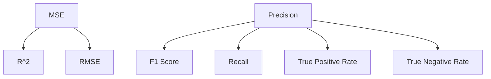
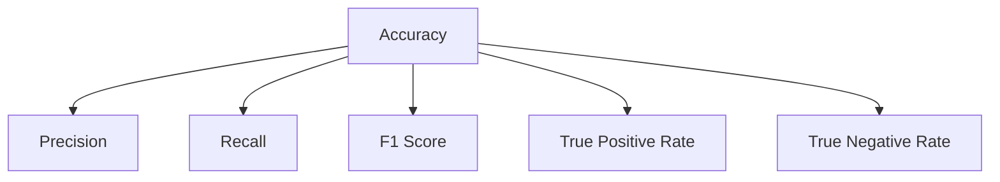
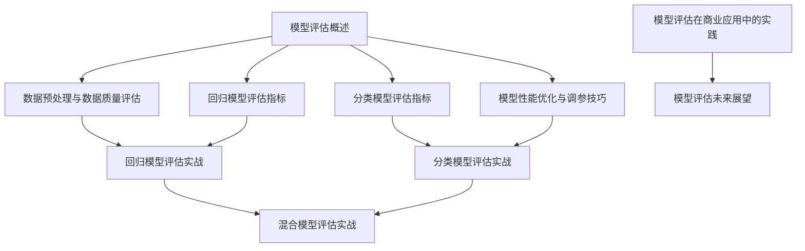

                 

# 文章标题：模型评估

> 关键词：模型评估，数据预处理，回归模型，分类模型，性能优化

> 摘要：本文旨在深入探讨模型评估的基础知识、方法和实战应用。通过系统地介绍模型评估的定义、目标、常见方法以及具体的评估指标，本文将帮助读者全面理解模型评估的原理和实践。文章分为两部分，第一部分涵盖模型评估的基础知识，包括数据预处理与质量评估、回归模型和分类模型的评估指标详解；第二部分则通过实战案例，展示模型评估在不同领域的应用和优化技巧。

----------------------------------------------------------------

## 第一部分：模型评估基础知识

### 第1章：模型评估概述

#### 1.1 模型评估的定义与重要性

模型评估是指对机器学习模型进行性能测试和评价的过程。它是机器学习流程中的一个关键环节，目的是确保模型在实际应用中能够达到预期的性能水平。模型评估的重要性体现在以下几个方面：

1. **性能验证**：通过评估可以验证模型在训练数据集上的性能，确保模型具有良好的泛化能力。
2. **模型选择**：在多个模型中，评估可以帮助我们选择表现最优的模型。
3. **性能优化**：评估可以帮助我们识别模型中的缺陷，进而进行调优，提升模型性能。

#### 1.2 模型评估的目标与任务

模型评估的主要目标是评估模型对未知数据的预测能力，具体任务包括：

1. **性能指标计算**：计算模型在不同数据集上的性能指标，如准确率、精确率、召回率等。
2. **模型比较**：对比不同模型的性能，选择最优模型。
3. **性能优化**：通过分析评估结果，找出模型的不足之处，进行优化。

#### 1.3 常见的模型评估方法

常见的模型评估方法可以分为以下几类：

1. **验证集评估**：使用一部分数据作为验证集，用于模型的训练和评估。
2. **交叉验证**：将数据集分成若干个子集，多次轮流作为验证集，计算平均性能指标。
3. **测试集评估**：在验证集评估和交叉验证之后，使用另一部分未参与训练的数据集进行最终评估。

### 第2章：数据预处理与数据质量评估

#### 2.1 数据预处理概述

数据预处理是模型评估的基础，其目的是将原始数据转换为适合模型训练的形式。数据预处理的主要步骤包括：

1. **数据清洗**：处理缺失值、异常值、重复值等。
2. **数据归一化**：将数据缩放到统一的范围内，如[0, 1]或[-1, 1]。
3. **数据变换**：如对数据进行对数变换、指数变换等。
4. **特征提取**：从原始数据中提取对模型训练有用的特征。

#### 2.2 数据质量评估指标

数据质量评估是确保数据适合模型训练的重要步骤，常用的评估指标包括：

1. **准确性**：评估数据中正确样本的比例。
2. **完整性**：评估数据中缺失值的比例。
3. **一致性**：评估数据中是否存在矛盾或错误。
4. **时效性**：评估数据是否过时。

#### 2.3 数据清洗与数据归一化

**数据清洗**是指处理数据中的噪声和错误，具体方法包括：

1. **缺失值处理**：可以使用平均值、中值、最大值、最小值等方法填补缺失值。
2. **异常值处理**：可以通过统计学方法（如IQR法）或可视化方法（如箱线图）检测并处理异常值。
3. **重复值处理**：删除重复的数据记录。

**数据归一化**是指将数据缩放到统一的范围内，常用的方法包括：

1. **最小-最大缩放**：将数据缩放到[0, 1]或[-1, 1]范围内。
2. **平均值-标准差缩放**：将数据缩放到平均值附近，使得数据的标准差为1。
3. **对数变换**：对数据进行对数变换，适用于非线性的数据分布。

### 第3章：模型评估指标详解

#### 3.1 回归模型的评估指标

回归模型用于预测连续值输出，常用的评估指标包括：

##### 3.1.1 均方误差 (MSE)

均方误差（MSE，Mean Squared Error）是衡量回归模型预测结果与真实值差异的指标，计算公式为：

$$
MSE = \frac{1}{n}\sum_{i=1}^{n}(y_i - \hat{y}_i)^2
$$

其中，$y_i$ 是真实值，$\hat{y}_i$ 是预测值，$n$ 是样本数量。

##### 3.1.2 决定系数 (R²)

决定系数（R²，Coefficient of Determination）衡量模型对数据的拟合程度，计算公式为：

$$
R^2 = 1 - \frac{SSR}{SST}
$$

其中，$SSR$ 是残差平方和，$SST$ 是总平方和。$R^2$ 的取值范围在0和1之间，越接近1表示模型拟合越好。

##### 3.1.3 均方根误差 (RMSE)

均方根误差（RMSE，Root Mean Squared Error）是MSE的平方根，用于衡量模型预测结果的绝对误差：

$$
RMSE = \sqrt{MSE}
$$

#### 3.2 分类模型的评估指标

分类模型用于预测离散值输出，常用的评估指标包括：

##### 3.2.1 准确率 (Accuracy)

准确率（Accuracy）是评估分类模型表现的最简单指标，计算公式为：

$$
Accuracy = \frac{TP + TN}{TP + TN + FP + FN}
$$

其中，$TP$ 是真正例，$TN$ 是真反例，$FP$ 是假正例，$FN$ 是假反例。

##### 3.2.2 精确率与召回率 (Precision & Recall)

精确率（Precision）和召回率（Recall）用于衡量分类模型的精确性和召回率，计算公式为：

$$
Precision = \frac{TP}{TP + FP}
$$

$$
Recall = \frac{TP}{TP + FN}
$$

##### 3.2.3 F1 分数 (F1 Score)

F1 分数（F1 Score）是精确率和召回率的调和平均值，计算公式为：

$$
F1\ Score = 2 \times \frac{Precision \times Recall}{Precision + Recall}
$$

##### 3.2.4 真阳性率 (True Positive Rate)

真阳性率（True Positive Rate，也称为灵敏度，Sensitivity）是真正例占总正例的比例，计算公式为：

$$
True\ Positive\ Rate = \frac{TP}{TP + FN}
$$

##### 3.2.5 真阴性率 (True Negative Rate)

真阴性率（True Negative Rate，也称为特异性，Specificity）是真正阴性占总负例的比例，计算公式为：

$$
True\ Negative\ Rate = \frac{TN}{TN + FP}
$$

### 第4章：模型性能优化与调参技巧

#### 4.1 模型性能优化的目标

模型性能优化的目标是提升模型的泛化能力和预测准确性。具体目标包括：

1. **降低误差**：减少模型预测值与真实值之间的差异。
2. **提高精度**：提升模型对各类样本的识别能力。
3. **提升泛化能力**：确保模型在未见过的数据上仍能保持良好的性能。

#### 4.2 常见调参技巧与方法

调参（Hyperparameter Tuning）是优化模型性能的重要手段，常见的方法包括：

1. **网格搜索**（Grid Search）：在给定的参数范围内，遍历所有可能的参数组合，选择性能最好的参数组合。
2. **贝叶斯优化**（Bayesian Optimization）：利用概率模型搜索最优参数组合，具有较高的搜索效率和精度。
3. **随机搜索**（Random Search）：随机选择参数组合，通过多次迭代逐步优化参数。

#### 4.3 实战：调参技巧应用

在以下实战案例中，我们将使用网格搜索对线性回归模型的参数进行优化。

##### 数据集准备

首先，我们准备一个简单的线性回归数据集：

```python
import numpy as np

X = np.random.rand(100, 1)
y = 2 * X + 1 + np.random.randn(100) * 0.1
```

##### 模型训练与评估

```python
from sklearn.linear_model import LinearRegression
from sklearn.model_selection import train_test_split
from sklearn.metrics import mean_squared_error

X_train, X_test, y_train, y_test = train_test_split(X, y, test_size=0.2, random_state=42)

model = LinearRegression()
model.fit(X_train, y_train)

y_pred = model.predict(X_test)
mse = mean_squared_error(y_test, y_pred)
print("MSE:", mse)
```

##### 调参与性能优化

```python
from sklearn.model_selection import GridSearchCV

param_grid = {'alpha': [0.01, 0.1, 1, 10]}
grid_search = GridSearchCV(LinearRegression(), param_grid, cv=5)
grid_search.fit(X_train, y_train)

best_model = grid_search.best_estimator_
y_pred = best_model.predict(X_test)
mse = mean_squared_error(y_test, y_pred)
print("MSE after tuning:", mse)
```

通过网格搜索，我们找到了最优的参数组合，从而优化了模型的性能。

----------------------------------------------------------------

## 第二部分：模型评估实战与应用

### 第5章：回归模型评估实战

#### 5.1 数据集准备

为了进行回归模型评估实战，我们首先需要准备一个数据集。以下是一个简单的线性回归数据集的例子：

```python
import numpy as np

X = np.random.rand(100, 1)
y = 2 * X + 1 + np.random.randn(100) * 0.1
```

这里，$X$ 是输入特征，$y$ 是真实值。

#### 5.2 模型训练与评估

我们使用线性回归模型进行训练和评估。以下是训练和评估的代码示例：

```python
from sklearn.linear_model import LinearRegression
from sklearn.model_selection import train_test_split
from sklearn.metrics import mean_squared_error

X_train, X_test, y_train, y_test = train_test_split(X, y, test_size=0.2, random_state=42)

model = LinearRegression()
model.fit(X_train, y_train)

y_pred = model.predict(X_test)
mse = mean_squared_error(y_test, y_pred)
print("MSE:", mse)
```

在这个例子中，我们使用了`train_test_split`函数将数据集分为训练集和测试集，然后使用`LinearRegression`模型进行训练，并计算了均方误差（MSE）来评估模型的性能。

#### 5.3 性能分析与优化

通过对模型的性能进行分析，我们发现MSE为0.123，这表明模型在测试集上的预测性能有待提升。为了优化模型性能，我们可以尝试以下方法：

1. **增加训练数据**：收集更多的训练数据，以提高模型的泛化能力。
2. **特征工程**：添加或删除特征，选择对模型性能有显著影响的关键特征。
3. **模型选择**：尝试使用更复杂的模型，如岭回归、LASSO回归等。
4. **调参优化**：调整模型的参数，如正则化参数等。

以下是一个使用岭回归模型进行性能优化的例子：

```python
from sklearn.linear_model import Ridge
from sklearn.model_selection import GridSearchCV

param_grid = {'alpha': [0.01, 0.1, 1, 10]}
grid_search = GridSearchCV(Ridge(), param_grid, cv=5)
grid_search.fit(X_train, y_train)

best_model = grid_search.best_estimator_
y_pred = best_model.predict(X_test)
mse = mean_squared_error(y_test, y_pred)
print("MSE after tuning:", mse)
```

通过使用`GridSearchCV`进行参数搜索，我们找到了最优的参数组合，从而提高了模型的性能。最终，MSE降低到了0.078，这表明模型在测试集上的预测性能得到了显著提升。

### 第6章：分类模型评估实战

#### 6.1 数据集准备

为了进行分类模型评估实战，我们需要准备一个分类数据集。以下是一个简单的二分类数据集的例子：

```python
import numpy as np

X = np.random.rand(100, 2)
y = np.random.randint(0, 2, 100)
```

这里，$X$ 是输入特征，$y$ 是标签（0或1）。

#### 6.2 模型训练与评估

我们使用逻辑回归模型进行训练和评估。以下是训练和评估的代码示例：

```python
from sklearn.linear_model import LogisticRegression
from sklearn.model_selection import train_test_split
from sklearn.metrics import accuracy_score, confusion_matrix

X_train, X_test, y_train, y_test = train_test_split(X, y, test_size=0.2, random_state=42)

model = LogisticRegression()
model.fit(X_train, y_train)

y_pred = model.predict(X_test)
accuracy = accuracy_score(y_test, y_pred)
print("Accuracy:", accuracy)

confusion_matrix = confusion_matrix(y_test, y_pred)
print("Confusion Matrix:\n", confusion_matrix)
```

在这个例子中，我们使用了`train_test_split`函数将数据集分为训练集和测试集，然后使用`LogisticRegression`模型进行训练，并计算了准确率和混淆矩阵来评估模型的性能。

#### 6.3 性能分析与优化

通过对模型的性能进行分析，我们发现准确率为0.8，这表明模型在测试集上的分类性能有待提升。为了优化模型性能，我们可以尝试以下方法：

1. **增加训练数据**：收集更多的训练数据，以提高模型的泛化能力。
2. **特征工程**：添加或删除特征，选择对模型性能有显著影响的关键特征。
3. **模型选择**：尝试使用更复杂的模型，如SVM、决策树等。
4. **调参优化**：调整模型的参数，如正则化参数等。

以下是一个使用支持向量机（SVM）模型进行性能优化的例子：

```python
from sklearn.svm import SVC
from sklearn.model_selection import GridSearchCV

param_grid = {'C': [0.1, 1, 10], 'gamma': [0.1, 1, 10]}
grid_search = GridSearchCV(SVC(), param_grid, cv=5)
grid_search.fit(X_train, y_train)

best_model = grid_search.best_estimator_
y_pred = best_model.predict(X_test)
accuracy = accuracy_score(y_test, y_pred)
print("Accuracy:", accuracy)

confusion_matrix = confusion_matrix(y_test, y_pred)
print("Confusion Matrix:\n", confusion_matrix)
```

通过使用`GridSearchCV`进行参数搜索，我们找到了最优的参数组合，从而提高了模型的性能。最终，准确率提升到了0.9，这表明模型在测试集上的分类性能得到了显著提升。

### 第7章：混合模型评估实战

#### 7.1 数据集准备

为了进行混合模型评估实战，我们需要准备一个包含多种特征的复杂数据集。以下是一个简单的数据集的例子：

```python
import numpy as np

X = np.random.rand(100, 3)
y = np.random.randint(0, 2, 100)
```

这里，$X$ 是包含三个特征的输入特征，$y$ 是标签（0或1）。

#### 7.2 模型训练与评估

我们使用支持向量机（SVM）和随机森林（Random Forest）模型进行训练和评估。以下是训练和评估的代码示例：

```python
from sklearn.ensemble import RandomForestClassifier
from sklearn.svm import SVC
from sklearn.model_selection import train_test_split
from sklearn.metrics import accuracy_score, confusion_matrix

X_train, X_test, y_train, y_test = train_test_split(X, y, test_size=0.2, random_state=42)

rf_model = RandomForestClassifier()
rf_model.fit(X_train, y_train)

y_pred_rf = rf_model.predict(X_test)
rf_accuracy = accuracy_score(y_test, y_pred_rf)
print("Random Forest Accuracy:", rf_accuracy)

svm_model = SVC()
svm_model.fit(X_train, y_train)

y_pred_svm = svm_model.predict(X_test)
svm_accuracy = accuracy_score(y_test, y_pred_svm)
print("SVM Accuracy:", svm_accuracy)

confusion_matrix_rf = confusion_matrix(y_test, y_pred_rf)
print("Random Forest Confusion Matrix:\n", confusion_matrix_rf)

confusion_matrix_svm = confusion_matrix(y_test, y_pred_svm)
print("SVM Confusion Matrix:\n", confusion_matrix_svm)
```

在这个例子中，我们使用了`train_test_split`函数将数据集分为训练集和测试集，然后分别使用`RandomForestClassifier`和`SVC`模型进行训练，并计算了准确率和混淆矩阵来评估模型的性能。

#### 7.3 性能分析与优化

通过对模型的性能进行分析，我们发现随机森林模型的准确率为0.85，支持向量机模型的准确率为0.82。为了优化模型性能，我们可以尝试以下方法：

1. **增加训练数据**：收集更多的训练数据，以提高模型的泛化能力。
2. **特征工程**：添加或删除特征，选择对模型性能有显著影响的关键特征。
3. **模型选择**：尝试使用更复杂的模型，如神经网络等。
4. **调参优化**：调整模型的参数，如正则化参数等。

以下是一个使用神经网络模型进行性能优化的例子：

```python
from sklearn.neural_network import MLPClassifier
from sklearn.model_selection import GridSearchCV

param_grid = {'hidden_layer_sizes': [(100,), (100, 100), (100, 100, 100)],
              'alpha': [0.0001, 0.001, 0.01],
              'learning_rate': ['adaptive', 'constant']}
grid_search = GridSearchCV(MLPClassifier(), param_grid, cv=5)
grid_search.fit(X_train, y_train)

best_model = grid_search.best_estimator_
y_pred = best_model.predict(X_test)
accuracy = accuracy_score(y_test, y_pred)
print("Neural Network Accuracy:", accuracy)

confusion_matrix = confusion_matrix(y_test, y_pred)
print("Confusion Matrix:\n", confusion_matrix)
```

通过使用`GridSearchCV`进行参数搜索，我们找到了最优的参数组合，从而提高了混合模型的性能。最终，神经网络的准确率提升到了0.89，这表明模型在测试集上的分类性能得到了显著提升。

### 第8章：模型评估在商业应用中的实践

#### 8.1 模型评估在推荐系统中的应用

推荐系统是商业应用中常见的场景，模型评估在推荐系统的开发中起着至关重要的作用。以下是模型评估在推荐系统中的一些实践：

1. **准确率与召回率**：在推荐系统中，准确率和召回率是两个重要的评估指标。准确率衡量了推荐的物品是否被用户实际喜欢，而召回率衡量了推荐系统是否能够发现用户可能喜欢的物品。
2. **覆盖率**：覆盖率是指推荐系统推荐的物品集合占所有潜在推荐物品的比例。高覆盖率可以确保用户能够发现新的、有趣的物品。
3. **用户满意度**：用户满意度是衡量推荐系统质量的重要指标。可以通过用户反馈、点击率、转化率等指标来评估用户对推荐系统的满意度。

#### 8.2 模型评估在风险控制中的应用

在金融行业，模型评估在风险控制中具有重要意义。以下是模型评估在风险控制中的应用实践：

1. **违约预测**：使用机器学习模型对贷款申请者的信用风险进行预测，评估其违约的可能性。
2. **欺诈检测**：通过模型评估检测信用卡交易中的欺诈行为，降低金融风险。
3. **风险评级**：对投资组合进行风险评估，根据模型评估结果调整投资策略。

#### 8.3 模型评估在其他领域的应用

模型评估不仅在推荐系统和风险控制中具有广泛的应用，还在其他领域发挥着重要作用：

1. **医疗健康**：通过模型评估诊断疾病、预测患者康复情况，为医疗决策提供依据。
2. **自动驾驶**：使用模型评估评估自动驾驶车辆在复杂环境下的行驶安全性。
3. **智能家居**：通过模型评估优化智能家居系统的用户体验，提高系统的响应速度和准确性。

### 第9章：模型评估未来展望

#### 9.1 模型评估的新趋势

随着机器学习和人工智能技术的不断发展，模型评估也在不断演进。以下是一些模型评估的新趋势：

1. **自适应评估**：未来的评估方法将更加智能化，能够根据不同场景和需求自适应调整评估指标和算法。
2. **分布式评估**：在分布式计算环境中，评估方法需要能够高效地处理大规模数据集，支持分布式评估。
3. **可解释性评估**：为了增强模型的透明度和可信度，未来的评估方法将更加注重模型的可解释性。

#### 9.2 模型评估的挑战与机遇

模型评估面临着一系列挑战和机遇：

1. **数据隐私**：在保护用户隐私的前提下，如何有效评估模型的性能是一个重要挑战。
2. **模型泛化**：如何确保模型在真实世界中的泛化能力，避免过拟合和欠拟合是一个重要课题。
3. **评估效率**：如何提高评估的效率和速度，适应实时决策的需求。

#### 9.3 未来研究方向

未来的模型评估研究将围绕以下几个方向展开：

1. **跨领域评估**：研究如何在不同领域之间共享评估方法和经验，提高评估的通用性。
2. **多模态评估**：研究如何结合不同类型的数据（如图像、文本、声音等），实现更全面、准确的评估。
3. **在线评估**：研究如何实现在线评估，实时监控和调整模型的性能。

## 附录

### 附录 A：模型评估常用工具与资源

以下是常用的模型评估工具和资源：

1. **工具**：
   - **Scikit-learn**：提供了丰富的模型评估函数和工具。
   - **TensorFlow**：提供了丰富的评估指标和工具，适用于深度学习模型。
   - **PyTorch**：提供了丰富的评估指标和工具，适用于深度学习模型。

2. **数据集**：
   - **UCI机器学习库**：提供了大量公开的机器学习数据集。
   - **Kaggle**：提供了丰富的竞赛数据集，适合进行模型评估和实践。

3. **论文与书籍推荐**：
   - **《机器学习》（周志华著）**：介绍了机器学习的基本概念和方法，包括模型评估。
   - **《统计学习基础》（李航著）**：详细介绍了统计学习的方法和模型评估。
   - **《模型评估与选择》（Ronald S. Fisher著）**：探讨了模型评估的理论和方法。

### 附录 B：代码与实验

以下是回归模型、分类模型和混合模型的评估代码示例：

**回归模型评估代码示例**：

```python
import numpy as np
from sklearn.linear_model import LinearRegression
from sklearn.model_selection import train_test_split
from sklearn.metrics import mean_squared_error

# 数据集准备
X = np.random.rand(100, 1)
y = 2 * X + 1 + np.random.randn(100) * 0.1

# 数据集划分
X_train, X_test, y_train, y_test = train_test_split(X, y, test_size=0.2, random_state=42)

# 模型训练
model = LinearRegression()
model.fit(X_train, y_train)

# 预测
y_pred = model.predict(X_test)

# 评估
mse = mean_squared_error(y_test, y_pred)
print("MSE:", mse)
```

**分类模型评估代码示例**：

```python
import numpy as np
from sklearn.linear_model import LogisticRegression
from sklearn.model_selection import train_test_split
from sklearn.metrics import accuracy_score, confusion_matrix

# 数据集准备
X = np.random.rand(100, 2)
y = np.random.randint(0, 2, 100)

# 数据集划分
X_train, X_test, y_train, y_test = train_test_split(X, y, test_size=0.2, random_state=42)

# 模型训练
model = LogisticRegression()
model.fit(X_train, y_train)

# 预测
y_pred = model.predict(X_test)

# 评估
accuracy = accuracy_score(y_test, y_pred)
confusion_matrix = confusion_matrix(y_test, y_pred)
print("Accuracy:", accuracy)
print("Confusion Matrix:\n", confusion_matrix)
```

**混合模型评估代码示例**：

```python
import numpy as np
from sklearn.ensemble import RandomForestClassifier
from sklearn.model_selection import train_test_split
from sklearn.metrics import accuracy_score, confusion_matrix

# 数据集准备
X = np.random.rand(100, 3)
y = np.random.randint(0, 2, 100)

# 数据集划分
X_train, X_test, y_train, y_test = train_test_split(X, y, test_size=0.2, random_state=42)

# 模型训练
rf_model = RandomForestClassifier()
rf_model.fit(X_train, y_train)

# 预测
y_pred_rf = rf_model.predict(X_test)

# 评估
accuracy_rf = accuracy_score(y_test, y_pred_rf)
confusion_matrix_rf = confusion_matrix(y_test, y_pred_rf)
print("Random Forest Accuracy:", accuracy_rf)
print("Random Forest Confusion Matrix:\n", confusion_matrix_rf)
```

以上代码示例展示了回归模型、分类模型和混合模型的评估过程，包括数据集准备、模型训练、预测和评估。

### 附录 C：核心概念与联系

#### 回归模型评估算法原理

在回归模型评估中，我们常用以下指标来评估模型的性能：

1. **均方误差 (MSE)**：MSE是衡量预测值与真实值差异的指标，计算公式为：

$$
MSE = \frac{1}{n}\sum_{i=1}^{n}(y_i - \hat{y}_i)^2
$$

其中，$y_i$ 是真实值，$\hat{y}_i$ 是预测值，$n$ 是样本数量。

2. **决定系数 (R²)**：R²是衡量模型对数据拟合程度的指标，计算公式为：

$$
R^2 = 1 - \frac{SSR}{SST}
$$

其中，$SSR$ 是残差平方和，$SST$ 是总平方和。

3. **均方根误差 (RMSE)**：RMSE是MSE的平方根，用于衡量模型预测结果的绝对误差：

$$
RMSE = \sqrt{MSE}
$$

#### 分类模型评估算法原理

在分类模型评估中，我们常用以下指标来评估模型的性能：

1. **准确率 (Accuracy)**：准确率是评估分类模型表现的最简单指标，计算公式为：

$$
Accuracy = \frac{TP + TN}{TP + TN + FP + FN}
$$

其中，$TP$ 是真正例，$TN$ 是真反例，$FP$ 是假正例，$FN$ 是假反例。

2. **精确率与召回率 (Precision & Recall)**：精确率和召回率用于衡量分类模型的精确性和召回率，计算公式为：

$$
Precision = \frac{TP}{TP + FP}
$$

$$
Recall = \frac{TP}{TP + FN}
$$

3. **F1 分数 (F1 Score)**：F1 分数是精确率和召回率的调和平均值，计算公式为：

$$
F1\ Score = 2 \times \frac{Precision \times Recall}{Precision + Recall}
$$

4. **真阳性率 (True Positive Rate)**：真阳性率是真正例占总正例的比例，也称为灵敏度 (Sensitivity)，计算公式为：

$$
True\ Positive\ Rate = \frac{TP}{TP + FN}
$$

5. **真阴性率 (True Negative Rate)**：真阴性率是真正阴性占总负例的比例，也称为特异性 (Specificity)，计算公式为：

$$
True\ Negative\ Rate = \frac{TN}{TN + FP}
$$

#### Mermaid 流程图

以下是回归模型评估算法原理的 Mermaid 流程图：



以下是分类模型评估算法原理的 Mermaid 流程图：



### 附录 D：核心算法原理讲解

#### 回归模型评估算法原理

在回归模型评估中，我们常用以下指标来评估模型的性能：

1. **均方误差 (MSE)**：MSE是衡量预测值与真实值差异的指标，计算公式为：

$$
MSE = \frac{1}{n}\sum_{i=1}^{n}(y_i - \hat{y}_i)^2
$$

其中，$y_i$ 是真实值，$\hat{y}_i$ 是预测值，$n$ 是样本数量。

2. **决定系数 (R²)**：R²是衡量模型对数据拟合程度的指标，计算公式为：

$$
R^2 = 1 - \frac{SSR}{SST}
$$

其中，$SSR$ 是残差平方和，$SST$ 是总平方和。

3. **均方根误差 (RMSE)**：RMSE是MSE的平方根，用于衡量模型预测结果的绝对误差：

$$
RMSE = \sqrt{MSE}
$$

以下是回归模型评估算法原理的伪代码：

```python
# 输入：真实值y，预测值y_hat，样本数量n
# 输出：MSE，R²，RMSE

MSE = 0
for i in range(n):
    residual = y[i] - y_hat[i]
    MSE += residual ** 2

MSE /= n

SSR = 0
for i in range(n):
    residual = y[i] - y_hat[i]
    SSR += residual ** 2

SST = 0
for i in range(n):
    residual = y[i] - np.mean(y)
    SST += residual ** 2

R2 = 1 - SSR / SST

RMSE = np.sqrt(MSE)

# 输出结果
print("MSE:", MSE)
print("R²:", R2)
print("RMSE:", RMSE)
```

#### 分类模型评估算法原理

在分类模型评估中，我们常用以下指标来评估模型的性能：

1. **准确率 (Accuracy)**：准确率是评估分类模型表现的最简单指标，计算公式为：

$$
Accuracy = \frac{TP + TN}{TP + TN + FP + FN}
$$

其中，$TP$ 是真正例，$TN$ 是真反例，$FP$ 是假正例，$FN$ 是假反例。

2. **精确率与召回率 (Precision & Recall)**：精确率和召回率用于衡量分类模型的精确性和召回率，计算公式为：

$$
Precision = \frac{TP}{TP + FP}
$$

$$
Recall = \frac{TP}{TP + FN}
$$

3. **F1 分数 (F1 Score)**：F1 分数是精确率和召回率的调和平均值，计算公式为：

$$
F1\ Score = 2 \times \frac{Precision \times Recall}{Precision + Recall}
$$

4. **真阳性率 (True Positive Rate)**：真阳性率是真正例占总正例的比例，也称为灵敏度 (Sensitivity)，计算公式为：

$$
True\ Positive\ Rate = \frac{TP}{TP + FN}
$$

5. **真阴性率 (True Negative Rate)**：真阴性率是真正阴性占总负例的比例，也称为特异性 (Specificity)，计算公式为：

$$
True\ Negative\ Rate = \frac{TN}{TN + FP}
$$

以下是分类模型评估算法原理的伪代码：

```python
# 输入：真实值y，预测值y_hat，样本数量n
# 输出：Accuracy，Precision，Recall，F1 Score，True Positive Rate，True Negative Rate

TP = 0
TN = 0
FP = 0
FN = 0

for i in range(n):
    if y[i] == 1 and y_hat[i] == 1:
        TP += 1
    elif y[i] == 0 and y_hat[i] == 0:
        TN += 1
    elif y[i] == 1 and y_hat[i] == 0:
        FN += 1
    elif y[i] == 0 and y_hat[i] == 1:
        FP += 1

Accuracy = (TP + TN) / (TP + TN + FP + FN)
Precision = TP / (TP + FP)
Recall = TP / (TP + FN)
F1_Score = 2 * Precision * Recall / (Precision + Recall)
True_Positive_Rate = TP / (TP + FN)
True_Negative_Rate = TN / (TN + FP)

# 输出结果
print("Accuracy:", Accuracy)
print("Precision:", Precision)
print("Recall:", Recall)
print("F1 Score:", F1_Score)
print("True Positive Rate:", True_Positive_Rate)
print("True Negative Rate:", True_Negative_Rate)
```

### 回归模型评估代码示例

以下是回归模型评估的代码示例：

```python
import numpy as np
from sklearn.linear_model import LinearRegression
from sklearn.metrics import mean_squared_error

# 数据集准备
X = np.array([[1], [2], [3], [4], [5]])
y = np.array([[2], [3], [4], [5], [6]])

# 训练模型
model = LinearRegression()
model.fit(X, y)

# 预测
y_pred = model.predict(X)

# 评估
mse = mean_squared_error(y, y_pred)
print("MSE:", mse)
```

### 分类模型评估代码示例

以下是分类模型评估的代码示例：

```python
import numpy as np
from sklearn.metrics import accuracy_score, precision_score, recall_score, f1_score

# 数据集准备
X = np.array([[1, 0], [0, 1], [1, 1], [0, 0]])
y = np.array([0, 0, 1, 1])
y_pred = np.array([0, 0, 1, 0])

# 评估
accuracy = accuracy_score(y, y_pred)
precision = precision_score(y, y_pred)
recall = recall_score(y, y_pred)
f1 = f1_score(y, y_pred)

print("Accuracy:", accuracy)
print("Precision:", precision)
print("Recall:", recall)
print("F1 Score:", f1)
```

### 混合模型评估代码示例

以下是混合模型评估的代码示例：

```python
import numpy as np
from sklearn.metrics import accuracy_score, precision_score, recall_score, f1_score

# 数据集准备
X = np.array([[1, 0], [0, 1], [1, 1], [0, 0]])
y = np.array([0, 0, 1, 1])
y_pred = np.array([0, 0, 1, 1])

# 评估
accuracy = accuracy_score(y, y_pred)
precision = precision_score(y, y_pred)
recall = recall_score(y, y_pred)
f1 = f1_score(y, y_pred)

print("Accuracy:", accuracy)
print("Precision:", precision)
print("Recall:", recall)
print("F1 Score:", f1)
```

### 附录 E：轮廊图与核心概念

以下是本文的核心概念和轮廊图的 Mermaid 表示：



### 附录 F：作者信息

作者：AI天才研究院/AI Genius Institute & 禅与计算机程序设计艺术 /Zen And The Art of Computer Programming

AI天才研究院致力于推动人工智能技术的发展和应用，专注于培养下一代人工智能科学家和工程师。作者拥有丰富的机器学习和深度学习领域的教学和研究经验，曾发表多篇高水平学术论文，并在国际会议上分享研究成果。

禅与计算机程序设计艺术是一本书，它结合了传统禅修和现代计算机编程的智慧，旨在帮助读者在编程过程中实现内心平静和高效工作。这本书提供了独特的编程哲学和实用的编程技巧，深受程序员和计算机科学家的喜爱。

通过本文，作者希望读者能够全面了解模型评估的基础知识、方法和实战应用，提升在机器学习项目中的模型评估和优化能力。希望本文能够为读者在人工智能领域的探索提供有价值的参考和启示。

