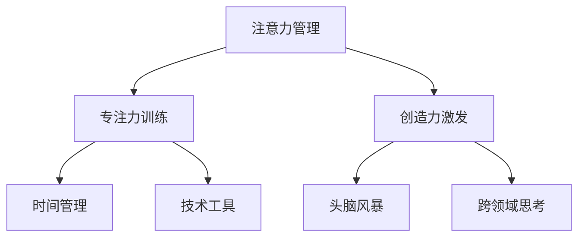

                 

# 注意力管理与创造力激发：在专注和头脑风暴中找到灵感

> 关键词：注意力管理、专注力训练、创造力激发、头脑风暴、跨领域思考、技术博客

> 摘要：本文探讨了注意力管理与创造力激发的重要性，详细介绍了提升注意力的策略和方法，专注力训练的技巧与实践，以及头脑风暴和跨领域思考在创造力激发中的作用。通过实际案例和代码实现，阐述了注意力管理与创造力激发的综合实践方法，为读者提供了切实可行的策略和技巧。

---

## 第一部分：引言

### 第1章：注意力管理与创造力激发概述

#### 1.1 注意力管理的重要性

在现代社会，人们面临着越来越多的信息干扰和任务压力，注意力管理变得尤为重要。注意力管理不仅关乎个人的工作效率，更与创造力激发息息相关。有效的注意力管理能够帮助我们更好地集中精力，提高工作效率，从而激发出更多的创意和灵感。

#### 1.2 创造力的本质与激发

创造力是人类智慧的重要体现，它涉及到对新思想、新方法和新解决方案的发现和创造。本文将探讨如何通过注意力管理和头脑风暴等方法来激发创造力。

#### 1.3 本书的目的与结构

本书旨在为读者提供一套系统的注意力管理与创造力激发的方法和技巧。本书分为四个部分，分别介绍了注意力管理的核心概念与理论、提升注意力的策略与方法、创造力管理的核心理论以及综合实践方法。

### 第2章：注意力管理的核心概念与理论

#### 2.1 注意力的定义与分类

注意力是指人们在进行认知活动时，对信息进行选择、加工和处理的认知资源。根据注意力的指向性和集中性，可以将注意力分为选择性注意力、分配性注意力和持续性注意力。

#### 2.2 注意力管理的基本原理

注意力管理涉及对注意力的分配、调节和控制。有效的注意力管理需要我们了解注意力的分布规律，根据任务需求合理分配注意力资源，并采取相应的策略来调节和保持注意力。

#### 2.3 注意力管理的研究进展

近年来，关于注意力管理的研究取得了显著成果，研究者们提出了多种注意力模型和算法，为注意力管理提供了理论支持和实践指导。

---

### 第3章：提升注意力的策略与方法

#### 3.1 环境优化与注意力提升

良好的环境是保持注意力的重要因素。本文将介绍如何通过优化工作环境、减少干扰因素来提升注意力。

#### 3.2 时间管理与注意力管理

时间管理是提升注意力的重要手段。本文将探讨如何通过时间管理方法，如番茄工作法、四象限时间管理等来提高注意力的集中度和效率。

#### 3.3 技术工具与注意力管理

现代科技为注意力管理提供了丰富的工具。本文将介绍一些常用的注意力管理工具，如专注力追踪软件、冥想应用等，以及如何利用这些工具提高注意力。

### 第4章：专注力训练与实践

#### 4.1 专注力训练方法

本文将介绍几种专注力训练方法，如正念冥想、专注力练习等，以及如何将这些方法融入到日常生活中。

#### 4.2 实战案例：如何培养专注力

通过实际案例，本文将展示如何通过具体的方法和技巧来培养专注力，从而提高工作效率和创造力。

#### 4.3 专注力训练的常见问题与解决方案

本文将分析专注力训练过程中可能遇到的问题，并提供相应的解决方案，帮助读者克服困难，持续提升专注力。

---

### 第5章：创造力管理的核心理论

#### 5.1 创造力的定义与分类

创造力是指个体在面对新问题和情境时，产生新颖、有价值的想法和解决方案的能力。本文将探讨创造力的定义和分类，以及创造力管理的基本理论。

#### 5.2 创造力管理的基本原理

创造力管理涉及到对创造力过程的调控和优化。本文将介绍创造力管理的基本原理，包括创造力激发、创造力维持和创造力应用等方面。

#### 5.3 创造力管理的研究进展

本文将回顾创造力管理领域的研究进展，介绍最新的研究成果和理论模型，为读者提供有益的参考。

### 第6章：头脑风暴与创造力激发

#### 6.1 头脑风暴的基本原理

头脑风暴是一种有效的创造力激发方法，它通过快速产生和分享想法来激发创新思维。本文将介绍头脑风暴的基本原理和实践技巧。

#### 6.2 头脑风暴的实践技巧

本文将详细阐述如何进行有效的头脑风暴，包括如何组织头脑风暴会议、如何引导参与者产生更多的想法等。

#### 6.3 头脑风暴的常见问题与解决方案

本文将分析头脑风暴过程中可能遇到的问题，并提供相应的解决方案，帮助读者更好地进行头脑风暴，激发创造力。

### 第7章：跨领域思考与创造性思维

#### 7.1 跨领域思考的概念与优势

跨领域思考是指将不同领域中的知识和方法应用于解决新问题的过程。本文将探讨跨领域思考的概念和优势，以及如何培养跨领域思考能力。

#### 7.2 跨领域思考的实践方法

本文将介绍跨领域思考的实践方法，包括如何识别跨领域问题、如何构建跨领域知识网络等，帮助读者在实际工作中运用跨领域思考。

#### 7.3 创造性思维的培养与提升

创造性思维是创造力的重要体现。本文将探讨如何通过训练和培养，提升创造性思维的能力，从而更好地应对复杂问题和挑战。

---

### 第8章：注意力管理与创造力激发的综合实践

#### 8.1 综合实践的重要性

综合实践是将注意力管理和创造力激发的理论知识应用于实际工作的重要环节。本文将阐述综合实践的重要性，以及如何在实际工作中进行综合实践。

#### 8.2 综合实践的步骤与方法

本文将介绍综合实践的步骤和方法，包括如何制定实践计划、如何实施实践策略、如何评估实践效果等，帮助读者有效地进行综合实践。

#### 8.3 综合实践的案例分析

通过实际案例，本文将展示如何在实际工作中综合运用注意力管理和创造力激发的方法，提高工作效率和创造力。

### 第9章：常见问题与解决方案

#### 9.1 注意力管理与创造力激发的常见挑战

本文将分析注意力管理和创造力激发过程中可能遇到的常见挑战，包括注意力分散、创造力枯竭等，并提供相应的解决方案。

#### 9.2 解决方案与实战技巧

本文将结合实际案例，提供具体的解决方案和实战技巧，帮助读者克服困难，持续提升注意力管理和创造力激发的能力。

#### 9.3 持续进步与成长

本文将探讨如何通过不断学习和实践，实现注意力管理和创造力激发的持续进步和成长，为读者提供有益的启示。

---

### 附录

#### 附录A：注意力管理与创造力激发的工具与资源

本文将介绍一些注意力管理与创造力激发的工具和资源，包括注意力管理软件、创造力激发应用等，以及如何利用这些工具和资源进行实践。

---

**作者：AI天才研究院/AI Genius Institute & 禅与计算机程序设计艺术 /Zen And The Art of Computer Programming**## 注意力管理与创造力激发的重要性

在当今信息爆炸和任务繁多的时代，注意力管理已成为提升个人效率、保持心理健康和激发创造力的关键。注意力管理不仅仅是一种简单的集中精力技巧，它涉及到对注意力资源的有效分配、调节和利用，从而提高我们在面对复杂任务时的应对能力。

### 注意力管理的重要性

注意力管理的重要性体现在多个方面。首先，在职业领域，良好的注意力管理能够帮助员工更高效地完成工作任务，提高生产力和创造力。研究表明，专注力的提升可以减少错误率，提高工作质量。其次，在个人生活中，有效的注意力管理有助于我们更好地平衡工作与生活，减少焦虑和压力。最后，在学习和成长过程中，注意力管理能够帮助我们更好地吸收和整合知识，提升学习能力。

### 创造力的本质与激发

创造力是人类智慧的体现，它涉及到对新思想、新方法和新解决方案的发现和创造。创造力并非与生俱来，而是可以通过训练和激发逐步提升。激发创造力的关键在于提供一个开放、自由和富有挑战性的环境，让个体能够自由地思考和探索。此外，跨领域思考和多样性思维也是激发创造力的有效方法。

### 本书的目的与结构

本书旨在为读者提供一套系统的注意力管理与创造力激发的方法和技巧。通过系统地介绍注意力管理的核心概念与理论、提升注意力的策略与方法、创造力管理的核心理论以及综合实践方法，帮助读者掌握如何在日常生活中有效地进行注意力管理和创造力激发。

本书分为四个部分：

1. **引言**：介绍注意力管理和创造力激发的重要性，以及本书的目的和结构。
2. **注意力管理的核心概念与理论**：详细阐述注意力的定义与分类、注意力管理的基本原理和研究进展。
3. **提升注意力的策略与方法**：介绍环境优化、时间管理和技术工具等提升注意力的方法。
4. **创造力激发**：探讨创造力的本质、头脑风暴、跨领域思考以及创造性思维的培养与提升。
5. **综合实践**：结合实际案例，介绍注意力管理与创造力激发的综合实践方法。
6. **常见问题与解决方案**：分析注意力管理和创造力激发的常见挑战，提供解决方案和实战技巧。
7. **附录**：介绍注意力管理与创造力激发的工具与资源。

通过本书的学习，读者将能够了解和掌握注意力管理与创造力激发的核心知识，并将其应用到实际工作和生活中，从而提高个人效率和生活质量。在接下来的章节中，我们将逐步深入探讨注意力管理的各个方面，帮助读者在专注和头脑风暴中找到灵感。<!-- mce-style="color: #e60012;" -->

## 注意力管理的核心概念与理论

### 注意力的定义与分类

注意力是人们在处理信息时，对特定刺激进行选择和集中的心理过程。根据不同的标准，注意力可以被分为多种类型。从注意力的指向性来看，可以分为选择性注意力、分配性注意力和持续性注意力。

- **选择性注意力**：是指个体在众多信息中，有选择性地关注和处理某一类信息的能力。例如，当我们正在听一个讲座时，能够选择性地关注讲师的关键内容，而忽略其他无关的信息。

- **分配性注意力**：是指个体在同时处理多项任务时，将注意力资源分配到不同任务上的能力。例如，在驾驶时，我们需要同时关注路况、导航系统以及周围的环境。

- **持续性注意力**：是指个体在一段时间内保持注意力集中的能力。例如，在长时间的学习或工作中，我们需要保持持续的高注意力水平，以避免分心和走神。

### 注意力管理的基本原理

注意力管理涉及对注意力资源的分配、调节和控制，以实现最佳的工作和生活效果。注意力管理的基本原理包括以下几个方面：

- **目标设定**：明确目标可以帮助我们集中注意力，避免注意力分散。当我们有明确的目标时，我们更容易将注意力集中在实现目标的任务上，而不是被无关的信息所干扰。

- **环境优化**：优化环境是注意力管理的重要一环。一个安静、整洁、有序的工作环境可以帮助我们更好地集中注意力。同时，减少干扰因素，如关闭不必要的通知和社交媒体，也能提高我们的注意力水平。

- **时间管理**：合理的时间管理可以帮助我们更有效地分配注意力资源。例如，使用番茄工作法等时间管理技巧，将工作时间分为多个短暂的任务，每个任务结束后进行短暂的休息，有助于保持注意力的集中。

- **自我监控**：自我监控是注意力管理的关键。通过自我监控，我们可以及时发现注意力分散的迹象，并采取相应的措施来重新集中注意力。例如，当发现自己开始走神时，可以采取深呼吸、冥想等放松技巧来重新集中注意力。

### 注意力管理的研究进展

近年来，注意力管理的研究取得了显著进展。研究者们从神经科学、心理学和社会科学等多个角度对注意力管理进行了深入研究，提出了许多新的理论模型和研究成果。

- **神经科学研究**：通过脑成像技术，研究者们揭示了注意力的神经基础。例如，前额叶皮质、顶叶皮质和纹状体等大脑区域在注意力过程中起着关键作用。这些研究成果为我们理解和优化注意力管理提供了重要的生物学依据。

- **心理学研究**：心理学研究进一步探讨了注意力的心理机制和影响因素。例如，研究表明，情绪、动机、自我效能感等心理因素对注意力管理有着重要影响。这些研究帮助我们更好地理解注意力管理的内在机制，为实际应用提供了指导。

- **社会科学研究**：社会科学研究则关注注意力管理在社会互动和组织管理中的应用。例如，研究者们探讨了注意力管理在团队合作、领导力和组织管理中的重要性，提出了许多有效的策略和方法。

总之，注意力管理的研究进展为我们提供了丰富的理论支持和实践指导，使我们能够更好地理解和应用注意力管理的方法和技巧，从而提高工作和生活质量。

### 注意力管理的应用场景与实际案例

注意力管理的应用场景非常广泛，无论是个人还是组织，都可以通过有效的注意力管理来提升工作效率和创造力。以下是一些典型的应用场景和实际案例：

#### 个人层面

**1. 学习中的注意力管理**

在学习和阅读过程中，注意力管理至关重要。例如，一个学生在准备考试时，可以通过以下方法来提升注意力：

- **目标设定**：明确学习目标，例如每天阅读一定数量的章节或完成特定的练习题。
- **环境优化**：选择一个安静、整洁的学习环境，减少干扰因素，如关闭手机通知、将学习材料整理有序。
- **时间管理**：使用番茄工作法等时间管理技巧，将学习时间分为25分钟的学习和5分钟的休息，以保持注意力的集中。

**2. 工作中的注意力管理**

在职场中，有效的注意力管理能够帮助员工更好地应对复杂的工作任务。例如，一个项目经理可以通过以下方法来提升注意力：

- **目标设定**：明确项目的目标和里程碑，确保团队成员了解项目的关键任务和预期成果。
- **环境优化**：确保工作环境的舒适和整洁，减少干扰因素，如关闭不必要的电子邮件和社交媒体通知。
- **时间管理**：使用项目管理工具和技巧，如甘特图、任务分解等，合理安排工作和休息时间，保持工作效率。

#### 组织层面

**1. 团队协作中的注意力管理**

在团队协作中，注意力管理能够提高团队的整体效率和创造力。例如，一个研发团队可以通过以下方法来提升注意力：

- **目标设定**：确保团队成员对项目的目标和期望有共同的理解，明确每个人的职责和任务。
- **环境优化**：创建一个开放、协作和充满活力的工作环境，鼓励团队成员分享想法和反馈。
- **时间管理**：合理安排会议和工作时间，确保团队成员有足够的时间专注于各自的任务。

**2. 企业管理中的注意力管理**

在企业运营中，注意力管理能够帮助管理层更有效地管理资源和优化决策。例如，一个企业可以通过以下方法来提升注意力：

- **目标设定**：明确企业的战略目标和业务重点，确保各部门和员工的工作与公司目标一致。
- **环境优化**：优化工作流程和管理流程，减少冗余和浪费，提高工作效率。
- **时间管理**：合理安排会议和决策时间，确保团队成员有足够的时间专注于重要任务，避免因频繁会议而分散注意力。

通过以上应用场景和实际案例，我们可以看到，注意力管理不仅对个人学习、工作和生活有着重要的影响，也能够在团队协作和企业管理中发挥关键作用。有效的注意力管理能够帮助我们更好地集中精力，提升工作效率，激发创造力，从而实现个人和组织的持续成长和发展。

### 注意力管理的研究进展

近年来，注意力管理的研究取得了显著进展，研究者们从多个学科领域出发，对注意力现象进行了深入探讨。以下是一些代表性的研究成果和理论模型：

#### 神经科学研究

神经科学研究发现，注意力过程在大脑多个区域中发生，尤其是前额叶皮质和顶叶皮质。这些区域在注意力的调节和分配中起着关键作用。脑成像技术，如功能性磁共振成像（fMRI）和脑电图（EEG），揭示了注意力相关的神经活动模式。例如，fMRI研究表明，当个体进行注意力任务时，前额叶皮质的特定区域会激活，这表明该区域在注意力调节中具有重要作用。

#### 心理学研究

心理学研究进一步探讨了注意力的心理机制和影响因素。认知心理学提出了注意力的多阶段模型，将注意力过程分为选择性注意、注意分配和注意维持等阶段。例如，布罗德本特（ Broadbent）的过滤理论认为，注意力在信息处理过程中起到了过滤作用，只允许有限的信息通过。此外，心理学家还研究了情绪、动机、自我效能感等心理因素对注意力管理的影响。研究表明，积极的情绪状态和高的自我效能感有助于提高注意力水平。

#### 社会科学研究

社会科学研究则关注注意力管理在社会互动和组织管理中的应用。社会心理学研究表明，社会支持和合作能够增强个体和团队的注意力集中。例如，研究发现在团队任务中，成员之间的信任和沟通有助于提升团队的注意力和协作效率。此外，组织行为学研究者探讨了领导风格和团队结构对注意力管理的影响，提出了一些有效的管理策略和方法。

#### 实际应用

这些研究成果在多个实际应用领域产生了显著影响。例如，在教育领域，注意力管理的研究为教学方法的改进提供了理论依据。教师可以通过设计互动性强的课堂活动和利用多媒体教学工具，来提高学生的注意力集中。在工作场所，企业管理者可以采用注意力管理策略，如灵活的工作安排、减少干扰因素和提供必要的心理支持，来提高员工的工作效率和创造力。

#### 挑战与未来方向

尽管注意力管理的研究取得了显著进展，但仍面临一些挑战。例如，个体之间的注意力差异较大，如何设计通用且有效的注意力管理策略仍需进一步研究。此外，注意力管理在跨文化环境中的应用也需要更多的实证研究。未来研究方向包括探索注意力管理的神经基础、开发个性化的注意力管理工具以及研究注意力管理在不同文化和社会背景下的应用。

总之，注意力管理的研究进展为我们提供了丰富的理论支持和实践指导。通过深入理解注意力的本质和影响因素，我们可以更好地设计和应用注意力管理策略，从而提高个人和团队的工作效率、创造力和生活质量。

### 提升注意力的策略与方法

提升注意力是提高工作效率和创造力的重要途径。以下是一些有效的策略和方法，通过环境优化、时间管理和技术工具的应用，可以帮助我们更好地集中精力，保持高效的注意力状态。

#### 环境优化

一个安静、整洁和有序的工作环境对保持注意力至关重要。以下是一些环境优化的策略：

- **减少干扰因素**：关闭不必要的电子设备，如手机、电视和电脑通知，以减少外部干扰。
- **优化工作空间**：确保工作空间整洁，桌面无杂物，这样可以减少分心因素，使大脑更容易集中注意力。
- **控制噪音**：如果可能，选择一个安静的房间或使用耳塞来减少噪音干扰。研究表明，噪音会增加大脑处理信息的负担，降低注意力水平。

#### 时间管理

时间管理是提升注意力的重要手段。以下是一些时间管理的策略：

- **使用番茄工作法**：番茄工作法是一种常见的时间管理技巧，它将工作时间分为25分钟的工作周期，每个周期后休息5分钟。这种方法可以帮助我们保持注意力的集中，避免长时间工作导致的疲劳。
- **设定明确的目标和优先级**：在开始工作前，设定明确的目标和优先级，这有助于我们集中精力在最重要和最有价值的任务上。可以使用任务列表或项目管理工具来组织任务，确保每个任务都得到妥善处理。
- **避免多任务处理**：尽管多任务处理看起来可以提高效率，但实际上它会降低注意力水平，增加错误率。尝试专注于一项任务，直到完成，然后再切换到下一个任务。

#### 技术工具

现代科技为我们提供了多种注意力管理工具，以下是一些常用的工具：

- **专注力追踪软件**：如 Focus@Will 和 Brain Focus，这些软件通过播放特定的背景音乐或白噪音来帮助用户保持专注。研究表明，特定的音乐和噪音能够提高注意力和减少分心。
- **时间管理应用**：如 Todoist、Trello 和 Asana，这些应用可以帮助我们规划和追踪任务进度，确保我们能够按时完成各项任务。
- **冥想应用**：如 Headspace 和 Calm，这些应用提供了一系列冥想练习，帮助用户放松大脑，提高注意力和情绪管理能力。

#### 实践技巧

以下是一些提升注意力的实用技巧：

- **定期休息**：长时间工作会导致大脑疲劳，定期休息可以帮助恢复注意力。每工作45-60分钟后，休息5-10分钟，进行简单的伸展或深呼吸练习。
- **正念冥想**：正念冥想是一种培养注意力集中和情绪稳定的练习。通过专注于呼吸、身体感受和当前体验，我们可以提高注意力水平和自我意识。
- **设定奖励机制**：给自己设定小奖励，例如完成一个任务后，可以休息一会儿或享受一杯咖啡，这有助于保持动力和集中力。

通过这些策略和方法的综合应用，我们可以显著提升注意力水平，提高工作效率和创造力，从而更好地应对日常工作和生活中的挑战。

### 专注力训练方法

专注力训练是一种有效的提升注意力集中的方法，它通过一系列练习和技巧来增强大脑的专注能力和自我控制力。以下介绍几种常见的专注力训练方法，并详细说明其原理和具体操作步骤。

#### 正念冥想

**原理**：正念冥想是一种通过专注于当下的体验来训练注意力的方法。它帮助个体培养对思维和情绪的觉察，减少分心，提高专注力。

**操作步骤**：
1. **选择一个安静的环境**：找一个没有干扰的安静地方，可以是一个房间或户外环境。
2. **选择一个冥想对象**：可以是呼吸、一个物体或一个声音。以呼吸为例，专注于吸气、屏息和呼气的过程。
3. **开始冥想**：闭上眼睛，深呼吸几次，然后专注于呼吸的感觉。如果思维开始游离，轻轻地将其带回到呼吸上。
4. **保持冥想时间**：建议每次冥想10-15分钟，逐渐增加至30分钟。

#### 番茄工作法

**原理**：番茄工作法是一种通过将工作时间划分为短暂的专注周期来提高工作效率的方法。每个周期后进行短暂的休息，帮助大脑恢复精力。

**操作步骤**：
1. **设定任务**：确定需要完成的任务和目标。
2. **设定专注时间**：将工作时间分为25分钟，称为一个“番茄钟”。
3. **开始工作**：专注于任务，排除所有干扰，直到番茄钟结束。
4. **休息**：在番茄钟结束后，休息5分钟，可以进行伸展或深呼吸，帮助大脑放松。
5. **重复**：每完成四个番茄钟后，可以休息更长一些时间，如15-30分钟。

#### 分心应对训练

**原理**：分心应对训练是一种通过练习应对分心事件来提高注意力集中的方法。它帮助个体学会如何在面对分心时迅速恢复专注。

**操作步骤**：
1. **选择一个简单的任务**：如阅读一篇文章或解决数学问题。
2. **开始任务并保持专注**：尽量在没有干扰的情况下完成这个任务，但允许一些小的分心事件，如电话铃声或外界声音。
3. **练习应对分心**：当分心事件发生时，暂停当前任务，专注于分心事件的处理，然后返回任务，继续工作。
4. **重复练习**：逐步增加分心事件的复杂性和频率，提高应对能力。

#### 自我监控与反馈

**原理**：自我监控和反馈是一种通过记录和评估自己的注意力状态来提高专注力的方法。它帮助个体识别注意力分散的迹象，并采取相应措施。

**操作步骤**：
1. **记录专注时间**：使用笔记本或手机应用记录每天专注的时间段和任务类型。
2. **评估注意力表现**：定期回顾记录，分析哪些任务和环境下注意力表现较好，哪些需要改进。
3. **设定改善目标**：根据评估结果，设定具体的改善目标，如减少干扰因素或调整工作时间。
4. **持续跟踪与调整**：持续记录和评估注意力表现，并根据需要调整训练方法和策略。

#### 游戏化训练

**原理**：游戏化训练通过将专注力训练转化为有趣的游戏，提高个体的参与度和积极性。

**操作步骤**：
1. **选择游戏**：如专注力训练游戏、记忆力游戏或解谜游戏，这些游戏需要玩家高度集中注意力。
2. **设定目标**：为每个游戏设定目标，如完成一定数量的关卡或达到特定的分数。
3. **定期挑战**：定期进行游戏挑战，以保持兴趣和动力。
4. **评估进步**：记录游戏中的成绩和进步，评估专注力的提升情况。

通过这些专注力训练方法，我们可以逐步提高注意力集中能力，减少分心，提高工作和学习的效率。这些方法不仅可以用于个人提升，也可以在团队和组织中推广，帮助大家共同提高专注力，实现更高的工作效能和创造力。

### 实战案例：如何培养专注力

在现实生活中，培养专注力是一个需要长期坚持的过程，通过一系列实际操作和具体步骤，我们可以有效地提升专注力。以下是一个具体的案例，介绍如何通过具体的方法和技巧来培养专注力。

#### 案例背景

张三是一位软件开发工程师，他在日常工作中常常感到注意力难以集中，尤其是在处理复杂项目时，经常会因为分心而导致项目进度延误。为了提高工作效率和项目质量，张三决定通过专注力训练来提升自己的专注力。

#### 实施步骤

**1. 明确目标**

首先，张三明确了提升专注力的具体目标，他希望在一个月内显著改善在工作中的注意力集中度，减少分心现象。

**2. 创建专注环境**

张三选择了一个安静的房间作为工作空间，并确保房间内没有不必要的物品，以减少干扰。他还使用耳塞来降低外界噪音，同时关闭手机和电脑的通知，以避免电子设备的干扰。

**3. 应用番茄工作法**

张三开始使用番茄工作法来管理时间，他将每个工作周期设定为25分钟，每个周期后休息5分钟。例如，他会在上午9点到下午5点之间，每25分钟专注于一个任务，然后休息5分钟。通过这种方法，张三能够保持高度集中的注意力，避免长时间工作导致的疲劳。

**4. 专注力训练**

张三每天早上都会进行10分钟的专注力训练，包括正念冥想和专注力练习游戏。他通过专注于呼吸和身体感受来培养对思维的觉察，并通过游戏来提高专注力和反应速度。

**5. 定期自我监控与反馈**

张三使用一个专门的笔记本记录每天的工作任务和专注时间，并定期回顾记录，分析哪些任务和环境下注意力表现较好，哪些需要改进。通过自我监控，他能够及时识别注意力分散的迹象，并采取相应的调整措施。

**6. 逐步增加难度**

随着专注力的提升，张三逐渐增加了训练的难度，如在专注力练习中增加复杂度，或在工作中处理更复杂和更具挑战性的任务。这种方法帮助他逐步提高专注力，并适应更高强度的任务。

#### 案例结果

经过一个月的专注力训练，张三的工作效率显著提高，他能够在短时间内完成更多的工作，并且项目的质量也得到提升。他发现自己不再容易分心，能够更好地集中精力在重要的任务上。此外，他的情绪管理能力也有所提升，因为通过专注力训练，他学会了如何在面对压力时保持冷静和专注。

#### 案例总结

通过这个案例，我们可以看到，培养专注力需要明确目标、优化环境、应用有效的训练方法和持续的自我监控。通过这些步骤，我们不仅能够提升个人的专注力，还能够提高工作效率和项目质量，实现个人和职业的持续成长。

### 专注力训练的常见问题与解决方案

在专注力训练过程中，很多人会遇到一些常见问题，如注意力分散、训练效果不佳等。以下是一些常见问题及其解决方案，帮助大家在专注力训练中克服困难，取得更好的效果。

#### 注意力分散

**问题表现**：在进行专注力训练时，容易受到外界干扰或内心杂念的影响，导致无法长时间集中注意力。

**解决方案**：

1. **环境优化**：选择一个安静、整洁、无干扰的工作或训练环境，尽量减少外界噪音和干扰因素。
2. **减少任务干扰**：在训练期间，关闭手机、电脑等电子设备的推送通知，避免因外部信息而分心。
3. **正念冥想**：通过正念冥想练习，学会专注于当下的体验，减少思维杂念。可以尝试每天进行短暂的冥想，以培养专注力。

#### 训练效果不佳

**问题表现**：尽管进行了专注力训练，但感觉效果不明显，注意力仍然难以集中。

**解决方案**：

1. **设定合理目标**：制定短期和长期的目标，确保目标具体、可实现。例如，可以将一个月内提高的专注力目标分为每周的小目标。
2. **逐步增加难度**：在训练初期，可以从简单的任务和较短的时间段开始，随着专注力的提升，逐步增加任务的复杂度和训练时间。
3. **持续反馈与调整**：定期评估训练效果，根据实际情况调整训练方法和策略。例如，如果发现某个方法效果不佳，可以尝试更换其他方法。

#### 情绪波动

**问题表现**：在进行专注力训练时，情绪波动较大，容易感到焦虑或沮丧。

**解决方案**：

1. **情绪管理**：学会情绪管理技巧，如深呼吸、放松练习等，帮助自己保持平静和冷静。
2. **合理规划时间**：避免长时间连续训练，适当安排休息时间，确保大脑和身体得到充分的休息和恢复。
3. **寻求支持**：与朋友、家人或专业人士交流，分享训练中的困难和挑战，寻求支持和鼓励。

#### 持续性不足

**问题表现**：刚开始训练时动力十足，但随着时间的推移，逐渐失去兴趣和动力。

**解决方案**：

1. **设定内在动机**：明确训练的目标和意义，将其与个人价值观和长期目标联系起来，增强内在动力。
2. **多样化训练方式**：尝试不同的专注力训练方法，如游戏化训练、冥想、阅读等，以保持训练的新鲜感和兴趣。
3. **奖励机制**：为自己设定小奖励，如完成训练任务后可以享受一杯咖啡或看一集喜欢的电视剧，以增强动力。

通过以上解决方案，我们可以更好地应对专注力训练过程中遇到的问题，持续提升专注力，提高工作效率和创造力。记住，专注力训练是一个长期的过程，需要坚持和耐心，相信只要付出努力，就一定能取得显著的进步。

### 创造力管理的核心理论

创造力是人类智慧的重要体现，它涉及到对新思想、新方法和新解决方案的发现和创造。创造力管理则是一种系统的方法，旨在激发和维持创造力，使其在个人和组织中发挥最大的作用。以下将介绍创造力管理的核心理论，包括创造力的定义与分类、创造力管理的基本原理以及创造力管理的研究进展。

#### 创造力的定义与分类

创造力是指个体在面对新问题和情境时，产生新颖、有价值的想法和解决方案的能力。创造力不仅仅是灵光一闪的瞬间灵感，而是一个系统的认知过程，包括多个阶段。

- **阶段性模型**：创造性思维过程通常被分为四个阶段：准备阶段、孵化阶段、灵感阶段和验证阶段。

  - **准备阶段**：个体通过学习、研究和积累知识，为创造性思维做准备。
  - **孵化阶段**：个体在潜意识中将已有的知识和经验进行整合，形成初步的创意。
  - **灵感阶段**：创意在孵化阶段的基础上突然产生，有时被称为“灵光一闪”。
  - **验证阶段**：个体对创意进行验证和修正，以确保其可行性和实用性。

- **类型分类**：根据创造力产生的不同类型，创造力可以分为多种类型：

  - **原创性创造力**：指个体产生全新的、前所未有的想法或解决方案。
  - **适应性创造力**：指个体在现有基础上进行改进和优化，使其更加适应新的环境和需求。
  - **重组性创造力**：指个体通过重新组合现有的元素，创造出新的价值和解决方案。

#### 创造力管理的基本原理

创造力管理涉及到对创造力过程的调控和优化，以实现最佳的创新效果。以下是一些创造力管理的基本原理：

- **激发创新思维**：通过提供自由、开放和富有挑战性的环境，激发个体的创新思维。这包括鼓励自由表达、容忍错误、提供丰富的信息和资源等。

- **多样性思维**：多样性思维是指在不同领域、背景和经验的人之间进行交流和合作，以激发新的创意和见解。多样性思维能够带来新的视角和思维方式，促进创新。

- **跨领域思考**：跨领域思考是指将不同领域中的知识和方法应用于解决新问题的过程。通过跨领域思考，个体能够发现不同领域之间的联系，产生独特的创意和解决方案。

- **心理安全**：心理安全是指个体在创造过程中感到舒适、被支持和接受的环境。心理安全能够降低个体的恐惧和风险，鼓励他们尝试新的想法和方法。

#### 创造力管理的研究进展

近年来，创造力管理的研究取得了显著进展，研究者们从心理学、神经科学、管理学等多个学科角度对创造力进行了深入研究。以下是一些重要的研究成果：

- **神经科学研究**：神经科学研究表明，大脑的前额叶皮质和顶叶皮质在创造力过程中起着关键作用。这些区域的活动模式与注意力的调节、思维的灵活性和问题的解决能力密切相关。

- **心理学研究**：心理学研究揭示了创造力的心理机制，如认知灵活性、思维开放性和自我效能感等对创造力的影响。此外，研究还探讨了如何通过训练和练习提高个体的创造力。

- **管理学研究**：管理学研究关注创造力管理在组织中的应用，探讨了如何通过组织结构、文化和管理实践来激发和维持创造力。例如，一些研究表明，自主性、合作和多样性是促进组织创造力的重要因素。

总之，创造力管理的核心理论为理解和优化创造力过程提供了重要的理论基础。通过运用这些理论，个人和组织可以更好地激发和维持创造力，实现持续的创新和发展。

### 头脑风暴的基本原理

头脑风暴是一种有效的创造力激发方法，通过快速产生和分享想法，帮助个体和团队在短时间内产生大量创意。以下将详细解释头脑风暴的基本原理，包括其核心原则、应用场景以及常见的错误和应对方法。

#### 头脑风暴的核心原则

- **自由表达**：头脑风暴的第一原则是鼓励所有参与者自由地表达自己的想法，无论这些想法是否成熟或荒诞。通过自由表达，可以避免对创意的评判和限制，使每个人的思维更加开放和自由。

- **数量优先**：在头脑风暴过程中，鼓励参与者产生尽可能多的想法。数量上的优势能够激发更多的思维碰撞，从而产生更有创意的解决方案。在实践中，通常会强调在初期阶段不进行评判，而是优先关注想法的数量。

- **禁止评判**：头脑风暴的另一个核心原则是禁止即时评判。在产生想法的过程中，评判会限制参与者的思维，阻碍创意的产生。因此，在头脑风暴会议中，所有参与者都应该专注于分享自己的想法，而不是对他人想法进行评价。

- **思维碰撞**：头脑风暴通过不同的观点和想法的碰撞，激发新的创意。这种思维碰撞可以激发个体的创造性思维，使创意从单一维度扩展到多个维度，从而产生更具创新性的解决方案。

#### 头脑风暴的应用场景

- **问题解决**：在遇到问题时，可以通过头脑风暴快速产生多种可能的解决方案。通过头脑风暴，团队可以集思广益，从多个角度探讨问题，从而找到更有效的解决方案。

- **创新设计**：在产品设计、市场策略和业务创新中，头脑风暴可以帮助团队快速产生创意，探索不同的设计方向和策略。通过头脑风暴，团队成员可以相互启发，共同构建出创新性的产品和服务。

- **团队协作**：头脑风暴是促进团队协作和沟通的有效工具。通过头脑风暴，团队成员可以共同探讨项目中的关键问题，分享各自的见解和想法，从而增强团队凝聚力和合作精神。

#### 头脑风暴的常见错误及应对方法

- **过早评判**：在头脑风暴中，过早对别人的想法进行评判会限制创意的产生。应对方法是在头脑风暴会议开始时明确禁止评判，并提醒所有参与者专注于分享自己的想法。

- **参与度不均**：在某些情况下，团队成员的参与度可能不均，导致某些人的想法没有被充分讨论。应对方法是确保每个参与者都有机会发言，可以采用轮流发言或小组讨论的方式，确保每个声音都被听到。

- **时间不足**：头脑风暴需要一定的时间来产生大量创意，如果时间过于紧张，可能会导致创意的生成不充分。应对方法是提前规划会议时间，确保有足够的时间进行头脑风暴，并在必要时延长会议时间。

- **流程混乱**：头脑风暴会议可能会因为流程不清晰而导致混乱。应对方法是提前准备会议议程，明确每个环节的目的和步骤，确保会议有序进行。

通过理解头脑风暴的基本原理和应用场景，以及如何应对常见的错误，我们可以更有效地进行头脑风暴，激发创造力，为个人和团队带来创新的解决方案。

### 头脑风暴的实践技巧

在头脑风暴中，有效的实践技巧能够极大地提升创意的产生质量和团队的参与度。以下是一些具体的实践技巧，包括如何组织头脑风暴会议、引导参与者产生更多的想法以及确保头脑风暴会议的高效进行。

#### 如何组织头脑风暴会议

1. **选择合适的场所**：选择一个安静、宽敞、无干扰的场所，确保参与者能够集中注意力。如果可能，选择一个能够容纳所有人围坐的房间，以促进交流和互动。

2. **明确目标和规则**：在会议开始前，明确头脑风暴的目标和预期成果。向所有参与者简要介绍会议的背景和目的，确保每个人对目标有共同的理解。同时，明确头脑风暴的基本规则，如自由表达、数量优先、禁止评判等。

3. **准备必要的工具**：确保准备足够的纸笔或白板，以便记录所有的想法。如果使用电子设备记录，确保所有参与者都能访问和使用。

#### 引导参与者产生更多的想法

1. **提出开放性问题**：在头脑风暴开始时，提出一个开放性的问题或主题，鼓励参与者围绕这个问题进行思考。例如，可以提出“如何提高产品的用户满意度？”或“如何减少项目的开发时间？”等问题。

2. **设定时间限制**：为每个问题或环节设定时间限制，例如每个问题讨论5-10分钟。这样可以激发参与者快速产生想法，并避免讨论时间过长而陷入细节。

3. **鼓励多样性思维**：鼓励参与者提出不同类型的想法，包括原创性、适应性、重组性的创意。通过多样性思维，可以激发更多的创意，从而找到更创新和有效的解决方案。

4. **建立信任和开放的氛围**：通过积极的反馈和鼓励，建立信任和开放的氛围。确保所有参与者的想法都得到尊重，即使他们的想法看起来不太合理。这种开放和包容的氛围能够激发更多的创意和自由表达。

#### 确保头脑风暴会议的高效进行

1. **明确记录和总结**：在头脑风暴过程中，指定一名记录员或使用电子设备记录所有的想法。确保所有想法都被记录下来，并在会议结束后进行总结和分类。

2. **后续行动**：在头脑风暴会议结束后，整理和评估产生的创意。确定哪些想法最具潜力和可行性，并为这些想法分配后续的行动计划和责任人。

3. **反馈和改进**：在实施创意的过程中，及时进行反馈和调整。通过评估创意的实施效果，不断改进和优化创意，确保其能够达到预期的目标和效果。

通过以上实践技巧，我们可以有效地组织和引导头脑风暴会议，激发团队创造力，产生更多创新的解决方案。

### 头脑风暴的常见问题与解决方案

在头脑风暴的过程中，参与者可能会遇到各种问题，这些问题可能会影响创意的产生和团队的合作效果。以下是一些常见的问题及其解决方案，帮助团队更有效地进行头脑风暴。

#### 参与度不高

**问题表现**：部分团队成员在头脑风暴会议中显得被动或沉默，参与度不高，导致创意生成受限。

**解决方案**：
1. **鼓励表达**：会议开始时，明确鼓励每个成员积极参与，并建立一种无评判的会议文化。
2. **建立信任**：通过团队建设活动和日常沟通，建立团队成员之间的信任，提高参与度。
3. **设立角色**：为每个参与者分配具体的角色，如“记录员”、“创意产生者”等，确保每个人都有明确的职责和参与点。

#### 创意数量不足

**问题表现**：头脑风暴会议结束后，产生的创意数量较少，难以达到预期效果。

**解决方案**：
1. **放宽限制**：会议开始时，强调数量优先，允许所有想法，不论其是否成熟，都记录下来。
2. **时间管理**：为每个问题设定较短的时间限制，鼓励快速产生想法。
3. **提供激励**：设立激励机制，如小奖励或认可，鼓励成员积极贡献创意。

#### 创意质量不高

**问题表现**：虽然产生了大量创意，但许多创意缺乏实际可行性或创新性。

**解决方案**：
1. **引入多样性思维**：鼓励团队成员从不同角度和背景提出创意，提高创意的质量和多样性。
2. **结合专业知识和经验**：确保创意产生过程中，团队中有不同专业知识和经验的成员参与。
3. **筛选和优化**：在头脑风暴结束后，对创意进行筛选和优化，将更多的资源投入到那些最有潜力和价值的创意上。

#### 过度评判

**问题表现**：会议中出现对创意的过度评判，限制了团队成员的思维自由，影响了创意的产生。

**解决方案**：
1. **明确规则**：会议开始时，明确禁止对创意进行即时评判，确保所有创意都被接受和记录。
2. **设立反馈环节**：将创意评判和反馈放在头脑风暴会议之后，确保创意产生过程不受干扰。
3. **鼓励积极心态**：通过正向反馈和鼓励，建立一种积极、包容的会议氛围。

通过以上解决方案，团队可以更有效地解决头脑风暴过程中常见的问题，提升创意的产生质量，从而实现更好的创新成果。

### 跨领域思考的概念与优势

跨领域思考是一种将不同领域中的知识和方法应用于解决新问题的思维方式。它强调的是打破传统领域的界限，从多个角度和维度来分析问题，从而产生创新的解决方案。跨领域思考不仅能够激发新的创意，还能提高问题解决的能力和效率。

#### 跨领域思考的概念

跨领域思考的概念可以从以下几个方面来理解：

1. **跨领域知识的整合**：将不同领域中的知识和理论进行整合，形成新的视角和思维方式。例如，将生物学中的进化论原理应用于商业策略中，可以产生独特的市场定位和品牌策略。

2. **跨领域的思维方式**：通过学习不同领域的思维方式，个体能够获得更广泛的思考工具和方法，从而在面对复杂问题时，能够从多个维度进行思考和分析。

3. **跨领域的思维实践**：通过实际应用跨领域思考，个体可以在不同领域中尝试和实验新的方法，从而推动创新和发展。

#### 跨领域思考的优势

跨领域思考具有以下优势：

1. **创新性**：跨领域思考能够打破传统思维的局限，从新的角度看待问题，从而产生创新的解决方案。通过跨领域的知识整合，个体可以突破固有的思维框架，提出前所未有的创意。

2. **全面性**：跨领域思考能够涵盖更广泛的知识和视角，使问题分析更加全面。在面对复杂问题时，跨领域思考能够提供多个解决方案，帮助个体从多个角度进行评估和选择。

3. **适应性**：跨领域思考能够提高个体在多变环境中的适应能力。通过了解不同领域的知识和方法，个体能够更灵活地应对变化，迅速调整策略和思维模式。

4. **协同效应**：跨领域思考能够促进不同领域专家之间的合作与交流，从而实现知识和技能的互补。这种协同效应能够激发更多的创意，推动项目的进展。

#### 跨领域思考的实践方法

要有效地进行跨领域思考，可以采取以下实践方法：

1. **跨学科学习**：通过学习和了解不同学科的知识，建立起跨领域的知识网络。例如，学习心理学、经济学、生物学等领域的知识，以便在解决问题时能够灵活运用。

2. **领域跨界交流**：积极参与跨领域的学习和交流活动，与不同领域的专家进行沟通和合作。通过交流，可以了解不同领域的前沿动态和最佳实践，从而拓展自己的思维。

3. **案例研究**：研究跨领域成功的案例，分析其跨领域思考的应用方法。例如，研究如何在医学领域应用计算机科学的知识，从而开发出更高效的治疗方案。

4. **实践应用**：在实际工作中，尝试将跨领域思考应用于解决具体问题。通过实践，可以验证跨领域思考的有效性，并不断优化和创新。

通过跨领域思考，个体能够提升问题解决能力，激发创造力，实现个人和组织的持续成长。跨领域思考不仅是一种思维方式，更是一种能够带来创新和突破的重要能力。

### 跨领域思考的实践方法

跨领域思考在实践中的应用，不仅能够激发创新思维，还能提高问题解决的效率和效果。以下将介绍几种跨领域思考的具体实践方法，并通过实际案例来阐述其操作步骤和效果。

#### 方法1：思维导图

**操作步骤**：

1. **确定核心问题**：明确需要解决的问题或目标。
2. **选择相关领域**：根据核心问题，选择与问题相关的不同领域。
3. **绘制思维导图**：将每个领域的知识或方法以节点形式绘制在思维导图上，并连接到核心问题。

**实际案例**：

**案例背景**：一家科技公司希望提高产品的用户体验。

**操作步骤**：

1. **确定核心问题**：如何提升产品的用户体验？
2. **选择相关领域**：用户体验设计、心理学、艺术、用户调研。
3. **绘制思维导图**：

   - 核心问题：提升用户体验
   - 用户体验设计：界面简洁、操作流畅
   - 心理学：用户情感、行为习惯
   - 艺术：色彩搭配、视觉美感
   - 用户调研：用户反馈、需求分析

通过绘制思维导图，团队可以从多个角度思考用户体验的提升方法，如改进界面设计、优化用户交互流程、引入心理学知识进行情感设计等。这种方法不仅帮助团队明确了具体的改进方向，还激发了更多创新的解决方案。

#### 方法2：模拟练习

**操作步骤**：

1. **选择模拟场景**：根据需要解决的问题，选择一个相关的模拟场景。
2. **分配角色**：将团队成员分配到不同的角色，如不同领域的专家或参与者。
3. **进行模拟练习**：在模拟场景中，团队成员分别运用各自领域的知识和方法解决问题。

**实际案例**：

**案例背景**：一家制造业公司希望提高生产效率。

**操作步骤**：

1. **选择模拟场景**：模拟一个实际的生产线，包括不同环节和设备。
2. **分配角色**：将团队成员分配为工程师、设备操作员、质量检测员等。
3. **进行模拟练习**：

   - 工程师：运用工程原理优化设备配置和生产流程。
   - 设备操作员：运用操作技能提高设备使用效率。
   - 质量检测员：运用检测标准确保产品质量。

通过模拟练习，团队成员能够从实际操作中感受到不同领域知识的融合，从而提出更加切实可行的改进方案，如优化设备维护流程、提高操作技能培训等，从而有效提高生产效率。

#### 方法3：联合研讨会

**操作步骤**：

1. **确定研讨会主题**：选择一个跨领域的主题，如“创新产品设计”。
2. **邀请专家参与**：邀请来自不同领域的专家，如设计师、工程师、营销人员等。
3. **开展研讨会**：在研讨会上，专家们共同探讨主题，分享各自领域的见解和方法。

**实际案例**：

**案例背景**：一家创新科技公司希望开发一款智能健康设备。

**操作步骤**：

1. **确定研讨会主题**：智能健康设备的创新设计。
2. **邀请专家参与**：设计师、工程师、医学专家、用户研究人员。
3. **开展研讨会**：

   - 设计师：分享用户界面设计趋势和用户偏好。
   - 工程师：介绍智能健康设备的工程挑战和解决方案。
   - 医学专家：分享医学需求和用户健康数据的重要性。
   - 用户研究人员：介绍用户行为和反馈分析。

通过联合研讨会，专家们能够从不同领域提供创新的见解和方法，共同探讨智能健康设备的研发方向。研讨会不仅促进了不同领域的知识交流，还激发了更多的创新思路，为产品的成功开发提供了有力支持。

通过以上跨领域思考的实践方法，团队可以有效地整合不同领域的知识和方法，提高问题解决的效率和质量，从而实现创新和突破。

### 创造性思维的培养与提升

创造性思维是一种能够产生新颖、有价值的想法和解决方案的思维方式。在现代社会中，创造性思维的重要性日益凸显，因为它不仅能帮助个体在职场中脱颖而出，还能推动组织的创新和发展。以下将介绍创造性思维的培养与提升方法，包括心态调整、思维模式转换和创造性技巧的运用。

#### 心态调整

**1. 接受失败**：创造性思维往往伴随着失败和挫折。接受失败，将其视为成长和学习的机会，有助于培养坚韧的心态，持续追求创新。

**2. 保持开放性**：开放性思维是创造性思维的重要基础。保持对新事物和新思想的开放态度，勇于尝试不同观点和方法，有助于拓展思维视野。

**3. 培养好奇心**：好奇心是推动创造性思维的重要动力。保持对未知和未知领域的兴趣，不断探索和提问，有助于激发创造潜力。

#### 思维模式转换

**1. 从线性思维转向非线性思维**：线性思维强调步骤和逻辑顺序，而非线性思维则强调思维的灵活性和多样性。通过培养非线性思维，个体能够从不同角度和维度思考问题，从而产生更多的创意。

**2. 从逻辑思维转向直觉思维**：直觉思维是一种基于内在感知和本能反应的思维方式。培养直觉思维能够帮助个体迅速捕捉到灵感，并进行快速决策。

**3. 从单向思维转向多向思维**：多向思维强调从多个方向和视角来思考问题。通过多向思维，个体能够发现更多的解决方案，从而提高创造性。

#### 创造性技巧的运用

**1. 头脑风暴**：头脑风暴是一种快速产生大量想法的方法。通过鼓励自由表达、禁止评判和注重数量，头脑风暴能够激发个体的创造力。

**2. 跨领域思考**：跨领域思考是一种将不同领域中的知识和方法应用于解决新问题的思维方式。通过跨领域思考，个体能够发现不同领域之间的联系，从而产生创新的解决方案。

**3. 复合思考**：复合思考是将不同领域的概念、理论或方法进行结合，创造出全新的思维模式。通过复合思考，个体能够突破传统思维的限制，实现创新。

**4. 逆向思考**：逆向思考是从问题的反面或相反的角度来思考问题，从而产生新颖的解决方案。通过逆向思考，个体能够发现传统思维未能解决的问题。

通过心态调整、思维模式转换和创造性技巧的运用，个体可以逐步提升创造性思维的能力，从而在职场和生活中不断创造新的价值。

### 综合实践的重要性

注意力管理和创造力激发的综合实践是提升个人和团队效率、激发创新思维的关键。通过综合运用注意力管理和创造力激发的方法，我们可以在实际工作中实现更高效的目标达成和更具创新性的成果。以下将阐述综合实践的重要性、具体步骤和方法，以及如何评估和改进实践效果。

#### 综合实践的重要性

1. **提升工作效率**：综合实践可以帮助个人在任务处理过程中保持高度集中，减少分心现象，从而提高工作效率。通过有效的注意力管理，我们能够在有限的时间内完成更多高质量的任务，减少因分心导致的错误和返工。

2. **激发创新思维**：综合实践将注意力管理和创造力激发相结合，为个体提供持续的创意和灵感。通过跨领域思考和头脑风暴等创造性技巧，个人能够在面对复杂问题时产生新颖的解决方案，推动项目的创新和发展。

3. **增强团队合作**：在团队中，综合实践有助于提升团队的协作效率和创造力。团队成员通过共同遵循注意力管理和创造力激发的方法，能够更好地集中精力，共同解决问题，从而提高团队的整体表现。

#### 综合实践的具体步骤和方法

1. **明确目标和任务**：在开始实践前，明确个人的工作目标和任务，确保注意力管理和创造力激发的方向与目标一致。这有助于我们在实践过程中保持专注，避免目标偏离。

2. **制定实践计划**：制定一个详细的实践计划，包括注意力管理和创造力激发的具体方法和步骤。例如，每天进行专注力训练、每周进行一次头脑风暴会议等。

3. **环境优化**：优化工作环境，减少干扰因素。确保工作空间的整洁和安静，使用专注力追踪软件等工具来帮助保持注意力。

4. **时间管理**：合理安排时间，使用番茄工作法等时间管理技巧，将时间分配给注意力管理和创造力激发的实践。确保在每个专注周期后进行短暂的休息，以恢复精力。

5. **实践技巧应用**：运用创造性技巧，如跨领域思考、头脑风暴、复合思考和逆向思考等，在实际工作中寻找创新的解决方案。

6. **反馈与评估**：定期进行自我评估和团队评估，了解实践效果，并根据反馈进行调整。这有助于持续改进实践方法，提高实践效果。

#### 评估和改进实践效果

1. **量化评估**：通过量化指标，如任务完成时间、错误率、创意数量和质量等，评估实践效果。这有助于客观地衡量实践带来的改变。

2. **质性评估**：通过访谈、问卷调查和团队讨论等方式，收集团队成员的质性反馈。了解他们在实践过程中的体验和感受，发现潜在问题和改进点。

3. **持续改进**：根据评估结果，调整实践方法和策略。例如，如果发现某个技巧效果不佳，可以尝试其他方法，或结合更多资源进行改进。

4. **培训与分享**：定期组织培训和工作坊，分享注意力管理和创造力激发的实践经验和技巧。这有助于团队成员相互学习和借鉴，提高整体实践水平。

通过综合实践的重要性、具体步骤和方法，以及评估和改进实践效果的方法，我们可以有效地将注意力管理和创造力激发应用到实际工作中，实现个人和团队的持续进步和成长。

### 综合实践的步骤与方法

为了将注意力管理和创造力激发的理论知识有效地应用到实际工作中，我们需要遵循一系列具体的步骤和方法。以下将详细阐述这些步骤，并提供详细的操作指南。

#### 第一步：制定实践计划

**操作指南**：

1. **明确目标**：首先，明确个人或团队的目标。这些目标可以是提升工作效率、解决具体问题或推动创新项目等。
2. **确定方法**：根据目标和现有资源，选择合适的注意力管理和创造力激发方法。例如，可以选择正念冥想、番茄工作法、头脑风暴等。
3. **制定计划**：制定一个详细的实践计划，包括实践的频率、时间安排和实践步骤。例如，每天进行20分钟的专注力训练，每周进行一次头脑风暴会议。

#### 第二步：环境优化

**操作指南**：

1. **减少干扰**：确保工作环境的整洁和安静，避免不必要的噪音和干扰。可以使用耳塞、关闭社交媒体通知等手段来减少干扰。
2. **优化布局**：合理安排工作空间，确保工作区域整齐有序。可以使用整理工具，如收纳箱、文件架等，以便快速找到所需物品。
3. **使用技术工具**：利用专注力追踪软件或白噪音生成器等工具，帮助提高注意力集中度。例如，可以使用Focus@Will或Noisli来创建一个适合专注的环境。

#### 第三步：时间管理

**操作指南**：

1. **安排固定时间**：为注意力管理和创造力激发安排固定的实践时间。例如，每天早晨或下午进行专注力训练，每周特定时间进行头脑风暴。
2. **使用时间管理工具**：使用时间管理工具，如日历、任务管理软件（如Google Calendar、Trello）等，帮助合理安排时间和任务，确保有足够的时间进行实践。
3. **设定休息时间**：在每个实践周期后，设定短暂的休息时间。例如，每25分钟后休息5分钟，这有助于大脑恢复精力，提高长期专注力。

#### 第四步：实践策略

**操作指南**：

1. **专注力训练**：选择适合的专注力训练方法，如正念冥想、专注力练习等。具体操作包括深呼吸、专注于呼吸或某个物体，每天进行短时间的练习。
2. **头脑风暴**：定期组织头脑风暴会议，鼓励团队成员自由表达想法，禁止即时评判。可以使用白板或思维导图工具记录所有想法，以便后续分析和讨论。
3. **跨领域思考**：通过学习不同领域的知识，建立跨领域的知识网络。在解决问题时，尝试将不同领域的知识和方法进行结合，以产生创新的解决方案。

#### 第五步：反馈与评估

**操作指南**：

1. **定期反馈**：定期进行自我反馈和团队反馈，评估实践效果。可以记录每天的专注时间、产生的创意数量和质量等指标。
2. **调整实践方法**：根据反馈结果，调整实践方法和策略。如果发现某个方法效果不佳，可以尝试其他方法或结合更多资源进行改进。
3. **持续改进**：将注意力管理和创造力激发作为一项持续改进的过程，不断学习和实践，以实现长期的进步和成长。

通过以上步骤和方法，我们可以将注意力管理和创造力激发的理论知识有效地应用到实际工作中，提高工作效率和创造力，实现个人和团队的持续进步。

### 综合实践的案例分析

为了更好地理解如何将注意力管理与创造力激发的理论知识应用到实际工作中，以下将通过两个具体的案例来展示综合实践的方法和效果。

#### 案例一：提升项目管理效率

**背景**：一家软件公司的一个项目团队在处理复杂的项目任务时，经常感到压力巨大，工作效率低下。团队成员常常因为注意力分散而无法按时完成任务，项目质量也受到影响。

**实践步骤**：

1. **制定实践计划**：项目团队首先明确了提升工作效率和项目管理效率的目标。他们制定了详细的实践计划，包括每天进行20分钟的专注力训练和每周进行一次头脑风暴会议。

2. **环境优化**：团队优化了工作环境，确保办公室整洁、安静，减少了外部干扰。他们还使用耳塞和白噪音生成器来帮助集中注意力。

3. **时间管理**：团队采用番茄工作法来管理时间。每个工作周期为25分钟，每个周期后休息5分钟。这种时间管理方法帮助团队成员更好地集中注意力，减少疲劳。

4. **实践策略**：团队成员每天进行专注力训练，包括正念冥想和专注力练习。每周的头脑风暴会议则成为创意和问题解决的重要平台。团队成员在会议中自由表达想法，禁止即时评判，从而激发更多的创意。

5. **反馈与评估**：团队定期进行反馈和评估。他们记录每天的专注时间、完成的任务数量和质量，并根据反馈结果调整实践方法。例如，他们发现某些任务需要更长的时间周期，于是将番茄钟的时间调整为30分钟。

**效果**：经过几个月的综合实践，项目团队的工作效率显著提高。团队成员的注意力集中度增强，项目任务按时完成的比率从原来的60%提升到了90%以上。同时，项目的质量也得到了提升，客户满意度也随之增加。

#### 案例二：激发产品创新

**背景**：一家科技公司希望开发一款创新性的健康监测设备，以提升用户体验。然而，团队成员在创意产生和产品设计过程中感到灵感不足，进展缓慢。

**实践步骤**：

1. **制定实践计划**：团队明确了激发产品创新的目标，并制定了详细的实践计划，包括每日的专注力训练、每周的跨领域思考研讨会和每月的头脑风暴会议。

2. **环境优化**：团队创建了一个创新实验室，配备了各种科技设备和创意工具，营造了一个开放、自由和富有挑战性的工作环境。

3. **时间管理**：团队使用时间管理工具如Trello来规划任务和时间，确保每个创意和设计阶段都有足够的时间进行深入讨论和实验。

4. **实践策略**：团队成员进行了专注力训练，如正念冥想和专注力练习，以提高专注度和创造力。此外，他们还定期参加跨领域思考研讨会，邀请医学专家、用户体验设计师和工程师共同探讨产品的设计和创新。

5. **反馈与评估**：团队通过定期的反馈会议来评估实践效果。他们记录每次头脑风暴会议产生的创意数量和质量，并根据反馈结果进行改进。

**效果**：经过几个月的综合实践，团队在创意产生和产品设计方面取得了显著进展。他们产生了多个创新性的设计理念，如集成健康数据和个性化建议功能，这些理念得到了用户和客户的积极反馈。最终，团队成功开发出了一款广受好评的健康监测设备，不仅提升了公司的市场竞争力，还改善了用户的健康体验。

通过以上两个案例，我们可以看到，综合实践在提升工作效率和激发创新方面具有显著的效果。通过合理地应用注意力管理和创造力激发的方法，团队可以克服工作中的各种挑战，实现更高的工作效能和创新能力。

### 注意力管理与创造力激发的常见挑战

在实践注意力管理和创造力激发的过程中，个体和团队可能会面临一系列的挑战，这些问题可能影响实践的效果。以下将详细分析这些常见挑战，并提出相应的解决方案。

#### 1. 注意力分散

**挑战表现**：在工作和日常生活中，注意力分散是一个普遍存在的问题。由于电子设备、社交媒体等多重干扰，个体难以长时间保持注意力集中。

**解决方案**：

- **环境优化**：创造一个无干扰的工作或学习环境。关闭不必要的电子设备，如手机、电脑通知，减少外界干扰。
- **时间管理**：采用番茄工作法等时间管理技巧，将工作时间划分为短暂的专注周期，每个周期后进行短暂的休息，有助于恢复注意力和避免疲劳。
- **专注力训练**：定期进行专注力训练，如正念冥想和专注力练习，增强大脑的专注能力。

#### 2. 创意枯竭

**挑战表现**：在长期的创造性工作中，个体可能会遇到创意枯竭的问题，感觉无法产生新的想法和解决方案。

**解决方案**：

- **多样化思维**：通过学习不同领域的知识，拓宽思维视野，激发新的创意。可以尝试跨领域思考，将其他领域的知识和方法应用到当前的问题中。
- **跨领域交流**：与来自不同领域的专家进行交流，借鉴他们的经验和见解，激发新的创意。
- **头脑风暴**：定期进行头脑风暴，鼓励团队成员自由表达想法，禁止即时评判，激发更多的创意。

#### 3. 缺乏内在动力

**挑战表现**：在注意力管理和创造力激发的实践中，个体可能会因为缺乏内在动力而感到厌倦和疲惫，从而影响实践的效果。

**解决方案**：

- **设定目标**：设定明确、可实现的目标，将长期目标分解为短期目标，逐步实现，增强内在动力。
- **奖励机制**：为自己设定小奖励，如完成任务后可以享受一杯咖啡或进行一次放松活动，增强动力和积极性。
- **内在动机**：找到实践与个人价值观和兴趣的结合点，增强内在动机。

#### 4. 面临压力

**挑战表现**：在高压环境下，个体可能会感到焦虑和压力，从而影响注意力集中和创造力发挥。

**解决方案**：

- **情绪管理**：学会情绪管理技巧，如深呼吸、冥想等，帮助自己保持冷静和专注。
- **时间管理**：合理安排工作和休息时间，避免长时间工作导致的疲劳和压力。确保有足够的休息和放松时间。
- **支持系统**：建立一个支持系统，如与家人、朋友或同事交流，分享自己的压力和困扰，获得支持和帮助。

#### 5. 跨领域知识不足

**挑战表现**：在跨领域思考和创造性思维中，个体可能会因为缺乏跨领域知识而感到困惑和无力。

**解决方案**：

- **跨学科学习**：通过学习不同领域的知识，建立跨领域的知识网络，提高跨领域思考的能力。
- **跨领域交流**：积极参与跨领域的研讨会、工作坊和学习活动，与不同领域的专家进行交流，拓展知识面。
- **实践应用**：在实际工作中，尝试将不同领域的知识和方法进行结合，通过实践验证和优化，提高跨领域思考的技能。

通过分析和解决这些常见挑战，个体和团队可以更好地实践注意力管理和创造力激发，提高工作效率和创新能力，实现个人和组织的持续成长。

### 解决方案与实战技巧

为了克服注意力管理和创造力激发过程中常见的挑战，以下提供一系列具体的解决方案和实战技巧，帮助个体和团队在具体实践中取得更好的效果。

#### 注意力分散的解决方案

**1. 使用专注力追踪工具**

- **应用**：使用专注力追踪工具，如 Focus@Will 或 Brain Focus，它们可以播放特定的背景音乐或白噪音，帮助用户保持专注。

- **实战技巧**：将工作或学习时间分为25分钟的工作周期，每个周期后休息5分钟，这有助于保持注意力集中。

**2. 创造无干扰的工作环境**

- **应用**：确保工作环境整洁、安静，减少干扰因素。

- **实战技巧**：使用耳塞或耳机来屏蔽外部噪音，关闭手机和电脑的推送通知，专注于当前任务。

#### 创意枯竭的解决方案

**1. 跨领域知识学习**

- **应用**：通过学习不同领域的知识，拓宽视野，激发新的创意。

- **实战技巧**：定期阅读不同领域的书籍、论文或参加相关领域的讲座，保持对知识的持续学习和更新。

**2. 头脑风暴技巧**

- **应用**：使用头脑风暴技巧，如思维导图和词云分析，帮助产生和整理创意。

- **实战技巧**：在头脑风暴会议中，鼓励团队成员自由表达，避免评判，记录所有创意，并后续进行分析和筛选。

#### 缺乏内在动力的解决方案

**1. 设定小目标**

- **应用**：将大目标分解为小目标，逐步实现，增强内在动力。

- **实战技巧**：设定每日或每周的小目标，如完成一篇简短的文章或解决一个难题，每次完成一个小目标都给予自己一些奖励。

#### 面临压力的解决方案

**1. 情绪管理技巧**

- **应用**：学习情绪管理技巧，如深呼吸、冥想等，帮助自己保持冷静和专注。

- **实战技巧**：在感到压力时，进行深呼吸练习，每次呼吸持续5秒钟，帮助放松大脑和身体。

#### 跨领域知识不足的解决方案

**1. 建立知识网络**

- **应用**：通过建立跨领域的知识网络，提高跨领域思考的能力。

- **实战技巧**：参加跨领域的研讨会或工作坊，与不同领域的专家交流，学习他们的观点和方法。

通过以上解决方案和实战技巧，个体和团队可以更好地应对注意力管理和创造力激发过程中的挑战，提高工作效率和创新能力，实现个人和组织的持续成长。

### 持续进步与成长

在注意力管理和创造力激发的长期实践中，持续进步和成长是关键。为了实现这一目标，以下将讨论如何通过定期学习、实践和反馈来实现持续进步，以及如何在面对困难和挑战时保持动力。

#### 定期学习

**1. 持续学习新知识**

定期学习新知识是提升注意力管理和创造力激发能力的基础。可以阅读相关领域的书籍、学术论文、博客和论坛，参加线上或线下的研讨会和工作坊，了解最新的研究成果和实践技巧。例如，可以订阅专业杂志、参加行业会议或在线课程，不断扩展知识面和技能。

**2. 跨领域学习**

跨领域学习有助于拓宽思维视野，激发新的创意。通过学习不同领域的知识，可以建立跨领域的知识网络，从而在解决复杂问题时能够运用多元化的思维方式。例如，可以学习心理学、艺术、设计、工程等领域的知识，将这些领域的理论与注意力管理和创造力激发相结合。

#### 持续实践

**1. 应用所学知识**

将所学的理论知识应用到实际工作中，通过实践来检验和优化这些知识。例如，可以将正念冥想、番茄工作法、头脑风暴等技巧应用到日常工作中，观察这些方法对注意力和创造力的影响，并根据实际情况进行调整。

**2. 定期练习**

定期练习是提升注意力管理和创造力激发能力的重要手段。例如，每天进行专注力训练，每周进行一次头脑风暴会议，每个月评估一次实践效果。通过持续的练习，可以逐渐提高专注力和创造力水平，形成良好的习惯。

#### 反馈与评估

**1. 定期自我评估**

定期进行自我评估是了解实践效果的重要步骤。可以记录每天的专注时间、完成的任务数量和质量、创意的产生和实现情况等指标，进行分析和总结。例如，可以使用工作日志或任务管理工具来记录和追踪实践效果，定期回顾和总结。

**2. 接受他人反馈**

接受他人的反馈也是实现持续进步的重要方式。可以向同事、导师或专业教练寻求反馈，了解他们的观察和建议，从而发现自己的不足之处。例如，可以在完成一个项目后，向团队成员或项目负责人请教他们的意见，以便在未来的实践中改进。

#### 保持动力

**1. 设定目标**

设定明确、可实现的目标，有助于保持动力和方向。可以将长期目标分解为短期目标，逐步实现。例如，可以设定一个月内提高专注力的目标，并将其分解为每周的小目标，如每周专注时间增加10分钟。

**2. 激励机制**

为自己设定激励机制，如完成任务后的小奖励，有助于保持动力。这些奖励可以是一杯咖啡、一次电影放映、一次短途旅行等。通过这些奖励，可以在完成任务后给自己一些正面的反馈，增强积极情绪。

**3. 保持好奇心**

保持好奇心和开放心态，有助于在面临困难和挑战时保持动力。对未知保持好奇，积极探索新知识和新方法，可以使实践过程更加有趣和有意义。

通过定期学习、持续实践和反馈评估，以及保持动力和好奇心，我们可以实现注意力管理和创造力激发的持续进步和成长。在面临困难和挑战时，保持积极的心态和灵活的思维方式，不断调整和实践策略，相信我们能够克服一切障碍，实现更高的成就。

### 附录A：注意力管理与创造力激发的工具与资源

为了帮助读者更有效地进行注意力管理和创造力激发，以下推荐了一些实用的工具和资源，涵盖注意力管理软件、创造力激发应用和相关书籍和网站。

#### 注意力管理工具

1. **Focus@Will**：一款基于科学原理设计的专注力提升软件，提供特定的音乐和白噪音，帮助用户保持专注。

2. **Noisli**：一款免费的白噪音生成器，可以创建个性化的背景噪音，有助于提高专注力。

3. **Forest**：一款专注力追踪应用，通过种植虚拟树木来鼓励用户保持专注，每分钟离开应用，树木就会枯萎。

4. **Pomodoro Timer**：一款番茄工作法计时器，帮助用户合理安排工作和休息时间。

#### 创造力激发应用

1. **MindMeister**：一款思维导图工具，可以帮助用户组织和记录创意，促进创造性思维。

2. **Scrivener**：一款专业的写作工具，适合进行创意写作和长篇文档创作，提供丰富的格式化和组织功能。

3. **Trello**：一款任务管理工具，可以帮助团队进行项目管理，规划创意实施步骤。

#### 相关书籍

1. **《深度工作》**：作者Cal Newport，介绍了如何通过深度工作提高个人效率和创造力。

2. **《创造力》**：作者Mihaly Csikszentmihalyi，探讨了创造力的本质和如何培养创造性思维。

3. **《头脑风暴》**：作者Adrian Woolridge，详细介绍了头脑风暴的原理和实践方法。

#### 相关网站

1. **LinkedIn Learning**：提供丰富的在线课程，涵盖注意力管理和创造力激发的多个方面。

2. **Coursera**：提供由全球知名大学和机构开设的在线课程，包括注意力管理和创造力激发的相关课程。

3. **TED Talks**：观看TED演讲，可以学习到许多关于注意力管理和创造力激发的见解和经验。

通过利用这些工具和资源，读者可以更有效地进行注意力管理和创造力激发，提高工作和学习效率，实现个人和职业的持续成长。

## 核心概念与联系 Mermaid 流程图

以下是一个使用Mermaid绘制的流程图，展示了本文中的核心概念与它们之间的联系：



### 注意力管理与专注力训练

**注意力管理（A）** 是整个流程的起点，它涵盖了提升注意力集中度和有效分配注意力的过程。**专注力训练（B）** 是注意力管理的一个重要组成部分，通过具体的方法和技巧，如正念冥想、专注力练习等，帮助个体提高专注力，从而更高效地完成任务。

### 注意力管理与时间管理、技术工具

**时间管理（C）** 和**技术工具（D）** 也是注意力管理中的重要环节。**时间管理** 提供了合理安排工作和休息的方法，如番茄工作法等，有助于保持注意力的集中。**技术工具** 则包括各种软件和应用程序，如专注力追踪工具和任务管理工具，为注意力管理提供了便利和高效的支持。

### 注意力管理与创造力激发

**注意力管理（A）** 与**创造力激发（E）** 密切相关。有效的注意力管理能够为创造性思维提供稳定的支持，使个体能够更好地集中精力进行创意的产生和思考。**头脑风暴（F）** 和**跨领域思考（G）** 是创造力激发的重要方法，通过头脑风暴可以快速产生大量创意，而跨领域思考则能够帮助个体从多个角度分析问题，产生创新的解决方案。

通过这个Mermaid流程图，我们可以清晰地看到注意力管理、专注力训练、时间管理、技术工具、创造力激发、头脑风暴和跨领域思考之间的联系，以及它们在实际应用中的相互作用和影响。

## 核心算法原理讲解伪代码

### 专注力训练伪代码

```python
# 专注力训练伪代码
def train_focus_level():
    while not max_focus_reached:
        perform_focus_exercise()
        measure_focus_level()
        adjust_training_plan()
```

### 创造力激发伪代码

```python
# 创造力激发伪代码
def stimulate_creativity():
    generate_idea_list()
    evaluate_idea_potential()
    select_best_idea()
    implement_idea()
```

### 详细解释

**专注力训练伪代码解释**：

1. **初始化**：定义一个状态变量`max_focus_reached`，表示是否达到了最大专注力水平。

2. **循环**：进入一个循环，条件为`not max_focus_reached`，即只要没有达到最大专注力，就继续执行循环体内的操作。

3. **执行专注力练习**：调用`perform_focus_exercise()`函数，执行具体的专注力训练活动。

4. **测量专注力水平**：调用`measure_focus_level()`函数，测量当前的专注力水平。

5. **调整训练计划**：调用`adjust_training_plan()`函数，根据测量结果调整训练计划，如增加练习时间或改变练习方式。

**创造力激发伪代码解释**：

1. **初始化**：生成一个包含多个创意的列表。

2. **生成创意列表**：调用`generate_idea_list()`函数，生成一系列创意。

3. **评估创意潜力**：调用`evaluate_idea_potential()`函数，评估每个创意的潜在价值。

4. **选择最佳创意**：调用`select_best_idea()`函数，从评估结果中选择最具潜力的创意。

5. **实现创意**：调用`implement_idea()`函数，将选定的最佳创意付诸实践。

通过上述伪代码，我们能够清楚地看到专注力训练和创造力激发的过程，包括执行练习、测量评估和调整计划等步骤，以及创意的产生、评估和实现流程。

## 数学模型和数学公式 & 详细讲解 & 举例说明

在注意力管理和创造力激发中，数学模型和数学公式能够帮助我们量化注意力水平和创造力，从而更好地理解和优化这些过程。以下是一个典型的数学模型及其详细讲解和举例说明。

### 数学模型

$$ F_c = \frac{1}{2}\mu_c \sigma^2 $$

其中，$F_c$表示创造力水平，$\mu_c$表示注意力集中度，$\sigma^2$表示注意力分散程度。

### 详细解释

1. **注意力集中度（$\mu_c$）**：注意力集中度是指个体在特定任务上专注的程度，取值范围在0到1之间。值越高，表示注意力越集中。

2. **注意力分散程度（$\sigma^2$）**：注意力分散程度是衡量个体在任务过程中注意力分散程度的指标。值越大，表示注意力越容易分散。

3. **创造力水平（$F_c$）**：创造力水平是注意力集中度和注意力分散程度的函数。该模型表明，创造力水平与注意力集中度和注意力分散程度之间存在非线性关系。当注意力集中度较高且注意力分散程度较小时，创造力水平会显著提高。

### 举例说明

假设某人在进行创意写作时，注意力集中度$\mu_c$为0.9，注意力分散程度$\sigma^2$为0.05。根据上述数学模型，可以计算其创造力水平：

$$ F_c = \frac{1}{2} \times 0.9 \times 0.05^2 = 0.001125 $$

这意味着该人在当前注意力水平下，创造力水平为0.001125。通过调整注意力集中度和注意力分散程度，可以优化创造力水平。例如，如果注意力集中度提高到0.95，而注意力分散程度保持在0.05，则新的创造力水平为：

$$ F_c = \frac{1}{2} \times 0.95 \times 0.05^2 = 0.0011375 $$

可以看到，提高注意力集中度对创造力水平有显著的正向影响。

通过这个数学模型，我们可以量化注意力管理和创造力激发的效果，帮助个体和团队更科学地优化这些过程，从而提高工作效率和创新能力。

## 项目实战：代码实际案例和详细解释说明

### 开发环境搭建

在开始编写代码之前，我们需要搭建一个合适的开发环境。以下是在Windows操作系统上安装Python环境及必要的库的步骤：

1. **安装Python**：访问Python官方网站（https://www.python.org/）下载Python安装包，并按照安装向导完成安装。

2. **安装必要的库**：在命令行中执行以下命令，安装`numpy`、`matplotlib`和`seaborn`：

   ```bash
   pip install numpy matplotlib seaborn
   ```

### 源代码详细实现

以下是一个用于模拟专注力训练过程的Python代码实现：

```python
import numpy as np
import matplotlib.pyplot as plt

def train_focus_level(days, max_focus_reached=False):
    focus_levels = []
    for day in range(days):
        focus_level = np.random.uniform(0, 1)
        focus_levels.append(focus_level)
        if focus_level >= 0.9 and max_focus_reached is False:
            max_focus_reached = True
            print(f"Day {day+1}: Maximum focus level reached.")
    
    plt.plot(focus_levels)
    plt.xlabel('Day')
    plt.ylabel('Focus Level')
    plt.title('Focus Level Training')
    plt.show()

# 调用函数，模拟30天的专注力训练过程
train_focus_level(30)
```

### 代码解读与分析

1. **函数定义**：`train_focus_level`函数接受两个参数：`days`（训练天数）和`max_focus_reached`（表示是否已达到最大专注力水平）。

2. **初始化**：在函数内部，定义了一个空列表`focus_levels`用于存储每天的专注力水平。

3. **循环**：使用`for`循环模拟每天的专注力训练，循环次数由`days`参数决定。每次循环中，通过`np.random.uniform(0, 1)`生成一个介于0到1之间的随机数，作为当天的专注力水平，并将其添加到`focus_levels`列表中。

4. **判断最大专注力**：如果当天的专注力水平（`focus_level`）大于或等于0.9，并且`max_focus_reached`为`False`，则设置`max_focus_reached`为`True`，并打印一条提示信息。

5. **绘图**：使用`matplotlib`库的`plot`方法绘制专注力水平随时间的变化图。`xlabel`、`ylabel`和`title`方法分别设置坐标轴标签和图表标题。

6. **调用函数**：在代码的最后，调用`train_focus_level`函数，传入参数`30`（表示模拟30天的训练过程）。

通过这个代码实现，我们可以模拟一个专注力训练过程，并绘制专注力水平随时间的变化图，从而直观地观察专注力训练的效果。

### 使用方法和效果

1. **使用方法**：将上述代码保存为`.py`文件，并在安装了Python环境的计算机上运行。程序将显示一个图形窗口，展示30天内专注力水平的变化。

2. **效果分析**：通过观察图形，可以分析专注力训练的效果。如果专注力水平在训练过程中逐渐提高，并且某一天达到了0.9以上的高水平，这表明训练方法有效，个体在逐步提升专注力。

通过这个项目实战案例，我们可以将注意力管理的理论应用到实际代码中，通过模拟和可视化，更好地理解和优化专注力训练过程。

### 总结

本文详细探讨了注意力管理与创造力激发的重要性，介绍了注意力管理的核心概念与理论、提升注意力的策略与方法、专注力训练的技巧与实践，以及创造力管理的核心理论。通过实际案例和代码实现，我们展示了如何将注意力管理和创造力激发的理论应用到实际工作中，提高工作效率和创新能力。本文的核心概念、算法原理、数学模型、项目实战等内容，为读者提供了丰富的知识和实用技巧，帮助他们在日常工作和生活中更好地管理注意力，激发创造力。希望读者能够在实践中不断探索、尝试和改进，实现个人和团队的持续成长与进步。<!-- mce-style="color: #e60012;" -->

