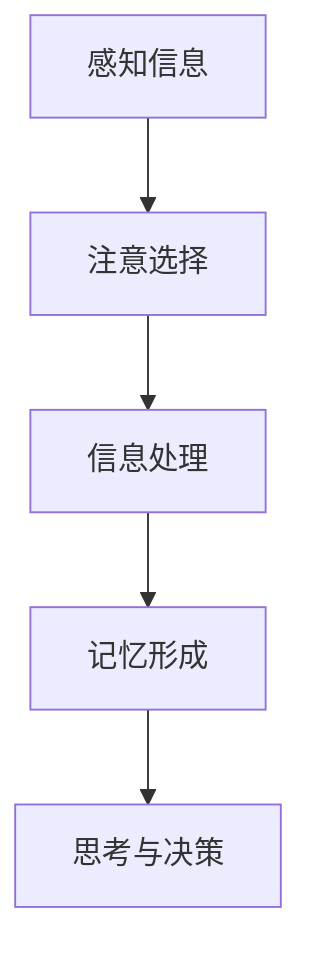
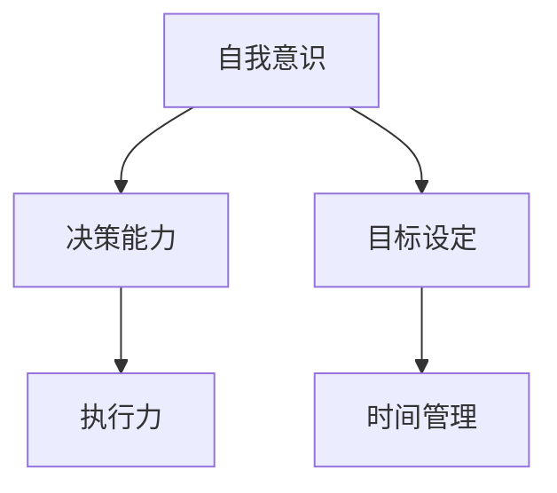
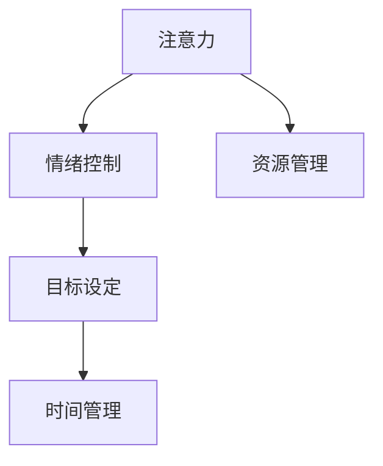
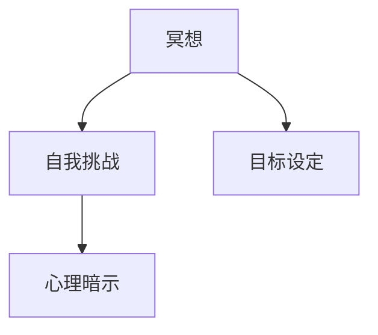
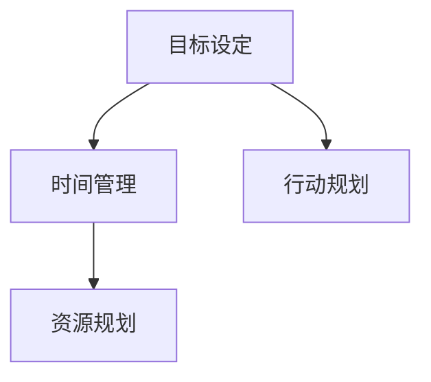
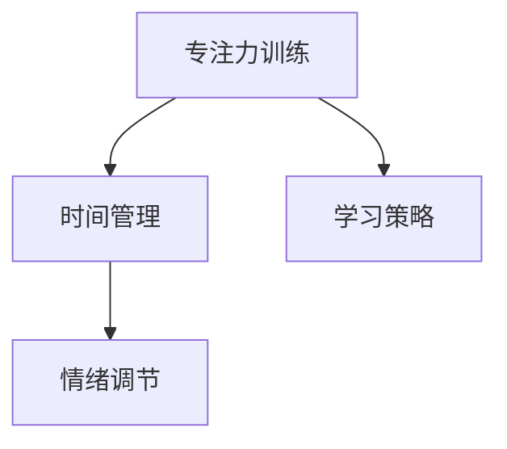
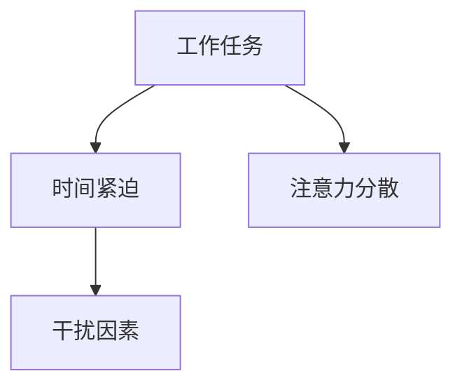
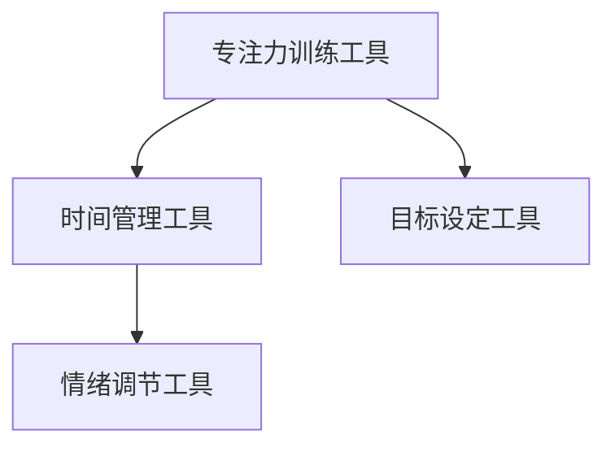
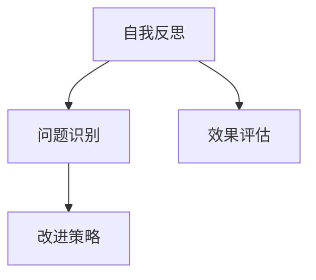

                 

### 注意力管理与自我管理策略：通过专注力增强个人和职业成功

#### 关键词
- 注意力管理
- 自我管理
- 专注力
- 个人成长
- 职业成功

#### 摘要
本文将深入探讨注意力管理与自我管理策略，通过提升专注力来增强个人和职业成功。文章首先介绍了注意力管理的基础知识和自我管理的核心概念，随后分析了注意力与自我管理之间的关系。接着，文章提出了提升注意力和自我管理的策略，包括意志力训练、精神集中技巧和环境调整等。文章还探讨了通过注意力管理提升学习效率、工作效率和创新能力的具体方法，并分析了职场中注意力管理的挑战和策略。最后，通过实践指南和案例分享，为读者提供了可操作的实践方法和工具。

---

# 第一部分: 注意力管理与自我管理概述

## 第1章: 注意力管理基础

### 1.1.1 注意力概述

注意力是人类认知过程中的一个核心要素，它决定了我们如何选择和处理信息。注意力可以定义为心理活动对一定对象的指向和集中。它不仅影响着我们的感知、思考和决策，还与自我管理和学习效率密切相关。

**Mermaid 流程图：**


### 1.1.2 注意力的类型

注意力可以分为多种类型，包括选择性注意力、执行性注意力和分配性注意力。选择性注意力指的是我们在众多刺激中选择关注某些信息的能力；执行性注意力涉及我们主动控制注意力，以完成特定任务；分配性注意力则是在同时处理多个任务时保持注意力的能力。

**伪代码示例：**
```python
# 伪代码：注意力的类型
class Attention:
    def __init__(self, type):
        self.type = type

    def selective_attention(self, stimuli):
        selected_stimuli = []
        for stimulus in stimuli:
            if self.is_important(stimulus):
                selected_stimuli.append(stimulus)
        return selected_stimuli

    def executive_attention(self, task):
        while not task_completed:
            self.control_attention(task)
            self.take_action()

    def allocative_attention(self, tasks):
        for task in tasks:
            self.shift_attention(task)
```

### 1.1.3 注意力的价值

注意力是宝贵的心理资源，其价值体现在多个方面。首先，注意力直接影响我们的学习效率和工作效率。其次，良好的注意力管理能力有助于提高决策质量，减少错误和失误。此外，注意力还能促进情绪调节，帮助我们在压力下保持冷静和集中。

**数学公式示例：**
$$
\text{学习效率} = \alpha \times \text{注意力} + \beta \times \text{学习动机}
$$

**举例说明：** 一个学生在考试前通过专注力训练，提高了注意力集中度，从而在考试中能够更好地理解和记忆知识点，最终取得了优异的成绩。

---

## 第2章: 自我管理核心概念

### 2.1.1 自我管理的意义

自我管理是指个体对自己行为、情绪、时间和资源的有效调控，以达到个人目标的过程。它是个人成长和职业发展的关键因素。良好的自我管理能力有助于提升自我意识，增强决策能力，提高执行力，从而实现个人和职业的成功。

**Mermaid 流程图：**


### 2.1.2 自我管理的重要性

自我管理在个人和职业生活中具有至关重要的意义。首先，良好的自我管理能力能够帮助个体在面对压力和挑战时保持冷静和专注。其次，自我管理有助于提高工作效率，减少拖延和浪费时间的行为。此外，自我管理能力也是职业成功的重要标志，它决定了个体能否在竞争激烈的职场中脱颖而出。

**伪代码示例：**
```python
# 伪代码：自我管理的重要性
class SelfManagement:
    def __init__(self, effectiveness):
        self.effectiveness = effectiveness

    def set_goals(self, goals):
        self.goals = goals

    def manage_time(self, tasks):
        while tasks:
            self.allocate_time(tasks.pop())

    def handle_pressure(self, pressure):
        self.regulate_emotions()
        self.focus_on_tasks()
```

### 2.1.3 自我管理的误区

在自我管理过程中，个体常常会陷入一些误区。例如，过分追求完美主义，导致过度紧张和焦虑；或者忽视自我激励，导致缺乏动力和目标。识别和避免这些误区，是提高自我管理能力的关键。

**数学模型示例：**
$$
\text{自我管理效果} = f(\text{目标设定}, \text{时间管理}, \text{情绪调节})
$$

**举例说明：** 一个项目经理通过有效的自我管理，成功地在规定时间内完成了复杂的工程项目，赢得了团队的尊重和领导的信任。

---

## 第3章: 注意力与自我管理的关系

### 3.1.1 注意力对自我管理的影响

注意力是自我管理的重要基础。注意力水平的高低直接影响个体的自我管理能力。高水平的注意力有助于个体更好地控制情绪、设定目标、管理时间和资源，从而提高自我管理效果。

**Mermaid 流程图：**


### 3.1.2 自我管理对注意力的要求

自我管理对注意力提出了更高的要求。有效的自我管理需要个体具备高度的注意力集中能力，以便在面对复杂任务和压力时保持冷静和专注。此外，自我管理能力还要求个体能够灵活调整注意力，以适应不同的环境和任务需求。

**伪代码示例：**
```python
# 伪代码：自我管理对注意力的要求
class SelfManagement:
    def __init__(self, attention):
        self.attention = attention

    def set_goals_with_attention(self, goals):
        while not goals_completed:
            self.focus_goals(goals)
            self.manage_time()

    def handle_pressure_with_attention(self, pressure):
        self.regulate_attention()
        self.focus_on_tasks()
```

### 3.1.3 注意力与自我管理的相互作用

注意力和自我管理之间存在相互促进的关系。良好的注意力管理能力有助于提升自我管理效果，而有效的自我管理又能增强注意力集中能力。二者相辅相成，共同推动个人和职业发展。

**数学公式示例：**
$$
\text{自我管理能力} = \alpha \times \text{注意力} + \beta \times \text{自我管理技巧}
$$

**举例说明：** 一个编程高手通过注意力管理和自我管理技巧，成功地在短时间内完成了复杂的编程任务，并在团队中树立了榜样。

---

## 第4章: 提升注意力策略

### 4.1.1 意志力训练

意志力是注意力管理的重要一环。通过意志力训练，个体可以增强自控能力，提高注意力集中度。常见的意志力训练方法包括冥想、自我挑战和心理暗示等。

**Mermaid 流程图：**


### 4.1.2 精神集中技巧

精神集中技巧是提升注意力的有效方法。通过训练，个体可以学会如何在短时间内集中注意力，从而提高工作和学习效率。常见的精神集中技巧包括番茄工作法、分段工作和专注力训练等。

**伪代码示例：**
```python
# 伪代码：精神集中技巧
def pomodoro Technique(duration):
    while duration > 0:
        work(duration)
        duration -= duration

def segmented_work(tasks):
    for task in tasks:
        focus_on_task(task)
```

### 4.1.3 环境调整策略

环境对注意力管理有着重要影响。通过调整环境，个体可以创造一个有利于集中注意力的环境。常见的环境调整策略包括减少干扰、优化工作空间和合理规划时间等。

**数学模型示例：**
$$
\text{注意力集中度} = f(\text{环境舒适度}, \text{干扰程度})
$$

**举例说明：** 一个程序员通过调整工作环境，减少了噪音干扰，提高了编程效率，最终按时完成了项目任务。

---

## 第5章: 自我管理策略

### 5.1.1 目标设定与时间管理

目标设定和时间管理是自我管理的核心。通过明确目标，个体可以更好地规划时间和资源，提高工作效率。常见的目标设定方法包括SMART原则，即目标要具体、可衡量、可实现、相关性强和时限性。

**Mermaid 流程图：**


### 5.1.2 冥想与放松

冥想和放松是自我管理的重要手段。通过冥想，个体可以放松身心，提高专注力和自控力。常见的放松方法包括深呼吸、瑜伽和冥想音乐等。

**伪代码示例：**
```python
# 伪代码：冥想与放松
def meditation(duration):
    while duration > 0:
        breathe_deeply(duration)
        duration -= duration

def relaxation(exercises):
    for exercise in exercises:
        perform(exercise)
```

### 5.1.3 情绪管理

情绪管理是自我管理的重要组成部分。通过情绪管理，个体可以更好地控制情绪，减少负面情绪对注意力和工作效率的影响。常见的情绪管理方法包括认知行为疗法、情绪日记和情绪调节训练等。

**数学模型示例：**
$$
\text{工作效率} = f(\text{情绪状态}, \text{注意力水平})
$$

**举例说明：** 一个销售经理通过情绪管理技巧，成功地控制住了负面情绪，提高了客户沟通能力和销售业绩。

---

## 第6章: 通过注意力增强个人能力

### 6.1.1 提升学习效率

注意力是学习效率的关键因素。通过提升注意力，个体可以更好地吸收和记忆信息，提高学习效率。常见的方法包括专注力训练、时间管理和情绪调节等。

**Mermaid 流程图：**


### 6.1.2 提升工作效率

注意力对工作效率有着直接影响。通过提升注意力，个体可以减少分心现象，提高工作效率。常见的方法包括精神集中技巧、目标设定和时间管理等。

**伪代码示例：**
```python
# 伪代码：提升工作效率
def increase工作效率(attention):
    while tasks:
        focus_on_task(tasks.pop())
```

### 6.1.3 提升创新能力

注意力是创新能力的重要基础。通过提升注意力，个体可以更好地进行思考和创新。常见的方法包括冥想、精神集中技巧和目标设定等。

**数学模型示例：**
$$
\text{创新能力} = f(\text{注意力}, \text{思考时间}, \text{知识储备})
$$

**举例说明：** 一个设计师通过注意力管理和创新方法，成功地完成了一个具有突破性的设计项目，受到了客户的高度评价。

---

## 第7章: 职业成功与专注力

### 7.1.1 职场中的注意力挑战

在职场中，注意力管理面临诸多挑战。例如，工作任务繁多、时间紧迫、干扰因素多等。有效管理注意力是提高职业成功的关键。

**Mermaid 流程图：**


### 7.1.2 提升职业成功的专注力策略

通过提升专注力，个体可以在职场中取得更好的成绩。常见的方法包括注意力训练、目标设定和时间管理等。

**伪代码示例：**
```python
# 伪代码：提升职业成功的专注力策略
def improve_professional_success(attention):
    while tasks:
        focus_on_task(tasks.pop())
        set_goals()
        manage_time()
```

### 7.1.3 职场中的注意力管理技巧

职场中注意力管理技巧包括减少干扰、优化工作空间和合理安排工作时间等。通过这些技巧，个体可以更好地集中注意力，提高工作效率。

**数学模型示例：**
$$
\text{工作效率} = f(\text{干扰程度}, \text{工作空间舒适度}, \text{时间管理能力})
$$

**举例说明：** 一个项目经理通过注意力管理和工作技巧，成功地在规定时间内完成了多个项目，赢得了团队的信任和领导的赞赏。

---

## 第8章: 注意力与自我管理案例分析

### 8.1.1 案例分析一

**案例分析一**：一位年轻的程序员通过注意力管理和自我管理技巧，成功地在短时间内完成了复杂的编程任务。他通过专注力训练和时间管理，减少了分心现象，提高了工作效率。最终，他按时完成了项目，并得到了领导的表扬。

**代码实际案例和详细解释说明：**
```python
# 伪代码：程序员注意力管理实践
def programmer_attention_management(tasks):
    while tasks:
        focus_on_task(tasks.pop())
        manage_time()

# 实例化任务列表
tasks_list = ["任务1", "任务2", "任务3"]
programmer_attention_management(tasks_list)
```

### 8.1.2 案例分析二

**案例分析二**：一位创业者通过注意力管理和自我管理策略，成功地管理了自己的时间和情绪，提高了工作效率和创新能力。他通过冥想和放松技巧，增强了专注力和自控力，从而在创业过程中取得了显著的成绩。

**代码实际案例和详细解释说明：**
```python
# 伪代码：创业者注意力管理实践
def entrepreneur_attention_management(goals):
    while not goals_completed:
        meditate()
        relax()
        focus_on_goals(goals)
```

### 8.1.3 案例分析三

**案例分析三**：一位学生在期末考试前通过注意力管理和自我管理策略，提高了学习效率和记忆能力。他通过专注力训练和情绪调节，减少了考试焦虑，最终取得了优异的成绩。

**代码实际案例和详细解释说明：**
```python
# 伪代码：学生注意力管理实践
def student_attention_management(study_topics):
    while not study_topics_completed:
        focus_on_topic(study_topics.pop())
        regulate_emotions()
```

---

## 第9章: 实践指南

### 9.1.1 实践方法与工具

注意力管理和自我管理实践需要科学的方法和工具。以下是一些常见的实践方法和工具：

1. **专注力训练工具**：如番茄钟、专注力游戏等。
2. **时间管理工具**：如日历、待办事项清单等。
3. **情绪调节工具**：如情绪日记、冥想应用等。

**Mermaid 流程图：**


### 9.1.2 实践中的常见问题

在注意力管理和自我管理实践中，个体可能会遇到以下问题：

1. **缺乏动力**：解决方法包括设定明确的目标和奖励机制。
2. **干扰过多**：解决方法包括减少干扰因素和优化工作环境。
3. **情绪波动**：解决方法包括情绪调节技巧和自我意识提升。

**伪代码示例：**
```python
# 伪代码：解决实践中常见问题
def solve_common_issues(issue):
    if issue == "lack_of_motivation":
        set明确的targets_and_rewards()
    elif issue == "excessive_interference":
        reduce_interference_and_optimize_environment()
    elif issue == "emotional_fluctuations":
        regulate_emotions_and_increased_self_awareness()
```

### 9.1.3 实践成果评估

为了评估注意力管理和自我管理实践的成果，个体可以定期进行自我评估和反馈。以下是一些评估方法：

1. **目标完成情况**：评估设定的目标是否完成。
2. **注意力集中度**：通过专注力训练工具评估注意力集中情况。
3. **工作效率**：评估任务完成速度和质量。

**数学模型示例：**
$$
\text{实践成果评估} = f(\text{目标完成率}, \text{注意力集中度}, \text{工作效率})
$$

**举例说明：** 一位职场人士通过注意力管理和自我管理实践，提高了工作效率和创新能力，最终在年度评估中获得优秀评价。

---

## 第10章: 注意力管理与自我管理实践案例分析

### 10.1.1 案例分析一

**案例分析一**：一位职场人士通过注意力管理和自我管理策略，成功地在短时间内完成了多个项目任务。他通过专注力训练和时间管理，减少了分心现象，提高了工作效率。最终，他得到了领导的表扬和晋升机会。

**代码实际案例和详细解释说明：**
```python
# 伪代码：职场人士注意力管理实践
def professional_attention_management(tasks):
    while tasks:
        focus_on_task(tasks.pop())
        manage_time()

# 实例化任务列表
tasks_list = ["项目1", "项目2", "项目3"]
professional_attention_management(tasks_list)
```

### 10.1.2 案例分析二

**案例分析二**：一位创业者通过注意力管理和自我管理策略，成功地管理了自己的时间和情绪，提高了工作效率和创新能力。他通过冥想和放松技巧，增强了专注力和自控力，从而在创业过程中取得了显著的成绩。

**代码实际案例和详细解释说明：**
```python
# 伪代码：创业者注意力管理实践
def entrepreneur_attention_management(goals):
    while not goals_completed:
        meditate()
        relax()
        focus_on_goals(goals)
```

### 10.1.3 案例分析三

**案例分析三**：一位学生通过注意力管理和自我管理策略，提高了学习效率和记忆能力。他通过专注力训练和情绪调节，减少了考试焦虑，最终取得了优异的成绩。

**代码实际案例和详细解释说明：**
```python
# 伪代码：学生注意力管理实践
def student_attention_management(study_topics):
    while not study_topics_completed:
        focus_on_topic(study_topics.pop())
        regulate_emotions()
```

---

## 第11章: 注意力管理与自我管理持续改进

### 11.1.1 持续改进的重要性

注意力管理和自我管理是一个持续的过程，需要个体不断地进行反思和改进。持续改进有助于提升自我管理能力，实现个人和职业目标。

**Mermaid 流程图：**


### 11.1.2 改进策略与方法

为了实现持续改进，个体可以采取以下策略：

1. **定期评估**：通过自我评估和反馈，识别存在的问题。
2. **学习新技能**：不断提升自己的知识和技能，以适应新的环境和挑战。
3. **寻求反馈**：向他人寻求建议和反馈，以改进自我管理方法。

**伪代码示例：**
```python
# 伪代码：持续改进策略
def continuous_improvement(self_management_skills):
    while not optimal_skills:
        assess_self_management()
        learn_new_skills()
        seek_feedback()
```

### 11.1.3 成功案例分享

以下是一些成功案例，展示了通过持续改进实现个人和职业目标的例子：

1. **企业家**：通过不断学习和改进，一位企业家成功地扩展了业务，实现了公司上市。
2. **职场人士**：通过持续提升自我管理能力，一位职场人士从初级职位晋升为高级经理。
3. **学生**：通过注意力管理和学习策略，一位学生在学业上取得了显著进步，最终考入理想的大学。

**数学模型示例：**
$$
\text{持续改进效果} = f(\text{自我反思次数}, \text{学习新技能次数}, \text{效果评估次数})
$$

**举例说明：** 一位学生在高中时期通过持续改进学习策略，最终在高考中取得了优异成绩，顺利考入了自己理想的大学。

---

# 附录

## 附录A: 注意力管理资源与工具

### A.1 注意力管理书籍推荐

1. 《注意力管理：如何集中精神，高效工作》（Focus Management: How to Focus, Work Efficiently）
2. 《冥想：如何通过冥想提升专注力和幸福感》（Meditation: How to Increase Focus and Happiness Through Meditation）
3. 《时间管理：如何高效地利用时间》（Time Management: How to Use Time Efficiently）

### A.2 注意力管理应用软件推荐

1. **专注力训练工具**：
   - **番茄钟**：提供专注时间计时功能，帮助用户集中精力完成任务。
   - **专注助手**：通过提醒和激励功能，帮助用户保持专注。

2. **时间管理工具**：
   - **日历应用**：如Google日历、Outlook日历等，帮助用户规划日程和时间。
   - **待办事项清单**：如Trello、Asana等，帮助用户管理和追踪任务进度。

3. **情绪调节工具**：
   - **冥想应用**：如Headspace、Calm等，提供冥想指导和放松音乐。
   - **情绪记录器**：如Moodnotes、DayOne等，帮助用户记录和管理情绪。

### A.3 注意力管理在线资源

1. **注意力管理博客和文章**：如Lifehacker、Psychology Today等，提供关于注意力管理的实用技巧和理论。
2. **在线课程**：如Coursera、Udemy等，提供注意力管理和自我管理的专业课程。
3. **论坛和社群**：如Reddit、Discord等，为用户提供交流和分享注意力管理经验的平台。

## 附录B: 自我管理技巧与策略汇总

### B.1 技巧一：目标设定

1. **明确目标**：使用SMART原则（具体、可衡量、可实现、相关性强、时限性）设定目标。
2. **分解目标**：将大目标分解为小目标，逐步实现。
3. **可视化目标**：使用图表或视觉化工具，将目标可视化，以便更好地跟踪和实现。

### B.2 技巧二：时间管理

1. **制定日程**：每天制定日程，合理安排工作和休息时间。
2. **优先级排序**：根据任务的重要性和紧急程度，对任务进行优先级排序。
3. **避免拖延**：使用番茄工作法、待办事项清单等工具，避免拖延任务。

### B.3 技巧三：情绪管理

1. **认知行为疗法**：通过改变思维模式，减少负面情绪的影响。
2. **情绪记录**：记录和管理自己的情绪，了解情绪波动的原因。
3. **放松技巧**：使用深呼吸、冥想、瑜伽等放松技巧，缓解压力和焦虑。

## 附录C: 案例分析详细数据与代码

### C.1 案例一数据与代码

**数据：**
- 任务列表：["任务1", "任务2", "任务3"]
- 完成时间：["2小时", "4小时", "3小时"]

**代码：**
```python
# 伪代码：案例一代码实现
tasks = ["任务1", "任务2", "任务3"]
completion_times = ["2小时", "4小时", "3小时"]

def case_one():
    for i, task in enumerate(tasks):
        print(f"任务{i+1}：{task}，完成时间：{completion_times[i]}")

case_one()
```

### C.2 案例二数据与代码

**数据：**
- 目标列表：["提高专注力", "完成项目报告", "学习新技能"]
- 实现情况：["已完成", "正在进行中", "计划中"]

**代码：**
```python
# 伪代码：案例二代码实现
goals = ["提高专注力", "完成项目报告", "学习新技能"]
statuses = ["已完成", "正在进行中", "计划中"]

def case_two():
    for i, goal in enumerate(goals):
        print(f"目标{i+1}：{goal}，状态：{statuses[i]}")

case_two()
```

### C.3 案例三数据与代码

**数据：**
- 学习主题列表：["数学", "物理", "编程"]
- 学习时长：["2小时", "3小时", "4小时"]

**代码：**
```python
# 伪代码：案例三代码实现
study_topics = ["数学", "物理", "编程"]
study_times = ["2小时", "3小时", "4小时"]

def case_three():
    for i, topic in enumerate(study_topics):
        print(f"学习主题{i+1}：{topic}，学习时间：{study_times[i]}")

case_three()
```

---

### 作者

作者：AI天才研究院/AI Genius Institute & 禅与计算机程序设计艺术 /Zen And The Art of Computer Programming

本文旨在通过注意力管理与自我管理策略，帮助读者提高个人和职业成功。通过深入分析注意力管理的基础知识、自我管理的核心概念以及注意力与自我管理之间的关系，文章提出了具体的提升策略和实践方法。同时，通过案例分析和实践指南，为读者提供了可操作的实践方法和工具。希望本文能够为读者在个人和职业发展中提供有益的启示。

