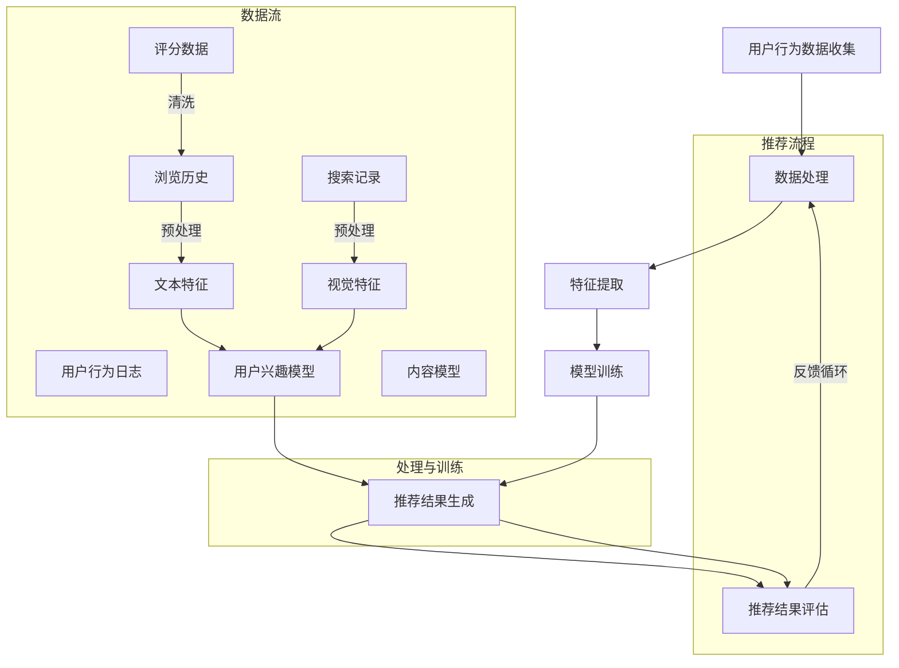

                 

### 文章标题

# 注意力经济与个性化推荐算法：如何为受众提供定制体验

### 关键词

- 注意力经济
- 个性化推荐算法
- 定制体验
- 协同过滤
- 内容推荐
- 混合推荐
- 用户行为分析

### 摘要

随着互联网的快速发展，信息爆炸时代的到来让用户面临大量的信息选择。在这个背景下，注意力经济应运而生，它强调用户注意力的价值。个性化推荐算法通过分析用户的行为和兴趣，为用户精准推送内容，成为满足用户定制需求的重要手段。本文将详细探讨注意力经济的概念及其对个性化推荐的影响，分析个性化推荐算法的核心原理和实现方法，并通过实际案例分析，展示如何将注意力经济理念融入个性化推荐系统，优化用户体验。

### 目录大纲

## 第一部分：注意力经济概述

### 第1章：注意力经济的起源与发展

#### 1.1 注意力经济的定义与核心要素

#### 1.2 注意力经济与传统经济的差异

#### 1.3 注意力经济的影响与挑战

### 第2章：个性化推荐算法基础

#### 2.1 个性化推荐算法的定义与分类

#### 2.2 个性化推荐算法的核心技术

#### 2.3 个性化推荐算法的评估指标

## 第二部分：推荐系统架构与实现

### 第3章：推荐系统架构设计

#### 3.1 推荐系统的总体架构

#### 3.2 数据采集与处理

#### 3.3 模型训练与优化

#### 3.4 推荐结果评估与调整

### 第4章：基于内容推荐的算法实现

#### 4.1 内容推荐算法原理

#### 4.2 内容推荐算法实现步骤

#### 4.3 内容推荐算法案例分析

### 第5章：基于协同过滤的推荐算法实现

#### 5.1 协同过滤算法原理

#### 5.2 协同过滤算法实现步骤

#### 5.3 协同过滤算法案例分析

### 第6章：混合推荐算法实现

#### 6.1 混合推荐算法原理

#### 6.2 混合推荐算法实现步骤

#### 6.3 混合推荐算法案例分析

## 第三部分：注意力经济在个性化推荐中的应用

### 第7章：注意力经济在个性化推荐中的应用策略

#### 7.1 注意力经济在个性化推荐中的价值

#### 7.2 注意力导向的推荐策略

#### 7.3 注意力经济在个性化推荐中的挑战与解决方案

### 第8章：注意力经济下的用户体验优化

#### 8.1 个性化推荐的用户体验设计

#### 8.2 注意力经济与用户体验的关系

#### 8.3 注意力经济下的用户体验优化策略

### 第9章：案例分析：成功应用注意力经济的推荐系统

#### 9.1 案例介绍

#### 9.2 注意力经济在案例中的应用

#### 9.3 案例的效果与启示

## 第四部分：未来发展趋势

### 第10章：注意力经济与个性化推荐算法的未来发展

#### 10.1 未来发展趋势分析

#### 10.2 新技术对注意力经济与个性化推荐的影响

#### 10.3 注意力经济与个性化推荐算法的可持续发展

### 第11章：结论与展望

#### 11.1 注意力经济与个性化推荐算法的重要性

#### 11.2 未来研究方向与挑战

#### 11.3 注意力经济与个性化推荐算法的发展方向

## 附录

### 附录A：推荐系统开源框架与工具

#### A.1 主要开源框架介绍

#### A.2 常用推荐系统工具

### 附录B：注意力经济与个性化推荐算法的 Mermaid 流程图

#### B.1 注意力经济模型

#### B.2 个性化推荐算法架构图

### 附录C：数学模型与公式解析

#### C.1 常用数学模型

#### C.2 公式解析与推导

---

### 第一部分：注意力经济概述

### 第1章：注意力经济的起源与发展

注意力经济这一概念起源于对用户在信息过载环境中行为的研究。随着互联网的兴起，信息的爆炸性增长使得用户面临前所未有的选择困难。在这种背景下，用户对信息的注意力和时间成为稀缺资源，这种稀缺性引发了注意力经济的研究和探讨。

#### 1.1 注意力经济的定义与核心要素

注意力经济可以定义为一种以用户注意力为核心的经济模式。其核心要素包括：

1. **注意力：** 用户对信息的关注程度，反映了用户对于特定内容的兴趣和需求。
2. **时间：** 用户浏览、处理信息所花费的时间。
3. **内容：** 提供给用户的信息或服务，包括文本、图片、视频等。
4. **平台：** 提供信息的载体，如网站、APP、社交媒体等。

#### 1.2 注意力经济与传统经济的差异

与传统经济模式相比，注意力经济具有以下几个显著特点：

1. **稀缺性：** 注意力资源相对于信息资源来说更为稀缺，因此其价值更高。
2. **定制化：** 注意力经济强调个性化，通过精准的内容推送满足用户的需求。
3. **互动性：** 用户不仅是信息的消费者，也可以成为信息的生产者，平台与用户之间的互动性增强。
4. **即时性：** 用户对信息的获取和处理更加追求即时性。

#### 1.3 注意力经济的影响与挑战

注意力经济对商业和社会产生了深远的影响：

1. **商业：** 企业通过吸引和保持用户注意力实现盈利，个性化推荐成为重要的营销工具。
2. **社会：** 用户注意力被高度分散，信息过载现象加剧，用户选择困难。
3. **挑战：** 注意力资源的稀缺性要求企业必须更加精准和高效地利用用户注意力，同时保护用户的隐私和数据安全。

在注意力经济的背景下，个性化推荐算法的重要性愈发突出。通过分析用户的行为和兴趣，个性化推荐算法能够为用户精准推送内容，满足其定制化需求，从而提升用户满意度和忠诚度。

---

### 第2章：个性化推荐算法基础

个性化推荐算法作为注意力经济中的重要工具，其核心在于通过分析用户的行为和兴趣，为用户提供个性化的内容推荐。本节将详细介绍个性化推荐算法的定义、分类及其核心技术。

#### 2.1 个性化推荐算法的定义与分类

个性化推荐算法是指利用数据挖掘和机器学习技术，根据用户的历史行为、兴趣偏好以及其他相关信息，为用户提供个性化的内容推荐。根据推荐算法的生成机制，个性化推荐算法主要分为以下几类：

1. **基于内容的推荐（Content-based Recommendation）**：通过分析内容的属性和特征，将具有相似属性的内容推荐给用户。
2. **基于协同过滤的推荐（Collaborative Filtering）**：通过分析用户之间的共同行为，将用户喜欢的商品或内容推荐给其他有相似兴趣的用户。
3. **基于模型的推荐（Model-based Recommendation）**：通过建立用户兴趣模型或内容模型，利用模型进行预测和推荐。
4. **混合推荐（Hybrid Recommendation）**：结合多种推荐算法的优点，实现更精准的推荐。

#### 2.2 个性化推荐算法的核心技术

个性化推荐算法的核心技术包括数据采集、数据预处理、模型训练、模型评估和推荐结果生成等环节。

1. **数据采集**：
   - **用户行为数据**：如浏览历史、点击记录、购买记录等。
   - **内容特征数据**：如文本、图片、视频等内容的属性信息。

2. **数据预处理**：
   - **数据清洗**：去除无效、错误或重复的数据。
   - **特征提取**：提取有用的特征信息，如用户特征、内容特征等。
   - **数据归一化**：对特征数据进行标准化处理，使其具备可比性。

3. **模型训练**：
   - **基于内容的推荐**：使用文本相似度、TF-IDF等方法训练内容模型。
   - **基于协同过滤的推荐**：使用矩阵分解、K最近邻等方法训练用户兴趣模型。
   - **基于模型的推荐**：使用机器学习算法，如决策树、随机森林、神经网络等，训练用户兴趣模型或内容模型。

4. **模型评估**：
   - **准确率（Accuracy）**：推荐结果中正确匹配的比例。
   - **召回率（Recall）**：推荐结果中包含用户实际兴趣项目的比例。
   - **覆盖率（Coverage）**：推荐结果中包含的新内容比例。
   - **新颖度（Novelty）**：推荐结果中未被用户发现的新内容比例。

5. **推荐结果生成**：
   - **基于内容的推荐**：根据用户兴趣和内容特征，生成内容推荐列表。
   - **基于协同过滤的推荐**：根据用户之间的相似度和物品的评分，生成推荐列表。
   - **基于模型的推荐**：根据用户兴趣模型或内容模型，生成推荐列表。
   - **混合推荐**：综合以上几种方法，生成更精准的推荐列表。

通过以上步骤，个性化推荐算法能够有效满足用户的定制化需求，提升用户满意度和忠诚度。

---

## 第二部分：推荐系统架构与实现

### 第3章：推荐系统架构设计

推荐系统的设计涉及到多个层面的架构，从数据流到数据处理，再到模型训练和推荐结果的生成，每一个环节都至关重要。本节将详细探讨推荐系统的总体架构设计，包括数据采集、数据处理、模型训练、推荐结果评估与调整等关键环节。

#### 3.1 推荐系统的总体架构

推荐系统的总体架构可以分为以下五个主要模块：

1. **数据采集模块**：负责收集用户行为数据、内容特征数据等原始数据。
2. **数据处理模块**：负责对原始数据进行清洗、预处理和特征提取，为模型训练提供高质量的数据。
3. **模型训练模块**：负责使用数据处理模块提供的数据进行模型训练，包括用户兴趣模型、内容模型等。
4. **推荐结果生成模块**：负责根据模型预测结果生成推荐列表，并输出给用户。
5. **推荐结果评估模块**：负责对推荐结果进行评估，并根据评估结果调整模型参数，优化推荐效果。

#### 3.2 数据采集与处理

1. **数据采集**：
   - **用户行为数据**：包括用户浏览、点击、搜索、购买等行为数据。
   - **内容特征数据**：包括文本、图片、视频等内容的特征数据。
   - **外部数据**：如用户社交媒体数据、地理位置数据等。

2. **数据处理**：
   - **数据清洗**：去除无效、错误或重复的数据，保证数据的准确性。
   - **特征提取**：从原始数据中提取有用的特征信息，如文本的TF-IDF向量、图片的视觉特征等。
   - **数据归一化**：对特征数据进行标准化处理，使其具备可比性。

#### 3.3 模型训练与优化

1. **用户兴趣模型**：
   - **基于内容的推荐**：使用文本相似度、TF-IDF等方法训练内容模型。
   - **基于协同过滤的推荐**：使用矩阵分解、K最近邻等方法训练用户兴趣模型。
   - **基于模型的推荐**：使用机器学习算法，如决策树、随机森林、神经网络等，训练用户兴趣模型。

2. **内容模型**：
   - **基于内容的推荐**：对文本、图片、视频等内容的属性进行建模。
   - **基于协同过滤的推荐**：通过对用户评分数据的矩阵分解，提取内容特征。

3. **模型优化**：
   - **参数调整**：通过交叉验证等方法，调整模型参数，优化模型性能。
   - **集成学习**：结合多种模型，使用集成学习方法提高推荐精度。

#### 3.4 推荐结果评估与调整

1. **评估指标**：
   - **准确率（Accuracy）**：推荐结果中正确匹配的比例。
   - **召回率（Recall）**：推荐结果中包含用户实际兴趣项目的比例。
   - **覆盖率（Coverage）**：推荐结果中包含的新内容比例。
   - **新颖度（Novelty）**：推荐结果中未被用户发现的新内容比例。

2. **结果评估**：
   - **在线评估**：实时评估推荐效果，根据用户反馈调整推荐策略。
   - **离线评估**：使用A/B测试等方法，评估不同推荐策略的性能。

3. **调整与优化**：
   - **模型调整**：根据评估结果，调整模型参数和结构，优化推荐效果。
   - **数据调整**：根据用户反馈，更新用户行为数据和内容特征数据，提高数据质量。

通过以上架构设计，推荐系统能够高效、精准地为用户提供个性化推荐，满足用户的定制化需求。

### 第4章：基于内容推荐的算法实现

基于内容推荐的算法是个性化推荐系统的一种重要方法，其核心思想是通过分析内容的属性和特征，将相似的内容推荐给具有相似兴趣的用户。本节将详细探讨基于内容推荐算法的原理、实现步骤及案例分析。

#### 4.1 内容推荐算法原理

内容推荐算法主要通过以下步骤实现个性化推荐：

1. **内容特征提取**：从文本、图片、视频等原始内容中提取特征信息。例如，对于文本，可以使用TF-IDF模型提取词语特征；对于图片和视频，可以使用视觉特征提取算法，如SIFT、HOG等。

2. **用户兴趣建模**：根据用户的历史行为数据，建立用户兴趣模型。这通常涉及到用户对各类内容的偏好分析，从而构建用户兴趣向量。

3. **相似度计算**：计算内容特征和用户兴趣特征之间的相似度。常用的相似度计算方法包括余弦相似度、欧氏距离等。

4. **推荐列表生成**：根据相似度计算结果，为用户生成个性化推荐列表。推荐列表中的内容应该是用户可能感兴趣且未被频繁推荐的。

#### 4.2 内容推荐算法实现步骤

1. **数据预处理**：
   - **数据清洗**：去除无效、错误或重复的数据，保证数据的准确性。
   - **特征提取**：从原始内容中提取特征信息。例如，对于文本，可以使用TF-IDF提取词语特征；对于图片和视频，可以使用视觉特征提取算法提取特征。

2. **用户兴趣建模**：
   - **兴趣标签分配**：根据用户的历史行为数据，为每个用户分配兴趣标签。
   - **兴趣向量构建**：将用户兴趣标签转换为向量表示，用于后续相似度计算。

3. **内容特征提取**：
   - **内容属性分析**：分析内容的属性信息，如类别、标签等。
   - **特征向量构建**：将内容的属性信息转换为向量表示。

4. **相似度计算**：
   - **相似度度量**：计算用户兴趣特征向量与内容特征向量之间的相似度，常用的方法包括余弦相似度和欧氏距离等。

5. **推荐列表生成**：
   - **推荐候选集构建**：根据相似度计算结果，从所有内容中构建推荐候选集。
   - **推荐结果排序**：对推荐候选集进行排序，生成最终推荐列表。

#### 4.3 内容推荐算法案例分析

以电子商务平台为例，基于内容推荐算法可以帮助平台为用户推荐可能感兴趣的商品。

1. **数据预处理**：
   - **用户行为数据**：收集用户的浏览历史、点击记录、购买记录等行为数据。
   - **商品属性数据**：收集商品的类别、标签、价格等属性信息。

2. **用户兴趣建模**：
   - **兴趣标签分配**：根据用户的浏览记录，为用户分配兴趣标签，如“时尚”、“家居”等。
   - **兴趣向量构建**：将用户的兴趣标签转换为向量表示，用于后续相似度计算。

3. **内容特征提取**：
   - **商品属性分析**：分析商品的类别、标签等属性信息。
   - **特征向量构建**：将商品的属性信息转换为向量表示。

4. **相似度计算**：
   - **相似度度量**：计算用户兴趣特征向量与商品特征向量之间的相似度，生成相似度分数。

5. **推荐列表生成**：
   - **推荐候选集构建**：根据相似度分数，从所有商品中构建推荐候选集。
   - **推荐结果排序**：对推荐候选集进行排序，生成最终推荐列表。

通过以上案例分析，可以清楚地看到基于内容推荐算法在电子商务平台中的应用，不仅能够提高用户的购物体验，还能为平台带来更高的销售额和用户粘性。

### 第5章：基于协同过滤的推荐算法实现

基于协同过滤的推荐算法是另一种重要的个性化推荐方法，其核心思想是通过分析用户之间的共同行为，发现用户的兴趣相似性，从而为用户提供个性化的推荐。本节将详细介绍协同过滤算法的原理、实现步骤及案例分析。

#### 5.1 协同过滤算法原理

协同过滤算法主要通过以下步骤实现个性化推荐：

1. **用户行为数据收集**：收集用户对物品的评分、浏览、购买等行为数据。

2. **用户相似度计算**：根据用户之间的共同行为，计算用户之间的相似度。常用的相似度计算方法包括余弦相似度、皮尔逊相关系数等。

3. **物品相似度计算**：根据用户评分数据，计算物品之间的相似度。常用的方法包括基于用户评分的K最近邻（KNN）算法和基于物品内容的余弦相似度计算。

4. **推荐列表生成**：根据用户相似度和物品相似度，为用户生成推荐列表。推荐列表中的物品应该是用户相似度高的其他用户喜欢的，同时物品相似度也要高。

#### 5.2 协同过滤算法实现步骤

协同过滤算法的实现可以分为以下几个步骤：

1. **数据预处理**：
   - **评分矩阵构建**：将用户行为数据转换为评分矩阵，矩阵中的每个元素表示用户对某物品的评分。
   - **缺失值处理**：处理评分矩阵中的缺失值，常用的方法有均值填补、最邻近填补等。

2. **用户相似度计算**：
   - **余弦相似度计算**：计算两个用户之间的余弦相似度，公式如下：
     \[
     \text{similarity}_{uv} = \frac{\text{dot}(r_u, r_v)}{\|\text{r_u}\|\|\text{r_v}\|}
     \]
     其中，\(r_u\) 和 \(r_v\) 分别表示用户 u 和用户 v 的评分向量，\(\|\text{r_u}\|\) 和 \(\|\text{r_v}\|\) 分别表示用户 u 和用户 v 的评分向量模长，\(\text{dot}(r_u, r_v)\) 表示用户 u 和用户 v 的评分向量点积。

3. **物品相似度计算**：
   - **基于用户评分的K最近邻（KNN）算法**：选择 k 个相似度最高的用户，找到这些用户共同喜欢的物品进行推荐。
   - **基于物品内容的余弦相似度计算**：计算物品之间的余弦相似度，公式如下：
     \[
     \text{similarity}_{ij} = \frac{\text{dot}(v_i, v_j)}{\|\text{v_i}\|\|\text{v_j}\|}
     \]
     其中，\(v_i\) 和 \(v_j\) 分别表示物品 i 和物品 j 的特征向量，\(\|\text{v_i}\|\) 和 \(\|\text{v_j}\|\) 分别表示物品 i 和物品 j 的特征向量模长，\(\text{dot}(v_i, v_j)\) 表示物品 i 和物品 j 的特征向量点积。

4. **推荐列表生成**：
   - **基于用户相似度的推荐**：根据用户相似度矩阵，为每个用户生成推荐列表。推荐列表中的物品应该是用户相似度高的其他用户喜欢的。
   - **基于物品相似度的推荐**：根据物品相似度矩阵，为每个用户生成推荐列表。推荐列表中的物品应该是用户感兴趣的，同时与其他用户喜欢的物品相似。

#### 5.3 协同过滤算法案例分析

以电影推荐系统为例，基于协同过滤算法可以帮助用户发现感兴趣的电影。

1. **数据预处理**：
   - **评分矩阵构建**：收集用户对电影的评分数据，构建评分矩阵。
   - **缺失值处理**：处理评分矩阵中的缺失值，使用均值填补方法。

2. **用户相似度计算**：
   - **余弦相似度计算**：计算用户之间的余弦相似度。

3. **物品相似度计算**：
   - **基于用户评分的K最近邻（KNN）算法**：选择 k 个相似度最高的用户，找到这些用户共同喜欢的电影进行推荐。

4. **推荐列表生成**：
   - **基于用户相似度的推荐**：为每个用户生成推荐列表。推荐列表中的电影应该是用户相似度高的其他用户喜欢的。
   - **基于物品相似度的推荐**：为每个用户生成推荐列表。推荐列表中的电影应该是用户感兴趣的，同时与其他用户喜欢的电影相似。

通过以上案例分析，可以看到基于协同过滤的推荐算法在电影推荐系统中的应用，能够有效地为用户发现感兴趣的电影，提高用户满意度。

### 第6章：混合推荐算法实现

混合推荐算法结合了基于内容推荐和基于协同过滤的推荐算法的优点，通过融合不同算法的推荐结果，生成更精准、多样化的推荐列表。本节将详细探讨混合推荐算法的原理、实现步骤及案例分析。

#### 6.1 混合推荐算法原理

混合推荐算法的核心思想是综合利用基于内容推荐和基于协同过滤的推荐结果，以实现更优化的推荐效果。其原理如下：

1. **基于内容的推荐**：通过分析内容的属性和特征，将相似的内容推荐给用户。
2. **基于协同过滤的推荐**：通过分析用户之间的共同行为，发现用户的兴趣相似性，为用户推荐感兴趣的物品。

混合推荐算法通过以下步骤实现个性化推荐：

1. **内容特征提取**：从文本、图片、视频等原始内容中提取特征信息。
2. **用户兴趣建模**：根据用户的历史行为数据，建立用户兴趣模型。
3. **协同过滤推荐**：根据用户兴趣模型和内容特征，利用协同过滤算法生成初步推荐列表。
4. **内容推荐**：根据内容特征和用户兴趣模型，利用基于内容的推荐算法生成推荐列表。
5. **融合推荐结果**：将协同过滤推荐和内容推荐的推荐结果进行融合，生成最终的推荐列表。

#### 6.2 混合推荐算法实现步骤

混合推荐算法的实现可以分为以下几个步骤：

1. **数据预处理**：
   - **评分矩阵构建**：将用户行为数据转换为评分矩阵。
   - **缺失值处理**：处理评分矩阵中的缺失值，使用均值填补、最邻近填补等方法。

2. **内容特征提取**：
   - **文本特征提取**：使用TF-IDF等方法提取文本特征向量。
   - **图片和视频特征提取**：使用卷积神经网络（CNN）等方法提取视觉特征向量。

3. **用户兴趣建模**：
   - **协同过滤模型训练**：使用矩阵分解、K最近邻等方法训练用户兴趣模型。
   - **内容模型训练**：使用基于内容的推荐算法训练内容模型。

4. **协同过滤推荐**：
   - **用户相似度计算**：计算用户之间的相似度，使用余弦相似度等方法。
   - **物品相似度计算**：计算物品之间的相似度，使用基于用户评分的K最近邻（KNN）算法等。
   - **生成初步推荐列表**：根据用户相似度和物品相似度，生成初步推荐列表。

5. **内容推荐**：
   - **内容特征相似度计算**：计算用户兴趣模型与内容特征向量之间的相似度。
   - **生成推荐列表**：根据内容特征相似度，生成内容推荐列表。

6. **融合推荐结果**：
   - **加权融合**：将协同过滤推荐和内容推荐的推荐结果进行加权融合，生成最终推荐列表。
   - **排序**：对融合后的推荐列表进行排序，生成用户个性化推荐列表。

#### 6.3 混合推荐算法案例分析

以电子商务平台为例，混合推荐算法可以帮助平台为用户推荐可能感兴趣的商品。

1. **数据预处理**：
   - **用户行为数据**：收集用户的浏览记录、点击记录、购买记录等数据。
   - **商品属性数据**：收集商品的类别、标签、价格等属性信息。

2. **内容特征提取**：
   - **文本特征提取**：使用TF-IDF等方法提取商品描述的文本特征向量。
   - **图片和视频特征提取**：使用卷积神经网络（CNN）等方法提取商品图片和视频的视觉特征向量。

3. **用户兴趣建模**：
   - **协同过滤模型训练**：使用矩阵分解、K最近邻等方法训练用户兴趣模型。
   - **内容模型训练**：使用基于内容的推荐算法训练商品内容模型。

4. **协同过滤推荐**：
   - **用户相似度计算**：计算用户之间的相似度。
   - **物品相似度计算**：计算商品之间的相似度。
   - **生成初步推荐列表**：根据用户相似度和商品相似度，生成初步推荐列表。

5. **内容推荐**：
   - **内容特征相似度计算**：计算用户兴趣模型与商品特征向量之间的相似度。
   - **生成推荐列表**：根据内容特征相似度，生成商品内容推荐列表。

6. **融合推荐结果**：
   - **加权融合**：将协同过滤推荐和内容推荐的推荐结果进行加权融合，生成最终推荐列表。
   - **排序**：对融合后的推荐列表进行排序，生成用户个性化推荐列表。

通过以上案例分析，可以清楚地看到混合推荐算法在电子商务平台中的应用，不仅能够提高用户的购物体验，还能为平台带来更高的销售额和用户粘性。

### 第7章：注意力经济在个性化推荐中的应用策略

注意力经济强调用户注意力的价值，在个性化推荐系统中应用注意力经济理念，可以更好地满足用户的定制化需求，提高推荐效果。本节将探讨注意力经济在个性化推荐中的应用策略，包括用户行为分析、注意力导向的推荐策略及注意力经济在个性化推荐中的挑战与解决方案。

#### 7.1 注意力经济在个性化推荐中的价值

注意力经济在个性化推荐中的价值主要体现在以下几个方面：

1. **提升用户体验**：通过精准地推送用户感兴趣的内容，减少信息过载，提升用户的满意度。
2. **增强用户粘性**：通过持续的个性化推荐，保持用户对平台的关注和活跃度。
3. **提高转化率**：通过精准的推荐，提高用户对推荐内容的点击率和购买率。
4. **增加平台收益**：通过提升用户满意度和粘性，提高平台的广告收入和销售额。

#### 7.2 注意力导向的推荐策略

注意力导向的推荐策略旨在通过分析用户的行为数据，识别和预测用户的注意力模式，从而实现个性化推荐。具体策略包括：

1. **行为数据收集与分析**：收集用户的浏览记录、点击记录、搜索记录等行为数据，通过分析这些数据，识别用户的兴趣和行为模式。
2. **注意力模型构建**：利用机器学习算法，如聚类分析、时间序列分析等，构建用户注意力模型，预测用户的下一步行为。
3. **实时推荐**：根据用户注意力模型，实时推送用户可能感兴趣的内容，提高用户的点击率和满意度。
4. **个性化推荐**：结合用户的历史行为和当前行为，为用户提供个性化的推荐，满足用户的定制化需求。

#### 7.3 注意力经济在个性化推荐中的挑战与解决方案

注意力经济在个性化推荐中面临以下挑战：

1. **数据隐私保护**：个性化推荐依赖于用户的行为数据，如何保护用户隐私成为一大挑战。
   - **解决方案**：采用加密技术、匿名化处理等方法，确保用户数据的安全性和隐私性。

2. **推荐效果评估**：如何准确评估推荐效果，提高推荐准确性。
   - **解决方案**：采用多种评估指标，如准确率、召回率、覆盖率、新颖度等，综合评估推荐效果。

3. **动态调整推荐策略**：用户兴趣和行为是动态变化的，如何及时调整推荐策略。
   - **解决方案**：采用实时推荐和机器学习算法，根据用户行为数据，动态调整推荐策略。

4. **计算资源消耗**：大规模个性化推荐系统的计算资源消耗较大。
   - **解决方案**：采用分布式计算和云计算技术，提高计算效率。

通过以上策略和解决方案，注意力经济在个性化推荐中的应用将更加有效，为用户带来更好的定制体验。

### 第8章：注意力经济下的用户体验优化

在注意力经济的背景下，优化用户体验成为个性化推荐系统的重要任务。本节将探讨如何通过个性化推荐系统的设计，提升用户体验，包括个性化推荐的用户体验设计、注意力经济与用户体验的关系，以及注意力经济下的用户体验优化策略。

#### 8.1 个性化推荐的用户体验设计

个性化推荐的用户体验设计旨在通过精准、及时和有趣的推荐，提升用户满意度。以下是一些关键设计要素：

1. **个性化推荐**：根据用户的历史行为和兴趣，为每个用户生成个性化的推荐列表。
2. **简洁明了的界面**：界面设计应简洁明了，便于用户快速找到感兴趣的内容。
3. **实时反馈**：允许用户对推荐内容进行反馈，如点赞、收藏、评论等，以便系统不断优化推荐。
4. **多样化内容**：提供多种类型的内容，如文章、视频、图片等，满足不同用户的需求。
5. **互动性**：设计互动功能，如问答、小游戏等，增加用户参与度。

#### 8.2 注意力经济与用户体验的关系

注意力经济与用户体验之间存在密切的关系。注意力经济的核心在于用户注意力的价值，而用户体验的质量直接影响用户的注意力投入。以下是注意力经济与用户体验之间的几个关键点：

1. **精准性**：精准的个性化推荐能够有效减少用户在信息筛选上的精力消耗，提高用户满意度。
2. **即时性**：快速响应用户的需求，提供即时推荐，增强用户的参与感。
3. **新颖性**：提供新颖、有趣的内容，吸引用户的注意力，提高用户粘性。
4. **互动性**：鼓励用户参与互动，如评论、点赞等，增加用户与平台之间的联系。

#### 8.3 注意力经济下的用户体验优化策略

为了在注意力经济下优化用户体验，可以采取以下策略：

1. **数据驱动**：通过大数据分析和机器学习算法，深入挖掘用户行为数据，构建精准的用户画像，为用户提供个性化推荐。
2. **用户行为分析**：实时监控用户行为，如点击、浏览、购买等，根据用户行为数据调整推荐策略。
3. **多维度推荐**：结合内容推荐和协同过滤推荐，提供多样化、个性化的推荐内容。
4. **个性化互动**：设计个性化的互动功能，如基于用户兴趣的问答、推荐内容定制等，增强用户参与感。
5. **用户反馈机制**：建立有效的用户反馈机制，根据用户反馈优化推荐内容和推荐策略。
6. **体验优化工具**：使用A/B测试、用户调研等方法，不断优化用户界面和交互设计，提升用户体验。

通过以上策略，可以在注意力经济下实现个性化推荐系统的用户体验优化，满足用户的定制化需求，提升用户满意度和忠诚度。

### 第9章：案例分析：成功应用注意力经济的推荐系统

#### 9.1 案例介绍

以Netflix为例，Netflix作为全球最大的在线影视服务平台，通过其先进的个性化推荐系统，成功地吸引了大量用户并保持了高用户粘性。Netflix的推荐系统利用用户的观看历史、评分数据以及社会关系等多维度信息，为用户提供个性化的影视推荐。

#### 9.2 注意力经济在案例中的应用

1. **用户行为数据收集**：
   - **观看历史**：Netflix收集用户的观看记录，包括观看时间、观看时长、观看次数等。
   - **评分数据**：用户对影视内容的评分数据，反映了用户对内容的兴趣和偏好。
   - **社会关系**：通过用户的社交账号，收集用户之间的关系网，以挖掘用户的社交兴趣。

2. **个性化推荐策略**：
   - **协同过滤**：使用协同过滤算法，分析用户之间的相似度，为用户推荐其他用户喜欢的影视内容。
   - **内容推荐**：分析影视内容的属性，如类型、演员、导演等，为用户推荐具有相似属性的内容。
   - **混合推荐**：结合协同过滤和内容推荐，提供更精准的个性化推荐。

3. **实时推荐**：
   - **基于上下文的推荐**：根据用户的当前观看状态，实时推送相关影视内容，提高用户的参与度。
   - **基于用户行为的推荐**：根据用户的观看历史和行为模式，预测用户的兴趣点，提前推送可能感兴趣的内容。

#### 9.3 案例的效果与启示

Netflix的个性化推荐系统取得了显著的效果：

1. **用户满意度**：通过精准的个性化推荐，用户满意度显著提高，用户粘性增强。
2. **用户留存率**：个性化推荐系统有效地提高了用户的留存率，用户对平台的依赖度增加。
3. **业务增长**：个性化推荐系统推动了Netflix的订阅增长和广告收入，为平台带来了显著的经济效益。

案例启示：

1. **精准数据收集与处理**：通过收集和分析多维度的用户数据，可以更精准地理解用户需求，为用户提供个性化推荐。
2. **实时推荐**：实时推荐能够提高用户的参与感，提升用户满意度。
3. **混合推荐策略**：结合多种推荐算法，可以实现更精准、多样化的推荐，提高推荐效果。

通过Netflix的成功案例，我们可以看到注意力经济在个性化推荐系统中的重要作用，以及如何通过精准的数据分析和实时推荐策略，提升用户体验，实现业务增长。

### 第10章：注意力经济与个性化推荐算法的未来发展

随着技术的不断进步和用户需求的多样化，注意力经济与个性化推荐算法正迎来新的发展机遇。本节将探讨注意力经济与个性化推荐算法的未来发展趋势，分析新技术对二者的影响，并探讨其可持续发展策略。

#### 10.1 未来发展趋势分析

1. **大数据与人工智能技术的融合**：大数据和人工智能技术的快速发展为个性化推荐算法提供了更丰富的数据资源和更强大的分析能力，使得推荐算法能够更加精准地预测用户需求。

2. **实时推荐**：随着5G技术和物联网的发展，网络的延迟将大大降低，实时推荐将成为可能。这将为用户提供更加个性化的、即时的推荐服务，进一步提升用户体验。

3. **多模态推荐**：未来的个性化推荐算法将能够处理更多类型的用户数据，如语音、图像、视频等，实现多模态推荐，为用户提供更加丰富和多样化的推荐内容。

4. **增强互动性**：通过增强现实（AR）和虚拟现实（VR）技术，个性化推荐系统可以提供更加沉浸式的用户体验，提高用户的参与度和粘性。

5. **可持续发展**：随着环境问题的日益突出，个性化推荐算法在未来的发展中需要更加注重可持续发展，减少对资源的消耗，实现绿色推荐。

#### 10.2 新技术对注意力经济与个性化推荐的影响

1. **大数据技术**：大数据技术为个性化推荐提供了丰富的数据资源，使得推荐算法能够更精准地分析用户行为和需求，提高推荐效果。

2. **人工智能技术**：人工智能技术的进步，特别是深度学习算法的广泛应用，使得推荐算法能够更好地模拟人类思维，实现更加个性化的推荐。

3. **5G技术**：5G技术的普及将显著降低网络延迟，实现实时推荐，提高用户满意度。

4. **物联网技术**：物联网技术的发展，使得个性化推荐算法可以接入更多的设备，获取更多的用户行为数据，实现更加精准的推荐。

5. **增强现实与虚拟现实技术**：增强现实和虚拟现实技术的应用，将提供更加沉浸式的用户体验，增强用户的参与感和互动性。

#### 10.3 注意力经济与个性化推荐算法的可持续发展

1. **数据隐私保护**：在注意力经济中，数据隐私保护至关重要。未来的个性化推荐算法需要采用更加严格的数据保护措施，确保用户数据的隐私和安全。

2. **绿色推荐**：个性化推荐算法在可持续发展方面需要减少对资源的消耗，例如，优化算法性能，减少计算资源的使用。

3. **社会责任**：企业需要承担起社会责任，通过个性化推荐算法提升社会福利，促进社会和谐发展。

4. **多元文化支持**：个性化推荐算法需要支持多元文化，尊重不同用户群体的需求和偏好，避免文化偏见。

5. **持续创新**：个性化推荐算法需要不断进行技术创新，以应对不断变化的市场需求和用户行为。

通过以上分析和探讨，我们可以看到注意力经济与个性化推荐算法在未来的发展中充满机遇和挑战。通过充分利用新技术，优化用户体验，并注重可持续发展，个性化推荐算法将能够更好地满足用户需求，推动商业和社会的进步。

### 第11章：结论与展望

注意力经济与个性化推荐算法在现代商业环境中扮演着至关重要的角色。通过精准地分析和利用用户注意力，个性化推荐算法能够为用户带来定制化的体验，提升用户满意度和忠诚度，从而为企业和平台带来显著的经济和社会效益。

#### 11.1 注意力经济与个性化推荐算法的重要性

注意力经济强调用户注意力的价值，而个性化推荐算法通过精准地预测和满足用户需求，成为实现这一目标的重要工具。在信息过载的时代，个性化推荐算法帮助用户高效地筛选信息，节省时间，提高生活质量。对于企业而言，个性化推荐算法是提高用户粘性和转化率的关键手段，有助于实现商业目标。

#### 11.2 未来研究方向与挑战

尽管个性化推荐算法已经取得了显著成果，但仍然面临一些挑战和未来研究方向：

1. **数据隐私保护**：如何保护用户数据隐私，确保数据安全和用户隐私不受侵犯，是未来的重要研究方向。
2. **模型解释性**：提高推荐模型的解释性，让用户理解推荐结果背后的原因，增加用户信任。
3. **跨领域推荐**：如何实现跨领域的个性化推荐，满足用户在不同场景下的需求。
4. **动态调整**：如何动态调整推荐策略，以应对用户行为的实时变化。

#### 11.3 注意力经济与个性化推荐算法的发展方向

未来，注意力经济与个性化推荐算法的发展方向将主要围绕以下几个方面：

1. **智能化**：利用人工智能和深度学习技术，提高推荐算法的智能化水平，实现更加精准的个性化推荐。
2. **实时性**：通过5G技术和物联网的发展，实现实时推荐，提升用户体验。
3. **多模态**：支持多种数据类型，如文本、图像、视频等，实现多模态推荐。
4. **绿色推荐**：注重可持续发展，减少算法对资源的消耗，实现绿色推荐。
5. **社会责任**：在个性化推荐中融入社会责任，尊重多元文化，提升社会效益。

通过不断的技术创新和实践探索，注意力经济与个性化推荐算法将在未来发挥更加重要的作用，为用户带来更加定制化的体验，推动商业和社会的发展。

### 附录A：推荐系统开源框架与工具

推荐系统开源框架和工具是构建个性化推荐系统的核心组件，这些工具提供了高效的算法实现和丰富的功能接口，极大地简化了推荐系统的开发和部署过程。以下介绍一些主要的开源框架和工具。

#### A.1 主要开源框架介绍

1. **TensorFlow Recommenders (TFRS)**
   - **概述**：TensorFlow Recommenders 是一个基于TensorFlow的开源推荐系统框架，提供了完整的推荐系统解决方案，包括数据预处理、模型训练、模型评估和在线服务部署等功能。
   - **特点**：支持多种推荐算法，如基于内容的推荐、基于协同过滤的推荐和混合推荐算法；提供灵活的API，易于集成到现有系统中。

2. **PyTorch Rec**
   - **概述**：PyTorch Rec 是一个基于PyTorch的推荐系统库，旨在简化推荐模型的构建和训练过程。
   - **特点**：支持多种推荐算法，如矩阵分解、DeepFM、Wide&Deep等；提供丰富的数据预处理和模型评估工具。

3. **LightGBM**
   - **概述**：LightGBM 是一个高效的梯度提升机器学习框架，广泛应用于推荐系统的模型训练。
   - **特点**：支持并行训练和基于树的算法，具有高速度和低内存占用；内置交叉验证和L1、L2正则化等功能。

4. **X-Deep Learning Framework (XDL)**
   - **概述**：XDL 是由腾讯公司开发的一个大规模推荐系统框架，适用于构建大规模、高并发的推荐系统。
   - **特点**：支持多种推荐算法，如矩阵分解、用户兴趣模型、内容推荐等；提供高效的分布式训练和在线服务功能。

#### A.2 常用推荐系统工具

1. **Scikit-learn**
   - **概述**：Scikit-learn 是一个用于机器学习的Python库，提供了多种常用的机器学习算法，包括协同过滤和基于内容的推荐算法。
   - **特点**：简单易用，适用于小型推荐系统；支持多种评估指标，如准确率、召回率等。

2. **Surprise**
   - **概述**：Surprise 是一个基于Python的开源推荐系统库，提供了丰富的协同过滤算法和评估工具。
   - **特点**：支持多种协同过滤算法，如矩阵分解、基于模型的协同过滤等；提供灵活的接口，易于扩展和定制。

3. **UserSimilarity**
   - **概述**：UserSimilarity 是一个用于计算用户相似度的Python库，可以用于协同过滤算法中的用户相似度计算。
   - **特点**：支持多种相似度计算方法，如余弦相似度、皮尔逊相关系数等；提供了丰富的用户相似度分析工具。

4. **FastFM**
   - **概述**：FastFM 是一个基于libFM的快速因子分解机库，适用于构建基于协同过滤的推荐系统。
   - **特点**：基于libFM库，提供了高效和可扩展的因子分解机算法；支持多种激活函数和正则化方法。

通过使用这些开源框架和工具，开发人员可以快速构建和部署高效的推荐系统，满足不同场景和需求。

### 附录B：注意力经济与个性化推荐算法的 Mermaid 流程图

注意力经济与个性化推荐算法的流程涉及从用户行为数据收集、数据处理、模型训练到推荐结果生成的多个环节。以下是一个简化的Mermaid流程图，用于展示推荐系统的整体架构和主要步骤：

该流程图展示了从用户行为数据收集到推荐结果评估的整个数据处理和推荐过程。具体步骤如下：

1. **用户行为数据收集**：收集用户的行为数据，包括评分、浏览历史、搜索记录等。
2. **数据处理**：对收集到的数据进行清洗和预处理，去除噪声和异常值。
3. **特征提取**：提取数据中的有效特征，包括文本特征和视觉特征。
4. **模型训练**：利用用户兴趣模型和内容模型进行训练，建立推荐模型。
5. **推荐结果生成**：根据训练好的模型为用户生成个性化推荐列表。
6. **推荐结果评估**：评估推荐效果，并根据评估结果进行模型调整和优化。

通过这个流程图，可以直观地了解个性化推荐系统的工作原理和关键步骤，有助于进一步分析和优化推荐系统。

### 附录C：数学模型与公式解析

在个性化推荐算法中，数学模型和公式是核心组成部分，它们用于描述用户行为、内容特征以及推荐算法的内在机制。以下是对常用数学模型和公式的解析，包括其推导和举例说明。

#### C.1 常用数学模型

1. **余弦相似度（Cosine Similarity）**
   - **公式**：
     \[
     \text{similarity}_{uv} = \frac{\text{dot}(r_u, r_v)}{\|\text{r_u}\|\|\text{r_v}\|}
     \]
     其中，\(r_u\) 和 \(r_v\) 分别表示用户 u 和用户 v 的评分向量，\(\|\text{r_u}\|\) 和 \(\|\text{r_v}\|\) 分别表示用户 u 和用户 v 的评分向量模长，\(\text{dot}(r_u, r_v)\) 表示用户 u 和用户 v 的评分向量点积。
   - **推导**：余弦相似度计算了两个向量之间的夹角余弦值，反映了两个向量方向上的相似程度。
   - **举例说明**：
     \[
     r_u = (1, 0, 1), \quad r_v = (0, 1, 1)
     \]
     \[
     \text{similarity}_{uv} = \frac{1 \times 0 + 0 \times 1 + 1 \times 1}{\sqrt{1^2 + 0^2 + 1^2} \times \sqrt{0^2 + 1^2 + 1^2}} = \frac{1}{\sqrt{2} \times \sqrt{2}} = \frac{1}{2}
     \]

2. **皮尔逊相关系数（Pearson Correlation Coefficient）**
   - **公式**：
     \[
     \rho_{uv} = \frac{\text{cov}(r_u, r_v) - \mu_u \mu_v}{\sigma_u \sigma_v}
     \]
     其中，\(\text{cov}(r_u, r_v)\) 表示用户 u 和用户 v 的评分协方差，\(\mu_u\) 和 \(\mu_v\) 分别表示用户 u 和用户 v 的评分均值，\(\sigma_u\) 和 \(\sigma_v\) 分别表示用户 u 和用户 v 的评分标准差。
   - **推导**：皮尔逊相关系数衡量了两个变量之间的线性相关性，它通过协方差和标准差计算得出。
   - **举例说明**：
     \[
     r_u = (1, 2, 3), \quad r_v = (2, 3, 4)
     \]
     \[
     \mu_u = \frac{1 + 2 + 3}{3} = 2, \quad \mu_v = \frac{2 + 3 + 4}{3} = 3
     \]
     \[
     \sigma_u = \sqrt{\frac{(1-2)^2 + (2-2)^2 + (3-2)^2}{2}} = \sqrt{\frac{2}{3}}, \quad \sigma_v = \sqrt{\frac{(2-3)^2 + (3-3)^2 + (4-3)^2}{2}} = \sqrt{\frac{2}{3}}
     \]
     \[
     \rho_{uv} = \frac{(1-2)(2-3) + (2-2)(3-3) + (3-2)(4-3)}{\sqrt{\frac{2}{3}} \times \sqrt{\frac{2}{3}}} = \frac{-1 + 0 + 1}{\frac{2}{3}} = 0
     \]

3. **矩阵分解（Matrix Factorization）**
   - **公式**：
     \[
     R = U \cdot V^T
     \]
     其中，\(R\) 是用户-物品评分矩阵，\(U\) 是用户特征矩阵，\(V\) 是物品特征矩阵。
   - **推导**：矩阵分解将用户-物品评分矩阵分解为两个低秩矩阵的乘积，从而提取用户和物品的特征。
   - **举例说明**：
     \[
     R = \begin{bmatrix} 5 & 3 & 0 \\ 0 & 1 & 5 \\ 4 & 0 & 0 \end{bmatrix}, \quad U = \begin{bmatrix} u_1 & u_2 & u_3 \\ u_4 & u_5 & u_6 \end{bmatrix}, \quad V = \begin{bmatrix} v_1 & v_2 \\ v_3 & v_4 \\ v_5 & v_6 \end{bmatrix}
     \]
     假设 \(R\) 的秩为2，则可以分解为：
     \[
     R = \begin{bmatrix} u_1 & u_2 \\ u_4 & u_5 \end{bmatrix} \cdot \begin{bmatrix} v_1 & v_3 \\ v_5 & v_4 \end{bmatrix}^T
     \]

4. **因子分解机（Factorization Machine）**
   - **公式**：
     \[
     \text{FM}_{uv} = \theta_0 + \sum_{i=1}^{n} \sum_{j=1}^{n} \theta_{i} \theta_{j} x_i x_j
     \]
     其中，\(\theta\) 表示特征权重，\(x\) 表示特征值。
   - **推导**：因子分解机通过二次项交叉来捕捉特征之间的相关性，从而提升模型的预测能力。
   - **举例说明**：
     \[
     \text{FM}_{uv} = \theta_0 + \theta_1 \theta_2 x_1 x_2 + \theta_1 \theta_3 x_1 x_3 + \theta_2 \theta_3 x_2 x_3
     \]

通过这些数学模型和公式的解析，我们可以更好地理解个性化推荐算法的核心机制，并在实际应用中进行有效的建模和优化。这些模型不仅在学术研究中具有重要意义，也在商业应用中得到了广泛的应用。

### 总结

本文从注意力经济的背景出发，系统性地探讨了个性化推荐算法的原理、实现和应用。通过深入分析注意力经济的影响、个性化推荐算法的核心技术、推荐系统的架构设计、以及注意力经济在个性化推荐中的应用策略，我们不仅揭示了个性化推荐在现代商业中的重要地位，还探讨了如何通过优化用户体验，实现商业和社会价值的最大化。

在未来的研究中，我们应进一步关注以下方向：

1. **数据隐私保护**：随着个性化推荐算法的广泛应用，如何保护用户隐私和数据安全成为关键问题。需要探索更安全、高效的数据处理和存储技术，确保用户数据的安全和隐私。
2. **实时推荐**：随着5G和物联网技术的发展，实时推荐将成为可能。研究如何实现高效、实时的推荐算法，提高用户体验，是未来的重要课题。
3. **跨领域推荐**：如何实现跨领域的个性化推荐，满足用户在不同场景下的需求，是一个具有挑战性的问题。需要开发适用于多领域、多模态数据的推荐算法。
4. **可持续推荐**：随着环境问题的日益突出，如何在个性化推荐中融入可持续发展理念，减少对资源的消耗，实现绿色推荐，是未来研究的方向。

通过不断的技术创新和实践探索，个性化推荐算法将在未来发挥更加重要的作用，为用户带来更加定制化的体验，推动商业和社会的进步。让我们共同期待个性化推荐领域的未来发展，迎接更加美好的数字时代。作者：AI天才研究院/AI Genius Institute & 禅与计算机程序设计艺术 /Zen And The Art of Computer Programming。

