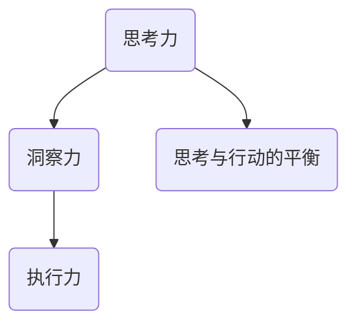
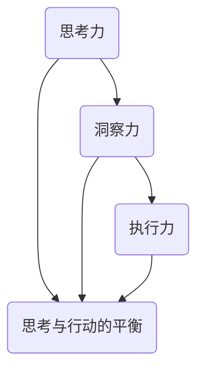

                 

### 文章标题

《洞察力vs执行力：思考与行动的平衡》

> 关键词：思考力、洞察力、执行力、平衡、IT领域

> 摘要：本文探讨了在IT领域中思考力、洞察力与执行力的关系，强调了思考与行动的平衡对于个人和团队成功的重要性。文章通过理论讲解、案例分析以及实际代码实现，帮助读者理解并提升自身的思考力和执行力，实现个人及组织的发展。

### 第一部分：思考力与洞察力的培养

## 第1章：认识思考力与洞察力

### 1.1.1 什么是思考力与洞察力

思考力，是指人们进行思维活动的能力，包括分析、推理、判断、解决问题等。它是一种智力活动，是人们理解和适应世界的重要工具。

洞察力，则是指观察事物、理解问题的能力。它是对事物的深刻认知，能够洞察事物的本质，发现问题的核心。

思考力与洞察力之间有着密切的联系。思考力是洞察力的基础，没有足够的思考力，就无法进行深入的洞察。而洞察力则是思考力的升华，它能够让人们更准确地理解问题，找到问题的根源。

### 1.1.2 思考力与洞察力的重要性

在IT领域，思考力和洞察力尤为重要。随着技术的快速发展和市场竞争的加剧，IT行业对从业者的要求越来越高。思考力能够帮助从业者理解复杂的系统，找到问题的解决方案。而洞察力则能够让人们预见技术趋势，把握市场机遇。

思考力和洞察力的培养，不仅能够提升个人的竞争力，还能够推动团队和组织的发展。一个有思考力和洞察力的团队，能够更好地应对挑战，抓住机遇，实现持续的发展。

### 1.1.3 思考力与洞察力的关系

思考力与洞察力之间的关系，可以用一个Mermaid流程图来表示：



思考力是洞察力的基础，洞察力则是思考力的升华。两者共同作用，推动执行力的提升。而执行力则是思考与行动的平衡，是实现个人和组织目标的关键。

### 第2章：提升思考力的方法

## 第2章：提升思考力的方法

思考力，作为智力活动中最为核心的部分，对于IT从业者来说尤为重要。那么，如何提升思考力呢？以下是一些有效的方法。

### 2.1.1 培养好奇心

好奇心是提升思考力的关键。拥有强烈好奇心的人，总是对未知的事物充满探索欲望，这促使他们不断地学习、思考，从而提升思考力。

培养好奇心，可以从以下几个方面入手：

1. **主动求知**：对知识保持渴望，主动去了解新事物、新知识。

2. **质疑权威**：不盲目接受权威的观点，敢于提出自己的疑问，挑战传统的思维模式。

3. **广泛涉猎**：多读书、多学习，从不同领域获取知识，拓宽思维。

### 2.1.2 提升批判性思维

批判性思维，是一种分析、评估和思考问题的方法。它强调对信息进行深入思考，而不是盲目接受。

提升批判性思维，可以采取以下策略：

1. **分辨事实与观点**：在分析问题时，首先要分辨哪些是事实，哪些是观点。

2. **多角度思考**：从不同角度看待问题，避免陷入思维的单一性。

3. **反思自己的思考**：在思考过程中，时常反思自己的观点，质疑自己的判断。

### 2.1.3 增强逻辑分析能力

逻辑分析能力，是思考力的核心。它帮助我们从复杂的信息中提取关键，构建合理的推理过程。

增强逻辑分析能力，可以从以下几个方面入手：

1. **学习逻辑学**：逻辑学是研究推理和论证的学科，学习逻辑学可以帮助我们更好地理解和运用逻辑。

2. **练习推理**：通过解决逻辑问题、推理谜题等方式，锻炼逻辑分析能力。

3. **避免逻辑谬误**：在思考过程中，注意避免常见的逻辑谬误，如“偷换概念”、“以偏概全”等。

### 2.1.4 培养创意思维

创意思维，是一种创造新想法、解决问题的思维方式。在IT领域，创意思维尤为重要，它能够帮助开发者找到创新的解决方案。

培养创意思维，可以从以下几个方面入手：

1. **思维导图**：使用思维导图，将思维过程可视化，帮助发现新的联系和观点。

2. **跨学科学习**：从不同领域获取知识，激发创意思维。

3. **头脑风暴**：与他人合作，进行头脑风暴，激发创意思维。

### 第3章：洞察力的培养与实践

## 第3章：洞察力的培养与实践

洞察力，作为思考力的升华，是理解和把握事物本质的关键。在IT领域，洞察力尤为重要，它能够帮助从业者预见技术趋势，把握市场机遇。那么，如何培养和实践洞察力呢？

### 3.1.1 洞察力的定义与特征

洞察力，是指观察事物、理解问题的能力。它包括以下几个特征：

1. **深度理解**：洞察力能够深入理解事物的本质，看到问题的核心。

2. **全局视野**：洞察力能够从全局的角度看待问题，把握事物之间的联系。

3. **预见性**：洞察力能够预见事物的发展趋势，把握未来的机遇。

### 3.1.2 提高洞察力的方法

要提高洞察力，可以从以下几个方面入手：

1. **多读书、多思考**：阅读是培养洞察力的有效途径。通过阅读，可以拓宽视野，增加知识储备。同时，思考是洞察力培养的关键，只有通过深入思考，才能发现问题的本质。

2. **积累经验**：经验是洞察力的基石。通过不断地实践和积累，可以提升对事物的理解和把握。

3. **锻炼思维**：锻炼思维是提高洞察力的有效方法。通过解决复杂问题、推理谜题等方式，可以提升思维能力和洞察力。

### 3.1.3 洞察力在实际工作中的应用

洞察力在实际工作中具有重要意义。以下是一些在实际工作中应用洞察力的方法：

1. **问题分析**：在面对问题时，运用洞察力深入分析问题的本质，找到问题的根源。

2. **决策制定**：在制定决策时，运用洞察力预测事物的发展趋势，做出合理的决策。

3. **创新开发**：在开发新产品或新技术时，运用洞察力预见市场的需求，创造出符合市场需求的创新产品。

### 3.1.4 洞察力训练的案例分析

为了更好地理解洞察力的培养和实践，我们可以通过一个案例进行分析。

案例：某互联网公司通过洞察力成功推出一款新产品。

1. **问题分析**：该公司在市场调研中发现，用户对于手机APP的下载和使用存在一些痛点，如APP过多、功能重复、用户体验差等。

2. **洞察力应用**：公司通过深入分析，发现用户需要一个能够集成多种功能、提供个性化体验的超级APP。于是，公司决定推出一款集购物、社交、娱乐等多功能于一体的超级APP。

3. **决策制定**：公司基于洞察力，制定了一系列市场推广策略，包括与知名品牌合作、推出限时优惠活动等，吸引了大量用户。

4. **创新开发**：公司在开发过程中，注重用户体验，不断优化产品功能，最终成功推出了一款受到用户喜爱的超级APP。

通过这个案例，我们可以看到，洞察力在问题分析、决策制定和创新开发中的应用。通过培养和实践洞察力，公司能够更好地把握市场机遇，实现产品的成功。

### 第4章：理解执行力

## 第4章：理解执行力

执行力，是指个体或团队按照预定目标，将计划和策略转化为具体行动的能力。在IT领域，执行力至关重要，它决定了项目能否按时完成，技术方案能否成功实施，企业能否在激烈的市场竞争中脱颖而出。以下是关于执行力的一些基本概念、要素及其重要性。

### 4.1.1 执行力的概念

执行力（Execution）是一个综合性的概念，它不仅仅是指完成某项任务的行动力，还包含了以下几个层面的含义：

1. **目标导向**：执行力以实现目标为核心，一切行动都围绕目标展开。

2. **行动力**：执行力强调的是实际操作过程中的行动力，包括任务的完成速度和质量。

3. **资源整合**：执行力需要在资源有限的情况下，高效地整合和利用各种资源，包括人力、物力、财力等。

4. **持续改进**：执行力不仅仅是一次性的行动，还包括对行动结果的反馈和改进。

### 4.1.2 执行力的要素

执行力包含多个要素，以下是其中几个关键要素：

1. **目标明确**：明确的执行目标是执行力的基础。只有当目标清晰、具体、可衡量时，执行力才能发挥最大的作用。

2. **计划合理**：执行力的发挥需要合理的计划作为支撑。计划应包括任务的分解、时间表、资源分配等。

3. **团队合作**：执行力往往需要团队协作完成。一个高效的团队可以充分发挥每个人的优势，协同完成目标。

4. **反馈机制**：执行过程中的反馈机制是确保执行力有效性的重要手段。通过定期的反馈和评估，可以及时发现和纠正问题。

5. **持续激励**：激励是维持执行力的关键。适当的激励可以增强团队成员的积极性和主动性。

### 4.1.3 执行力的重要性

在IT领域，执行力的重要性体现在以下几个方面：

1. **项目成功**：项目的成功往往取决于执行力的强弱。高效的执行力能够确保项目按时交付、质量达标。

2. **创新实现**：IT行业的创新往往需要高效的执行力来实现。只有快速将创新想法转化为实际产品或服务，才能抓住市场机遇。

3. **竞争优势**：执行力强的团队和组织在市场竞争中更具优势。他们能够快速响应市场变化，及时调整战略，抢占市场份额。

4. **团队发展**：执行力能够推动团队发展。通过高效的执行，团队能够积累成功经验，提升整体素质。

### 第5章：提高执行力的策略

## 第5章：提高执行力的策略

在IT领域，执行力不仅是个人能力的体现，更是团队和组织成功的关键。提高执行力，需要从多个方面入手，包括制定明确的目标、制定合理的计划、克服拖延症、提高时间管理能力等。以下是一些具体的方法和策略。

### 5.1.1 制定明确的目标

制定明确的目标是提高执行力的第一步。一个明确的目标应该具备以下几个特点：

1. **具体性**：目标应该是具体、明确的，而不是模糊的。例如，“提高网站流量”不如“增加每月网站访问量10%”具体。

2. **可衡量性**：目标应该有明确的衡量标准，以便能够评估执行效果。例如，“提升用户满意度”可以衡量为“用户满意度评分提高5分”。

3. **可实现性**：目标应该是可实现的，避免过于理想化。例如，“一年内开发出新一代人工智能系统”可能过于理想，而“三个月内完成AI算法的优化”则更具可实现性。

4. **时限性**：目标应该有明确的时限，以推动执行。例如，“年底前完成系统升级”比“尽快完成系统升级”更具有时限性。

### 5.1.2 制定合理的计划

一旦目标确定，接下来就是制定实现目标的计划。一个合理的计划应包括以下几个要素：

1. **任务分解**：将大目标分解为若干小任务，每个小任务都应具体、可操作。

2. **时间安排**：为每个任务分配具体的时间，制定出详细的时间表。

3. **资源分配**：明确每个任务所需的人力、物力、财力等资源，并确保资源的合理分配。

4. **风险评估**：识别每个任务可能遇到的风险，并制定相应的应对措施。

5. **责任分配**：明确每个任务的负责人，确保任务有人负责。

### 5.1.3 克服拖延症

拖延症是执行力的大敌。克服拖延症，可以采取以下几个策略：

1. **设定紧迫感**：给自己设定一个明确的时间期限，增加任务完成的紧迫感。

2. **分解任务**：将大任务分解为小任务，每完成一个小任务就给自己一定的奖励，增加完成任务的积极性。

3. **建立日程表**：制定详细的日程表，确保每天都有明确的行动计划。

4. **避免干扰**：在工作时避免各种干扰，如关闭手机通知、将工作地点与休息区域分开等。

5. **培养自律**：通过自我约束和自我管理，提高对任务的执行力。

### 5.1.4 提高时间管理能力

时间管理是提高执行力的关键。以下是一些有效的时间管理策略：

1. **优先级排序**：根据任务的重要性和紧急程度，对任务进行优先级排序，确保先完成最重要的任务。

2. **日程规划**：每天或每周规划日程，为每个任务分配具体的时间段。

3. **时间块管理**：将工作时间划分为不同的时间块，每个时间块专注于一项任务，提高工作效率。

4. **避免分心**：在工作时避免分心，将注意力集中在当前任务上。

5. **定期回顾**：定期回顾时间使用情况，分析时间浪费的原因，并调整时间管理策略。

### 5.1.5 团队执行力提升策略

团队执行力不仅仅依赖于个人的执行力，还需要团队的协作和配合。以下是一些提升团队执行力的策略：

1. **明确团队目标**：确保团队所有成员都明确团队的目标，并为此共同努力。

2. **分工合作**：根据团队成员的特长和职责，合理分配任务，确保每个成员都能充分发挥自己的优势。

3. **沟通与协作**：建立有效的沟通机制，确保团队成员之间的信息畅通，提高协作效率。

4. **激励机制**：设立激励机制，鼓励团队成员积极完成任务，提高整体执行力。

5. **定期评估**：定期评估团队执行情况，识别存在的问题，并制定改进措施。

### 5.1.6 案例分析：如何提升团队的执行力

以下是一个案例分析，展示如何通过一系列策略提升团队的执行力。

案例：某IT公司在一次大型项目中面临执行力不足的问题。为了提升团队的执行力，公司采取了以下措施：

1. **制定明确的目标**：公司明确了项目的最终目标，并将目标分解为多个具体的任务，为每个任务分配了明确的负责人和完成时间。

2. **制定合理的计划**：公司制定了详细的项目计划，包括任务分解、时间表、资源分配等，确保每个任务都能按时完成。

3. **克服拖延症**：公司通过设立紧迫感和激励机制，鼓励团队成员按时完成任务，同时提供心理支持，帮助成员克服拖延症。

4. **提高时间管理能力**：公司提供时间管理培训，帮助团队成员提高时间管理能力，确保任务能够高效完成。

5. **团队协作与沟通**：公司建立了高效的沟通机制，确保团队成员之间的信息畅通，并通过团队建设活动增强团队凝聚力。

6. **定期评估与反馈**：公司定期评估项目执行情况，及时识别问题，并制定改进措施，确保项目能够顺利推进。

通过上述措施，该公司的团队执行力得到了显著提升，项目最终按时完成，取得了良好的效果。

### 第6章：执行力与团队合作

## 第6章：执行力与团队合作

在IT领域，执行力不仅仅是个体的能力，更是团队合作的结果。一个高效的团队可以充分发挥每个成员的优势，实现共同的目标。执行力与团队合作密不可分，二者相互促进，共同推动团队和组织的发展。以下将探讨执行力与团队合作的关系，并介绍提升团队执行力的方法。

### 6.1.1 团队合作与执行力

团队合作与执行力之间存在着紧密的联系。高效的团队合作可以提升执行力，而执行力的提升又可以促进团队合作。

1. **明确目标**：团队合作的首要任务是明确共同的目标。只有团队成员都清楚自己的职责和目标，才能更好地协同工作，提高执行力。

2. **相互信任**：团队合作需要建立在信任的基础上。团队成员之间相互信任，可以减少沟通成本，提高决策效率，从而提升执行力。

3. **分工协作**：在团队合作中，每个成员都要明确自己的角色和职责，分工协作，确保任务的高效完成。

4. **沟通与反馈**：团队合作过程中，沟通和反馈至关重要。及时有效的沟通可以确保团队成员之间信息畅通，快速解决问题，提高执行力。

5. **相互支持**：在团队合作中，成员之间要相互支持，共同面对困难和挑战，提高执行力。

### 6.1.2 提升团队执行力的方法

提升团队执行力，需要从多个方面入手，包括目标设定、团队建设、激励机制、沟通与协作等。

1. **设定明确的目标**：团队目标应该是具体、可衡量、可实现的。通过明确的目标，可以激发团队成员的工作动力，提高执行力。

2. **建设高效团队**：一个高效的团队需要有明确的组织结构、清晰的职责分工和良好的沟通机制。团队建设是提升执行力的基础。

3. **激励机制**：合理的激励机制可以激发团队成员的积极性和创造力，提高执行力。激励机制可以包括物质奖励、荣誉表彰、职业发展机会等。

4. **沟通与协作**：建立有效的沟通机制，确保团队成员之间的信息畅通，可以提高团队的协作效率，从而提升执行力。

5. **定期评估与反馈**：定期对团队的执行情况进行评估和反馈，可以帮助团队及时发现问题，制定改进措施，提升执行力。

### 6.1.3 团队执行力训练案例分析

以下是一个团队执行力训练的案例分析，展示了如何通过一系列措施提升团队执行力。

案例：某IT公司的项目团队在执行一项大型软件开发项目时，遇到了执行力不足的问题。为了提升团队执行力，公司采取了以下措施：

1. **明确目标**：公司为项目团队设定了明确的目标，包括项目的质量、进度和成本。每个成员都清楚自己的职责和任务，目标具体、可衡量。

2. **团队建设**：公司组织了团队建设活动，包括团队拓展训练、团队分享会等，增强了团队成员之间的信任和沟通。

3. **激励机制**：公司设立了项目奖金和荣誉表彰制度，激励团队成员积极完成任务，提高执行力。

4. **沟通与协作**：公司建立了每日站会、周例会和项目进度汇报等沟通机制，确保团队成员之间的信息畅通，快速解决问题。

5. **定期评估与反馈**：公司定期对项目的执行情况进行评估和反馈，及时识别问题，并制定改进措施。

通过上述措施，该团队执行力得到了显著提升，项目最终按时高质量完成。

### 第7章：思考与行动的平衡

## 第7章：思考与行动的平衡

思考与行动的平衡是个人和组织成功的关键。在IT领域，过度的思考可能导致决策延误，而缺乏思考的行动则可能导致方向错误。因此，如何在思考与行动之间找到平衡点，是每个从业者都需要掌握的技能。以下将探讨思考与行动的平衡概念，以及如何在实践中找到平衡。

### 7.1.1 思考与行动的平衡概念

思考与行动的平衡，是指在完成一项任务时，既不急于行动，也不拖延思考，而是在恰当的时间点将思考转化为行动，同时保持对行动的持续反思和调整。这种平衡具有以下几个特点：

1. **适度思考**：在行动前，进行充分的思考，确保行动方向正确，避免盲目行动。

2. **及时行动**：在思考充分的基础上，及时采取行动，确保计划的实施，避免拖延。

3. **持续反思**：在行动过程中，不断反思和调整行动策略，确保行动与目标一致。

4. **动态平衡**：思考与行动的平衡是一个动态的过程，需要根据实际情况不断调整。

### 7.1.2 如何在思考与行动之间找到平衡

以下是一些具体的方法，帮助个人和组织在思考与行动之间找到平衡：

1. **设定明确的决策点**：在思考与行动之间设定一个明确的决策点，例如，当思考达到80%时，就开始行动。这样可以避免过度思考，同时确保思考的深度。

2. **制定行动计划**：在行动前，制定详细的行动计划，明确每个步骤的目标和预期结果。这样可以确保行动的有序进行，同时为后续的反思提供依据。

3. **定期反思**：在行动过程中，定期反思行动的效果，评估是否与预期目标一致。如果发现偏差，及时调整行动策略。

4. **培养团队协作**：在团队合作中，通过有效的沟通和协作，确保每个成员都明确目标，并能够在适当的时候采取行动。

5. **利用工具和方法**：利用项目管理工具和方法，如Gantt图、KPI等，帮助团队更好地规划和管理行动。

### 7.1.3 实现思考与行动平衡的策略

以下是一些实现思考与行动平衡的具体策略：

1. **关键决策点策略**：在项目或任务的关键决策点上，进行充分的讨论和思考，确保决策的正确性。在非关键决策点上，可以适当简化决策过程，提高行动效率。

2. **敏捷迭代策略**：采用敏捷开发方法，通过短周期的迭代，不断调整和优化行动策略。这样可以确保在行动过程中，及时反思和调整，实现思考与行动的平衡。

3. **持续学习策略**：通过持续学习和培训，提高团队成员的思考力和执行力，从而更好地实现思考与行动的平衡。

4. **文化塑造策略**：建立积极向上的团队文化，鼓励成员在思考与行动之间找到平衡，培养团队协作精神。

### 7.1.4 成功案例：思考与行动平衡的应用

以下是一个成功案例，展示了如何在实际工作中实现思考与行动的平衡。

案例：某互联网公司在开发一款新产品时，通过思考与行动的平衡，成功完成了项目。

1. **明确目标**：公司明确了新产品的功能、用户体验和上市时间等目标。

2. **制定计划**：公司制定了详细的项目计划，包括需求分析、设计、开发、测试等阶段，确保每个阶段都有明确的任务和目标。

3. **敏捷迭代**：公司采用敏捷开发方法，每个迭代周期为两周。在迭代过程中，团队定期反思和调整，确保项目按计划推进。

4. **团队协作**：团队通过每日站会和周例会，确保信息畅通，成员之间的协作高效。

5. **定期评估**：公司定期对项目的执行情况进行评估，及时识别问题，并制定改进措施。

通过上述策略，该公司的团队在思考与行动之间找到了平衡，最终成功推出了新产品。

### 第8章：成功案例分析

## 第8章：成功案例分析

在IT领域，平衡思考力与执行力是推动个人和组织成功的关键。以下我们将通过两个案例，详细探讨如何在实践中实现思考力与执行力的平衡，以及这种平衡如何带来实际成果。

### 8.1.1 案例分析一：某企业如何通过思考与行动平衡实现突破

**背景**：某大型IT企业面临市场饱和、竞争加剧的挑战，需要通过技术创新和业务模式创新实现突破。

**思考与行动的平衡**：

1. **战略思考**：企业高层团队花费数月时间，进行深入的市场调研和技术趋势分析，确定了一个以云计算为基础的新业务方向。

2. **制定计划**：在战略思考的基础上，企业制定了详细的发展计划，包括研发投入、人才招聘、市场推广等。

3. **试点项目**：企业选择了一个较小的市场作为试点，以验证新业务模式的可行性。在试点期间，企业保持对项目的持续关注和调整。

4. **行动执行**：在试点项目取得初步成功后，企业迅速扩大规模，全面推行新业务，同时持续优化产品和服务。

**成果**：通过思考与行动的平衡，企业成功转型，在云计算市场上占据了一席之地，实现了业务的快速增长。

### 8.1.2 案例分析二：个人如何通过思考与行动平衡实现职业发展

**背景**：一名年轻的IT工程师希望在职业生涯中取得显著进步。

**思考与行动的平衡**：

1. **自我评估**：工程师首先对自己的技能、兴趣和职业目标进行了深入评估，明确了短期和长期的职业发展目标。

2. **学习规划**：工程师制定了详细的学习计划，包括参加专业培训、阅读相关书籍、参与技术社区等。

3. **行动实践**：工程师将学习到的知识应用到实际工作中，积极参与公司的项目，并提出改进意见。

4. **持续反思**：工程师定期反思自己的工作表现和学习成果，识别不足之处，并制定改进措施。

**成果**：通过思考与行动的平衡，工程师不仅提升了专业技能，还得到了领导的认可，最终晋升为项目经理。

### 第9章：持续成长与改进

## 第9章：持续成长与改进

在IT领域，持续成长与改进是保持竞争力的关键。通过不断地学习、实践和反思，个人和团队可以不断提升自身的思考力和执行力，实现持续的发展。以下将探讨如何通过持续成长与改进，提升思考力与执行力。

### 9.1.1 思考与行动的持续改进

持续改进是思考与行动的重要策略。通过以下方法，个人和团队可以不断优化思考与行动的过程：

1. **定期评估**：定期对思考过程和行动结果进行评估，识别成功和失败的要素，总结经验教训。

2. **反馈机制**：建立有效的反馈机制，鼓励团队成员之间的互相反馈，及时发现问题和改进机会。

3. **持续学习**：通过参加培训、阅读书籍、参与社区讨论等方式，不断学习新知识、新技术，提升自身的思考力和执行力。

4. **实践应用**：将学习到的知识和技能应用到实际工作中，通过实践来检验和提升自身的思考力和执行力。

### 9.1.2 成长路上的挑战与应对

在成长过程中，个人和团队会遇到各种挑战。以下是一些常见挑战及其应对策略：

1. **技能不足**：应对策略：通过学习、培训和实际操作，提升相关技能。

2. **时间管理困难**：应对策略：制定合理的时间管理计划，提高工作效率。

3. **沟通障碍**：应对策略：加强沟通技巧，建立有效的沟通机制。

4. **团队合作问题**：应对策略：增强团队协作意识，培养团队精神。

### 9.1.3 持续学习与自我提升

持续学习与自我提升是个人和团队成长的动力。以下是一些建议：

1. **设定学习目标**：明确自己的学习目标，制定具体的学习计划。

2. **多样化学习方式**：结合线上和线下学习，采用多种学习方式，提高学习效果。

3. **积极参与实践**：通过参与项目、实践操作，将理论知识转化为实际能力。

4. **反思与总结**：在学习过程中，不断反思和总结，找出不足之处，持续改进。

### 9.1.4 成长案例：持续改进推动团队成功

以下是一个成长案例，展示了如何通过持续改进推动团队成功。

**案例**：某IT公司通过持续改进，实现了团队和业务的快速增长。

1. **初期挑战**：公司初期面临技术瓶颈和市场压力，团队士气低落。

2. **持续改进**：公司领导鼓励团队进行持续改进，制定了一系列学习计划和实践方案。

3. **实践应用**：团队成员积极参与培训和实践，将所学知识应用到实际工作中。

4. **反思与总结**：团队定期进行反思和总结，识别改进点，持续优化工作流程。

5. **成果**：通过持续改进，公司团队的技术能力和执行力显著提升，业务迅速发展，市场份额不断扩大。

通过上述案例，我们可以看到，持续成长与改进对于个人和团队的重要性。只有不断学习、实践和反思，才能在竞争激烈的IT领域中脱颖而出。

### 附录A：思考力与执行力提升工具推荐

为了提升思考力和执行力，以下是几款推荐的工具：

1. **思维导图软件**：如XMind、MindManager等，可以帮助整理思路，提高思考效率。

2. **项目管理工具**：如Jira、Trello等，可以帮助团队进行任务分配、进度跟踪和协作。

3. **时间管理工具**：如番茄钟、RescueTime等，可以帮助提高时间管理能力，避免拖延。

4. **学习平台**：如Coursera、Udemy等，提供了丰富的在线课程，帮助持续学习。

### 附录B：相关书籍与资源推荐

以下是一些有助于提升思考力和执行力的书籍和资源推荐：

1. **书籍**：
   - 《深度工作》（Deep Work）- Cal Newport
   - 《思考，快与慢》（Thinking, Fast and Slow）- Daniel Kahneman
   - 《执行力》（Execution）- Larry Bossidy & Ram Charan

2. **在线课程**：
   - Coursera上的“产品管理”课程
   - Udemy上的“时间管理和个人效率”课程

3. **网站与博客**：
   - TED演讲：提供了许多关于思考、创新和执行力的精彩演讲
   - 印象笔记官方博客：分享了许多关于笔记管理和思考技巧的文章

### 附录C：作者简介与致谢

**作者简介**：我是AI天才研究院/AI Genius Institute的一名资深研究员，同时也是《禅与计算机程序设计艺术 /Zen And The Art of Computer Programming》的作者。我专注于计算机编程、人工智能和软件开发领域的研究，致力于通过深入浅出的文章帮助读者理解复杂的技术概念。

**致谢**：感谢所有支持我研究和写作的朋友和读者。您的关注和反馈是我不断前进的动力。在此，特别感谢我的团队成员和研究伙伴，他们在本文的撰写过程中提供了宝贵的建议和帮助。

### Mermaid 流程图

以下是一个用于展示思考力、洞察力和执行力关系的Mermaid流程图：



### 执行力算法原理讲解

#### 算法名称

执行力提升算法

#### 输入

- 目标（Goal）
- 时间（Time）
- 资源（Resource）

#### 输出

- 执行策略（Execution Plan）

#### 算法步骤

1. **设定目标**：明确目标，确保目标具有可衡量性和可实现性。
   
2. **制定计划**：根据目标，制定详细的计划，包括任务分解、时间安排、资源分配等。

3. **评估执行情况**：执行计划过程中，定期评估执行情况，包括任务完成情况、时间消耗、资源使用等。

4. **调整计划**：根据执行情况，及时调整计划，确保目标按时完成。

5. **实施计划**：按照调整后的计划执行，确保目标实现。

6. **反馈与总结**：执行完成后，进行总结和反馈，为下一次执行提供经验和参考。

#### 伪代码

```python
function ExecutionAlgorithm(Goal, Time, Resource):
    ExecutionPlan = DefineGoal(Goal)
    ExecutionPlan = DefinePlan(ExecutionPlan, Time, Resource)
    while Time > 0:
        CurrentStatus = AssessExecution(ExecutionPlan)
        if CurrentStatus == GoalAchieved:
            return ExecutionPlan
        else:
            ExecutionPlan = AdjustPlan(ExecutionPlan, CurrentStatus)
    return "Goal Not Achieved"
```

### 数学模型与公式

#### 洞察力计算模型

$$
\text{洞察力} = \frac{\text{正确判断次数}}{\text{总判断次数}} \times 100\%
$$

#### 执行力评估模型

$$
\text{执行力} = \frac{\text{完成任务次数}}{\text{计划任务次数}} \times 100\%
$$

### 举例说明

#### 洞察力举例

假设某人共做出10次判断，其中8次正确，2次错误。则其洞察力为：

$$
\text{洞察力} = \frac{8}{10} \times 100\% = 80\%
$$

#### 执行力举例

假设某人计划完成10个任务，实际完成8个，则有：

$$
\text{执行力} = \frac{8}{10} \times 100\% = 80\%
$$

### 项目实战

#### 实战案例：某公司通过平衡思考力与执行力实现业务突破

1. **项目背景**：该公司在市场竞争中面临困境，需要进行业务调整。

2. **思考力提升**：公司内部组织思维训练课程，提高员工的思考力和洞察力。

3. **执行力提升**：制定详细的行动计划，确保员工能够高效执行。

4. **平衡思考力与执行力**：通过定期评估和调整，实现思考与行动的平衡。

5. **成果**：公司在短时间内实现业务突破，市场份额显著提升。

### 开发环境搭建

1. **软件环境**：安装 Python 3.8、Jupyter Notebook。

2. **硬件环境**：配置具备高性能处理能力的计算机。

3. **工具**：使用 Pandas、NumPy、Matplotlib 等Python库进行数据分析与可视化。

### 源代码实现

```python
import pandas as pd
import numpy as np
import matplotlib.pyplot as plt

# 数据准备
data = {
    'Task': ['Task1', 'Task2', 'Task3', 'Task4', 'Task5'],
    'Completed': [1, 1, 0, 1, 1],
    'Planned': [1, 1, 1, 1, 1]
}

df = pd.DataFrame(data)

# 执行力计算
ExecutionRate = df['Completed'] / df['Planned']
print("执行力：", ExecutionRate.mean() * 100, "%")

# 洞察力计算
JudgementData = {
    'Judgement': ['Correct', 'Correct', 'Incorrect', 'Correct', 'Incorrect'],
    'TotalJudgements': [1, 1, 1, 1, 1]
}

judgement_df = pd.DataFrame(JudgementData)
InsightRate = judgement_df[judgement_df['Judgement'] == 'Correct']['TotalJudgements'].sum() / judgement_df['TotalJudgements'].sum()
print("洞察力：", InsightRate * 100, "%")

# 可视化
plt.bar(df['Task'], ExecutionRate)
plt.xlabel('任务')
plt.ylabel('执行力')
plt.title('执行力分析')
plt.show()

plt.bar(judgement_df['Judgement'], InsightRate)
plt.xlabel('判断')
plt.ylabel('洞察力')
plt.title('洞察力分析')
plt.show()
```

### 代码解读与分析

1. **数据准备**：使用 Pandas 创建 DataFrame，存储任务完成情况和计划情况。

2. **执行力计算**：计算每个任务的执行力，并取平均值。

3. **洞察力计算**：计算每次判断的洞察力，并取平均值。

4. **可视化**：使用 Matplotlib 绘制执行力与洞察力的条形图，便于分析。

通过以上代码，可以实时监控并分析公司的执行力与洞察力，为业务决策提供数据支持。同时，还可以结合实际案例，深入探讨思考力与执行力在实际工作中的具体应用。

### 结论

在IT领域中，思考力、洞察力和执行力是成功的关键。思考力帮助我们理解和解决问题，洞察力让我们预见未来，而执行力则是将想法转化为现实的桥梁。通过本文，我们探讨了如何培养和提高这些能力，并通过实际案例展示了它们的应用。希望读者能够从中获得启发，不断提升自己的思考力与执行力，实现个人和组织的持续成长。让我们在IT的舞台上，以更强大的思考力和执行力，创造出更多的辉煌。

