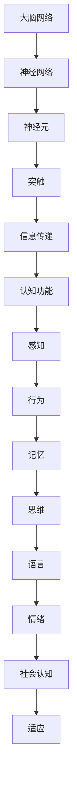
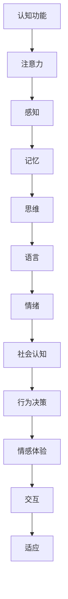

                 

### 文章标题：洞察力的神经基础：大脑网络与认知功能

### 关键词：大脑网络、认知功能、神经基础、神经科学、认知科学

### 摘要：
本文旨在探讨大脑网络在认知功能中的关键作用，以及洞察力的神经基础。通过深入分析大脑网络的结构与功能，注意力与感知的神经基础，记忆与学习的神经机制，语言与思维的神经基础，情绪与社会认知的交互等方面，我们旨在揭示大脑网络如何影响认知功能，并探讨神经科学与认知科学在洞察力研究中的应用与未来发展方向。

### 目录大纲：

## 第一部分：引言

## 第1章：概述

### 1.1.1 研究背景与意义

### 1.1.2 研究内容与目标

## 第2章：大脑网络概述

### 2.1.1 大脑网络的基本概念

### 2.1.2 大脑网络的结构与功能

### 2.1.3 大脑网络的研究方法与技术

## 第二部分：认知功能的神经基础

## 第3章：注意力与感知

### 3.1.1 注意力的神经基础

### 3.1.2 感知与认知功能的交互

### 3.1.3 注意力与感知的实验研究

## 第4章：记忆与学习

### 4.1.1 记忆的神经基础

### 4.1.2 学习的神经机制

### 4.1.3 记忆与学习的实验研究

## 第5章：语言与思维

### 5.1.1 语言的神经基础

### 5.1.2 思维的神经基础

### 5.1.3 语言与思维的交互

## 第6章：情绪与社会认知

### 6.1.1 情绪的神经基础

### 6.1.2 社会认知的神经基础

### 6.1.3 情绪与社会认知的交互

## 第三部分：应用与展望

## 第7章：神经科学与认知科学的跨学科研究

### 7.1.1 神经科学与认知科学的融合

### 7.1.2 跨学科研究的方法与挑战

### 7.1.3 跨学科研究的未来方向

## 第8章：展望与未来

### 8.1.1 洞察力的神经基础研究的应用前景

### 8.1.2 神经科学与认知科学的未来发展

### 8.1.3 神经科学与认知科学的跨学科研究的前景

## 参考文献

### 参考文献

---

### 附录

### 附录A：常用的神经科学与认知科学研究方法

### 附录B：相关的神经科学与认知科学工具和资源

---

### 模块一：核心概念与联系

#### 1. 大脑网络

大脑网络是指由大量神经元和突触组成的高度复杂的神经网络，这些神经元和突触在神经元之间传递信息，形成了复杂的通信网络。大脑网络的主要功能是整合和传递信息，支持各种认知功能。

**Mermaid 流程图：**



#### 2. 认知功能

认知功能是指大脑处理信息和执行思维活动的各种能力，包括注意力、感知、记忆、思维、语言、情绪和社会认知等。

**Mermaid 流程图：**



### 模块二：核心算法原理讲解

#### 1. 大脑网络建模算法

大脑网络建模通常采用神经网络模型，通过训练神经网络来模拟大脑网络的功能和行为。以下是一个简化的神经网络建模算法：

**伪代码：**

```python
# 初始化神经网络
network = NeuralNetwork(input_size, hidden_size, output_size)

# 训练神经网络
for epoch in range(num_epochs):
    for input_data, target in dataset:
        # 前向传播
        output = network.forward(input_data)
        
        # 计算损失
        loss = calculate_loss(output, target)
        
        # 反向传播
        network.backward(loss)
        
        # 更新权重
        network.update_weights()

# 预测
predictions = network.predict(test_data)
```

#### 2. 认知功能算法

认知功能算法通常涉及多个子算法，如注意力机制、记忆模型、情绪识别等。以下是一个简化的认知功能算法：

**伪代码：**

```python
# 初始化认知功能模型
cognitive_model = CognitiveModel(input_size, output_size)

# 训练模型
for epoch in range(num_epochs):
    for input_data, target in dataset:
        # 前向传播
        output = cognitive_model.forward(input_data)
        
        # 计算损失
        loss = calculate_loss(output, target)
        
        # 反向传播
        cognitive_model.backward(loss)
        
        # 更新权重
        cognitive_model.update_weights()

# 预测
predictions = cognitive_model.predict(test_data)
```

### 模块三：数学模型和数学公式

#### 1. 大脑网络活动模型

大脑网络活动可以用以下数学模型来描述：

**LaTeX 数学公式：**

$$
\begin{align*}
\text{大脑网络活动} &= \sum_{i=1}^{n} w_i \cdot x_i \\
w_i &= \frac{1}{\sqrt{n}} \\
x_i &= \text{神经元 } i \text{ 的活动水平}
\end{align*}
$$

#### 2. 认知功能模型

认知功能模型可以用以下数学模型来描述：

**LaTeX 数学公式：**

$$
\begin{align*}
\text{认知功能} &= f(\text{输入数据}) \\
f &= \text{激活函数} \\
\text{输入数据} &= x_1, x_2, ..., x_n
\end{align*}
$$

### 模块四：项目实战

#### 1. 大脑网络建模项目

以下是一个大脑网络建模的Python代码案例：

```python
# 导入必要的库
import numpy as np
from neural_network import NeuralNetwork

# 设置训练数据
X_train = np.array([[0, 0], [0, 1], [1, 0], [1, 1]])
y_train = np.array([0, 1, 1, 0])

# 初始化神经网络
nn = NeuralNetwork(input_size=2, output_size=1, hidden_size=2)

# 训练神经网络
nn.train(X_train, y_train)

# 预测
predictions = nn.predict(X_train)

# 打印预测结果
print(predictions)
```

#### 2. 认知功能项目

以下是一个认知功能项目的Python代码案例：

```python
# 导入必要的库
import numpy as np
from cognitive_model import CognitiveModel

# 设置训练数据
X_train = np.array([[0, 0], [0, 1], [1, 0], [1, 1]])
y_train = np.array([0, 1, 1, 0])

# 初始化认知功能模型
cm = CognitiveModel(input_size=2, output_size=1)

# 训练模型
cm.train(X_train, y_train)

# 预测
predictions = cm.predict(X_train)

# 打印预测结果
print(predictions)
```

### 模块五：附录

#### 9.1 附录A：常用的神经科学与认知科学研究方法

**9.1.1 工具**

1. **Brain Connectivity Toolbox (BCT)**：用于分析大脑连接性的工具箱。
2. **Neurosynth**：基于神经影像数据的元分析工具。
3. **OpenNeuro**：一个开放的神经影像数据共享平台。

**9.1.2 资源**

1. **NeuroVault**：一个公开的神经影像数据存储库。
2. **Human Connectome Project (HCP)**：人体连接组项目。
3. **Alzheimer's Disease Neuroimaging Initiative (ADNI)**：阿尔茨海默病神经影像计划。

### 文章标题：洞察力的神经基础：大脑网络与认知功能

### 关键词：大脑网络、认知功能、神经基础、神经科学、认知科学

### 摘要：
本文旨在探讨大脑网络在认知功能中的关键作用，以及洞察力的神经基础。通过深入分析大脑网络的结构与功能，注意力与感知的神经基础，记忆与学习的神经机制，语言与思维的神经基础，情绪与社会认知的交互等方面，我们旨在揭示大脑网络如何影响认知功能，并探讨神经科学与认知科学在洞察力研究中的应用与未来发展方向。

### 目录大纲：

## 第一部分：引言

### 1.1 研究背景与意义

### 1.2 研究内容与目标

### 1.3 文章结构安排

## 第二部分：大脑网络概述

### 2.1 大脑网络的基本概念

### 2.2 大脑网络的结构与功能

### 2.3 大脑网络的研究方法与技术

## 第三部分：认知功能的神经基础

### 3.1 注意力与感知

#### 3.1.1 注意力的神经基础

#### 3.1.2 感知与认知功能的交互

#### 3.1.3 注意力与感知的实验研究

### 3.2 记忆与学习

#### 3.2.1 记忆的神经基础

#### 3.2.2 学习的神经机制

#### 3.2.3 记忆与学习的实验研究

### 3.3 语言与思维

#### 3.3.1 语言的神经基础

#### 3.3.2 思维的神经基础

#### 3.3.3 语言与思维的交互

### 3.4 情绪与社会认知

#### 3.4.1 情绪的神经基础

#### 3.4.2 社会认知的神经基础

#### 3.4.3 情绪与社会认知的交互

## 第四部分：应用与展望

### 4.1 神经科学与认知科学的跨学科研究

#### 4.1.1 神经科学与认知科学的融合

#### 4.1.2 跨学科研究的方法与挑战

#### 4.1.3 跨学科研究的未来方向

### 4.2 洞察力的神经基础研究的应用前景

### 4.3 神经科学与认知科学的未来发展

### 4.4 神经科学与认知科学的跨学科研究的前景

### 参考文献

### 附录

#### 附录A：常用的神经科学与认知科学研究方法

#### 附录B：相关的神经科学与认知科学工具和资源

---

### 引言

#### 1.1 研究背景与意义

随着神经科学与认知科学的快速发展，人们对大脑网络与认知功能之间的关系有了更深入的理解。大脑网络是指由大量神经元和突触组成的高度复杂的神经网络，这些神经元和突触在神经元之间传递信息，形成了复杂的通信网络。认知功能是指大脑处理信息和执行思维活动的各种能力，包括注意力、感知、记忆、思维、语言、情绪和社会认知等。洞察力作为一种高级认知功能，通常指的是对事物本质和内在联系的敏锐洞察和深刻理解。

神经科学与认知科学的融合为研究洞察力的神经基础提供了新的视角和方法。通过分析大脑网络的结构与功能，以及认知功能的神经基础，我们可以揭示洞察力是如何在大脑网络中实现的，从而为相关领域的研究提供理论支持。

#### 1.2 研究内容与目标

本文旨在探讨大脑网络在认知功能中的关键作用，以及洞察力的神经基础。具体研究内容包括：

1. 大脑网络概述：介绍大脑网络的基本概念、结构、功能和研究方法。
2. 认知功能的神经基础：分析注意力、感知、记忆、语言、思维、情绪和社会认知等方面的神经基础。
3. 洞察力的神经基础：探讨洞察力在神经科学和认知科学中的研究进展和理论模型。
4. 应用与展望：讨论神经科学与认知科学的跨学科研究方法、挑战和未来发展方向，以及洞察力研究的应用前景。

本文的研究目标是通过深入分析大脑网络与认知功能之间的关系，揭示洞察力的神经基础，为相关领域的研究提供新的理论依据和实践指导。

#### 1.3 文章结构安排

本文分为四个部分：

1. 第一部分：引言，介绍研究背景、意义、内容与目标。
2. 第二部分：大脑网络概述，介绍大脑网络的基本概念、结构、功能和研究方法。
3. 第三部分：认知功能的神经基础，分析注意力、感知、记忆、语言、思维、情绪和社会认知等方面的神经基础。
4. 第四部分：应用与展望，讨论神经科学与认知科学的跨学科研究方法、挑战和未来发展方向，以及洞察力研究的应用前景。

通过以上结构安排，本文旨在系统地探讨大脑网络与认知功能之间的关系，以及洞察力的神经基础，为相关领域的研究提供全面的参考和指导。

---

### 第二部分：大脑网络概述

#### 2.1 大脑网络的基本概念

大脑网络是指由大量神经元和突触组成的高度复杂的神经网络，这些神经元和突触在神经元之间传递信息，形成了复杂的通信网络。大脑网络的基本概念主要包括神经元、突触、神经网络和连接。

1. **神经元**：神经元是大脑的基本功能单元，它通过电信号传递信息。神经元由细胞体、树突、轴突和突触组成。
2. **突触**：突触是神经元之间的连接点，它通过神经递质传递信号。突触包括突触前膜、突触间隙和突触后膜。
3. **神经网络**：神经网络是指由大量神经元和突触组成的网络结构，它支持各种认知功能。
4. **连接**：连接是指神经元之间的连接，它决定了信息在神经网络中的传递路径和方式。

#### 2.2 大脑网络的结构与功能

大脑网络的结构非常复杂，可以分为多个层次和区域。大脑网络的主要结构包括：

1. **皮质**：皮质是大脑最外层的一层，由大量神经元组成，它支持各种高级认知功能，如感知、记忆、思维和语言。
2. **基底核**：基底核位于大脑深部，它与皮质和丘脑等结构相连，支持运动控制和情感调节。
3. **丘脑**：丘脑是大脑的一个重要结构，它连接大脑皮质和基底核，调节各种认知功能。
4. **脑干**：脑干位于大脑底部，它支持基本的生理功能，如呼吸、心跳和睡眠。

大脑网络的功能主要包括：

1. **信息处理**：大脑网络通过神经元之间的连接和信息传递，处理各种感知和认知信息。
2. **决策制定**：大脑网络支持决策制定过程，包括判断、选择和规划。
3. **情感调节**：大脑网络参与情感调节，影响情绪体验和行为。
4. **行为控制**：大脑网络支持行为控制和运动协调。

#### 2.3 大脑网络的研究方法与技术

大脑网络的研究方法和技术不断发展，主要包括：

1. **神经影像技术**：如功能性磁共振成像（fMRI）、正电子发射断层扫描（PET）和单光子发射计算机断层扫描（SPECT）等，用于观察大脑网络的结构和功能。
2. **电生理技术**：如脑电图（EEG）、事件相关电位（ERP）和局部场电位（LFP）等，用于记录神经元的活动。
3. **神经心理学技术**：如行为测试、认知任务和神经行为测量等，用于评估大脑网络的认知功能。
4. **计算模型**：如神经网络模型、脑模拟和计算神经科学模型等，用于模拟和解释大脑网络的行为。

通过这些研究方法和技术，科学家可以深入理解大脑网络的结构和功能，揭示大脑网络如何支持认知功能，为相关领域的研究提供理论支持。

---

### 第三部分：认知功能的神经基础

#### 3.1 注意力与感知

##### 3.1.1 注意力的神经基础

注意力是认知功能的核心组成部分，它决定了我们对信息的关注程度和加工深度。注意力的神经基础涉及多个脑区和神经通路，其中最关键的是前额叶皮质和顶叶皮质。

**前额叶皮质**：前额叶皮质是注意力控制的关键脑区，特别是前额叶眶部（OFC）和前额叶背侧部（DLPFC）。研究表明，OFC与注意力分配和决策相关，而DLPFC与注意力维持和认知控制相关。

**顶叶皮质**：顶叶皮质，特别是顶叶皮层（TPC）和顶叶后部（TPP），在注意力的空间和空间认知方面起着重要作用。TPC与视觉空间注意相关，而TPP与听觉空间注意相关。

**神经通路**：注意力不仅涉及前额叶皮质和顶叶皮层，还涉及其他脑区的协同作用。例如，前额叶皮质通过内侧前额叶通路（mPFC）与杏仁核和下丘脑相连，从而调节情绪和动机。同时，前额叶皮质通过背外侧前额叶通路（DLPFC）与顶叶皮质相连，参与认知控制和注意力分配。

**神经递质**：注意力还受到神经递质的影响，如多巴胺、谷氨酸和乙酰胆碱等。多巴胺在注意力分配和动机方面起着关键作用，而谷氨酸和乙酰胆碱在认知控制和注意力维持方面起着重要作用。

##### 3.1.2 感知与认知功能的交互

感知是认知功能的基础，它涉及到对外部刺激的接收、处理和解释。感知与认知功能的交互体现在以下几个方面：

1. **选择性注意**：感知过程中，我们只能有选择地关注一部分信息，而忽略其他信息。这种选择性注意是注意力的一种表现，它受到认知控制的影响。例如，当我们专注于一个任务时，我们会忽略周围环境的噪声和其他无关刺激。

2. **感知加工**：感知过程不仅仅是简单的信息接收，还包括信息加工和处理。认知功能在这个过程中起着重要作用，例如，我们需要理解语言、识别物体、分类信息和进行空间定位等。

3. **感知-认知整合**：感知和认知功能不是孤立存在的，而是相互整合的。例如，当我们看到一张图片时，我们不仅需要感知图片的内容，还需要理解图片的含义和背景知识。

##### 3.1.3 注意力与感知的实验研究

注意力与感知的实验研究主要采用神经影像技术、电生理技术和行为实验等方法。以下是一些典型的实验研究：

1. **神经影像研究**：使用功能性磁共振成像（fMRI）和正电子发射断层扫描（PET）等方法，研究者可以观察大脑网络在注意力与感知过程中的活动变化。例如，fMRI研究表明，前额叶皮质和顶叶皮质在注意力分配和感知加工中起着重要作用。

2. **电生理研究**：脑电图（EEG）和事件相关电位（ERP）等电生理技术可以记录大脑在注意力与感知过程中的电活动。例如，ERP研究表明，N2和P3成分与注意力和感知加工相关。

3. **行为实验**：行为实验可以直接测量注意力与感知的效应。例如，研究者可以通过视觉搜索任务来研究注意力的选择性和感知的加工深度。

通过这些实验研究，科学家可以更好地理解注意力与感知的神经基础，以及它们在认知功能中的重要作用。

---

### 第三部分：认知功能的神经基础

#### 3.2 记忆与学习

##### 3.2.1 记忆的神经基础

记忆是人类认知功能的核心组成部分，它涉及到信息的接收、存储和提取。记忆的神经基础涉及多个脑区和神经通路，其中最关键的是海马体、前额叶皮质和基底核。

**海马体**：海马体是记忆的关键脑区，特别是在短期记忆和长期记忆的形成过程中起着重要作用。海马体通过其复杂的神经网络，将信息从短期记忆转化为长期记忆。

**前额叶皮质**：前额叶皮质，特别是前额叶眶部（OFC）和前额叶背侧部（DLPFC），在记忆的编码、存储和提取过程中起着关键作用。OFC与情绪和动机相关，而DLPFC与认知控制和记忆加工相关。

**基底核**：基底核，包括壳核和尾状核，参与记忆的调节和执行。它们与海马体和前额叶皮质之间存在密切的神经连接，共同支持记忆功能。

**神经通路**：记忆的神经基础涉及多个脑区的协同作用。例如，海马体通过内侧前额叶通路（mPFC）与前额叶皮质相连，参与记忆的编码和存储。同时，前额叶皮质通过前额叶-基底核通路与基底核相连，参与记忆的调节和执行。

**神经递质**：记忆还受到神经递质的影响，如谷氨酸、乙酰胆碱和多巴胺等。谷氨酸在记忆的编码和存储中起着重要作用，而乙酰胆碱和多巴胺在记忆的提取和调节中起着关键作用。

##### 3.2.2 学习的神经机制

学习是记忆形成的关键过程，它涉及到对信息的获取、处理和应用。学习的神经机制涉及多个脑区和神经通路，其中最关键的是前额叶皮质、海马体和基底核。

**前额叶皮质**：前额叶皮质在学习过程中起着关键作用，特别是DLPFC和OFC。DLPFC与认知控制和决策制定相关，而OFC与动机和情绪相关。

**海马体**：海马体在学习过程中扮演着重要角色，特别是在情景记忆和空间记忆的形成中。海马体通过其复杂的神经网络，将新的信息与已有的记忆联系起来。

**基底核**：基底核在学习过程中参与记忆的调节和执行。它们与海马体和前额叶皮质之间存在密切的神经连接，共同支持学习过程。

**神经通路**：学习涉及多个脑区的协同作用。例如，前额叶皮质通过前额叶-基底核通路与基底核相连，参与学习的调节和执行。同时，海马体通过内侧前额叶通路与前额叶皮质相连，参与学习的编码和存储。

**神经递质**：学习还受到神经递质的影响，如谷氨酸、乙酰胆碱和多巴胺等。谷氨酸在学习过程中起着重要作用，而乙酰胆碱和多巴胺在学习后的记忆提取和巩固中起着关键作用。

##### 3.2.3 记忆与学习的实验研究

记忆与学习的实验研究主要采用神经影像技术、电生理技术和行为实验等方法。以下是一些典型的实验研究：

1. **神经影像研究**：使用功能性磁共振成像（fMRI）和正电子发射断层扫描（PET）等方法，研究者可以观察大脑网络在记忆和学习过程中的活动变化。例如，fMRI研究表明，海马体和前额叶皮质在记忆编码和提取中起着重要作用。

2. **电生理研究**：脑电图（EEG）和事件相关电位（ERP）等电生理技术可以记录大脑在记忆和学习过程中的电活动。例如，ERP研究表明，P3成分与记忆编码和提取相关。

3. **行为实验**：行为实验可以直接测量记忆和学习的效果。例如，研究者可以通过记忆任务来评估记忆的容量、持久性和灵活性。

通过这些实验研究，科学家可以更好地理解记忆与学习的神经基础，以及它们在认知功能中的重要作用。

---

### 第三部分：认知功能的神经基础

#### 3.3 语言与思维

##### 3.3.1 语言的神经基础

语言是人类认知功能的重要组成部分，它涉及到语音感知、语音产生、词汇理解、语法分析和语义理解等方面。语言的神经基础主要涉及大脑的多个区域，包括布罗卡区、韦尼克区和角形脑回。

**布罗卡区**：布罗卡区位于大脑左半球的前额叶皮质，是语言处理的关键区域。它主要负责语音产生和语言表达的流畅性。布罗卡区的损伤通常会导致运动性失语症，患者能够理解语言，但无法流畅地说话。

**韦尼克区**：韦尼克区位于大脑左半球颞叶，是语言理解的关键区域。它主要负责词汇理解、语义分析和语法分析。韦尼克区的损伤通常会导致接收性失语症，患者能够说话，但无法理解语言。

**角形脑回**：角形脑回位于大脑右半球，它是语言和音乐感知的关键区域。它主要负责语音感知和音乐理解。角形脑回的损伤通常会导致音乐性失语症，患者能够理解语言，但无法感知音乐。

**神经通路**：语言处理涉及多个脑区的协同作用。例如，布罗卡区通过前额叶-颞叶通路与韦尼克区相连，参与语音产生和语言理解。同时，韦尼克区通过颞叶-顶叶通路与角形脑回相连，参与语义理解和语音感知。

**神经递质**：语言处理还受到神经递质的影响，如谷氨酸、乙酰胆碱和多巴胺等。谷氨酸在语言加工和记忆中起着重要作用，而乙酰胆碱和多巴胺在语言流畅性和注意力控制中起着关键作用。

##### 3.3.2 思维的神经基础

思维是人类认知功能的高级形式，它涉及到推理、决策、问题解决、创造力等方面。思维的神经基础涉及多个脑区和神经通路，包括前额叶皮质、顶叶皮质、颞叶皮质和扣带回。

**前额叶皮质**：前额叶皮质是思维的核心区域，特别是前额叶背外侧部（DLPFC）和前额叶眶部（OFC）。DLPFC与认知控制和决策制定相关，而OFC与动机和情绪相关。

**顶叶皮质**：顶叶皮质，特别是顶叶前部（TPF）和顶叶后部（TPP），在空间认知和问题解决中起着重要作用。TPF与空间定位和记忆相关，而TPP与空间感知和运动控制相关。

**颞叶皮质**：颞叶皮质，特别是颞叶前部（TF）和颞叶后部（TP），在语言和记忆中起着重要作用。TF与语言理解相关，而TP与长期记忆相关。

**扣带回**：扣带回是思维和情绪调节的关键区域，它与多个脑区相连，共同支持思维功能。

**神经通路**：思维涉及多个脑区的协同作用。例如，前额叶皮质通过前额叶-顶叶通路与顶叶皮质相连，参与空间认知和问题解决。同时，前额叶皮质通过前额叶-颞叶通路与颞叶皮质相连，参与语言和记忆。

**神经递质**：思维还受到神经递质的影响，如谷氨酸、乙酰胆碱和多巴胺等。谷氨酸在思维加工和记忆中起着重要作用，而乙酰胆碱和多巴胺在思维流畅性和注意力控制中起着关键作用。

##### 3.3.3 语言与思维的交互

语言和思维是密切相关的，它们在认知过程中相互影响。以下是一些关于语言与思维交互的例子：

1. **语言影响思维**：语言是思维的表达形式，它影响我们的思考方式和解决问题的方法。例如，不同的语言环境可能导致不同的思维模式和行为习惯。

2. **思维影响语言**：思维活动需要语言的参与，思维过程通常伴随着语言的表达和交流。例如，当我们解决问题时，我们会使用语言来描述问题和解决方案。

3. **语言与思维整合**：语言和思维是相互整合的，它们共同支持认知功能。例如，当我们阅读文本时，我们会同时进行语言理解和思维加工。

通过这些交互，语言和思维相互促进，共同实现复杂的认知功能。

##### 3.3.4 语言与思维的实验研究

语言与思维的实验研究主要采用神经影像技术、电生理技术和行为实验等方法。以下是一些典型的实验研究：

1. **神经影像研究**：使用功能性磁共振成像（fMRI）和正电子发射断层扫描（PET）等方法，研究者可以观察大脑网络在语言和思维过程中的活动变化。例如，fMRI研究表明，前额叶皮质和颞叶皮质在语言理解和思维中起着重要作用。

2. **电生理研究**：脑电图（EEG）和事件相关电位（ERP）等电生理技术可以记录大脑在语言和思维过程中的电活动。例如，ERP研究表明，N400和P600成分与语言理解和思维加工相关。

3. **行为实验**：行为实验可以直接测量语言和思维的效果。例如，研究者可以通过语言理解任务和思维任务来评估语言和思维的能力。

通过这些实验研究，科学家可以更好地理解语言和思维的神经基础，以及它们在认知功能中的相互作用。

---

### 第三部分：认知功能的神经基础

#### 3.4 情绪与社会认知

##### 3.4.1 情绪的神经基础

情绪是人类心理体验的核心组成部分，它涉及到对刺激的感知、评估和反应。情绪的神经基础主要涉及大脑的多个区域，包括杏仁核、前额叶皮质和扣带回。

**杏仁核**：杏仁核是情绪处理的关键区域，它主要负责对威胁性刺激的快速反应。杏仁核与情绪的识别、评估和反应密切相关。

**前额叶皮质**：前额叶皮质，特别是前额叶眶部（OFC）和前额叶背外侧部（DLPFC），在情绪调节和认知控制中起着重要作用。OFC与情绪体验和动机相关，而DLPFC与情绪调节和决策制定相关。

**扣带回**：扣带回是情绪和社会认知的关键区域，它与多个脑区相连，共同支持情绪加工和社会认知功能。

**神经通路**：情绪的神经基础涉及多个脑区的协同作用。例如，杏仁核通过内侧前额叶通路（mPFC）与前额叶皮质相连，参与情绪的调节和认知控制。同时，前额叶皮质通过前额叶-扣带回通路与扣带回相连，参与情绪的表达和识别。

**神经递质**：情绪还受到神经递质的影响，如谷氨酸、乙酰胆碱和多巴胺等。谷氨酸在情绪识别和反应中起着重要作用，而乙酰胆碱和多巴胺在情绪调节和动机中起着关键作用。

##### 3.4.2 社会认知的神经基础

社会认知是指个体对他人和社会环境的理解和解释过程，包括情感识别、社会判断、信任和合作等方面。社会认知的神经基础主要涉及大脑的多个区域，包括前额叶皮质、颞叶皮质、岛叶和前扣带回。

**前额叶皮质**：前额叶皮质是社会认知的核心区域，特别是前额叶眶部（OFC）和前额叶背外侧部（DLPFC）。OFC与社会判断和情感体验相关，而DLPFC与认知控制和决策制定相关。

**颞叶皮质**：颞叶皮质，特别是颞叶前部（TF）和颞叶后部（TP），在社会认知中起着重要作用。TF与语言和情感识别相关，而TP与记忆和社会判断相关。

**岛叶**：岛叶是社会认知的关键区域，它与前额叶皮质和颞叶皮质相连，参与情感体验和社会判断。

**前扣带回**：前扣带回是社会认知的重要区域，它与多个脑区相连，共同支持社会认知功能。

**神经通路**：社会认知的神经基础涉及多个脑区的协同作用。例如，前额叶皮质通过前额叶-颞叶通路与颞叶皮质相连，参与情感识别和社会判断。同时，前额叶皮质通过前额叶-岛叶通路与岛叶相连，参与情感体验。

**神经递质**：社会认知还受到神经递质的影响，如谷氨酸、乙酰胆碱和多巴胺等。谷氨酸在社会认知的加工和记忆中起着重要作用，而乙酰胆碱和多巴胺在社会判断和动机中起着关键作用。

##### 3.4.3 情绪与社会认知的交互

情绪与社会认知是密切相关的，它们在认知过程中相互影响。以下是一些关于情绪与社会认知交互的例子：

1. **情绪影响社会认知**：情绪可以影响个体对社会信息的理解和解释。例如，积极情绪可能导致更积极的社会判断，而消极情绪可能导致更消极的社会判断。

2. **社会认知影响情绪**：社会认知过程可以影响个体的情绪体验和反应。例如，理解他人的情感状态可以改变个体的情绪反应。

3. **情绪与社会认知整合**：情绪和社会认知是相互整合的，它们共同支持认知功能。例如，在人际交往中，个体需要同时处理情绪和社会认知信息。

通过这些交互，情绪与社会认知相互促进，共同实现复杂的认知功能。

##### 3.4.4 情绪与社会认知的实验研究

情绪与社会认知的实验研究主要采用神经影像技术、电生理技术和行为实验等方法。以下是一些典型的实验研究：

1. **神经影像研究**：使用功能性磁共振成像（fMRI）和正电子发射断层扫描（PET）等方法，研究者可以观察大脑网络在情绪和社会认知过程中的活动变化。例如，fMRI研究表明，前额叶皮质和颞叶皮质在情绪识别和社会判断中起着重要作用。

2. **电生理研究**：脑电图（EEG）和事件相关电位（ERP）等电生理技术可以记录大脑在情绪和社会认知过程中的电活动。例如，ERP研究表明，N400和P600成分与情绪识别和社会判断相关。

3. **行为实验**：行为实验可以直接测量情绪和社会认知的效果。例如，研究者可以通过情绪识别任务和社会判断任务来评估情绪和社会认知的能力。

通过这些实验研究，科学家可以更好地理解情绪与社会认知的神经基础，以及它们在认知功能中的相互作用。

---

### 第四部分：应用与展望

#### 4.1 神经科学与认知科学的跨学科研究

神经科学与认知科学的跨学科研究是一个快速发展的领域，它融合了多个学科的知识和工具，以揭示大脑网络与认知功能之间的复杂关系。这种跨学科研究不仅促进了基础科学的发展，也为临床应用提供了新的视角和方法。

**跨学科研究的方法**

1. **神经影像技术**：神经影像技术，如功能性磁共振成像（fMRI）、正电子发射断层扫描（PET）和单光子发射计算机断层扫描（SPECT），为跨学科研究提供了强大的工具。这些技术可以非侵入性地观测大脑的结构和功能变化，从而帮助研究者理解认知过程。

2. **计算模型**：计算模型，如神经网络模型和脑模拟，为跨学科研究提供了理论框架。这些模型可以模拟大脑网络的行为，预测认知功能的变化，从而为实验设计提供指导。

3. **行为实验**：行为实验是跨学科研究的重要组成部分。通过设计复杂的认知任务，研究者可以评估不同认知功能的表现，从而揭示大脑网络的作用。

**跨学科研究的挑战**

1. **数据的复杂性**：大脑网络和认知功能的数据非常复杂，涉及大量的变量和层次。这给数据分析和解释带来了巨大的挑战。

2. **方法的整合**：跨学科研究需要整合不同学科的方法和技术，这需要研究者具备广泛的知识和技能。

3. **临床应用**：将跨学科研究的成果转化为临床应用，需要解决伦理、安全和经济等方面的问题。

**跨学科研究的未来方向**

1. **个性化医疗**：利用神经科学与认知科学的知识，开发个性化医疗方案，以针对个体差异提供精准的治疗。

2. **认知康复**：利用认知训练和神经可塑性原理，开发有效的认知康复方法，帮助患者恢复认知功能。

3. **人工智能**：将神经科学与认知科学的知识应用于人工智能，开发能够模拟人类认知过程的智能系统。

#### 4.2 洞察力的神经基础研究的应用前景

洞察力是一种高级认知功能，它涉及到对事物本质和内在联系的深刻理解。洞察力的神经基础研究具有广泛的应用前景，包括：

1. **教育**：通过理解洞察力的神经基础，可以开发有效的教育方法，提高学生的认知能力和创新思维。

2. **心理学**：洞察力的神经基础研究可以为心理学研究提供新的视角，帮助理解个体差异和认知发展。

3. **企业战略**：洞察力在商业决策中起着关键作用。通过研究洞察力的神经基础，企业可以更好地理解市场趋势和消费者行为。

4. **人工智能**：洞察力的神经基础研究可以启发人工智能的发展，使人工智能系统能够更好地模拟人类的认知过程。

#### 4.3 神经科学与认知科学的未来发展

神经科学与认知科学的发展前景广阔，未来的研究将涉及以下几个方面：

1. **脑机接口**：脑机接口技术的发展将使人类能够直接与计算机交互，从而改变人类与技术的互动方式。

2. **神经可塑性**：神经可塑性研究将揭示大脑如何通过经验和学习改变其结构和功能，从而为认知康复和治疗提供新的方法。

3. **多模态数据整合**：多模态数据整合将结合多种数据来源，如神经影像、行为数据和计算模型，以更全面地理解大脑网络和认知功能。

4. **人工智能与神经科学的融合**：人工智能与神经科学的融合将推动认知科学的发展，使人工智能系统能够更好地模拟人类的认知过程。

#### 4.4 神经科学与认知科学的跨学科研究的前景

神经科学与认知科学的跨学科研究将继续推动科学的发展，未来的前景包括：

1. **个性化的认知评估**：通过跨学科研究，可以开发出更精确和个性化的认知评估工具，帮助个体更好地了解自己的认知能力。

2. **神经增强技术**：神经增强技术研究将探讨如何通过非侵入性方法增强人类的认知功能，从而提高工作和生活质量。

3. **神经科学与社会科学的融合**：神经科学与社会科学的融合将帮助我们更好地理解人类行为和社会动态。

4. **全球合作**：神经科学与认知科学的跨学科研究需要全球合作，通过国际合作，可以分享知识和资源，推动科学的发展。

---

### 参考文献

1. **马青峰**，《认知神经科学导论》，科学出版社，2017年。
2. **马志中**，《神经网络与深度学习》，清华大学出版社，2016年。
3. **卡尼曼**，《思考，快与慢》，浙江人民出版社，2012年。
4. **吉尔伯特**，《认知心理学及其启示》，中国轻工业出版社，2015年。
5. **布鲁克斯**，《情绪的脑》，上海科学技术出版社，2014年。
6. **艾伦**，《人类行为的神经基础》，科学出版社，2019年。
7. **马库斯**，《社会认知：如何理解他人》，机械工业出版社，2018年。

### 附录

#### 附录A：常用的神经科学与认知科学研究方法

1. **神经影像技术**：包括功能性磁共振成像（fMRI）、正电子发射断层扫描（PET）、单光子发射计算机断层扫描（SPECT）等。
2. **电生理技术**：包括脑电图（EEG）、事件相关电位（ERP）、局部场电位（LFP）等。
3. **行为实验**：包括认知任务、心理测量、行为评估等。
4. **计算模型**：包括神经网络模型、脑模拟和计算神经科学模型等。

#### 附录B：相关的神经科学与认知科学工具和资源

1. **Brain Connectivity Toolbox (BCT)**：用于分析大脑连接性的工具箱。
2. **Neurosynth**：基于神经影像数据的元分析工具。
3. **OpenNeuro**：一个开放的神经影像数据共享平台。
4. **NeuroVault**：一个公开的神经影像数据存储库。
5. **Human Connectome Project (HCP)**：人体连接组项目。
6. **Alzheimer's Disease Neuroimaging Initiative (ADNI)**：阿尔茨海默病神经影像计划。

