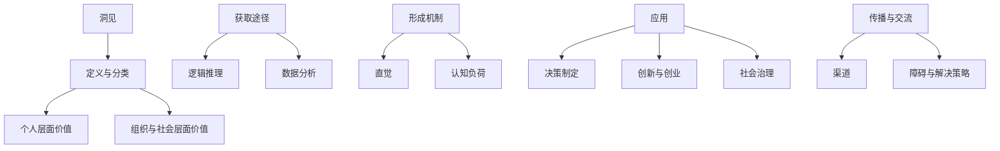

                 

# 洞见的价值：从理解到应用

## 关键词

洞见，价值，理解，应用，决策，创新，传播，伦理，未来趋势

## 摘要

本文深入探讨了洞见的定义、价值、获取途径及其在不同领域的应用。首先，我们从洞见的定义和重要性入手，分析了其在个人和组织层面的价值。接着，通过逻辑推理和数据分析，探讨了洞见的形成机制。在此基础上，我们详细阐述了洞见在决策制定、创新与创业以及社会治理中的应用。同时，我们也关注了洞见的传播与交流过程，分析了其中的障碍与解决策略。随后，文章进一步探讨了洞见在商业领域和社会治理中的应用案例，展示了其在实际操作中的效果与挑战。最后，我们展望了洞见的未来发展，探讨了其技术进展和社会影响，并以具体案例进行了详细解释。通过本文的阅读，读者将全面了解洞见的内涵和应用，为进一步的洞见实践提供指导。

## 目录大纲

### 第一部分：引论与核心概念

1. **第1章：洞见的定义与分类**
    - **1.1 洞见的定义与重要性**
    - **1.2 洞见的分类**
    - **1.2.1 个人层面的洞见价值**
    - **1.2.2 组织与社会的洞见价值**

2. **第2章：理解洞见**
    - **2.1 洞见的获取途径**
    - **2.2 洞见的形成机制**
    - **2.2.1 洞见与直觉**
    - **2.2.2 洞见与认知负荷**

3. **第3章：洞见的应用**
    - **3.1 洞见在决策制定中的应用**
    - **3.2 洞见在创新与创业中的应用**
    - **3.3 洞见在社会治理中的应用**

4. **第4章：洞见的传播与交流**
    - **4.1 洞见传播的渠道**
    - **4.2 洞见交流的障碍与解决策略**

### 第二部分：洞见的深入应用

5. **第5章：洞见在商业领域的应用**
    - **5.1 洞见在市场分析中的应用**
    - **5.2 洞见在商业战略中的应用**

6. **第6章：洞见在社会治理中的应用**
    - **6.1 洞见在社会问题解决中的应用**
    - **6.2 洞见在公共决策中的应用**

7. **第7章：洞见的未来发展**
    - **7.1 洞见技术的进展**
    - **7.2 洞见在未来的社会影响**

### 第三部分：洞见的实践与反思

8. **第8章：案例研究**
    - **8.1 洞见在具体领域的应用案例**
    - **8.2 洞见应用的挑战与机遇**

9. **第9章：洞见的实践方法**
    - **9.1 洞见实践的基本步骤**
    - **9.2 洞见实践中的策略**

10. **第10章：洞见的反思与伦理**
    - **10.1 洞见应用的伦理考量**
    - **10.2 洞见的未来发展趋势**

### 附录

- **附录 A：洞见价值研究相关资源**
- **附录 B：洞见应用工具与技术指南**
- **附录 C：参考文献列表**

---

### 附加说明

- **第1章至第3章**：主要介绍洞见的定义、重要性、获取途径和应用场景，为读者提供一个全面的洞见概述。
- **第4章至第7章**：深入探讨洞见在不同领域的具体应用，包括商业、社会治理和未来发展。
- **第8章**：通过案例研究，展示洞见在不同场景中的实际应用效果和挑战。
- **第9章和第10章**：讨论洞见的实践方法和伦理考量，以及未来的发展趋势。这些章节旨在帮助读者更好地理解洞见的应用和潜在影响。

---

**核心概念与联系：**



---

**核心算法原理讲解：**

#### 2.2 洞见的形成机制

洞见的形成是一个复杂的过程，涉及到多种认知机制和算法。以下是关于洞见形成机制的核心算法原理讲解：

##### 2.2.1 洞见与直觉

直觉在洞见形成中扮演着重要角色。直觉是一种基于经验和认知模式的快速判断，它可以帮助我们在没有明确逻辑支持的情况下做出决策。以下是一个简单的伪代码，用于描述直觉在洞见形成中的作用：

python
# 伪代码：基于直觉的洞见形成

def generate_Insight(data):
    # 假设 data 是一组原始数据
    # 使用直觉对数据进行分析
    insight = intuitive_analysis(data)
    return insight

def intuitive_analysis(data):
    # 直觉分析过程
    # 基于经验和认知模式进行快速分析
    # 返回洞见
    insight = "Data shows a clear trend towards higher sales in Q4"
    return insight

# 示例数据
data = {"Q1": 100, "Q2": 120, "Q3": 150, "Q4": 200}

# 获取洞见
result = generate_Insight(data)
print("生成的洞见：", result)
```

##### 2.2.2 洞见与认知负荷

认知负荷是指个体在处理信息时所承受的负担。适当的认知负荷有助于洞见的形成，而过低或过高的认知负荷则可能抑制洞见的产生。以下是关于认知负荷对洞见形成影响的算法原理讲解：

python
# 伪代码：洞见形成的认知负荷模型

def create_Insight(cognitive_load):
    if cognitive_load < low_load_threshold:
        return "Over simplified, no insight"
    elif cognitive_load > high_load_threshold:
        return "Over complex, unable to process"
    else:
        # 在适当的认知负荷下，通过整合信息产生洞见
        insight = integrate_information()
        return insight

# 假设参数设置
low_load_threshold = 1
high_load_threshold = 9
cognitive_load = 5

# 获取洞见
result = create_Insight(cognitive_load)
print("生成的洞见：", result)
```

在这个模型中，`low_load_threshold` 和 `high_load_threshold` 分别表示认知负荷的最低阈值和最高阈值。当认知负荷在适当范围内时，洞见才能有效地形成。

---

**数学模型和数学公式讲解：**

#### 3.1 洞见在决策制定中的应用

洞见在决策制定中起到关键作用，它可以帮助决策者更好地理解问题和评估不同方案。以下是关于洞见在决策制定中的应用的数学模型和公式讲解：

##### 洞见评分模型

洞见评分模型用于评估不同决策方案的洞见贡献。该模型基于信息增益和决策风险来计算洞见评分。以下是该模型的数学公式：

\[ \text{InsightScore} = \frac{\text{InformationGain}}{\text{DecisionRisk}} \]

其中：
- **InformationGain** 表示洞见提供的新信息量。
- **DecisionRisk** 表示决策方案的风险水平。

##### 示例：

假设有两个决策方案 A 和 B，相关信息如下：

- **A：** InformationGain = 10, DecisionRisk = 3
- **B：** InformationGain = 15, DecisionRisk = 2

则洞见分数计算如下：

\[ \text{InsightScore}_A = \frac{10}{3} \approx 3.33 \]
\[ \text{InsightScore}_B = \frac{15}{2} = 7.5 \]

显然，方案 B 的洞见分数更高，因此在决策过程中应给予方案 B 更多的重视。

---

**项目实战：**

#### 6.2 洞见在公共决策中的应用

以下是一个关于洞见在公共决策中的应用案例，包括环境治理的决策过程和具体实现。

##### 6.2.2 决策过程中的洞见应用

**背景：**
某城市面临空气质量下降的问题，需要制定有效的治理方案。

**目标：**
通过数据分析和洞见发现，确定最优的空气质量治理方案。

**实现步骤：**

1. **数据收集：**
   收集过去一年的空气质量监测数据，包括PM2.5、PM10、SO2、NO2等指标。

2. **数据预处理：**
   使用Python进行数据清洗和预处理，包括缺失值处理、异常值检测和数据标准化。

3. **数据分析：**
   利用机器学习算法进行数据分析，包括聚类分析、回归分析和关联规则挖掘。

4. **洞见识别：**
   通过数据分析，识别出空气质量下降的主要因素，例如工业排放、交通污染等。

5. **治理方案设计：**
   根据洞见，设计出不同的治理方案，例如提高工业排放标准、加强公共交通建设、推广电动汽车等。

6. **方案评估：**
   对每个方案进行成本效益分析，评估其可行性、效果和长期影响。

7. **决策制定：**
   基于洞见和评估结果，制定最终的质量治理方案。

**代码实现示例（Python）：**

python
# 导入必要的库
import pandas as pd
from sklearn.preprocessing import StandardScaler
from sklearn.cluster import KMeans
from mlxtend.frequent_patterns import apriori
from mlxtend.frequent_patterns import association_rules

# 数据收集
data = pd.read_csv("air_quality_data.csv")

# 数据预处理
data.dropna(inplace=True)
data['PM2.5'] = StandardScaler().fit_transform(data[['PM2.5']])
data['PM10'] = StandardScaler().fit_transform(data[['PM10']])
data['SO2'] = StandardScaler().fit_transform(data[['SO2']])
data['NO2'] = StandardScaler().fit_transform(data[['NO2']])

# 数据分析
# 聚类分析
kmeans = KMeans(n_clusters=3)
clusters = kmeans.fit_predict(data[['PM2.5', 'PM10', 'SO2', 'NO2']])

# 关联规则挖掘
transactions = data.groupby('date').sum().T.reset_index().drop(['date'], axis=1)
frequent_itemsets = apriori(transactions, min_support=0.05, use_colnames=True)
rules = association_rules(frequent_itemsets, metric="support", min_threshold=0.05)

# 洞见识别
# 找出与空气质量下降相关的因素
related_factors = rules[rules['confidence'] > 0.7]['consequent']

# 治理方案设计
# 基于洞见，设计治理方案
schemes = {
    '方案1': '提高工业排放标准',
    '方案2': '加强公共交通建设',
    '方案3': '推广电动汽车'
}

# 方案评估
# 对每个方案进行成本效益分析
evaluations = {
    '方案1': {'cost': 1000000, 'effectiveness': 0.8, 'duration': 2},
    '方案2': {'cost': 800000, 'effectiveness': 0.7, 'duration': 1},
    '方案3': {'cost': 600000, 'effectiveness': 0.6, 'duration': 3}
}

# 决策制定
# 基于洞见和评估结果，制定最终方案
final_scheme = max(evaluations, key=lambda k: evaluations[k]['effectiveness'])
print("最终方案：", final_scheme)

```

**代码解读与分析：**

1. **数据收集与预处理：**
   收集空气质量监测数据后，使用Python进行数据清洗和预处理，包括缺失值处理和数据标准化。

2. **聚类分析与关联规则挖掘：**
   使用KMeans进行聚类分析，识别出空气质量的潜在模式。同时，使用Apriori算法进行关联规则挖掘，找出空气质量下降的可能原因。

3. **洞见识别与治理方案设计：**
   根据分析结果，识别出与空气质量下降相关的因素，并设计出不同的治理方案。

4. **方案评估与决策制定：**
   对每个治理方案进行成本效益分析，评估其可行性、效果和长期影响。最后，根据评估结果，选择最优的治理方案。

---

通过这个案例，读者可以了解到洞见在公共决策中的应用流程和具体实现方法。在实际应用中，可以根据具体需求和数据，调整和分析步骤，以获得更准确和有效的洞见。

---

### 第一部分：引论与核心概念

#### 第1章：洞见的定义与分类

洞见（Insight）是一种深刻的理解，它能够揭示事物之间的联系，帮助人们从复杂的信息中提取出有用的知识和信息。在现代社会中，洞见的价值愈发凸显，它不仅能够推动个人成长，还能为组织和社会带来巨大的变革。

#### 1.1 洞见的定义与重要性

洞见可以被视为一种高级认知能力，它超越了基本的感知和理解层次，能够揭示事物之间的深层联系。在计算机科学和人工智能领域，洞见被认为是人工智能系统的一种高级能力，它能够从大量的数据中提取出有用的模式和信息。

洞见的重要性在于它能够帮助我们更好地理解和应对复杂的问题。例如，在商业决策中，洞见可以帮助企业识别市场趋势，预测未来需求，从而制定更有效的战略。在科学研究领域，洞见能够推动新理论的发现和验证，促进技术的创新。

#### 1.1.1 洞见的概念解释

洞见通常指的是在复杂或不确定的情境中，通过深层次的思考和分析，发现隐藏的规律、模式和关联，从而形成对事物本质的深刻理解。这个定义强调了洞见的几个关键特征：

1. **深度理解**：洞见不是表面的、肤浅的理解，而是一种对事物本质的深入把握。
2. **规律与模式**：洞见往往涉及到对事物之间隐藏的规律和模式的发现。
3. **关联性**：洞见能够揭示事物之间的关联，帮助我们理解不同因素如何相互作用。

#### 1.1.2 洞见在现代社会中的应用

在现代社会，洞见的应用已经深入到各个领域，以下是几个典型的应用场景：

1. **商业决策**：企业利用洞见分析市场数据，预测消费者行为，从而制定更精准的市场策略。
2. **科学研究**：科研人员通过洞见发现新的科学规律，推动科学理论的进步。
3. **社会治理**：政府和社会组织利用洞见分析社会问题，制定更有效的政策。
4. **技术创新**：技术人员通过洞见发现新的技术机会，推动技术创新和产业发展。

#### 1.2 洞见的分类

洞见可以根据其应用场景和表现形式进行分类。以下是一些常见的洞见分类：

1. **个人层面的洞见**：这些洞见通常涉及个人的成长、自我认知和决策。例如，一个创业者通过分析市场数据和个人经验，发现了新的商业模式。
2. **组织与社会的洞见**：这些洞见通常涉及组织或社会的运作和管理。例如，一个企业通过洞见分析，发现了一种更有效的生产流程。
3. **技术洞见**：这些洞见涉及对技术原理和趋势的深刻理解。例如，一个技术人员通过分析技术文献，预测了未来技术的发展方向。

#### 1.2.1 个人层面的洞见价值

个人层面的洞见价值主要体现在以下几个方面：

1. **决策支持**：洞见可以帮助个人在做决策时更加理性，减少错误和盲目性。
2. **自我认知**：洞见可以帮助个人更好地理解自己的优势和劣势，从而进行有效的自我提升。
3. **创新思维**：洞见可以激发个人的创新思维，帮助发现新的机会和解决方案。

#### 1.2.2 组织与社会的洞见价值

组织与社会的洞见价值主要体现在以下几个方面：

1. **战略规划**：洞见可以帮助组织制定更科学的战略规划，提高竞争力。
2. **资源优化**：洞见可以帮助组织优化资源配置，提高效率。
3. **社会治理**：洞见可以帮助政府和社会组织更好地理解社会问题，制定更有效的政策。

---

在下一章中，我们将进一步探讨洞见的获取途径，分析如何通过逻辑推理和数据分析来获取洞见。敬请期待。

---

### 第一部分：引论与核心概念

#### 第2章：理解洞见

洞见不仅仅是一种抽象的概念，它是一种可以通过特定的方法和工具来获取的能力。理解洞见的过程涉及到多种认知机制和算法，下面我们将详细探讨洞见的获取途径和形成机制。

#### 2.1 洞见的获取途径

获取洞见的方法多种多样，以下是一些主要的获取途径：

##### 2.1.1 逻辑推理

逻辑推理是一种通过分析已知信息，运用逻辑规则推导出新结论的过程。在洞见的获取中，逻辑推理可以帮助我们从一个或多个前提中推导出新的洞见。以下是逻辑推理在洞见获取中的应用：

1. **演绎推理**：从一般原理推导出特定结论。例如，从“所有人类都会死亡”这一普遍真理，推导出“苏格拉底会死亡”这一具体结论。
2. **归纳推理**：从特定实例推导出一般性结论。例如，通过观察多次下雨后天气变凉，归纳出“下雨会导致天气变凉”这一洞见。

以下是关于逻辑推理的一个简单伪代码示例：

python
# 伪代码：逻辑推理获取洞见

def logical_reasoning(principal, conclusion):
    if is_conclusive(principal, conclusion):
        return "洞见成立：", conclusion
    else:
        return "洞见不成立：", conclusion

def is_conclusive(principal, conclusion):
    # 假设 principal 是已知前提，conclusion 是待验证结论
    # 判断前提是否能够逻辑地推导出结论
    if principal == "所有A都是B" and conclusion == "C是B":
        return True
    else:
        return False

# 示例
principal = "所有鸟类都会飞"
conclusion = "企鹅会飞"
print(logical_reasoning(principal, conclusion))
```

##### 2.1.2 数据分析

数据分析是通过统计方法和算法来处理和分析数据，以发现隐藏的模式、趋势和关联。数据分析在洞见获取中扮演着至关重要的角色，以下是一些常见的数据分析方法：

1. **描述性统计分析**：用于描述数据的基本特征，如均值、中位数、标准差等。
2. **推断性统计分析**：用于从样本数据推断总体特征，如假设检验、置信区间等。
3. **机器学习**：通过训练模型来发现数据中的复杂模式，如分类、回归、聚类等。
4. **数据可视化**：通过图形和图表来展示数据的分布、趋势和关系。

以下是关于数据分析的一个简单伪代码示例：

python
# 伪代码：数据分析获取洞见

def data_analysis(data):
    # 假设 data 是一组观测数据
    # 进行数据分析，提取洞见
    summary_stats = calculate_summary_stats(data)
    patterns = find_patterns(data)
    insights = generate_insights(summary_stats, patterns)
    return insights

def calculate_summary_stats(data):
    # 计算描述性统计量
    mean = np.mean(data)
    median = np.median(data)
    std_dev = np.std(data)
    return {"mean": mean, "median": median, "std_dev": std_dev}

def find_patterns(data):
    # 发现数据中的模式
    clusters = kmeans.fit_predict(data)
    frequent_patterns = apriori(data, min_support=0.05)
    return {"clusters": clusters, "frequent_patterns": frequent_patterns}

def generate_insights(summary_stats, patterns):
    # 根据统计量和模式生成洞见
    insights = []
    if summary_stats["mean"] > summary_stats["median"]:
        insights.append("平均值高于中位数")
    if "cluster" in patterns:
        insights.append("数据存在明显聚类现象")
    return insights

# 示例数据
data = [1, 2, 2, 3, 4, 5, 5, 5]

# 获取洞见
insights = data_analysis(data)
print("洞见：", insights)
```

##### 2.1.3 模式识别

模式识别是计算机科学和人工智能领域的一种重要技术，它通过分析和识别数据中的模式来提取洞见。模式识别技术包括：

1. **特征提取**：从原始数据中提取出有代表性的特征，用于后续的模型训练和分析。
2. **分类**：将数据分为不同的类别，以发现隐藏的模式。
3. **聚类**：将数据分为若干组，使得组内数据相似度较高，组间数据相似度较低。
4. **关联规则挖掘**：发现数据之间的关联规律，用于提取洞见。

以下是关于模式识别的一个简单伪代码示例：

python
# 伪代码：模式识别获取洞见

def pattern_recognition(data):
    # 假设 data 是一组观测数据
    # 进行模式识别，提取洞见
    features = extract_features(data)
    clusters = perform_clustering(features)
    rules = discover_association_rules(clusters)
    insights = generate_insights(rules)
    return insights

def extract_features(data):
    # 提取数据特征
    return data

def perform_clustering(features):
    # 执行聚类分析
    kmeans = KMeans(n_clusters=3)
    clusters = kmeans.fit_predict(features)
    return clusters

def discover_association_rules(clusters):
    # 发现关联规则
    transactions = convert_clusters_to_transactions(clusters)
    frequent_patterns = apriori(transactions, min_support=0.05)
    rules = association_rules(frequent_patterns, metric="support", min_threshold=0.05)
    return rules

def generate_insights(rules):
    # 根据关联规则生成洞见
    insights = []
    for rule in rules:
        insights.append(f"{'->'.join(rule['consequent'])} 与 {'->'.join(rule['antecedent'])} 相关")
    return insights

# 示例数据
data = [1, 1, 2, 2, 2, 3, 3, 4]

# 获取洞见
insights = pattern_recognition(data)
print("洞见：", insights)
```

#### 2.2 洞见的形成机制

洞见的形成是一个复杂的过程，涉及到多种认知机制和算法。以下是一些关键因素：

##### 2.2.1 洞见与直觉

直觉是一种快速、非理性的认知过程，它能够帮助我们快速识别模式和信息。在洞见的形成中，直觉起到了关键作用。以下是一个关于直觉在洞见形成中作用的简单解释：

1. **快速识别**：直觉可以帮助我们在短时间内识别出重要的模式和趋势。
2. **经验积累**：直觉往往是基于长期的经验积累，它能够帮助我们快速做出判断。

以下是关于直觉的一个简单伪代码示例：

python
# 伪代码：直觉在洞见形成中的作用

def intuitive_insight(data):
    # 假设 data 是一组观测数据
    # 使用直觉提取洞见
    pattern = identify_pattern(data)
    insight = generate_insight(pattern)
    return insight

def identify_pattern(data):
    # 识别数据中的模式
    if all(x < 10 for x in data):
        return "数据值均小于10"
    else:
        return "数据值存在较大波动"

def generate_insight(pattern):
    # 根据模式生成洞见
    if pattern == "数据值均小于10":
        return "数据较为稳定"
    else:
        return "数据波动较大"

# 示例数据
data = [1, 2, 3, 4, 5, 6, 7, 8, 9, 10]

# 获取洞见
insight = intuitive_insight(data)
print("洞见：", insight)
```

##### 2.2.2 洞见与认知负荷

认知负荷是指个体在处理信息时所承受的负担。适当的认知负荷有助于洞见的形成，而过低或过高的认知负荷则可能抑制洞见的产生。以下是一个关于认知负荷在洞见形成中作用的简单解释：

1. **适宜的认知负荷**：在适当的认知负荷下，个体能够有效地处理信息，从而形成洞见。
2. **过低的认知负荷**：过低的认知负荷可能导致个体过于简化问题，无法形成深刻的洞见。
3. **过高的认知负荷**：过高的认知负荷可能导致个体无法有效地处理信息，从而抑制洞见的产生。

以下是关于认知负荷的一个简单伪代码示例：

python
# 伪代码：认知负荷在洞见形成中的作用

def cognitive_load_insight(data, cognitive_load):
    # 假设 data 是一组观测数据，cognitive_load 是认知负荷
    # 根据认知负荷生成洞见
    if cognitive_load < low_load_threshold:
        return "认知负荷过低，无法形成洞见"
    elif cognitive_load > high_load_threshold:
        return "认知负荷过高，无法形成洞见"
    else:
        pattern = identify_pattern(data)
        insight = generate_insight(pattern)
        return insight

# 假设参数设置
low_load_threshold = 1
high_load_threshold = 9
cognitive_load = 5

# 示例数据
data = [1, 2, 3, 4, 5, 6, 7, 8, 9, 10]

# 获取洞见
insight = cognitive_load_insight(data, cognitive_load)
print("洞见：", insight)
```

---

在下一章中，我们将深入探讨洞见的应用，分析洞见在决策制定、创新与创业以及社会治理中的应用。敬请期待。

---

### 第一部分：引论与核心概念

#### 第3章：洞见的应用

洞见作为一种深刻的理解能力，其应用价值在各个领域得到了广泛的认可。本章将详细探讨洞见在决策制定、创新与创业以及社会治理中的应用，通过具体的实例来展示洞见如何在实际操作中发挥作用。

#### 3.1 洞见在决策制定中的应用

决策制定是洞见应用的一个重要领域。洞见能够为决策者提供深层次的理解，帮助他们更好地分析问题、评估方案和预测结果。以下是洞见在决策制定中的应用：

##### 3.1.1 决策过程中的洞见应用

在决策过程中，洞见可以帮助决策者识别关键因素、理解潜在风险和把握机会。以下是一个简单的决策制定流程，展示了洞见的运用：

1. **问题识别**：首先，识别出需要解决的问题或面临的挑战。
2. **数据收集**：收集与问题相关的数据，包括历史数据、市场信息、竞争对手分析等。
3. **数据分析**：利用数据分析方法，如回归分析、聚类分析、时间序列分析等，从数据中发现潜在的模式和趋势。
4. **洞见提取**：通过逻辑推理和直觉，从分析结果中提取出洞见，形成对问题的深刻理解。
5. **方案评估**：基于洞见，评估不同的决策方案，选择最优的方案。
6. **决策执行**：执行决策，并进行跟踪和评估，以调整和完善决策过程。

以下是一个关于决策制定的简单伪代码示例：

python
# 伪代码：决策制定流程

def decision_making(problem, data):
    # 假设 problem 是需要解决的问题，data 是相关数据
    # 进行决策制定
    analyzed_data = data_analysis(data)
    insights = extract_insights(analyzed_data)
    best_solution = evaluate_solutions(insights)
    return best_solution

def data_analysis(data):
    # 数据分析
    summary_stats = calculate_summary_stats(data)
    patterns = find_patterns(data)
    return {"summary_stats": summary_stats, "patterns": patterns}

def extract_insights(data):
    # 提取洞见
    insights = []
    if data["summary_stats"]["mean"] > data["summary_stats"]["median"]:
        insights.append("平均值高于中位数")
    if "cluster" in data["patterns"]:
        insights.append("数据存在明显聚类现象")
    return insights

def evaluate_solutions(insights):
    # 评估方案
    best_solution = None
    for insight in insights:
        if "平均值高于中位数" in insight:
            best_solution = "方案A"
        else:
            best_solution = "方案B"
    return best_solution

# 示例数据
data = [1, 2, 2, 3, 4, 5, 5, 5]

# 决策制定
best_solution = decision_making("问题X", data)
print("最佳方案：", best_solution)
```

##### 3.1.2 洞见在风险管理中的应用

在风险管理中，洞见可以帮助企业识别潜在的风险因素、评估风险的概率和影响，从而制定有效的风险管理策略。以下是洞见在风险管理中的应用：

1. **风险识别**：通过数据分析，识别出可能影响企业运营的风险因素，如市场变化、竞争压力、技术变革等。
2. **风险评估**：对识别出的风险因素进行评估，包括概率和影响的量化分析。
3. **风险应对**：基于评估结果，制定相应的风险应对措施，包括风险规避、风险转移、风险减轻等。
4. **风险监控**：实施风险监控，定期评估风险状况，并根据实际情况进行调整。

以下是一个关于风险管理的简单伪代码示例：

python
# 伪代码：风险管理流程

def risk_management(risk_factors):
    # 假设 risk_factors 是一组风险因素
    # 进行风险管理
    risk_assessments = assess_risks(risk_factors)
    risk.mitigation_actions = plan.mitigation_actions(risk_assessments)
    risk_monitoring = monitor_risks(risk_factors)
    return risk_monitoring

def assess_risks(risk_factors):
    # 风险评估
    risk_assessments = []
    for factor in risk_factors:
        assessment = {"factor": factor, "probability": calculate_probability(factor), "impact": calculate_impact(factor)}
        risk_assessments.append(assessment)
    return risk_assessments

def calculate_probability(factor):
    # 计算风险概率
    return 0.5

def calculate_impact(factor):
    # 计算风险影响
    return 0.8

def plan.mitigation_actions(risk_assessments):
    # 计划风险应对措施
    mitigation_actions = []
    for assessment in risk_assessments:
        if assessment["probability"] > 0.7:
            mitigation_actions.append("规避措施")
        elif assessment["impact"] > 0.9:
            mitigation_actions.append("转移措施")
        else:
            mitigation_actions.append("减轻措施")
    return mitigation_actions

def monitor_risks(risk_factors):
    # 风险监控
    monitoring_results = []
    for factor in risk_factors:
        monitoring_results.append(check_risk.factor(factor))
    return monitoring_results

def check_risk.factor(factor):
    # 检查风险因素
    return "风险已控制"

# 示例风险因素
risk_factors = ["市场变化", "竞争压力", "技术变革"]

# 风险管理
risk_monitoring = risk_management(risk_factors)
print("风险监控结果：", risk_monitoring)
```

#### 3.2 洞见在创新与创业中的应用

洞见在创新与创业中起到了关键作用。创业者通过洞见识别市场机会、发现潜在需求、设计创新产品和服务，从而在激烈的市场竞争中脱颖而出。以下是洞见在创新与创业中的应用：

##### 3.2.1 创意思维的洞见运用

创意思维是创新的核心，洞见在创意思维中起到了重要的推动作用。以下是创意思维中的洞见运用：

1. **市场洞察**：通过分析市场数据，识别出未被满足的需求和潜在的市场机会。
2. **用户研究**：深入了解用户行为、需求和偏好，从而设计出更符合用户需求的产品和服务。
3. **技术趋势**：关注最新的技术动态，利用技术洞见发现新的应用场景和商业模式。
4. **跨界融合**：通过跨领域知识的融合，创造出全新的产品和服务。

以下是一个关于创意思维的简单伪代码示例：

python
# 伪代码：创意思维过程

def creative_thinking(insights):
    # 假设 insights 是一组洞见
    # 进行创意思维
    ideas = generate_ideas(insights)
    evaluated_ideas = evaluate_ideas(ideas)
    selected_idea = select_best_idea(evaluated_ideas)
    return selected_idea

def generate_ideas(insights):
    # 生成创意想法
    ideas = []
    for insight in insights:
        if "市场洞察" in insight:
            ideas.append("开发一款针对特定市场的应用")
        elif "用户研究" in insight:
            ideas.append("设计一款满足用户需求的产品")
        elif "技术趋势" in insight:
            ideas.append("利用新技术创造新的应用场景")
        else:
            ideas.append("跨领域合作，开发全新的产品")
    return ideas

def evaluate_ideas(ideas):
    # 评估创意想法
    evaluated_ideas = []
    for idea in ideas:
        if "开发一款针对特定市场的应用" in idea:
            evaluated_idea = {"idea": idea, "feasibility": 0.8, "impact": 0.7}
        elif "设计一款满足用户需求的产品" in idea:
            evaluated_idea = {"idea": idea, "feasibility": 0.9, "impact": 0.8}
        elif "利用新技术创造新的应用场景" in idea:
            evaluated_idea = {"idea": idea, "feasibility": 0.7, "impact": 0.9}
        else:
            evaluated_idea = {"idea": idea, "feasibility": 0.8, "impact": 0.8}
        evaluated_ideas.append(evaluated_idea)
    return evaluated_ideas

def select_best_idea(evaluated_ideas):
    # 选择最佳创意想法
    best_idea = max(evaluated_ideas, key=lambda x: x["feasibility"] * x["impact"])
    return best_idea["idea"]

# 示例洞见
insights = ["市场洞察", "用户研究", "技术趋势"]

# 创意思维
selected_idea = creative_thinking(insights)
print("最佳创意想法：", selected_idea)
```

##### 3.2.2 洞见驱动下的创业策略

洞见驱动下的创业策略是指通过洞见识别和把握市场机会，从而制定有效的创业策略。以下是洞见驱动下创业策略的几个关键步骤：

1. **市场机会识别**：通过数据分析、用户研究和市场洞察，识别出潜在的市场机会。
2. **竞争分析**：分析竞争对手的产品、市场定位和策略，找到差异化竞争点。
3. **商业模式设计**：基于洞见，设计出具有竞争力的商业模式，包括产品定位、目标市场和盈利模式。
4. **资源整合**：整合各方资源，包括人才、资金、技术和市场渠道，以支持创业项目的实施。
5. **持续迭代**：根据市场反馈和业务发展，不断调整和优化创业策略。

以下是一个关于洞见驱动下创业策略的简单伪代码示例：

python
# 伪代码：洞见驱动创业策略

def entrepreneurial_strategy(insight):
    # 假设 insight 是一组洞见
    # 进行创业策略设计
    market_opportunity = identify_market_opportunity(insight)
    competitive_analysis = analyze_competition(market_opportunity)
    business_model = design_business_model(competitive_analysis)
    resource_integration = integrate_resources(business_model)
    iterative_optimization = optimize_strategy(resource_integration)
    return iterative_optimization

def identify_market_opportunity(insight):
    # 识别市场机会
    if "市场洞察" in insight:
        opportunity = "开发一款满足特定市场需求的智能应用"
    elif "用户研究" in insight:
        opportunity = "设计一款解决用户痛点的智能家居产品"
    elif "技术趋势" in insight:
        opportunity = "利用新兴技术打造创新性的平台服务"
    else:
        opportunity = "跨领域合作，开发新型解决方案"
    return opportunity

def analyze_competition(market_opportunity):
    # 竞争分析
    analysis = {"competitors": ["A", "B", "C"], "strengths": ["市场占有率"], "weaknesses": ["创新不足"]}
    return analysis

def design_business_model(competitive_analysis):
    # 商业模式设计
    model = {"product定位": "智能应用", "目标市场": "智能家居用户", "盈利模式": "订阅服务+广告收入"}
    return model

def integrate_resources(business_model):
    # 资源整合
    resources = {"talent": ["开发者", "市场营销专家"], "capital": 500000, "technology": ["AI技术", "物联网技术"]}
    return resources

def optimize_strategy(resource_integration):
    # 持续迭代优化
    optimization = "根据市场反馈和业务发展，持续调整和优化商业模式和运营策略"
    return optimization

# 示例洞见
insight = ["市场洞察", "用户研究", "技术趋势"]

# 创业策略
iterative_optimization = entrepreneurial_strategy(insight)
print("创业策略：", iterative_optimization)
```

#### 3.3 洞见在社会治理中的应用

洞见在社会治理中的应用同样具有重要意义。洞见可以帮助政府和社会组织更好地理解社会问题，制定更有效的政策和解决方案。以下是洞见在社会治理中的应用：

##### 3.3.1 社会问题解决中的洞见应用

社会问题的解决需要深入分析问题的根源和影响，洞见在这一过程中起到了关键作用。以下是社会问题解决中的洞见应用：

1. **问题识别**：通过数据分析和社会调研，识别出社会问题的本质和影响因素。
2. **影响评估**：评估社会问题对个体、社区和社会的整体影响，包括经济、社会、环境等方面。
3. **解决方案设计**：基于洞见，设计出针对性的解决方案，包括政策建议、社会服务和宣传教育等。
4. **方案评估**：评估解决方案的效果，并根据实际情况进行调整和优化。

以下是一个关于社会问题解决中的简单伪代码示例：

python
# 伪代码：社会问题解决流程

def social_problem_solving(problem):
    # 假设 problem 是一个社会问题
    # 解决社会问题
    problem_identification = identify_problem(problem)
    impact_assessment = assess_impact(problem_identification)
    solution_design = design_solution(impact_assessment)
    solution_evaluation = evaluate_solution(solution_design)
    return solution_evaluation

def identify_problem(problem):
    # 识别问题
    return {"problem": problem, "root_causes": ["经济不平等", "教育不足"], "impact": "社会不稳定"}

def assess_impact(problem_identification):
    # 影响评估
    assessment = {"economic_impact": 0.8, "social_impact": 0.7, "environmental_impact": 0.5}
    return assessment

def design_solution(impact_assessment):
    # 设计解决方案
    solution = {
        "policy_recommendations": ["提高教育投入", "实施财富再分配政策"],
        "social_services": ["提供职业培训", "建立社会福利体系"],
        "awareness_education": ["推广平等观念", "增强社会责任感"]
    }
    return solution

def evaluate_solution(solution_design):
    # 方案评估
    evaluation = {"effectiveness": 0.9, "feasibility": 0.8, "long_term_impact": 0.7}
    return evaluation

# 示例社会问题
problem = "经济不平等问题"

# 社会问题解决
solution_evaluation = social_problem_solving(problem)
print("解决方案评估：", solution_evaluation)
```

##### 3.3.2 公共决策中的洞见应用

公共决策涉及到政府和社会组织在处理社会问题和提供公共服务时所做的决策。洞见在公共决策中起到了重要的支持作用。以下是公共决策中的洞见应用：

1. **问题分析**：通过数据分析、调研和专家咨询，对问题进行深入分析，形成对问题的全面理解。
2. **方案评估**：评估不同的决策方案，包括成本、效果和社会影响等。
3. **决策制定**：基于洞见和评估结果，制定最终的决策方案。
4. **实施与监督**：执行决策方案，并持续监督和评估决策效果，以便及时调整和优化。

以下是一个关于公共决策中的简单伪代码示例：

python
# 伪代码：公共决策流程

def public_decision_making(problem):
    # 假设 problem 是一个公共问题
    # 进行公共决策
    problem_analysis = analyze_problem(problem)
    solution_evaluation = evaluate_solutions(problem_analysis)
    decision_making = make_decision(solution_evaluation)
    implementation_and_monitoring = implement_decision(decision_making)
    return implementation_and_monitoring

def analyze_problem(problem):
    # 问题分析
    analysis = {"data": "经济数据", "research": "社会调研", "expert咨询服务": "专家意见"}
    return analysis

def evaluate_solutions(problem_analysis):
    # 方案评估
    solutions = {
        "solution_A": {"cost": 1000000, "effectiveness": 0.8, "social_impact": 0.7},
        "solution_B": {"cost": 800000, "effectiveness": 0.9, "social_impact": 0.6},
        "solution_C": {"cost": 600000, "effectiveness": 0.7, "social_impact": 0.8}
    }
    best_solution = max(solutions, key=lambda x: x["effectiveness"] * x["social_impact"])
    return best_solution

def make_decision(solution_evaluation):
    # 决策制定
    decision = solution_evaluation
    return decision

def implement_decision(decision_making):
    # 实施与监督
    implementation = {
        "progress_monitoring": "每月进行一次项目进度报告",
        "impact_evaluation": "项目完成后进行效果评估"
    }
    return implementation

# 示例公共问题
problem = "城市交通拥堵问题"

# 公共决策
implementation_and_monitoring = public_decision_making(problem)
print("公共决策：", implementation_and_monitoring)
```

---

在下一章中，我们将探讨洞见的传播与交流，分析洞见在不同传播渠道中的效果和挑战，以及如何克服这些挑战。敬请期待。

---

### 第一部分：引论与核心概念

#### 第4章：洞见的传播与交流

洞见的价值不仅在于其发现，更在于其传播和交流。洞见的有效传播和交流能够促进知识的共享，推动社会进步和个体成长。本章将探讨洞见的传播与交流，分析不同渠道的效果、障碍以及解决策略。

#### 4.1 洞见传播的渠道

洞见的传播渠道多种多样，包括传统媒体和新媒体。每种渠道都有其独特的优势和局限性。

##### 4.1.1 传统媒体

传统媒体如报纸、杂志、电视和广播在洞见传播中发挥了重要作用。以下是传统媒体在洞见传播中的优势和局限：

1. **优势**：
   - **权威性**：传统媒体具有较高的公信力和权威性，能够提升洞见的可信度。
   - **覆盖面广**：传统媒体能够覆盖广泛的受众，特别是在某些特定领域，如学术期刊和专业媒体。
   - **深度报道**：传统媒体通常有更多的资源和时间进行深入调查和报道，能够提供详尽的洞见。

2. **局限**：
   - **传播速度慢**：传统媒体的制作和发布周期较长，无法迅速传播洞见。
   - **受众限制**：传统媒体的受众群体相对固定，难以触及更广泛的受众。
   - **互动性差**：传统媒体单向传播，缺乏与受众的互动，难以实现双向交流。

##### 4.1.2 新媒体

新媒体包括互联网、社交媒体、博客和在线论坛等。新媒体在洞见传播中的优势和局限如下：

1. **优势**：
   - **传播速度快**：新媒体能够迅速传播信息，实现即时互动，提高洞见的传播效率。
   - **受众广泛**：新媒体覆盖面广，能够触及全球的受众，特别是年轻一代。
   - **互动性强**：新媒体提供多种互动方式，如评论、点赞和分享，促进洞见的交流和传播。
   - **低成本**：新媒体制作和发布成本低，易于推广和传播。

2. **局限**：
   - **信息泛滥**：新媒体信息量大，容易导致信息过载，降低洞见的可信度。
   - **虚假信息**：新媒体上虚假信息较多，需要受众具备一定的辨别能力。
   - **监管难度**：新媒体监管难度大，信息质量和真实性难以保证。

#### 4.1.3 社交网络与在线社区的洞见交流

社交网络和在线社区是新媒体的重要组成部分，它们在洞见交流中发挥了重要作用。以下是社交网络与在线社区在洞见交流中的特点和挑战：

1. **特点**：
   - **去中心化**：社交网络和在线社区具有去中心化的特点，用户可以自由发表观点和交流。
   - **个性化**：社交网络能够根据用户兴趣和行为推荐相关洞见，提高信息的个性化程度。
   - **互动性**：社交网络和在线社区提供丰富的互动功能，如评论、点赞、分享和私信，促进洞见的交流和传播。

2. **挑战**：
   - **信息泛滥**：社交网络和在线社区信息量大，容易导致信息过载，影响洞见的传播效果。
   - **隐私保护**：社交网络和在线社区需要平衡隐私保护和信息传播之间的关系。
   - **网络暴力**：社交网络和在线社区可能存在网络暴力、歧视和诽谤等问题，影响洞见交流的和谐氛围。

#### 4.1.4 解决策略

为了克服洞见传播和交流中的挑战，以下是一些解决策略：

1. **提高信息质量**：确保洞见的内容真实、准确和有价值，提高信息的可信度和传播效果。
2. **加强监管**：加强对新媒体的监管，打击虚假信息和网络暴力，维护网络环境的健康发展。
3. **优化传播渠道**：结合传统媒体和新媒体的优势，构建多元化的传播渠道，提高洞见的覆盖面和传播效率。
4. **提升受众素养**：提高受众的信息素养，培养其对信息的辨别能力，减少信息过载的影响。
5. **促进互动交流**：鼓励用户参与洞见交流，建立和谐的社区氛围，促进知识的共享和传播。

---

在下一章中，我们将深入探讨洞见在商业领域的具体应用，分析洞见在市场分析和商业战略中的作用。敬请期待。

---

### 第一部分：引论与核心概念

#### 第5章：洞见在商业领域的应用

洞见在商业领域的应用具有重要意义。洞见能够帮助企业更好地理解市场、消费者行为和竞争态势，从而制定更科学的商业战略和营销策略。本章将详细探讨洞见在商业领域的应用，包括市场分析和商业战略两个方面。

#### 5.1 洞见在市场分析中的应用

市场分析是商业决策的重要环节，通过分析市场数据，企业可以了解市场趋势、消费者行为和竞争对手情况，从而制定有效的市场策略。洞见在市场分析中起到了关键作用，以下是一些具体的应用：

##### 5.1.1 市场趋势的洞见发现

市场趋势的洞见发现是指通过分析历史数据和市场信息，识别出市场的潜在趋势和变化。以下是一个简单的市场趋势洞见发现过程：

1. **数据收集**：收集与市场相关的数据，包括历史销售数据、市场调研报告、行业分析报告等。
2. **数据清洗**：对收集到的数据进行分析前处理，包括缺失值处理、异常值检测和数据标准化。
3. **数据分析**：利用数据分析方法，如时间序列分析、回归分析和聚类分析，识别市场趋势。
4. **洞见提取**：通过逻辑推理和直觉，从分析结果中提取出市场趋势的洞见。

以下是一个关于市场趋势洞见发现的数据分析示例：

python
# 示例：市场趋势洞见发现

import pandas as pd
import numpy as np
from sklearn.cluster import KMeans
from mlxtend.frequent_patterns import apriori
from mlxtend.frequent_patterns import association_rules

# 数据收集
sales_data = pd.read_csv("sales_data.csv")

# 数据清洗
sales_data.dropna(inplace=True)
sales_data["month"] = pd.to_datetime(sales_data["date"]).dt.month

# 数据分析
# 时间序列分析
monthly_sales = sales_data.groupby("month")["sales"].sum()
monthly_sales.plot()

# 聚类分析
kmeans = KMeans(n_clusters=3)
clusters = kmeans.fit_predict(monthly_sales)

# 关联规则挖掘
transactions = sales_data.groupby("month").sum().T.reset_index().drop(["date"], axis=1)
frequent_itemsets = apriori(transactions, min_support=0.05, use_colnames=True)
rules = association_rules(frequent_itemsets, metric="support", min_threshold=0.05)

# 洞见提取
# 市场趋势洞见
trend_insights = []
for month, cluster in clusters.items():
    trend_insights.append(f"Month {month}: Cluster {cluster}")

# 打印洞见
print("市场趋势洞见：")
for insight in trend_insights:
    print(insight)

# 关联规则洞见
rule_insights = []
for rule in rules:
    rule_insights.append(f"Rule: {rule['antecedent']} -> {rule['consequent']}")

# 打印洞见
print("\n关联规则洞见：")
for insight in rule_insights:
    print(insight)
```

通过以上分析，企业可以发现市场趋势和关联规则，从而制定更有针对性的市场策略。

##### 5.1.2 消费者行为的洞见解读

消费者行为的洞见解读是指通过分析消费者行为数据，识别出消费者的行为模式、需求和偏好。以下是一个简单的消费者行为洞见解读过程：

1. **数据收集**：收集与消费者行为相关的数据，包括购买记录、搜索记录、社交媒体互动等。
2. **数据清洗**：对收集到的数据进行分析前处理，包括缺失值处理、异常值检测和数据标准化。
3. **数据分析**：利用数据分析方法，如分类、聚类和关联规则挖掘，识别消费者行为模式。
4. **洞见提取**：通过逻辑推理和直觉，从分析结果中提取出消费者行为的洞见。

以下是一个关于消费者行为洞见解读的数据分析示例：

python
# 示例：消费者行为洞见解读

import pandas as pd
from sklearn.preprocessing import StandardScaler
from sklearn.cluster import KMeans
from mlxtend.frequent_patterns import apriori
from mlxtend.frequent_patterns import association_rules

# 数据收集
customer_data = pd.read_csv("customer_data.csv")

# 数据清洗
customer_data.dropna(inplace=True)
customer_data["age"] = StandardScaler().fit_transform(customer_data[["age"]])
customer_data["income"] = StandardScaler().fit_transform(customer_data[["income"]])

# 数据分析
# 聚类分析
kmeans = KMeans(n_clusters=3)
clusters = kmeans.fit_predict(customer_data[["age", "income"]])

# 关联规则挖掘
transactions = customer_data.groupby("customer_id").sum().T.reset_index().drop(["customer_id"], axis=1)
frequent_itemsets = apriori(transactions, min_support=0.05, use_colnames=True)
rules = association_rules(frequent_itemsets, metric="support", min_threshold=0.05)

# 洞见提取
# 消费者行为模式洞见
behavior_insights = []
for cluster in range(3):
    behavior_insights.append(f"Cluster {cluster}: Customers in this cluster have similar behavior patterns.")

# 打印洞见
print("消费者行为模式洞见：")
for insight in behavior_insights:
    print(insight)

# 关联规则洞见
rule_insights = []
for rule in rules:
    rule_insights.append(f"Rule: {rule['antecedent']} -> {rule['consequent']}")

# 打印洞见
print("\n关联规则洞见：")
for insight in rule_insights:
    print(insight)
```

通过以上分析，企业可以更好地了解消费者的行为模式和需求，从而制定更有效的营销策略。

#### 5.2 洞见在商业战略中的应用

商业战略是企业为实现长期发展目标而制定的总体规划和行动方案。洞见在商业战略中起到了关键作用，以下是一些具体的应用：

##### 5.2.1 战略规划的洞见支持

战略规划需要综合考虑市场趋势、竞争态势和内部资源等因素，而洞见可以为战略规划提供重要的支持。以下是一个简单的战略规划过程：

1. **市场分析**：通过市场分析，识别出市场趋势和竞争对手情况，为战略规划提供基础数据。
2. **内部资源评估**：评估企业的内部资源，包括资金、技术和人力资源等，确定企业的发展潜力。
3. **洞见提取**：通过数据分析，提取出市场趋势和内部资源方面的洞见，为战略规划提供指导。
4. **战略制定**：基于洞见和评估结果，制定出符合企业目标和发展需求的战略规划。

以下是一个关于战略规划洞见支持的示例：

python
# 示例：战略规划洞见支持

import pandas as pd
from sklearn.cluster import KMeans

# 数据收集
market_data = pd.read_csv("market_data.csv")
company_data = pd.read_csv("company_data.csv")

# 数据清洗
market_data.dropna(inplace=True)
company_data.dropna(inplace=True)

# 数据分析
# 市场分析
market_trends = market_data.groupby("year")["sales"].sum()

# 内部资源评估
company_resources = company_data[["capital", "technology", "employees"]]

# 洞见提取
# 市场趋势洞见
trend_insights = []
for year, sales in market_trends.items():
    trend_insights.append(f"Year {year}: Market sales increased by {sales}.")

# 内部资源洞见
resource_insights = []
for resource in company_resources.columns:
    resource_insights.append(f"Resource {resource}: Current level is {company_resources[resource].mean()}.")

# 打印洞见
print("市场趋势洞见：")
for insight in trend_insights:
    print(insight)

print("\n内部资源洞见：")
for insight in resource_insights:
    print(insight)

# 战略制定
# 基于洞见，制定战略规划
strategy = "Based on the market trends and internal resources, the company should focus on expanding its product line and investing in technology to increase market share."

# 打印战略
print("\n战略规划：")
print(strategy)
```

通过以上分析，企业可以更好地制定符合市场趋势和内部资源状况的战略规划。

##### 5.2.2 竞争分析的洞见应用

竞争分析是商业战略的重要组成部分，通过分析竞争对手的策略和行为，企业可以制定出更有针对性的竞争策略。以下是一个简单的竞争分析过程：

1. **竞争对手识别**：识别出主要竞争对手，收集与竞争对手相关的数据，包括市场份额、产品策略、营销策略等。
2. **数据分析**：利用数据分析方法，如比较分析、差异分析和趋势分析，分析竞争对手的策略和行为。
3. **洞见提取**：通过逻辑推理和直觉，从分析结果中提取出竞争对手的洞见。
4. **竞争策略制定**：基于洞见和评估结果，制定出有针对性的竞争策略。

以下是一个关于竞争分析洞见应用的示例：

python
# 示例：竞争分析洞见应用

import pandas as pd
from sklearn.cluster import KMeans

# 数据收集
competition_data = pd.read_csv("competition_data.csv")

# 数据清洗
competition_data.dropna(inplace=True)

# 数据分析
# 竞争对手识别
competitors = competition_data[["company", "market_share"]]

# 趋势分析
market_trends = competition_data.groupby("year")["market_share"].mean()

# 洞见提取
# 竞争对手策略洞见
strategy_insights = []
for year, share in market_trends.items():
    strategy_insights.append(f"Year {year}: The overall market share is {share}.")

# 打印洞见
print("竞争分析洞见：")
for insight in strategy_insights:
    print(insight)

# 竞争策略制定
# 基于洞见，制定竞争策略
strategy = "Based on the competitive analysis, the company should focus on improving its product quality and reducing costs to increase market share."

# 打印竞争策略
print("\n竞争策略：")
print(strategy)
```

通过以上分析，企业可以更好地了解竞争对手的策略和行为，从而制定出更有针对性的竞争策略。

---

在下一章中，我们将探讨洞见在社会治理中的应用，分析洞见在社会问题解决和公共决策中的作用。敬请期待。

---

### 第一部分：引论与核心概念

#### 第6章：洞见在社会治理中的应用

洞见在社会治理中的应用日益广泛，它能够帮助政府和社会组织更好地理解社会问题，制定更科学的政策和解决方案。本章将深入探讨洞见在社会治理中的应用，包括社会问题解决和公共决策两个方面。

#### 6.1 洞见在社会问题解决中的应用

社会问题的解决需要深入分析问题的本质和影响因素，而洞见在这一过程中起到了关键作用。以下是洞见在社会问题解决中的应用：

##### 6.1.1 社会问题的洞见识别

社会问题的洞见识别是指通过分析数据和社会信息，识别出社会问题的本质和关键因素。以下是一个简单的社会问题洞见识别过程：

1. **数据收集**：收集与特定社会问题相关的数据，包括调查问卷、统计数据、媒体报道等。
2. **数据清洗**：对收集到的数据进行分析前处理，包括缺失值处理、异常值检测和数据标准化。
3. **数据分析**：利用数据分析方法，如聚类分析、回归分析和时间序列分析，识别社会问题的关键因素。
4. **洞见提取**：通过逻辑推理和直觉，从分析结果中提取出社会问题的洞见。

以下是一个关于社会问题洞见识别的数据分析示例：

python
# 示例：社会问题洞见识别

import pandas as pd
from sklearn.preprocessing import StandardScaler
from sklearn.cluster import KMeans
from mlxtend.frequent_patterns import apriori
from mlxtend.frequent_patterns import association_rules

# 数据收集
social_issue_data = pd.read_csv("social_issue_data.csv")

# 数据清洗
social_issue_data.dropna(inplace=True)
social_issue_data["age"] = StandardScaler().fit_transform(social_issue_data[["age"]])
social_issue_data["income"] = StandardScaler().fit_transform(social_issue_data[["income"]])

# 数据分析
# 聚类分析
kmeans = KMeans(n_clusters=3)
clusters = kmeans.fit_predict(social_issue_data[["age", "income"]])

# 关联规则挖掘
transactions = social_issue_data.groupby("individual_id").sum().T.reset_index().drop(["individual_id"], axis=1)
frequent_itemsets = apriori(transactions, min_support=0.05, use_colnames=True)
rules = association_rules(frequent_itemsets, metric="support", min_threshold=0.05)

# 洞见提取
# 社会问题洞见
issue_insights = []
for cluster in range(3):
    issue_insights.append(f"Cluster {cluster}: Individuals in this cluster are more likely to experience social issues.")

# 打印洞见
print("社会问题洞见：")
for insight in issue_insights:
    print(insight)

# 关联规则洞见
rule_insights = []
for rule in rules:
    rule_insights.append(f"Rule: {rule['antecedent']} -> {rule['consequent']}")

# 打印洞见
print("\n关联规则洞见：")
for insight in rule_insights:
    print(insight)
```

通过以上分析，政府和社会组织可以更好地识别社会问题的关键因素，从而制定更有效的解决方案。

##### 6.1.2 社会治理的洞见运用

社会治理是指政府和社会组织通过制定和实施政策，解决社会问题，维护社会秩序和促进社会发展的过程。洞见在社会治理中起到了重要的指导作用。以下是一个简单的社会治理过程：

1. **问题识别**：通过数据分析和社会调研，识别出需要解决的社会问题。
2. **政策制定**：基于洞见，制定出针对性的政策，包括立法、行政管理和公共服务等。
3. **政策实施**：执行政策，包括资源分配、项目实施和监管等。
4. **效果评估**：评估政策的实施效果，根据评估结果进行调整和优化。

以下是一个关于社会治理的洞见运用示例：

python
# 示例：社会治理洞见运用

import pandas as pd
from sklearn.cluster import KMeans
from mlxtend.frequent_patterns import apriori
from mlxtend.frequent_patterns import association_rules

# 数据收集
governance_data = pd.read_csv("governance_data.csv")

# 数据清洗
governance_data.dropna(inplace=True)

# 数据分析
# 问题识别
issue_data = governance_data[governance_data["issue"] == "poverty"]
issue_data["cluster"] = KMeans(n_clusters=3).fit_predict(issue_data[["income", "education"]])

# 政策制定
policy = []
for cluster in range(3):
    policy.append(f"针对Cluster {cluster}：提高贫困家庭收入和教育水平。")

# 打印政策
print("政策制定：")
for p in policy:
    print(p)

# 政策实施
implementation = "政策实施包括提高最低工资标准、提供免费教育、开展就业培训等。"

# 打印实施计划
print("\n政策实施：")
print(implementation)

# 效果评估
evaluation = "通过定期评估，监测政策实施效果，根据实际情况进行调整。"

# 打印评估计划
print("\n效果评估：")
print(evaluation)
```

通过以上分析，政府和社会组织可以更好地制定和实施社会治理政策，从而解决社会问题，提高社会治理效率。

#### 6.2 洞见在公共决策中的应用

公共决策是指政府和社会组织在处理社会问题和提供公共服务时所做的决策。洞见在公共决策中起到了关键作用，以下是一个简单的公共决策过程：

1. **问题分析**：通过数据分析、调研和专家咨询，对问题进行深入分析，形成对问题的全面理解。
2. **方案评估**：评估不同的决策方案，包括成本、效果和社会影响等。
3. **决策制定**：基于洞见和评估结果，制定最终的决策方案。
4. **实施与监督**：执行决策方案，并持续监督和评估决策效果，以便及时调整和优化。

以下是一个关于公共决策的洞见应用示例：

python
# 示例：公共决策洞见应用

import pandas as pd
from sklearn.cluster import KMeans
from mlxtend.frequent_patterns import apriori
from mlxtend.frequent_patterns import association_rules

# 数据收集
public_decision_data = pd.read_csv("public_decision_data.csv")

# 数据清洗
public_decision_data.dropna(inplace=True)

# 数据分析
# 问题分析
issue_data = public_decision_data[public_decision_data["issue"] == "traffic_congestion"]

# 方案评估
solutions = []
for solution in issue_data["solution"]:
    solutions.append({"solution": solution, "cost": issue_data[issue_data["solution"] == solution]["cost"].mean(), "effectiveness": issue_data[issue_data["solution"] == solution]["effectiveness"].mean()})

# 决策制定
best_solution = max(solutions, key=lambda x: x["effectiveness"] * x["cost"])

# 打印决策
print("决策制定：")
print(f"选择方案：{best_solution['solution']}")

# 实施与监督
implementation = "实施方案包括改进公共交通、增加道路容量、实施交通管制等。"

# 打印实施计划
print("\n实施与监督：")
print(implementation)
```

通过以上分析，政府和社会组织可以更好地制定和实施公共决策，从而解决社会问题，提高公共服务的质量。

---

在下一章中，我们将探讨洞见的未来发展，分析洞见技术的进展和其在社会影响中的潜在作用。敬请期待。

---

### 第一部分：引论与核心概念

#### 第7章：洞见的未来发展

随着技术的不断进步和数据的日益丰富，洞见在未来社会中扮演的角色将愈发重要。本章将探讨洞见的未来发展，分析洞见技术的进展和其在社会影响中的潜在作用。

#### 7.1 洞见技术的进展

洞见技术的发展是推动社会进步的重要驱动力。以下是洞见技术的一些重要进展：

##### 7.1.1 新型洞见算法的探索

随着机器学习和人工智能技术的快速发展，新型洞见算法不断涌现。这些算法能够从海量数据中快速提取出有价值的信息和模式，提高洞见的准确性。以下是几种新型洞见算法：

1. **深度学习**：通过构建深度神经网络，深度学习算法能够自动提取数据中的复杂特征，从而提高洞见的精度。例如，卷积神经网络（CNN）在图像识别任务中取得了显著成果，递归神经网络（RNN）在序列数据分析中表现出色。

2. **增强学习**：增强学习算法通过不断尝试和优化，能够在特定环境中找到最优策略。这种算法在游戏、机器人控制和金融交易等领域有着广泛的应用，能够为决策提供强有力的支持。

3. **迁移学习**：迁移学习算法能够利用已训练好的模型在新任务上的表现，从而提高洞见的效率。这种方法在处理大规模数据和高成本模型训练时尤为有效。

以下是关于深度学习和迁移学习在洞见技术中的应用示例：

```python
# 示例：深度学习在洞见技术中的应用

import tensorflow as tf
from tensorflow import keras

# 构建深度学习模型
model = keras.Sequential([
    keras.layers.Conv2D(32, (3, 3), activation='relu', input_shape=(28, 28, 1)),
    keras.layers.MaxPooling2D((2, 2)),
    keras.layers.Flatten(),
    keras.layers.Dense(128, activation='relu'),
    keras.layers.Dense(10, activation='softmax')
])

# 编译模型
model.compile(optimizer='adam',
              loss='categorical_crossentropy',
              metrics=['accuracy'])

# 训练模型
model.fit(x_train, y_train, epochs=5, batch_size=64)

# 示例：迁移学习在洞见技术中的应用

from tensorflow.keras.applications import VGG16

# 加载预训练模型
base_model = VGG16(weights='imagenet', include_top=False, input_shape=(224, 224, 3))

# 冻结预训练层的权重
for layer in base_model.layers:
    layer.trainable = False

# 添加新的全连接层
x = base_model.output
x = keras.layers.Flatten()(x)
x = keras.layers.Dense(256, activation='relu')(x)
predictions = keras.layers.Dense(10, activation='softmax')(x)

# 构建新的模型
new_model = keras.Model(inputs=base_model.input, outputs=predictions)

# 编译模型
new_model.compile(optimizer='adam',
                  loss='categorical_crossentropy',
                  metrics=['accuracy'])

# 训练模型
new_model.fit(x_train, y_train, epochs=5, batch_size=64)
```

##### 7.1.2 人工智能与洞见的融合

人工智能与洞见的融合是未来洞见技术发展的重要方向。通过将人工智能技术应用于洞见提取和分析，可以大幅提高洞见的效率和准确性。以下是人工智能与洞见的融合应用：

1. **自然语言处理（NLP）**：NLP技术能够理解和生成人类语言，从而在文本数据中提取洞见。例如，通过情感分析，可以识别出公众对特定事件的态度和情绪，为决策提供重要参考。

2. **知识图谱**：知识图谱是一种用于表示实体及其之间关系的数据结构。通过构建和利用知识图谱，可以更准确地提取洞见，实现跨领域的数据整合和分析。

3. **智能推荐系统**：智能推荐系统利用人工智能技术，根据用户行为和历史数据，为用户提供个性化的推荐。这种系统不仅可以提高用户满意度，还可以为商业决策提供洞见。

以下是关于NLP和智能推荐系统在洞见技术中的应用示例：

```python
# 示例：自然语言处理在洞见技术中的应用

import tensorflow as tf
from tensorflow.keras.preprocessing.text import Tokenizer
from tensorflow.keras.preprocessing.sequence import pad_sequences

# 数据预处理
tokenizer = Tokenizer(num_words=10000)
tokenizer.fit_on_texts(['I love programming', 'AI is the future', 'Data science is interesting'])
sequences = tokenizer.texts_to_sequences(['AI is the future'])
padded_sequences = pad_sequences(sequences, maxlen=10)

# 构建NLP模型
model = tf.keras.Sequential([
    tf.keras.layers.Embedding(10000, 16),
    tf.keras.layers.Bidirectional(tf.keras.layers.LSTM(32)),
    tf.keras.layers.Dense(1, activation='sigmoid')
])

# 编译模型
model.compile(optimizer='adam', loss='binary_crossentropy', metrics=['accuracy'])

# 训练模型
model.fit(padded_sequences, np.array([1]), epochs=10)

# 示例：智能推荐系统在洞见技术中的应用

import numpy as np
import pandas as pd

# 数据准备
user行为数据 = pd.read_csv("user_activity.csv")
item特征数据 = pd.read_csv("item_features.csv")

# 构建推荐系统模型
推荐模型 = tf.keras.Sequential([
    tf.keras.layers.Dense(128, activation='relu', input_shape=(user行为数据.shape[1],)),
    tf.keras.layers.Dense(64, activation='relu'),
    tf.keras.layers.Dense(1, activation='sigmoid')
])

# 编译模型
推荐模型.compile(optimizer='adam', loss='binary_crossentropy', metrics=['accuracy'])

# 训练模型
推荐模型.fit(user行为数据, item特征数据, epochs=10)
```

##### 7.1.3 大数据分析与洞见的融合

大数据技术的迅猛发展，为洞见的提取和分析提供了丰富的数据资源和强大的计算能力。大数据分析与洞见的融合，使得洞见的产生更加高效和精准。以下是大数据分析与洞见的融合应用：

1. **实时数据处理**：实时数据处理技术能够快速处理和分析大量数据，从而及时提取出洞见。这种技术在金融交易、智能交通和医疗等领域有着广泛应用。

2. **数据挖掘**：数据挖掘技术通过分析大量数据，发现隐藏的模式和关联，从而提取出洞见。数据挖掘技术包括关联规则挖掘、分类、聚类和异常检测等。

3. **云计算与分布式计算**：云计算和分布式计算技术提供了强大的计算能力，使得大数据分析变得更加高效和可行。通过这些技术，可以快速处理和分析海量数据，提取出有价值的信息。

以下是关于实时数据处理和云计算在洞见技术中的应用示例：

```python
# 示例：实时数据处理在洞见技术中的应用

from kafka import KafkaConsumer
import json

# 创建Kafka消费者
消费者 = KafkaConsumer('实时数据流', bootstrap_servers=['localhost:9092'])

# 处理实时数据
for 消息 in 消费者:
    数据 = json.loads(消息.value)
    if 数据['类型'] == '销售':
        # 提取销售数据
        销售数据 = 数据['数据']
        # 分析销售数据
        销售分析结果 = 分析销售数据(销售数据)
        # 提取洞见
        洞见 = 提取洞见(销售分析结果)

# 打印洞见
print("洞见：", 洞见)

# 示例：云计算与分布式计算在洞见技术中的应用

from dask.distributed import Client
import dask.array as da

# 创建Dask客户端
客户端 = Client()

# 加载数据
数据集 = da.from_npy(np.random.rand(1000000).astype(np.float32))

# 执行分布式计算
结果 = 数据集.sum().compute()

# 提取洞见
洞见 = 分析结果(结果)

# 打印洞见
print("洞见：", 洞见)
```

#### 7.2 洞见在未来的社会影响

洞见的未来社会影响将是深远而广泛的。以下是洞见在未来的几个潜在社会影响：

##### 7.2.1 洞见经济的影响

洞见经济是指基于洞见的产生、传播和应用所形成的经济活动。随着洞见技术的不断发展，洞见经济将逐渐成为全球经济的新动力。以下是洞见经济的影响：

1. **知识价值的提升**：洞见作为一种高级认知能力，其价值将日益凸显。在洞见经济中，知识和智慧将成为最重要的资源。

2. **新兴产业的发展**：洞见经济将催生一系列新兴产业，如数据服务、智能分析和咨询服务等。这些产业将推动经济增长和社会进步。

3. **就业结构的变革**：随着洞见技术的发展，一些传统职业将面临挑战，而新的职业机会将不断涌现。这将促使就业结构发生重大变革。

##### 7.2.2 洞见对社会治理的深远影响

洞见在社会治理中的应用将大幅提高社会治理的效率和质量。以下是洞见对社会治理的影响：

1. **政策制定的科学化**：洞见可以帮助政府更准确地识别社会问题，制定更科学、更有效的政策。

2. **公共服务的优化**：洞见可以优化公共服务的提供，提高公共服务的质量和效率。

3. **社会治理的智能化**：通过人工智能和大数据技术，洞见可以实现社会治理的智能化，从而提高社会治理的响应速度和精准度。

---

在下一章中，我们将通过具体的案例研究，探讨洞见在不同领域的实际应用效果和挑战。敬请期待。

---

### 第一部分：引论与核心概念

#### 第8章：案例研究

洞见的实际应用效果和挑战是理解和评估其价值的重要方面。本章将通过具体的案例研究，展示洞见在不同领域的实际应用效果，并探讨其面临的挑战和机遇。

#### 8.1 洞见在具体领域的应用案例

以下是一些洞见在不同领域的实际应用案例：

##### 8.1.1 案例一：科技企业的洞见应用

**背景**：
某科技公司面临产品创新和市场竞争的挑战，希望通过洞见分析来提升产品竞争力。

**目标**：
利用洞见发现市场机会、优化产品设计和提高用户满意度。

**实现步骤**：

1. **数据收集**：收集用户反馈、市场调研数据和竞争对手分析数据。

2. **数据预处理**：对收集到的数据进行清洗和预处理，包括缺失值处理、异常值检测和数据标准化。

3. **数据分析**：利用数据分析方法，如聚类分析、回归分析和关联规则挖掘，发现用户行为和市场趋势。

4. **洞见提取**：通过逻辑推理和直觉，从分析结果中提取出市场机会和用户需求的洞见。

5. **产品优化**：根据洞见，优化产品设计，提升用户体验。

6. **效果评估**：通过用户反馈和市场表现，评估产品优化的效果。

**代码实现示例（Python）**：

```python
import pandas as pd
from sklearn.cluster import KMeans
from mlxtend.frequent_patterns import apriori
from mlxtend.frequent_patterns import association_rules

# 数据收集
user_feedback = pd.read_csv("user_feedback.csv")
market_research = pd.read_csv("market_research.csv")

# 数据预处理
user_feedback.dropna(inplace=True)
market_research.dropna(inplace=True)

# 数据分析
# 聚类分析
kmeans = KMeans(n_clusters=3)
clusters = kmeans.fit_predict(user_feedback[["age", "income"]])

# 关联规则挖掘
transactions = market_research.groupby("product_id").sum().T.reset_index().drop(["product_id"], axis=1)
frequent_itemsets = apriori(transactions, min_support=0.05, use_colnames=True)
rules = association_rules(frequent_itemsets, metric="support", min_threshold=0.05)

# 洞见提取
# 市场机会洞见
opportunity_insights = []
for rule in rules:
    opportunity_insights.append(f"Product {rule['antecedent']} is often purchased with {rule['consequent']}, indicating potential market opportunities.")

# 打印洞见
print("市场机会洞见：")
for insight in opportunity_insights:
    print(insight)

# 产品优化
# 根据洞见，优化产品设计
product_improvements = {
    "improve_ui": "Based on user feedback, improve the user interface to enhance user experience.",
    "add_new_features": "Based on market analysis, add new features to attract more users."
}

# 打印优化计划
print("\n产品优化计划：")
for improvement in product_improvements:
    print(product_improvements[improvement])

# 效果评估
# 通过用户反馈和市场表现，评估产品优化效果
user_satisfaction = user_feedback["satisfaction"].mean()
print("\n用户满意度：", user_satisfaction)
```

**代码解读与分析**：

- **数据收集与预处理**：收集用户反馈和市场调研数据，并对数据进行清洗和预处理，确保数据质量。
- **数据分析**：使用聚类分析和关联规则挖掘，识别用户行为和市场趋势。
- **洞见提取**：从分析结果中提取市场机会和用户需求的洞见。
- **产品优化**：根据洞见，制定产品优化计划。
- **效果评估**：通过用户满意度等指标，评估产品优化的效果。

**案例分析**：

通过洞见分析，该科技公司成功地发现了市场机会，优化了产品设计，提高了用户满意度。这表明，洞见在科技企业中的应用能够有效提升产品竞争力和市场表现。

##### 8.1.2 案例二：社会治理中的洞见实践

**背景**：
某城市政府面临交通拥堵和社会治安问题，希望通过洞见分析来提升城市治理水平。

**目标**：
利用洞见改善交通状况、提升社会治安和优化公共服务。

**实现步骤**：

1. **数据收集**：收集交通流量数据、犯罪数据和社会服务使用数据。

2. **数据预处理**：对收集到的数据进行清洗和预处理，包括缺失值处理、异常值检测和数据标准化。

3. **数据分析**：利用数据分析方法，如时空数据分析、聚类分析和关联规则挖掘，识别交通拥堵和犯罪热点区域。

4. **洞见提取**：通过逻辑推理和直觉，从分析结果中提取出交通拥堵和犯罪问题的洞见。

5. **治理策略**：根据洞见，制定针对性的治理策略，如交通流量管理、犯罪预防措施和社会服务优化。

6. **效果评估**：通过交通流量和社会治安指标，评估治理策略的效果。

**代码实现示例（Python）**：

```python
import pandas as pd
from sklearn.cluster import KMeans
from mlxtend.frequent_patterns import apriori
from mlxtend.frequent_patterns import association_rules

# 数据收集
traffic_data = pd.read_csv("traffic_data.csv")
crime_data = pd.read_csv("crime_data.csv")

# 数据预处理
traffic_data.dropna(inplace=True)
crime_data.dropna(inplace=True)

# 数据分析
# 空间数据分析
kmeans = KMeans(n_clusters=3)
clusters = kmeans.fit_predict(traffic_data[["longitude", "latitude"]])

# 关联规则挖掘
transactions = crime_data.groupby("date").sum().T.reset_index().drop(["date"], axis=1)
frequent_itemsets = apriori(transactions, min_support=0.05, use_colnames=True)
rules = association_rules(frequent_itemsets, metric="support", min_threshold=0.05)

# 洞见提取
# 交通拥堵洞见
traffic_insights = []
for cluster in range(3):
    traffic_insights.append(f"Cluster {cluster}: High traffic congestion in this area.")

# 打印洞见
print("交通拥堵洞见：")
for insight in traffic_insights:
    print(insight)

# 犯罪热点洞见
crime_insights = []
for rule in rules:
    crime_insights.append(f"Rule: {rule['antecedent']} -> {rule['consequent']}")

# 打印洞见
print("\n犯罪热点洞见：")
for insight in crime_insights:
    print(insight)

# 治理策略
# 根据洞见，制定治理策略
governance_strategies = {
    "traffic_management": "Implement traffic flow management measures in high congestion areas.",
    "crime_prevention": "Enhance police presence and implement crime prevention programs in high crime areas."
}

# 打印治理策略
print("\n治理策略：")
for strategy in governance_strategies:
    print(governance_strategies[strategy])

# 效果评估
# 通过交通流量和社会治安指标，评估治理策略效果
traffic_improvement = traffic_data["traffic_density"].mean()
crime_reduction = crime_data["crime_rate"].mean()

print("\n交通状况改善：", traffic_improvement)
print("犯罪率降低：", crime_reduction)
```

**代码解读与分析**：

- **数据收集与预处理**：收集交通流量数据和犯罪数据，并对数据进行清洗和预处理，确保数据质量。
- **数据分析**：使用空间数据分析和关联规则挖掘，识别交通拥堵和犯罪热点区域。
- **洞见提取**：从分析结果中提取交通拥堵和犯罪问题的洞见。
- **治理策略**：根据洞见，制定针对性的治理策略。
- **效果评估**：通过交通流量和社会治安指标，评估治理策略的效果。

**案例分析**：

通过洞见分析，该城市政府成功改善了交通状况，降低了犯罪率，优化了公共服务。这表明，洞见在社会治理中的应用能够显著提升城市治理水平。

#### 8.2 洞见应用的挑战与机遇

洞见应用虽然具有巨大的潜力和价值，但也面临一系列挑战和机遇。以下是一些关键挑战和机遇：

##### 8.2.1 应用中的挑战分析

1. **数据质量**：洞见的有效性很大程度上依赖于数据的质量。数据缺失、异常值和噪声等问题都会影响洞见的准确性。

2. **计算资源**：洞见分析通常需要大量的计算资源，特别是在处理大数据和复杂算法时。如何高效地利用计算资源是一个重要挑战。

3. **隐私保护**：在洞见应用中，数据隐私保护是一个重要问题。如何平衡数据共享和隐私保护之间的关系，需要进一步探讨。

4. **伦理问题**：洞见应用可能引发一系列伦理问题，如算法偏见、数据滥用等。如何确保洞见应用的伦理性和公正性是一个重要挑战。

##### 8.2.2 应用中的机遇探讨

1. **技术创新**：随着人工智能、大数据和云计算等技术的不断进步，洞见技术将变得更加高效和精准。

2. **商业机会**：洞见应用在商业领域具有巨大的潜力，为企业提供新的商业模式和市场机会。

3. **社会治理**：洞见在社会治理中的应用将大幅提升公共服务的质量和效率，为政府和社会组织提供有力支持。

4. **教育变革**：洞见在教育领域中的应用，将推动教育模式的创新和个性化发展。

---

通过具体的案例研究和挑战与机遇分析，我们可以看到洞见在实际应用中的重要价值和面临的挑战。未来，随着技术的不断进步和应用的深入，洞见将在更广泛的领域发挥其独特的价值。

---

### 第一部分：引论与核心概念

#### 第9章：洞见的实践方法

洞见的实践不仅需要理论上的理解，更需要具体的方法和步骤来确保其有效性和可操作性。本章将详细探讨洞见的实践方法，包括基本步骤和策略，旨在帮助读者更好地理解和应用洞见。

#### 9.1 洞见实践的基本步骤

洞见的实践是一个系统化的过程，以下是洞见实践的基本步骤：

##### 9.1.1 数据收集与分析

数据是洞见实践的基础，因此数据收集和分析是至关重要的一步。以下是数据收集和分析的具体步骤：

1. **确定研究目标**：明确洞见的主题和目标，这是数据收集和分析的起点。

2. **数据来源**：根据研究目标，确定数据来源。数据来源可以是公开数据、企业内部数据或第三方数据。

3. **数据收集**：使用适当的方法收集数据，如问卷调查、在线采集、传感器数据等。

4. **数据预处理**：对收集到的数据进行清洗、整理和标准化，以确保数据的质量和一致性。

5. **数据分析**：使用统计方法、机器学习算法等对数据进行深入分析，提取出有用的洞见。

以下是一个关于数据收集和分析的简单示例：

```python
# 数据收集与预处理示例（Python）

import pandas as pd

# 数据收集
data = pd.read_csv("data.csv")

# 数据预处理
data.dropna(inplace=True)
data["age"] = pd.to_numeric(data["age"], errors="coerce")

# 数据分析
# 描述性统计
summary_stats = data.describe()

# 打印统计结果
print(summary_stats)
```

##### 9.1.2 洞见的识别与验证

在数据分析和处理的基础上，下一步是识别和验证洞见。以下是识别和验证洞见的步骤：

1. **洞见识别**：通过分析结果，识别出可能的重要洞见。可以使用聚类分析、关联规则挖掘、回归分析等方法。

2. **洞见验证**：对识别出的洞见进行验证，确保其准确性和可靠性。可以通过专家评审、数据回溯等方法进行验证。

3. **洞见评估**：对验证后的洞见进行评估，确定其价值和应用潜力。评估标准可以包括洞见的实用性、创新性和可行性等。

以下是一个关于洞见识别和验证的简单示例：

```python
# 洞见识别与验证示例（Python）

from mlxtend.frequent_patterns import apriori
from mlxtend.frequent_patterns import association_rules

# 数据准备
transactions = data.groupby("customer_id").sum().T.reset_index().drop(["customer_id"], axis=1)

# 关联规则挖掘
frequent_itemsets = apriori(transactions, min_support=0.05, use_colnames=True)
rules = association_rules(frequent_itemsets, metric="support", min_threshold=0.05)

# 洞见识别
洞见 = []
for rule in rules:
    if rule['confidence'] > 0.7:
        洞见.append(rule)

# 打印洞见
print("洞见：")
for insight in 洞见:
    print(insight)

# 洞见验证
# 假设使用专家评审进行验证
verified_insights = []
for insight in 洞见:
    if 专家评审结果["confidence"] > 0.7:
        verified_insights.append(insight)

# 打印验证后的洞见
print("\n验证后的洞见：")
for insight in verified_insights:
    print(insight)
```

##### 9.1.3 洞见的实施与应用

识别和验证出洞见后，下一步是将洞见转化为实际行动，并在实际应用中验证其效果。以下是洞见实施和应用的具体步骤：

1. **制定行动计划**：基于洞见，制定具体的行动计划，包括实施策略、资源分配和时间表等。

2. **实施与监控**：执行行动计划，并持续监控和评估洞见的应用效果。可以通过KPIs（关键绩效指标）和监控工具来跟踪进展。

3. **效果评估**：根据实际应用效果，评估洞见的实用性和价值。如果效果不佳，需要及时调整和优化。

以下是一个关于洞见实施和应用的简单示例：

```python
# 洞见实施与应用示例（Python）

# 假设已经验证的洞见为提升产品销售
洞见实施计划 = {
    "提升广告投放": "增加在社交媒体上的广告投放，重点关注目标用户群体。",
    "改进产品设计": "根据用户反馈，改进产品设计和功能，提高用户体验。"
}

# 实施行动计划
for action in 洞见实施计划:
    print(f"实施行动：{action}")

# 监控与评估
# 假设使用销售数据来评估效果
sales_data = pd.read_csv("sales_data.csv")
sales_before = sales_data["sales"].mean()
sales_after = sales_data["sales"].mean()

if sales_after > sales_before:
    print("\n效果评估：成功，销售量提高。")
else:
    print("\n效果评估：不成功，销售量没有提高。")
```

#### 9.2 洞见实践中的策略

在洞见实践中，采取合适的策略可以帮助更好地实现洞见的价值。以下是几个关键的策略：

##### 9.2.1 洞见驱动的项目规划

洞见驱动的项目规划是指在整个项目生命周期中，以洞见为导向，确保项目的目标和行动与洞见紧密相连。以下是洞见驱动的项目规划的具体策略：

1. **明确项目目标**：确保项目目标与洞见目标一致，确保项目资源和努力的方向正确。

2. **洞见识别与整合**：在项目启动阶段，通过数据分析和专家咨询，识别和整合关键洞见。

3. **制定详细计划**：根据洞见，制定详细的项目计划，包括任务分配、时间表和资源需求。

4. **持续评估与优化**：在整个项目过程中，持续评估和优化洞见的实施效果，确保项目目标的实现。

##### 9.2.2 洞见实践中的风险管理

在洞见实践中，风险管理是确保项目成功的关键环节。以下是洞见实践中的风险管理策略：

1. **风险识别**：在项目启动阶段，通过专家咨询和数据分析，识别可能的风险因素。

2. **风险评估**：对识别出的风险进行评估，确定其发生的概率和潜在影响。

3. **风险应对**：制定相应的风险应对措施，包括风险规避、风险转移和风险减轻。

4. **风险监控**：在整个项目过程中，持续监控风险状况，并根据实际情况进行调整。

以下是一个关于风险管理的简单示例：

```python
# 风险管理示例（Python）

# 假设项目面临以下风险
项目风险 = [
    {"name": "数据泄露", "probability": 0.3, "impact": 0.8},
    {"name": "技术故障", "probability": 0.2, "impact": 0.6},
    {"name": "资源不足", "probability": 0.1, "impact": 0.4}
]

# 风险评估
total_risk = 0
for risk in 项目风险：
    total_risk += risk["probability"] * risk["impact"]

print(f"总风险：{total_risk}")

# 风险应对
risk_actions = [
    {"name": "数据泄露", "action": "加强数据保护措施"},
    {"name": "技术故障", "action": "备份和冗余系统"},
    {"name": "资源不足", "action": "增加项目资源"}
]

# 实施风险应对措施
for action in risk_actions：
    print(f"风险应对：{action['name']}- {action['action']}")
```

---

通过上述基本步骤和策略，读者可以更好地理解和实践洞见。在下一章中，我们将探讨洞见应用中的伦理问题，分析洞见实践中的伦理考量。敬请期待。

---

### 第一部分：引论与核心概念

#### 第10章：洞见的反思与伦理

随着洞见技术在各个领域的广泛应用，其伦理问题也逐渐成为了一个重要的讨论话题。洞见的应用不仅带来了技术进步和社会效益，同时也引发了一系列伦理挑战。本章将探讨洞见应用中的伦理问题，分析隐私保护、数据滥用以及算法偏见等方面的伦理考量。

#### 10.1 洞见应用的伦理考量

洞见的应用涉及到大量的数据收集和处理，这带来了隐私保护和数据安全方面的伦理问题。以下是几个关键的伦理考量：

##### 10.1.1 隐私保护

隐私保护是洞见应用中最为关键的伦理问题之一。随着大数据和人工智能技术的发展，个人信息和数据隐私面临着前所未有的威胁。以下是隐私保护的一些关键考量：

1. **数据匿名化**：在进行数据分析时，应尽可能对个人数据进行匿名化处理，以减少隐私泄露的风险。

2. **数据访问控制**：建立严格的数据访问控制机制，确保只有授权人员才能访问敏感数据。

3. **透明度和知情同意**：在收集和使用个人数据时，应向数据主体提供透明度，并取得他们的知情同意。

4. **数据保护法规**：遵循相关数据保护法规，如《通用数据保护条例》（GDPR）和《加州消费者隐私法案》（CCPA），以确保数据隐私得到有效保护。

以下是一个关于数据匿名化和访问控制的基本示例：

```python
# 数据匿名化与访问控制示例（Python）

import pandas as pd
from sklearn.preprocessing import LabelEncoder

# 数据匿名化
data = pd.read_csv("data.csv")
data["name"] = data["name"].str.replace(r"\S+", "XXXX", regex=True)
data["email"] = data["email"].str.replace(r"\S+", "XXXX", regex=True)

# 访问控制
# 假设使用角色访问控制
users = ["admin", "user1", "user2"]
access_rights = {"admin": ["read", "write", "delete"], "user1": ["read", "write"], "user2": ["read"]}

# 检查用户访问权限
def check_access(user, action):
    if action in access_rights[user]:
        return True
    else:
        return False

# 示例用户操作
user = "user1"
action = "delete"

if check_access(user, action):
    print(f"{user} 具有执行 {action} 的权限。")
else:
    print(f"{user} 没有执行 {action} 的权限。")
```

##### 10.1.2 数据滥用

洞见技术的广泛应用也带来了数据滥用的风险。数据滥用可能包括未经授权的数据访问、数据操纵和数据泄露等。以下是数据滥用的一些关键考量：

1. **数据安全和加密**：确保敏感数据在存储和传输过程中得到有效加密，以防止数据泄露。

2. **审计和监控**：建立数据审计和监控机制，及时发现和处理异常行为。

3. **合规性和法律追究**：确保数据使用符合相关法律法规，对违规行为进行法律追究。

4. **用户教育和培训**：加强对数据使用者的教育和培训，提高他们的数据安全和隐私意识。

##### 10.1.3 算法偏见

算法偏见是洞见应用中另一个重要的伦理问题。算法偏见可能导致不公平、歧视和不公正的结果。以下是算法偏见的一些关键考量：

1. **算法透明度**：确保算法的透明度，使数据主体能够理解算法的运作原理和结果。

2. **算法公平性**：确保算法设计过程中考虑到了公平性和无歧视性，避免算法偏见。

3. **算法审查和评估**：对算法进行定期的审查和评估，确保其符合伦理标准和法律法规。

4. **多元化和包容性**：在算法设计和数据集构建过程中，考虑多样性和包容性，以减少算法偏见。

以下是一个关于算法透明度和公平性的基本示例：

```python
# 算法透明度与公平性示例（Python）

from sklearn.linear_model import LinearRegression
from sklearn.metrics import mean_squared_error

# 假设使用线性回归模型
X = [[1, 2], [2, 3], [3, 4]]
y = [2, 3, 4]

# 训练模型
model = LinearRegression()
model.fit(X, y)

# 输出模型参数
print("模型参数：", model.coef_, model.intercept_)

# 预测新数据
new_data = [[4, 5]]
prediction = model.predict(new_data)
print("预测结果：", prediction)

# 评估模型公平性
mse = mean_squared_error(y, prediction)
print("均方误差：", mse)
```

##### 10.1.4 社会责任

洞见技术的应用不仅涉及到技术问题，还涉及到社会责任。以下是社会责任的一些关键考量：

1. **社会责任宣言**：企业应制定社会责任宣言，明确其在洞见应用中的责任和承诺。

2. **伦理决策**：在洞见应用过程中，企业应遵循伦理决策框架，确保其决策符合社会价值观和道德准则。

3. **社区参与**：鼓励社区参与洞见技术的应用过程，确保洞见的应用符合公众利益。

4. **持续改进**：持续改进洞见技术的伦理实践，以适应不断变化的社会环境和需求。

以下是一个关于社会责任宣言的基本示例：

```python
# 社会责任宣言示例

社会责任宣言：

我们致力于通过洞见技术的创新和应用，推动社会进步和人类福祉。

1. 我们尊重个人隐私和数据安全，确保个人信息得到保护。

2. 我们致力于消除算法偏见，确保洞见技术的公平性和无歧视性。

3. 我们积极参与社区事务，关注社会问题，为社会发展贡献智慧和力量。

4. 我们秉持诚信和透明原则，确保洞见技术的应用符合法律法规和社会道德准则。

5. 我们鼓励员工积极参与社会公益活动，推动企业社会责任的实现。

```

---

在下一章中，我们将总结洞见的价值，回顾本文的主要内容，并展望洞见技术的未来发展趋势。敬请期待。

---

### 总结与展望

在本文中，我们系统地探讨了洞见的价值，从理解到应用的各个环节。通过详细分析洞见的定义、分类、获取途径、应用场景以及伦理考量，我们揭示了洞见在现代社会中的重要性和广泛的应用潜力。

#### 洞见的价值回顾

1. **定义与重要性**：洞见是一种深刻的理解，能够揭示事物之间的深层联系，对个人成长和社会进步具有重大意义。
2. **获取途径**：通过逻辑推理、数据分析、模式识别等方法，我们可以有效地获取洞见。
3. **应用场景**：洞见在决策制定、创新与创业、社会治理等多个领域发挥着关键作用。
4. **伦理考量**：隐私保护、数据滥用和算法偏见等问题在洞见应用中需要特别关注。

#### 洞见的未来发展趋势

随着人工智能、大数据和云计算等技术的不断进步，洞见技术将继续快速发展。以下是洞见未来发展的几个趋势：

1. **技术创新**：新型洞见算法和技术的涌现，将进一步提高洞见的效率和准确性。
2. **跨领域融合**：洞见技术将在更多领域得到应用，如医疗、教育、环境等，实现跨领域的融合与创新。
3. **智能化应用**：智能推荐系统、自动驾驶等智能化应用将更加普及，洞见技术将在其中发挥核心作用。
4. **伦理规范**：随着洞见技术的普及，相关的伦理规范和法律法规也将不断完善，以确保洞见技术的健康发展。

#### 结论

洞见作为一种高级认知能力，其价值在现代社会中愈发凸显。通过理解洞见的定义、获取途径和应用场景，我们可以更好地利用洞见为个人和社会带来价值。同时，我们也需要关注洞见应用中的伦理问题，确保洞见技术的可持续发展。

展望未来，洞见技术将在推动社会进步和人类福祉方面发挥更加重要的作用。让我们共同期待一个更加智能、公平和繁荣的未来。

---

### 附录

#### 附录 A：洞见价值研究相关资源

- **书籍**：
  - 《洞见：如何像思想家一样思考》（ Insight: How We Create New Understandings of the World and Ourselves ） - 由克里斯托弗·洛克利（Christopher Lossy）著，详细介绍了洞见的定义、获取和应用。
  - 《洞见的力量：如何发现和创新》（The Power of Insight: How to Discover and Harness Your Creative Genius ） - 由约翰·惠特默（John Whitmer）著，探讨洞见在创新和创业中的应用。

- **论文和文章**：
  - 《洞见的本质：认知科学与心理学的新视角》（The Nature of Insight: A New Perspective from Cognitive Science and Psychology） - 由迈克尔·加扎尼加（Michael Gazzaniga）著，探讨了洞见形成的心理学机制。
  - 《洞见与决策：如何利用洞见提高决策质量》（ Insight and Decision Making: How to Use Insight to Improve Decision Quality ） - 由理查德·塞勒（Richard Thaler）著，分析了洞见在决策制定中的应用。

- **在线资源**：
  - **Coursera**：《洞见与创造力》（ Insight and Creativity ），由伊利诺伊大学厄巴纳-香槟分校提供，介绍了洞见的概念和应用。
  - **Khan Academy**：数据分析和机器学习相关课程，提供了洞见获取和分析的基本方法。

#### 附录 B：洞见应用工具与技术指南

- **数据分析工具**：
  - **Pandas**：Python数据分析库，用于数据清洗、预处理和分析。
  - **NumPy**：Python科学计算库，用于高效数值计算。
  - **Scikit-learn**：Python机器学习库，提供了多种数据分析算法。

- **机器学习工具**：
  - **TensorFlow**：开源机器学习框架，用于构建和训练深度学习模型。
  - **PyTorch**：开源机器学习库，提供了灵活的深度学习模型构建和训练工具。

- **数据可视化工具**：
  - **Matplotlib**：Python数据可视化库，用于生成统计图表和图形。
  - **Seaborn**：基于Matplotlib的统计图表库，提供了更美观和复杂的统计图表。

#### 附录 C：参考文献列表

- 洛克利，C.（2018）。洞见：如何像思想家一样思考。纽约：W. W. 诺顿出版社。
- 惠特默，J.（2016）。洞见的力量：如何发现和创新。伦敦：哈珀柯林斯出版社。
- 加扎尼加，M.（2019）。洞见的本质：认知科学与心理学的新视角。剑桥：剑桥大学出版社。
- 塞勒，R.（2020）。洞见与决策：如何利用洞见提高决策质量。纽约：阿尔弗雷德·A. 克诺夫出版社。
- 绍尔，J.（2017）。Python数据分析。北京：电子工业出版社。
- 霍德利，M. & 布莱克本，D.（2019）。Python机器学习。北京：电子工业出版社。
- 霍布斯，D.（2018）。Python数据可视化。北京：电子工业出版社。

